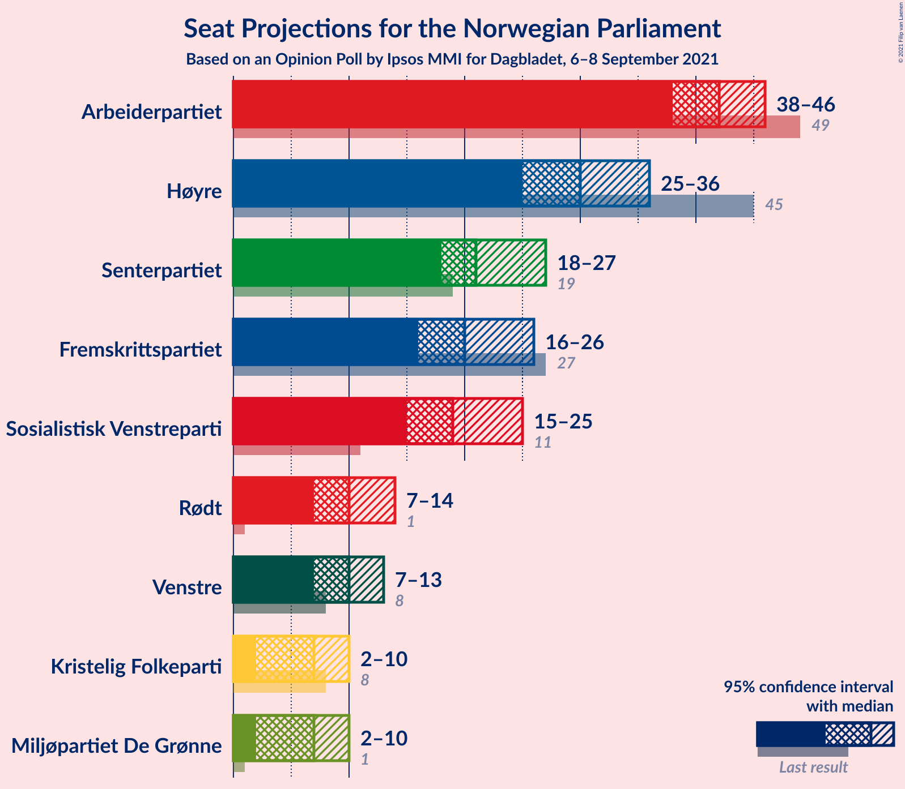
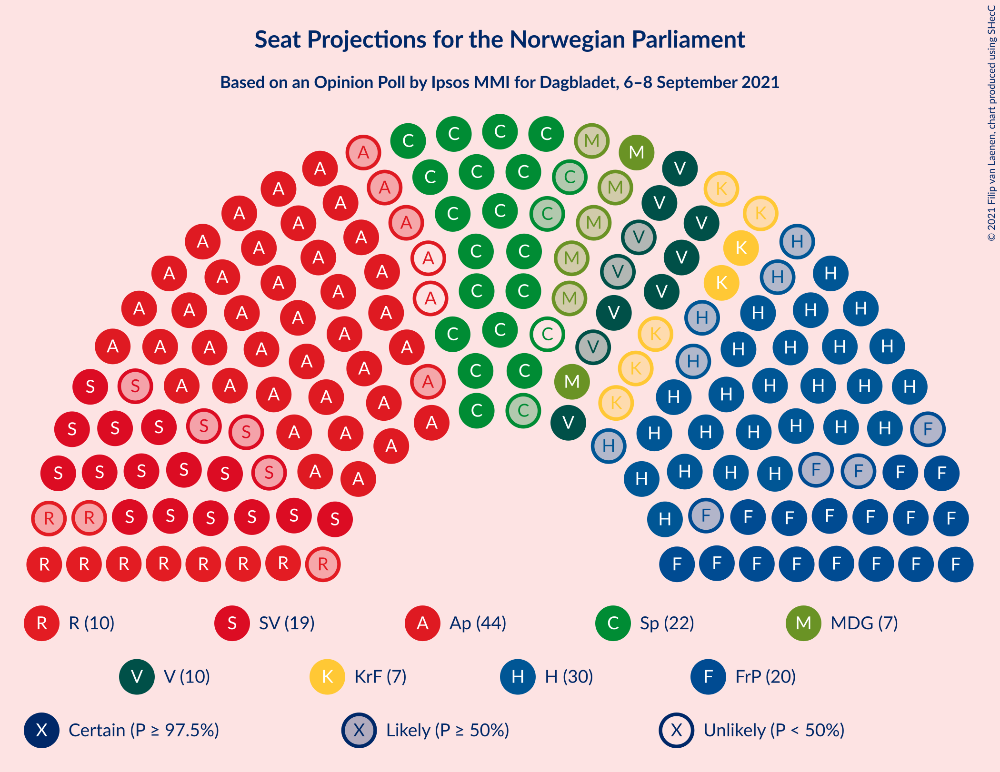
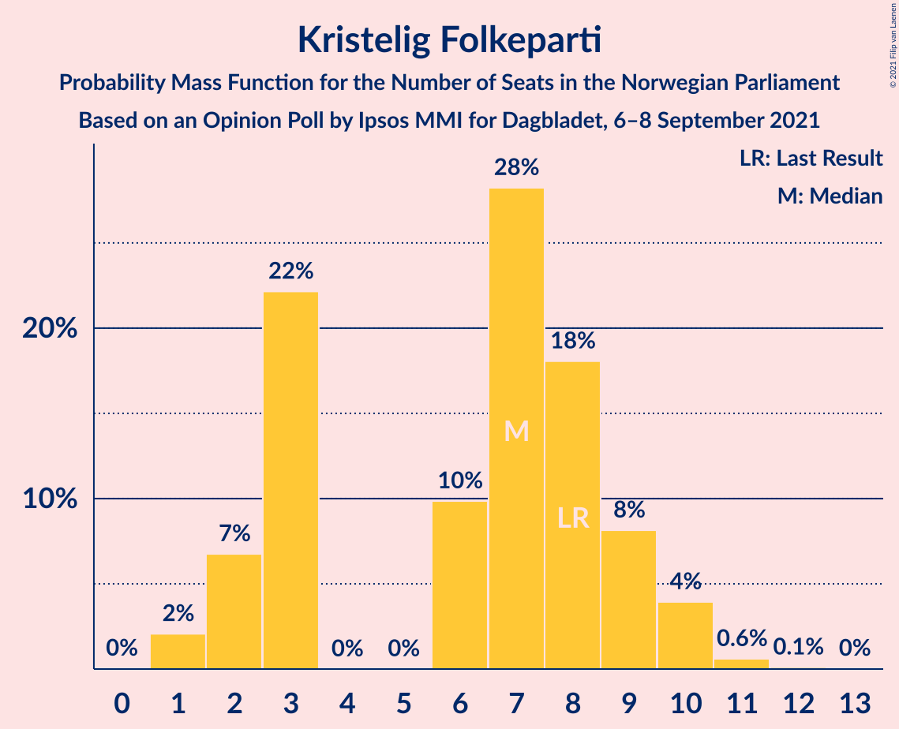
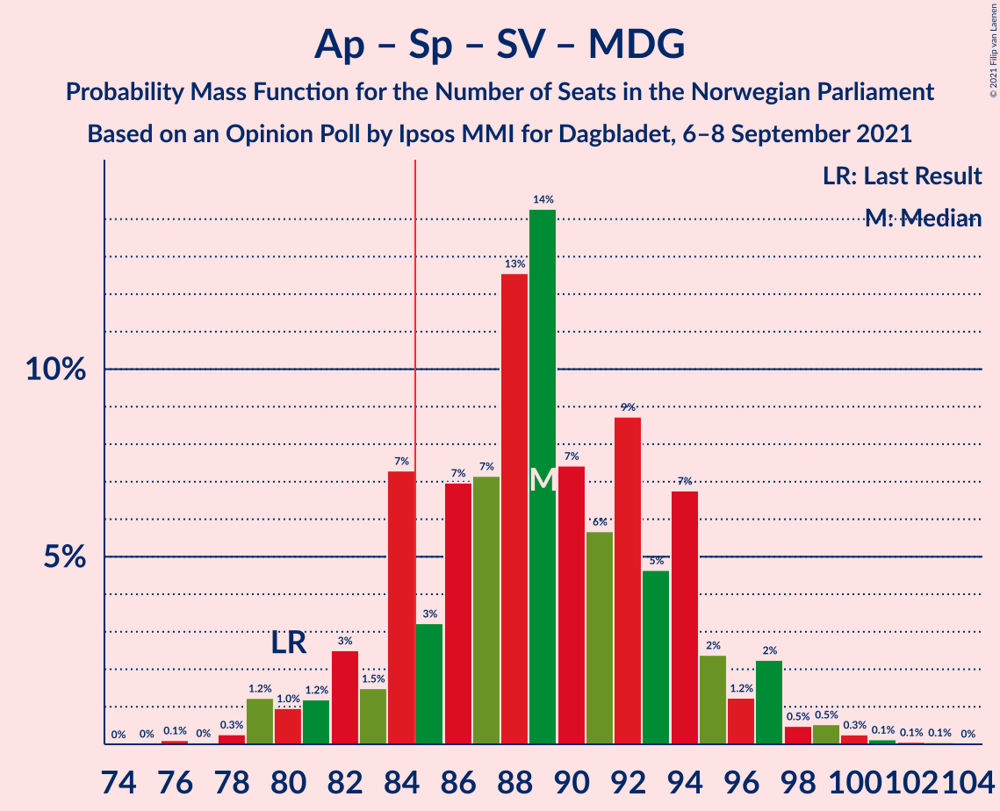
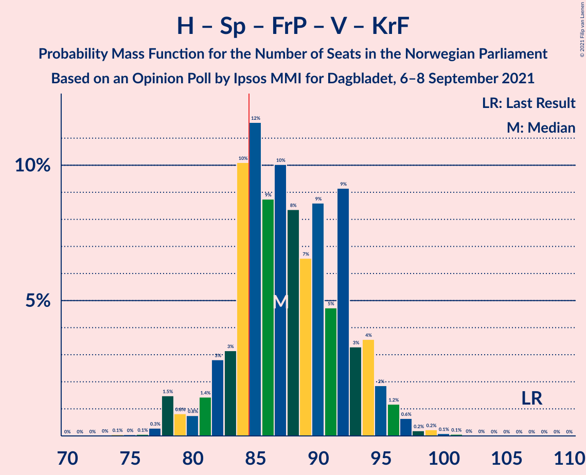
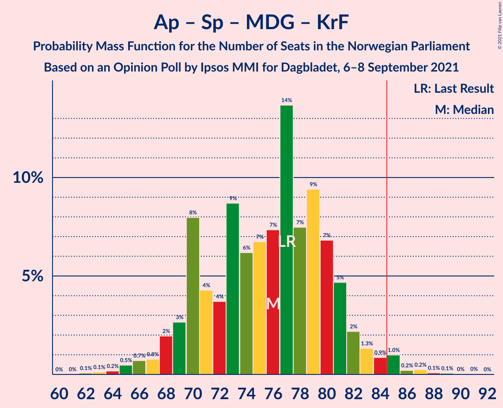
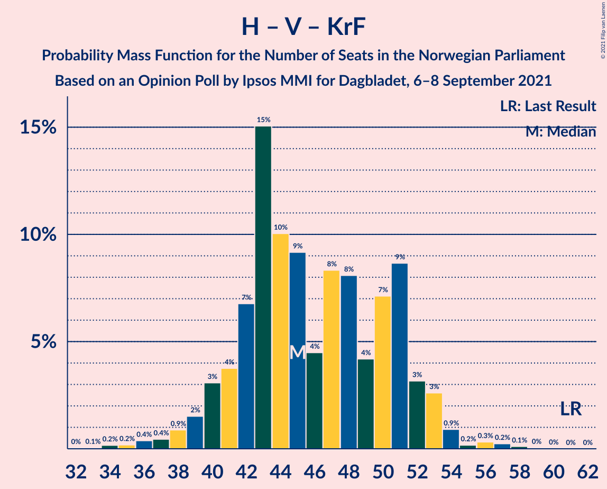

# Opinion Poll by Ipsos MMI for Dagbladet, 6–8 September 2021

<a href="#voting-intentions">Voting Intentions</a> | <a href="#seats">Seats</a> | <a href="#coalitions">Coalitions</a> | <a href="#technical-information">Technical Information</a>

## Voting Intentions

### Confidence Intervals

| Party | Last Result | Poll Result | 80% Confidence Interval | 90% Confidence Interval | 95% Confidence Interval | 99% Confidence Interval |
|:-----:|:-----------:|:-----------:|:-----------------------:|:-----------------------:|:-----------------------:|:-----------------------:|
| Arbeiderpartiet | 27.4% | 22.9% | 20.9–25.0% |20.4–25.6% |19.9–26.1% |19.0–27.1% |
| Høyre | 25.0% | 17.0% | 15.3–18.9% |14.8–19.4% |14.4–19.9% |13.6–20.9% |
| Senterpartiet | 10.3% | 12.2% | 10.7–13.9% |10.3–14.4% |10.0–14.8% |9.3–15.7% |
| Sosialistisk Venstreparti | 6.0% | 11.8% | 10.3–13.5% |10.0–13.9% |9.6–14.4% |9.0–15.2% |
| Fremskrittspartiet | 15.2% | 11.8% | 10.3–13.5% |10.0–13.9% |9.6–14.4% |9.0–15.2% |
| Rødt | 2.4% | 6.0% | 5.0–7.3% |4.7–7.7% |4.5–8.0% |4.1–8.7% |
| Venstre | 4.4% | 6.0% | 5.0–7.3% |4.7–7.7% |4.5–8.0% |4.1–8.7% |
| Miljøpartiet De Grønne | 3.2% | 4.3% | 3.5–5.5% |3.3–5.8% |3.1–6.1% |2.7–6.7% |
| Kristelig Folkeparti | 4.2% | 4.2% | 3.4–5.3% |3.2–5.7% |3.0–5.9% |2.6–6.5% |

*Note:* The poll result column reflects the actual value used in the calculations. Published results may vary slightly, and in addition be rounded to fewer digits.

## Seats

### Confidence Intervals

| Party | Last Result | Median | 80% Confidence Interval | 90% Confidence Interval | 95% Confidence Interval | 99% Confidence Interval |
|:-----:|:-----------:|:------:|:-----------------------:|:-----------------------:|:-----------------------:|:-----------------------:|
| <a href="#arbeiderpartiet">Arbeiderpartiet</a> | 49 | 42 | 40–44 |40–44 |39–46 |36–50 |
| <a href="#høyre">Høyre</a> | 45 | 30 | 27–34 |26–34 |25–36 |22–38 |
| <a href="#senterpartiet">Senterpartiet</a> | 19 | 20 | 20–24 |19–26 |18–27 |17–28 |
| <a href="#sosialistisk-venstreparti">Sosialistisk Venstreparti</a> | 11 | 18 | 16–22 |16–23 |15–25 |14–27 |
| <a href="#fremskrittspartiet">Fremskrittspartiet</a> | 27 | 20 | 17–24 |17–25 |16–27 |14–28 |
| <a href="#rødt">Rødt</a> | 1 | 10 | 9–12 |9–13 |8–14 |7–14 |
| <a href="#venstre">Venstre</a> | 8 | 9 | 8–12 |7–13 |7–13 |2–15 |
| <a href="#miljøpartiet-de-grønne">Miljøpartiet De Grønne</a> | 1 | 7 | 2–9 |2–10 |1–11 |1–11 |
| <a href="#kristelig-folkeparti">Kristelig Folkeparti</a> | 8 | 7 | 3–9 |3–10 |2–10 |1–11 |

### Arbeiderpartiet

*For a full overview of the results for this party, see the [Arbeiderpartiet](party-arbeiderpartiet.html) page.*

| Number of Seats | Probability | Accumulated | Special Marks |
|:---------------:|:-----------:|:-----------:|:-------------:|
| 33 | 0% | 100% |  |
| 34 | 0% | 99.9% |  |
| 35 | 0.2% | 99.9% |  |
| 36 | 0.5% | 99.7% |  |
| 37 | 0.4% | 99.2% |  |
| 38 | 0.8% | 98.8% |  |
| 39 | 2% | 98% |  |
| 40 | 13% | 96% |  |
| 41 | 27% | 84% |  |
| 42 | 16% | 57% | Median |
| 43 | 25% | 41% |  |
| 44 | 11% | 15% |  |
| 45 | 2% | 5% |  |
| 46 | 1.1% | 3% |  |
| 47 | 0.4% | 1.4% |  |
| 48 | 0.2% | 1.0% |  |
| 49 | 0.1% | 0.8% | Last Result |
| 50 | 0.5% | 0.7% |  |
| 51 | 0% | 0.2% |  |
| 52 | 0% | 0.1% |  |
| 53 | 0.1% | 0.1% |  |
| 54 | 0% | 0% |  |

### Høyre

*For a full overview of the results for this party, see the [Høyre](party-høyre.html) page.*

| Number of Seats | Probability | Accumulated | Special Marks |
|:---------------:|:-----------:|:-----------:|:-------------:|
| 21 | 0.1% | 100% |  |
| 22 | 0.4% | 99.8% |  |
| 23 | 0.4% | 99.4% |  |
| 24 | 0.5% | 99.0% |  |
| 25 | 3% | 98% |  |
| 26 | 2% | 96% |  |
| 27 | 5% | 93% |  |
| 28 | 14% | 88% |  |
| 29 | 21% | 75% |  |
| 30 | 7% | 54% | Median |
| 31 | 2% | 47% |  |
| 32 | 12% | 45% |  |
| 33 | 21% | 32% |  |
| 34 | 7% | 11% |  |
| 35 | 2% | 5% |  |
| 36 | 2% | 3% |  |
| 37 | 0.6% | 1.4% |  |
| 38 | 0.7% | 0.8% |  |
| 39 | 0.1% | 0.1% |  |
| 40 | 0% | 0% |  |
| 41 | 0% | 0% |  |
| 42 | 0% | 0% |  |
| 43 | 0% | 0% |  |
| 44 | 0% | 0% |  |
| 45 | 0% | 0% | Last Result |

### Senterpartiet

*For a full overview of the results for this party, see the [Senterpartiet](party-senterpartiet.html) page.*

| Number of Seats | Probability | Accumulated | Special Marks |
|:---------------:|:-----------:|:-----------:|:-------------:|
| 15 | 0% | 100% |  |
| 16 | 0.4% | 99.9% |  |
| 17 | 0.8% | 99.6% |  |
| 18 | 3% | 98.8% |  |
| 19 | 4% | 96% | Last Result |
| 20 | 51% | 92% | Median |
| 21 | 6% | 41% |  |
| 22 | 18% | 35% |  |
| 23 | 3% | 17% |  |
| 24 | 7% | 14% |  |
| 25 | 0.8% | 8% |  |
| 26 | 4% | 7% |  |
| 27 | 0.8% | 3% |  |
| 28 | 2% | 2% |  |
| 29 | 0.1% | 0.2% |  |
| 30 | 0.1% | 0.1% |  |
| 31 | 0% | 0% |  |

### Sosialistisk Venstreparti

*For a full overview of the results for this party, see the [Sosialistisk Venstreparti](party-sosialistiskvenstreparti.html) page.*

| Number of Seats | Probability | Accumulated | Special Marks |
|:---------------:|:-----------:|:-----------:|:-------------:|
| 11 | 0% | 100% | Last Result |
| 12 | 0% | 100% |  |
| 13 | 0.1% | 99.9% |  |
| 14 | 0.4% | 99.9% |  |
| 15 | 2% | 99.4% |  |
| 16 | 25% | 97% |  |
| 17 | 17% | 72% |  |
| 18 | 20% | 55% | Median |
| 19 | 10% | 35% |  |
| 20 | 9% | 25% |  |
| 21 | 3% | 17% |  |
| 22 | 7% | 14% |  |
| 23 | 2% | 6% |  |
| 24 | 2% | 5% |  |
| 25 | 1.1% | 3% |  |
| 26 | 0.8% | 2% |  |
| 27 | 0.7% | 0.9% |  |
| 28 | 0.2% | 0.2% |  |
| 29 | 0% | 0% |  |

### Fremskrittspartiet

*For a full overview of the results for this party, see the [Fremskrittspartiet](party-fremskrittspartiet.html) page.*

| Number of Seats | Probability | Accumulated | Special Marks |
|:---------------:|:-----------:|:-----------:|:-------------:|
| 12 | 0.1% | 100% |  |
| 13 | 0.2% | 99.9% |  |
| 14 | 0.3% | 99.7% |  |
| 15 | 0.4% | 99.5% |  |
| 16 | 2% | 99.1% |  |
| 17 | 10% | 97% |  |
| 18 | 15% | 87% |  |
| 19 | 14% | 72% |  |
| 20 | 21% | 57% | Median |
| 21 | 15% | 36% |  |
| 22 | 2% | 21% |  |
| 23 | 4% | 20% |  |
| 24 | 10% | 16% |  |
| 25 | 2% | 5% |  |
| 26 | 0.7% | 3% |  |
| 27 | 1.4% | 3% | Last Result |
| 28 | 1.3% | 1.4% |  |
| 29 | 0% | 0.1% |  |
| 30 | 0% | 0% |  |

### Rødt

*For a full overview of the results for this party, see the [Rødt](party-rødt.html) page.*

| Number of Seats | Probability | Accumulated | Special Marks |
|:---------------:|:-----------:|:-----------:|:-------------:|
| 1 | 0% | 100% | Last Result |
| 2 | 0.3% | 100% |  |
| 3 | 0% | 99.7% |  |
| 4 | 0% | 99.7% |  |
| 5 | 0% | 99.7% |  |
| 6 | 0.1% | 99.7% |  |
| 7 | 2% | 99.6% |  |
| 8 | 2% | 98% |  |
| 9 | 17% | 96% |  |
| 10 | 50% | 79% | Median |
| 11 | 11% | 28% |  |
| 12 | 11% | 17% |  |
| 13 | 4% | 6% |  |
| 14 | 2% | 3% |  |
| 15 | 0.1% | 0.3% |  |
| 16 | 0.2% | 0.2% |  |
| 17 | 0% | 0% |  |

### Venstre

*For a full overview of the results for this party, see the [Venstre](party-venstre.html) page.*

| Number of Seats | Probability | Accumulated | Special Marks |
|:---------------:|:-----------:|:-----------:|:-------------:|
| 2 | 0.9% | 100% |  |
| 3 | 0% | 99.1% |  |
| 4 | 0% | 99.1% |  |
| 5 | 0% | 99.1% |  |
| 6 | 0.2% | 99.1% |  |
| 7 | 8% | 99.0% |  |
| 8 | 20% | 91% | Last Result |
| 9 | 25% | 70% | Median |
| 10 | 20% | 46% |  |
| 11 | 15% | 25% |  |
| 12 | 5% | 11% |  |
| 13 | 3% | 5% |  |
| 14 | 1.1% | 2% |  |
| 15 | 1.0% | 1.1% |  |
| 16 | 0.1% | 0.1% |  |
| 17 | 0% | 0% |  |

### Miljøpartiet De Grønne

*For a full overview of the results for this party, see the [Miljøpartiet De Grønne](party-miljøpartietdegrønne.html) page.*

| Number of Seats | Probability | Accumulated | Special Marks |
|:---------------:|:-----------:|:-----------:|:-------------:|
| 1 | 3% | 100% | Last Result |
| 2 | 14% | 97% |  |
| 3 | 13% | 83% |  |
| 4 | 0% | 70% |  |
| 5 | 0% | 70% |  |
| 6 | 1.1% | 70% |  |
| 7 | 32% | 68% | Median |
| 8 | 19% | 36% |  |
| 9 | 12% | 18% |  |
| 10 | 0.9% | 6% |  |
| 11 | 5% | 5% |  |
| 12 | 0.1% | 0.1% |  |
| 13 | 0% | 0% |  |

### Kristelig Folkeparti

*For a full overview of the results for this party, see the [Kristelig Folkeparti](party-kristeligfolkeparti.html) page.*

| Number of Seats | Probability | Accumulated | Special Marks |
|:---------------:|:-----------:|:-----------:|:-------------:|
| 1 | 2% | 100% |  |
| 2 | 2% | 98% |  |
| 3 | 18% | 96% |  |
| 4 | 0% | 78% |  |
| 5 | 0% | 78% |  |
| 6 | 20% | 78% |  |
| 7 | 24% | 58% | Median |
| 8 | 17% | 34% | Last Result |
| 9 | 9% | 18% |  |
| 10 | 7% | 8% |  |
| 11 | 1.0% | 1.1% |  |
| 12 | 0.1% | 0.1% |  |
| 13 | 0% | 0% |  |

## Coalitions

### Confidence Intervals

| Coalition | Last Result | Median | Majority? | 80% Confidence Interval | 90% Confidence Interval | 95% Confidence Interval | 99% Confidence Interval |
|:---------:|:-----------:|:------:|:---------:|:-----------------------:|:-----------------------:|:-----------------------:|:-----------------------:|
| Arbeiderpartiet – Senterpartiet – Sosialistisk Venstreparti – Rødt – Miljøpartiet De Grønne | 81 | 97 | 100% | 94–105 | 91–109 | 89–109 | 88–112 |
| Arbeiderpartiet – Senterpartiet – Sosialistisk Venstreparti – Miljøpartiet De Grønne – Kristelig Folkeparti | 88 | 94 | 99.5% | 90–100 | 88–101 | 88–102 | 84–106 |
| Arbeiderpartiet – Senterpartiet – Sosialistisk Venstreparti – Rødt | 80 | 91 | 98% | 87–98 | 86–100 | 86–101 | 83–105 |
| Arbeiderpartiet – Senterpartiet – Sosialistisk Venstreparti – Miljøpartiet De Grønne | 80 | 86 | 70% | 84–94 | 82–97 | 80–97 | 78–99 |
| Høyre – Senterpartiet – Fremskrittspartiet – Venstre – Kristelig Folkeparti | 107 | 88 | 76% | 83–93 | 80–94 | 79–95 | 77–98 |
| Arbeiderpartiet – Senterpartiet – Sosialistisk Venstreparti | 79 | 81 | 24% | 77–87 | 77–88 | 76–90 | 74–93 |
| Arbeiderpartiet – Sosialistisk Venstreparti – Rødt – Miljøpartiet De Grønne | 62 | 75 | 8% | 73–83 | 71–85 | 70–86 | 69–89 |
| Arbeiderpartiet – Senterpartiet – Miljøpartiet De Grønne – Kristelig Folkeparti | 77 | 76 | 3% | 71–81 | 69–83 | 68–85 | 64–86 |
| Høyre – Fremskrittspartiet – Venstre – Miljøpartiet De Grønne – Kristelig Folkeparti | 89 | 74 | 0% | 67–78 | 65–79 | 65–80 | 61–82 |
| Arbeiderpartiet – Senterpartiet – Kristelig Folkeparti | 76 | 69 | 0% | 66–73 | 65–75 | 63–78 | 60–79 |
| Høyre – Fremskrittspartiet – Venstre – Kristelig Folkeparti | 88 | 67 | 0% | 60–72 | 59–73 | 59–74 | 56–77 |
| Arbeiderpartiet – Senterpartiet | 68 | 62 | 0% | 61–67 | 59–69 | 59–70 | 56–72 |
| Arbeiderpartiet – Sosialistisk Venstreparti | 60 | 60 | 0% | 57–64 | 57–67 | 56–69 | 55–71 |
| Høyre – Fremskrittspartiet – Venstre | 80 | 60 | 0% | 56–65 | 56–67 | 54–68 | 51–70 |
| Høyre – Fremskrittspartiet | 72 | 51 | 0% | 46–55 | 45–56 | 45–57 | 42–60 |
| Høyre – Venstre – Kristelig Folkeparti | 61 | 48 | 0% | 41–51 | 39–51 | 39–53 | 37–56 |
| Senterpartiet – Venstre – Kristelig Folkeparti | 35 | 36 | 0% | 34–41 | 31–42 | 31–44 | 29–46 |

### Arbeiderpartiet – Senterpartiet – Sosialistisk Venstreparti – Rødt – Miljøpartiet De Grønne

| Number of Seats | Probability | Accumulated | Special Marks |
|:---------------:|:-----------:|:-----------:|:-------------:|
| 81 | 0% | 100% | Last Result |
| 82 | 0% | 100% |  |
| 83 | 0% | 100% |  |
| 84 | 0% | 100% |  |
| 85 | 0% | 100% | Majority |
| 86 | 0% | 100% |  |
| 87 | 0% | 100% |  |
| 88 | 2% | 99.9% |  |
| 89 | 0.9% | 98% |  |
| 90 | 0.2% | 97% |  |
| 91 | 3% | 97% |  |
| 92 | 1.2% | 94% |  |
| 93 | 0.8% | 93% |  |
| 94 | 22% | 93% |  |
| 95 | 5% | 71% |  |
| 96 | 8% | 65% |  |
| 97 | 12% | 57% | Median |
| 98 | 10% | 45% |  |
| 99 | 7% | 35% |  |
| 100 | 1.0% | 27% |  |
| 101 | 3% | 26% |  |
| 102 | 8% | 24% |  |
| 103 | 5% | 16% |  |
| 104 | 0.8% | 11% |  |
| 105 | 0.6% | 10% |  |
| 106 | 0.9% | 10% |  |
| 107 | 3% | 9% |  |
| 108 | 1.0% | 6% |  |
| 109 | 3% | 5% |  |
| 110 | 2% | 2% |  |
| 111 | 0.1% | 0.7% |  |
| 112 | 0.5% | 0.6% |  |
| 113 | 0% | 0.1% |  |
| 114 | 0% | 0% |  |

### Arbeiderpartiet – Senterpartiet – Sosialistisk Venstreparti – Miljøpartiet De Grønne – Kristelig Folkeparti

| Number of Seats | Probability | Accumulated | Special Marks |
|:---------------:|:-----------:|:-----------:|:-------------:|
| 79 | 0.1% | 100% |  |
| 80 | 0% | 99.9% |  |
| 81 | 0.1% | 99.9% |  |
| 82 | 0.1% | 99.9% |  |
| 83 | 0% | 99.8% |  |
| 84 | 0.2% | 99.7% |  |
| 85 | 2% | 99.5% | Majority |
| 86 | 0.1% | 98% |  |
| 87 | 0.2% | 98% |  |
| 88 | 3% | 98% | Last Result |
| 89 | 3% | 94% |  |
| 90 | 16% | 92% |  |
| 91 | 3% | 76% |  |
| 92 | 1.4% | 73% |  |
| 93 | 20% | 71% |  |
| 94 | 5% | 52% | Median |
| 95 | 16% | 46% |  |
| 96 | 6% | 30% |  |
| 97 | 3% | 24% |  |
| 98 | 3% | 20% |  |
| 99 | 3% | 17% |  |
| 100 | 8% | 15% |  |
| 101 | 3% | 7% |  |
| 102 | 3% | 4% |  |
| 103 | 0.2% | 1.0% |  |
| 104 | 0.2% | 0.9% |  |
| 105 | 0.2% | 0.7% |  |
| 106 | 0.1% | 0.5% |  |
| 107 | 0.3% | 0.4% |  |
| 108 | 0% | 0.1% |  |
| 109 | 0% | 0% |  |

### Arbeiderpartiet – Senterpartiet – Sosialistisk Venstreparti – Rødt

| Number of Seats | Probability | Accumulated | Special Marks |
|:---------------:|:-----------:|:-----------:|:-------------:|
| 80 | 0% | 100% | Last Result |
| 81 | 0% | 100% |  |
| 82 | 0.1% | 100% |  |
| 83 | 1.4% | 99.9% |  |
| 84 | 0.3% | 98% |  |
| 85 | 0.2% | 98% | Majority |
| 86 | 6% | 98% |  |
| 87 | 16% | 92% |  |
| 88 | 0.3% | 76% |  |
| 89 | 10% | 76% |  |
| 90 | 15% | 66% | Median |
| 91 | 10% | 51% |  |
| 92 | 3% | 41% |  |
| 93 | 3% | 38% |  |
| 94 | 11% | 35% |  |
| 95 | 2% | 24% |  |
| 96 | 5% | 23% |  |
| 97 | 4% | 18% |  |
| 98 | 6% | 14% |  |
| 99 | 2% | 8% |  |
| 100 | 2% | 6% |  |
| 101 | 2% | 4% |  |
| 102 | 0.5% | 2% |  |
| 103 | 0.7% | 2% |  |
| 104 | 0.5% | 1.1% |  |
| 105 | 0.5% | 0.5% |  |
| 106 | 0% | 0.1% |  |
| 107 | 0% | 0% |  |

### Arbeiderpartiet – Senterpartiet – Sosialistisk Venstreparti – Miljøpartiet De Grønne

| Number of Seats | Probability | Accumulated | Special Marks |
|:---------------:|:-----------:|:-----------:|:-------------:|
| 76 | 0.1% | 100% |  |
| 77 | 0% | 99.9% |  |
| 78 | 2% | 99.9% |  |
| 79 | 0.1% | 98% |  |
| 80 | 1.3% | 98% | Last Result |
| 81 | 1.3% | 97% |  |
| 82 | 2% | 96% |  |
| 83 | 1.4% | 93% |  |
| 84 | 22% | 92% |  |
| 85 | 1.0% | 70% | Majority |
| 86 | 19% | 69% |  |
| 87 | 5% | 49% | Median |
| 88 | 15% | 45% |  |
| 89 | 3% | 30% |  |
| 90 | 3% | 27% |  |
| 91 | 2% | 24% |  |
| 92 | 6% | 22% |  |
| 93 | 3% | 16% |  |
| 94 | 5% | 13% |  |
| 95 | 0.2% | 9% |  |
| 96 | 1.2% | 9% |  |
| 97 | 6% | 7% |  |
| 98 | 0.6% | 2% |  |
| 99 | 0.5% | 0.9% |  |
| 100 | 0.2% | 0.4% |  |
| 101 | 0.1% | 0.2% |  |
| 102 | 0% | 0.1% |  |
| 103 | 0% | 0.1% |  |
| 104 | 0% | 0% |  |

### Høyre – Senterpartiet – Fremskrittspartiet – Venstre – Kristelig Folkeparti

| Number of Seats | Probability | Accumulated | Special Marks |
|:---------------:|:-----------:|:-----------:|:-------------:|
| 73 | 0.1% | 100% |  |
| 74 | 0.1% | 99.9% |  |
| 75 | 0.1% | 99.8% |  |
| 76 | 0% | 99.8% |  |
| 77 | 0.3% | 99.7% |  |
| 78 | 0.1% | 99.5% |  |
| 79 | 4% | 99.4% |  |
| 80 | 0.7% | 95% |  |
| 81 | 0.5% | 95% |  |
| 82 | 2% | 94% |  |
| 83 | 4% | 92% |  |
| 84 | 12% | 88% |  |
| 85 | 6% | 76% | Majority |
| 86 | 1.4% | 70% | Median |
| 87 | 11% | 68% |  |
| 88 | 19% | 57% |  |
| 89 | 10% | 38% |  |
| 90 | 4% | 29% |  |
| 91 | 4% | 25% |  |
| 92 | 10% | 21% |  |
| 93 | 2% | 11% |  |
| 94 | 6% | 9% |  |
| 95 | 1.3% | 4% |  |
| 96 | 2% | 2% |  |
| 97 | 0.1% | 0.7% |  |
| 98 | 0.1% | 0.6% |  |
| 99 | 0.4% | 0.5% |  |
| 100 | 0% | 0.1% |  |
| 101 | 0% | 0% |  |
| 102 | 0% | 0% |  |
| 103 | 0% | 0% |  |
| 104 | 0% | 0% |  |
| 105 | 0% | 0% |  |
| 106 | 0% | 0% |  |
| 107 | 0% | 0% | Last Result |

### Arbeiderpartiet – Senterpartiet – Sosialistisk Venstreparti

| Number of Seats | Probability | Accumulated | Special Marks |
|:---------------:|:-----------:|:-----------:|:-------------:|
| 72 | 0.1% | 100% |  |
| 73 | 0% | 99.9% |  |
| 74 | 2% | 99.8% |  |
| 75 | 0.3% | 98% |  |
| 76 | 2% | 98% |  |
| 77 | 18% | 96% |  |
| 78 | 3% | 78% |  |
| 79 | 10% | 75% | Last Result |
| 80 | 9% | 64% | Median |
| 81 | 14% | 56% |  |
| 82 | 5% | 41% |  |
| 83 | 7% | 36% |  |
| 84 | 6% | 29% |  |
| 85 | 5% | 24% | Majority |
| 86 | 6% | 18% |  |
| 87 | 5% | 13% |  |
| 88 | 4% | 8% |  |
| 89 | 0.6% | 4% |  |
| 90 | 1.3% | 3% |  |
| 91 | 0.4% | 2% |  |
| 92 | 0.8% | 1.4% |  |
| 93 | 0.2% | 0.5% |  |
| 94 | 0.2% | 0.3% |  |
| 95 | 0.1% | 0.1% |  |
| 96 | 0% | 0% |  |

### Arbeiderpartiet – Sosialistisk Venstreparti – Rødt – Miljøpartiet De Grønne

| Number of Seats | Probability | Accumulated | Special Marks |
|:---------------:|:-----------:|:-----------:|:-------------:|
| 62 | 0% | 100% | Last Result |
| 63 | 0% | 100% |  |
| 64 | 0% | 100% |  |
| 65 | 0.2% | 100% |  |
| 66 | 0% | 99.8% |  |
| 67 | 0.1% | 99.8% |  |
| 68 | 0.2% | 99.7% |  |
| 69 | 0.9% | 99.5% |  |
| 70 | 2% | 98.6% |  |
| 71 | 2% | 96% |  |
| 72 | 2% | 95% |  |
| 73 | 3% | 92% |  |
| 74 | 30% | 90% |  |
| 75 | 10% | 60% |  |
| 76 | 3% | 50% |  |
| 77 | 12% | 47% | Median |
| 78 | 11% | 35% |  |
| 79 | 4% | 24% |  |
| 80 | 2% | 20% |  |
| 81 | 0.6% | 19% |  |
| 82 | 7% | 18% |  |
| 83 | 1.2% | 11% |  |
| 84 | 1.1% | 9% |  |
| 85 | 4% | 8% | Majority |
| 86 | 2% | 4% |  |
| 87 | 1.4% | 2% |  |
| 88 | 0.4% | 0.9% |  |
| 89 | 0.2% | 0.6% |  |
| 90 | 0.4% | 0.4% |  |
| 91 | 0% | 0% |  |

### Arbeiderpartiet – Senterpartiet – Miljøpartiet De Grønne – Kristelig Folkeparti

| Number of Seats | Probability | Accumulated | Special Marks |
|:---------------:|:-----------:|:-----------:|:-------------:|
| 59 | 0.1% | 100% |  |
| 60 | 0% | 99.9% |  |
| 61 | 0% | 99.9% |  |
| 62 | 0.1% | 99.9% |  |
| 63 | 0.2% | 99.8% |  |
| 64 | 0.1% | 99.6% |  |
| 65 | 0.1% | 99.5% |  |
| 66 | 0.3% | 99.4% |  |
| 67 | 0.1% | 99.1% |  |
| 68 | 2% | 98.9% |  |
| 69 | 3% | 97% |  |
| 70 | 2% | 94% |  |
| 71 | 2% | 91% |  |
| 72 | 2% | 90% |  |
| 73 | 7% | 88% |  |
| 74 | 19% | 82% |  |
| 75 | 10% | 63% |  |
| 76 | 16% | 53% | Median |
| 77 | 8% | 37% | Last Result |
| 78 | 7% | 29% |  |
| 79 | 8% | 22% |  |
| 80 | 3% | 14% |  |
| 81 | 4% | 11% |  |
| 82 | 1.1% | 6% |  |
| 83 | 0.7% | 5% |  |
| 84 | 2% | 4% |  |
| 85 | 2% | 3% | Majority |
| 86 | 0.2% | 0.5% |  |
| 87 | 0.2% | 0.3% |  |
| 88 | 0.1% | 0.2% |  |
| 89 | 0% | 0.1% |  |
| 90 | 0% | 0% |  |

### Høyre – Fremskrittspartiet – Venstre – Miljøpartiet De Grønne – Kristelig Folkeparti

| Number of Seats | Probability | Accumulated | Special Marks |
|:---------------:|:-----------:|:-----------:|:-------------:|
| 58 | 0.2% | 100% |  |
| 59 | 0.1% | 99.8% |  |
| 60 | 0.2% | 99.7% |  |
| 61 | 1.0% | 99.6% |  |
| 62 | 0.1% | 98.6% |  |
| 63 | 0.1% | 98% |  |
| 64 | 0.8% | 98% |  |
| 65 | 4% | 98% |  |
| 66 | 1.5% | 94% |  |
| 67 | 5% | 92% |  |
| 68 | 3% | 87% |  |
| 69 | 2% | 85% |  |
| 70 | 9% | 83% |  |
| 71 | 9% | 73% |  |
| 72 | 9% | 65% |  |
| 73 | 5% | 56% | Median |
| 74 | 9% | 51% |  |
| 75 | 21% | 42% |  |
| 76 | 4% | 21% |  |
| 77 | 6% | 17% |  |
| 78 | 1.3% | 11% |  |
| 79 | 6% | 10% |  |
| 80 | 3% | 4% |  |
| 81 | 0.1% | 0.7% |  |
| 82 | 0.2% | 0.6% |  |
| 83 | 0.2% | 0.4% |  |
| 84 | 0.2% | 0.2% |  |
| 85 | 0% | 0% | Majority |
| 86 | 0% | 0% |  |
| 87 | 0% | 0% |  |
| 88 | 0% | 0% |  |
| 89 | 0% | 0% | Last Result |

### Arbeiderpartiet – Senterpartiet – Kristelig Folkeparti

| Number of Seats | Probability | Accumulated | Special Marks |
|:---------------:|:-----------:|:-----------:|:-------------:|
| 57 | 0.1% | 100% |  |
| 58 | 0.1% | 99.9% |  |
| 59 | 0% | 99.8% |  |
| 60 | 0.2% | 99.7% |  |
| 61 | 0.5% | 99.5% |  |
| 62 | 0.8% | 98.9% |  |
| 63 | 0.8% | 98% |  |
| 64 | 0.7% | 97% |  |
| 65 | 5% | 97% |  |
| 66 | 4% | 91% |  |
| 67 | 20% | 88% |  |
| 68 | 3% | 68% |  |
| 69 | 22% | 65% | Median |
| 70 | 7% | 43% |  |
| 71 | 1.4% | 36% |  |
| 72 | 16% | 34% |  |
| 73 | 10% | 18% |  |
| 74 | 2% | 8% |  |
| 75 | 2% | 6% |  |
| 76 | 1.1% | 5% | Last Result |
| 77 | 0.4% | 4% |  |
| 78 | 3% | 3% |  |
| 79 | 0.3% | 0.5% |  |
| 80 | 0.1% | 0.2% |  |
| 81 | 0.1% | 0.1% |  |
| 82 | 0% | 0.1% |  |
| 83 | 0% | 0% |  |

### Høyre – Fremskrittspartiet – Venstre – Kristelig Folkeparti

| Number of Seats | Probability | Accumulated | Special Marks |
|:---------------:|:-----------:|:-----------:|:-------------:|
| 52 | 0.1% | 100% |  |
| 53 | 0.1% | 99.8% |  |
| 54 | 0.1% | 99.8% |  |
| 55 | 0.1% | 99.7% |  |
| 56 | 0.2% | 99.6% |  |
| 57 | 0.7% | 99.4% |  |
| 58 | 0.3% | 98.8% |  |
| 59 | 6% | 98% |  |
| 60 | 4% | 92% |  |
| 61 | 1.1% | 88% |  |
| 62 | 4% | 87% |  |
| 63 | 6% | 83% |  |
| 64 | 9% | 78% |  |
| 65 | 2% | 68% |  |
| 66 | 5% | 66% | Median |
| 67 | 17% | 62% |  |
| 68 | 20% | 45% |  |
| 69 | 2% | 24% |  |
| 70 | 3% | 23% |  |
| 71 | 3% | 20% |  |
| 72 | 12% | 17% |  |
| 73 | 2% | 5% |  |
| 74 | 2% | 3% |  |
| 75 | 0.6% | 2% |  |
| 76 | 0.1% | 1.0% |  |
| 77 | 0.4% | 0.9% |  |
| 78 | 0.4% | 0.5% |  |
| 79 | 0% | 0% |  |
| 80 | 0% | 0% |  |
| 81 | 0% | 0% |  |
| 82 | 0% | 0% |  |
| 83 | 0% | 0% |  |
| 84 | 0% | 0% |  |
| 85 | 0% | 0% | Majority |
| 86 | 0% | 0% |  |
| 87 | 0% | 0% |  |
| 88 | 0% | 0% | Last Result |

### Arbeiderpartiet – Senterpartiet

| Number of Seats | Probability | Accumulated | Special Marks |
|:---------------:|:-----------:|:-----------:|:-------------:|
| 54 | 0.1% | 100% |  |
| 55 | 0.1% | 99.9% |  |
| 56 | 0.5% | 99.7% |  |
| 57 | 0.4% | 99.2% |  |
| 58 | 0.3% | 98.8% |  |
| 59 | 5% | 98.5% |  |
| 60 | 2% | 94% |  |
| 61 | 21% | 92% |  |
| 62 | 21% | 71% | Median |
| 63 | 16% | 50% |  |
| 64 | 7% | 34% |  |
| 65 | 10% | 27% |  |
| 66 | 6% | 17% |  |
| 67 | 5% | 11% |  |
| 68 | 0.9% | 7% | Last Result |
| 69 | 1.5% | 6% |  |
| 70 | 3% | 4% |  |
| 71 | 0.7% | 1.3% |  |
| 72 | 0.2% | 0.6% |  |
| 73 | 0.2% | 0.4% |  |
| 74 | 0.1% | 0.2% |  |
| 75 | 0.1% | 0.1% |  |
| 76 | 0% | 0% |  |

### Arbeiderpartiet – Sosialistisk Venstreparti

| Number of Seats | Probability | Accumulated | Special Marks |
|:---------------:|:-----------:|:-----------:|:-------------:|
| 51 | 0% | 100% |  |
| 52 | 0% | 99.9% |  |
| 53 | 0.1% | 99.9% |  |
| 54 | 0.1% | 99.8% |  |
| 55 | 2% | 99.7% |  |
| 56 | 0.6% | 98% |  |
| 57 | 27% | 97% |  |
| 58 | 4% | 70% |  |
| 59 | 9% | 66% |  |
| 60 | 12% | 57% | Last Result, Median |
| 61 | 13% | 45% |  |
| 62 | 9% | 32% |  |
| 63 | 11% | 23% |  |
| 64 | 5% | 13% |  |
| 65 | 2% | 8% |  |
| 66 | 0.4% | 6% |  |
| 67 | 2% | 5% |  |
| 68 | 0.6% | 3% |  |
| 69 | 0.8% | 3% |  |
| 70 | 0.3% | 2% |  |
| 71 | 1.2% | 2% |  |
| 72 | 0.2% | 0.3% |  |
| 73 | 0.1% | 0.1% |  |
| 74 | 0% | 0% |  |

### Høyre – Fremskrittspartiet – Venstre

| Number of Seats | Probability | Accumulated | Special Marks |
|:---------------:|:-----------:|:-----------:|:-------------:|
| 44 | 0.1% | 100% |  |
| 45 | 0.1% | 99.9% |  |
| 46 | 0% | 99.9% |  |
| 47 | 0% | 99.9% |  |
| 48 | 0% | 99.9% |  |
| 49 | 0% | 99.8% |  |
| 50 | 0.1% | 99.8% |  |
| 51 | 0.2% | 99.7% |  |
| 52 | 0.6% | 99.4% |  |
| 53 | 0.8% | 98.8% |  |
| 54 | 2% | 98% |  |
| 55 | 1.1% | 96% |  |
| 56 | 8% | 95% |  |
| 57 | 14% | 87% |  |
| 58 | 12% | 73% |  |
| 59 | 4% | 61% | Median |
| 60 | 14% | 57% |  |
| 61 | 3% | 43% |  |
| 62 | 22% | 40% |  |
| 63 | 2% | 17% |  |
| 64 | 1.1% | 15% |  |
| 65 | 6% | 14% |  |
| 66 | 2% | 8% |  |
| 67 | 2% | 5% |  |
| 68 | 1.4% | 3% |  |
| 69 | 0.7% | 2% |  |
| 70 | 0.8% | 1.1% |  |
| 71 | 0.1% | 0.3% |  |
| 72 | 0.1% | 0.2% |  |
| 73 | 0% | 0.1% |  |
| 74 | 0% | 0% |  |
| 75 | 0% | 0% |  |
| 76 | 0% | 0% |  |
| 77 | 0% | 0% |  |
| 78 | 0% | 0% |  |
| 79 | 0% | 0% |  |
| 80 | 0% | 0% | Last Result |

### Høyre – Fremskrittspartiet

| Number of Seats | Probability | Accumulated | Special Marks |
|:---------------:|:-----------:|:-----------:|:-------------:|
| 35 | 0.1% | 100% |  |
| 36 | 0% | 99.9% |  |
| 37 | 0% | 99.9% |  |
| 38 | 0% | 99.9% |  |
| 39 | 0% | 99.9% |  |
| 40 | 0.1% | 99.9% |  |
| 41 | 0.2% | 99.8% |  |
| 42 | 0.3% | 99.6% |  |
| 43 | 0.1% | 99.3% |  |
| 44 | 0.6% | 99.2% |  |
| 45 | 6% | 98.6% |  |
| 46 | 7% | 92% |  |
| 47 | 2% | 85% |  |
| 48 | 13% | 83% |  |
| 49 | 10% | 70% |  |
| 50 | 8% | 60% | Median |
| 51 | 6% | 52% |  |
| 52 | 8% | 46% |  |
| 53 | 23% | 38% |  |
| 54 | 2% | 15% |  |
| 55 | 6% | 13% |  |
| 56 | 3% | 7% |  |
| 57 | 2% | 4% |  |
| 58 | 0.1% | 2% |  |
| 59 | 0.8% | 2% |  |
| 60 | 0.9% | 1.1% |  |
| 61 | 0.2% | 0.2% |  |
| 62 | 0% | 0.1% |  |
| 63 | 0% | 0% |  |
| 64 | 0% | 0% |  |
| 65 | 0% | 0% |  |
| 66 | 0% | 0% |  |
| 67 | 0% | 0% |  |
| 68 | 0% | 0% |  |
| 69 | 0% | 0% |  |
| 70 | 0% | 0% |  |
| 71 | 0% | 0% |  |
| 72 | 0% | 0% | Last Result |

### Høyre – Venstre – Kristelig Folkeparti

| Number of Seats | Probability | Accumulated | Special Marks |
|:---------------:|:-----------:|:-----------:|:-------------:|
| 33 | 0% | 100% |  |
| 34 | 0% | 99.9% |  |
| 35 | 0.1% | 99.9% |  |
| 36 | 0.3% | 99.8% |  |
| 37 | 0.5% | 99.5% |  |
| 38 | 1.0% | 99.1% |  |
| 39 | 5% | 98% |  |
| 40 | 1.1% | 93% |  |
| 41 | 4% | 92% |  |
| 42 | 5% | 88% |  |
| 43 | 12% | 83% |  |
| 44 | 2% | 72% |  |
| 45 | 6% | 70% |  |
| 46 | 3% | 64% | Median |
| 47 | 10% | 61% |  |
| 48 | 24% | 51% |  |
| 49 | 8% | 27% |  |
| 50 | 3% | 18% |  |
| 51 | 11% | 15% |  |
| 52 | 1.0% | 5% |  |
| 53 | 2% | 4% |  |
| 54 | 1.2% | 2% |  |
| 55 | 0.1% | 0.7% |  |
| 56 | 0.4% | 0.6% |  |
| 57 | 0.2% | 0.2% |  |
| 58 | 0% | 0% |  |
| 59 | 0% | 0% |  |
| 60 | 0% | 0% |  |
| 61 | 0% | 0% | Last Result |

### Senterpartiet – Venstre – Kristelig Folkeparti

| Number of Seats | Probability | Accumulated | Special Marks |
|:---------------:|:-----------:|:-----------:|:-------------:|
| 27 | 0% | 100% |  |
| 28 | 0.2% | 99.9% |  |
| 29 | 0.4% | 99.7% |  |
| 30 | 0.7% | 99.3% |  |
| 31 | 4% | 98.6% |  |
| 32 | 0.6% | 95% |  |
| 33 | 3% | 94% |  |
| 34 | 3% | 91% |  |
| 35 | 23% | 88% | Last Result |
| 36 | 15% | 65% | Median |
| 37 | 7% | 50% |  |
| 38 | 9% | 43% |  |
| 39 | 14% | 33% |  |
| 40 | 5% | 19% |  |
| 41 | 6% | 15% |  |
| 42 | 4% | 8% |  |
| 43 | 0.7% | 4% |  |
| 44 | 2% | 4% |  |
| 45 | 0.2% | 1.4% |  |
| 46 | 0.8% | 1.2% |  |
| 47 | 0.3% | 0.4% |  |
| 48 | 0% | 0.1% |  |
| 49 | 0.1% | 0.1% |  |
| 50 | 0% | 0% |  |

## Technical Information

### Opinion Poll

+ **Polling firm:** Ipsos MMI
+ **Commissioner(s):** Dagbladet
+ **Fieldwork period:** 6–8 September 2021

### Calculations

+ **Sample size:** 713
+ **Simulations done:** 131,072
+ **Error estimate:** 1.49%

