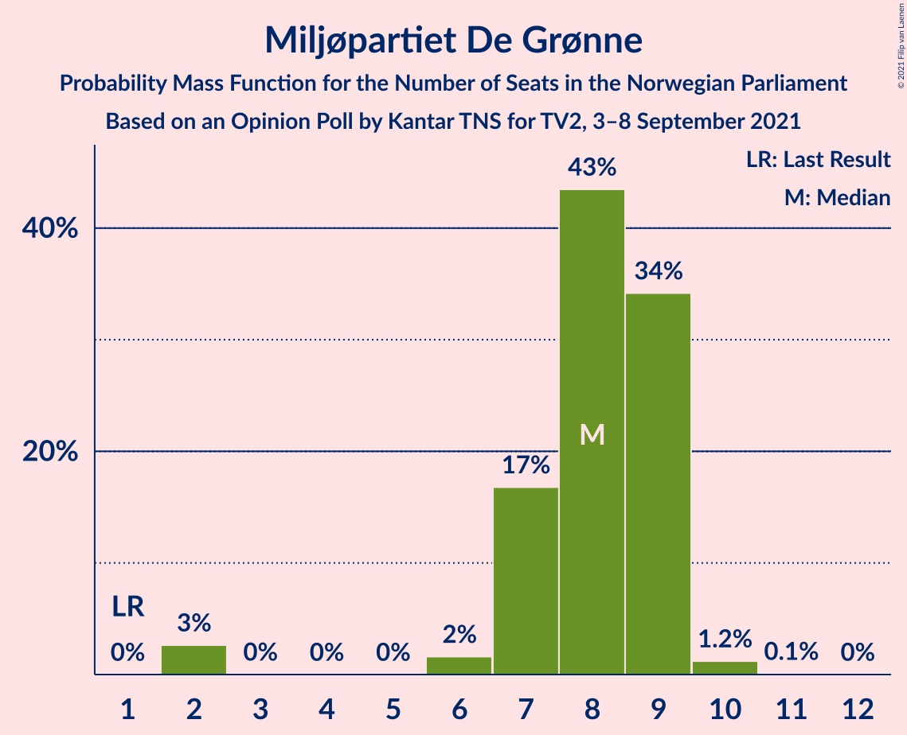
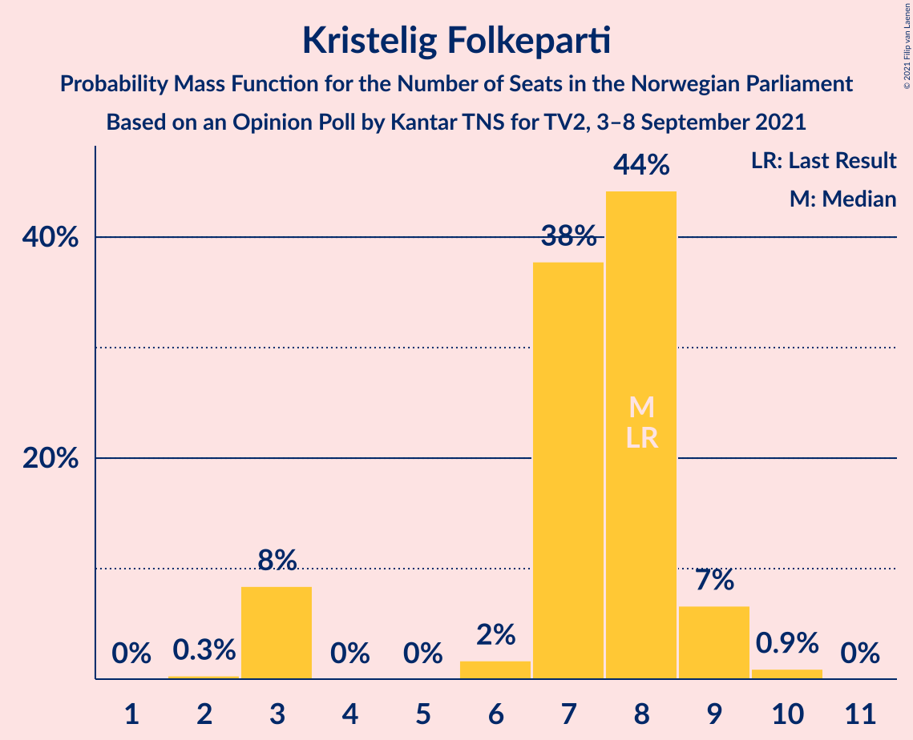
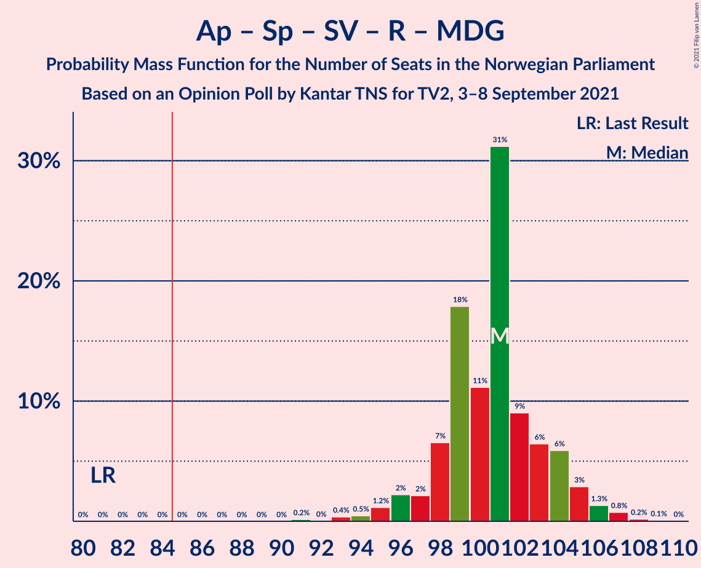
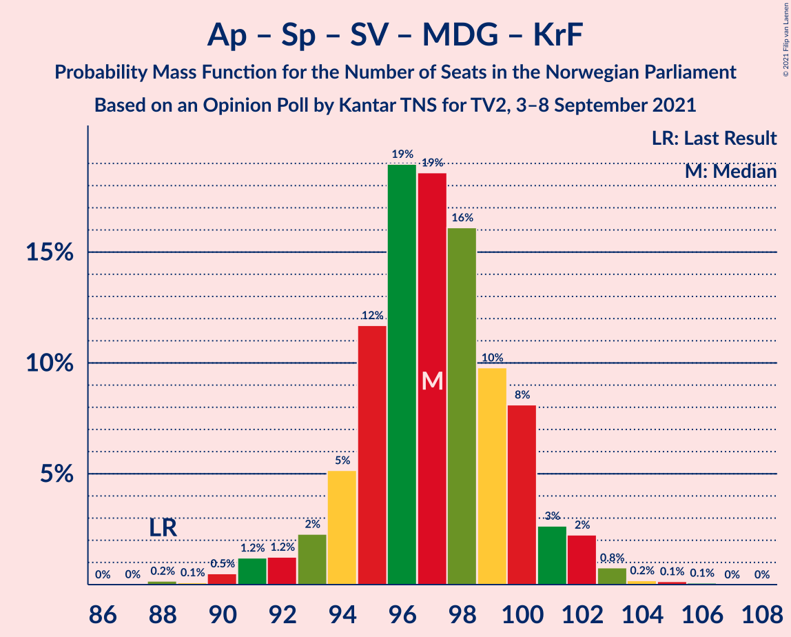
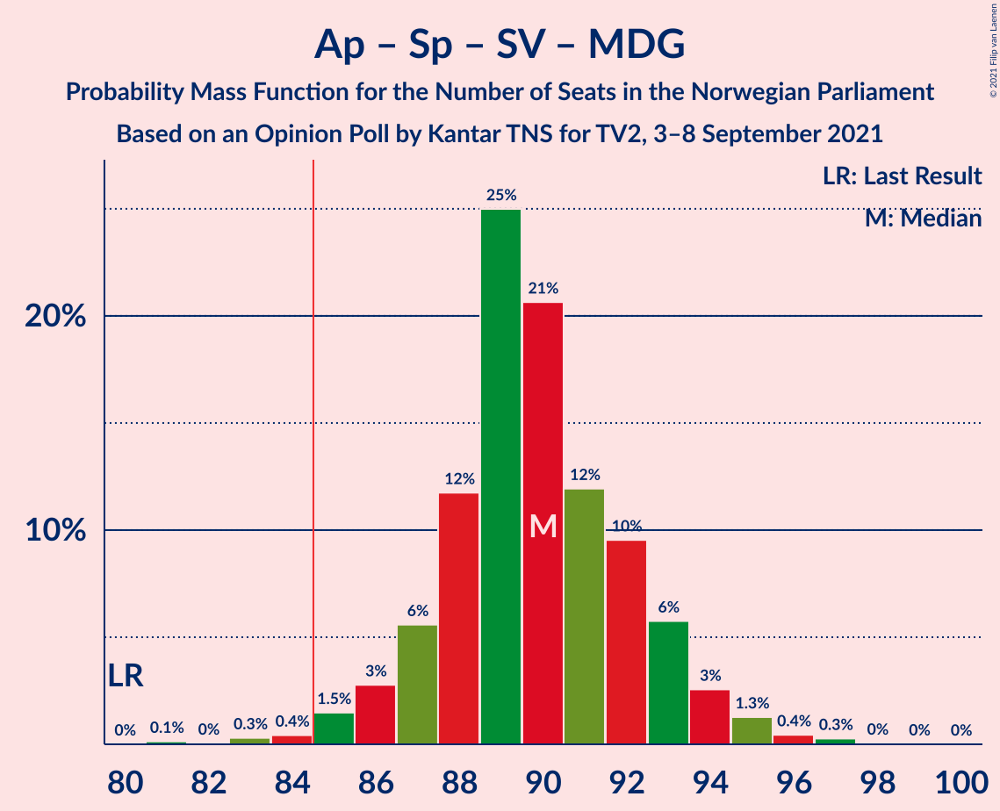
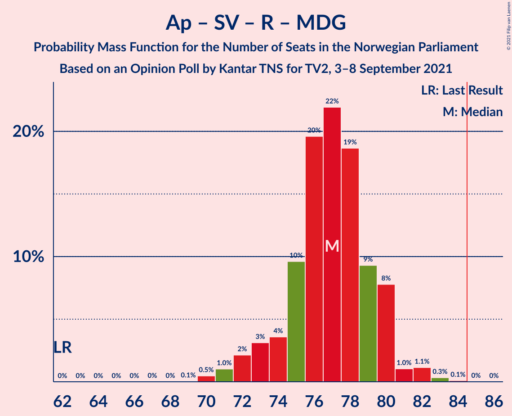
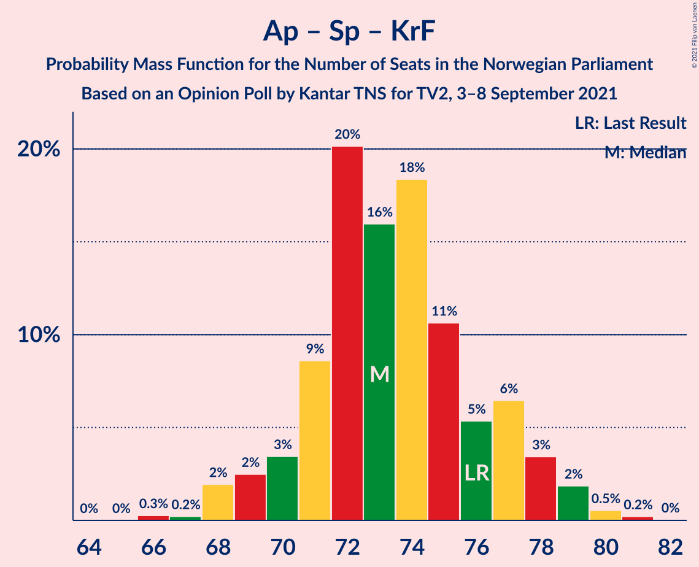

# Opinion Poll by Kantar TNS for TV2, 3–8 September 2021

<a href="#voting-intentions">Voting Intentions</a> | <a href="#seats">Seats</a> | <a href="#coalitions">Coalitions</a> | <a href="#technical-information">Technical Information</a>

## Voting Intentions

### Confidence Intervals

| Party | Last Result | Poll Result | 80% Confidence Interval | 90% Confidence Interval | 95% Confidence Interval | 99% Confidence Interval |
|:-----:|:-----------:|:-----------:|:-----------------------:|:-----------------------:|:-----------------------:|:-----------------------:|
| Arbeiderpartiet | 27.4% | 23.6% | 22.5–24.7% |22.2–25.0% |22.0–25.3% |21.5–25.8% |
| Høyre | 25.0% | 19.0% | 18.0–20.0% |17.8–20.3% |17.5–20.6% |17.1–21.1% |
| Senterpartiet | 10.3% | 13.4% | 12.5–14.3% |12.3–14.5% |12.1–14.7% |11.7–15.2% |
| Fremskrittspartiet | 15.2% | 11.2% | 10.4–12.0% |10.2–12.2% |10.0–12.4% |9.6–12.8% |
| Sosialistisk Venstreparti | 6.0% | 9.3% | 8.6–10.0% |8.4–10.3% |8.2–10.4% |7.9–10.8% |
| Rødt | 2.4% | 6.4% | 5.8–7.1% |5.6–7.2% |5.5–7.4% |5.2–7.7% |
| Miljøpartiet De Grønne | 3.2% | 4.7% | 4.2–5.3% |4.1–5.4% |3.9–5.6% |3.7–5.9% |
| Venstre | 4.4% | 4.6% | 4.1–5.2% |3.9–5.3% |3.8–5.5% |3.6–5.7% |
| Kristelig Folkeparti | 4.2% | 4.5% | 4.0–5.1% |3.9–5.2% |3.7–5.4% |3.5–5.7% |

*Note:* The poll result column reflects the actual value used in the calculations. Published results may vary slightly, and in addition be rounded to fewer digits.

## Seats

### Confidence Intervals

| Party | Last Result | Median | 80% Confidence Interval | 90% Confidence Interval | 95% Confidence Interval | 99% Confidence Interval |
|:-----:|:-----------:|:------:|:-----------------------:|:-----------------------:|:-----------------------:|:-----------------------:|
| <a href="#arbeiderpartiet">Arbeiderpartiet</a> | 49 | 41 | 41–44 |41–45 |41–46 |41–47 |
| <a href="#høyre">Høyre</a> | 45 | 34 | 33–36 |33–36 |31–36 |29–37 |
| <a href="#senterpartiet">Senterpartiet</a> | 19 | 24 | 22–25 |21–25 |21–26 |20–28 |
| <a href="#fremskrittspartiet">Fremskrittspartiet</a> | 27 | 19 | 18–21 |17–21 |17–21 |16–23 |
| <a href="#sosialistisk-venstreparti">Sosialistisk Venstreparti</a> | 11 | 16 | 14–17 |13–17 |13–17 |11–18 |
| <a href="#rødt">Rødt</a> | 1 | 11 | 10–12 |9–12 |9–12 |9–13 |
| <a href="#miljøpartiet-de-grønne">Miljøpartiet De Grønne</a> | 1 | 9 | 7–9 |7–9 |2–9 |2–10 |
| <a href="#venstre">Venstre</a> | 8 | 8 | 6–9 |2–9 |2–9 |2–10 |
| <a href="#kristelig-folkeparti">Kristelig Folkeparti</a> | 8 | 8 | 7–8 |7–8 |3–9 |3–9 |

### Arbeiderpartiet

*For a full overview of the results for this party, see the [Arbeiderpartiet](party-arbeiderpartiet.html) page.*

| Number of Seats | Probability | Accumulated | Special Marks |
|:---------------:|:-----------:|:-----------:|:-------------:|
| 40 | 0.4% | 100% |  |
| 41 | 63% | 99.5% | Median |
| 42 | 5% | 36% |  |
| 43 | 19% | 31% |  |
| 44 | 3% | 11% |  |
| 45 | 3% | 8% |  |
| 46 | 3% | 5% |  |
| 47 | 1.3% | 1.5% |  |
| 48 | 0% | 0.2% |  |
| 49 | 0.1% | 0.1% | Last Result |
| 50 | 0% | 0% |  |

### Høyre

*For a full overview of the results for this party, see the [Høyre](party-høyre.html) page.*

| Number of Seats | Probability | Accumulated | Special Marks |
|:---------------:|:-----------:|:-----------:|:-------------:|
| 28 | 0.2% | 100% |  |
| 29 | 0.4% | 99.8% |  |
| 30 | 0.4% | 99.5% |  |
| 31 | 2% | 99.0% |  |
| 32 | 0.9% | 97% |  |
| 33 | 32% | 96% |  |
| 34 | 39% | 64% | Median |
| 35 | 15% | 26% |  |
| 36 | 10% | 11% |  |
| 37 | 0.7% | 0.7% |  |
| 38 | 0% | 0.1% |  |
| 39 | 0% | 0% |  |
| 40 | 0% | 0% |  |
| 41 | 0% | 0% |  |
| 42 | 0% | 0% |  |
| 43 | 0% | 0% |  |
| 44 | 0% | 0% |  |
| 45 | 0% | 0% | Last Result |

### Senterpartiet

*For a full overview of the results for this party, see the [Senterpartiet](party-senterpartiet.html) page.*

| Number of Seats | Probability | Accumulated | Special Marks |
|:---------------:|:-----------:|:-----------:|:-------------:|
| 19 | 0% | 100% | Last Result |
| 20 | 0.5% | 100% |  |
| 21 | 9% | 99.5% |  |
| 22 | 3% | 91% |  |
| 23 | 34% | 87% |  |
| 24 | 30% | 53% | Median |
| 25 | 18% | 22% |  |
| 26 | 2% | 4% |  |
| 27 | 2% | 2% |  |
| 28 | 0.3% | 0.5% |  |
| 29 | 0.1% | 0.2% |  |
| 30 | 0.1% | 0.1% |  |
| 31 | 0% | 0% |  |

### Fremskrittspartiet

*For a full overview of the results for this party, see the [Fremskrittspartiet](party-fremskrittspartiet.html) page.*

| Number of Seats | Probability | Accumulated | Special Marks |
|:---------------:|:-----------:|:-----------:|:-------------:|
| 16 | 2% | 100% |  |
| 17 | 3% | 98% |  |
| 18 | 19% | 95% |  |
| 19 | 37% | 76% | Median |
| 20 | 24% | 39% |  |
| 21 | 13% | 15% |  |
| 22 | 1.3% | 2% |  |
| 23 | 0.6% | 0.8% |  |
| 24 | 0.2% | 0.2% |  |
| 25 | 0% | 0% |  |
| 26 | 0% | 0% |  |
| 27 | 0% | 0% | Last Result |

### Sosialistisk Venstreparti

*For a full overview of the results for this party, see the [Sosialistisk Venstreparti](party-sosialistiskvenstreparti.html) page.*

| Number of Seats | Probability | Accumulated | Special Marks |
|:---------------:|:-----------:|:-----------:|:-------------:|
| 11 | 0.5% | 100% | Last Result |
| 12 | 0.2% | 99.5% |  |
| 13 | 8% | 99.3% |  |
| 14 | 2% | 92% |  |
| 15 | 31% | 90% |  |
| 16 | 16% | 59% | Median |
| 17 | 41% | 44% |  |
| 18 | 2% | 2% |  |
| 19 | 0.2% | 0.4% |  |
| 20 | 0.1% | 0.1% |  |
| 21 | 0% | 0% |  |

### Rødt

*For a full overview of the results for this party, see the [Rødt](party-rødt.html) page.*

| Number of Seats | Probability | Accumulated | Special Marks |
|:---------------:|:-----------:|:-----------:|:-------------:|
| 1 | 0% | 100% | Last Result |
| 2 | 0% | 100% |  |
| 3 | 0% | 100% |  |
| 4 | 0% | 100% |  |
| 5 | 0% | 100% |  |
| 6 | 0% | 100% |  |
| 7 | 0.1% | 100% |  |
| 8 | 0.3% | 99.9% |  |
| 9 | 6% | 99.7% |  |
| 10 | 39% | 94% |  |
| 11 | 23% | 54% | Median |
| 12 | 30% | 32% |  |
| 13 | 2% | 2% |  |
| 14 | 0.1% | 0.1% |  |
| 15 | 0% | 0% |  |

### Miljøpartiet De Grønne

*For a full overview of the results for this party, see the [Miljøpartiet De Grønne](party-miljøpartietdegrønne.html) page.*

| Number of Seats | Probability | Accumulated | Special Marks |
|:---------------:|:-----------:|:-----------:|:-------------:|
| 1 | 0% | 100% | Last Result |
| 2 | 3% | 100% |  |
| 3 | 0% | 97% |  |
| 4 | 0% | 97% |  |
| 5 | 0% | 97% |  |
| 6 | 0.5% | 97% |  |
| 7 | 19% | 96% |  |
| 8 | 10% | 77% |  |
| 9 | 66% | 67% | Median |
| 10 | 0.9% | 0.9% |  |
| 11 | 0% | 0% |  |

### Venstre

*For a full overview of the results for this party, see the [Venstre](party-venstre.html) page.*

| Number of Seats | Probability | Accumulated | Special Marks |
|:---------------:|:-----------:|:-----------:|:-------------:|
| 2 | 10% | 100% |  |
| 3 | 0% | 90% |  |
| 4 | 0% | 90% |  |
| 5 | 0% | 90% |  |
| 6 | 2% | 90% |  |
| 7 | 15% | 88% |  |
| 8 | 55% | 73% | Last Result, Median |
| 9 | 17% | 18% |  |
| 10 | 0.6% | 0.7% |  |
| 11 | 0% | 0% |  |

### Kristelig Folkeparti

*For a full overview of the results for this party, see the [Kristelig Folkeparti](party-kristeligfolkeparti.html) page.*

| Number of Seats | Probability | Accumulated | Special Marks |
|:---------------:|:-----------:|:-----------:|:-------------:|
| 2 | 0.4% | 100% |  |
| 3 | 2% | 99.6% |  |
| 4 | 0% | 97% |  |
| 5 | 0% | 97% |  |
| 6 | 0.7% | 97% |  |
| 7 | 46% | 97% |  |
| 8 | 46% | 51% | Last Result, Median |
| 9 | 5% | 5% |  |
| 10 | 0.3% | 0.3% |  |
| 11 | 0% | 0% |  |

## Coalitions

### Confidence Intervals

| Coalition | Last Result | Median | Majority? | 80% Confidence Interval | 90% Confidence Interval | 95% Confidence Interval | 99% Confidence Interval |
|:---------:|:-----------:|:------:|:---------:|:-----------------------:|:-----------------------:|:-----------------------:|:-----------------------:|
| Arbeiderpartiet – Senterpartiet – Sosialistisk Venstreparti – Rødt – Miljøpartiet De Grønne | 81 | 101 | 100% | 96–104 | 96–105 | 95–105 | 93–107 |
| Arbeiderpartiet – Senterpartiet – Sosialistisk Venstreparti – Miljøpartiet De Grønne – Kristelig Folkeparti | 88 | 97 | 100% | 94–101 | 92–101 | 92–101 | 90–102 |
| Arbeiderpartiet – Senterpartiet – Sosialistisk Venstreparti – Rødt | 80 | 92 | 100% | 89–96 | 89–96 | 88–97 | 86–99 |
| Høyre – Senterpartiet – Fremskrittspartiet – Venstre – Kristelig Folkeparti | 107 | 92 | 99.8% | 89–94 | 89–94 | 89–95 | 86–96 |
| Arbeiderpartiet – Senterpartiet – Sosialistisk Venstreparti – Miljøpartiet De Grønne | 80 | 90 | 98.7% | 86–93 | 85–93 | 85–94 | 83–96 |
| Arbeiderpartiet – Senterpartiet – Sosialistisk Venstreparti | 79 | 82 | 7% | 79–84 | 79–85 | 78–86 | 76–88 |
| Arbeiderpartiet – Senterpartiet – Miljøpartiet De Grønne – Kristelig Folkeparti | 77 | 80 | 13% | 79–85 | 79–86 | 77–86 | 74–87 |
| Høyre – Fremskrittspartiet – Miljøpartiet De Grønne – Venstre – Kristelig Folkeparti | 89 | 77 | 0% | 73–78 | 72–80 | 72–80 | 69–80 |
| Arbeiderpartiet – Sosialistisk Venstreparti – Rødt – Miljøpartiet De Grønne | 62 | 77 | 0% | 75–80 | 72–80 | 71–80 | 71–83 |
| Arbeiderpartiet – Senterpartiet – Kristelig Folkeparti | 76 | 73 | 0% | 71–76 | 71–78 | 70–78 | 66–79 |
| Høyre – Fremskrittspartiet – Venstre – Kristelig Folkeparti | 88 | 68 | 0% | 65–70 | 64–73 | 64–73 | 61–73 |
| Arbeiderpartiet – Senterpartiet | 68 | 65 | 0% | 64–68 | 64–71 | 64–71 | 62–72 |
| Høyre – Fremskrittspartiet – Venstre | 80 | 61 | 0% | 57–63 | 56–65 | 56–65 | 56–65 |
| Arbeiderpartiet – Sosialistisk Venstreparti | 60 | 58 | 0% | 56–60 | 56–61 | 54–62 | 54–62 |
| Høyre – Fremskrittspartiet | 72 | 53 | 0% | 52–55 | 51–57 | 50–57 | 49–58 |
| Høyre – Venstre – Kristelig Folkeparti | 61 | 49 | 0% | 45–51 | 45–52 | 45–52 | 41–53 |
| Senterpartiet – Venstre – Kristelig Folkeparti | 35 | 39 | 0% | 35–40 | 35–41 | 34–42 | 32–43 |

### Arbeiderpartiet – Senterpartiet – Sosialistisk Venstreparti – Rødt – Miljøpartiet De Grønne

| Number of Seats | Probability | Accumulated | Special Marks |
|:---------------:|:-----------:|:-----------:|:-------------:|
| 81 | 0% | 100% | Last Result |
| 82 | 0% | 100% |  |
| 83 | 0% | 100% |  |
| 84 | 0% | 100% |  |
| 85 | 0% | 100% | Majority |
| 86 | 0% | 100% |  |
| 87 | 0% | 100% |  |
| 88 | 0% | 100% |  |
| 89 | 0% | 100% |  |
| 90 | 0% | 100% |  |
| 91 | 0.1% | 100% |  |
| 92 | 0% | 99.9% |  |
| 93 | 0.7% | 99.9% |  |
| 94 | 0.1% | 99.2% |  |
| 95 | 4% | 99.1% |  |
| 96 | 7% | 95% |  |
| 97 | 1.0% | 88% |  |
| 98 | 3% | 87% |  |
| 99 | 4% | 84% |  |
| 100 | 22% | 80% |  |
| 101 | 36% | 58% | Median |
| 102 | 7% | 22% |  |
| 103 | 3% | 14% |  |
| 104 | 3% | 11% |  |
| 105 | 8% | 9% |  |
| 106 | 0.2% | 1.1% |  |
| 107 | 0.5% | 0.9% |  |
| 108 | 0.3% | 0.4% |  |
| 109 | 0% | 0.1% |  |
| 110 | 0% | 0% |  |

### Arbeiderpartiet – Senterpartiet – Sosialistisk Venstreparti – Miljøpartiet De Grønne – Kristelig Folkeparti

| Number of Seats | Probability | Accumulated | Special Marks |
|:---------------:|:-----------:|:-----------:|:-------------:|
| 88 | 0% | 100% | Last Result |
| 89 | 0.2% | 100% |  |
| 90 | 0.9% | 99.8% |  |
| 91 | 0.2% | 98.8% |  |
| 92 | 4% | 98.6% |  |
| 93 | 0.9% | 95% |  |
| 94 | 7% | 94% |  |
| 95 | 21% | 87% |  |
| 96 | 4% | 65% |  |
| 97 | 17% | 61% |  |
| 98 | 1.3% | 44% | Median |
| 99 | 32% | 43% |  |
| 100 | 0.8% | 11% |  |
| 101 | 8% | 11% |  |
| 102 | 2% | 2% |  |
| 103 | 0.2% | 0.4% |  |
| 104 | 0.1% | 0.3% |  |
| 105 | 0.2% | 0.2% |  |
| 106 | 0% | 0% |  |

### Arbeiderpartiet – Senterpartiet – Sosialistisk Venstreparti – Rødt

| Number of Seats | Probability | Accumulated | Special Marks |
|:---------------:|:-----------:|:-----------:|:-------------:|
| 80 | 0% | 100% | Last Result |
| 81 | 0% | 100% |  |
| 82 | 0% | 100% |  |
| 83 | 0% | 100% |  |
| 84 | 0% | 100% |  |
| 85 | 0% | 100% | Majority |
| 86 | 0.7% | 100% |  |
| 87 | 0.1% | 99.2% |  |
| 88 | 4% | 99.1% |  |
| 89 | 7% | 95% |  |
| 90 | 1.0% | 88% |  |
| 91 | 22% | 87% |  |
| 92 | 38% | 65% | Median |
| 93 | 7% | 28% |  |
| 94 | 4% | 21% |  |
| 95 | 3% | 17% |  |
| 96 | 10% | 14% |  |
| 97 | 3% | 4% |  |
| 98 | 0.5% | 1.2% |  |
| 99 | 0.4% | 0.8% |  |
| 100 | 0.3% | 0.4% |  |
| 101 | 0.1% | 0.1% |  |
| 102 | 0% | 0.1% |  |
| 103 | 0% | 0% |  |

### Høyre – Senterpartiet – Fremskrittspartiet – Venstre – Kristelig Folkeparti

| Number of Seats | Probability | Accumulated | Special Marks |
|:---------------:|:-----------:|:-----------:|:-------------:|
| 83 | 0.1% | 100% |  |
| 84 | 0% | 99.8% |  |
| 85 | 0.2% | 99.8% | Majority |
| 86 | 0.6% | 99.6% |  |
| 87 | 0.8% | 99.0% |  |
| 88 | 0.5% | 98% |  |
| 89 | 10% | 98% |  |
| 90 | 4% | 88% |  |
| 91 | 18% | 84% |  |
| 92 | 52% | 66% |  |
| 93 | 3% | 14% | Median |
| 94 | 8% | 11% |  |
| 95 | 2% | 3% |  |
| 96 | 1.4% | 2% |  |
| 97 | 0.1% | 0.2% |  |
| 98 | 0% | 0.1% |  |
| 99 | 0% | 0% |  |
| 100 | 0% | 0% |  |
| 101 | 0% | 0% |  |
| 102 | 0% | 0% |  |
| 103 | 0% | 0% |  |
| 104 | 0% | 0% |  |
| 105 | 0% | 0% |  |
| 106 | 0% | 0% |  |
| 107 | 0% | 0% | Last Result |

### Arbeiderpartiet – Senterpartiet – Sosialistisk Venstreparti – Miljøpartiet De Grønne

| Number of Seats | Probability | Accumulated | Special Marks |
|:---------------:|:-----------:|:-----------:|:-------------:|
| 80 | 0% | 100% | Last Result |
| 81 | 0% | 100% |  |
| 82 | 0.1% | 100% |  |
| 83 | 0.7% | 99.9% |  |
| 84 | 0.4% | 99.2% |  |
| 85 | 4% | 98.7% | Majority |
| 86 | 7% | 95% |  |
| 87 | 3% | 88% |  |
| 88 | 20% | 85% |  |
| 89 | 3% | 65% |  |
| 90 | 18% | 61% | Median |
| 91 | 28% | 44% |  |
| 92 | 4% | 16% |  |
| 93 | 9% | 12% |  |
| 94 | 1.4% | 3% |  |
| 95 | 0.2% | 1.1% |  |
| 96 | 0.6% | 0.9% |  |
| 97 | 0.3% | 0.3% |  |
| 98 | 0% | 0% |  |

### Arbeiderpartiet – Senterpartiet – Sosialistisk Venstreparti

| Number of Seats | Probability | Accumulated | Special Marks |
|:---------------:|:-----------:|:-----------:|:-------------:|
| 76 | 0.7% | 100% |  |
| 77 | 0.3% | 99.3% |  |
| 78 | 4% | 99.0% |  |
| 79 | 26% | 95% | Last Result |
| 80 | 0.7% | 69% |  |
| 81 | 17% | 69% | Median |
| 82 | 28% | 52% |  |
| 83 | 4% | 24% |  |
| 84 | 13% | 19% |  |
| 85 | 3% | 7% | Majority |
| 86 | 2% | 3% |  |
| 87 | 0.2% | 1.1% |  |
| 88 | 0.7% | 0.9% |  |
| 89 | 0.1% | 0.2% |  |
| 90 | 0.1% | 0.1% |  |
| 91 | 0% | 0% |  |

### Arbeiderpartiet – Senterpartiet – Miljøpartiet De Grønne – Kristelig Folkeparti

| Number of Seats | Probability | Accumulated | Special Marks |
|:---------------:|:-----------:|:-----------:|:-------------:|
| 73 | 0.3% | 100% |  |
| 74 | 0.3% | 99.7% |  |
| 75 | 0.2% | 99.4% |  |
| 76 | 1.0% | 99.2% |  |
| 77 | 0.8% | 98% | Last Result |
| 78 | 2% | 97% |  |
| 79 | 12% | 96% |  |
| 80 | 35% | 83% |  |
| 81 | 3% | 49% |  |
| 82 | 24% | 46% | Median |
| 83 | 6% | 22% |  |
| 84 | 3% | 16% |  |
| 85 | 7% | 13% | Majority |
| 86 | 4% | 5% |  |
| 87 | 2% | 2% |  |
| 88 | 0.1% | 0.2% |  |
| 89 | 0% | 0.1% |  |
| 90 | 0.1% | 0.1% |  |
| 91 | 0% | 0% |  |

### Høyre – Fremskrittspartiet – Miljøpartiet De Grønne – Venstre – Kristelig Folkeparti

| Number of Seats | Probability | Accumulated | Special Marks |
|:---------------:|:-----------:|:-----------:|:-------------:|
| 66 | 0.1% | 100% |  |
| 67 | 0% | 99.9% |  |
| 68 | 0.3% | 99.9% |  |
| 69 | 0.6% | 99.6% |  |
| 70 | 0.5% | 99.0% |  |
| 71 | 0.6% | 98.5% |  |
| 72 | 4% | 98% |  |
| 73 | 11% | 93% |  |
| 74 | 3% | 83% |  |
| 75 | 7% | 79% |  |
| 76 | 7% | 72% |  |
| 77 | 38% | 65% |  |
| 78 | 21% | 28% | Median |
| 79 | 0.3% | 7% |  |
| 80 | 7% | 7% |  |
| 81 | 0.3% | 0.3% |  |
| 82 | 0% | 0% |  |
| 83 | 0% | 0% |  |
| 84 | 0% | 0% |  |
| 85 | 0% | 0% | Majority |
| 86 | 0% | 0% |  |
| 87 | 0% | 0% |  |
| 88 | 0% | 0% |  |
| 89 | 0% | 0% | Last Result |

### Arbeiderpartiet – Sosialistisk Venstreparti – Rødt – Miljøpartiet De Grønne

| Number of Seats | Probability | Accumulated | Special Marks |
|:---------------:|:-----------:|:-----------:|:-------------:|
| 62 | 0% | 100% | Last Result |
| 63 | 0% | 100% |  |
| 64 | 0% | 100% |  |
| 65 | 0% | 100% |  |
| 66 | 0% | 100% |  |
| 67 | 0.1% | 100% |  |
| 68 | 0% | 99.9% |  |
| 69 | 0% | 99.9% |  |
| 70 | 0.3% | 99.9% |  |
| 71 | 4% | 99.6% |  |
| 72 | 1.2% | 96% |  |
| 73 | 3% | 95% |  |
| 74 | 2% | 92% |  |
| 75 | 9% | 90% |  |
| 76 | 2% | 82% |  |
| 77 | 49% | 79% | Median |
| 78 | 18% | 30% |  |
| 79 | 2% | 13% |  |
| 80 | 9% | 11% |  |
| 81 | 0.3% | 1.2% |  |
| 82 | 0.3% | 0.9% |  |
| 83 | 0.4% | 0.6% |  |
| 84 | 0.1% | 0.1% |  |
| 85 | 0% | 0% | Majority |

### Arbeiderpartiet – Senterpartiet – Kristelig Folkeparti

| Number of Seats | Probability | Accumulated | Special Marks |
|:---------------:|:-----------:|:-----------:|:-------------:|
| 66 | 0.5% | 100% |  |
| 67 | 0% | 99.5% |  |
| 68 | 0.1% | 99.5% |  |
| 69 | 1.1% | 99.3% |  |
| 70 | 0.8% | 98% |  |
| 71 | 34% | 97% |  |
| 72 | 11% | 64% |  |
| 73 | 23% | 53% | Median |
| 74 | 7% | 30% |  |
| 75 | 4% | 23% |  |
| 76 | 9% | 18% | Last Result |
| 77 | 4% | 9% |  |
| 78 | 3% | 5% |  |
| 79 | 2% | 2% |  |
| 80 | 0.1% | 0.2% |  |
| 81 | 0.1% | 0.1% |  |
| 82 | 0% | 0% |  |

### Høyre – Fremskrittspartiet – Venstre – Kristelig Folkeparti

| Number of Seats | Probability | Accumulated | Special Marks |
|:---------------:|:-----------:|:-----------:|:-------------:|
| 59 | 0% | 100% |  |
| 60 | 0.1% | 99.9% |  |
| 61 | 0.5% | 99.9% |  |
| 62 | 0.7% | 99.3% |  |
| 63 | 0.3% | 98.6% |  |
| 64 | 8% | 98% |  |
| 65 | 5% | 91% |  |
| 66 | 3% | 86% |  |
| 67 | 8% | 83% |  |
| 68 | 39% | 75% |  |
| 69 | 23% | 36% | Median |
| 70 | 4% | 13% |  |
| 71 | 2% | 9% |  |
| 72 | 0.5% | 7% |  |
| 73 | 7% | 7% |  |
| 74 | 0.1% | 0.1% |  |
| 75 | 0% | 0% |  |
| 76 | 0% | 0% |  |
| 77 | 0% | 0% |  |
| 78 | 0% | 0% |  |
| 79 | 0% | 0% |  |
| 80 | 0% | 0% |  |
| 81 | 0% | 0% |  |
| 82 | 0% | 0% |  |
| 83 | 0% | 0% |  |
| 84 | 0% | 0% |  |
| 85 | 0% | 0% | Majority |
| 86 | 0% | 0% |  |
| 87 | 0% | 0% |  |
| 88 | 0% | 0% | Last Result |

### Arbeiderpartiet – Senterpartiet

| Number of Seats | Probability | Accumulated | Special Marks |
|:---------------:|:-----------:|:-----------:|:-------------:|
| 61 | 0.1% | 100% |  |
| 62 | 1.1% | 99.8% |  |
| 63 | 0.7% | 98.7% |  |
| 64 | 41% | 98% |  |
| 65 | 26% | 58% | Median |
| 66 | 6% | 32% |  |
| 67 | 6% | 25% |  |
| 68 | 10% | 19% | Last Result |
| 69 | 2% | 9% |  |
| 70 | 2% | 7% |  |
| 71 | 5% | 5% |  |
| 72 | 0.7% | 0.8% |  |
| 73 | 0.1% | 0.2% |  |
| 74 | 0.1% | 0.1% |  |
| 75 | 0% | 0% |  |

### Høyre – Fremskrittspartiet – Venstre

| Number of Seats | Probability | Accumulated | Special Marks |
|:---------------:|:-----------:|:-----------:|:-------------:|
| 53 | 0.2% | 100% |  |
| 54 | 0.1% | 99.8% |  |
| 55 | 0.1% | 99.7% |  |
| 56 | 8% | 99.5% |  |
| 57 | 2% | 92% |  |
| 58 | 5% | 90% |  |
| 59 | 5% | 85% |  |
| 60 | 25% | 80% |  |
| 61 | 21% | 55% | Median |
| 62 | 23% | 33% |  |
| 63 | 2% | 10% |  |
| 64 | 0.6% | 8% |  |
| 65 | 7% | 7% |  |
| 66 | 0.3% | 0.3% |  |
| 67 | 0.1% | 0.1% |  |
| 68 | 0% | 0% |  |
| 69 | 0% | 0% |  |
| 70 | 0% | 0% |  |
| 71 | 0% | 0% |  |
| 72 | 0% | 0% |  |
| 73 | 0% | 0% |  |
| 74 | 0% | 0% |  |
| 75 | 0% | 0% |  |
| 76 | 0% | 0% |  |
| 77 | 0% | 0% |  |
| 78 | 0% | 0% |  |
| 79 | 0% | 0% |  |
| 80 | 0% | 0% | Last Result |

### Arbeiderpartiet – Sosialistisk Venstreparti

| Number of Seats | Probability | Accumulated | Special Marks |
|:---------------:|:-----------:|:-----------:|:-------------:|
| 54 | 3% | 100% |  |
| 55 | 1.2% | 97% |  |
| 56 | 21% | 95% |  |
| 57 | 7% | 75% | Median |
| 58 | 45% | 68% |  |
| 59 | 12% | 23% |  |
| 60 | 5% | 11% | Last Result |
| 61 | 3% | 6% |  |
| 62 | 2% | 3% |  |
| 63 | 0.2% | 0.5% |  |
| 64 | 0.2% | 0.3% |  |
| 65 | 0% | 0.1% |  |
| 66 | 0% | 0% |  |

### Høyre – Fremskrittspartiet

| Number of Seats | Probability | Accumulated | Special Marks |
|:---------------:|:-----------:|:-----------:|:-------------:|
| 47 | 0.1% | 100% |  |
| 48 | 0.2% | 99.9% |  |
| 49 | 0.4% | 99.7% |  |
| 50 | 4% | 99.3% |  |
| 51 | 1.2% | 96% |  |
| 52 | 41% | 94% |  |
| 53 | 6% | 53% | Median |
| 54 | 36% | 47% |  |
| 55 | 1.3% | 11% |  |
| 56 | 2% | 10% |  |
| 57 | 7% | 7% |  |
| 58 | 0.3% | 0.5% |  |
| 59 | 0.2% | 0.2% |  |
| 60 | 0% | 0% |  |
| 61 | 0% | 0% |  |
| 62 | 0% | 0% |  |
| 63 | 0% | 0% |  |
| 64 | 0% | 0% |  |
| 65 | 0% | 0% |  |
| 66 | 0% | 0% |  |
| 67 | 0% | 0% |  |
| 68 | 0% | 0% |  |
| 69 | 0% | 0% |  |
| 70 | 0% | 0% |  |
| 71 | 0% | 0% |  |
| 72 | 0% | 0% | Last Result |

### Høyre – Venstre – Kristelig Folkeparti

| Number of Seats | Probability | Accumulated | Special Marks |
|:---------------:|:-----------:|:-----------:|:-------------:|
| 40 | 0.1% | 100% |  |
| 41 | 0.4% | 99.9% |  |
| 42 | 0.8% | 99.5% |  |
| 43 | 0.4% | 98.7% |  |
| 44 | 0.6% | 98% |  |
| 45 | 8% | 98% |  |
| 46 | 3% | 90% |  |
| 47 | 4% | 86% |  |
| 48 | 7% | 82% |  |
| 49 | 48% | 75% |  |
| 50 | 15% | 27% | Median |
| 51 | 4% | 12% |  |
| 52 | 8% | 8% |  |
| 53 | 0.6% | 0.6% |  |
| 54 | 0% | 0% |  |
| 55 | 0% | 0% |  |
| 56 | 0% | 0% |  |
| 57 | 0% | 0% |  |
| 58 | 0% | 0% |  |
| 59 | 0% | 0% |  |
| 60 | 0% | 0% |  |
| 61 | 0% | 0% | Last Result |

### Senterpartiet – Venstre – Kristelig Folkeparti

| Number of Seats | Probability | Accumulated | Special Marks |
|:---------------:|:-----------:|:-----------:|:-------------:|
| 28 | 0.1% | 100% |  |
| 29 | 0.2% | 99.9% |  |
| 30 | 0.1% | 99.8% |  |
| 31 | 0.1% | 99.7% |  |
| 32 | 0.4% | 99.6% |  |
| 33 | 1.2% | 99.2% |  |
| 34 | 0.9% | 98% |  |
| 35 | 8% | 97% | Last Result |
| 36 | 2% | 90% |  |
| 37 | 8% | 87% |  |
| 38 | 27% | 79% |  |
| 39 | 21% | 53% |  |
| 40 | 26% | 31% | Median |
| 41 | 3% | 6% |  |
| 42 | 2% | 3% |  |
| 43 | 0.6% | 0.8% |  |
| 44 | 0.1% | 0.2% |  |
| 45 | 0.1% | 0.1% |  |
| 46 | 0% | 0% |  |

## Technical Information

### Opinion Poll

+ **Polling firm:** Kantar TNS
+ **Commissioner(s):** TV2
+ **Fieldwork period:** 3–8 September 2021

### Calculations

+ **Sample size:** 2582
+ **Simulations done:** 131,072
+ **Error estimate:** 1.07%

