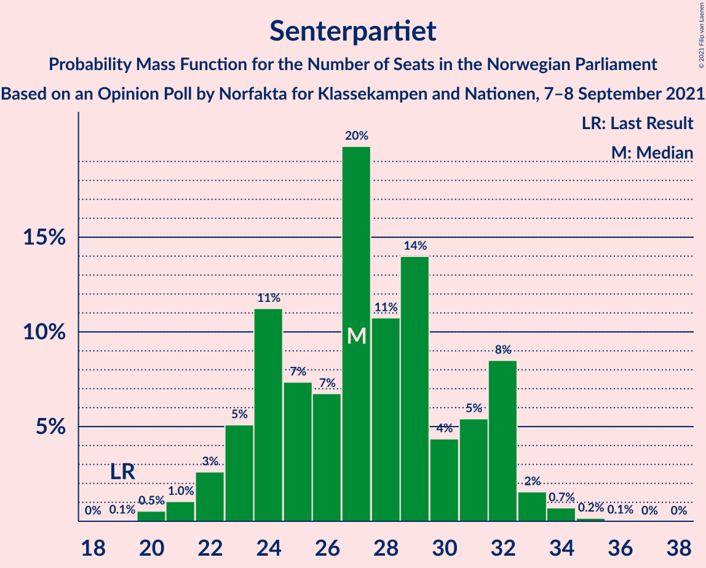
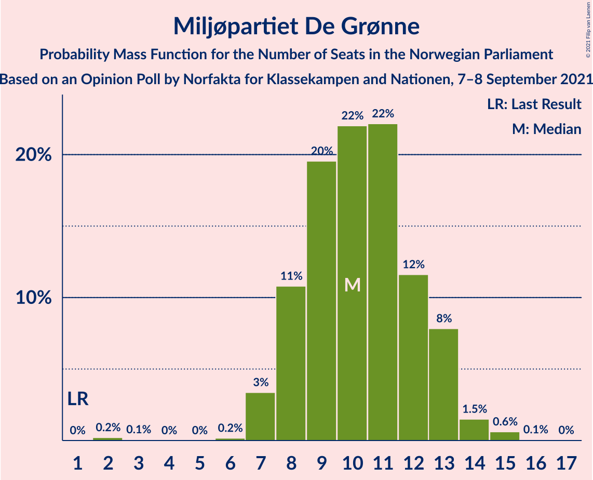
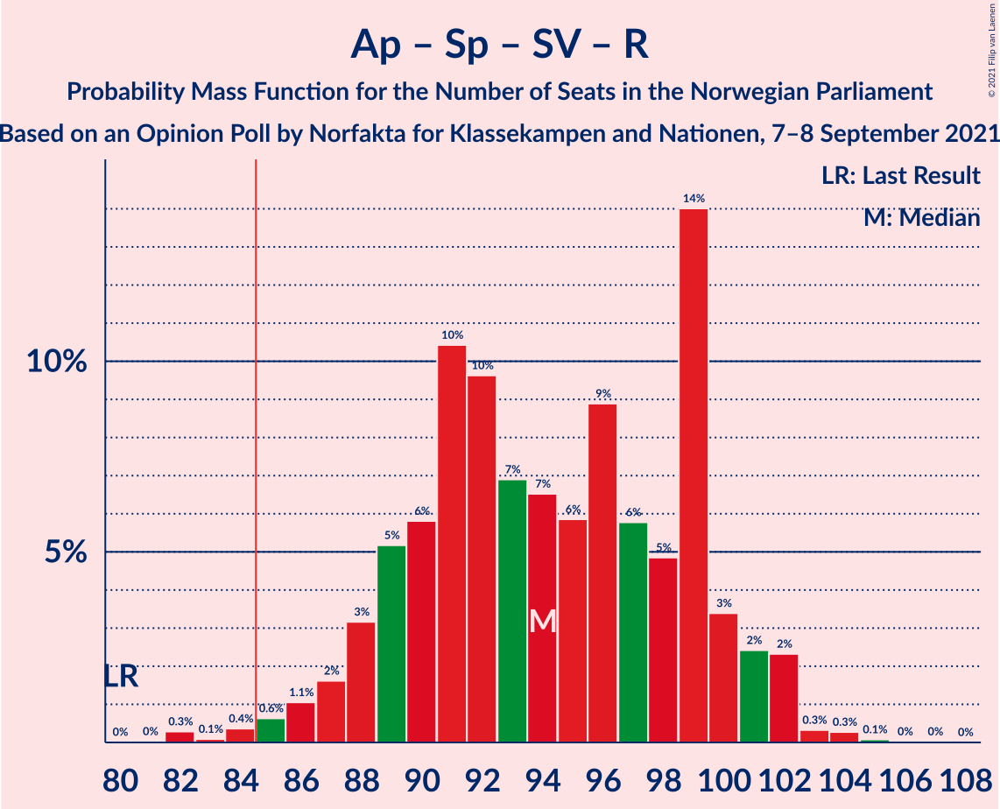
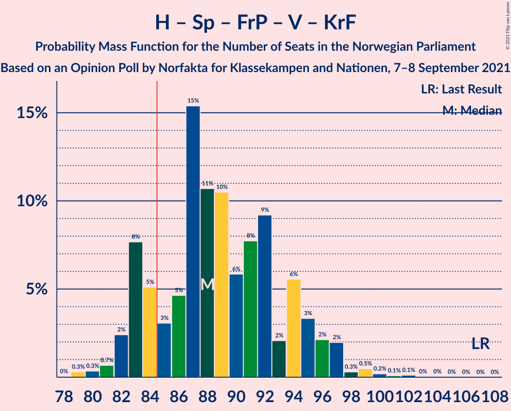
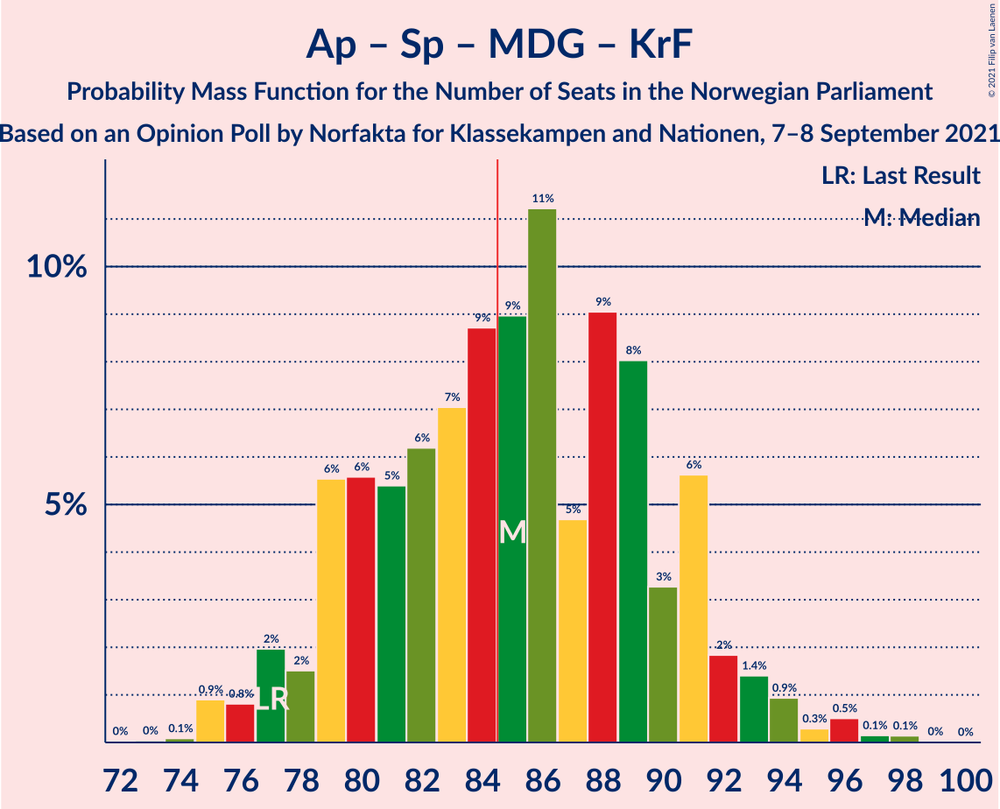
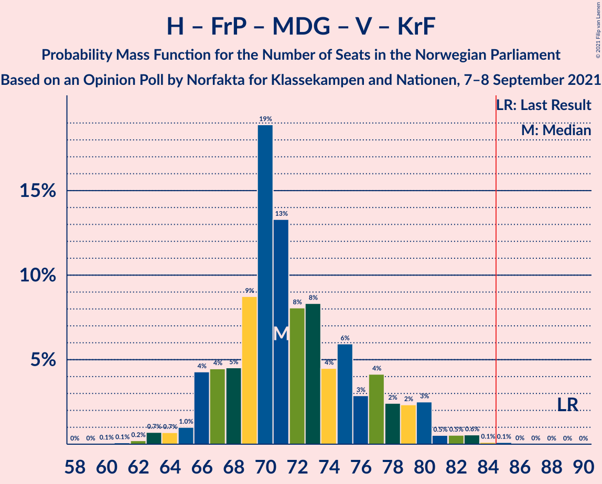
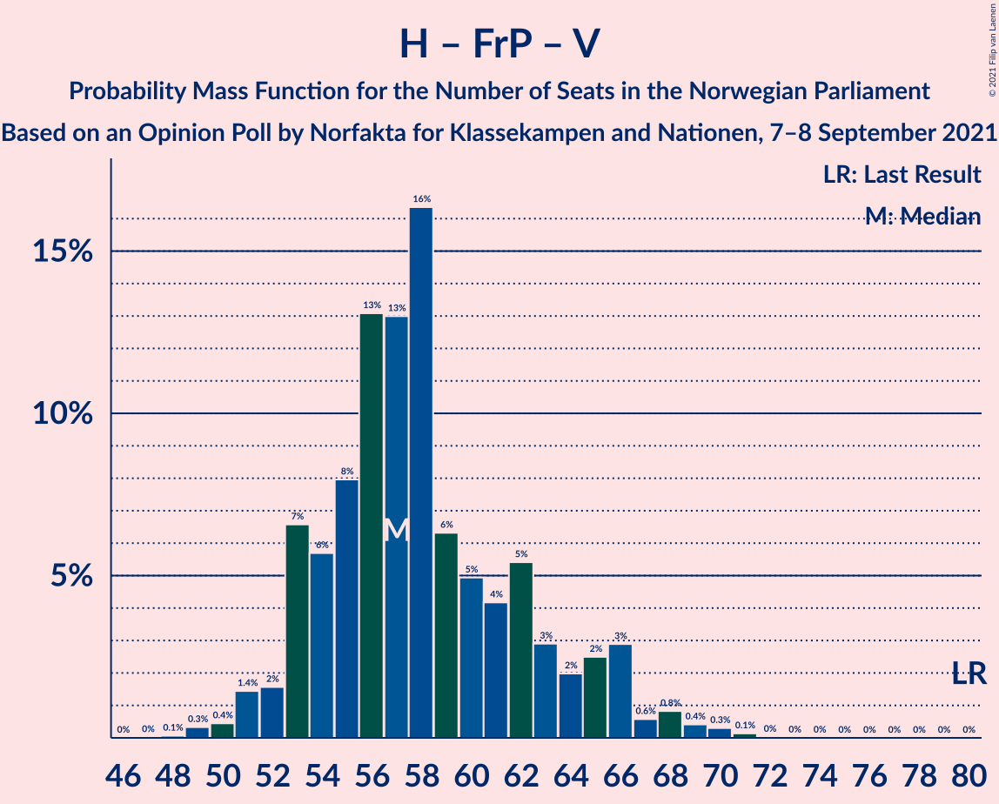

# Opinion Poll by Norfakta for Klassekampen and Nationen, 7–8 September 2021

<a href="#voting-intentions">Voting Intentions</a> | <a href="#seats">Seats</a> | <a href="#coalitions">Coalitions</a> | <a href="#technical-information">Technical Information</a>

## Voting Intentions

### Confidence Intervals

| Party | Last Result | Poll Result | 80% Confidence Interval | 90% Confidence Interval | 95% Confidence Interval | 99% Confidence Interval |
|:-----:|:-----------:|:-----------:|:-----------------------:|:-----------------------:|:-----------------------:|:-----------------------:|
| Arbeiderpartiet | 27.4% | 24.0% | 22.1–25.9% |21.6–26.5% |21.2–27.0% |20.3–27.9% |
| Høyre | 25.0% | 19.1% | 17.5–20.9% |17.0–21.4% |16.6–21.9% |15.8–22.8% |
| Senterpartiet | 10.3% | 14.8% | 13.4–16.5% |12.9–17.0% |12.6–17.4% |11.9–18.2% |
| Fremskrittspartiet | 15.2% | 11.7% | 10.4–13.3% |10.1–13.7% |9.7–14.1% |9.1–14.9% |
| Sosialistisk Venstreparti | 6.0% | 8.2% | 7.1–9.5% |6.8–9.9% |6.5–10.2% |6.0–10.9% |
| Miljøpartiet De Grønne | 3.2% | 5.9% | 5.0–7.1% |4.7–7.5% |4.5–7.7% |4.1–8.3% |
| Rødt | 2.4% | 5.3% | 4.5–6.5% |4.2–6.8% |4.0–7.1% |3.6–7.7% |
| Venstre | 4.4% | 3.8% | 3.1–4.8% |2.9–5.1% |2.7–5.3% |2.4–5.8% |
| Kristelig Folkeparti | 4.2% | 3.6% | 2.9–4.5% |2.7–4.8% |2.5–5.0% |2.2–5.5% |

*Note:* The poll result column reflects the actual value used in the calculations. Published results may vary slightly, and in addition be rounded to fewer digits.

## Seats

### Confidence Intervals

| Party | Last Result | Median | 80% Confidence Interval | 90% Confidence Interval | 95% Confidence Interval | 99% Confidence Interval |
|:-----:|:-----------:|:------:|:-----------------------:|:-----------------------:|:-----------------------:|:-----------------------:|
| <a href="#arbeiderpartiet">Arbeiderpartiet</a> | 49 | 42 | 41–47 |40–48 |39–49 |38–52 |
| <a href="#høyre">Høyre</a> | 45 | 33 | 31–36 |30–37 |28–39 |28–41 |
| <a href="#senterpartiet">Senterpartiet</a> | 19 | 28 | 24–31 |23–32 |22–32 |21–34 |
| <a href="#fremskrittspartiet">Fremskrittspartiet</a> | 27 | 21 | 15–23 |15–24 |15–25 |15–27 |
| <a href="#sosialistisk-venstreparti">Sosialistisk Venstreparti</a> | 11 | 14 | 11–18 |11–18 |10–18 |9–19 |
| <a href="#miljøpartiet-de-grønne">Miljøpartiet De Grønne</a> | 1 | 11 | 8–12 |8–13 |7–14 |7–14 |
| <a href="#rødt">Rødt</a> | 1 | 9 | 7–11 |7–13 |6–14 |2–14 |
| <a href="#venstre">Venstre</a> | 8 | 2 | 2–8 |2–9 |2–10 |2–10 |
| <a href="#kristelig-folkeparti">Kristelig Folkeparti</a> | 8 | 3 | 2–8 |1–8 |1–9 |1–9 |

### Arbeiderpartiet

*For a full overview of the results for this party, see the [Arbeiderpartiet](party-arbeiderpartiet.html) page.*

| Number of Seats | Probability | Accumulated | Special Marks |
|:---------------:|:-----------:|:-----------:|:-------------:|
| 36 | 0.1% | 100% |  |
| 37 | 0.1% | 99.9% |  |
| 38 | 2% | 99.8% |  |
| 39 | 2% | 98% |  |
| 40 | 4% | 96% |  |
| 41 | 3% | 92% |  |
| 42 | 44% | 89% | Median |
| 43 | 5% | 45% |  |
| 44 | 15% | 40% |  |
| 45 | 9% | 26% |  |
| 46 | 5% | 16% |  |
| 47 | 3% | 11% |  |
| 48 | 5% | 7% |  |
| 49 | 0.7% | 3% | Last Result |
| 50 | 2% | 2% |  |
| 51 | 0.1% | 0.7% |  |
| 52 | 0.3% | 0.6% |  |
| 53 | 0.2% | 0.3% |  |
| 54 | 0% | 0.1% |  |
| 55 | 0% | 0% |  |

### Høyre

*For a full overview of the results for this party, see the [Høyre](party-høyre.html) page.*

| Number of Seats | Probability | Accumulated | Special Marks |
|:---------------:|:-----------:|:-----------:|:-------------:|
| 27 | 0.2% | 100% |  |
| 28 | 3% | 99.8% |  |
| 29 | 2% | 97% |  |
| 30 | 2% | 95% |  |
| 31 | 9% | 93% |  |
| 32 | 26% | 84% |  |
| 33 | 23% | 58% | Median |
| 34 | 4% | 35% |  |
| 35 | 9% | 31% |  |
| 36 | 16% | 22% |  |
| 37 | 3% | 7% |  |
| 38 | 0.3% | 3% |  |
| 39 | 0.8% | 3% |  |
| 40 | 1.0% | 2% |  |
| 41 | 0.9% | 1.0% |  |
| 42 | 0.1% | 0.2% |  |
| 43 | 0.1% | 0.1% |  |
| 44 | 0% | 0% |  |
| 45 | 0% | 0% | Last Result |

### Senterpartiet

*For a full overview of the results for this party, see the [Senterpartiet](party-senterpartiet.html) page.*

| Number of Seats | Probability | Accumulated | Special Marks |
|:---------------:|:-----------:|:-----------:|:-------------:|
| 19 | 0.1% | 100% | Last Result |
| 20 | 0.4% | 99.9% |  |
| 21 | 2% | 99.5% |  |
| 22 | 1.0% | 98% |  |
| 23 | 5% | 97% |  |
| 24 | 6% | 92% |  |
| 25 | 4% | 86% |  |
| 26 | 9% | 82% |  |
| 27 | 21% | 73% |  |
| 28 | 10% | 51% | Median |
| 29 | 20% | 41% |  |
| 30 | 1.0% | 22% |  |
| 31 | 12% | 21% |  |
| 32 | 7% | 9% |  |
| 33 | 0.9% | 2% |  |
| 34 | 0.8% | 1.1% |  |
| 35 | 0.1% | 0.2% |  |
| 36 | 0.1% | 0.1% |  |
| 37 | 0% | 0% |  |

### Fremskrittspartiet

*For a full overview of the results for this party, see the [Fremskrittspartiet](party-fremskrittspartiet.html) page.*

| Number of Seats | Probability | Accumulated | Special Marks |
|:---------------:|:-----------:|:-----------:|:-------------:|
| 12 | 0.1% | 100% |  |
| 13 | 0% | 99.9% |  |
| 14 | 0.1% | 99.9% |  |
| 15 | 12% | 99.8% |  |
| 16 | 2% | 88% |  |
| 17 | 6% | 86% |  |
| 18 | 6% | 81% |  |
| 19 | 11% | 75% |  |
| 20 | 9% | 64% |  |
| 21 | 33% | 54% | Median |
| 22 | 10% | 22% |  |
| 23 | 2% | 12% |  |
| 24 | 5% | 10% |  |
| 25 | 3% | 5% |  |
| 26 | 1.3% | 2% |  |
| 27 | 0.4% | 0.8% | Last Result |
| 28 | 0.4% | 0.5% |  |
| 29 | 0% | 0% |  |

### Sosialistisk Venstreparti

*For a full overview of the results for this party, see the [Sosialistisk Venstreparti](party-sosialistiskvenstreparti.html) page.*

| Number of Seats | Probability | Accumulated | Special Marks |
|:---------------:|:-----------:|:-----------:|:-------------:|
| 8 | 0.1% | 100% |  |
| 9 | 0.6% | 99.9% |  |
| 10 | 3% | 99.3% |  |
| 11 | 10% | 96% | Last Result |
| 12 | 7% | 86% |  |
| 13 | 10% | 79% |  |
| 14 | 22% | 69% | Median |
| 15 | 10% | 47% |  |
| 16 | 2% | 36% |  |
| 17 | 16% | 34% |  |
| 18 | 17% | 18% |  |
| 19 | 0.5% | 0.7% |  |
| 20 | 0.3% | 0.3% |  |
| 21 | 0% | 0% |  |

### Miljøpartiet De Grønne

*For a full overview of the results for this party, see the [Miljøpartiet De Grønne](party-miljøpartietdegrønne.html) page.*

| Number of Seats | Probability | Accumulated | Special Marks |
|:---------------:|:-----------:|:-----------:|:-------------:|
| 1 | 0% | 100% | Last Result |
| 2 | 0.1% | 100% |  |
| 3 | 0.1% | 99.9% |  |
| 4 | 0% | 99.8% |  |
| 5 | 0% | 99.8% |  |
| 6 | 0.2% | 99.8% |  |
| 7 | 3% | 99.5% |  |
| 8 | 8% | 96% |  |
| 9 | 17% | 88% |  |
| 10 | 10% | 71% |  |
| 11 | 30% | 61% | Median |
| 12 | 25% | 32% |  |
| 13 | 3% | 6% |  |
| 14 | 3% | 3% |  |
| 15 | 0.2% | 0.3% |  |
| 16 | 0.1% | 0.1% |  |
| 17 | 0% | 0% |  |

### Rødt

*For a full overview of the results for this party, see the [Rødt](party-rødt.html) page.*

| Number of Seats | Probability | Accumulated | Special Marks |
|:---------------:|:-----------:|:-----------:|:-------------:|
| 1 | 0% | 100% | Last Result |
| 2 | 2% | 100% |  |
| 3 | 0% | 98% |  |
| 4 | 0% | 98% |  |
| 5 | 0% | 98% |  |
| 6 | 3% | 98% |  |
| 7 | 7% | 95% |  |
| 8 | 14% | 89% |  |
| 9 | 33% | 75% | Median |
| 10 | 25% | 42% |  |
| 11 | 10% | 17% |  |
| 12 | 1.5% | 7% |  |
| 13 | 1.2% | 5% |  |
| 14 | 4% | 4% |  |
| 15 | 0% | 0% |  |

### Venstre

*For a full overview of the results for this party, see the [Venstre](party-venstre.html) page.*

| Number of Seats | Probability | Accumulated | Special Marks |
|:---------------:|:-----------:|:-----------:|:-------------:|
| 1 | 0.3% | 100% |  |
| 2 | 64% | 99.7% | Median |
| 3 | 0.3% | 36% |  |
| 4 | 0% | 35% |  |
| 5 | 0% | 35% |  |
| 6 | 4% | 35% |  |
| 7 | 21% | 32% |  |
| 8 | 6% | 11% | Last Result |
| 9 | 3% | 6% |  |
| 10 | 2% | 3% |  |
| 11 | 0.1% | 0.1% |  |
| 12 | 0% | 0% |  |

### Kristelig Folkeparti

*For a full overview of the results for this party, see the [Kristelig Folkeparti](party-kristeligfolkeparti.html) page.*

| Number of Seats | Probability | Accumulated | Special Marks |
|:---------------:|:-----------:|:-----------:|:-------------:|
| 0 | 0.3% | 100% |  |
| 1 | 7% | 99.7% |  |
| 2 | 7% | 93% |  |
| 3 | 59% | 86% | Median |
| 4 | 0% | 28% |  |
| 5 | 0% | 28% |  |
| 6 | 3% | 28% |  |
| 7 | 12% | 25% |  |
| 8 | 8% | 13% | Last Result |
| 9 | 5% | 5% |  |
| 10 | 0.1% | 0.1% |  |
| 11 | 0% | 0% |  |

## Coalitions

### Confidence Intervals

| Coalition | Last Result | Median | Majority? | 80% Confidence Interval | 90% Confidence Interval | 95% Confidence Interval | 99% Confidence Interval |
|:---------:|:-----------:|:------:|:---------:|:-----------------------:|:-----------------------:|:-----------------------:|:-----------------------:|
| Arbeiderpartiet – Senterpartiet – Sosialistisk Venstreparti – Miljøpartiet De Grønne – Rødt | 81 | 106 | 100% | 99–111 | 96–112 | 95–114 | 92–114 |
| Arbeiderpartiet – Senterpartiet – Sosialistisk Venstreparti – Miljøpartiet De Grønne – Kristelig Folkeparti | 88 | 102 | 100% | 95–105 | 93–108 | 92–108 | 86–109 |
| Arbeiderpartiet – Senterpartiet – Sosialistisk Venstreparti – Miljøpartiet De Grønne | 80 | 97 | 99.1% | 91–102 | 90–102 | 87–106 | 83–106 |
| Arbeiderpartiet – Senterpartiet – Sosialistisk Venstreparti – Rødt | 80 | 95 | 98.8% | 89–99 | 88–100 | 86–102 | 84–102 |
| Høyre – Senterpartiet – Fremskrittspartiet – Venstre – Kristelig Folkeparti | 107 | 88 | 91% | 85–94 | 83–95 | 83–97 | 81–99 |
| Arbeiderpartiet – Senterpartiet – Miljøpartiet De Grønne – Kristelig Folkeparti | 77 | 85 | 62% | 81–91 | 79–93 | 78–94 | 75–95 |
| Arbeiderpartiet – Senterpartiet – Sosialistisk Venstreparti | 79 | 86 | 57% | 81–90 | 79–91 | 77–94 | 75–94 |
| Arbeiderpartiet – Sosialistisk Venstreparti – Miljøpartiet De Grønne – Rødt | 62 | 79 | 6% | 72–83 | 71–86 | 68–86 | 66–86 |
| Arbeiderpartiet – Senterpartiet – Kristelig Folkeparti | 76 | 74 | 0.6% | 71–82 | 68–82 | 68–83 | 66–85 |
| Høyre – Fremskrittspartiet – Miljøpartiet De Grønne – Venstre – Kristelig Folkeparti | 89 | 70 | 0.1% | 69–77 | 67–79 | 66–80 | 63–83 |
| Arbeiderpartiet – Senterpartiet | 68 | 71 | 0% | 67–75 | 66–77 | 65–80 | 64–80 |
| Høyre – Fremskrittspartiet – Venstre – Kristelig Folkeparti | 88 | 61 | 0% | 57–66 | 57–68 | 55–70 | 55–73 |
| Høyre – Fremskrittspartiet – Venstre | 80 | 56 | 0% | 54–62 | 53–64 | 53–66 | 51–68 |
| Arbeiderpartiet – Sosialistisk Venstreparti | 60 | 59 | 0% | 55–61 | 53–62 | 52–64 | 49–66 |
| Høyre – Fremskrittspartiet | 72 | 53 | 0% | 51–57 | 49–59 | 48–60 | 47–63 |
| Høyre – Venstre – Kristelig Folkeparti | 61 | 42 | 0% | 37–46 | 36–48 | 35–50 | 34–51 |
| Senterpartiet – Venstre – Kristelig Folkeparti | 35 | 36 | 0% | 31–40 | 30–42 | 29–46 | 25–46 |

### Arbeiderpartiet – Senterpartiet – Sosialistisk Venstreparti – Miljøpartiet De Grønne – Rødt

| Number of Seats | Probability | Accumulated | Special Marks |
|:---------------:|:-----------:|:-----------:|:-------------:|
| 81 | 0% | 100% | Last Result |
| 82 | 0% | 100% |  |
| 83 | 0% | 100% |  |
| 84 | 0% | 100% |  |
| 85 | 0% | 100% | Majority |
| 86 | 0% | 100% |  |
| 87 | 0% | 100% |  |
| 88 | 0% | 100% |  |
| 89 | 0% | 100% |  |
| 90 | 0% | 100% |  |
| 91 | 0% | 99.9% |  |
| 92 | 0.7% | 99.9% |  |
| 93 | 0.1% | 99.2% |  |
| 94 | 0.6% | 99.1% |  |
| 95 | 1.2% | 98% |  |
| 96 | 3% | 97% |  |
| 97 | 1.4% | 95% |  |
| 98 | 3% | 93% |  |
| 99 | 3% | 90% |  |
| 100 | 2% | 87% |  |
| 101 | 15% | 85% |  |
| 102 | 4% | 70% |  |
| 103 | 2% | 66% |  |
| 104 | 2% | 63% | Median |
| 105 | 9% | 61% |  |
| 106 | 7% | 52% |  |
| 107 | 4% | 45% |  |
| 108 | 2% | 40% |  |
| 109 | 3% | 38% |  |
| 110 | 14% | 35% |  |
| 111 | 13% | 21% |  |
| 112 | 4% | 8% |  |
| 113 | 0.2% | 4% |  |
| 114 | 3% | 3% |  |
| 115 | 0% | 0.1% |  |
| 116 | 0.1% | 0.1% |  |
| 117 | 0% | 0% |  |

### Arbeiderpartiet – Senterpartiet – Sosialistisk Venstreparti – Miljøpartiet De Grønne – Kristelig Folkeparti

| Number of Seats | Probability | Accumulated | Special Marks |
|:---------------:|:-----------:|:-----------:|:-------------:|
| 86 | 0.7% | 100% |  |
| 87 | 0% | 99.3% |  |
| 88 | 0.1% | 99.3% | Last Result |
| 89 | 0.1% | 99.2% |  |
| 90 | 1.0% | 99.1% |  |
| 91 | 0.2% | 98% |  |
| 92 | 2% | 98% |  |
| 93 | 2% | 96% |  |
| 94 | 3% | 93% |  |
| 95 | 16% | 91% |  |
| 96 | 6% | 75% |  |
| 97 | 3% | 69% |  |
| 98 | 4% | 67% | Median |
| 99 | 2% | 63% |  |
| 100 | 3% | 60% |  |
| 101 | 7% | 57% |  |
| 102 | 10% | 50% |  |
| 103 | 15% | 40% |  |
| 104 | 3% | 26% |  |
| 105 | 13% | 23% |  |
| 106 | 0.5% | 10% |  |
| 107 | 4% | 9% |  |
| 108 | 5% | 5% |  |
| 109 | 0.2% | 0.6% |  |
| 110 | 0.1% | 0.4% |  |
| 111 | 0.1% | 0.2% |  |
| 112 | 0.1% | 0.2% |  |
| 113 | 0% | 0% |  |

### Arbeiderpartiet – Senterpartiet – Sosialistisk Venstreparti – Miljøpartiet De Grønne

| Number of Seats | Probability | Accumulated | Special Marks |
|:---------------:|:-----------:|:-----------:|:-------------:|
| 80 | 0% | 100% | Last Result |
| 81 | 0% | 100% |  |
| 82 | 0% | 100% |  |
| 83 | 0.7% | 100% |  |
| 84 | 0.1% | 99.3% |  |
| 85 | 0.7% | 99.1% | Majority |
| 86 | 0.1% | 98% |  |
| 87 | 2% | 98% |  |
| 88 | 0.5% | 97% |  |
| 89 | 1.1% | 96% |  |
| 90 | 5% | 95% |  |
| 91 | 4% | 90% |  |
| 92 | 15% | 86% |  |
| 93 | 6% | 72% |  |
| 94 | 8% | 66% |  |
| 95 | 4% | 58% | Median |
| 96 | 1.5% | 54% |  |
| 97 | 5% | 53% |  |
| 98 | 12% | 47% |  |
| 99 | 3% | 35% |  |
| 100 | 15% | 32% |  |
| 101 | 2% | 17% |  |
| 102 | 12% | 16% |  |
| 103 | 0.6% | 4% |  |
| 104 | 0.3% | 3% |  |
| 105 | 0.1% | 3% |  |
| 106 | 3% | 3% |  |
| 107 | 0% | 0.1% |  |
| 108 | 0% | 0% |  |

### Arbeiderpartiet – Senterpartiet – Sosialistisk Venstreparti – Rødt

| Number of Seats | Probability | Accumulated | Special Marks |
|:---------------:|:-----------:|:-----------:|:-------------:|
| 80 | 0% | 100% | Last Result |
| 81 | 0% | 100% |  |
| 82 | 0.1% | 100% |  |
| 83 | 0.1% | 99.9% |  |
| 84 | 1.0% | 99.8% |  |
| 85 | 0.8% | 98.8% | Majority |
| 86 | 1.1% | 98% |  |
| 87 | 2% | 97% |  |
| 88 | 5% | 95% |  |
| 89 | 4% | 90% |  |
| 90 | 3% | 86% |  |
| 91 | 3% | 83% |  |
| 92 | 14% | 80% |  |
| 93 | 4% | 65% | Median |
| 94 | 9% | 61% |  |
| 95 | 7% | 53% |  |
| 96 | 2% | 46% |  |
| 97 | 3% | 44% |  |
| 98 | 2% | 41% |  |
| 99 | 29% | 39% |  |
| 100 | 4% | 9% |  |
| 101 | 1.1% | 5% |  |
| 102 | 4% | 4% |  |
| 103 | 0.1% | 0.3% |  |
| 104 | 0.2% | 0.3% |  |
| 105 | 0% | 0.1% |  |
| 106 | 0% | 0.1% |  |
| 107 | 0% | 0% |  |

### Høyre – Senterpartiet – Fremskrittspartiet – Venstre – Kristelig Folkeparti

| Number of Seats | Probability | Accumulated | Special Marks |
|:---------------:|:-----------:|:-----------:|:-------------:|
| 79 | 0.2% | 100% |  |
| 80 | 0.2% | 99.8% |  |
| 81 | 0.2% | 99.6% |  |
| 82 | 0.3% | 99.5% |  |
| 83 | 6% | 99.2% |  |
| 84 | 2% | 93% |  |
| 85 | 3% | 91% | Majority |
| 86 | 2% | 88% |  |
| 87 | 6% | 85% | Median |
| 88 | 31% | 80% |  |
| 89 | 17% | 49% |  |
| 90 | 8% | 32% |  |
| 91 | 4% | 24% |  |
| 92 | 6% | 20% |  |
| 93 | 1.1% | 14% |  |
| 94 | 6% | 13% |  |
| 95 | 2% | 6% |  |
| 96 | 1.1% | 4% |  |
| 97 | 2% | 3% |  |
| 98 | 0.3% | 0.9% |  |
| 99 | 0.3% | 0.6% |  |
| 100 | 0.1% | 0.3% |  |
| 101 | 0.1% | 0.2% |  |
| 102 | 0% | 0.1% |  |
| 103 | 0% | 0.1% |  |
| 104 | 0.1% | 0.1% |  |
| 105 | 0% | 0% |  |
| 106 | 0% | 0% |  |
| 107 | 0% | 0% | Last Result |

### Arbeiderpartiet – Senterpartiet – Miljøpartiet De Grønne – Kristelig Folkeparti

| Number of Seats | Probability | Accumulated | Special Marks |
|:---------------:|:-----------:|:-----------:|:-------------:|
| 74 | 0.1% | 100% |  |
| 75 | 0.5% | 99.9% |  |
| 76 | 0.9% | 99.4% |  |
| 77 | 0.8% | 98% | Last Result |
| 78 | 1.3% | 98% |  |
| 79 | 2% | 96% |  |
| 80 | 3% | 94% |  |
| 81 | 13% | 91% |  |
| 82 | 6% | 79% |  |
| 83 | 4% | 72% |  |
| 84 | 6% | 68% | Median |
| 85 | 16% | 62% | Majority |
| 86 | 8% | 47% |  |
| 87 | 4% | 39% |  |
| 88 | 12% | 35% |  |
| 89 | 1.1% | 22% |  |
| 90 | 3% | 21% |  |
| 91 | 10% | 19% |  |
| 92 | 0.8% | 9% |  |
| 93 | 4% | 8% |  |
| 94 | 3% | 4% |  |
| 95 | 0.3% | 0.8% |  |
| 96 | 0.1% | 0.5% |  |
| 97 | 0% | 0.4% |  |
| 98 | 0.3% | 0.3% |  |
| 99 | 0% | 0% |  |

### Arbeiderpartiet – Senterpartiet – Sosialistisk Venstreparti

| Number of Seats | Probability | Accumulated | Special Marks |
|:---------------:|:-----------:|:-----------:|:-------------:|
| 74 | 0.1% | 100% |  |
| 75 | 0.5% | 99.9% |  |
| 76 | 0.4% | 99.4% |  |
| 77 | 2% | 99.1% |  |
| 78 | 1.4% | 97% |  |
| 79 | 2% | 96% | Last Result |
| 80 | 3% | 94% |  |
| 81 | 6% | 91% |  |
| 82 | 4% | 86% |  |
| 83 | 23% | 82% |  |
| 84 | 2% | 59% | Median |
| 85 | 5% | 57% | Majority |
| 86 | 8% | 52% |  |
| 87 | 5% | 44% |  |
| 88 | 1.5% | 39% |  |
| 89 | 19% | 37% |  |
| 90 | 13% | 18% |  |
| 91 | 1.2% | 5% |  |
| 92 | 0.6% | 4% |  |
| 93 | 0.3% | 4% |  |
| 94 | 3% | 3% |  |
| 95 | 0% | 0.1% |  |
| 96 | 0% | 0.1% |  |
| 97 | 0% | 0% |  |

### Arbeiderpartiet – Sosialistisk Venstreparti – Miljøpartiet De Grønne – Rødt

| Number of Seats | Probability | Accumulated | Special Marks |
|:---------------:|:-----------:|:-----------:|:-------------:|
| 62 | 0% | 100% | Last Result |
| 63 | 0% | 100% |  |
| 64 | 0% | 100% |  |
| 65 | 0.1% | 100% |  |
| 66 | 0.8% | 99.9% |  |
| 67 | 1.3% | 99.1% |  |
| 68 | 1.0% | 98% |  |
| 69 | 0.8% | 97% |  |
| 70 | 0.6% | 96% |  |
| 71 | 1.4% | 95% |  |
| 72 | 5% | 94% |  |
| 73 | 3% | 89% |  |
| 74 | 16% | 86% |  |
| 75 | 6% | 70% |  |
| 76 | 0.8% | 63% | Median |
| 77 | 7% | 62% |  |
| 78 | 4% | 56% |  |
| 79 | 8% | 52% |  |
| 80 | 14% | 44% |  |
| 81 | 16% | 30% |  |
| 82 | 3% | 14% |  |
| 83 | 1.3% | 11% |  |
| 84 | 3% | 9% |  |
| 85 | 0.5% | 6% | Majority |
| 86 | 5% | 6% |  |
| 87 | 0.1% | 0.3% |  |
| 88 | 0.1% | 0.2% |  |
| 89 | 0.1% | 0.1% |  |
| 90 | 0% | 0% |  |

### Arbeiderpartiet – Senterpartiet – Kristelig Folkeparti

| Number of Seats | Probability | Accumulated | Special Marks |
|:---------------:|:-----------:|:-----------:|:-------------:|
| 64 | 0.1% | 100% |  |
| 65 | 0.2% | 99.9% |  |
| 66 | 0.5% | 99.7% |  |
| 67 | 2% | 99.3% |  |
| 68 | 3% | 98% |  |
| 69 | 1.3% | 95% |  |
| 70 | 2% | 93% |  |
| 71 | 6% | 91% |  |
| 72 | 16% | 85% |  |
| 73 | 5% | 69% | Median |
| 74 | 19% | 64% |  |
| 75 | 3% | 45% |  |
| 76 | 13% | 42% | Last Result |
| 77 | 3% | 29% |  |
| 78 | 4% | 26% |  |
| 79 | 3% | 22% |  |
| 80 | 6% | 19% |  |
| 81 | 1.4% | 13% |  |
| 82 | 8% | 11% |  |
| 83 | 3% | 4% |  |
| 84 | 0.3% | 0.9% |  |
| 85 | 0.2% | 0.6% | Majority |
| 86 | 0.1% | 0.4% |  |
| 87 | 0% | 0.2% |  |
| 88 | 0.2% | 0.2% |  |
| 89 | 0% | 0% |  |

### Høyre – Fremskrittspartiet – Miljøpartiet De Grønne – Venstre – Kristelig Folkeparti

| Number of Seats | Probability | Accumulated | Special Marks |
|:---------------:|:-----------:|:-----------:|:-------------:|
| 61 | 0.1% | 100% |  |
| 62 | 0.2% | 99.9% |  |
| 63 | 0.7% | 99.7% |  |
| 64 | 0.1% | 99.0% |  |
| 65 | 1.2% | 98.9% |  |
| 66 | 0.5% | 98% |  |
| 67 | 4% | 97% |  |
| 68 | 1.5% | 93% |  |
| 69 | 5% | 92% |  |
| 70 | 43% | 86% | Median |
| 71 | 4% | 44% |  |
| 72 | 3% | 40% |  |
| 73 | 7% | 37% |  |
| 74 | 8% | 30% |  |
| 75 | 9% | 22% |  |
| 76 | 3% | 13% |  |
| 77 | 2% | 10% |  |
| 78 | 2% | 8% |  |
| 79 | 2% | 6% |  |
| 80 | 2% | 4% |  |
| 81 | 0.5% | 2% |  |
| 82 | 0.2% | 1.3% |  |
| 83 | 0.9% | 1.1% |  |
| 84 | 0.1% | 0.2% |  |
| 85 | 0% | 0.1% | Majority |
| 86 | 0% | 0% |  |
| 87 | 0% | 0% |  |
| 88 | 0% | 0% |  |
| 89 | 0% | 0% | Last Result |

### Arbeiderpartiet – Senterpartiet

| Number of Seats | Probability | Accumulated | Special Marks |
|:---------------:|:-----------:|:-----------:|:-------------:|
| 61 | 0.1% | 100% |  |
| 62 | 0.1% | 99.9% |  |
| 63 | 0.2% | 99.9% |  |
| 64 | 1.4% | 99.6% |  |
| 65 | 2% | 98% |  |
| 66 | 4% | 97% |  |
| 67 | 4% | 93% |  |
| 68 | 8% | 88% | Last Result |
| 69 | 17% | 81% |  |
| 70 | 4% | 64% | Median |
| 71 | 20% | 60% |  |
| 72 | 8% | 39% |  |
| 73 | 17% | 31% |  |
| 74 | 3% | 14% |  |
| 75 | 1.2% | 11% |  |
| 76 | 3% | 10% |  |
| 77 | 2% | 6% |  |
| 78 | 0.4% | 4% |  |
| 79 | 0.6% | 4% |  |
| 80 | 3% | 3% |  |
| 81 | 0.1% | 0.2% |  |
| 82 | 0.1% | 0.1% |  |
| 83 | 0% | 0% |  |

### Høyre – Fremskrittspartiet – Venstre – Kristelig Folkeparti

| Number of Seats | Probability | Accumulated | Special Marks |
|:---------------:|:-----------:|:-----------:|:-------------:|
| 52 | 0% | 100% |  |
| 53 | 0.2% | 99.9% |  |
| 54 | 0.2% | 99.8% |  |
| 55 | 4% | 99.6% |  |
| 56 | 0.2% | 95% |  |
| 57 | 5% | 95% |  |
| 58 | 14% | 90% |  |
| 59 | 14% | 75% | Median |
| 60 | 6% | 61% |  |
| 61 | 15% | 55% |  |
| 62 | 7% | 41% |  |
| 63 | 9% | 34% |  |
| 64 | 9% | 24% |  |
| 65 | 2% | 16% |  |
| 66 | 4% | 14% |  |
| 67 | 5% | 10% |  |
| 68 | 1.3% | 5% |  |
| 69 | 0.9% | 4% |  |
| 70 | 1.3% | 3% |  |
| 71 | 0.4% | 2% |  |
| 72 | 0.2% | 1.4% |  |
| 73 | 0.9% | 1.1% |  |
| 74 | 0.1% | 0.2% |  |
| 75 | 0.1% | 0.2% |  |
| 76 | 0% | 0.1% |  |
| 77 | 0% | 0% |  |
| 78 | 0% | 0% |  |
| 79 | 0% | 0% |  |
| 80 | 0% | 0% |  |
| 81 | 0% | 0% |  |
| 82 | 0% | 0% |  |
| 83 | 0% | 0% |  |
| 84 | 0% | 0% |  |
| 85 | 0% | 0% | Majority |
| 86 | 0% | 0% |  |
| 87 | 0% | 0% |  |
| 88 | 0% | 0% | Last Result |

### Høyre – Fremskrittspartiet – Venstre

| Number of Seats | Probability | Accumulated | Special Marks |
|:---------------:|:-----------:|:-----------:|:-------------:|
| 49 | 0.1% | 100% |  |
| 50 | 0.3% | 99.9% |  |
| 51 | 1.5% | 99.6% |  |
| 52 | 0.5% | 98% |  |
| 53 | 4% | 98% |  |
| 54 | 10% | 93% |  |
| 55 | 15% | 83% |  |
| 56 | 23% | 68% | Median |
| 57 | 7% | 45% |  |
| 58 | 15% | 38% |  |
| 59 | 5% | 24% |  |
| 60 | 4% | 18% |  |
| 61 | 3% | 14% |  |
| 62 | 1.1% | 11% |  |
| 63 | 2% | 10% |  |
| 64 | 3% | 8% |  |
| 65 | 1.2% | 5% |  |
| 66 | 2% | 4% |  |
| 67 | 1.1% | 2% |  |
| 68 | 0.4% | 0.7% |  |
| 69 | 0.1% | 0.3% |  |
| 70 | 0% | 0.2% |  |
| 71 | 0% | 0.1% |  |
| 72 | 0.1% | 0.1% |  |
| 73 | 0% | 0% |  |
| 74 | 0% | 0% |  |
| 75 | 0% | 0% |  |
| 76 | 0% | 0% |  |
| 77 | 0% | 0% |  |
| 78 | 0% | 0% |  |
| 79 | 0% | 0% |  |
| 80 | 0% | 0% | Last Result |

### Arbeiderpartiet – Sosialistisk Venstreparti

| Number of Seats | Probability | Accumulated | Special Marks |
|:---------------:|:-----------:|:-----------:|:-------------:|
| 48 | 0.1% | 100% |  |
| 49 | 0.5% | 99.9% |  |
| 50 | 0.8% | 99.5% |  |
| 51 | 0.7% | 98.6% |  |
| 52 | 3% | 98% |  |
| 53 | 2% | 95% |  |
| 54 | 3% | 93% |  |
| 55 | 11% | 90% |  |
| 56 | 17% | 80% | Median |
| 57 | 9% | 63% |  |
| 58 | 3% | 54% |  |
| 59 | 13% | 51% |  |
| 60 | 27% | 38% | Last Result |
| 61 | 2% | 11% |  |
| 62 | 5% | 10% |  |
| 63 | 1.5% | 5% |  |
| 64 | 2% | 3% |  |
| 65 | 0.5% | 2% |  |
| 66 | 0.8% | 1.0% |  |
| 67 | 0.1% | 0.2% |  |
| 68 | 0.1% | 0.1% |  |
| 69 | 0% | 0% |  |

### Høyre – Fremskrittspartiet

| Number of Seats | Probability | Accumulated | Special Marks |
|:---------------:|:-----------:|:-----------:|:-------------:|
| 45 | 0% | 100% |  |
| 46 | 0.2% | 99.9% |  |
| 47 | 0.3% | 99.7% |  |
| 48 | 3% | 99.4% |  |
| 49 | 2% | 96% |  |
| 50 | 2% | 94% |  |
| 51 | 18% | 92% |  |
| 52 | 12% | 74% |  |
| 53 | 15% | 61% |  |
| 54 | 24% | 46% | Median |
| 55 | 7% | 22% |  |
| 56 | 4% | 15% |  |
| 57 | 4% | 10% |  |
| 58 | 0.5% | 7% |  |
| 59 | 3% | 6% |  |
| 60 | 0.8% | 3% |  |
| 61 | 0.9% | 2% |  |
| 62 | 0.6% | 1.3% |  |
| 63 | 0.2% | 0.7% |  |
| 64 | 0.3% | 0.5% |  |
| 65 | 0.1% | 0.2% |  |
| 66 | 0% | 0.1% |  |
| 67 | 0% | 0% |  |
| 68 | 0% | 0% |  |
| 69 | 0% | 0% |  |
| 70 | 0% | 0% |  |
| 71 | 0% | 0% |  |
| 72 | 0% | 0% | Last Result |

### Høyre – Venstre – Kristelig Folkeparti

| Number of Seats | Probability | Accumulated | Special Marks |
|:---------------:|:-----------:|:-----------:|:-------------:|
| 32 | 0% | 100% |  |
| 33 | 0.2% | 99.9% |  |
| 34 | 1.1% | 99.8% |  |
| 35 | 1.4% | 98.6% |  |
| 36 | 5% | 97% |  |
| 37 | 13% | 92% |  |
| 38 | 20% | 80% | Median |
| 39 | 3% | 59% |  |
| 40 | 4% | 56% |  |
| 41 | 1.2% | 53% |  |
| 42 | 11% | 51% |  |
| 43 | 10% | 40% |  |
| 44 | 2% | 30% |  |
| 45 | 6% | 28% |  |
| 46 | 15% | 22% |  |
| 47 | 2% | 7% |  |
| 48 | 1.3% | 5% |  |
| 49 | 1.2% | 4% |  |
| 50 | 0.5% | 3% |  |
| 51 | 2% | 2% |  |
| 52 | 0.1% | 0.2% |  |
| 53 | 0% | 0.1% |  |
| 54 | 0% | 0% |  |
| 55 | 0% | 0% |  |
| 56 | 0% | 0% |  |
| 57 | 0% | 0% |  |
| 58 | 0% | 0% |  |
| 59 | 0% | 0% |  |
| 60 | 0% | 0% |  |
| 61 | 0% | 0% | Last Result |

### Senterpartiet – Venstre – Kristelig Folkeparti

| Number of Seats | Probability | Accumulated | Special Marks |
|:---------------:|:-----------:|:-----------:|:-------------:|
| 25 | 0.7% | 100% |  |
| 26 | 0.3% | 99.3% |  |
| 27 | 0.7% | 99.0% |  |
| 28 | 0.2% | 98% |  |
| 29 | 1.0% | 98% |  |
| 30 | 4% | 97% |  |
| 31 | 7% | 93% |  |
| 32 | 2% | 86% |  |
| 33 | 3% | 84% | Median |
| 34 | 22% | 80% |  |
| 35 | 2% | 58% | Last Result |
| 36 | 16% | 56% |  |
| 37 | 14% | 40% |  |
| 38 | 14% | 26% |  |
| 39 | 1.3% | 12% |  |
| 40 | 1.4% | 11% |  |
| 41 | 3% | 10% |  |
| 42 | 2% | 7% |  |
| 43 | 0.3% | 4% |  |
| 44 | 0.4% | 4% |  |
| 45 | 0.2% | 4% |  |
| 46 | 3% | 3% |  |
| 47 | 0.1% | 0.2% |  |
| 48 | 0% | 0.1% |  |
| 49 | 0% | 0% |  |

## Technical Information

### Opinion Poll

+ **Polling firm:** Norfakta
+ **Commissioner(s):** Klassekampen and Nationen
+ **Fieldwork period:** 7–8 September 2021

### Calculations

+ **Sample size:** 843
+ **Simulations done:** 131,072
+ **Error estimate:** 2.19%

