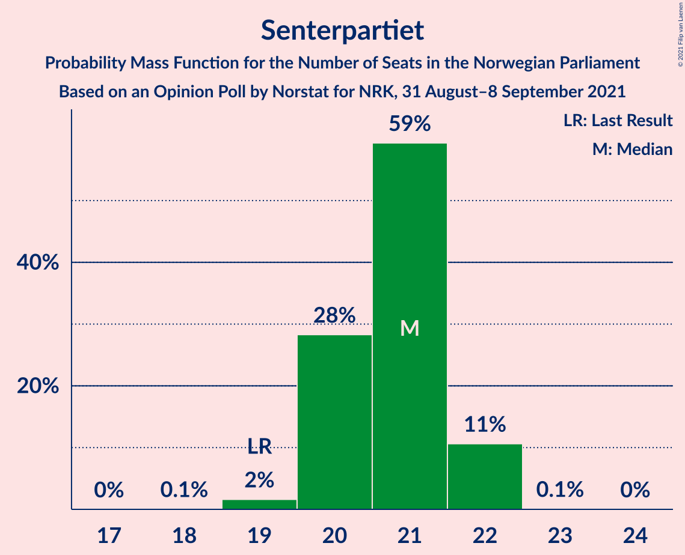
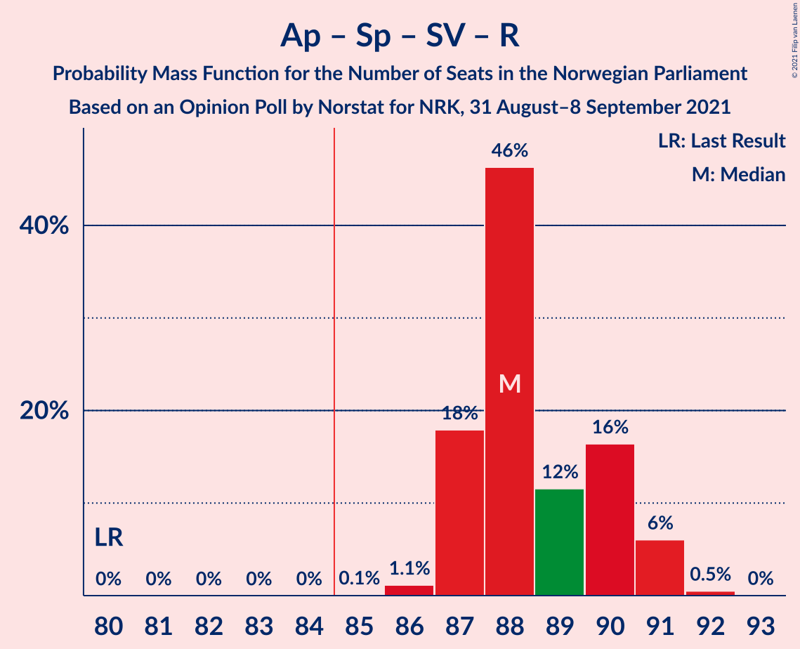
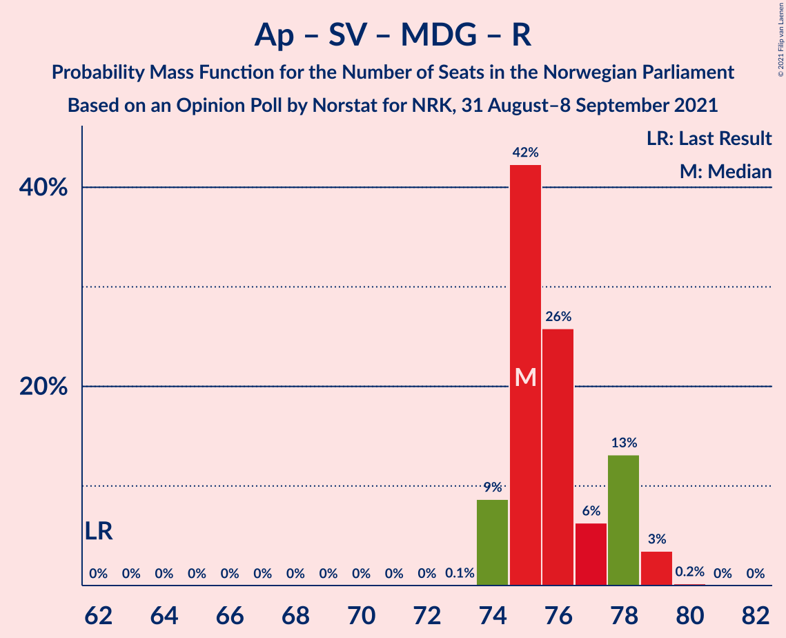

# Opinion Poll by Norstat for NRK, 31 August–8 September 2021

<a href="#voting-intentions">Voting Intentions</a> | <a href="#seats">Seats</a> | <a href="#coalitions">Coalitions</a> | <a href="#technical-information">Technical Information</a>

## Voting Intentions

### Confidence Intervals

| Party | Last Result | Poll Result | 80% Confidence Interval | 90% Confidence Interval | 95% Confidence Interval | 99% Confidence Interval |
|:-----:|:-----------:|:-----------:|:-----------------------:|:-----------------------:|:-----------------------:|:-----------------------:|
| Arbeiderpartiet | 27.4% | 24.7% | 24.2–25.3% |24.1–25.4% |23.9–25.5% |23.7–25.8% |
| Høyre | 25.0% | 20.4% | 19.9–20.9% |19.8–21.0% |19.7–21.2% |19.5–21.4% |
| Fremskrittspartiet | 15.2% | 12.0% | 11.6–12.4% |11.5–12.5% |11.4–12.6% |11.2–12.8% |
| Senterpartiet | 10.3% | 11.9% | 11.5–12.3% |11.4–12.4% |11.3–12.5% |11.1–12.7% |
| Sosialistisk Venstreparti | 6.0% | 8.9% | 8.6–9.3% |8.5–9.4% |8.4–9.4% |8.2–9.6% |
| Rødt | 2.4% | 4.9% | 4.6–5.2% |4.6–5.3% |4.5–5.3% |4.4–5.5% |
| Miljøpartiet De Grønne | 3.2% | 4.9% | 4.6–5.2% |4.6–5.3% |4.5–5.3% |4.4–5.5% |
| Venstre | 4.4% | 4.9% | 4.6–5.2% |4.6–5.3% |4.5–5.3% |4.4–5.5% |
| Kristelig Folkeparti | 4.2% | 4.2% | 4.0–4.5% |3.9–4.5% |3.8–4.6% |3.7–4.7% |

*Note:* The poll result column reflects the actual value used in the calculations. Published results may vary slightly, and in addition be rounded to fewer digits.

## Seats

### Confidence Intervals

| Party | Last Result | Median | 80% Confidence Interval | 90% Confidence Interval | 95% Confidence Interval | 99% Confidence Interval |
|:-----:|:-----------:|:------:|:-----------------------:|:-----------------------:|:-----------------------:|:-----------------------:|
| <a href="#arbeiderpartiet">Arbeiderpartiet</a> | 49 | 44 | 43–45 |43–45 |43–46 |43–47 |
| <a href="#høyre">Høyre</a> | 45 | 36 | 36 |36–37 |36–37 |36–38 |
| <a href="#fremskrittspartiet">Fremskrittspartiet</a> | 27 | 22 | 20–22 |20–22 |20–22 |19–22 |
| <a href="#senterpartiet">Senterpartiet</a> | 19 | 21 | 20–22 |20–22 |20–22 |19–22 |
| <a href="#sosialistisk-venstreparti">Sosialistisk Venstreparti</a> | 11 | 15 | 14–16 |14–16 |14–16 |14–17 |
| <a href="#rødt">Rødt</a> | 1 | 8 | 8–9 |8–9 |8–9 |7–9 |
| <a href="#miljøpartiet-de-grønne">Miljøpartiet De Grønne</a> | 1 | 8 | 8–9 |8–9 |8–9 |8–9 |
| <a href="#venstre">Venstre</a> | 8 | 8 | 8 |8–9 |8–9 |8–9 |
| <a href="#kristelig-folkeparti">Kristelig Folkeparti</a> | 8 | 7 | 3–8 |3–8 |3–8 |3–8 |

### Arbeiderpartiet

*For a full overview of the results for this party, see the [Arbeiderpartiet](party-arbeiderpartiet.html) page.*

| Number of Seats | Probability | Accumulated | Special Marks |
|:---------------:|:-----------:|:-----------:|:-------------:|
| 42 | 0.3% | 100% |  |
| 43 | 13% | 99.7% |  |
| 44 | 42% | 87% | Median |
| 45 | 42% | 45% |  |
| 46 | 2% | 3% |  |
| 47 | 0.7% | 1.0% |  |
| 48 | 0.3% | 0.3% |  |
| 49 | 0% | 0% | Last Result |

### Høyre

*For a full overview of the results for this party, see the [Høyre](party-høyre.html) page.*

| Number of Seats | Probability | Accumulated | Special Marks |
|:---------------:|:-----------:|:-----------:|:-------------:|
| 35 | 0.1% | 100% |  |
| 36 | 93% | 99.9% | Median |
| 37 | 5% | 7% |  |
| 38 | 1.5% | 2% |  |
| 39 | 0% | 0% |  |
| 40 | 0% | 0% |  |
| 41 | 0% | 0% |  |
| 42 | 0% | 0% |  |
| 43 | 0% | 0% |  |
| 44 | 0% | 0% |  |
| 45 | 0% | 0% | Last Result |

### Fremskrittspartiet

*For a full overview of the results for this party, see the [Fremskrittspartiet](party-fremskrittspartiet.html) page.*

| Number of Seats | Probability | Accumulated | Special Marks |
|:---------------:|:-----------:|:-----------:|:-------------:|
| 18 | 0.1% | 100% |  |
| 19 | 2% | 99.9% |  |
| 20 | 26% | 98% |  |
| 21 | 8% | 72% |  |
| 22 | 63% | 63% | Median |
| 23 | 0.2% | 0.3% |  |
| 24 | 0.1% | 0.1% |  |
| 25 | 0% | 0% |  |
| 26 | 0% | 0% |  |
| 27 | 0% | 0% | Last Result |

### Senterpartiet

*For a full overview of the results for this party, see the [Senterpartiet](party-senterpartiet.html) page.*

| Number of Seats | Probability | Accumulated | Special Marks |
|:---------------:|:-----------:|:-----------:|:-------------:|
| 19 | 2% | 100% | Last Result |
| 20 | 27% | 98% |  |
| 21 | 57% | 71% | Median |
| 22 | 14% | 14% |  |
| 23 | 0.1% | 0.1% |  |
| 24 | 0% | 0% |  |

### Sosialistisk Venstreparti

*For a full overview of the results for this party, see the [Sosialistisk Venstreparti](party-sosialistiskvenstreparti.html) page.*

| Number of Seats | Probability | Accumulated | Special Marks |
|:---------------:|:-----------:|:-----------:|:-------------:|
| 11 | 0% | 100% | Last Result |
| 12 | 0.1% | 100% |  |
| 13 | 0.1% | 99.9% |  |
| 14 | 27% | 99.8% |  |
| 15 | 45% | 73% | Median |
| 16 | 27% | 28% |  |
| 17 | 0.8% | 0.8% |  |
| 18 | 0% | 0% |  |

### Rødt

*For a full overview of the results for this party, see the [Rødt](party-rødt.html) page.*

| Number of Seats | Probability | Accumulated | Special Marks |
|:---------------:|:-----------:|:-----------:|:-------------:|
| 1 | 0% | 100% | Last Result |
| 2 | 0% | 100% |  |
| 3 | 0% | 100% |  |
| 4 | 0% | 100% |  |
| 5 | 0% | 100% |  |
| 6 | 0% | 100% |  |
| 7 | 1.0% | 100% |  |
| 8 | 52% | 99.0% | Median |
| 9 | 47% | 47% |  |
| 10 | 0.1% | 0.1% |  |
| 11 | 0% | 0% |  |

### Miljøpartiet De Grønne

*For a full overview of the results for this party, see the [Miljøpartiet De Grønne](party-miljøpartietdegrønne.html) page.*

| Number of Seats | Probability | Accumulated | Special Marks |
|:---------------:|:-----------:|:-----------:|:-------------:|
| 1 | 0% | 100% | Last Result |
| 2 | 0% | 100% |  |
| 3 | 0% | 100% |  |
| 4 | 0% | 100% |  |
| 5 | 0% | 100% |  |
| 6 | 0% | 100% |  |
| 7 | 0.2% | 100% |  |
| 8 | 74% | 99.8% | Median |
| 9 | 26% | 26% |  |
| 10 | 0.1% | 0.1% |  |
| 11 | 0% | 0% |  |

### Venstre

*For a full overview of the results for this party, see the [Venstre](party-venstre.html) page.*

| Number of Seats | Probability | Accumulated | Special Marks |
|:---------------:|:-----------:|:-----------:|:-------------:|
| 7 | 0.3% | 100% |  |
| 8 | 91% | 99.7% | Last Result, Median |
| 9 | 9% | 9% |  |
| 10 | 0% | 0% |  |

### Kristelig Folkeparti

*For a full overview of the results for this party, see the [Kristelig Folkeparti](party-kristeligfolkeparti.html) page.*

| Number of Seats | Probability | Accumulated | Special Marks |
|:---------------:|:-----------:|:-----------:|:-------------:|
| 3 | 16% | 100% |  |
| 4 | 0% | 84% |  |
| 5 | 0% | 84% |  |
| 6 | 0% | 84% |  |
| 7 | 62% | 84% | Median |
| 8 | 22% | 22% | Last Result |
| 9 | 0% | 0% |  |

## Coalitions

### Confidence Intervals

| Coalition | Last Result | Median | Majority? | 80% Confidence Interval | 90% Confidence Interval | 95% Confidence Interval | 99% Confidence Interval |
|:---------:|:-----------:|:------:|:---------:|:-----------------------:|:-----------------------:|:-----------------------:|:-----------------------:|
| Arbeiderpartiet – Senterpartiet – Sosialistisk Venstreparti – Miljøpartiet De Grønne – Rødt | 81 | 96 | 100% | 95–100 | 95–100 | 95–100 | 94–100 |
| Arbeiderpartiet – Senterpartiet – Sosialistisk Venstreparti – Miljøpartiet De Grønne – Kristelig Folkeparti | 88 | 95 | 100% | 94–96 | 94–96 | 93–97 | 93–98 |
| Høyre – Fremskrittspartiet – Senterpartiet – Venstre – Kristelig Folkeparti | 107 | 93 | 100% | 91–95 | 90–95 | 90–95 | 90–95 |
| Arbeiderpartiet – Senterpartiet – Sosialistisk Venstreparti – Miljøpartiet De Grønne | 80 | 88 | 100% | 87–91 | 87–91 | 87–91 | 86–91 |
| Arbeiderpartiet – Senterpartiet – Sosialistisk Venstreparti – Rødt | 80 | 88 | 100% | 87–91 | 87–91 | 87–91 | 86–91 |
| Arbeiderpartiet – Senterpartiet – Sosialistisk Venstreparti | 79 | 80 | 0% | 79–82 | 79–82 | 79–82 | 78–83 |
| Høyre – Fremskrittspartiet – Miljøpartiet De Grønne – Venstre – Kristelig Folkeparti | 89 | 81 | 0% | 78–82 | 78–82 | 78–82 | 78–83 |
| Arbeiderpartiet – Senterpartiet – Miljøpartiet De Grønne – Kristelig Folkeparti | 77 | 80 | 0% | 78–81 | 78–81 | 77–82 | 76–83 |
| Arbeiderpartiet – Sosialistisk Venstreparti – Miljøpartiet De Grønne – Rødt | 62 | 76 | 0% | 74–78 | 74–79 | 74–79 | 74–79 |
| Arbeiderpartiet – Senterpartiet – Kristelig Folkeparti | 76 | 72 | 0% | 69–73 | 69–73 | 69–74 | 67–75 |
| Høyre – Fremskrittspartiet – Venstre – Kristelig Folkeparti | 88 | 73 | 0% | 69–74 | 69–74 | 69–74 | 69–75 |
| Høyre – Fremskrittspartiet – Venstre | 80 | 66 | 0% | 64–66 | 64–67 | 64–67 | 63–68 |
| Arbeiderpartiet – Senterpartiet | 68 | 65 | 0% | 64–66 | 64–66 | 63–67 | 63–68 |
| Arbeiderpartiet – Sosialistisk Venstreparti | 60 | 59 | 0% | 58–61 | 58–61 | 58–61 | 58–62 |
| Høyre – Fremskrittspartiet | 72 | 58 | 0% | 56–58 | 56–58 | 56–59 | 55–60 |
| Høyre – Venstre – Kristelig Folkeparti | 61 | 51 | 0% | 48–52 | 47–52 | 47–53 | 47–54 |
| Senterpartiet – Venstre – Kristelig Folkeparti | 35 | 36 | 0% | 33–37 | 32–37 | 32–37 | 32–38 |

### Arbeiderpartiet – Senterpartiet – Sosialistisk Venstreparti – Miljøpartiet De Grønne – Rødt

| Number of Seats | Probability | Accumulated | Special Marks |
|:---------------:|:-----------:|:-----------:|:-------------:|
| 81 | 0% | 100% | Last Result |
| 82 | 0% | 100% |  |
| 83 | 0% | 100% |  |
| 84 | 0% | 100% |  |
| 85 | 0% | 100% | Majority |
| 86 | 0% | 100% |  |
| 87 | 0% | 100% |  |
| 88 | 0% | 100% |  |
| 89 | 0% | 100% |  |
| 90 | 0% | 100% |  |
| 91 | 0% | 100% |  |
| 92 | 0% | 100% |  |
| 93 | 0.5% | 100% |  |
| 94 | 0.8% | 99.5% |  |
| 95 | 12% | 98.8% |  |
| 96 | 41% | 86% | Median |
| 97 | 12% | 45% |  |
| 98 | 17% | 34% |  |
| 99 | 5% | 17% |  |
| 100 | 12% | 12% |  |
| 101 | 0% | 0.1% |  |
| 102 | 0% | 0% |  |

### Arbeiderpartiet – Senterpartiet – Sosialistisk Venstreparti – Miljøpartiet De Grønne – Kristelig Folkeparti

| Number of Seats | Probability | Accumulated | Special Marks |
|:---------------:|:-----------:|:-----------:|:-------------:|
| 88 | 0% | 100% | Last Result |
| 89 | 0% | 100% |  |
| 90 | 0% | 100% |  |
| 91 | 0% | 100% |  |
| 92 | 0.4% | 100% |  |
| 93 | 4% | 99.6% |  |
| 94 | 22% | 95% |  |
| 95 | 44% | 74% | Median |
| 96 | 25% | 29% |  |
| 97 | 2% | 4% |  |
| 98 | 2% | 2% |  |
| 99 | 0% | 0% |  |

### Høyre – Fremskrittspartiet – Senterpartiet – Venstre – Kristelig Folkeparti

| Number of Seats | Probability | Accumulated | Special Marks |
|:---------------:|:-----------:|:-----------:|:-------------:|
| 89 | 0% | 100% |  |
| 90 | 10% | 99.9% |  |
| 91 | 13% | 90% |  |
| 92 | 12% | 77% |  |
| 93 | 18% | 65% |  |
| 94 | 36% | 47% | Median |
| 95 | 11% | 11% |  |
| 96 | 0% | 0% |  |
| 97 | 0% | 0% |  |
| 98 | 0% | 0% |  |
| 99 | 0% | 0% |  |
| 100 | 0% | 0% |  |
| 101 | 0% | 0% |  |
| 102 | 0% | 0% |  |
| 103 | 0% | 0% |  |
| 104 | 0% | 0% |  |
| 105 | 0% | 0% |  |
| 106 | 0% | 0% |  |
| 107 | 0% | 0% | Last Result |

### Arbeiderpartiet – Senterpartiet – Sosialistisk Venstreparti – Miljøpartiet De Grønne

| Number of Seats | Probability | Accumulated | Special Marks |
|:---------------:|:-----------:|:-----------:|:-------------:|
| 80 | 0% | 100% | Last Result |
| 81 | 0% | 100% |  |
| 82 | 0% | 100% |  |
| 83 | 0% | 100% |  |
| 84 | 0% | 100% |  |
| 85 | 0.5% | 100% | Majority |
| 86 | 0.2% | 99.5% |  |
| 87 | 20% | 99.3% |  |
| 88 | 43% | 79% | Median |
| 89 | 17% | 36% |  |
| 90 | 4% | 18% |  |
| 91 | 14% | 14% |  |
| 92 | 0.2% | 0.3% |  |
| 93 | 0% | 0% |  |

### Arbeiderpartiet – Senterpartiet – Sosialistisk Venstreparti – Rødt

| Number of Seats | Probability | Accumulated | Special Marks |
|:---------------:|:-----------:|:-----------:|:-------------:|
| 80 | 0% | 100% | Last Result |
| 81 | 0% | 100% |  |
| 82 | 0% | 100% |  |
| 83 | 0% | 100% |  |
| 84 | 0% | 100% |  |
| 85 | 0.5% | 100% | Majority |
| 86 | 0.8% | 99.5% |  |
| 87 | 13% | 98.8% |  |
| 88 | 44% | 86% | Median |
| 89 | 16% | 42% |  |
| 90 | 12% | 26% |  |
| 91 | 13% | 14% |  |
| 92 | 0.3% | 0.4% |  |
| 93 | 0% | 0% |  |

### Arbeiderpartiet – Senterpartiet – Sosialistisk Venstreparti

| Number of Seats | Probability | Accumulated | Special Marks |
|:---------------:|:-----------:|:-----------:|:-------------:|
| 77 | 0.5% | 100% |  |
| 78 | 0.6% | 99.5% |  |
| 79 | 23% | 99.0% | Last Result |
| 80 | 48% | 76% | Median |
| 81 | 12% | 28% |  |
| 82 | 13% | 15% |  |
| 83 | 2% | 2% |  |
| 84 | 0.2% | 0.2% |  |
| 85 | 0% | 0% | Majority |

### Høyre – Fremskrittspartiet – Miljøpartiet De Grønne – Venstre – Kristelig Folkeparti

| Number of Seats | Probability | Accumulated | Special Marks |
|:---------------:|:-----------:|:-----------:|:-------------:|
| 77 | 0.3% | 100% |  |
| 78 | 13% | 99.6% |  |
| 79 | 12% | 86% |  |
| 80 | 16% | 74% |  |
| 81 | 44% | 58% | Median |
| 82 | 13% | 14% |  |
| 83 | 0.8% | 1.2% |  |
| 84 | 0.5% | 0.5% |  |
| 85 | 0% | 0% | Majority |
| 86 | 0% | 0% |  |
| 87 | 0% | 0% |  |
| 88 | 0% | 0% |  |
| 89 | 0% | 0% | Last Result |

### Arbeiderpartiet – Senterpartiet – Miljøpartiet De Grønne – Kristelig Folkeparti

| Number of Seats | Probability | Accumulated | Special Marks |
|:---------------:|:-----------:|:-----------:|:-------------:|
| 76 | 0.6% | 100% |  |
| 77 | 2% | 99.4% | Last Result |
| 78 | 15% | 97% |  |
| 79 | 10% | 83% |  |
| 80 | 27% | 72% | Median |
| 81 | 43% | 46% |  |
| 82 | 0.3% | 3% |  |
| 83 | 2% | 2% |  |
| 84 | 0.3% | 0.3% |  |
| 85 | 0% | 0% | Majority |

### Arbeiderpartiet – Sosialistisk Venstreparti – Miljøpartiet De Grønne – Rødt

| Number of Seats | Probability | Accumulated | Special Marks |
|:---------------:|:-----------:|:-----------:|:-------------:|
| 62 | 0% | 100% | Last Result |
| 63 | 0% | 100% |  |
| 64 | 0% | 100% |  |
| 65 | 0% | 100% |  |
| 66 | 0% | 100% |  |
| 67 | 0% | 100% |  |
| 68 | 0% | 100% |  |
| 69 | 0% | 100% |  |
| 70 | 0% | 100% |  |
| 71 | 0% | 100% |  |
| 72 | 0% | 100% |  |
| 73 | 0% | 100% |  |
| 74 | 11% | 100% |  |
| 75 | 36% | 89% | Median |
| 76 | 18% | 53% |  |
| 77 | 12% | 35% |  |
| 78 | 13% | 23% |  |
| 79 | 10% | 10% |  |
| 80 | 0% | 0.1% |  |
| 81 | 0% | 0% |  |

### Arbeiderpartiet – Senterpartiet – Kristelig Folkeparti

| Number of Seats | Probability | Accumulated | Special Marks |
|:---------------:|:-----------:|:-----------:|:-------------:|
| 67 | 0.6% | 100% |  |
| 68 | 1.4% | 99.4% |  |
| 69 | 14% | 98% |  |
| 70 | 2% | 84% |  |
| 71 | 10% | 82% |  |
| 72 | 37% | 72% | Median |
| 73 | 33% | 35% |  |
| 74 | 0.4% | 3% |  |
| 75 | 2% | 2% |  |
| 76 | 0.3% | 0.3% | Last Result |
| 77 | 0% | 0% |  |

### Høyre – Fremskrittspartiet – Venstre – Kristelig Folkeparti

| Number of Seats | Probability | Accumulated | Special Marks |
|:---------------:|:-----------:|:-----------:|:-------------:|
| 68 | 0% | 100% |  |
| 69 | 12% | 99.9% |  |
| 70 | 5% | 88% |  |
| 71 | 17% | 83% |  |
| 72 | 12% | 66% |  |
| 73 | 41% | 55% | Median |
| 74 | 12% | 14% |  |
| 75 | 0.8% | 1.2% |  |
| 76 | 0.5% | 0.5% |  |
| 77 | 0% | 0% |  |
| 78 | 0% | 0% |  |
| 79 | 0% | 0% |  |
| 80 | 0% | 0% |  |
| 81 | 0% | 0% |  |
| 82 | 0% | 0% |  |
| 83 | 0% | 0% |  |
| 84 | 0% | 0% |  |
| 85 | 0% | 0% | Majority |
| 86 | 0% | 0% |  |
| 87 | 0% | 0% |  |
| 88 | 0% | 0% | Last Result |

### Høyre – Fremskrittspartiet – Venstre

| Number of Seats | Probability | Accumulated | Special Marks |
|:---------------:|:-----------:|:-----------:|:-------------:|
| 62 | 0.2% | 100% |  |
| 63 | 2% | 99.8% |  |
| 64 | 26% | 98% |  |
| 65 | 3% | 72% |  |
| 66 | 61% | 69% | Median |
| 67 | 5% | 8% |  |
| 68 | 2% | 2% |  |
| 69 | 0% | 0% |  |
| 70 | 0% | 0% |  |
| 71 | 0% | 0% |  |
| 72 | 0% | 0% |  |
| 73 | 0% | 0% |  |
| 74 | 0% | 0% |  |
| 75 | 0% | 0% |  |
| 76 | 0% | 0% |  |
| 77 | 0% | 0% |  |
| 78 | 0% | 0% |  |
| 79 | 0% | 0% |  |
| 80 | 0% | 0% | Last Result |

### Arbeiderpartiet – Senterpartiet

| Number of Seats | Probability | Accumulated | Special Marks |
|:---------------:|:-----------:|:-----------:|:-------------:|
| 62 | 0.4% | 100% |  |
| 63 | 2% | 99.6% |  |
| 64 | 15% | 97% |  |
| 65 | 50% | 83% | Median |
| 66 | 30% | 33% |  |
| 67 | 0.5% | 3% |  |
| 68 | 2% | 2% | Last Result |
| 69 | 0.4% | 0.4% |  |
| 70 | 0% | 0% |  |

### Arbeiderpartiet – Sosialistisk Venstreparti

| Number of Seats | Probability | Accumulated | Special Marks |
|:---------------:|:-----------:|:-----------:|:-------------:|
| 57 | 0.1% | 100% |  |
| 58 | 11% | 99.9% |  |
| 59 | 56% | 89% | Median |
| 60 | 19% | 33% | Last Result |
| 61 | 13% | 14% |  |
| 62 | 0.8% | 1.0% |  |
| 63 | 0.2% | 0.2% |  |
| 64 | 0% | 0% |  |

### Høyre – Fremskrittspartiet

| Number of Seats | Probability | Accumulated | Special Marks |
|:---------------:|:-----------:|:-----------:|:-------------:|
| 54 | 0.1% | 100% |  |
| 55 | 2% | 99.9% |  |
| 56 | 26% | 98% |  |
| 57 | 5% | 72% |  |
| 58 | 63% | 67% | Median |
| 59 | 2% | 4% |  |
| 60 | 1.3% | 1.3% |  |
| 61 | 0% | 0% |  |
| 62 | 0% | 0% |  |
| 63 | 0% | 0% |  |
| 64 | 0% | 0% |  |
| 65 | 0% | 0% |  |
| 66 | 0% | 0% |  |
| 67 | 0% | 0% |  |
| 68 | 0% | 0% |  |
| 69 | 0% | 0% |  |
| 70 | 0% | 0% |  |
| 71 | 0% | 0% |  |
| 72 | 0% | 0% | Last Result |

### Høyre – Venstre – Kristelig Folkeparti

| Number of Seats | Probability | Accumulated | Special Marks |
|:---------------:|:-----------:|:-----------:|:-------------:|
| 47 | 9% | 100% |  |
| 48 | 4% | 91% |  |
| 49 | 2% | 87% |  |
| 50 | 0.3% | 84% |  |
| 51 | 58% | 84% | Median |
| 52 | 22% | 26% |  |
| 53 | 3% | 3% |  |
| 54 | 0.5% | 0.5% |  |
| 55 | 0% | 0% |  |
| 56 | 0% | 0% |  |
| 57 | 0% | 0% |  |
| 58 | 0% | 0% |  |
| 59 | 0% | 0% |  |
| 60 | 0% | 0% |  |
| 61 | 0% | 0% | Last Result |

### Senterpartiet – Venstre – Kristelig Folkeparti

| Number of Seats | Probability | Accumulated | Special Marks |
|:---------------:|:-----------:|:-----------:|:-------------:|
| 32 | 10% | 100% |  |
| 33 | 3% | 90% |  |
| 34 | 4% | 87% |  |
| 35 | 19% | 84% | Last Result |
| 36 | 43% | 65% | Median |
| 37 | 20% | 22% |  |
| 38 | 2% | 2% |  |
| 39 | 0% | 0% |  |

## Technical Information

### Opinion Poll

+ **Polling firm:** Norstat
+ **Commissioner(s):** NRK
+ **Fieldwork period:** 31 August–8 September 2021

### Calculations

+ **Sample size:** 11500
+ **Simulations done:** 131,072
+ **Error estimate:** 0.50%

