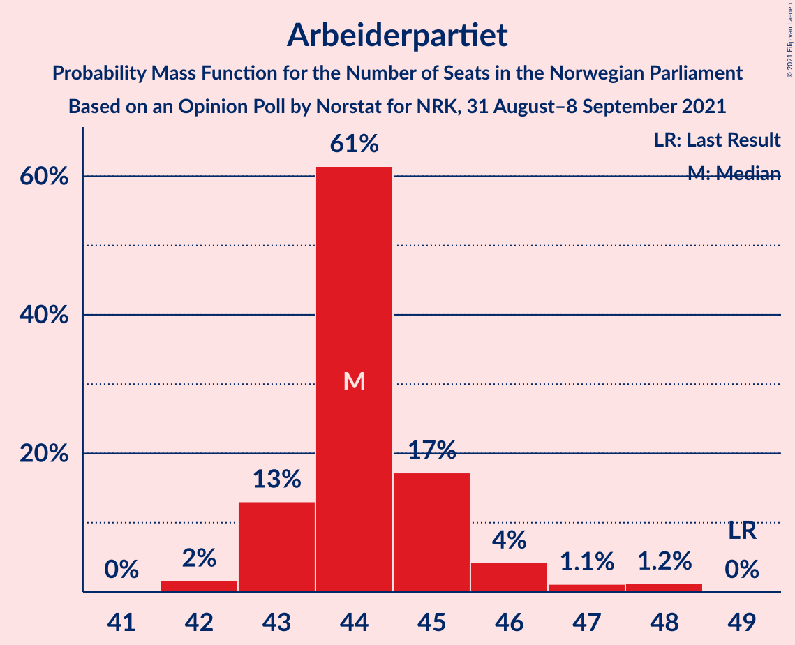
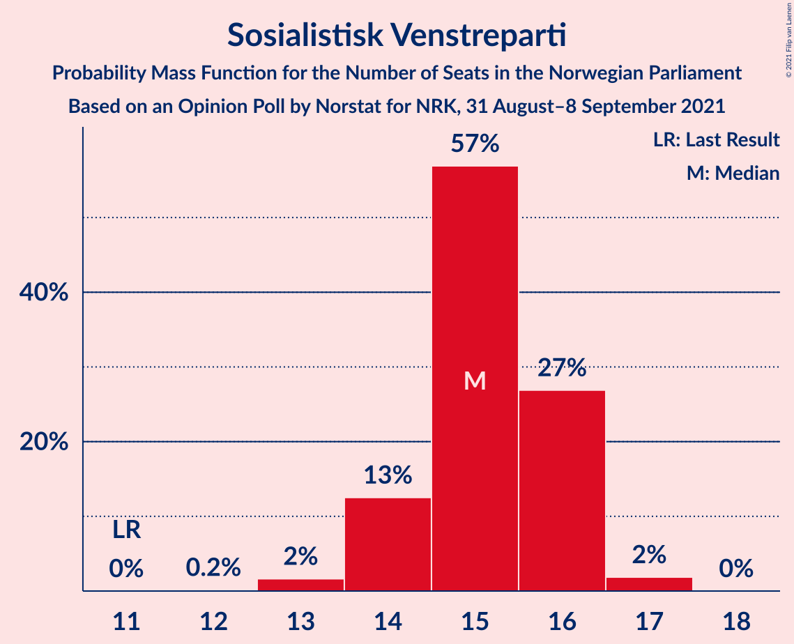
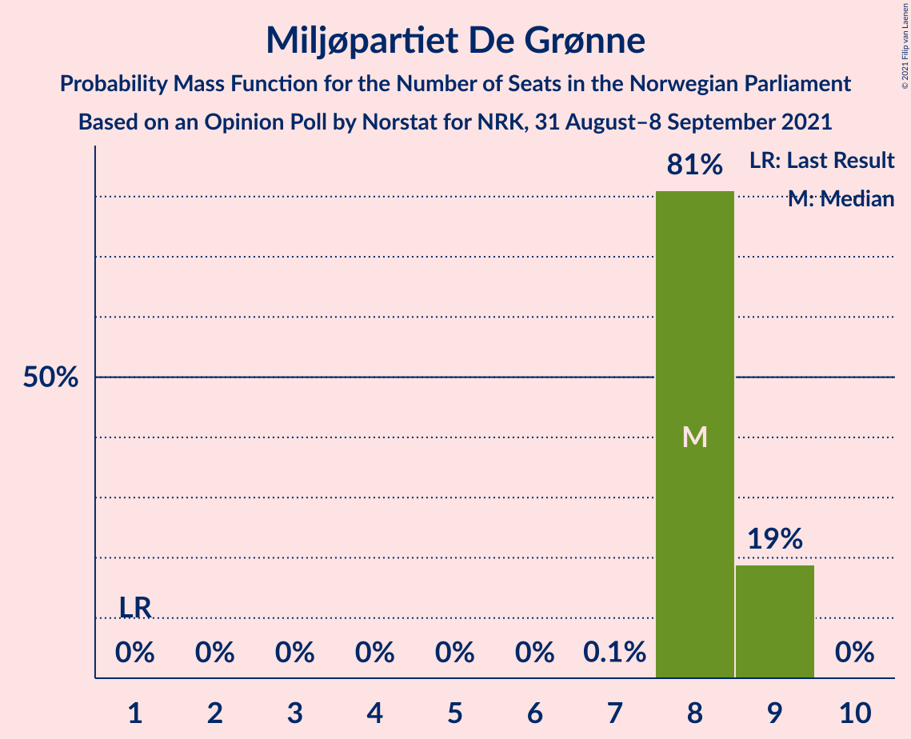
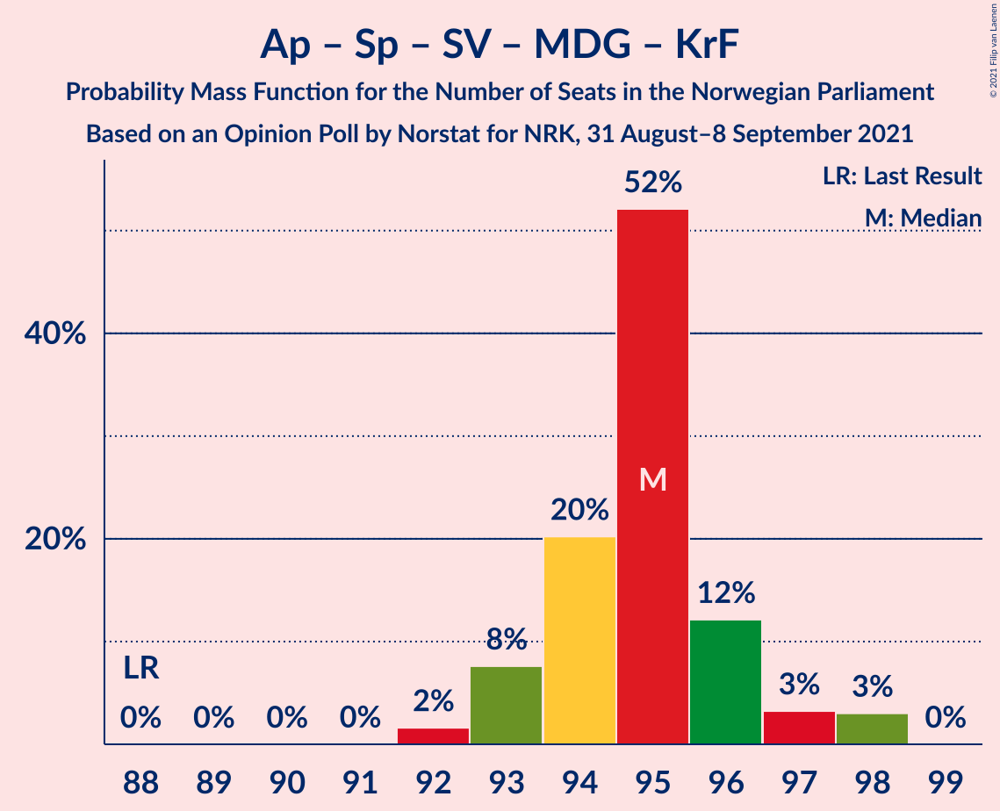
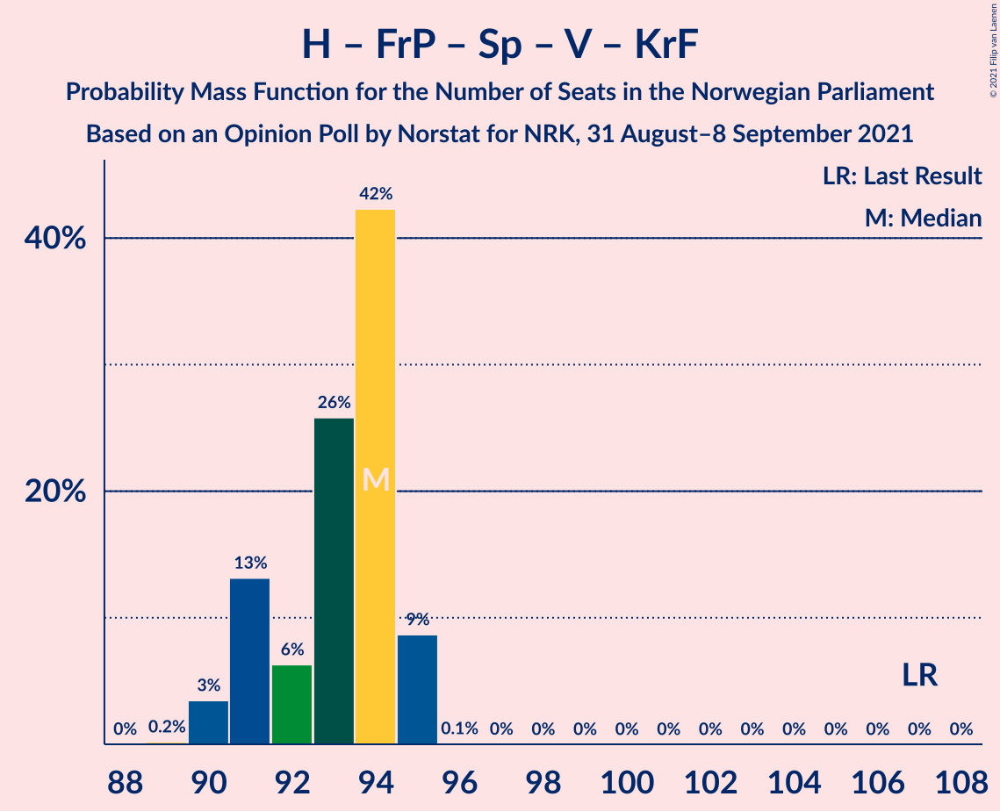
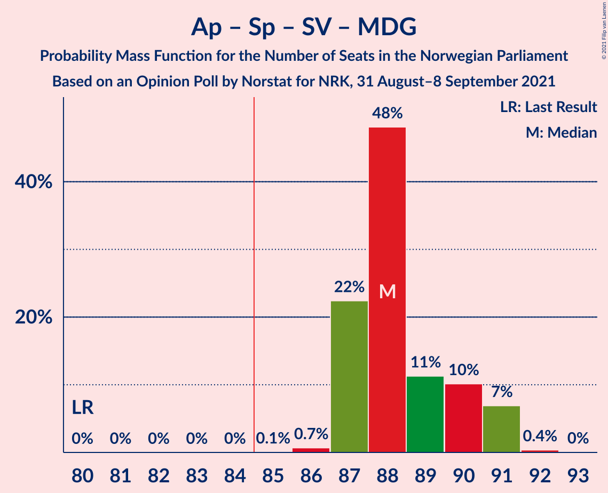
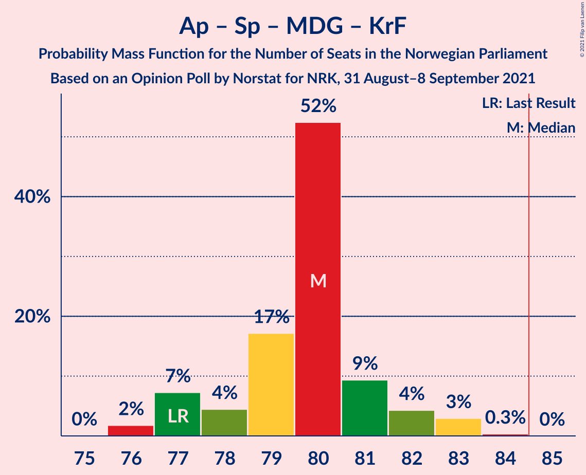
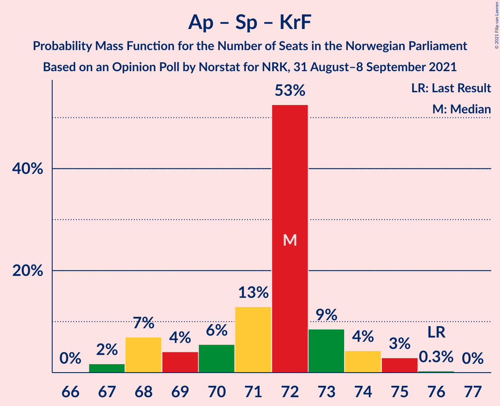
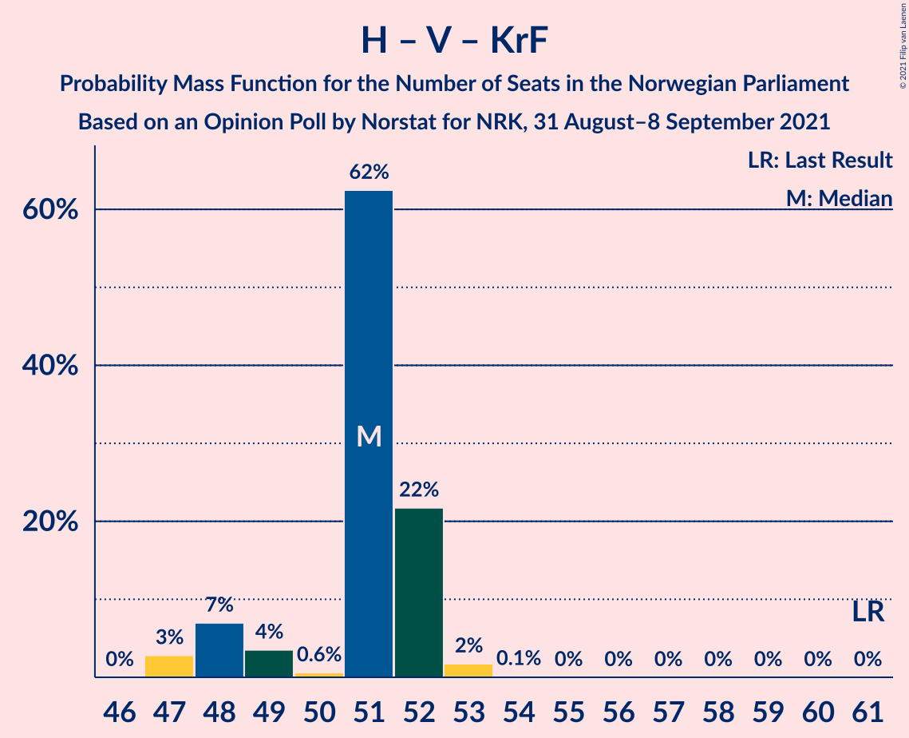
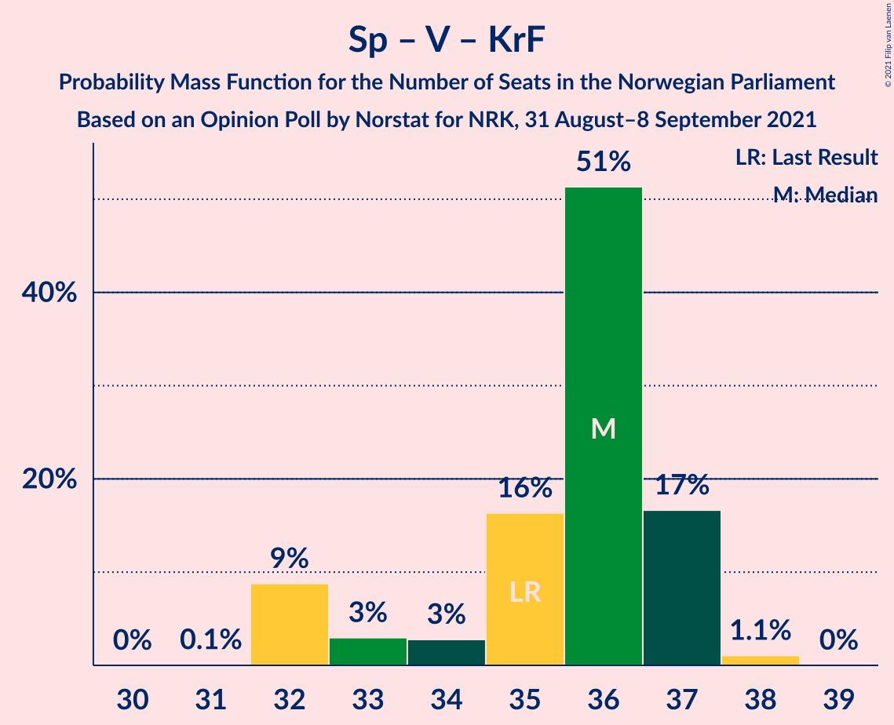

# Opinion Poll by Norstat for NRK, 31 August–8 September 2021

<a href="#voting-intentions">Voting Intentions</a> | <a href="#seats">Seats</a> | <a href="#coalitions">Coalitions</a> | <a href="#technical-information">Technical Information</a>

## Voting Intentions

### Confidence Intervals

| Party | Last Result | Poll Result | 80% Confidence Interval | 90% Confidence Interval | 95% Confidence Interval | 99% Confidence Interval |
|:-----:|:-----------:|:-----------:|:-----------------------:|:-----------------------:|:-----------------------:|:-----------------------:|
| Arbeiderpartiet | 27.4% | 24.7% | 24.2–25.3% |24.1–25.4% |23.9–25.5% |23.7–25.8% |
| Høyre | 25.0% | 20.4% | 19.9–20.9% |19.8–21.0% |19.7–21.2% |19.5–21.4% |
| Fremskrittspartiet | 15.2% | 12.0% | 11.6–12.4% |11.5–12.5% |11.4–12.6% |11.2–12.8% |
| Senterpartiet | 10.3% | 11.9% | 11.5–12.3% |11.4–12.4% |11.3–12.5% |11.1–12.7% |
| Sosialistisk Venstreparti | 6.0% | 8.9% | 8.6–9.3% |8.5–9.4% |8.4–9.4% |8.2–9.6% |
| Rødt | 2.4% | 4.9% | 4.6–5.2% |4.6–5.3% |4.5–5.3% |4.4–5.5% |
| Miljøpartiet De Grønne | 3.2% | 4.9% | 4.6–5.2% |4.6–5.3% |4.5–5.3% |4.4–5.5% |
| Venstre | 4.4% | 4.9% | 4.6–5.2% |4.6–5.3% |4.5–5.3% |4.4–5.5% |
| Kristelig Folkeparti | 4.2% | 4.2% | 4.0–4.5% |3.9–4.5% |3.8–4.6% |3.7–4.7% |

*Note:* The poll result column reflects the actual value used in the calculations. Published results may vary slightly, and in addition be rounded to fewer digits.

## Seats

### Confidence Intervals

| Party | Last Result | Median | 80% Confidence Interval | 90% Confidence Interval | 95% Confidence Interval | 99% Confidence Interval |
|:-----:|:-----------:|:------:|:-----------------------:|:-----------------------:|:-----------------------:|:-----------------------:|
| <a href="#arbeiderpartiet">Arbeiderpartiet</a> | 49 | 44 | 43–45 |43–46 |43–46 |42–48 |
| <a href="#høyre">Høyre</a> | 45 | 36 | 36–37 |36–37 |36–37 |36–38 |
| <a href="#fremskrittspartiet">Fremskrittspartiet</a> | 27 | 22 | 20–22 |20–22 |20–22 |19–23 |
| <a href="#senterpartiet">Senterpartiet</a> | 19 | 21 | 20–22 |20–22 |20–22 |19–22 |
| <a href="#sosialistisk-venstreparti">Sosialistisk Venstreparti</a> | 11 | 15 | 14–16 |14–16 |14–16 |13–17 |
| <a href="#rødt">Rødt</a> | 1 | 8 | 8–9 |8–9 |8–9 |7–9 |
| <a href="#miljøpartiet-de-grønne">Miljøpartiet De Grønne</a> | 1 | 8 | 8–9 |8–9 |8–9 |8–9 |
| <a href="#venstre">Venstre</a> | 8 | 8 | 8–9 |8–9 |8–9 |7–9 |
| <a href="#kristelig-folkeparti">Kristelig Folkeparti</a> | 8 | 7 | 3–8 |3–8 |3–8 |3–8 |

### Arbeiderpartiet

*For a full overview of the results for this party, see the [Arbeiderpartiet](party-arbeiderpartiet.html) page.*

| Number of Seats | Probability | Accumulated | Special Marks |
|:---------------:|:-----------:|:-----------:|:-------------:|
| 42 | 2% | 100% |  |
| 43 | 13% | 98% |  |
| 44 | 61% | 85% | Median |
| 45 | 17% | 24% |  |
| 46 | 4% | 7% |  |
| 47 | 1.1% | 2% |  |
| 48 | 1.2% | 1.2% |  |
| 49 | 0% | 0% | Last Result |

### Høyre

*For a full overview of the results for this party, see the [Høyre](party-høyre.html) page.*

| Number of Seats | Probability | Accumulated | Special Marks |
|:---------------:|:-----------:|:-----------:|:-------------:|
| 36 | 89% | 100% | Median |
| 37 | 11% | 11% |  |
| 38 | 0.9% | 0.9% |  |
| 39 | 0% | 0% |  |
| 40 | 0% | 0% |  |
| 41 | 0% | 0% |  |
| 42 | 0% | 0% |  |
| 43 | 0% | 0% |  |
| 44 | 0% | 0% |  |
| 45 | 0% | 0% | Last Result |

### Fremskrittspartiet

*For a full overview of the results for this party, see the [Fremskrittspartiet](party-fremskrittspartiet.html) page.*

| Number of Seats | Probability | Accumulated | Special Marks |
|:---------------:|:-----------:|:-----------:|:-------------:|
| 19 | 2% | 100% |  |
| 20 | 13% | 98% |  |
| 21 | 17% | 84% |  |
| 22 | 65% | 67% | Median |
| 23 | 2% | 2% |  |
| 24 | 0.4% | 0.5% |  |
| 25 | 0% | 0% |  |
| 26 | 0% | 0% |  |
| 27 | 0% | 0% | Last Result |

### Senterpartiet

*For a full overview of the results for this party, see the [Senterpartiet](party-senterpartiet.html) page.*

| Number of Seats | Probability | Accumulated | Special Marks |
|:---------------:|:-----------:|:-----------:|:-------------:|
| 18 | 0.1% | 100% |  |
| 19 | 2% | 99.9% | Last Result |
| 20 | 28% | 98% |  |
| 21 | 59% | 70% | Median |
| 22 | 11% | 11% |  |
| 23 | 0.1% | 0.1% |  |
| 24 | 0% | 0% |  |

### Sosialistisk Venstreparti

*For a full overview of the results for this party, see the [Sosialistisk Venstreparti](party-sosialistiskvenstreparti.html) page.*

| Number of Seats | Probability | Accumulated | Special Marks |
|:---------------:|:-----------:|:-----------:|:-------------:|
| 11 | 0% | 100% | Last Result |
| 12 | 0.2% | 100% |  |
| 13 | 2% | 99.8% |  |
| 14 | 13% | 98% |  |
| 15 | 57% | 86% | Median |
| 16 | 27% | 29% |  |
| 17 | 2% | 2% |  |
| 18 | 0% | 0% |  |

### Rødt

*For a full overview of the results for this party, see the [Rødt](party-rødt.html) page.*

| Number of Seats | Probability | Accumulated | Special Marks |
|:---------------:|:-----------:|:-----------:|:-------------:|
| 1 | 0% | 100% | Last Result |
| 2 | 0% | 100% |  |
| 3 | 0% | 100% |  |
| 4 | 0% | 100% |  |
| 5 | 0% | 100% |  |
| 6 | 0% | 100% |  |
| 7 | 2% | 100% |  |
| 8 | 63% | 98% | Median |
| 9 | 35% | 35% |  |
| 10 | 0% | 0% |  |

### Miljøpartiet De Grønne

*For a full overview of the results for this party, see the [Miljøpartiet De Grønne](party-miljøpartietdegrønne.html) page.*

| Number of Seats | Probability | Accumulated | Special Marks |
|:---------------:|:-----------:|:-----------:|:-------------:|
| 1 | 0% | 100% | Last Result |
| 2 | 0% | 100% |  |
| 3 | 0% | 100% |  |
| 4 | 0% | 100% |  |
| 5 | 0% | 100% |  |
| 6 | 0% | 100% |  |
| 7 | 0.1% | 100% |  |
| 8 | 81% | 99.9% | Median |
| 9 | 19% | 19% |  |
| 10 | 0% | 0% |  |

### Venstre

*For a full overview of the results for this party, see the [Venstre](party-venstre.html) page.*

| Number of Seats | Probability | Accumulated | Special Marks |
|:---------------:|:-----------:|:-----------:|:-------------:|
| 7 | 0.5% | 100% |  |
| 8 | 83% | 99.5% | Last Result, Median |
| 9 | 17% | 17% |  |
| 10 | 0.1% | 0.1% |  |
| 11 | 0% | 0% |  |

### Kristelig Folkeparti

*For a full overview of the results for this party, see the [Kristelig Folkeparti](party-kristeligfolkeparti.html) page.*

| Number of Seats | Probability | Accumulated | Special Marks |
|:---------------:|:-----------:|:-----------:|:-------------:|
| 3 | 13% | 100% |  |
| 4 | 0% | 87% |  |
| 5 | 0% | 87% |  |
| 6 | 0.3% | 87% |  |
| 7 | 75% | 86% | Median |
| 8 | 11% | 11% | Last Result |
| 9 | 0% | 0% |  |

## Coalitions

### Confidence Intervals

| Coalition | Last Result | Median | Majority? | 80% Confidence Interval | 90% Confidence Interval | 95% Confidence Interval | 99% Confidence Interval |
|:---------:|:-----------:|:------:|:---------:|:-----------------------:|:-----------------------:|:-----------------------:|:-----------------------:|
| Arbeiderpartiet – Senterpartiet – Sosialistisk Venstreparti – Miljøpartiet De Grønne – Rødt | 81 | 96 | 100% | 95–99 | 95–99 | 95–100 | 94–100 |
| Arbeiderpartiet – Senterpartiet – Sosialistisk Venstreparti – Miljøpartiet De Grønne – Kristelig Folkeparti | 88 | 95 | 100% | 94–96 | 93–97 | 93–98 | 92–98 |
| Høyre – Fremskrittspartiet – Senterpartiet – Venstre – Kristelig Folkeparti | 107 | 94 | 100% | 91–94 | 91–95 | 90–95 | 90–95 |
| Arbeiderpartiet – Senterpartiet – Sosialistisk Venstreparti – Miljøpartiet De Grønne | 80 | 88 | 100% | 87–90 | 87–91 | 87–91 | 86–91 |
| Arbeiderpartiet – Senterpartiet – Sosialistisk Venstreparti – Rødt | 80 | 88 | 100% | 87–90 | 87–91 | 87–91 | 86–92 |
| Arbeiderpartiet – Senterpartiet – Sosialistisk Venstreparti | 79 | 80 | 0% | 79–82 | 79–82 | 79–83 | 78–83 |
| Arbeiderpartiet – Senterpartiet – Miljøpartiet De Grønne – Kristelig Folkeparti | 77 | 80 | 0% | 78–81 | 77–82 | 77–83 | 76–83 |
| Høyre – Fremskrittspartiet – Miljøpartiet De Grønne – Venstre – Kristelig Folkeparti | 89 | 81 | 0% | 79–82 | 78–82 | 78–82 | 77–83 |
| Arbeiderpartiet – Sosialistisk Venstreparti – Miljøpartiet De Grønne – Rødt | 62 | 75 | 0% | 75–78 | 74–78 | 74–79 | 74–79 |
| Arbeiderpartiet – Senterpartiet – Kristelig Folkeparti | 76 | 72 | 0% | 69–73 | 68–74 | 68–75 | 67–75 |
| Høyre – Fremskrittspartiet – Venstre – Kristelig Folkeparti | 88 | 73 | 0% | 70–74 | 70–74 | 69–74 | 69–75 |
| Høyre – Fremskrittspartiet – Venstre | 80 | 66 | 0% | 64–67 | 64–67 | 64–68 | 63–68 |
| Arbeiderpartiet – Senterpartiet | 68 | 65 | 0% | 64–66 | 63–67 | 63–68 | 62–68 |
| Arbeiderpartiet – Sosialistisk Venstreparti | 60 | 59 | 0% | 58–61 | 58–61 | 58–61 | 57–63 |
| Høyre – Fremskrittspartiet | 72 | 58 | 0% | 56–58 | 56–59 | 56–59 | 55–60 |
| Høyre – Venstre – Kristelig Folkeparti | 61 | 51 | 0% | 49–52 | 48–52 | 47–52 | 47–53 |
| Senterpartiet – Venstre – Kristelig Folkeparti | 35 | 36 | 0% | 33–37 | 32–37 | 32–37 | 32–38 |

### Arbeiderpartiet – Senterpartiet – Sosialistisk Venstreparti – Miljøpartiet De Grønne – Rødt

| Number of Seats | Probability | Accumulated | Special Marks |
|:---------------:|:-----------:|:-----------:|:-------------:|
| 81 | 0% | 100% | Last Result |
| 82 | 0% | 100% |  |
| 83 | 0% | 100% |  |
| 84 | 0% | 100% |  |
| 85 | 0% | 100% | Majority |
| 86 | 0% | 100% |  |
| 87 | 0% | 100% |  |
| 88 | 0% | 100% |  |
| 89 | 0% | 100% |  |
| 90 | 0% | 100% |  |
| 91 | 0% | 100% |  |
| 92 | 0% | 100% |  |
| 93 | 0.1% | 100% |  |
| 94 | 0.8% | 99.9% |  |
| 95 | 14% | 99.1% |  |
| 96 | 49% | 85% | Median |
| 97 | 10% | 36% |  |
| 98 | 12% | 25% |  |
| 99 | 9% | 13% |  |
| 100 | 4% | 5% |  |
| 101 | 0.3% | 0.4% |  |
| 102 | 0% | 0% |  |

### Arbeiderpartiet – Senterpartiet – Sosialistisk Venstreparti – Miljøpartiet De Grønne – Kristelig Folkeparti

| Number of Seats | Probability | Accumulated | Special Marks |
|:---------------:|:-----------:|:-----------:|:-------------:|
| 88 | 0% | 100% | Last Result |
| 89 | 0% | 100% |  |
| 90 | 0% | 100% |  |
| 91 | 0% | 100% |  |
| 92 | 2% | 100% |  |
| 93 | 8% | 98% |  |
| 94 | 20% | 91% |  |
| 95 | 52% | 71% | Median |
| 96 | 12% | 18% |  |
| 97 | 3% | 6% |  |
| 98 | 3% | 3% |  |
| 99 | 0% | 0% |  |

### Høyre – Fremskrittspartiet – Senterpartiet – Venstre – Kristelig Folkeparti

| Number of Seats | Probability | Accumulated | Special Marks |
|:---------------:|:-----------:|:-----------:|:-------------:|
| 89 | 0.2% | 100% |  |
| 90 | 3% | 99.8% |  |
| 91 | 13% | 96% |  |
| 92 | 6% | 83% |  |
| 93 | 26% | 77% |  |
| 94 | 42% | 51% | Median |
| 95 | 9% | 9% |  |
| 96 | 0.1% | 0.1% |  |
| 97 | 0% | 0% |  |
| 98 | 0% | 0% |  |
| 99 | 0% | 0% |  |
| 100 | 0% | 0% |  |
| 101 | 0% | 0% |  |
| 102 | 0% | 0% |  |
| 103 | 0% | 0% |  |
| 104 | 0% | 0% |  |
| 105 | 0% | 0% |  |
| 106 | 0% | 0% |  |
| 107 | 0% | 0% | Last Result |

### Arbeiderpartiet – Senterpartiet – Sosialistisk Venstreparti – Miljøpartiet De Grønne

| Number of Seats | Probability | Accumulated | Special Marks |
|:---------------:|:-----------:|:-----------:|:-------------:|
| 80 | 0% | 100% | Last Result |
| 81 | 0% | 100% |  |
| 82 | 0% | 100% |  |
| 83 | 0% | 100% |  |
| 84 | 0% | 100% |  |
| 85 | 0.1% | 100% | Majority |
| 86 | 0.7% | 99.9% |  |
| 87 | 22% | 99.3% |  |
| 88 | 48% | 77% | Median |
| 89 | 11% | 29% |  |
| 90 | 10% | 17% |  |
| 91 | 7% | 7% |  |
| 92 | 0.4% | 0.4% |  |
| 93 | 0% | 0% |  |

### Arbeiderpartiet – Senterpartiet – Sosialistisk Venstreparti – Rødt

| Number of Seats | Probability | Accumulated | Special Marks |
|:---------------:|:-----------:|:-----------:|:-------------:|
| 80 | 0% | 100% | Last Result |
| 81 | 0% | 100% |  |
| 82 | 0% | 100% |  |
| 83 | 0% | 100% |  |
| 84 | 0% | 100% |  |
| 85 | 0.1% | 100% | Majority |
| 86 | 1.1% | 99.9% |  |
| 87 | 18% | 98.8% |  |
| 88 | 46% | 81% | Median |
| 89 | 12% | 35% |  |
| 90 | 16% | 23% |  |
| 91 | 6% | 7% |  |
| 92 | 0.5% | 0.5% |  |
| 93 | 0% | 0% |  |

### Arbeiderpartiet – Senterpartiet – Sosialistisk Venstreparti

| Number of Seats | Probability | Accumulated | Special Marks |
|:---------------:|:-----------:|:-----------:|:-------------:|
| 77 | 0.1% | 100% |  |
| 78 | 2% | 99.9% |  |
| 79 | 24% | 98% | Last Result |
| 80 | 47% | 73% | Median |
| 81 | 16% | 27% |  |
| 82 | 7% | 11% |  |
| 83 | 3% | 3% |  |
| 84 | 0.1% | 0.1% |  |
| 85 | 0% | 0% | Majority |

### Arbeiderpartiet – Senterpartiet – Miljøpartiet De Grønne – Kristelig Folkeparti

| Number of Seats | Probability | Accumulated | Special Marks |
|:---------------:|:-----------:|:-----------:|:-------------:|
| 76 | 2% | 100% |  |
| 77 | 7% | 98% | Last Result |
| 78 | 4% | 91% |  |
| 79 | 17% | 86% |  |
| 80 | 52% | 69% | Median |
| 81 | 9% | 17% |  |
| 82 | 4% | 8% |  |
| 83 | 3% | 3% |  |
| 84 | 0.3% | 0.3% |  |
| 85 | 0% | 0% | Majority |

### Høyre – Fremskrittspartiet – Miljøpartiet De Grønne – Venstre – Kristelig Folkeparti

| Number of Seats | Probability | Accumulated | Special Marks |
|:---------------:|:-----------:|:-----------:|:-------------:|
| 77 | 0.5% | 100% |  |
| 78 | 6% | 99.5% |  |
| 79 | 16% | 93% |  |
| 80 | 12% | 77% |  |
| 81 | 46% | 65% | Median |
| 82 | 18% | 19% |  |
| 83 | 1.1% | 1.2% |  |
| 84 | 0.1% | 0.1% |  |
| 85 | 0% | 0% | Majority |
| 86 | 0% | 0% |  |
| 87 | 0% | 0% |  |
| 88 | 0% | 0% |  |
| 89 | 0% | 0% | Last Result |

### Arbeiderpartiet – Sosialistisk Venstreparti – Miljøpartiet De Grønne – Rødt

| Number of Seats | Probability | Accumulated | Special Marks |
|:---------------:|:-----------:|:-----------:|:-------------:|
| 62 | 0% | 100% | Last Result |
| 63 | 0% | 100% |  |
| 64 | 0% | 100% |  |
| 65 | 0% | 100% |  |
| 66 | 0% | 100% |  |
| 67 | 0% | 100% |  |
| 68 | 0% | 100% |  |
| 69 | 0% | 100% |  |
| 70 | 0% | 100% |  |
| 71 | 0% | 100% |  |
| 72 | 0% | 100% |  |
| 73 | 0.1% | 100% |  |
| 74 | 9% | 99.9% |  |
| 75 | 42% | 91% | Median |
| 76 | 26% | 49% |  |
| 77 | 6% | 23% |  |
| 78 | 13% | 17% |  |
| 79 | 3% | 4% |  |
| 80 | 0.2% | 0.2% |  |
| 81 | 0% | 0% |  |

### Arbeiderpartiet – Senterpartiet – Kristelig Folkeparti

| Number of Seats | Probability | Accumulated | Special Marks |
|:---------------:|:-----------:|:-----------:|:-------------:|
| 67 | 2% | 100% |  |
| 68 | 7% | 98% |  |
| 69 | 4% | 91% |  |
| 70 | 6% | 87% |  |
| 71 | 13% | 82% |  |
| 72 | 53% | 69% | Median |
| 73 | 9% | 16% |  |
| 74 | 4% | 8% |  |
| 75 | 3% | 3% |  |
| 76 | 0.3% | 0.3% | Last Result |
| 77 | 0% | 0% |  |

### Høyre – Fremskrittspartiet – Venstre – Kristelig Folkeparti

| Number of Seats | Probability | Accumulated | Special Marks |
|:---------------:|:-----------:|:-----------:|:-------------:|
| 68 | 0.3% | 100% |  |
| 69 | 4% | 99.6% |  |
| 70 | 9% | 95% |  |
| 71 | 12% | 87% |  |
| 72 | 10% | 75% |  |
| 73 | 49% | 64% | Median |
| 74 | 14% | 15% |  |
| 75 | 0.8% | 0.9% |  |
| 76 | 0.1% | 0.1% |  |
| 77 | 0% | 0% |  |
| 78 | 0% | 0% |  |
| 79 | 0% | 0% |  |
| 80 | 0% | 0% |  |
| 81 | 0% | 0% |  |
| 82 | 0% | 0% |  |
| 83 | 0% | 0% |  |
| 84 | 0% | 0% |  |
| 85 | 0% | 0% | Majority |
| 86 | 0% | 0% |  |
| 87 | 0% | 0% |  |
| 88 | 0% | 0% | Last Result |

### Høyre – Fremskrittspartiet – Venstre

| Number of Seats | Probability | Accumulated | Special Marks |
|:---------------:|:-----------:|:-----------:|:-------------:|
| 62 | 0.1% | 100% |  |
| 63 | 2% | 99.9% |  |
| 64 | 12% | 98% |  |
| 65 | 10% | 86% |  |
| 66 | 58% | 76% | Median |
| 67 | 15% | 17% |  |
| 68 | 3% | 3% |  |
| 69 | 0.1% | 0.1% |  |
| 70 | 0% | 0% |  |
| 71 | 0% | 0% |  |
| 72 | 0% | 0% |  |
| 73 | 0% | 0% |  |
| 74 | 0% | 0% |  |
| 75 | 0% | 0% |  |
| 76 | 0% | 0% |  |
| 77 | 0% | 0% |  |
| 78 | 0% | 0% |  |
| 79 | 0% | 0% |  |
| 80 | 0% | 0% | Last Result |

### Arbeiderpartiet – Senterpartiet

| Number of Seats | Probability | Accumulated | Special Marks |
|:---------------:|:-----------:|:-----------:|:-------------:|
| 62 | 1.1% | 100% |  |
| 63 | 5% | 98.9% |  |
| 64 | 20% | 94% |  |
| 65 | 56% | 74% | Median |
| 66 | 9% | 17% |  |
| 67 | 6% | 9% |  |
| 68 | 3% | 3% | Last Result |
| 69 | 0.4% | 0.4% |  |
| 70 | 0% | 0% |  |

### Arbeiderpartiet – Sosialistisk Venstreparti

| Number of Seats | Probability | Accumulated | Special Marks |
|:---------------:|:-----------:|:-----------:|:-------------:|
| 57 | 0.7% | 100% |  |
| 58 | 10% | 99.3% |  |
| 59 | 60% | 90% | Median |
| 60 | 20% | 30% | Last Result |
| 61 | 9% | 10% |  |
| 62 | 0.7% | 2% |  |
| 63 | 1.0% | 1.0% |  |
| 64 | 0% | 0% |  |

### Høyre – Fremskrittspartiet

| Number of Seats | Probability | Accumulated | Special Marks |
|:---------------:|:-----------:|:-----------:|:-------------:|
| 55 | 2% | 100% |  |
| 56 | 12% | 98% |  |
| 57 | 16% | 86% |  |
| 58 | 60% | 70% | Median |
| 59 | 9% | 10% |  |
| 60 | 0.9% | 1.0% |  |
| 61 | 0.1% | 0.1% |  |
| 62 | 0% | 0% |  |
| 63 | 0% | 0% |  |
| 64 | 0% | 0% |  |
| 65 | 0% | 0% |  |
| 66 | 0% | 0% |  |
| 67 | 0% | 0% |  |
| 68 | 0% | 0% |  |
| 69 | 0% | 0% |  |
| 70 | 0% | 0% |  |
| 71 | 0% | 0% |  |
| 72 | 0% | 0% | Last Result |

### Høyre – Venstre – Kristelig Folkeparti

| Number of Seats | Probability | Accumulated | Special Marks |
|:---------------:|:-----------:|:-----------:|:-------------:|
| 47 | 3% | 100% |  |
| 48 | 7% | 97% |  |
| 49 | 4% | 90% |  |
| 50 | 0.6% | 87% |  |
| 51 | 62% | 86% | Median |
| 52 | 22% | 24% |  |
| 53 | 2% | 2% |  |
| 54 | 0.1% | 0.1% |  |
| 55 | 0% | 0% |  |
| 56 | 0% | 0% |  |
| 57 | 0% | 0% |  |
| 58 | 0% | 0% |  |
| 59 | 0% | 0% |  |
| 60 | 0% | 0% |  |
| 61 | 0% | 0% | Last Result |

### Senterpartiet – Venstre – Kristelig Folkeparti

| Number of Seats | Probability | Accumulated | Special Marks |
|:---------------:|:-----------:|:-----------:|:-------------:|
| 31 | 0.1% | 100% |  |
| 32 | 9% | 99.9% |  |
| 33 | 3% | 91% |  |
| 34 | 3% | 88% |  |
| 35 | 16% | 85% | Last Result |
| 36 | 51% | 69% | Median |
| 37 | 17% | 18% |  |
| 38 | 1.1% | 1.1% |  |
| 39 | 0% | 0% |  |

## Technical Information

### Opinion Poll

+ **Polling firm:** Norstat
+ **Commissioner(s):** NRK
+ **Fieldwork period:** 31 August–8 September 2021

### Calculations

+ **Sample size:** 11500
+ **Simulations done:** 1,048,576
+ **Error estimate:** 0.26%

