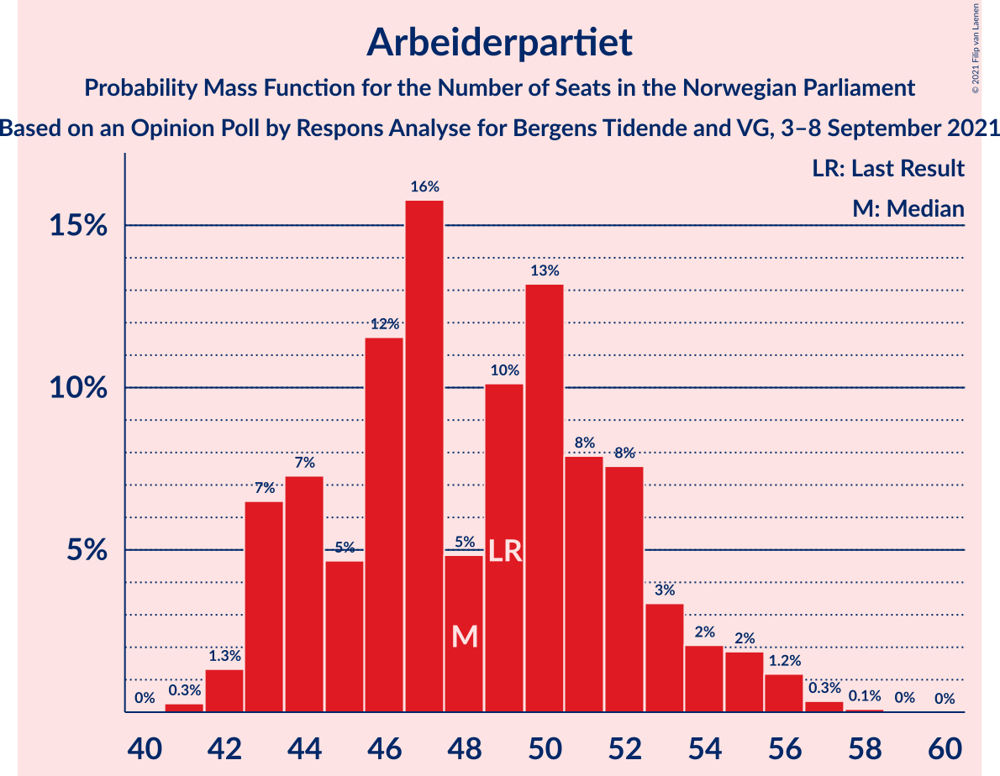
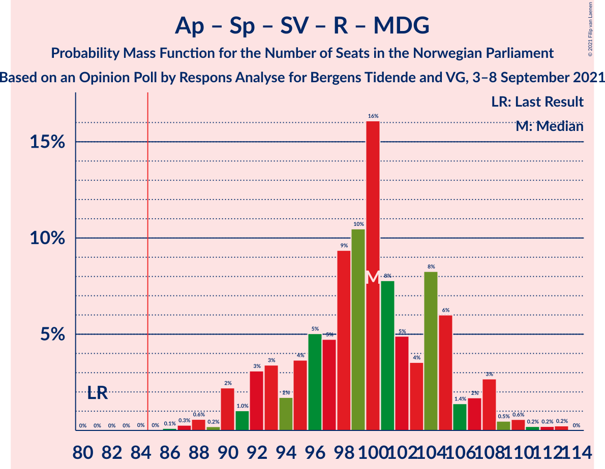
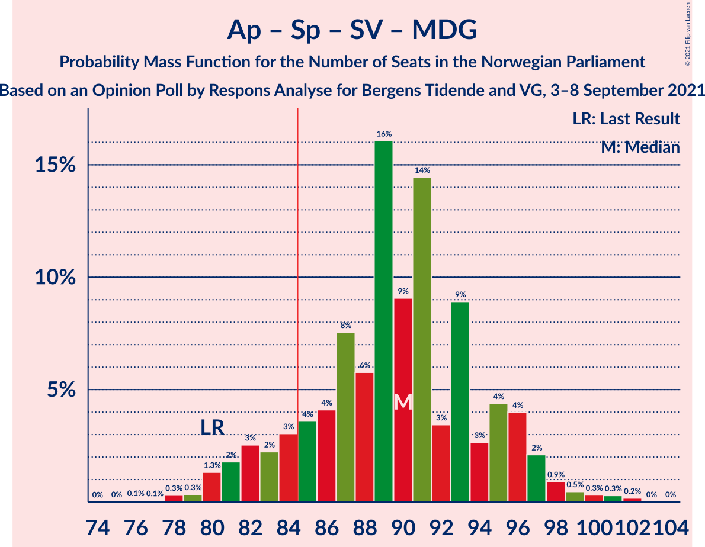
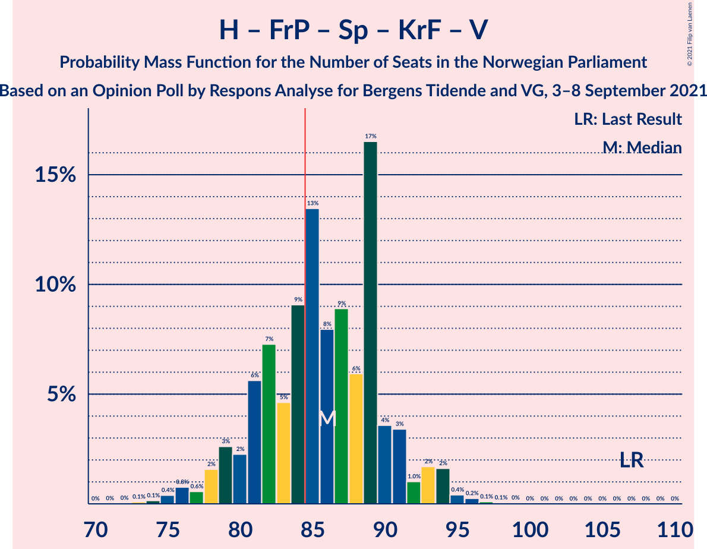
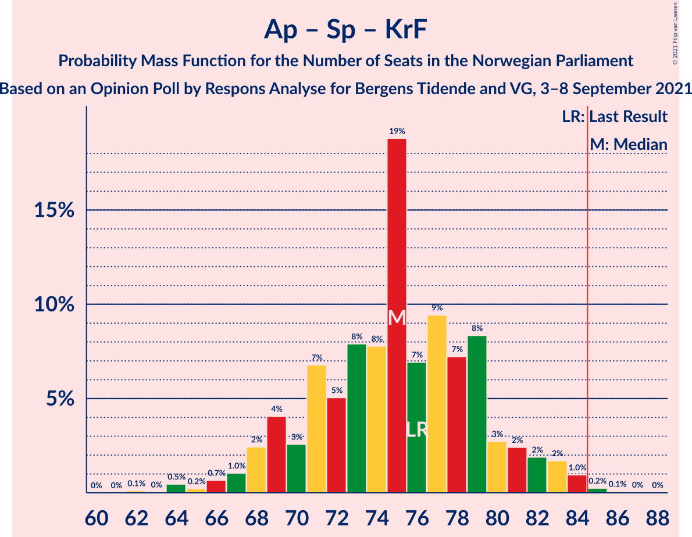
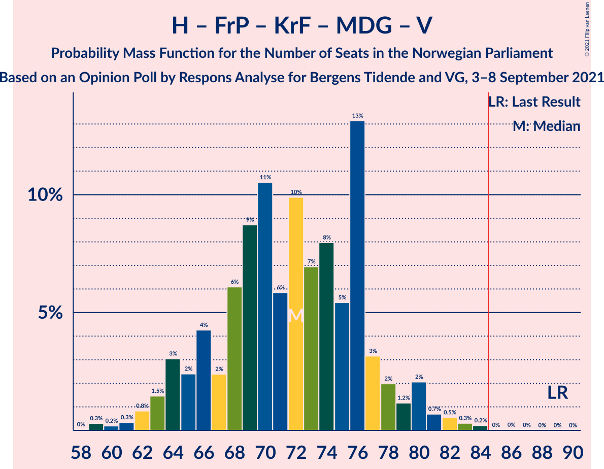
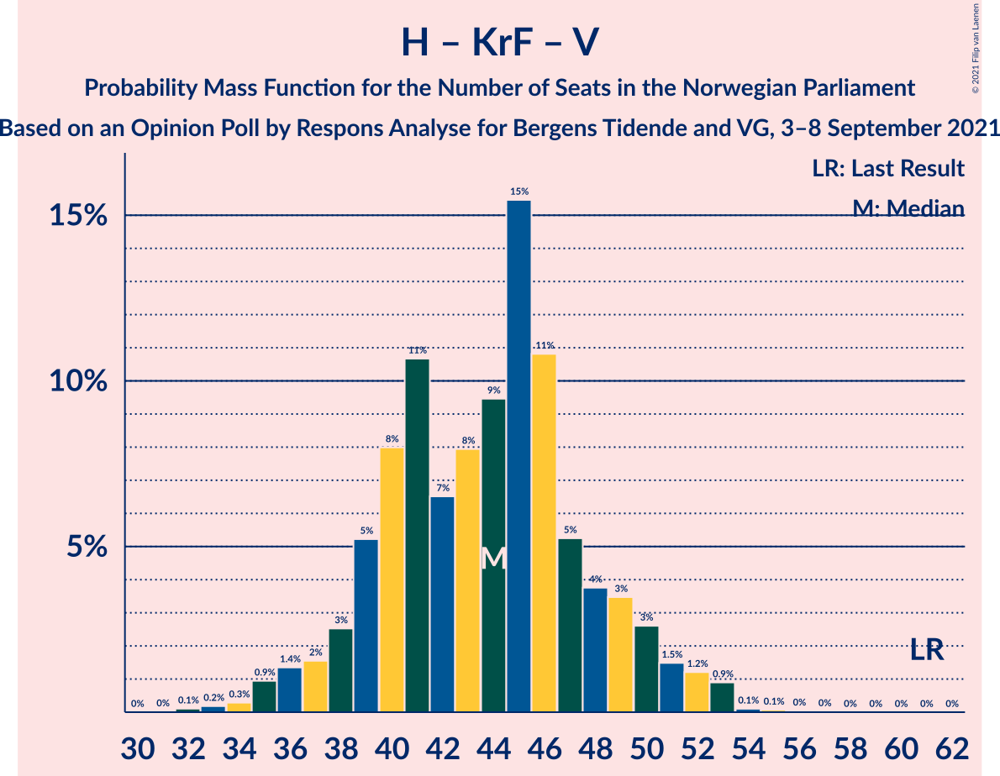
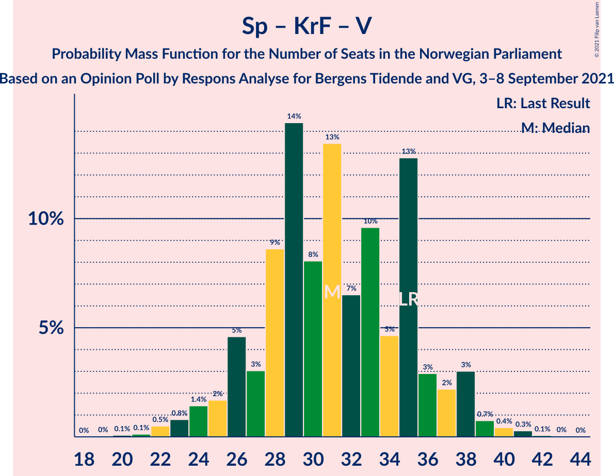

# Opinion Poll by Respons Analyse for Bergens Tidende and VG, 3–8 September 2021

<a href="#voting-intentions">Voting Intentions</a> | <a href="#seats">Seats</a> | <a href="#coalitions">Coalitions</a> | <a href="#technical-information">Technical Information</a>

## Voting Intentions

### Confidence Intervals

| Party | Last Result | Poll Result | 80% Confidence Interval | 90% Confidence Interval | 95% Confidence Interval | 99% Confidence Interval |
|:-----:|:-----------:|:-----------:|:-----------------------:|:-----------------------:|:-----------------------:|:-----------------------:|
| Arbeiderpartiet | 27.4% | 26.6% | 24.9–28.5% |24.4–29.0% |23.9–29.4% |23.1–30.3% |
| Høyre | 25.0% | 18.0% | 16.5–19.6% |16.1–20.1% |15.7–20.5% |15.0–21.3% |
| Fremskrittspartiet | 15.2% | 12.4% | 11.1–13.8% |10.8–14.2% |10.5–14.6% |9.9–15.3% |
| Senterpartiet | 10.3% | 11.1% | 9.9–12.5% |9.6–12.9% |9.3–13.2% |8.7–13.9% |
| Sosialistisk Venstreparti | 6.0% | 9.4% | 8.3–10.7% |8.0–11.1% |7.7–11.4% |7.2–12.0% |
| Rødt | 2.4% | 6.0% | 5.1–7.1% |4.9–7.4% |4.7–7.7% |4.3–8.2% |
| Kristelig Folkeparti | 4.2% | 4.5% | 3.8–5.5% |3.6–5.7% |3.4–6.0% |3.0–6.5% |
| Miljøpartiet De Grønne | 3.2% | 4.2% | 3.5–5.1% |3.3–5.4% |3.1–5.6% |2.8–6.1% |
| Venstre | 4.4% | 3.9% | 3.2–4.8% |3.0–5.1% |2.9–5.3% |2.6–5.8% |

*Note:* The poll result column reflects the actual value used in the calculations. Published results may vary slightly, and in addition be rounded to fewer digits.

## Seats

### Confidence Intervals

| Party | Last Result | Median | 80% Confidence Interval | 90% Confidence Interval | 95% Confidence Interval | 99% Confidence Interval |
|:-----:|:-----------:|:------:|:-----------------------:|:-----------------------:|:-----------------------:|:-----------------------:|
| <a href="#arbeiderpartiet">Arbeiderpartiet</a> | 49 | 47 | 44–52 |43–54 |43–55 |42–56 |
| <a href="#høyre">Høyre</a> | 45 | 31 | 29–36 |28–37 |27–38 |25–39 |
| <a href="#fremskrittspartiet">Fremskrittspartiet</a> | 27 | 23 | 19–25 |18–26 |17–27 |16–28 |
| <a href="#senterpartiet">Senterpartiet</a> | 19 | 20 | 17–21 |17–23 |16–24 |15–25 |
| <a href="#sosialistisk-venstreparti">Sosialistisk Venstreparti</a> | 11 | 15 | 13–18 |13–19 |12–19 |11–21 |
| <a href="#rødt">Rødt</a> | 1 | 11 | 8–12 |8–12 |7–13 |7–14 |
| <a href="#kristelig-folkeparti">Kristelig Folkeparti</a> | 8 | 8 | 3–9 |3–10 |3–10 |2–11 |
| <a href="#miljøpartiet-de-grønne">Miljøpartiet De Grønne</a> | 1 | 7 | 2–9 |2–9 |2–10 |1–11 |
| <a href="#venstre">Venstre</a> | 8 | 2 | 2–8 |2–8 |2–9 |2–10 |

### Arbeiderpartiet

*For a full overview of the results for this party, see the [Arbeiderpartiet](party-arbeiderpartiet.html) page.*

| Number of Seats | Probability | Accumulated | Special Marks |
|:---------------:|:-----------:|:-----------:|:-------------:|
| 41 | 0.3% | 100% |  |
| 42 | 2% | 99.7% |  |
| 43 | 3% | 98% |  |
| 44 | 7% | 94% |  |
| 45 | 5% | 87% |  |
| 46 | 15% | 82% |  |
| 47 | 26% | 67% | Median |
| 48 | 6% | 41% |  |
| 49 | 8% | 36% | Last Result |
| 50 | 9% | 28% |  |
| 51 | 6% | 19% |  |
| 52 | 5% | 13% |  |
| 53 | 2% | 8% |  |
| 54 | 2% | 6% |  |
| 55 | 2% | 4% |  |
| 56 | 2% | 2% |  |
| 57 | 0.2% | 0.4% |  |
| 58 | 0.1% | 0.2% |  |
| 59 | 0% | 0.1% |  |
| 60 | 0% | 0% |  |

### Høyre

*For a full overview of the results for this party, see the [Høyre](party-høyre.html) page.*

| Number of Seats | Probability | Accumulated | Special Marks |
|:---------------:|:-----------:|:-----------:|:-------------:|
| 23 | 0.1% | 100% |  |
| 24 | 0.2% | 99.9% |  |
| 25 | 0.8% | 99.7% |  |
| 26 | 0.3% | 98.9% |  |
| 27 | 1.4% | 98.6% |  |
| 28 | 4% | 97% |  |
| 29 | 7% | 93% |  |
| 30 | 23% | 86% |  |
| 31 | 16% | 63% | Median |
| 32 | 7% | 47% |  |
| 33 | 6% | 41% |  |
| 34 | 16% | 35% |  |
| 35 | 5% | 19% |  |
| 36 | 6% | 14% |  |
| 37 | 5% | 8% |  |
| 38 | 2% | 3% |  |
| 39 | 0.4% | 0.6% |  |
| 40 | 0.1% | 0.2% |  |
| 41 | 0% | 0% |  |
| 42 | 0% | 0% |  |
| 43 | 0% | 0% |  |
| 44 | 0% | 0% |  |
| 45 | 0% | 0% | Last Result |

### Fremskrittspartiet

*For a full overview of the results for this party, see the [Fremskrittspartiet](party-fremskrittspartiet.html) page.*

| Number of Seats | Probability | Accumulated | Special Marks |
|:---------------:|:-----------:|:-----------:|:-------------:|
| 15 | 0.1% | 100% |  |
| 16 | 0.8% | 99.9% |  |
| 17 | 2% | 99.1% |  |
| 18 | 6% | 97% |  |
| 19 | 7% | 91% |  |
| 20 | 9% | 84% |  |
| 21 | 12% | 76% |  |
| 22 | 11% | 64% |  |
| 23 | 10% | 53% | Median |
| 24 | 25% | 43% |  |
| 25 | 11% | 18% |  |
| 26 | 3% | 7% |  |
| 27 | 1.4% | 4% | Last Result |
| 28 | 2% | 2% |  |
| 29 | 0.3% | 0.5% |  |
| 30 | 0.1% | 0.1% |  |
| 31 | 0% | 0% |  |

### Senterpartiet

*For a full overview of the results for this party, see the [Senterpartiet](party-senterpartiet.html) page.*

| Number of Seats | Probability | Accumulated | Special Marks |
|:---------------:|:-----------:|:-----------:|:-------------:|
| 14 | 0.2% | 100% |  |
| 15 | 2% | 99.8% |  |
| 16 | 2% | 98% |  |
| 17 | 7% | 96% |  |
| 18 | 5% | 89% |  |
| 19 | 16% | 83% | Last Result |
| 20 | 41% | 68% | Median |
| 21 | 18% | 27% |  |
| 22 | 3% | 9% |  |
| 23 | 3% | 6% |  |
| 24 | 2% | 3% |  |
| 25 | 0.7% | 1.1% |  |
| 26 | 0.2% | 0.4% |  |
| 27 | 0.2% | 0.2% |  |
| 28 | 0% | 0% |  |

### Sosialistisk Venstreparti

*For a full overview of the results for this party, see the [Sosialistisk Venstreparti](party-sosialistiskvenstreparti.html) page.*

| Number of Seats | Probability | Accumulated | Special Marks |
|:---------------:|:-----------:|:-----------:|:-------------:|
| 10 | 0.2% | 100% |  |
| 11 | 1.1% | 99.8% | Last Result |
| 12 | 3% | 98.7% |  |
| 13 | 6% | 95% |  |
| 14 | 16% | 89% |  |
| 15 | 26% | 72% | Median |
| 16 | 13% | 46% |  |
| 17 | 18% | 33% |  |
| 18 | 8% | 16% |  |
| 19 | 5% | 8% |  |
| 20 | 1.3% | 2% |  |
| 21 | 0.9% | 1.1% |  |
| 22 | 0.1% | 0.2% |  |
| 23 | 0.1% | 0.1% |  |
| 24 | 0% | 0% |  |

### Rødt

*For a full overview of the results for this party, see the [Rødt](party-rødt.html) page.*

| Number of Seats | Probability | Accumulated | Special Marks |
|:---------------:|:-----------:|:-----------:|:-------------:|
| 1 | 0% | 100% | Last Result |
| 2 | 0.1% | 100% |  |
| 3 | 0% | 99.9% |  |
| 4 | 0% | 99.9% |  |
| 5 | 0% | 99.9% |  |
| 6 | 0.1% | 99.9% |  |
| 7 | 3% | 99.8% |  |
| 8 | 8% | 97% |  |
| 9 | 14% | 89% |  |
| 10 | 24% | 75% |  |
| 11 | 39% | 51% | Median |
| 12 | 8% | 12% |  |
| 13 | 2% | 4% |  |
| 14 | 2% | 2% |  |
| 15 | 0.1% | 0.2% |  |
| 16 | 0% | 0% |  |

### Kristelig Folkeparti

*For a full overview of the results for this party, see the [Kristelig Folkeparti](party-kristeligfolkeparti.html) page.*

| Number of Seats | Probability | Accumulated | Special Marks |
|:---------------:|:-----------:|:-----------:|:-------------:|
| 1 | 0.4% | 100% |  |
| 2 | 1.5% | 99.6% |  |
| 3 | 13% | 98% |  |
| 4 | 0% | 85% |  |
| 5 | 0% | 85% |  |
| 6 | 8% | 85% |  |
| 7 | 21% | 77% |  |
| 8 | 36% | 56% | Last Result, Median |
| 9 | 12% | 20% |  |
| 10 | 6% | 8% |  |
| 11 | 2% | 2% |  |
| 12 | 0.2% | 0.3% |  |
| 13 | 0% | 0% |  |

### Miljøpartiet De Grønne

*For a full overview of the results for this party, see the [Miljøpartiet De Grønne](party-miljøpartietdegrønne.html) page.*

| Number of Seats | Probability | Accumulated | Special Marks |
|:---------------:|:-----------:|:-----------:|:-------------:|
| 1 | 1.1% | 100% | Last Result |
| 2 | 20% | 98.9% |  |
| 3 | 5% | 79% |  |
| 4 | 0% | 74% |  |
| 5 | 0% | 74% |  |
| 6 | 8% | 74% |  |
| 7 | 33% | 66% | Median |
| 8 | 17% | 33% |  |
| 9 | 13% | 16% |  |
| 10 | 1.5% | 3% |  |
| 11 | 1.3% | 1.3% |  |
| 12 | 0% | 0% |  |

### Venstre

*For a full overview of the results for this party, see the [Venstre](party-venstre.html) page.*

| Number of Seats | Probability | Accumulated | Special Marks |
|:---------------:|:-----------:|:-----------:|:-------------:|
| 1 | 0.1% | 100% |  |
| 2 | 50% | 99.9% | Median |
| 3 | 0.3% | 50% |  |
| 4 | 0% | 49% |  |
| 5 | 0% | 49% |  |
| 6 | 4% | 49% |  |
| 7 | 35% | 46% |  |
| 8 | 7% | 11% | Last Result |
| 9 | 2% | 4% |  |
| 10 | 1.2% | 1.4% |  |
| 11 | 0.2% | 0.2% |  |
| 12 | 0% | 0% |  |

## Coalitions

### Confidence Intervals

| Coalition | Last Result | Median | Majority? | 80% Confidence Interval | 90% Confidence Interval | 95% Confidence Interval | 99% Confidence Interval |
|:---------:|:-----------:|:------:|:---------:|:-----------------------:|:-----------------------:|:-----------------------:|:-----------------------:|
| Arbeiderpartiet – Senterpartiet – Sosialistisk Venstreparti – Rødt – Miljøpartiet De Grønne | 81 | 100 | 99.9% | 93–105 | 91–107 | 90–108 | 90–112 |
| Arbeiderpartiet – Senterpartiet – Sosialistisk Venstreparti – Kristelig Folkeparti – Miljøpartiet De Grønne | 88 | 97 | 99.8% | 91–101 | 89–104 | 88–106 | 86–107 |
| Arbeiderpartiet – Senterpartiet – Sosialistisk Venstreparti – Rødt | 80 | 93 | 98.9% | 88–99 | 87–100 | 86–102 | 84–105 |
| Arbeiderpartiet – Senterpartiet – Sosialistisk Venstreparti – Miljøpartiet De Grønne | 80 | 89 | 86% | 83–96 | 82–97 | 80–98 | 80–101 |
| Høyre – Fremskrittspartiet – Senterpartiet – Kristelig Folkeparti – Venstre | 107 | 86 | 67% | 80–90 | 79–92 | 77–94 | 75–95 |
| Arbeiderpartiet – Senterpartiet – Sosialistisk Venstreparti | 79 | 83 | 30% | 79–88 | 77–89 | 76–91 | 75–93 |
| Arbeiderpartiet – Senterpartiet – Kristelig Folkeparti – Miljøpartiet De Grønne | 77 | 82 | 12% | 75–85 | 74–87 | 73–89 | 70–92 |
| Arbeiderpartiet – Sosialistisk Venstreparti – Rødt – Miljøpartiet De Grønne | 62 | 80 | 11% | 74–85 | 73–87 | 71–88 | 70–91 |
| Arbeiderpartiet – Senterpartiet – Kristelig Folkeparti | 76 | 75 | 0.5% | 71–80 | 69–81 | 68–83 | 65–85 |
| Høyre – Fremskrittspartiet – Kristelig Folkeparti – Miljøpartiet De Grønne – Venstre | 89 | 73 | 0.1% | 66–77 | 65–78 | 64–80 | 59–83 |
| Arbeiderpartiet – Senterpartiet | 68 | 67 | 0% | 63–72 | 63–74 | 61–75 | 60–76 |
| Høyre – Fremskrittspartiet – Kristelig Folkeparti – Venstre | 88 | 66 | 0% | 61–71 | 59–73 | 57–73 | 55–77 |
| Arbeiderpartiet – Sosialistisk Venstreparti | 60 | 63 | 0% | 60–68 | 59–69 | 57–70 | 56–73 |
| Høyre – Fremskrittspartiet – Venstre | 80 | 59 | 0% | 54–64 | 52–65 | 52–67 | 48–69 |
| Høyre – Fremskrittspartiet | 72 | 54 | 0% | 50–58 | 49–59 | 48–61 | 46–63 |
| Høyre – Kristelig Folkeparti – Venstre | 61 | 44 | 0% | 39–48 | 38–50 | 36–51 | 34–53 |
| Senterpartiet – Kristelig Folkeparti – Venstre | 35 | 32 | 0% | 26–36 | 25–38 | 24–38 | 22–41 |

### Arbeiderpartiet – Senterpartiet – Sosialistisk Venstreparti – Rødt – Miljøpartiet De Grønne

| Number of Seats | Probability | Accumulated | Special Marks |
|:---------------:|:-----------:|:-----------:|:-------------:|
| 81 | 0% | 100% | Last Result |
| 82 | 0% | 100% |  |
| 83 | 0% | 100% |  |
| 84 | 0% | 100% |  |
| 85 | 0% | 99.9% | Majority |
| 86 | 0.1% | 99.9% |  |
| 87 | 0% | 99.8% |  |
| 88 | 0.1% | 99.8% |  |
| 89 | 0.2% | 99.7% |  |
| 90 | 4% | 99.5% |  |
| 91 | 0.9% | 95% |  |
| 92 | 2% | 95% |  |
| 93 | 6% | 92% |  |
| 94 | 1.2% | 86% |  |
| 95 | 2% | 85% |  |
| 96 | 3% | 83% |  |
| 97 | 7% | 81% |  |
| 98 | 6% | 73% |  |
| 99 | 5% | 68% |  |
| 100 | 22% | 63% | Median |
| 101 | 11% | 41% |  |
| 102 | 3% | 30% |  |
| 103 | 5% | 27% |  |
| 104 | 10% | 22% |  |
| 105 | 4% | 12% |  |
| 106 | 1.4% | 8% |  |
| 107 | 2% | 7% |  |
| 108 | 2% | 4% |  |
| 109 | 0.6% | 2% |  |
| 110 | 0.9% | 2% |  |
| 111 | 0.4% | 1.0% |  |
| 112 | 0.3% | 0.6% |  |
| 113 | 0.3% | 0.3% |  |
| 114 | 0% | 0% |  |

### Arbeiderpartiet – Senterpartiet – Sosialistisk Venstreparti – Kristelig Folkeparti – Miljøpartiet De Grønne

| Number of Seats | Probability | Accumulated | Special Marks |
|:---------------:|:-----------:|:-----------:|:-------------:|
| 83 | 0.1% | 100% |  |
| 84 | 0.1% | 99.9% |  |
| 85 | 0.1% | 99.8% | Majority |
| 86 | 0.4% | 99.6% |  |
| 87 | 1.1% | 99.2% |  |
| 88 | 2% | 98% | Last Result |
| 89 | 2% | 96% |  |
| 90 | 3% | 93% |  |
| 91 | 4% | 90% |  |
| 92 | 2% | 86% |  |
| 93 | 5% | 84% |  |
| 94 | 3% | 78% |  |
| 95 | 9% | 76% |  |
| 96 | 4% | 67% |  |
| 97 | 28% | 63% | Median |
| 98 | 5% | 35% |  |
| 99 | 10% | 31% |  |
| 100 | 3% | 21% |  |
| 101 | 10% | 18% |  |
| 102 | 2% | 8% |  |
| 103 | 0.9% | 6% |  |
| 104 | 2% | 5% |  |
| 105 | 0.4% | 3% |  |
| 106 | 2% | 3% |  |
| 107 | 0.4% | 0.7% |  |
| 108 | 0.1% | 0.3% |  |
| 109 | 0.1% | 0.2% |  |
| 110 | 0.1% | 0.1% |  |
| 111 | 0% | 0% |  |

### Arbeiderpartiet – Senterpartiet – Sosialistisk Venstreparti – Rødt

| Number of Seats | Probability | Accumulated | Special Marks |
|:---------------:|:-----------:|:-----------:|:-------------:|
| 80 | 0% | 100% | Last Result |
| 81 | 0% | 100% |  |
| 82 | 0% | 99.9% |  |
| 83 | 0.3% | 99.9% |  |
| 84 | 0.7% | 99.6% |  |
| 85 | 1.0% | 98.9% | Majority |
| 86 | 2% | 98% |  |
| 87 | 4% | 96% |  |
| 88 | 3% | 92% |  |
| 89 | 5% | 89% |  |
| 90 | 1.4% | 83% |  |
| 91 | 8% | 82% |  |
| 92 | 4% | 74% |  |
| 93 | 22% | 71% | Median |
| 94 | 11% | 49% |  |
| 95 | 11% | 37% |  |
| 96 | 7% | 26% |  |
| 97 | 7% | 20% |  |
| 98 | 2% | 13% |  |
| 99 | 4% | 11% |  |
| 100 | 3% | 7% |  |
| 101 | 0.9% | 4% |  |
| 102 | 1.2% | 3% |  |
| 103 | 1.2% | 2% |  |
| 104 | 0.1% | 0.7% |  |
| 105 | 0.3% | 0.5% |  |
| 106 | 0.1% | 0.3% |  |
| 107 | 0% | 0.2% |  |
| 108 | 0.1% | 0.1% |  |
| 109 | 0% | 0.1% |  |
| 110 | 0% | 0% |  |

### Arbeiderpartiet – Senterpartiet – Sosialistisk Venstreparti – Miljøpartiet De Grønne

| Number of Seats | Probability | Accumulated | Special Marks |
|:---------------:|:-----------:|:-----------:|:-------------:|
| 76 | 0% | 100% |  |
| 77 | 0.1% | 99.9% |  |
| 78 | 0.1% | 99.8% |  |
| 79 | 0.1% | 99.7% |  |
| 80 | 2% | 99.6% | Last Result |
| 81 | 2% | 97% |  |
| 82 | 4% | 95% |  |
| 83 | 3% | 92% |  |
| 84 | 2% | 88% |  |
| 85 | 2% | 86% | Majority |
| 86 | 4% | 85% |  |
| 87 | 6% | 80% |  |
| 88 | 6% | 75% |  |
| 89 | 27% | 69% | Median |
| 90 | 5% | 42% |  |
| 91 | 9% | 37% |  |
| 92 | 4% | 29% |  |
| 93 | 11% | 25% |  |
| 94 | 3% | 14% |  |
| 95 | 1.0% | 11% |  |
| 96 | 4% | 10% |  |
| 97 | 3% | 6% |  |
| 98 | 1.3% | 3% |  |
| 99 | 0.6% | 2% |  |
| 100 | 0.2% | 0.9% |  |
| 101 | 0.5% | 0.7% |  |
| 102 | 0.2% | 0.2% |  |
| 103 | 0% | 0% |  |

### Høyre – Fremskrittspartiet – Senterpartiet – Kristelig Folkeparti – Venstre

| Number of Seats | Probability | Accumulated | Special Marks |
|:---------------:|:-----------:|:-----------:|:-------------:|
| 72 | 0% | 100% |  |
| 73 | 0.1% | 99.9% |  |
| 74 | 0.1% | 99.8% |  |
| 75 | 0.7% | 99.7% |  |
| 76 | 1.0% | 99.0% |  |
| 77 | 0.7% | 98% |  |
| 78 | 2% | 97% |  |
| 79 | 3% | 96% |  |
| 80 | 3% | 92% |  |
| 81 | 8% | 89% |  |
| 82 | 7% | 81% |  |
| 83 | 4% | 75% |  |
| 84 | 4% | 71% | Median |
| 85 | 8% | 67% | Majority |
| 86 | 10% | 59% |  |
| 87 | 2% | 49% |  |
| 88 | 8% | 47% |  |
| 89 | 26% | 40% |  |
| 90 | 4% | 13% |  |
| 91 | 4% | 9% |  |
| 92 | 0.9% | 5% |  |
| 93 | 1.3% | 4% |  |
| 94 | 2% | 3% |  |
| 95 | 0.6% | 1.0% |  |
| 96 | 0.3% | 0.4% |  |
| 97 | 0% | 0.1% |  |
| 98 | 0% | 0.1% |  |
| 99 | 0.1% | 0.1% |  |
| 100 | 0% | 0% |  |
| 101 | 0% | 0% |  |
| 102 | 0% | 0% |  |
| 103 | 0% | 0% |  |
| 104 | 0% | 0% |  |
| 105 | 0% | 0% |  |
| 106 | 0% | 0% |  |
| 107 | 0% | 0% | Last Result |

### Arbeiderpartiet – Senterpartiet – Sosialistisk Venstreparti

| Number of Seats | Probability | Accumulated | Special Marks |
|:---------------:|:-----------:|:-----------:|:-------------:|
| 72 | 0% | 100% |  |
| 73 | 0% | 99.9% |  |
| 74 | 0.2% | 99.9% |  |
| 75 | 0.7% | 99.7% |  |
| 76 | 2% | 99.0% |  |
| 77 | 2% | 97% |  |
| 78 | 4% | 95% |  |
| 79 | 5% | 91% | Last Result |
| 80 | 7% | 86% |  |
| 81 | 4% | 79% |  |
| 82 | 23% | 75% | Median |
| 83 | 5% | 52% |  |
| 84 | 18% | 47% |  |
| 85 | 4% | 30% | Majority |
| 86 | 7% | 26% |  |
| 87 | 4% | 18% |  |
| 88 | 6% | 14% |  |
| 89 | 3% | 8% |  |
| 90 | 1.5% | 4% |  |
| 91 | 1.2% | 3% |  |
| 92 | 1.0% | 2% |  |
| 93 | 0.2% | 0.7% |  |
| 94 | 0.2% | 0.5% |  |
| 95 | 0.1% | 0.3% |  |
| 96 | 0.1% | 0.2% |  |
| 97 | 0% | 0.1% |  |
| 98 | 0.1% | 0.1% |  |
| 99 | 0% | 0% |  |

### Arbeiderpartiet – Senterpartiet – Kristelig Folkeparti – Miljøpartiet De Grønne

| Number of Seats | Probability | Accumulated | Special Marks |
|:---------------:|:-----------:|:-----------:|:-------------:|
| 67 | 0.1% | 100% |  |
| 68 | 0.1% | 99.9% |  |
| 69 | 0.1% | 99.8% |  |
| 70 | 0.3% | 99.7% |  |
| 71 | 0.5% | 99.4% |  |
| 72 | 0.8% | 98.9% |  |
| 73 | 0.7% | 98% |  |
| 74 | 6% | 97% |  |
| 75 | 5% | 92% |  |
| 76 | 4% | 87% |  |
| 77 | 2% | 83% | Last Result |
| 78 | 3% | 80% |  |
| 79 | 6% | 77% |  |
| 80 | 4% | 71% |  |
| 81 | 13% | 67% |  |
| 82 | 22% | 54% | Median |
| 83 | 9% | 32% |  |
| 84 | 11% | 23% |  |
| 85 | 3% | 12% | Majority |
| 86 | 2% | 9% |  |
| 87 | 2% | 7% |  |
| 88 | 1.2% | 4% |  |
| 89 | 0.8% | 3% |  |
| 90 | 0.6% | 2% |  |
| 91 | 0.4% | 2% |  |
| 92 | 1.0% | 1.4% |  |
| 93 | 0.3% | 0.3% |  |
| 94 | 0% | 0% |  |

### Arbeiderpartiet – Sosialistisk Venstreparti – Rødt – Miljøpartiet De Grønne

| Number of Seats | Probability | Accumulated | Special Marks |
|:---------------:|:-----------:|:-----------:|:-------------:|
| 62 | 0% | 100% | Last Result |
| 63 | 0% | 100% |  |
| 64 | 0% | 100% |  |
| 65 | 0% | 100% |  |
| 66 | 0% | 100% |  |
| 67 | 0% | 100% |  |
| 68 | 0.2% | 99.9% |  |
| 69 | 0.2% | 99.8% |  |
| 70 | 0.2% | 99.6% |  |
| 71 | 3% | 99.4% |  |
| 72 | 1.0% | 97% |  |
| 73 | 3% | 96% |  |
| 74 | 6% | 93% |  |
| 75 | 5% | 87% |  |
| 76 | 3% | 82% |  |
| 77 | 5% | 80% |  |
| 78 | 3% | 75% |  |
| 79 | 4% | 71% |  |
| 80 | 28% | 67% | Median |
| 81 | 9% | 39% |  |
| 82 | 3% | 30% |  |
| 83 | 10% | 27% |  |
| 84 | 6% | 17% |  |
| 85 | 2% | 11% | Majority |
| 86 | 2% | 9% |  |
| 87 | 2% | 7% |  |
| 88 | 2% | 4% |  |
| 89 | 0.4% | 2% |  |
| 90 | 1.2% | 2% |  |
| 91 | 0.5% | 0.9% |  |
| 92 | 0.3% | 0.4% |  |
| 93 | 0.1% | 0.1% |  |
| 94 | 0% | 0% |  |

### Arbeiderpartiet – Senterpartiet – Kristelig Folkeparti

| Number of Seats | Probability | Accumulated | Special Marks |
|:---------------:|:-----------:|:-----------:|:-------------:|
| 63 | 0% | 100% |  |
| 64 | 0.1% | 99.9% |  |
| 65 | 0.4% | 99.8% |  |
| 66 | 0.3% | 99.5% |  |
| 67 | 1.3% | 99.2% |  |
| 68 | 2% | 98% |  |
| 69 | 3% | 96% |  |
| 70 | 2% | 93% |  |
| 71 | 6% | 90% |  |
| 72 | 5% | 84% |  |
| 73 | 11% | 80% |  |
| 74 | 6% | 69% |  |
| 75 | 32% | 63% | Median |
| 76 | 10% | 32% | Last Result |
| 77 | 5% | 22% |  |
| 78 | 3% | 16% |  |
| 79 | 3% | 13% |  |
| 80 | 3% | 10% |  |
| 81 | 2% | 7% |  |
| 82 | 2% | 5% |  |
| 83 | 1.0% | 3% |  |
| 84 | 1.3% | 2% |  |
| 85 | 0.4% | 0.5% | Majority |
| 86 | 0.1% | 0.1% |  |
| 87 | 0% | 0.1% |  |
| 88 | 0% | 0% |  |

### Høyre – Fremskrittspartiet – Kristelig Folkeparti – Miljøpartiet De Grønne – Venstre

| Number of Seats | Probability | Accumulated | Special Marks |
|:---------------:|:-----------:|:-----------:|:-------------:|
| 59 | 0.5% | 100% |  |
| 60 | 0.3% | 99.5% |  |
| 61 | 0.4% | 99.2% |  |
| 62 | 0.8% | 98.9% |  |
| 63 | 0.4% | 98% |  |
| 64 | 1.1% | 98% |  |
| 65 | 3% | 97% |  |
| 66 | 5% | 93% |  |
| 67 | 2% | 89% |  |
| 68 | 10% | 87% |  |
| 69 | 5% | 77% |  |
| 70 | 6% | 72% |  |
| 71 | 6% | 66% | Median |
| 72 | 5% | 60% |  |
| 73 | 7% | 55% |  |
| 74 | 10% | 48% |  |
| 75 | 8% | 38% |  |
| 76 | 20% | 31% |  |
| 77 | 4% | 10% |  |
| 78 | 2% | 6% |  |
| 79 | 1.1% | 5% |  |
| 80 | 2% | 4% |  |
| 81 | 0.3% | 1.4% |  |
| 82 | 0.2% | 1.1% |  |
| 83 | 0.6% | 0.9% |  |
| 84 | 0.3% | 0.4% |  |
| 85 | 0% | 0.1% | Majority |
| 86 | 0% | 0% |  |
| 87 | 0% | 0% |  |
| 88 | 0% | 0% |  |
| 89 | 0% | 0% | Last Result |

### Arbeiderpartiet – Senterpartiet

| Number of Seats | Probability | Accumulated | Special Marks |
|:---------------:|:-----------:|:-----------:|:-------------:|
| 58 | 0.1% | 100% |  |
| 59 | 0.2% | 99.9% |  |
| 60 | 0.7% | 99.7% |  |
| 61 | 2% | 99.0% |  |
| 62 | 2% | 97% |  |
| 63 | 7% | 95% |  |
| 64 | 6% | 89% |  |
| 65 | 4% | 83% |  |
| 66 | 7% | 79% |  |
| 67 | 31% | 72% | Median |
| 68 | 7% | 41% | Last Result |
| 69 | 5% | 34% |  |
| 70 | 14% | 29% |  |
| 71 | 4% | 16% |  |
| 72 | 2% | 12% |  |
| 73 | 3% | 9% |  |
| 74 | 2% | 6% |  |
| 75 | 3% | 4% |  |
| 76 | 1.1% | 2% |  |
| 77 | 0.1% | 0.4% |  |
| 78 | 0.1% | 0.3% |  |
| 79 | 0.1% | 0.2% |  |
| 80 | 0.1% | 0.1% |  |
| 81 | 0% | 0% |  |

### Høyre – Fremskrittspartiet – Kristelig Folkeparti – Venstre

| Number of Seats | Probability | Accumulated | Special Marks |
|:---------------:|:-----------:|:-----------:|:-------------:|
| 52 | 0% | 100% |  |
| 53 | 0.1% | 99.9% |  |
| 54 | 0.3% | 99.8% |  |
| 55 | 0.5% | 99.5% |  |
| 56 | 0.8% | 99.0% |  |
| 57 | 1.0% | 98% |  |
| 58 | 1.1% | 97% |  |
| 59 | 3% | 96% |  |
| 60 | 2% | 94% |  |
| 61 | 8% | 91% |  |
| 62 | 5% | 83% |  |
| 63 | 4% | 78% |  |
| 64 | 7% | 74% | Median |
| 65 | 14% | 67% |  |
| 66 | 5% | 54% |  |
| 67 | 3% | 49% |  |
| 68 | 6% | 46% |  |
| 69 | 21% | 40% |  |
| 70 | 5% | 18% |  |
| 71 | 5% | 14% |  |
| 72 | 3% | 9% |  |
| 73 | 3% | 5% |  |
| 74 | 0.5% | 2% |  |
| 75 | 0.5% | 2% |  |
| 76 | 0.5% | 1.1% |  |
| 77 | 0.4% | 0.5% |  |
| 78 | 0.1% | 0.1% |  |
| 79 | 0% | 0.1% |  |
| 80 | 0% | 0% |  |
| 81 | 0% | 0% |  |
| 82 | 0% | 0% |  |
| 83 | 0% | 0% |  |
| 84 | 0% | 0% |  |
| 85 | 0% | 0% | Majority |
| 86 | 0% | 0% |  |
| 87 | 0% | 0% |  |
| 88 | 0% | 0% | Last Result |

### Arbeiderpartiet – Sosialistisk Venstreparti

| Number of Seats | Probability | Accumulated | Special Marks |
|:---------------:|:-----------:|:-----------:|:-------------:|
| 55 | 0.1% | 100% |  |
| 56 | 0.8% | 99.9% |  |
| 57 | 2% | 99.1% |  |
| 58 | 1.4% | 97% |  |
| 59 | 5% | 96% |  |
| 60 | 3% | 91% | Last Result |
| 61 | 11% | 88% |  |
| 62 | 23% | 77% | Median |
| 63 | 13% | 54% |  |
| 64 | 11% | 41% |  |
| 65 | 5% | 31% |  |
| 66 | 6% | 26% |  |
| 67 | 8% | 19% |  |
| 68 | 4% | 12% |  |
| 69 | 3% | 7% |  |
| 70 | 2% | 4% |  |
| 71 | 0.8% | 2% |  |
| 72 | 0.7% | 2% |  |
| 73 | 0.6% | 0.9% |  |
| 74 | 0.3% | 0.4% |  |
| 75 | 0% | 0.1% |  |
| 76 | 0% | 0.1% |  |
| 77 | 0% | 0.1% |  |
| 78 | 0% | 0% |  |

### Høyre – Fremskrittspartiet – Venstre

| Number of Seats | Probability | Accumulated | Special Marks |
|:---------------:|:-----------:|:-----------:|:-------------:|
| 47 | 0.2% | 100% |  |
| 48 | 0.5% | 99.7% |  |
| 49 | 0.3% | 99.2% |  |
| 50 | 0.7% | 98.9% |  |
| 51 | 0.6% | 98% |  |
| 52 | 3% | 98% |  |
| 53 | 4% | 95% |  |
| 54 | 2% | 91% |  |
| 55 | 9% | 89% |  |
| 56 | 4% | 80% | Median |
| 57 | 14% | 76% |  |
| 58 | 6% | 62% |  |
| 59 | 6% | 55% |  |
| 60 | 6% | 49% |  |
| 61 | 23% | 43% |  |
| 62 | 2% | 21% |  |
| 63 | 4% | 18% |  |
| 64 | 7% | 14% |  |
| 65 | 4% | 7% |  |
| 66 | 0.6% | 3% |  |
| 67 | 1.2% | 3% |  |
| 68 | 0.9% | 1.4% |  |
| 69 | 0.3% | 0.5% |  |
| 70 | 0.2% | 0.2% |  |
| 71 | 0% | 0.1% |  |
| 72 | 0% | 0% |  |
| 73 | 0% | 0% |  |
| 74 | 0% | 0% |  |
| 75 | 0% | 0% |  |
| 76 | 0% | 0% |  |
| 77 | 0% | 0% |  |
| 78 | 0% | 0% |  |
| 79 | 0% | 0% |  |
| 80 | 0% | 0% | Last Result |

### Høyre – Fremskrittspartiet

| Number of Seats | Probability | Accumulated | Special Marks |
|:---------------:|:-----------:|:-----------:|:-------------:|
| 44 | 0.1% | 100% |  |
| 45 | 0.4% | 99.9% |  |
| 46 | 0.7% | 99.6% |  |
| 47 | 0.9% | 98.8% |  |
| 48 | 2% | 98% |  |
| 49 | 2% | 96% |  |
| 50 | 7% | 94% |  |
| 51 | 5% | 87% |  |
| 52 | 3% | 82% |  |
| 53 | 11% | 78% |  |
| 54 | 23% | 68% | Median |
| 55 | 13% | 45% |  |
| 56 | 8% | 33% |  |
| 57 | 8% | 25% |  |
| 58 | 7% | 17% |  |
| 59 | 5% | 10% |  |
| 60 | 1.2% | 4% |  |
| 61 | 2% | 3% |  |
| 62 | 0.7% | 2% |  |
| 63 | 0.6% | 0.9% |  |
| 64 | 0.1% | 0.3% |  |
| 65 | 0.1% | 0.1% |  |
| 66 | 0% | 0% |  |
| 67 | 0% | 0% |  |
| 68 | 0% | 0% |  |
| 69 | 0% | 0% |  |
| 70 | 0% | 0% |  |
| 71 | 0% | 0% |  |
| 72 | 0% | 0% | Last Result |

### Høyre – Kristelig Folkeparti – Venstre

| Number of Seats | Probability | Accumulated | Special Marks |
|:---------------:|:-----------:|:-----------:|:-------------:|
| 32 | 0.1% | 100% |  |
| 33 | 0.3% | 99.9% |  |
| 34 | 0.3% | 99.6% |  |
| 35 | 0.9% | 99.3% |  |
| 36 | 2% | 98% |  |
| 37 | 1.1% | 97% |  |
| 38 | 1.5% | 95% |  |
| 39 | 9% | 94% |  |
| 40 | 5% | 85% |  |
| 41 | 8% | 80% | Median |
| 42 | 4% | 72% |  |
| 43 | 9% | 68% |  |
| 44 | 12% | 59% |  |
| 45 | 22% | 47% |  |
| 46 | 5% | 25% |  |
| 47 | 6% | 20% |  |
| 48 | 5% | 14% |  |
| 49 | 2% | 10% |  |
| 50 | 4% | 8% |  |
| 51 | 2% | 4% |  |
| 52 | 1.2% | 2% |  |
| 53 | 0.6% | 0.9% |  |
| 54 | 0.1% | 0.3% |  |
| 55 | 0.1% | 0.1% |  |
| 56 | 0% | 0% |  |
| 57 | 0% | 0% |  |
| 58 | 0% | 0% |  |
| 59 | 0% | 0% |  |
| 60 | 0% | 0% |  |
| 61 | 0% | 0% | Last Result |

### Senterpartiet – Kristelig Folkeparti – Venstre

| Number of Seats | Probability | Accumulated | Special Marks |
|:---------------:|:-----------:|:-----------:|:-------------:|
| 20 | 0.1% | 100% |  |
| 21 | 0.2% | 99.8% |  |
| 22 | 0.9% | 99.7% |  |
| 23 | 0.6% | 98.8% |  |
| 24 | 1.3% | 98% |  |
| 25 | 2% | 97% |  |
| 26 | 7% | 94% |  |
| 27 | 4% | 88% |  |
| 28 | 9% | 84% |  |
| 29 | 5% | 74% |  |
| 30 | 6% | 70% | Median |
| 31 | 13% | 63% |  |
| 32 | 8% | 50% |  |
| 33 | 6% | 43% |  |
| 34 | 4% | 37% |  |
| 35 | 22% | 33% | Last Result |
| 36 | 3% | 10% |  |
| 37 | 2% | 7% |  |
| 38 | 3% | 5% |  |
| 39 | 1.2% | 2% |  |
| 40 | 0.3% | 0.9% |  |
| 41 | 0.5% | 0.6% |  |
| 42 | 0.1% | 0.1% |  |
| 43 | 0.1% | 0.1% |  |
| 44 | 0% | 0% |  |

## Technical Information

### Opinion Poll

+ **Polling firm:** Respons Analyse
+ **Commissioner(s):** Bergens Tidende and VG
+ **Fieldwork period:** 3–8 September 2021

### Calculations

+ **Sample size:** 1000
+ **Simulations done:** 524,288
+ **Error estimate:** 1.08%

