# Opinion Poll by Kantar TNS for TV2, 7–9 September 2021

<a href="#voting-intentions">Voting Intentions</a> | <a href="#seats">Seats</a> | <a href="#coalitions">Coalitions</a> | <a href="#technical-information">Technical Information</a>

## Voting Intentions

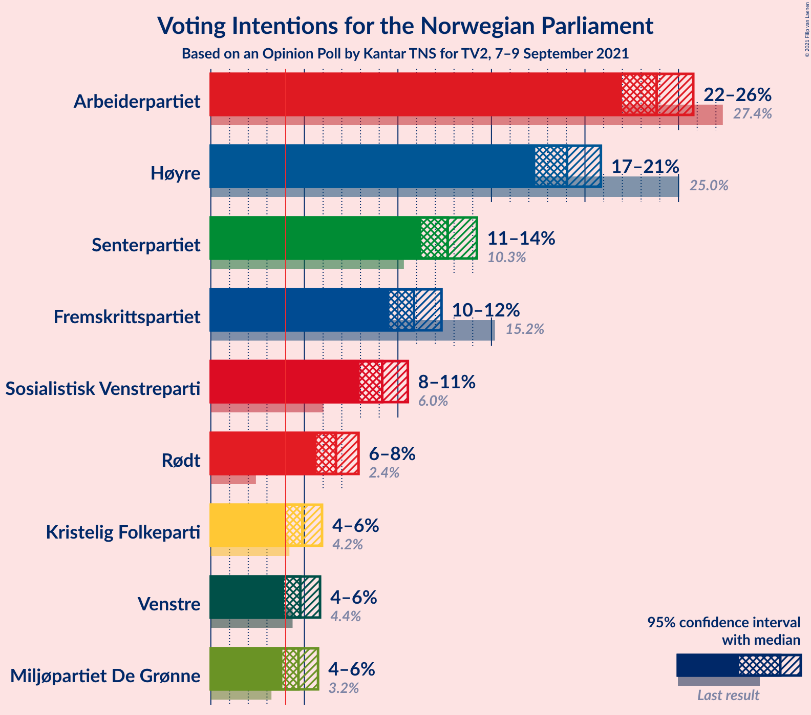

### Confidence Intervals

| Party | Last Result | Poll Result | 80% Confidence Interval | 90% Confidence Interval | 95% Confidence Interval | 99% Confidence Interval |
|:-----:|:-----------:|:-----------:|:-----------------------:|:-----------------------:|:-----------------------:|:-----------------------:|
| Arbeiderpartiet | 27.4% | 23.8% | 22.6–25.1% |22.3–25.5% |22.0–25.8% |21.4–26.4% |
| Høyre | 25.0% | 19.0% | 17.9–20.2% |17.6–20.6% |17.3–20.9% |16.8–21.4% |
| Senterpartiet | 10.3% | 12.7% | 11.7–13.7% |11.5–14.0% |11.2–14.2% |10.8–14.7% |
| Fremskrittspartiet | 15.2% | 10.9% | 10.0–11.8% |9.8–12.1% |9.5–12.3% |9.1–12.8% |
| Sosialistisk Venstreparti | 6.0% | 9.2% | 8.4–10.1% |8.1–10.3% |8.0–10.5% |7.6–11.0% |
| Rødt | 2.4% | 6.7% | 6.0–7.5% |5.8–7.7% |5.7–7.9% |5.3–8.3% |
| Kristelig Folkeparti | 4.2% | 4.9% | 4.3–5.6% |4.1–5.8% |4.0–5.9% |3.7–6.3% |
| Venstre | 4.4% | 4.8% | 4.2–5.5% |4.1–5.7% |3.9–5.8% |3.7–6.2% |
| Miljøpartiet De Grønne | 3.2% | 4.7% | 4.1–5.4% |4.0–5.5% |3.8–5.7% |3.6–6.1% |

*Note:* The poll result column reflects the actual value used in the calculations. Published results may vary slightly, and in addition be rounded to fewer digits.

## Seats

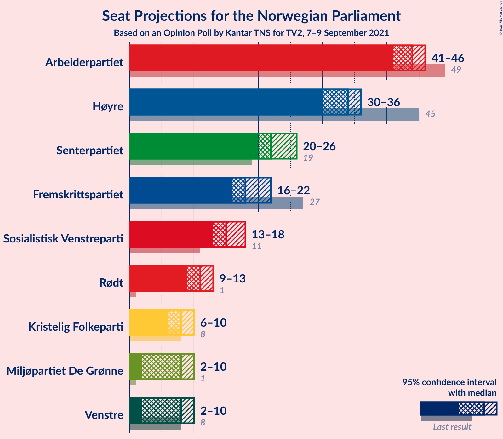

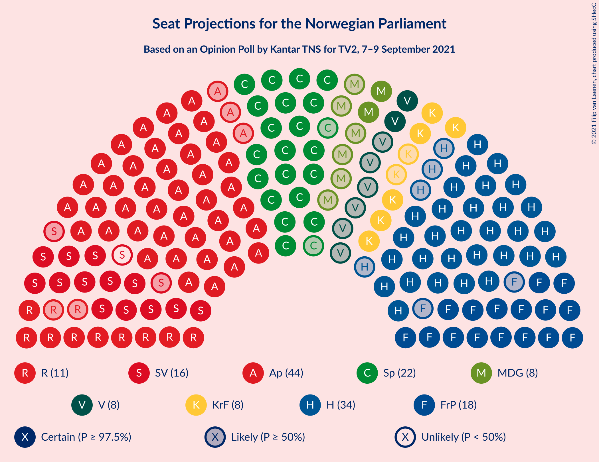

### Confidence Intervals

| Party | Last Result | Median | 80% Confidence Interval | 90% Confidence Interval | 95% Confidence Interval | 99% Confidence Interval |
|:-----:|:-----------:|:------:|:-----------------------:|:-----------------------:|:-----------------------:|:-----------------------:|
| <a href="#arbeiderpartiet">Arbeiderpartiet</a> | 49 | 44 | 42–45 |41–46 |41–46 |40–48 |
| <a href="#høyre">Høyre</a> | 45 | 34 | 32–35 |31–36 |30–36 |29–37 |
| <a href="#senterpartiet">Senterpartiet</a> | 19 | 22 | 20–25 |20–25 |20–26 |19–27 |
| <a href="#fremskrittspartiet">Fremskrittspartiet</a> | 27 | 18 | 17–21 |16–21 |16–22 |15–23 |
| <a href="#sosialistisk-venstreparti">Sosialistisk Venstreparti</a> | 11 | 15 | 14–17 |13–17 |13–18 |12–19 |
| <a href="#rødt">Rødt</a> | 1 | 11 | 10–12 |10–13 |9–13 |9–14 |
| <a href="#kristelig-folkeparti">Kristelig Folkeparti</a> | 8 | 8 | 7–9 |7–10 |6–10 |3–11 |
| <a href="#venstre">Venstre</a> | 8 | 8 | 7–9 |7–10 |2–10 |2–10 |
| <a href="#miljøpartiet-de-grønne">Miljøpartiet De Grønne</a> | 1 | 8 | 7–9 |2–9 |2–10 |2–10 |

### Arbeiderpartiet

*For a full overview of the results for this party, see the [Arbeiderpartiet](party-arbeiderpartiet.html) page.*

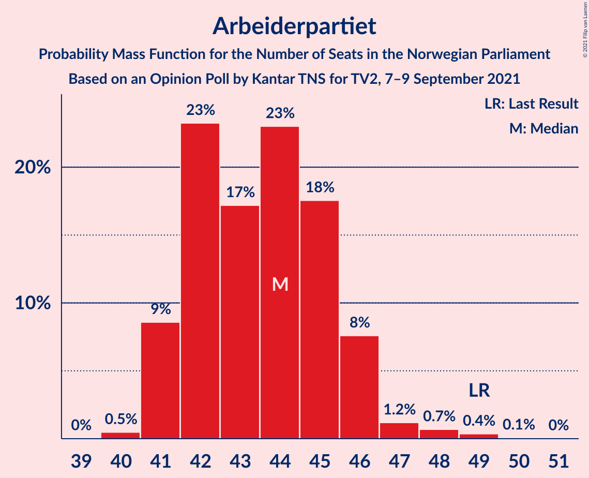

| Number of Seats | Probability | Accumulated | Special Marks |
|:---------------:|:-----------:|:-----------:|:-------------:|
| 40 | 0.5% | 100% |  |
| 41 | 9% | 99.5% |  |
| 42 | 23% | 91% |  |
| 43 | 17% | 68% |  |
| 44 | 23% | 50% | Median |
| 45 | 18% | 27% |  |
| 46 | 8% | 10% |  |
| 47 | 1.2% | 2% |  |
| 48 | 0.7% | 1.1% |  |
| 49 | 0.4% | 0.5% | Last Result |
| 50 | 0.1% | 0.1% |  |
| 51 | 0% | 0% |  |

### Høyre

*For a full overview of the results for this party, see the [Høyre](party-høyre.html) page.*

| Number of Seats | Probability | Accumulated | Special Marks |
|:---------------:|:-----------:|:-----------:|:-------------:|
| 28 | 0.2% | 100% |  |
| 29 | 1.5% | 99.8% |  |
| 30 | 1.5% | 98% |  |
| 31 | 3% | 97% |  |
| 32 | 15% | 94% |  |
| 33 | 11% | 79% |  |
| 34 | 44% | 68% | Median |
| 35 | 16% | 25% |  |
| 36 | 8% | 9% |  |
| 37 | 0.6% | 1.1% |  |
| 38 | 0.3% | 0.5% |  |
| 39 | 0.1% | 0.1% |  |
| 40 | 0% | 0% |  |
| 41 | 0% | 0% |  |
| 42 | 0% | 0% |  |
| 43 | 0% | 0% |  |
| 44 | 0% | 0% |  |
| 45 | 0% | 0% | Last Result |

### Senterpartiet

*For a full overview of the results for this party, see the [Senterpartiet](party-senterpartiet.html) page.*

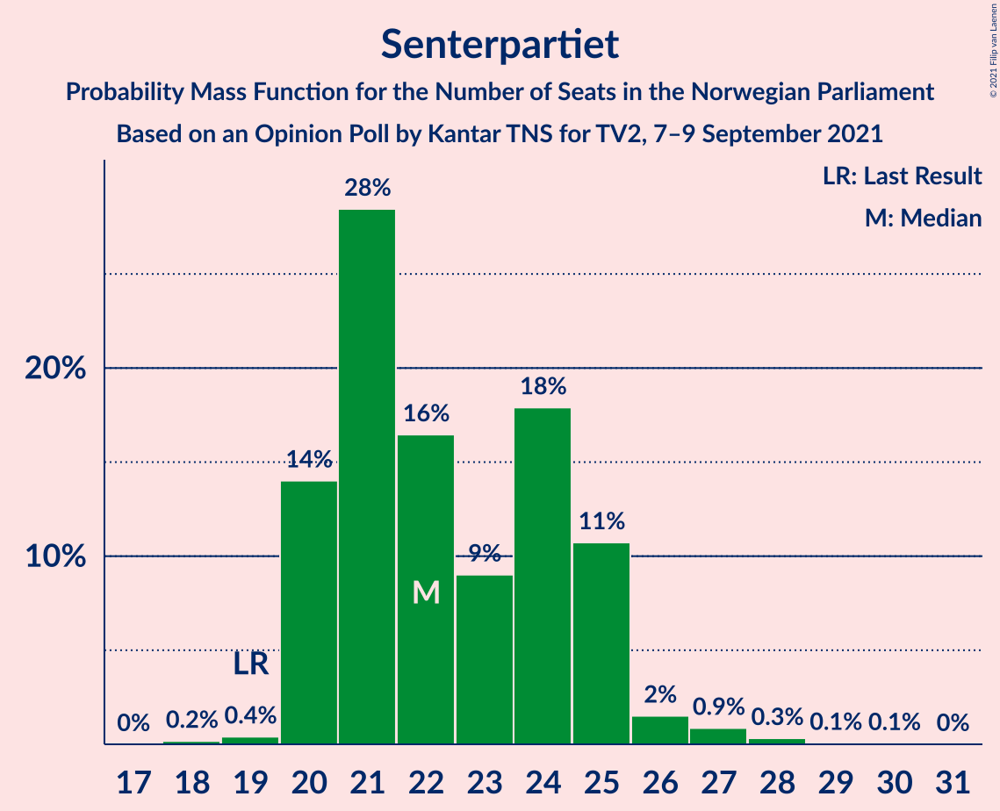

| Number of Seats | Probability | Accumulated | Special Marks |
|:---------------:|:-----------:|:-----------:|:-------------:|
| 18 | 0.2% | 100% |  |
| 19 | 0.4% | 99.8% | Last Result |
| 20 | 14% | 99.4% |  |
| 21 | 28% | 85% |  |
| 22 | 16% | 57% | Median |
| 23 | 9% | 40% |  |
| 24 | 18% | 31% |  |
| 25 | 11% | 14% |  |
| 26 | 2% | 3% |  |
| 27 | 0.9% | 1.3% |  |
| 28 | 0.3% | 0.5% |  |
| 29 | 0.1% | 0.1% |  |
| 30 | 0.1% | 0.1% |  |
| 31 | 0% | 0% |  |

### Fremskrittspartiet

*For a full overview of the results for this party, see the [Fremskrittspartiet](party-fremskrittspartiet.html) page.*

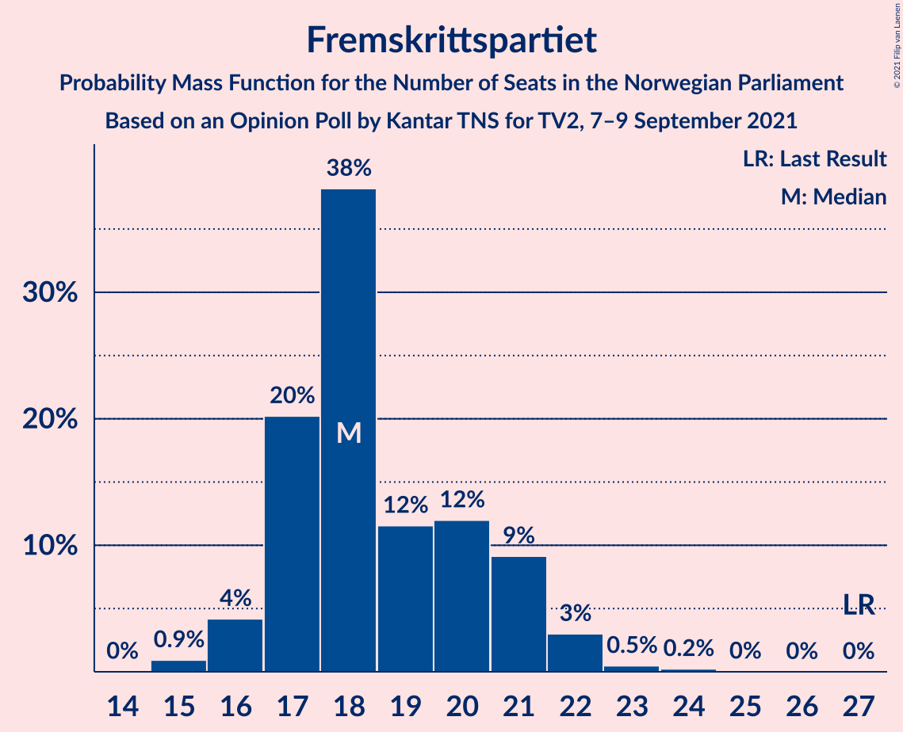

| Number of Seats | Probability | Accumulated | Special Marks |
|:---------------:|:-----------:|:-----------:|:-------------:|
| 15 | 0.9% | 100% |  |
| 16 | 4% | 99.0% |  |
| 17 | 20% | 95% |  |
| 18 | 38% | 75% | Median |
| 19 | 12% | 36% |  |
| 20 | 12% | 25% |  |
| 21 | 9% | 13% |  |
| 22 | 3% | 4% |  |
| 23 | 0.5% | 0.7% |  |
| 24 | 0.2% | 0.3% |  |
| 25 | 0% | 0% |  |
| 26 | 0% | 0% |  |
| 27 | 0% | 0% | Last Result |

### Sosialistisk Venstreparti

*For a full overview of the results for this party, see the [Sosialistisk Venstreparti](party-sosialistiskvenstreparti.html) page.*

| Number of Seats | Probability | Accumulated | Special Marks |
|:---------------:|:-----------:|:-----------:|:-------------:|
| 11 | 0.3% | 100% | Last Result |
| 12 | 2% | 99.7% |  |
| 13 | 6% | 98% |  |
| 14 | 14% | 91% |  |
| 15 | 28% | 78% | Median |
| 16 | 35% | 50% |  |
| 17 | 10% | 15% |  |
| 18 | 4% | 5% |  |
| 19 | 0.7% | 0.8% |  |
| 20 | 0% | 0.1% |  |
| 21 | 0% | 0% |  |

### Rødt

*For a full overview of the results for this party, see the [Rødt](party-rødt.html) page.*

| Number of Seats | Probability | Accumulated | Special Marks |
|:---------------:|:-----------:|:-----------:|:-------------:|
| 1 | 0% | 100% | Last Result |
| 2 | 0% | 100% |  |
| 3 | 0% | 100% |  |
| 4 | 0% | 100% |  |
| 5 | 0% | 100% |  |
| 6 | 0% | 100% |  |
| 7 | 0% | 100% |  |
| 8 | 0.3% | 100% |  |
| 9 | 2% | 99.7% |  |
| 10 | 13% | 97% |  |
| 11 | 40% | 85% | Median |
| 12 | 36% | 44% |  |
| 13 | 7% | 8% |  |
| 14 | 1.3% | 1.5% |  |
| 15 | 0.1% | 0.2% |  |
| 16 | 0% | 0% |  |

### Kristelig Folkeparti

*For a full overview of the results for this party, see the [Kristelig Folkeparti](party-kristeligfolkeparti.html) page.*

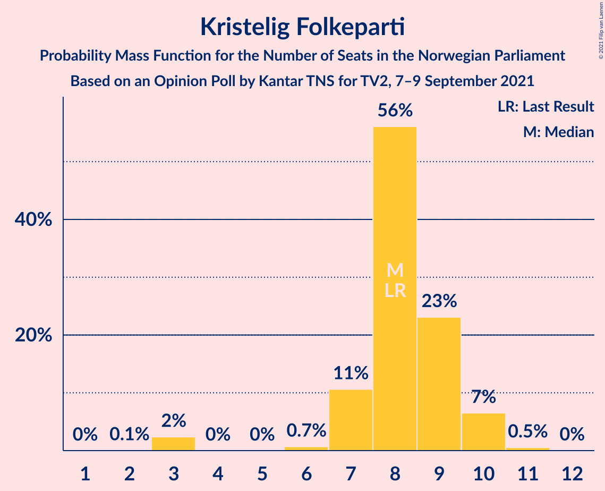

| Number of Seats | Probability | Accumulated | Special Marks |
|:---------------:|:-----------:|:-----------:|:-------------:|
| 2 | 0.1% | 100% |  |
| 3 | 2% | 99.9% |  |
| 4 | 0% | 98% |  |
| 5 | 0% | 98% |  |
| 6 | 0.7% | 98% |  |
| 7 | 11% | 97% |  |
| 8 | 56% | 86% | Last Result, Median |
| 9 | 23% | 30% |  |
| 10 | 7% | 7% |  |
| 11 | 0.5% | 0.6% |  |
| 12 | 0% | 0% |  |

### Venstre

*For a full overview of the results for this party, see the [Venstre](party-venstre.html) page.*

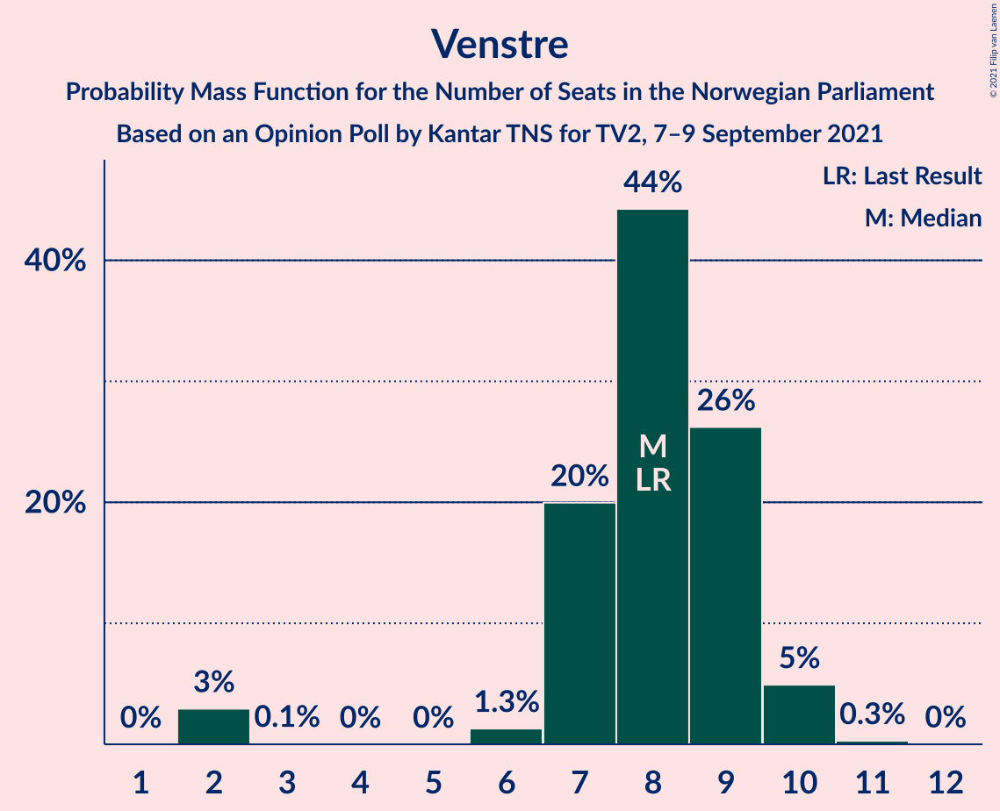

| Number of Seats | Probability | Accumulated | Special Marks |
|:---------------:|:-----------:|:-----------:|:-------------:|
| 2 | 3% | 100% |  |
| 3 | 0.1% | 97% |  |
| 4 | 0% | 97% |  |
| 5 | 0% | 97% |  |
| 6 | 1.3% | 97% |  |
| 7 | 20% | 96% |  |
| 8 | 44% | 76% | Last Result, Median |
| 9 | 26% | 31% |  |
| 10 | 5% | 5% |  |
| 11 | 0.3% | 0.3% |  |
| 12 | 0% | 0% |  |

### Miljøpartiet De Grønne

*For a full overview of the results for this party, see the [Miljøpartiet De Grønne](party-miljøpartietdegrønne.html) page.*

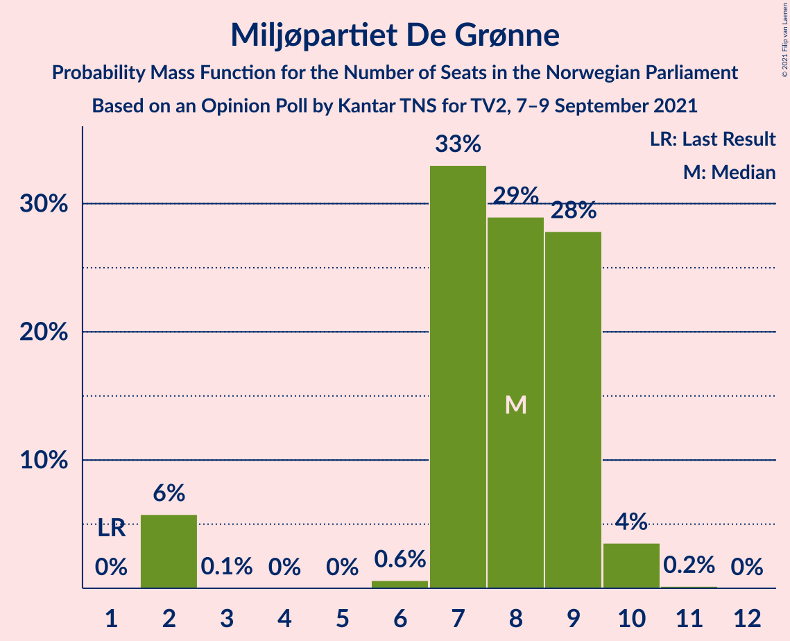

| Number of Seats | Probability | Accumulated | Special Marks |
|:---------------:|:-----------:|:-----------:|:-------------:|
| 1 | 0% | 100% | Last Result |
| 2 | 6% | 100% |  |
| 3 | 0.1% | 94% |  |
| 4 | 0% | 94% |  |
| 5 | 0% | 94% |  |
| 6 | 0.6% | 94% |  |
| 7 | 33% | 94% |  |
| 8 | 29% | 61% | Median |
| 9 | 28% | 32% |  |
| 10 | 4% | 4% |  |
| 11 | 0.2% | 0.2% |  |
| 12 | 0% | 0% |  |

## Coalitions

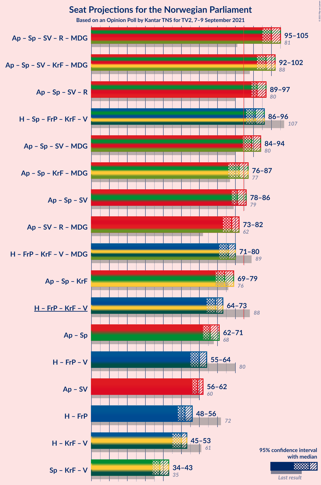

### Confidence Intervals

| Coalition | Last Result | Median | Majority? | 80% Confidence Interval | 90% Confidence Interval | 95% Confidence Interval | 99% Confidence Interval |
|:---------:|:-----------:|:------:|:---------:|:-----------------------:|:-----------------------:|:-----------------------:|:-----------------------:|
| Arbeiderpartiet – Senterpartiet – Sosialistisk Venstreparti – Rødt – Miljøpartiet De Grønne | 81 | 100 | 100% | 97–103 | 96–104 | 95–105 | 93–106 |
| Arbeiderpartiet – Senterpartiet – Sosialistisk Venstreparti – Kristelig Folkeparti – Miljøpartiet De Grønne | 88 | 97 | 100% | 94–100 | 93–101 | 92–102 | 90–104 |
| Arbeiderpartiet – Senterpartiet – Sosialistisk Venstreparti – Rødt | 80 | 92 | 100% | 89–96 | 89–97 | 89–97 | 87–99 |
| Høyre – Senterpartiet – Fremskrittspartiet – Kristelig Folkeparti – Venstre | 107 | 91 | 99.3% | 88–93 | 86–95 | 86–96 | 84–97 |
| Arbeiderpartiet – Senterpartiet – Sosialistisk Venstreparti – Miljøpartiet De Grønne | 80 | 89 | 97% | 86–92 | 85–92 | 84–94 | 82–95 |
| Arbeiderpartiet – Senterpartiet – Kristelig Folkeparti – Miljøpartiet De Grønne | 77 | 82 | 14% | 78–85 | 77–86 | 76–87 | 74–88 |
| Arbeiderpartiet – Senterpartiet – Sosialistisk Venstreparti | 79 | 81 | 6% | 78–84 | 78–85 | 78–86 | 76–87 |
| Arbeiderpartiet – Sosialistisk Venstreparti – Rødt – Miljøpartiet De Grønne | 62 | 78 | 0.2% | 75–80 | 74–81 | 73–82 | 71–84 |
| Høyre – Fremskrittspartiet – Kristelig Folkeparti – Venstre – Miljøpartiet De Grønne | 89 | 76 | 0% | 73–79 | 72–80 | 71–80 | 69–81 |
| Arbeiderpartiet – Senterpartiet – Kristelig Folkeparti | 76 | 74 | 0% | 70–77 | 70–78 | 69–79 | 67–80 |
| Høyre – Fremskrittspartiet – Kristelig Folkeparti – Venstre | 88 | 69 | 0% | 65–71 | 65–72 | 64–73 | 62–75 |
| Arbeiderpartiet – Senterpartiet | 68 | 66 | 0% | 62–69 | 62–70 | 62–71 | 61–72 |
| Høyre – Fremskrittspartiet – Venstre | 80 | 60 | 0% | 57–63 | 57–64 | 55–64 | 53–66 |
| Arbeiderpartiet – Sosialistisk Venstreparti | 60 | 59 | 0% | 57–61 | 56–62 | 56–62 | 55–64 |
| Høyre – Fremskrittspartiet | 72 | 52 | 0% | 50–55 | 49–56 | 48–56 | 47–58 |
| Høyre – Kristelig Folkeparti – Venstre | 61 | 50 | 0% | 47–52 | 46–53 | 45–53 | 43–55 |
| Senterpartiet – Kristelig Folkeparti – Venstre | 35 | 38 | 0% | 36–41 | 35–42 | 34–43 | 32–44 |

### Arbeiderpartiet – Senterpartiet – Sosialistisk Venstreparti – Rødt – Miljøpartiet De Grønne

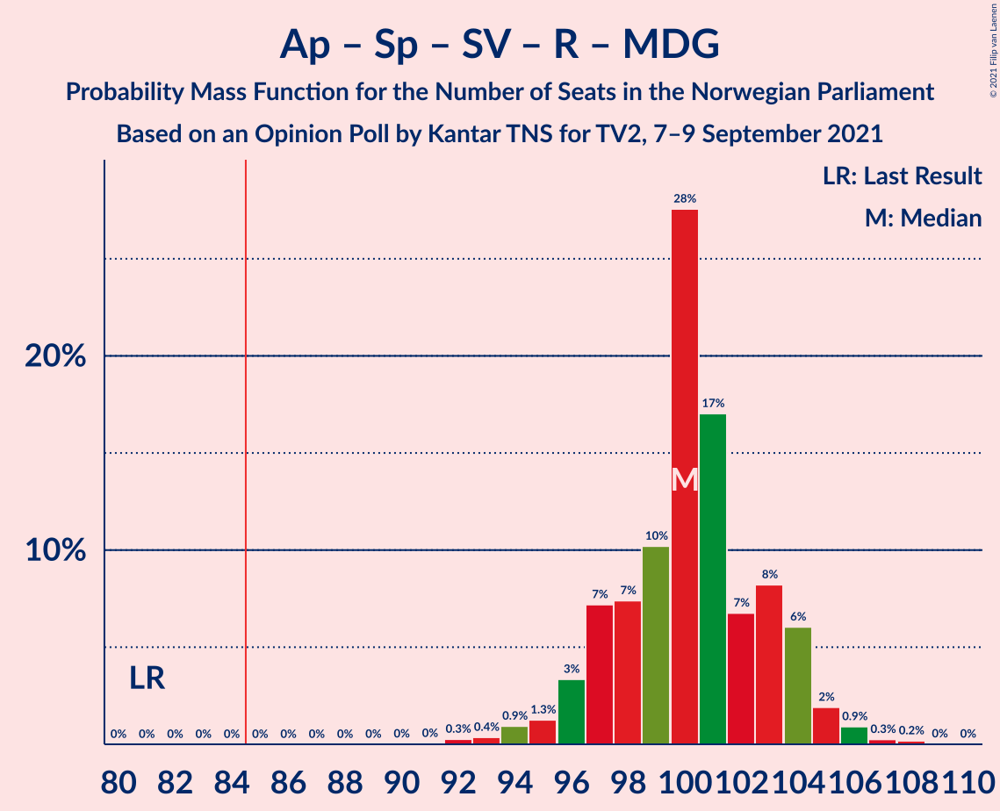

| Number of Seats | Probability | Accumulated | Special Marks |
|:---------------:|:-----------:|:-----------:|:-------------:|
| 81 | 0% | 100% | Last Result |
| 82 | 0% | 100% |  |
| 83 | 0% | 100% |  |
| 84 | 0% | 100% |  |
| 85 | 0% | 100% | Majority |
| 86 | 0% | 100% |  |
| 87 | 0% | 100% |  |
| 88 | 0% | 100% |  |
| 89 | 0% | 100% |  |
| 90 | 0% | 100% |  |
| 91 | 0% | 100% |  |
| 92 | 0.3% | 99.9% |  |
| 93 | 0.4% | 99.7% |  |
| 94 | 0.9% | 99.3% |  |
| 95 | 1.3% | 98% |  |
| 96 | 3% | 97% |  |
| 97 | 7% | 94% |  |
| 98 | 7% | 87% |  |
| 99 | 10% | 79% |  |
| 100 | 28% | 69% | Median |
| 101 | 17% | 41% |  |
| 102 | 7% | 24% |  |
| 103 | 8% | 18% |  |
| 104 | 6% | 9% |  |
| 105 | 2% | 3% |  |
| 106 | 0.9% | 1.4% |  |
| 107 | 0.3% | 0.5% |  |
| 108 | 0.2% | 0.2% |  |
| 109 | 0% | 0% |  |

### Arbeiderpartiet – Senterpartiet – Sosialistisk Venstreparti – Kristelig Folkeparti – Miljøpartiet De Grønne

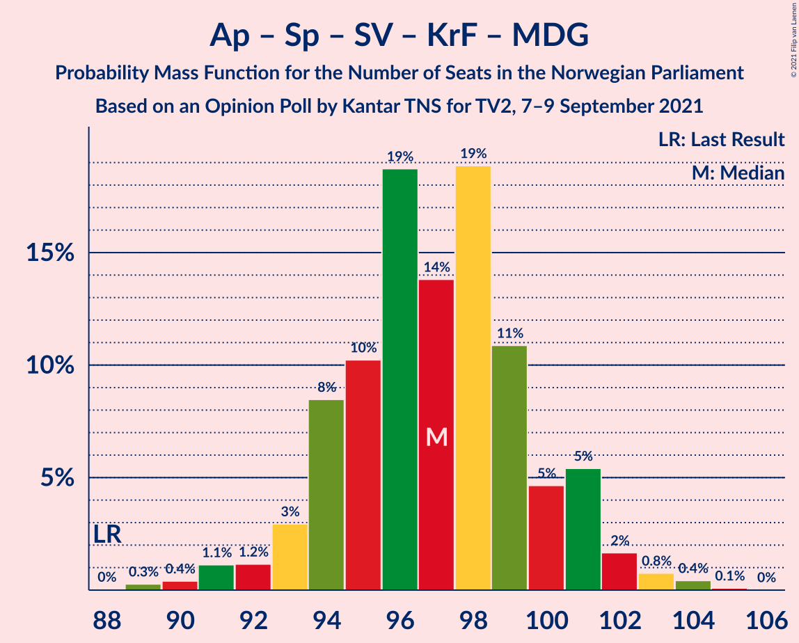

| Number of Seats | Probability | Accumulated | Special Marks |
|:---------------:|:-----------:|:-----------:|:-------------:|
| 88 | 0% | 100% | Last Result |
| 89 | 0.3% | 99.9% |  |
| 90 | 0.4% | 99.7% |  |
| 91 | 1.1% | 99.3% |  |
| 92 | 1.2% | 98% |  |
| 93 | 3% | 97% |  |
| 94 | 8% | 94% |  |
| 95 | 10% | 86% |  |
| 96 | 19% | 75% |  |
| 97 | 14% | 57% | Median |
| 98 | 19% | 43% |  |
| 99 | 11% | 24% |  |
| 100 | 5% | 13% |  |
| 101 | 5% | 8% |  |
| 102 | 2% | 3% |  |
| 103 | 0.8% | 1.3% |  |
| 104 | 0.4% | 0.6% |  |
| 105 | 0.1% | 0.1% |  |
| 106 | 0% | 0% |  |

### Arbeiderpartiet – Senterpartiet – Sosialistisk Venstreparti – Rødt

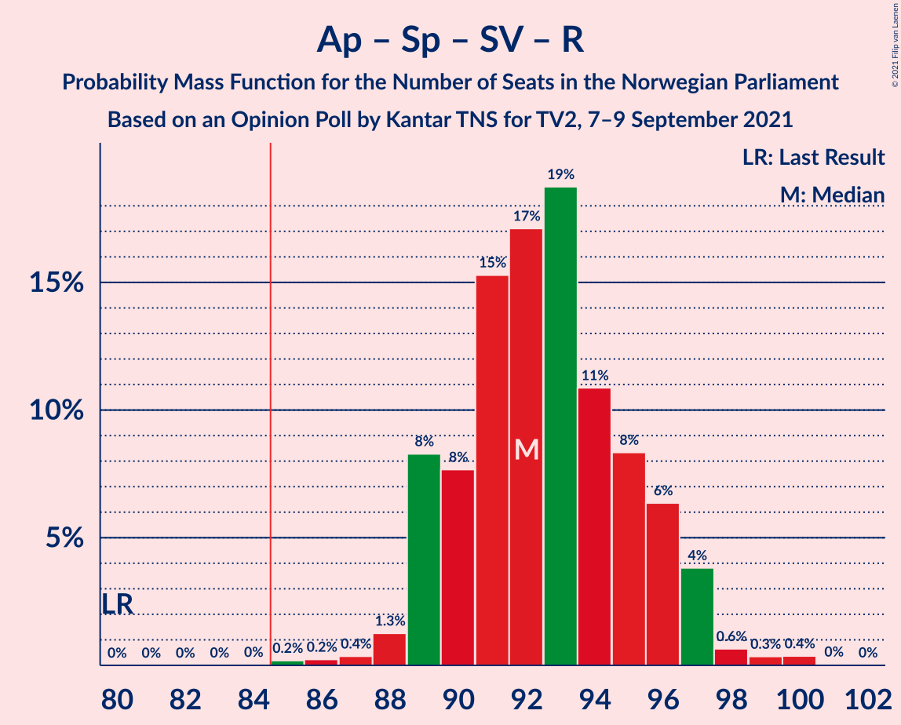

| Number of Seats | Probability | Accumulated | Special Marks |
|:---------------:|:-----------:|:-----------:|:-------------:|
| 80 | 0% | 100% | Last Result |
| 81 | 0% | 100% |  |
| 82 | 0% | 100% |  |
| 83 | 0% | 100% |  |
| 84 | 0% | 100% |  |
| 85 | 0.2% | 100% | Majority |
| 86 | 0.2% | 99.8% |  |
| 87 | 0.4% | 99.5% |  |
| 88 | 1.3% | 99.2% |  |
| 89 | 8% | 98% |  |
| 90 | 8% | 90% |  |
| 91 | 15% | 82% |  |
| 92 | 17% | 67% | Median |
| 93 | 19% | 50% |  |
| 94 | 11% | 31% |  |
| 95 | 8% | 20% |  |
| 96 | 6% | 12% |  |
| 97 | 4% | 5% |  |
| 98 | 0.6% | 1.4% |  |
| 99 | 0.3% | 0.8% |  |
| 100 | 0.4% | 0.4% |  |
| 101 | 0% | 0.1% |  |
| 102 | 0% | 0% |  |

### Høyre – Senterpartiet – Fremskrittspartiet – Kristelig Folkeparti – Venstre

| Number of Seats | Probability | Accumulated | Special Marks |
|:---------------:|:-----------:|:-----------:|:-------------:|
| 82 | 0.1% | 100% |  |
| 83 | 0.2% | 99.9% |  |
| 84 | 0.4% | 99.7% |  |
| 85 | 0.9% | 99.3% | Majority |
| 86 | 5% | 98% |  |
| 87 | 3% | 94% |  |
| 88 | 2% | 91% |  |
| 89 | 15% | 89% |  |
| 90 | 23% | 74% | Median |
| 91 | 18% | 51% |  |
| 92 | 19% | 33% |  |
| 93 | 6% | 14% |  |
| 94 | 2% | 9% |  |
| 95 | 4% | 6% |  |
| 96 | 2% | 3% |  |
| 97 | 0.6% | 0.8% |  |
| 98 | 0.1% | 0.2% |  |
| 99 | 0% | 0% |  |
| 100 | 0% | 0% |  |
| 101 | 0% | 0% |  |
| 102 | 0% | 0% |  |
| 103 | 0% | 0% |  |
| 104 | 0% | 0% |  |
| 105 | 0% | 0% |  |
| 106 | 0% | 0% |  |
| 107 | 0% | 0% | Last Result |

### Arbeiderpartiet – Senterpartiet – Sosialistisk Venstreparti – Miljøpartiet De Grønne

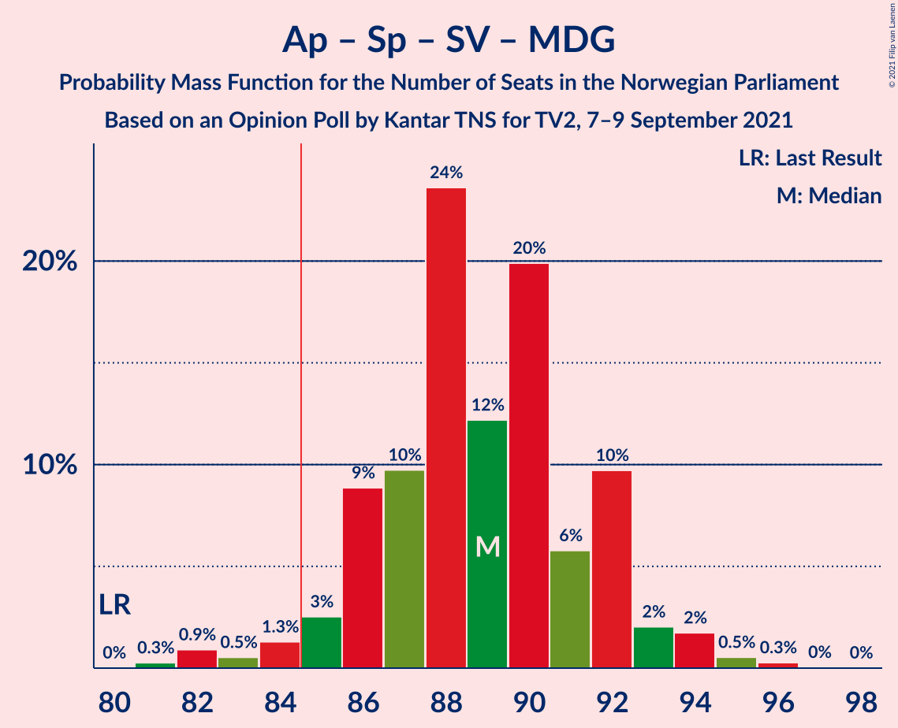

| Number of Seats | Probability | Accumulated | Special Marks |
|:---------------:|:-----------:|:-----------:|:-------------:|
| 80 | 0% | 100% | Last Result |
| 81 | 0.3% | 100% |  |
| 82 | 0.9% | 99.7% |  |
| 83 | 0.5% | 98.8% |  |
| 84 | 1.3% | 98% |  |
| 85 | 3% | 97% | Majority |
| 86 | 9% | 94% |  |
| 87 | 10% | 86% |  |
| 88 | 24% | 76% |  |
| 89 | 12% | 52% | Median |
| 90 | 20% | 40% |  |
| 91 | 6% | 20% |  |
| 92 | 10% | 14% |  |
| 93 | 2% | 5% |  |
| 94 | 2% | 3% |  |
| 95 | 0.5% | 0.9% |  |
| 96 | 0.3% | 0.3% |  |
| 97 | 0% | 0.1% |  |
| 98 | 0% | 0% |  |

### Arbeiderpartiet – Senterpartiet – Kristelig Folkeparti – Miljøpartiet De Grønne

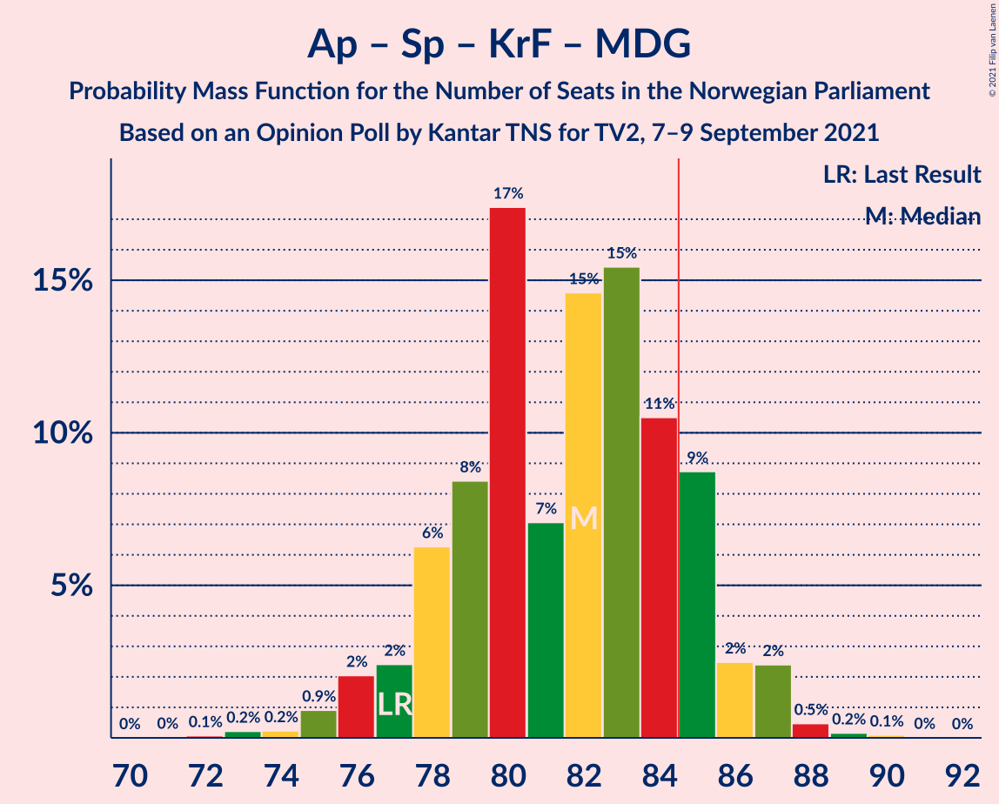

| Number of Seats | Probability | Accumulated | Special Marks |
|:---------------:|:-----------:|:-----------:|:-------------:|
| 72 | 0.1% | 100% |  |
| 73 | 0.2% | 99.9% |  |
| 74 | 0.2% | 99.7% |  |
| 75 | 0.9% | 99.4% |  |
| 76 | 2% | 98.5% |  |
| 77 | 2% | 96% | Last Result |
| 78 | 6% | 94% |  |
| 79 | 8% | 88% |  |
| 80 | 17% | 79% |  |
| 81 | 7% | 62% |  |
| 82 | 15% | 55% | Median |
| 83 | 15% | 40% |  |
| 84 | 11% | 25% |  |
| 85 | 9% | 14% | Majority |
| 86 | 2% | 6% |  |
| 87 | 2% | 3% |  |
| 88 | 0.5% | 0.8% |  |
| 89 | 0.2% | 0.3% |  |
| 90 | 0.1% | 0.1% |  |
| 91 | 0% | 0% |  |

### Arbeiderpartiet – Senterpartiet – Sosialistisk Venstreparti

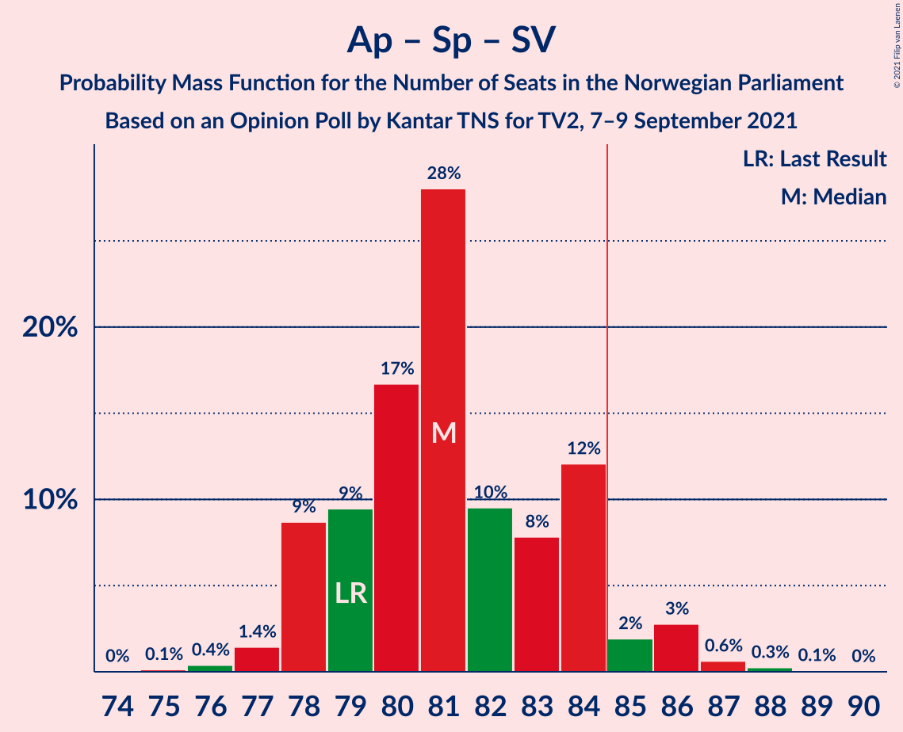

| Number of Seats | Probability | Accumulated | Special Marks |
|:---------------:|:-----------:|:-----------:|:-------------:|
| 74 | 0% | 100% |  |
| 75 | 0.1% | 99.9% |  |
| 76 | 0.4% | 99.8% |  |
| 77 | 1.4% | 99.4% |  |
| 78 | 9% | 98% |  |
| 79 | 9% | 89% | Last Result |
| 80 | 17% | 80% |  |
| 81 | 28% | 63% | Median |
| 82 | 10% | 35% |  |
| 83 | 8% | 26% |  |
| 84 | 12% | 18% |  |
| 85 | 2% | 6% | Majority |
| 86 | 3% | 4% |  |
| 87 | 0.6% | 1.0% |  |
| 88 | 0.3% | 0.3% |  |
| 89 | 0.1% | 0.1% |  |
| 90 | 0% | 0% |  |

### Arbeiderpartiet – Sosialistisk Venstreparti – Rødt – Miljøpartiet De Grønne

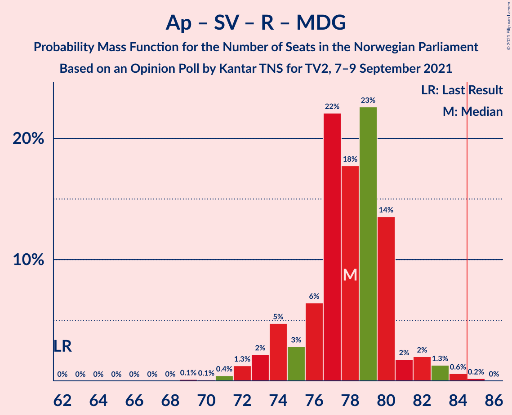

| Number of Seats | Probability | Accumulated | Special Marks |
|:---------------:|:-----------:|:-----------:|:-------------:|
| 62 | 0% | 100% | Last Result |
| 63 | 0% | 100% |  |
| 64 | 0% | 100% |  |
| 65 | 0% | 100% |  |
| 66 | 0% | 100% |  |
| 67 | 0% | 100% |  |
| 68 | 0% | 100% |  |
| 69 | 0.1% | 100% |  |
| 70 | 0.1% | 99.9% |  |
| 71 | 0.4% | 99.8% |  |
| 72 | 1.3% | 99.3% |  |
| 73 | 2% | 98% |  |
| 74 | 5% | 96% |  |
| 75 | 3% | 91% |  |
| 76 | 6% | 88% |  |
| 77 | 22% | 82% |  |
| 78 | 18% | 60% | Median |
| 79 | 23% | 42% |  |
| 80 | 14% | 19% |  |
| 81 | 2% | 6% |  |
| 82 | 2% | 4% |  |
| 83 | 1.3% | 2% |  |
| 84 | 0.6% | 0.8% |  |
| 85 | 0.2% | 0.2% | Majority |
| 86 | 0% | 0% |  |

### Høyre – Fremskrittspartiet – Kristelig Folkeparti – Venstre – Miljøpartiet De Grønne

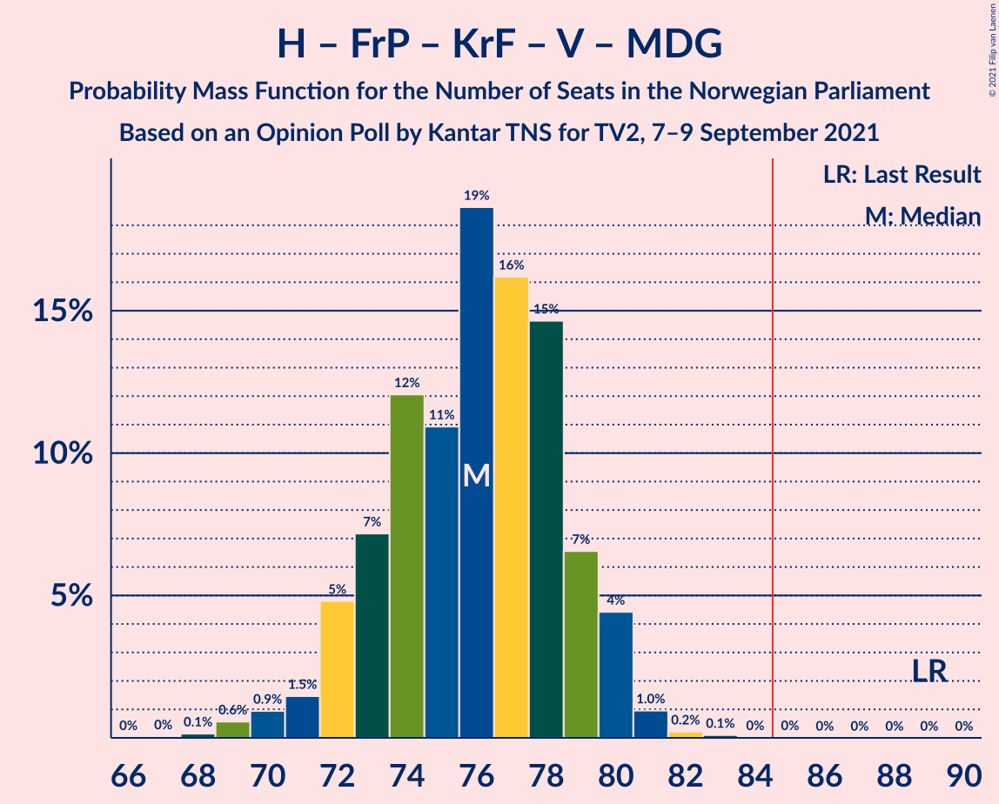

| Number of Seats | Probability | Accumulated | Special Marks |
|:---------------:|:-----------:|:-----------:|:-------------:|
| 66 | 0% | 100% |  |
| 67 | 0% | 99.9% |  |
| 68 | 0.1% | 99.9% |  |
| 69 | 0.6% | 99.7% |  |
| 70 | 0.9% | 99.2% |  |
| 71 | 1.5% | 98% |  |
| 72 | 5% | 97% |  |
| 73 | 7% | 92% |  |
| 74 | 12% | 85% |  |
| 75 | 11% | 73% |  |
| 76 | 19% | 62% | Median |
| 77 | 16% | 43% |  |
| 78 | 15% | 27% |  |
| 79 | 7% | 12% |  |
| 80 | 4% | 6% |  |
| 81 | 1.0% | 1.3% |  |
| 82 | 0.2% | 0.4% |  |
| 83 | 0.1% | 0.1% |  |
| 84 | 0% | 0% |  |
| 85 | 0% | 0% | Majority |
| 86 | 0% | 0% |  |
| 87 | 0% | 0% |  |
| 88 | 0% | 0% |  |
| 89 | 0% | 0% | Last Result |

### Arbeiderpartiet – Senterpartiet – Kristelig Folkeparti

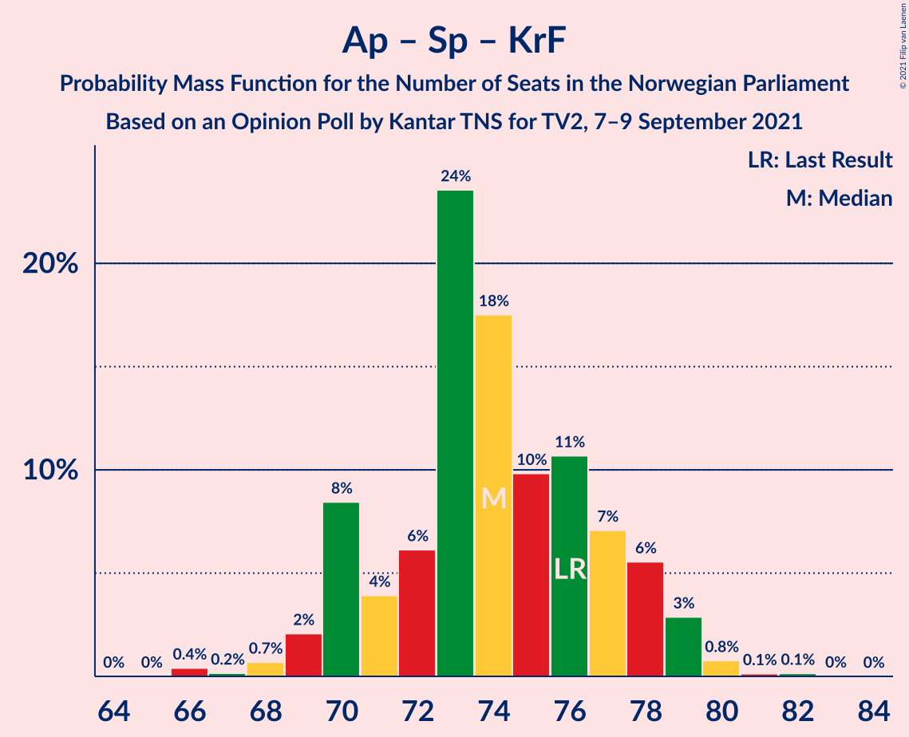

| Number of Seats | Probability | Accumulated | Special Marks |
|:---------------:|:-----------:|:-----------:|:-------------:|
| 66 | 0.4% | 100% |  |
| 67 | 0.2% | 99.6% |  |
| 68 | 0.7% | 99.4% |  |
| 69 | 2% | 98.7% |  |
| 70 | 8% | 97% |  |
| 71 | 4% | 88% |  |
| 72 | 6% | 84% |  |
| 73 | 24% | 78% |  |
| 74 | 18% | 55% | Median |
| 75 | 10% | 37% |  |
| 76 | 11% | 27% | Last Result |
| 77 | 7% | 17% |  |
| 78 | 6% | 9% |  |
| 79 | 3% | 4% |  |
| 80 | 0.8% | 1.1% |  |
| 81 | 0.1% | 0.3% |  |
| 82 | 0.1% | 0.2% |  |
| 83 | 0% | 0% |  |

### Høyre – Fremskrittspartiet – Kristelig Folkeparti – Venstre

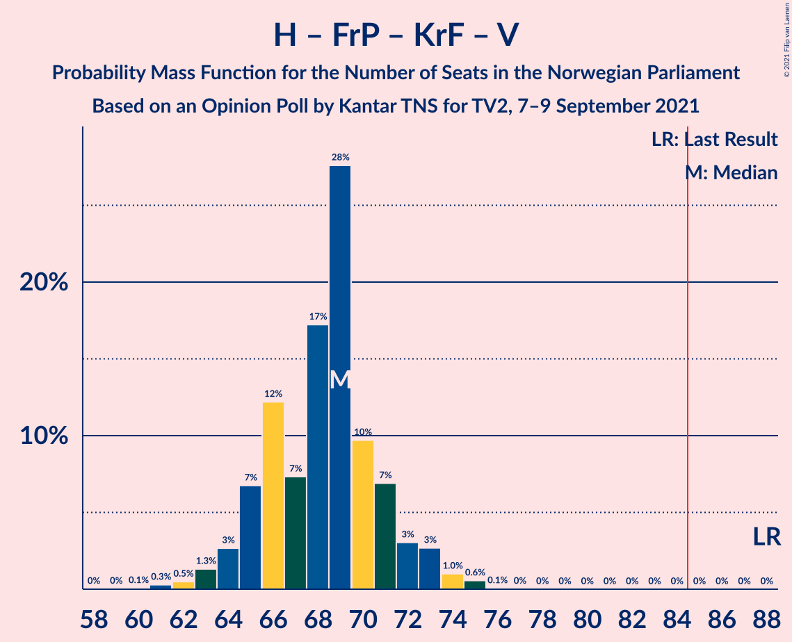

| Number of Seats | Probability | Accumulated | Special Marks |
|:---------------:|:-----------:|:-----------:|:-------------:|
| 59 | 0% | 100% |  |
| 60 | 0.1% | 99.9% |  |
| 61 | 0.3% | 99.9% |  |
| 62 | 0.5% | 99.6% |  |
| 63 | 1.3% | 99.1% |  |
| 64 | 3% | 98% |  |
| 65 | 7% | 95% |  |
| 66 | 12% | 88% |  |
| 67 | 7% | 76% |  |
| 68 | 17% | 69% | Median |
| 69 | 28% | 52% |  |
| 70 | 10% | 24% |  |
| 71 | 7% | 14% |  |
| 72 | 3% | 7% |  |
| 73 | 3% | 4% |  |
| 74 | 1.0% | 2% |  |
| 75 | 0.6% | 0.7% |  |
| 76 | 0.1% | 0.1% |  |
| 77 | 0% | 0% |  |
| 78 | 0% | 0% |  |
| 79 | 0% | 0% |  |
| 80 | 0% | 0% |  |
| 81 | 0% | 0% |  |
| 82 | 0% | 0% |  |
| 83 | 0% | 0% |  |
| 84 | 0% | 0% |  |
| 85 | 0% | 0% | Majority |
| 86 | 0% | 0% |  |
| 87 | 0% | 0% |  |
| 88 | 0% | 0% | Last Result |

### Arbeiderpartiet – Senterpartiet

| Number of Seats | Probability | Accumulated | Special Marks |
|:---------------:|:-----------:|:-----------:|:-------------:|
| 60 | 0.2% | 100% |  |
| 61 | 1.0% | 99.8% |  |
| 62 | 9% | 98.8% |  |
| 63 | 5% | 90% |  |
| 64 | 9% | 84% |  |
| 65 | 24% | 76% |  |
| 66 | 19% | 51% | Median |
| 67 | 6% | 32% |  |
| 68 | 10% | 25% | Last Result |
| 69 | 9% | 15% |  |
| 70 | 3% | 6% |  |
| 71 | 2% | 3% |  |
| 72 | 0.6% | 0.8% |  |
| 73 | 0.1% | 0.2% |  |
| 74 | 0% | 0.1% |  |
| 75 | 0% | 0% |  |

### Høyre – Fremskrittspartiet – Venstre

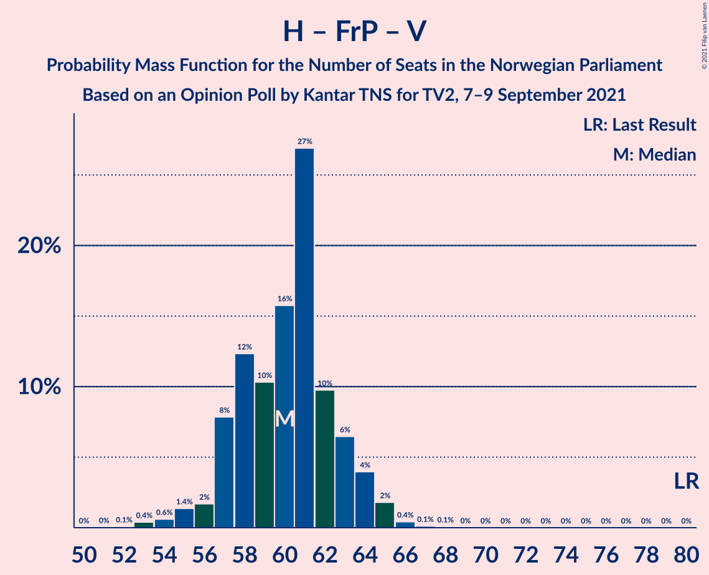

| Number of Seats | Probability | Accumulated | Special Marks |
|:---------------:|:-----------:|:-----------:|:-------------:|
| 51 | 0% | 100% |  |
| 52 | 0.1% | 99.9% |  |
| 53 | 0.4% | 99.9% |  |
| 54 | 0.6% | 99.5% |  |
| 55 | 1.4% | 98.9% |  |
| 56 | 2% | 97% |  |
| 57 | 8% | 96% |  |
| 58 | 12% | 88% |  |
| 59 | 10% | 76% |  |
| 60 | 16% | 65% | Median |
| 61 | 27% | 50% |  |
| 62 | 10% | 23% |  |
| 63 | 6% | 13% |  |
| 64 | 4% | 6% |  |
| 65 | 2% | 2% |  |
| 66 | 0.4% | 0.6% |  |
| 67 | 0.1% | 0.2% |  |
| 68 | 0.1% | 0.1% |  |
| 69 | 0% | 0% |  |
| 70 | 0% | 0% |  |
| 71 | 0% | 0% |  |
| 72 | 0% | 0% |  |
| 73 | 0% | 0% |  |
| 74 | 0% | 0% |  |
| 75 | 0% | 0% |  |
| 76 | 0% | 0% |  |
| 77 | 0% | 0% |  |
| 78 | 0% | 0% |  |
| 79 | 0% | 0% |  |
| 80 | 0% | 0% | Last Result |

### Arbeiderpartiet – Sosialistisk Venstreparti

| Number of Seats | Probability | Accumulated | Special Marks |
|:---------------:|:-----------:|:-----------:|:-------------:|
| 53 | 0.1% | 100% |  |
| 54 | 0.2% | 99.9% |  |
| 55 | 0.9% | 99.7% |  |
| 56 | 5% | 98.8% |  |
| 57 | 13% | 94% |  |
| 58 | 26% | 81% |  |
| 59 | 17% | 55% | Median |
| 60 | 27% | 39% | Last Result |
| 61 | 6% | 12% |  |
| 62 | 4% | 6% |  |
| 63 | 1.0% | 2% |  |
| 64 | 0.5% | 0.7% |  |
| 65 | 0.1% | 0.2% |  |
| 66 | 0.1% | 0.1% |  |
| 67 | 0% | 0% |  |

### Høyre – Fremskrittspartiet

| Number of Seats | Probability | Accumulated | Special Marks |
|:---------------:|:-----------:|:-----------:|:-------------:|
| 45 | 0.1% | 100% |  |
| 46 | 0.4% | 99.9% |  |
| 47 | 0.4% | 99.5% |  |
| 48 | 2% | 99.2% |  |
| 49 | 7% | 97% |  |
| 50 | 8% | 90% |  |
| 51 | 14% | 82% |  |
| 52 | 29% | 68% | Median |
| 53 | 16% | 39% |  |
| 54 | 10% | 23% |  |
| 55 | 7% | 13% |  |
| 56 | 4% | 6% |  |
| 57 | 1.2% | 2% |  |
| 58 | 0.3% | 0.5% |  |
| 59 | 0.1% | 0.2% |  |
| 60 | 0.1% | 0.1% |  |
| 61 | 0% | 0% |  |
| 62 | 0% | 0% |  |
| 63 | 0% | 0% |  |
| 64 | 0% | 0% |  |
| 65 | 0% | 0% |  |
| 66 | 0% | 0% |  |
| 67 | 0% | 0% |  |
| 68 | 0% | 0% |  |
| 69 | 0% | 0% |  |
| 70 | 0% | 0% |  |
| 71 | 0% | 0% |  |
| 72 | 0% | 0% | Last Result |

### Høyre – Kristelig Folkeparti – Venstre

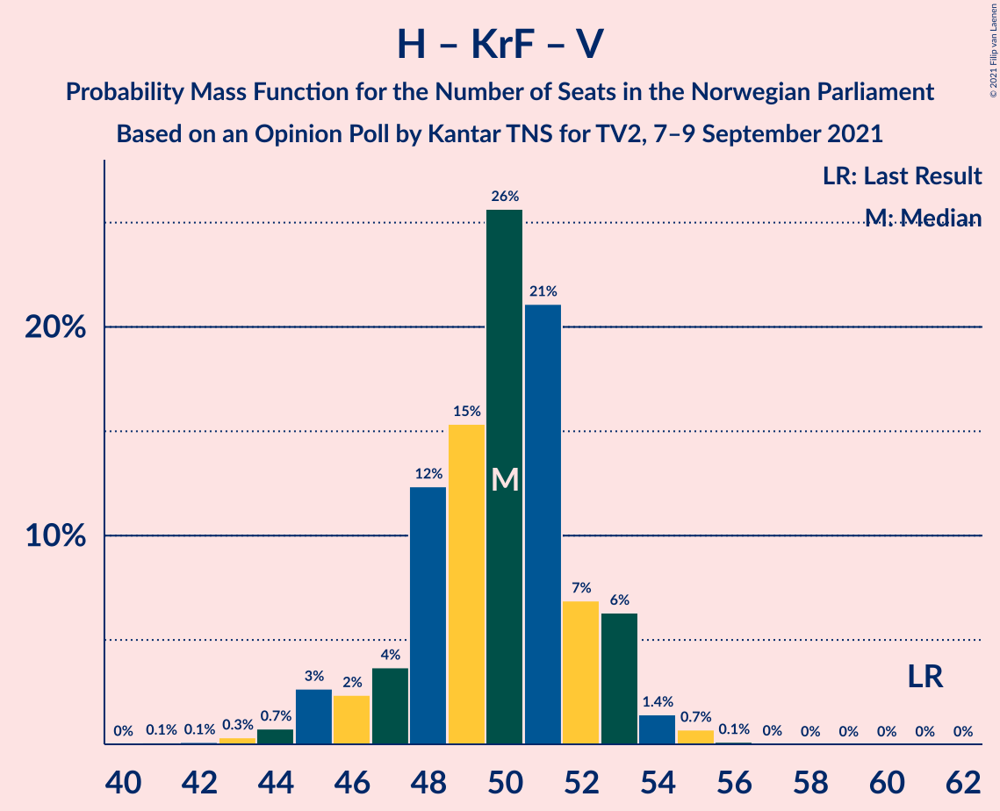

| Number of Seats | Probability | Accumulated | Special Marks |
|:---------------:|:-----------:|:-----------:|:-------------:|
| 41 | 0.1% | 100% |  |
| 42 | 0.1% | 99.9% |  |
| 43 | 0.3% | 99.8% |  |
| 44 | 0.7% | 99.4% |  |
| 45 | 3% | 98.7% |  |
| 46 | 2% | 96% |  |
| 47 | 4% | 94% |  |
| 48 | 12% | 90% |  |
| 49 | 15% | 78% |  |
| 50 | 26% | 62% | Median |
| 51 | 21% | 37% |  |
| 52 | 7% | 15% |  |
| 53 | 6% | 9% |  |
| 54 | 1.4% | 2% |  |
| 55 | 0.7% | 0.9% |  |
| 56 | 0.1% | 0.2% |  |
| 57 | 0% | 0% |  |
| 58 | 0% | 0% |  |
| 59 | 0% | 0% |  |
| 60 | 0% | 0% |  |
| 61 | 0% | 0% | Last Result |

### Senterpartiet – Kristelig Folkeparti – Venstre

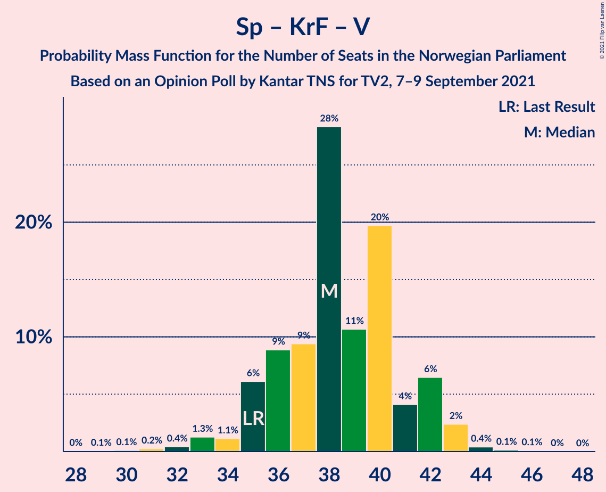

| Number of Seats | Probability | Accumulated | Special Marks |
|:---------------:|:-----------:|:-----------:|:-------------:|
| 28 | 0% | 100% |  |
| 29 | 0.1% | 99.9% |  |
| 30 | 0.1% | 99.9% |  |
| 31 | 0.2% | 99.8% |  |
| 32 | 0.4% | 99.5% |  |
| 33 | 1.3% | 99.1% |  |
| 34 | 1.1% | 98% |  |
| 35 | 6% | 97% | Last Result |
| 36 | 9% | 91% |  |
| 37 | 9% | 82% |  |
| 38 | 28% | 72% | Median |
| 39 | 11% | 44% |  |
| 40 | 20% | 33% |  |
| 41 | 4% | 14% |  |
| 42 | 6% | 10% |  |
| 43 | 2% | 3% |  |
| 44 | 0.4% | 0.7% |  |
| 45 | 0.1% | 0.2% |  |
| 46 | 0.1% | 0.1% |  |
| 47 | 0% | 0% |  |

## Technical Information

### Opinion Poll

+ **Polling firm:** Kantar TNS
+ **Commissioner(s):** TV2
+ **Fieldwork period:** 7–9 September 2021

### Calculations

+ **Sample size:** 1943
+ **Simulations done:** 1,048,576
+ **Error estimate:** 0.76%

