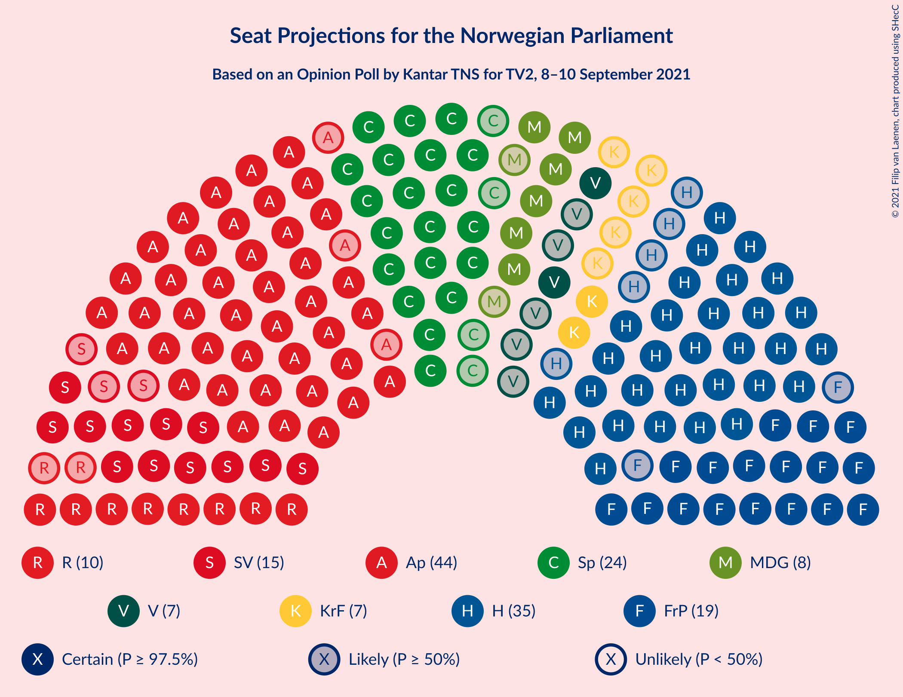
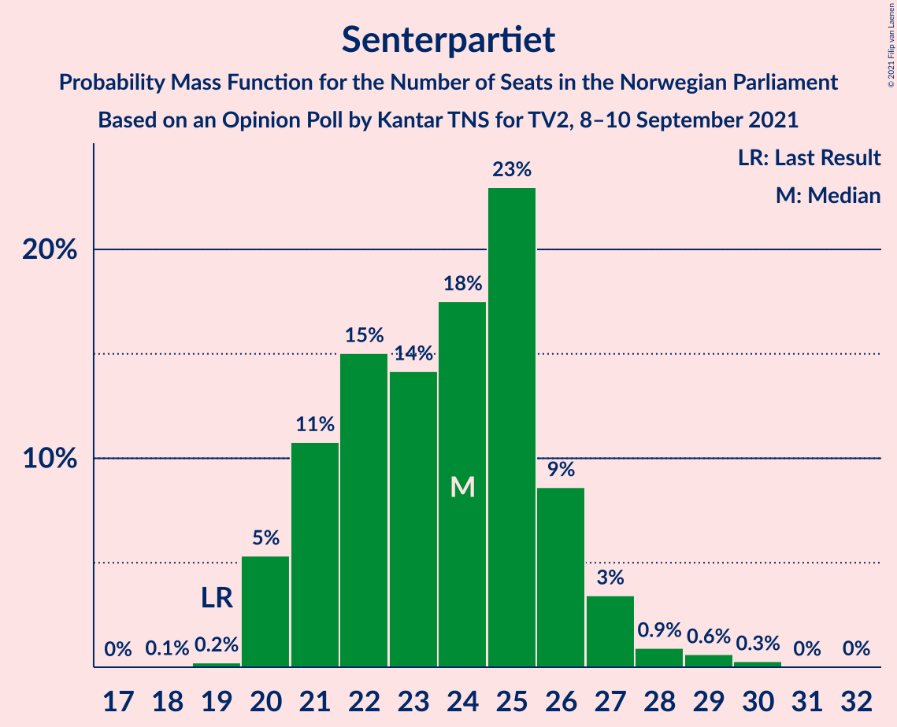
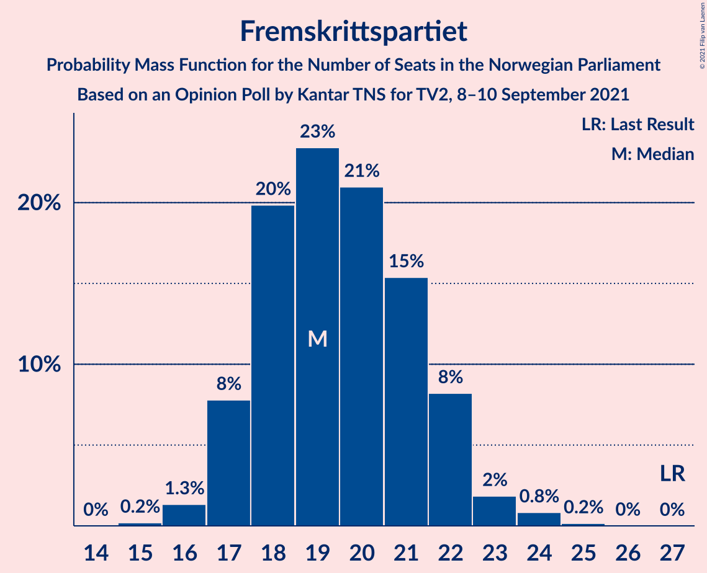
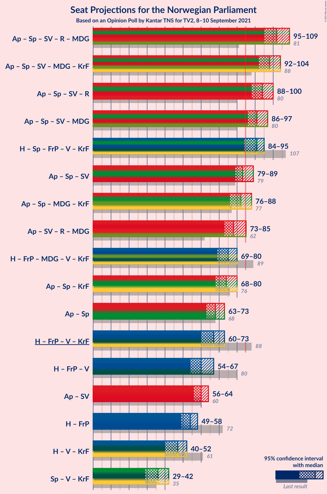
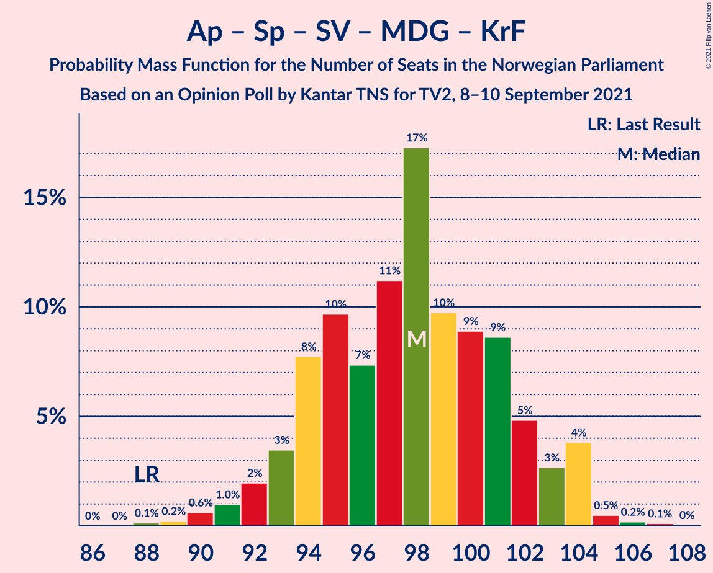
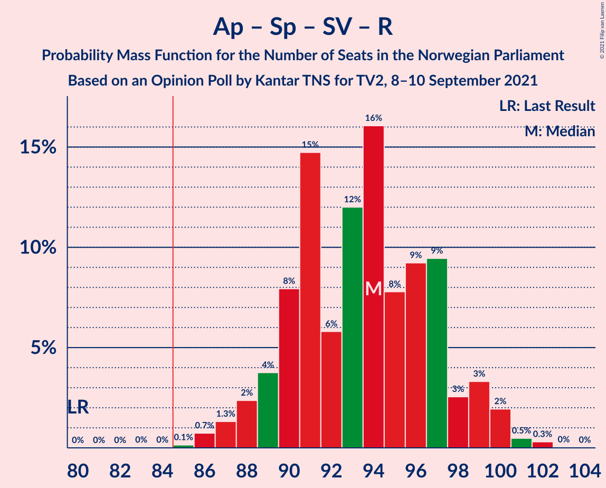
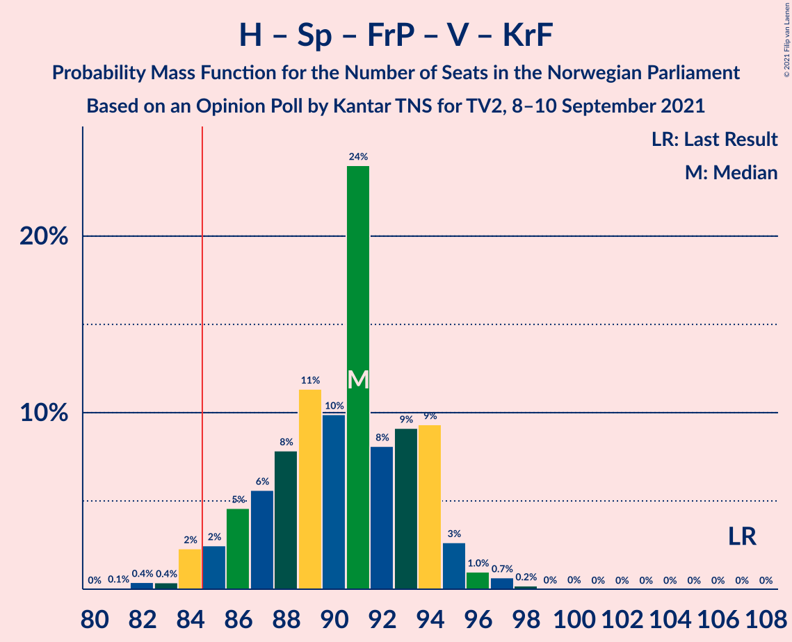
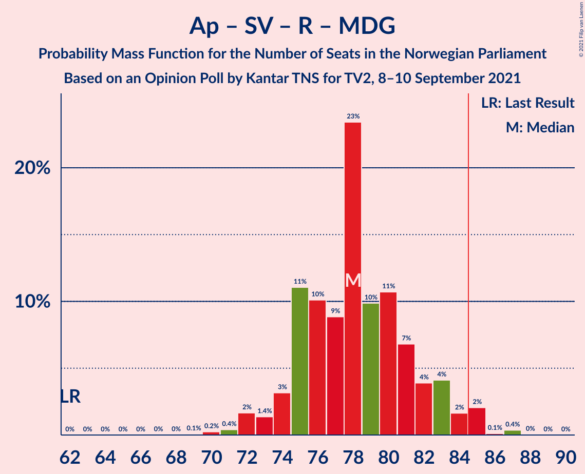
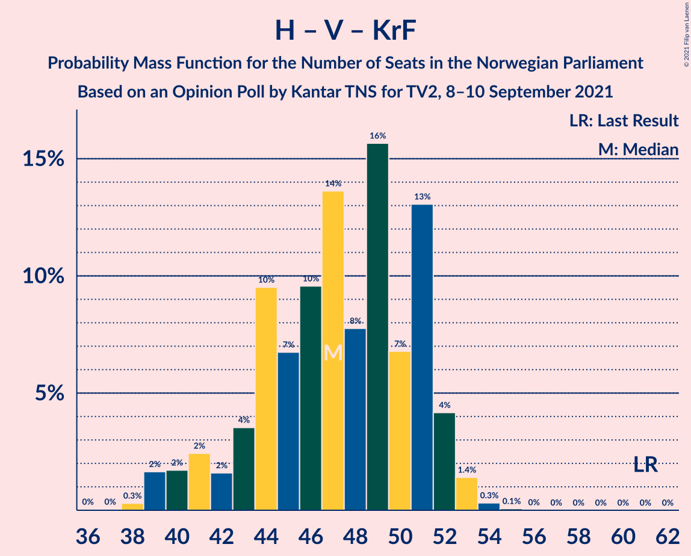
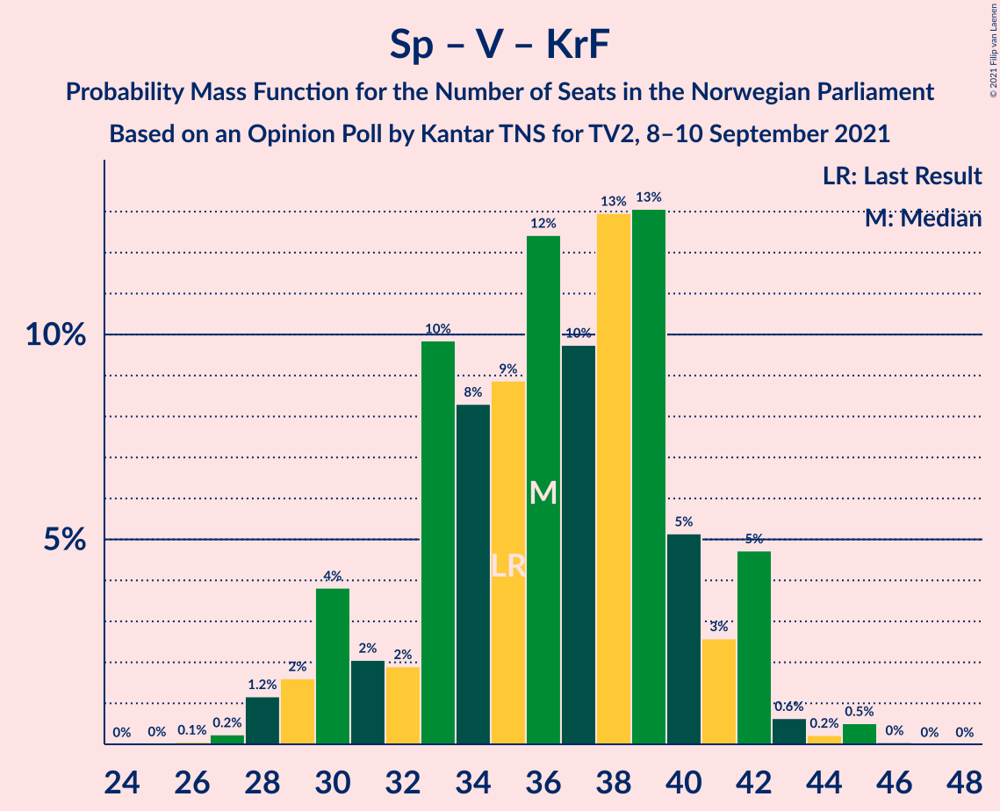

# Opinion Poll by Kantar TNS for TV2, 8–10 September 2021

<a href="#voting-intentions">Voting Intentions</a> | <a href="#seats">Seats</a> | <a href="#coalitions">Coalitions</a> | <a href="#technical-information">Technical Information</a>

## Voting Intentions

### Confidence Intervals

| Party | Last Result | Poll Result | 80% Confidence Interval | 90% Confidence Interval | 95% Confidence Interval | 99% Confidence Interval |
|:-----:|:-----------:|:-----------:|:-----------------------:|:-----------------------:|:-----------------------:|:-----------------------:|
| Arbeiderpartiet | 27.4% | 24.4% | 23.2–25.7% |22.9–26.1% |22.6–26.4% |22.0–27.0% |
| Høyre | 25.0% | 19.3% | 18.2–20.5% |17.9–20.9% |17.7–21.1% |17.1–21.7% |
| Senterpartiet | 10.3% | 13.2% | 12.2–14.2% |12.0–14.5% |11.8–14.7% |11.3–15.2% |
| Fremskrittspartiet | 15.2% | 11.3% | 10.4–12.2% |10.2–12.5% |10.0–12.7% |9.6–13.2% |
| Sosialistisk Venstreparti | 6.0% | 9.1% | 8.3–10.0% |8.1–10.2% |7.9–10.4% |7.5–10.9% |
| Rødt | 2.4% | 5.9% | 5.3–6.6% |5.1–6.9% |5.0–7.0% |4.7–7.4% |
| Miljøpartiet De Grønne | 3.2% | 4.9% | 4.3–5.6% |4.2–5.8% |4.0–6.0% |3.8–6.3% |
| Venstre | 4.4% | 4.4% | 3.9–5.1% |3.7–5.2% |3.6–5.4% |3.3–5.7% |
| Kristelig Folkeparti | 4.2% | 4.2% | 3.7–4.8% |3.5–5.0% |3.4–5.2% |3.2–5.5% |

*Note:* The poll result column reflects the actual value used in the calculations. Published results may vary slightly, and in addition be rounded to fewer digits.

## Seats

### Confidence Intervals

| Party | Last Result | Median | 80% Confidence Interval | 90% Confidence Interval | 95% Confidence Interval | 99% Confidence Interval |
|:-----:|:-----------:|:------:|:-----------------------:|:-----------------------:|:-----------------------:|:-----------------------:|
| <a href="#arbeiderpartiet">Arbeiderpartiet</a> | 49 | 44 | 42–46 |41–47 |41–48 |41–50 |
| <a href="#høyre">Høyre</a> | 45 | 35 | 32–36 |31–37 |30–38 |29–38 |
| <a href="#senterpartiet">Senterpartiet</a> | 19 | 24 | 21–26 |20–27 |20–27 |20–29 |
| <a href="#fremskrittspartiet">Fremskrittspartiet</a> | 27 | 19 | 18–22 |17–22 |17–23 |16–24 |
| <a href="#sosialistisk-venstreparti">Sosialistisk Venstreparti</a> | 11 | 15 | 14–17 |13–18 |12–18 |11–19 |
| <a href="#rødt">Rødt</a> | 1 | 10 | 9–12 |9–12 |8–12 |8–13 |
| <a href="#miljøpartiet-de-grønne">Miljøpartiet De Grønne</a> | 1 | 8 | 7–10 |7–10 |6–10 |2–11 |
| <a href="#venstre">Venstre</a> | 8 | 7 | 2–9 |2–9 |2–9 |2–10 |
| <a href="#kristelig-folkeparti">Kristelig Folkeparti</a> | 8 | 7 | 3–8 |3–9 |2–9 |2–9 |

### Arbeiderpartiet

*For a full overview of the results for this party, see the [Arbeiderpartiet](party-arbeiderpartiet.html) page.*

| Number of Seats | Probability | Accumulated | Special Marks |
|:---------------:|:-----------:|:-----------:|:-------------:|
| 40 | 0.3% | 100% |  |
| 41 | 7% | 99.7% |  |
| 42 | 9% | 93% |  |
| 43 | 14% | 84% |  |
| 44 | 26% | 69% | Median |
| 45 | 22% | 43% |  |
| 46 | 12% | 21% |  |
| 47 | 4% | 9% |  |
| 48 | 3% | 5% |  |
| 49 | 0.9% | 2% | Last Result |
| 50 | 0.7% | 1.0% |  |
| 51 | 0.2% | 0.3% |  |
| 52 | 0% | 0.1% |  |
| 53 | 0% | 0% |  |

### Høyre

*For a full overview of the results for this party, see the [Høyre](party-høyre.html) page.*

| Number of Seats | Probability | Accumulated | Special Marks |
|:---------------:|:-----------:|:-----------:|:-------------:|
| 28 | 0.1% | 100% |  |
| 29 | 0.5% | 99.9% |  |
| 30 | 3% | 99.4% |  |
| 31 | 5% | 97% |  |
| 32 | 7% | 91% |  |
| 33 | 9% | 85% |  |
| 34 | 11% | 76% |  |
| 35 | 28% | 65% | Median |
| 36 | 31% | 37% |  |
| 37 | 3% | 6% |  |
| 38 | 2% | 3% |  |
| 39 | 0.3% | 0.4% |  |
| 40 | 0.1% | 0.1% |  |
| 41 | 0% | 0% |  |
| 42 | 0% | 0% |  |
| 43 | 0% | 0% |  |
| 44 | 0% | 0% |  |
| 45 | 0% | 0% | Last Result |

### Senterpartiet

*For a full overview of the results for this party, see the [Senterpartiet](party-senterpartiet.html) page.*

| Number of Seats | Probability | Accumulated | Special Marks |
|:---------------:|:-----------:|:-----------:|:-------------:|
| 18 | 0.1% | 100% |  |
| 19 | 0.2% | 99.9% | Last Result |
| 20 | 5% | 99.7% |  |
| 21 | 11% | 94% |  |
| 22 | 15% | 84% |  |
| 23 | 14% | 69% |  |
| 24 | 18% | 54% | Median |
| 25 | 23% | 37% |  |
| 26 | 9% | 14% |  |
| 27 | 3% | 5% |  |
| 28 | 0.9% | 2% |  |
| 29 | 0.6% | 1.0% |  |
| 30 | 0.3% | 0.3% |  |
| 31 | 0% | 0.1% |  |
| 32 | 0% | 0% |  |

### Fremskrittspartiet

*For a full overview of the results for this party, see the [Fremskrittspartiet](party-fremskrittspartiet.html) page.*

| Number of Seats | Probability | Accumulated | Special Marks |
|:---------------:|:-----------:|:-----------:|:-------------:|
| 15 | 0.2% | 100% |  |
| 16 | 1.3% | 99.8% |  |
| 17 | 8% | 98% |  |
| 18 | 20% | 91% |  |
| 19 | 23% | 71% | Median |
| 20 | 21% | 47% |  |
| 21 | 15% | 26% |  |
| 22 | 8% | 11% |  |
| 23 | 2% | 3% |  |
| 24 | 0.8% | 1.0% |  |
| 25 | 0.2% | 0.2% |  |
| 26 | 0% | 0% |  |
| 27 | 0% | 0% | Last Result |

### Sosialistisk Venstreparti

*For a full overview of the results for this party, see the [Sosialistisk Venstreparti](party-sosialistiskvenstreparti.html) page.*

| Number of Seats | Probability | Accumulated | Special Marks |
|:---------------:|:-----------:|:-----------:|:-------------:|
| 11 | 0.5% | 100% | Last Result |
| 12 | 2% | 99.4% |  |
| 13 | 5% | 97% |  |
| 14 | 15% | 92% |  |
| 15 | 30% | 77% | Median |
| 16 | 24% | 47% |  |
| 17 | 15% | 23% |  |
| 18 | 7% | 8% |  |
| 19 | 1.2% | 1.3% |  |
| 20 | 0.1% | 0.1% |  |
| 21 | 0% | 0% |  |

### Rødt

*For a full overview of the results for this party, see the [Rødt](party-rødt.html) page.*

| Number of Seats | Probability | Accumulated | Special Marks |
|:---------------:|:-----------:|:-----------:|:-------------:|
| 1 | 0% | 100% | Last Result |
| 2 | 0% | 100% |  |
| 3 | 0% | 100% |  |
| 4 | 0% | 100% |  |
| 5 | 0% | 100% |  |
| 6 | 0% | 100% |  |
| 7 | 0.5% | 100% |  |
| 8 | 4% | 99.5% |  |
| 9 | 26% | 95% |  |
| 10 | 28% | 70% | Median |
| 11 | 31% | 41% |  |
| 12 | 9% | 11% |  |
| 13 | 2% | 2% |  |
| 14 | 0.1% | 0.1% |  |
| 15 | 0% | 0% |  |

### Miljøpartiet De Grønne

*For a full overview of the results for this party, see the [Miljøpartiet De Grønne](party-miljøpartietdegrønne.html) page.*

| Number of Seats | Probability | Accumulated | Special Marks |
|:---------------:|:-----------:|:-----------:|:-------------:|
| 1 | 0% | 100% | Last Result |
| 2 | 2% | 100% |  |
| 3 | 0.1% | 98% |  |
| 4 | 0% | 98% |  |
| 5 | 0% | 98% |  |
| 6 | 0.4% | 98% |  |
| 7 | 15% | 97% |  |
| 8 | 38% | 82% | Median |
| 9 | 32% | 44% |  |
| 10 | 10% | 12% |  |
| 11 | 2% | 2% |  |
| 12 | 0.1% | 0.1% |  |
| 13 | 0% | 0% |  |

### Venstre

*For a full overview of the results for this party, see the [Venstre](party-venstre.html) page.*

| Number of Seats | Probability | Accumulated | Special Marks |
|:---------------:|:-----------:|:-----------:|:-------------:|
| 2 | 22% | 100% |  |
| 3 | 0.5% | 78% |  |
| 4 | 0% | 78% |  |
| 5 | 0% | 78% |  |
| 6 | 2% | 78% |  |
| 7 | 33% | 75% | Median |
| 8 | 28% | 42% | Last Result |
| 9 | 12% | 14% |  |
| 10 | 2% | 2% |  |
| 11 | 0.1% | 0.1% |  |
| 12 | 0% | 0% |  |

### Kristelig Folkeparti

*For a full overview of the results for this party, see the [Kristelig Folkeparti](party-kristeligfolkeparti.html) page.*

| Number of Seats | Probability | Accumulated | Special Marks |
|:---------------:|:-----------:|:-----------:|:-------------:|
| 1 | 0.1% | 100% |  |
| 2 | 3% | 99.9% |  |
| 3 | 25% | 97% |  |
| 4 | 0% | 72% |  |
| 5 | 0% | 72% |  |
| 6 | 2% | 72% |  |
| 7 | 36% | 70% | Median |
| 8 | 26% | 34% | Last Result |
| 9 | 8% | 8% |  |
| 10 | 0.4% | 0.4% |  |
| 11 | 0% | 0% |  |

## Coalitions

### Confidence Intervals

| Coalition | Last Result | Median | Majority? | 80% Confidence Interval | 90% Confidence Interval | 95% Confidence Interval | 99% Confidence Interval |
|:---------:|:-----------:|:------:|:---------:|:-----------------------:|:-----------------------:|:-----------------------:|:-----------------------:|
| Arbeiderpartiet – Senterpartiet – Sosialistisk Venstreparti – Rødt – Miljøpartiet De Grønne | 81 | 102 | 100% | 98–106 | 96–108 | 95–109 | 93–110 |
| Arbeiderpartiet – Senterpartiet – Sosialistisk Venstreparti – Miljøpartiet De Grønne – Kristelig Folkeparti | 88 | 98 | 100% | 94–102 | 93–103 | 92–104 | 90–105 |
| Arbeiderpartiet – Senterpartiet – Sosialistisk Venstreparti – Rødt | 80 | 94 | 100% | 90–97 | 89–99 | 88–100 | 86–101 |
| Arbeiderpartiet – Senterpartiet – Sosialistisk Venstreparti – Miljøpartiet De Grønne | 80 | 91 | 99.3% | 88–96 | 87–97 | 86–97 | 84–99 |
| Høyre – Senterpartiet – Fremskrittspartiet – Venstre – Kristelig Folkeparti | 107 | 91 | 97% | 86–94 | 85–94 | 84–95 | 83–97 |
| Arbeiderpartiet – Senterpartiet – Sosialistisk Venstreparti | 79 | 83 | 32% | 80–87 | 79–88 | 79–89 | 77–90 |
| Arbeiderpartiet – Senterpartiet – Miljøpartiet De Grønne – Kristelig Folkeparti | 77 | 82 | 25% | 78–87 | 77–87 | 76–88 | 74–90 |
| Arbeiderpartiet – Sosialistisk Venstreparti – Rødt – Miljøpartiet De Grønne | 62 | 78 | 3% | 75–82 | 74–83 | 73–85 | 71–86 |
| Høyre – Fremskrittspartiet – Miljøpartiet De Grønne – Venstre – Kristelig Folkeparti | 89 | 75 | 0% | 71–79 | 70–79 | 69–80 | 67–82 |
| Arbeiderpartiet – Senterpartiet – Kristelig Folkeparti | 76 | 74 | 0% | 70–78 | 69–79 | 68–80 | 66–82 |
| Arbeiderpartiet – Senterpartiet | 68 | 68 | 0% | 65–71 | 63–72 | 63–73 | 62–75 |
| Høyre – Fremskrittspartiet – Venstre – Kristelig Folkeparti | 88 | 67 | 0% | 63–71 | 61–71 | 60–73 | 59–74 |
| Høyre – Fremskrittspartiet – Venstre | 80 | 60 | 0% | 57–64 | 55–65 | 54–67 | 54–67 |
| Arbeiderpartiet – Sosialistisk Venstreparti | 60 | 60 | 0% | 57–62 | 57–63 | 56–64 | 55–66 |
| Høyre – Fremskrittspartiet | 72 | 54 | 0% | 51–57 | 50–58 | 49–58 | 48–60 |
| Høyre – Venstre – Kristelig Folkeparti | 61 | 47 | 0% | 43–51 | 41–52 | 40–52 | 39–53 |
| Senterpartiet – Venstre – Kristelig Folkeparti | 35 | 36 | 0% | 32–40 | 30–42 | 29–42 | 28–45 |

### Arbeiderpartiet – Senterpartiet – Sosialistisk Venstreparti – Rødt – Miljøpartiet De Grønne

| Number of Seats | Probability | Accumulated | Special Marks |
|:---------------:|:-----------:|:-----------:|:-------------:|
| 81 | 0% | 100% | Last Result |
| 82 | 0% | 100% |  |
| 83 | 0% | 100% |  |
| 84 | 0% | 100% |  |
| 85 | 0% | 100% | Majority |
| 86 | 0% | 100% |  |
| 87 | 0% | 100% |  |
| 88 | 0% | 100% |  |
| 89 | 0% | 100% |  |
| 90 | 0% | 100% |  |
| 91 | 0% | 100% |  |
| 92 | 0.1% | 100% |  |
| 93 | 0.5% | 99.8% |  |
| 94 | 0.6% | 99.4% |  |
| 95 | 1.4% | 98.8% |  |
| 96 | 3% | 97% |  |
| 97 | 3% | 95% |  |
| 98 | 9% | 92% |  |
| 99 | 12% | 84% |  |
| 100 | 8% | 72% |  |
| 101 | 9% | 64% | Median |
| 102 | 15% | 55% |  |
| 103 | 11% | 40% |  |
| 104 | 8% | 29% |  |
| 105 | 6% | 21% |  |
| 106 | 7% | 15% |  |
| 107 | 2% | 8% |  |
| 108 | 2% | 6% |  |
| 109 | 3% | 4% |  |
| 110 | 0.2% | 0.6% |  |
| 111 | 0.1% | 0.3% |  |
| 112 | 0.2% | 0.2% |  |
| 113 | 0% | 0% |  |

### Arbeiderpartiet – Senterpartiet – Sosialistisk Venstreparti – Miljøpartiet De Grønne – Kristelig Folkeparti

| Number of Seats | Probability | Accumulated | Special Marks |
|:---------------:|:-----------:|:-----------:|:-------------:|
| 88 | 0.1% | 100% | Last Result |
| 89 | 0.2% | 99.9% |  |
| 90 | 0.6% | 99.6% |  |
| 91 | 1.0% | 99.0% |  |
| 92 | 2% | 98% |  |
| 93 | 3% | 96% |  |
| 94 | 8% | 93% |  |
| 95 | 10% | 85% |  |
| 96 | 7% | 75% |  |
| 97 | 11% | 68% |  |
| 98 | 17% | 57% | Median |
| 99 | 10% | 39% |  |
| 100 | 9% | 30% |  |
| 101 | 9% | 21% |  |
| 102 | 5% | 12% |  |
| 103 | 3% | 7% |  |
| 104 | 4% | 5% |  |
| 105 | 0.5% | 0.8% |  |
| 106 | 0.2% | 0.3% |  |
| 107 | 0.1% | 0.1% |  |
| 108 | 0% | 0% |  |

### Arbeiderpartiet – Senterpartiet – Sosialistisk Venstreparti – Rødt

| Number of Seats | Probability | Accumulated | Special Marks |
|:---------------:|:-----------:|:-----------:|:-------------:|
| 80 | 0% | 100% | Last Result |
| 81 | 0% | 100% |  |
| 82 | 0% | 100% |  |
| 83 | 0% | 100% |  |
| 84 | 0% | 100% |  |
| 85 | 0.1% | 100% | Majority |
| 86 | 0.7% | 99.8% |  |
| 87 | 1.3% | 99.1% |  |
| 88 | 2% | 98% |  |
| 89 | 4% | 95% |  |
| 90 | 8% | 92% |  |
| 91 | 15% | 84% |  |
| 92 | 6% | 69% |  |
| 93 | 12% | 63% | Median |
| 94 | 16% | 51% |  |
| 95 | 8% | 35% |  |
| 96 | 9% | 27% |  |
| 97 | 9% | 18% |  |
| 98 | 3% | 9% |  |
| 99 | 3% | 6% |  |
| 100 | 2% | 3% |  |
| 101 | 0.5% | 0.8% |  |
| 102 | 0.3% | 0.4% |  |
| 103 | 0% | 0.1% |  |
| 104 | 0% | 0% |  |

### Arbeiderpartiet – Senterpartiet – Sosialistisk Venstreparti – Miljøpartiet De Grønne

| Number of Seats | Probability | Accumulated | Special Marks |
|:---------------:|:-----------:|:-----------:|:-------------:|
| 80 | 0% | 100% | Last Result |
| 81 | 0% | 100% |  |
| 82 | 0% | 100% |  |
| 83 | 0.1% | 99.9% |  |
| 84 | 0.6% | 99.9% |  |
| 85 | 0.9% | 99.3% | Majority |
| 86 | 1.4% | 98% |  |
| 87 | 6% | 97% |  |
| 88 | 8% | 92% |  |
| 89 | 7% | 83% |  |
| 90 | 11% | 77% |  |
| 91 | 19% | 66% | Median |
| 92 | 10% | 47% |  |
| 93 | 11% | 37% |  |
| 94 | 8% | 26% |  |
| 95 | 8% | 18% |  |
| 96 | 4% | 10% |  |
| 97 | 4% | 6% |  |
| 98 | 1.3% | 2% |  |
| 99 | 0.4% | 0.8% |  |
| 100 | 0.1% | 0.3% |  |
| 101 | 0.2% | 0.2% |  |
| 102 | 0% | 0% |  |

### Høyre – Senterpartiet – Fremskrittspartiet – Venstre – Kristelig Folkeparti

| Number of Seats | Probability | Accumulated | Special Marks |
|:---------------:|:-----------:|:-----------:|:-------------:|
| 81 | 0.1% | 100% |  |
| 82 | 0.4% | 99.9% |  |
| 83 | 0.4% | 99.5% |  |
| 84 | 2% | 99.1% |  |
| 85 | 2% | 97% | Majority |
| 86 | 5% | 94% |  |
| 87 | 6% | 90% |  |
| 88 | 8% | 84% |  |
| 89 | 11% | 76% |  |
| 90 | 10% | 65% |  |
| 91 | 24% | 55% |  |
| 92 | 8% | 31% | Median |
| 93 | 9% | 23% |  |
| 94 | 9% | 14% |  |
| 95 | 3% | 5% |  |
| 96 | 1.0% | 2% |  |
| 97 | 0.7% | 0.9% |  |
| 98 | 0.2% | 0.2% |  |
| 99 | 0% | 0.1% |  |
| 100 | 0% | 0% |  |
| 101 | 0% | 0% |  |
| 102 | 0% | 0% |  |
| 103 | 0% | 0% |  |
| 104 | 0% | 0% |  |
| 105 | 0% | 0% |  |
| 106 | 0% | 0% |  |
| 107 | 0% | 0% | Last Result |

### Arbeiderpartiet – Senterpartiet – Sosialistisk Venstreparti

| Number of Seats | Probability | Accumulated | Special Marks |
|:---------------:|:-----------:|:-----------:|:-------------:|
| 76 | 0.1% | 100% |  |
| 77 | 0.9% | 99.9% |  |
| 78 | 1.2% | 99.0% |  |
| 79 | 6% | 98% | Last Result |
| 80 | 6% | 92% |  |
| 81 | 11% | 86% |  |
| 82 | 14% | 75% |  |
| 83 | 16% | 61% | Median |
| 84 | 13% | 45% |  |
| 85 | 9% | 32% | Majority |
| 86 | 12% | 23% |  |
| 87 | 5% | 11% |  |
| 88 | 3% | 6% |  |
| 89 | 2% | 3% |  |
| 90 | 0.6% | 0.9% |  |
| 91 | 0.3% | 0.4% |  |
| 92 | 0% | 0.1% |  |
| 93 | 0% | 0% |  |

### Arbeiderpartiet – Senterpartiet – Miljøpartiet De Grønne – Kristelig Folkeparti

| Number of Seats | Probability | Accumulated | Special Marks |
|:---------------:|:-----------:|:-----------:|:-------------:|
| 73 | 0.1% | 100% |  |
| 74 | 0.4% | 99.8% |  |
| 75 | 0.6% | 99.4% |  |
| 76 | 1.4% | 98.8% |  |
| 77 | 5% | 97% | Last Result |
| 78 | 5% | 93% |  |
| 79 | 7% | 88% |  |
| 80 | 10% | 81% |  |
| 81 | 10% | 71% |  |
| 82 | 12% | 61% |  |
| 83 | 10% | 49% | Median |
| 84 | 14% | 39% |  |
| 85 | 8% | 25% | Majority |
| 86 | 5% | 17% |  |
| 87 | 8% | 12% |  |
| 88 | 3% | 4% |  |
| 89 | 0.8% | 2% |  |
| 90 | 0.8% | 1.0% |  |
| 91 | 0.1% | 0.2% |  |
| 92 | 0.1% | 0.1% |  |
| 93 | 0% | 0% |  |

### Arbeiderpartiet – Sosialistisk Venstreparti – Rødt – Miljøpartiet De Grønne

| Number of Seats | Probability | Accumulated | Special Marks |
|:---------------:|:-----------:|:-----------:|:-------------:|
| 62 | 0% | 100% | Last Result |
| 63 | 0% | 100% |  |
| 64 | 0% | 100% |  |
| 65 | 0% | 100% |  |
| 66 | 0% | 100% |  |
| 67 | 0% | 100% |  |
| 68 | 0% | 100% |  |
| 69 | 0.1% | 100% |  |
| 70 | 0.2% | 99.9% |  |
| 71 | 0.4% | 99.6% |  |
| 72 | 2% | 99.2% |  |
| 73 | 1.4% | 98% |  |
| 74 | 3% | 96% |  |
| 75 | 11% | 93% |  |
| 76 | 10% | 82% |  |
| 77 | 9% | 72% | Median |
| 78 | 23% | 63% |  |
| 79 | 10% | 40% |  |
| 80 | 11% | 30% |  |
| 81 | 7% | 19% |  |
| 82 | 4% | 12% |  |
| 83 | 4% | 8% |  |
| 84 | 2% | 4% |  |
| 85 | 2% | 3% | Majority |
| 86 | 0.1% | 0.5% |  |
| 87 | 0.4% | 0.4% |  |
| 88 | 0% | 0.1% |  |
| 89 | 0% | 0% |  |

### Høyre – Fremskrittspartiet – Miljøpartiet De Grønne – Venstre – Kristelig Folkeparti

| Number of Seats | Probability | Accumulated | Special Marks |
|:---------------:|:-----------:|:-----------:|:-------------:|
| 65 | 0% | 100% |  |
| 66 | 0.1% | 99.9% |  |
| 67 | 0.4% | 99.8% |  |
| 68 | 0.6% | 99.4% |  |
| 69 | 2% | 98.8% |  |
| 70 | 4% | 97% |  |
| 71 | 3% | 93% |  |
| 72 | 11% | 90% |  |
| 73 | 11% | 79% |  |
| 74 | 8% | 68% |  |
| 75 | 16% | 60% |  |
| 76 | 12% | 44% | Median |
| 77 | 6% | 31% |  |
| 78 | 13% | 26% |  |
| 79 | 7% | 12% |  |
| 80 | 3% | 5% |  |
| 81 | 2% | 2% |  |
| 82 | 0.5% | 0.6% |  |
| 83 | 0% | 0.1% |  |
| 84 | 0% | 0% |  |
| 85 | 0% | 0% | Majority |
| 86 | 0% | 0% |  |
| 87 | 0% | 0% |  |
| 88 | 0% | 0% |  |
| 89 | 0% | 0% | Last Result |

### Arbeiderpartiet – Senterpartiet – Kristelig Folkeparti

| Number of Seats | Probability | Accumulated | Special Marks |
|:---------------:|:-----------:|:-----------:|:-------------:|
| 65 | 0.2% | 100% |  |
| 66 | 0.6% | 99.8% |  |
| 67 | 1.3% | 99.3% |  |
| 68 | 3% | 98% |  |
| 69 | 3% | 95% |  |
| 70 | 4% | 92% |  |
| 71 | 10% | 88% |  |
| 72 | 11% | 78% |  |
| 73 | 10% | 67% |  |
| 74 | 10% | 57% |  |
| 75 | 10% | 46% | Median |
| 76 | 14% | 37% | Last Result |
| 77 | 8% | 23% |  |
| 78 | 6% | 15% |  |
| 79 | 7% | 10% |  |
| 80 | 2% | 3% |  |
| 81 | 0.5% | 1.4% |  |
| 82 | 0.7% | 0.9% |  |
| 83 | 0.1% | 0.2% |  |
| 84 | 0% | 0% |  |

### Arbeiderpartiet – Senterpartiet

| Number of Seats | Probability | Accumulated | Special Marks |
|:---------------:|:-----------:|:-----------:|:-------------:|
| 61 | 0.1% | 100% |  |
| 62 | 0.8% | 99.9% |  |
| 63 | 4% | 99.1% |  |
| 64 | 4% | 95% |  |
| 65 | 12% | 90% |  |
| 66 | 10% | 79% |  |
| 67 | 12% | 68% |  |
| 68 | 11% | 57% | Last Result, Median |
| 69 | 22% | 45% |  |
| 70 | 8% | 24% |  |
| 71 | 8% | 16% |  |
| 72 | 4% | 8% |  |
| 73 | 1.3% | 3% |  |
| 74 | 1.0% | 2% |  |
| 75 | 0.8% | 0.9% |  |
| 76 | 0.1% | 0.1% |  |
| 77 | 0% | 0% |  |

### Høyre – Fremskrittspartiet – Venstre – Kristelig Folkeparti

| Number of Seats | Probability | Accumulated | Special Marks |
|:---------------:|:-----------:|:-----------:|:-------------:|
| 57 | 0.2% | 100% |  |
| 58 | 0.2% | 99.7% |  |
| 59 | 0.3% | 99.6% |  |
| 60 | 3% | 99.3% |  |
| 61 | 2% | 96% |  |
| 62 | 3% | 94% |  |
| 63 | 7% | 91% |  |
| 64 | 7% | 84% |  |
| 65 | 9% | 77% |  |
| 66 | 12% | 67% |  |
| 67 | 15% | 55% |  |
| 68 | 9% | 40% | Median |
| 69 | 8% | 31% |  |
| 70 | 11% | 23% |  |
| 71 | 7% | 11% |  |
| 72 | 2% | 4% |  |
| 73 | 2% | 3% |  |
| 74 | 0.4% | 0.6% |  |
| 75 | 0.1% | 0.2% |  |
| 76 | 0% | 0.1% |  |
| 77 | 0% | 0% |  |
| 78 | 0% | 0% |  |
| 79 | 0% | 0% |  |
| 80 | 0% | 0% |  |
| 81 | 0% | 0% |  |
| 82 | 0% | 0% |  |
| 83 | 0% | 0% |  |
| 84 | 0% | 0% |  |
| 85 | 0% | 0% | Majority |
| 86 | 0% | 0% |  |
| 87 | 0% | 0% |  |
| 88 | 0% | 0% | Last Result |

### Høyre – Fremskrittspartiet – Venstre

| Number of Seats | Probability | Accumulated | Special Marks |
|:---------------:|:-----------:|:-----------:|:-------------:|
| 52 | 0.2% | 100% |  |
| 53 | 0.2% | 99.8% |  |
| 54 | 3% | 99.6% |  |
| 55 | 1.4% | 96% |  |
| 56 | 4% | 95% |  |
| 57 | 9% | 90% |  |
| 58 | 9% | 81% |  |
| 59 | 10% | 72% |  |
| 60 | 13% | 62% |  |
| 61 | 9% | 49% | Median |
| 62 | 9% | 41% |  |
| 63 | 13% | 31% |  |
| 64 | 8% | 18% |  |
| 65 | 5% | 10% |  |
| 66 | 2% | 5% |  |
| 67 | 2% | 3% |  |
| 68 | 0.1% | 0.2% |  |
| 69 | 0.1% | 0.1% |  |
| 70 | 0% | 0% |  |
| 71 | 0% | 0% |  |
| 72 | 0% | 0% |  |
| 73 | 0% | 0% |  |
| 74 | 0% | 0% |  |
| 75 | 0% | 0% |  |
| 76 | 0% | 0% |  |
| 77 | 0% | 0% |  |
| 78 | 0% | 0% |  |
| 79 | 0% | 0% |  |
| 80 | 0% | 0% | Last Result |

### Arbeiderpartiet – Sosialistisk Venstreparti

| Number of Seats | Probability | Accumulated | Special Marks |
|:---------------:|:-----------:|:-----------:|:-------------:|
| 54 | 0.1% | 100% |  |
| 55 | 0.8% | 99.9% |  |
| 56 | 2% | 99.1% |  |
| 57 | 11% | 97% |  |
| 58 | 11% | 87% |  |
| 59 | 25% | 75% | Median |
| 60 | 20% | 50% | Last Result |
| 61 | 14% | 30% |  |
| 62 | 8% | 17% |  |
| 63 | 4% | 9% |  |
| 64 | 3% | 5% |  |
| 65 | 1.1% | 2% |  |
| 66 | 0.4% | 0.8% |  |
| 67 | 0.3% | 0.3% |  |
| 68 | 0% | 0.1% |  |
| 69 | 0% | 0% |  |

### Høyre – Fremskrittspartiet

| Number of Seats | Probability | Accumulated | Special Marks |
|:---------------:|:-----------:|:-----------:|:-------------:|
| 46 | 0% | 100% |  |
| 47 | 0.4% | 99.9% |  |
| 48 | 0.4% | 99.6% |  |
| 49 | 4% | 99.2% |  |
| 50 | 3% | 95% |  |
| 51 | 6% | 92% |  |
| 52 | 12% | 86% |  |
| 53 | 14% | 75% |  |
| 54 | 15% | 61% | Median |
| 55 | 16% | 46% |  |
| 56 | 15% | 30% |  |
| 57 | 9% | 15% |  |
| 58 | 4% | 6% |  |
| 59 | 2% | 2% |  |
| 60 | 0.4% | 0.5% |  |
| 61 | 0.1% | 0.2% |  |
| 62 | 0% | 0% |  |
| 63 | 0% | 0% |  |
| 64 | 0% | 0% |  |
| 65 | 0% | 0% |  |
| 66 | 0% | 0% |  |
| 67 | 0% | 0% |  |
| 68 | 0% | 0% |  |
| 69 | 0% | 0% |  |
| 70 | 0% | 0% |  |
| 71 | 0% | 0% |  |
| 72 | 0% | 0% | Last Result |

### Høyre – Venstre – Kristelig Folkeparti

| Number of Seats | Probability | Accumulated | Special Marks |
|:---------------:|:-----------:|:-----------:|:-------------:|
| 37 | 0% | 100% |  |
| 38 | 0.3% | 99.9% |  |
| 39 | 2% | 99.6% |  |
| 40 | 2% | 98% |  |
| 41 | 2% | 96% |  |
| 42 | 2% | 94% |  |
| 43 | 4% | 92% |  |
| 44 | 10% | 89% |  |
| 45 | 7% | 79% |  |
| 46 | 10% | 72% |  |
| 47 | 14% | 63% |  |
| 48 | 8% | 49% |  |
| 49 | 16% | 41% | Median |
| 50 | 7% | 26% |  |
| 51 | 13% | 19% |  |
| 52 | 4% | 6% |  |
| 53 | 1.4% | 2% |  |
| 54 | 0.3% | 0.4% |  |
| 55 | 0.1% | 0.1% |  |
| 56 | 0% | 0% |  |
| 57 | 0% | 0% |  |
| 58 | 0% | 0% |  |
| 59 | 0% | 0% |  |
| 60 | 0% | 0% |  |
| 61 | 0% | 0% | Last Result |

### Senterpartiet – Venstre – Kristelig Folkeparti

| Number of Seats | Probability | Accumulated | Special Marks |
|:---------------:|:-----------:|:-----------:|:-------------:|
| 26 | 0.1% | 100% |  |
| 27 | 0.2% | 99.9% |  |
| 28 | 1.2% | 99.7% |  |
| 29 | 2% | 98.5% |  |
| 30 | 4% | 97% |  |
| 31 | 2% | 93% |  |
| 32 | 2% | 91% |  |
| 33 | 10% | 89% |  |
| 34 | 8% | 79% |  |
| 35 | 9% | 71% | Last Result |
| 36 | 12% | 62% |  |
| 37 | 10% | 50% |  |
| 38 | 13% | 40% | Median |
| 39 | 13% | 27% |  |
| 40 | 5% | 14% |  |
| 41 | 3% | 9% |  |
| 42 | 5% | 6% |  |
| 43 | 0.6% | 1.4% |  |
| 44 | 0.2% | 0.8% |  |
| 45 | 0.5% | 0.6% |  |
| 46 | 0% | 0.1% |  |
| 47 | 0% | 0% |  |

## Technical Information

### Opinion Poll

+ **Polling firm:** Kantar TNS
+ **Commissioner(s):** TV2
+ **Fieldwork period:** 8–10 September 2021

### Calculations

+ **Sample size:** 1996
+ **Simulations done:** 1,048,576
+ **Error estimate:** 1.02%

