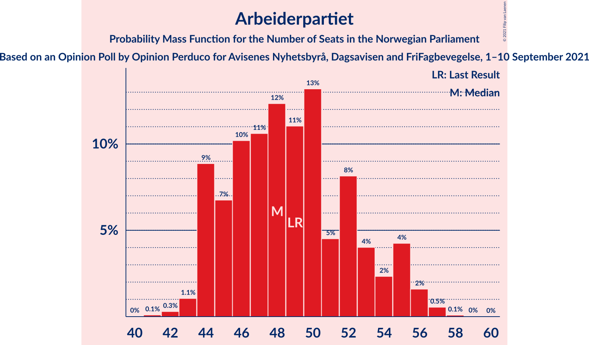
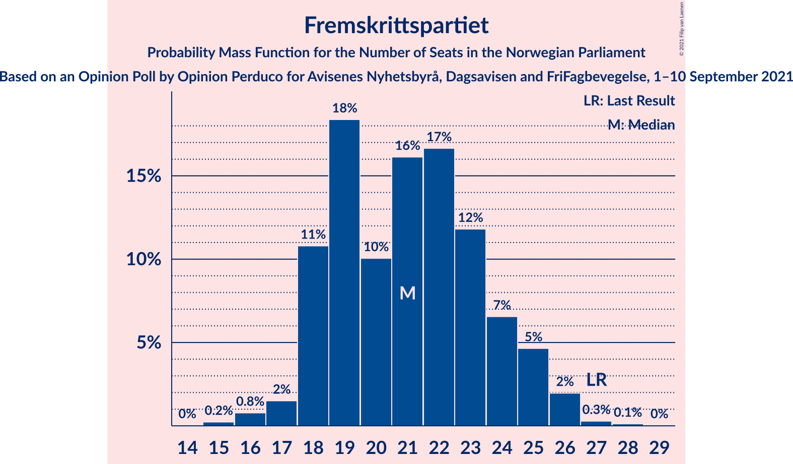
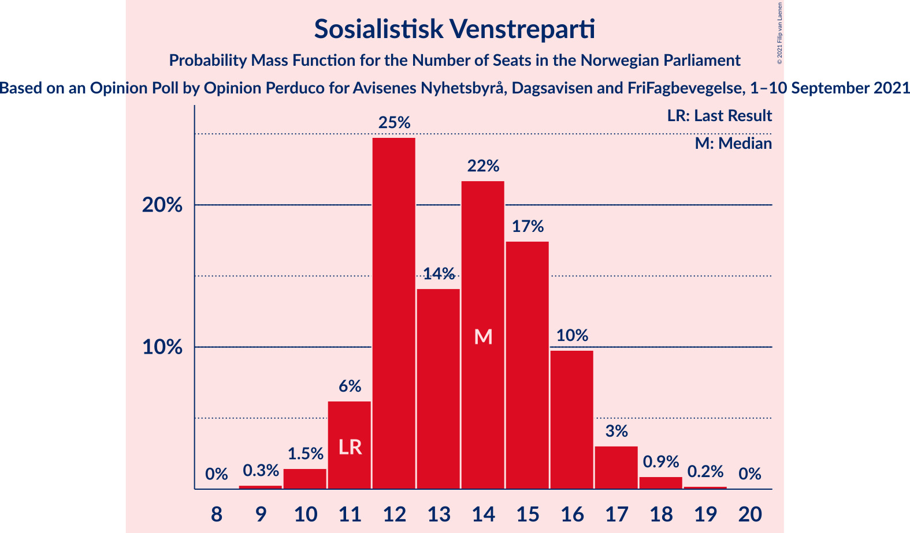
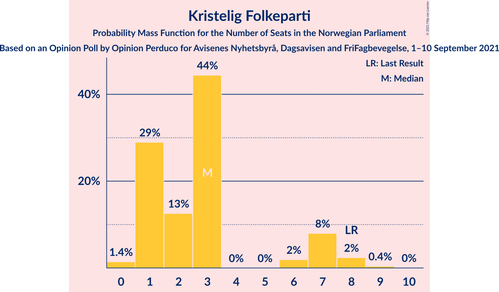
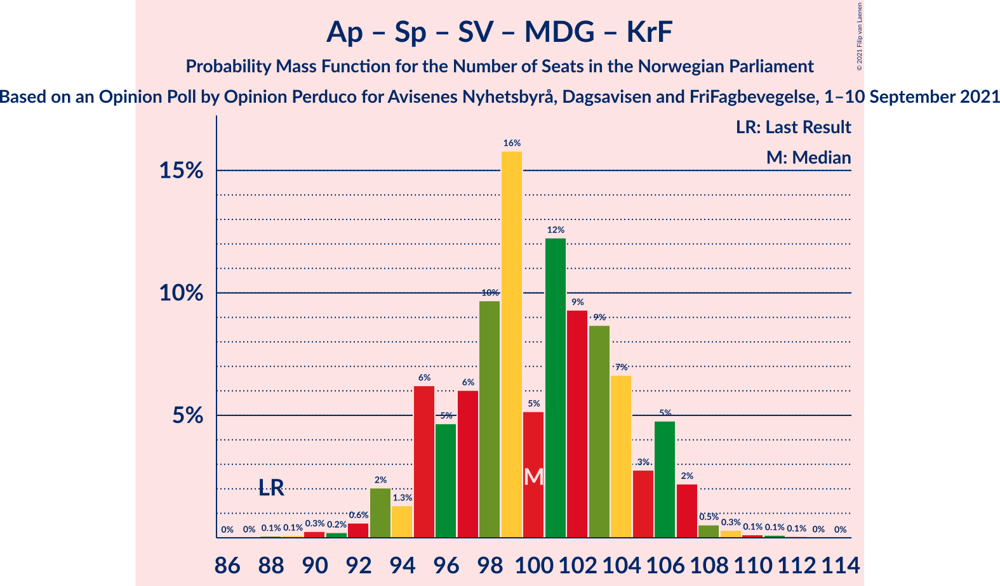
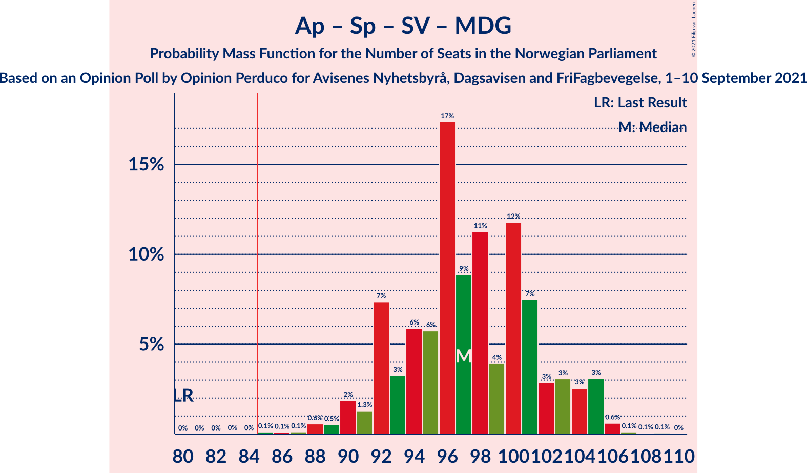
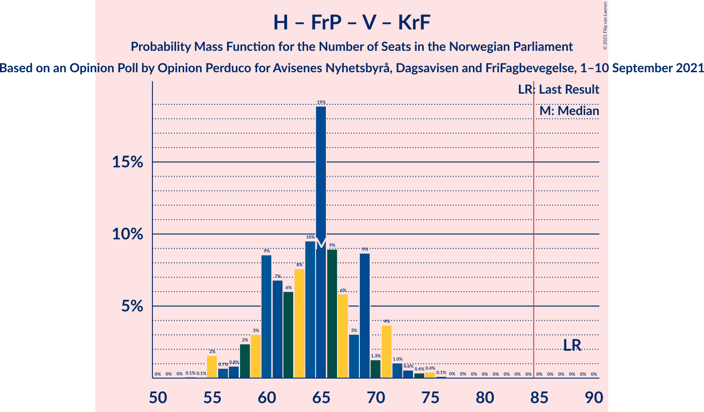

# Opinion Poll by Opinion Perduco for Avisenes Nyhetsbyrå, Dagsavisen and FriFagbevegelse, 1–10 September 2021

<a href="#voting-intentions">Voting Intentions</a> | <a href="#seats">Seats</a> | <a href="#coalitions">Coalitions</a> | <a href="#technical-information">Technical Information</a>

## Voting Intentions

### Confidence Intervals

| Party | Last Result | Poll Result | 80% Confidence Interval | 90% Confidence Interval | 95% Confidence Interval | 99% Confidence Interval |
|:-----:|:-----------:|:-----------:|:-----------------------:|:-----------------------:|:-----------------------:|:-----------------------:|
| Arbeiderpartiet | 27.4% | 27.0% | 25.2–28.9% |24.7–29.4% |24.2–29.9% |23.4–30.8% |
| Høyre | 25.0% | 18.9% | 17.3–20.6% |16.9–21.1% |16.5–21.5% |15.8–22.4% |
| Senterpartiet | 10.3% | 14.9% | 13.5–16.4% |13.1–16.9% |12.7–17.3% |12.1–18.1% |
| Fremskrittspartiet | 15.2% | 11.9% | 10.6–13.4% |10.3–13.8% |10.0–14.1% |9.4–14.8% |
| Sosialistisk Venstreparti | 6.0% | 7.7% | 6.7–9.0% |6.4–9.3% |6.2–9.6% |5.7–10.3% |
| Miljøpartiet De Grønne | 3.2% | 4.8% | 4.0–5.8% |3.8–6.1% |3.6–6.3% |3.2–6.9% |
| Rødt | 2.4% | 4.6% | 3.8–5.6% |3.6–5.9% |3.4–6.1% |3.1–6.6% |
| Venstre | 4.4% | 4.5% | 3.7–5.5% |3.5–5.7% |3.3–6.0% |3.0–6.5% |
| Kristelig Folkeparti | 4.2% | 3.3% | 2.7–4.2% |2.5–4.4% |2.3–4.6% |2.1–5.1% |

*Note:* The poll result column reflects the actual value used in the calculations. Published results may vary slightly, and in addition be rounded to fewer digits.

## Seats

### Confidence Intervals

| Party | Last Result | Median | 80% Confidence Interval | 90% Confidence Interval | 95% Confidence Interval | 99% Confidence Interval |
|:-----:|:-----------:|:------:|:-----------------------:|:-----------------------:|:-----------------------:|:-----------------------:|
| <a href="#arbeiderpartiet">Arbeiderpartiet</a> | 49 | 49 | 45–53 |44–54 |44–55 |42–57 |
| <a href="#høyre">Høyre</a> | 45 | 35 | 31–38 |28–39 |28–39 |27–40 |
| <a href="#senterpartiet">Senterpartiet</a> | 19 | 28 | 24–31 |23–32 |22–33 |21–35 |
| <a href="#fremskrittspartiet">Fremskrittspartiet</a> | 27 | 22 | 18–24 |18–25 |17–26 |15–27 |
| <a href="#sosialistisk-venstreparti">Sosialistisk Venstreparti</a> | 11 | 14 | 11–15 |11–17 |11–17 |9–18 |
| <a href="#miljøpartiet-de-grønne">Miljøpartiet De Grønne</a> | 1 | 8 | 2–11 |2–11 |2–11 |1–12 |
| <a href="#rødt">Rødt</a> | 1 | 9 | 2–10 |2–10 |2–11 |2–12 |
| <a href="#venstre">Venstre</a> | 8 | 7 | 2–10 |2–10 |2–10 |2–12 |
| <a href="#kristelig-folkeparti">Kristelig Folkeparti</a> | 8 | 3 | 1–7 |1–7 |0–8 |0–8 |

### Arbeiderpartiet

*For a full overview of the results for this party, see the [Arbeiderpartiet](party-arbeiderpartiet.html) page.*

| Number of Seats | Probability | Accumulated | Special Marks |
|:---------------:|:-----------:|:-----------:|:-------------:|
| 40 | 0% | 100% |  |
| 41 | 0.1% | 99.9% |  |
| 42 | 0.4% | 99.8% |  |
| 43 | 1.0% | 99.5% |  |
| 44 | 7% | 98% |  |
| 45 | 6% | 92% |  |
| 46 | 16% | 85% |  |
| 47 | 10% | 69% |  |
| 48 | 3% | 59% |  |
| 49 | 26% | 57% | Last Result, Median |
| 50 | 6% | 30% |  |
| 51 | 5% | 24% |  |
| 52 | 3% | 19% |  |
| 53 | 8% | 16% |  |
| 54 | 5% | 7% |  |
| 55 | 1.0% | 3% |  |
| 56 | 1.1% | 2% |  |
| 57 | 0.3% | 0.5% |  |
| 58 | 0.1% | 0.2% |  |
| 59 | 0% | 0.1% |  |
| 60 | 0% | 0% |  |

### Høyre

*For a full overview of the results for this party, see the [Høyre](party-høyre.html) page.*

| Number of Seats | Probability | Accumulated | Special Marks |
|:---------------:|:-----------:|:-----------:|:-------------:|
| 25 | 0.1% | 100% |  |
| 26 | 0.3% | 99.9% |  |
| 27 | 1.0% | 99.6% |  |
| 28 | 4% | 98.6% |  |
| 29 | 0.6% | 95% |  |
| 30 | 2% | 94% |  |
| 31 | 8% | 92% |  |
| 32 | 16% | 84% |  |
| 33 | 9% | 68% |  |
| 34 | 7% | 60% |  |
| 35 | 8% | 53% | Median |
| 36 | 7% | 44% |  |
| 37 | 11% | 38% |  |
| 38 | 21% | 27% |  |
| 39 | 5% | 6% |  |
| 40 | 0.4% | 0.6% |  |
| 41 | 0.1% | 0.2% |  |
| 42 | 0% | 0.1% |  |
| 43 | 0.1% | 0.1% |  |
| 44 | 0% | 0% |  |
| 45 | 0% | 0% | Last Result |

### Senterpartiet

*For a full overview of the results for this party, see the [Senterpartiet](party-senterpartiet.html) page.*

| Number of Seats | Probability | Accumulated | Special Marks |
|:---------------:|:-----------:|:-----------:|:-------------:|
| 19 | 0.1% | 100% | Last Result |
| 20 | 0.2% | 99.9% |  |
| 21 | 2% | 99.7% |  |
| 22 | 2% | 98% |  |
| 23 | 3% | 96% |  |
| 24 | 6% | 93% |  |
| 25 | 7% | 87% |  |
| 26 | 6% | 80% |  |
| 27 | 17% | 74% |  |
| 28 | 13% | 57% | Median |
| 29 | 26% | 44% |  |
| 30 | 5% | 18% |  |
| 31 | 8% | 14% |  |
| 32 | 2% | 6% |  |
| 33 | 3% | 4% |  |
| 34 | 0.1% | 1.0% |  |
| 35 | 0.8% | 0.9% |  |
| 36 | 0.1% | 0.1% |  |
| 37 | 0% | 0% |  |

### Fremskrittspartiet

*For a full overview of the results for this party, see the [Fremskrittspartiet](party-fremskrittspartiet.html) page.*

| Number of Seats | Probability | Accumulated | Special Marks |
|:---------------:|:-----------:|:-----------:|:-------------:|
| 14 | 0.1% | 100% |  |
| 15 | 0.6% | 99.9% |  |
| 16 | 0.2% | 99.3% |  |
| 17 | 3% | 99.2% |  |
| 18 | 11% | 96% |  |
| 19 | 5% | 85% |  |
| 20 | 6% | 80% |  |
| 21 | 16% | 74% |  |
| 22 | 36% | 58% | Median |
| 23 | 3% | 22% |  |
| 24 | 10% | 19% |  |
| 25 | 5% | 9% |  |
| 26 | 3% | 3% |  |
| 27 | 0.3% | 0.7% | Last Result |
| 28 | 0.3% | 0.4% |  |
| 29 | 0.1% | 0.1% |  |
| 30 | 0% | 0% |  |

### Sosialistisk Venstreparti

*For a full overview of the results for this party, see the [Sosialistisk Venstreparti](party-sosialistiskvenstreparti.html) page.*

| Number of Seats | Probability | Accumulated | Special Marks |
|:---------------:|:-----------:|:-----------:|:-------------:|
| 9 | 0.6% | 100% |  |
| 10 | 0.8% | 99.3% |  |
| 11 | 11% | 98.5% | Last Result |
| 12 | 19% | 88% |  |
| 13 | 7% | 69% |  |
| 14 | 39% | 62% | Median |
| 15 | 14% | 23% |  |
| 16 | 4% | 10% |  |
| 17 | 3% | 5% |  |
| 18 | 2% | 2% |  |
| 19 | 0.4% | 0.4% |  |
| 20 | 0% | 0% |  |

### Miljøpartiet De Grønne

*For a full overview of the results for this party, see the [Miljøpartiet De Grønne](party-miljøpartietdegrønne.html) page.*

| Number of Seats | Probability | Accumulated | Special Marks |
|:---------------:|:-----------:|:-----------:|:-------------:|
| 1 | 0.8% | 100% | Last Result |
| 2 | 25% | 99.2% |  |
| 3 | 13% | 74% |  |
| 4 | 0% | 62% |  |
| 5 | 0% | 62% |  |
| 6 | 0.1% | 62% |  |
| 7 | 7% | 61% |  |
| 8 | 18% | 54% | Median |
| 9 | 15% | 36% |  |
| 10 | 9% | 21% |  |
| 11 | 10% | 12% |  |
| 12 | 2% | 2% |  |
| 13 | 0.3% | 0.3% |  |
| 14 | 0% | 0% |  |

### Rødt

*For a full overview of the results for this party, see the [Rødt](party-rødt.html) page.*

| Number of Seats | Probability | Accumulated | Special Marks |
|:---------------:|:-----------:|:-----------:|:-------------:|
| 1 | 0.5% | 100% | Last Result |
| 2 | 19% | 99.5% |  |
| 3 | 0% | 80% |  |
| 4 | 0% | 80% |  |
| 5 | 0% | 80% |  |
| 6 | 5% | 80% |  |
| 7 | 10% | 76% |  |
| 8 | 14% | 65% |  |
| 9 | 13% | 51% | Median |
| 10 | 33% | 38% |  |
| 11 | 4% | 4% |  |
| 12 | 0.5% | 0.6% |  |
| 13 | 0.1% | 0.1% |  |
| 14 | 0% | 0% |  |

### Venstre

*For a full overview of the results for this party, see the [Venstre](party-venstre.html) page.*

| Number of Seats | Probability | Accumulated | Special Marks |
|:---------------:|:-----------:|:-----------:|:-------------:|
| 2 | 33% | 100% |  |
| 3 | 2% | 66% |  |
| 4 | 0.8% | 65% |  |
| 5 | 0% | 64% |  |
| 6 | 0.2% | 64% |  |
| 7 | 19% | 64% | Median |
| 8 | 21% | 45% | Last Result |
| 9 | 13% | 24% |  |
| 10 | 9% | 11% |  |
| 11 | 2% | 2% |  |
| 12 | 0.8% | 0.9% |  |
| 13 | 0% | 0.1% |  |
| 14 | 0% | 0% |  |

### Kristelig Folkeparti

*For a full overview of the results for this party, see the [Kristelig Folkeparti](party-kristeligfolkeparti.html) page.*

| Number of Seats | Probability | Accumulated | Special Marks |
|:---------------:|:-----------:|:-----------:|:-------------:|
| 0 | 3% | 100% |  |
| 1 | 26% | 97% |  |
| 2 | 9% | 72% |  |
| 3 | 50% | 62% | Median |
| 4 | 0% | 13% |  |
| 5 | 0% | 13% |  |
| 6 | 0.7% | 13% |  |
| 7 | 9% | 12% |  |
| 8 | 2% | 3% | Last Result |
| 9 | 0.3% | 0.4% |  |
| 10 | 0.1% | 0.1% |  |
| 11 | 0% | 0% |  |

## Coalitions

### Confidence Intervals

| Coalition | Last Result | Median | Majority? | 80% Confidence Interval | 90% Confidence Interval | 95% Confidence Interval | 99% Confidence Interval |
|:---------:|:-----------:|:------:|:---------:|:-----------------------:|:-----------------------:|:-----------------------:|:-----------------------:|
| Arbeiderpartiet – Senterpartiet – Sosialistisk Venstreparti – Miljøpartiet De Grønne – Rødt | 81 | 104 | 100% | 98–109 | 98–113 | 97–113 | 95–113 |
| Arbeiderpartiet – Senterpartiet – Sosialistisk Venstreparti – Miljøpartiet De Grønne – Kristelig Folkeparti | 88 | 98 | 100% | 94–105 | 93–106 | 93–107 | 91–110 |
| Arbeiderpartiet – Senterpartiet – Sosialistisk Venstreparti – Miljøpartiet De Grønne | 80 | 95 | 99.9% | 90–103 | 90–104 | 89–105 | 88–106 |
| Arbeiderpartiet – Senterpartiet – Sosialistisk Venstreparti – Rødt | 80 | 97 | 100% | 92–102 | 91–103 | 90–104 | 88–107 |
| Høyre – Senterpartiet – Fremskrittspartiet – Venstre – Kristelig Folkeparti | 107 | 94 | 97% | 85–97 | 85–99 | 84–99 | 82–101 |
| Arbeiderpartiet – Senterpartiet – Sosialistisk Venstreparti | 79 | 90 | 94% | 86–93 | 84–96 | 82–96 | 80–98 |
| Arbeiderpartiet – Senterpartiet – Miljøpartiet De Grønne – Kristelig Folkeparti | 77 | 86 | 52% | 80–91 | 79–92 | 79–94 | 77–96 |
| Arbeiderpartiet – Senterpartiet – Kristelig Folkeparti | 76 | 80 | 5% | 75–83 | 73–85 | 72–85 | 70–87 |
| Arbeiderpartiet – Sosialistisk Venstreparti – Miljøpartiet De Grønne – Rødt | 62 | 75 | 3% | 71–84 | 70–84 | 70–85 | 68–86 |
| Arbeiderpartiet – Senterpartiet | 68 | 77 | 0.4% | 73–81 | 71–81 | 69–82 | 67–84 |
| Høyre – Fremskrittspartiet – Miljøpartiet De Grønne – Venstre – Kristelig Folkeparti | 89 | 72 | 0% | 67–77 | 65–78 | 64–79 | 62–80 |
| Høyre – Fremskrittspartiet – Venstre – Kristelig Folkeparti | 88 | 65 | 0% | 60–70 | 56–71 | 56–72 | 56–74 |
| Arbeiderpartiet – Sosialistisk Venstreparti | 60 | 63 | 0% | 58–67 | 56–68 | 55–69 | 55–71 |
| Høyre – Fremskrittspartiet – Venstre | 80 | 62 | 0% | 57–66 | 55–69 | 55–69 | 53–70 |
| Høyre – Fremskrittspartiet | 72 | 57 | 0% | 51–60 | 50–61 | 48–61 | 46–62 |
| Høyre – Venstre – Kristelig Folkeparti | 61 | 43 | 0% | 37–48 | 35–49 | 35–49 | 34–52 |
| Senterpartiet – Venstre – Kristelig Folkeparti | 35 | 36 | 0% | 32–43 | 30–44 | 28–45 | 27–48 |

### Arbeiderpartiet – Senterpartiet – Sosialistisk Venstreparti – Miljøpartiet De Grønne – Rødt

| Number of Seats | Probability | Accumulated | Special Marks |
|:---------------:|:-----------:|:-----------:|:-------------:|
| 81 | 0% | 100% | Last Result |
| 82 | 0% | 100% |  |
| 83 | 0% | 100% |  |
| 84 | 0% | 100% |  |
| 85 | 0% | 100% | Majority |
| 86 | 0% | 100% |  |
| 87 | 0% | 100% |  |
| 88 | 0% | 100% |  |
| 89 | 0% | 100% |  |
| 90 | 0% | 100% |  |
| 91 | 0% | 100% |  |
| 92 | 0% | 100% |  |
| 93 | 0.1% | 99.9% |  |
| 94 | 0.3% | 99.9% |  |
| 95 | 0.1% | 99.5% |  |
| 96 | 0.7% | 99.4% |  |
| 97 | 2% | 98.7% |  |
| 98 | 7% | 97% |  |
| 99 | 0.9% | 90% |  |
| 100 | 15% | 89% |  |
| 101 | 4% | 74% |  |
| 102 | 3% | 70% |  |
| 103 | 7% | 67% |  |
| 104 | 26% | 60% |  |
| 105 | 6% | 33% |  |
| 106 | 1.5% | 27% |  |
| 107 | 8% | 26% |  |
| 108 | 4% | 18% | Median |
| 109 | 5% | 14% |  |
| 110 | 1.2% | 9% |  |
| 111 | 2% | 8% |  |
| 112 | 0.3% | 6% |  |
| 113 | 5% | 6% |  |
| 114 | 0.3% | 0.4% |  |
| 115 | 0.1% | 0.2% |  |
| 116 | 0% | 0.1% |  |
| 117 | 0% | 0.1% |  |
| 118 | 0.1% | 0.1% |  |
| 119 | 0% | 0% |  |

### Arbeiderpartiet – Senterpartiet – Sosialistisk Venstreparti – Miljøpartiet De Grønne – Kristelig Folkeparti

| Number of Seats | Probability | Accumulated | Special Marks |
|:---------------:|:-----------:|:-----------:|:-------------:|
| 88 | 0% | 100% | Last Result |
| 89 | 0% | 99.9% |  |
| 90 | 0.2% | 99.9% |  |
| 91 | 2% | 99.7% |  |
| 92 | 0.3% | 98% |  |
| 93 | 7% | 98% |  |
| 94 | 1.0% | 91% |  |
| 95 | 4% | 90% |  |
| 96 | 4% | 85% |  |
| 97 | 25% | 81% |  |
| 98 | 11% | 56% |  |
| 99 | 2% | 46% |  |
| 100 | 6% | 44% |  |
| 101 | 9% | 37% |  |
| 102 | 7% | 29% | Median |
| 103 | 3% | 21% |  |
| 104 | 4% | 18% |  |
| 105 | 7% | 14% |  |
| 106 | 3% | 7% |  |
| 107 | 3% | 4% |  |
| 108 | 0.5% | 1.3% |  |
| 109 | 0.1% | 0.8% |  |
| 110 | 0.5% | 0.7% |  |
| 111 | 0% | 0.1% |  |
| 112 | 0.1% | 0.1% |  |
| 113 | 0% | 0.1% |  |
| 114 | 0% | 0% |  |

### Arbeiderpartiet – Senterpartiet – Sosialistisk Venstreparti – Miljøpartiet De Grønne

| Number of Seats | Probability | Accumulated | Special Marks |
|:---------------:|:-----------:|:-----------:|:-------------:|
| 80 | 0% | 100% | Last Result |
| 81 | 0% | 100% |  |
| 82 | 0% | 100% |  |
| 83 | 0% | 100% |  |
| 84 | 0% | 100% |  |
| 85 | 0.1% | 99.9% | Majority |
| 86 | 0.1% | 99.9% |  |
| 87 | 0.2% | 99.8% |  |
| 88 | 2% | 99.5% |  |
| 89 | 0.4% | 98% |  |
| 90 | 8% | 97% |  |
| 91 | 1.2% | 90% |  |
| 92 | 1.0% | 89% |  |
| 93 | 4% | 88% |  |
| 94 | 28% | 83% |  |
| 95 | 5% | 55% |  |
| 96 | 11% | 50% |  |
| 97 | 6% | 39% |  |
| 98 | 2% | 34% |  |
| 99 | 7% | 31% | Median |
| 100 | 5% | 24% |  |
| 101 | 6% | 20% |  |
| 102 | 3% | 14% |  |
| 103 | 3% | 11% |  |
| 104 | 5% | 8% |  |
| 105 | 2% | 4% |  |
| 106 | 1.2% | 2% |  |
| 107 | 0.3% | 0.5% |  |
| 108 | 0.1% | 0.2% |  |
| 109 | 0% | 0.1% |  |
| 110 | 0% | 0% |  |

### Arbeiderpartiet – Senterpartiet – Sosialistisk Venstreparti – Rødt

| Number of Seats | Probability | Accumulated | Special Marks |
|:---------------:|:-----------:|:-----------:|:-------------:|
| 80 | 0% | 100% | Last Result |
| 81 | 0% | 100% |  |
| 82 | 0% | 100% |  |
| 83 | 0% | 100% |  |
| 84 | 0% | 100% |  |
| 85 | 0.1% | 100% | Majority |
| 86 | 0.1% | 99.9% |  |
| 87 | 0.2% | 99.8% |  |
| 88 | 0.2% | 99.6% |  |
| 89 | 2% | 99.5% |  |
| 90 | 3% | 98% |  |
| 91 | 3% | 95% |  |
| 92 | 8% | 92% |  |
| 93 | 4% | 84% |  |
| 94 | 7% | 80% |  |
| 95 | 6% | 73% |  |
| 96 | 8% | 67% |  |
| 97 | 15% | 59% |  |
| 98 | 3% | 44% |  |
| 99 | 5% | 41% |  |
| 100 | 3% | 36% | Median |
| 101 | 1.5% | 33% |  |
| 102 | 26% | 32% |  |
| 103 | 0.7% | 5% |  |
| 104 | 2% | 5% |  |
| 105 | 0.9% | 2% |  |
| 106 | 0.9% | 2% |  |
| 107 | 0.5% | 0.7% |  |
| 108 | 0.1% | 0.2% |  |
| 109 | 0.1% | 0.1% |  |
| 110 | 0% | 0% |  |

### Høyre – Senterpartiet – Fremskrittspartiet – Venstre – Kristelig Folkeparti

| Number of Seats | Probability | Accumulated | Special Marks |
|:---------------:|:-----------:|:-----------:|:-------------:|
| 79 | 0.1% | 100% |  |
| 80 | 0% | 99.9% |  |
| 81 | 0.2% | 99.9% |  |
| 82 | 0.2% | 99.7% |  |
| 83 | 1.0% | 99.5% |  |
| 84 | 1.4% | 98% |  |
| 85 | 8% | 97% | Majority |
| 86 | 5% | 89% |  |
| 87 | 2% | 84% |  |
| 88 | 2% | 82% |  |
| 89 | 5% | 80% |  |
| 90 | 6% | 76% |  |
| 91 | 2% | 69% |  |
| 92 | 4% | 67% |  |
| 93 | 4% | 64% |  |
| 94 | 25% | 60% |  |
| 95 | 1.4% | 35% | Median |
| 96 | 17% | 34% |  |
| 97 | 7% | 17% |  |
| 98 | 3% | 10% |  |
| 99 | 5% | 7% |  |
| 100 | 0.9% | 1.5% |  |
| 101 | 0.2% | 0.6% |  |
| 102 | 0% | 0.3% |  |
| 103 | 0.1% | 0.3% |  |
| 104 | 0.2% | 0.2% |  |
| 105 | 0% | 0% |  |
| 106 | 0% | 0% |  |
| 107 | 0% | 0% | Last Result |

### Arbeiderpartiet – Senterpartiet – Sosialistisk Venstreparti

| Number of Seats | Probability | Accumulated | Special Marks |
|:---------------:|:-----------:|:-----------:|:-------------:|
| 77 | 0% | 100% |  |
| 78 | 0% | 99.9% |  |
| 79 | 0.1% | 99.9% | Last Result |
| 80 | 1.4% | 99.8% |  |
| 81 | 0.2% | 98% |  |
| 82 | 1.0% | 98% |  |
| 83 | 2% | 97% |  |
| 84 | 1.2% | 95% |  |
| 85 | 2% | 94% | Majority |
| 86 | 12% | 92% |  |
| 87 | 9% | 80% |  |
| 88 | 4% | 71% |  |
| 89 | 10% | 67% |  |
| 90 | 7% | 57% |  |
| 91 | 4% | 50% | Median |
| 92 | 24% | 45% |  |
| 93 | 12% | 21% |  |
| 94 | 2% | 9% |  |
| 95 | 2% | 7% |  |
| 96 | 3% | 5% |  |
| 97 | 1.4% | 2% |  |
| 98 | 0.6% | 0.8% |  |
| 99 | 0.1% | 0.3% |  |
| 100 | 0% | 0.1% |  |
| 101 | 0% | 0.1% |  |
| 102 | 0% | 0% |  |

### Arbeiderpartiet – Senterpartiet – Miljøpartiet De Grønne – Kristelig Folkeparti

| Number of Seats | Probability | Accumulated | Special Marks |
|:---------------:|:-----------:|:-----------:|:-------------:|
| 74 | 0.1% | 100% |  |
| 75 | 0% | 99.9% |  |
| 76 | 0.1% | 99.9% |  |
| 77 | 0.5% | 99.8% | Last Result |
| 78 | 0.4% | 99.3% |  |
| 79 | 7% | 98.8% |  |
| 80 | 2% | 92% |  |
| 81 | 2% | 90% |  |
| 82 | 5% | 88% |  |
| 83 | 25% | 83% |  |
| 84 | 5% | 58% |  |
| 85 | 2% | 52% | Majority |
| 86 | 10% | 51% |  |
| 87 | 7% | 40% |  |
| 88 | 2% | 34% | Median |
| 89 | 14% | 31% |  |
| 90 | 5% | 17% |  |
| 91 | 7% | 13% |  |
| 92 | 1.4% | 6% |  |
| 93 | 1.3% | 5% |  |
| 94 | 1.4% | 3% |  |
| 95 | 0.7% | 2% |  |
| 96 | 0.8% | 1.2% |  |
| 97 | 0.1% | 0.4% |  |
| 98 | 0.1% | 0.3% |  |
| 99 | 0.1% | 0.1% |  |
| 100 | 0% | 0% |  |

### Arbeiderpartiet – Senterpartiet – Kristelig Folkeparti

| Number of Seats | Probability | Accumulated | Special Marks |
|:---------------:|:-----------:|:-----------:|:-------------:|
| 68 | 0.3% | 100% |  |
| 69 | 0.1% | 99.7% |  |
| 70 | 0.2% | 99.6% |  |
| 71 | 0.8% | 99.4% |  |
| 72 | 3% | 98.6% |  |
| 73 | 1.5% | 96% |  |
| 74 | 4% | 94% |  |
| 75 | 4% | 90% |  |
| 76 | 11% | 86% | Last Result |
| 77 | 7% | 75% |  |
| 78 | 7% | 69% |  |
| 79 | 5% | 61% |  |
| 80 | 12% | 56% | Median |
| 81 | 27% | 45% |  |
| 82 | 4% | 18% |  |
| 83 | 7% | 14% |  |
| 84 | 2% | 7% |  |
| 85 | 3% | 5% | Majority |
| 86 | 1.1% | 2% |  |
| 87 | 0.7% | 1.2% |  |
| 88 | 0.2% | 0.5% |  |
| 89 | 0.1% | 0.3% |  |
| 90 | 0% | 0.2% |  |
| 91 | 0% | 0.1% |  |
| 92 | 0.1% | 0.1% |  |
| 93 | 0% | 0% |  |

### Arbeiderpartiet – Sosialistisk Venstreparti – Miljøpartiet De Grønne – Rødt

| Number of Seats | Probability | Accumulated | Special Marks |
|:---------------:|:-----------:|:-----------:|:-------------:|
| 62 | 0% | 100% | Last Result |
| 63 | 0% | 100% |  |
| 64 | 0% | 100% |  |
| 65 | 0.2% | 100% |  |
| 66 | 0.1% | 99.8% |  |
| 67 | 0.1% | 99.7% |  |
| 68 | 0.2% | 99.6% |  |
| 69 | 0.9% | 99.4% |  |
| 70 | 6% | 98% |  |
| 71 | 3% | 93% |  |
| 72 | 7% | 90% |  |
| 73 | 17% | 83% |  |
| 74 | 2% | 66% |  |
| 75 | 25% | 64% |  |
| 76 | 4% | 39% |  |
| 77 | 4% | 36% |  |
| 78 | 2% | 32% |  |
| 79 | 6% | 30% |  |
| 80 | 4% | 24% | Median |
| 81 | 2% | 19% |  |
| 82 | 2% | 17% |  |
| 83 | 5% | 15% |  |
| 84 | 8% | 10% |  |
| 85 | 1.3% | 3% | Majority |
| 86 | 1.0% | 1.4% |  |
| 87 | 0.2% | 0.4% |  |
| 88 | 0.1% | 0.2% |  |
| 89 | 0% | 0.1% |  |
| 90 | 0.1% | 0.1% |  |
| 91 | 0% | 0% |  |

### Arbeiderpartiet – Senterpartiet

| Number of Seats | Probability | Accumulated | Special Marks |
|:---------------:|:-----------:|:-----------:|:-------------:|
| 64 | 0% | 100% |  |
| 65 | 0.1% | 99.9% |  |
| 66 | 0% | 99.9% |  |
| 67 | 0.4% | 99.8% |  |
| 68 | 0.4% | 99.4% | Last Result |
| 69 | 2% | 99.0% |  |
| 70 | 0.8% | 97% |  |
| 71 | 4% | 96% |  |
| 72 | 2% | 92% |  |
| 73 | 11% | 90% |  |
| 74 | 11% | 79% |  |
| 75 | 9% | 68% |  |
| 76 | 5% | 59% |  |
| 77 | 9% | 54% | Median |
| 78 | 23% | 45% |  |
| 79 | 9% | 22% |  |
| 80 | 1.3% | 13% |  |
| 81 | 7% | 12% |  |
| 82 | 3% | 4% |  |
| 83 | 0.7% | 1.3% |  |
| 84 | 0.2% | 0.6% |  |
| 85 | 0.3% | 0.4% | Majority |
| 86 | 0% | 0.1% |  |
| 87 | 0.1% | 0.1% |  |
| 88 | 0% | 0% |  |

### Høyre – Fremskrittspartiet – Miljøpartiet De Grønne – Venstre – Kristelig Folkeparti

| Number of Seats | Probability | Accumulated | Special Marks |
|:---------------:|:-----------:|:-----------:|:-------------:|
| 60 | 0.1% | 100% |  |
| 61 | 0.3% | 99.9% |  |
| 62 | 0.5% | 99.6% |  |
| 63 | 0.9% | 99.1% |  |
| 64 | 0.9% | 98% |  |
| 65 | 2% | 97% |  |
| 66 | 0.8% | 95% |  |
| 67 | 27% | 94% |  |
| 68 | 2% | 68% |  |
| 69 | 3% | 66% |  |
| 70 | 5% | 63% |  |
| 71 | 3% | 58% |  |
| 72 | 15% | 55% |  |
| 73 | 8% | 40% |  |
| 74 | 6% | 33% |  |
| 75 | 7% | 27% | Median |
| 76 | 4% | 20% |  |
| 77 | 8% | 16% |  |
| 78 | 3% | 8% |  |
| 79 | 3% | 5% |  |
| 80 | 2% | 2% |  |
| 81 | 0.1% | 0.5% |  |
| 82 | 0.2% | 0.3% |  |
| 83 | 0.1% | 0.2% |  |
| 84 | 0.1% | 0.1% |  |
| 85 | 0% | 0% | Majority |
| 86 | 0% | 0% |  |
| 87 | 0% | 0% |  |
| 88 | 0% | 0% |  |
| 89 | 0% | 0% | Last Result |

### Høyre – Fremskrittspartiet – Venstre – Kristelig Folkeparti

| Number of Seats | Probability | Accumulated | Special Marks |
|:---------------:|:-----------:|:-----------:|:-------------:|
| 51 | 0.1% | 100% |  |
| 52 | 0% | 99.9% |  |
| 53 | 0% | 99.9% |  |
| 54 | 0.1% | 99.9% |  |
| 55 | 0.3% | 99.8% |  |
| 56 | 5% | 99.5% |  |
| 57 | 0.4% | 94% |  |
| 58 | 2% | 94% |  |
| 59 | 1.4% | 92% |  |
| 60 | 5% | 90% |  |
| 61 | 4% | 85% |  |
| 62 | 8% | 81% |  |
| 63 | 2% | 73% |  |
| 64 | 6% | 72% |  |
| 65 | 26% | 65% |  |
| 66 | 7% | 39% |  |
| 67 | 2% | 32% | Median |
| 68 | 4% | 30% |  |
| 69 | 15% | 26% |  |
| 70 | 0.9% | 11% |  |
| 71 | 7% | 10% |  |
| 72 | 2% | 3% |  |
| 73 | 0.7% | 1.2% |  |
| 74 | 0.1% | 0.6% |  |
| 75 | 0.3% | 0.4% |  |
| 76 | 0.1% | 0.1% |  |
| 77 | 0% | 0% |  |
| 78 | 0% | 0% |  |
| 79 | 0% | 0% |  |
| 80 | 0% | 0% |  |
| 81 | 0% | 0% |  |
| 82 | 0% | 0% |  |
| 83 | 0% | 0% |  |
| 84 | 0% | 0% |  |
| 85 | 0% | 0% | Majority |
| 86 | 0% | 0% |  |
| 87 | 0% | 0% |  |
| 88 | 0% | 0% | Last Result |

### Arbeiderpartiet – Sosialistisk Venstreparti

| Number of Seats | Probability | Accumulated | Special Marks |
|:---------------:|:-----------:|:-----------:|:-------------:|
| 53 | 0.1% | 100% |  |
| 54 | 0.2% | 99.9% |  |
| 55 | 3% | 99.7% |  |
| 56 | 4% | 97% |  |
| 57 | 2% | 93% |  |
| 58 | 4% | 91% |  |
| 59 | 10% | 86% |  |
| 60 | 9% | 76% | Last Result |
| 61 | 10% | 67% |  |
| 62 | 3% | 57% |  |
| 63 | 23% | 54% | Median |
| 64 | 6% | 31% |  |
| 65 | 8% | 25% |  |
| 66 | 6% | 17% |  |
| 67 | 5% | 11% |  |
| 68 | 2% | 6% |  |
| 69 | 2% | 4% |  |
| 70 | 0.9% | 2% |  |
| 71 | 0.6% | 1.0% |  |
| 72 | 0.3% | 0.4% |  |
| 73 | 0% | 0.1% |  |
| 74 | 0% | 0% |  |

### Høyre – Fremskrittspartiet – Venstre

| Number of Seats | Probability | Accumulated | Special Marks |
|:---------------:|:-----------:|:-----------:|:-------------:|
| 49 | 0.1% | 100% |  |
| 50 | 0% | 99.9% |  |
| 51 | 0.1% | 99.9% |  |
| 52 | 0.3% | 99.8% |  |
| 53 | 0.4% | 99.6% |  |
| 54 | 0.6% | 99.1% |  |
| 55 | 6% | 98.6% |  |
| 56 | 1.2% | 92% |  |
| 57 | 2% | 91% |  |
| 58 | 4% | 88% |  |
| 59 | 8% | 85% |  |
| 60 | 3% | 77% |  |
| 61 | 6% | 74% |  |
| 62 | 31% | 68% |  |
| 63 | 6% | 37% |  |
| 64 | 6% | 31% | Median |
| 65 | 5% | 26% |  |
| 66 | 12% | 21% |  |
| 67 | 1.1% | 9% |  |
| 68 | 0.7% | 8% |  |
| 69 | 7% | 8% |  |
| 70 | 0.6% | 0.8% |  |
| 71 | 0.1% | 0.3% |  |
| 72 | 0.1% | 0.2% |  |
| 73 | 0% | 0.1% |  |
| 74 | 0.1% | 0.1% |  |
| 75 | 0% | 0% |  |
| 76 | 0% | 0% |  |
| 77 | 0% | 0% |  |
| 78 | 0% | 0% |  |
| 79 | 0% | 0% |  |
| 80 | 0% | 0% | Last Result |

### Høyre – Fremskrittspartiet

| Number of Seats | Probability | Accumulated | Special Marks |
|:---------------:|:-----------:|:-----------:|:-------------:|
| 44 | 0.1% | 100% |  |
| 45 | 0% | 99.9% |  |
| 46 | 0.5% | 99.9% |  |
| 47 | 0.9% | 99.3% |  |
| 48 | 2% | 98% |  |
| 49 | 0.8% | 96% |  |
| 50 | 4% | 96% |  |
| 51 | 3% | 92% |  |
| 52 | 6% | 89% |  |
| 53 | 13% | 83% |  |
| 54 | 4% | 70% |  |
| 55 | 12% | 66% |  |
| 56 | 4% | 54% |  |
| 57 | 7% | 50% | Median |
| 58 | 6% | 43% |  |
| 59 | 10% | 37% |  |
| 60 | 20% | 27% |  |
| 61 | 6% | 7% |  |
| 62 | 0.5% | 0.8% |  |
| 63 | 0.1% | 0.3% |  |
| 64 | 0.1% | 0.2% |  |
| 65 | 0.1% | 0.1% |  |
| 66 | 0% | 0% |  |
| 67 | 0% | 0% |  |
| 68 | 0% | 0% |  |
| 69 | 0% | 0% |  |
| 70 | 0% | 0% |  |
| 71 | 0% | 0% |  |
| 72 | 0% | 0% | Last Result |

### Høyre – Venstre – Kristelig Folkeparti

| Number of Seats | Probability | Accumulated | Special Marks |
|:---------------:|:-----------:|:-----------:|:-------------:|
| 33 | 0.3% | 100% |  |
| 34 | 0.3% | 99.7% |  |
| 35 | 5% | 99.4% |  |
| 36 | 3% | 94% |  |
| 37 | 2% | 91% |  |
| 38 | 3% | 90% |  |
| 39 | 1.5% | 87% |  |
| 40 | 3% | 86% |  |
| 41 | 4% | 82% |  |
| 42 | 6% | 79% |  |
| 43 | 26% | 73% |  |
| 44 | 8% | 47% |  |
| 45 | 8% | 40% | Median |
| 46 | 7% | 31% |  |
| 47 | 9% | 24% |  |
| 48 | 5% | 15% |  |
| 49 | 8% | 10% |  |
| 50 | 0.3% | 2% |  |
| 51 | 0.8% | 2% |  |
| 52 | 0.4% | 0.8% |  |
| 53 | 0.3% | 0.4% |  |
| 54 | 0.1% | 0.1% |  |
| 55 | 0% | 0% |  |
| 56 | 0% | 0% |  |
| 57 | 0% | 0% |  |
| 58 | 0% | 0% |  |
| 59 | 0% | 0% |  |
| 60 | 0% | 0% |  |
| 61 | 0% | 0% | Last Result |

### Senterpartiet – Venstre – Kristelig Folkeparti

| Number of Seats | Probability | Accumulated | Special Marks |
|:---------------:|:-----------:|:-----------:|:-------------:|
| 25 | 0.1% | 100% |  |
| 26 | 0.1% | 99.9% |  |
| 27 | 1.1% | 99.9% |  |
| 28 | 1.4% | 98.8% |  |
| 29 | 2% | 97% |  |
| 30 | 1.3% | 95% |  |
| 31 | 2% | 94% |  |
| 32 | 5% | 92% |  |
| 33 | 4% | 87% |  |
| 34 | 23% | 83% |  |
| 35 | 5% | 61% | Last Result |
| 36 | 6% | 56% |  |
| 37 | 13% | 50% |  |
| 38 | 9% | 37% | Median |
| 39 | 3% | 28% |  |
| 40 | 5% | 25% |  |
| 41 | 7% | 20% |  |
| 42 | 2% | 13% |  |
| 43 | 5% | 11% |  |
| 44 | 3% | 6% |  |
| 45 | 2% | 4% |  |
| 46 | 0.9% | 2% |  |
| 47 | 0.3% | 0.8% |  |
| 48 | 0.4% | 0.5% |  |
| 49 | 0% | 0.1% |  |
| 50 | 0.1% | 0.1% |  |
| 51 | 0% | 0% |  |

## Technical Information

### Opinion Poll

+ **Polling firm:** Opinion Perduco
+ **Commissioner(s):** Avisenes Nyhetsbyrå, Dagsavisen and FriFagbevegelse
+ **Fieldwork period:** 1–10 September 2021

### Calculations

+ **Sample size:** 942
+ **Simulations done:** 131,072
+ **Error estimate:** 1.13%

