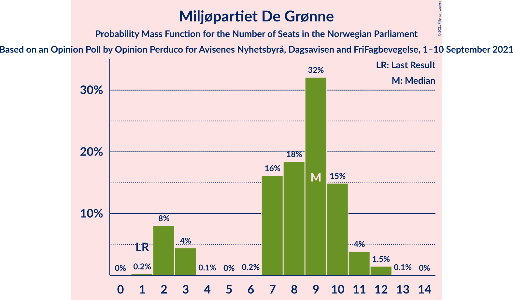
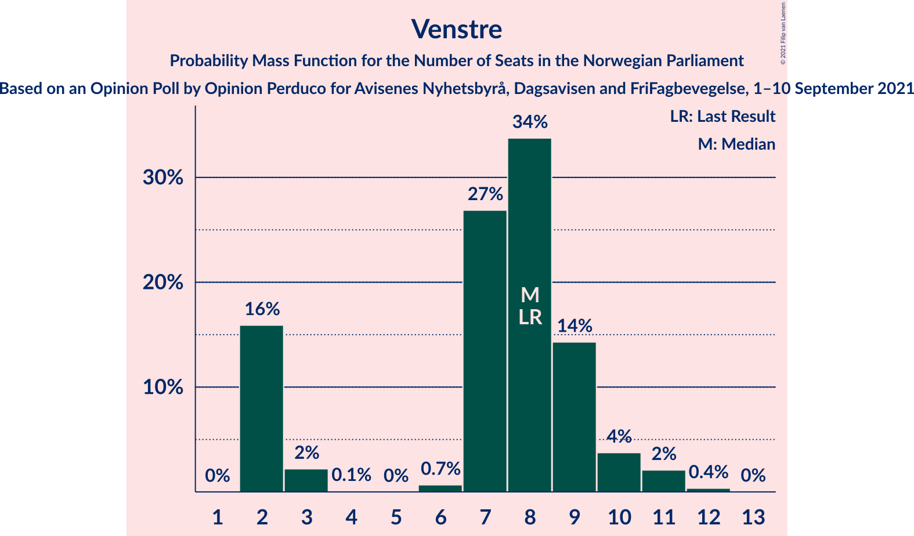
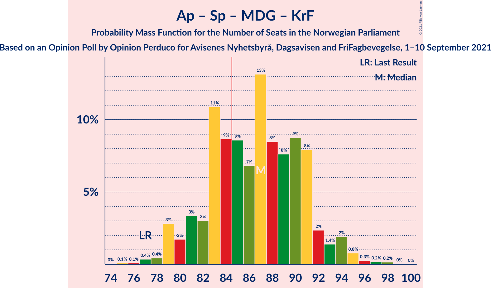
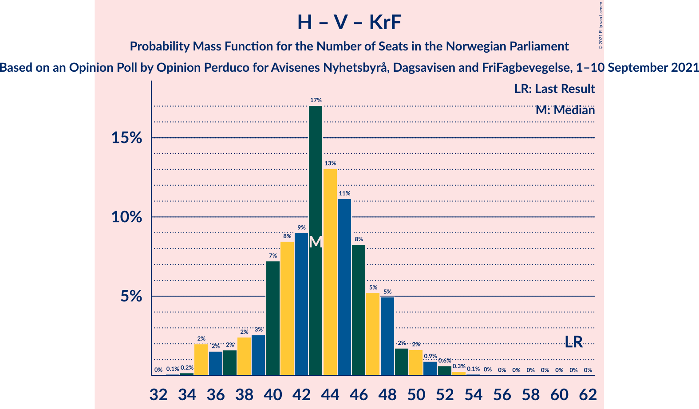

# Opinion Poll by Opinion Perduco for Avisenes Nyhetsbyrå, Dagsavisen and FriFagbevegelse, 1–10 September 2021

<a href="#voting-intentions">Voting Intentions</a> | <a href="#seats">Seats</a> | <a href="#coalitions">Coalitions</a> | <a href="#technical-information">Technical Information</a>

## Voting Intentions

### Confidence Intervals

| Party | Last Result | Poll Result | 80% Confidence Interval | 90% Confidence Interval | 95% Confidence Interval | 99% Confidence Interval |
|:-----:|:-----------:|:-----------:|:-----------------------:|:-----------------------:|:-----------------------:|:-----------------------:|
| Arbeiderpartiet | 27.4% | 27.0% | 25.2–28.9% |24.7–29.4% |24.2–29.9% |23.4–30.8% |
| Høyre | 25.0% | 18.9% | 17.3–20.6% |16.9–21.1% |16.5–21.5% |15.8–22.4% |
| Senterpartiet | 10.3% | 14.9% | 13.5–16.4% |13.1–16.9% |12.7–17.3% |12.1–18.1% |
| Fremskrittspartiet | 15.2% | 11.9% | 10.6–13.4% |10.3–13.8% |10.0–14.1% |9.4–14.8% |
| Sosialistisk Venstreparti | 6.0% | 7.7% | 6.7–9.0% |6.4–9.3% |6.2–9.6% |5.7–10.3% |
| Miljøpartiet De Grønne | 3.2% | 4.8% | 4.0–5.8% |3.8–6.1% |3.6–6.3% |3.2–6.9% |
| Rødt | 2.4% | 4.6% | 3.8–5.6% |3.6–5.9% |3.4–6.1% |3.1–6.6% |
| Venstre | 4.4% | 4.5% | 3.7–5.5% |3.5–5.7% |3.3–6.0% |3.0–6.5% |
| Kristelig Folkeparti | 4.2% | 3.3% | 2.7–4.2% |2.5–4.4% |2.3–4.6% |2.1–5.1% |

*Note:* The poll result column reflects the actual value used in the calculations. Published results may vary slightly, and in addition be rounded to fewer digits.

## Seats

### Confidence Intervals

| Party | Last Result | Median | 80% Confidence Interval | 90% Confidence Interval | 95% Confidence Interval | 99% Confidence Interval |
|:-----:|:-----------:|:------:|:-----------------------:|:-----------------------:|:-----------------------:|:-----------------------:|
| <a href="#arbeiderpartiet">Arbeiderpartiet</a> | 49 | 49 | 45–53 |44–54 |43–55 |42–56 |
| <a href="#høyre">Høyre</a> | 45 | 34 | 31–38 |29–39 |28–39 |26–41 |
| <a href="#senterpartiet">Senterpartiet</a> | 19 | 27 | 23–31 |22–32 |22–33 |21–34 |
| <a href="#fremskrittspartiet">Fremskrittspartiet</a> | 27 | 21 | 18–25 |18–25 |17–26 |15–26 |
| <a href="#sosialistisk-venstreparti">Sosialistisk Venstreparti</a> | 11 | 14 | 11–16 |11–17 |10–17 |9–18 |
| <a href="#miljøpartiet-de-grønne">Miljøpartiet De Grønne</a> | 1 | 8 | 2–11 |2–11 |2–11 |2–12 |
| <a href="#rødt">Rødt</a> | 1 | 8 | 2–10 |2–10 |2–11 |2–12 |
| <a href="#venstre">Venstre</a> | 8 | 8 | 2–9 |2–10 |2–11 |2–12 |
| <a href="#kristelig-folkeparti">Kristelig Folkeparti</a> | 8 | 3 | 1–7 |1–7 |1–8 |0–9 |

### Arbeiderpartiet

*For a full overview of the results for this party, see the [Arbeiderpartiet](party-arbeiderpartiet.html) page.*

| Number of Seats | Probability | Accumulated | Special Marks |
|:---------------:|:-----------:|:-----------:|:-------------:|
| 41 | 0.1% | 100% |  |
| 42 | 0.3% | 99.8% |  |
| 43 | 2% | 99.5% |  |
| 44 | 7% | 97% |  |
| 45 | 7% | 91% |  |
| 46 | 16% | 84% |  |
| 47 | 10% | 68% |  |
| 48 | 4% | 58% |  |
| 49 | 22% | 54% | Last Result, Median |
| 50 | 6% | 32% |  |
| 51 | 5% | 27% |  |
| 52 | 10% | 22% |  |
| 53 | 5% | 12% |  |
| 54 | 4% | 7% |  |
| 55 | 1.1% | 3% |  |
| 56 | 1.5% | 2% |  |
| 57 | 0.2% | 0.4% |  |
| 58 | 0.1% | 0.2% |  |
| 59 | 0% | 0.1% |  |
| 60 | 0% | 0% |  |

### Høyre

*For a full overview of the results for this party, see the [Høyre](party-høyre.html) page.*

| Number of Seats | Probability | Accumulated | Special Marks |
|:---------------:|:-----------:|:-----------:|:-------------:|
| 25 | 0% | 100% |  |
| 26 | 0.7% | 99.9% |  |
| 27 | 0.7% | 99.2% |  |
| 28 | 3% | 98% |  |
| 29 | 1.3% | 96% |  |
| 30 | 2% | 94% |  |
| 31 | 8% | 93% |  |
| 32 | 15% | 85% |  |
| 33 | 7% | 70% |  |
| 34 | 14% | 63% | Median |
| 35 | 8% | 49% |  |
| 36 | 17% | 42% |  |
| 37 | 8% | 25% |  |
| 38 | 10% | 16% |  |
| 39 | 4% | 6% |  |
| 40 | 1.1% | 2% |  |
| 41 | 0.6% | 0.7% |  |
| 42 | 0% | 0.1% |  |
| 43 | 0% | 0% |  |
| 44 | 0% | 0% |  |
| 45 | 0% | 0% | Last Result |

### Senterpartiet

*For a full overview of the results for this party, see the [Senterpartiet](party-senterpartiet.html) page.*

| Number of Seats | Probability | Accumulated | Special Marks |
|:---------------:|:-----------:|:-----------:|:-------------:|
| 19 | 0% | 100% | Last Result |
| 20 | 0.3% | 99.9% |  |
| 21 | 1.4% | 99.7% |  |
| 22 | 5% | 98% |  |
| 23 | 6% | 94% |  |
| 24 | 6% | 88% |  |
| 25 | 12% | 83% |  |
| 26 | 6% | 71% |  |
| 27 | 19% | 64% | Median |
| 28 | 12% | 45% |  |
| 29 | 18% | 33% |  |
| 30 | 4% | 15% |  |
| 31 | 4% | 11% |  |
| 32 | 2% | 7% |  |
| 33 | 3% | 4% |  |
| 34 | 1.0% | 2% |  |
| 35 | 0.4% | 0.5% |  |
| 36 | 0.1% | 0.1% |  |
| 37 | 0% | 0% |  |

### Fremskrittspartiet

*For a full overview of the results for this party, see the [Fremskrittspartiet](party-fremskrittspartiet.html) page.*

| Number of Seats | Probability | Accumulated | Special Marks |
|:---------------:|:-----------:|:-----------:|:-------------:|
| 14 | 0.1% | 100% |  |
| 15 | 0.5% | 99.9% |  |
| 16 | 0.3% | 99.5% |  |
| 17 | 2% | 99.1% |  |
| 18 | 18% | 97% |  |
| 19 | 13% | 80% |  |
| 20 | 4% | 67% |  |
| 21 | 15% | 63% | Median |
| 22 | 24% | 48% |  |
| 23 | 3% | 24% |  |
| 24 | 6% | 20% |  |
| 25 | 12% | 15% |  |
| 26 | 2% | 3% |  |
| 27 | 0.2% | 0.4% | Last Result |
| 28 | 0.2% | 0.3% |  |
| 29 | 0.1% | 0.1% |  |
| 30 | 0% | 0% |  |

### Sosialistisk Venstreparti

*For a full overview of the results for this party, see the [Sosialistisk Venstreparti](party-sosialistiskvenstreparti.html) page.*

| Number of Seats | Probability | Accumulated | Special Marks |
|:---------------:|:-----------:|:-----------:|:-------------:|
| 9 | 0.5% | 100% |  |
| 10 | 2% | 99.4% |  |
| 11 | 10% | 97% | Last Result |
| 12 | 13% | 87% |  |
| 13 | 16% | 74% |  |
| 14 | 27% | 58% | Median |
| 15 | 20% | 31% |  |
| 16 | 6% | 11% |  |
| 17 | 4% | 6% |  |
| 18 | 1.2% | 2% |  |
| 19 | 0.3% | 0.3% |  |
| 20 | 0% | 0% |  |

### Miljøpartiet De Grønne

*For a full overview of the results for this party, see the [Miljøpartiet De Grønne](party-miljøpartietdegrønne.html) page.*

| Number of Seats | Probability | Accumulated | Special Marks |
|:---------------:|:-----------:|:-----------:|:-------------:|
| 1 | 0.4% | 100% | Last Result |
| 2 | 17% | 99.6% |  |
| 3 | 6% | 83% |  |
| 4 | 0.3% | 77% |  |
| 5 | 0% | 76% |  |
| 6 | 0.3% | 76% |  |
| 7 | 19% | 76% |  |
| 8 | 20% | 57% | Median |
| 9 | 15% | 37% |  |
| 10 | 11% | 22% |  |
| 11 | 9% | 10% |  |
| 12 | 1.5% | 2% |  |
| 13 | 0.3% | 0.3% |  |
| 14 | 0% | 0% |  |

### Rødt

*For a full overview of the results for this party, see the [Rødt](party-rødt.html) page.*

| Number of Seats | Probability | Accumulated | Special Marks |
|:---------------:|:-----------:|:-----------:|:-------------:|
| 1 | 0.3% | 100% | Last Result |
| 2 | 23% | 99.7% |  |
| 3 | 0% | 77% |  |
| 4 | 0% | 77% |  |
| 5 | 0% | 77% |  |
| 6 | 2% | 77% |  |
| 7 | 17% | 75% |  |
| 8 | 21% | 58% | Median |
| 9 | 14% | 37% |  |
| 10 | 19% | 23% |  |
| 11 | 3% | 4% |  |
| 12 | 0.6% | 0.7% |  |
| 13 | 0.1% | 0.1% |  |
| 14 | 0% | 0% |  |

### Venstre

*For a full overview of the results for this party, see the [Venstre](party-venstre.html) page.*

| Number of Seats | Probability | Accumulated | Special Marks |
|:---------------:|:-----------:|:-----------:|:-------------:|
| 2 | 22% | 100% |  |
| 3 | 2% | 78% |  |
| 4 | 0.4% | 75% |  |
| 5 | 0% | 75% |  |
| 6 | 0.1% | 75% |  |
| 7 | 25% | 75% |  |
| 8 | 19% | 50% | Last Result, Median |
| 9 | 21% | 31% |  |
| 10 | 7% | 10% |  |
| 11 | 2% | 3% |  |
| 12 | 1.0% | 1.0% |  |
| 13 | 0% | 0% |  |

### Kristelig Folkeparti

*For a full overview of the results for this party, see the [Kristelig Folkeparti](party-kristeligfolkeparti.html) page.*

| Number of Seats | Probability | Accumulated | Special Marks |
|:---------------:|:-----------:|:-----------:|:-------------:|
| 0 | 2% | 100% |  |
| 1 | 25% | 98% |  |
| 2 | 13% | 74% |  |
| 3 | 40% | 61% | Median |
| 4 | 0% | 21% |  |
| 5 | 0% | 21% |  |
| 6 | 7% | 21% |  |
| 7 | 10% | 14% |  |
| 8 | 3% | 4% | Last Result |
| 9 | 0.5% | 0.6% |  |
| 10 | 0.1% | 0.1% |  |
| 11 | 0% | 0% |  |

## Coalitions

### Confidence Intervals

| Coalition | Last Result | Median | Majority? | 80% Confidence Interval | 90% Confidence Interval | 95% Confidence Interval | 99% Confidence Interval |
|:---------:|:-----------:|:------:|:---------:|:-----------------------:|:-----------------------:|:-----------------------:|:-----------------------:|
| Arbeiderpartiet – Senterpartiet – Sosialistisk Venstreparti – Miljøpartiet De Grønne – Rødt | 81 | 104 | 100% | 100–109 | 98–111 | 97–113 | 94–113 |
| Arbeiderpartiet – Senterpartiet – Sosialistisk Venstreparti – Miljøpartiet De Grønne – Kristelig Folkeparti | 88 | 100 | 100% | 94–105 | 93–105 | 93–107 | 91–110 |
| Arbeiderpartiet – Senterpartiet – Sosialistisk Venstreparti – Miljøpartiet De Grønne | 80 | 96 | 100% | 92–102 | 90–104 | 90–105 | 88–106 |
| Arbeiderpartiet – Senterpartiet – Sosialistisk Venstreparti – Rødt | 80 | 96 | 100% | 91–102 | 90–103 | 89–105 | 87–106 |
| Høyre – Senterpartiet – Fremskrittspartiet – Venstre – Kristelig Folkeparti | 107 | 94 | 98% | 86–97 | 85–98 | 85–99 | 83–101 |
| Arbeiderpartiet – Senterpartiet – Sosialistisk Venstreparti | 79 | 90 | 91% | 85–93 | 84–96 | 82–97 | 80–99 |
| Arbeiderpartiet – Senterpartiet – Miljøpartiet De Grønne – Kristelig Folkeparti | 77 | 86 | 63% | 80–91 | 79–92 | 79–94 | 77–96 |
| Arbeiderpartiet – Senterpartiet – Kristelig Folkeparti | 76 | 79 | 6% | 74–83 | 72–85 | 72–86 | 70–88 |
| Arbeiderpartiet – Sosialistisk Venstreparti – Miljøpartiet De Grønne – Rødt | 62 | 75 | 2% | 72–83 | 70–84 | 70–84 | 68–86 |
| Arbeiderpartiet – Senterpartiet | 68 | 76 | 0.6% | 71–80 | 70–82 | 69–82 | 68–85 |
| Høyre – Fremskrittspartiet – Miljøpartiet De Grønne – Venstre – Kristelig Folkeparti | 89 | 72 | 0% | 67–78 | 66–79 | 64–79 | 62–82 |
| Høyre – Fremskrittspartiet – Venstre – Kristelig Folkeparti | 88 | 65 | 0% | 60–69 | 58–71 | 56–71 | 56–74 |
| Arbeiderpartiet – Sosialistisk Venstreparti | 60 | 63 | 0% | 57–66 | 56–68 | 56–69 | 55–71 |
| Høyre – Fremskrittspartiet – Venstre | 80 | 62 | 0% | 58–67 | 56–68 | 55–69 | 52–70 |
| Høyre – Fremskrittspartiet | 72 | 56 | 0% | 51–60 | 50–61 | 48–61 | 46–64 |
| Høyre – Venstre – Kristelig Folkeparti | 61 | 44 | 0% | 39–49 | 37–50 | 35–51 | 35–52 |
| Senterpartiet – Venstre – Kristelig Folkeparti | 35 | 37 | 0% | 32–42 | 31–44 | 29–44 | 27–47 |

### Arbeiderpartiet – Senterpartiet – Sosialistisk Venstreparti – Miljøpartiet De Grønne – Rødt

| Number of Seats | Probability | Accumulated | Special Marks |
|:---------------:|:-----------:|:-----------:|:-------------:|
| 81 | 0% | 100% | Last Result |
| 82 | 0% | 100% |  |
| 83 | 0% | 100% |  |
| 84 | 0% | 100% |  |
| 85 | 0% | 100% | Majority |
| 86 | 0% | 100% |  |
| 87 | 0% | 100% |  |
| 88 | 0% | 100% |  |
| 89 | 0% | 100% |  |
| 90 | 0% | 100% |  |
| 91 | 0% | 100% |  |
| 92 | 0.1% | 100% |  |
| 93 | 0.1% | 99.9% |  |
| 94 | 0.3% | 99.8% |  |
| 95 | 0.2% | 99.5% |  |
| 96 | 0.6% | 99.3% |  |
| 97 | 1.2% | 98.7% |  |
| 98 | 4% | 97% |  |
| 99 | 2% | 94% |  |
| 100 | 23% | 92% |  |
| 101 | 3% | 69% |  |
| 102 | 5% | 66% |  |
| 103 | 5% | 61% |  |
| 104 | 23% | 56% |  |
| 105 | 6% | 32% |  |
| 106 | 5% | 26% | Median |
| 107 | 5% | 21% |  |
| 108 | 5% | 15% |  |
| 109 | 3% | 11% |  |
| 110 | 2% | 7% |  |
| 111 | 2% | 5% |  |
| 112 | 0.5% | 3% |  |
| 113 | 3% | 3% |  |
| 114 | 0.2% | 0.4% |  |
| 115 | 0.1% | 0.2% |  |
| 116 | 0.1% | 0.1% |  |
| 117 | 0% | 0% |  |

### Arbeiderpartiet – Senterpartiet – Sosialistisk Venstreparti – Miljøpartiet De Grønne – Kristelig Folkeparti

| Number of Seats | Probability | Accumulated | Special Marks |
|:---------------:|:-----------:|:-----------:|:-------------:|
| 88 | 0% | 100% | Last Result |
| 89 | 0.2% | 99.9% |  |
| 90 | 0.2% | 99.8% |  |
| 91 | 0.8% | 99.6% |  |
| 92 | 0.6% | 98.8% |  |
| 93 | 4% | 98% |  |
| 94 | 4% | 94% |  |
| 95 | 7% | 90% |  |
| 96 | 3% | 83% |  |
| 97 | 13% | 79% |  |
| 98 | 6% | 66% |  |
| 99 | 7% | 60% |  |
| 100 | 6% | 53% |  |
| 101 | 13% | 47% | Median |
| 102 | 7% | 34% |  |
| 103 | 13% | 27% |  |
| 104 | 3% | 14% |  |
| 105 | 6% | 11% |  |
| 106 | 2% | 5% |  |
| 107 | 1.4% | 3% |  |
| 108 | 0.7% | 1.4% |  |
| 109 | 0.2% | 0.7% |  |
| 110 | 0.4% | 0.6% |  |
| 111 | 0% | 0.2% |  |
| 112 | 0.1% | 0.2% |  |
| 113 | 0% | 0.1% |  |
| 114 | 0% | 0% |  |

### Arbeiderpartiet – Senterpartiet – Sosialistisk Venstreparti – Miljøpartiet De Grønne

| Number of Seats | Probability | Accumulated | Special Marks |
|:---------------:|:-----------:|:-----------:|:-------------:|
| 80 | 0% | 100% | Last Result |
| 81 | 0% | 100% |  |
| 82 | 0% | 100% |  |
| 83 | 0% | 100% |  |
| 84 | 0% | 100% |  |
| 85 | 0.1% | 100% | Majority |
| 86 | 0.1% | 99.9% |  |
| 87 | 0.2% | 99.8% |  |
| 88 | 1.0% | 99.6% |  |
| 89 | 0.7% | 98.6% |  |
| 90 | 4% | 98% |  |
| 91 | 2% | 94% |  |
| 92 | 12% | 92% |  |
| 93 | 4% | 80% |  |
| 94 | 14% | 76% |  |
| 95 | 3% | 62% |  |
| 96 | 8% | 58% |  |
| 97 | 11% | 50% |  |
| 98 | 8% | 39% | Median |
| 99 | 7% | 31% |  |
| 100 | 6% | 24% |  |
| 101 | 4% | 18% |  |
| 102 | 6% | 14% |  |
| 103 | 2% | 8% |  |
| 104 | 3% | 6% |  |
| 105 | 1.3% | 3% |  |
| 106 | 0.9% | 1.3% |  |
| 107 | 0.3% | 0.4% |  |
| 108 | 0.1% | 0.1% |  |
| 109 | 0% | 0.1% |  |
| 110 | 0% | 0% |  |

### Arbeiderpartiet – Senterpartiet – Sosialistisk Venstreparti – Rødt

| Number of Seats | Probability | Accumulated | Special Marks |
|:---------------:|:-----------:|:-----------:|:-------------:|
| 80 | 0% | 100% | Last Result |
| 81 | 0% | 100% |  |
| 82 | 0% | 100% |  |
| 83 | 0% | 100% |  |
| 84 | 0% | 100% |  |
| 85 | 0.1% | 100% | Majority |
| 86 | 0.2% | 99.9% |  |
| 87 | 0.3% | 99.7% |  |
| 88 | 0.9% | 99.4% |  |
| 89 | 1.0% | 98% |  |
| 90 | 6% | 97% |  |
| 91 | 2% | 91% |  |
| 92 | 9% | 89% |  |
| 93 | 9% | 80% |  |
| 94 | 7% | 72% |  |
| 95 | 9% | 65% |  |
| 96 | 6% | 56% |  |
| 97 | 16% | 50% |  |
| 98 | 4% | 34% | Median |
| 99 | 4% | 29% |  |
| 100 | 3% | 25% |  |
| 101 | 3% | 22% |  |
| 102 | 14% | 19% |  |
| 103 | 0.5% | 5% |  |
| 104 | 2% | 5% |  |
| 105 | 1.0% | 3% |  |
| 106 | 1.4% | 2% |  |
| 107 | 0.3% | 0.5% |  |
| 108 | 0.1% | 0.2% |  |
| 109 | 0% | 0.1% |  |
| 110 | 0.1% | 0.1% |  |
| 111 | 0% | 0% |  |

### Høyre – Senterpartiet – Fremskrittspartiet – Venstre – Kristelig Folkeparti

| Number of Seats | Probability | Accumulated | Special Marks |
|:---------------:|:-----------:|:-----------:|:-------------:|
| 79 | 0.1% | 100% |  |
| 80 | 0% | 99.9% |  |
| 81 | 0.2% | 99.8% |  |
| 82 | 0.1% | 99.7% |  |
| 83 | 0.8% | 99.5% |  |
| 84 | 1.0% | 98.7% |  |
| 85 | 4% | 98% | Majority |
| 86 | 4% | 93% |  |
| 87 | 3% | 89% |  |
| 88 | 2% | 87% |  |
| 89 | 3% | 84% |  |
| 90 | 12% | 81% |  |
| 91 | 6% | 69% |  |
| 92 | 9% | 63% |  |
| 93 | 3% | 53% | Median |
| 94 | 18% | 50% |  |
| 95 | 4% | 32% |  |
| 96 | 16% | 28% |  |
| 97 | 5% | 12% |  |
| 98 | 2% | 7% |  |
| 99 | 3% | 5% |  |
| 100 | 0.6% | 1.4% |  |
| 101 | 0.4% | 0.8% |  |
| 102 | 0.2% | 0.4% |  |
| 103 | 0.1% | 0.2% |  |
| 104 | 0.1% | 0.1% |  |
| 105 | 0% | 0% |  |
| 106 | 0% | 0% |  |
| 107 | 0% | 0% | Last Result |

### Arbeiderpartiet – Senterpartiet – Sosialistisk Venstreparti

| Number of Seats | Probability | Accumulated | Special Marks |
|:---------------:|:-----------:|:-----------:|:-------------:|
| 78 | 0% | 100% |  |
| 79 | 0.1% | 99.9% | Last Result |
| 80 | 1.3% | 99.8% |  |
| 81 | 0.1% | 98% |  |
| 82 | 1.0% | 98% |  |
| 83 | 2% | 97% |  |
| 84 | 4% | 96% |  |
| 85 | 9% | 91% | Majority |
| 86 | 7% | 82% |  |
| 87 | 7% | 76% |  |
| 88 | 10% | 68% |  |
| 89 | 6% | 58% |  |
| 90 | 13% | 52% | Median |
| 91 | 4% | 39% |  |
| 92 | 16% | 35% |  |
| 93 | 10% | 19% |  |
| 94 | 2% | 9% |  |
| 95 | 1.5% | 7% |  |
| 96 | 3% | 6% |  |
| 97 | 2% | 3% |  |
| 98 | 0.7% | 1.3% |  |
| 99 | 0.4% | 0.6% |  |
| 100 | 0.1% | 0.2% |  |
| 101 | 0.1% | 0.1% |  |
| 102 | 0% | 0% |  |

### Arbeiderpartiet – Senterpartiet – Miljøpartiet De Grønne – Kristelig Folkeparti

| Number of Seats | Probability | Accumulated | Special Marks |
|:---------------:|:-----------:|:-----------:|:-------------:|
| 74 | 0.1% | 100% |  |
| 75 | 0% | 99.9% |  |
| 76 | 0.2% | 99.9% |  |
| 77 | 0.5% | 99.7% | Last Result |
| 78 | 0.9% | 99.2% |  |
| 79 | 7% | 98% |  |
| 80 | 2% | 91% |  |
| 81 | 2% | 89% |  |
| 82 | 4% | 87% |  |
| 83 | 14% | 84% |  |
| 84 | 7% | 70% |  |
| 85 | 7% | 63% | Majority |
| 86 | 13% | 56% |  |
| 87 | 6% | 44% | Median |
| 88 | 7% | 38% |  |
| 89 | 10% | 30% |  |
| 90 | 10% | 21% |  |
| 91 | 4% | 11% |  |
| 92 | 2% | 7% |  |
| 93 | 1.5% | 4% |  |
| 94 | 1.1% | 3% |  |
| 95 | 0.8% | 2% |  |
| 96 | 0.6% | 1.0% |  |
| 97 | 0.2% | 0.4% |  |
| 98 | 0.1% | 0.2% |  |
| 99 | 0.1% | 0.1% |  |
| 100 | 0% | 0% |  |

### Arbeiderpartiet – Senterpartiet – Kristelig Folkeparti

| Number of Seats | Probability | Accumulated | Special Marks |
|:---------------:|:-----------:|:-----------:|:-------------:|
| 68 | 0.2% | 100% |  |
| 69 | 0.1% | 99.8% |  |
| 70 | 0.2% | 99.7% |  |
| 71 | 1.5% | 99.5% |  |
| 72 | 6% | 98% |  |
| 73 | 1.0% | 92% |  |
| 74 | 3% | 91% |  |
| 75 | 3% | 88% |  |
| 76 | 15% | 84% | Last Result |
| 77 | 5% | 69% |  |
| 78 | 11% | 64% |  |
| 79 | 8% | 54% | Median |
| 80 | 9% | 46% |  |
| 81 | 15% | 37% |  |
| 82 | 3% | 22% |  |
| 83 | 12% | 20% |  |
| 84 | 2% | 8% |  |
| 85 | 3% | 6% | Majority |
| 86 | 0.9% | 3% |  |
| 87 | 1.2% | 2% |  |
| 88 | 0.4% | 0.8% |  |
| 89 | 0.1% | 0.4% |  |
| 90 | 0.2% | 0.3% |  |
| 91 | 0% | 0.1% |  |
| 92 | 0.1% | 0.1% |  |
| 93 | 0% | 0% |  |

### Arbeiderpartiet – Sosialistisk Venstreparti – Miljøpartiet De Grønne – Rødt

| Number of Seats | Probability | Accumulated | Special Marks |
|:---------------:|:-----------:|:-----------:|:-------------:|
| 62 | 0% | 100% | Last Result |
| 63 | 0% | 100% |  |
| 64 | 0% | 100% |  |
| 65 | 0.1% | 100% |  |
| 66 | 0.1% | 99.8% |  |
| 67 | 0.2% | 99.8% |  |
| 68 | 0.4% | 99.6% |  |
| 69 | 0.6% | 99.2% |  |
| 70 | 4% | 98.6% |  |
| 71 | 2% | 95% |  |
| 72 | 5% | 93% |  |
| 73 | 16% | 88% |  |
| 74 | 4% | 72% |  |
| 75 | 18% | 68% |  |
| 76 | 3% | 49% |  |
| 77 | 9% | 46% |  |
| 78 | 6% | 36% |  |
| 79 | 11% | 30% | Median |
| 80 | 3% | 19% |  |
| 81 | 2% | 15% |  |
| 82 | 3% | 13% |  |
| 83 | 4% | 11% |  |
| 84 | 4% | 7% |  |
| 85 | 1.0% | 2% | Majority |
| 86 | 0.8% | 1.1% |  |
| 87 | 0.1% | 0.4% |  |
| 88 | 0.1% | 0.2% |  |
| 89 | 0% | 0.1% |  |
| 90 | 0.1% | 0.1% |  |
| 91 | 0% | 0% |  |

### Arbeiderpartiet – Senterpartiet

| Number of Seats | Probability | Accumulated | Special Marks |
|:---------------:|:-----------:|:-----------:|:-------------:|
| 65 | 0% | 100% |  |
| 66 | 0% | 99.9% |  |
| 67 | 0.3% | 99.9% |  |
| 68 | 1.0% | 99.6% | Last Result |
| 69 | 2% | 98.6% |  |
| 70 | 5% | 97% |  |
| 71 | 5% | 92% |  |
| 72 | 3% | 87% |  |
| 73 | 16% | 83% |  |
| 74 | 7% | 67% |  |
| 75 | 6% | 60% |  |
| 76 | 7% | 55% | Median |
| 77 | 12% | 47% |  |
| 78 | 16% | 35% |  |
| 79 | 5% | 19% |  |
| 80 | 4% | 13% |  |
| 81 | 4% | 10% |  |
| 82 | 3% | 5% |  |
| 83 | 1.5% | 2% |  |
| 84 | 0.2% | 0.9% |  |
| 85 | 0.2% | 0.6% | Majority |
| 86 | 0.4% | 0.5% |  |
| 87 | 0.1% | 0.1% |  |
| 88 | 0% | 0% |  |

### Høyre – Fremskrittspartiet – Miljøpartiet De Grønne – Venstre – Kristelig Folkeparti

| Number of Seats | Probability | Accumulated | Special Marks |
|:---------------:|:-----------:|:-----------:|:-------------:|
| 59 | 0.1% | 100% |  |
| 60 | 0% | 99.9% |  |
| 61 | 0.2% | 99.9% |  |
| 62 | 0.3% | 99.7% |  |
| 63 | 1.4% | 99.4% |  |
| 64 | 1.1% | 98% |  |
| 65 | 2% | 97% |  |
| 66 | 0.6% | 95% |  |
| 67 | 14% | 95% |  |
| 68 | 3% | 81% |  |
| 69 | 3% | 78% |  |
| 70 | 5% | 75% |  |
| 71 | 4% | 70% |  |
| 72 | 16% | 66% |  |
| 73 | 6% | 50% |  |
| 74 | 8% | 43% | Median |
| 75 | 7% | 35% |  |
| 76 | 9% | 28% |  |
| 77 | 9% | 20% |  |
| 78 | 2% | 11% |  |
| 79 | 6% | 9% |  |
| 80 | 1.0% | 2% |  |
| 81 | 0.9% | 1.5% |  |
| 82 | 0.3% | 0.6% |  |
| 83 | 0.2% | 0.3% |  |
| 84 | 0% | 0.1% |  |
| 85 | 0% | 0% | Majority |
| 86 | 0% | 0% |  |
| 87 | 0% | 0% |  |
| 88 | 0% | 0% |  |
| 89 | 0% | 0% | Last Result |

### Høyre – Fremskrittspartiet – Venstre – Kristelig Folkeparti

| Number of Seats | Probability | Accumulated | Special Marks |
|:---------------:|:-----------:|:-----------:|:-------------:|
| 52 | 0% | 100% |  |
| 53 | 0.1% | 99.9% |  |
| 54 | 0.1% | 99.9% |  |
| 55 | 0.2% | 99.7% |  |
| 56 | 3% | 99.5% |  |
| 57 | 0.5% | 97% |  |
| 58 | 2% | 96% |  |
| 59 | 2% | 95% |  |
| 60 | 3% | 92% |  |
| 61 | 5% | 89% |  |
| 62 | 5% | 84% |  |
| 63 | 5% | 79% |  |
| 64 | 6% | 73% |  |
| 65 | 23% | 67% |  |
| 66 | 5% | 44% | Median |
| 67 | 4% | 38% |  |
| 68 | 3% | 34% |  |
| 69 | 23% | 31% |  |
| 70 | 2% | 8% |  |
| 71 | 4% | 6% |  |
| 72 | 1.2% | 2% |  |
| 73 | 0.6% | 1.3% |  |
| 74 | 0.2% | 0.6% |  |
| 75 | 0.3% | 0.4% |  |
| 76 | 0.1% | 0.1% |  |
| 77 | 0.1% | 0.1% |  |
| 78 | 0% | 0% |  |
| 79 | 0% | 0% |  |
| 80 | 0% | 0% |  |
| 81 | 0% | 0% |  |
| 82 | 0% | 0% |  |
| 83 | 0% | 0% |  |
| 84 | 0% | 0% |  |
| 85 | 0% | 0% | Majority |
| 86 | 0% | 0% |  |
| 87 | 0% | 0% |  |
| 88 | 0% | 0% | Last Result |

### Arbeiderpartiet – Sosialistisk Venstreparti

| Number of Seats | Probability | Accumulated | Special Marks |
|:---------------:|:-----------:|:-----------:|:-------------:|
| 53 | 0.1% | 100% |  |
| 54 | 0.3% | 99.9% |  |
| 55 | 1.5% | 99.6% |  |
| 56 | 5% | 98% |  |
| 57 | 5% | 93% |  |
| 58 | 3% | 88% |  |
| 59 | 8% | 86% |  |
| 60 | 8% | 78% | Last Result |
| 61 | 10% | 70% |  |
| 62 | 7% | 60% |  |
| 63 | 17% | 53% | Median |
| 64 | 10% | 36% |  |
| 65 | 13% | 26% |  |
| 66 | 4% | 14% |  |
| 67 | 4% | 10% |  |
| 68 | 2% | 5% |  |
| 69 | 2% | 3% |  |
| 70 | 1.1% | 2% |  |
| 71 | 0.4% | 0.7% |  |
| 72 | 0.2% | 0.3% |  |
| 73 | 0% | 0.1% |  |
| 74 | 0% | 0% |  |

### Høyre – Fremskrittspartiet – Venstre

| Number of Seats | Probability | Accumulated | Special Marks |
|:---------------:|:-----------:|:-----------:|:-------------:|
| 49 | 0.1% | 100% |  |
| 50 | 0% | 99.9% |  |
| 51 | 0.2% | 99.9% |  |
| 52 | 0.2% | 99.7% |  |
| 53 | 0.3% | 99.5% |  |
| 54 | 0.8% | 99.2% |  |
| 55 | 3% | 98% |  |
| 56 | 2% | 95% |  |
| 57 | 2% | 93% |  |
| 58 | 4% | 91% |  |
| 59 | 13% | 87% |  |
| 60 | 4% | 74% |  |
| 61 | 8% | 70% |  |
| 62 | 20% | 62% |  |
| 63 | 5% | 42% | Median |
| 64 | 8% | 37% |  |
| 65 | 5% | 29% |  |
| 66 | 13% | 24% |  |
| 67 | 5% | 11% |  |
| 68 | 1.2% | 6% |  |
| 69 | 4% | 4% |  |
| 70 | 0.4% | 0.9% |  |
| 71 | 0.2% | 0.5% |  |
| 72 | 0.2% | 0.3% |  |
| 73 | 0% | 0.1% |  |
| 74 | 0.1% | 0.1% |  |
| 75 | 0% | 0% |  |
| 76 | 0% | 0% |  |
| 77 | 0% | 0% |  |
| 78 | 0% | 0% |  |
| 79 | 0% | 0% |  |
| 80 | 0% | 0% | Last Result |

### Høyre – Fremskrittspartiet

| Number of Seats | Probability | Accumulated | Special Marks |
|:---------------:|:-----------:|:-----------:|:-------------:|
| 44 | 0.1% | 100% |  |
| 45 | 0.1% | 99.9% |  |
| 46 | 0.4% | 99.9% |  |
| 47 | 1.3% | 99.5% |  |
| 48 | 1.5% | 98% |  |
| 49 | 1.4% | 97% |  |
| 50 | 4% | 95% |  |
| 51 | 4% | 92% |  |
| 52 | 11% | 88% |  |
| 53 | 8% | 77% |  |
| 54 | 8% | 69% |  |
| 55 | 10% | 61% | Median |
| 56 | 8% | 51% |  |
| 57 | 12% | 43% |  |
| 58 | 8% | 31% |  |
| 59 | 6% | 23% |  |
| 60 | 11% | 17% |  |
| 61 | 4% | 6% |  |
| 62 | 1.4% | 2% |  |
| 63 | 0.4% | 1.0% |  |
| 64 | 0.6% | 0.6% |  |
| 65 | 0.1% | 0.1% |  |
| 66 | 0% | 0% |  |
| 67 | 0% | 0% |  |
| 68 | 0% | 0% |  |
| 69 | 0% | 0% |  |
| 70 | 0% | 0% |  |
| 71 | 0% | 0% |  |
| 72 | 0% | 0% | Last Result |

### Høyre – Venstre – Kristelig Folkeparti

| Number of Seats | Probability | Accumulated | Special Marks |
|:---------------:|:-----------:|:-----------:|:-------------:|
| 32 | 0.1% | 100% |  |
| 33 | 0.2% | 99.9% |  |
| 34 | 0.2% | 99.7% |  |
| 35 | 3% | 99.5% |  |
| 36 | 2% | 97% |  |
| 37 | 1.2% | 95% |  |
| 38 | 3% | 94% |  |
| 39 | 1.2% | 91% |  |
| 40 | 7% | 90% |  |
| 41 | 3% | 82% |  |
| 42 | 6% | 79% |  |
| 43 | 14% | 74% |  |
| 44 | 10% | 59% |  |
| 45 | 10% | 50% | Median |
| 46 | 5% | 39% |  |
| 47 | 16% | 34% |  |
| 48 | 8% | 18% |  |
| 49 | 4% | 10% |  |
| 50 | 4% | 6% |  |
| 51 | 2% | 3% |  |
| 52 | 0.4% | 0.8% |  |
| 53 | 0.2% | 0.4% |  |
| 54 | 0.2% | 0.3% |  |
| 55 | 0% | 0% |  |
| 56 | 0% | 0% |  |
| 57 | 0% | 0% |  |
| 58 | 0% | 0% |  |
| 59 | 0% | 0% |  |
| 60 | 0% | 0% |  |
| 61 | 0% | 0% | Last Result |

### Senterpartiet – Venstre – Kristelig Folkeparti

| Number of Seats | Probability | Accumulated | Special Marks |
|:---------------:|:-----------:|:-----------:|:-------------:|
| 25 | 0.2% | 100% |  |
| 26 | 0.1% | 99.8% |  |
| 27 | 0.5% | 99.7% |  |
| 28 | 0.7% | 99.2% |  |
| 29 | 1.2% | 98% |  |
| 30 | 2% | 97% |  |
| 31 | 3% | 96% |  |
| 32 | 4% | 93% |  |
| 33 | 3% | 89% |  |
| 34 | 16% | 86% |  |
| 35 | 4% | 70% | Last Result |
| 36 | 7% | 66% |  |
| 37 | 9% | 58% |  |
| 38 | 18% | 49% | Median |
| 39 | 10% | 31% |  |
| 40 | 4% | 21% |  |
| 41 | 6% | 17% |  |
| 42 | 2% | 11% |  |
| 43 | 4% | 9% |  |
| 44 | 3% | 5% |  |
| 45 | 1.3% | 2% |  |
| 46 | 0.5% | 1.2% |  |
| 47 | 0.3% | 0.7% |  |
| 48 | 0.3% | 0.3% |  |
| 49 | 0% | 0.1% |  |
| 50 | 0% | 0% |  |

## Technical Information

### Opinion Poll

+ **Polling firm:** Opinion Perduco
+ **Commissioner(s):** Avisenes Nyhetsbyrå, Dagsavisen and FriFagbevegelse
+ **Fieldwork period:** 1–10 September 2021

### Calculations

+ **Sample size:** 942
+ **Simulations done:** 262,144
+ **Error estimate:** 1.89%

