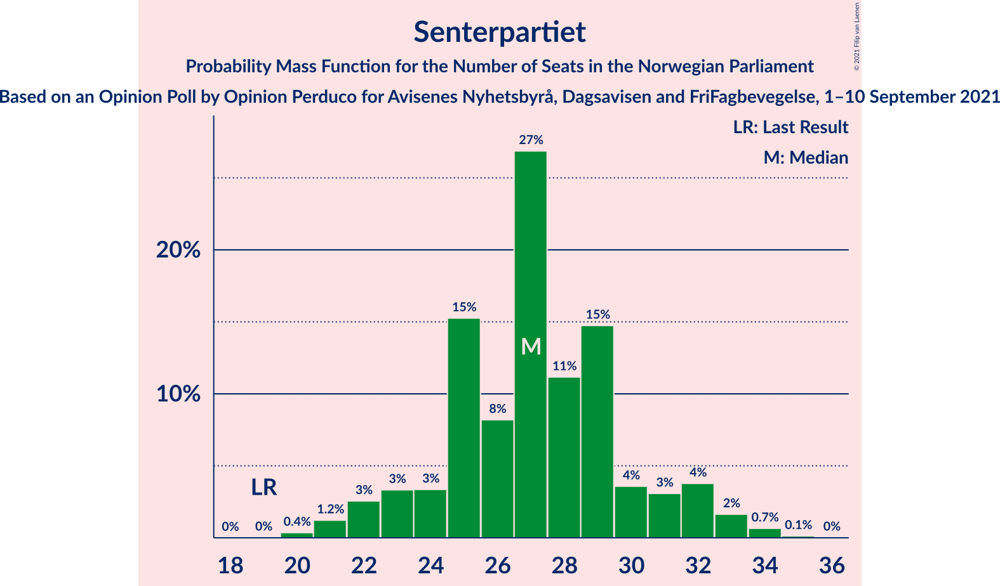
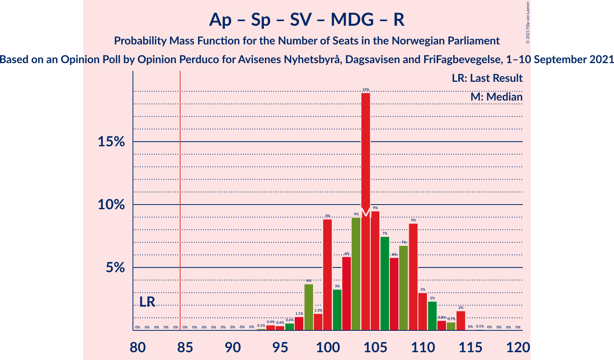
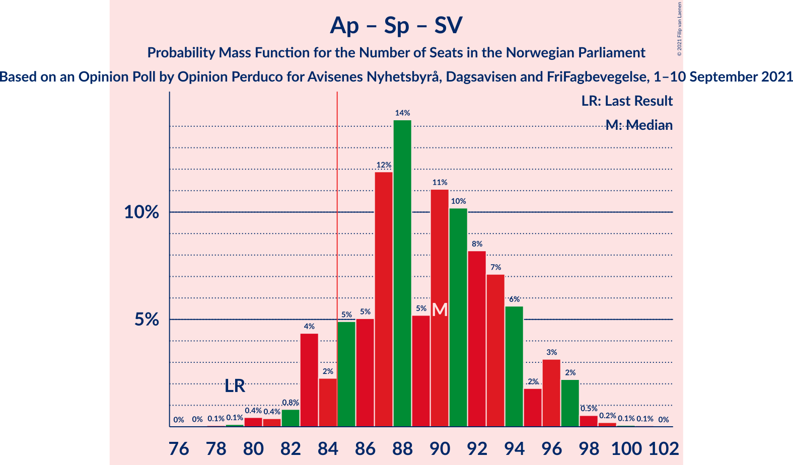
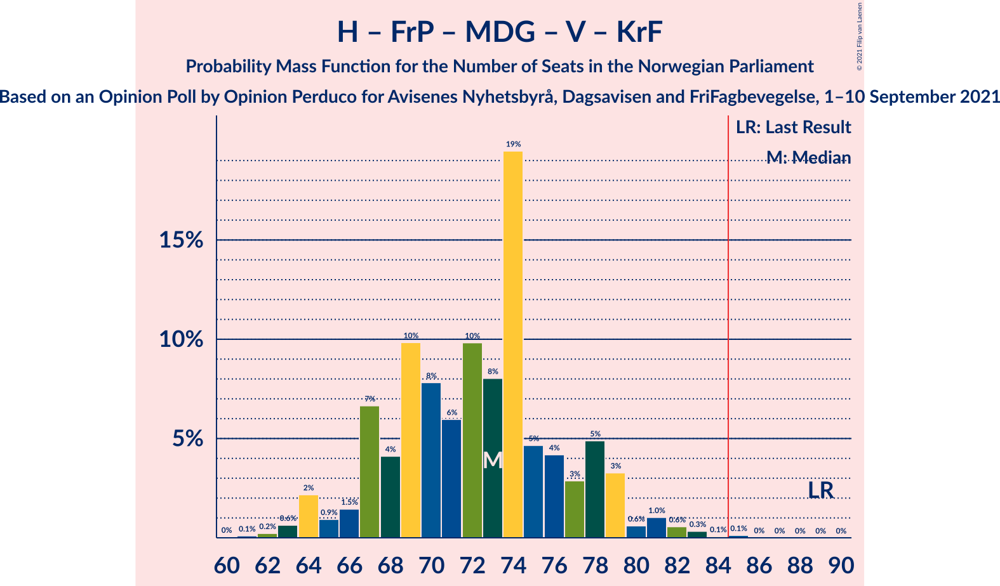

# Opinion Poll by Opinion Perduco for Avisenes Nyhetsbyrå, Dagsavisen and FriFagbevegelse, 1–10 September 2021

<a href="#voting-intentions">Voting Intentions</a> | <a href="#seats">Seats</a> | <a href="#coalitions">Coalitions</a> | <a href="#technical-information">Technical Information</a>

## Voting Intentions

### Confidence Intervals

| Party | Last Result | Poll Result | 80% Confidence Interval | 90% Confidence Interval | 95% Confidence Interval | 99% Confidence Interval |
|:-----:|:-----------:|:-----------:|:-----------------------:|:-----------------------:|:-----------------------:|:-----------------------:|
| Arbeiderpartiet | 27.4% | 27.0% | 25.2–28.9% |24.7–29.4% |24.2–29.9% |23.4–30.8% |
| Høyre | 25.0% | 18.9% | 17.3–20.6% |16.9–21.1% |16.5–21.5% |15.8–22.4% |
| Senterpartiet | 10.3% | 14.9% | 13.5–16.4% |13.1–16.9% |12.7–17.3% |12.1–18.1% |
| Fremskrittspartiet | 15.2% | 11.9% | 10.6–13.4% |10.3–13.8% |10.0–14.1% |9.4–14.8% |
| Sosialistisk Venstreparti | 6.0% | 7.7% | 6.7–9.0% |6.4–9.3% |6.2–9.6% |5.7–10.3% |
| Miljøpartiet De Grønne | 3.2% | 4.8% | 4.0–5.8% |3.8–6.1% |3.6–6.3% |3.2–6.9% |
| Rødt | 2.4% | 4.6% | 3.8–5.6% |3.6–5.9% |3.4–6.1% |3.1–6.6% |
| Venstre | 4.4% | 4.5% | 3.7–5.5% |3.5–5.7% |3.3–6.0% |3.0–6.5% |
| Kristelig Folkeparti | 4.2% | 3.3% | 2.7–4.2% |2.5–4.4% |2.3–4.6% |2.1–5.1% |

*Note:* The poll result column reflects the actual value used in the calculations. Published results may vary slightly, and in addition be rounded to fewer digits.

## Seats

### Confidence Intervals

| Party | Last Result | Median | 80% Confidence Interval | 90% Confidence Interval | 95% Confidence Interval | 99% Confidence Interval |
|:-----:|:-----------:|:------:|:-----------------------:|:-----------------------:|:-----------------------:|:-----------------------:|
| <a href="#arbeiderpartiet">Arbeiderpartiet</a> | 49 | 48 | 44–53 |44–55 |44–55 |43–57 |
| <a href="#høyre">Høyre</a> | 45 | 34 | 31–37 |30–38 |29–39 |27–40 |
| <a href="#senterpartiet">Senterpartiet</a> | 19 | 27 | 24–30 |23–32 |22–32 |21–34 |
| <a href="#fremskrittspartiet">Fremskrittspartiet</a> | 27 | 21 | 18–24 |18–25 |17–25 |16–26 |
| <a href="#sosialistisk-venstreparti">Sosialistisk Venstreparti</a> | 11 | 14 | 12–16 |11–16 |11–17 |10–18 |
| <a href="#miljøpartiet-de-grønne">Miljøpartiet De Grønne</a> | 1 | 9 | 3–10 |2–11 |2–11 |2–12 |
| <a href="#rødt">Rødt</a> | 1 | 8 | 2–10 |2–10 |2–11 |2–12 |
| <a href="#venstre">Venstre</a> | 8 | 8 | 2–9 |2–10 |2–10 |2–11 |
| <a href="#kristelig-folkeparti">Kristelig Folkeparti</a> | 8 | 3 | 1–7 |1–7 |1–8 |0–8 |

### Arbeiderpartiet

*For a full overview of the results for this party, see the [Arbeiderpartiet](party-arbeiderpartiet.html) page.*

| Number of Seats | Probability | Accumulated | Special Marks |
|:---------------:|:-----------:|:-----------:|:-------------:|
| 41 | 0.1% | 100% |  |
| 42 | 0.3% | 99.9% |  |
| 43 | 1.1% | 99.6% |  |
| 44 | 9% | 98.5% |  |
| 45 | 7% | 90% |  |
| 46 | 10% | 83% |  |
| 47 | 11% | 73% |  |
| 48 | 12% | 62% | Median |
| 49 | 11% | 50% | Last Result |
| 50 | 13% | 39% |  |
| 51 | 5% | 26% |  |
| 52 | 8% | 21% |  |
| 53 | 4% | 13% |  |
| 54 | 2% | 9% |  |
| 55 | 4% | 7% |  |
| 56 | 2% | 2% |  |
| 57 | 0.5% | 0.7% |  |
| 58 | 0.1% | 0.1% |  |
| 59 | 0% | 0% |  |

### Høyre

*For a full overview of the results for this party, see the [Høyre](party-høyre.html) page.*

| Number of Seats | Probability | Accumulated | Special Marks |
|:---------------:|:-----------:|:-----------:|:-------------:|
| 26 | 0.2% | 100% |  |
| 27 | 0.5% | 99.7% |  |
| 28 | 1.5% | 99.2% |  |
| 29 | 3% | 98% |  |
| 30 | 5% | 95% |  |
| 31 | 9% | 90% |  |
| 32 | 16% | 81% |  |
| 33 | 13% | 65% |  |
| 34 | 15% | 52% | Median |
| 35 | 17% | 37% |  |
| 36 | 8% | 20% |  |
| 37 | 5% | 12% |  |
| 38 | 3% | 8% |  |
| 39 | 4% | 5% |  |
| 40 | 0.7% | 1.0% |  |
| 41 | 0.2% | 0.3% |  |
| 42 | 0% | 0.1% |  |
| 43 | 0% | 0.1% |  |
| 44 | 0% | 0% |  |
| 45 | 0% | 0% | Last Result |

### Senterpartiet

*For a full overview of the results for this party, see the [Senterpartiet](party-senterpartiet.html) page.*

| Number of Seats | Probability | Accumulated | Special Marks |
|:---------------:|:-----------:|:-----------:|:-------------:|
| 19 | 0% | 100% | Last Result |
| 20 | 0.4% | 100% |  |
| 21 | 1.2% | 99.6% |  |
| 22 | 3% | 98% |  |
| 23 | 3% | 96% |  |
| 24 | 3% | 92% |  |
| 25 | 15% | 89% |  |
| 26 | 8% | 74% |  |
| 27 | 27% | 66% | Median |
| 28 | 11% | 39% |  |
| 29 | 15% | 28% |  |
| 30 | 4% | 13% |  |
| 31 | 3% | 9% |  |
| 32 | 4% | 6% |  |
| 33 | 2% | 2% |  |
| 34 | 0.7% | 0.8% |  |
| 35 | 0.1% | 0.2% |  |
| 36 | 0% | 0% |  |

### Fremskrittspartiet

*For a full overview of the results for this party, see the [Fremskrittspartiet](party-fremskrittspartiet.html) page.*

| Number of Seats | Probability | Accumulated | Special Marks |
|:---------------:|:-----------:|:-----------:|:-------------:|
| 15 | 0.2% | 100% |  |
| 16 | 0.8% | 99.7% |  |
| 17 | 2% | 99.0% |  |
| 18 | 11% | 97% |  |
| 19 | 18% | 87% |  |
| 20 | 10% | 68% |  |
| 21 | 16% | 58% | Median |
| 22 | 17% | 42% |  |
| 23 | 12% | 25% |  |
| 24 | 7% | 14% |  |
| 25 | 5% | 7% |  |
| 26 | 2% | 2% |  |
| 27 | 0.3% | 0.4% | Last Result |
| 28 | 0.1% | 0.2% |  |
| 29 | 0% | 0% |  |

### Sosialistisk Venstreparti

*For a full overview of the results for this party, see the [Sosialistisk Venstreparti](party-sosialistiskvenstreparti.html) page.*

| Number of Seats | Probability | Accumulated | Special Marks |
|:---------------:|:-----------:|:-----------:|:-------------:|
| 9 | 0.3% | 100% |  |
| 10 | 1.5% | 99.7% |  |
| 11 | 6% | 98% | Last Result |
| 12 | 25% | 92% |  |
| 13 | 14% | 67% |  |
| 14 | 22% | 53% | Median |
| 15 | 17% | 31% |  |
| 16 | 10% | 14% |  |
| 17 | 3% | 4% |  |
| 18 | 0.9% | 1.1% |  |
| 19 | 0.2% | 0.3% |  |
| 20 | 0% | 0% |  |

### Miljøpartiet De Grønne

*For a full overview of the results for this party, see the [Miljøpartiet De Grønne](party-miljøpartietdegrønne.html) page.*

| Number of Seats | Probability | Accumulated | Special Marks |
|:---------------:|:-----------:|:-----------:|:-------------:|
| 1 | 0.2% | 100% | Last Result |
| 2 | 8% | 99.8% |  |
| 3 | 4% | 92% |  |
| 4 | 0.1% | 87% |  |
| 5 | 0% | 87% |  |
| 6 | 0.2% | 87% |  |
| 7 | 16% | 87% |  |
| 8 | 18% | 71% |  |
| 9 | 32% | 52% | Median |
| 10 | 15% | 20% |  |
| 11 | 4% | 5% |  |
| 12 | 1.5% | 2% |  |
| 13 | 0.1% | 0.1% |  |
| 14 | 0% | 0% |  |

### Rødt

*For a full overview of the results for this party, see the [Rødt](party-rødt.html) page.*

| Number of Seats | Probability | Accumulated | Special Marks |
|:---------------:|:-----------:|:-----------:|:-------------:|
| 1 | 0.3% | 100% | Last Result |
| 2 | 17% | 99.7% |  |
| 3 | 0% | 83% |  |
| 4 | 0% | 83% |  |
| 5 | 0% | 83% |  |
| 6 | 0.5% | 83% |  |
| 7 | 21% | 82% |  |
| 8 | 30% | 62% | Median |
| 9 | 20% | 31% |  |
| 10 | 9% | 12% |  |
| 11 | 2% | 3% |  |
| 12 | 0.8% | 0.8% |  |
| 13 | 0% | 0.1% |  |
| 14 | 0% | 0% |  |

### Venstre

*For a full overview of the results for this party, see the [Venstre](party-venstre.html) page.*

| Number of Seats | Probability | Accumulated | Special Marks |
|:---------------:|:-----------:|:-----------:|:-------------:|
| 2 | 16% | 100% |  |
| 3 | 2% | 84% |  |
| 4 | 0.1% | 82% |  |
| 5 | 0% | 82% |  |
| 6 | 0.7% | 82% |  |
| 7 | 27% | 81% |  |
| 8 | 34% | 54% | Last Result, Median |
| 9 | 14% | 21% |  |
| 10 | 4% | 6% |  |
| 11 | 2% | 2% |  |
| 12 | 0.4% | 0.4% |  |
| 13 | 0% | 0% |  |

### Kristelig Folkeparti

*For a full overview of the results for this party, see the [Kristelig Folkeparti](party-kristeligfolkeparti.html) page.*

| Number of Seats | Probability | Accumulated | Special Marks |
|:---------------:|:-----------:|:-----------:|:-------------:|
| 0 | 1.4% | 100% |  |
| 1 | 29% | 98.6% |  |
| 2 | 13% | 70% |  |
| 3 | 44% | 57% | Median |
| 4 | 0% | 13% |  |
| 5 | 0% | 13% |  |
| 6 | 2% | 13% |  |
| 7 | 8% | 11% |  |
| 8 | 2% | 3% | Last Result |
| 9 | 0.4% | 0.4% |  |
| 10 | 0% | 0% |  |

## Coalitions

### Confidence Intervals

| Coalition | Last Result | Median | Majority? | 80% Confidence Interval | 90% Confidence Interval | 95% Confidence Interval | 99% Confidence Interval |
|:---------:|:-----------:|:------:|:---------:|:-----------------------:|:-----------------------:|:-----------------------:|:-----------------------:|
| Arbeiderpartiet – Senterpartiet – Sosialistisk Venstreparti – Miljøpartiet De Grønne – Rødt | 81 | 104 | 100% | 100–109 | 98–111 | 97–112 | 94–114 |
| Arbeiderpartiet – Senterpartiet – Sosialistisk Venstreparti – Miljøpartiet De Grønne – Kristelig Folkeparti | 88 | 100 | 100% | 95–105 | 95–106 | 93–107 | 91–109 |
| Arbeiderpartiet – Senterpartiet – Sosialistisk Venstreparti – Miljøpartiet De Grønne | 80 | 97 | 100% | 92–102 | 92–104 | 90–105 | 88–106 |
| Arbeiderpartiet – Senterpartiet – Sosialistisk Venstreparti – Rødt | 80 | 96 | 99.8% | 91–102 | 90–103 | 89–105 | 86–106 |
| Høyre – Senterpartiet – Fremskrittspartiet – Venstre – Kristelig Folkeparti | 107 | 92 | 96% | 86–96 | 85–98 | 84–99 | 82–101 |
| Arbeiderpartiet – Senterpartiet – Sosialistisk Venstreparti | 79 | 90 | 92% | 85–94 | 83–96 | 83–97 | 80–98 |
| Arbeiderpartiet – Senterpartiet – Miljøpartiet De Grønne – Kristelig Folkeparti | 77 | 87 | 68% | 82–91 | 80–92 | 79–94 | 77–96 |
| Arbeiderpartiet – Senterpartiet – Kristelig Folkeparti | 76 | 78 | 4% | 74–83 | 73–84 | 72–85 | 70–88 |
| Arbeiderpartiet – Sosialistisk Venstreparti – Miljøpartiet De Grønne – Rødt | 62 | 77 | 4% | 73–83 | 71–84 | 70–85 | 68–87 |
| Arbeiderpartiet – Senterpartiet | 68 | 76 | 0.3% | 71–81 | 71–81 | 69–82 | 68–84 |
| Høyre – Fremskrittspartiet – Miljøpartiet De Grønne – Venstre – Kristelig Folkeparti | 89 | 73 | 0.2% | 67–78 | 66–79 | 64–80 | 63–83 |
| Høyre – Fremskrittspartiet – Venstre – Kristelig Folkeparti | 88 | 65 | 0% | 60–69 | 58–71 | 57–72 | 55–75 |
| Arbeiderpartiet – Sosialistisk Venstreparti | 60 | 62 | 0% | 58–67 | 57–68 | 56–69 | 55–71 |
| Høyre – Fremskrittspartiet – Venstre | 80 | 62 | 0% | 57–66 | 56–67 | 54–68 | 53–70 |
| Høyre – Fremskrittspartiet | 72 | 55 | 0% | 51–59 | 49–60 | 49–61 | 46–63 |
| Høyre – Venstre – Kristelig Folkeparti | 61 | 43 | 0% | 39–48 | 37–49 | 36–50 | 35–52 |
| Senterpartiet – Venstre – Kristelig Folkeparti | 35 | 37 | 0% | 32–42 | 30–43 | 29–44 | 27–47 |

### Arbeiderpartiet – Senterpartiet – Sosialistisk Venstreparti – Miljøpartiet De Grønne – Rødt

| Number of Seats | Probability | Accumulated | Special Marks |
|:---------------:|:-----------:|:-----------:|:-------------:|
| 81 | 0% | 100% | Last Result |
| 82 | 0% | 100% |  |
| 83 | 0% | 100% |  |
| 84 | 0% | 100% |  |
| 85 | 0% | 100% | Majority |
| 86 | 0% | 100% |  |
| 87 | 0% | 100% |  |
| 88 | 0% | 100% |  |
| 89 | 0% | 100% |  |
| 90 | 0% | 100% |  |
| 91 | 0% | 100% |  |
| 92 | 0% | 100% |  |
| 93 | 0.1% | 99.9% |  |
| 94 | 0.4% | 99.8% |  |
| 95 | 0.4% | 99.4% |  |
| 96 | 0.6% | 99.0% |  |
| 97 | 1.1% | 98% |  |
| 98 | 4% | 97% |  |
| 99 | 1.3% | 94% |  |
| 100 | 9% | 92% |  |
| 101 | 3% | 83% |  |
| 102 | 6% | 80% |  |
| 103 | 9% | 74% |  |
| 104 | 19% | 65% |  |
| 105 | 9% | 46% |  |
| 106 | 7% | 37% | Median |
| 107 | 6% | 30% |  |
| 108 | 7% | 24% |  |
| 109 | 9% | 17% |  |
| 110 | 3% | 8% |  |
| 111 | 2% | 5% |  |
| 112 | 0.8% | 3% |  |
| 113 | 0.7% | 2% |  |
| 114 | 2% | 2% |  |
| 115 | 0% | 0.2% |  |
| 116 | 0.1% | 0.1% |  |
| 117 | 0% | 0% |  |

### Arbeiderpartiet – Senterpartiet – Sosialistisk Venstreparti – Miljøpartiet De Grønne – Kristelig Folkeparti

| Number of Seats | Probability | Accumulated | Special Marks |
|:---------------:|:-----------:|:-----------:|:-------------:|
| 88 | 0.1% | 100% | Last Result |
| 89 | 0.1% | 99.9% |  |
| 90 | 0.3% | 99.8% |  |
| 91 | 0.2% | 99.5% |  |
| 92 | 0.6% | 99.3% |  |
| 93 | 2% | 98.7% |  |
| 94 | 1.3% | 97% |  |
| 95 | 6% | 95% |  |
| 96 | 5% | 89% |  |
| 97 | 6% | 84% |  |
| 98 | 10% | 78% |  |
| 99 | 16% | 69% |  |
| 100 | 5% | 53% |  |
| 101 | 12% | 48% | Median |
| 102 | 9% | 36% |  |
| 103 | 9% | 26% |  |
| 104 | 7% | 18% |  |
| 105 | 3% | 11% |  |
| 106 | 5% | 8% |  |
| 107 | 2% | 3% |  |
| 108 | 0.5% | 1.2% |  |
| 109 | 0.3% | 0.6% |  |
| 110 | 0.1% | 0.3% |  |
| 111 | 0.1% | 0.2% |  |
| 112 | 0.1% | 0.1% |  |
| 113 | 0% | 0% |  |

### Arbeiderpartiet – Senterpartiet – Sosialistisk Venstreparti – Miljøpartiet De Grønne

| Number of Seats | Probability | Accumulated | Special Marks |
|:---------------:|:-----------:|:-----------:|:-------------:|
| 80 | 0% | 100% | Last Result |
| 81 | 0% | 100% |  |
| 82 | 0% | 100% |  |
| 83 | 0% | 100% |  |
| 84 | 0% | 100% |  |
| 85 | 0.1% | 100% | Majority |
| 86 | 0.1% | 99.8% |  |
| 87 | 0.1% | 99.8% |  |
| 88 | 0.6% | 99.6% |  |
| 89 | 0.5% | 99.1% |  |
| 90 | 2% | 98.5% |  |
| 91 | 1.3% | 97% |  |
| 92 | 7% | 95% |  |
| 93 | 3% | 88% |  |
| 94 | 6% | 85% |  |
| 95 | 6% | 79% |  |
| 96 | 17% | 73% |  |
| 97 | 9% | 56% |  |
| 98 | 11% | 47% | Median |
| 99 | 4% | 36% |  |
| 100 | 12% | 32% |  |
| 101 | 7% | 20% |  |
| 102 | 3% | 12% |  |
| 103 | 3% | 10% |  |
| 104 | 3% | 7% |  |
| 105 | 3% | 4% |  |
| 106 | 0.6% | 0.9% |  |
| 107 | 0.1% | 0.3% |  |
| 108 | 0.1% | 0.2% |  |
| 109 | 0.1% | 0.1% |  |
| 110 | 0% | 0% |  |

### Arbeiderpartiet – Senterpartiet – Sosialistisk Venstreparti – Rødt

| Number of Seats | Probability | Accumulated | Special Marks |
|:---------------:|:-----------:|:-----------:|:-------------:|
| 80 | 0% | 100% | Last Result |
| 81 | 0% | 100% |  |
| 82 | 0% | 100% |  |
| 83 | 0% | 100% |  |
| 84 | 0.1% | 100% |  |
| 85 | 0.1% | 99.8% | Majority |
| 86 | 0.4% | 99.8% |  |
| 87 | 0.6% | 99.4% |  |
| 88 | 1.0% | 98.8% |  |
| 89 | 0.6% | 98% |  |
| 90 | 3% | 97% |  |
| 91 | 5% | 94% |  |
| 92 | 3% | 89% |  |
| 93 | 4% | 86% |  |
| 94 | 5% | 82% |  |
| 95 | 20% | 77% |  |
| 96 | 8% | 57% |  |
| 97 | 10% | 49% | Median |
| 98 | 6% | 39% |  |
| 99 | 8% | 33% |  |
| 100 | 10% | 26% |  |
| 101 | 4% | 16% |  |
| 102 | 7% | 12% |  |
| 103 | 1.4% | 5% |  |
| 104 | 0.9% | 4% |  |
| 105 | 2% | 3% |  |
| 106 | 0.6% | 1.0% |  |
| 107 | 0.2% | 0.4% |  |
| 108 | 0.1% | 0.1% |  |
| 109 | 0% | 0.1% |  |
| 110 | 0% | 0% |  |

### Høyre – Senterpartiet – Fremskrittspartiet – Venstre – Kristelig Folkeparti

| Number of Seats | Probability | Accumulated | Special Marks |
|:---------------:|:-----------:|:-----------:|:-------------:|
| 79 | 0% | 100% |  |
| 80 | 0.2% | 99.9% |  |
| 81 | 0.2% | 99.7% |  |
| 82 | 0.2% | 99.6% |  |
| 83 | 1.0% | 99.3% |  |
| 84 | 3% | 98% |  |
| 85 | 2% | 96% | Majority |
| 86 | 4% | 94% |  |
| 87 | 8% | 89% |  |
| 88 | 6% | 81% |  |
| 89 | 6% | 76% |  |
| 90 | 10% | 69% |  |
| 91 | 5% | 60% |  |
| 92 | 13% | 54% |  |
| 93 | 8% | 41% | Median |
| 94 | 10% | 33% |  |
| 95 | 7% | 23% |  |
| 96 | 6% | 15% |  |
| 97 | 3% | 9% |  |
| 98 | 3% | 6% |  |
| 99 | 2% | 3% |  |
| 100 | 0.6% | 1.4% |  |
| 101 | 0.4% | 0.8% |  |
| 102 | 0.2% | 0.4% |  |
| 103 | 0.1% | 0.2% |  |
| 104 | 0% | 0.1% |  |
| 105 | 0% | 0% |  |
| 106 | 0% | 0% |  |
| 107 | 0% | 0% | Last Result |

### Arbeiderpartiet – Senterpartiet – Sosialistisk Venstreparti

| Number of Seats | Probability | Accumulated | Special Marks |
|:---------------:|:-----------:|:-----------:|:-------------:|
| 78 | 0.1% | 100% |  |
| 79 | 0.1% | 99.9% | Last Result |
| 80 | 0.4% | 99.8% |  |
| 81 | 0.4% | 99.4% |  |
| 82 | 0.8% | 99.0% |  |
| 83 | 4% | 98% |  |
| 84 | 2% | 94% |  |
| 85 | 5% | 92% | Majority |
| 86 | 5% | 87% |  |
| 87 | 12% | 82% |  |
| 88 | 14% | 70% |  |
| 89 | 5% | 55% | Median |
| 90 | 11% | 50% |  |
| 91 | 10% | 39% |  |
| 92 | 8% | 29% |  |
| 93 | 7% | 21% |  |
| 94 | 6% | 14% |  |
| 95 | 2% | 8% |  |
| 96 | 3% | 6% |  |
| 97 | 2% | 3% |  |
| 98 | 0.5% | 0.9% |  |
| 99 | 0.2% | 0.3% |  |
| 100 | 0.1% | 0.1% |  |
| 101 | 0.1% | 0.1% |  |
| 102 | 0% | 0% |  |

### Arbeiderpartiet – Senterpartiet – Miljøpartiet De Grønne – Kristelig Folkeparti

| Number of Seats | Probability | Accumulated | Special Marks |
|:---------------:|:-----------:|:-----------:|:-------------:|
| 74 | 0% | 100% |  |
| 75 | 0.1% | 99.9% |  |
| 76 | 0.1% | 99.8% |  |
| 77 | 0.4% | 99.7% | Last Result |
| 78 | 0.4% | 99.4% |  |
| 79 | 3% | 98.9% |  |
| 80 | 2% | 96% |  |
| 81 | 3% | 94% |  |
| 82 | 3% | 91% |  |
| 83 | 11% | 88% |  |
| 84 | 9% | 77% |  |
| 85 | 9% | 68% | Majority |
| 86 | 7% | 60% |  |
| 87 | 13% | 53% | Median |
| 88 | 8% | 40% |  |
| 89 | 8% | 31% |  |
| 90 | 9% | 24% |  |
| 91 | 8% | 15% |  |
| 92 | 2% | 7% |  |
| 93 | 1.4% | 5% |  |
| 94 | 2% | 3% |  |
| 95 | 0.8% | 1.4% |  |
| 96 | 0.3% | 0.6% |  |
| 97 | 0.2% | 0.4% |  |
| 98 | 0.2% | 0.2% |  |
| 99 | 0% | 0.1% |  |
| 100 | 0% | 0% |  |

### Arbeiderpartiet – Senterpartiet – Kristelig Folkeparti

| Number of Seats | Probability | Accumulated | Special Marks |
|:---------------:|:-----------:|:-----------:|:-------------:|
| 68 | 0.1% | 100% |  |
| 69 | 0.1% | 99.9% |  |
| 70 | 0.3% | 99.8% |  |
| 71 | 1.1% | 99.5% |  |
| 72 | 3% | 98% |  |
| 73 | 1.1% | 96% |  |
| 74 | 7% | 95% |  |
| 75 | 5% | 88% |  |
| 76 | 14% | 83% | Last Result |
| 77 | 6% | 69% |  |
| 78 | 14% | 63% | Median |
| 79 | 13% | 49% |  |
| 80 | 4% | 35% |  |
| 81 | 8% | 31% |  |
| 82 | 7% | 23% |  |
| 83 | 8% | 17% |  |
| 84 | 4% | 8% |  |
| 85 | 2% | 4% | Majority |
| 86 | 0.9% | 2% |  |
| 87 | 0.6% | 1.3% |  |
| 88 | 0.3% | 0.7% |  |
| 89 | 0.2% | 0.3% |  |
| 90 | 0.1% | 0.2% |  |
| 91 | 0% | 0.1% |  |
| 92 | 0% | 0% |  |

### Arbeiderpartiet – Sosialistisk Venstreparti – Miljøpartiet De Grønne – Rødt

| Number of Seats | Probability | Accumulated | Special Marks |
|:---------------:|:-----------:|:-----------:|:-------------:|
| 62 | 0% | 100% | Last Result |
| 63 | 0% | 100% |  |
| 64 | 0% | 100% |  |
| 65 | 0% | 100% |  |
| 66 | 0.1% | 99.9% |  |
| 67 | 0.2% | 99.8% |  |
| 68 | 0.5% | 99.6% |  |
| 69 | 0.7% | 99.1% |  |
| 70 | 2% | 98% |  |
| 71 | 3% | 97% |  |
| 72 | 4% | 94% |  |
| 73 | 6% | 91% |  |
| 74 | 8% | 84% |  |
| 75 | 10% | 77% |  |
| 76 | 8% | 67% |  |
| 77 | 13% | 58% |  |
| 78 | 5% | 45% |  |
| 79 | 10% | 40% | Median |
| 80 | 6% | 30% |  |
| 81 | 5% | 24% |  |
| 82 | 8% | 19% |  |
| 83 | 4% | 10% |  |
| 84 | 2% | 6% |  |
| 85 | 2% | 4% | Majority |
| 86 | 1.0% | 2% |  |
| 87 | 0.2% | 0.6% |  |
| 88 | 0.2% | 0.4% |  |
| 89 | 0.2% | 0.2% |  |
| 90 | 0% | 0% |  |

### Arbeiderpartiet – Senterpartiet

| Number of Seats | Probability | Accumulated | Special Marks |
|:---------------:|:-----------:|:-----------:|:-------------:|
| 65 | 0.1% | 100% |  |
| 66 | 0.1% | 99.9% |  |
| 67 | 0.3% | 99.8% |  |
| 68 | 0.6% | 99.5% | Last Result |
| 69 | 2% | 99.0% |  |
| 70 | 2% | 97% |  |
| 71 | 7% | 95% |  |
| 72 | 4% | 88% |  |
| 73 | 10% | 84% |  |
| 74 | 7% | 74% |  |
| 75 | 16% | 67% | Median |
| 76 | 10% | 51% |  |
| 77 | 13% | 42% |  |
| 78 | 6% | 29% |  |
| 79 | 4% | 23% |  |
| 80 | 8% | 19% |  |
| 81 | 6% | 11% |  |
| 82 | 3% | 4% |  |
| 83 | 1.1% | 2% |  |
| 84 | 0.2% | 0.5% |  |
| 85 | 0.1% | 0.3% | Majority |
| 86 | 0.1% | 0.2% |  |
| 87 | 0.1% | 0.1% |  |
| 88 | 0% | 0% |  |

### Høyre – Fremskrittspartiet – Miljøpartiet De Grønne – Venstre – Kristelig Folkeparti

| Number of Seats | Probability | Accumulated | Special Marks |
|:---------------:|:-----------:|:-----------:|:-------------:|
| 60 | 0% | 100% |  |
| 61 | 0.1% | 99.9% |  |
| 62 | 0.2% | 99.8% |  |
| 63 | 0.6% | 99.6% |  |
| 64 | 2% | 99.0% |  |
| 65 | 0.9% | 97% |  |
| 66 | 1.5% | 96% |  |
| 67 | 7% | 94% |  |
| 68 | 4% | 88% |  |
| 69 | 10% | 84% |  |
| 70 | 8% | 74% |  |
| 71 | 6% | 66% |  |
| 72 | 10% | 60% |  |
| 73 | 8% | 50% |  |
| 74 | 19% | 42% |  |
| 75 | 5% | 23% | Median |
| 76 | 4% | 18% |  |
| 77 | 3% | 14% |  |
| 78 | 5% | 11% |  |
| 79 | 3% | 6% |  |
| 80 | 0.6% | 3% |  |
| 81 | 1.0% | 2% |  |
| 82 | 0.6% | 1.1% |  |
| 83 | 0.3% | 0.6% |  |
| 84 | 0.1% | 0.2% |  |
| 85 | 0.1% | 0.2% | Majority |
| 86 | 0% | 0% |  |
| 87 | 0% | 0% |  |
| 88 | 0% | 0% |  |
| 89 | 0% | 0% | Last Result |

### Høyre – Fremskrittspartiet – Venstre – Kristelig Folkeparti

| Number of Seats | Probability | Accumulated | Special Marks |
|:---------------:|:-----------:|:-----------:|:-------------:|
| 53 | 0.1% | 100% |  |
| 54 | 0.1% | 99.9% |  |
| 55 | 2% | 99.8% |  |
| 56 | 0.7% | 98% |  |
| 57 | 0.8% | 98% |  |
| 58 | 2% | 97% |  |
| 59 | 3% | 94% |  |
| 60 | 9% | 91% |  |
| 61 | 7% | 83% |  |
| 62 | 6% | 76% |  |
| 63 | 8% | 70% |  |
| 64 | 10% | 62% |  |
| 65 | 19% | 53% |  |
| 66 | 9% | 34% | Median |
| 67 | 6% | 25% |  |
| 68 | 3% | 19% |  |
| 69 | 9% | 16% |  |
| 70 | 1.3% | 7% |  |
| 71 | 4% | 6% |  |
| 72 | 1.0% | 3% |  |
| 73 | 0.6% | 1.5% |  |
| 74 | 0.4% | 0.9% |  |
| 75 | 0.4% | 0.6% |  |
| 76 | 0.1% | 0.2% |  |
| 77 | 0% | 0% |  |
| 78 | 0% | 0% |  |
| 79 | 0% | 0% |  |
| 80 | 0% | 0% |  |
| 81 | 0% | 0% |  |
| 82 | 0% | 0% |  |
| 83 | 0% | 0% |  |
| 84 | 0% | 0% |  |
| 85 | 0% | 0% | Majority |
| 86 | 0% | 0% |  |
| 87 | 0% | 0% |  |
| 88 | 0% | 0% | Last Result |

### Arbeiderpartiet – Sosialistisk Venstreparti

| Number of Seats | Probability | Accumulated | Special Marks |
|:---------------:|:-----------:|:-----------:|:-------------:|
| 53 | 0.1% | 100% |  |
| 54 | 0.3% | 99.9% |  |
| 55 | 0.6% | 99.6% |  |
| 56 | 2% | 99.0% |  |
| 57 | 3% | 97% |  |
| 58 | 7% | 94% |  |
| 59 | 9% | 87% |  |
| 60 | 15% | 77% | Last Result |
| 61 | 9% | 62% |  |
| 62 | 5% | 54% | Median |
| 63 | 8% | 49% |  |
| 64 | 13% | 41% |  |
| 65 | 10% | 28% |  |
| 66 | 6% | 19% |  |
| 67 | 5% | 12% |  |
| 68 | 3% | 7% |  |
| 69 | 3% | 5% |  |
| 70 | 1.1% | 2% |  |
| 71 | 0.4% | 0.6% |  |
| 72 | 0.1% | 0.2% |  |
| 73 | 0% | 0.1% |  |
| 74 | 0% | 0% |  |

### Høyre – Fremskrittspartiet – Venstre

| Number of Seats | Probability | Accumulated | Special Marks |
|:---------------:|:-----------:|:-----------:|:-------------:|
| 50 | 0% | 100% |  |
| 51 | 0.1% | 99.9% |  |
| 52 | 0.2% | 99.8% |  |
| 53 | 0.3% | 99.6% |  |
| 54 | 2% | 99.3% |  |
| 55 | 2% | 97% |  |
| 56 | 2% | 95% |  |
| 57 | 6% | 93% |  |
| 58 | 8% | 87% |  |
| 59 | 5% | 79% |  |
| 60 | 9% | 74% |  |
| 61 | 12% | 65% |  |
| 62 | 15% | 53% |  |
| 63 | 8% | 38% | Median |
| 64 | 12% | 30% |  |
| 65 | 4% | 18% |  |
| 66 | 7% | 14% |  |
| 67 | 2% | 6% |  |
| 68 | 2% | 4% |  |
| 69 | 1.4% | 2% |  |
| 70 | 0.6% | 1.1% |  |
| 71 | 0.2% | 0.5% |  |
| 72 | 0.2% | 0.3% |  |
| 73 | 0% | 0.1% |  |
| 74 | 0% | 0.1% |  |
| 75 | 0% | 0% |  |
| 76 | 0% | 0% |  |
| 77 | 0% | 0% |  |
| 78 | 0% | 0% |  |
| 79 | 0% | 0% |  |
| 80 | 0% | 0% | Last Result |

### Høyre – Fremskrittspartiet

| Number of Seats | Probability | Accumulated | Special Marks |
|:---------------:|:-----------:|:-----------:|:-------------:|
| 45 | 0.1% | 100% |  |
| 46 | 0.4% | 99.9% |  |
| 47 | 0.9% | 99.5% |  |
| 48 | 0.9% | 98.6% |  |
| 49 | 5% | 98% |  |
| 50 | 3% | 93% |  |
| 51 | 8% | 90% |  |
| 52 | 9% | 82% |  |
| 53 | 12% | 73% |  |
| 54 | 7% | 61% |  |
| 55 | 15% | 54% | Median |
| 56 | 13% | 39% |  |
| 57 | 6% | 26% |  |
| 58 | 8% | 20% |  |
| 59 | 4% | 12% |  |
| 60 | 5% | 9% |  |
| 61 | 2% | 4% |  |
| 62 | 1.5% | 2% |  |
| 63 | 0.4% | 0.7% |  |
| 64 | 0.2% | 0.4% |  |
| 65 | 0.1% | 0.2% |  |
| 66 | 0.1% | 0.1% |  |
| 67 | 0% | 0% |  |
| 68 | 0% | 0% |  |
| 69 | 0% | 0% |  |
| 70 | 0% | 0% |  |
| 71 | 0% | 0% |  |
| 72 | 0% | 0% | Last Result |

### Høyre – Venstre – Kristelig Folkeparti

| Number of Seats | Probability | Accumulated | Special Marks |
|:---------------:|:-----------:|:-----------:|:-------------:|
| 33 | 0.1% | 100% |  |
| 34 | 0.2% | 99.9% |  |
| 35 | 2% | 99.7% |  |
| 36 | 2% | 98% |  |
| 37 | 2% | 96% |  |
| 38 | 2% | 95% |  |
| 39 | 3% | 92% |  |
| 40 | 7% | 90% |  |
| 41 | 8% | 82% |  |
| 42 | 9% | 74% |  |
| 43 | 17% | 65% |  |
| 44 | 13% | 48% |  |
| 45 | 11% | 35% | Median |
| 46 | 8% | 24% |  |
| 47 | 5% | 15% |  |
| 48 | 5% | 10% |  |
| 49 | 2% | 5% |  |
| 50 | 2% | 4% |  |
| 51 | 0.9% | 2% |  |
| 52 | 0.6% | 1.0% |  |
| 53 | 0.3% | 0.4% |  |
| 54 | 0.1% | 0.1% |  |
| 55 | 0% | 0.1% |  |
| 56 | 0% | 0% |  |
| 57 | 0% | 0% |  |
| 58 | 0% | 0% |  |
| 59 | 0% | 0% |  |
| 60 | 0% | 0% |  |
| 61 | 0% | 0% | Last Result |

### Senterpartiet – Venstre – Kristelig Folkeparti

| Number of Seats | Probability | Accumulated | Special Marks |
|:---------------:|:-----------:|:-----------:|:-------------:|
| 25 | 0% | 100% |  |
| 26 | 0.1% | 99.9% |  |
| 27 | 0.3% | 99.8% |  |
| 28 | 1.1% | 99.5% |  |
| 29 | 1.4% | 98% |  |
| 30 | 2% | 97% |  |
| 31 | 3% | 95% |  |
| 32 | 5% | 92% |  |
| 33 | 4% | 87% |  |
| 34 | 11% | 83% |  |
| 35 | 3% | 72% | Last Result |
| 36 | 14% | 69% |  |
| 37 | 13% | 55% |  |
| 38 | 10% | 42% | Median |
| 39 | 11% | 32% |  |
| 40 | 7% | 21% |  |
| 41 | 3% | 15% |  |
| 42 | 5% | 12% |  |
| 43 | 3% | 7% |  |
| 44 | 2% | 4% |  |
| 45 | 0.8% | 2% |  |
| 46 | 0.4% | 1.1% |  |
| 47 | 0.5% | 0.7% |  |
| 48 | 0.2% | 0.2% |  |
| 49 | 0% | 0.1% |  |
| 50 | 0% | 0% |  |

## Technical Information

### Opinion Poll

+ **Polling firm:** Opinion Perduco
+ **Commissioner(s):** Avisenes Nyhetsbyrå, Dagsavisen and FriFagbevegelse
+ **Fieldwork period:** 1–10 September 2021

### Calculations

+ **Sample size:** 942
+ **Simulations done:** 1,048,576
+ **Error estimate:** 1.60%

