# Opinion Poll by Kantar TNS for TV2, 14–21 September 2021

<a href="#voting-intentions">Voting Intentions</a> | <a href="#seats">Seats</a> | <a href="#coalitions">Coalitions</a> | <a href="#technical-information">Technical Information</a>

## Voting Intentions

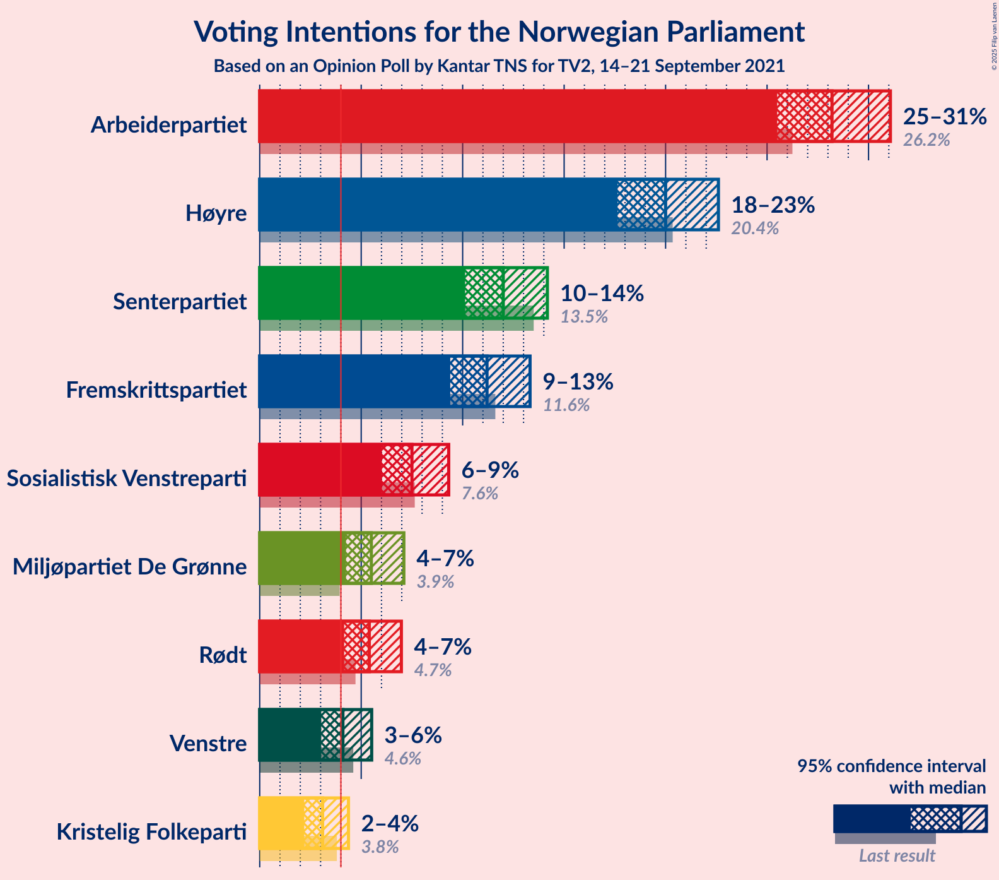

### Confidence Intervals

| Party | Last Result | Poll Result | 80% Confidence Interval | 90% Confidence Interval | 95% Confidence Interval | 99% Confidence Interval |
|:-----:|:-----------:|:-----------:|:-----------------------:|:-----------------------:|:-----------------------:|:-----------------------:|
| Arbeiderpartiet | 26.2% | 28.2% | 26.4–30.1% |25.9–30.6% |25.5–31.1% |24.7–32.0% |
| Høyre | 20.4% | 20.0% | 18.4–21.7% |18.0–22.2% |17.6–22.6% |16.9–23.4% |
| Senterpartiet | 13.5% | 12.0% | 10.8–13.4% |10.4–13.8% |10.1–14.2% |9.6–14.9% |
| Fremskrittspartiet | 11.6% | 11.2% | 10.0–12.6% |9.7–13.0% |9.4–13.3% |8.8–14.0% |
| Sosialistisk Venstreparti | 7.6% | 7.5% | 6.5–8.7% |6.2–9.0% |6.0–9.3% |5.6–9.9% |
| Miljøpartiet De Grønne | 3.9% | 5.5% | 4.7–6.5% |4.4–6.8% |4.3–7.1% |3.9–7.6% |
| Rødt | 4.7% | 5.4% | 4.6–6.4% |4.3–6.7% |4.2–7.0% |3.8–7.5% |
| Venstre | 4.6% | 4.1% | 3.4–5.0% |3.2–5.3% |3.0–5.5% |2.7–6.0% |
| Kristelig Folkeparti | 3.8% | 3.1% | 2.5–3.9% |2.3–4.2% |2.2–4.4% |1.9–4.8% |

*Note:* The poll result column reflects the actual value used in the calculations. Published results may vary slightly, and in addition be rounded to fewer digits.

## Seats

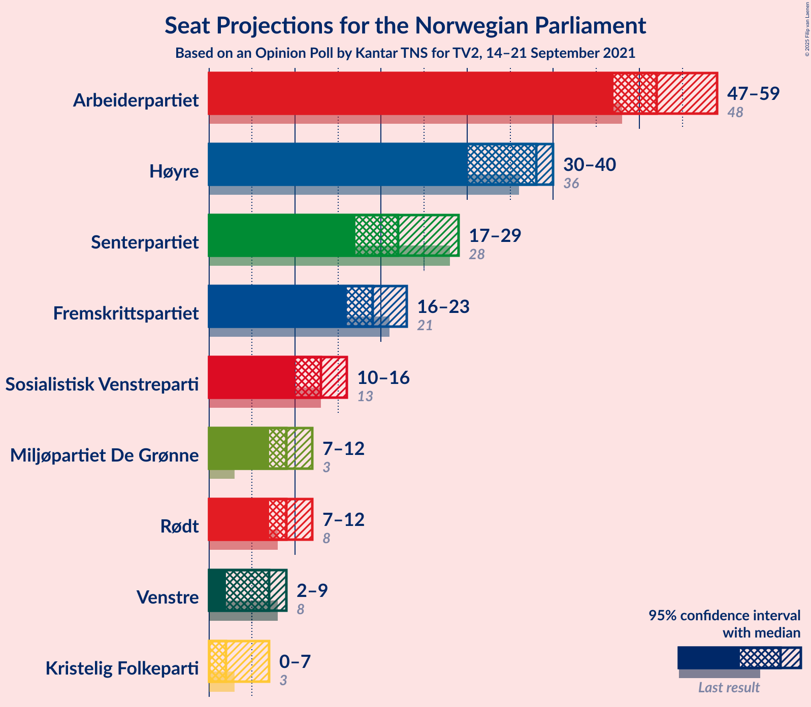

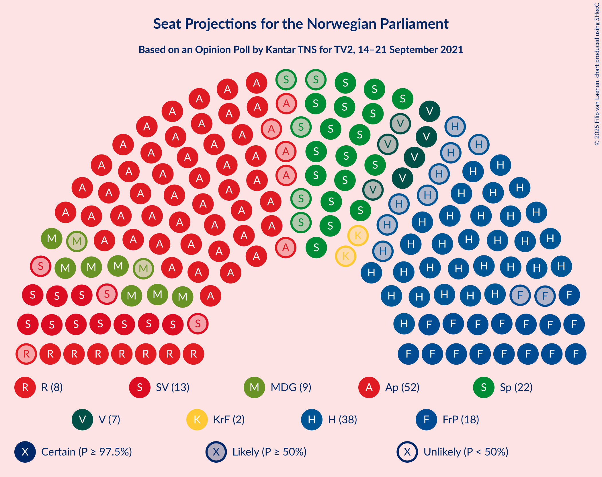

### Confidence Intervals

| Party | Last Result | Median | 80% Confidence Interval | 90% Confidence Interval | 95% Confidence Interval | 99% Confidence Interval |
|:-----:|:-----------:|:------:|:-----------------------:|:-----------------------:|:-----------------------:|:-----------------------:|
| <a href="#arbeiderpartiet">Arbeiderpartiet</a> | 48 | 52 | 49–57 |48–58 |47–59 |46–61 |
| <a href="#høyre">Høyre</a> | 36 | 38 | 31–39 |30–39 |30–40 |29–41 |
| <a href="#senterpartiet">Senterpartiet</a> | 28 | 22 | 18–26 |17–27 |17–29 |16–30 |
| <a href="#fremskrittspartiet">Fremskrittspartiet</a> | 21 | 19 | 17–21 |17–22 |16–23 |15–24 |
| <a href="#sosialistisk-venstreparti">Sosialistisk Venstreparti</a> | 13 | 13 | 11–15 |10–15 |10–16 |9–17 |
| <a href="#miljøpartiet-de-grønne">Miljøpartiet De Grønne</a> | 3 | 9 | 8–11 |7–12 |7–12 |3–13 |
| <a href="#rødt">Rødt</a> | 8 | 9 | 8–11 |7–12 |7–12 |1–13 |
| <a href="#venstre">Venstre</a> | 8 | 7 | 2–8 |2–9 |2–9 |2–10 |
| <a href="#kristelig-folkeparti">Kristelig Folkeparti</a> | 3 | 2 | 1–3 |1–7 |0–7 |0–8 |

### Arbeiderpartiet

*For a full overview of the results for this party, see the [Arbeiderpartiet](party-arbeiderpartiet.html) page.*

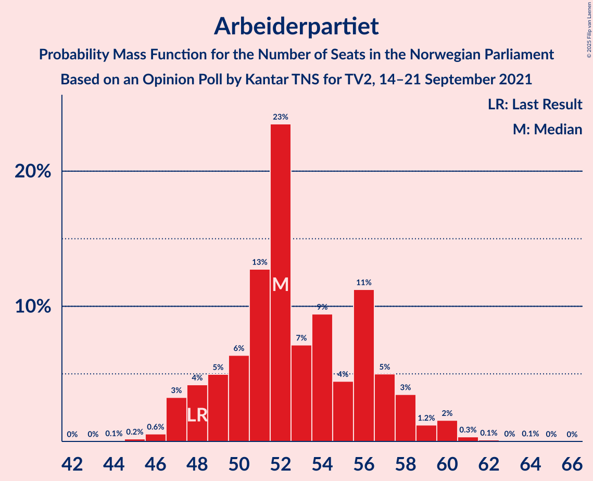

| Number of Seats | Probability | Accumulated | Special Marks |
|:---------------:|:-----------:|:-----------:|:-------------:|
| 44 | 0.1% | 100% |  |
| 45 | 0.2% | 99.9% |  |
| 46 | 0.6% | 99.7% |  |
| 47 | 3% | 99.2% |  |
| 48 | 4% | 96% | Last Result |
| 49 | 5% | 92% |  |
| 50 | 6% | 87% |  |
| 51 | 13% | 80% |  |
| 52 | 23% | 68% | Median |
| 53 | 7% | 44% |  |
| 54 | 9% | 37% |  |
| 55 | 4% | 28% |  |
| 56 | 11% | 23% |  |
| 57 | 5% | 12% |  |
| 58 | 3% | 7% |  |
| 59 | 1.2% | 3% |  |
| 60 | 2% | 2% |  |
| 61 | 0.3% | 0.6% |  |
| 62 | 0.1% | 0.2% |  |
| 63 | 0% | 0.1% |  |
| 64 | 0.1% | 0.1% |  |
| 65 | 0% | 0% |  |

### Høyre

*For a full overview of the results for this party, see the [Høyre](party-høyre.html) page.*

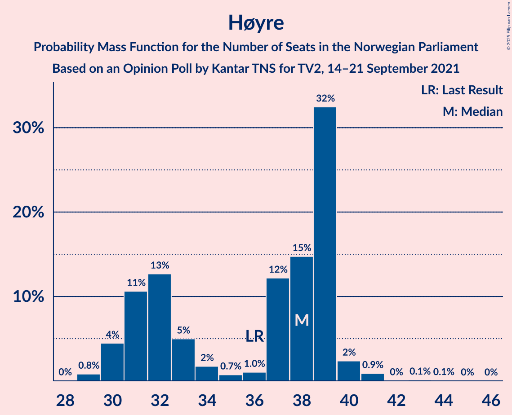

| Number of Seats | Probability | Accumulated | Special Marks |
|:---------------:|:-----------:|:-----------:|:-------------:|
| 28 | 0% | 100% |  |
| 29 | 0.8% | 99.9% |  |
| 30 | 4% | 99.1% |  |
| 31 | 11% | 95% |  |
| 32 | 13% | 84% |  |
| 33 | 5% | 71% |  |
| 34 | 2% | 66% |  |
| 35 | 0.7% | 65% |  |
| 36 | 1.0% | 64% | Last Result |
| 37 | 12% | 63% |  |
| 38 | 15% | 51% | Median |
| 39 | 32% | 36% |  |
| 40 | 2% | 3% |  |
| 41 | 0.9% | 1.1% |  |
| 42 | 0% | 0.2% |  |
| 43 | 0.1% | 0.2% |  |
| 44 | 0.1% | 0.1% |  |
| 45 | 0% | 0% |  |

### Senterpartiet

*For a full overview of the results for this party, see the [Senterpartiet](party-senterpartiet.html) page.*

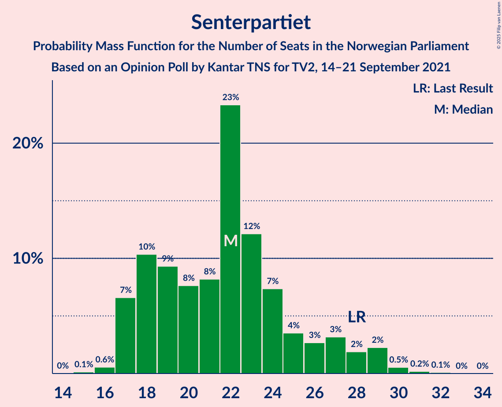

| Number of Seats | Probability | Accumulated | Special Marks |
|:---------------:|:-----------:|:-----------:|:-------------:|
| 15 | 0.1% | 100% |  |
| 16 | 0.6% | 99.8% |  |
| 17 | 7% | 99.3% |  |
| 18 | 10% | 93% |  |
| 19 | 9% | 82% |  |
| 20 | 8% | 73% |  |
| 21 | 8% | 65% |  |
| 22 | 23% | 57% | Median |
| 23 | 12% | 34% |  |
| 24 | 7% | 22% |  |
| 25 | 4% | 14% |  |
| 26 | 3% | 11% |  |
| 27 | 3% | 8% |  |
| 28 | 2% | 5% | Last Result |
| 29 | 2% | 3% |  |
| 30 | 0.5% | 0.8% |  |
| 31 | 0.2% | 0.3% |  |
| 32 | 0.1% | 0.1% |  |
| 33 | 0% | 0% |  |

### Fremskrittspartiet

*For a full overview of the results for this party, see the [Fremskrittspartiet](party-fremskrittspartiet.html) page.*

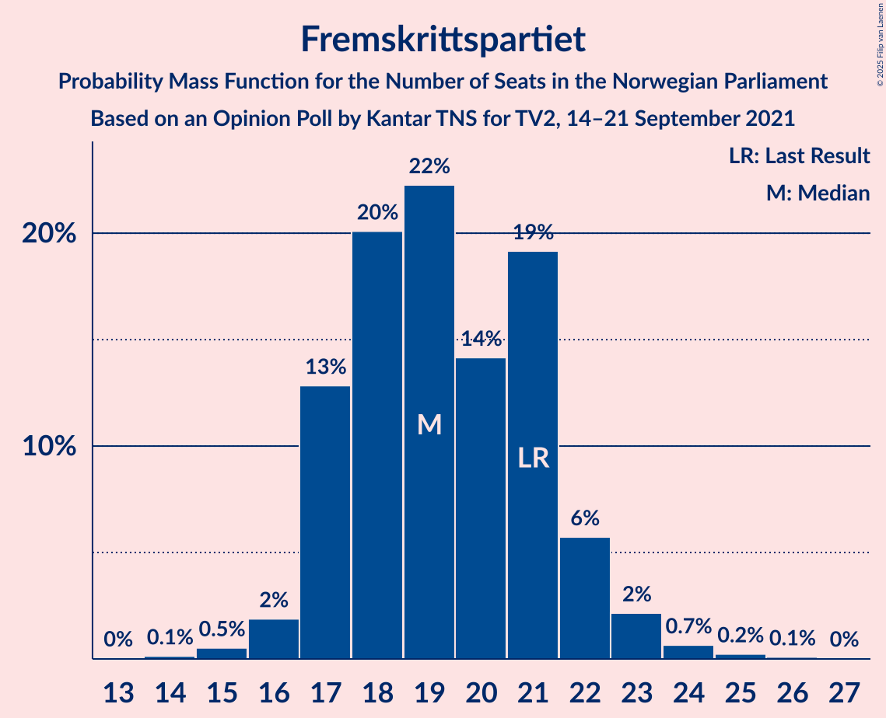

| Number of Seats | Probability | Accumulated | Special Marks |
|:---------------:|:-----------:|:-----------:|:-------------:|
| 14 | 0.1% | 100% |  |
| 15 | 0.5% | 99.8% |  |
| 16 | 2% | 99.3% |  |
| 17 | 13% | 97% |  |
| 18 | 20% | 85% |  |
| 19 | 22% | 64% | Median |
| 20 | 14% | 42% |  |
| 21 | 19% | 28% | Last Result |
| 22 | 6% | 9% |  |
| 23 | 2% | 3% |  |
| 24 | 0.7% | 1.0% |  |
| 25 | 0.2% | 0.4% |  |
| 26 | 0.1% | 0.1% |  |
| 27 | 0% | 0% |  |

### Sosialistisk Venstreparti

*For a full overview of the results for this party, see the [Sosialistisk Venstreparti](party-sosialistiskvenstreparti.html) page.*

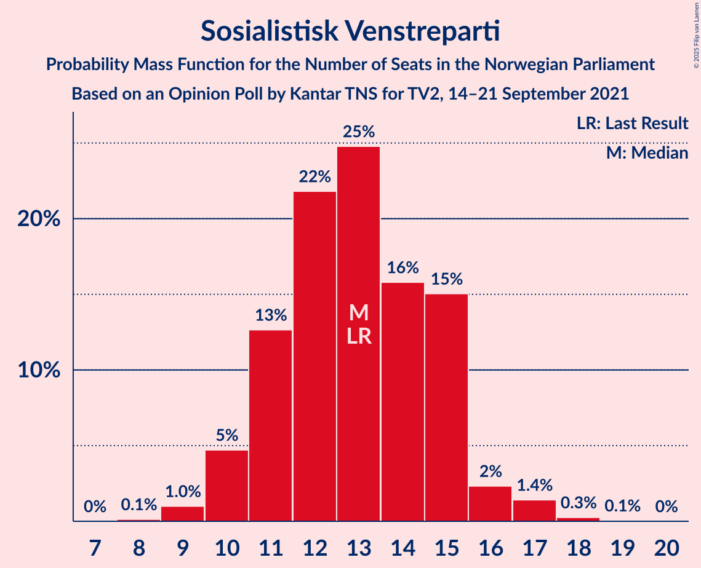

| Number of Seats | Probability | Accumulated | Special Marks |
|:---------------:|:-----------:|:-----------:|:-------------:|
| 8 | 0.1% | 100% |  |
| 9 | 1.0% | 99.9% |  |
| 10 | 5% | 98.9% |  |
| 11 | 13% | 94% |  |
| 12 | 22% | 81% |  |
| 13 | 25% | 60% | Last Result, Median |
| 14 | 16% | 35% |  |
| 15 | 15% | 19% |  |
| 16 | 2% | 4% |  |
| 17 | 1.4% | 2% |  |
| 18 | 0.3% | 0.3% |  |
| 19 | 0.1% | 0.1% |  |
| 20 | 0% | 0% |  |

### Miljøpartiet De Grønne

*For a full overview of the results for this party, see the [Miljøpartiet De Grønne](party-miljøpartietdegrønne.html) page.*

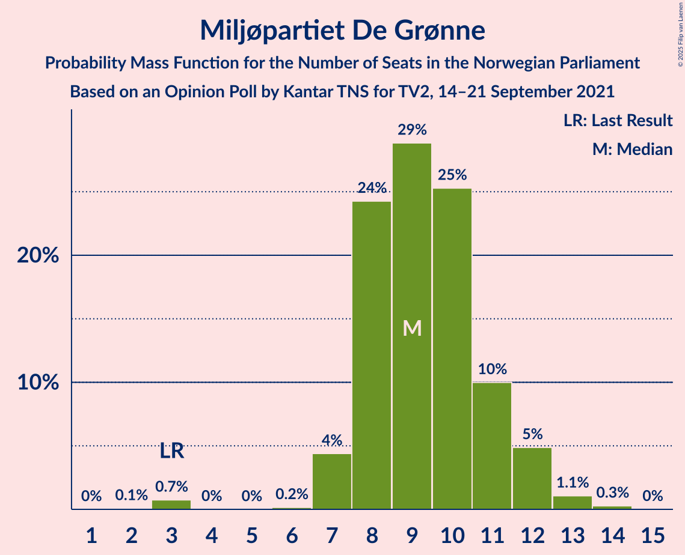

| Number of Seats | Probability | Accumulated | Special Marks |
|:---------------:|:-----------:|:-----------:|:-------------:|
| 2 | 0.1% | 100% |  |
| 3 | 0.7% | 99.9% | Last Result |
| 4 | 0% | 99.2% |  |
| 5 | 0% | 99.2% |  |
| 6 | 0.2% | 99.2% |  |
| 7 | 4% | 99.0% |  |
| 8 | 24% | 95% |  |
| 9 | 29% | 70% | Median |
| 10 | 25% | 42% |  |
| 11 | 10% | 16% |  |
| 12 | 5% | 6% |  |
| 13 | 1.1% | 1.4% |  |
| 14 | 0.3% | 0.3% |  |
| 15 | 0% | 0% |  |

### Rødt

*For a full overview of the results for this party, see the [Rødt](party-rødt.html) page.*

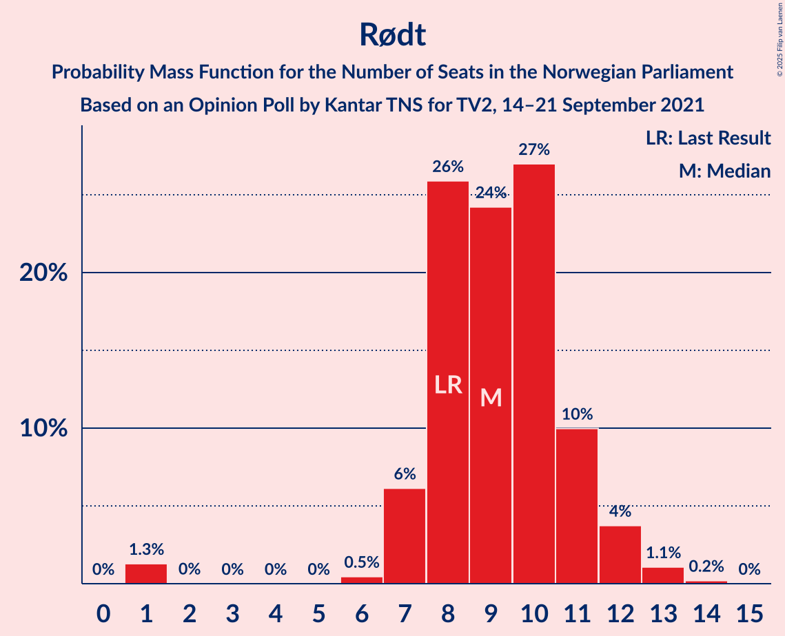

| Number of Seats | Probability | Accumulated | Special Marks |
|:---------------:|:-----------:|:-----------:|:-------------:|
| 1 | 1.3% | 100% |  |
| 2 | 0% | 98.7% |  |
| 3 | 0% | 98.7% |  |
| 4 | 0% | 98.7% |  |
| 5 | 0% | 98.7% |  |
| 6 | 0.5% | 98.7% |  |
| 7 | 6% | 98% |  |
| 8 | 26% | 92% | Last Result |
| 9 | 24% | 66% | Median |
| 10 | 27% | 42% |  |
| 11 | 10% | 15% |  |
| 12 | 4% | 5% |  |
| 13 | 1.1% | 1.3% |  |
| 14 | 0.2% | 0.2% |  |
| 15 | 0% | 0% |  |

### Venstre

*For a full overview of the results for this party, see the [Venstre](party-venstre.html) page.*

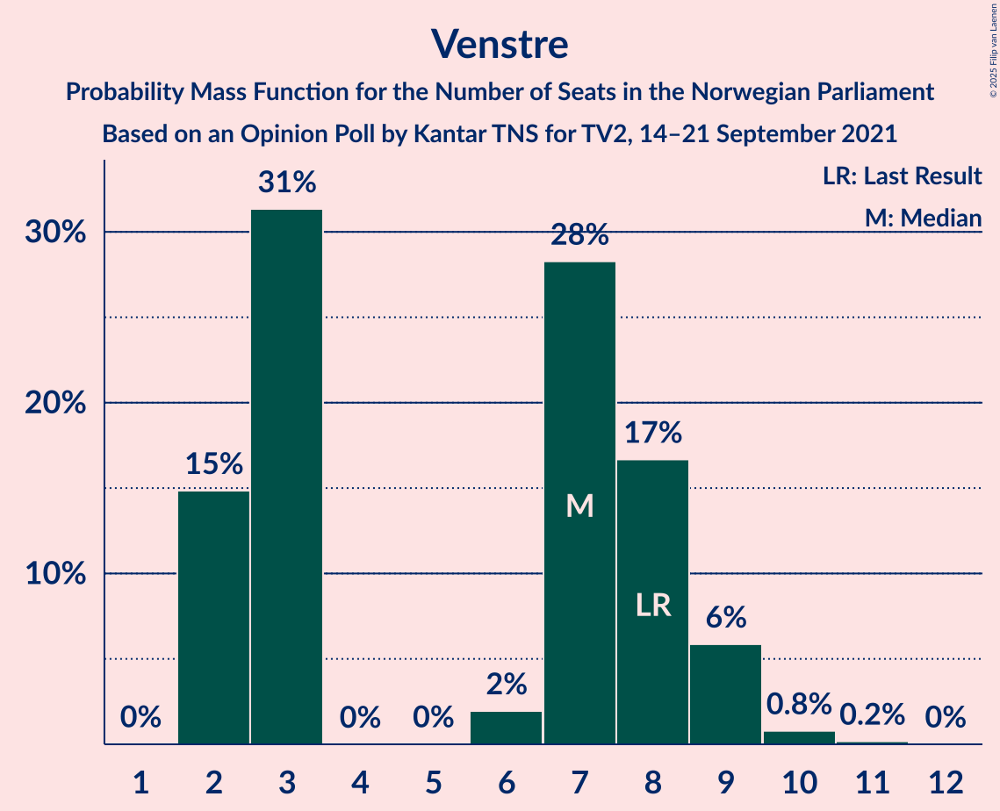

| Number of Seats | Probability | Accumulated | Special Marks |
|:---------------:|:-----------:|:-----------:|:-------------:|
| 2 | 15% | 100% |  |
| 3 | 31% | 85% |  |
| 4 | 0% | 54% |  |
| 5 | 0% | 54% |  |
| 6 | 2% | 54% |  |
| 7 | 28% | 52% | Median |
| 8 | 17% | 24% | Last Result |
| 9 | 6% | 7% |  |
| 10 | 0.8% | 1.0% |  |
| 11 | 0.2% | 0.2% |  |
| 12 | 0% | 0% |  |

### Kristelig Folkeparti

*For a full overview of the results for this party, see the [Kristelig Folkeparti](party-kristeligfolkeparti.html) page.*

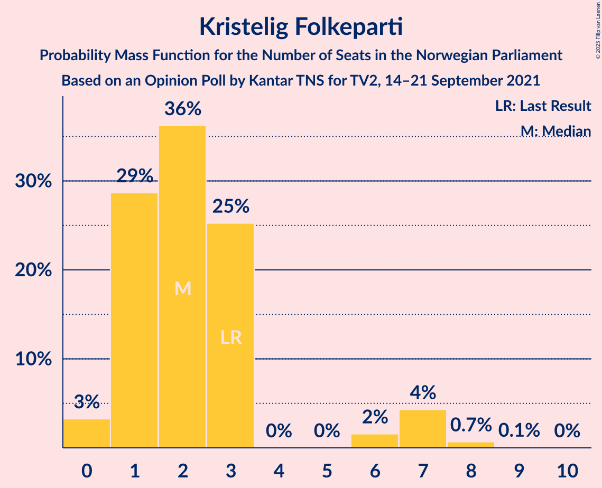

| Number of Seats | Probability | Accumulated | Special Marks |
|:---------------:|:-----------:|:-----------:|:-------------:|
| 0 | 3% | 100% |  |
| 1 | 29% | 97% |  |
| 2 | 36% | 68% | Median |
| 3 | 25% | 32% | Last Result |
| 4 | 0% | 7% |  |
| 5 | 0% | 7% |  |
| 6 | 2% | 7% |  |
| 7 | 4% | 5% |  |
| 8 | 0.7% | 0.8% |  |
| 9 | 0.1% | 0.1% |  |
| 10 | 0% | 0% |  |

## Coalitions

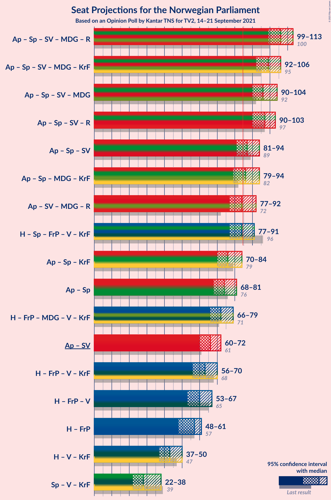

### Confidence Intervals

| Coalition | Last Result | Median | Majority? | 80% Confidence Interval | 90% Confidence Interval | 95% Confidence Interval | 99% Confidence Interval |
|:---------:|:-----------:|:------:|:---------:|:-----------------------:|:-----------------------:|:-----------------------:|:-----------------------:|
| Arbeiderpartiet – Senterpartiet – Sosialistisk Venstreparti – Miljøpartiet De Grønne – Rødt | 100 | 106 | 100% | 101–111 | 100–112 | 99–113 | 96–115 |
| Arbeiderpartiet – Senterpartiet – Sosialistisk Venstreparti – Miljøpartiet De Grønne – Kristelig Folkeparti | 95 | 99 | 100% | 94–104 | 94–105 | 92–106 | 90–108 |
| Arbeiderpartiet – Senterpartiet – Sosialistisk Venstreparti – Miljøpartiet De Grønne | 92 | 96 | 100% | 92–102 | 91–103 | 90–104 | 88–105 |
| Arbeiderpartiet – Senterpartiet – Sosialistisk Venstreparti – Rødt | 97 | 97 | 100% | 92–101 | 91–103 | 90–103 | 87–104 |
| Arbeiderpartiet – Senterpartiet – Sosialistisk Venstreparti | 89 | 87 | 80% | 83–92 | 82–93 | 81–94 | 79–95 |
| Arbeiderpartiet – Senterpartiet – Miljøpartiet De Grønne – Kristelig Folkeparti | 82 | 86 | 63% | 81–91 | 80–92 | 79–94 | 77–96 |
| Arbeiderpartiet – Sosialistisk Venstreparti – Miljøpartiet De Grønne – Rødt | 72 | 84 | 46% | 80–89 | 78–90 | 77–92 | 75–93 |
| Høyre – Senterpartiet – Fremskrittspartiet – Venstre – Kristelig Folkeparti | 96 | 84 | 50% | 80–89 | 79–90 | 77–91 | 75–94 |
| Arbeiderpartiet – Senterpartiet – Kristelig Folkeparti | 79 | 76 | 1.3% | 72–82 | 71–83 | 70–84 | 69–86 |
| Arbeiderpartiet – Senterpartiet | 76 | 74 | 0.1% | 70–79 | 69–80 | 68–81 | 66–82 |
| Høyre – Fremskrittspartiet – Miljøpartiet De Grønne – Venstre – Kristelig Folkeparti | 71 | 72 | 0% | 68–77 | 66–77 | 66–79 | 64–82 |
| Arbeiderpartiet – Sosialistisk Venstreparti | 61 | 66 | 0% | 62–70 | 61–70 | 60–72 | 58–73 |
| Høyre – Fremskrittspartiet – Venstre – Kristelig Folkeparti | 68 | 63 | 0% | 58–67 | 57–68 | 56–70 | 54–73 |
| Høyre – Fremskrittspartiet – Venstre | 65 | 60 | 0% | 56–65 | 55–66 | 53–67 | 51–69 |
| Høyre – Fremskrittspartiet | 57 | 57 | 0% | 49–60 | 48–60 | 48–61 | 47–63 |
| Høyre – Venstre – Kristelig Folkeparti | 47 | 43 | 0% | 40–48 | 38–49 | 37–50 | 35–52 |
| Senterpartiet – Venstre – Kristelig Folkeparti | 39 | 28 | 0% | 24–35 | 23–37 | 22–38 | 21–40 |

### Arbeiderpartiet – Senterpartiet – Sosialistisk Venstreparti – Miljøpartiet De Grønne – Rødt

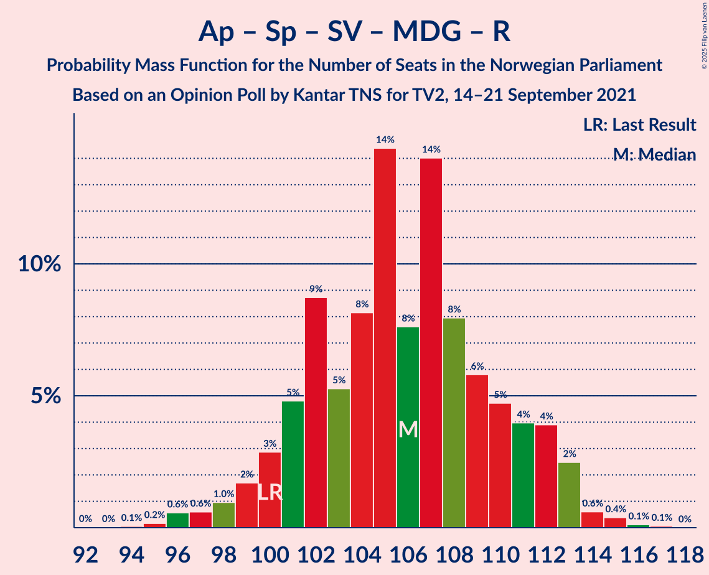

| Number of Seats | Probability | Accumulated | Special Marks |
|:---------------:|:-----------:|:-----------:|:-------------:|
| 94 | 0.1% | 100% |  |
| 95 | 0.2% | 99.9% |  |
| 96 | 0.6% | 99.7% |  |
| 97 | 0.6% | 99.2% |  |
| 98 | 1.0% | 98.6% |  |
| 99 | 2% | 98% |  |
| 100 | 3% | 96% | Last Result |
| 101 | 5% | 93% |  |
| 102 | 9% | 88% |  |
| 103 | 5% | 79% |  |
| 104 | 8% | 74% |  |
| 105 | 14% | 66% | Median |
| 106 | 8% | 52% |  |
| 107 | 14% | 44% |  |
| 108 | 8% | 30% |  |
| 109 | 6% | 22% |  |
| 110 | 5% | 16% |  |
| 111 | 4% | 12% |  |
| 112 | 4% | 8% |  |
| 113 | 2% | 4% |  |
| 114 | 0.6% | 1.2% |  |
| 115 | 0.4% | 0.6% |  |
| 116 | 0.1% | 0.2% |  |
| 117 | 0.1% | 0.1% |  |
| 118 | 0% | 0% |  |

### Arbeiderpartiet – Senterpartiet – Sosialistisk Venstreparti – Miljøpartiet De Grønne – Kristelig Folkeparti

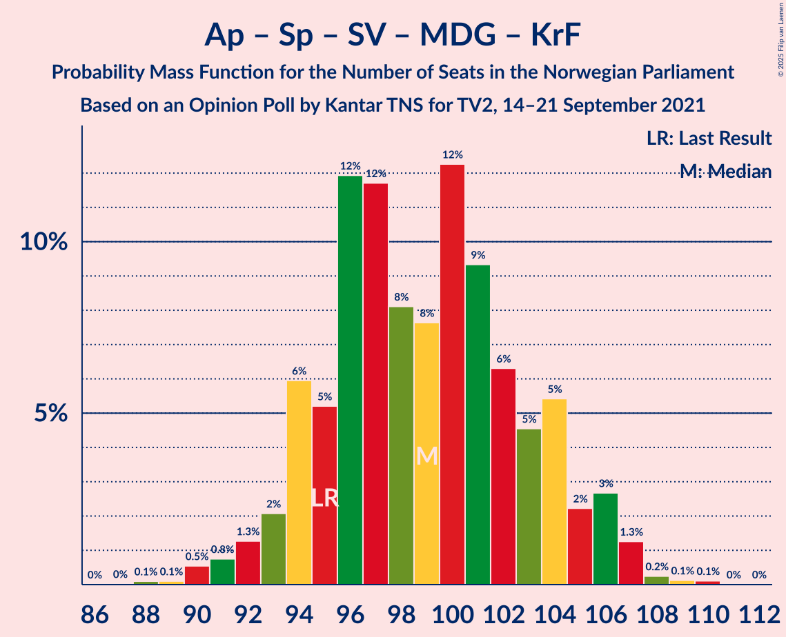

| Number of Seats | Probability | Accumulated | Special Marks |
|:---------------:|:-----------:|:-----------:|:-------------:|
| 88 | 0.1% | 100% |  |
| 89 | 0.1% | 99.9% |  |
| 90 | 0.5% | 99.8% |  |
| 91 | 0.8% | 99.2% |  |
| 92 | 1.3% | 98% |  |
| 93 | 2% | 97% |  |
| 94 | 6% | 95% |  |
| 95 | 5% | 89% | Last Result |
| 96 | 12% | 84% |  |
| 97 | 12% | 72% |  |
| 98 | 8% | 60% | Median |
| 99 | 8% | 52% |  |
| 100 | 12% | 45% |  |
| 101 | 9% | 32% |  |
| 102 | 6% | 23% |  |
| 103 | 5% | 17% |  |
| 104 | 5% | 12% |  |
| 105 | 2% | 7% |  |
| 106 | 3% | 4% |  |
| 107 | 1.3% | 2% |  |
| 108 | 0.2% | 0.5% |  |
| 109 | 0.1% | 0.3% |  |
| 110 | 0.1% | 0.1% |  |
| 111 | 0% | 0% |  |

### Arbeiderpartiet – Senterpartiet – Sosialistisk Venstreparti – Miljøpartiet De Grønne

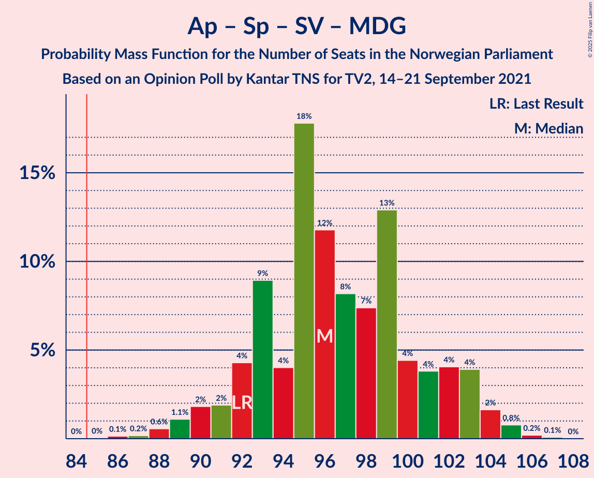

| Number of Seats | Probability | Accumulated | Special Marks |
|:---------------:|:-----------:|:-----------:|:-------------:|
| 85 | 0% | 100% | Majority |
| 86 | 0.1% | 99.9% |  |
| 87 | 0.2% | 99.8% |  |
| 88 | 0.6% | 99.6% |  |
| 89 | 1.1% | 99.0% |  |
| 90 | 2% | 98% |  |
| 91 | 2% | 96% |  |
| 92 | 4% | 94% | Last Result |
| 93 | 9% | 90% |  |
| 94 | 4% | 81% |  |
| 95 | 18% | 77% |  |
| 96 | 12% | 59% | Median |
| 97 | 8% | 47% |  |
| 98 | 7% | 39% |  |
| 99 | 13% | 32% |  |
| 100 | 4% | 19% |  |
| 101 | 4% | 15% |  |
| 102 | 4% | 11% |  |
| 103 | 4% | 7% |  |
| 104 | 2% | 3% |  |
| 105 | 0.8% | 1.1% |  |
| 106 | 0.2% | 0.3% |  |
| 107 | 0.1% | 0.1% |  |
| 108 | 0% | 0% |  |

### Arbeiderpartiet – Senterpartiet – Sosialistisk Venstreparti – Rødt

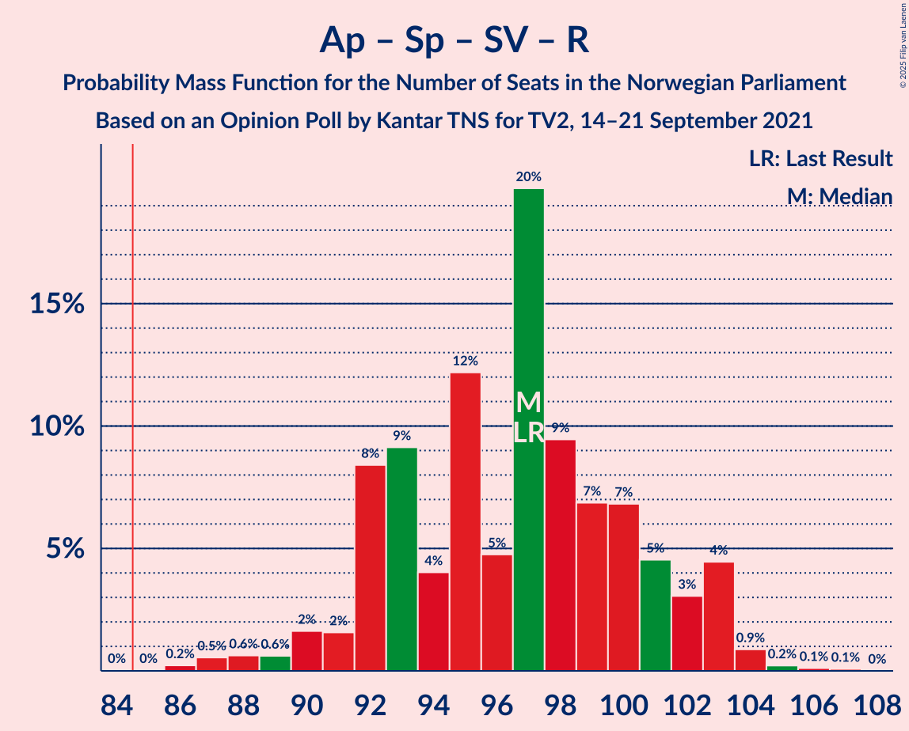

| Number of Seats | Probability | Accumulated | Special Marks |
|:---------------:|:-----------:|:-----------:|:-------------:|
| 85 | 0% | 100% | Majority |
| 86 | 0.2% | 99.9% |  |
| 87 | 0.5% | 99.7% |  |
| 88 | 0.6% | 99.2% |  |
| 89 | 0.6% | 98.5% |  |
| 90 | 2% | 98% |  |
| 91 | 2% | 96% |  |
| 92 | 8% | 95% |  |
| 93 | 9% | 86% |  |
| 94 | 4% | 77% |  |
| 95 | 12% | 73% |  |
| 96 | 5% | 61% | Median |
| 97 | 20% | 56% | Last Result |
| 98 | 9% | 36% |  |
| 99 | 7% | 27% |  |
| 100 | 7% | 20% |  |
| 101 | 5% | 13% |  |
| 102 | 3% | 9% |  |
| 103 | 4% | 6% |  |
| 104 | 0.9% | 1.3% |  |
| 105 | 0.2% | 0.4% |  |
| 106 | 0.1% | 0.2% |  |
| 107 | 0.1% | 0.1% |  |
| 108 | 0% | 0% |  |

### Arbeiderpartiet – Senterpartiet – Sosialistisk Venstreparti

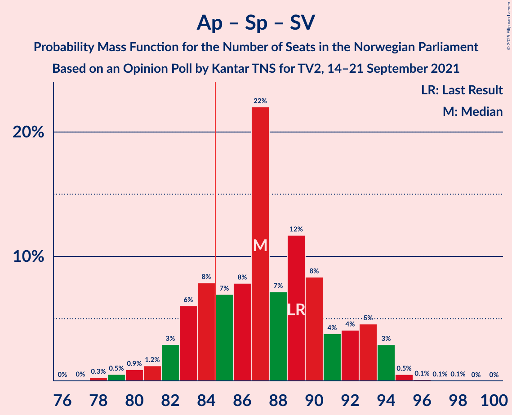

| Number of Seats | Probability | Accumulated | Special Marks |
|:---------------:|:-----------:|:-----------:|:-------------:|
| 77 | 0% | 100% |  |
| 78 | 0.3% | 99.9% |  |
| 79 | 0.5% | 99.6% |  |
| 80 | 0.9% | 99.1% |  |
| 81 | 1.2% | 98% |  |
| 82 | 3% | 97% |  |
| 83 | 6% | 94% |  |
| 84 | 8% | 88% |  |
| 85 | 7% | 80% | Majority |
| 86 | 8% | 73% |  |
| 87 | 22% | 65% | Median |
| 88 | 7% | 43% |  |
| 89 | 12% | 36% | Last Result |
| 90 | 8% | 24% |  |
| 91 | 4% | 16% |  |
| 92 | 4% | 12% |  |
| 93 | 5% | 8% |  |
| 94 | 3% | 4% |  |
| 95 | 0.5% | 0.7% |  |
| 96 | 0.1% | 0.2% |  |
| 97 | 0.1% | 0.1% |  |
| 98 | 0.1% | 0.1% |  |
| 99 | 0% | 0% |  |

### Arbeiderpartiet – Senterpartiet – Miljøpartiet De Grønne – Kristelig Folkeparti

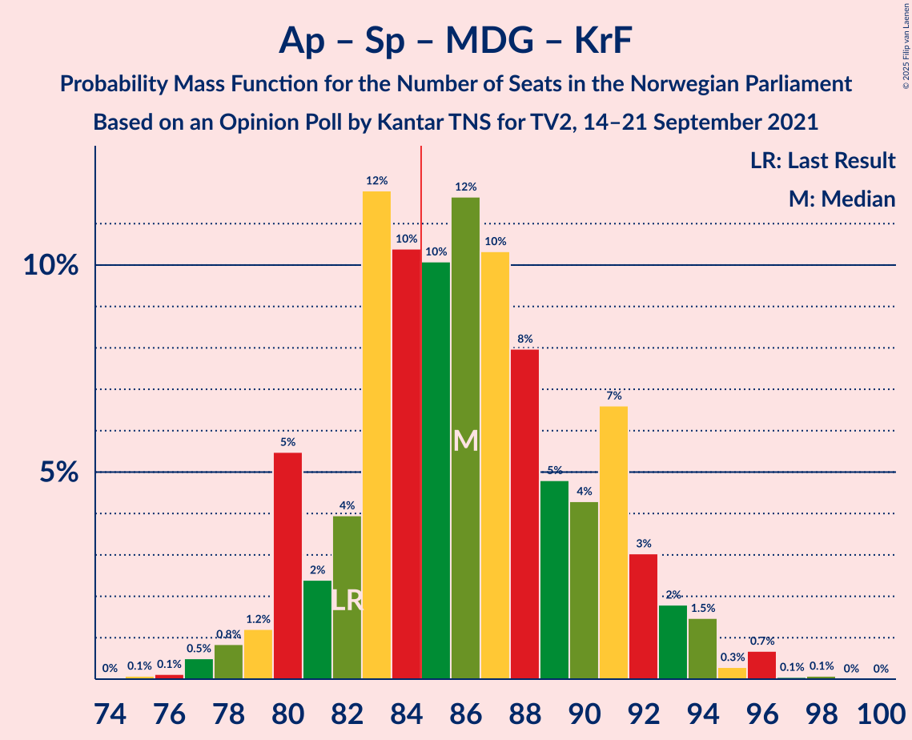

| Number of Seats | Probability | Accumulated | Special Marks |
|:---------------:|:-----------:|:-----------:|:-------------:|
| 75 | 0.1% | 100% |  |
| 76 | 0.1% | 99.9% |  |
| 77 | 0.5% | 99.8% |  |
| 78 | 0.8% | 99.3% |  |
| 79 | 1.2% | 98% |  |
| 80 | 5% | 97% |  |
| 81 | 2% | 92% |  |
| 82 | 4% | 89% | Last Result |
| 83 | 12% | 85% |  |
| 84 | 10% | 74% |  |
| 85 | 10% | 63% | Median, Majority |
| 86 | 12% | 53% |  |
| 87 | 10% | 41% |  |
| 88 | 8% | 31% |  |
| 89 | 5% | 23% |  |
| 90 | 4% | 18% |  |
| 91 | 7% | 14% |  |
| 92 | 3% | 7% |  |
| 93 | 2% | 4% |  |
| 94 | 1.5% | 3% |  |
| 95 | 0.3% | 1.1% |  |
| 96 | 0.7% | 0.8% |  |
| 97 | 0.1% | 0.2% |  |
| 98 | 0.1% | 0.1% |  |
| 99 | 0% | 0% |  |

### Arbeiderpartiet – Sosialistisk Venstreparti – Miljøpartiet De Grønne – Rødt

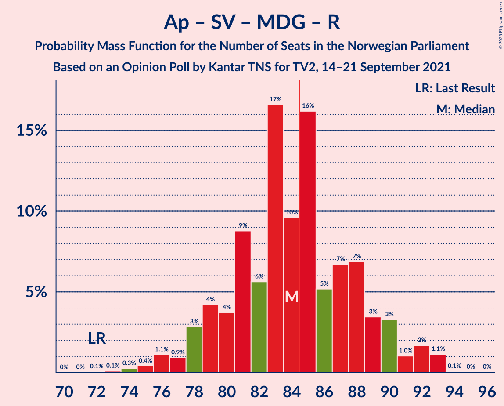

| Number of Seats | Probability | Accumulated | Special Marks |
|:---------------:|:-----------:|:-----------:|:-------------:|
| 72 | 0.1% | 100% | Last Result |
| 73 | 0.1% | 99.9% |  |
| 74 | 0.3% | 99.8% |  |
| 75 | 0.4% | 99.5% |  |
| 76 | 1.1% | 99.1% |  |
| 77 | 0.9% | 98% |  |
| 78 | 3% | 97% |  |
| 79 | 4% | 94% |  |
| 80 | 4% | 90% |  |
| 81 | 9% | 86% |  |
| 82 | 6% | 78% |  |
| 83 | 17% | 72% | Median |
| 84 | 10% | 55% |  |
| 85 | 16% | 46% | Majority |
| 86 | 5% | 30% |  |
| 87 | 7% | 24% |  |
| 88 | 7% | 18% |  |
| 89 | 3% | 11% |  |
| 90 | 3% | 7% |  |
| 91 | 1.0% | 4% |  |
| 92 | 2% | 3% |  |
| 93 | 1.1% | 1.3% |  |
| 94 | 0.1% | 0.2% |  |
| 95 | 0% | 0.1% |  |
| 96 | 0% | 0% |  |

### Høyre – Senterpartiet – Fremskrittspartiet – Venstre – Kristelig Folkeparti

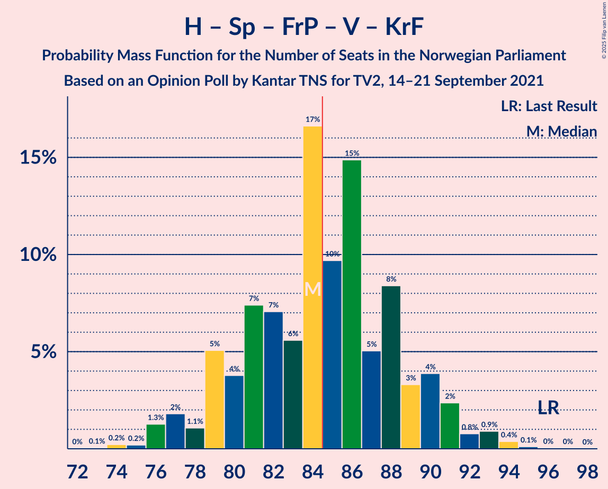

| Number of Seats | Probability | Accumulated | Special Marks |
|:---------------:|:-----------:|:-----------:|:-------------:|
| 73 | 0.1% | 100% |  |
| 74 | 0.2% | 99.9% |  |
| 75 | 0.2% | 99.7% |  |
| 76 | 1.3% | 99.5% |  |
| 77 | 2% | 98% |  |
| 78 | 1.1% | 96% |  |
| 79 | 5% | 95% |  |
| 80 | 4% | 90% |  |
| 81 | 7% | 86% |  |
| 82 | 7% | 79% |  |
| 83 | 6% | 72% |  |
| 84 | 17% | 66% |  |
| 85 | 10% | 50% | Majority |
| 86 | 15% | 40% |  |
| 87 | 5% | 25% |  |
| 88 | 8% | 20% | Median |
| 89 | 3% | 12% |  |
| 90 | 4% | 9% |  |
| 91 | 2% | 5% |  |
| 92 | 0.8% | 2% |  |
| 93 | 0.9% | 1.5% |  |
| 94 | 0.4% | 0.6% |  |
| 95 | 0.1% | 0.2% |  |
| 96 | 0% | 0.1% | Last Result |
| 97 | 0% | 0% |  |

### Arbeiderpartiet – Senterpartiet – Kristelig Folkeparti

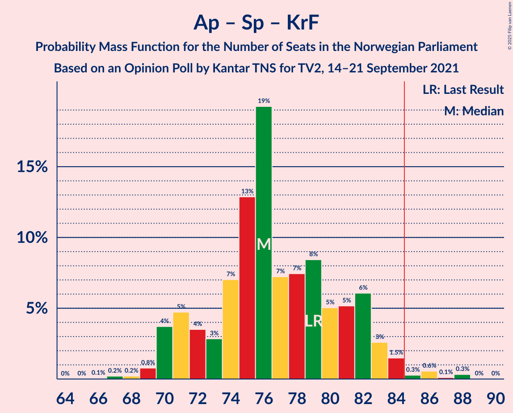

| Number of Seats | Probability | Accumulated | Special Marks |
|:---------------:|:-----------:|:-----------:|:-------------:|
| 66 | 0.1% | 100% |  |
| 67 | 0.2% | 99.9% |  |
| 68 | 0.2% | 99.7% |  |
| 69 | 0.8% | 99.5% |  |
| 70 | 4% | 98.7% |  |
| 71 | 5% | 95% |  |
| 72 | 4% | 90% |  |
| 73 | 3% | 87% |  |
| 74 | 7% | 84% |  |
| 75 | 13% | 77% |  |
| 76 | 19% | 64% | Median |
| 77 | 7% | 45% |  |
| 78 | 7% | 38% |  |
| 79 | 8% | 30% | Last Result |
| 80 | 5% | 22% |  |
| 81 | 5% | 17% |  |
| 82 | 6% | 11% |  |
| 83 | 3% | 5% |  |
| 84 | 1.5% | 3% |  |
| 85 | 0.3% | 1.3% | Majority |
| 86 | 0.6% | 1.0% |  |
| 87 | 0.1% | 0.5% |  |
| 88 | 0.3% | 0.4% |  |
| 89 | 0% | 0% |  |

### Arbeiderpartiet – Senterpartiet

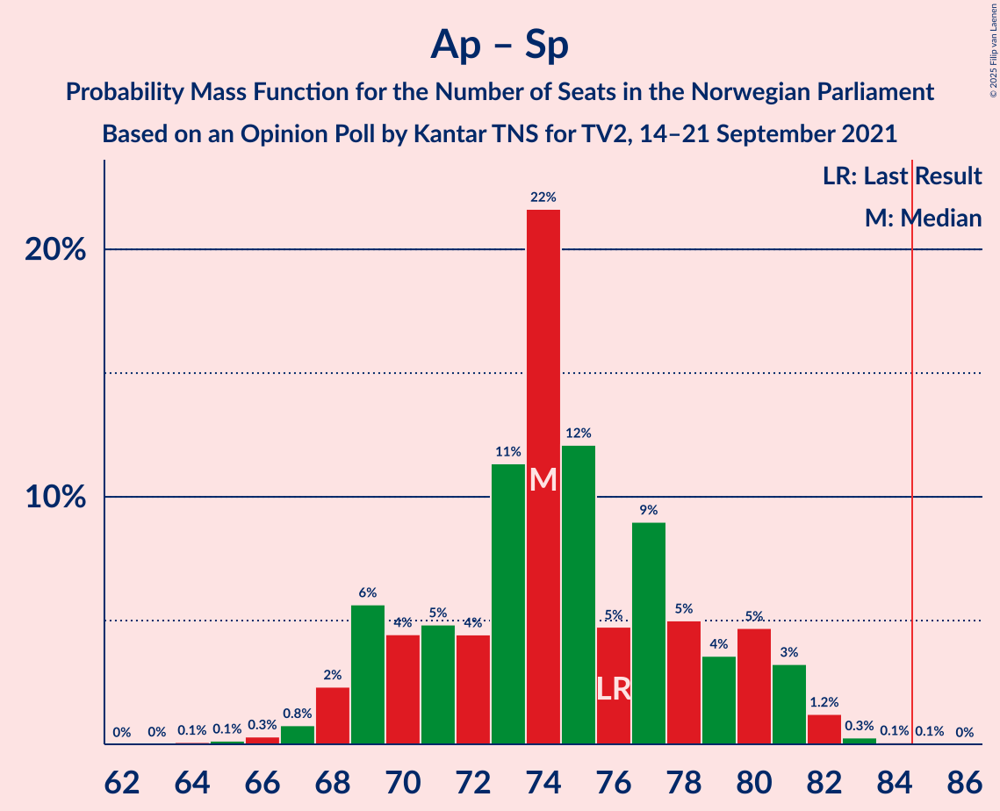

| Number of Seats | Probability | Accumulated | Special Marks |
|:---------------:|:-----------:|:-----------:|:-------------:|
| 64 | 0.1% | 100% |  |
| 65 | 0.1% | 99.9% |  |
| 66 | 0.3% | 99.7% |  |
| 67 | 0.8% | 99.4% |  |
| 68 | 2% | 98.7% |  |
| 69 | 6% | 96% |  |
| 70 | 4% | 91% |  |
| 71 | 5% | 86% |  |
| 72 | 4% | 81% |  |
| 73 | 11% | 77% |  |
| 74 | 22% | 66% | Median |
| 75 | 12% | 44% |  |
| 76 | 5% | 32% | Last Result |
| 77 | 9% | 27% |  |
| 78 | 5% | 18% |  |
| 79 | 4% | 13% |  |
| 80 | 5% | 10% |  |
| 81 | 3% | 5% |  |
| 82 | 1.2% | 2% |  |
| 83 | 0.3% | 0.4% |  |
| 84 | 0.1% | 0.1% |  |
| 85 | 0.1% | 0.1% | Majority |
| 86 | 0% | 0% |  |

### Høyre – Fremskrittspartiet – Miljøpartiet De Grønne – Venstre – Kristelig Folkeparti

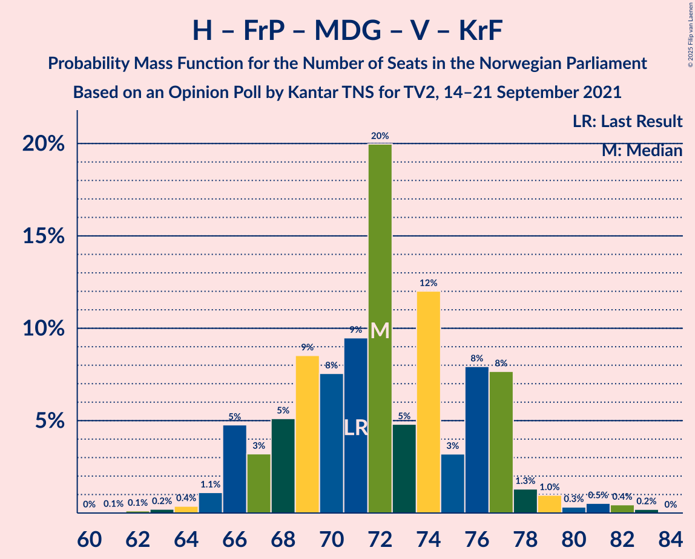

| Number of Seats | Probability | Accumulated | Special Marks |
|:---------------:|:-----------:|:-----------:|:-------------:|
| 61 | 0.1% | 100% |  |
| 62 | 0.1% | 99.9% |  |
| 63 | 0.2% | 99.8% |  |
| 64 | 0.4% | 99.6% |  |
| 65 | 1.1% | 99.2% |  |
| 66 | 5% | 98% |  |
| 67 | 3% | 93% |  |
| 68 | 5% | 90% |  |
| 69 | 9% | 85% |  |
| 70 | 8% | 76% |  |
| 71 | 9% | 69% | Last Result |
| 72 | 20% | 59% |  |
| 73 | 5% | 39% |  |
| 74 | 12% | 35% |  |
| 75 | 3% | 23% | Median |
| 76 | 8% | 19% |  |
| 77 | 8% | 11% |  |
| 78 | 1.3% | 4% |  |
| 79 | 1.0% | 3% |  |
| 80 | 0.3% | 2% |  |
| 81 | 0.5% | 1.2% |  |
| 82 | 0.4% | 0.7% |  |
| 83 | 0.2% | 0.2% |  |
| 84 | 0% | 0% |  |

### Arbeiderpartiet – Sosialistisk Venstreparti

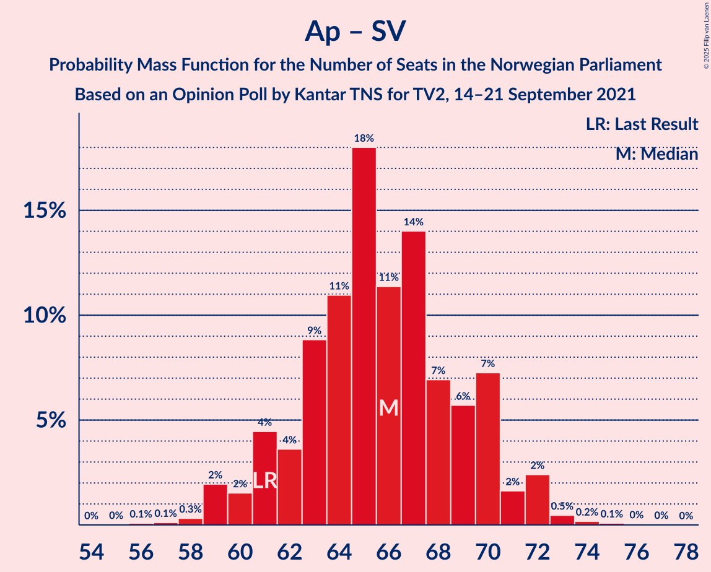

| Number of Seats | Probability | Accumulated | Special Marks |
|:---------------:|:-----------:|:-----------:|:-------------:|
| 56 | 0.1% | 100% |  |
| 57 | 0.1% | 99.9% |  |
| 58 | 0.3% | 99.8% |  |
| 59 | 2% | 99.5% |  |
| 60 | 2% | 98% |  |
| 61 | 4% | 96% | Last Result |
| 62 | 4% | 92% |  |
| 63 | 9% | 88% |  |
| 64 | 11% | 79% |  |
| 65 | 18% | 68% | Median |
| 66 | 11% | 50% |  |
| 67 | 14% | 39% |  |
| 68 | 7% | 25% |  |
| 69 | 6% | 18% |  |
| 70 | 7% | 12% |  |
| 71 | 2% | 5% |  |
| 72 | 2% | 3% |  |
| 73 | 0.5% | 0.8% |  |
| 74 | 0.2% | 0.3% |  |
| 75 | 0.1% | 0.2% |  |
| 76 | 0% | 0.1% |  |
| 77 | 0% | 0% |  |

### Høyre – Fremskrittspartiet – Venstre – Kristelig Folkeparti

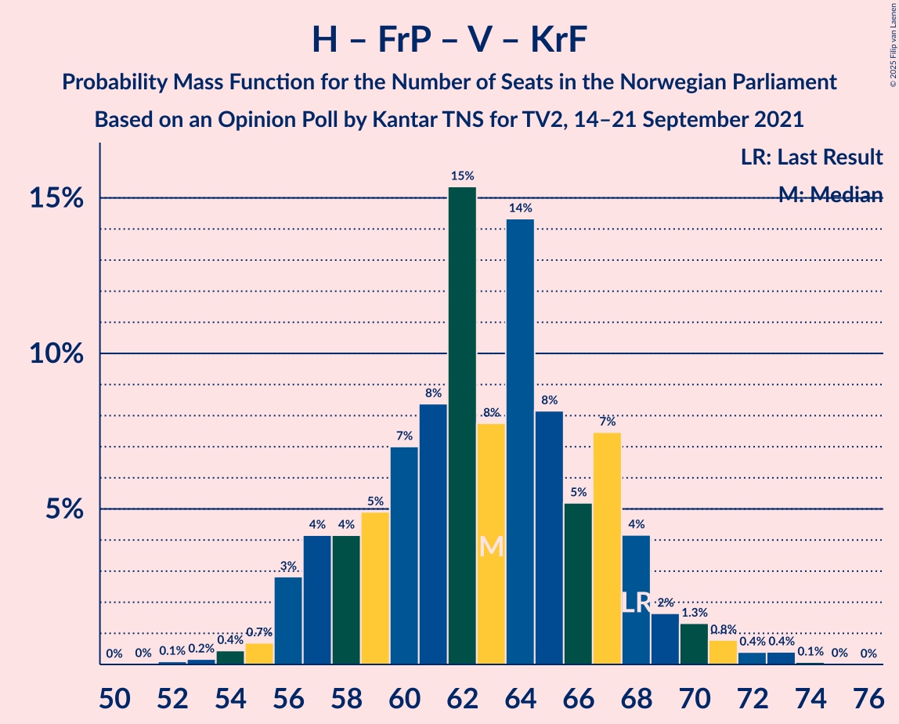

| Number of Seats | Probability | Accumulated | Special Marks |
|:---------------:|:-----------:|:-----------:|:-------------:|
| 52 | 0.1% | 100% |  |
| 53 | 0.2% | 99.9% |  |
| 54 | 0.4% | 99.7% |  |
| 55 | 0.7% | 99.2% |  |
| 56 | 3% | 98.6% |  |
| 57 | 4% | 96% |  |
| 58 | 4% | 92% |  |
| 59 | 5% | 87% |  |
| 60 | 7% | 83% |  |
| 61 | 8% | 76% |  |
| 62 | 15% | 67% |  |
| 63 | 8% | 52% |  |
| 64 | 14% | 44% |  |
| 65 | 8% | 30% |  |
| 66 | 5% | 22% | Median |
| 67 | 7% | 16% |  |
| 68 | 4% | 9% | Last Result |
| 69 | 2% | 5% |  |
| 70 | 1.3% | 3% |  |
| 71 | 0.8% | 2% |  |
| 72 | 0.4% | 0.9% |  |
| 73 | 0.4% | 0.5% |  |
| 74 | 0.1% | 0.1% |  |
| 75 | 0% | 0% |  |

### Høyre – Fremskrittspartiet – Venstre

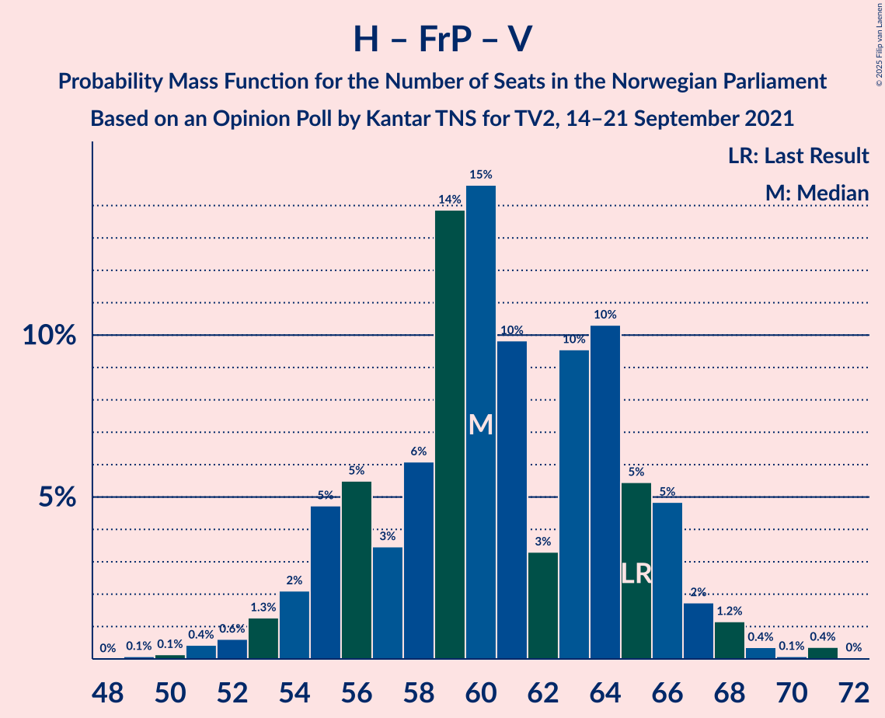

| Number of Seats | Probability | Accumulated | Special Marks |
|:---------------:|:-----------:|:-----------:|:-------------:|
| 49 | 0.1% | 100% |  |
| 50 | 0.1% | 99.9% |  |
| 51 | 0.4% | 99.8% |  |
| 52 | 0.6% | 99.3% |  |
| 53 | 1.3% | 98.7% |  |
| 54 | 2% | 97% |  |
| 55 | 5% | 95% |  |
| 56 | 5% | 91% |  |
| 57 | 3% | 85% |  |
| 58 | 6% | 82% |  |
| 59 | 14% | 76% |  |
| 60 | 15% | 62% |  |
| 61 | 10% | 47% |  |
| 62 | 3% | 37% |  |
| 63 | 10% | 34% |  |
| 64 | 10% | 24% | Median |
| 65 | 5% | 14% | Last Result |
| 66 | 5% | 9% |  |
| 67 | 2% | 4% |  |
| 68 | 1.2% | 2% |  |
| 69 | 0.4% | 0.9% |  |
| 70 | 0.1% | 0.5% |  |
| 71 | 0.4% | 0.4% |  |
| 72 | 0% | 0% |  |

### Høyre – Fremskrittspartiet

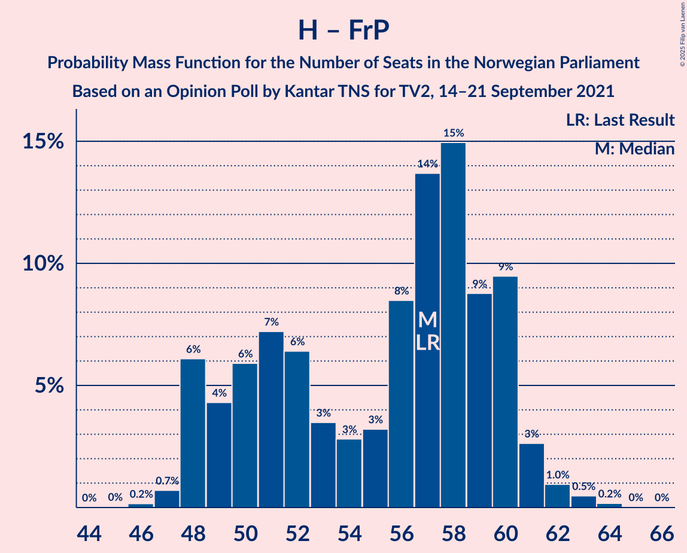

| Number of Seats | Probability | Accumulated | Special Marks |
|:---------------:|:-----------:|:-----------:|:-------------:|
| 46 | 0.2% | 100% |  |
| 47 | 0.7% | 99.8% |  |
| 48 | 6% | 99.1% |  |
| 49 | 4% | 93% |  |
| 50 | 6% | 89% |  |
| 51 | 7% | 83% |  |
| 52 | 6% | 76% |  |
| 53 | 3% | 69% |  |
| 54 | 3% | 66% |  |
| 55 | 3% | 63% |  |
| 56 | 8% | 60% |  |
| 57 | 14% | 51% | Last Result, Median |
| 58 | 15% | 37% |  |
| 59 | 9% | 23% |  |
| 60 | 9% | 14% |  |
| 61 | 3% | 4% |  |
| 62 | 1.0% | 2% |  |
| 63 | 0.5% | 0.7% |  |
| 64 | 0.2% | 0.2% |  |
| 65 | 0% | 0.1% |  |
| 66 | 0% | 0% |  |

### Høyre – Venstre – Kristelig Folkeparti

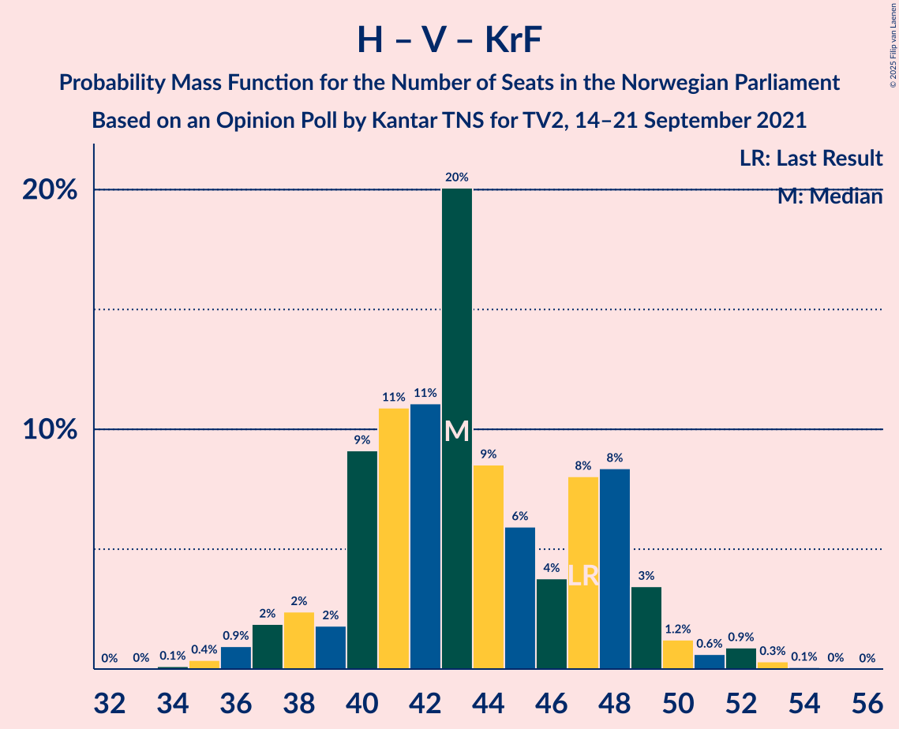

| Number of Seats | Probability | Accumulated | Special Marks |
|:---------------:|:-----------:|:-----------:|:-------------:|
| 34 | 0.1% | 100% |  |
| 35 | 0.4% | 99.8% |  |
| 36 | 0.9% | 99.5% |  |
| 37 | 2% | 98.5% |  |
| 38 | 2% | 97% |  |
| 39 | 2% | 94% |  |
| 40 | 9% | 92% |  |
| 41 | 11% | 83% |  |
| 42 | 11% | 72% |  |
| 43 | 20% | 61% |  |
| 44 | 9% | 41% |  |
| 45 | 6% | 33% |  |
| 46 | 4% | 27% |  |
| 47 | 8% | 23% | Last Result, Median |
| 48 | 8% | 15% |  |
| 49 | 3% | 7% |  |
| 50 | 1.2% | 3% |  |
| 51 | 0.6% | 2% |  |
| 52 | 0.9% | 1.3% |  |
| 53 | 0.3% | 0.4% |  |
| 54 | 0.1% | 0.1% |  |
| 55 | 0% | 0.1% |  |
| 56 | 0% | 0% |  |

### Senterpartiet – Venstre – Kristelig Folkeparti

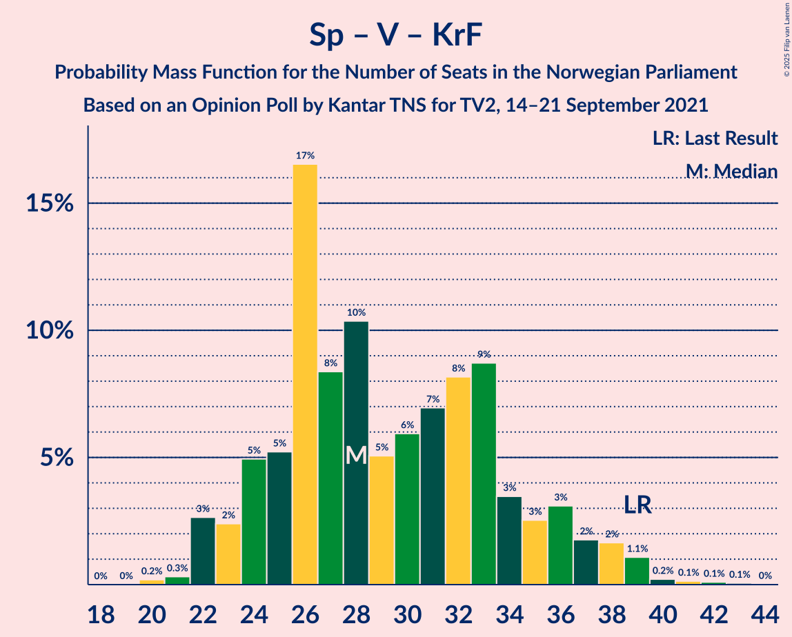

| Number of Seats | Probability | Accumulated | Special Marks |
|:---------------:|:-----------:|:-----------:|:-------------:|
| 20 | 0.2% | 100% |  |
| 21 | 0.3% | 99.8% |  |
| 22 | 3% | 99.5% |  |
| 23 | 2% | 97% |  |
| 24 | 5% | 94% |  |
| 25 | 5% | 89% |  |
| 26 | 17% | 84% |  |
| 27 | 8% | 68% |  |
| 28 | 10% | 59% |  |
| 29 | 5% | 49% |  |
| 30 | 6% | 44% |  |
| 31 | 7% | 38% | Median |
| 32 | 8% | 31% |  |
| 33 | 9% | 23% |  |
| 34 | 3% | 14% |  |
| 35 | 3% | 11% |  |
| 36 | 3% | 8% |  |
| 37 | 2% | 5% |  |
| 38 | 2% | 3% |  |
| 39 | 1.1% | 2% | Last Result |
| 40 | 0.2% | 0.5% |  |
| 41 | 0.1% | 0.3% |  |
| 42 | 0.1% | 0.2% |  |
| 43 | 0.1% | 0.1% |  |
| 44 | 0% | 0% |  |

## Technical Information

### Opinion Poll

+ **Polling firm:** Kantar TNS
+ **Commissioner(s):** TV2
+ **Fieldwork period:** 14–21 September 2021

### Calculations

+ **Sample size:** 1000
+ **Simulations done:** 1,048,576
+ **Error estimate:** 0.79%

