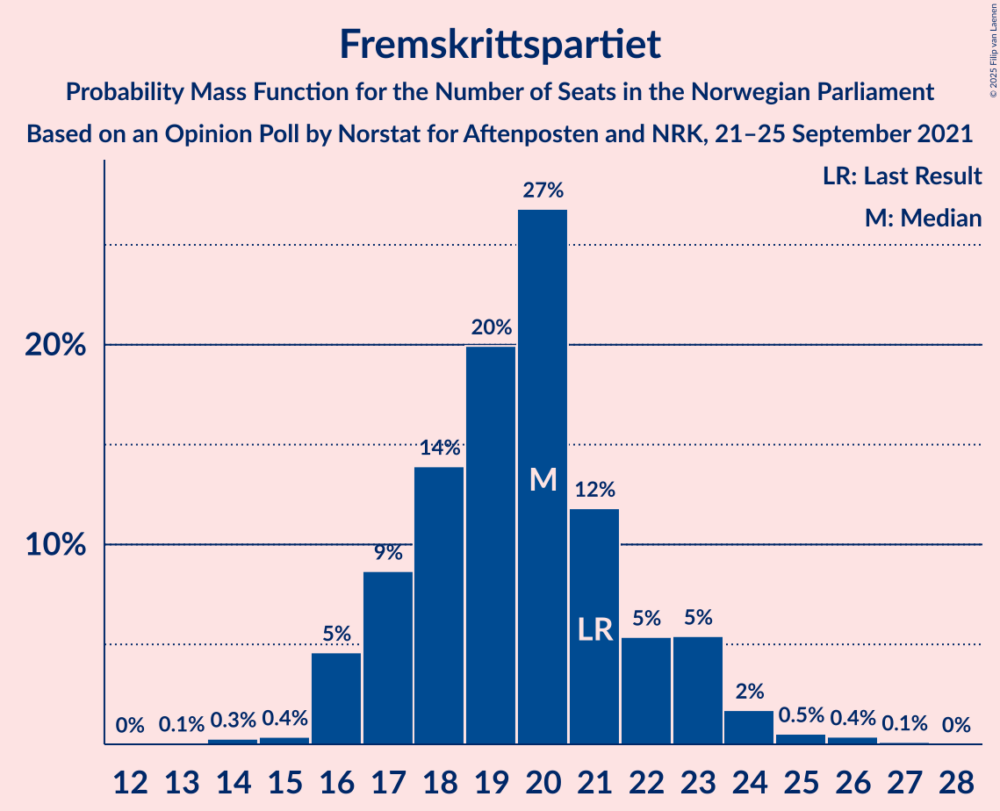
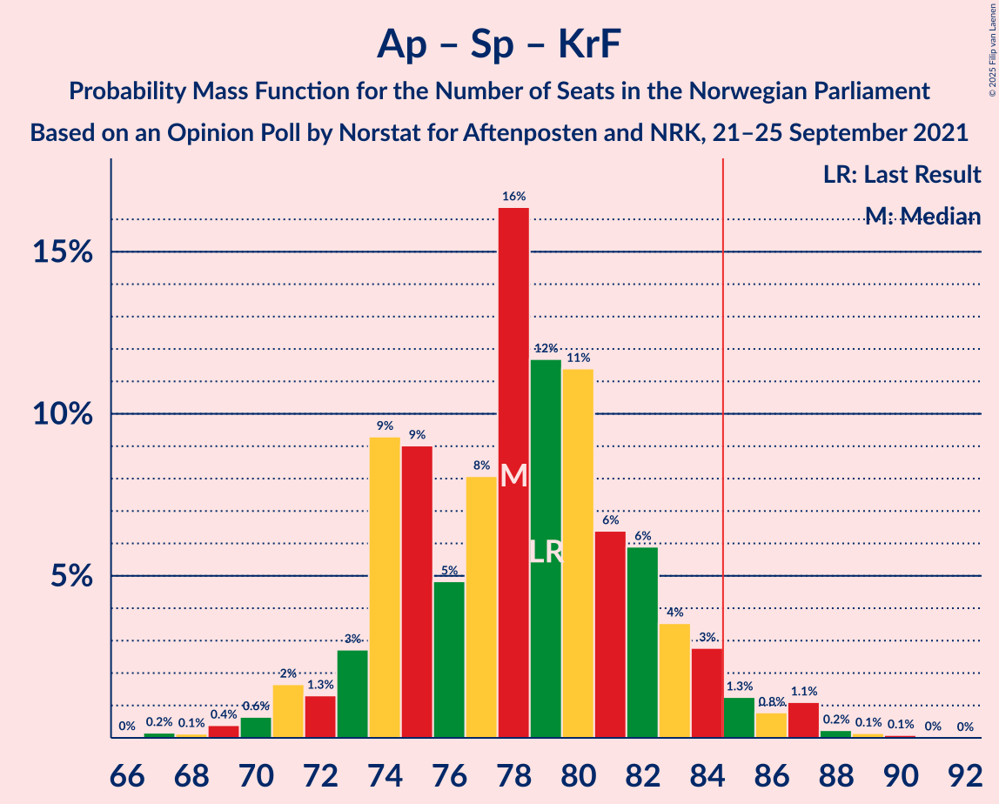
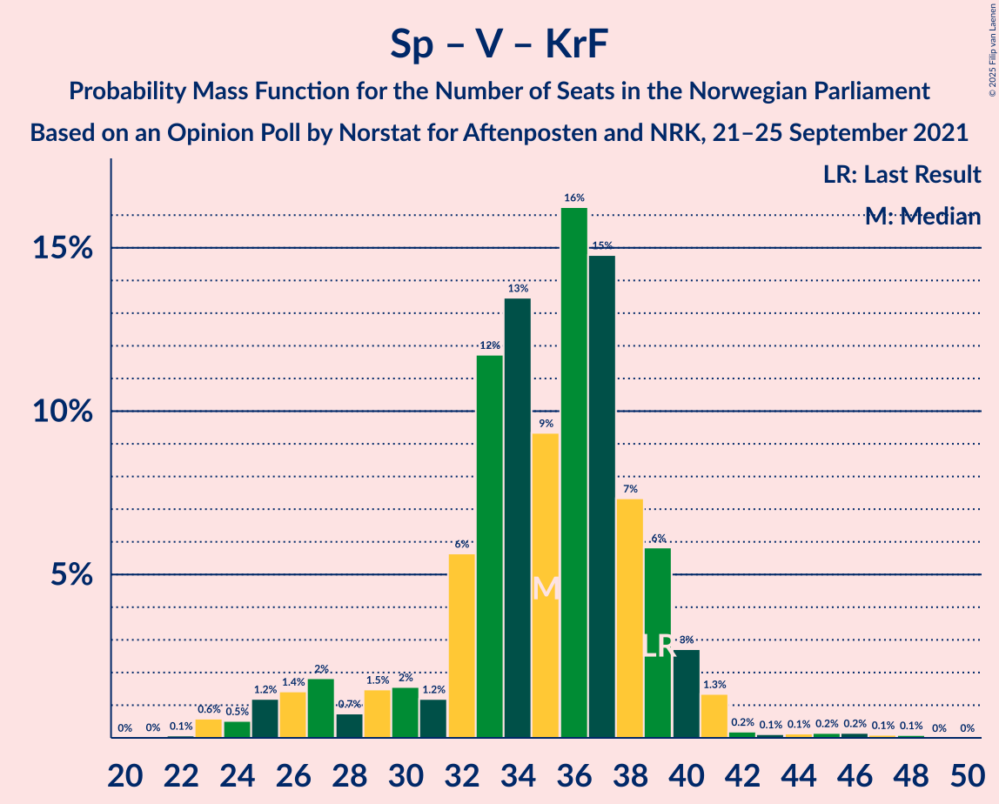

# Opinion Poll by Norstat for Aftenposten and NRK, 21–25 September 2021

<a href="#voting-intentions">Voting Intentions</a> | <a href="#seats">Seats</a> | <a href="#coalitions">Coalitions</a> | <a href="#technical-information">Technical Information</a>

## Voting Intentions

### Confidence Intervals

| Party | Last Result | Poll Result | 80% Confidence Interval | 90% Confidence Interval | 95% Confidence Interval | 99% Confidence Interval |
|:-----:|:-----------:|:-----------:|:-----------------------:|:-----------------------:|:-----------------------:|:-----------------------:|
| Arbeiderpartiet | 26.2% | 27.2% | 25.4–29.1% |24.9–29.7% |24.5–30.1% |23.7–31.0% |
| Høyre | 20.4% | 20.8% | 19.1–22.5% |18.7–23.0% |18.3–23.4% |17.5–24.3% |
| Senterpartiet | 13.5% | 12.8% | 11.5–14.3% |11.2–14.7% |10.9–15.1% |10.3–15.8% |
| Fremskrittspartiet | 11.6% | 11.2% | 9.9–12.6% |9.6–13.0% |9.3–13.3% |8.8–14.0% |
| Sosialistisk Venstreparti | 7.6% | 8.7% | 7.6–9.9% |7.3–10.3% |7.0–10.6% |6.6–11.2% |
| Miljøpartiet De Grønne | 3.9% | 4.4% | 3.6–5.3% |3.4–5.6% |3.2–5.9% |2.9–6.4% |
| Venstre | 4.6% | 4.3% | 3.5–5.2% |3.3–5.5% |3.2–5.8% |2.9–6.2% |
| Rødt | 4.7% | 4.0% | 3.3–4.9% |3.1–5.2% |2.9–5.4% |2.6–5.9% |
| Kristelig Folkeparti | 3.8% | 3.4% | 2.8–4.3% |2.6–4.6% |2.5–4.8% |2.2–5.3% |

*Note:* The poll result column reflects the actual value used in the calculations. Published results may vary slightly, and in addition be rounded to fewer digits.

## Seats

### Confidence Intervals

| Party | Last Result | Median | 80% Confidence Interval | 90% Confidence Interval | 95% Confidence Interval | 99% Confidence Interval |
|:-----:|:-----------:|:------:|:-----------------------:|:-----------------------:|:-----------------------:|:-----------------------:|
| <a href="#arbeiderpartiet">Arbeiderpartiet</a> | 48 | 50 | 47–54 |45–56 |45–56 |43–59 |
| <a href="#høyre">Høyre</a> | 36 | 38 | 33–40 |32–42 |31–43 |30–44 |
| <a href="#senterpartiet">Senterpartiet</a> | 28 | 24 | 21–28 |20–30 |19–30 |18–31 |
| <a href="#fremskrittspartiet">Fremskrittspartiet</a> | 21 | 20 | 17–22 |16–23 |16–24 |15–26 |
| <a href="#sosialistisk-venstreparti">Sosialistisk Venstreparti</a> | 13 | 15 | 13–18 |12–18 |11–19 |10–20 |
| <a href="#miljøpartiet-de-grønne">Miljøpartiet De Grønne</a> | 3 | 7 | 3–9 |2–10 |2–10 |1–11 |
| <a href="#venstre">Venstre</a> | 8 | 8 | 3–9 |2–10 |2–10 |2–11 |
| <a href="#rødt">Rødt</a> | 8 | 1 | 1–8 |1–9 |1–9 |1–10 |
| <a href="#kristelig-folkeparti">Kristelig Folkeparti</a> | 3 | 3 | 2–7 |1–8 |1–8 |1–9 |

### Arbeiderpartiet

*For a full overview of the results for this party, see the [Arbeiderpartiet](party-arbeiderpartiet.html) page.*

| Number of Seats | Probability | Accumulated | Special Marks |
|:---------------:|:-----------:|:-----------:|:-------------:|
| 41 | 0.1% | 100% |  |
| 42 | 0.2% | 99.9% |  |
| 43 | 0.7% | 99.8% |  |
| 44 | 1.4% | 99.1% |  |
| 45 | 3% | 98% |  |
| 46 | 3% | 95% |  |
| 47 | 5% | 91% |  |
| 48 | 15% | 86% | Last Result |
| 49 | 15% | 70% |  |
| 50 | 16% | 56% | Median |
| 51 | 16% | 39% |  |
| 52 | 4% | 23% |  |
| 53 | 7% | 19% |  |
| 54 | 4% | 12% |  |
| 55 | 3% | 8% |  |
| 56 | 3% | 5% |  |
| 57 | 0.5% | 2% |  |
| 58 | 1.1% | 2% |  |
| 59 | 0.4% | 0.6% |  |
| 60 | 0.2% | 0.2% |  |
| 61 | 0% | 0% |  |

### Høyre

*For a full overview of the results for this party, see the [Høyre](party-høyre.html) page.*

| Number of Seats | Probability | Accumulated | Special Marks |
|:---------------:|:-----------:|:-----------:|:-------------:|
| 28 | 0.1% | 100% |  |
| 29 | 0.1% | 99.9% |  |
| 30 | 0.8% | 99.8% |  |
| 31 | 2% | 99.0% |  |
| 32 | 4% | 97% |  |
| 33 | 4% | 92% |  |
| 34 | 9% | 88% |  |
| 35 | 8% | 79% |  |
| 36 | 9% | 71% | Last Result |
| 37 | 10% | 62% |  |
| 38 | 22% | 52% | Median |
| 39 | 13% | 30% |  |
| 40 | 8% | 17% |  |
| 41 | 3% | 9% |  |
| 42 | 2% | 6% |  |
| 43 | 2% | 4% |  |
| 44 | 1.5% | 2% |  |
| 45 | 0.3% | 0.4% |  |
| 46 | 0% | 0.1% |  |
| 47 | 0.1% | 0.1% |  |
| 48 | 0% | 0% |  |

### Senterpartiet

*For a full overview of the results for this party, see the [Senterpartiet](party-senterpartiet.html) page.*

| Number of Seats | Probability | Accumulated | Special Marks |
|:---------------:|:-----------:|:-----------:|:-------------:|
| 16 | 0.1% | 100% |  |
| 17 | 0.3% | 99.9% |  |
| 18 | 2% | 99.6% |  |
| 19 | 3% | 98% |  |
| 20 | 3% | 95% |  |
| 21 | 5% | 92% |  |
| 22 | 8% | 88% |  |
| 23 | 18% | 79% |  |
| 24 | 16% | 62% | Median |
| 25 | 6% | 46% |  |
| 26 | 13% | 41% |  |
| 27 | 9% | 27% |  |
| 28 | 9% | 18% | Last Result |
| 29 | 4% | 9% |  |
| 30 | 4% | 5% |  |
| 31 | 0.7% | 0.9% |  |
| 32 | 0.2% | 0.3% |  |
| 33 | 0% | 0% |  |

### Fremskrittspartiet

*For a full overview of the results for this party, see the [Fremskrittspartiet](party-fremskrittspartiet.html) page.*

| Number of Seats | Probability | Accumulated | Special Marks |
|:---------------:|:-----------:|:-----------:|:-------------:|
| 13 | 0.1% | 100% |  |
| 14 | 0.3% | 99.9% |  |
| 15 | 0.4% | 99.6% |  |
| 16 | 5% | 99.3% |  |
| 17 | 9% | 95% |  |
| 18 | 14% | 86% |  |
| 19 | 20% | 72% |  |
| 20 | 27% | 52% | Median |
| 21 | 12% | 25% | Last Result |
| 22 | 5% | 14% |  |
| 23 | 5% | 8% |  |
| 24 | 2% | 3% |  |
| 25 | 0.5% | 1.1% |  |
| 26 | 0.4% | 0.5% |  |
| 27 | 0.1% | 0.2% |  |
| 28 | 0% | 0% |  |

### Sosialistisk Venstreparti

*For a full overview of the results for this party, see the [Sosialistisk Venstreparti](party-sosialistiskvenstreparti.html) page.*

| Number of Seats | Probability | Accumulated | Special Marks |
|:---------------:|:-----------:|:-----------:|:-------------:|
| 9 | 0.1% | 100% |  |
| 10 | 1.0% | 99.9% |  |
| 11 | 2% | 99.0% |  |
| 12 | 6% | 97% |  |
| 13 | 13% | 91% | Last Result |
| 14 | 17% | 78% |  |
| 15 | 23% | 61% | Median |
| 16 | 19% | 39% |  |
| 17 | 7% | 20% |  |
| 18 | 9% | 13% |  |
| 19 | 2% | 4% |  |
| 20 | 1.5% | 2% |  |
| 21 | 0.4% | 0.5% |  |
| 22 | 0.1% | 0.1% |  |
| 23 | 0% | 0% |  |

### Miljøpartiet De Grønne

*For a full overview of the results for this party, see the [Miljøpartiet De Grønne](party-miljøpartietdegrønne.html) page.*

| Number of Seats | Probability | Accumulated | Special Marks |
|:---------------:|:-----------:|:-----------:|:-------------:|
| 1 | 0.6% | 100% |  |
| 2 | 8% | 99.4% |  |
| 3 | 19% | 92% | Last Result |
| 4 | 0% | 72% |  |
| 5 | 0% | 72% |  |
| 6 | 1.1% | 72% |  |
| 7 | 25% | 71% | Median |
| 8 | 24% | 46% |  |
| 9 | 15% | 22% |  |
| 10 | 5% | 7% |  |
| 11 | 1.4% | 2% |  |
| 12 | 0.2% | 0.2% |  |
| 13 | 0% | 0% |  |

### Venstre

*For a full overview of the results for this party, see the [Venstre](party-venstre.html) page.*

| Number of Seats | Probability | Accumulated | Special Marks |
|:---------------:|:-----------:|:-----------:|:-------------:|
| 2 | 6% | 100% |  |
| 3 | 20% | 94% |  |
| 4 | 0% | 74% |  |
| 5 | 0% | 74% |  |
| 6 | 1.2% | 74% |  |
| 7 | 20% | 73% |  |
| 8 | 26% | 53% | Last Result, Median |
| 9 | 21% | 28% |  |
| 10 | 5% | 7% |  |
| 11 | 2% | 2% |  |
| 12 | 0.2% | 0.2% |  |
| 13 | 0% | 0% |  |

### Rødt

*For a full overview of the results for this party, see the [Rødt](party-rødt.html) page.*

| Number of Seats | Probability | Accumulated | Special Marks |
|:---------------:|:-----------:|:-----------:|:-------------:|
| 1 | 51% | 100% | Median |
| 2 | 0.1% | 49% |  |
| 3 | 0% | 49% |  |
| 4 | 0% | 49% |  |
| 5 | 0.2% | 49% |  |
| 6 | 3% | 49% |  |
| 7 | 16% | 46% |  |
| 8 | 20% | 29% | Last Result |
| 9 | 8% | 9% |  |
| 10 | 1.0% | 1.3% |  |
| 11 | 0.3% | 0.3% |  |
| 12 | 0% | 0% |  |

### Kristelig Folkeparti

*For a full overview of the results for this party, see the [Kristelig Folkeparti](party-kristeligfolkeparti.html) page.*

| Number of Seats | Probability | Accumulated | Special Marks |
|:---------------:|:-----------:|:-----------:|:-------------:|
| 0 | 0.4% | 100% |  |
| 1 | 9% | 99.6% |  |
| 2 | 22% | 91% |  |
| 3 | 48% | 68% | Last Result, Median |
| 4 | 0% | 20% |  |
| 5 | 0% | 20% |  |
| 6 | 1.2% | 20% |  |
| 7 | 11% | 19% |  |
| 8 | 7% | 8% |  |
| 9 | 0.9% | 1.1% |  |
| 10 | 0.1% | 0.2% |  |
| 11 | 0% | 0% |  |

## Coalitions

### Confidence Intervals

| Coalition | Last Result | Median | Majority? | 80% Confidence Interval | 90% Confidence Interval | 95% Confidence Interval | 99% Confidence Interval |
|:---------:|:-----------:|:------:|:---------:|:-----------------------:|:-----------------------:|:-----------------------:|:-----------------------:|
| Arbeiderpartiet – Senterpartiet – Sosialistisk Venstreparti – Miljøpartiet De Grønne – Rødt | 100 | 100 | 100% | 95–107 | 94–108 | 93–109 | 90–111 |
| Arbeiderpartiet – Senterpartiet – Sosialistisk Venstreparti – Miljøpartiet De Grønne – Kristelig Folkeparti | 95 | 100 | 100% | 94–105 | 92–106 | 91–108 | 89–110 |
| Arbeiderpartiet – Senterpartiet – Sosialistisk Venstreparti – Miljøpartiet De Grønne | 92 | 96 | 99.9% | 90–101 | 89–103 | 88–105 | 86–107 |
| Arbeiderpartiet – Senterpartiet – Sosialistisk Venstreparti – Rødt | 97 | 94 | 99.5% | 88–100 | 87–102 | 86–103 | 84–104 |
| Høyre – Senterpartiet – Fremskrittspartiet – Venstre – Kristelig Folkeparti | 96 | 91 | 95% | 87–96 | 85–98 | 82–98 | 79–101 |
| Arbeiderpartiet – Senterpartiet – Sosialistisk Venstreparti | 89 | 90 | 92% | 85–95 | 84–96 | 82–97 | 81–99 |
| Arbeiderpartiet – Senterpartiet – Miljøpartiet De Grønne – Kristelig Folkeparti | 82 | 85 | 54% | 79–90 | 77–91 | 77–93 | 74–95 |
| Arbeiderpartiet – Sosialistisk Venstreparti – Miljøpartiet De Grønne – Rødt | 72 | 76 | 3% | 71–81 | 70–83 | 70–86 | 67–89 |
| Arbeiderpartiet – Senterpartiet – Kristelig Folkeparti | 79 | 78 | 4% | 74–82 | 73–84 | 71–85 | 69–88 |
| Høyre – Fremskrittspartiet – Miljøpartiet De Grønne – Venstre – Kristelig Folkeparti | 71 | 74 | 0.3% | 67–79 | 66–81 | 65–82 | 63–84 |
| Arbeiderpartiet – Senterpartiet | 76 | 75 | 0.1% | 71–79 | 69–80 | 68–81 | 66–84 |
| Høyre – Fremskrittspartiet – Venstre – Kristelig Folkeparti | 68 | 67 | 0% | 61–72 | 60–74 | 59–75 | 57–78 |
| Arbeiderpartiet – Sosialistisk Venstreparti | 61 | 65 | 0% | 61–69 | 60–71 | 60–73 | 58–76 |
| Høyre – Fremskrittspartiet – Venstre | 65 | 64 | 0% | 58–69 | 57–70 | 56–72 | 53–73 |
| Høyre – Fremskrittspartiet | 57 | 57 | 0% | 52–61 | 50–63 | 49–64 | 48–66 |
| Høyre – Venstre – Kristelig Folkeparti | 47 | 48 | 0% | 42–52 | 41–53 | 40–55 | 38–57 |
| Senterpartiet – Venstre – Kristelig Folkeparti | 39 | 35 | 0% | 31–39 | 27–39 | 26–40 | 23–44 |

### Arbeiderpartiet – Senterpartiet – Sosialistisk Venstreparti – Miljøpartiet De Grønne – Rødt

| Number of Seats | Probability | Accumulated | Special Marks |
|:---------------:|:-----------:|:-----------:|:-------------:|
| 86 | 0.1% | 100% |  |
| 87 | 0% | 99.9% |  |
| 88 | 0% | 99.9% |  |
| 89 | 0.3% | 99.9% |  |
| 90 | 0.3% | 99.6% |  |
| 91 | 0.5% | 99.3% |  |
| 92 | 0.3% | 98.8% |  |
| 93 | 3% | 98% |  |
| 94 | 5% | 96% |  |
| 95 | 3% | 90% |  |
| 96 | 5% | 88% |  |
| 97 | 9% | 83% | Median |
| 98 | 8% | 75% |  |
| 99 | 7% | 67% |  |
| 100 | 12% | 60% | Last Result |
| 101 | 6% | 48% |  |
| 102 | 11% | 42% |  |
| 103 | 7% | 31% |  |
| 104 | 4% | 23% |  |
| 105 | 3% | 19% |  |
| 106 | 5% | 16% |  |
| 107 | 3% | 11% |  |
| 108 | 2% | 7% |  |
| 109 | 3% | 5% |  |
| 110 | 0.9% | 1.5% |  |
| 111 | 0.2% | 0.5% |  |
| 112 | 0.2% | 0.3% |  |
| 113 | 0% | 0.1% |  |
| 114 | 0% | 0.1% |  |
| 115 | 0% | 0% |  |

### Arbeiderpartiet – Senterpartiet – Sosialistisk Venstreparti – Miljøpartiet De Grønne – Kristelig Folkeparti

| Number of Seats | Probability | Accumulated | Special Marks |
|:---------------:|:-----------:|:-----------:|:-------------:|
| 87 | 0.1% | 100% |  |
| 88 | 0.4% | 99.9% |  |
| 89 | 0.1% | 99.5% |  |
| 90 | 0.2% | 99.4% |  |
| 91 | 3% | 99.2% |  |
| 92 | 1.5% | 96% |  |
| 93 | 3% | 95% |  |
| 94 | 2% | 92% |  |
| 95 | 4% | 90% | Last Result |
| 96 | 9% | 86% |  |
| 97 | 5% | 76% |  |
| 98 | 8% | 71% |  |
| 99 | 10% | 63% | Median |
| 100 | 5% | 52% |  |
| 101 | 10% | 47% |  |
| 102 | 13% | 37% |  |
| 103 | 8% | 24% |  |
| 104 | 4% | 16% |  |
| 105 | 5% | 13% |  |
| 106 | 4% | 8% |  |
| 107 | 1.2% | 5% |  |
| 108 | 2% | 3% |  |
| 109 | 0.7% | 2% |  |
| 110 | 0.6% | 1.1% |  |
| 111 | 0.3% | 0.5% |  |
| 112 | 0.1% | 0.2% |  |
| 113 | 0.1% | 0.1% |  |
| 114 | 0% | 0% |  |

### Arbeiderpartiet – Senterpartiet – Sosialistisk Venstreparti – Miljøpartiet De Grønne

| Number of Seats | Probability | Accumulated | Special Marks |
|:---------------:|:-----------:|:-----------:|:-------------:|
| 83 | 0% | 100% |  |
| 84 | 0.1% | 99.9% |  |
| 85 | 0.3% | 99.9% | Majority |
| 86 | 0.4% | 99.6% |  |
| 87 | 0.3% | 99.3% |  |
| 88 | 2% | 99.0% |  |
| 89 | 2% | 97% |  |
| 90 | 5% | 94% |  |
| 91 | 3% | 90% |  |
| 92 | 5% | 87% | Last Result |
| 93 | 10% | 82% |  |
| 94 | 7% | 72% |  |
| 95 | 6% | 65% |  |
| 96 | 13% | 59% | Median |
| 97 | 6% | 47% |  |
| 98 | 8% | 41% |  |
| 99 | 12% | 33% |  |
| 100 | 5% | 21% |  |
| 101 | 7% | 16% |  |
| 102 | 4% | 10% |  |
| 103 | 2% | 6% |  |
| 104 | 1.0% | 4% |  |
| 105 | 1.0% | 3% |  |
| 106 | 0.9% | 2% |  |
| 107 | 0.6% | 0.7% |  |
| 108 | 0.1% | 0.1% |  |
| 109 | 0% | 0% |  |

### Arbeiderpartiet – Senterpartiet – Sosialistisk Venstreparti – Rødt

| Number of Seats | Probability | Accumulated | Special Marks |
|:---------------:|:-----------:|:-----------:|:-------------:|
| 82 | 0.1% | 100% |  |
| 83 | 0.2% | 99.9% |  |
| 84 | 0.2% | 99.7% |  |
| 85 | 0.8% | 99.5% | Majority |
| 86 | 3% | 98.6% |  |
| 87 | 4% | 96% |  |
| 88 | 3% | 92% |  |
| 89 | 3% | 89% |  |
| 90 | 8% | 86% | Median |
| 91 | 7% | 78% |  |
| 92 | 16% | 71% |  |
| 93 | 5% | 55% |  |
| 94 | 7% | 51% |  |
| 95 | 5% | 44% |  |
| 96 | 10% | 38% |  |
| 97 | 3% | 28% | Last Result |
| 98 | 6% | 25% |  |
| 99 | 6% | 19% |  |
| 100 | 4% | 13% |  |
| 101 | 2% | 9% |  |
| 102 | 2% | 6% |  |
| 103 | 3% | 4% |  |
| 104 | 0.7% | 0.9% |  |
| 105 | 0.1% | 0.3% |  |
| 106 | 0.1% | 0.2% |  |
| 107 | 0% | 0.1% |  |
| 108 | 0% | 0% |  |

### Høyre – Senterpartiet – Fremskrittspartiet – Venstre – Kristelig Folkeparti

| Number of Seats | Probability | Accumulated | Special Marks |
|:---------------:|:-----------:|:-----------:|:-------------:|
| 75 | 0.1% | 100% |  |
| 76 | 0.1% | 99.9% |  |
| 77 | 0% | 99.9% |  |
| 78 | 0.3% | 99.8% |  |
| 79 | 0.2% | 99.5% |  |
| 80 | 0.3% | 99.3% |  |
| 81 | 0.4% | 98.9% |  |
| 82 | 1.1% | 98.6% |  |
| 83 | 1.2% | 97% |  |
| 84 | 1.0% | 96% |  |
| 85 | 2% | 95% | Majority |
| 86 | 3% | 94% |  |
| 87 | 5% | 90% |  |
| 88 | 3% | 85% |  |
| 89 | 4% | 82% |  |
| 90 | 9% | 77% |  |
| 91 | 20% | 69% |  |
| 92 | 7% | 49% |  |
| 93 | 12% | 41% | Median |
| 94 | 9% | 29% |  |
| 95 | 8% | 20% |  |
| 96 | 4% | 12% | Last Result |
| 97 | 3% | 8% |  |
| 98 | 3% | 5% |  |
| 99 | 1.3% | 2% |  |
| 100 | 0.3% | 1.0% |  |
| 101 | 0.4% | 0.7% |  |
| 102 | 0.2% | 0.3% |  |
| 103 | 0.1% | 0.1% |  |
| 104 | 0.1% | 0.1% |  |
| 105 | 0% | 0% |  |

### Arbeiderpartiet – Senterpartiet – Sosialistisk Venstreparti

| Number of Seats | Probability | Accumulated | Special Marks |
|:---------------:|:-----------:|:-----------:|:-------------:|
| 78 | 0.1% | 100% |  |
| 79 | 0.1% | 99.9% |  |
| 80 | 0.2% | 99.8% |  |
| 81 | 0.6% | 99.6% |  |
| 82 | 2% | 99.0% |  |
| 83 | 2% | 97% |  |
| 84 | 3% | 95% |  |
| 85 | 6% | 92% | Majority |
| 86 | 10% | 86% |  |
| 87 | 4% | 76% |  |
| 88 | 6% | 72% |  |
| 89 | 13% | 65% | Last Result, Median |
| 90 | 9% | 52% |  |
| 91 | 15% | 43% |  |
| 92 | 6% | 28% |  |
| 93 | 4% | 22% |  |
| 94 | 5% | 17% |  |
| 95 | 6% | 12% |  |
| 96 | 2% | 6% |  |
| 97 | 2% | 4% |  |
| 98 | 1.1% | 2% |  |
| 99 | 0.7% | 1.0% |  |
| 100 | 0.2% | 0.4% |  |
| 101 | 0.1% | 0.2% |  |
| 102 | 0% | 0.1% |  |
| 103 | 0% | 0% |  |

### Arbeiderpartiet – Senterpartiet – Miljøpartiet De Grønne – Kristelig Folkeparti

| Number of Seats | Probability | Accumulated | Special Marks |
|:---------------:|:-----------:|:-----------:|:-------------:|
| 71 | 0% | 100% |  |
| 72 | 0% | 99.9% |  |
| 73 | 0.3% | 99.9% |  |
| 74 | 0.3% | 99.6% |  |
| 75 | 0.6% | 99.3% |  |
| 76 | 0.8% | 98.7% |  |
| 77 | 5% | 98% |  |
| 78 | 2% | 93% |  |
| 79 | 2% | 91% |  |
| 80 | 3% | 89% |  |
| 81 | 7% | 86% |  |
| 82 | 7% | 79% | Last Result |
| 83 | 10% | 72% |  |
| 84 | 8% | 62% | Median |
| 85 | 5% | 54% | Majority |
| 86 | 17% | 49% |  |
| 87 | 10% | 33% |  |
| 88 | 6% | 23% |  |
| 89 | 6% | 17% |  |
| 90 | 5% | 11% |  |
| 91 | 2% | 6% |  |
| 92 | 2% | 4% |  |
| 93 | 1.0% | 3% |  |
| 94 | 0.8% | 2% |  |
| 95 | 0.4% | 0.7% |  |
| 96 | 0.1% | 0.3% |  |
| 97 | 0.1% | 0.2% |  |
| 98 | 0.1% | 0.1% |  |
| 99 | 0% | 0% |  |

### Arbeiderpartiet – Sosialistisk Venstreparti – Miljøpartiet De Grønne – Rødt

| Number of Seats | Probability | Accumulated | Special Marks |
|:---------------:|:-----------:|:-----------:|:-------------:|
| 64 | 0% | 100% |  |
| 65 | 0.1% | 99.9% |  |
| 66 | 0.2% | 99.8% |  |
| 67 | 0.3% | 99.6% |  |
| 68 | 0.7% | 99.3% |  |
| 69 | 0.6% | 98.5% |  |
| 70 | 4% | 98% |  |
| 71 | 11% | 94% |  |
| 72 | 4% | 83% | Last Result |
| 73 | 5% | 78% | Median |
| 74 | 8% | 73% |  |
| 75 | 10% | 65% |  |
| 76 | 15% | 55% |  |
| 77 | 5% | 40% |  |
| 78 | 12% | 35% |  |
| 79 | 8% | 22% |  |
| 80 | 3% | 15% |  |
| 81 | 2% | 12% |  |
| 82 | 2% | 10% |  |
| 83 | 3% | 8% |  |
| 84 | 2% | 5% |  |
| 85 | 0.6% | 3% | Majority |
| 86 | 1.1% | 3% |  |
| 87 | 0.9% | 2% |  |
| 88 | 0.2% | 0.8% |  |
| 89 | 0.3% | 0.5% |  |
| 90 | 0.1% | 0.2% |  |
| 91 | 0.1% | 0.1% |  |
| 92 | 0% | 0% |  |

### Arbeiderpartiet – Senterpartiet – Kristelig Folkeparti

| Number of Seats | Probability | Accumulated | Special Marks |
|:---------------:|:-----------:|:-----------:|:-------------:|
| 67 | 0.2% | 100% |  |
| 68 | 0.1% | 99.8% |  |
| 69 | 0.4% | 99.7% |  |
| 70 | 0.6% | 99.3% |  |
| 71 | 2% | 98.6% |  |
| 72 | 1.3% | 97% |  |
| 73 | 3% | 96% |  |
| 74 | 9% | 93% |  |
| 75 | 9% | 84% |  |
| 76 | 5% | 75% |  |
| 77 | 8% | 70% | Median |
| 78 | 16% | 62% |  |
| 79 | 12% | 45% | Last Result |
| 80 | 11% | 34% |  |
| 81 | 6% | 22% |  |
| 82 | 6% | 16% |  |
| 83 | 4% | 10% |  |
| 84 | 3% | 6% |  |
| 85 | 1.3% | 4% | Majority |
| 86 | 0.8% | 2% |  |
| 87 | 1.1% | 2% |  |
| 88 | 0.2% | 0.5% |  |
| 89 | 0.1% | 0.3% |  |
| 90 | 0.1% | 0.1% |  |
| 91 | 0% | 0% |  |

### Høyre – Fremskrittspartiet – Miljøpartiet De Grønne – Venstre – Kristelig Folkeparti

| Number of Seats | Probability | Accumulated | Special Marks |
|:---------------:|:-----------:|:-----------:|:-------------:|
| 59 | 0% | 100% |  |
| 60 | 0% | 99.9% |  |
| 61 | 0.1% | 99.9% |  |
| 62 | 0.1% | 99.8% |  |
| 63 | 0.6% | 99.7% |  |
| 64 | 0.4% | 99.2% |  |
| 65 | 1.3% | 98.7% |  |
| 66 | 4% | 97% |  |
| 67 | 5% | 93% |  |
| 68 | 3% | 88% |  |
| 69 | 5% | 85% |  |
| 70 | 7% | 80% |  |
| 71 | 6% | 73% | Last Result |
| 72 | 8% | 66% |  |
| 73 | 7% | 58% |  |
| 74 | 5% | 51% |  |
| 75 | 10% | 46% |  |
| 76 | 6% | 36% | Median |
| 77 | 15% | 31% |  |
| 78 | 6% | 16% |  |
| 79 | 3% | 10% |  |
| 80 | 2% | 7% |  |
| 81 | 2% | 5% |  |
| 82 | 1.3% | 3% |  |
| 83 | 0.6% | 2% |  |
| 84 | 0.6% | 0.9% |  |
| 85 | 0.2% | 0.3% | Majority |
| 86 | 0.1% | 0.2% |  |
| 87 | 0% | 0% |  |

### Arbeiderpartiet – Senterpartiet

| Number of Seats | Probability | Accumulated | Special Marks |
|:---------------:|:-----------:|:-----------:|:-------------:|
| 63 | 0% | 100% |  |
| 64 | 0.1% | 99.9% |  |
| 65 | 0.3% | 99.9% |  |
| 66 | 0.4% | 99.6% |  |
| 67 | 0.9% | 99.2% |  |
| 68 | 2% | 98% |  |
| 69 | 3% | 96% |  |
| 70 | 3% | 94% |  |
| 71 | 11% | 91% |  |
| 72 | 9% | 80% |  |
| 73 | 7% | 71% |  |
| 74 | 7% | 64% | Median |
| 75 | 18% | 57% |  |
| 76 | 11% | 40% | Last Result |
| 77 | 8% | 28% |  |
| 78 | 7% | 20% |  |
| 79 | 6% | 13% |  |
| 80 | 3% | 7% |  |
| 81 | 3% | 5% |  |
| 82 | 0.4% | 2% |  |
| 83 | 0.7% | 1.3% |  |
| 84 | 0.4% | 0.6% |  |
| 85 | 0% | 0.1% | Majority |
| 86 | 0.1% | 0.1% |  |
| 87 | 0% | 0% |  |

### Høyre – Fremskrittspartiet – Venstre – Kristelig Folkeparti

| Number of Seats | Probability | Accumulated | Special Marks |
|:---------------:|:-----------:|:-----------:|:-------------:|
| 54 | 0.1% | 100% |  |
| 55 | 0.2% | 99.9% |  |
| 56 | 0.1% | 99.7% |  |
| 57 | 0.4% | 99.6% |  |
| 58 | 0.7% | 99.1% |  |
| 59 | 1.2% | 98% |  |
| 60 | 7% | 97% |  |
| 61 | 4% | 90% |  |
| 62 | 4% | 87% |  |
| 63 | 6% | 82% |  |
| 64 | 4% | 76% |  |
| 65 | 9% | 72% |  |
| 66 | 5% | 63% |  |
| 67 | 11% | 58% |  |
| 68 | 9% | 47% | Last Result |
| 69 | 13% | 39% | Median |
| 70 | 6% | 26% |  |
| 71 | 7% | 20% |  |
| 72 | 3% | 13% |  |
| 73 | 4% | 10% |  |
| 74 | 2% | 6% |  |
| 75 | 2% | 4% |  |
| 76 | 0.3% | 1.3% |  |
| 77 | 0.2% | 0.9% |  |
| 78 | 0.4% | 0.7% |  |
| 79 | 0.2% | 0.3% |  |
| 80 | 0.1% | 0.1% |  |
| 81 | 0% | 0% |  |

### Arbeiderpartiet – Sosialistisk Venstreparti

| Number of Seats | Probability | Accumulated | Special Marks |
|:---------------:|:-----------:|:-----------:|:-------------:|
| 56 | 0.1% | 100% |  |
| 57 | 0.3% | 99.9% |  |
| 58 | 0.5% | 99.6% |  |
| 59 | 1.0% | 99.1% |  |
| 60 | 4% | 98% |  |
| 61 | 7% | 94% | Last Result |
| 62 | 14% | 88% |  |
| 63 | 12% | 74% |  |
| 64 | 11% | 62% |  |
| 65 | 7% | 51% | Median |
| 66 | 9% | 45% |  |
| 67 | 14% | 36% |  |
| 68 | 7% | 22% |  |
| 69 | 5% | 14% |  |
| 70 | 2% | 9% |  |
| 71 | 3% | 7% |  |
| 72 | 1.3% | 4% |  |
| 73 | 1.1% | 3% |  |
| 74 | 0.9% | 2% |  |
| 75 | 0.3% | 0.8% |  |
| 76 | 0.2% | 0.6% |  |
| 77 | 0.2% | 0.4% |  |
| 78 | 0.1% | 0.1% |  |
| 79 | 0% | 0% |  |

### Høyre – Fremskrittspartiet – Venstre

| Number of Seats | Probability | Accumulated | Special Marks |
|:---------------:|:-----------:|:-----------:|:-------------:|
| 50 | 0% | 100% |  |
| 51 | 0% | 99.9% |  |
| 52 | 0.3% | 99.9% |  |
| 53 | 0.4% | 99.6% |  |
| 54 | 0.2% | 99.2% |  |
| 55 | 1.0% | 99.0% |  |
| 56 | 1.4% | 98% |  |
| 57 | 4% | 97% |  |
| 58 | 7% | 93% |  |
| 59 | 5% | 86% |  |
| 60 | 7% | 81% |  |
| 61 | 4% | 74% |  |
| 62 | 12% | 70% |  |
| 63 | 6% | 57% |  |
| 64 | 7% | 51% |  |
| 65 | 11% | 44% | Last Result |
| 66 | 14% | 33% | Median |
| 67 | 5% | 19% |  |
| 68 | 4% | 14% |  |
| 69 | 3% | 10% |  |
| 70 | 3% | 7% |  |
| 71 | 2% | 4% |  |
| 72 | 2% | 3% |  |
| 73 | 0.6% | 1.0% |  |
| 74 | 0.2% | 0.4% |  |
| 75 | 0% | 0.2% |  |
| 76 | 0.1% | 0.2% |  |
| 77 | 0% | 0% |  |

### Høyre – Fremskrittspartiet

| Number of Seats | Probability | Accumulated | Special Marks |
|:---------------:|:-----------:|:-----------:|:-------------:|
| 46 | 0.1% | 100% |  |
| 47 | 0.1% | 99.9% |  |
| 48 | 0.4% | 99.8% |  |
| 49 | 3% | 99.4% |  |
| 50 | 2% | 97% |  |
| 51 | 5% | 95% |  |
| 52 | 3% | 90% |  |
| 53 | 4% | 87% |  |
| 54 | 10% | 83% |  |
| 55 | 11% | 73% |  |
| 56 | 7% | 62% |  |
| 57 | 18% | 55% | Last Result |
| 58 | 9% | 37% | Median |
| 59 | 8% | 28% |  |
| 60 | 6% | 20% |  |
| 61 | 5% | 14% |  |
| 62 | 3% | 10% |  |
| 63 | 3% | 6% |  |
| 64 | 2% | 3% |  |
| 65 | 0.6% | 1.3% |  |
| 66 | 0.4% | 0.8% |  |
| 67 | 0.1% | 0.3% |  |
| 68 | 0.1% | 0.2% |  |
| 69 | 0% | 0.1% |  |
| 70 | 0% | 0% |  |

### Høyre – Venstre – Kristelig Folkeparti

| Number of Seats | Probability | Accumulated | Special Marks |
|:---------------:|:-----------:|:-----------:|:-------------:|
| 36 | 0.1% | 100% |  |
| 37 | 0.3% | 99.9% |  |
| 38 | 0.2% | 99.6% |  |
| 39 | 0.9% | 99.4% |  |
| 40 | 1.2% | 98.5% |  |
| 41 | 5% | 97% |  |
| 42 | 7% | 92% |  |
| 43 | 5% | 85% |  |
| 44 | 5% | 80% |  |
| 45 | 10% | 75% |  |
| 46 | 5% | 65% |  |
| 47 | 9% | 60% | Last Result |
| 48 | 7% | 51% |  |
| 49 | 10% | 44% | Median |
| 50 | 14% | 34% |  |
| 51 | 6% | 20% |  |
| 52 | 5% | 14% |  |
| 53 | 5% | 9% |  |
| 54 | 1.1% | 4% |  |
| 55 | 2% | 3% |  |
| 56 | 0.4% | 1.0% |  |
| 57 | 0.4% | 0.6% |  |
| 58 | 0.1% | 0.2% |  |
| 59 | 0.1% | 0.1% |  |
| 60 | 0% | 0% |  |

### Senterpartiet – Venstre – Kristelig Folkeparti

| Number of Seats | Probability | Accumulated | Special Marks |
|:---------------:|:-----------:|:-----------:|:-------------:|
| 22 | 0.1% | 100% |  |
| 23 | 0.6% | 99.9% |  |
| 24 | 0.5% | 99.3% |  |
| 25 | 1.2% | 98.8% |  |
| 26 | 1.4% | 98% |  |
| 27 | 2% | 96% |  |
| 28 | 0.7% | 94% |  |
| 29 | 1.5% | 94% |  |
| 30 | 2% | 92% |  |
| 31 | 1.2% | 91% |  |
| 32 | 6% | 89% |  |
| 33 | 12% | 84% |  |
| 34 | 13% | 72% |  |
| 35 | 9% | 59% | Median |
| 36 | 16% | 49% |  |
| 37 | 15% | 33% |  |
| 38 | 7% | 18% |  |
| 39 | 6% | 11% | Last Result |
| 40 | 3% | 5% |  |
| 41 | 1.3% | 2% |  |
| 42 | 0.2% | 0.9% |  |
| 43 | 0.1% | 0.7% |  |
| 44 | 0.1% | 0.6% |  |
| 45 | 0.2% | 0.5% |  |
| 46 | 0.2% | 0.3% |  |
| 47 | 0.1% | 0.2% |  |
| 48 | 0.1% | 0.1% |  |
| 49 | 0% | 0% |  |

## Technical Information

### Opinion Poll

+ **Polling firm:** Norstat
+ **Commissioner(s):** Aftenposten and NRK
+ **Fieldwork period:** 21–25 September 2021

### Calculations

+ **Sample size:** 959
+ **Simulations done:** 1,048,576
+ **Error estimate:** 1.42%

