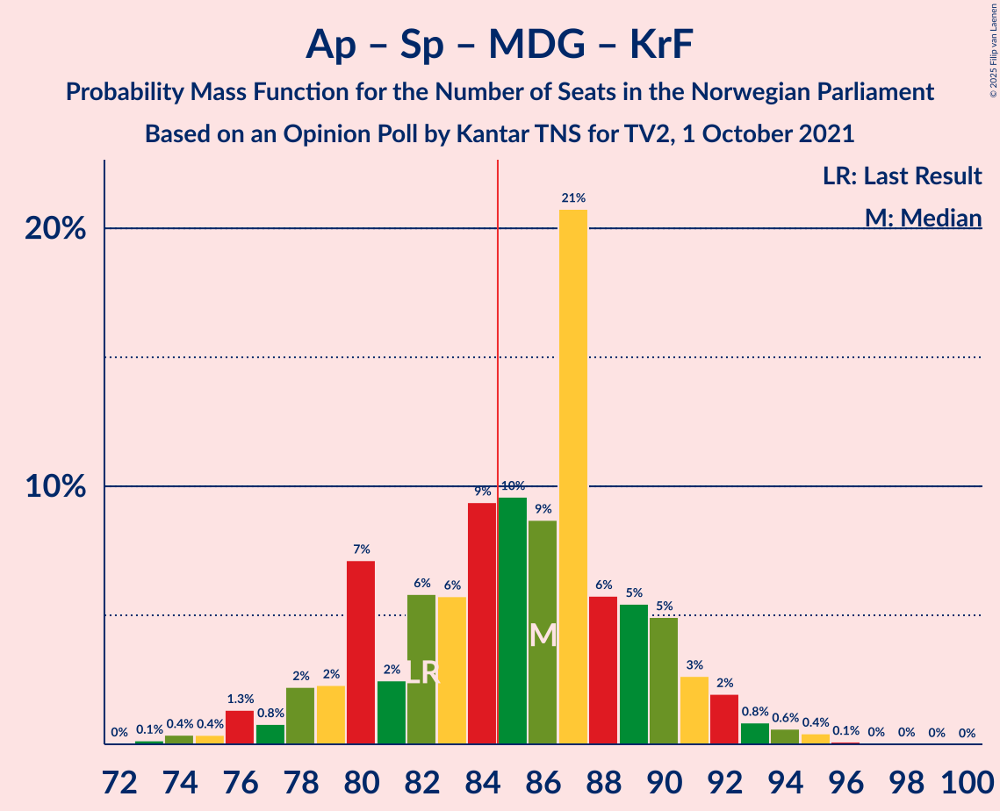

# Opinion Poll by Kantar TNS for TV2, 1 October 2021

<a href="#voting-intentions">Voting Intentions</a> | <a href="#seats">Seats</a> | <a href="#coalitions">Coalitions</a> | <a href="#technical-information">Technical Information</a>

## Voting Intentions

### Confidence Intervals

| Party | Last Result | Poll Result | 80% Confidence Interval | 90% Confidence Interval | 95% Confidence Interval | 99% Confidence Interval |
|:-----:|:-----------:|:-----------:|:-----------------------:|:-----------------------:|:-----------------------:|:-----------------------:|
| Arbeiderpartiet | 26.2% | 27.9% | 26.1–29.8% |25.6–30.3% |25.2–30.8% |24.4–31.7% |
| Høyre | 20.4% | 18.9% | 17.4–20.6% |16.9–21.1% |16.6–21.5% |15.9–22.3% |
| Senterpartiet | 13.5% | 13.2% | 11.9–14.7% |11.5–15.1% |11.2–15.5% |10.6–16.2% |
| Fremskrittspartiet | 11.6% | 11.7% | 10.4–13.1% |10.1–13.5% |9.8–13.8% |9.2–14.5% |
| Sosialistisk Venstreparti | 7.6% | 8.3% | 7.2–9.5% |7.0–9.9% |6.7–10.2% |6.2–10.8% |
| Rødt | 4.7% | 5.4% | 4.6–6.5% |4.4–6.8% |4.2–7.0% |3.8–7.6% |
| Venstre | 4.6% | 4.3% | 3.6–5.3% |3.4–5.5% |3.2–5.8% |2.9–6.2% |
| Miljøpartiet De Grønne | 3.9% | 4.2% | 3.5–5.1% |3.3–5.4% |3.1–5.6% |2.8–6.1% |
| Kristelig Folkeparti | 3.8% | 3.2% | 2.6–4.0% |2.4–4.3% |2.2–4.5% |2.0–4.9% |

*Note:* The poll result column reflects the actual value used in the calculations. Published results may vary slightly, and in addition be rounded to fewer digits.

## Seats

### Confidence Intervals

| Party | Last Result | Median | 80% Confidence Interval | 90% Confidence Interval | 95% Confidence Interval | 99% Confidence Interval |
|:-----:|:-----------:|:------:|:-----------------------:|:-----------------------:|:-----------------------:|:-----------------------:|
| <a href="#arbeiderpartiet">Arbeiderpartiet</a> | 48 | 52 | 48–56 |47–57 |46–58 |44–59 |
| <a href="#høyre">Høyre</a> | 36 | 33 | 30–36 |29–37 |28–38 |27–40 |
| <a href="#senterpartiet">Senterpartiet</a> | 28 | 25 | 21–29 |20–30 |20–31 |18–32 |
| <a href="#fremskrittspartiet">Fremskrittspartiet</a> | 21 | 20 | 18–23 |17–24 |17–24 |16–26 |
| <a href="#sosialistisk-venstreparti">Sosialistisk Venstreparti</a> | 13 | 15 | 13–16 |12–17 |11–18 |10–19 |
| <a href="#rødt">Rødt</a> | 8 | 9 | 8–11 |7–12 |7–12 |1–13 |
| <a href="#venstre">Venstre</a> | 8 | 7 | 3–9 |2–10 |2–10 |2–11 |
| <a href="#miljøpartiet-de-grønne">Miljøpartiet De Grønne</a> | 3 | 7 | 2–9 |2–9 |2–9 |1–10 |
| <a href="#kristelig-folkeparti">Kristelig Folkeparti</a> | 3 | 2 | 1–3 |1–7 |1–7 |0–8 |

### Arbeiderpartiet

*For a full overview of the results for this party, see the [Arbeiderpartiet](party-arbeiderpartiet.html) page.*

| Number of Seats | Probability | Accumulated | Special Marks |
|:---------------:|:-----------:|:-----------:|:-------------:|
| 43 | 0.1% | 100% |  |
| 44 | 0.5% | 99.8% |  |
| 45 | 2% | 99.3% |  |
| 46 | 3% | 98% |  |
| 47 | 2% | 95% |  |
| 48 | 6% | 93% | Last Result |
| 49 | 10% | 87% |  |
| 50 | 10% | 77% |  |
| 51 | 15% | 68% |  |
| 52 | 19% | 53% | Median |
| 53 | 11% | 34% |  |
| 54 | 6% | 23% |  |
| 55 | 6% | 17% |  |
| 56 | 5% | 11% |  |
| 57 | 3% | 6% |  |
| 58 | 2% | 3% |  |
| 59 | 0.7% | 1.0% |  |
| 60 | 0.2% | 0.4% |  |
| 61 | 0.1% | 0.1% |  |
| 62 | 0% | 0.1% |  |
| 63 | 0% | 0% |  |

### Høyre

*For a full overview of the results for this party, see the [Høyre](party-høyre.html) page.*

| Number of Seats | Probability | Accumulated | Special Marks |
|:---------------:|:-----------:|:-----------:|:-------------:|
| 25 | 0.1% | 100% |  |
| 26 | 0.3% | 99.9% |  |
| 27 | 1.0% | 99.6% |  |
| 28 | 2% | 98.6% |  |
| 29 | 5% | 97% |  |
| 30 | 8% | 91% |  |
| 31 | 18% | 83% |  |
| 32 | 14% | 65% |  |
| 33 | 11% | 52% | Median |
| 34 | 17% | 41% |  |
| 35 | 7% | 24% |  |
| 36 | 10% | 17% | Last Result |
| 37 | 2% | 7% |  |
| 38 | 3% | 5% |  |
| 39 | 1.5% | 2% |  |
| 40 | 0.5% | 0.7% |  |
| 41 | 0.1% | 0.2% |  |
| 42 | 0% | 0% |  |

### Senterpartiet

*For a full overview of the results for this party, see the [Senterpartiet](party-senterpartiet.html) page.*

| Number of Seats | Probability | Accumulated | Special Marks |
|:---------------:|:-----------:|:-----------:|:-------------:|
| 17 | 0.1% | 100% |  |
| 18 | 0.6% | 99.9% |  |
| 19 | 2% | 99.2% |  |
| 20 | 3% | 98% |  |
| 21 | 7% | 95% |  |
| 22 | 12% | 87% |  |
| 23 | 10% | 75% |  |
| 24 | 9% | 65% |  |
| 25 | 8% | 56% | Median |
| 26 | 13% | 48% |  |
| 27 | 11% | 35% |  |
| 28 | 9% | 24% | Last Result |
| 29 | 6% | 15% |  |
| 30 | 6% | 10% |  |
| 31 | 2% | 4% |  |
| 32 | 0.9% | 1.2% |  |
| 33 | 0.2% | 0.3% |  |
| 34 | 0% | 0% |  |

### Fremskrittspartiet

*For a full overview of the results for this party, see the [Fremskrittspartiet](party-fremskrittspartiet.html) page.*

| Number of Seats | Probability | Accumulated | Special Marks |
|:---------------:|:-----------:|:-----------:|:-------------:|
| 14 | 0% | 100% |  |
| 15 | 0.2% | 99.9% |  |
| 16 | 1.4% | 99.7% |  |
| 17 | 6% | 98% |  |
| 18 | 16% | 93% |  |
| 19 | 19% | 76% |  |
| 20 | 13% | 58% | Median |
| 21 | 18% | 45% | Last Result |
| 22 | 14% | 27% |  |
| 23 | 6% | 13% |  |
| 24 | 5% | 7% |  |
| 25 | 1.0% | 2% |  |
| 26 | 0.7% | 1.0% |  |
| 27 | 0.1% | 0.2% |  |
| 28 | 0% | 0.1% |  |
| 29 | 0% | 0% |  |

### Sosialistisk Venstreparti

*For a full overview of the results for this party, see the [Sosialistisk Venstreparti](party-sosialistiskvenstreparti.html) page.*

| Number of Seats | Probability | Accumulated | Special Marks |
|:---------------:|:-----------:|:-----------:|:-------------:|
| 9 | 0.1% | 100% |  |
| 10 | 0.6% | 99.9% |  |
| 11 | 2% | 99.4% |  |
| 12 | 6% | 97% |  |
| 13 | 14% | 92% | Last Result |
| 14 | 15% | 78% |  |
| 15 | 39% | 63% | Median |
| 16 | 15% | 24% |  |
| 17 | 6% | 9% |  |
| 18 | 2% | 3% |  |
| 19 | 0.5% | 0.7% |  |
| 20 | 0.1% | 0.2% |  |
| 21 | 0% | 0.1% |  |
| 22 | 0% | 0% |  |

### Rødt

*For a full overview of the results for this party, see the [Rødt](party-rødt.html) page.*

| Number of Seats | Probability | Accumulated | Special Marks |
|:---------------:|:-----------:|:-----------:|:-------------:|
| 1 | 1.3% | 100% |  |
| 2 | 0.1% | 98.7% |  |
| 3 | 0% | 98.7% |  |
| 4 | 0% | 98.7% |  |
| 5 | 0% | 98.7% |  |
| 6 | 0.2% | 98.7% |  |
| 7 | 5% | 98.5% |  |
| 8 | 26% | 93% | Last Result |
| 9 | 25% | 68% | Median |
| 10 | 20% | 42% |  |
| 11 | 15% | 22% |  |
| 12 | 6% | 7% |  |
| 13 | 1.1% | 2% |  |
| 14 | 0.3% | 0.4% |  |
| 15 | 0% | 0% |  |

### Venstre

*For a full overview of the results for this party, see the [Venstre](party-venstre.html) page.*

| Number of Seats | Probability | Accumulated | Special Marks |
|:---------------:|:-----------:|:-----------:|:-------------:|
| 2 | 5% | 100% |  |
| 3 | 23% | 95% |  |
| 4 | 0% | 72% |  |
| 5 | 0% | 72% |  |
| 6 | 0.4% | 72% |  |
| 7 | 29% | 72% | Median |
| 8 | 25% | 43% | Last Result |
| 9 | 13% | 18% |  |
| 10 | 5% | 6% |  |
| 11 | 0.9% | 1.0% |  |
| 12 | 0.1% | 0.1% |  |
| 13 | 0% | 0% |  |

### Miljøpartiet De Grønne

*For a full overview of the results for this party, see the [Miljøpartiet De Grønne](party-miljøpartietdegrønne.html) page.*

| Number of Seats | Probability | Accumulated | Special Marks |
|:---------------:|:-----------:|:-----------:|:-------------:|
| 1 | 1.0% | 100% |  |
| 2 | 10% | 99.0% |  |
| 3 | 24% | 89% | Last Result |
| 4 | 0% | 65% |  |
| 5 | 0% | 65% |  |
| 6 | 0.5% | 65% |  |
| 7 | 26% | 64% | Median |
| 8 | 25% | 38% |  |
| 9 | 11% | 13% |  |
| 10 | 2% | 2% |  |
| 11 | 0.3% | 0.4% |  |
| 12 | 0% | 0% |  |

### Kristelig Folkeparti

*For a full overview of the results for this party, see the [Kristelig Folkeparti](party-kristeligfolkeparti.html) page.*

| Number of Seats | Probability | Accumulated | Special Marks |
|:---------------:|:-----------:|:-----------:|:-------------:|
| 0 | 2% | 100% |  |
| 1 | 16% | 98% |  |
| 2 | 50% | 81% | Median |
| 3 | 24% | 31% | Last Result |
| 4 | 0% | 8% |  |
| 5 | 0% | 8% |  |
| 6 | 0.3% | 8% |  |
| 7 | 6% | 7% |  |
| 8 | 1.2% | 2% |  |
| 9 | 0.4% | 0.5% |  |
| 10 | 0% | 0% |  |

## Coalitions

### Confidence Intervals

| Coalition | Last Result | Median | Majority? | 80% Confidence Interval | 90% Confidence Interval | 95% Confidence Interval | 99% Confidence Interval |
|:---------:|:-----------:|:------:|:---------:|:-----------------------:|:-----------------------:|:-----------------------:|:-----------------------:|
| Arbeiderpartiet – Senterpartiet – Sosialistisk Venstreparti – Rødt – Miljøpartiet De Grønne | 100 | 107 | 100% | 102–111 | 100–112 | 100–114 | 96–116 |
| Arbeiderpartiet – Senterpartiet – Sosialistisk Venstreparti – Rødt | 97 | 101 | 100% | 97–105 | 96–106 | 94–107 | 92–109 |
| Arbeiderpartiet – Senterpartiet – Sosialistisk Venstreparti – Miljøpartiet De Grønne – Kristelig Folkeparti | 95 | 101 | 100% | 95–104 | 93–105 | 92–107 | 90–109 |
| Arbeiderpartiet – Senterpartiet – Sosialistisk Venstreparti – Miljøpartiet De Grønne | 92 | 98 | 100% | 92–102 | 91–102 | 89–104 | 87–107 |
| Arbeiderpartiet – Senterpartiet – Sosialistisk Venstreparti | 89 | 92 | 98% | 88–95 | 86–96 | 85–97 | 83–99 |
| Høyre – Senterpartiet – Fremskrittspartiet – Venstre – Kristelig Folkeparti | 96 | 87 | 76% | 82–92 | 80–93 | 79–95 | 78–97 |
| Arbeiderpartiet – Senterpartiet – Miljøpartiet De Grønne – Kristelig Folkeparti | 82 | 86 | 62% | 80–90 | 78–91 | 77–92 | 74–95 |
| Arbeiderpartiet – Sosialistisk Venstreparti – Rødt – Miljøpartiet De Grønne | 72 | 82 | 22% | 76–87 | 75–88 | 73–89 | 71–91 |
| Arbeiderpartiet – Senterpartiet – Kristelig Folkeparti | 79 | 80 | 5% | 75–83 | 74–85 | 72–86 | 70–88 |
| Arbeiderpartiet – Senterpartiet | 76 | 77 | 0.4% | 73–80 | 71–81 | 70–83 | 68–84 |
| Høyre – Fremskrittspartiet – Venstre – Miljøpartiet De Grønne – Kristelig Folkeparti | 71 | 68 | 0% | 64–72 | 63–73 | 62–74 | 59–77 |
| Arbeiderpartiet – Sosialistisk Venstreparti | 61 | 66 | 0% | 62–70 | 61–71 | 60–72 | 58–74 |
| Høyre – Fremskrittspartiet – Venstre – Kristelig Folkeparti | 68 | 62 | 0% | 58–66 | 56–68 | 55–69 | 53–72 |
| Høyre – Fremskrittspartiet – Venstre | 65 | 59 | 0% | 55–64 | 54–66 | 53–67 | 50–69 |
| Høyre – Fremskrittspartiet | 57 | 53 | 0% | 49–58 | 48–59 | 47–60 | 44–63 |
| Høyre – Venstre – Kristelig Folkeparti | 47 | 42 | 0% | 38–46 | 37–47 | 35–48 | 33–50 |
| Senterpartiet – Venstre – Kristelig Folkeparti | 39 | 34 | 0% | 29–39 | 27–41 | 26–42 | 24–44 |

### Arbeiderpartiet – Senterpartiet – Sosialistisk Venstreparti – Rødt – Miljøpartiet De Grønne

| Number of Seats | Probability | Accumulated | Special Marks |
|:---------------:|:-----------:|:-----------:|:-------------:|
| 93 | 0% | 100% |  |
| 94 | 0.1% | 99.9% |  |
| 95 | 0.2% | 99.9% |  |
| 96 | 0.3% | 99.7% |  |
| 97 | 0.2% | 99.3% |  |
| 98 | 0.5% | 99.1% |  |
| 99 | 0.7% | 98.5% |  |
| 100 | 4% | 98% | Last Result |
| 101 | 3% | 94% |  |
| 102 | 3% | 91% |  |
| 103 | 7% | 88% |  |
| 104 | 8% | 81% |  |
| 105 | 4% | 73% |  |
| 106 | 10% | 69% |  |
| 107 | 13% | 59% |  |
| 108 | 19% | 46% | Median |
| 109 | 6% | 26% |  |
| 110 | 8% | 20% |  |
| 111 | 5% | 12% |  |
| 112 | 2% | 7% |  |
| 113 | 1.4% | 4% |  |
| 114 | 2% | 3% |  |
| 115 | 0.3% | 0.8% |  |
| 116 | 0.2% | 0.6% |  |
| 117 | 0.3% | 0.3% |  |
| 118 | 0% | 0% |  |

### Arbeiderpartiet – Senterpartiet – Sosialistisk Venstreparti – Rødt

| Number of Seats | Probability | Accumulated | Special Marks |
|:---------------:|:-----------:|:-----------:|:-------------:|
| 88 | 0% | 100% |  |
| 89 | 0% | 99.9% |  |
| 90 | 0.1% | 99.9% |  |
| 91 | 0.2% | 99.7% |  |
| 92 | 1.0% | 99.5% |  |
| 93 | 0.8% | 98.6% |  |
| 94 | 0.7% | 98% |  |
| 95 | 2% | 97% |  |
| 96 | 3% | 95% |  |
| 97 | 7% | 93% | Last Result |
| 98 | 8% | 86% |  |
| 99 | 9% | 77% |  |
| 100 | 12% | 69% |  |
| 101 | 22% | 56% | Median |
| 102 | 9% | 34% |  |
| 103 | 8% | 25% |  |
| 104 | 5% | 17% |  |
| 105 | 6% | 12% |  |
| 106 | 3% | 6% |  |
| 107 | 2% | 3% |  |
| 108 | 0.5% | 1.2% |  |
| 109 | 0.4% | 0.6% |  |
| 110 | 0.1% | 0.2% |  |
| 111 | 0% | 0.1% |  |
| 112 | 0% | 0% |  |

### Arbeiderpartiet – Senterpartiet – Sosialistisk Venstreparti – Miljøpartiet De Grønne – Kristelig Folkeparti

| Number of Seats | Probability | Accumulated | Special Marks |
|:---------------:|:-----------:|:-----------:|:-------------:|
| 88 | 0.2% | 100% |  |
| 89 | 0.3% | 99.8% |  |
| 90 | 0.3% | 99.5% |  |
| 91 | 1.3% | 99.2% |  |
| 92 | 2% | 98% |  |
| 93 | 2% | 96% |  |
| 94 | 3% | 94% |  |
| 95 | 7% | 92% | Last Result |
| 96 | 5% | 84% |  |
| 97 | 6% | 79% |  |
| 98 | 7% | 73% |  |
| 99 | 8% | 66% |  |
| 100 | 6% | 59% |  |
| 101 | 11% | 53% | Median |
| 102 | 23% | 42% |  |
| 103 | 6% | 19% |  |
| 104 | 6% | 13% |  |
| 105 | 3% | 8% |  |
| 106 | 2% | 5% |  |
| 107 | 1.1% | 3% |  |
| 108 | 0.4% | 1.4% |  |
| 109 | 0.8% | 1.0% |  |
| 110 | 0.1% | 0.2% |  |
| 111 | 0% | 0.1% |  |
| 112 | 0.1% | 0.1% |  |
| 113 | 0% | 0% |  |

### Arbeiderpartiet – Senterpartiet – Sosialistisk Venstreparti – Miljøpartiet De Grønne

| Number of Seats | Probability | Accumulated | Special Marks |
|:---------------:|:-----------:|:-----------:|:-------------:|
| 85 | 0% | 100% | Majority |
| 86 | 0.3% | 99.9% |  |
| 87 | 0.3% | 99.6% |  |
| 88 | 0.3% | 99.3% |  |
| 89 | 2% | 99.0% |  |
| 90 | 2% | 97% |  |
| 91 | 2% | 95% |  |
| 92 | 4% | 93% | Last Result |
| 93 | 6% | 89% |  |
| 94 | 7% | 84% |  |
| 95 | 5% | 77% |  |
| 96 | 9% | 72% |  |
| 97 | 6% | 63% |  |
| 98 | 9% | 56% |  |
| 99 | 16% | 48% | Median |
| 100 | 17% | 32% |  |
| 101 | 3% | 15% |  |
| 102 | 7% | 12% |  |
| 103 | 2% | 5% |  |
| 104 | 1.2% | 3% |  |
| 105 | 0.9% | 2% |  |
| 106 | 0.3% | 0.8% |  |
| 107 | 0.5% | 0.5% |  |
| 108 | 0% | 0.1% |  |
| 109 | 0% | 0% |  |

### Arbeiderpartiet – Senterpartiet – Sosialistisk Venstreparti

| Number of Seats | Probability | Accumulated | Special Marks |
|:---------------:|:-----------:|:-----------:|:-------------:|
| 80 | 0% | 100% |  |
| 81 | 0.1% | 99.9% |  |
| 82 | 0.2% | 99.8% |  |
| 83 | 0.7% | 99.6% |  |
| 84 | 0.8% | 98.9% |  |
| 85 | 1.3% | 98% | Majority |
| 86 | 2% | 97% |  |
| 87 | 4% | 94% |  |
| 88 | 5% | 91% |  |
| 89 | 8% | 86% | Last Result |
| 90 | 12% | 78% |  |
| 91 | 14% | 66% |  |
| 92 | 12% | 51% | Median |
| 93 | 18% | 40% |  |
| 94 | 9% | 21% |  |
| 95 | 6% | 12% |  |
| 96 | 3% | 6% |  |
| 97 | 1.3% | 3% |  |
| 98 | 0.7% | 2% |  |
| 99 | 0.6% | 0.9% |  |
| 100 | 0.1% | 0.2% |  |
| 101 | 0.1% | 0.1% |  |
| 102 | 0% | 0% |  |

### Høyre – Senterpartiet – Fremskrittspartiet – Venstre – Kristelig Folkeparti

| Number of Seats | Probability | Accumulated | Special Marks |
|:---------------:|:-----------:|:-----------:|:-------------:|
| 75 | 0.1% | 100% |  |
| 76 | 0% | 99.9% |  |
| 77 | 0.2% | 99.8% |  |
| 78 | 0.9% | 99.6% |  |
| 79 | 2% | 98.7% |  |
| 80 | 3% | 97% |  |
| 81 | 3% | 94% |  |
| 82 | 4% | 91% |  |
| 83 | 4% | 88% |  |
| 84 | 7% | 83% |  |
| 85 | 11% | 76% | Majority |
| 86 | 8% | 65% |  |
| 87 | 11% | 56% | Median |
| 88 | 9% | 45% |  |
| 89 | 9% | 36% |  |
| 90 | 8% | 27% |  |
| 91 | 5% | 19% |  |
| 92 | 5% | 14% |  |
| 93 | 4% | 9% |  |
| 94 | 1.3% | 4% |  |
| 95 | 2% | 3% |  |
| 96 | 0.7% | 1.4% | Last Result |
| 97 | 0.3% | 0.8% |  |
| 98 | 0.2% | 0.4% |  |
| 99 | 0.1% | 0.2% |  |
| 100 | 0% | 0.1% |  |
| 101 | 0% | 0.1% |  |
| 102 | 0% | 0% |  |

### Arbeiderpartiet – Senterpartiet – Miljøpartiet De Grønne – Kristelig Folkeparti

| Number of Seats | Probability | Accumulated | Special Marks |
|:---------------:|:-----------:|:-----------:|:-------------:|
| 72 | 0% | 100% |  |
| 73 | 0.1% | 99.9% |  |
| 74 | 0.4% | 99.8% |  |
| 75 | 0.4% | 99.4% |  |
| 76 | 1.3% | 99.1% |  |
| 77 | 0.8% | 98% |  |
| 78 | 2% | 97% |  |
| 79 | 2% | 95% |  |
| 80 | 7% | 92% |  |
| 81 | 2% | 85% |  |
| 82 | 6% | 83% | Last Result |
| 83 | 6% | 77% |  |
| 84 | 9% | 71% |  |
| 85 | 10% | 62% | Majority |
| 86 | 9% | 52% | Median |
| 87 | 21% | 44% |  |
| 88 | 6% | 23% |  |
| 89 | 5% | 17% |  |
| 90 | 5% | 12% |  |
| 91 | 3% | 7% |  |
| 92 | 2% | 4% |  |
| 93 | 0.8% | 2% |  |
| 94 | 0.6% | 1.2% |  |
| 95 | 0.4% | 0.6% |  |
| 96 | 0.1% | 0.2% |  |
| 97 | 0% | 0.1% |  |
| 98 | 0% | 0.1% |  |
| 99 | 0% | 0% |  |

### Arbeiderpartiet – Sosialistisk Venstreparti – Rødt – Miljøpartiet De Grønne

| Number of Seats | Probability | Accumulated | Special Marks |
|:---------------:|:-----------:|:-----------:|:-------------:|
| 68 | 0% | 100% |  |
| 69 | 0.1% | 99.9% |  |
| 70 | 0.1% | 99.9% |  |
| 71 | 0.3% | 99.7% |  |
| 72 | 1.1% | 99.4% | Last Result |
| 73 | 0.8% | 98% |  |
| 74 | 2% | 97% |  |
| 75 | 2% | 95% |  |
| 76 | 5% | 94% |  |
| 77 | 6% | 89% |  |
| 78 | 5% | 83% |  |
| 79 | 8% | 79% |  |
| 80 | 9% | 70% |  |
| 81 | 10% | 62% |  |
| 82 | 11% | 52% |  |
| 83 | 9% | 41% | Median |
| 84 | 11% | 32% |  |
| 85 | 7% | 22% | Majority |
| 86 | 4% | 15% |  |
| 87 | 3% | 11% |  |
| 88 | 3% | 8% |  |
| 89 | 3% | 5% |  |
| 90 | 1.3% | 2% |  |
| 91 | 0.8% | 1.0% |  |
| 92 | 0.1% | 0.2% |  |
| 93 | 0% | 0.1% |  |
| 94 | 0% | 0% |  |

### Arbeiderpartiet – Senterpartiet – Kristelig Folkeparti

| Number of Seats | Probability | Accumulated | Special Marks |
|:---------------:|:-----------:|:-----------:|:-------------:|
| 68 | 0.1% | 100% |  |
| 69 | 0.3% | 99.9% |  |
| 70 | 0.3% | 99.6% |  |
| 71 | 1.0% | 99.3% |  |
| 72 | 0.8% | 98% |  |
| 73 | 2% | 97% |  |
| 74 | 3% | 96% |  |
| 75 | 4% | 92% |  |
| 76 | 4% | 88% |  |
| 77 | 15% | 84% |  |
| 78 | 7% | 69% |  |
| 79 | 12% | 63% | Last Result, Median |
| 80 | 19% | 51% |  |
| 81 | 13% | 32% |  |
| 82 | 7% | 19% |  |
| 83 | 4% | 12% |  |
| 84 | 3% | 8% |  |
| 85 | 2% | 5% | Majority |
| 86 | 2% | 3% |  |
| 87 | 0.6% | 1.4% |  |
| 88 | 0.6% | 0.9% |  |
| 89 | 0.2% | 0.3% |  |
| 90 | 0.1% | 0.1% |  |
| 91 | 0% | 0.1% |  |
| 92 | 0% | 0% |  |

### Arbeiderpartiet – Senterpartiet

| Number of Seats | Probability | Accumulated | Special Marks |
|:---------------:|:-----------:|:-----------:|:-------------:|
| 65 | 0.1% | 100% |  |
| 66 | 0.1% | 99.9% |  |
| 67 | 0.2% | 99.8% |  |
| 68 | 0.5% | 99.6% |  |
| 69 | 1.1% | 99.1% |  |
| 70 | 1.0% | 98% |  |
| 71 | 2% | 97% |  |
| 72 | 2% | 95% |  |
| 73 | 6% | 93% |  |
| 74 | 7% | 87% |  |
| 75 | 13% | 79% |  |
| 76 | 9% | 66% | Last Result |
| 77 | 10% | 58% | Median |
| 78 | 21% | 48% |  |
| 79 | 12% | 27% |  |
| 80 | 7% | 15% |  |
| 81 | 3% | 8% |  |
| 82 | 2% | 5% |  |
| 83 | 2% | 3% |  |
| 84 | 0.7% | 1.1% |  |
| 85 | 0.2% | 0.4% | Majority |
| 86 | 0.1% | 0.2% |  |
| 87 | 0.1% | 0.1% |  |
| 88 | 0% | 0% |  |

### Høyre – Fremskrittspartiet – Venstre – Miljøpartiet De Grønne – Kristelig Folkeparti

| Number of Seats | Probability | Accumulated | Special Marks |
|:---------------:|:-----------:|:-----------:|:-------------:|
| 57 | 0% | 100% |  |
| 58 | 0.1% | 99.9% |  |
| 59 | 0.4% | 99.8% |  |
| 60 | 0.7% | 99.4% |  |
| 61 | 1.0% | 98.8% |  |
| 62 | 2% | 98% |  |
| 63 | 3% | 95% |  |
| 64 | 6% | 92% |  |
| 65 | 6% | 85% |  |
| 66 | 9% | 80% |  |
| 67 | 8% | 71% |  |
| 68 | 22% | 62% |  |
| 69 | 12% | 40% | Median |
| 70 | 9% | 29% |  |
| 71 | 8% | 20% | Last Result |
| 72 | 6% | 12% |  |
| 73 | 2% | 6% |  |
| 74 | 1.4% | 4% |  |
| 75 | 0.7% | 2% |  |
| 76 | 0.6% | 2% |  |
| 77 | 0.6% | 0.9% |  |
| 78 | 0.2% | 0.4% |  |
| 79 | 0.1% | 0.2% |  |
| 80 | 0% | 0.1% |  |
| 81 | 0% | 0% |  |

### Arbeiderpartiet – Sosialistisk Venstreparti

| Number of Seats | Probability | Accumulated | Special Marks |
|:---------------:|:-----------:|:-----------:|:-------------:|
| 57 | 0.1% | 100% |  |
| 58 | 0.8% | 99.9% |  |
| 59 | 0.8% | 99.0% |  |
| 60 | 1.4% | 98% |  |
| 61 | 4% | 97% | Last Result |
| 62 | 4% | 93% |  |
| 63 | 6% | 89% |  |
| 64 | 10% | 83% |  |
| 65 | 8% | 74% |  |
| 66 | 18% | 65% |  |
| 67 | 13% | 47% | Median |
| 68 | 13% | 34% |  |
| 69 | 8% | 21% |  |
| 70 | 4% | 13% |  |
| 71 | 4% | 9% |  |
| 72 | 3% | 5% |  |
| 73 | 1.0% | 2% |  |
| 74 | 0.5% | 0.7% |  |
| 75 | 0.2% | 0.3% |  |
| 76 | 0.1% | 0.1% |  |
| 77 | 0% | 0% |  |

### Høyre – Fremskrittspartiet – Venstre – Kristelig Folkeparti

| Number of Seats | Probability | Accumulated | Special Marks |
|:---------------:|:-----------:|:-----------:|:-------------:|
| 52 | 0.4% | 100% |  |
| 53 | 0.6% | 99.6% |  |
| 54 | 0.3% | 99.0% |  |
| 55 | 2% | 98.7% |  |
| 56 | 2% | 96% |  |
| 57 | 3% | 95% |  |
| 58 | 6% | 92% |  |
| 59 | 8% | 86% |  |
| 60 | 6% | 77% |  |
| 61 | 20% | 71% |  |
| 62 | 13% | 51% | Median |
| 63 | 11% | 38% |  |
| 64 | 4% | 28% |  |
| 65 | 7% | 24% |  |
| 66 | 7% | 16% |  |
| 67 | 2% | 10% |  |
| 68 | 3% | 7% | Last Result |
| 69 | 3% | 4% |  |
| 70 | 0.6% | 2% |  |
| 71 | 0.4% | 1.0% |  |
| 72 | 0.2% | 0.6% |  |
| 73 | 0.3% | 0.4% |  |
| 74 | 0.1% | 0.2% |  |
| 75 | 0% | 0.1% |  |
| 76 | 0% | 0% |  |

### Høyre – Fremskrittspartiet – Venstre

| Number of Seats | Probability | Accumulated | Special Marks |
|:---------------:|:-----------:|:-----------:|:-------------:|
| 48 | 0% | 100% |  |
| 49 | 0.1% | 99.9% |  |
| 50 | 0.4% | 99.8% |  |
| 51 | 0.5% | 99.4% |  |
| 52 | 0.9% | 98.9% |  |
| 53 | 2% | 98% |  |
| 54 | 3% | 96% |  |
| 55 | 5% | 93% |  |
| 56 | 6% | 89% |  |
| 57 | 9% | 83% |  |
| 58 | 10% | 74% |  |
| 59 | 20% | 64% |  |
| 60 | 9% | 44% | Median |
| 61 | 8% | 35% |  |
| 62 | 5% | 27% |  |
| 63 | 9% | 22% |  |
| 64 | 4% | 13% |  |
| 65 | 3% | 9% | Last Result |
| 66 | 2% | 5% |  |
| 67 | 2% | 3% |  |
| 68 | 0.6% | 1.2% |  |
| 69 | 0.2% | 0.6% |  |
| 70 | 0.1% | 0.4% |  |
| 71 | 0.2% | 0.3% |  |
| 72 | 0.1% | 0.1% |  |
| 73 | 0% | 0% |  |

### Høyre – Fremskrittspartiet

| Number of Seats | Probability | Accumulated | Special Marks |
|:---------------:|:-----------:|:-----------:|:-------------:|
| 43 | 0% | 100% |  |
| 44 | 0.4% | 99.9% |  |
| 45 | 0.5% | 99.5% |  |
| 46 | 1.0% | 99.0% |  |
| 47 | 1.2% | 98% |  |
| 48 | 4% | 97% |  |
| 49 | 6% | 92% |  |
| 50 | 12% | 86% |  |
| 51 | 8% | 74% |  |
| 52 | 16% | 66% |  |
| 53 | 9% | 50% | Median |
| 54 | 8% | 42% |  |
| 55 | 9% | 34% |  |
| 56 | 9% | 25% |  |
| 57 | 5% | 15% | Last Result |
| 58 | 3% | 10% |  |
| 59 | 4% | 7% |  |
| 60 | 2% | 4% |  |
| 61 | 1.2% | 2% |  |
| 62 | 0.3% | 0.9% |  |
| 63 | 0.4% | 0.6% |  |
| 64 | 0.1% | 0.2% |  |
| 65 | 0.1% | 0.1% |  |
| 66 | 0% | 0% |  |

### Høyre – Venstre – Kristelig Folkeparti

| Number of Seats | Probability | Accumulated | Special Marks |
|:---------------:|:-----------:|:-----------:|:-------------:|
| 32 | 0.1% | 100% |  |
| 33 | 0.7% | 99.9% |  |
| 34 | 0.5% | 99.3% |  |
| 35 | 2% | 98.7% |  |
| 36 | 2% | 97% |  |
| 37 | 1.4% | 95% |  |
| 38 | 4% | 94% |  |
| 39 | 10% | 89% |  |
| 40 | 12% | 79% |  |
| 41 | 14% | 67% |  |
| 42 | 16% | 53% | Median |
| 43 | 13% | 37% |  |
| 44 | 10% | 25% |  |
| 45 | 4% | 15% |  |
| 46 | 3% | 11% |  |
| 47 | 3% | 7% | Last Result |
| 48 | 2% | 5% |  |
| 49 | 1.3% | 2% |  |
| 50 | 0.7% | 1.2% |  |
| 51 | 0.2% | 0.5% |  |
| 52 | 0.1% | 0.3% |  |
| 53 | 0.1% | 0.2% |  |
| 54 | 0% | 0% |  |

### Senterpartiet – Venstre – Kristelig Folkeparti

| Number of Seats | Probability | Accumulated | Special Marks |
|:---------------:|:-----------:|:-----------:|:-------------:|
| 23 | 0.2% | 100% |  |
| 24 | 0.4% | 99.8% |  |
| 25 | 1.5% | 99.4% |  |
| 26 | 2% | 98% |  |
| 27 | 3% | 96% |  |
| 28 | 2% | 93% |  |
| 29 | 4% | 91% |  |
| 30 | 6% | 87% |  |
| 31 | 8% | 81% |  |
| 32 | 9% | 73% |  |
| 33 | 8% | 64% |  |
| 34 | 8% | 56% | Median |
| 35 | 14% | 48% |  |
| 36 | 6% | 35% |  |
| 37 | 6% | 28% |  |
| 38 | 10% | 22% |  |
| 39 | 3% | 12% | Last Result |
| 40 | 3% | 9% |  |
| 41 | 2% | 6% |  |
| 42 | 2% | 4% |  |
| 43 | 0.6% | 2% |  |
| 44 | 0.4% | 0.9% |  |
| 45 | 0.2% | 0.5% |  |
| 46 | 0.3% | 0.3% |  |
| 47 | 0% | 0% |  |

## Technical Information

### Opinion Poll

+ **Polling firm:** Kantar TNS
+ **Commissioner(s):** TV2
+ **Fieldwork period:** 1 October 2021

### Calculations

+ **Sample size:** 978
+ **Simulations done:** 1,048,576
+ **Error estimate:** 1.72%

