# Opinion Poll by Norstat for Aftenposten and NRK, 3 October 2021

<a href="#voting-intentions">Voting Intentions</a> | <a href="#seats">Seats</a> | <a href="#coalitions">Coalitions</a> | <a href="#technical-information">Technical Information</a>

## Voting Intentions

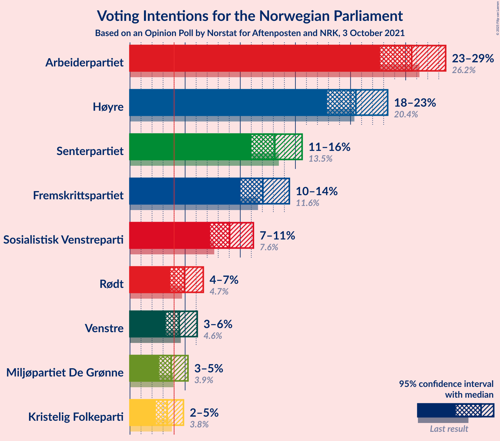

### Confidence Intervals

| Party | Last Result | Poll Result | 80% Confidence Interval | 90% Confidence Interval | 95% Confidence Interval | 99% Confidence Interval |
|:-----:|:-----------:|:-----------:|:-----------------------:|:-----------------------:|:-----------------------:|:-----------------------:|
| Arbeiderpartiet | 26.2% | 25.5% | 23.7–27.6% |23.1–28.1% |22.7–28.6% |21.8–29.6% |
| Høyre | 20.4% | 20.5% | 18.8–22.4% |18.3–22.9% |17.9–23.4% |17.1–24.3% |
| Senterpartiet | 13.5% | 13.1% | 11.7–14.8% |11.3–15.2% |11.0–15.6% |10.4–16.4% |
| Fremskrittspartiet | 11.6% | 12.0% | 10.7–13.6% |10.3–14.1% |10.0–14.4% |9.4–15.2% |
| Sosialistisk Venstreparti | 7.6% | 9.0% | 7.9–10.4% |7.5–10.8% |7.3–11.2% |6.7–11.9% |
| Rødt | 4.7% | 4.9% | 4.1–6.1% |3.9–6.4% |3.7–6.6% |3.3–7.2% |
| Venstre | 4.6% | 4.5% | 3.7–5.5% |3.4–5.8% |3.2–6.1% |2.9–6.6% |
| Miljøpartiet De Grønne | 3.9% | 3.7% | 3.0–4.7% |2.8–5.0% |2.6–5.3% |2.3–5.8% |
| Kristelig Folkeparti | 3.8% | 3.4% | 2.7–4.3% |2.5–4.6% |2.3–4.8% |2.1–5.3% |

*Note:* The poll result column reflects the actual value used in the calculations. Published results may vary slightly, and in addition be rounded to fewer digits.

## Seats

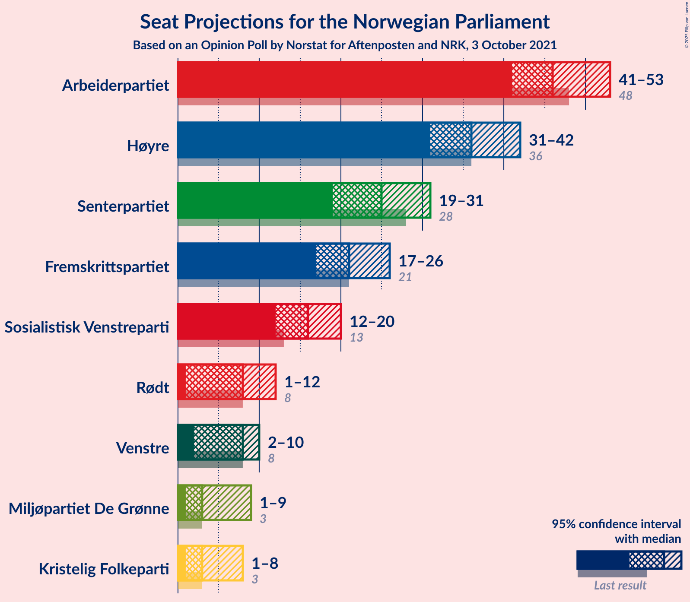

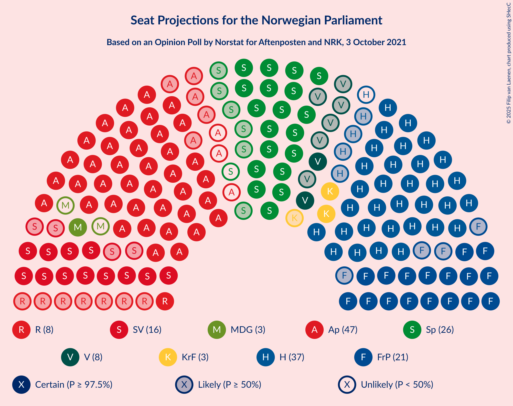

### Confidence Intervals

| Party | Last Result | Median | 80% Confidence Interval | 90% Confidence Interval | 95% Confidence Interval | 99% Confidence Interval |
|:-----:|:-----------:|:------:|:-----------------------:|:-----------------------:|:-----------------------:|:-----------------------:|
| <a href="#arbeiderpartiet">Arbeiderpartiet</a> | 48 | 46 | 43–51 |43–52 |41–53 |40–56 |
| <a href="#høyre">Høyre</a> | 36 | 36 | 33–40 |32–40 |31–42 |29–44 |
| <a href="#senterpartiet">Senterpartiet</a> | 28 | 25 | 21–29 |20–30 |19–31 |18–32 |
| <a href="#fremskrittspartiet">Fremskrittspartiet</a> | 21 | 21 | 18–24 |17–25 |17–26 |16–28 |
| <a href="#sosialistisk-venstreparti">Sosialistisk Venstreparti</a> | 13 | 16 | 13–18 |13–20 |12–20 |11–21 |
| <a href="#rødt">Rødt</a> | 8 | 8 | 1–11 |1–11 |1–12 |1–13 |
| <a href="#venstre">Venstre</a> | 8 | 8 | 3–10 |3–10 |2–10 |2–11 |
| <a href="#miljøpartiet-de-grønne">Miljøpartiet De Grønne</a> | 3 | 3 | 2–8 |1–8 |1–9 |1–10 |
| <a href="#kristelig-folkeparti">Kristelig Folkeparti</a> | 3 | 3 | 2–7 |1–8 |1–8 |0–9 |

### Arbeiderpartiet

*For a full overview of the results for this party, see the [Arbeiderpartiet](party-arbeiderpartiet.html) page.*

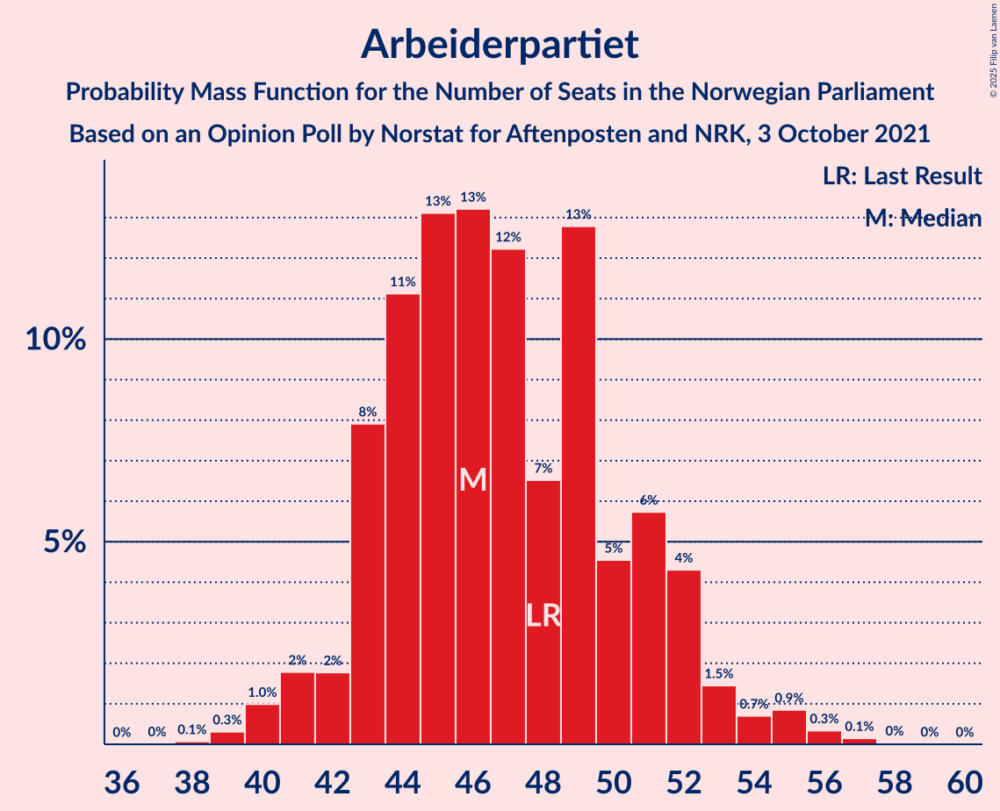

| Number of Seats | Probability | Accumulated | Special Marks |
|:---------------:|:-----------:|:-----------:|:-------------:|
| 38 | 0.1% | 100% |  |
| 39 | 0.3% | 99.9% |  |
| 40 | 1.0% | 99.6% |  |
| 41 | 2% | 98.6% |  |
| 42 | 2% | 97% |  |
| 43 | 8% | 95% |  |
| 44 | 11% | 87% |  |
| 45 | 13% | 76% |  |
| 46 | 13% | 63% | Median |
| 47 | 12% | 50% |  |
| 48 | 7% | 37% | Last Result |
| 49 | 13% | 31% |  |
| 50 | 5% | 18% |  |
| 51 | 6% | 14% |  |
| 52 | 4% | 8% |  |
| 53 | 1.5% | 4% |  |
| 54 | 0.7% | 2% |  |
| 55 | 0.9% | 1.4% |  |
| 56 | 0.3% | 0.5% |  |
| 57 | 0.1% | 0.2% |  |
| 58 | 0% | 0.1% |  |
| 59 | 0% | 0% |  |

### Høyre

*For a full overview of the results for this party, see the [Høyre](party-høyre.html) page.*

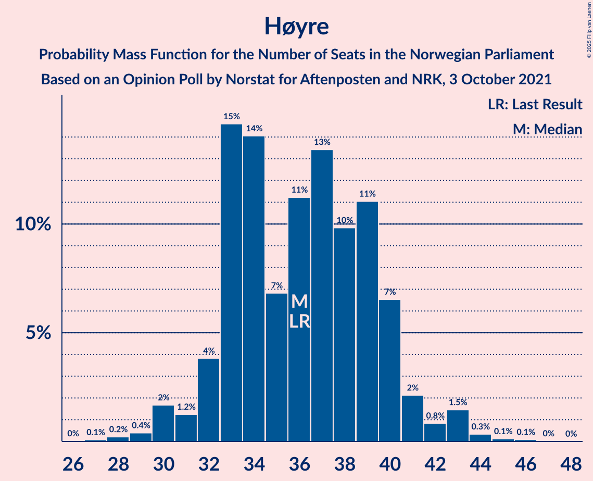

| Number of Seats | Probability | Accumulated | Special Marks |
|:---------------:|:-----------:|:-----------:|:-------------:|
| 27 | 0.1% | 100% |  |
| 28 | 0.2% | 99.9% |  |
| 29 | 0.4% | 99.7% |  |
| 30 | 2% | 99.3% |  |
| 31 | 1.2% | 98% |  |
| 32 | 4% | 96% |  |
| 33 | 15% | 93% |  |
| 34 | 14% | 78% |  |
| 35 | 7% | 64% |  |
| 36 | 11% | 57% | Last Result, Median |
| 37 | 13% | 46% |  |
| 38 | 10% | 32% |  |
| 39 | 11% | 23% |  |
| 40 | 7% | 12% |  |
| 41 | 2% | 5% |  |
| 42 | 0.8% | 3% |  |
| 43 | 1.5% | 2% |  |
| 44 | 0.3% | 0.6% |  |
| 45 | 0.1% | 0.2% |  |
| 46 | 0.1% | 0.1% |  |
| 47 | 0% | 0% |  |

### Senterpartiet

*For a full overview of the results for this party, see the [Senterpartiet](party-senterpartiet.html) page.*

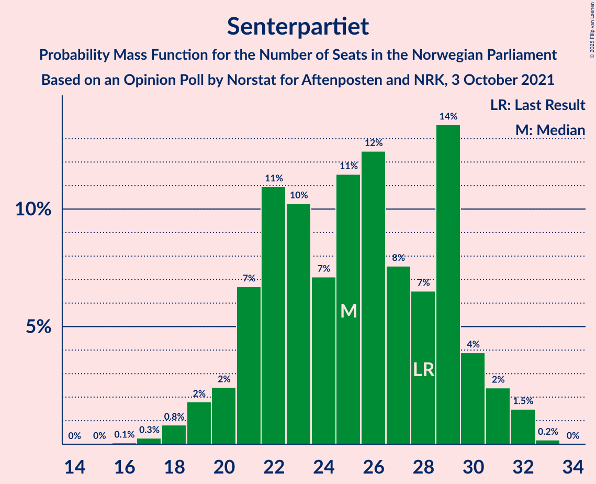

| Number of Seats | Probability | Accumulated | Special Marks |
|:---------------:|:-----------:|:-----------:|:-------------:|
| 16 | 0.1% | 100% |  |
| 17 | 0.3% | 99.9% |  |
| 18 | 0.8% | 99.7% |  |
| 19 | 2% | 98.8% |  |
| 20 | 2% | 97% |  |
| 21 | 7% | 95% |  |
| 22 | 11% | 88% |  |
| 23 | 10% | 77% |  |
| 24 | 7% | 67% |  |
| 25 | 11% | 60% | Median |
| 26 | 12% | 48% |  |
| 27 | 8% | 36% |  |
| 28 | 7% | 28% | Last Result |
| 29 | 14% | 22% |  |
| 30 | 4% | 8% |  |
| 31 | 2% | 4% |  |
| 32 | 1.5% | 2% |  |
| 33 | 0.2% | 0.2% |  |
| 34 | 0% | 0% |  |

### Fremskrittspartiet

*For a full overview of the results for this party, see the [Fremskrittspartiet](party-fremskrittspartiet.html) page.*

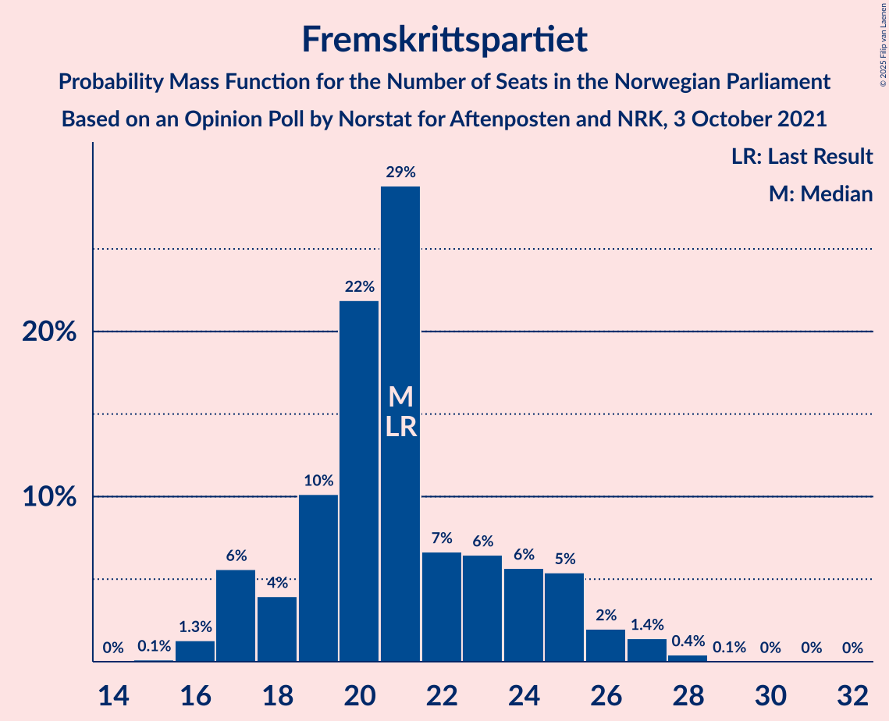

| Number of Seats | Probability | Accumulated | Special Marks |
|:---------------:|:-----------:|:-----------:|:-------------:|
| 15 | 0.1% | 100% |  |
| 16 | 1.3% | 99.8% |  |
| 17 | 6% | 98.6% |  |
| 18 | 4% | 93% |  |
| 19 | 10% | 89% |  |
| 20 | 22% | 79% |  |
| 21 | 29% | 57% | Last Result, Median |
| 22 | 7% | 28% |  |
| 23 | 6% | 21% |  |
| 24 | 6% | 15% |  |
| 25 | 5% | 9% |  |
| 26 | 2% | 4% |  |
| 27 | 1.4% | 2% |  |
| 28 | 0.4% | 0.5% |  |
| 29 | 0.1% | 0.1% |  |
| 30 | 0% | 0.1% |  |
| 31 | 0% | 0% |  |

### Sosialistisk Venstreparti

*For a full overview of the results for this party, see the [Sosialistisk Venstreparti](party-sosialistiskvenstreparti.html) page.*

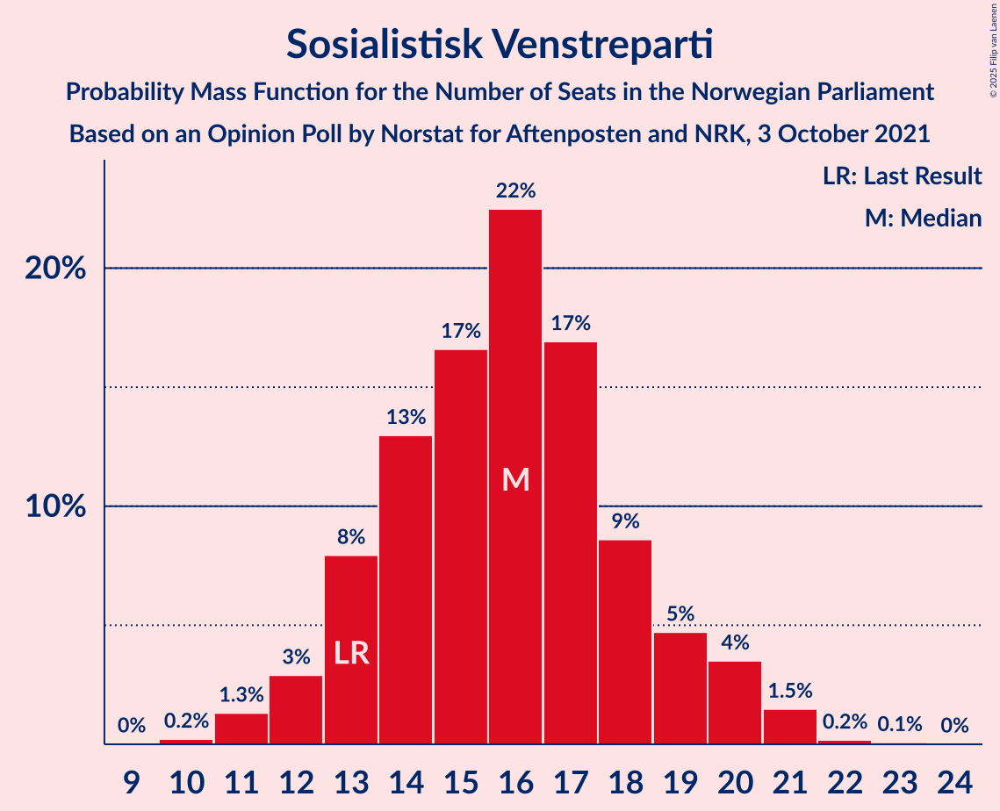

| Number of Seats | Probability | Accumulated | Special Marks |
|:---------------:|:-----------:|:-----------:|:-------------:|
| 10 | 0.2% | 100% |  |
| 11 | 1.3% | 99.7% |  |
| 12 | 3% | 98% |  |
| 13 | 8% | 96% | Last Result |
| 14 | 13% | 88% |  |
| 15 | 17% | 75% |  |
| 16 | 22% | 58% | Median |
| 17 | 17% | 36% |  |
| 18 | 9% | 19% |  |
| 19 | 5% | 10% |  |
| 20 | 4% | 5% |  |
| 21 | 1.5% | 2% |  |
| 22 | 0.2% | 0.3% |  |
| 23 | 0.1% | 0.1% |  |
| 24 | 0% | 0% |  |

### Rødt

*For a full overview of the results for this party, see the [Rødt](party-rødt.html) page.*

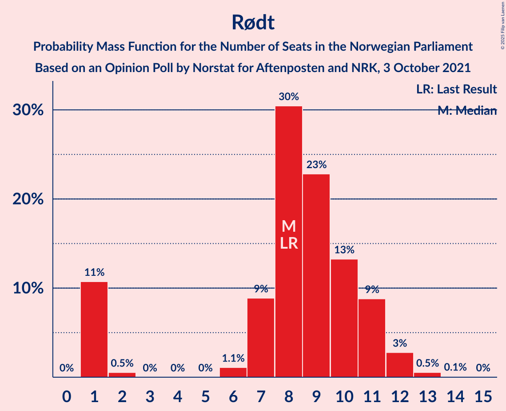

| Number of Seats | Probability | Accumulated | Special Marks |
|:---------------:|:-----------:|:-----------:|:-------------:|
| 1 | 11% | 100% |  |
| 2 | 0.5% | 89% |  |
| 3 | 0% | 89% |  |
| 4 | 0% | 89% |  |
| 5 | 0% | 89% |  |
| 6 | 1.1% | 89% |  |
| 7 | 9% | 88% |  |
| 8 | 30% | 79% | Last Result, Median |
| 9 | 23% | 48% |  |
| 10 | 13% | 25% |  |
| 11 | 9% | 12% |  |
| 12 | 3% | 3% |  |
| 13 | 0.5% | 0.6% |  |
| 14 | 0.1% | 0.1% |  |
| 15 | 0% | 0% |  |

### Venstre

*For a full overview of the results for this party, see the [Venstre](party-venstre.html) page.*

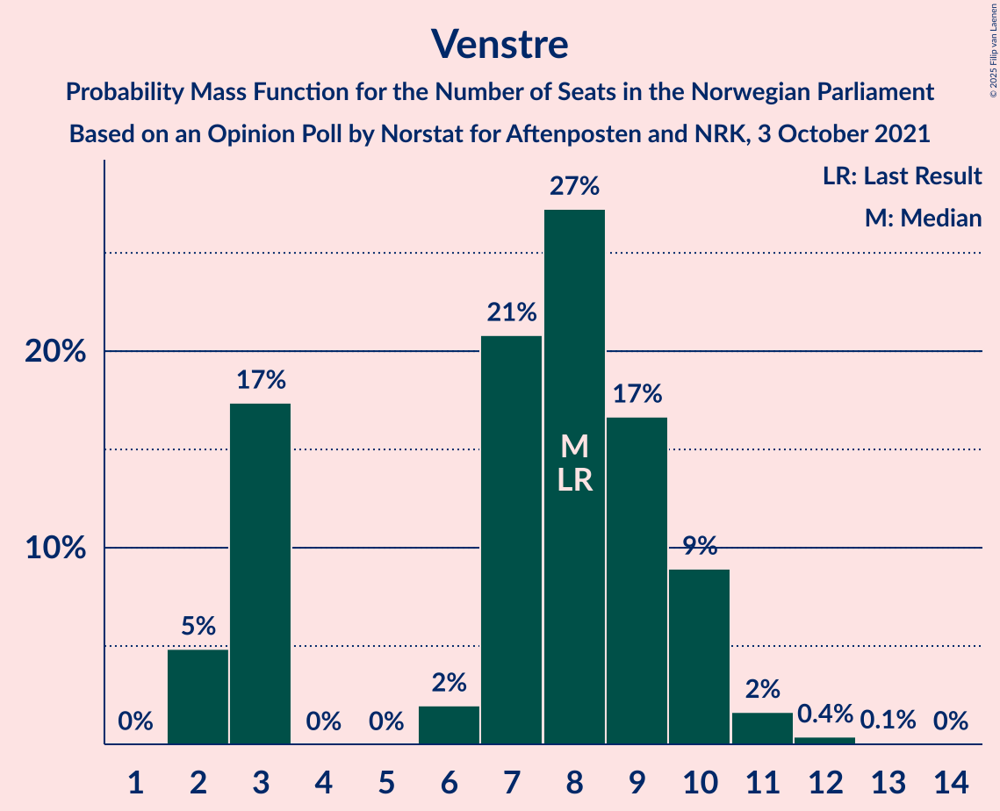

| Number of Seats | Probability | Accumulated | Special Marks |
|:---------------:|:-----------:|:-----------:|:-------------:|
| 2 | 5% | 100% |  |
| 3 | 17% | 95% |  |
| 4 | 0% | 78% |  |
| 5 | 0% | 78% |  |
| 6 | 2% | 78% |  |
| 7 | 21% | 76% |  |
| 8 | 27% | 55% | Last Result, Median |
| 9 | 17% | 28% |  |
| 10 | 9% | 11% |  |
| 11 | 2% | 2% |  |
| 12 | 0.4% | 0.5% |  |
| 13 | 0.1% | 0.1% |  |
| 14 | 0% | 0% |  |

### Miljøpartiet De Grønne

*For a full overview of the results for this party, see the [Miljøpartiet De Grønne](party-miljøpartietdegrønne.html) page.*

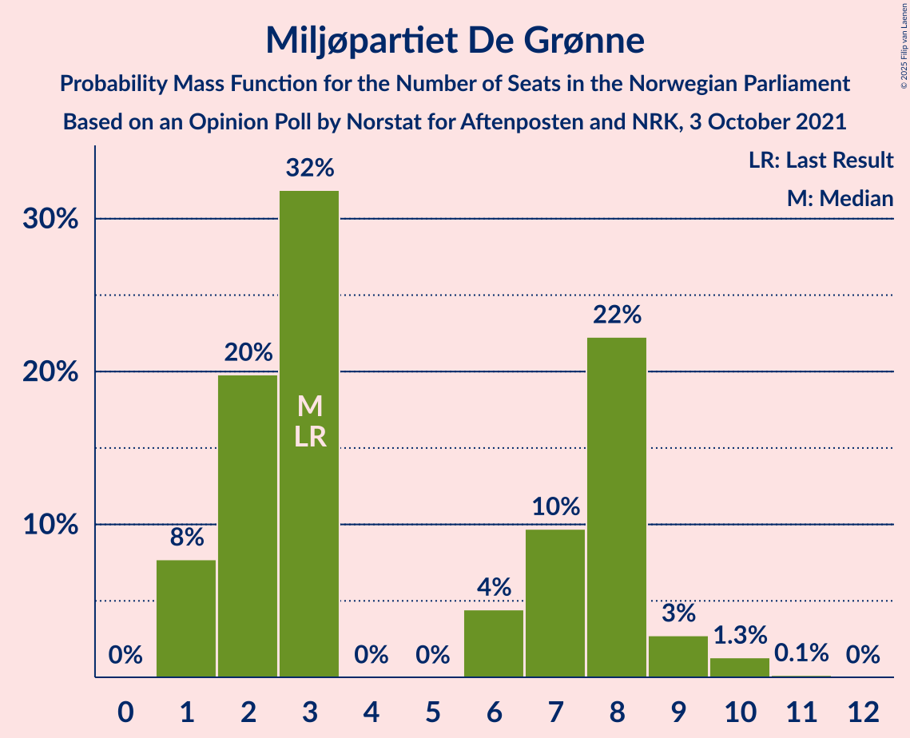

| Number of Seats | Probability | Accumulated | Special Marks |
|:---------------:|:-----------:|:-----------:|:-------------:|
| 1 | 8% | 100% |  |
| 2 | 20% | 92% |  |
| 3 | 32% | 72% | Last Result, Median |
| 4 | 0% | 41% |  |
| 5 | 0% | 41% |  |
| 6 | 4% | 41% |  |
| 7 | 10% | 36% |  |
| 8 | 22% | 26% |  |
| 9 | 3% | 4% |  |
| 10 | 1.3% | 1.5% |  |
| 11 | 0.1% | 0.2% |  |
| 12 | 0% | 0% |  |

### Kristelig Folkeparti

*For a full overview of the results for this party, see the [Kristelig Folkeparti](party-kristeligfolkeparti.html) page.*

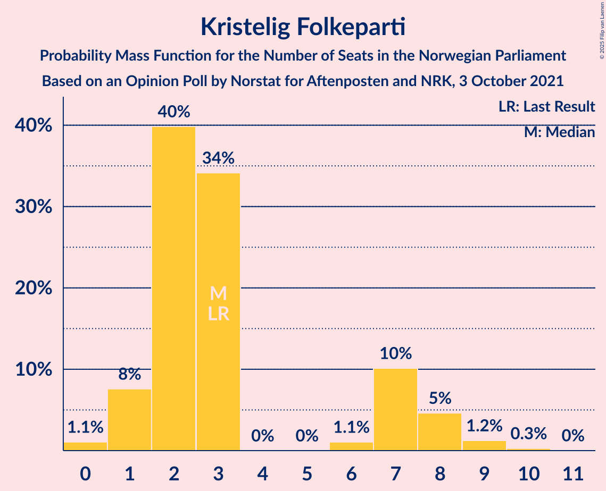

| Number of Seats | Probability | Accumulated | Special Marks |
|:---------------:|:-----------:|:-----------:|:-------------:|
| 0 | 1.1% | 100% |  |
| 1 | 8% | 98.9% |  |
| 2 | 40% | 91% |  |
| 3 | 34% | 51% | Last Result, Median |
| 4 | 0% | 17% |  |
| 5 | 0% | 17% |  |
| 6 | 1.1% | 17% |  |
| 7 | 10% | 16% |  |
| 8 | 5% | 6% |  |
| 9 | 1.2% | 2% |  |
| 10 | 0.3% | 0.3% |  |
| 11 | 0% | 0% |  |

## Coalitions

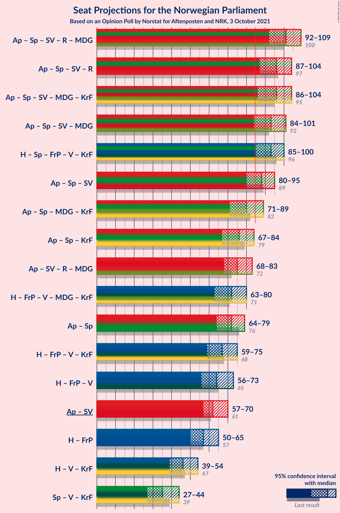

### Confidence Intervals

| Coalition | Last Result | Median | Majority? | 80% Confidence Interval | 90% Confidence Interval | 95% Confidence Interval | 99% Confidence Interval |
|:---------:|:-----------:|:------:|:---------:|:-----------------------:|:-----------------------:|:-----------------------:|:-----------------------:|
| Arbeiderpartiet – Senterpartiet – Sosialistisk Venstreparti – Rødt – Miljøpartiet De Grønne | 100 | 101 | 100% | 95–105 | 93–107 | 92–109 | 89–111 |
| Arbeiderpartiet – Senterpartiet – Sosialistisk Venstreparti – Rødt | 97 | 96 | 99.6% | 90–102 | 89–102 | 87–104 | 85–106 |
| Arbeiderpartiet – Senterpartiet – Sosialistisk Venstreparti – Miljøpartiet De Grønne – Kristelig Folkeparti | 95 | 96 | 99.5% | 90–101 | 88–102 | 86–104 | 85–106 |
| Arbeiderpartiet – Senterpartiet – Sosialistisk Venstreparti – Miljøpartiet De Grønne | 92 | 93 | 96% | 87–98 | 85–99 | 84–101 | 81–103 |
| Høyre – Senterpartiet – Fremskrittspartiet – Venstre – Kristelig Folkeparti | 96 | 93 | 98% | 87–98 | 87–99 | 85–100 | 81–103 |
| Arbeiderpartiet – Senterpartiet – Sosialistisk Venstreparti | 89 | 88 | 79% | 82–93 | 82–94 | 80–95 | 78–99 |
| Arbeiderpartiet – Senterpartiet – Miljøpartiet De Grønne – Kristelig Folkeparti | 82 | 80 | 17% | 73–85 | 72–87 | 71–89 | 68–90 |
| Arbeiderpartiet – Senterpartiet – Kristelig Folkeparti | 79 | 76 | 1.1% | 69–80 | 68–82 | 67–84 | 65–86 |
| Arbeiderpartiet – Sosialistisk Venstreparti – Rødt – Miljøpartiet De Grønne | 72 | 75 | 1.4% | 71–80 | 69–82 | 68–83 | 65–88 |
| Høyre – Fremskrittspartiet – Venstre – Miljøpartiet De Grønne – Kristelig Folkeparti | 71 | 72 | 0.2% | 66–78 | 65–79 | 63–80 | 61–83 |
| Arbeiderpartiet – Senterpartiet | 76 | 72 | 0% | 67–77 | 66–78 | 64–79 | 63–81 |
| Høyre – Fremskrittspartiet – Venstre – Kristelig Folkeparti | 68 | 67 | 0% | 61–73 | 60–74 | 59–75 | 57–79 |
| Høyre – Fremskrittspartiet – Venstre | 65 | 64 | 0% | 59–69 | 57–71 | 56–73 | 55–75 |
| Arbeiderpartiet – Sosialistisk Venstreparti | 61 | 62 | 0% | 59–68 | 58–68 | 57–70 | 54–72 |
| Høyre – Fremskrittspartiet | 57 | 57 | 0% | 52–62 | 51–64 | 50–65 | 48–67 |
| Høyre – Venstre – Kristelig Folkeparti | 47 | 46 | 0% | 42–51 | 40–53 | 39–54 | 37–56 |
| Senterpartiet – Venstre – Kristelig Folkeparti | 39 | 35 | 0% | 30–41 | 28–42 | 27–44 | 25–46 |

### Arbeiderpartiet – Senterpartiet – Sosialistisk Venstreparti – Rødt – Miljøpartiet De Grønne

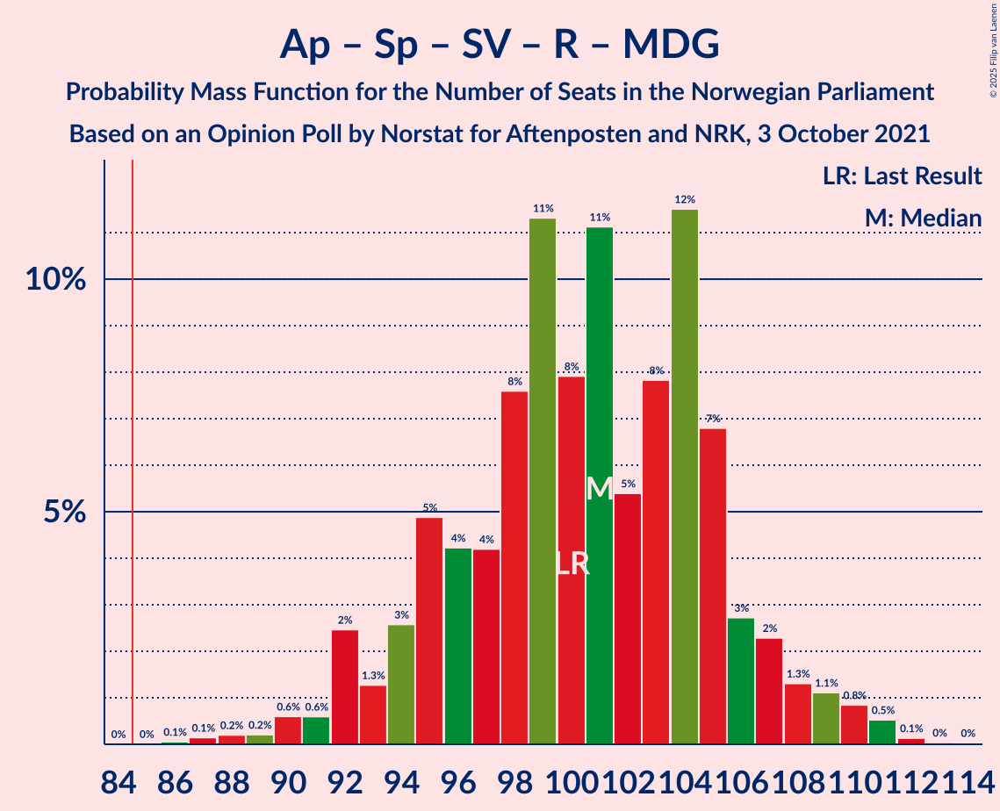

| Number of Seats | Probability | Accumulated | Special Marks |
|:---------------:|:-----------:|:-----------:|:-------------:|
| 86 | 0.1% | 100% |  |
| 87 | 0.1% | 99.9% |  |
| 88 | 0.2% | 99.8% |  |
| 89 | 0.2% | 99.6% |  |
| 90 | 0.6% | 99.4% |  |
| 91 | 0.6% | 98.8% |  |
| 92 | 2% | 98% |  |
| 93 | 1.3% | 96% |  |
| 94 | 3% | 94% |  |
| 95 | 5% | 92% |  |
| 96 | 4% | 87% |  |
| 97 | 4% | 83% |  |
| 98 | 8% | 79% | Median |
| 99 | 11% | 71% |  |
| 100 | 8% | 60% | Last Result |
| 101 | 11% | 52% |  |
| 102 | 5% | 41% |  |
| 103 | 8% | 35% |  |
| 104 | 12% | 27% |  |
| 105 | 7% | 16% |  |
| 106 | 3% | 9% |  |
| 107 | 2% | 6% |  |
| 108 | 1.3% | 4% |  |
| 109 | 1.1% | 3% |  |
| 110 | 0.8% | 2% |  |
| 111 | 0.5% | 0.7% |  |
| 112 | 0.1% | 0.2% |  |
| 113 | 0% | 0.1% |  |
| 114 | 0% | 0% |  |

### Arbeiderpartiet – Senterpartiet – Sosialistisk Venstreparti – Rødt

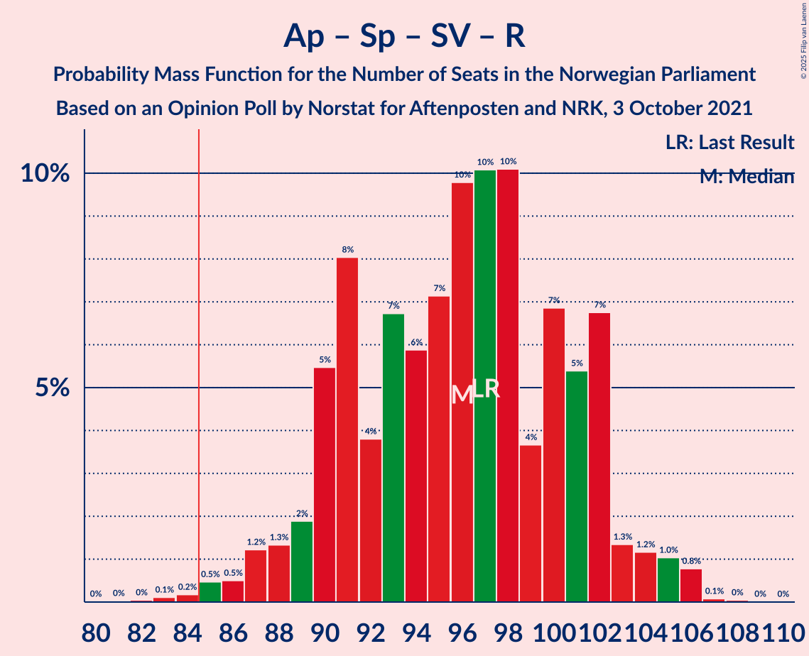

| Number of Seats | Probability | Accumulated | Special Marks |
|:---------------:|:-----------:|:-----------:|:-------------:|
| 81 | 0% | 100% |  |
| 82 | 0% | 99.9% |  |
| 83 | 0.1% | 99.9% |  |
| 84 | 0.2% | 99.8% |  |
| 85 | 0.5% | 99.6% | Majority |
| 86 | 0.5% | 99.1% |  |
| 87 | 1.2% | 98.6% |  |
| 88 | 1.3% | 97% |  |
| 89 | 2% | 96% |  |
| 90 | 5% | 94% |  |
| 91 | 8% | 89% |  |
| 92 | 4% | 81% |  |
| 93 | 7% | 77% |  |
| 94 | 6% | 70% |  |
| 95 | 7% | 64% | Median |
| 96 | 10% | 57% |  |
| 97 | 10% | 47% | Last Result |
| 98 | 10% | 37% |  |
| 99 | 4% | 27% |  |
| 100 | 7% | 23% |  |
| 101 | 5% | 17% |  |
| 102 | 7% | 11% |  |
| 103 | 1.3% | 4% |  |
| 104 | 1.2% | 3% |  |
| 105 | 1.0% | 2% |  |
| 106 | 0.8% | 0.9% |  |
| 107 | 0.1% | 0.2% |  |
| 108 | 0% | 0.1% |  |
| 109 | 0% | 0% |  |

### Arbeiderpartiet – Senterpartiet – Sosialistisk Venstreparti – Miljøpartiet De Grønne – Kristelig Folkeparti

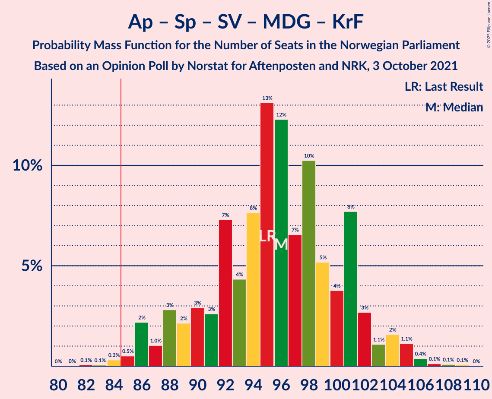

| Number of Seats | Probability | Accumulated | Special Marks |
|:---------------:|:-----------:|:-----------:|:-------------:|
| 82 | 0.1% | 100% |  |
| 83 | 0.1% | 99.9% |  |
| 84 | 0.3% | 99.8% |  |
| 85 | 0.5% | 99.5% | Majority |
| 86 | 2% | 99.0% |  |
| 87 | 1.0% | 97% |  |
| 88 | 3% | 96% |  |
| 89 | 2% | 93% |  |
| 90 | 3% | 91% |  |
| 91 | 3% | 88% |  |
| 92 | 7% | 85% |  |
| 93 | 4% | 78% | Median |
| 94 | 8% | 74% |  |
| 95 | 13% | 66% | Last Result |
| 96 | 12% | 53% |  |
| 97 | 7% | 41% |  |
| 98 | 10% | 34% |  |
| 99 | 5% | 24% |  |
| 100 | 4% | 19% |  |
| 101 | 8% | 15% |  |
| 102 | 3% | 7% |  |
| 103 | 1.1% | 4% |  |
| 104 | 2% | 3% |  |
| 105 | 1.1% | 2% |  |
| 106 | 0.4% | 0.7% |  |
| 107 | 0.1% | 0.3% |  |
| 108 | 0.1% | 0.2% |  |
| 109 | 0.1% | 0.1% |  |
| 110 | 0% | 0% |  |

### Arbeiderpartiet – Senterpartiet – Sosialistisk Venstreparti – Miljøpartiet De Grønne

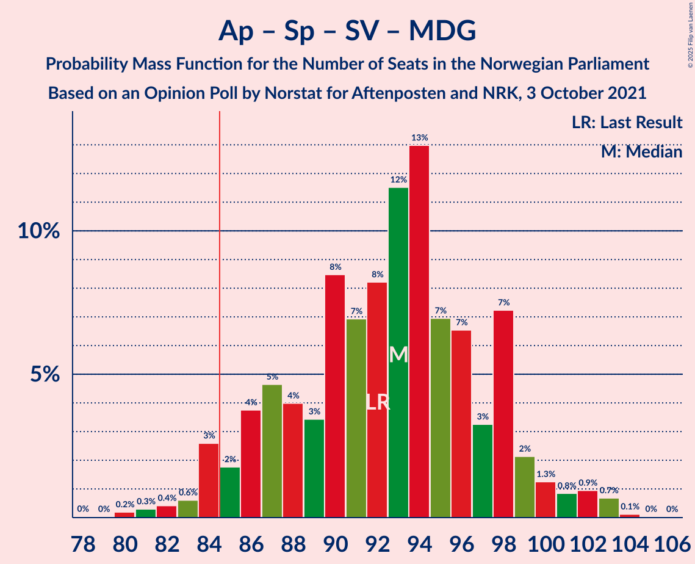

| Number of Seats | Probability | Accumulated | Special Marks |
|:---------------:|:-----------:|:-----------:|:-------------:|
| 78 | 0% | 100% |  |
| 79 | 0% | 99.9% |  |
| 80 | 0.2% | 99.9% |  |
| 81 | 0.3% | 99.7% |  |
| 82 | 0.4% | 99.4% |  |
| 83 | 0.6% | 99.0% |  |
| 84 | 3% | 98% |  |
| 85 | 2% | 96% | Majority |
| 86 | 4% | 94% |  |
| 87 | 5% | 90% |  |
| 88 | 4% | 86% |  |
| 89 | 3% | 82% |  |
| 90 | 8% | 78% | Median |
| 91 | 7% | 70% |  |
| 92 | 8% | 63% | Last Result |
| 93 | 12% | 55% |  |
| 94 | 13% | 43% |  |
| 95 | 7% | 30% |  |
| 96 | 7% | 23% |  |
| 97 | 3% | 17% |  |
| 98 | 7% | 13% |  |
| 99 | 2% | 6% |  |
| 100 | 1.3% | 4% |  |
| 101 | 0.8% | 3% |  |
| 102 | 0.9% | 2% |  |
| 103 | 0.7% | 0.9% |  |
| 104 | 0.1% | 0.2% |  |
| 105 | 0% | 0.1% |  |
| 106 | 0% | 0% |  |

### Høyre – Senterpartiet – Fremskrittspartiet – Venstre – Kristelig Folkeparti

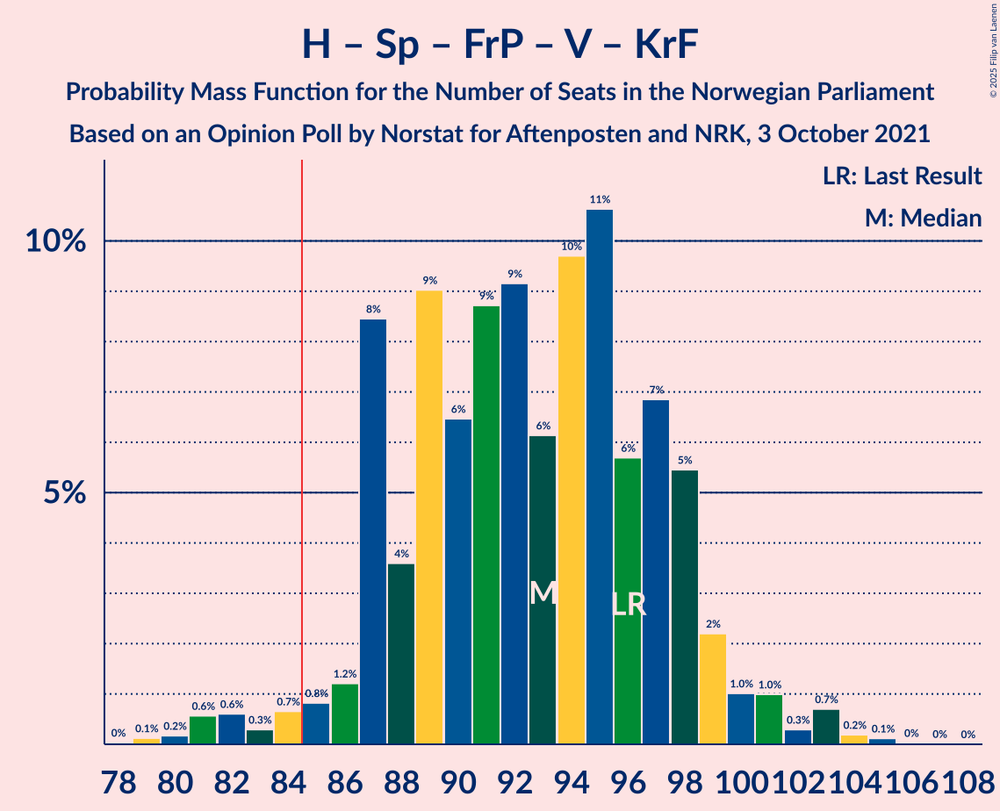

| Number of Seats | Probability | Accumulated | Special Marks |
|:---------------:|:-----------:|:-----------:|:-------------:|
| 78 | 0% | 100% |  |
| 79 | 0.1% | 99.9% |  |
| 80 | 0.2% | 99.8% |  |
| 81 | 0.6% | 99.6% |  |
| 82 | 0.6% | 99.1% |  |
| 83 | 0.3% | 98% |  |
| 84 | 0.7% | 98% |  |
| 85 | 0.8% | 98% | Majority |
| 86 | 1.2% | 97% |  |
| 87 | 8% | 95% |  |
| 88 | 4% | 87% |  |
| 89 | 9% | 83% |  |
| 90 | 6% | 74% |  |
| 91 | 9% | 68% |  |
| 92 | 9% | 59% |  |
| 93 | 6% | 50% | Median |
| 94 | 10% | 44% |  |
| 95 | 11% | 34% |  |
| 96 | 6% | 24% | Last Result |
| 97 | 7% | 18% |  |
| 98 | 5% | 11% |  |
| 99 | 2% | 6% |  |
| 100 | 1.0% | 3% |  |
| 101 | 1.0% | 2% |  |
| 102 | 0.3% | 1.4% |  |
| 103 | 0.7% | 1.1% |  |
| 104 | 0.2% | 0.4% |  |
| 105 | 0.1% | 0.2% |  |
| 106 | 0% | 0.1% |  |
| 107 | 0% | 0% |  |

### Arbeiderpartiet – Senterpartiet – Sosialistisk Venstreparti

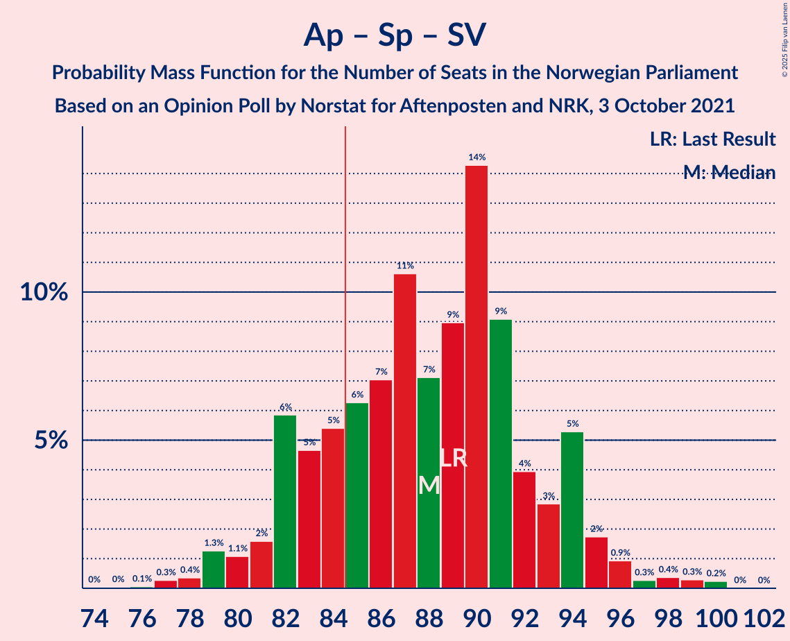

| Number of Seats | Probability | Accumulated | Special Marks |
|:---------------:|:-----------:|:-----------:|:-------------:|
| 75 | 0% | 100% |  |
| 76 | 0.1% | 99.9% |  |
| 77 | 0.3% | 99.9% |  |
| 78 | 0.4% | 99.6% |  |
| 79 | 1.3% | 99.2% |  |
| 80 | 1.1% | 98% |  |
| 81 | 2% | 97% |  |
| 82 | 6% | 95% |  |
| 83 | 5% | 89% |  |
| 84 | 5% | 85% |  |
| 85 | 6% | 79% | Majority |
| 86 | 7% | 73% |  |
| 87 | 11% | 66% | Median |
| 88 | 7% | 55% |  |
| 89 | 9% | 48% | Last Result |
| 90 | 14% | 39% |  |
| 91 | 9% | 25% |  |
| 92 | 4% | 16% |  |
| 93 | 3% | 12% |  |
| 94 | 5% | 9% |  |
| 95 | 2% | 4% |  |
| 96 | 0.9% | 2% |  |
| 97 | 0.3% | 1.2% |  |
| 98 | 0.4% | 0.9% |  |
| 99 | 0.3% | 0.6% |  |
| 100 | 0.2% | 0.3% |  |
| 101 | 0% | 0% |  |

### Arbeiderpartiet – Senterpartiet – Miljøpartiet De Grønne – Kristelig Folkeparti

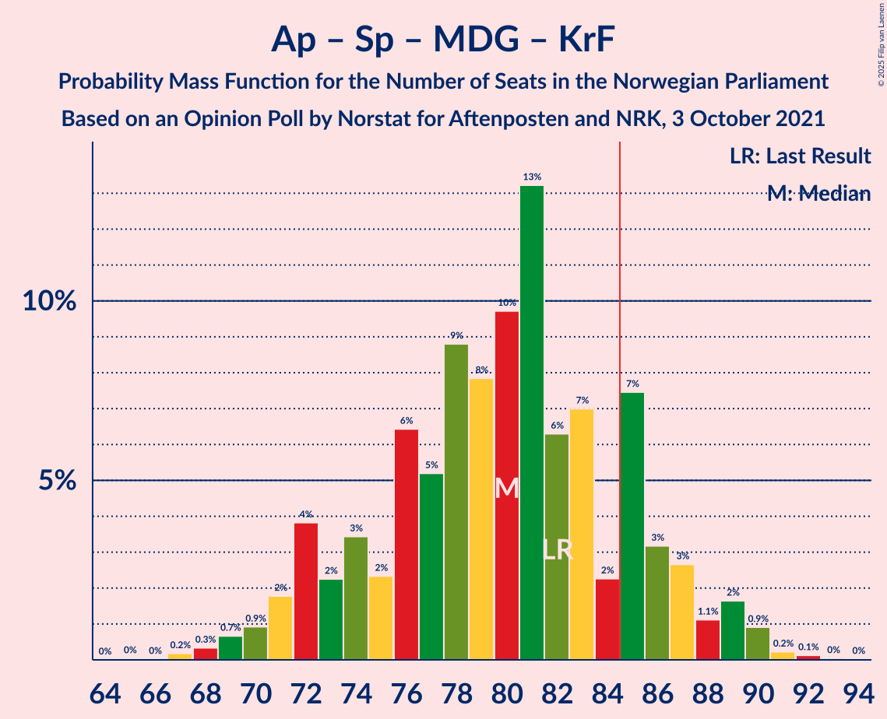

| Number of Seats | Probability | Accumulated | Special Marks |
|:---------------:|:-----------:|:-----------:|:-------------:|
| 65 | 0% | 100% |  |
| 66 | 0% | 99.9% |  |
| 67 | 0.2% | 99.9% |  |
| 68 | 0.3% | 99.7% |  |
| 69 | 0.7% | 99.4% |  |
| 70 | 0.9% | 98.7% |  |
| 71 | 2% | 98% |  |
| 72 | 4% | 96% |  |
| 73 | 2% | 92% |  |
| 74 | 3% | 90% |  |
| 75 | 2% | 87% |  |
| 76 | 6% | 84% |  |
| 77 | 5% | 78% | Median |
| 78 | 9% | 73% |  |
| 79 | 8% | 64% |  |
| 80 | 10% | 56% |  |
| 81 | 13% | 46% |  |
| 82 | 6% | 33% | Last Result |
| 83 | 7% | 27% |  |
| 84 | 2% | 20% |  |
| 85 | 7% | 17% | Majority |
| 86 | 3% | 10% |  |
| 87 | 3% | 7% |  |
| 88 | 1.1% | 4% |  |
| 89 | 2% | 3% |  |
| 90 | 0.9% | 1.3% |  |
| 91 | 0.2% | 0.4% |  |
| 92 | 0.1% | 0.2% |  |
| 93 | 0% | 0.1% |  |
| 94 | 0% | 0% |  |

### Arbeiderpartiet – Senterpartiet – Kristelig Folkeparti

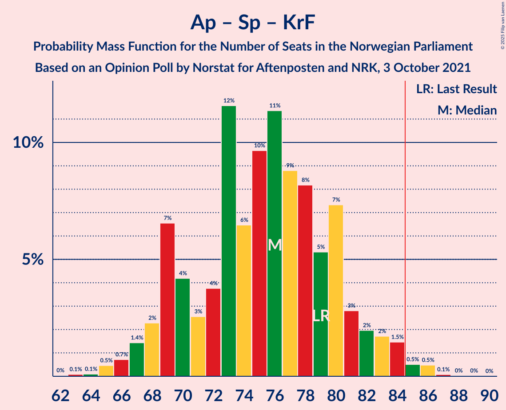

| Number of Seats | Probability | Accumulated | Special Marks |
|:---------------:|:-----------:|:-----------:|:-------------:|
| 62 | 0% | 100% |  |
| 63 | 0.1% | 99.9% |  |
| 64 | 0.1% | 99.8% |  |
| 65 | 0.5% | 99.8% |  |
| 66 | 0.7% | 99.3% |  |
| 67 | 1.4% | 98.6% |  |
| 68 | 2% | 97% |  |
| 69 | 7% | 95% |  |
| 70 | 4% | 88% |  |
| 71 | 3% | 84% |  |
| 72 | 4% | 82% |  |
| 73 | 12% | 78% |  |
| 74 | 6% | 66% | Median |
| 75 | 10% | 60% |  |
| 76 | 11% | 50% |  |
| 77 | 9% | 39% |  |
| 78 | 8% | 30% |  |
| 79 | 5% | 22% | Last Result |
| 80 | 7% | 16% |  |
| 81 | 3% | 9% |  |
| 82 | 2% | 6% |  |
| 83 | 2% | 4% |  |
| 84 | 1.5% | 3% |  |
| 85 | 0.5% | 1.1% | Majority |
| 86 | 0.5% | 0.6% |  |
| 87 | 0.1% | 0.2% |  |
| 88 | 0% | 0.1% |  |
| 89 | 0% | 0% |  |

### Arbeiderpartiet – Sosialistisk Venstreparti – Rødt – Miljøpartiet De Grønne

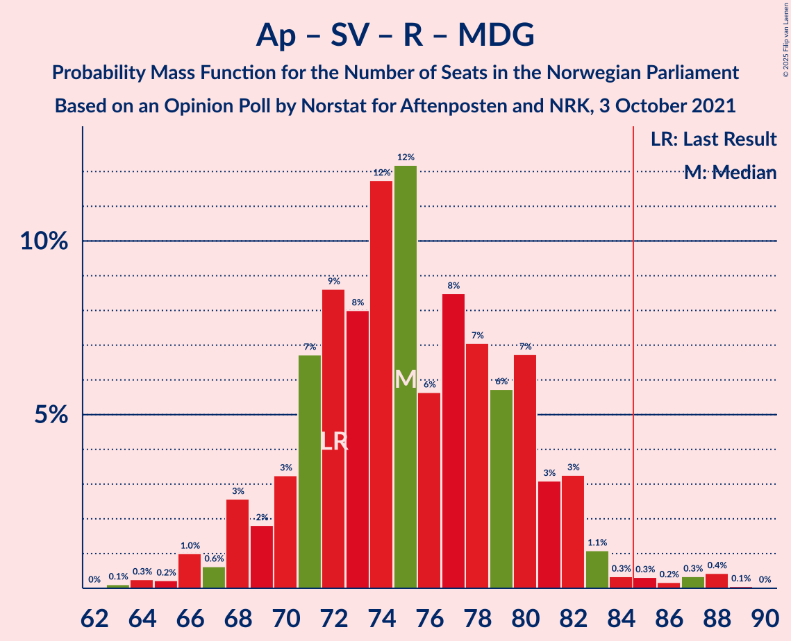

| Number of Seats | Probability | Accumulated | Special Marks |
|:---------------:|:-----------:|:-----------:|:-------------:|
| 62 | 0% | 100% |  |
| 63 | 0.1% | 99.9% |  |
| 64 | 0.3% | 99.8% |  |
| 65 | 0.2% | 99.6% |  |
| 66 | 1.0% | 99.3% |  |
| 67 | 0.6% | 98% |  |
| 68 | 3% | 98% |  |
| 69 | 2% | 95% |  |
| 70 | 3% | 93% |  |
| 71 | 7% | 90% |  |
| 72 | 9% | 83% | Last Result |
| 73 | 8% | 75% | Median |
| 74 | 12% | 67% |  |
| 75 | 12% | 55% |  |
| 76 | 6% | 43% |  |
| 77 | 8% | 37% |  |
| 78 | 7% | 29% |  |
| 79 | 6% | 22% |  |
| 80 | 7% | 16% |  |
| 81 | 3% | 9% |  |
| 82 | 3% | 6% |  |
| 83 | 1.1% | 3% |  |
| 84 | 0.3% | 2% |  |
| 85 | 0.3% | 1.4% | Majority |
| 86 | 0.2% | 1.1% |  |
| 87 | 0.3% | 0.9% |  |
| 88 | 0.4% | 0.5% |  |
| 89 | 0.1% | 0.1% |  |
| 90 | 0% | 0% |  |

### Høyre – Fremskrittspartiet – Venstre – Miljøpartiet De Grønne – Kristelig Folkeparti

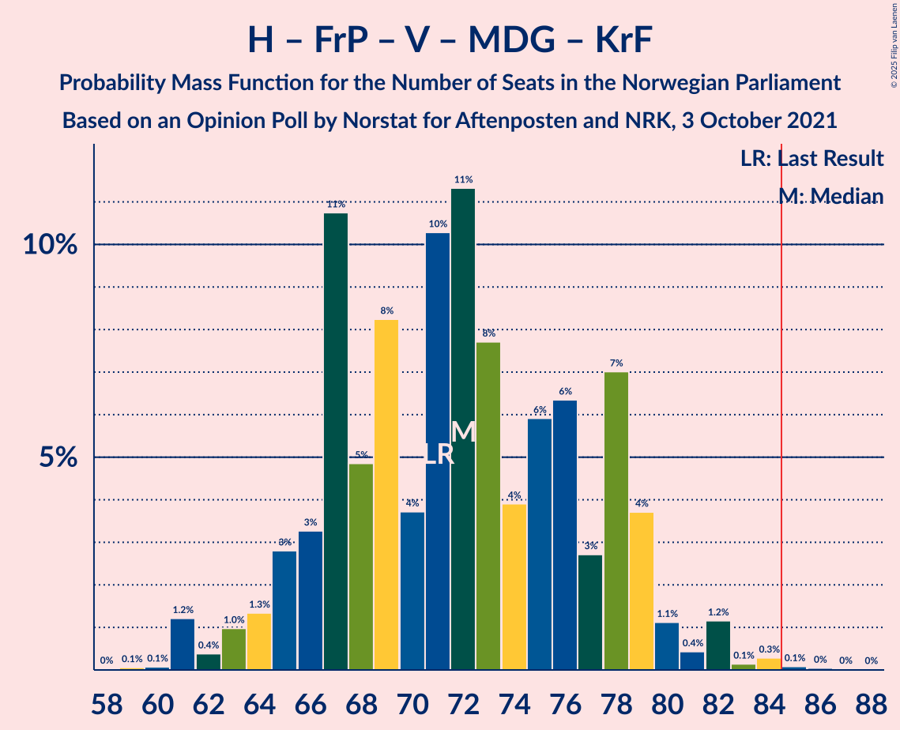

| Number of Seats | Probability | Accumulated | Special Marks |
|:---------------:|:-----------:|:-----------:|:-------------:|
| 58 | 0% | 100% |  |
| 59 | 0.1% | 99.9% |  |
| 60 | 0.1% | 99.9% |  |
| 61 | 1.2% | 99.8% |  |
| 62 | 0.4% | 98.6% |  |
| 63 | 1.0% | 98% |  |
| 64 | 1.3% | 97% |  |
| 65 | 3% | 96% |  |
| 66 | 3% | 93% |  |
| 67 | 11% | 90% |  |
| 68 | 5% | 79% |  |
| 69 | 8% | 74% |  |
| 70 | 4% | 66% |  |
| 71 | 10% | 62% | Last Result, Median |
| 72 | 11% | 52% |  |
| 73 | 8% | 41% |  |
| 74 | 4% | 33% |  |
| 75 | 6% | 29% |  |
| 76 | 6% | 23% |  |
| 77 | 3% | 17% |  |
| 78 | 7% | 14% |  |
| 79 | 4% | 7% |  |
| 80 | 1.1% | 3% |  |
| 81 | 0.4% | 2% |  |
| 82 | 1.2% | 2% |  |
| 83 | 0.1% | 0.6% |  |
| 84 | 0.3% | 0.5% |  |
| 85 | 0.1% | 0.2% | Majority |
| 86 | 0% | 0.1% |  |
| 87 | 0% | 0% |  |

### Arbeiderpartiet – Senterpartiet

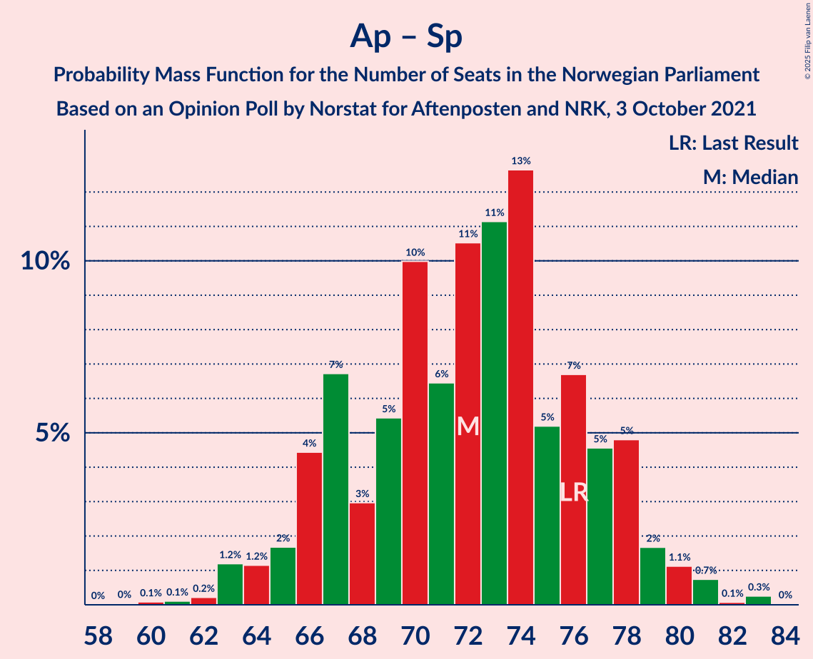

| Number of Seats | Probability | Accumulated | Special Marks |
|:---------------:|:-----------:|:-----------:|:-------------:|
| 59 | 0% | 100% |  |
| 60 | 0.1% | 99.9% |  |
| 61 | 0.1% | 99.9% |  |
| 62 | 0.2% | 99.8% |  |
| 63 | 1.2% | 99.5% |  |
| 64 | 1.2% | 98% |  |
| 65 | 2% | 97% |  |
| 66 | 4% | 96% |  |
| 67 | 7% | 91% |  |
| 68 | 3% | 84% |  |
| 69 | 5% | 81% |  |
| 70 | 10% | 76% |  |
| 71 | 6% | 66% | Median |
| 72 | 11% | 59% |  |
| 73 | 11% | 49% |  |
| 74 | 13% | 38% |  |
| 75 | 5% | 25% |  |
| 76 | 7% | 20% | Last Result |
| 77 | 5% | 13% |  |
| 78 | 5% | 9% |  |
| 79 | 2% | 4% |  |
| 80 | 1.1% | 2% |  |
| 81 | 0.7% | 1.1% |  |
| 82 | 0.1% | 0.4% |  |
| 83 | 0.3% | 0.3% |  |
| 84 | 0% | 0% |  |

### Høyre – Fremskrittspartiet – Venstre – Kristelig Folkeparti

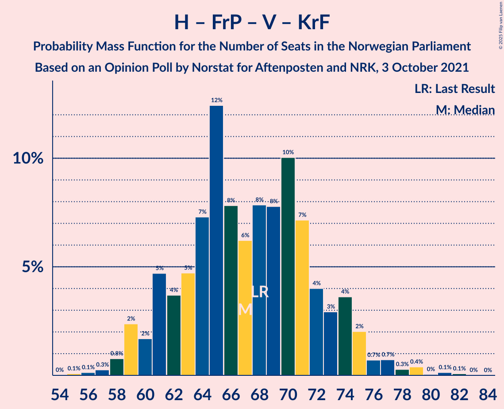

| Number of Seats | Probability | Accumulated | Special Marks |
|:---------------:|:-----------:|:-----------:|:-------------:|
| 55 | 0.1% | 100% |  |
| 56 | 0.1% | 99.9% |  |
| 57 | 0.3% | 99.7% |  |
| 58 | 0.8% | 99.5% |  |
| 59 | 2% | 98.7% |  |
| 60 | 2% | 96% |  |
| 61 | 5% | 95% |  |
| 62 | 4% | 90% |  |
| 63 | 5% | 86% |  |
| 64 | 7% | 82% |  |
| 65 | 12% | 74% |  |
| 66 | 8% | 62% |  |
| 67 | 6% | 54% |  |
| 68 | 8% | 48% | Last Result, Median |
| 69 | 8% | 40% |  |
| 70 | 10% | 32% |  |
| 71 | 7% | 22% |  |
| 72 | 4% | 15% |  |
| 73 | 3% | 11% |  |
| 74 | 4% | 8% |  |
| 75 | 2% | 4% |  |
| 76 | 0.7% | 2% |  |
| 77 | 0.7% | 2% |  |
| 78 | 0.3% | 0.9% |  |
| 79 | 0.4% | 0.7% |  |
| 80 | 0% | 0.3% |  |
| 81 | 0.1% | 0.2% |  |
| 82 | 0.1% | 0.1% |  |
| 83 | 0% | 0% |  |

### Høyre – Fremskrittspartiet – Venstre

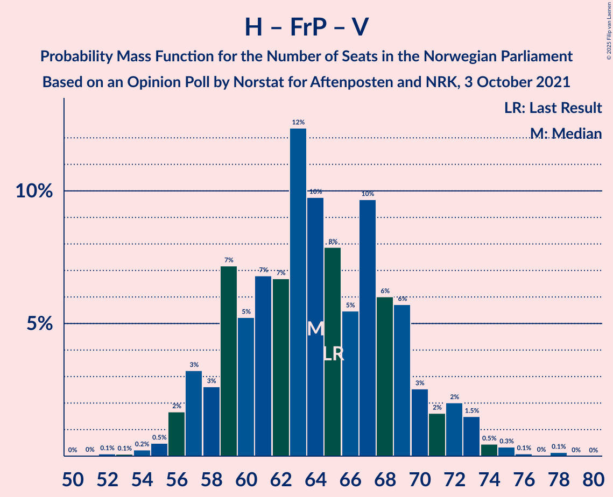

| Number of Seats | Probability | Accumulated | Special Marks |
|:---------------:|:-----------:|:-----------:|:-------------:|
| 51 | 0% | 100% |  |
| 52 | 0.1% | 99.9% |  |
| 53 | 0.1% | 99.9% |  |
| 54 | 0.2% | 99.8% |  |
| 55 | 0.5% | 99.5% |  |
| 56 | 2% | 99.1% |  |
| 57 | 3% | 97% |  |
| 58 | 3% | 94% |  |
| 59 | 7% | 92% |  |
| 60 | 5% | 84% |  |
| 61 | 7% | 79% |  |
| 62 | 7% | 72% |  |
| 63 | 12% | 66% |  |
| 64 | 10% | 53% |  |
| 65 | 8% | 44% | Last Result, Median |
| 66 | 5% | 36% |  |
| 67 | 10% | 30% |  |
| 68 | 6% | 20% |  |
| 69 | 6% | 14% |  |
| 70 | 3% | 9% |  |
| 71 | 2% | 6% |  |
| 72 | 2% | 5% |  |
| 73 | 1.5% | 3% |  |
| 74 | 0.5% | 1.1% |  |
| 75 | 0.3% | 0.6% |  |
| 76 | 0.1% | 0.3% |  |
| 77 | 0% | 0.2% |  |
| 78 | 0.1% | 0.2% |  |
| 79 | 0% | 0% |  |

### Arbeiderpartiet – Sosialistisk Venstreparti

| Number of Seats | Probability | Accumulated | Special Marks |
|:---------------:|:-----------:|:-----------:|:-------------:|
| 52 | 0% | 100% |  |
| 53 | 0.1% | 99.9% |  |
| 54 | 0.4% | 99.8% |  |
| 55 | 0.5% | 99.4% |  |
| 56 | 1.4% | 98.9% |  |
| 57 | 2% | 98% |  |
| 58 | 5% | 95% |  |
| 59 | 6% | 91% |  |
| 60 | 11% | 84% |  |
| 61 | 12% | 74% | Last Result |
| 62 | 18% | 62% | Median |
| 63 | 9% | 44% |  |
| 64 | 7% | 35% |  |
| 65 | 8% | 28% |  |
| 66 | 5% | 20% |  |
| 67 | 4% | 15% |  |
| 68 | 7% | 12% |  |
| 69 | 1.4% | 5% |  |
| 70 | 2% | 3% |  |
| 71 | 0.9% | 2% |  |
| 72 | 0.3% | 0.8% |  |
| 73 | 0.3% | 0.4% |  |
| 74 | 0.1% | 0.2% |  |
| 75 | 0% | 0.1% |  |
| 76 | 0% | 0% |  |

### Høyre – Fremskrittspartiet

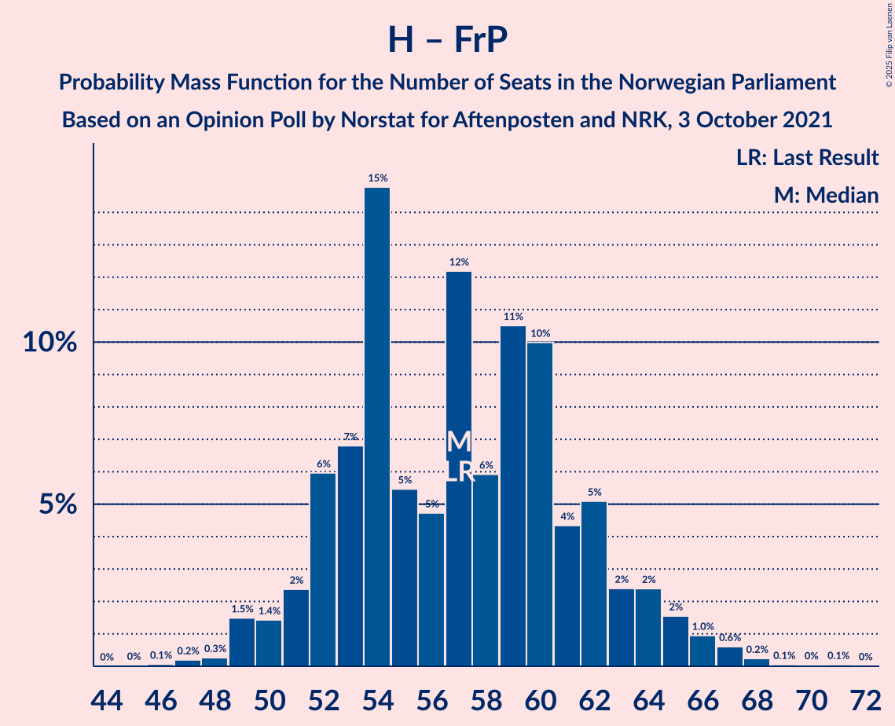

| Number of Seats | Probability | Accumulated | Special Marks |
|:---------------:|:-----------:|:-----------:|:-------------:|
| 46 | 0.1% | 100% |  |
| 47 | 0.2% | 99.9% |  |
| 48 | 0.3% | 99.7% |  |
| 49 | 1.5% | 99.4% |  |
| 50 | 1.4% | 98% |  |
| 51 | 2% | 97% |  |
| 52 | 6% | 94% |  |
| 53 | 7% | 88% |  |
| 54 | 15% | 81% |  |
| 55 | 5% | 67% |  |
| 56 | 5% | 61% |  |
| 57 | 12% | 56% | Last Result, Median |
| 58 | 6% | 44% |  |
| 59 | 11% | 38% |  |
| 60 | 10% | 28% |  |
| 61 | 4% | 18% |  |
| 62 | 5% | 13% |  |
| 63 | 2% | 8% |  |
| 64 | 2% | 6% |  |
| 65 | 2% | 4% |  |
| 66 | 1.0% | 2% |  |
| 67 | 0.6% | 1.0% |  |
| 68 | 0.2% | 0.4% |  |
| 69 | 0.1% | 0.2% |  |
| 70 | 0% | 0.1% |  |
| 71 | 0.1% | 0.1% |  |
| 72 | 0% | 0% |  |

### Høyre – Venstre – Kristelig Folkeparti

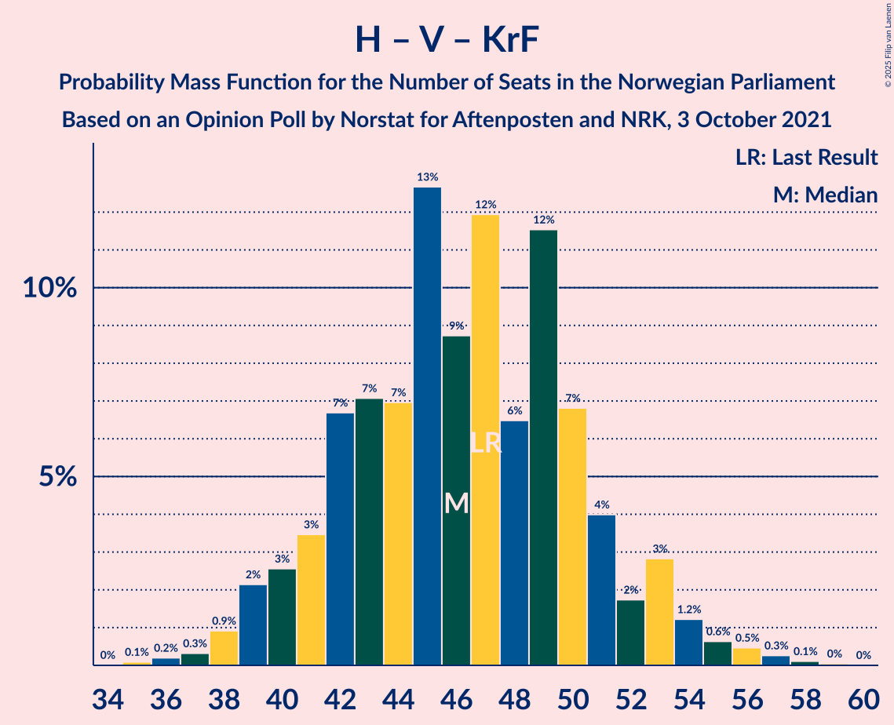

| Number of Seats | Probability | Accumulated | Special Marks |
|:---------------:|:-----------:|:-----------:|:-------------:|
| 35 | 0.1% | 100% |  |
| 36 | 0.2% | 99.9% |  |
| 37 | 0.3% | 99.7% |  |
| 38 | 0.9% | 99.3% |  |
| 39 | 2% | 98% |  |
| 40 | 3% | 96% |  |
| 41 | 3% | 94% |  |
| 42 | 7% | 90% |  |
| 43 | 7% | 84% |  |
| 44 | 7% | 76% |  |
| 45 | 13% | 70% |  |
| 46 | 9% | 57% |  |
| 47 | 12% | 48% | Last Result, Median |
| 48 | 6% | 36% |  |
| 49 | 12% | 30% |  |
| 50 | 7% | 18% |  |
| 51 | 4% | 11% |  |
| 52 | 2% | 7% |  |
| 53 | 3% | 6% |  |
| 54 | 1.2% | 3% |  |
| 55 | 0.6% | 2% |  |
| 56 | 0.5% | 0.9% |  |
| 57 | 0.3% | 0.4% |  |
| 58 | 0.1% | 0.2% |  |
| 59 | 0% | 0.1% |  |
| 60 | 0% | 0% |  |

### Senterpartiet – Venstre – Kristelig Folkeparti

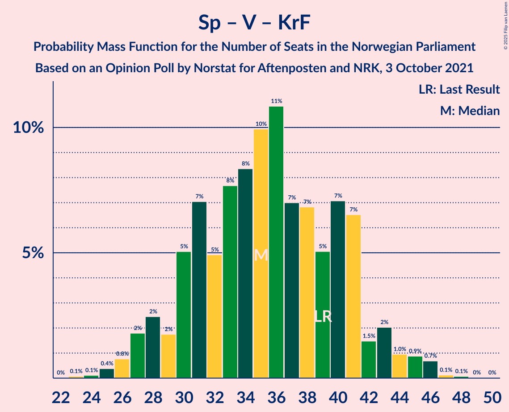

| Number of Seats | Probability | Accumulated | Special Marks |
|:---------------:|:-----------:|:-----------:|:-------------:|
| 23 | 0.1% | 100% |  |
| 24 | 0.1% | 99.9% |  |
| 25 | 0.4% | 99.8% |  |
| 26 | 0.8% | 99.4% |  |
| 27 | 2% | 98.6% |  |
| 28 | 2% | 97% |  |
| 29 | 2% | 94% |  |
| 30 | 5% | 93% |  |
| 31 | 7% | 88% |  |
| 32 | 5% | 81% |  |
| 33 | 8% | 76% |  |
| 34 | 8% | 68% |  |
| 35 | 10% | 60% |  |
| 36 | 11% | 50% | Median |
| 37 | 7% | 39% |  |
| 38 | 7% | 32% |  |
| 39 | 5% | 25% | Last Result |
| 40 | 7% | 20% |  |
| 41 | 7% | 13% |  |
| 42 | 1.5% | 6% |  |
| 43 | 2% | 5% |  |
| 44 | 1.0% | 3% |  |
| 45 | 0.9% | 2% |  |
| 46 | 0.7% | 0.9% |  |
| 47 | 0.1% | 0.2% |  |
| 48 | 0.1% | 0.1% |  |
| 49 | 0% | 0% |  |

## Technical Information

### Opinion Poll

+ **Polling firm:** Norstat
+ **Commissioner(s):** Aftenposten and NRK
+ **Fieldwork period:** 3 October 2021

### Calculations

+ **Sample size:** 830
+ **Simulations done:** 1,048,576
+ **Error estimate:** 0.50%

