# Opinion Poll by Norfakta for Klassekampen and Nationen, 5–6 October 2021

<a href="#voting-intentions">Voting Intentions</a> | <a href="#seats">Seats</a> | <a href="#coalitions">Coalitions</a> | <a href="#technical-information">Technical Information</a>

## Voting Intentions

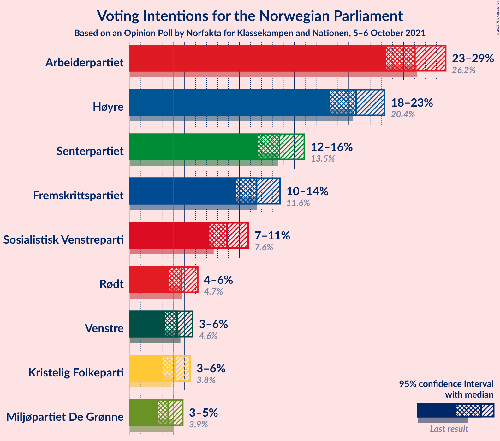

### Confidence Intervals

| Party | Last Result | Poll Result | 80% Confidence Interval | 90% Confidence Interval | 95% Confidence Interval | 99% Confidence Interval |
|:-----:|:-----------:|:-----------:|:-----------------------:|:-----------------------:|:-----------------------:|:-----------------------:|
| Arbeiderpartiet | 26.2% | 26.0% | 24.3–27.9% |23.8–28.4% |23.4–28.8% |22.6–29.7% |
| Høyre | 20.4% | 20.6% | 19.1–22.4% |18.6–22.8% |18.2–23.3% |17.5–24.1% |
| Senterpartiet | 13.5% | 13.7% | 12.3–15.2% |12.0–15.6% |11.7–15.9% |11.1–16.7% |
| Fremskrittspartiet | 11.6% | 11.6% | 10.3–13.0% |10.0–13.4% |9.7–13.7% |9.2–14.4% |
| Sosialistisk Venstreparti | 7.6% | 8.9% | 7.8–10.1% |7.5–10.5% |7.3–10.8% |6.8–11.4% |
| Rødt | 4.7% | 4.7% | 3.9–5.7% |3.7–5.9% |3.5–6.2% |3.2–6.7% |
| Venstre | 4.6% | 4.3% | 3.6–5.2% |3.4–5.5% |3.2–5.7% |2.9–6.2% |
| Kristelig Folkeparti | 3.8% | 4.1% | 3.4–5.0% |3.2–5.3% |3.0–5.5% |2.7–6.0% |
| Miljøpartiet De Grønne | 3.9% | 3.5% | 2.9–4.4% |2.7–4.6% |2.5–4.8% |2.2–5.3% |

*Note:* The poll result column reflects the actual value used in the calculations. Published results may vary slightly, and in addition be rounded to fewer digits.

## Seats

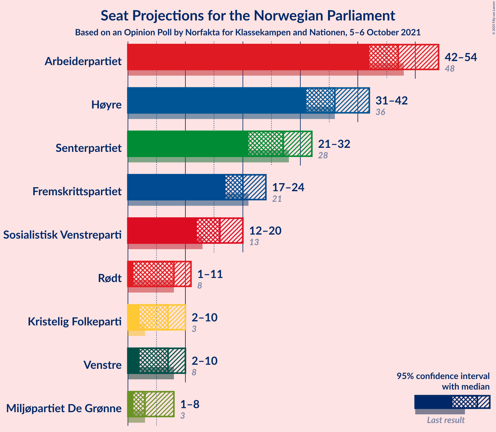

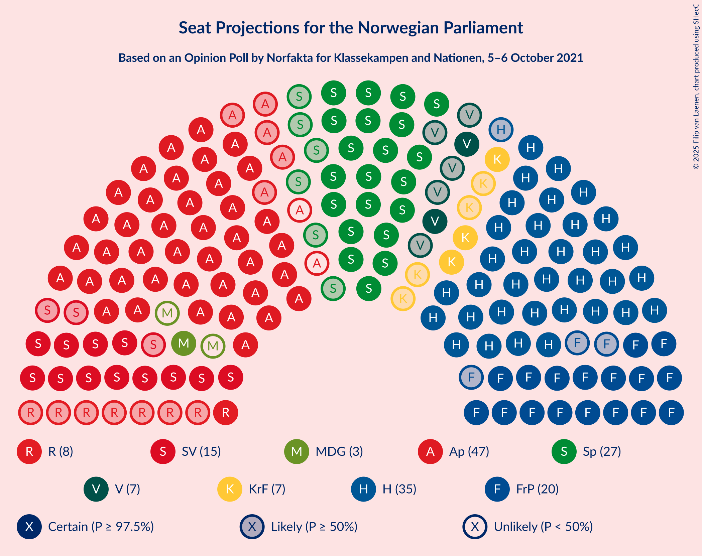

### Confidence Intervals

| Party | Last Result | Median | 80% Confidence Interval | 90% Confidence Interval | 95% Confidence Interval | 99% Confidence Interval |
|:-----:|:-----------:|:------:|:-----------------------:|:-----------------------:|:-----------------------:|:-----------------------:|
| <a href="#arbeiderpartiet">Arbeiderpartiet</a> | 48 | 47 | 44–50 |43–52 |42–54 |40–56 |
| <a href="#høyre">Høyre</a> | 36 | 36 | 32–39 |32–41 |31–42 |30–43 |
| <a href="#senterpartiet">Senterpartiet</a> | 28 | 27 | 22–31 |21–32 |21–32 |19–32 |
| <a href="#fremskrittspartiet">Fremskrittspartiet</a> | 21 | 20 | 18–23 |17–24 |17–24 |16–26 |
| <a href="#sosialistisk-venstreparti">Sosialistisk Venstreparti</a> | 13 | 16 | 13–18 |13–19 |12–20 |11–21 |
| <a href="#rødt">Rødt</a> | 8 | 8 | 1–10 |1–10 |1–11 |1–12 |
| <a href="#venstre">Venstre</a> | 8 | 7 | 3–9 |2–10 |2–10 |2–11 |
| <a href="#kristelig-folkeparti">Kristelig Folkeparti</a> | 3 | 7 | 2–9 |2–9 |2–10 |1–11 |
| <a href="#miljøpartiet-de-grønne">Miljøpartiet De Grønne</a> | 3 | 3 | 1–7 |1–8 |1–8 |1–9 |

### Arbeiderpartiet

*For a full overview of the results for this party, see the [Arbeiderpartiet](party-arbeiderpartiet.html) page.*

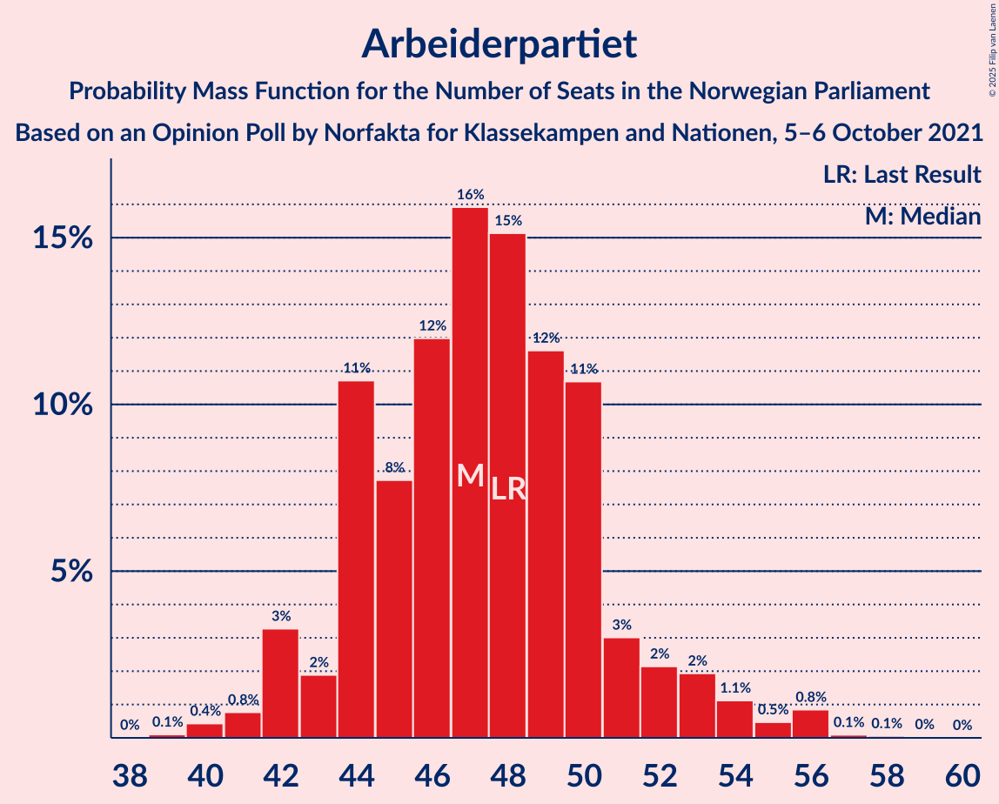

| Number of Seats | Probability | Accumulated | Special Marks |
|:---------------:|:-----------:|:-----------:|:-------------:|
| 39 | 0.1% | 100% |  |
| 40 | 0.4% | 99.9% |  |
| 41 | 0.8% | 99.4% |  |
| 42 | 3% | 98.7% |  |
| 43 | 2% | 95% |  |
| 44 | 11% | 94% |  |
| 45 | 8% | 83% |  |
| 46 | 12% | 75% |  |
| 47 | 16% | 63% | Median |
| 48 | 15% | 47% | Last Result |
| 49 | 12% | 32% |  |
| 50 | 11% | 20% |  |
| 51 | 3% | 10% |  |
| 52 | 2% | 7% |  |
| 53 | 2% | 5% |  |
| 54 | 1.1% | 3% |  |
| 55 | 0.5% | 2% |  |
| 56 | 0.8% | 1.0% |  |
| 57 | 0.1% | 0.2% |  |
| 58 | 0.1% | 0.1% |  |
| 59 | 0% | 0% |  |

### Høyre

*For a full overview of the results for this party, see the [Høyre](party-høyre.html) page.*

| Number of Seats | Probability | Accumulated | Special Marks |
|:---------------:|:-----------:|:-----------:|:-------------:|
| 28 | 0.1% | 100% |  |
| 29 | 0.3% | 99.9% |  |
| 30 | 0.9% | 99.6% |  |
| 31 | 3% | 98.7% |  |
| 32 | 8% | 96% |  |
| 33 | 9% | 88% |  |
| 34 | 10% | 79% |  |
| 35 | 17% | 68% |  |
| 36 | 12% | 52% | Last Result, Median |
| 37 | 12% | 40% |  |
| 38 | 11% | 28% |  |
| 39 | 7% | 17% |  |
| 40 | 4% | 9% |  |
| 41 | 3% | 6% |  |
| 42 | 2% | 3% |  |
| 43 | 0.3% | 0.8% |  |
| 44 | 0.3% | 0.5% |  |
| 45 | 0.1% | 0.2% |  |
| 46 | 0.1% | 0.1% |  |
| 47 | 0% | 0% |  |

### Senterpartiet

*For a full overview of the results for this party, see the [Senterpartiet](party-senterpartiet.html) page.*

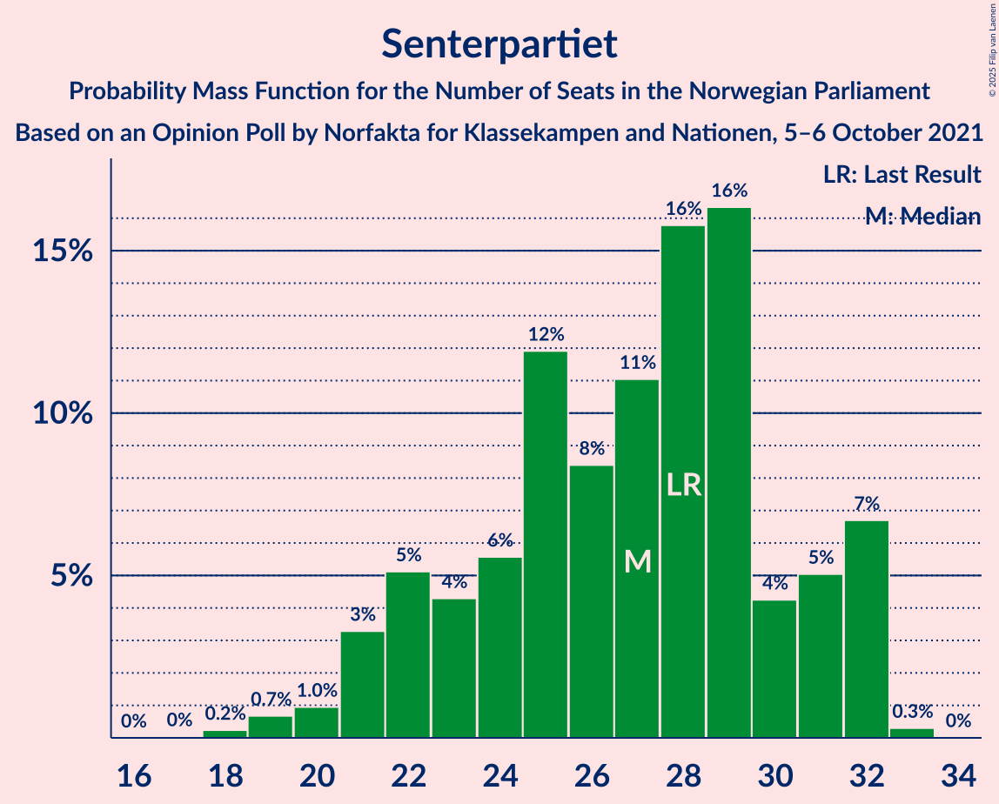

| Number of Seats | Probability | Accumulated | Special Marks |
|:---------------:|:-----------:|:-----------:|:-------------:|
| 18 | 0.2% | 100% |  |
| 19 | 0.7% | 99.7% |  |
| 20 | 1.0% | 99.0% |  |
| 21 | 3% | 98% |  |
| 22 | 5% | 95% |  |
| 23 | 4% | 90% |  |
| 24 | 6% | 85% |  |
| 25 | 12% | 80% |  |
| 26 | 8% | 68% |  |
| 27 | 11% | 59% | Median |
| 28 | 16% | 48% | Last Result |
| 29 | 16% | 33% |  |
| 30 | 4% | 16% |  |
| 31 | 5% | 12% |  |
| 32 | 7% | 7% |  |
| 33 | 0.3% | 0.3% |  |
| 34 | 0% | 0% |  |

### Fremskrittspartiet

*For a full overview of the results for this party, see the [Fremskrittspartiet](party-fremskrittspartiet.html) page.*

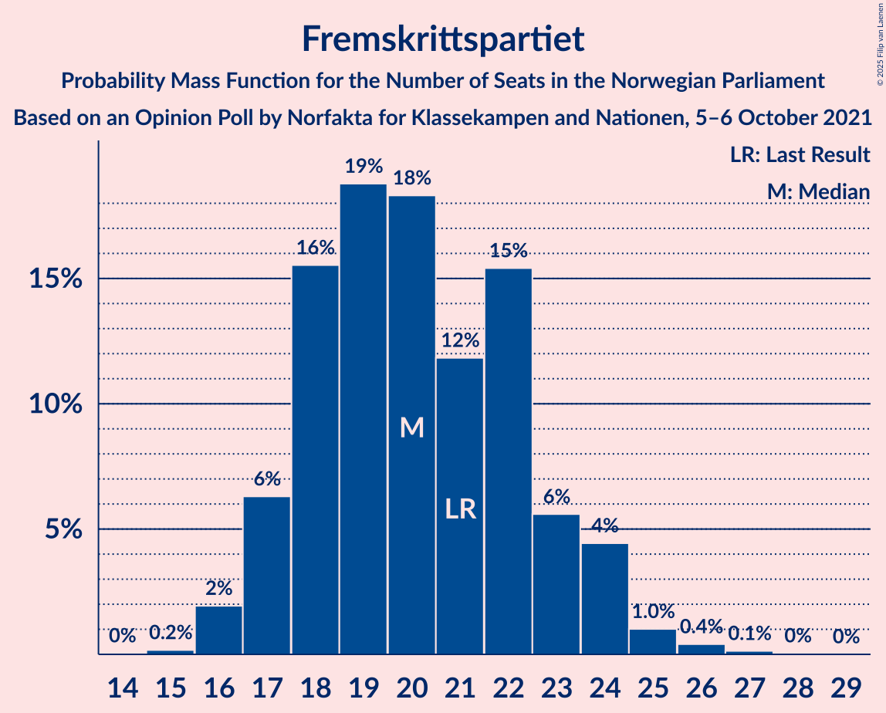

| Number of Seats | Probability | Accumulated | Special Marks |
|:---------------:|:-----------:|:-----------:|:-------------:|
| 14 | 0% | 100% |  |
| 15 | 0.2% | 99.9% |  |
| 16 | 2% | 99.8% |  |
| 17 | 6% | 98% |  |
| 18 | 16% | 92% |  |
| 19 | 19% | 76% |  |
| 20 | 18% | 57% | Median |
| 21 | 12% | 39% | Last Result |
| 22 | 15% | 27% |  |
| 23 | 6% | 12% |  |
| 24 | 4% | 6% |  |
| 25 | 1.0% | 2% |  |
| 26 | 0.4% | 0.6% |  |
| 27 | 0.1% | 0.2% |  |
| 28 | 0% | 0.1% |  |
| 29 | 0% | 0% |  |

### Sosialistisk Venstreparti

*For a full overview of the results for this party, see the [Sosialistisk Venstreparti](party-sosialistiskvenstreparti.html) page.*

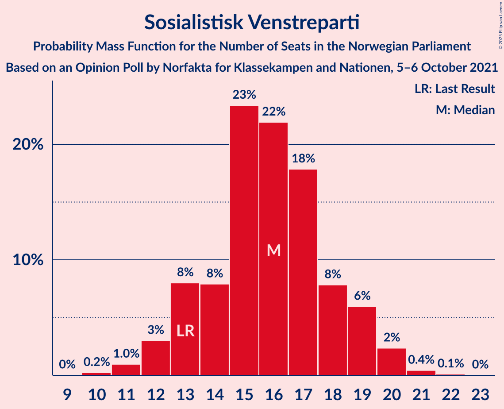

| Number of Seats | Probability | Accumulated | Special Marks |
|:---------------:|:-----------:|:-----------:|:-------------:|
| 10 | 0.2% | 100% |  |
| 11 | 1.0% | 99.7% |  |
| 12 | 3% | 98.8% |  |
| 13 | 8% | 96% | Last Result |
| 14 | 8% | 88% |  |
| 15 | 23% | 80% |  |
| 16 | 22% | 56% | Median |
| 17 | 18% | 35% |  |
| 18 | 8% | 17% |  |
| 19 | 6% | 9% |  |
| 20 | 2% | 3% |  |
| 21 | 0.4% | 0.6% |  |
| 22 | 0.1% | 0.1% |  |
| 23 | 0% | 0% |  |

### Rødt

*For a full overview of the results for this party, see the [Rødt](party-rødt.html) page.*

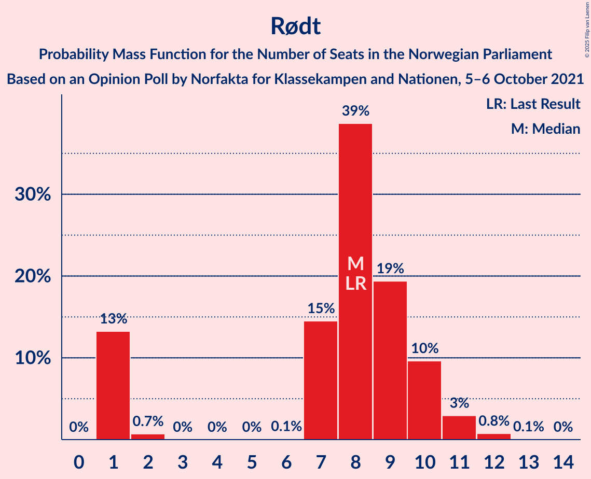

| Number of Seats | Probability | Accumulated | Special Marks |
|:---------------:|:-----------:|:-----------:|:-------------:|
| 1 | 13% | 100% |  |
| 2 | 0.7% | 87% |  |
| 3 | 0% | 86% |  |
| 4 | 0% | 86% |  |
| 5 | 0% | 86% |  |
| 6 | 0.1% | 86% |  |
| 7 | 15% | 86% |  |
| 8 | 39% | 71% | Last Result, Median |
| 9 | 19% | 33% |  |
| 10 | 10% | 13% |  |
| 11 | 3% | 4% |  |
| 12 | 0.8% | 0.8% |  |
| 13 | 0.1% | 0.1% |  |
| 14 | 0% | 0% |  |

### Venstre

*For a full overview of the results for this party, see the [Venstre](party-venstre.html) page.*

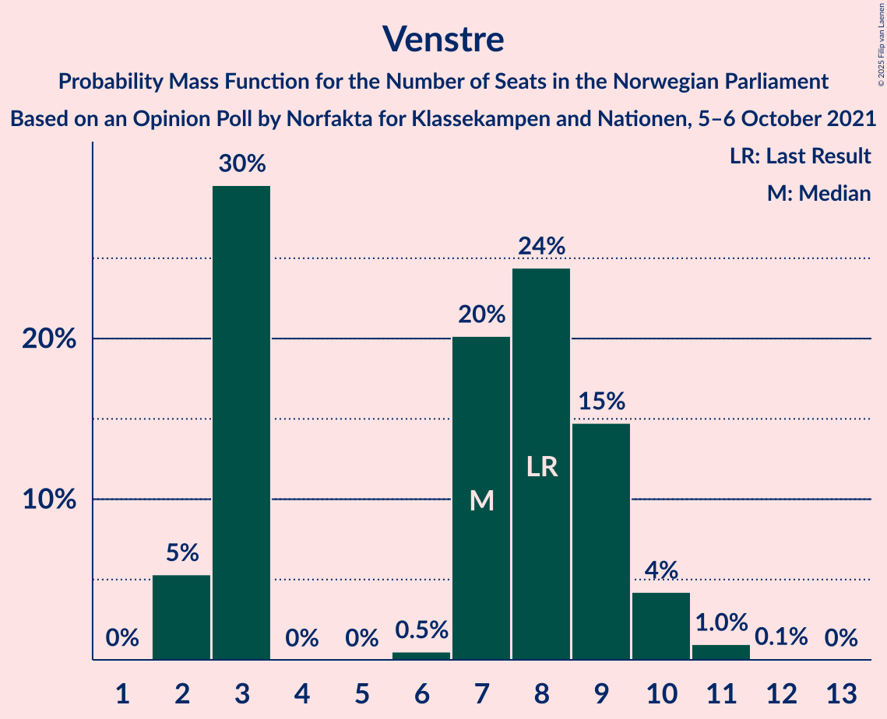

| Number of Seats | Probability | Accumulated | Special Marks |
|:---------------:|:-----------:|:-----------:|:-------------:|
| 2 | 5% | 100% |  |
| 3 | 30% | 95% |  |
| 4 | 0% | 65% |  |
| 5 | 0% | 65% |  |
| 6 | 0.5% | 65% |  |
| 7 | 20% | 65% | Median |
| 8 | 24% | 44% | Last Result |
| 9 | 15% | 20% |  |
| 10 | 4% | 5% |  |
| 11 | 1.0% | 1.1% |  |
| 12 | 0.1% | 0.1% |  |
| 13 | 0% | 0% |  |

### Kristelig Folkeparti

*For a full overview of the results for this party, see the [Kristelig Folkeparti](party-kristeligfolkeparti.html) page.*

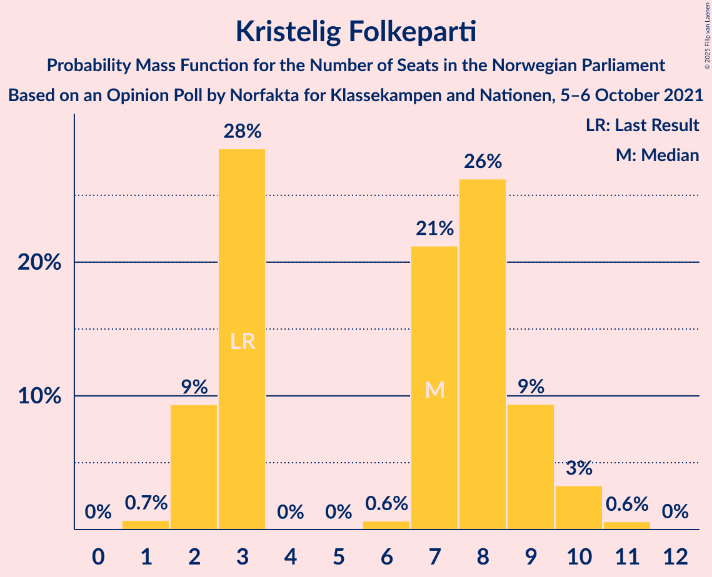

| Number of Seats | Probability | Accumulated | Special Marks |
|:---------------:|:-----------:|:-----------:|:-------------:|
| 1 | 0.7% | 100% |  |
| 2 | 9% | 99.3% |  |
| 3 | 28% | 90% | Last Result |
| 4 | 0% | 61% |  |
| 5 | 0% | 61% |  |
| 6 | 0.6% | 61% |  |
| 7 | 21% | 61% | Median |
| 8 | 26% | 40% |  |
| 9 | 9% | 13% |  |
| 10 | 3% | 4% |  |
| 11 | 0.6% | 0.6% |  |
| 12 | 0% | 0% |  |

### Miljøpartiet De Grønne

*For a full overview of the results for this party, see the [Miljøpartiet De Grønne](party-miljøpartietdegrønne.html) page.*

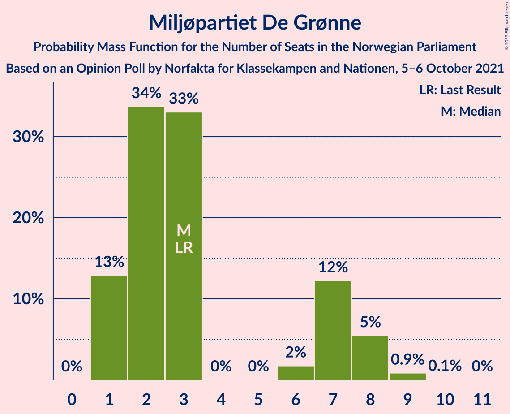

| Number of Seats | Probability | Accumulated | Special Marks |
|:---------------:|:-----------:|:-----------:|:-------------:|
| 1 | 13% | 100% |  |
| 2 | 34% | 87% |  |
| 3 | 33% | 53% | Last Result, Median |
| 4 | 0% | 20% |  |
| 5 | 0% | 20% |  |
| 6 | 2% | 20% |  |
| 7 | 12% | 19% |  |
| 8 | 5% | 6% |  |
| 9 | 0.9% | 0.9% |  |
| 10 | 0.1% | 0.1% |  |
| 11 | 0% | 0% |  |

## Coalitions

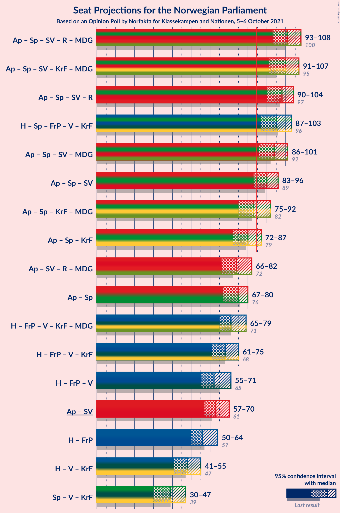

### Confidence Intervals

| Coalition | Last Result | Median | Majority? | 80% Confidence Interval | 90% Confidence Interval | 95% Confidence Interval | 99% Confidence Interval |
|:---------:|:-----------:|:------:|:---------:|:-----------------------:|:-----------------------:|:-----------------------:|:-----------------------:|
| Arbeiderpartiet – Senterpartiet – Sosialistisk Venstreparti – Rødt – Miljøpartiet De Grønne | 100 | 101 | 100% | 96–105 | 94–106 | 93–108 | 91–110 |
| Arbeiderpartiet – Senterpartiet – Sosialistisk Venstreparti – Kristelig Folkeparti – Miljøpartiet De Grønne | 95 | 100 | 100% | 94–104 | 92–106 | 91–107 | 88–108 |
| Arbeiderpartiet – Senterpartiet – Sosialistisk Venstreparti – Rødt | 97 | 98 | 99.9% | 93–101 | 91–103 | 90–104 | 87–106 |
| Høyre – Senterpartiet – Fremskrittspartiet – Venstre – Kristelig Folkeparti | 96 | 95 | 99.6% | 90–100 | 89–102 | 87–103 | 85–106 |
| Arbeiderpartiet – Senterpartiet – Sosialistisk Venstreparti – Miljøpartiet De Grønne | 92 | 94 | 98.9% | 88–98 | 87–99 | 86–101 | 83–104 |
| Arbeiderpartiet – Senterpartiet – Sosialistisk Venstreparti | 89 | 90 | 95% | 86–94 | 85–95 | 83–96 | 80–101 |
| Arbeiderpartiet – Senterpartiet – Kristelig Folkeparti – Miljøpartiet De Grønne | 82 | 83 | 40% | 78–89 | 76–90 | 75–92 | 72–94 |
| Arbeiderpartiet – Senterpartiet – Kristelig Folkeparti | 79 | 80 | 18% | 75–85 | 73–86 | 72–87 | 69–89 |
| Arbeiderpartiet – Sosialistisk Venstreparti – Rødt – Miljøpartiet De Grønne | 72 | 74 | 0.3% | 69–78 | 67–80 | 66–82 | 63–84 |
| Arbeiderpartiet – Senterpartiet | 76 | 75 | 0% | 70–78 | 69–79 | 67–80 | 65–83 |
| Høyre – Fremskrittspartiet – Venstre – Kristelig Folkeparti – Miljøpartiet De Grønne | 71 | 71 | 0.1% | 67–76 | 66–78 | 65–79 | 63–82 |
| Høyre – Fremskrittspartiet – Venstre – Kristelig Folkeparti | 68 | 68 | 0% | 64–73 | 63–75 | 61–75 | 59–78 |
| Høyre – Fremskrittspartiet – Venstre | 65 | 62 | 0% | 58–68 | 56–69 | 55–71 | 54–73 |
| Arbeiderpartiet – Sosialistisk Venstreparti | 61 | 63 | 0% | 59–67 | 58–69 | 57–70 | 56–74 |
| Høyre – Fremskrittspartiet | 57 | 56 | 0% | 51–60 | 50–62 | 50–64 | 48–66 |
| Høyre – Venstre – Kristelig Folkeparti | 47 | 48 | 0% | 43–52 | 43–54 | 41–55 | 39–57 |
| Senterpartiet – Venstre – Kristelig Folkeparti | 39 | 39 | 0% | 33–44 | 31–46 | 30–47 | 28–49 |

### Arbeiderpartiet – Senterpartiet – Sosialistisk Venstreparti – Rødt – Miljøpartiet De Grønne

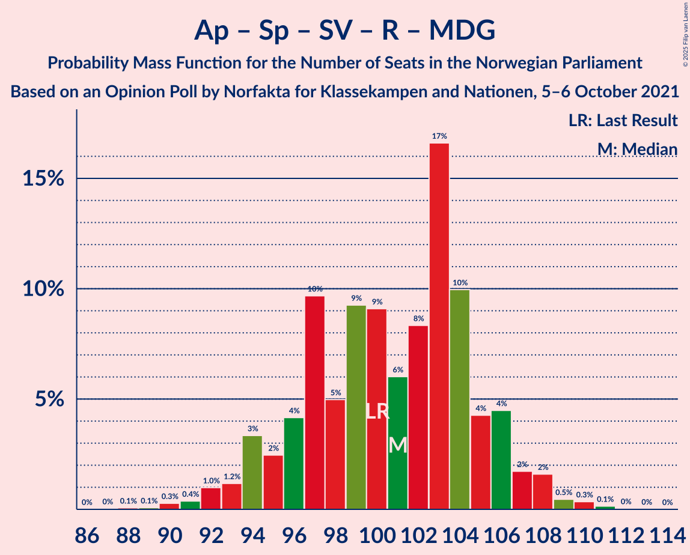

| Number of Seats | Probability | Accumulated | Special Marks |
|:---------------:|:-----------:|:-----------:|:-------------:|
| 88 | 0.1% | 100% |  |
| 89 | 0.1% | 99.9% |  |
| 90 | 0.3% | 99.8% |  |
| 91 | 0.4% | 99.5% |  |
| 92 | 1.0% | 99.2% |  |
| 93 | 1.2% | 98% |  |
| 94 | 3% | 97% |  |
| 95 | 2% | 94% |  |
| 96 | 4% | 91% |  |
| 97 | 10% | 87% |  |
| 98 | 5% | 77% |  |
| 99 | 9% | 72% |  |
| 100 | 9% | 63% | Last Result |
| 101 | 6% | 54% | Median |
| 102 | 8% | 48% |  |
| 103 | 17% | 40% |  |
| 104 | 10% | 23% |  |
| 105 | 4% | 13% |  |
| 106 | 4% | 9% |  |
| 107 | 2% | 4% |  |
| 108 | 2% | 3% |  |
| 109 | 0.5% | 1.0% |  |
| 110 | 0.3% | 0.6% |  |
| 111 | 0.1% | 0.2% |  |
| 112 | 0% | 0.1% |  |
| 113 | 0% | 0% |  |

### Arbeiderpartiet – Senterpartiet – Sosialistisk Venstreparti – Kristelig Folkeparti – Miljøpartiet De Grønne

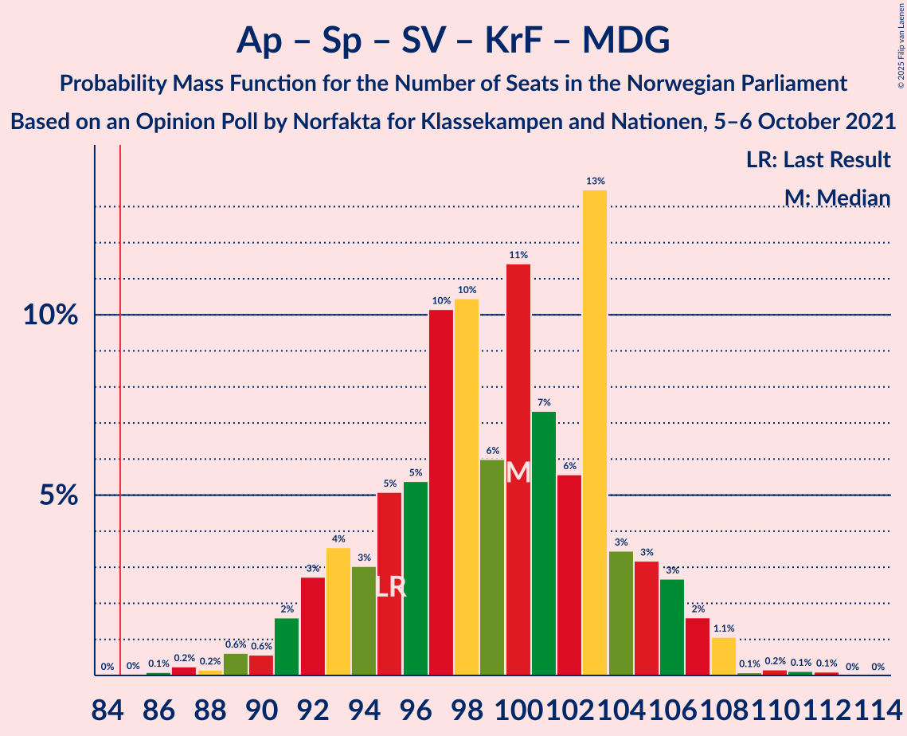

| Number of Seats | Probability | Accumulated | Special Marks |
|:---------------:|:-----------:|:-----------:|:-------------:|
| 86 | 0.1% | 100% |  |
| 87 | 0.2% | 99.9% |  |
| 88 | 0.2% | 99.6% |  |
| 89 | 0.6% | 99.5% |  |
| 90 | 0.6% | 98.8% |  |
| 91 | 2% | 98% |  |
| 92 | 3% | 97% |  |
| 93 | 4% | 94% |  |
| 94 | 3% | 90% |  |
| 95 | 5% | 87% | Last Result |
| 96 | 5% | 82% |  |
| 97 | 10% | 77% |  |
| 98 | 10% | 67% |  |
| 99 | 6% | 56% |  |
| 100 | 11% | 50% | Median |
| 101 | 7% | 39% |  |
| 102 | 6% | 32% |  |
| 103 | 13% | 26% |  |
| 104 | 3% | 12% |  |
| 105 | 3% | 9% |  |
| 106 | 3% | 6% |  |
| 107 | 2% | 3% |  |
| 108 | 1.1% | 2% |  |
| 109 | 0.1% | 0.5% |  |
| 110 | 0.2% | 0.4% |  |
| 111 | 0.1% | 0.2% |  |
| 112 | 0.1% | 0.1% |  |
| 113 | 0% | 0% |  |

### Arbeiderpartiet – Senterpartiet – Sosialistisk Venstreparti – Rødt

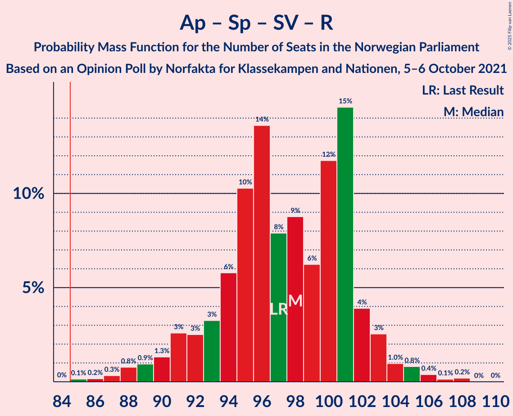

| Number of Seats | Probability | Accumulated | Special Marks |
|:---------------:|:-----------:|:-----------:|:-------------:|
| 84 | 0% | 100% |  |
| 85 | 0.1% | 99.9% | Majority |
| 86 | 0.2% | 99.8% |  |
| 87 | 0.3% | 99.6% |  |
| 88 | 0.8% | 99.3% |  |
| 89 | 0.9% | 98.5% |  |
| 90 | 1.3% | 98% |  |
| 91 | 3% | 96% |  |
| 92 | 3% | 94% |  |
| 93 | 3% | 91% |  |
| 94 | 6% | 88% |  |
| 95 | 10% | 82% |  |
| 96 | 14% | 72% |  |
| 97 | 8% | 58% | Last Result |
| 98 | 9% | 50% | Median |
| 99 | 6% | 42% |  |
| 100 | 12% | 35% |  |
| 101 | 15% | 24% |  |
| 102 | 4% | 9% |  |
| 103 | 3% | 5% |  |
| 104 | 1.0% | 3% |  |
| 105 | 0.8% | 2% |  |
| 106 | 0.4% | 0.7% |  |
| 107 | 0.1% | 0.4% |  |
| 108 | 0.2% | 0.2% |  |
| 109 | 0% | 0% |  |

### Høyre – Senterpartiet – Fremskrittspartiet – Venstre – Kristelig Folkeparti

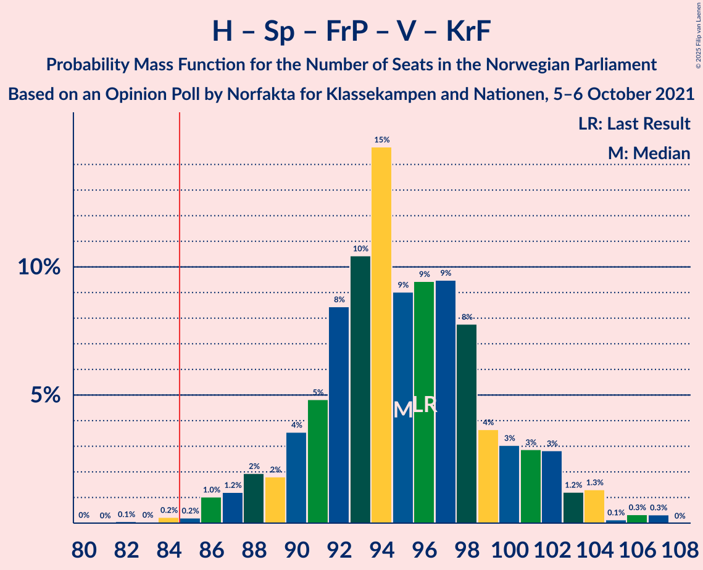

| Number of Seats | Probability | Accumulated | Special Marks |
|:---------------:|:-----------:|:-----------:|:-------------:|
| 81 | 0% | 100% |  |
| 82 | 0.1% | 99.9% |  |
| 83 | 0% | 99.9% |  |
| 84 | 0.2% | 99.8% |  |
| 85 | 0.2% | 99.6% | Majority |
| 86 | 1.0% | 99.4% |  |
| 87 | 1.2% | 98% |  |
| 88 | 2% | 97% |  |
| 89 | 2% | 95% |  |
| 90 | 4% | 93% |  |
| 91 | 5% | 90% |  |
| 92 | 8% | 85% |  |
| 93 | 10% | 77% |  |
| 94 | 15% | 66% |  |
| 95 | 9% | 51% |  |
| 96 | 9% | 42% | Last Result |
| 97 | 9% | 33% | Median |
| 98 | 8% | 24% |  |
| 99 | 4% | 16% |  |
| 100 | 3% | 12% |  |
| 101 | 3% | 9% |  |
| 102 | 3% | 6% |  |
| 103 | 1.2% | 3% |  |
| 104 | 1.3% | 2% |  |
| 105 | 0.1% | 0.8% |  |
| 106 | 0.3% | 0.7% |  |
| 107 | 0.3% | 0.3% |  |
| 108 | 0% | 0% |  |

### Arbeiderpartiet – Senterpartiet – Sosialistisk Venstreparti – Miljøpartiet De Grønne

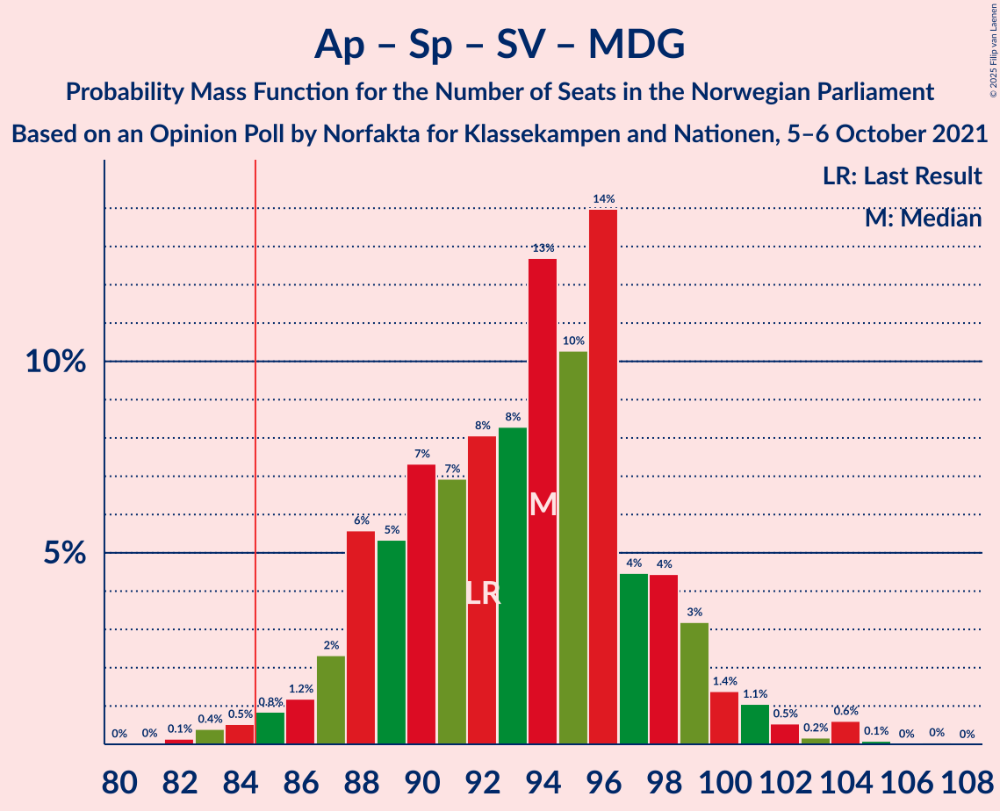

| Number of Seats | Probability | Accumulated | Special Marks |
|:---------------:|:-----------:|:-----------:|:-------------:|
| 81 | 0% | 100% |  |
| 82 | 0.1% | 99.9% |  |
| 83 | 0.4% | 99.8% |  |
| 84 | 0.5% | 99.4% |  |
| 85 | 0.8% | 98.9% | Majority |
| 86 | 1.2% | 98% |  |
| 87 | 2% | 97% |  |
| 88 | 6% | 95% |  |
| 89 | 5% | 89% |  |
| 90 | 7% | 84% |  |
| 91 | 7% | 76% |  |
| 92 | 8% | 69% | Last Result |
| 93 | 8% | 61% | Median |
| 94 | 13% | 53% |  |
| 95 | 10% | 40% |  |
| 96 | 14% | 30% |  |
| 97 | 4% | 16% |  |
| 98 | 4% | 12% |  |
| 99 | 3% | 7% |  |
| 100 | 1.4% | 4% |  |
| 101 | 1.1% | 3% |  |
| 102 | 0.5% | 1.5% |  |
| 103 | 0.2% | 0.9% |  |
| 104 | 0.6% | 0.8% |  |
| 105 | 0.1% | 0.2% |  |
| 106 | 0% | 0.1% |  |
| 107 | 0% | 0.1% |  |
| 108 | 0% | 0% |  |

### Arbeiderpartiet – Senterpartiet – Sosialistisk Venstreparti

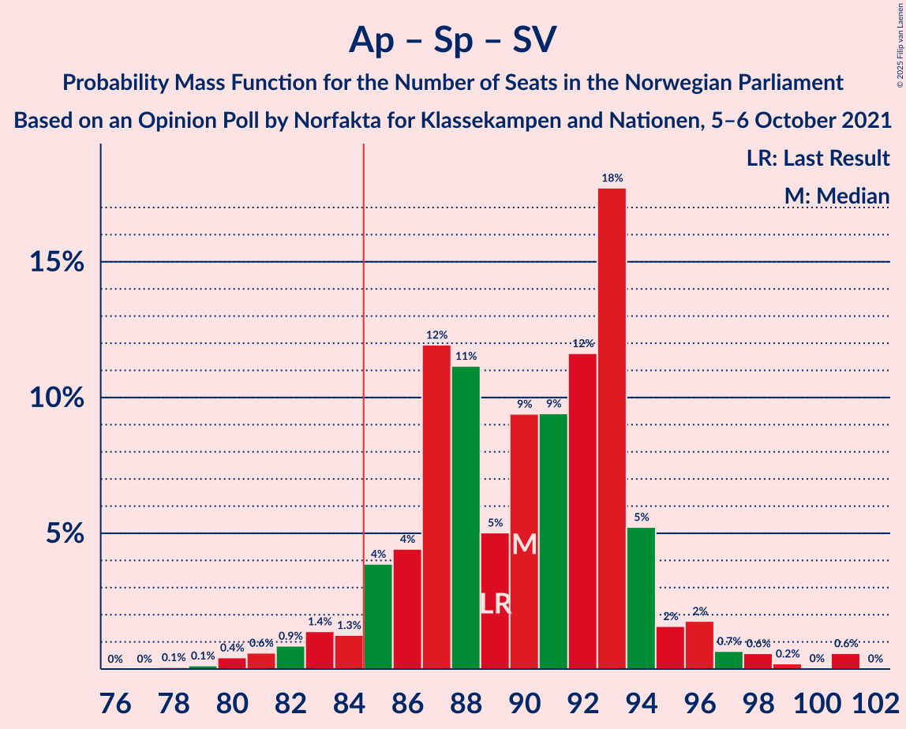

| Number of Seats | Probability | Accumulated | Special Marks |
|:---------------:|:-----------:|:-----------:|:-------------:|
| 78 | 0.1% | 100% |  |
| 79 | 0.1% | 99.9% |  |
| 80 | 0.4% | 99.8% |  |
| 81 | 0.6% | 99.4% |  |
| 82 | 0.9% | 98.8% |  |
| 83 | 1.4% | 98% |  |
| 84 | 1.3% | 97% |  |
| 85 | 4% | 95% | Majority |
| 86 | 4% | 91% |  |
| 87 | 12% | 87% |  |
| 88 | 11% | 75% |  |
| 89 | 5% | 64% | Last Result |
| 90 | 9% | 59% | Median |
| 91 | 9% | 49% |  |
| 92 | 12% | 40% |  |
| 93 | 18% | 28% |  |
| 94 | 5% | 11% |  |
| 95 | 2% | 5% |  |
| 96 | 2% | 4% |  |
| 97 | 0.7% | 2% |  |
| 98 | 0.6% | 1.4% |  |
| 99 | 0.2% | 0.8% |  |
| 100 | 0% | 0.6% |  |
| 101 | 0.6% | 0.6% |  |
| 102 | 0% | 0% |  |

### Arbeiderpartiet – Senterpartiet – Kristelig Folkeparti – Miljøpartiet De Grønne

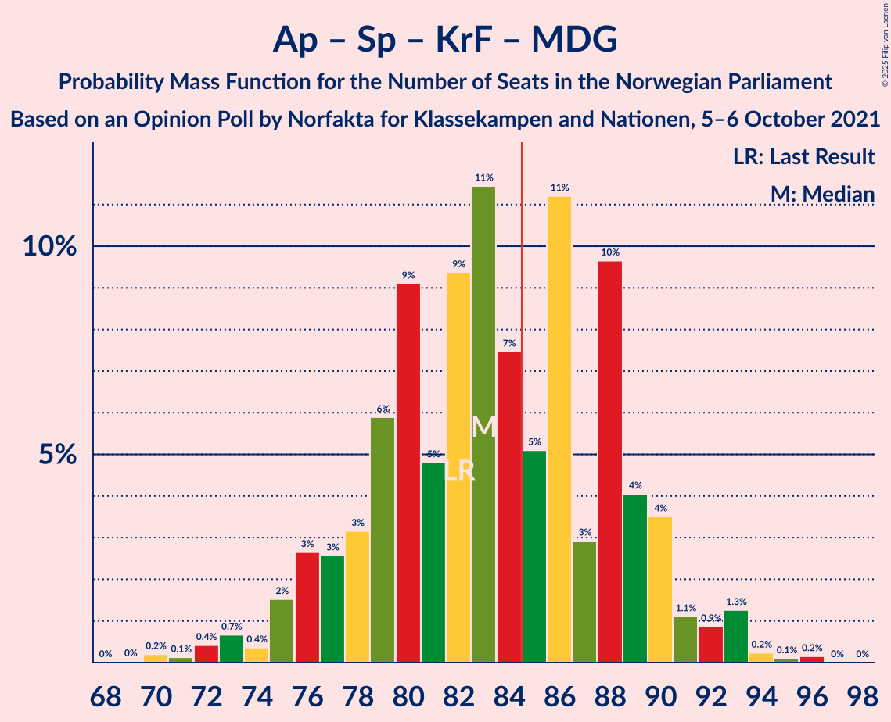

| Number of Seats | Probability | Accumulated | Special Marks |
|:---------------:|:-----------:|:-----------:|:-------------:|
| 70 | 0.2% | 100% |  |
| 71 | 0.1% | 99.7% |  |
| 72 | 0.4% | 99.6% |  |
| 73 | 0.7% | 99.2% |  |
| 74 | 0.4% | 98.5% |  |
| 75 | 2% | 98% |  |
| 76 | 3% | 97% |  |
| 77 | 3% | 94% |  |
| 78 | 3% | 91% |  |
| 79 | 6% | 88% |  |
| 80 | 9% | 82% |  |
| 81 | 5% | 73% |  |
| 82 | 9% | 68% | Last Result |
| 83 | 11% | 59% |  |
| 84 | 7% | 48% | Median |
| 85 | 5% | 40% | Majority |
| 86 | 11% | 35% |  |
| 87 | 3% | 24% |  |
| 88 | 10% | 21% |  |
| 89 | 4% | 11% |  |
| 90 | 4% | 7% |  |
| 91 | 1.1% | 4% |  |
| 92 | 0.9% | 3% |  |
| 93 | 1.3% | 2% |  |
| 94 | 0.2% | 0.5% |  |
| 95 | 0.1% | 0.3% |  |
| 96 | 0.2% | 0.2% |  |
| 97 | 0% | 0% |  |

### Arbeiderpartiet – Senterpartiet – Kristelig Folkeparti

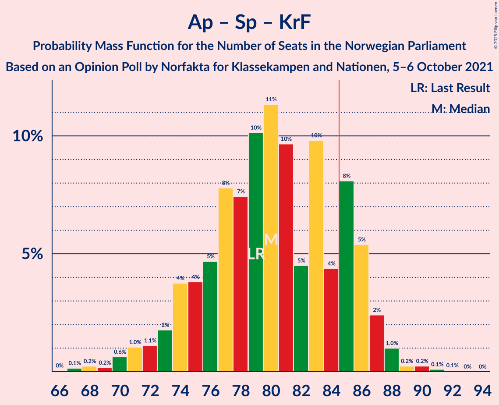

| Number of Seats | Probability | Accumulated | Special Marks |
|:---------------:|:-----------:|:-----------:|:-------------:|
| 66 | 0% | 100% |  |
| 67 | 0.1% | 99.9% |  |
| 68 | 0.2% | 99.8% |  |
| 69 | 0.2% | 99.6% |  |
| 70 | 0.6% | 99.4% |  |
| 71 | 1.0% | 98.8% |  |
| 72 | 1.1% | 98% |  |
| 73 | 2% | 97% |  |
| 74 | 4% | 95% |  |
| 75 | 4% | 91% |  |
| 76 | 5% | 87% |  |
| 77 | 8% | 83% |  |
| 78 | 7% | 75% |  |
| 79 | 10% | 67% | Last Result |
| 80 | 11% | 57% |  |
| 81 | 10% | 46% | Median |
| 82 | 5% | 36% |  |
| 83 | 10% | 32% |  |
| 84 | 4% | 22% |  |
| 85 | 8% | 18% | Majority |
| 86 | 5% | 9% |  |
| 87 | 2% | 4% |  |
| 88 | 1.0% | 2% |  |
| 89 | 0.2% | 0.6% |  |
| 90 | 0.2% | 0.4% |  |
| 91 | 0.1% | 0.2% |  |
| 92 | 0.1% | 0.1% |  |
| 93 | 0% | 0% |  |

### Arbeiderpartiet – Sosialistisk Venstreparti – Rødt – Miljøpartiet De Grønne

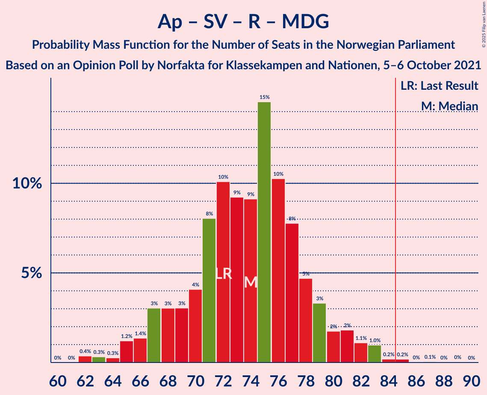

| Number of Seats | Probability | Accumulated | Special Marks |
|:---------------:|:-----------:|:-----------:|:-------------:|
| 62 | 0.4% | 100% |  |
| 63 | 0.3% | 99.6% |  |
| 64 | 0.3% | 99.3% |  |
| 65 | 1.2% | 99.0% |  |
| 66 | 1.4% | 98% |  |
| 67 | 3% | 96% |  |
| 68 | 3% | 93% |  |
| 69 | 3% | 90% |  |
| 70 | 4% | 87% |  |
| 71 | 8% | 83% |  |
| 72 | 10% | 75% | Last Result |
| 73 | 9% | 65% |  |
| 74 | 9% | 56% | Median |
| 75 | 15% | 47% |  |
| 76 | 10% | 32% |  |
| 77 | 8% | 22% |  |
| 78 | 5% | 14% |  |
| 79 | 3% | 9% |  |
| 80 | 2% | 6% |  |
| 81 | 2% | 4% |  |
| 82 | 1.1% | 3% |  |
| 83 | 1.0% | 1.5% |  |
| 84 | 0.2% | 0.5% |  |
| 85 | 0.2% | 0.3% | Majority |
| 86 | 0% | 0.1% |  |
| 87 | 0.1% | 0.1% |  |
| 88 | 0% | 0.1% |  |
| 89 | 0% | 0% |  |

### Arbeiderpartiet – Senterpartiet

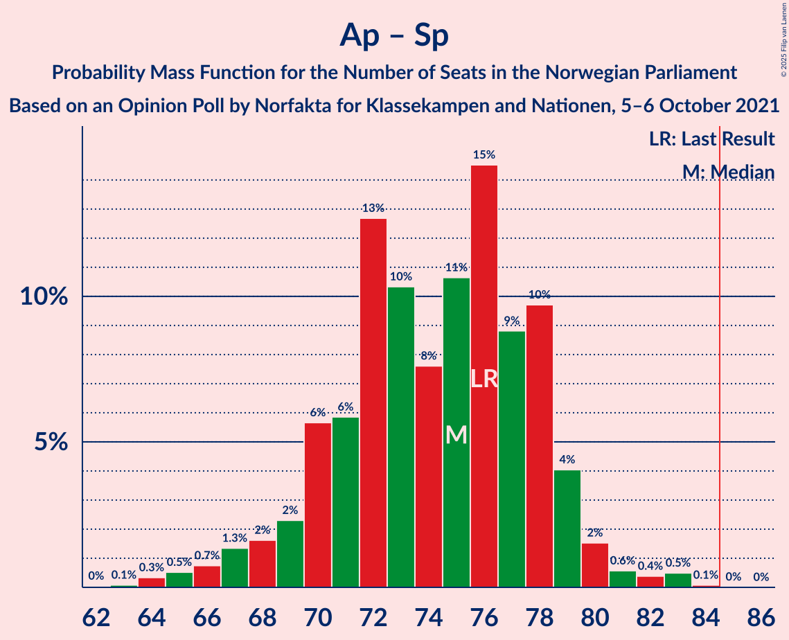

| Number of Seats | Probability | Accumulated | Special Marks |
|:---------------:|:-----------:|:-----------:|:-------------:|
| 62 | 0% | 100% |  |
| 63 | 0.1% | 99.9% |  |
| 64 | 0.3% | 99.9% |  |
| 65 | 0.5% | 99.5% |  |
| 66 | 0.7% | 99.0% |  |
| 67 | 1.3% | 98% |  |
| 68 | 2% | 97% |  |
| 69 | 2% | 95% |  |
| 70 | 6% | 93% |  |
| 71 | 6% | 87% |  |
| 72 | 13% | 81% |  |
| 73 | 10% | 69% |  |
| 74 | 8% | 58% | Median |
| 75 | 11% | 51% |  |
| 76 | 15% | 40% | Last Result |
| 77 | 9% | 26% |  |
| 78 | 10% | 17% |  |
| 79 | 4% | 7% |  |
| 80 | 2% | 3% |  |
| 81 | 0.6% | 2% |  |
| 82 | 0.4% | 1.0% |  |
| 83 | 0.5% | 0.6% |  |
| 84 | 0.1% | 0.1% |  |
| 85 | 0% | 0% | Majority |

### Høyre – Fremskrittspartiet – Venstre – Kristelig Folkeparti – Miljøpartiet De Grønne

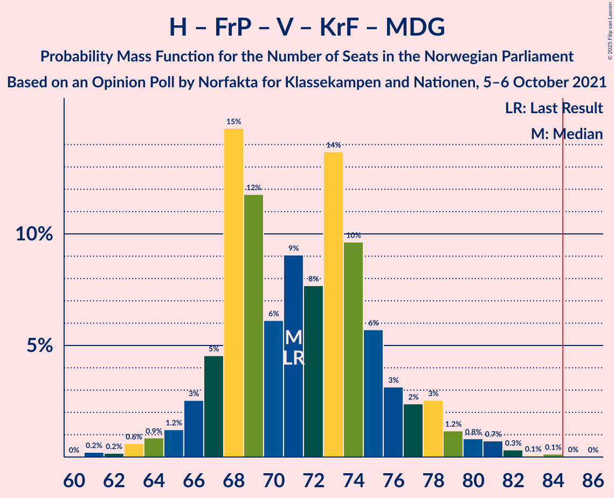

| Number of Seats | Probability | Accumulated | Special Marks |
|:---------------:|:-----------:|:-----------:|:-------------:|
| 60 | 0% | 100% |  |
| 61 | 0.2% | 99.9% |  |
| 62 | 0.2% | 99.7% |  |
| 63 | 0.6% | 99.6% |  |
| 64 | 0.9% | 99.0% |  |
| 65 | 1.2% | 98% |  |
| 66 | 3% | 97% |  |
| 67 | 5% | 94% |  |
| 68 | 15% | 90% |  |
| 69 | 12% | 75% |  |
| 70 | 6% | 63% |  |
| 71 | 9% | 57% | Last Result |
| 72 | 8% | 48% |  |
| 73 | 14% | 40% | Median |
| 74 | 10% | 27% |  |
| 75 | 6% | 17% |  |
| 76 | 3% | 11% |  |
| 77 | 2% | 8% |  |
| 78 | 3% | 6% |  |
| 79 | 1.2% | 3% |  |
| 80 | 0.8% | 2% |  |
| 81 | 0.7% | 1.3% |  |
| 82 | 0.3% | 0.6% |  |
| 83 | 0.1% | 0.2% |  |
| 84 | 0.1% | 0.2% |  |
| 85 | 0% | 0.1% | Majority |
| 86 | 0% | 0% |  |

### Høyre – Fremskrittspartiet – Venstre – Kristelig Folkeparti

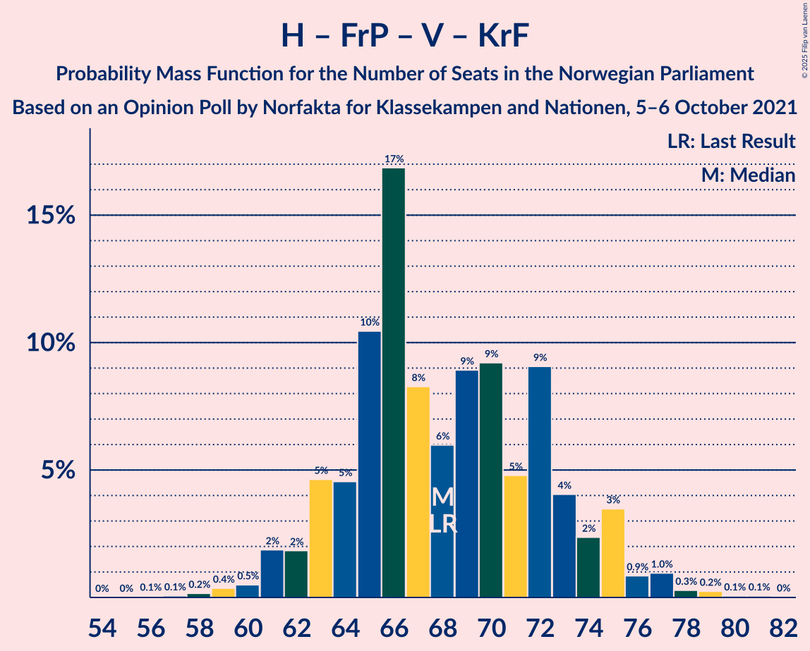

| Number of Seats | Probability | Accumulated | Special Marks |
|:---------------:|:-----------:|:-----------:|:-------------:|
| 56 | 0.1% | 100% |  |
| 57 | 0.1% | 99.9% |  |
| 58 | 0.2% | 99.9% |  |
| 59 | 0.4% | 99.7% |  |
| 60 | 0.5% | 99.3% |  |
| 61 | 2% | 98.8% |  |
| 62 | 2% | 97% |  |
| 63 | 5% | 95% |  |
| 64 | 5% | 91% |  |
| 65 | 10% | 86% |  |
| 66 | 17% | 75% |  |
| 67 | 8% | 59% |  |
| 68 | 6% | 50% | Last Result |
| 69 | 9% | 44% |  |
| 70 | 9% | 35% | Median |
| 71 | 5% | 26% |  |
| 72 | 9% | 21% |  |
| 73 | 4% | 12% |  |
| 74 | 2% | 8% |  |
| 75 | 3% | 6% |  |
| 76 | 0.9% | 2% |  |
| 77 | 1.0% | 2% |  |
| 78 | 0.3% | 0.7% |  |
| 79 | 0.2% | 0.4% |  |
| 80 | 0.1% | 0.2% |  |
| 81 | 0.1% | 0.1% |  |
| 82 | 0% | 0% |  |

### Høyre – Fremskrittspartiet – Venstre

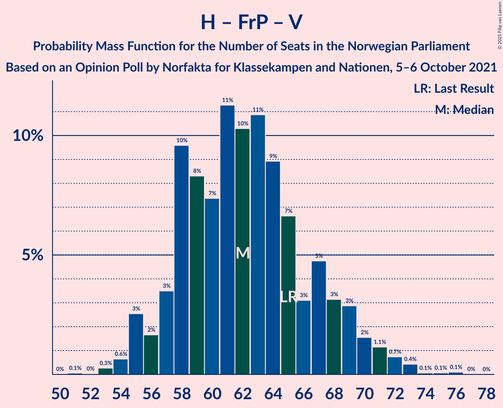

| Number of Seats | Probability | Accumulated | Special Marks |
|:---------------:|:-----------:|:-----------:|:-------------:|
| 51 | 0.1% | 100% |  |
| 52 | 0% | 99.9% |  |
| 53 | 0.3% | 99.9% |  |
| 54 | 0.6% | 99.6% |  |
| 55 | 3% | 99.0% |  |
| 56 | 2% | 96% |  |
| 57 | 3% | 95% |  |
| 58 | 10% | 91% |  |
| 59 | 8% | 82% |  |
| 60 | 7% | 73% |  |
| 61 | 11% | 66% |  |
| 62 | 10% | 55% |  |
| 63 | 11% | 44% | Median |
| 64 | 9% | 34% |  |
| 65 | 7% | 25% | Last Result |
| 66 | 3% | 18% |  |
| 67 | 5% | 15% |  |
| 68 | 3% | 10% |  |
| 69 | 3% | 7% |  |
| 70 | 2% | 4% |  |
| 71 | 1.1% | 3% |  |
| 72 | 0.7% | 1.4% |  |
| 73 | 0.4% | 0.7% |  |
| 74 | 0.1% | 0.3% |  |
| 75 | 0.1% | 0.2% |  |
| 76 | 0.1% | 0.1% |  |
| 77 | 0% | 0% |  |

### Arbeiderpartiet – Sosialistisk Venstreparti

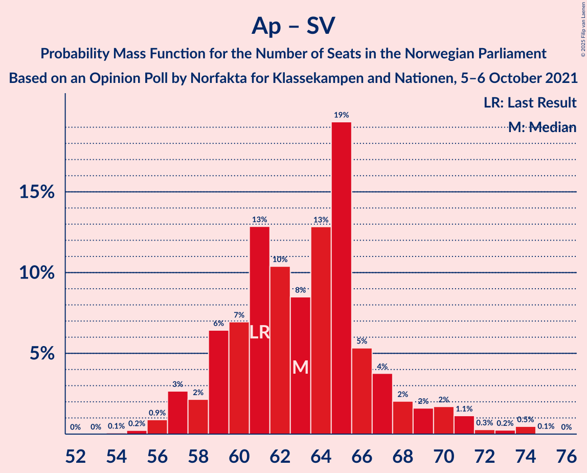

| Number of Seats | Probability | Accumulated | Special Marks |
|:---------------:|:-----------:|:-----------:|:-------------:|
| 54 | 0.1% | 100% |  |
| 55 | 0.2% | 99.9% |  |
| 56 | 0.9% | 99.7% |  |
| 57 | 3% | 98.8% |  |
| 58 | 2% | 96% |  |
| 59 | 6% | 94% |  |
| 60 | 7% | 88% |  |
| 61 | 13% | 81% | Last Result |
| 62 | 10% | 68% |  |
| 63 | 8% | 57% | Median |
| 64 | 13% | 49% |  |
| 65 | 19% | 36% |  |
| 66 | 5% | 17% |  |
| 67 | 4% | 11% |  |
| 68 | 2% | 8% |  |
| 69 | 2% | 6% |  |
| 70 | 2% | 4% |  |
| 71 | 1.1% | 2% |  |
| 72 | 0.3% | 1.1% |  |
| 73 | 0.2% | 0.8% |  |
| 74 | 0.5% | 0.6% |  |
| 75 | 0.1% | 0.1% |  |
| 76 | 0% | 0% |  |

### Høyre – Fremskrittspartiet

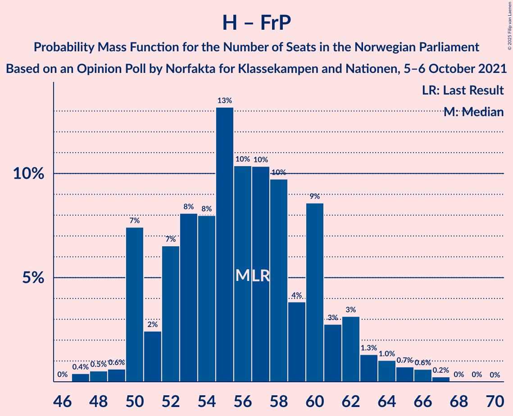

| Number of Seats | Probability | Accumulated | Special Marks |
|:---------------:|:-----------:|:-----------:|:-------------:|
| 46 | 0% | 100% |  |
| 47 | 0.4% | 99.9% |  |
| 48 | 0.5% | 99.5% |  |
| 49 | 0.6% | 99.0% |  |
| 50 | 7% | 98% |  |
| 51 | 2% | 91% |  |
| 52 | 7% | 89% |  |
| 53 | 8% | 82% |  |
| 54 | 8% | 74% |  |
| 55 | 13% | 66% |  |
| 56 | 10% | 53% | Median |
| 57 | 10% | 42% | Last Result |
| 58 | 10% | 32% |  |
| 59 | 4% | 22% |  |
| 60 | 9% | 18% |  |
| 61 | 3% | 10% |  |
| 62 | 3% | 7% |  |
| 63 | 1.3% | 4% |  |
| 64 | 1.0% | 3% |  |
| 65 | 0.7% | 2% |  |
| 66 | 0.6% | 0.9% |  |
| 67 | 0.2% | 0.3% |  |
| 68 | 0% | 0.1% |  |
| 69 | 0% | 0.1% |  |
| 70 | 0% | 0% |  |

### Høyre – Venstre – Kristelig Folkeparti

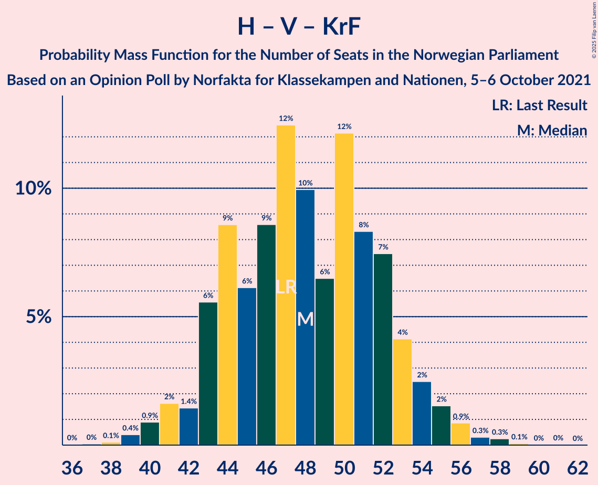

| Number of Seats | Probability | Accumulated | Special Marks |
|:---------------:|:-----------:|:-----------:|:-------------:|
| 37 | 0% | 100% |  |
| 38 | 0.1% | 99.9% |  |
| 39 | 0.4% | 99.8% |  |
| 40 | 0.9% | 99.4% |  |
| 41 | 2% | 98% |  |
| 42 | 1.4% | 97% |  |
| 43 | 6% | 95% |  |
| 44 | 9% | 90% |  |
| 45 | 6% | 81% |  |
| 46 | 9% | 75% |  |
| 47 | 12% | 67% | Last Result |
| 48 | 10% | 54% |  |
| 49 | 6% | 44% |  |
| 50 | 12% | 38% | Median |
| 51 | 8% | 25% |  |
| 52 | 7% | 17% |  |
| 53 | 4% | 10% |  |
| 54 | 2% | 6% |  |
| 55 | 2% | 3% |  |
| 56 | 0.9% | 2% |  |
| 57 | 0.3% | 0.7% |  |
| 58 | 0.3% | 0.4% |  |
| 59 | 0.1% | 0.1% |  |
| 60 | 0% | 0.1% |  |
| 61 | 0% | 0% |  |

### Senterpartiet – Venstre – Kristelig Folkeparti

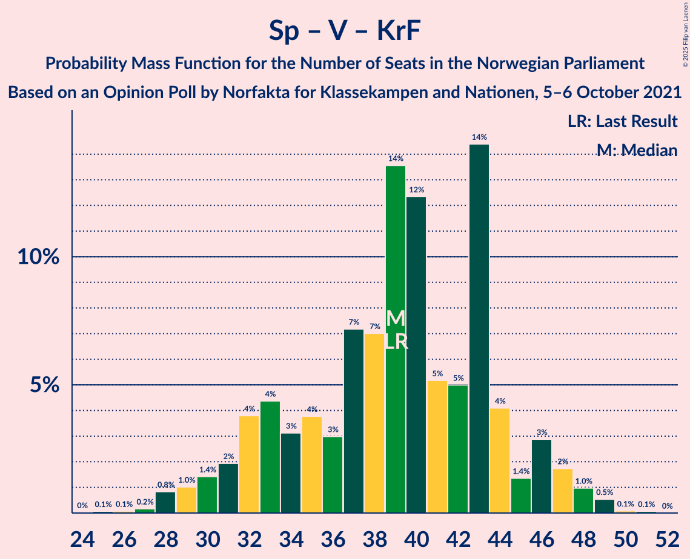

| Number of Seats | Probability | Accumulated | Special Marks |
|:---------------:|:-----------:|:-----------:|:-------------:|
| 25 | 0.1% | 100% |  |
| 26 | 0.1% | 99.9% |  |
| 27 | 0.2% | 99.8% |  |
| 28 | 0.8% | 99.7% |  |
| 29 | 1.0% | 98.8% |  |
| 30 | 1.4% | 98% |  |
| 31 | 2% | 96% |  |
| 32 | 4% | 94% |  |
| 33 | 4% | 91% |  |
| 34 | 3% | 86% |  |
| 35 | 4% | 83% |  |
| 36 | 3% | 79% |  |
| 37 | 7% | 76% |  |
| 38 | 7% | 69% |  |
| 39 | 14% | 62% | Last Result |
| 40 | 12% | 49% |  |
| 41 | 5% | 36% | Median |
| 42 | 5% | 31% |  |
| 43 | 14% | 26% |  |
| 44 | 4% | 12% |  |
| 45 | 1.4% | 8% |  |
| 46 | 3% | 6% |  |
| 47 | 2% | 3% |  |
| 48 | 1.0% | 2% |  |
| 49 | 0.5% | 0.7% |  |
| 50 | 0.1% | 0.2% |  |
| 51 | 0.1% | 0.1% |  |
| 52 | 0% | 0% |  |

## Technical Information

### Opinion Poll

+ **Polling firm:** Norfakta
+ **Commissioner(s):** Klassekampen and Nationen
+ **Fieldwork period:** 5–6 October 2021

### Calculations

+ **Sample size:** 1003
+ **Simulations done:** 1,048,576
+ **Error estimate:** 1.57%

