# Opinion Poll by Opinion Perduco for Avisenes Nyhetsbyrå, Dagsavisen and FriFagbevegelse, 5–11 October 2021

<a href="#voting-intentions">Voting Intentions</a> | <a href="#seats">Seats</a> | <a href="#coalitions">Coalitions</a> | <a href="#technical-information">Technical Information</a>

## Voting Intentions

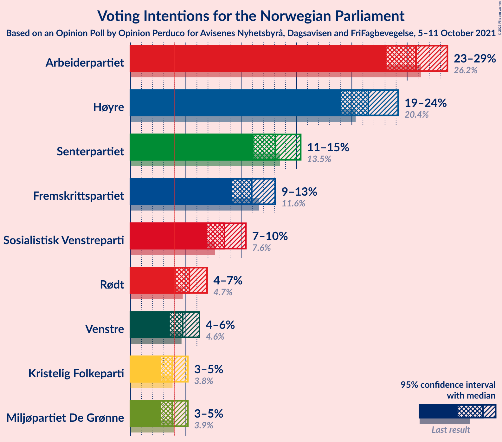

### Confidence Intervals

| Party | Last Result | Poll Result | 80% Confidence Interval | 90% Confidence Interval | 95% Confidence Interval | 99% Confidence Interval |
|:-----:|:-----------:|:-----------:|:-----------------------:|:-----------------------:|:-----------------------:|:-----------------------:|
| Arbeiderpartiet | 26.2% | 25.8% | 24.1–27.6% |23.6–28.2% |23.1–28.6% |22.3–29.5% |
| Høyre | 20.4% | 21.5% | 19.9–23.3% |19.4–23.7% |19.0–24.2% |18.3–25.0% |
| Senterpartiet | 13.5% | 13.1% | 11.8–14.6% |11.4–15.0% |11.1–15.4% |10.5–16.1% |
| Fremskrittspartiet | 11.6% | 11.0% | 9.8–12.3% |9.4–12.7% |9.1–13.1% |8.6–13.8% |
| Sosialistisk Venstreparti | 7.6% | 8.5% | 7.4–9.8% |7.1–10.1% |6.9–10.4% |6.4–11.1% |
| Rødt | 4.7% | 5.3% | 4.5–6.4% |4.3–6.7% |4.1–6.9% |3.7–7.5% |
| Venstre | 4.6% | 4.7% | 3.9–5.7% |3.7–6.0% |3.6–6.2% |3.2–6.7% |
| Kristelig Folkeparti | 3.8% | 3.8% | 3.1–4.7% |2.9–5.0% |2.8–5.2% |2.5–5.7% |
| Miljøpartiet De Grønne | 3.9% | 3.8% | 3.1–4.7% |2.9–5.0% |2.8–5.2% |2.5–5.7% |

*Note:* The poll result column reflects the actual value used in the calculations. Published results may vary slightly, and in addition be rounded to fewer digits.

## Seats

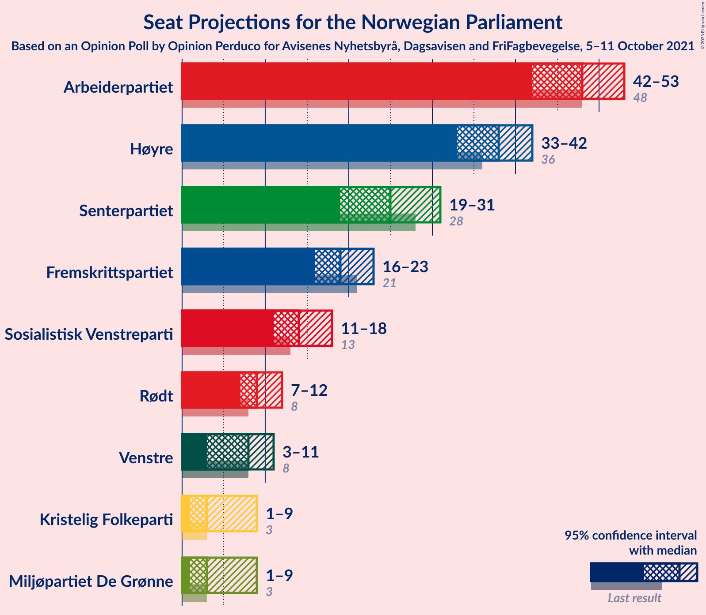

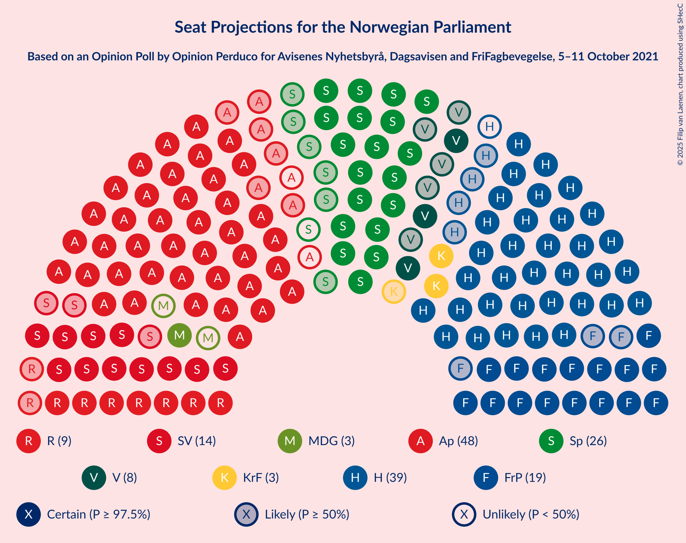

### Confidence Intervals

| Party | Last Result | Median | 80% Confidence Interval | 90% Confidence Interval | 95% Confidence Interval | 99% Confidence Interval |
|:-----:|:-----------:|:------:|:-----------------------:|:-----------------------:|:-----------------------:|:-----------------------:|
| <a href="#arbeiderpartiet">Arbeiderpartiet</a> | 48 | 48 | 44–51 |43–52 |42–53 |41–55 |
| <a href="#høyre">Høyre</a> | 36 | 38 | 34–41 |34–42 |33–42 |31–45 |
| <a href="#senterpartiet">Senterpartiet</a> | 28 | 25 | 21–29 |20–30 |19–31 |18–32 |
| <a href="#fremskrittspartiet">Fremskrittspartiet</a> | 21 | 19 | 17–22 |16–23 |16–23 |14–24 |
| <a href="#sosialistisk-venstreparti">Sosialistisk Venstreparti</a> | 13 | 14 | 12–17 |12–17 |11–18 |10–20 |
| <a href="#rødt">Rødt</a> | 8 | 9 | 7–11 |7–12 |7–12 |1–13 |
| <a href="#venstre">Venstre</a> | 8 | 8 | 3–10 |3–10 |3–11 |2–12 |
| <a href="#kristelig-folkeparti">Kristelig Folkeparti</a> | 3 | 3 | 2–8 |2–8 |1–9 |1–9 |
| <a href="#miljøpartiet-de-grønne">Miljøpartiet De Grønne</a> | 3 | 3 | 2–8 |1–8 |1–9 |1–9 |

### Arbeiderpartiet

*For a full overview of the results for this party, see the [Arbeiderpartiet](party-arbeiderpartiet.html) page.*

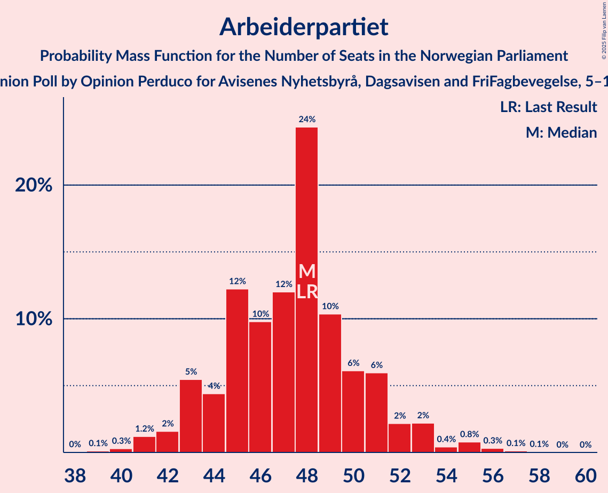

| Number of Seats | Probability | Accumulated | Special Marks |
|:---------------:|:-----------:|:-----------:|:-------------:|
| 39 | 0.1% | 100% |  |
| 40 | 0.3% | 99.8% |  |
| 41 | 1.2% | 99.6% |  |
| 42 | 2% | 98% |  |
| 43 | 5% | 97% |  |
| 44 | 4% | 91% |  |
| 45 | 12% | 87% |  |
| 46 | 10% | 75% |  |
| 47 | 12% | 65% |  |
| 48 | 24% | 53% | Last Result, Median |
| 49 | 10% | 29% |  |
| 50 | 6% | 18% |  |
| 51 | 6% | 12% |  |
| 52 | 2% | 6% |  |
| 53 | 2% | 4% |  |
| 54 | 0.4% | 2% |  |
| 55 | 0.8% | 1.3% |  |
| 56 | 0.3% | 0.5% |  |
| 57 | 0.1% | 0.2% |  |
| 58 | 0.1% | 0.1% |  |
| 59 | 0% | 0% |  |

### Høyre

*For a full overview of the results for this party, see the [Høyre](party-høyre.html) page.*

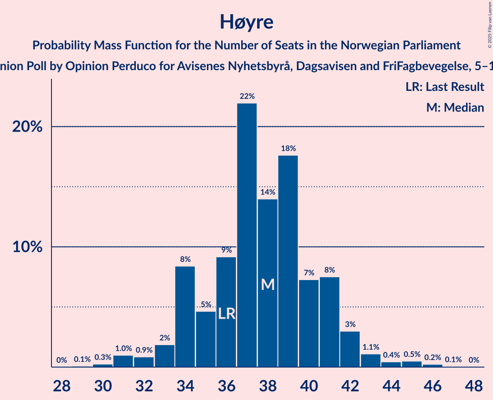

| Number of Seats | Probability | Accumulated | Special Marks |
|:---------------:|:-----------:|:-----------:|:-------------:|
| 29 | 0.1% | 100% |  |
| 30 | 0.3% | 99.9% |  |
| 31 | 1.0% | 99.6% |  |
| 32 | 0.9% | 98.7% |  |
| 33 | 2% | 98% |  |
| 34 | 8% | 96% |  |
| 35 | 5% | 88% |  |
| 36 | 9% | 83% | Last Result |
| 37 | 22% | 74% |  |
| 38 | 14% | 52% | Median |
| 39 | 18% | 38% |  |
| 40 | 7% | 20% |  |
| 41 | 8% | 13% |  |
| 42 | 3% | 5% |  |
| 43 | 1.1% | 2% |  |
| 44 | 0.4% | 1.3% |  |
| 45 | 0.5% | 0.8% |  |
| 46 | 0.2% | 0.3% |  |
| 47 | 0.1% | 0.1% |  |
| 48 | 0% | 0% |  |

### Senterpartiet

*For a full overview of the results for this party, see the [Senterpartiet](party-senterpartiet.html) page.*

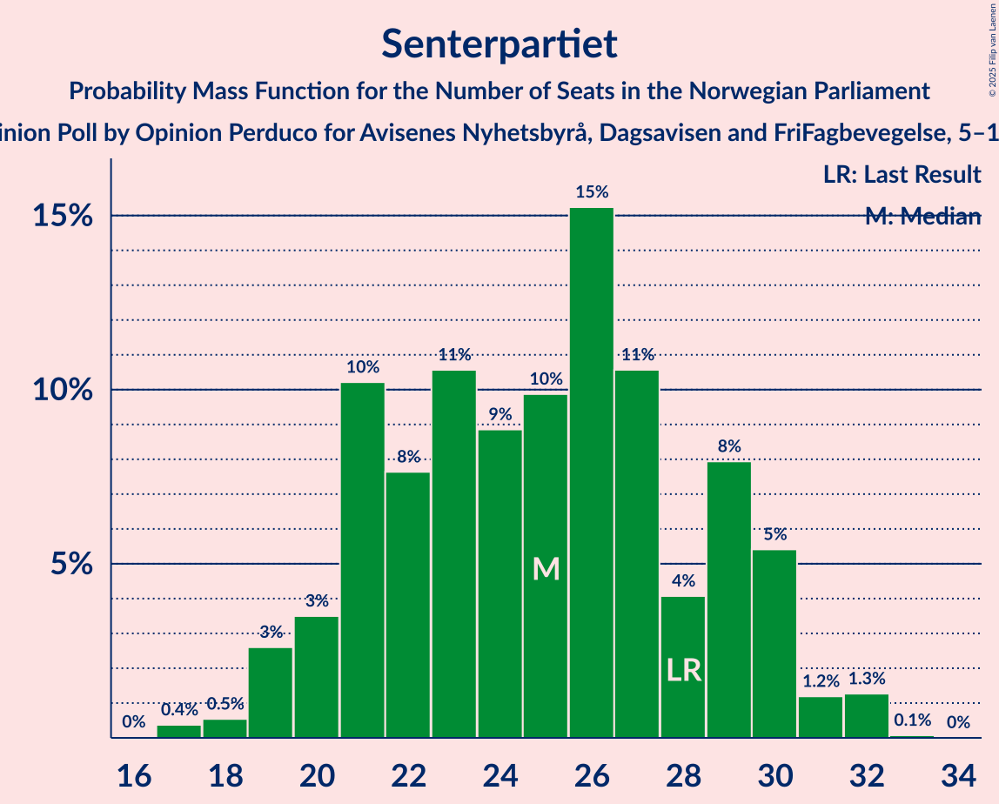

| Number of Seats | Probability | Accumulated | Special Marks |
|:---------------:|:-----------:|:-----------:|:-------------:|
| 17 | 0.4% | 100% |  |
| 18 | 0.5% | 99.6% |  |
| 19 | 3% | 99.0% |  |
| 20 | 3% | 96% |  |
| 21 | 10% | 93% |  |
| 22 | 8% | 83% |  |
| 23 | 11% | 75% |  |
| 24 | 9% | 65% |  |
| 25 | 10% | 56% | Median |
| 26 | 15% | 46% |  |
| 27 | 11% | 31% |  |
| 28 | 4% | 20% | Last Result |
| 29 | 8% | 16% |  |
| 30 | 5% | 8% |  |
| 31 | 1.2% | 3% |  |
| 32 | 1.3% | 1.4% |  |
| 33 | 0.1% | 0.1% |  |
| 34 | 0% | 0% |  |

### Fremskrittspartiet

*For a full overview of the results for this party, see the [Fremskrittspartiet](party-fremskrittspartiet.html) page.*

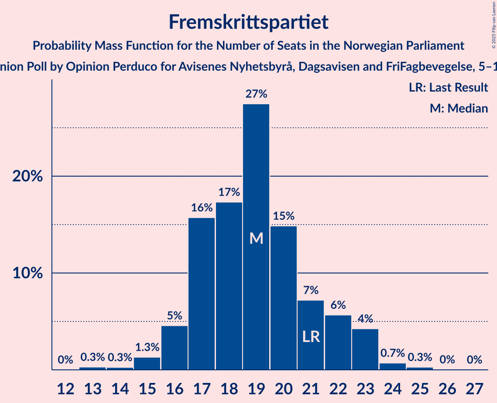

| Number of Seats | Probability | Accumulated | Special Marks |
|:---------------:|:-----------:|:-----------:|:-------------:|
| 13 | 0.3% | 100% |  |
| 14 | 0.3% | 99.7% |  |
| 15 | 1.3% | 99.4% |  |
| 16 | 5% | 98% |  |
| 17 | 16% | 94% |  |
| 18 | 17% | 78% |  |
| 19 | 27% | 60% | Median |
| 20 | 15% | 33% |  |
| 21 | 7% | 18% | Last Result |
| 22 | 6% | 11% |  |
| 23 | 4% | 5% |  |
| 24 | 0.7% | 1.0% |  |
| 25 | 0.3% | 0.3% |  |
| 26 | 0% | 0.1% |  |
| 27 | 0% | 0% |  |

### Sosialistisk Venstreparti

*For a full overview of the results for this party, see the [Sosialistisk Venstreparti](party-sosialistiskvenstreparti.html) page.*

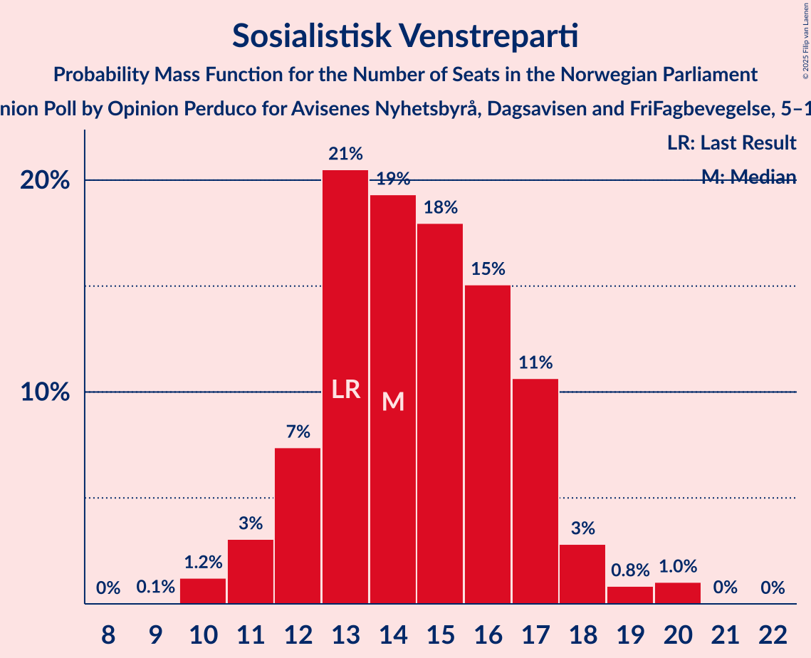

| Number of Seats | Probability | Accumulated | Special Marks |
|:---------------:|:-----------:|:-----------:|:-------------:|
| 9 | 0.1% | 100% |  |
| 10 | 1.2% | 99.9% |  |
| 11 | 3% | 98.7% |  |
| 12 | 7% | 96% |  |
| 13 | 21% | 88% | Last Result |
| 14 | 19% | 68% | Median |
| 15 | 18% | 48% |  |
| 16 | 15% | 30% |  |
| 17 | 11% | 15% |  |
| 18 | 3% | 5% |  |
| 19 | 0.8% | 2% |  |
| 20 | 1.0% | 1.1% |  |
| 21 | 0% | 0.1% |  |
| 22 | 0% | 0% |  |

### Rødt

*For a full overview of the results for this party, see the [Rødt](party-rødt.html) page.*

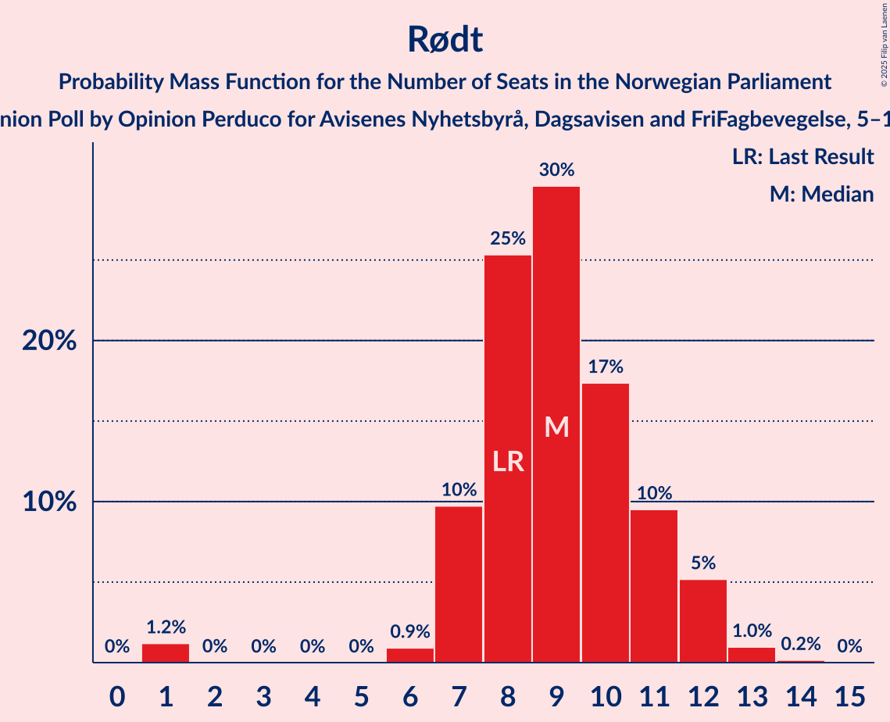

| Number of Seats | Probability | Accumulated | Special Marks |
|:---------------:|:-----------:|:-----------:|:-------------:|
| 1 | 1.2% | 100% |  |
| 2 | 0% | 98.8% |  |
| 3 | 0% | 98.8% |  |
| 4 | 0% | 98.8% |  |
| 5 | 0% | 98.8% |  |
| 6 | 0.9% | 98.8% |  |
| 7 | 10% | 98% |  |
| 8 | 25% | 88% | Last Result |
| 9 | 30% | 63% | Median |
| 10 | 17% | 33% |  |
| 11 | 10% | 16% |  |
| 12 | 5% | 6% |  |
| 13 | 1.0% | 1.1% |  |
| 14 | 0.2% | 0.2% |  |
| 15 | 0% | 0% |  |

### Venstre

*For a full overview of the results for this party, see the [Venstre](party-venstre.html) page.*

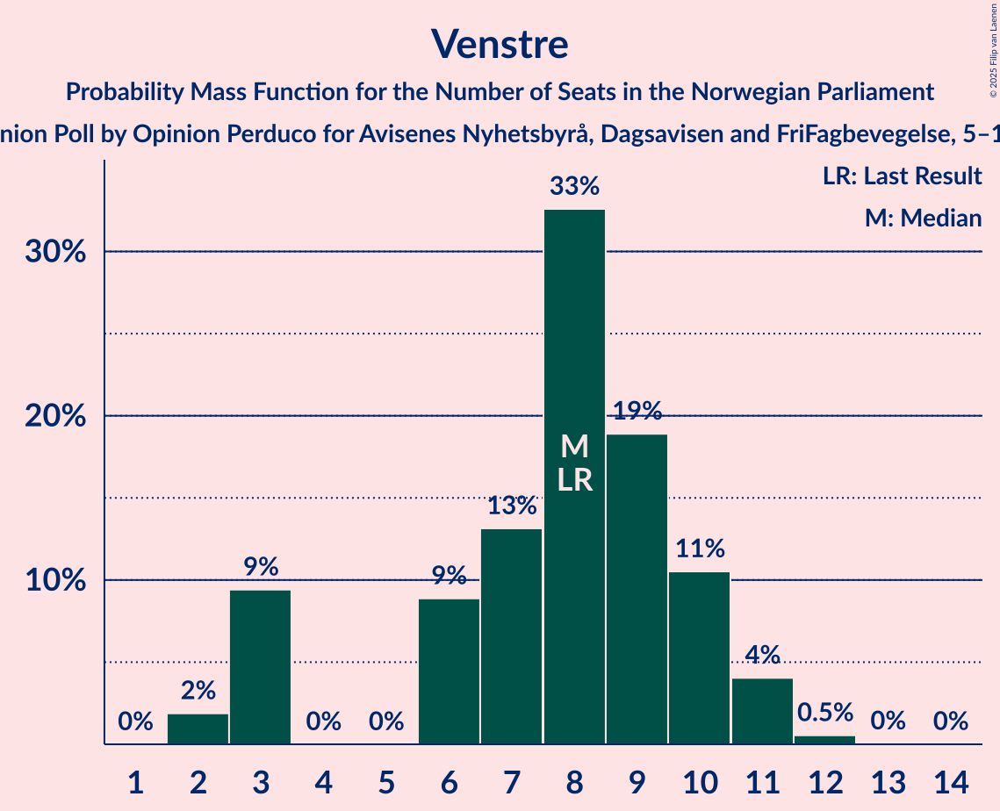

| Number of Seats | Probability | Accumulated | Special Marks |
|:---------------:|:-----------:|:-----------:|:-------------:|
| 2 | 2% | 100% |  |
| 3 | 9% | 98% |  |
| 4 | 0% | 89% |  |
| 5 | 0% | 89% |  |
| 6 | 9% | 89% |  |
| 7 | 13% | 80% |  |
| 8 | 33% | 67% | Last Result, Median |
| 9 | 19% | 34% |  |
| 10 | 11% | 15% |  |
| 11 | 4% | 5% |  |
| 12 | 0.5% | 0.6% |  |
| 13 | 0% | 0.1% |  |
| 14 | 0% | 0% |  |

### Kristelig Folkeparti

*For a full overview of the results for this party, see the [Kristelig Folkeparti](party-kristeligfolkeparti.html) page.*

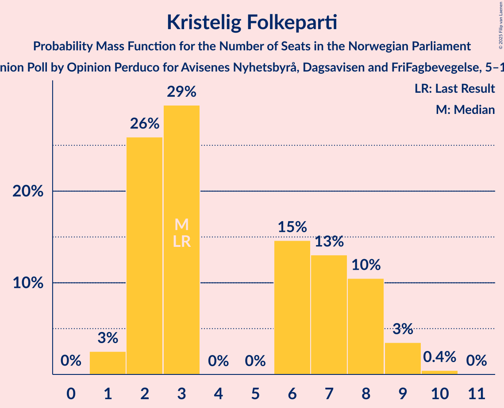

| Number of Seats | Probability | Accumulated | Special Marks |
|:---------------:|:-----------:|:-----------:|:-------------:|
| 1 | 3% | 100% |  |
| 2 | 26% | 97% |  |
| 3 | 29% | 72% | Last Result, Median |
| 4 | 0% | 42% |  |
| 5 | 0% | 42% |  |
| 6 | 15% | 42% |  |
| 7 | 13% | 28% |  |
| 8 | 10% | 14% |  |
| 9 | 3% | 4% |  |
| 10 | 0.4% | 0.5% |  |
| 11 | 0% | 0% |  |

### Miljøpartiet De Grønne

*For a full overview of the results for this party, see the [Miljøpartiet De Grønne](party-miljøpartietdegrønne.html) page.*

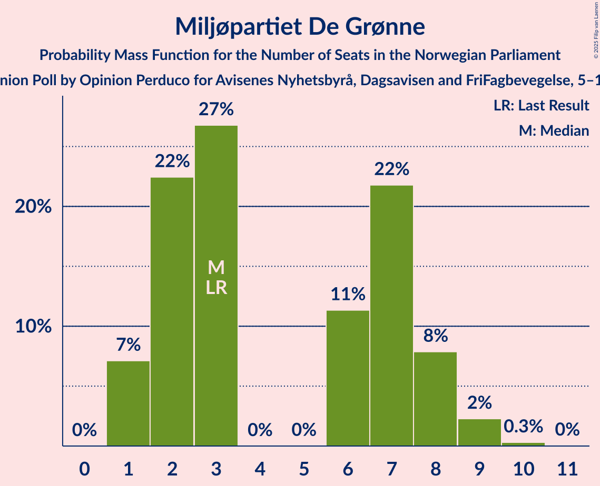

| Number of Seats | Probability | Accumulated | Special Marks |
|:---------------:|:-----------:|:-----------:|:-------------:|
| 1 | 7% | 100% |  |
| 2 | 22% | 93% |  |
| 3 | 27% | 70% | Last Result, Median |
| 4 | 0% | 44% |  |
| 5 | 0% | 44% |  |
| 6 | 11% | 44% |  |
| 7 | 22% | 32% |  |
| 8 | 8% | 11% |  |
| 9 | 2% | 3% |  |
| 10 | 0.3% | 0.4% |  |
| 11 | 0% | 0% |  |

## Coalitions

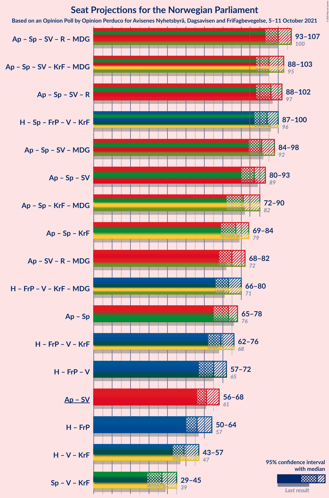

### Confidence Intervals

| Coalition | Last Result | Median | Majority? | 80% Confidence Interval | 90% Confidence Interval | 95% Confidence Interval | 99% Confidence Interval |
|:---------:|:-----------:|:------:|:---------:|:-----------------------:|:-----------------------:|:-----------------------:|:-----------------------:|
| Arbeiderpartiet – Senterpartiet – Sosialistisk Venstreparti – Rødt – Miljøpartiet De Grønne | 100 | 100 | 100% | 96–105 | 94–106 | 93–107 | 91–109 |
| Arbeiderpartiet – Senterpartiet – Sosialistisk Venstreparti – Kristelig Folkeparti – Miljøpartiet De Grønne | 95 | 95 | 99.9% | 91–100 | 89–102 | 88–103 | 86–106 |
| Arbeiderpartiet – Senterpartiet – Sosialistisk Venstreparti – Rødt | 97 | 96 | 99.9% | 91–100 | 89–101 | 88–102 | 86–105 |
| Høyre – Senterpartiet – Fremskrittspartiet – Venstre – Kristelig Folkeparti | 96 | 94 | 99.4% | 90–98 | 88–99 | 87–100 | 84–102 |
| Arbeiderpartiet – Senterpartiet – Sosialistisk Venstreparti – Miljøpartiet De Grønne | 92 | 91 | 96% | 87–97 | 85–97 | 84–98 | 82–100 |
| Arbeiderpartiet – Senterpartiet – Sosialistisk Venstreparti | 89 | 87 | 79% | 82–90 | 81–92 | 80–93 | 78–95 |
| Arbeiderpartiet – Senterpartiet – Kristelig Folkeparti – Miljøpartiet De Grønne | 82 | 81 | 30% | 75–87 | 73–89 | 72–90 | 70–91 |
| Arbeiderpartiet – Senterpartiet – Kristelig Folkeparti | 79 | 77 | 1.5% | 71–82 | 70–83 | 69–84 | 67–86 |
| Arbeiderpartiet – Sosialistisk Venstreparti – Rødt – Miljøpartiet De Grønne | 72 | 75 | 0.5% | 71–79 | 70–81 | 68–82 | 67–85 |
| Høyre – Fremskrittspartiet – Venstre – Kristelig Folkeparti – Miljøpartiet De Grønne | 71 | 73 | 0.1% | 69–78 | 68–79 | 66–80 | 64–82 |
| Arbeiderpartiet – Senterpartiet | 76 | 73 | 0% | 67–77 | 66–77 | 65–78 | 63–80 |
| Høyre – Fremskrittspartiet – Venstre – Kristelig Folkeparti | 68 | 69 | 0% | 64–73 | 63–75 | 62–76 | 60–78 |
| Høyre – Fremskrittspartiet – Venstre | 65 | 65 | 0% | 60–68 | 58–70 | 57–72 | 55–73 |
| Arbeiderpartiet – Sosialistisk Venstreparti | 61 | 61 | 0% | 59–66 | 58–68 | 56–68 | 54–70 |
| Høyre – Fremskrittspartiet | 57 | 56 | 0% | 52–61 | 51–62 | 50–64 | 48–66 |
| Høyre – Venstre – Kristelig Folkeparti | 47 | 49 | 0% | 46–54 | 45–55 | 43–57 | 40–58 |
| Senterpartiet – Venstre – Kristelig Folkeparti | 39 | 37 | 0% | 32–42 | 31–43 | 29–45 | 27–47 |

### Arbeiderpartiet – Senterpartiet – Sosialistisk Venstreparti – Rødt – Miljøpartiet De Grønne

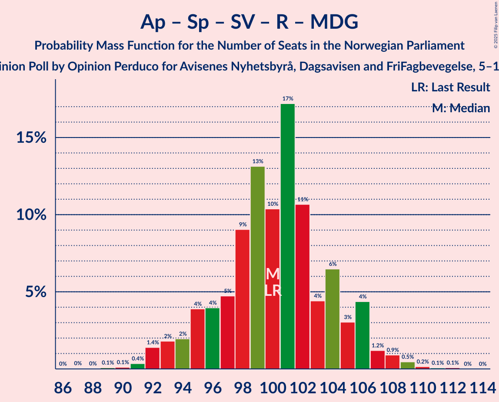

| Number of Seats | Probability | Accumulated | Special Marks |
|:---------------:|:-----------:|:-----------:|:-------------:|
| 87 | 0% | 100% |  |
| 88 | 0% | 99.9% |  |
| 89 | 0.1% | 99.9% |  |
| 90 | 0.1% | 99.8% |  |
| 91 | 0.4% | 99.7% |  |
| 92 | 1.4% | 99.4% |  |
| 93 | 2% | 98% |  |
| 94 | 2% | 96% |  |
| 95 | 4% | 94% |  |
| 96 | 4% | 90% |  |
| 97 | 5% | 86% |  |
| 98 | 9% | 82% |  |
| 99 | 13% | 73% | Median |
| 100 | 10% | 59% | Last Result |
| 101 | 17% | 49% |  |
| 102 | 11% | 32% |  |
| 103 | 4% | 21% |  |
| 104 | 6% | 17% |  |
| 105 | 3% | 10% |  |
| 106 | 4% | 7% |  |
| 107 | 1.2% | 3% |  |
| 108 | 0.9% | 2% |  |
| 109 | 0.5% | 0.8% |  |
| 110 | 0.2% | 0.3% |  |
| 111 | 0.1% | 0.2% |  |
| 112 | 0.1% | 0.1% |  |
| 113 | 0% | 0% |  |

### Arbeiderpartiet – Senterpartiet – Sosialistisk Venstreparti – Kristelig Folkeparti – Miljøpartiet De Grønne

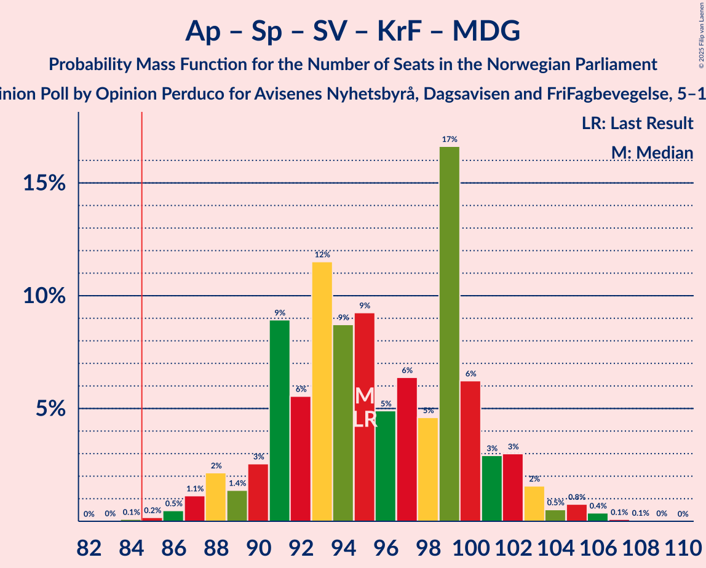

| Number of Seats | Probability | Accumulated | Special Marks |
|:---------------:|:-----------:|:-----------:|:-------------:|
| 84 | 0.1% | 100% |  |
| 85 | 0.2% | 99.9% | Majority |
| 86 | 0.5% | 99.7% |  |
| 87 | 1.1% | 99.2% |  |
| 88 | 2% | 98% |  |
| 89 | 1.4% | 96% |  |
| 90 | 3% | 95% |  |
| 91 | 9% | 92% |  |
| 92 | 6% | 83% |  |
| 93 | 12% | 78% | Median |
| 94 | 9% | 66% |  |
| 95 | 9% | 57% | Last Result |
| 96 | 5% | 48% |  |
| 97 | 6% | 43% |  |
| 98 | 5% | 37% |  |
| 99 | 17% | 32% |  |
| 100 | 6% | 16% |  |
| 101 | 3% | 9% |  |
| 102 | 3% | 6% |  |
| 103 | 2% | 3% |  |
| 104 | 0.5% | 2% |  |
| 105 | 0.8% | 1.3% |  |
| 106 | 0.4% | 0.6% |  |
| 107 | 0.1% | 0.2% |  |
| 108 | 0.1% | 0.1% |  |
| 109 | 0% | 0% |  |

### Arbeiderpartiet – Senterpartiet – Sosialistisk Venstreparti – Rødt

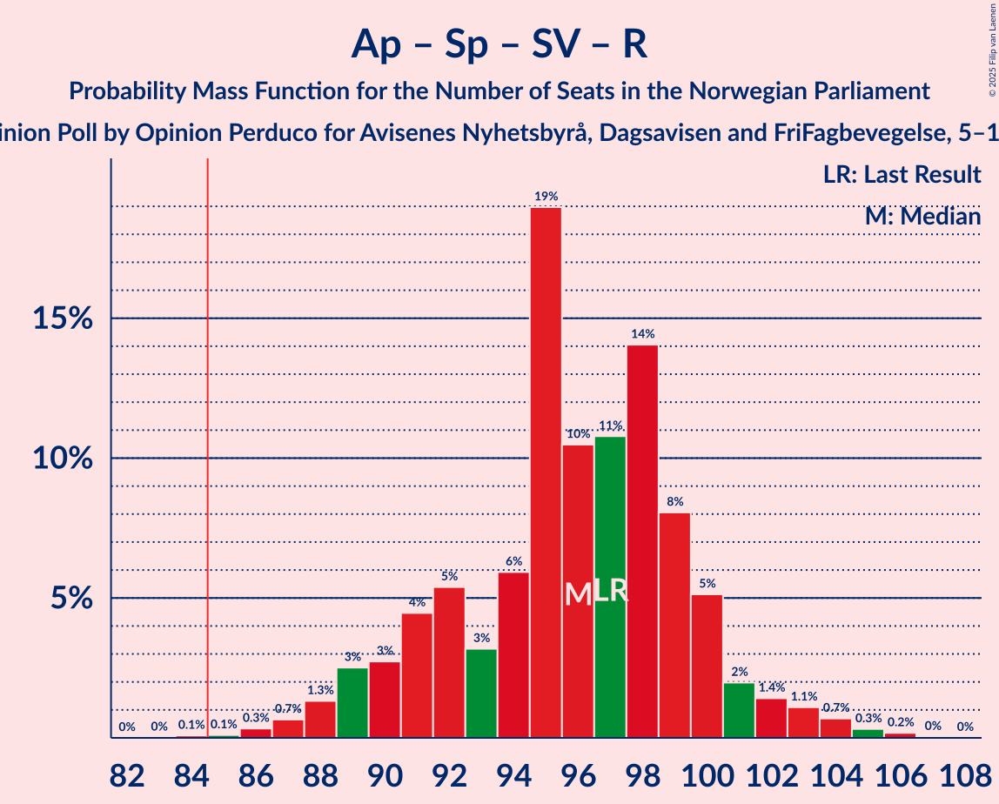

| Number of Seats | Probability | Accumulated | Special Marks |
|:---------------:|:-----------:|:-----------:|:-------------:|
| 84 | 0.1% | 100% |  |
| 85 | 0.1% | 99.9% | Majority |
| 86 | 0.3% | 99.8% |  |
| 87 | 0.7% | 99.4% |  |
| 88 | 1.3% | 98.8% |  |
| 89 | 3% | 97% |  |
| 90 | 3% | 95% |  |
| 91 | 4% | 92% |  |
| 92 | 5% | 88% |  |
| 93 | 3% | 82% |  |
| 94 | 6% | 79% |  |
| 95 | 19% | 73% |  |
| 96 | 10% | 54% | Median |
| 97 | 11% | 44% | Last Result |
| 98 | 14% | 33% |  |
| 99 | 8% | 19% |  |
| 100 | 5% | 11% |  |
| 101 | 2% | 6% |  |
| 102 | 1.4% | 4% |  |
| 103 | 1.1% | 2% |  |
| 104 | 0.7% | 1.3% |  |
| 105 | 0.3% | 0.6% |  |
| 106 | 0.2% | 0.2% |  |
| 107 | 0% | 0.1% |  |
| 108 | 0% | 0% |  |

### Høyre – Senterpartiet – Fremskrittspartiet – Venstre – Kristelig Folkeparti

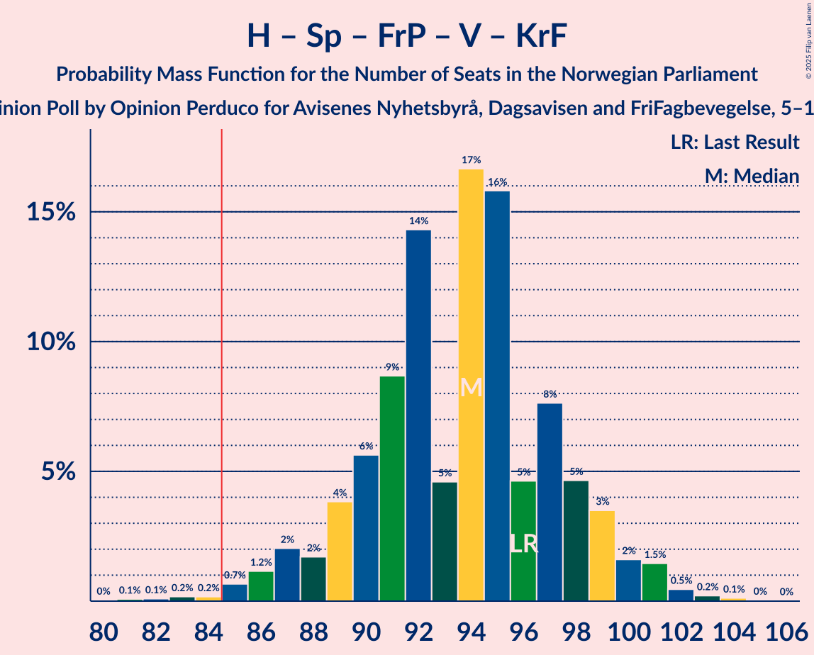

| Number of Seats | Probability | Accumulated | Special Marks |
|:---------------:|:-----------:|:-----------:|:-------------:|
| 81 | 0.1% | 100% |  |
| 82 | 0.1% | 99.9% |  |
| 83 | 0.2% | 99.8% |  |
| 84 | 0.2% | 99.6% |  |
| 85 | 0.7% | 99.4% | Majority |
| 86 | 1.2% | 98.8% |  |
| 87 | 2% | 98% |  |
| 88 | 2% | 96% |  |
| 89 | 4% | 94% |  |
| 90 | 6% | 90% |  |
| 91 | 9% | 84% |  |
| 92 | 14% | 76% |  |
| 93 | 5% | 61% | Median |
| 94 | 17% | 57% |  |
| 95 | 16% | 40% |  |
| 96 | 5% | 24% | Last Result |
| 97 | 8% | 20% |  |
| 98 | 5% | 12% |  |
| 99 | 3% | 7% |  |
| 100 | 2% | 4% |  |
| 101 | 1.5% | 2% |  |
| 102 | 0.5% | 0.9% |  |
| 103 | 0.2% | 0.4% |  |
| 104 | 0.1% | 0.2% |  |
| 105 | 0% | 0.1% |  |
| 106 | 0% | 0% |  |

### Arbeiderpartiet – Senterpartiet – Sosialistisk Venstreparti – Miljøpartiet De Grønne

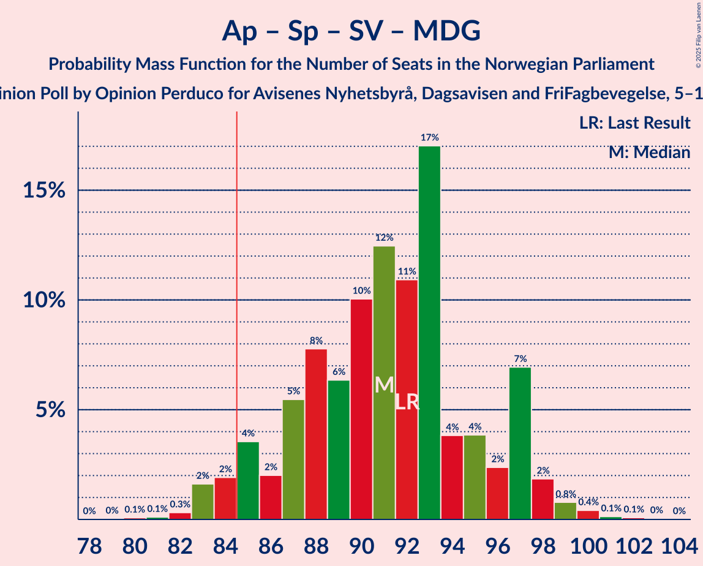

| Number of Seats | Probability | Accumulated | Special Marks |
|:---------------:|:-----------:|:-----------:|:-------------:|
| 79 | 0% | 100% |  |
| 80 | 0.1% | 99.9% |  |
| 81 | 0.1% | 99.9% |  |
| 82 | 0.3% | 99.8% |  |
| 83 | 2% | 99.5% |  |
| 84 | 2% | 98% |  |
| 85 | 4% | 96% | Majority |
| 86 | 2% | 92% |  |
| 87 | 5% | 90% |  |
| 88 | 8% | 85% |  |
| 89 | 6% | 77% |  |
| 90 | 10% | 71% | Median |
| 91 | 12% | 61% |  |
| 92 | 11% | 48% | Last Result |
| 93 | 17% | 37% |  |
| 94 | 4% | 20% |  |
| 95 | 4% | 16% |  |
| 96 | 2% | 13% |  |
| 97 | 7% | 10% |  |
| 98 | 2% | 3% |  |
| 99 | 0.8% | 1.5% |  |
| 100 | 0.4% | 0.7% |  |
| 101 | 0.1% | 0.3% |  |
| 102 | 0.1% | 0.1% |  |
| 103 | 0% | 0.1% |  |
| 104 | 0% | 0% |  |

### Arbeiderpartiet – Senterpartiet – Sosialistisk Venstreparti

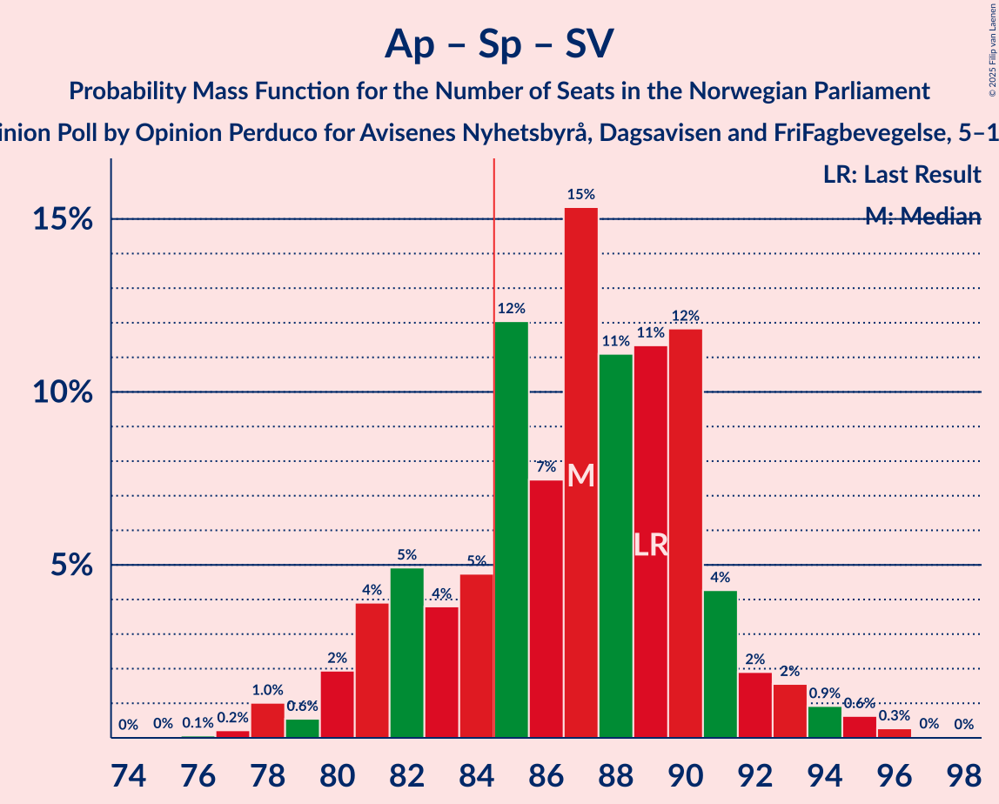

| Number of Seats | Probability | Accumulated | Special Marks |
|:---------------:|:-----------:|:-----------:|:-------------:|
| 75 | 0% | 100% |  |
| 76 | 0.1% | 99.9% |  |
| 77 | 0.2% | 99.9% |  |
| 78 | 1.0% | 99.7% |  |
| 79 | 0.6% | 98.6% |  |
| 80 | 2% | 98% |  |
| 81 | 4% | 96% |  |
| 82 | 5% | 92% |  |
| 83 | 4% | 87% |  |
| 84 | 5% | 84% |  |
| 85 | 12% | 79% | Majority |
| 86 | 7% | 67% |  |
| 87 | 15% | 59% | Median |
| 88 | 11% | 44% |  |
| 89 | 11% | 33% | Last Result |
| 90 | 12% | 21% |  |
| 91 | 4% | 10% |  |
| 92 | 2% | 5% |  |
| 93 | 2% | 3% |  |
| 94 | 0.9% | 2% |  |
| 95 | 0.6% | 1.0% |  |
| 96 | 0.3% | 0.3% |  |
| 97 | 0% | 0.1% |  |
| 98 | 0% | 0% |  |

### Arbeiderpartiet – Senterpartiet – Kristelig Folkeparti – Miljøpartiet De Grønne

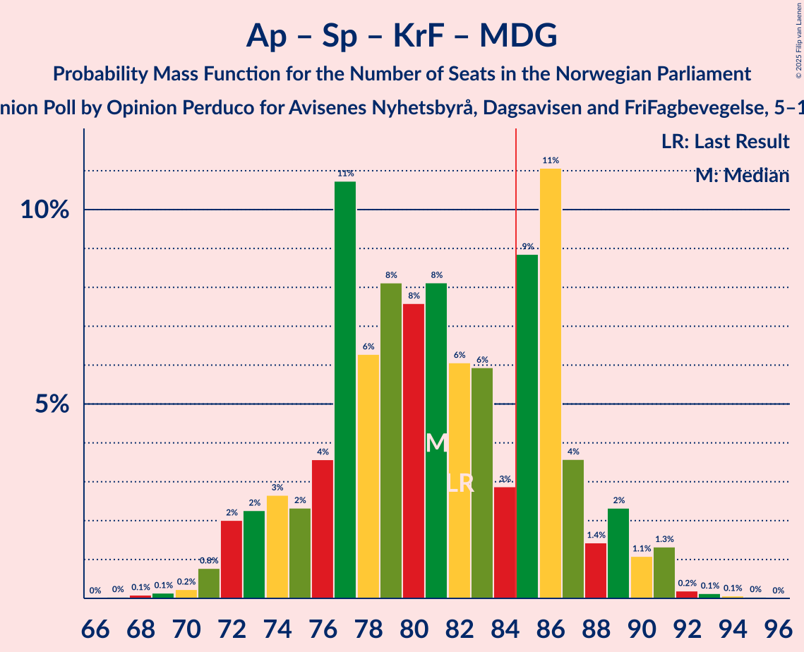

| Number of Seats | Probability | Accumulated | Special Marks |
|:---------------:|:-----------:|:-----------:|:-------------:|
| 68 | 0.1% | 100% |  |
| 69 | 0.1% | 99.9% |  |
| 70 | 0.2% | 99.7% |  |
| 71 | 0.8% | 99.5% |  |
| 72 | 2% | 98.7% |  |
| 73 | 2% | 97% |  |
| 74 | 3% | 94% |  |
| 75 | 2% | 92% |  |
| 76 | 4% | 89% |  |
| 77 | 11% | 86% |  |
| 78 | 6% | 75% |  |
| 79 | 8% | 69% | Median |
| 80 | 8% | 61% |  |
| 81 | 8% | 53% |  |
| 82 | 6% | 45% | Last Result |
| 83 | 6% | 39% |  |
| 84 | 3% | 33% |  |
| 85 | 9% | 30% | Majority |
| 86 | 11% | 21% |  |
| 87 | 4% | 10% |  |
| 88 | 1.4% | 7% |  |
| 89 | 2% | 5% |  |
| 90 | 1.1% | 3% |  |
| 91 | 1.3% | 2% |  |
| 92 | 0.2% | 0.4% |  |
| 93 | 0.1% | 0.2% |  |
| 94 | 0.1% | 0.1% |  |
| 95 | 0% | 0% |  |

### Arbeiderpartiet – Senterpartiet – Kristelig Folkeparti

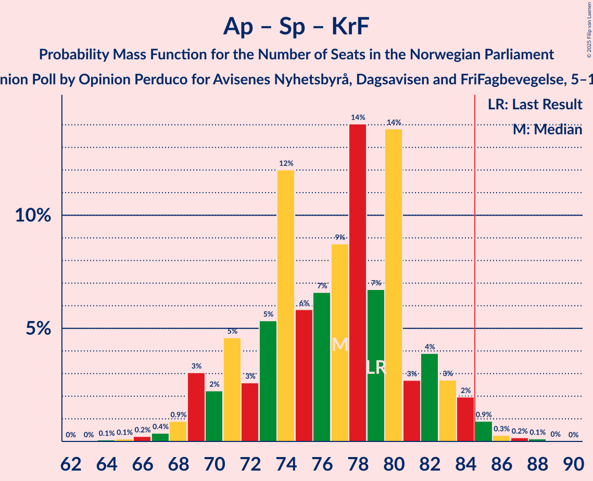

| Number of Seats | Probability | Accumulated | Special Marks |
|:---------------:|:-----------:|:-----------:|:-------------:|
| 64 | 0.1% | 100% |  |
| 65 | 0.1% | 99.9% |  |
| 66 | 0.2% | 99.8% |  |
| 67 | 0.4% | 99.6% |  |
| 68 | 0.9% | 99.2% |  |
| 69 | 3% | 98% |  |
| 70 | 2% | 95% |  |
| 71 | 5% | 93% |  |
| 72 | 3% | 88% |  |
| 73 | 5% | 86% |  |
| 74 | 12% | 81% |  |
| 75 | 6% | 69% |  |
| 76 | 7% | 63% | Median |
| 77 | 9% | 56% |  |
| 78 | 14% | 47% |  |
| 79 | 7% | 33% | Last Result |
| 80 | 14% | 27% |  |
| 81 | 3% | 13% |  |
| 82 | 4% | 10% |  |
| 83 | 3% | 6% |  |
| 84 | 2% | 3% |  |
| 85 | 0.9% | 1.5% | Majority |
| 86 | 0.3% | 0.6% |  |
| 87 | 0.2% | 0.3% |  |
| 88 | 0.1% | 0.2% |  |
| 89 | 0% | 0% |  |

### Arbeiderpartiet – Sosialistisk Venstreparti – Rødt – Miljøpartiet De Grønne

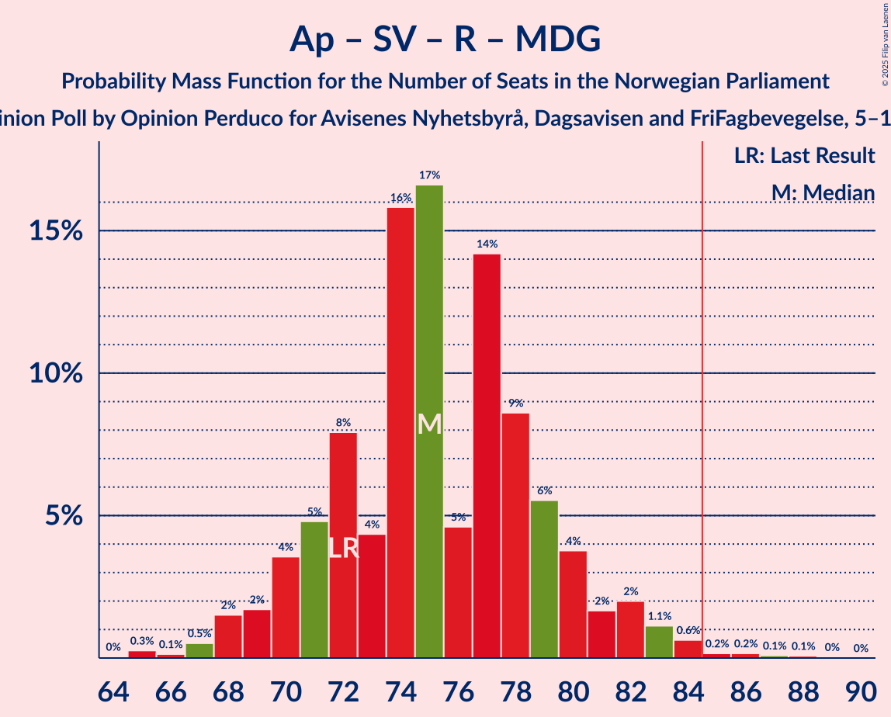

| Number of Seats | Probability | Accumulated | Special Marks |
|:---------------:|:-----------:|:-----------:|:-------------:|
| 64 | 0% | 100% |  |
| 65 | 0.3% | 99.9% |  |
| 66 | 0.1% | 99.6% |  |
| 67 | 0.5% | 99.5% |  |
| 68 | 2% | 99.0% |  |
| 69 | 2% | 97% |  |
| 70 | 4% | 96% |  |
| 71 | 5% | 92% |  |
| 72 | 8% | 87% | Last Result |
| 73 | 4% | 79% |  |
| 74 | 16% | 75% | Median |
| 75 | 17% | 59% |  |
| 76 | 5% | 43% |  |
| 77 | 14% | 38% |  |
| 78 | 9% | 24% |  |
| 79 | 6% | 15% |  |
| 80 | 4% | 10% |  |
| 81 | 2% | 6% |  |
| 82 | 2% | 4% |  |
| 83 | 1.1% | 2% |  |
| 84 | 0.6% | 1.2% |  |
| 85 | 0.2% | 0.5% | Majority |
| 86 | 0.2% | 0.4% |  |
| 87 | 0.1% | 0.2% |  |
| 88 | 0.1% | 0.1% |  |
| 89 | 0% | 0% |  |

### Høyre – Fremskrittspartiet – Venstre – Kristelig Folkeparti – Miljøpartiet De Grønne

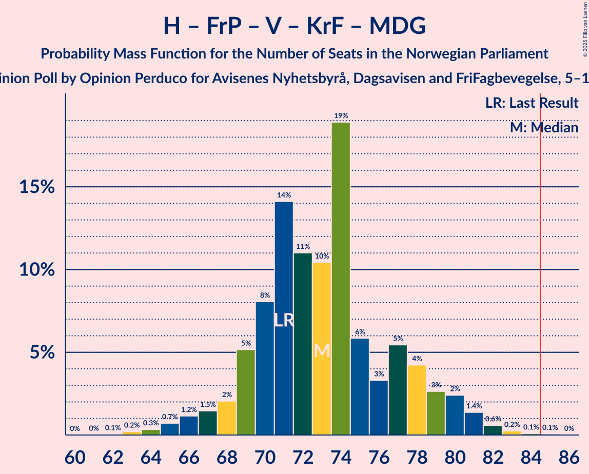

| Number of Seats | Probability | Accumulated | Special Marks |
|:---------------:|:-----------:|:-----------:|:-------------:|
| 62 | 0.1% | 100% |  |
| 63 | 0.2% | 99.9% |  |
| 64 | 0.3% | 99.7% |  |
| 65 | 0.7% | 99.4% |  |
| 66 | 1.2% | 98.6% |  |
| 67 | 1.5% | 97% |  |
| 68 | 2% | 96% |  |
| 69 | 5% | 94% |  |
| 70 | 8% | 89% |  |
| 71 | 14% | 81% | Last Result, Median |
| 72 | 11% | 67% |  |
| 73 | 10% | 56% |  |
| 74 | 19% | 45% |  |
| 75 | 6% | 26% |  |
| 76 | 3% | 20% |  |
| 77 | 5% | 17% |  |
| 78 | 4% | 12% |  |
| 79 | 3% | 7% |  |
| 80 | 2% | 5% |  |
| 81 | 1.4% | 2% |  |
| 82 | 0.6% | 1.0% |  |
| 83 | 0.2% | 0.4% |  |
| 84 | 0.1% | 0.2% |  |
| 85 | 0.1% | 0.1% | Majority |
| 86 | 0% | 0% |  |

### Arbeiderpartiet – Senterpartiet

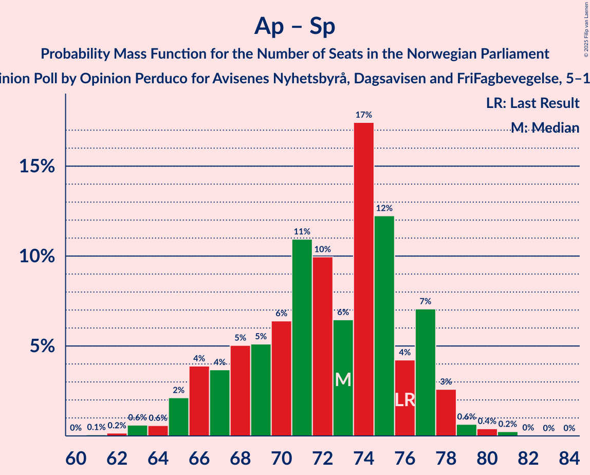

| Number of Seats | Probability | Accumulated | Special Marks |
|:---------------:|:-----------:|:-----------:|:-------------:|
| 61 | 0.1% | 100% |  |
| 62 | 0.2% | 99.9% |  |
| 63 | 0.6% | 99.7% |  |
| 64 | 0.6% | 99.1% |  |
| 65 | 2% | 98.5% |  |
| 66 | 4% | 96% |  |
| 67 | 4% | 93% |  |
| 68 | 5% | 89% |  |
| 69 | 5% | 84% |  |
| 70 | 6% | 79% |  |
| 71 | 11% | 72% |  |
| 72 | 10% | 61% |  |
| 73 | 6% | 51% | Median |
| 74 | 17% | 45% |  |
| 75 | 12% | 27% |  |
| 76 | 4% | 15% | Last Result |
| 77 | 7% | 11% |  |
| 78 | 3% | 4% |  |
| 79 | 0.6% | 1.4% |  |
| 80 | 0.4% | 0.7% |  |
| 81 | 0.2% | 0.3% |  |
| 82 | 0% | 0.1% |  |
| 83 | 0% | 0% |  |

### Høyre – Fremskrittspartiet – Venstre – Kristelig Folkeparti

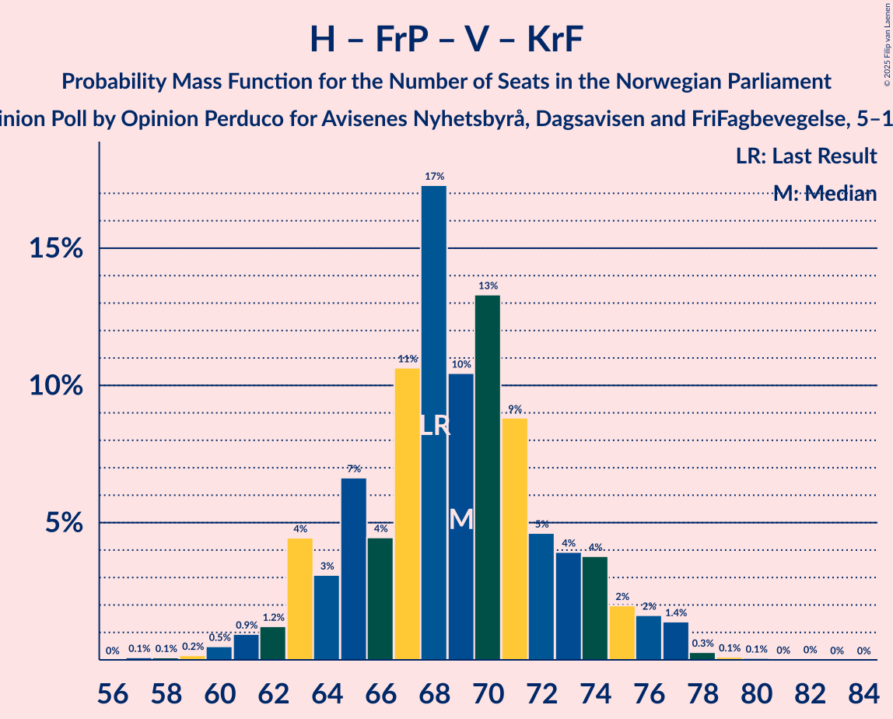

| Number of Seats | Probability | Accumulated | Special Marks |
|:---------------:|:-----------:|:-----------:|:-------------:|
| 57 | 0.1% | 100% |  |
| 58 | 0.1% | 99.9% |  |
| 59 | 0.2% | 99.8% |  |
| 60 | 0.5% | 99.7% |  |
| 61 | 0.9% | 99.2% |  |
| 62 | 1.2% | 98% |  |
| 63 | 4% | 97% |  |
| 64 | 3% | 93% |  |
| 65 | 7% | 89% |  |
| 66 | 4% | 83% |  |
| 67 | 11% | 78% |  |
| 68 | 17% | 68% | Last Result, Median |
| 69 | 10% | 50% |  |
| 70 | 13% | 40% |  |
| 71 | 9% | 27% |  |
| 72 | 5% | 18% |  |
| 73 | 4% | 13% |  |
| 74 | 4% | 9% |  |
| 75 | 2% | 6% |  |
| 76 | 2% | 4% |  |
| 77 | 1.4% | 2% |  |
| 78 | 0.3% | 0.5% |  |
| 79 | 0.1% | 0.2% |  |
| 80 | 0.1% | 0.1% |  |
| 81 | 0% | 0.1% |  |
| 82 | 0% | 0.1% |  |
| 83 | 0% | 0% |  |

### Høyre – Fremskrittspartiet – Venstre

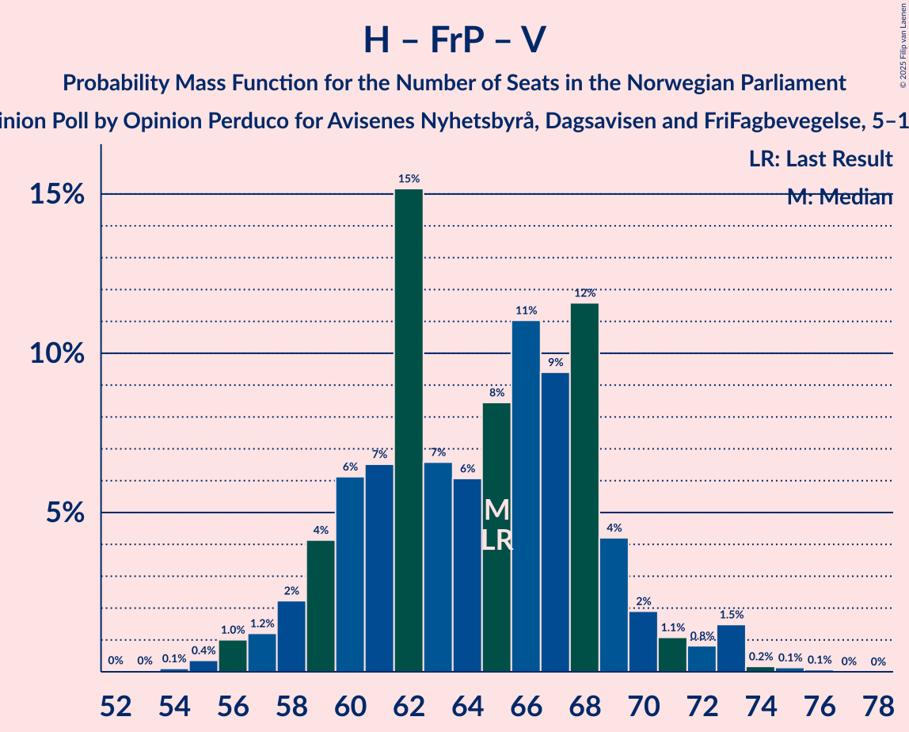

| Number of Seats | Probability | Accumulated | Special Marks |
|:---------------:|:-----------:|:-----------:|:-------------:|
| 52 | 0% | 100% |  |
| 53 | 0% | 99.9% |  |
| 54 | 0.1% | 99.9% |  |
| 55 | 0.4% | 99.8% |  |
| 56 | 1.0% | 99.4% |  |
| 57 | 1.2% | 98% |  |
| 58 | 2% | 97% |  |
| 59 | 4% | 95% |  |
| 60 | 6% | 91% |  |
| 61 | 7% | 85% |  |
| 62 | 15% | 78% |  |
| 63 | 7% | 63% |  |
| 64 | 6% | 56% |  |
| 65 | 8% | 50% | Last Result, Median |
| 66 | 11% | 42% |  |
| 67 | 9% | 31% |  |
| 68 | 12% | 21% |  |
| 69 | 4% | 10% |  |
| 70 | 2% | 6% |  |
| 71 | 1.1% | 4% |  |
| 72 | 0.8% | 3% |  |
| 73 | 1.5% | 2% |  |
| 74 | 0.2% | 0.4% |  |
| 75 | 0.1% | 0.2% |  |
| 76 | 0.1% | 0.1% |  |
| 77 | 0% | 0% |  |

### Arbeiderpartiet – Sosialistisk Venstreparti

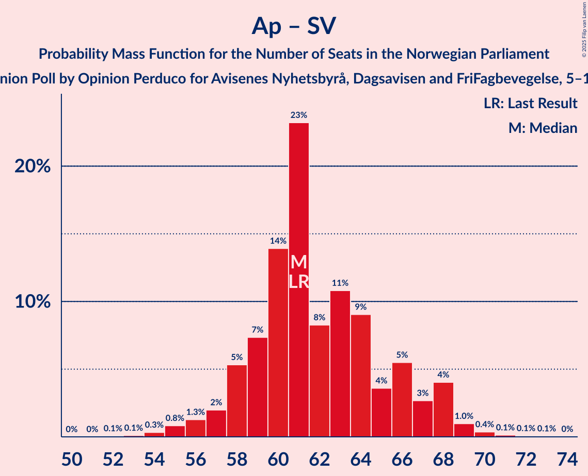

| Number of Seats | Probability | Accumulated | Special Marks |
|:---------------:|:-----------:|:-----------:|:-------------:|
| 52 | 0.1% | 100% |  |
| 53 | 0.1% | 99.9% |  |
| 54 | 0.3% | 99.8% |  |
| 55 | 0.8% | 99.5% |  |
| 56 | 1.3% | 98.7% |  |
| 57 | 2% | 97% |  |
| 58 | 5% | 95% |  |
| 59 | 7% | 90% |  |
| 60 | 14% | 83% |  |
| 61 | 23% | 69% | Last Result |
| 62 | 8% | 46% | Median |
| 63 | 11% | 37% |  |
| 64 | 9% | 27% |  |
| 65 | 4% | 17% |  |
| 66 | 5% | 14% |  |
| 67 | 3% | 8% |  |
| 68 | 4% | 6% |  |
| 69 | 1.0% | 2% |  |
| 70 | 0.4% | 0.7% |  |
| 71 | 0.1% | 0.3% |  |
| 72 | 0.1% | 0.2% |  |
| 73 | 0.1% | 0.1% |  |
| 74 | 0% | 0% |  |

### Høyre – Fremskrittspartiet

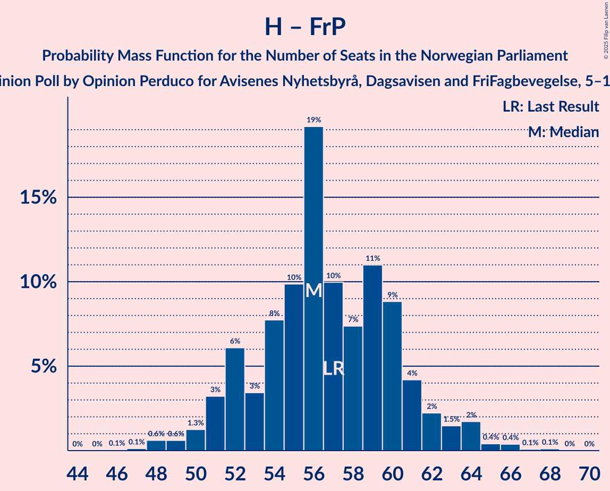

| Number of Seats | Probability | Accumulated | Special Marks |
|:---------------:|:-----------:|:-----------:|:-------------:|
| 46 | 0.1% | 100% |  |
| 47 | 0.1% | 99.9% |  |
| 48 | 0.6% | 99.8% |  |
| 49 | 0.6% | 99.2% |  |
| 50 | 1.3% | 98.6% |  |
| 51 | 3% | 97% |  |
| 52 | 6% | 94% |  |
| 53 | 3% | 88% |  |
| 54 | 8% | 85% |  |
| 55 | 10% | 77% |  |
| 56 | 19% | 67% |  |
| 57 | 10% | 48% | Last Result, Median |
| 58 | 7% | 38% |  |
| 59 | 11% | 30% |  |
| 60 | 9% | 19% |  |
| 61 | 4% | 11% |  |
| 62 | 2% | 6% |  |
| 63 | 1.5% | 4% |  |
| 64 | 2% | 3% |  |
| 65 | 0.4% | 1.0% |  |
| 66 | 0.4% | 0.6% |  |
| 67 | 0.1% | 0.2% |  |
| 68 | 0.1% | 0.1% |  |
| 69 | 0% | 0% |  |

### Høyre – Venstre – Kristelig Folkeparti

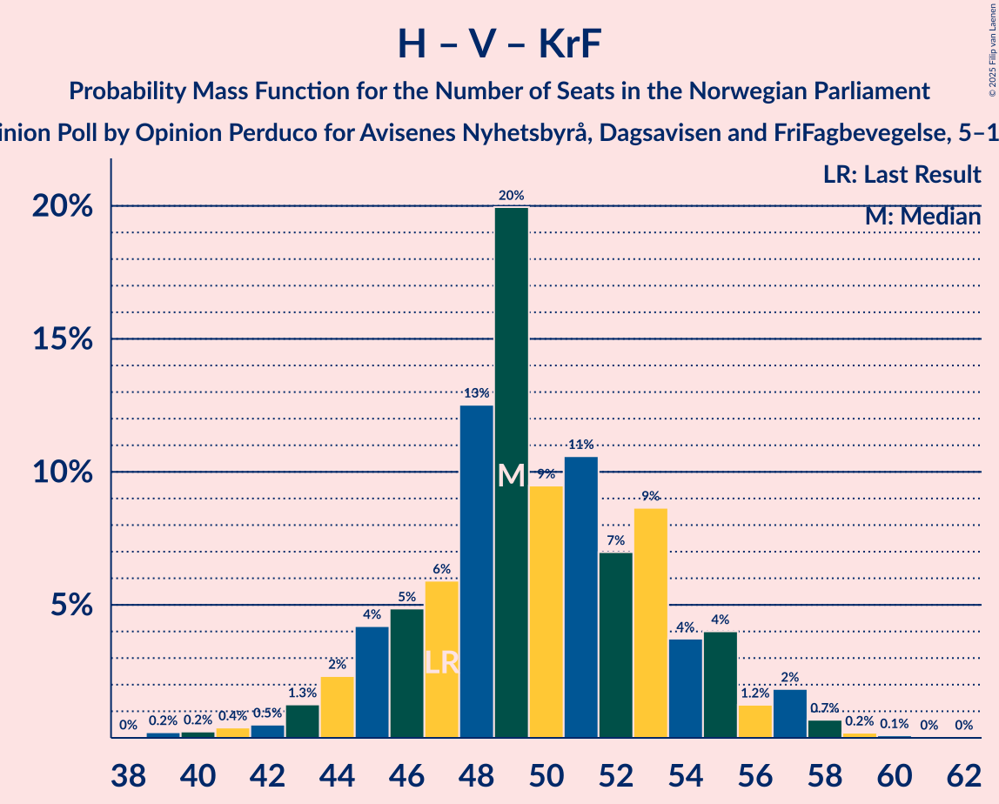

| Number of Seats | Probability | Accumulated | Special Marks |
|:---------------:|:-----------:|:-----------:|:-------------:|
| 38 | 0% | 100% |  |
| 39 | 0.2% | 99.9% |  |
| 40 | 0.2% | 99.7% |  |
| 41 | 0.4% | 99.5% |  |
| 42 | 0.5% | 99.1% |  |
| 43 | 1.3% | 98.6% |  |
| 44 | 2% | 97% |  |
| 45 | 4% | 95% |  |
| 46 | 5% | 91% |  |
| 47 | 6% | 86% | Last Result |
| 48 | 13% | 80% |  |
| 49 | 20% | 68% | Median |
| 50 | 9% | 48% |  |
| 51 | 11% | 38% |  |
| 52 | 7% | 28% |  |
| 53 | 9% | 21% |  |
| 54 | 4% | 12% |  |
| 55 | 4% | 8% |  |
| 56 | 1.2% | 4% |  |
| 57 | 2% | 3% |  |
| 58 | 0.7% | 1.1% |  |
| 59 | 0.2% | 0.4% |  |
| 60 | 0.1% | 0.2% |  |
| 61 | 0% | 0.1% |  |
| 62 | 0% | 0% |  |

### Senterpartiet – Venstre – Kristelig Folkeparti

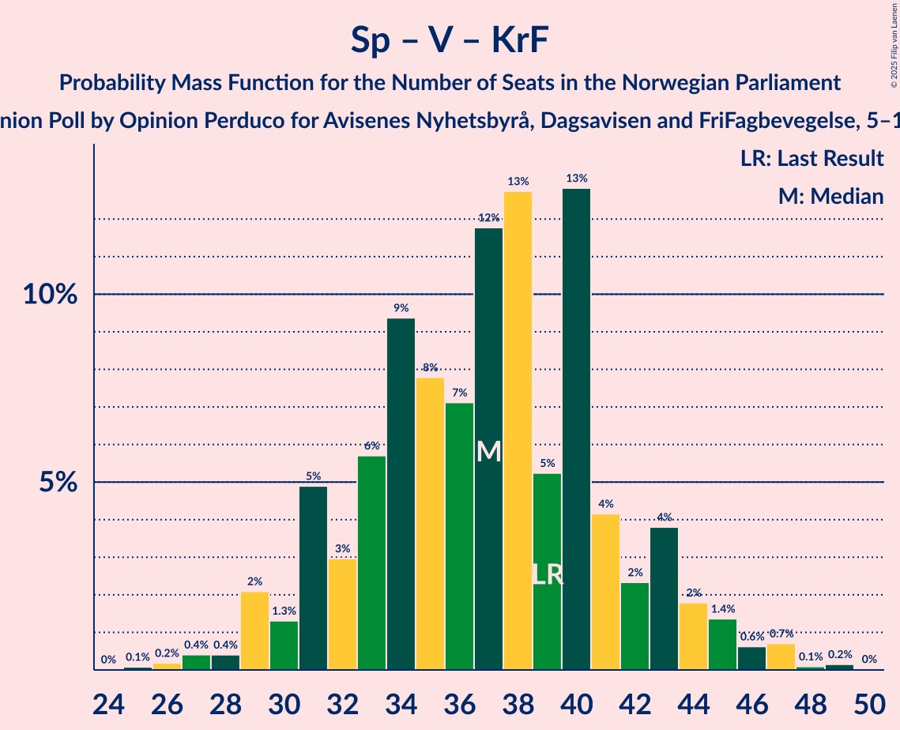

| Number of Seats | Probability | Accumulated | Special Marks |
|:---------------:|:-----------:|:-----------:|:-------------:|
| 25 | 0.1% | 100% |  |
| 26 | 0.2% | 99.9% |  |
| 27 | 0.4% | 99.7% |  |
| 28 | 0.4% | 99.3% |  |
| 29 | 2% | 98.9% |  |
| 30 | 1.3% | 97% |  |
| 31 | 5% | 95% |  |
| 32 | 3% | 91% |  |
| 33 | 6% | 88% |  |
| 34 | 9% | 82% |  |
| 35 | 8% | 73% |  |
| 36 | 7% | 65% | Median |
| 37 | 12% | 58% |  |
| 38 | 13% | 46% |  |
| 39 | 5% | 33% | Last Result |
| 40 | 13% | 28% |  |
| 41 | 4% | 15% |  |
| 42 | 2% | 11% |  |
| 43 | 4% | 9% |  |
| 44 | 2% | 5% |  |
| 45 | 1.4% | 3% |  |
| 46 | 0.6% | 2% |  |
| 47 | 0.7% | 1.0% |  |
| 48 | 0.1% | 0.3% |  |
| 49 | 0.2% | 0.2% |  |
| 50 | 0% | 0% |  |

## Technical Information

### Opinion Poll

+ **Polling firm:** Opinion Perduco
+ **Commissioner(s):** Avisenes Nyhetsbyrå, Dagsavisen and FriFagbevegelse
+ **Fieldwork period:** 5–11 October 2021

### Calculations

+ **Sample size:** 977
+ **Simulations done:** 1,048,576
+ **Error estimate:** 1.19%

