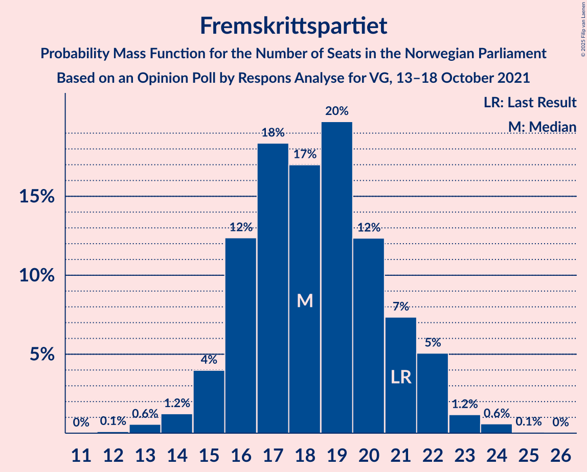
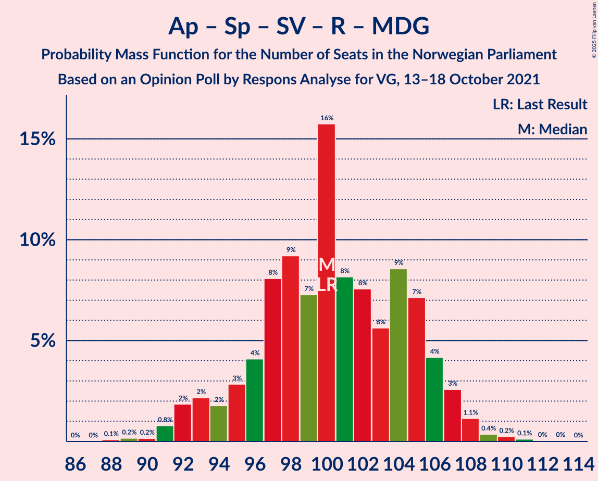

# Opinion Poll by Respons Analyse for VG, 13–18 October 2021

<a href="#voting-intentions">Voting Intentions</a> | <a href="#seats">Seats</a> | <a href="#coalitions">Coalitions</a> | <a href="#technical-information">Technical Information</a>

## Voting Intentions

### Confidence Intervals

| Party | Last Result | Poll Result | 80% Confidence Interval | 90% Confidence Interval | 95% Confidence Interval | 99% Confidence Interval |
|:-----:|:-----------:|:-----------:|:-----------------------:|:-----------------------:|:-----------------------:|:-----------------------:|
| Arbeiderpartiet | 26.2% | 26.7% | 24.9–28.5% |24.4–29.1% |24.0–29.5% |23.2–30.4% |
| Høyre | 20.4% | 21.2% | 19.6–22.9% |19.1–23.4% |18.7–23.8% |18.0–24.7% |
| Senterpartiet | 13.5% | 12.4% | 11.1–13.8% |10.8–14.2% |10.5–14.6% |9.9–15.3% |
| Fremskrittspartiet | 11.6% | 10.3% | 9.1–11.6% |8.8–12.0% |8.6–12.3% |8.0–13.0% |
| Sosialistisk Venstreparti | 7.6% | 9.3% | 8.2–10.6% |7.9–10.9% |7.6–11.3% |7.1–11.9% |
| Venstre | 4.6% | 5.4% | 4.6–6.4% |4.3–6.7% |4.2–7.0% |3.8–7.5% |
| Rødt | 4.7% | 4.8% | 4.0–5.8% |3.8–6.1% |3.6–6.3% |3.3–6.8% |
| Miljøpartiet De Grønne | 3.9% | 3.7% | 3.0–4.6% |2.9–4.8% |2.7–5.1% |2.4–5.5% |
| Kristelig Folkeparti | 3.8% | 3.4% | 2.8–4.3% |2.6–4.5% |2.4–4.7% |2.2–5.2% |

*Note:* The poll result column reflects the actual value used in the calculations. Published results may vary slightly, and in addition be rounded to fewer digits.

## Seats

### Confidence Intervals

| Party | Last Result | Median | 80% Confidence Interval | 90% Confidence Interval | 95% Confidence Interval | 99% Confidence Interval |
|:-----:|:-----------:|:------:|:-----------------------:|:-----------------------:|:-----------------------:|:-----------------------:|
| <a href="#arbeiderpartiet">Arbeiderpartiet</a> | 48 | 49 | 45–54 |44–55 |43–56 |42–57 |
| <a href="#høyre">Høyre</a> | 36 | 38 | 34–41 |33–42 |32–43 |31–45 |
| <a href="#senterpartiet">Senterpartiet</a> | 28 | 23 | 19–27 |19–28 |18–29 |17–30 |
| <a href="#fremskrittspartiet">Fremskrittspartiet</a> | 21 | 18 | 16–21 |15–22 |15–22 |13–24 |
| <a href="#sosialistisk-venstreparti">Sosialistisk Venstreparti</a> | 13 | 17 | 14–19 |13–20 |13–20 |12–22 |
| <a href="#venstre">Venstre</a> | 8 | 9 | 8–11 |7–12 |7–13 |3–14 |
| <a href="#rødt">Rødt</a> | 8 | 8 | 7–10 |1–11 |1–11 |1–12 |
| <a href="#miljøpartiet-de-grønne">Miljøpartiet De Grønne</a> | 3 | 3 | 1–8 |1–9 |1–9 |1–9 |
| <a href="#kristelig-folkeparti">Kristelig Folkeparti</a> | 3 | 2 | 1–7 |1–8 |1–8 |0–9 |

### Arbeiderpartiet

*For a full overview of the results for this party, see the [Arbeiderpartiet](party-arbeiderpartiet.html) page.*

| Number of Seats | Probability | Accumulated | Special Marks |
|:---------------:|:-----------:|:-----------:|:-------------:|
| 40 | 0.1% | 100% |  |
| 41 | 0.3% | 99.9% |  |
| 42 | 0.6% | 99.6% |  |
| 43 | 2% | 99.0% |  |
| 44 | 5% | 97% |  |
| 45 | 6% | 92% |  |
| 46 | 10% | 87% |  |
| 47 | 10% | 76% |  |
| 48 | 13% | 66% | Last Result |
| 49 | 15% | 54% | Median |
| 50 | 7% | 38% |  |
| 51 | 8% | 31% |  |
| 52 | 7% | 23% |  |
| 53 | 6% | 16% |  |
| 54 | 5% | 10% |  |
| 55 | 2% | 6% |  |
| 56 | 2% | 3% |  |
| 57 | 0.8% | 1.3% |  |
| 58 | 0.4% | 0.5% |  |
| 59 | 0.1% | 0.1% |  |
| 60 | 0% | 0% |  |

### Høyre

*For a full overview of the results for this party, see the [Høyre](party-høyre.html) page.*

| Number of Seats | Probability | Accumulated | Special Marks |
|:---------------:|:-----------:|:-----------:|:-------------:|
| 29 | 0.1% | 100% |  |
| 30 | 0.3% | 99.9% |  |
| 31 | 2% | 99.6% |  |
| 32 | 3% | 98% |  |
| 33 | 3% | 95% |  |
| 34 | 7% | 92% |  |
| 35 | 7% | 85% |  |
| 36 | 9% | 78% | Last Result |
| 37 | 15% | 69% |  |
| 38 | 15% | 54% | Median |
| 39 | 13% | 39% |  |
| 40 | 13% | 26% |  |
| 41 | 6% | 12% |  |
| 42 | 4% | 6% |  |
| 43 | 1.2% | 3% |  |
| 44 | 0.6% | 1.5% |  |
| 45 | 0.6% | 0.9% |  |
| 46 | 0.2% | 0.3% |  |
| 47 | 0% | 0.1% |  |
| 48 | 0% | 0% |  |

### Senterpartiet

*For a full overview of the results for this party, see the [Senterpartiet](party-senterpartiet.html) page.*

| Number of Seats | Probability | Accumulated | Special Marks |
|:---------------:|:-----------:|:-----------:|:-------------:|
| 16 | 0.2% | 100% |  |
| 17 | 0.9% | 99.8% |  |
| 18 | 4% | 98.9% |  |
| 19 | 8% | 95% |  |
| 20 | 9% | 87% |  |
| 21 | 12% | 78% |  |
| 22 | 14% | 66% |  |
| 23 | 12% | 52% | Median |
| 24 | 16% | 40% |  |
| 25 | 7% | 25% |  |
| 26 | 4% | 18% |  |
| 27 | 4% | 13% |  |
| 28 | 6% | 9% | Last Result |
| 29 | 2% | 4% |  |
| 30 | 1.0% | 1.3% |  |
| 31 | 0.2% | 0.4% |  |
| 32 | 0.1% | 0.1% |  |
| 33 | 0% | 0% |  |

### Fremskrittspartiet

*For a full overview of the results for this party, see the [Fremskrittspartiet](party-fremskrittspartiet.html) page.*

| Number of Seats | Probability | Accumulated | Special Marks |
|:---------------:|:-----------:|:-----------:|:-------------:|
| 12 | 0.1% | 100% |  |
| 13 | 0.6% | 99.9% |  |
| 14 | 1.2% | 99.3% |  |
| 15 | 4% | 98% |  |
| 16 | 12% | 94% |  |
| 17 | 18% | 82% |  |
| 18 | 17% | 63% | Median |
| 19 | 20% | 46% |  |
| 20 | 12% | 27% |  |
| 21 | 7% | 14% | Last Result |
| 22 | 5% | 7% |  |
| 23 | 1.2% | 2% |  |
| 24 | 0.6% | 0.7% |  |
| 25 | 0.1% | 0.1% |  |
| 26 | 0% | 0% |  |

### Sosialistisk Venstreparti

*For a full overview of the results for this party, see the [Sosialistisk Venstreparti](party-sosialistiskvenstreparti.html) page.*

| Number of Seats | Probability | Accumulated | Special Marks |
|:---------------:|:-----------:|:-----------:|:-------------:|
| 11 | 0.2% | 100% |  |
| 12 | 2% | 99.7% |  |
| 13 | 4% | 98% | Last Result |
| 14 | 16% | 94% |  |
| 15 | 13% | 78% |  |
| 16 | 14% | 66% |  |
| 17 | 19% | 51% | Median |
| 18 | 17% | 32% |  |
| 19 | 10% | 15% |  |
| 20 | 4% | 5% |  |
| 21 | 1.0% | 2% |  |
| 22 | 0.7% | 0.8% |  |
| 23 | 0.1% | 0.1% |  |
| 24 | 0% | 0% |  |

### Venstre

*For a full overview of the results for this party, see the [Venstre](party-venstre.html) page.*

| Number of Seats | Probability | Accumulated | Special Marks |
|:---------------:|:-----------:|:-----------:|:-------------:|
| 2 | 0.3% | 100% |  |
| 3 | 2% | 99.7% |  |
| 4 | 0% | 98% |  |
| 5 | 0% | 98% |  |
| 6 | 0% | 98% |  |
| 7 | 5% | 98% |  |
| 8 | 15% | 93% | Last Result |
| 9 | 30% | 78% | Median |
| 10 | 25% | 48% |  |
| 11 | 15% | 23% |  |
| 12 | 6% | 9% |  |
| 13 | 2% | 3% |  |
| 14 | 0.6% | 0.7% |  |
| 15 | 0.1% | 0.1% |  |
| 16 | 0% | 0% |  |

### Rødt

*For a full overview of the results for this party, see the [Rødt](party-rødt.html) page.*

| Number of Seats | Probability | Accumulated | Special Marks |
|:---------------:|:-----------:|:-----------:|:-------------:|
| 1 | 9% | 100% |  |
| 2 | 0% | 91% |  |
| 3 | 0% | 91% |  |
| 4 | 0% | 91% |  |
| 5 | 0% | 91% |  |
| 6 | 0.4% | 91% |  |
| 7 | 11% | 91% |  |
| 8 | 31% | 80% | Last Result, Median |
| 9 | 29% | 49% |  |
| 10 | 13% | 20% |  |
| 11 | 6% | 6% |  |
| 12 | 0.8% | 1.0% |  |
| 13 | 0.1% | 0.2% |  |
| 14 | 0% | 0% |  |

### Miljøpartiet De Grønne

*For a full overview of the results for this party, see the [Miljøpartiet De Grønne](party-miljøpartietdegrønne.html) page.*

| Number of Seats | Probability | Accumulated | Special Marks |
|:---------------:|:-----------:|:-----------:|:-------------:|
| 1 | 12% | 100% |  |
| 2 | 28% | 88% |  |
| 3 | 27% | 60% | Last Result, Median |
| 4 | 0% | 33% |  |
| 5 | 0% | 33% |  |
| 6 | 1.2% | 33% |  |
| 7 | 12% | 32% |  |
| 8 | 14% | 19% |  |
| 9 | 5% | 5% |  |
| 10 | 0.2% | 0.2% |  |
| 11 | 0% | 0% |  |

### Kristelig Folkeparti

*For a full overview of the results for this party, see the [Kristelig Folkeparti](party-kristeligfolkeparti.html) page.*

| Number of Seats | Probability | Accumulated | Special Marks |
|:---------------:|:-----------:|:-----------:|:-------------:|
| 0 | 0.8% | 100% |  |
| 1 | 9% | 99.2% |  |
| 2 | 48% | 90% | Median |
| 3 | 25% | 42% | Last Result |
| 4 | 0% | 16% |  |
| 5 | 0% | 16% |  |
| 6 | 1.4% | 16% |  |
| 7 | 10% | 15% |  |
| 8 | 5% | 5% |  |
| 9 | 0.8% | 0.9% |  |
| 10 | 0.1% | 0.1% |  |
| 11 | 0% | 0% |  |

## Coalitions

### Confidence Intervals

| Coalition | Last Result | Median | Majority? | 80% Confidence Interval | 90% Confidence Interval | 95% Confidence Interval | 99% Confidence Interval |
|:---------:|:-----------:|:------:|:---------:|:-----------------------:|:-----------------------:|:-----------------------:|:-----------------------:|
| Arbeiderpartiet – Senterpartiet – Sosialistisk Venstreparti – Rødt – Miljøpartiet De Grønne | 100 | 100 | 100% | 96–105 | 93–106 | 92–107 | 91–109 |
| Arbeiderpartiet – Senterpartiet – Sosialistisk Venstreparti – Rødt | 97 | 96 | 99.8% | 92–101 | 90–102 | 89–103 | 86–105 |
| Arbeiderpartiet – Senterpartiet – Sosialistisk Venstreparti – Miljøpartiet De Grønne – Kristelig Folkeparti | 95 | 95 | 99.9% | 91–100 | 90–102 | 88–103 | 86–106 |
| Arbeiderpartiet – Senterpartiet – Sosialistisk Venstreparti – Miljøpartiet De Grønne | 92 | 92 | 98% | 88–97 | 86–99 | 85–100 | 83–102 |
| Høyre – Senterpartiet – Fremskrittspartiet – Venstre – Kristelig Folkeparti | 96 | 91 | 94% | 86–96 | 84–98 | 84–100 | 81–102 |
| Arbeiderpartiet – Senterpartiet – Sosialistisk Venstreparti | 89 | 88 | 88% | 84–93 | 83–94 | 82–95 | 79–97 |
| Arbeiderpartiet – Senterpartiet – Miljøpartiet De Grønne – Kristelig Folkeparti | 82 | 79 | 9% | 73–84 | 72–86 | 71–88 | 70–90 |
| Arbeiderpartiet – Sosialistisk Venstreparti – Rødt – Miljøpartiet De Grønne | 72 | 77 | 5% | 72–82 | 71–85 | 69–85 | 67–88 |
| Arbeiderpartiet – Senterpartiet – Kristelig Folkeparti | 79 | 75 | 0.6% | 69–80 | 69–82 | 68–83 | 65–85 |
| Høyre – Fremskrittspartiet – Venstre – Miljøpartiet De Grønne – Kristelig Folkeparti | 71 | 72 | 0.1% | 67–77 | 66–78 | 65–80 | 64–83 |
| Arbeiderpartiet – Senterpartiet | 76 | 72 | 0% | 67–77 | 66–77 | 65–78 | 62–80 |
| Høyre – Fremskrittspartiet – Venstre – Kristelig Folkeparti | 68 | 69 | 0% | 64–73 | 62–75 | 62–77 | 59–78 |
| Høyre – Fremskrittspartiet – Venstre | 65 | 66 | 0% | 61–70 | 59–72 | 58–73 | 56–75 |
| Arbeiderpartiet – Sosialistisk Venstreparti | 61 | 65 | 0% | 61–70 | 60–72 | 60–72 | 58–74 |
| Høyre – Fremskrittspartiet | 57 | 56 | 0% | 51–60 | 50–61 | 49–63 | 47–64 |
| Høyre – Venstre – Kristelig Folkeparti | 47 | 50 | 0% | 46–55 | 45–56 | 44–56 | 42–58 |
| Senterpartiet – Venstre – Kristelig Folkeparti | 39 | 35 | 0% | 31–41 | 29–42 | 28–43 | 27–45 |

### Arbeiderpartiet – Senterpartiet – Sosialistisk Venstreparti – Rødt – Miljøpartiet De Grønne

| Number of Seats | Probability | Accumulated | Special Marks |
|:---------------:|:-----------:|:-----------:|:-------------:|
| 88 | 0.1% | 100% |  |
| 89 | 0.2% | 99.9% |  |
| 90 | 0.2% | 99.7% |  |
| 91 | 0.8% | 99.6% |  |
| 92 | 2% | 98.8% |  |
| 93 | 2% | 97% |  |
| 94 | 2% | 95% |  |
| 95 | 3% | 93% |  |
| 96 | 4% | 90% |  |
| 97 | 8% | 86% |  |
| 98 | 9% | 78% |  |
| 99 | 7% | 69% |  |
| 100 | 16% | 61% | Last Result, Median |
| 101 | 8% | 46% |  |
| 102 | 8% | 38% |  |
| 103 | 6% | 30% |  |
| 104 | 9% | 24% |  |
| 105 | 7% | 16% |  |
| 106 | 4% | 9% |  |
| 107 | 3% | 5% |  |
| 108 | 1.1% | 2% |  |
| 109 | 0.4% | 0.8% |  |
| 110 | 0.2% | 0.5% |  |
| 111 | 0.1% | 0.2% |  |
| 112 | 0% | 0.1% |  |
| 113 | 0% | 0.1% |  |
| 114 | 0% | 0% |  |

### Arbeiderpartiet – Senterpartiet – Sosialistisk Venstreparti – Rødt

| Number of Seats | Probability | Accumulated | Special Marks |
|:---------------:|:-----------:|:-----------:|:-------------:|
| 83 | 0% | 100% |  |
| 84 | 0.1% | 99.9% |  |
| 85 | 0.1% | 99.8% | Majority |
| 86 | 0.5% | 99.7% |  |
| 87 | 0.4% | 99.2% |  |
| 88 | 0.5% | 98.8% |  |
| 89 | 3% | 98% |  |
| 90 | 1.4% | 96% |  |
| 91 | 4% | 94% |  |
| 92 | 4% | 90% |  |
| 93 | 8% | 86% |  |
| 94 | 7% | 78% |  |
| 95 | 11% | 71% |  |
| 96 | 10% | 59% |  |
| 97 | 14% | 50% | Last Result, Median |
| 98 | 8% | 36% |  |
| 99 | 7% | 27% |  |
| 100 | 7% | 20% |  |
| 101 | 4% | 13% |  |
| 102 | 4% | 9% |  |
| 103 | 2% | 5% |  |
| 104 | 2% | 2% |  |
| 105 | 0.4% | 0.7% |  |
| 106 | 0.2% | 0.3% |  |
| 107 | 0.1% | 0.1% |  |
| 108 | 0% | 0% |  |

### Arbeiderpartiet – Senterpartiet – Sosialistisk Venstreparti – Miljøpartiet De Grønne – Kristelig Folkeparti

| Number of Seats | Probability | Accumulated | Special Marks |
|:---------------:|:-----------:|:-----------:|:-------------:|
| 84 | 0% | 100% |  |
| 85 | 0.2% | 99.9% | Majority |
| 86 | 0.3% | 99.7% |  |
| 87 | 0.6% | 99.5% |  |
| 88 | 2% | 98.9% |  |
| 89 | 2% | 97% |  |
| 90 | 4% | 95% |  |
| 91 | 7% | 91% |  |
| 92 | 5% | 84% |  |
| 93 | 12% | 79% |  |
| 94 | 8% | 67% | Median |
| 95 | 16% | 59% | Last Result |
| 96 | 8% | 43% |  |
| 97 | 7% | 35% |  |
| 98 | 8% | 28% |  |
| 99 | 6% | 20% |  |
| 100 | 4% | 13% |  |
| 101 | 2% | 9% |  |
| 102 | 3% | 7% |  |
| 103 | 2% | 4% |  |
| 104 | 1.0% | 2% |  |
| 105 | 0.6% | 1.4% |  |
| 106 | 0.5% | 0.8% |  |
| 107 | 0.2% | 0.3% |  |
| 108 | 0.1% | 0.1% |  |
| 109 | 0% | 0.1% |  |
| 110 | 0% | 0% |  |

### Arbeiderpartiet – Senterpartiet – Sosialistisk Venstreparti – Miljøpartiet De Grønne

| Number of Seats | Probability | Accumulated | Special Marks |
|:---------------:|:-----------:|:-----------:|:-------------:|
| 81 | 0.1% | 100% |  |
| 82 | 0.2% | 99.9% |  |
| 83 | 0.4% | 99.7% |  |
| 84 | 0.9% | 99.3% |  |
| 85 | 2% | 98% | Majority |
| 86 | 2% | 97% |  |
| 87 | 3% | 95% |  |
| 88 | 8% | 92% |  |
| 89 | 7% | 84% |  |
| 90 | 10% | 77% |  |
| 91 | 8% | 67% |  |
| 92 | 13% | 59% | Last Result, Median |
| 93 | 8% | 46% |  |
| 94 | 8% | 37% |  |
| 95 | 10% | 30% |  |
| 96 | 7% | 20% |  |
| 97 | 4% | 13% |  |
| 98 | 4% | 9% |  |
| 99 | 3% | 5% |  |
| 100 | 0.4% | 3% |  |
| 101 | 1.1% | 2% |  |
| 102 | 0.7% | 1.0% |  |
| 103 | 0.2% | 0.4% |  |
| 104 | 0.1% | 0.2% |  |
| 105 | 0.1% | 0.1% |  |
| 106 | 0% | 0% |  |

### Høyre – Senterpartiet – Fremskrittspartiet – Venstre – Kristelig Folkeparti

| Number of Seats | Probability | Accumulated | Special Marks |
|:---------------:|:-----------:|:-----------:|:-------------:|
| 78 | 0% | 100% |  |
| 79 | 0% | 99.9% |  |
| 80 | 0.2% | 99.9% |  |
| 81 | 0.7% | 99.6% |  |
| 82 | 0.2% | 98.9% |  |
| 83 | 1.1% | 98.7% |  |
| 84 | 4% | 98% |  |
| 85 | 2% | 94% | Majority |
| 86 | 3% | 92% |  |
| 87 | 8% | 89% |  |
| 88 | 7% | 81% |  |
| 89 | 7% | 74% |  |
| 90 | 9% | 67% | Median |
| 91 | 9% | 59% |  |
| 92 | 13% | 50% |  |
| 93 | 8% | 37% |  |
| 94 | 7% | 28% |  |
| 95 | 5% | 21% |  |
| 96 | 7% | 16% | Last Result |
| 97 | 3% | 9% |  |
| 98 | 2% | 6% |  |
| 99 | 1.2% | 4% |  |
| 100 | 2% | 3% |  |
| 101 | 0.3% | 0.9% |  |
| 102 | 0.3% | 0.7% |  |
| 103 | 0.2% | 0.3% |  |
| 104 | 0% | 0.1% |  |
| 105 | 0% | 0.1% |  |
| 106 | 0% | 0% |  |

### Arbeiderpartiet – Senterpartiet – Sosialistisk Venstreparti

| Number of Seats | Probability | Accumulated | Special Marks |
|:---------------:|:-----------:|:-----------:|:-------------:|
| 77 | 0% | 100% |  |
| 78 | 0.2% | 99.9% |  |
| 79 | 0.4% | 99.7% |  |
| 80 | 0.5% | 99.3% |  |
| 81 | 0.9% | 98.9% |  |
| 82 | 2% | 98% |  |
| 83 | 4% | 96% |  |
| 84 | 4% | 92% |  |
| 85 | 9% | 88% | Majority |
| 86 | 11% | 78% |  |
| 87 | 10% | 67% |  |
| 88 | 8% | 58% |  |
| 89 | 15% | 50% | Last Result, Median |
| 90 | 8% | 35% |  |
| 91 | 8% | 27% |  |
| 92 | 5% | 19% |  |
| 93 | 8% | 14% |  |
| 94 | 4% | 7% |  |
| 95 | 1.2% | 3% |  |
| 96 | 0.9% | 1.5% |  |
| 97 | 0.3% | 0.6% |  |
| 98 | 0.1% | 0.3% |  |
| 99 | 0.1% | 0.2% |  |
| 100 | 0% | 0.1% |  |
| 101 | 0% | 0% |  |

### Arbeiderpartiet – Senterpartiet – Miljøpartiet De Grønne – Kristelig Folkeparti

| Number of Seats | Probability | Accumulated | Special Marks |
|:---------------:|:-----------:|:-----------:|:-------------:|
| 67 | 0% | 100% |  |
| 68 | 0.1% | 99.9% |  |
| 69 | 0.3% | 99.9% |  |
| 70 | 0.9% | 99.6% |  |
| 71 | 2% | 98.7% |  |
| 72 | 6% | 97% |  |
| 73 | 3% | 91% |  |
| 74 | 3% | 88% |  |
| 75 | 8% | 85% |  |
| 76 | 10% | 77% |  |
| 77 | 8% | 67% | Median |
| 78 | 5% | 59% |  |
| 79 | 8% | 54% |  |
| 80 | 6% | 47% |  |
| 81 | 11% | 41% |  |
| 82 | 11% | 30% | Last Result |
| 83 | 4% | 19% |  |
| 84 | 6% | 15% |  |
| 85 | 2% | 9% | Majority |
| 86 | 2% | 7% |  |
| 87 | 2% | 4% |  |
| 88 | 0.9% | 3% |  |
| 89 | 0.5% | 2% |  |
| 90 | 1.0% | 1.4% |  |
| 91 | 0.3% | 0.4% |  |
| 92 | 0.1% | 0.1% |  |
| 93 | 0% | 0.1% |  |
| 94 | 0% | 0% |  |

### Arbeiderpartiet – Sosialistisk Venstreparti – Rødt – Miljøpartiet De Grønne

| Number of Seats | Probability | Accumulated | Special Marks |
|:---------------:|:-----------:|:-----------:|:-------------:|
| 64 | 0% | 100% |  |
| 65 | 0% | 99.9% |  |
| 66 | 0.3% | 99.9% |  |
| 67 | 0.5% | 99.6% |  |
| 68 | 0.3% | 99.2% |  |
| 69 | 2% | 98.8% |  |
| 70 | 1.4% | 97% |  |
| 71 | 2% | 95% |  |
| 72 | 3% | 93% | Last Result |
| 73 | 7% | 90% |  |
| 74 | 6% | 83% |  |
| 75 | 7% | 77% |  |
| 76 | 8% | 70% |  |
| 77 | 13% | 61% | Median |
| 78 | 9% | 48% |  |
| 79 | 9% | 39% |  |
| 80 | 6% | 31% |  |
| 81 | 7% | 24% |  |
| 82 | 8% | 17% |  |
| 83 | 2% | 10% |  |
| 84 | 2% | 7% |  |
| 85 | 3% | 5% | Majority |
| 86 | 1.0% | 2% |  |
| 87 | 0.2% | 1.1% |  |
| 88 | 0.6% | 0.9% |  |
| 89 | 0.2% | 0.3% |  |
| 90 | 0% | 0.1% |  |
| 91 | 0% | 0% |  |

### Arbeiderpartiet – Senterpartiet – Kristelig Folkeparti

| Number of Seats | Probability | Accumulated | Special Marks |
|:---------------:|:-----------:|:-----------:|:-------------:|
| 63 | 0.1% | 100% |  |
| 64 | 0.3% | 99.9% |  |
| 65 | 0.1% | 99.6% |  |
| 66 | 0.2% | 99.5% |  |
| 67 | 1.2% | 99.3% |  |
| 68 | 3% | 98% |  |
| 69 | 7% | 95% |  |
| 70 | 6% | 89% |  |
| 71 | 3% | 83% |  |
| 72 | 6% | 81% |  |
| 73 | 8% | 74% |  |
| 74 | 12% | 66% | Median |
| 75 | 12% | 54% |  |
| 76 | 9% | 41% |  |
| 77 | 6% | 33% |  |
| 78 | 5% | 26% |  |
| 79 | 11% | 21% | Last Result |
| 80 | 3% | 10% |  |
| 81 | 2% | 7% |  |
| 82 | 2% | 6% |  |
| 83 | 2% | 4% |  |
| 84 | 0.8% | 1.4% |  |
| 85 | 0.1% | 0.6% | Majority |
| 86 | 0.2% | 0.5% |  |
| 87 | 0.2% | 0.3% |  |
| 88 | 0% | 0.1% |  |
| 89 | 0% | 0% |  |

### Høyre – Fremskrittspartiet – Venstre – Miljøpartiet De Grønne – Kristelig Folkeparti

| Number of Seats | Probability | Accumulated | Special Marks |
|:---------------:|:-----------:|:-----------:|:-------------:|
| 61 | 0.1% | 100% |  |
| 62 | 0.1% | 99.9% |  |
| 63 | 0.3% | 99.8% |  |
| 64 | 0.6% | 99.5% |  |
| 65 | 2% | 98.9% |  |
| 66 | 3% | 97% |  |
| 67 | 5% | 95% |  |
| 68 | 4% | 90% |  |
| 69 | 8% | 86% |  |
| 70 | 8% | 78% | Median |
| 71 | 8% | 71% | Last Result |
| 72 | 14% | 62% |  |
| 73 | 10% | 48% |  |
| 74 | 11% | 38% |  |
| 75 | 7% | 27% |  |
| 76 | 7% | 20% |  |
| 77 | 4% | 13% |  |
| 78 | 4% | 9% |  |
| 79 | 0.9% | 5% |  |
| 80 | 2% | 4% |  |
| 81 | 0.4% | 1.4% |  |
| 82 | 0.3% | 0.9% |  |
| 83 | 0.4% | 0.6% |  |
| 84 | 0.1% | 0.2% |  |
| 85 | 0.1% | 0.1% | Majority |
| 86 | 0% | 0% |  |

### Arbeiderpartiet – Senterpartiet

| Number of Seats | Probability | Accumulated | Special Marks |
|:---------------:|:-----------:|:-----------:|:-------------:|
| 61 | 0.1% | 100% |  |
| 62 | 0.4% | 99.9% |  |
| 63 | 0.2% | 99.4% |  |
| 64 | 0.7% | 99.2% |  |
| 65 | 1.4% | 98.5% |  |
| 66 | 4% | 97% |  |
| 67 | 8% | 93% |  |
| 68 | 6% | 85% |  |
| 69 | 5% | 79% |  |
| 70 | 5% | 74% |  |
| 71 | 12% | 68% |  |
| 72 | 14% | 57% | Median |
| 73 | 8% | 42% |  |
| 74 | 9% | 35% |  |
| 75 | 8% | 25% |  |
| 76 | 7% | 17% | Last Result |
| 77 | 7% | 10% |  |
| 78 | 2% | 4% |  |
| 79 | 1.0% | 2% |  |
| 80 | 0.8% | 1.2% |  |
| 81 | 0.2% | 0.4% |  |
| 82 | 0.1% | 0.2% |  |
| 83 | 0% | 0.1% |  |
| 84 | 0% | 0% |  |

### Høyre – Fremskrittspartiet – Venstre – Kristelig Folkeparti

| Number of Seats | Probability | Accumulated | Special Marks |
|:---------------:|:-----------:|:-----------:|:-------------:|
| 56 | 0.1% | 100% |  |
| 57 | 0.1% | 99.9% |  |
| 58 | 0.2% | 99.8% |  |
| 59 | 0.3% | 99.7% |  |
| 60 | 0.4% | 99.4% |  |
| 61 | 1.2% | 98.9% |  |
| 62 | 3% | 98% |  |
| 63 | 5% | 95% |  |
| 64 | 8% | 90% |  |
| 65 | 9% | 83% |  |
| 66 | 6% | 74% |  |
| 67 | 8% | 68% | Median |
| 68 | 8% | 60% | Last Result |
| 69 | 16% | 52% |  |
| 70 | 7% | 37% |  |
| 71 | 9% | 30% |  |
| 72 | 8% | 20% |  |
| 73 | 4% | 13% |  |
| 74 | 3% | 9% |  |
| 75 | 2% | 6% |  |
| 76 | 2% | 4% |  |
| 77 | 2% | 3% |  |
| 78 | 0.6% | 1.0% |  |
| 79 | 0.1% | 0.3% |  |
| 80 | 0.1% | 0.2% |  |
| 81 | 0.1% | 0.1% |  |
| 82 | 0% | 0% |  |

### Høyre – Fremskrittspartiet – Venstre

| Number of Seats | Probability | Accumulated | Special Marks |
|:---------------:|:-----------:|:-----------:|:-------------:|
| 53 | 0.1% | 100% |  |
| 54 | 0.1% | 99.9% |  |
| 55 | 0.3% | 99.8% |  |
| 56 | 1.0% | 99.5% |  |
| 57 | 0.8% | 98% |  |
| 58 | 0.8% | 98% |  |
| 59 | 3% | 97% |  |
| 60 | 3% | 94% |  |
| 61 | 6% | 91% |  |
| 62 | 9% | 85% |  |
| 63 | 10% | 77% |  |
| 64 | 6% | 67% |  |
| 65 | 8% | 61% | Last Result, Median |
| 66 | 17% | 53% |  |
| 67 | 8% | 36% |  |
| 68 | 7% | 28% |  |
| 69 | 9% | 21% |  |
| 70 | 5% | 12% |  |
| 71 | 2% | 7% |  |
| 72 | 2% | 6% |  |
| 73 | 2% | 4% |  |
| 74 | 0.5% | 2% |  |
| 75 | 2% | 2% |  |
| 76 | 0% | 0.1% |  |
| 77 | 0% | 0.1% |  |
| 78 | 0% | 0% |  |

### Arbeiderpartiet – Sosialistisk Venstreparti

| Number of Seats | Probability | Accumulated | Special Marks |
|:---------------:|:-----------:|:-----------:|:-------------:|
| 55 | 0.1% | 100% |  |
| 56 | 0.1% | 99.9% |  |
| 57 | 0.2% | 99.9% |  |
| 58 | 0.9% | 99.6% |  |
| 59 | 1.1% | 98.8% |  |
| 60 | 3% | 98% |  |
| 61 | 6% | 94% | Last Result |
| 62 | 8% | 88% |  |
| 63 | 12% | 80% |  |
| 64 | 9% | 68% |  |
| 65 | 15% | 60% |  |
| 66 | 10% | 45% | Median |
| 67 | 8% | 34% |  |
| 68 | 7% | 27% |  |
| 69 | 7% | 19% |  |
| 70 | 3% | 12% |  |
| 71 | 3% | 9% |  |
| 72 | 4% | 6% |  |
| 73 | 1.2% | 2% |  |
| 74 | 0.6% | 1.0% |  |
| 75 | 0.2% | 0.4% |  |
| 76 | 0.1% | 0.2% |  |
| 77 | 0% | 0% |  |

### Høyre – Fremskrittspartiet

| Number of Seats | Probability | Accumulated | Special Marks |
|:---------------:|:-----------:|:-----------:|:-------------:|
| 45 | 0.1% | 100% |  |
| 46 | 0.2% | 99.9% |  |
| 47 | 1.2% | 99.7% |  |
| 48 | 0.6% | 98% |  |
| 49 | 1.0% | 98% |  |
| 50 | 4% | 97% |  |
| 51 | 3% | 92% |  |
| 52 | 6% | 89% |  |
| 53 | 7% | 83% |  |
| 54 | 8% | 77% |  |
| 55 | 13% | 69% |  |
| 56 | 10% | 56% | Median |
| 57 | 12% | 47% | Last Result |
| 58 | 15% | 35% |  |
| 59 | 7% | 20% |  |
| 60 | 7% | 14% |  |
| 61 | 2% | 6% |  |
| 62 | 0.8% | 4% |  |
| 63 | 2% | 3% |  |
| 64 | 1.3% | 2% |  |
| 65 | 0.2% | 0.3% |  |
| 66 | 0.1% | 0.1% |  |
| 67 | 0% | 0% |  |

### Høyre – Venstre – Kristelig Folkeparti

| Number of Seats | Probability | Accumulated | Special Marks |
|:---------------:|:-----------:|:-----------:|:-------------:|
| 40 | 0.1% | 100% |  |
| 41 | 0.2% | 99.8% |  |
| 42 | 0.5% | 99.7% |  |
| 43 | 1.2% | 99.2% |  |
| 44 | 2% | 98% |  |
| 45 | 4% | 96% |  |
| 46 | 7% | 93% |  |
| 47 | 9% | 86% | Last Result |
| 48 | 15% | 77% |  |
| 49 | 8% | 62% | Median |
| 50 | 10% | 54% |  |
| 51 | 10% | 44% |  |
| 52 | 9% | 34% |  |
| 53 | 8% | 25% |  |
| 54 | 6% | 17% |  |
| 55 | 4% | 11% |  |
| 56 | 4% | 7% |  |
| 57 | 1.2% | 2% |  |
| 58 | 0.7% | 1.2% |  |
| 59 | 0.2% | 0.5% |  |
| 60 | 0.1% | 0.3% |  |
| 61 | 0.1% | 0.1% |  |
| 62 | 0% | 0.1% |  |
| 63 | 0% | 0% |  |

### Senterpartiet – Venstre – Kristelig Folkeparti

| Number of Seats | Probability | Accumulated | Special Marks |
|:---------------:|:-----------:|:-----------:|:-------------:|
| 25 | 0% | 100% |  |
| 26 | 0.1% | 99.9% |  |
| 27 | 0.4% | 99.8% |  |
| 28 | 2% | 99.4% |  |
| 29 | 3% | 97% |  |
| 30 | 4% | 95% |  |
| 31 | 6% | 91% |  |
| 32 | 5% | 85% |  |
| 33 | 12% | 80% |  |
| 34 | 13% | 69% | Median |
| 35 | 10% | 55% |  |
| 36 | 10% | 45% |  |
| 37 | 10% | 35% |  |
| 38 | 5% | 25% |  |
| 39 | 5% | 20% | Last Result |
| 40 | 5% | 15% |  |
| 41 | 5% | 10% |  |
| 42 | 2% | 6% |  |
| 43 | 1.4% | 3% |  |
| 44 | 0.8% | 2% |  |
| 45 | 0.7% | 1.1% |  |
| 46 | 0.1% | 0.4% |  |
| 47 | 0.2% | 0.3% |  |
| 48 | 0.1% | 0.1% |  |
| 49 | 0% | 0% |  |

## Technical Information

### Opinion Poll

+ **Polling firm:** Respons Analyse
+ **Commissioner(s):** VG
+ **Fieldwork period:** 13–18 October 2021

### Calculations

+ **Sample size:** 1001
+ **Simulations done:** 1,048,576
+ **Error estimate:** 0.79%

