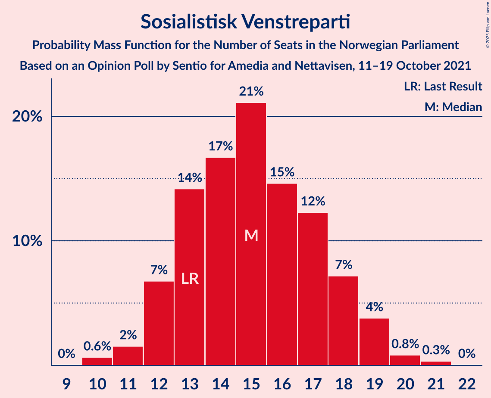
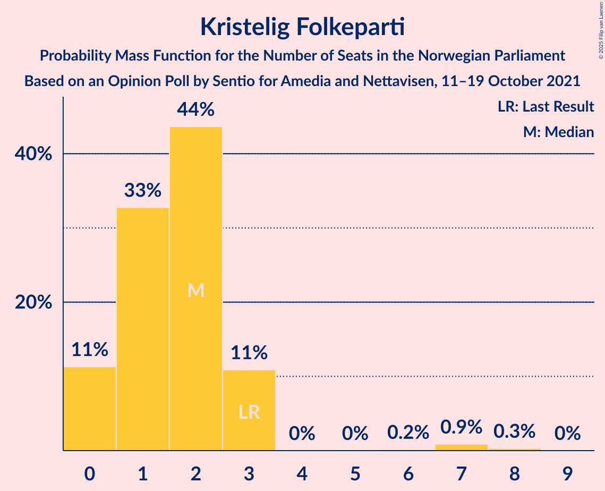
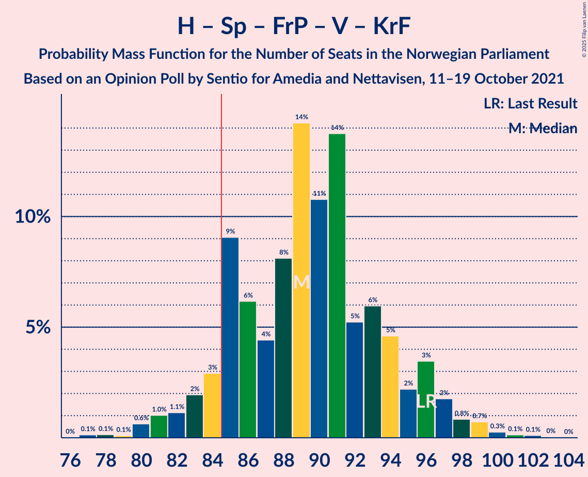

# Opinion Poll by Sentio for Amedia and Nettavisen, 11–19 October 2021

<a href="#voting-intentions">Voting Intentions</a> | <a href="#seats">Seats</a> | <a href="#coalitions">Coalitions</a> | <a href="#technical-information">Technical Information</a>

## Voting Intentions

### Confidence Intervals

| Party | Last Result | Poll Result | 80% Confidence Interval | 90% Confidence Interval | 95% Confidence Interval | 99% Confidence Interval |
|:-----:|:-----------:|:-----------:|:-----------------------:|:-----------------------:|:-----------------------:|:-----------------------:|
| Arbeiderpartiet | 26.2% | 27.4% | 25.6–29.3% |25.1–29.8% |24.7–30.3% |23.9–31.2% |
| Høyre | 20.4% | 21.0% | 19.4–22.7% |19.0–23.2% |18.6–23.6% |17.8–24.5% |
| Senterpartiet | 13.5% | 12.8% | 11.5–14.3% |11.2–14.7% |10.9–15.0% |10.3–15.7% |
| Fremskrittspartiet | 11.6% | 11.0% | 9.8–12.4% |9.5–12.8% |9.2–13.1% |8.7–13.8% |
| Sosialistisk Venstreparti | 7.6% | 8.6% | 7.6–9.8% |7.3–10.2% |7.0–10.5% |6.5–11.1% |
| Rødt | 4.7% | 4.8% | 4.0–5.8% |3.8–6.1% |3.6–6.3% |3.3–6.8% |
| Venstre | 4.6% | 4.6% | 3.9–5.6% |3.6–5.9% |3.5–6.1% |3.1–6.6% |
| Miljøpartiet De Grønne | 3.9% | 3.9% | 3.2–4.8% |3.0–5.1% |2.9–5.3% |2.6–5.8% |
| Kristelig Folkeparti | 3.8% | 2.7% | 2.1–3.5% |2.0–3.7% |1.9–3.9% |1.6–4.3% |

*Note:* The poll result column reflects the actual value used in the calculations. Published results may vary slightly, and in addition be rounded to fewer digits.

## Seats

### Confidence Intervals

| Party | Last Result | Median | 80% Confidence Interval | 90% Confidence Interval | 95% Confidence Interval | 99% Confidence Interval |
|:-----:|:-----------:|:------:|:-----------------------:|:-----------------------:|:-----------------------:|:-----------------------:|
| <a href="#arbeiderpartiet">Arbeiderpartiet</a> | 48 | 51 | 47–54 |45–56 |44–57 |43–58 |
| <a href="#høyre">Høyre</a> | 36 | 37 | 33–41 |33–42 |32–43 |30–44 |
| <a href="#senterpartiet">Senterpartiet</a> | 28 | 23 | 20–28 |19–29 |19–30 |17–31 |
| <a href="#fremskrittspartiet">Fremskrittspartiet</a> | 21 | 19 | 17–22 |17–22 |16–23 |15–25 |
| <a href="#sosialistisk-venstreparti">Sosialistisk Venstreparti</a> | 13 | 15 | 13–18 |12–18 |12–19 |10–20 |
| <a href="#rødt">Rødt</a> | 8 | 8 | 6–10 |1–11 |1–11 |1–12 |
| <a href="#venstre">Venstre</a> | 8 | 8 | 3–10 |3–10 |2–10 |2–11 |
| <a href="#miljøpartiet-de-grønne">Miljøpartiet De Grønne</a> | 3 | 3 | 2–8 |2–9 |1–9 |1–10 |
| <a href="#kristelig-folkeparti">Kristelig Folkeparti</a> | 3 | 2 | 0–3 |0–3 |0–3 |0–7 |

### Arbeiderpartiet

*For a full overview of the results for this party, see the [Arbeiderpartiet](party-arbeiderpartiet.html) page.*

| Number of Seats | Probability | Accumulated | Special Marks |
|:---------------:|:-----------:|:-----------:|:-------------:|
| 41 | 0% | 100% |  |
| 42 | 0.1% | 99.9% |  |
| 43 | 0.7% | 99.8% |  |
| 44 | 2% | 99.1% |  |
| 45 | 2% | 97% |  |
| 46 | 4% | 95% |  |
| 47 | 9% | 91% |  |
| 48 | 9% | 82% | Last Result |
| 49 | 12% | 73% |  |
| 50 | 10% | 60% |  |
| 51 | 17% | 51% | Median |
| 52 | 11% | 34% |  |
| 53 | 8% | 24% |  |
| 54 | 6% | 16% |  |
| 55 | 4% | 10% |  |
| 56 | 3% | 6% |  |
| 57 | 2% | 3% |  |
| 58 | 0.7% | 1.2% |  |
| 59 | 0.3% | 0.5% |  |
| 60 | 0.1% | 0.1% |  |
| 61 | 0.1% | 0.1% |  |
| 62 | 0% | 0% |  |

### Høyre

*For a full overview of the results for this party, see the [Høyre](party-høyre.html) page.*

| Number of Seats | Probability | Accumulated | Special Marks |
|:---------------:|:-----------:|:-----------:|:-------------:|
| 29 | 0.1% | 100% |  |
| 30 | 0.5% | 99.9% |  |
| 31 | 0.7% | 99.4% |  |
| 32 | 3% | 98.6% |  |
| 33 | 7% | 96% |  |
| 34 | 4% | 88% |  |
| 35 | 6% | 84% |  |
| 36 | 12% | 78% | Last Result |
| 37 | 17% | 66% | Median |
| 38 | 14% | 49% |  |
| 39 | 17% | 35% |  |
| 40 | 8% | 18% |  |
| 41 | 5% | 10% |  |
| 42 | 2% | 5% |  |
| 43 | 1.3% | 3% |  |
| 44 | 0.9% | 1.2% |  |
| 45 | 0.2% | 0.4% |  |
| 46 | 0.2% | 0.2% |  |
| 47 | 0% | 0% |  |

### Senterpartiet

*For a full overview of the results for this party, see the [Senterpartiet](party-senterpartiet.html) page.*

| Number of Seats | Probability | Accumulated | Special Marks |
|:---------------:|:-----------:|:-----------:|:-------------:|
| 16 | 0.1% | 100% |  |
| 17 | 0.6% | 99.9% |  |
| 18 | 1.2% | 99.4% |  |
| 19 | 4% | 98% |  |
| 20 | 9% | 94% |  |
| 21 | 7% | 86% |  |
| 22 | 18% | 78% |  |
| 23 | 11% | 60% | Median |
| 24 | 10% | 49% |  |
| 25 | 5% | 39% |  |
| 26 | 11% | 34% |  |
| 27 | 8% | 23% |  |
| 28 | 6% | 15% | Last Result |
| 29 | 5% | 8% |  |
| 30 | 2% | 3% |  |
| 31 | 0.8% | 1.2% |  |
| 32 | 0.3% | 0.3% |  |
| 33 | 0% | 0% |  |

### Fremskrittspartiet

*For a full overview of the results for this party, see the [Fremskrittspartiet](party-fremskrittspartiet.html) page.*

| Number of Seats | Probability | Accumulated | Special Marks |
|:---------------:|:-----------:|:-----------:|:-------------:|
| 13 | 0.1% | 100% |  |
| 14 | 0.3% | 99.9% |  |
| 15 | 1.0% | 99.6% |  |
| 16 | 3% | 98.6% |  |
| 17 | 15% | 95% |  |
| 18 | 20% | 80% |  |
| 19 | 15% | 60% | Median |
| 20 | 22% | 45% |  |
| 21 | 11% | 23% | Last Result |
| 22 | 7% | 12% |  |
| 23 | 3% | 5% |  |
| 24 | 0.8% | 1.4% |  |
| 25 | 0.4% | 0.6% |  |
| 26 | 0.1% | 0.2% |  |
| 27 | 0% | 0% |  |

### Sosialistisk Venstreparti

*For a full overview of the results for this party, see the [Sosialistisk Venstreparti](party-sosialistiskvenstreparti.html) page.*

| Number of Seats | Probability | Accumulated | Special Marks |
|:---------------:|:-----------:|:-----------:|:-------------:|
| 10 | 0.6% | 100% |  |
| 11 | 2% | 99.3% |  |
| 12 | 7% | 98% |  |
| 13 | 14% | 91% | Last Result |
| 14 | 17% | 77% |  |
| 15 | 21% | 60% | Median |
| 16 | 15% | 39% |  |
| 17 | 12% | 24% |  |
| 18 | 7% | 12% |  |
| 19 | 4% | 5% |  |
| 20 | 0.8% | 1.2% |  |
| 21 | 0.3% | 0.4% |  |
| 22 | 0% | 0% |  |

### Rødt

*For a full overview of the results for this party, see the [Rødt](party-rødt.html) page.*

| Number of Seats | Probability | Accumulated | Special Marks |
|:---------------:|:-----------:|:-----------:|:-------------:|
| 1 | 9% | 100% |  |
| 2 | 0% | 91% |  |
| 3 | 0% | 91% |  |
| 4 | 0% | 91% |  |
| 5 | 0% | 91% |  |
| 6 | 0.8% | 91% |  |
| 7 | 9% | 90% |  |
| 8 | 35% | 81% | Last Result, Median |
| 9 | 26% | 46% |  |
| 10 | 13% | 20% |  |
| 11 | 6% | 7% |  |
| 12 | 1.2% | 1.3% |  |
| 13 | 0.1% | 0.1% |  |
| 14 | 0% | 0% |  |

### Venstre

*For a full overview of the results for this party, see the [Venstre](party-venstre.html) page.*

| Number of Seats | Probability | Accumulated | Special Marks |
|:---------------:|:-----------:|:-----------:|:-------------:|
| 2 | 3% | 100% |  |
| 3 | 13% | 97% |  |
| 4 | 0% | 84% |  |
| 5 | 0% | 84% |  |
| 6 | 0.3% | 84% |  |
| 7 | 14% | 83% |  |
| 8 | 38% | 69% | Last Result, Median |
| 9 | 19% | 32% |  |
| 10 | 10% | 13% |  |
| 11 | 2% | 2% |  |
| 12 | 0.3% | 0.4% |  |
| 13 | 0.1% | 0.1% |  |
| 14 | 0% | 0% |  |

### Miljøpartiet De Grønne

*For a full overview of the results for this party, see the [Miljøpartiet De Grønne](party-miljøpartietdegrønne.html) page.*

| Number of Seats | Probability | Accumulated | Special Marks |
|:---------------:|:-----------:|:-----------:|:-------------:|
| 1 | 4% | 100% |  |
| 2 | 21% | 96% |  |
| 3 | 27% | 76% | Last Result, Median |
| 4 | 0% | 49% |  |
| 5 | 0% | 49% |  |
| 6 | 1.2% | 49% |  |
| 7 | 14% | 48% |  |
| 8 | 28% | 33% |  |
| 9 | 4% | 6% |  |
| 10 | 1.2% | 1.3% |  |
| 11 | 0.1% | 0.1% |  |
| 12 | 0% | 0% |  |

### Kristelig Folkeparti

*For a full overview of the results for this party, see the [Kristelig Folkeparti](party-kristeligfolkeparti.html) page.*

| Number of Seats | Probability | Accumulated | Special Marks |
|:---------------:|:-----------:|:-----------:|:-------------:|
| 0 | 11% | 100% |  |
| 1 | 33% | 89% |  |
| 2 | 44% | 56% | Median |
| 3 | 11% | 12% | Last Result |
| 4 | 0% | 1.4% |  |
| 5 | 0% | 1.4% |  |
| 6 | 0.2% | 1.4% |  |
| 7 | 0.9% | 1.2% |  |
| 8 | 0.3% | 0.3% |  |
| 9 | 0% | 0% |  |

## Coalitions

### Confidence Intervals

| Coalition | Last Result | Median | Majority? | 80% Confidence Interval | 90% Confidence Interval | 95% Confidence Interval | 99% Confidence Interval |
|:---------:|:-----------:|:------:|:---------:|:-----------------------:|:-----------------------:|:-----------------------:|:-----------------------:|
| Arbeiderpartiet – Senterpartiet – Sosialistisk Venstreparti – Rødt – Miljøpartiet De Grønne | 100 | 102 | 100% | 97–108 | 96–110 | 95–111 | 92–112 |
| Arbeiderpartiet – Senterpartiet – Sosialistisk Venstreparti – Rødt | 97 | 97 | 100% | 93–103 | 91–104 | 91–105 | 87–107 |
| Arbeiderpartiet – Senterpartiet – Sosialistisk Venstreparti – Miljøpartiet De Grønne – Kristelig Folkeparti | 95 | 96 | 100% | 91–102 | 89–103 | 89–104 | 87–105 |
| Arbeiderpartiet – Senterpartiet – Sosialistisk Venstreparti – Miljøpartiet De Grønne | 92 | 94 | 99.6% | 89–100 | 88–102 | 87–103 | 85–104 |
| Høyre – Senterpartiet – Fremskrittspartiet – Venstre – Kristelig Folkeparti | 96 | 89 | 92% | 85–94 | 83–96 | 82–97 | 80–100 |
| Arbeiderpartiet – Senterpartiet – Sosialistisk Venstreparti | 89 | 90 | 90% | 85–94 | 84–95 | 83–96 | 81–98 |
| Arbeiderpartiet – Senterpartiet – Miljøpartiet De Grønne – Kristelig Folkeparti | 82 | 81 | 21% | 76–88 | 74–89 | 73–89 | 72–90 |
| Arbeiderpartiet – Sosialistisk Venstreparti – Rødt – Miljøpartiet De Grønne | 72 | 79 | 7% | 73–84 | 72–85 | 70–86 | 68–89 |
| Arbeiderpartiet – Senterpartiet – Kristelig Folkeparti | 79 | 75 | 0.5% | 71–80 | 70–81 | 69–83 | 68–85 |
| Arbeiderpartiet – Senterpartiet | 76 | 73 | 0.1% | 70–79 | 69–80 | 68–81 | 66–82 |
| Høyre – Fremskrittspartiet – Venstre – Miljøpartiet De Grønne – Kristelig Folkeparti | 71 | 71 | 0% | 66–76 | 64–77 | 63–78 | 61–81 |
| Høyre – Fremskrittspartiet – Venstre – Kristelig Folkeparti | 68 | 66 | 0% | 60–70 | 59–72 | 58–74 | 56–75 |
| Arbeiderpartiet – Sosialistisk Venstreparti | 61 | 66 | 0% | 61–70 | 60–71 | 60–72 | 58–75 |
| Høyre – Fremskrittspartiet – Venstre | 65 | 64 | 0% | 59–68 | 58–70 | 57–72 | 55–73 |
| Høyre – Fremskrittspartiet | 57 | 57 | 0% | 52–61 | 50–63 | 50–63 | 48–65 |
| Høyre – Venstre – Kristelig Folkeparti | 47 | 47 | 0% | 41–50 | 41–51 | 40–53 | 38–55 |
| Senterpartiet – Venstre – Kristelig Folkeparti | 39 | 33 | 0% | 28–38 | 27–39 | 26–40 | 23–42 |

### Arbeiderpartiet – Senterpartiet – Sosialistisk Venstreparti – Rødt – Miljøpartiet De Grønne

| Number of Seats | Probability | Accumulated | Special Marks |
|:---------------:|:-----------:|:-----------:|:-------------:|
| 88 | 0.1% | 100% |  |
| 89 | 0% | 99.9% |  |
| 90 | 0% | 99.9% |  |
| 91 | 0.3% | 99.9% |  |
| 92 | 0.2% | 99.6% |  |
| 93 | 0.5% | 99.4% |  |
| 94 | 1.3% | 98.9% |  |
| 95 | 2% | 98% |  |
| 96 | 4% | 96% |  |
| 97 | 3% | 92% |  |
| 98 | 5% | 89% |  |
| 99 | 5% | 84% |  |
| 100 | 8% | 79% | Last Result, Median |
| 101 | 11% | 70% |  |
| 102 | 13% | 59% |  |
| 103 | 9% | 46% |  |
| 104 | 10% | 38% |  |
| 105 | 7% | 27% |  |
| 106 | 4% | 21% |  |
| 107 | 4% | 16% |  |
| 108 | 4% | 12% |  |
| 109 | 3% | 8% |  |
| 110 | 2% | 5% |  |
| 111 | 3% | 4% |  |
| 112 | 0.4% | 0.7% |  |
| 113 | 0.2% | 0.2% |  |
| 114 | 0% | 0% |  |

### Arbeiderpartiet – Senterpartiet – Sosialistisk Venstreparti – Rødt

| Number of Seats | Probability | Accumulated | Special Marks |
|:---------------:|:-----------:|:-----------:|:-------------:|
| 85 | 0.1% | 100% | Majority |
| 86 | 0.2% | 99.8% |  |
| 87 | 0.2% | 99.6% |  |
| 88 | 0.6% | 99.4% |  |
| 89 | 0.5% | 98.9% |  |
| 90 | 0.7% | 98% |  |
| 91 | 3% | 98% |  |
| 92 | 4% | 95% |  |
| 93 | 7% | 91% |  |
| 94 | 7% | 84% |  |
| 95 | 9% | 77% |  |
| 96 | 11% | 68% |  |
| 97 | 8% | 56% | Last Result, Median |
| 98 | 10% | 48% |  |
| 99 | 10% | 39% |  |
| 100 | 8% | 29% |  |
| 101 | 6% | 21% |  |
| 102 | 5% | 15% |  |
| 103 | 5% | 10% |  |
| 104 | 3% | 6% |  |
| 105 | 1.1% | 3% |  |
| 106 | 0.9% | 1.4% |  |
| 107 | 0.3% | 0.6% |  |
| 108 | 0.2% | 0.3% |  |
| 109 | 0% | 0.1% |  |
| 110 | 0% | 0% |  |

### Arbeiderpartiet – Senterpartiet – Sosialistisk Venstreparti – Miljøpartiet De Grønne – Kristelig Folkeparti

| Number of Seats | Probability | Accumulated | Special Marks |
|:---------------:|:-----------:|:-----------:|:-------------:|
| 85 | 0.2% | 100% | Majority |
| 86 | 0.2% | 99.8% |  |
| 87 | 0.3% | 99.5% |  |
| 88 | 1.3% | 99.3% |  |
| 89 | 4% | 98% |  |
| 90 | 2% | 94% |  |
| 91 | 3% | 91% |  |
| 92 | 9% | 89% |  |
| 93 | 6% | 80% |  |
| 94 | 11% | 74% | Median |
| 95 | 13% | 63% | Last Result |
| 96 | 8% | 50% |  |
| 97 | 6% | 43% |  |
| 98 | 10% | 36% |  |
| 99 | 7% | 26% |  |
| 100 | 3% | 19% |  |
| 101 | 4% | 16% |  |
| 102 | 3% | 12% |  |
| 103 | 4% | 8% |  |
| 104 | 3% | 4% |  |
| 105 | 1.0% | 2% |  |
| 106 | 0.2% | 0.5% |  |
| 107 | 0.1% | 0.3% |  |
| 108 | 0.1% | 0.2% |  |
| 109 | 0.1% | 0.1% |  |
| 110 | 0% | 0% |  |

### Arbeiderpartiet – Senterpartiet – Sosialistisk Venstreparti – Miljøpartiet De Grønne

| Number of Seats | Probability | Accumulated | Special Marks |
|:---------------:|:-----------:|:-----------:|:-------------:|
| 83 | 0.1% | 100% |  |
| 84 | 0.3% | 99.9% |  |
| 85 | 0.3% | 99.6% | Majority |
| 86 | 2% | 99.3% |  |
| 87 | 2% | 98% |  |
| 88 | 3% | 96% |  |
| 89 | 3% | 92% |  |
| 90 | 4% | 90% |  |
| 91 | 9% | 85% |  |
| 92 | 7% | 76% | Last Result, Median |
| 93 | 18% | 69% |  |
| 94 | 4% | 51% |  |
| 95 | 10% | 47% |  |
| 96 | 8% | 37% |  |
| 97 | 6% | 29% |  |
| 98 | 6% | 23% |  |
| 99 | 3% | 17% |  |
| 100 | 5% | 14% |  |
| 101 | 2% | 9% |  |
| 102 | 3% | 7% |  |
| 103 | 3% | 4% |  |
| 104 | 0.5% | 0.8% |  |
| 105 | 0.2% | 0.3% |  |
| 106 | 0.1% | 0.1% |  |
| 107 | 0% | 0.1% |  |
| 108 | 0.1% | 0.1% |  |
| 109 | 0% | 0% |  |

### Høyre – Senterpartiet – Fremskrittspartiet – Venstre – Kristelig Folkeparti

| Number of Seats | Probability | Accumulated | Special Marks |
|:---------------:|:-----------:|:-----------:|:-------------:|
| 76 | 0% | 100% |  |
| 77 | 0.1% | 99.9% |  |
| 78 | 0.1% | 99.8% |  |
| 79 | 0.1% | 99.7% |  |
| 80 | 0.6% | 99.6% |  |
| 81 | 1.0% | 98.9% |  |
| 82 | 1.1% | 98% |  |
| 83 | 2% | 97% |  |
| 84 | 3% | 95% |  |
| 85 | 9% | 92% | Majority |
| 86 | 6% | 83% |  |
| 87 | 4% | 77% |  |
| 88 | 8% | 72% |  |
| 89 | 14% | 64% | Median |
| 90 | 11% | 50% |  |
| 91 | 14% | 39% |  |
| 92 | 5% | 25% |  |
| 93 | 6% | 20% |  |
| 94 | 5% | 14% |  |
| 95 | 2% | 10% |  |
| 96 | 3% | 7% | Last Result |
| 97 | 2% | 4% |  |
| 98 | 0.8% | 2% |  |
| 99 | 0.7% | 1.3% |  |
| 100 | 0.3% | 0.6% |  |
| 101 | 0.1% | 0.3% |  |
| 102 | 0.1% | 0.2% |  |
| 103 | 0% | 0.1% |  |
| 104 | 0% | 0% |  |

### Arbeiderpartiet – Senterpartiet – Sosialistisk Venstreparti

| Number of Seats | Probability | Accumulated | Special Marks |
|:---------------:|:-----------:|:-----------:|:-------------:|
| 79 | 0.1% | 100% |  |
| 80 | 0.2% | 99.9% |  |
| 81 | 0.4% | 99.7% |  |
| 82 | 0.5% | 99.3% |  |
| 83 | 3% | 98.8% |  |
| 84 | 5% | 96% |  |
| 85 | 6% | 90% | Majority |
| 86 | 8% | 84% |  |
| 87 | 6% | 76% |  |
| 88 | 13% | 70% |  |
| 89 | 6% | 57% | Last Result, Median |
| 90 | 16% | 50% |  |
| 91 | 5% | 34% |  |
| 92 | 10% | 29% |  |
| 93 | 4% | 19% |  |
| 94 | 6% | 15% |  |
| 95 | 5% | 9% |  |
| 96 | 2% | 4% |  |
| 97 | 0.9% | 2% |  |
| 98 | 0.6% | 1.1% |  |
| 99 | 0.2% | 0.4% |  |
| 100 | 0.1% | 0.2% |  |
| 101 | 0.1% | 0.1% |  |
| 102 | 0% | 0% |  |

### Arbeiderpartiet – Senterpartiet – Miljøpartiet De Grønne – Kristelig Folkeparti

| Number of Seats | Probability | Accumulated | Special Marks |
|:---------------:|:-----------:|:-----------:|:-------------:|
| 69 | 0.1% | 100% |  |
| 70 | 0.2% | 99.9% |  |
| 71 | 0.1% | 99.7% |  |
| 72 | 1.2% | 99.6% |  |
| 73 | 2% | 98% |  |
| 74 | 4% | 97% |  |
| 75 | 3% | 93% |  |
| 76 | 6% | 90% |  |
| 77 | 10% | 84% |  |
| 78 | 9% | 74% |  |
| 79 | 5% | 66% | Median |
| 80 | 6% | 61% |  |
| 81 | 7% | 55% |  |
| 82 | 10% | 48% | Last Result |
| 83 | 11% | 37% |  |
| 84 | 5% | 26% |  |
| 85 | 6% | 21% | Majority |
| 86 | 3% | 16% |  |
| 87 | 2% | 12% |  |
| 88 | 4% | 10% |  |
| 89 | 4% | 6% |  |
| 90 | 1.4% | 2% |  |
| 91 | 0.2% | 0.4% |  |
| 92 | 0.1% | 0.2% |  |
| 93 | 0% | 0.1% |  |
| 94 | 0% | 0% |  |

### Arbeiderpartiet – Sosialistisk Venstreparti – Rødt – Miljøpartiet De Grønne

| Number of Seats | Probability | Accumulated | Special Marks |
|:---------------:|:-----------:|:-----------:|:-------------:|
| 66 | 0.2% | 100% |  |
| 67 | 0.2% | 99.7% |  |
| 68 | 0.3% | 99.5% |  |
| 69 | 0.4% | 99.2% |  |
| 70 | 1.3% | 98.8% |  |
| 71 | 1.3% | 97% |  |
| 72 | 3% | 96% | Last Result |
| 73 | 5% | 93% |  |
| 74 | 4% | 88% |  |
| 75 | 5% | 85% |  |
| 76 | 8% | 80% |  |
| 77 | 8% | 72% | Median |
| 78 | 13% | 64% |  |
| 79 | 10% | 50% |  |
| 80 | 13% | 41% |  |
| 81 | 7% | 27% |  |
| 82 | 4% | 21% |  |
| 83 | 4% | 16% |  |
| 84 | 6% | 12% |  |
| 85 | 3% | 7% | Majority |
| 86 | 2% | 4% |  |
| 87 | 0.8% | 2% |  |
| 88 | 0.9% | 1.5% |  |
| 89 | 0.5% | 0.6% |  |
| 90 | 0% | 0.1% |  |
| 91 | 0% | 0.1% |  |
| 92 | 0% | 0% |  |

### Arbeiderpartiet – Senterpartiet – Kristelig Folkeparti

| Number of Seats | Probability | Accumulated | Special Marks |
|:---------------:|:-----------:|:-----------:|:-------------:|
| 65 | 0.1% | 100% |  |
| 66 | 0.1% | 99.9% |  |
| 67 | 0.2% | 99.8% |  |
| 68 | 0.7% | 99.6% |  |
| 69 | 2% | 98.8% |  |
| 70 | 3% | 97% |  |
| 71 | 5% | 94% |  |
| 72 | 3% | 89% |  |
| 73 | 7% | 86% |  |
| 74 | 11% | 79% |  |
| 75 | 20% | 68% |  |
| 76 | 8% | 48% | Median |
| 77 | 9% | 40% |  |
| 78 | 8% | 31% |  |
| 79 | 6% | 24% | Last Result |
| 80 | 8% | 18% |  |
| 81 | 5% | 10% |  |
| 82 | 2% | 5% |  |
| 83 | 2% | 3% |  |
| 84 | 0.4% | 0.9% |  |
| 85 | 0.3% | 0.5% | Majority |
| 86 | 0.2% | 0.2% |  |
| 87 | 0.1% | 0.1% |  |
| 88 | 0% | 0% |  |

### Arbeiderpartiet – Senterpartiet

| Number of Seats | Probability | Accumulated | Special Marks |
|:---------------:|:-----------:|:-----------:|:-------------:|
| 64 | 0.1% | 100% |  |
| 65 | 0.2% | 99.8% |  |
| 66 | 0.5% | 99.6% |  |
| 67 | 2% | 99.1% |  |
| 68 | 3% | 98% |  |
| 69 | 3% | 95% |  |
| 70 | 5% | 92% |  |
| 71 | 4% | 87% |  |
| 72 | 9% | 83% |  |
| 73 | 25% | 74% |  |
| 74 | 7% | 50% | Median |
| 75 | 7% | 42% |  |
| 76 | 8% | 36% | Last Result |
| 77 | 7% | 27% |  |
| 78 | 9% | 20% |  |
| 79 | 4% | 12% |  |
| 80 | 3% | 8% |  |
| 81 | 3% | 5% |  |
| 82 | 0.7% | 1.2% |  |
| 83 | 0.2% | 0.5% |  |
| 84 | 0.2% | 0.2% |  |
| 85 | 0% | 0.1% | Majority |
| 86 | 0% | 0% |  |

### Høyre – Fremskrittspartiet – Venstre – Miljøpartiet De Grønne – Kristelig Folkeparti

| Number of Seats | Probability | Accumulated | Special Marks |
|:---------------:|:-----------:|:-----------:|:-------------:|
| 59 | 0.2% | 100% |  |
| 60 | 0.1% | 99.8% |  |
| 61 | 0.4% | 99.7% |  |
| 62 | 1.2% | 99.3% |  |
| 63 | 1.4% | 98% |  |
| 64 | 3% | 97% |  |
| 65 | 3% | 94% |  |
| 66 | 8% | 91% |  |
| 67 | 5% | 82% |  |
| 68 | 7% | 77% |  |
| 69 | 8% | 70% | Median |
| 70 | 10% | 62% |  |
| 71 | 9% | 52% | Last Result |
| 72 | 8% | 43% |  |
| 73 | 8% | 35% |  |
| 74 | 9% | 27% |  |
| 75 | 5% | 18% |  |
| 76 | 6% | 13% |  |
| 77 | 3% | 7% |  |
| 78 | 2% | 3% |  |
| 79 | 0.4% | 1.2% |  |
| 80 | 0.3% | 0.8% |  |
| 81 | 0.3% | 0.5% |  |
| 82 | 0.1% | 0.3% |  |
| 83 | 0.1% | 0.2% |  |
| 84 | 0% | 0.1% |  |
| 85 | 0% | 0% | Majority |

### Høyre – Fremskrittspartiet – Venstre – Kristelig Folkeparti

| Number of Seats | Probability | Accumulated | Special Marks |
|:---------------:|:-----------:|:-----------:|:-------------:|
| 53 | 0% | 100% |  |
| 54 | 0% | 99.9% |  |
| 55 | 0.1% | 99.9% |  |
| 56 | 0.4% | 99.8% |  |
| 57 | 0.7% | 99.4% |  |
| 58 | 3% | 98.7% |  |
| 59 | 3% | 96% |  |
| 60 | 4% | 93% |  |
| 61 | 4% | 89% |  |
| 62 | 6% | 85% |  |
| 63 | 5% | 80% |  |
| 64 | 10% | 75% |  |
| 65 | 11% | 64% |  |
| 66 | 10% | 53% | Median |
| 67 | 13% | 43% |  |
| 68 | 11% | 31% | Last Result |
| 69 | 7% | 20% |  |
| 70 | 4% | 12% |  |
| 71 | 2% | 8% |  |
| 72 | 2% | 6% |  |
| 73 | 1.4% | 4% |  |
| 74 | 2% | 3% |  |
| 75 | 0.8% | 1.1% |  |
| 76 | 0.2% | 0.4% |  |
| 77 | 0.1% | 0.2% |  |
| 78 | 0% | 0.1% |  |
| 79 | 0% | 0% |  |

### Arbeiderpartiet – Sosialistisk Venstreparti

| Number of Seats | Probability | Accumulated | Special Marks |
|:---------------:|:-----------:|:-----------:|:-------------:|
| 56 | 0.1% | 100% |  |
| 57 | 0.2% | 99.9% |  |
| 58 | 0.5% | 99.7% |  |
| 59 | 1.2% | 99.2% |  |
| 60 | 4% | 98% |  |
| 61 | 7% | 94% | Last Result |
| 62 | 9% | 88% |  |
| 63 | 11% | 78% |  |
| 64 | 10% | 67% |  |
| 65 | 7% | 57% |  |
| 66 | 10% | 50% | Median |
| 67 | 11% | 40% |  |
| 68 | 12% | 29% |  |
| 69 | 4% | 18% |  |
| 70 | 4% | 13% |  |
| 71 | 4% | 9% |  |
| 72 | 3% | 5% |  |
| 73 | 0.8% | 2% |  |
| 74 | 0.7% | 1.4% |  |
| 75 | 0.6% | 0.7% |  |
| 76 | 0.1% | 0.1% |  |
| 77 | 0% | 0.1% |  |
| 78 | 0% | 0% |  |

### Høyre – Fremskrittspartiet – Venstre

| Number of Seats | Probability | Accumulated | Special Marks |
|:---------------:|:-----------:|:-----------:|:-------------:|
| 52 | 0% | 100% |  |
| 53 | 0.1% | 99.9% |  |
| 54 | 0.1% | 99.8% |  |
| 55 | 0.5% | 99.7% |  |
| 56 | 0.7% | 99.2% |  |
| 57 | 3% | 98% |  |
| 58 | 4% | 95% |  |
| 59 | 4% | 91% |  |
| 60 | 5% | 87% |  |
| 61 | 5% | 82% |  |
| 62 | 8% | 78% |  |
| 63 | 14% | 69% |  |
| 64 | 10% | 55% | Median |
| 65 | 13% | 46% | Last Result |
| 66 | 6% | 33% |  |
| 67 | 13% | 27% |  |
| 68 | 5% | 14% |  |
| 69 | 2% | 9% |  |
| 70 | 3% | 7% |  |
| 71 | 1.0% | 4% |  |
| 72 | 2% | 3% |  |
| 73 | 0.7% | 1.2% |  |
| 74 | 0.2% | 0.5% |  |
| 75 | 0.2% | 0.3% |  |
| 76 | 0.1% | 0.1% |  |
| 77 | 0% | 0% |  |

### Høyre – Fremskrittspartiet

| Number of Seats | Probability | Accumulated | Special Marks |
|:---------------:|:-----------:|:-----------:|:-------------:|
| 46 | 0.1% | 100% |  |
| 47 | 0.1% | 99.9% |  |
| 48 | 0.6% | 99.8% |  |
| 49 | 0.8% | 99.2% |  |
| 50 | 6% | 98% |  |
| 51 | 2% | 93% |  |
| 52 | 3% | 90% |  |
| 53 | 5% | 88% |  |
| 54 | 9% | 83% |  |
| 55 | 10% | 74% |  |
| 56 | 12% | 63% | Median |
| 57 | 15% | 51% | Last Result |
| 58 | 7% | 35% |  |
| 59 | 8% | 28% |  |
| 60 | 7% | 20% |  |
| 61 | 6% | 13% |  |
| 62 | 2% | 8% |  |
| 63 | 4% | 5% |  |
| 64 | 0.6% | 2% |  |
| 65 | 0.7% | 1.1% |  |
| 66 | 0.2% | 0.4% |  |
| 67 | 0.1% | 0.2% |  |
| 68 | 0.1% | 0.1% |  |
| 69 | 0% | 0% |  |

### Høyre – Venstre – Kristelig Folkeparti

| Number of Seats | Probability | Accumulated | Special Marks |
|:---------------:|:-----------:|:-----------:|:-------------:|
| 36 | 0.1% | 100% |  |
| 37 | 0.2% | 99.9% |  |
| 38 | 0.6% | 99.6% |  |
| 39 | 1.3% | 99.0% |  |
| 40 | 0.9% | 98% |  |
| 41 | 7% | 97% |  |
| 42 | 5% | 90% |  |
| 43 | 5% | 84% |  |
| 44 | 5% | 79% |  |
| 45 | 6% | 74% |  |
| 46 | 11% | 67% |  |
| 47 | 18% | 56% | Last Result, Median |
| 48 | 14% | 38% |  |
| 49 | 6% | 25% |  |
| 50 | 11% | 19% |  |
| 51 | 3% | 8% |  |
| 52 | 2% | 5% |  |
| 53 | 2% | 3% |  |
| 54 | 0.3% | 0.9% |  |
| 55 | 0.3% | 0.6% |  |
| 56 | 0.2% | 0.3% |  |
| 57 | 0.1% | 0.1% |  |
| 58 | 0% | 0% |  |

### Senterpartiet – Venstre – Kristelig Folkeparti

| Number of Seats | Probability | Accumulated | Special Marks |
|:---------------:|:-----------:|:-----------:|:-------------:|
| 22 | 0.1% | 100% |  |
| 23 | 0.8% | 99.9% |  |
| 24 | 0.4% | 99.1% |  |
| 25 | 0.4% | 98.7% |  |
| 26 | 3% | 98% |  |
| 27 | 2% | 96% |  |
| 28 | 5% | 94% |  |
| 29 | 4% | 89% |  |
| 30 | 10% | 85% |  |
| 31 | 11% | 75% |  |
| 32 | 10% | 63% |  |
| 33 | 10% | 53% | Median |
| 34 | 9% | 44% |  |
| 35 | 10% | 35% |  |
| 36 | 9% | 25% |  |
| 37 | 5% | 16% |  |
| 38 | 3% | 12% |  |
| 39 | 4% | 8% | Last Result |
| 40 | 3% | 4% |  |
| 41 | 0.7% | 1.3% |  |
| 42 | 0.4% | 0.7% |  |
| 43 | 0.1% | 0.2% |  |
| 44 | 0.1% | 0.1% |  |
| 45 | 0% | 0% |  |

## Technical Information

### Opinion Poll

+ **Polling firm:** Sentio
+ **Commissioner(s):** Amedia and Nettavisen
+ **Fieldwork period:** 11–19 October 2021

### Calculations

+ **Sample size:** 1000
+ **Simulations done:** 1,048,576
+ **Error estimate:** 0.94%

