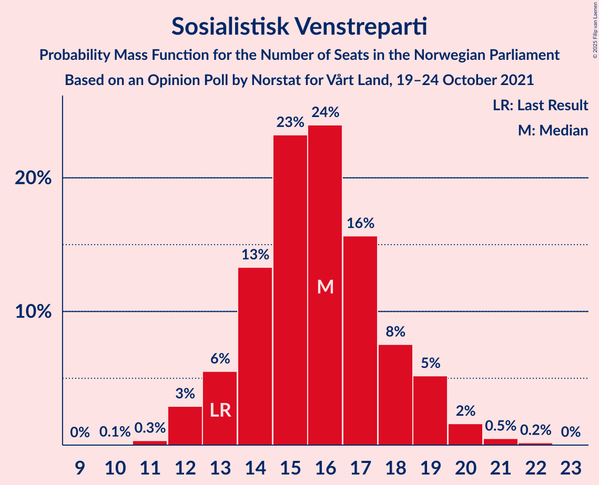
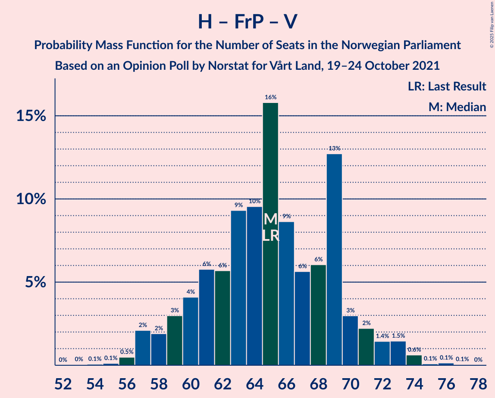

# Opinion Poll by Norstat for Vårt Land, 19–24 October 2021

<a href="#voting-intentions">Voting Intentions</a> | <a href="#seats">Seats</a> | <a href="#coalitions">Coalitions</a> | <a href="#technical-information">Technical Information</a>

## Voting Intentions

### Confidence Intervals

| Party | Last Result | Poll Result | 80% Confidence Interval | 90% Confidence Interval | 95% Confidence Interval | 99% Confidence Interval |
|:-----:|:-----------:|:-----------:|:-----------------------:|:-----------------------:|:-----------------------:|:-----------------------:|
| Arbeiderpartiet | 26.2% | 28.0% | 26.2–29.9% |25.7–30.5% |25.3–31.0% |24.4–31.9% |
| Høyre | 20.4% | 21.1% | 19.5–22.9% |19.0–23.4% |18.6–23.8% |17.9–24.7% |
| Senterpartiet | 13.5% | 13.2% | 11.9–14.7% |11.5–15.2% |11.2–15.5% |10.6–16.3% |
| Fremskrittspartiet | 11.6% | 11.0% | 9.8–12.4% |9.5–12.8% |9.2–13.2% |8.6–13.9% |
| Sosialistisk Venstreparti | 7.6% | 8.9% | 7.8–10.2% |7.5–10.6% |7.3–10.9% |6.8–11.6% |
| Venstre | 4.6% | 4.7% | 3.9–5.7% |3.7–6.0% |3.6–6.3% |3.2–6.8% |
| Rødt | 4.7% | 4.7% | 3.9–5.7% |3.7–6.0% |3.6–6.3% |3.2–6.8% |
| Kristelig Folkeparti | 3.8% | 3.1% | 2.5–4.0% |2.3–4.3% |2.2–4.5% |2.0–4.9% |
| Miljøpartiet De Grønne | 3.9% | 3.1% | 2.5–4.0% |2.3–4.3% |2.2–4.5% |2.0–4.9% |

*Note:* The poll result column reflects the actual value used in the calculations. Published results may vary slightly, and in addition be rounded to fewer digits.

## Seats

### Confidence Intervals

| Party | Last Result | Median | 80% Confidence Interval | 90% Confidence Interval | 95% Confidence Interval | 99% Confidence Interval |
|:-----:|:-----------:|:------:|:-----------------------:|:-----------------------:|:-----------------------:|:-----------------------:|
| <a href="#arbeiderpartiet">Arbeiderpartiet</a> | 48 | 51 | 47–55 |46–56 |45–57 |44–59 |
| <a href="#høyre">Høyre</a> | 36 | 37 | 34–41 |33–42 |32–43 |31–45 |
| <a href="#senterpartiet">Senterpartiet</a> | 28 | 25 | 21–29 |20–30 |20–30 |18–32 |
| <a href="#fremskrittspartiet">Fremskrittspartiet</a> | 21 | 20 | 17–22 |17–23 |16–24 |15–25 |
| <a href="#sosialistisk-venstreparti">Sosialistisk Venstreparti</a> | 13 | 16 | 14–18 |13–19 |12–19 |12–21 |
| <a href="#venstre">Venstre</a> | 8 | 8 | 3–10 |3–11 |3–11 |2–12 |
| <a href="#rødt">Rødt</a> | 8 | 9 | 1–10 |1–11 |1–11 |1–12 |
| <a href="#kristelig-folkeparti">Kristelig Folkeparti</a> | 3 | 2 | 1–3 |1–7 |0–8 |0–8 |
| <a href="#miljøpartiet-de-grønne">Miljøpartiet De Grønne</a> | 3 | 2 | 1–7 |1–7 |1–8 |1–8 |

### Arbeiderpartiet

*For a full overview of the results for this party, see the [Arbeiderpartiet](party-arbeiderpartiet.html) page.*

| Number of Seats | Probability | Accumulated | Special Marks |
|:---------------:|:-----------:|:-----------:|:-------------:|
| 42 | 0.1% | 100% |  |
| 43 | 0.2% | 99.8% |  |
| 44 | 1.2% | 99.7% |  |
| 45 | 2% | 98% |  |
| 46 | 3% | 97% |  |
| 47 | 6% | 94% |  |
| 48 | 5% | 88% | Last Result |
| 49 | 13% | 83% |  |
| 50 | 12% | 70% |  |
| 51 | 18% | 58% | Median |
| 52 | 14% | 40% |  |
| 53 | 10% | 26% |  |
| 54 | 4% | 17% |  |
| 55 | 6% | 12% |  |
| 56 | 3% | 7% |  |
| 57 | 1.2% | 4% |  |
| 58 | 2% | 2% |  |
| 59 | 0.4% | 0.7% |  |
| 60 | 0.2% | 0.3% |  |
| 61 | 0.1% | 0.1% |  |
| 62 | 0% | 0% |  |

### Høyre

*For a full overview of the results for this party, see the [Høyre](party-høyre.html) page.*

| Number of Seats | Probability | Accumulated | Special Marks |
|:---------------:|:-----------:|:-----------:|:-------------:|
| 29 | 0% | 100% |  |
| 30 | 0.4% | 99.9% |  |
| 31 | 1.4% | 99.6% |  |
| 32 | 2% | 98% |  |
| 33 | 6% | 96% |  |
| 34 | 5% | 91% |  |
| 35 | 9% | 85% |  |
| 36 | 14% | 76% | Last Result |
| 37 | 14% | 62% | Median |
| 38 | 11% | 48% |  |
| 39 | 18% | 37% |  |
| 40 | 6% | 19% |  |
| 41 | 6% | 12% |  |
| 42 | 3% | 6% |  |
| 43 | 2% | 3% |  |
| 44 | 0.4% | 1.4% |  |
| 45 | 0.9% | 1.0% |  |
| 46 | 0.1% | 0.1% |  |
| 47 | 0.1% | 0.1% |  |
| 48 | 0% | 0% |  |

### Senterpartiet

*For a full overview of the results for this party, see the [Senterpartiet](party-senterpartiet.html) page.*

| Number of Seats | Probability | Accumulated | Special Marks |
|:---------------:|:-----------:|:-----------:|:-------------:|
| 17 | 0.1% | 100% |  |
| 18 | 0.9% | 99.8% |  |
| 19 | 1.0% | 98.9% |  |
| 20 | 5% | 98% |  |
| 21 | 11% | 93% |  |
| 22 | 8% | 82% |  |
| 23 | 11% | 74% |  |
| 24 | 9% | 62% |  |
| 25 | 10% | 53% | Median |
| 26 | 10% | 43% |  |
| 27 | 9% | 33% |  |
| 28 | 12% | 24% | Last Result |
| 29 | 6% | 12% |  |
| 30 | 4% | 6% |  |
| 31 | 2% | 2% |  |
| 32 | 0.5% | 0.6% |  |
| 33 | 0.1% | 0.1% |  |
| 34 | 0% | 0% |  |

### Fremskrittspartiet

*For a full overview of the results for this party, see the [Fremskrittspartiet](party-fremskrittspartiet.html) page.*

| Number of Seats | Probability | Accumulated | Special Marks |
|:---------------:|:-----------:|:-----------:|:-------------:|
| 13 | 0% | 100% |  |
| 14 | 0.3% | 99.9% |  |
| 15 | 0.9% | 99.7% |  |
| 16 | 2% | 98.8% |  |
| 17 | 10% | 97% |  |
| 18 | 18% | 86% |  |
| 19 | 11% | 68% |  |
| 20 | 28% | 57% | Median |
| 21 | 11% | 30% | Last Result |
| 22 | 9% | 18% |  |
| 23 | 7% | 9% |  |
| 24 | 2% | 3% |  |
| 25 | 0.6% | 0.8% |  |
| 26 | 0.1% | 0.2% |  |
| 27 | 0% | 0% |  |

### Sosialistisk Venstreparti

*For a full overview of the results for this party, see the [Sosialistisk Venstreparti](party-sosialistiskvenstreparti.html) page.*

| Number of Seats | Probability | Accumulated | Special Marks |
|:---------------:|:-----------:|:-----------:|:-------------:|
| 10 | 0.1% | 100% |  |
| 11 | 0.3% | 99.9% |  |
| 12 | 3% | 99.6% |  |
| 13 | 6% | 97% | Last Result |
| 14 | 13% | 91% |  |
| 15 | 23% | 78% |  |
| 16 | 24% | 55% | Median |
| 17 | 16% | 31% |  |
| 18 | 8% | 15% |  |
| 19 | 5% | 8% |  |
| 20 | 2% | 2% |  |
| 21 | 0.5% | 0.7% |  |
| 22 | 0.2% | 0.2% |  |
| 23 | 0% | 0% |  |

### Venstre

*For a full overview of the results for this party, see the [Venstre](party-venstre.html) page.*

| Number of Seats | Probability | Accumulated | Special Marks |
|:---------------:|:-----------:|:-----------:|:-------------:|
| 2 | 1.3% | 100% |  |
| 3 | 11% | 98.7% |  |
| 4 | 0% | 88% |  |
| 5 | 0% | 88% |  |
| 6 | 0% | 88% |  |
| 7 | 10% | 88% |  |
| 8 | 33% | 78% | Last Result, Median |
| 9 | 24% | 45% |  |
| 10 | 15% | 21% |  |
| 11 | 5% | 6% |  |
| 12 | 1.0% | 1.2% |  |
| 13 | 0.1% | 0.2% |  |
| 14 | 0% | 0% |  |

### Rødt

*For a full overview of the results for this party, see the [Rødt](party-rødt.html) page.*

| Number of Seats | Probability | Accumulated | Special Marks |
|:---------------:|:-----------:|:-----------:|:-------------:|
| 1 | 12% | 100% |  |
| 2 | 0.1% | 88% |  |
| 3 | 0% | 88% |  |
| 4 | 0% | 88% |  |
| 5 | 0% | 88% |  |
| 6 | 0% | 88% |  |
| 7 | 14% | 88% |  |
| 8 | 24% | 74% | Last Result |
| 9 | 32% | 50% | Median |
| 10 | 12% | 18% |  |
| 11 | 5% | 6% |  |
| 12 | 1.0% | 1.2% |  |
| 13 | 0.1% | 0.1% |  |
| 14 | 0% | 0% |  |

### Kristelig Folkeparti

*For a full overview of the results for this party, see the [Kristelig Folkeparti](party-kristeligfolkeparti.html) page.*

| Number of Seats | Probability | Accumulated | Special Marks |
|:---------------:|:-----------:|:-----------:|:-------------:|
| 0 | 3% | 100% |  |
| 1 | 24% | 97% |  |
| 2 | 40% | 73% | Median |
| 3 | 26% | 33% | Last Result |
| 4 | 0% | 6% |  |
| 5 | 0% | 6% |  |
| 6 | 0.1% | 6% |  |
| 7 | 4% | 6% |  |
| 8 | 2% | 3% |  |
| 9 | 0.4% | 0.5% |  |
| 10 | 0% | 0% |  |

### Miljøpartiet De Grønne

*For a full overview of the results for this party, see the [Miljøpartiet De Grønne](party-miljøpartietdegrønne.html) page.*

| Number of Seats | Probability | Accumulated | Special Marks |
|:---------------:|:-----------:|:-----------:|:-------------:|
| 1 | 37% | 100% |  |
| 2 | 38% | 63% | Median |
| 3 | 14% | 25% | Last Result |
| 4 | 0% | 11% |  |
| 5 | 0% | 11% |  |
| 6 | 0.3% | 11% |  |
| 7 | 7% | 10% |  |
| 8 | 3% | 3% |  |
| 9 | 0.2% | 0.2% |  |
| 10 | 0% | 0% |  |

## Coalitions

### Confidence Intervals

| Coalition | Last Result | Median | Majority? | 80% Confidence Interval | 90% Confidence Interval | 95% Confidence Interval | 99% Confidence Interval |
|:---------:|:-----------:|:------:|:---------:|:-----------------------:|:-----------------------:|:-----------------------:|:-----------------------:|
| Arbeiderpartiet – Senterpartiet – Sosialistisk Venstreparti – Rødt – Miljøpartiet De Grønne | 100 | 102 | 100% | 97–107 | 96–108 | 94–110 | 92–110 |
| Arbeiderpartiet – Senterpartiet – Sosialistisk Venstreparti – Rødt | 97 | 100 | 100% | 95–104 | 93–105 | 92–106 | 90–108 |
| Arbeiderpartiet – Senterpartiet – Sosialistisk Venstreparti – Kristelig Folkeparti – Miljøpartiet De Grønne | 95 | 96 | 100% | 91–101 | 91–103 | 89–104 | 88–106 |
| Arbeiderpartiet – Senterpartiet – Sosialistisk Venstreparti – Miljøpartiet De Grønne | 92 | 94 | 99.6% | 89–99 | 88–101 | 87–101 | 85–103 |
| Arbeiderpartiet – Senterpartiet – Sosialistisk Venstreparti | 89 | 92 | 98% | 87–96 | 86–98 | 85–99 | 83–100 |
| Høyre – Senterpartiet – Fremskrittspartiet – Venstre – Kristelig Folkeparti | 96 | 92 | 98% | 87–97 | 85–98 | 85–99 | 82–102 |
| Arbeiderpartiet – Senterpartiet – Kristelig Folkeparti – Miljøpartiet De Grønne | 82 | 80 | 15% | 76–86 | 74–87 | 73–88 | 71–91 |
| Arbeiderpartiet – Senterpartiet – Kristelig Folkeparti | 79 | 78 | 6% | 74–83 | 72–85 | 71–86 | 69–87 |
| Arbeiderpartiet – Sosialistisk Venstreparti – Rødt – Miljøpartiet De Grønne | 72 | 77 | 2% | 72–82 | 71–84 | 70–84 | 67–87 |
| Arbeiderpartiet – Senterpartiet | 76 | 76 | 0.2% | 72–80 | 70–81 | 69–83 | 67–84 |
| Høyre – Fremskrittspartiet – Venstre – Kristelig Folkeparti – Miljøpartiet De Grønne | 71 | 69 | 0% | 65–74 | 64–76 | 63–77 | 61–79 |
| Høyre – Fremskrittspartiet – Venstre – Kristelig Folkeparti | 68 | 67 | 0% | 62–72 | 61–73 | 59–75 | 59–77 |
| Arbeiderpartiet – Sosialistisk Venstreparti | 61 | 66 | 0% | 63–71 | 62–72 | 61–73 | 59–76 |
| Høyre – Fremskrittspartiet – Venstre | 65 | 65 | 0% | 60–69 | 59–71 | 57–72 | 56–74 |
| Høyre – Fremskrittspartiet | 57 | 57 | 0% | 52–61 | 51–63 | 50–64 | 49–67 |
| Høyre – Venstre – Kristelig Folkeparti | 47 | 48 | 0% | 44–51 | 42–53 | 40–54 | 39–56 |
| Senterpartiet – Venstre – Kristelig Folkeparti | 39 | 35 | 0% | 30–40 | 29–41 | 28–43 | 26–45 |

### Arbeiderpartiet – Senterpartiet – Sosialistisk Venstreparti – Rødt – Miljøpartiet De Grønne

| Number of Seats | Probability | Accumulated | Special Marks |
|:---------------:|:-----------:|:-----------:|:-------------:|
| 89 | 0% | 100% |  |
| 90 | 0.1% | 99.9% |  |
| 91 | 0.1% | 99.8% |  |
| 92 | 0.7% | 99.8% |  |
| 93 | 0.5% | 99.0% |  |
| 94 | 2% | 98.6% |  |
| 95 | 2% | 97% |  |
| 96 | 2% | 95% |  |
| 97 | 3% | 93% |  |
| 98 | 14% | 90% |  |
| 99 | 5% | 75% |  |
| 100 | 9% | 71% | Last Result |
| 101 | 11% | 62% |  |
| 102 | 9% | 51% |  |
| 103 | 11% | 42% | Median |
| 104 | 9% | 31% |  |
| 105 | 8% | 22% |  |
| 106 | 4% | 14% |  |
| 107 | 4% | 10% |  |
| 108 | 2% | 6% |  |
| 109 | 2% | 4% |  |
| 110 | 2% | 3% |  |
| 111 | 0.1% | 0.3% |  |
| 112 | 0.1% | 0.1% |  |
| 113 | 0.1% | 0.1% |  |
| 114 | 0% | 0% |  |

### Arbeiderpartiet – Senterpartiet – Sosialistisk Venstreparti – Rødt

| Number of Seats | Probability | Accumulated | Special Marks |
|:---------------:|:-----------:|:-----------:|:-------------:|
| 87 | 0.1% | 100% |  |
| 88 | 0.1% | 99.8% |  |
| 89 | 0.2% | 99.7% |  |
| 90 | 0.8% | 99.6% |  |
| 91 | 0.8% | 98.7% |  |
| 92 | 1.2% | 98% |  |
| 93 | 3% | 97% |  |
| 94 | 2% | 94% |  |
| 95 | 5% | 92% |  |
| 96 | 13% | 87% |  |
| 97 | 6% | 74% | Last Result |
| 98 | 5% | 67% |  |
| 99 | 12% | 62% |  |
| 100 | 13% | 50% |  |
| 101 | 6% | 37% | Median |
| 102 | 13% | 32% |  |
| 103 | 8% | 18% |  |
| 104 | 3% | 11% |  |
| 105 | 2% | 7% |  |
| 106 | 3% | 5% |  |
| 107 | 0.9% | 2% |  |
| 108 | 0.6% | 0.7% |  |
| 109 | 0.1% | 0.2% |  |
| 110 | 0% | 0.1% |  |
| 111 | 0% | 0.1% |  |
| 112 | 0% | 0% |  |

### Arbeiderpartiet – Senterpartiet – Sosialistisk Venstreparti – Kristelig Folkeparti – Miljøpartiet De Grønne

| Number of Seats | Probability | Accumulated | Special Marks |
|:---------------:|:-----------:|:-----------:|:-------------:|
| 86 | 0.1% | 100% |  |
| 87 | 0.2% | 99.9% |  |
| 88 | 0.8% | 99.7% |  |
| 89 | 1.5% | 98.9% |  |
| 90 | 2% | 97% |  |
| 91 | 9% | 96% |  |
| 92 | 6% | 86% |  |
| 93 | 9% | 81% |  |
| 94 | 5% | 72% |  |
| 95 | 11% | 67% | Last Result |
| 96 | 12% | 56% | Median |
| 97 | 7% | 44% |  |
| 98 | 7% | 36% |  |
| 99 | 10% | 30% |  |
| 100 | 6% | 20% |  |
| 101 | 4% | 14% |  |
| 102 | 3% | 10% |  |
| 103 | 4% | 7% |  |
| 104 | 1.4% | 3% |  |
| 105 | 0.4% | 1.3% |  |
| 106 | 0.4% | 0.9% |  |
| 107 | 0.3% | 0.5% |  |
| 108 | 0.1% | 0.2% |  |
| 109 | 0% | 0.1% |  |
| 110 | 0% | 0.1% |  |
| 111 | 0% | 0% |  |

### Arbeiderpartiet – Senterpartiet – Sosialistisk Venstreparti – Miljøpartiet De Grønne

| Number of Seats | Probability | Accumulated | Special Marks |
|:---------------:|:-----------:|:-----------:|:-------------:|
| 83 | 0% | 100% |  |
| 84 | 0.3% | 99.9% |  |
| 85 | 0.5% | 99.6% | Majority |
| 86 | 0.7% | 99.2% |  |
| 87 | 2% | 98% |  |
| 88 | 2% | 97% |  |
| 89 | 9% | 94% |  |
| 90 | 7% | 86% |  |
| 91 | 8% | 79% |  |
| 92 | 7% | 71% | Last Result |
| 93 | 11% | 63% |  |
| 94 | 10% | 52% | Median |
| 95 | 7% | 41% |  |
| 96 | 9% | 34% |  |
| 97 | 5% | 25% |  |
| 98 | 9% | 20% |  |
| 99 | 3% | 11% |  |
| 100 | 2% | 8% |  |
| 101 | 5% | 6% |  |
| 102 | 1.0% | 2% |  |
| 103 | 0.3% | 0.7% |  |
| 104 | 0.2% | 0.4% |  |
| 105 | 0.1% | 0.2% |  |
| 106 | 0.1% | 0.1% |  |
| 107 | 0% | 0% |  |

### Arbeiderpartiet – Senterpartiet – Sosialistisk Venstreparti

| Number of Seats | Probability | Accumulated | Special Marks |
|:---------------:|:-----------:|:-----------:|:-------------:|
| 81 | 0.1% | 100% |  |
| 82 | 0.3% | 99.9% |  |
| 83 | 0.8% | 99.6% |  |
| 84 | 0.8% | 98.8% |  |
| 85 | 1.3% | 98% | Majority |
| 86 | 3% | 97% |  |
| 87 | 10% | 94% |  |
| 88 | 4% | 84% |  |
| 89 | 12% | 80% | Last Result |
| 90 | 6% | 68% |  |
| 91 | 11% | 62% |  |
| 92 | 8% | 51% | Median |
| 93 | 13% | 42% |  |
| 94 | 10% | 30% |  |
| 95 | 6% | 20% |  |
| 96 | 5% | 13% |  |
| 97 | 3% | 9% |  |
| 98 | 1.5% | 5% |  |
| 99 | 3% | 4% |  |
| 100 | 0.4% | 0.8% |  |
| 101 | 0.2% | 0.5% |  |
| 102 | 0.1% | 0.3% |  |
| 103 | 0.1% | 0.1% |  |
| 104 | 0% | 0% |  |

### Høyre – Senterpartiet – Fremskrittspartiet – Venstre – Kristelig Folkeparti

| Number of Seats | Probability | Accumulated | Special Marks |
|:---------------:|:-----------:|:-----------:|:-------------:|
| 79 | 0.1% | 100% |  |
| 80 | 0.1% | 99.9% |  |
| 81 | 0.1% | 99.8% |  |
| 82 | 0.3% | 99.8% |  |
| 83 | 0.6% | 99.4% |  |
| 84 | 1.0% | 98.8% |  |
| 85 | 3% | 98% | Majority |
| 86 | 2% | 95% |  |
| 87 | 3% | 93% |  |
| 88 | 6% | 89% |  |
| 89 | 4% | 83% |  |
| 90 | 11% | 80% |  |
| 91 | 13% | 69% |  |
| 92 | 12% | 56% | Median |
| 93 | 6% | 44% |  |
| 94 | 10% | 38% |  |
| 95 | 7% | 27% |  |
| 96 | 7% | 20% | Last Result |
| 97 | 8% | 14% |  |
| 98 | 3% | 6% |  |
| 99 | 1.3% | 3% |  |
| 100 | 0.6% | 2% |  |
| 101 | 0.5% | 1.4% |  |
| 102 | 0.6% | 0.9% |  |
| 103 | 0.2% | 0.3% |  |
| 104 | 0.1% | 0.1% |  |
| 105 | 0% | 0.1% |  |
| 106 | 0% | 0% |  |

### Arbeiderpartiet – Senterpartiet – Kristelig Folkeparti – Miljøpartiet De Grønne

| Number of Seats | Probability | Accumulated | Special Marks |
|:---------------:|:-----------:|:-----------:|:-------------:|
| 69 | 0.1% | 100% |  |
| 70 | 0.2% | 99.9% |  |
| 71 | 0.6% | 99.7% |  |
| 72 | 0.4% | 99.1% |  |
| 73 | 1.4% | 98.7% |  |
| 74 | 3% | 97% |  |
| 75 | 3% | 94% |  |
| 76 | 8% | 92% |  |
| 77 | 9% | 83% |  |
| 78 | 7% | 74% |  |
| 79 | 8% | 66% |  |
| 80 | 11% | 58% | Median |
| 81 | 6% | 47% |  |
| 82 | 11% | 41% | Last Result |
| 83 | 9% | 30% |  |
| 84 | 5% | 21% |  |
| 85 | 4% | 15% | Majority |
| 86 | 2% | 11% |  |
| 87 | 5% | 9% |  |
| 88 | 2% | 4% |  |
| 89 | 0.9% | 2% |  |
| 90 | 0.7% | 1.2% |  |
| 91 | 0.3% | 0.5% |  |
| 92 | 0.1% | 0.2% |  |
| 93 | 0.1% | 0.1% |  |
| 94 | 0% | 0% |  |

### Arbeiderpartiet – Senterpartiet – Kristelig Folkeparti

| Number of Seats | Probability | Accumulated | Special Marks |
|:---------------:|:-----------:|:-----------:|:-------------:|
| 67 | 0.1% | 100% |  |
| 68 | 0.1% | 99.9% |  |
| 69 | 0.5% | 99.8% |  |
| 70 | 1.1% | 99.3% |  |
| 71 | 1.3% | 98% |  |
| 72 | 3% | 97% |  |
| 73 | 3% | 94% |  |
| 74 | 8% | 91% |  |
| 75 | 8% | 83% |  |
| 76 | 9% | 75% |  |
| 77 | 8% | 66% |  |
| 78 | 12% | 58% | Median |
| 79 | 9% | 46% | Last Result |
| 80 | 14% | 37% |  |
| 81 | 9% | 23% |  |
| 82 | 4% | 14% |  |
| 83 | 3% | 11% |  |
| 84 | 1.5% | 7% |  |
| 85 | 3% | 6% | Majority |
| 86 | 2% | 3% |  |
| 87 | 0.4% | 0.8% |  |
| 88 | 0.2% | 0.4% |  |
| 89 | 0.1% | 0.2% |  |
| 90 | 0.1% | 0.1% |  |
| 91 | 0% | 0% |  |

### Arbeiderpartiet – Sosialistisk Venstreparti – Rødt – Miljøpartiet De Grønne

| Number of Seats | Probability | Accumulated | Special Marks |
|:---------------:|:-----------:|:-----------:|:-------------:|
| 64 | 0% | 100% |  |
| 65 | 0.1% | 99.9% |  |
| 66 | 0.2% | 99.9% |  |
| 67 | 0.6% | 99.7% |  |
| 68 | 0.5% | 99.1% |  |
| 69 | 0.6% | 98.6% |  |
| 70 | 1.3% | 98% |  |
| 71 | 3% | 97% |  |
| 72 | 8% | 94% | Last Result |
| 73 | 7% | 86% |  |
| 74 | 7% | 80% |  |
| 75 | 10% | 73% |  |
| 76 | 6% | 62% |  |
| 77 | 12% | 56% |  |
| 78 | 13% | 44% | Median |
| 79 | 11% | 31% |  |
| 80 | 4% | 20% |  |
| 81 | 6% | 17% |  |
| 82 | 3% | 11% |  |
| 83 | 2% | 7% |  |
| 84 | 3% | 5% |  |
| 85 | 1.0% | 2% | Majority |
| 86 | 0.6% | 1.2% |  |
| 87 | 0.3% | 0.6% |  |
| 88 | 0.1% | 0.2% |  |
| 89 | 0.1% | 0.2% |  |
| 90 | 0.1% | 0.1% |  |
| 91 | 0% | 0% |  |

### Arbeiderpartiet – Senterpartiet

| Number of Seats | Probability | Accumulated | Special Marks |
|:---------------:|:-----------:|:-----------:|:-------------:|
| 65 | 0.1% | 100% |  |
| 66 | 0.3% | 99.9% |  |
| 67 | 0.6% | 99.6% |  |
| 68 | 1.0% | 99.0% |  |
| 69 | 1.1% | 98% |  |
| 70 | 3% | 97% |  |
| 71 | 3% | 93% |  |
| 72 | 8% | 91% |  |
| 73 | 9% | 83% |  |
| 74 | 9% | 73% |  |
| 75 | 10% | 64% |  |
| 76 | 9% | 54% | Last Result, Median |
| 77 | 15% | 45% |  |
| 78 | 7% | 30% |  |
| 79 | 8% | 23% |  |
| 80 | 8% | 15% |  |
| 81 | 2% | 7% |  |
| 82 | 1.2% | 5% |  |
| 83 | 3% | 4% |  |
| 84 | 0.7% | 0.9% |  |
| 85 | 0.1% | 0.2% | Majority |
| 86 | 0% | 0.1% |  |
| 87 | 0% | 0% |  |

### Høyre – Fremskrittspartiet – Venstre – Kristelig Folkeparti – Miljøpartiet De Grønne

| Number of Seats | Probability | Accumulated | Special Marks |
|:---------------:|:-----------:|:-----------:|:-------------:|
| 58 | 0% | 100% |  |
| 59 | 0% | 99.9% |  |
| 60 | 0.1% | 99.9% |  |
| 61 | 0.6% | 99.8% |  |
| 62 | 0.9% | 99.3% |  |
| 63 | 3% | 98% |  |
| 64 | 2% | 95% |  |
| 65 | 3% | 93% |  |
| 66 | 8% | 89% |  |
| 67 | 13% | 82% |  |
| 68 | 6% | 68% |  |
| 69 | 13% | 63% | Median |
| 70 | 12% | 50% |  |
| 71 | 5% | 38% | Last Result |
| 72 | 6% | 33% |  |
| 73 | 13% | 26% |  |
| 74 | 5% | 13% |  |
| 75 | 2% | 8% |  |
| 76 | 3% | 6% |  |
| 77 | 1.2% | 3% |  |
| 78 | 0.8% | 2% |  |
| 79 | 0.8% | 1.3% |  |
| 80 | 0.2% | 0.4% |  |
| 81 | 0.1% | 0.3% |  |
| 82 | 0.1% | 0.2% |  |
| 83 | 0% | 0% |  |

### Høyre – Fremskrittspartiet – Venstre – Kristelig Folkeparti

| Number of Seats | Probability | Accumulated | Special Marks |
|:---------------:|:-----------:|:-----------:|:-------------:|
| 56 | 0.1% | 100% |  |
| 57 | 0.1% | 99.9% |  |
| 58 | 0.1% | 99.9% |  |
| 59 | 2% | 99.7% |  |
| 60 | 2% | 97% |  |
| 61 | 2% | 96% |  |
| 62 | 4% | 94% |  |
| 63 | 4% | 90% |  |
| 64 | 8% | 86% |  |
| 65 | 9% | 78% |  |
| 66 | 11% | 69% |  |
| 67 | 9% | 58% | Median |
| 68 | 11% | 49% | Last Result |
| 69 | 9% | 38% |  |
| 70 | 5% | 29% |  |
| 71 | 14% | 25% |  |
| 72 | 3% | 10% |  |
| 73 | 2% | 7% |  |
| 74 | 2% | 5% |  |
| 75 | 2% | 3% |  |
| 76 | 0.5% | 1.4% |  |
| 77 | 0.7% | 0.9% |  |
| 78 | 0.1% | 0.2% |  |
| 79 | 0.1% | 0.2% |  |
| 80 | 0% | 0.1% |  |
| 81 | 0% | 0% |  |

### Arbeiderpartiet – Sosialistisk Venstreparti

| Number of Seats | Probability | Accumulated | Special Marks |
|:---------------:|:-----------:|:-----------:|:-------------:|
| 57 | 0% | 100% |  |
| 58 | 0.2% | 99.9% |  |
| 59 | 0.8% | 99.7% |  |
| 60 | 1.1% | 99.0% |  |
| 61 | 2% | 98% | Last Result |
| 62 | 4% | 96% |  |
| 63 | 10% | 92% |  |
| 64 | 8% | 82% |  |
| 65 | 11% | 74% |  |
| 66 | 15% | 64% |  |
| 67 | 8% | 49% | Median |
| 68 | 11% | 41% |  |
| 69 | 11% | 30% |  |
| 70 | 6% | 18% |  |
| 71 | 4% | 12% |  |
| 72 | 3% | 8% |  |
| 73 | 3% | 5% |  |
| 74 | 0.7% | 2% |  |
| 75 | 0.6% | 1.3% |  |
| 76 | 0.4% | 0.7% |  |
| 77 | 0.2% | 0.3% |  |
| 78 | 0.1% | 0.2% |  |
| 79 | 0% | 0.1% |  |
| 80 | 0% | 0% |  |

### Høyre – Fremskrittspartiet – Venstre

| Number of Seats | Probability | Accumulated | Special Marks |
|:---------------:|:-----------:|:-----------:|:-------------:|
| 53 | 0% | 100% |  |
| 54 | 0.1% | 99.9% |  |
| 55 | 0.1% | 99.9% |  |
| 56 | 0.5% | 99.8% |  |
| 57 | 2% | 99.3% |  |
| 58 | 2% | 97% |  |
| 59 | 3% | 95% |  |
| 60 | 4% | 92% |  |
| 61 | 6% | 88% |  |
| 62 | 6% | 82% |  |
| 63 | 9% | 77% |  |
| 64 | 10% | 67% |  |
| 65 | 16% | 58% | Last Result, Median |
| 66 | 9% | 42% |  |
| 67 | 6% | 33% |  |
| 68 | 6% | 28% |  |
| 69 | 13% | 22% |  |
| 70 | 3% | 9% |  |
| 71 | 2% | 6% |  |
| 72 | 1.4% | 4% |  |
| 73 | 1.5% | 2% |  |
| 74 | 0.6% | 0.9% |  |
| 75 | 0.1% | 0.3% |  |
| 76 | 0.1% | 0.2% |  |
| 77 | 0.1% | 0.1% |  |
| 78 | 0% | 0% |  |

### Høyre – Fremskrittspartiet

| Number of Seats | Probability | Accumulated | Special Marks |
|:---------------:|:-----------:|:-----------:|:-------------:|
| 47 | 0.1% | 100% |  |
| 48 | 0.2% | 99.9% |  |
| 49 | 2% | 99.7% |  |
| 50 | 2% | 98% |  |
| 51 | 3% | 96% |  |
| 52 | 4% | 93% |  |
| 53 | 4% | 90% |  |
| 54 | 6% | 86% |  |
| 55 | 10% | 80% |  |
| 56 | 16% | 70% |  |
| 57 | 10% | 54% | Last Result, Median |
| 58 | 12% | 44% |  |
| 59 | 11% | 32% |  |
| 60 | 6% | 21% |  |
| 61 | 6% | 16% |  |
| 62 | 4% | 10% |  |
| 63 | 2% | 5% |  |
| 64 | 1.3% | 3% |  |
| 65 | 0.7% | 2% |  |
| 66 | 0.2% | 0.8% |  |
| 67 | 0.3% | 0.6% |  |
| 68 | 0% | 0.3% |  |
| 69 | 0.2% | 0.2% |  |
| 70 | 0% | 0% |  |

### Høyre – Venstre – Kristelig Folkeparti

| Number of Seats | Probability | Accumulated | Special Marks |
|:---------------:|:-----------:|:-----------:|:-------------:|
| 37 | 0% | 100% |  |
| 38 | 0.2% | 99.9% |  |
| 39 | 0.3% | 99.7% |  |
| 40 | 3% | 99.4% |  |
| 41 | 2% | 97% |  |
| 42 | 3% | 95% |  |
| 43 | 3% | 93% |  |
| 44 | 9% | 90% |  |
| 45 | 7% | 81% |  |
| 46 | 8% | 74% |  |
| 47 | 13% | 66% | Last Result, Median |
| 48 | 13% | 53% |  |
| 49 | 10% | 40% |  |
| 50 | 8% | 31% |  |
| 51 | 14% | 23% |  |
| 52 | 2% | 9% |  |
| 53 | 2% | 7% |  |
| 54 | 2% | 5% |  |
| 55 | 2% | 2% |  |
| 56 | 0.5% | 0.9% |  |
| 57 | 0.1% | 0.4% |  |
| 58 | 0.2% | 0.3% |  |
| 59 | 0% | 0.1% |  |
| 60 | 0% | 0.1% |  |
| 61 | 0% | 0% |  |

### Senterpartiet – Venstre – Kristelig Folkeparti

| Number of Seats | Probability | Accumulated | Special Marks |
|:---------------:|:-----------:|:-----------:|:-------------:|
| 24 | 0.1% | 100% |  |
| 25 | 0.3% | 99.8% |  |
| 26 | 0.4% | 99.5% |  |
| 27 | 0.8% | 99.2% |  |
| 28 | 2% | 98% |  |
| 29 | 3% | 97% |  |
| 30 | 4% | 94% |  |
| 31 | 5% | 90% |  |
| 32 | 5% | 85% |  |
| 33 | 14% | 79% |  |
| 34 | 10% | 65% |  |
| 35 | 9% | 55% | Median |
| 36 | 11% | 46% |  |
| 37 | 8% | 35% |  |
| 38 | 11% | 27% |  |
| 39 | 3% | 16% | Last Result |
| 40 | 8% | 14% |  |
| 41 | 1.3% | 6% |  |
| 42 | 2% | 5% |  |
| 43 | 2% | 3% |  |
| 44 | 0.4% | 1.0% |  |
| 45 | 0.2% | 0.6% |  |
| 46 | 0.1% | 0.4% |  |
| 47 | 0.2% | 0.3% |  |
| 48 | 0% | 0% |  |

## Technical Information

### Opinion Poll

+ **Polling firm:** Norstat
+ **Commissioner(s):** Vårt Land
+ **Fieldwork period:** 19–24 October 2021

### Calculations

+ **Sample size:** 953
+ **Simulations done:** 1,048,576
+ **Error estimate:** 1.52%

