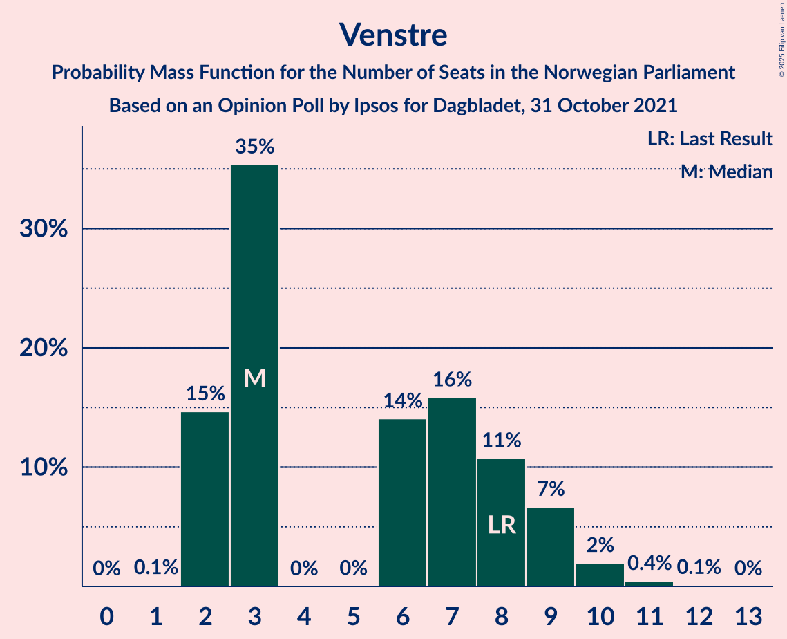
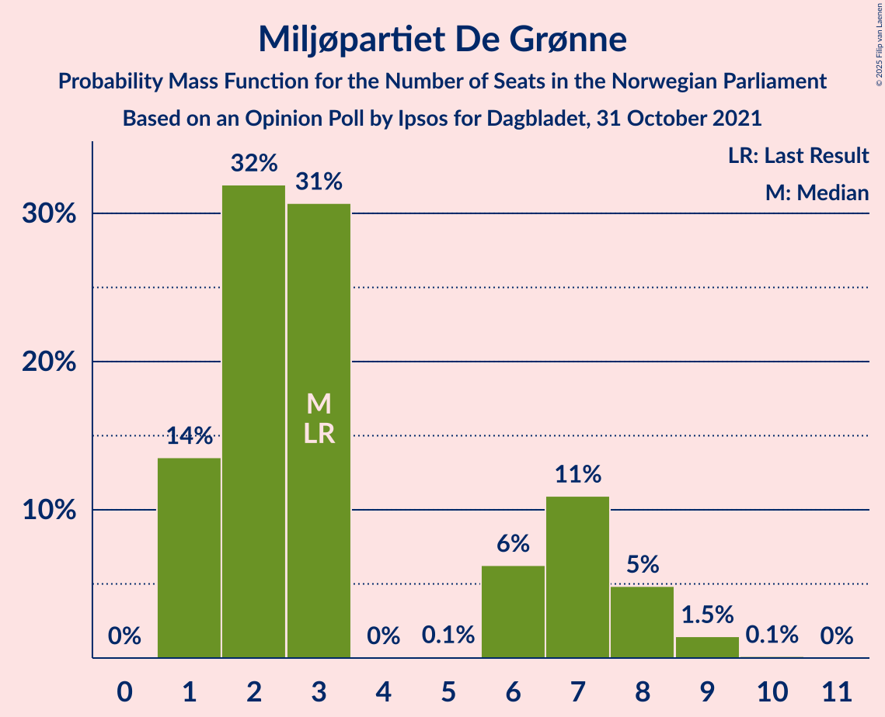

# Opinion Poll by Ipsos for Dagbladet, 31 October 2021

<a href="#voting-intentions">Voting Intentions</a> | <a href="#seats">Seats</a> | <a href="#coalitions">Coalitions</a> | <a href="#technical-information">Technical Information</a>

## Voting Intentions

### Confidence Intervals

| Party | Last Result | Poll Result | 80% Confidence Interval | 90% Confidence Interval | 95% Confidence Interval | 99% Confidence Interval |
|:-----:|:-----------:|:-----------:|:-----------------------:|:-----------------------:|:-----------------------:|:-----------------------:|
| Arbeiderpartiet | 26.2% | 25.7% | 23.7–27.8% |23.1–28.4% |22.6–29.0% |21.7–30.0% |
| Høyre | 20.4% | 20.8% | 18.9–22.8% |18.4–23.4% |18.0–23.9% |17.1–24.9% |
| Senterpartiet | 13.5% | 15.0% | 13.4–16.8% |13.0–17.4% |12.6–17.8% |11.9–18.7% |
| Fremskrittspartiet | 11.6% | 9.8% | 8.6–11.4% |8.2–11.8% |7.9–12.2% |7.3–13.0% |
| Sosialistisk Venstreparti | 7.6% | 8.3% | 7.1–9.8% |6.8–10.2% |6.5–10.6% |6.0–11.3% |
| Rødt | 4.7% | 4.9% | 4.0–6.1% |3.8–6.4% |3.6–6.7% |3.2–7.3% |
| Venstre | 4.6% | 4.1% | 3.3–5.2% |3.1–5.5% |2.9–5.8% |2.5–6.4% |
| Kristelig Folkeparti | 3.8% | 4.0% | 3.2–5.1% |3.0–5.4% |2.8–5.6% |2.4–6.2% |
| Miljøpartiet De Grønne | 3.9% | 3.4% | 2.7–4.5% |2.5–4.7% |2.3–5.0% |2.0–5.5% |

*Note:* The poll result column reflects the actual value used in the calculations. Published results may vary slightly, and in addition be rounded to fewer digits.

## Seats

### Confidence Intervals

| Party | Last Result | Median | 80% Confidence Interval | 90% Confidence Interval | 95% Confidence Interval | 99% Confidence Interval |
|:-----:|:-----------:|:------:|:-----------------------:|:-----------------------:|:-----------------------:|:-----------------------:|
| <a href="#arbeiderpartiet">Arbeiderpartiet</a> | 48 | 48 | 44–51 |42–52 |41–53 |39–55 |
| <a href="#høyre">Høyre</a> | 36 | 36 | 33–40 |31–41 |30–42 |29–44 |
| <a href="#senterpartiet">Senterpartiet</a> | 28 | 29 | 26–32 |24–33 |23–34 |21–35 |
| <a href="#fremskrittspartiet">Fremskrittspartiet</a> | 21 | 17 | 14–19 |13–20 |12–21 |11–23 |
| <a href="#sosialistisk-venstreparti">Sosialistisk Venstreparti</a> | 13 | 14 | 11–17 |10–18 |10–18 |9–20 |
| <a href="#rødt">Rødt</a> | 8 | 8 | 1–10 |1–11 |1–12 |1–13 |
| <a href="#venstre">Venstre</a> | 8 | 3 | 2–8 |2–9 |2–10 |2–11 |
| <a href="#kristelig-folkeparti">Kristelig Folkeparti</a> | 3 | 6 | 2–8 |2–9 |1–9 |1–10 |
| <a href="#miljøpartiet-de-grønne">Miljøpartiet De Grønne</a> | 3 | 3 | 1–7 |1–8 |1–8 |1–9 |

### Arbeiderpartiet

*For a full overview of the results for this party, see the [Arbeiderpartiet](party-arbeiderpartiet.html) page.*

| Number of Seats | Probability | Accumulated | Special Marks |
|:---------------:|:-----------:|:-----------:|:-------------:|
| 37 | 0% | 100% |  |
| 38 | 0.2% | 99.9% |  |
| 39 | 0.5% | 99.8% |  |
| 40 | 1.3% | 99.3% |  |
| 41 | 2% | 98% |  |
| 42 | 2% | 96% |  |
| 43 | 1.5% | 95% |  |
| 44 | 4% | 93% |  |
| 45 | 3% | 90% |  |
| 46 | 8% | 86% |  |
| 47 | 15% | 78% |  |
| 48 | 23% | 63% | Last Result, Median |
| 49 | 21% | 41% |  |
| 50 | 8% | 20% |  |
| 51 | 5% | 12% |  |
| 52 | 4% | 7% |  |
| 53 | 2% | 3% |  |
| 54 | 0.6% | 2% |  |
| 55 | 0.8% | 1.0% |  |
| 56 | 0.1% | 0.2% |  |
| 57 | 0% | 0.1% |  |
| 58 | 0% | 0.1% |  |
| 59 | 0% | 0% |  |

### Høyre

*For a full overview of the results for this party, see the [Høyre](party-høyre.html) page.*

| Number of Seats | Probability | Accumulated | Special Marks |
|:---------------:|:-----------:|:-----------:|:-------------:|
| 26 | 0% | 100% |  |
| 27 | 0% | 99.9% |  |
| 28 | 0.3% | 99.9% |  |
| 29 | 0.6% | 99.6% |  |
| 30 | 2% | 99.0% |  |
| 31 | 3% | 97% |  |
| 32 | 5% | 95% |  |
| 33 | 6% | 90% |  |
| 34 | 12% | 84% |  |
| 35 | 17% | 72% |  |
| 36 | 13% | 56% | Last Result, Median |
| 37 | 11% | 43% |  |
| 38 | 4% | 32% |  |
| 39 | 10% | 28% |  |
| 40 | 12% | 17% |  |
| 41 | 2% | 5% |  |
| 42 | 1.1% | 3% |  |
| 43 | 0.6% | 2% |  |
| 44 | 0.7% | 1.0% |  |
| 45 | 0.2% | 0.4% |  |
| 46 | 0.1% | 0.2% |  |
| 47 | 0% | 0.1% |  |
| 48 | 0% | 0% |  |

### Senterpartiet

*For a full overview of the results for this party, see the [Senterpartiet](party-senterpartiet.html) page.*

| Number of Seats | Probability | Accumulated | Special Marks |
|:---------------:|:-----------:|:-----------:|:-------------:|
| 19 | 0.1% | 100% |  |
| 20 | 0.2% | 99.9% |  |
| 21 | 0.6% | 99.7% |  |
| 22 | 1.0% | 99.1% |  |
| 23 | 1.4% | 98% |  |
| 24 | 3% | 97% |  |
| 25 | 4% | 94% |  |
| 26 | 3% | 90% |  |
| 27 | 4% | 87% |  |
| 28 | 11% | 84% | Last Result |
| 29 | 25% | 73% | Median |
| 30 | 14% | 47% |  |
| 31 | 14% | 34% |  |
| 32 | 10% | 20% |  |
| 33 | 6% | 10% |  |
| 34 | 2% | 4% |  |
| 35 | 2% | 2% |  |
| 36 | 0.2% | 0.2% |  |
| 37 | 0% | 0.1% |  |
| 38 | 0% | 0% |  |

### Fremskrittspartiet

*For a full overview of the results for this party, see the [Fremskrittspartiet](party-fremskrittspartiet.html) page.*

| Number of Seats | Probability | Accumulated | Special Marks |
|:---------------:|:-----------:|:-----------:|:-------------:|
| 9 | 0.1% | 100% |  |
| 10 | 0.1% | 99.9% |  |
| 11 | 1.2% | 99.8% |  |
| 12 | 1.4% | 98.6% |  |
| 13 | 5% | 97% |  |
| 14 | 5% | 92% |  |
| 15 | 6% | 88% |  |
| 16 | 25% | 82% |  |
| 17 | 28% | 56% | Median |
| 18 | 14% | 28% |  |
| 19 | 6% | 14% |  |
| 20 | 5% | 8% |  |
| 21 | 1.5% | 3% | Last Result |
| 22 | 1.2% | 2% |  |
| 23 | 0.4% | 0.7% |  |
| 24 | 0.1% | 0.2% |  |
| 25 | 0.1% | 0.1% |  |
| 26 | 0% | 0% |  |

### Sosialistisk Venstreparti

*For a full overview of the results for this party, see the [Sosialistisk Venstreparti](party-sosialistiskvenstreparti.html) page.*

| Number of Seats | Probability | Accumulated | Special Marks |
|:---------------:|:-----------:|:-----------:|:-------------:|
| 7 | 0.1% | 100% |  |
| 8 | 0.3% | 99.9% |  |
| 9 | 1.3% | 99.7% |  |
| 10 | 4% | 98% |  |
| 11 | 7% | 94% |  |
| 12 | 12% | 87% |  |
| 13 | 20% | 75% | Last Result |
| 14 | 17% | 55% | Median |
| 15 | 17% | 38% |  |
| 16 | 7% | 21% |  |
| 17 | 7% | 14% |  |
| 18 | 5% | 7% |  |
| 19 | 0.8% | 2% |  |
| 20 | 0.8% | 1.0% |  |
| 21 | 0.1% | 0.2% |  |
| 22 | 0.1% | 0.1% |  |
| 23 | 0% | 0% |  |

### Rødt

*For a full overview of the results for this party, see the [Rødt](party-rødt.html) page.*

| Number of Seats | Probability | Accumulated | Special Marks |
|:---------------:|:-----------:|:-----------:|:-------------:|
| 1 | 10% | 100% |  |
| 2 | 0.6% | 90% |  |
| 3 | 0.1% | 89% |  |
| 4 | 0% | 89% |  |
| 5 | 0.1% | 89% |  |
| 6 | 9% | 89% |  |
| 7 | 19% | 80% |  |
| 8 | 28% | 61% | Last Result, Median |
| 9 | 14% | 33% |  |
| 10 | 12% | 20% |  |
| 11 | 5% | 8% |  |
| 12 | 2% | 3% |  |
| 13 | 0.5% | 0.6% |  |
| 14 | 0.1% | 0.1% |  |
| 15 | 0% | 0% |  |

### Venstre

*For a full overview of the results for this party, see the [Venstre](party-venstre.html) page.*

| Number of Seats | Probability | Accumulated | Special Marks |
|:---------------:|:-----------:|:-----------:|:-------------:|
| 1 | 0.1% | 100% |  |
| 2 | 15% | 99.9% |  |
| 3 | 35% | 85% | Median |
| 4 | 0% | 50% |  |
| 5 | 0% | 50% |  |
| 6 | 14% | 50% |  |
| 7 | 16% | 36% |  |
| 8 | 11% | 20% | Last Result |
| 9 | 7% | 9% |  |
| 10 | 2% | 3% |  |
| 11 | 0.4% | 0.6% |  |
| 12 | 0.1% | 0.1% |  |
| 13 | 0% | 0% |  |

### Kristelig Folkeparti

*For a full overview of the results for this party, see the [Kristelig Folkeparti](party-kristeligfolkeparti.html) page.*

| Number of Seats | Probability | Accumulated | Special Marks |
|:---------------:|:-----------:|:-----------:|:-------------:|
| 0 | 0.1% | 100% |  |
| 1 | 3% | 99.9% |  |
| 2 | 18% | 97% |  |
| 3 | 22% | 80% | Last Result |
| 4 | 0% | 58% |  |
| 5 | 0.2% | 58% |  |
| 6 | 15% | 58% | Median |
| 7 | 14% | 43% |  |
| 8 | 22% | 29% |  |
| 9 | 5% | 7% |  |
| 10 | 1.2% | 2% |  |
| 11 | 0.2% | 0.4% |  |
| 12 | 0.1% | 0.2% |  |
| 13 | 0% | 0% |  |

### Miljøpartiet De Grønne

*For a full overview of the results for this party, see the [Miljøpartiet De Grønne](party-miljøpartietdegrønne.html) page.*

| Number of Seats | Probability | Accumulated | Special Marks |
|:---------------:|:-----------:|:-----------:|:-------------:|
| 1 | 14% | 100% |  |
| 2 | 32% | 86% |  |
| 3 | 31% | 55% | Last Result, Median |
| 4 | 0% | 24% |  |
| 5 | 0.1% | 24% |  |
| 6 | 6% | 24% |  |
| 7 | 11% | 17% |  |
| 8 | 5% | 6% |  |
| 9 | 1.5% | 2% |  |
| 10 | 0.1% | 0.2% |  |
| 11 | 0% | 0% |  |

## Coalitions

### Confidence Intervals

| Coalition | Last Result | Median | Majority? | 80% Confidence Interval | 90% Confidence Interval | 95% Confidence Interval | 99% Confidence Interval |
|:---------:|:-----------:|:------:|:---------:|:-----------------------:|:-----------------------:|:-----------------------:|:-----------------------:|
| Arbeiderpartiet – Senterpartiet – Sosialistisk Venstreparti – Rødt – Miljøpartiet De Grønne | 100 | 102 | 100% | 97–108 | 95–109 | 94–110 | 91–113 |
| Arbeiderpartiet – Senterpartiet – Sosialistisk Venstreparti – Kristelig Folkeparti – Miljøpartiet De Grønne | 95 | 100 | 100% | 95–105 | 93–107 | 91–108 | 89–110 |
| Arbeiderpartiet – Senterpartiet – Sosialistisk Venstreparti – Rødt | 97 | 99 | 100% | 94–104 | 91–105 | 90–107 | 87–109 |
| Arbeiderpartiet – Senterpartiet – Sosialistisk Venstreparti – Miljøpartiet De Grønne | 92 | 94 | 99.4% | 90–100 | 88–101 | 87–102 | 84–104 |
| Høyre – Senterpartiet – Fremskrittspartiet – Venstre – Kristelig Folkeparti | 96 | 92 | 97% | 88–98 | 86–101 | 84–101 | 82–105 |
| Arbeiderpartiet – Senterpartiet – Sosialistisk Venstreparti | 89 | 91 | 96% | 87–96 | 85–97 | 84–98 | 81–101 |
| Arbeiderpartiet – Senterpartiet – Kristelig Folkeparti – Miljøpartiet De Grønne | 82 | 87 | 67% | 80–91 | 79–92 | 78–93 | 74–96 |
| Arbeiderpartiet – Senterpartiet – Kristelig Folkeparti | 79 | 83 | 33% | 78–87 | 76–89 | 74–90 | 71–93 |
| Arbeiderpartiet – Senterpartiet | 76 | 78 | 2% | 73–81 | 71–82 | 70–84 | 67–86 |
| Arbeiderpartiet – Sosialistisk Venstreparti – Rødt – Miljøpartiet De Grønne | 72 | 73 | 0.3% | 67–78 | 65–80 | 64–81 | 61–83 |
| Høyre – Fremskrittspartiet – Venstre – Kristelig Folkeparti – Miljøpartiet De Grønne | 71 | 66 | 0% | 61–72 | 59–74 | 58–75 | 56–78 |
| Høyre – Fremskrittspartiet – Venstre – Kristelig Folkeparti | 68 | 63 | 0% | 58–69 | 56–70 | 55–72 | 52–75 |
| Arbeiderpartiet – Sosialistisk Venstreparti | 61 | 62 | 0% | 58–65 | 56–67 | 54–68 | 52–71 |
| Høyre – Fremskrittspartiet – Venstre | 65 | 58 | 0% | 53–63 | 52–65 | 50–67 | 49–70 |
| Høyre – Fremskrittspartiet | 57 | 53 | 0% | 49–57 | 47–59 | 46–60 | 44–63 |
| Høyre – Venstre – Kristelig Folkeparti | 47 | 47 | 0% | 41–51 | 40–53 | 39–54 | 37–56 |
| Senterpartiet – Venstre – Kristelig Folkeparti | 39 | 40 | 0% | 35–45 | 34–47 | 31–48 | 28–50 |

### Arbeiderpartiet – Senterpartiet – Sosialistisk Venstreparti – Rødt – Miljøpartiet De Grønne

| Number of Seats | Probability | Accumulated | Special Marks |
|:---------------:|:-----------:|:-----------:|:-------------:|
| 88 | 0% | 100% |  |
| 89 | 0.1% | 99.9% |  |
| 90 | 0.2% | 99.8% |  |
| 91 | 0.2% | 99.6% |  |
| 92 | 0.7% | 99.4% |  |
| 93 | 0.9% | 98.7% |  |
| 94 | 2% | 98% |  |
| 95 | 1.3% | 96% |  |
| 96 | 4% | 95% |  |
| 97 | 4% | 91% |  |
| 98 | 4% | 87% |  |
| 99 | 7% | 83% |  |
| 100 | 12% | 76% | Last Result |
| 101 | 5% | 64% |  |
| 102 | 17% | 58% | Median |
| 103 | 9% | 42% |  |
| 104 | 7% | 33% |  |
| 105 | 6% | 26% |  |
| 106 | 4% | 19% |  |
| 107 | 3% | 15% |  |
| 108 | 5% | 12% |  |
| 109 | 3% | 7% |  |
| 110 | 2% | 4% |  |
| 111 | 0.8% | 2% |  |
| 112 | 0.5% | 1.2% |  |
| 113 | 0.3% | 0.7% |  |
| 114 | 0.1% | 0.4% |  |
| 115 | 0.2% | 0.3% |  |
| 116 | 0.1% | 0.1% |  |
| 117 | 0% | 0% |  |

### Arbeiderpartiet – Senterpartiet – Sosialistisk Venstreparti – Kristelig Folkeparti – Miljøpartiet De Grønne

| Number of Seats | Probability | Accumulated | Special Marks |
|:---------------:|:-----------:|:-----------:|:-------------:|
| 86 | 0.1% | 100% |  |
| 87 | 0.2% | 99.9% |  |
| 88 | 0.1% | 99.7% |  |
| 89 | 0.5% | 99.6% |  |
| 90 | 0.4% | 99.1% |  |
| 91 | 2% | 98.7% |  |
| 92 | 1.3% | 97% |  |
| 93 | 1.4% | 96% |  |
| 94 | 4% | 94% |  |
| 95 | 5% | 90% | Last Result |
| 96 | 8% | 86% |  |
| 97 | 7% | 78% |  |
| 98 | 5% | 71% |  |
| 99 | 9% | 66% |  |
| 100 | 14% | 56% | Median |
| 101 | 5% | 43% |  |
| 102 | 15% | 37% |  |
| 103 | 4% | 22% |  |
| 104 | 4% | 18% |  |
| 105 | 6% | 14% |  |
| 106 | 2% | 8% |  |
| 107 | 3% | 6% |  |
| 108 | 2% | 3% |  |
| 109 | 1.0% | 2% |  |
| 110 | 0.2% | 0.6% |  |
| 111 | 0.2% | 0.4% |  |
| 112 | 0.1% | 0.2% |  |
| 113 | 0.1% | 0.1% |  |
| 114 | 0% | 0% |  |

### Arbeiderpartiet – Senterpartiet – Sosialistisk Venstreparti – Rødt

| Number of Seats | Probability | Accumulated | Special Marks |
|:---------------:|:-----------:|:-----------:|:-------------:|
| 85 | 0.1% | 100% | Majority |
| 86 | 0.1% | 99.9% |  |
| 87 | 0.3% | 99.8% |  |
| 88 | 0.5% | 99.5% |  |
| 89 | 0.8% | 99.0% |  |
| 90 | 1.4% | 98% |  |
| 91 | 2% | 97% |  |
| 92 | 2% | 95% |  |
| 93 | 2% | 93% |  |
| 94 | 6% | 91% |  |
| 95 | 4% | 86% |  |
| 96 | 7% | 81% |  |
| 97 | 18% | 75% | Last Result |
| 98 | 3% | 56% |  |
| 99 | 6% | 53% | Median |
| 100 | 16% | 46% |  |
| 101 | 8% | 30% |  |
| 102 | 7% | 22% |  |
| 103 | 2% | 15% |  |
| 104 | 4% | 13% |  |
| 105 | 4% | 8% |  |
| 106 | 1.4% | 5% |  |
| 107 | 2% | 3% |  |
| 108 | 0.4% | 2% |  |
| 109 | 0.8% | 1.1% |  |
| 110 | 0.2% | 0.3% |  |
| 111 | 0% | 0.1% |  |
| 112 | 0% | 0% |  |

### Arbeiderpartiet – Senterpartiet – Sosialistisk Venstreparti – Miljøpartiet De Grønne

| Number of Seats | Probability | Accumulated | Special Marks |
|:---------------:|:-----------:|:-----------:|:-------------:|
| 81 | 0% | 100% |  |
| 82 | 0.1% | 99.9% |  |
| 83 | 0.2% | 99.9% |  |
| 84 | 0.3% | 99.7% |  |
| 85 | 0.4% | 99.4% | Majority |
| 86 | 0.7% | 99.0% |  |
| 87 | 1.4% | 98% |  |
| 88 | 3% | 97% |  |
| 89 | 3% | 94% |  |
| 90 | 4% | 91% |  |
| 91 | 7% | 87% |  |
| 92 | 7% | 80% | Last Result |
| 93 | 7% | 73% |  |
| 94 | 23% | 66% | Median |
| 95 | 8% | 44% |  |
| 96 | 6% | 35% |  |
| 97 | 10% | 30% |  |
| 98 | 3% | 19% |  |
| 99 | 6% | 16% |  |
| 100 | 4% | 10% |  |
| 101 | 3% | 6% |  |
| 102 | 2% | 4% |  |
| 103 | 0.4% | 2% |  |
| 104 | 0.8% | 1.3% |  |
| 105 | 0.1% | 0.4% |  |
| 106 | 0.1% | 0.3% |  |
| 107 | 0.1% | 0.2% |  |
| 108 | 0% | 0.1% |  |
| 109 | 0% | 0.1% |  |
| 110 | 0% | 0% |  |

### Høyre – Senterpartiet – Fremskrittspartiet – Venstre – Kristelig Folkeparti

| Number of Seats | Probability | Accumulated | Special Marks |
|:---------------:|:-----------:|:-----------:|:-------------:|
| 79 | 0% | 100% |  |
| 80 | 0.2% | 99.9% |  |
| 81 | 0.2% | 99.7% |  |
| 82 | 0.7% | 99.6% |  |
| 83 | 0.5% | 98.9% |  |
| 84 | 1.1% | 98% |  |
| 85 | 2% | 97% | Majority |
| 86 | 2% | 95% |  |
| 87 | 3% | 94% |  |
| 88 | 10% | 90% |  |
| 89 | 4% | 81% |  |
| 90 | 8% | 76% |  |
| 91 | 8% | 69% | Median |
| 92 | 13% | 60% |  |
| 93 | 5% | 47% |  |
| 94 | 7% | 42% |  |
| 95 | 6% | 35% |  |
| 96 | 12% | 29% | Last Result |
| 97 | 6% | 17% |  |
| 98 | 3% | 12% |  |
| 99 | 3% | 9% |  |
| 100 | 1.0% | 6% |  |
| 101 | 3% | 5% |  |
| 102 | 0.9% | 2% |  |
| 103 | 0.4% | 2% |  |
| 104 | 0.5% | 1.1% |  |
| 105 | 0.4% | 0.6% |  |
| 106 | 0.1% | 0.2% |  |
| 107 | 0% | 0.1% |  |
| 108 | 0.1% | 0.1% |  |
| 109 | 0% | 0% |  |

### Arbeiderpartiet – Senterpartiet – Sosialistisk Venstreparti

| Number of Seats | Probability | Accumulated | Special Marks |
|:---------------:|:-----------:|:-----------:|:-------------:|
| 79 | 0.1% | 100% |  |
| 80 | 0.2% | 99.9% |  |
| 81 | 0.4% | 99.6% |  |
| 82 | 0.9% | 99.3% |  |
| 83 | 0.7% | 98% |  |
| 84 | 2% | 98% |  |
| 85 | 2% | 96% | Majority |
| 86 | 3% | 94% |  |
| 87 | 5% | 92% |  |
| 88 | 6% | 87% |  |
| 89 | 9% | 81% | Last Result |
| 90 | 10% | 72% |  |
| 91 | 15% | 62% | Median |
| 92 | 16% | 47% |  |
| 93 | 8% | 31% |  |
| 94 | 10% | 22% |  |
| 95 | 2% | 12% |  |
| 96 | 4% | 10% |  |
| 97 | 3% | 7% |  |
| 98 | 2% | 4% |  |
| 99 | 0.8% | 2% |  |
| 100 | 0.6% | 1.4% |  |
| 101 | 0.6% | 0.8% |  |
| 102 | 0% | 0.2% |  |
| 103 | 0% | 0.2% |  |
| 104 | 0% | 0.1% |  |
| 105 | 0.1% | 0.1% |  |
| 106 | 0% | 0% |  |

### Arbeiderpartiet – Senterpartiet – Kristelig Folkeparti – Miljøpartiet De Grønne

| Number of Seats | Probability | Accumulated | Special Marks |
|:---------------:|:-----------:|:-----------:|:-------------:|
| 71 | 0.1% | 100% |  |
| 72 | 0.2% | 99.9% |  |
| 73 | 0.2% | 99.7% |  |
| 74 | 0.2% | 99.6% |  |
| 75 | 0.4% | 99.4% |  |
| 76 | 0.5% | 98.9% |  |
| 77 | 0.8% | 98% |  |
| 78 | 0.8% | 98% |  |
| 79 | 4% | 97% |  |
| 80 | 4% | 93% |  |
| 81 | 4% | 89% |  |
| 82 | 6% | 85% | Last Result |
| 83 | 6% | 79% |  |
| 84 | 6% | 73% |  |
| 85 | 5% | 67% | Majority |
| 86 | 10% | 62% | Median |
| 87 | 21% | 52% |  |
| 88 | 6% | 31% |  |
| 89 | 6% | 25% |  |
| 90 | 8% | 19% |  |
| 91 | 3% | 11% |  |
| 92 | 3% | 7% |  |
| 93 | 1.2% | 4% |  |
| 94 | 0.9% | 2% |  |
| 95 | 0.7% | 1.4% |  |
| 96 | 0.4% | 0.8% |  |
| 97 | 0.1% | 0.4% |  |
| 98 | 0.2% | 0.3% |  |
| 99 | 0% | 0.1% |  |
| 100 | 0% | 0% |  |

### Arbeiderpartiet – Senterpartiet – Kristelig Folkeparti

| Number of Seats | Probability | Accumulated | Special Marks |
|:---------------:|:-----------:|:-----------:|:-------------:|
| 68 | 0% | 100% |  |
| 69 | 0.1% | 99.9% |  |
| 70 | 0.2% | 99.8% |  |
| 71 | 0.2% | 99.6% |  |
| 72 | 0.4% | 99.5% |  |
| 73 | 1.0% | 99.1% |  |
| 74 | 1.0% | 98% |  |
| 75 | 1.0% | 97% |  |
| 76 | 2% | 96% |  |
| 77 | 4% | 94% |  |
| 78 | 4% | 90% |  |
| 79 | 7% | 86% | Last Result |
| 80 | 12% | 79% |  |
| 81 | 7% | 67% |  |
| 82 | 6% | 61% |  |
| 83 | 7% | 55% | Median |
| 84 | 15% | 48% |  |
| 85 | 13% | 33% | Majority |
| 86 | 6% | 20% |  |
| 87 | 6% | 14% |  |
| 88 | 3% | 8% |  |
| 89 | 3% | 5% |  |
| 90 | 1.2% | 3% |  |
| 91 | 0.6% | 1.4% |  |
| 92 | 0.2% | 0.8% |  |
| 93 | 0.3% | 0.6% |  |
| 94 | 0.2% | 0.3% |  |
| 95 | 0% | 0.1% |  |
| 96 | 0% | 0% |  |

### Arbeiderpartiet – Senterpartiet

| Number of Seats | Probability | Accumulated | Special Marks |
|:---------------:|:-----------:|:-----------:|:-------------:|
| 65 | 0.1% | 100% |  |
| 66 | 0.2% | 99.8% |  |
| 67 | 0.3% | 99.6% |  |
| 68 | 0.3% | 99.3% |  |
| 69 | 0.6% | 99.0% |  |
| 70 | 2% | 98% |  |
| 71 | 2% | 96% |  |
| 72 | 3% | 95% |  |
| 73 | 3% | 92% |  |
| 74 | 6% | 89% |  |
| 75 | 6% | 84% |  |
| 76 | 6% | 78% | Last Result |
| 77 | 20% | 72% | Median |
| 78 | 26% | 51% |  |
| 79 | 9% | 26% |  |
| 80 | 5% | 17% |  |
| 81 | 5% | 12% |  |
| 82 | 3% | 7% |  |
| 83 | 1.1% | 4% |  |
| 84 | 1.0% | 3% |  |
| 85 | 1.0% | 2% | Majority |
| 86 | 0.4% | 0.7% |  |
| 87 | 0.1% | 0.3% |  |
| 88 | 0.2% | 0.2% |  |
| 89 | 0% | 0% |  |

### Arbeiderpartiet – Sosialistisk Venstreparti – Rødt – Miljøpartiet De Grønne

| Number of Seats | Probability | Accumulated | Special Marks |
|:---------------:|:-----------:|:-----------:|:-------------:|
| 58 | 0% | 100% |  |
| 59 | 0.1% | 99.9% |  |
| 60 | 0.1% | 99.8% |  |
| 61 | 0.5% | 99.8% |  |
| 62 | 0.3% | 99.2% |  |
| 63 | 0.7% | 98.9% |  |
| 64 | 0.9% | 98% |  |
| 65 | 3% | 97% |  |
| 66 | 3% | 95% |  |
| 67 | 2% | 92% |  |
| 68 | 5% | 90% |  |
| 69 | 3% | 84% |  |
| 70 | 5% | 81% |  |
| 71 | 13% | 76% |  |
| 72 | 10% | 63% | Last Result |
| 73 | 12% | 53% | Median |
| 74 | 12% | 40% |  |
| 75 | 5% | 28% |  |
| 76 | 5% | 23% |  |
| 77 | 6% | 18% |  |
| 78 | 3% | 12% |  |
| 79 | 3% | 9% |  |
| 80 | 3% | 6% |  |
| 81 | 2% | 3% |  |
| 82 | 0.7% | 1.4% |  |
| 83 | 0.2% | 0.7% |  |
| 84 | 0.2% | 0.5% |  |
| 85 | 0.1% | 0.3% | Majority |
| 86 | 0.1% | 0.2% |  |
| 87 | 0.1% | 0.1% |  |
| 88 | 0% | 0% |  |

### Høyre – Fremskrittspartiet – Venstre – Kristelig Folkeparti – Miljøpartiet De Grønne

| Number of Seats | Probability | Accumulated | Special Marks |
|:---------------:|:-----------:|:-----------:|:-------------:|
| 54 | 0% | 100% |  |
| 55 | 0.1% | 99.9% |  |
| 56 | 0.8% | 99.8% |  |
| 57 | 0.8% | 99.0% |  |
| 58 | 1.2% | 98% |  |
| 59 | 3% | 97% |  |
| 60 | 3% | 94% |  |
| 61 | 2% | 91% |  |
| 62 | 6% | 89% |  |
| 63 | 4% | 83% |  |
| 64 | 5% | 79% |  |
| 65 | 10% | 75% | Median |
| 66 | 15% | 65% |  |
| 67 | 8% | 50% |  |
| 68 | 8% | 42% |  |
| 69 | 14% | 34% |  |
| 70 | 5% | 20% |  |
| 71 | 3% | 15% | Last Result |
| 72 | 4% | 12% |  |
| 73 | 2% | 8% |  |
| 74 | 2% | 6% |  |
| 75 | 2% | 4% |  |
| 76 | 0.9% | 2% |  |
| 77 | 0.4% | 1.3% |  |
| 78 | 0.5% | 0.9% |  |
| 79 | 0.2% | 0.4% |  |
| 80 | 0.1% | 0.2% |  |
| 81 | 0.1% | 0.1% |  |
| 82 | 0% | 0% |  |

### Høyre – Fremskrittspartiet – Venstre – Kristelig Folkeparti

| Number of Seats | Probability | Accumulated | Special Marks |
|:---------------:|:-----------:|:-----------:|:-------------:|
| 50 | 0% | 100% |  |
| 51 | 0% | 99.9% |  |
| 52 | 0.4% | 99.9% |  |
| 53 | 0.9% | 99.5% |  |
| 54 | 0.6% | 98.6% |  |
| 55 | 2% | 98% |  |
| 56 | 4% | 96% |  |
| 57 | 1.3% | 93% |  |
| 58 | 6% | 91% |  |
| 59 | 6% | 85% |  |
| 60 | 8% | 79% |  |
| 61 | 6% | 71% |  |
| 62 | 5% | 65% | Median |
| 63 | 14% | 61% |  |
| 64 | 7% | 47% |  |
| 65 | 7% | 40% |  |
| 66 | 7% | 33% |  |
| 67 | 12% | 25% |  |
| 68 | 4% | 14% | Last Result |
| 69 | 3% | 10% |  |
| 70 | 2% | 7% |  |
| 71 | 1.5% | 5% |  |
| 72 | 1.2% | 3% |  |
| 73 | 1.2% | 2% |  |
| 74 | 0.4% | 1.0% |  |
| 75 | 0.4% | 0.6% |  |
| 76 | 0.1% | 0.2% |  |
| 77 | 0.1% | 0.1% |  |
| 78 | 0% | 0.1% |  |
| 79 | 0% | 0% |  |

### Arbeiderpartiet – Sosialistisk Venstreparti

| Number of Seats | Probability | Accumulated | Special Marks |
|:---------------:|:-----------:|:-----------:|:-------------:|
| 50 | 0.1% | 100% |  |
| 51 | 0.2% | 99.9% |  |
| 52 | 0.4% | 99.7% |  |
| 53 | 1.2% | 99.3% |  |
| 54 | 1.1% | 98% |  |
| 55 | 1.4% | 97% |  |
| 56 | 2% | 96% |  |
| 57 | 3% | 94% |  |
| 58 | 5% | 91% |  |
| 59 | 4% | 87% |  |
| 60 | 12% | 82% |  |
| 61 | 11% | 70% | Last Result |
| 62 | 19% | 59% | Median |
| 63 | 17% | 40% |  |
| 64 | 7% | 23% |  |
| 65 | 7% | 16% |  |
| 66 | 3% | 9% |  |
| 67 | 2% | 6% |  |
| 68 | 2% | 4% |  |
| 69 | 0.7% | 2% |  |
| 70 | 0.5% | 2% |  |
| 71 | 0.9% | 1.2% |  |
| 72 | 0.2% | 0.3% |  |
| 73 | 0% | 0.1% |  |
| 74 | 0% | 0.1% |  |
| 75 | 0% | 0% |  |

### Høyre – Fremskrittspartiet – Venstre

| Number of Seats | Probability | Accumulated | Special Marks |
|:---------------:|:-----------:|:-----------:|:-------------:|
| 46 | 0% | 100% |  |
| 47 | 0.1% | 99.9% |  |
| 48 | 0.3% | 99.9% |  |
| 49 | 0.9% | 99.6% |  |
| 50 | 2% | 98.7% |  |
| 51 | 1.4% | 97% |  |
| 52 | 3% | 96% |  |
| 53 | 5% | 92% |  |
| 54 | 4% | 87% |  |
| 55 | 4% | 83% |  |
| 56 | 11% | 79% | Median |
| 57 | 12% | 68% |  |
| 58 | 16% | 56% |  |
| 59 | 12% | 41% |  |
| 60 | 8% | 28% |  |
| 61 | 5% | 20% |  |
| 62 | 4% | 15% |  |
| 63 | 3% | 11% |  |
| 64 | 2% | 8% |  |
| 65 | 2% | 5% | Last Result |
| 66 | 0.8% | 4% |  |
| 67 | 1.2% | 3% |  |
| 68 | 0.3% | 2% |  |
| 69 | 0.7% | 2% |  |
| 70 | 0.4% | 0.8% |  |
| 71 | 0.2% | 0.3% |  |
| 72 | 0% | 0.2% |  |
| 73 | 0.1% | 0.1% |  |
| 74 | 0% | 0% |  |

### Høyre – Fremskrittspartiet

| Number of Seats | Probability | Accumulated | Special Marks |
|:---------------:|:-----------:|:-----------:|:-------------:|
| 41 | 0% | 100% |  |
| 42 | 0.1% | 99.9% |  |
| 43 | 0.2% | 99.9% |  |
| 44 | 0.4% | 99.7% |  |
| 45 | 0.9% | 99.2% |  |
| 46 | 2% | 98% |  |
| 47 | 3% | 97% |  |
| 48 | 2% | 94% |  |
| 49 | 7% | 92% |  |
| 50 | 8% | 85% |  |
| 51 | 18% | 77% |  |
| 52 | 7% | 59% |  |
| 53 | 10% | 52% | Median |
| 54 | 7% | 42% |  |
| 55 | 8% | 35% |  |
| 56 | 14% | 27% |  |
| 57 | 4% | 13% | Last Result |
| 58 | 3% | 9% |  |
| 59 | 3% | 6% |  |
| 60 | 0.8% | 3% |  |
| 61 | 1.4% | 2% |  |
| 62 | 0.5% | 1.1% |  |
| 63 | 0.3% | 0.6% |  |
| 64 | 0.2% | 0.4% |  |
| 65 | 0.1% | 0.2% |  |
| 66 | 0.1% | 0.1% |  |
| 67 | 0% | 0% |  |

### Høyre – Venstre – Kristelig Folkeparti

| Number of Seats | Probability | Accumulated | Special Marks |
|:---------------:|:-----------:|:-----------:|:-------------:|
| 35 | 0.2% | 100% |  |
| 36 | 0.2% | 99.7% |  |
| 37 | 0.5% | 99.6% |  |
| 38 | 0.6% | 99.0% |  |
| 39 | 2% | 98% |  |
| 40 | 4% | 97% |  |
| 41 | 6% | 93% |  |
| 42 | 5% | 87% |  |
| 43 | 8% | 83% |  |
| 44 | 7% | 75% |  |
| 45 | 5% | 68% | Median |
| 46 | 11% | 63% |  |
| 47 | 13% | 51% | Last Result |
| 48 | 3% | 38% |  |
| 49 | 9% | 35% |  |
| 50 | 4% | 26% |  |
| 51 | 13% | 22% |  |
| 52 | 3% | 9% |  |
| 53 | 3% | 6% |  |
| 54 | 1.4% | 4% |  |
| 55 | 1.0% | 2% |  |
| 56 | 0.9% | 1.4% |  |
| 57 | 0.2% | 0.4% |  |
| 58 | 0.1% | 0.3% |  |
| 59 | 0.1% | 0.1% |  |
| 60 | 0% | 0% |  |

### Senterpartiet – Venstre – Kristelig Folkeparti

| Number of Seats | Probability | Accumulated | Special Marks |
|:---------------:|:-----------:|:-----------:|:-------------:|
| 25 | 0.1% | 100% |  |
| 26 | 0.2% | 99.9% |  |
| 27 | 0.1% | 99.7% |  |
| 28 | 0.2% | 99.7% |  |
| 29 | 0.5% | 99.4% |  |
| 30 | 1.2% | 98.9% |  |
| 31 | 0.4% | 98% |  |
| 32 | 1.0% | 97% |  |
| 33 | 0.8% | 96% |  |
| 34 | 1.1% | 96% |  |
| 35 | 7% | 94% |  |
| 36 | 9% | 88% |  |
| 37 | 6% | 79% |  |
| 38 | 10% | 73% | Median |
| 39 | 11% | 63% | Last Result |
| 40 | 13% | 53% |  |
| 41 | 14% | 39% |  |
| 42 | 4% | 26% |  |
| 43 | 6% | 22% |  |
| 44 | 3% | 16% |  |
| 45 | 5% | 13% |  |
| 46 | 2% | 9% |  |
| 47 | 3% | 7% |  |
| 48 | 1.1% | 3% |  |
| 49 | 0.7% | 2% |  |
| 50 | 1.0% | 1.3% |  |
| 51 | 0.1% | 0.2% |  |
| 52 | 0.1% | 0.1% |  |
| 53 | 0% | 0% |  |

## Technical Information

### Opinion Poll

+ **Polling firm:** Ipsos
+ **Commissioner(s):** Dagbladet
+ **Fieldwork period:** 31 October 2021

### Calculations

+ **Sample size:** 732
+ **Simulations done:** 1,048,576
+ **Error estimate:** 2.01%

