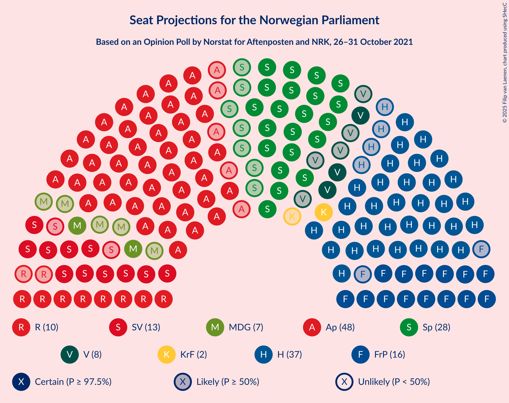

# Opinion Poll by Norstat for Aftenposten and NRK, 26–31 October 2021

<a href="#voting-intentions">Voting Intentions</a> | <a href="#seats">Seats</a> | <a href="#coalitions">Coalitions</a> | <a href="#technical-information">Technical Information</a>

## Voting Intentions

### Confidence Intervals

| Party | Last Result | Poll Result | 80% Confidence Interval | 90% Confidence Interval | 95% Confidence Interval | 99% Confidence Interval |
|:-----:|:-----------:|:-----------:|:-----------------------:|:-----------------------:|:-----------------------:|:-----------------------:|
| Arbeiderpartiet | 26.2% | 26.8% | 25.0–28.7% |24.5–29.3% |24.1–29.7% |23.3–30.7% |
| Høyre | 20.4% | 21.2% | 19.5–23.0% |19.1–23.5% |18.7–23.9% |17.9–24.8% |
| Senterpartiet | 13.5% | 14.0% | 12.7–15.6% |12.3–16.0% |12.0–16.4% |11.4–17.2% |
| Fremskrittspartiet | 11.6% | 9.7% | 8.6–11.1% |8.3–11.5% |8.0–11.8% |7.5–12.5% |
| Sosialistisk Venstreparti | 7.6% | 8.2% | 7.1–9.4% |6.8–9.8% |6.6–10.1% |6.1–10.7% |
| Rødt | 4.7% | 5.9% | 5.0–7.0% |4.8–7.3% |4.5–7.6% |4.2–8.1% |
| Venstre | 4.6% | 4.4% | 3.7–5.4% |3.4–5.7% |3.3–5.9% |2.9–6.4% |
| Miljøpartiet De Grønne | 3.9% | 4.2% | 3.5–5.2% |3.3–5.4% |3.1–5.7% |2.8–6.2% |
| Kristelig Folkeparti | 3.8% | 3.0% | 2.4–3.9% |2.3–4.1% |2.1–4.3% |1.9–4.8% |

*Note:* The poll result column reflects the actual value used in the calculations. Published results may vary slightly, and in addition be rounded to fewer digits.

## Seats

### Confidence Intervals

| Party | Last Result | Median | 80% Confidence Interval | 90% Confidence Interval | 95% Confidence Interval | 99% Confidence Interval |
|:-----:|:-----------:|:------:|:-----------------------:|:-----------------------:|:-----------------------:|:-----------------------:|
| <a href="#arbeiderpartiet">Arbeiderpartiet</a> | 48 | 48 | 45–52 |44–53 |43–55 |42–57 |
| <a href="#høyre">Høyre</a> | 36 | 37 | 33–40 |33–41 |32–43 |30–44 |
| <a href="#senterpartiet">Senterpartiet</a> | 28 | 28 | 23–31 |22–32 |21–32 |20–33 |
| <a href="#fremskrittspartiet">Fremskrittspartiet</a> | 21 | 17 | 15–19 |14–20 |14–20 |12–22 |
| <a href="#sosialistisk-venstreparti">Sosialistisk Venstreparti</a> | 13 | 14 | 12–16 |11–17 |11–18 |10–19 |
| <a href="#rødt">Rødt</a> | 8 | 10 | 9–12 |8–13 |8–13 |7–14 |
| <a href="#venstre">Venstre</a> | 8 | 8 | 3–9 |2–9 |2–10 |2–11 |
| <a href="#miljøpartiet-de-grønne">Miljøpartiet De Grønne</a> | 3 | 7 | 2–9 |2–9 |2–9 |1–11 |
| <a href="#kristelig-folkeparti">Kristelig Folkeparti</a> | 3 | 2 | 1–3 |1–6 |0–7 |0–8 |

### Arbeiderpartiet

*For a full overview of the results for this party, see the [Arbeiderpartiet](party-arbeiderpartiet.html) page.*

| Number of Seats | Probability | Accumulated | Special Marks |
|:---------------:|:-----------:|:-----------:|:-------------:|
| 39 | 0% | 100% |  |
| 40 | 0% | 99.9% |  |
| 41 | 0.1% | 99.9% |  |
| 42 | 1.3% | 99.8% |  |
| 43 | 1.1% | 98.5% |  |
| 44 | 3% | 97% |  |
| 45 | 6% | 95% |  |
| 46 | 13% | 89% |  |
| 47 | 10% | 76% |  |
| 48 | 19% | 66% | Last Result, Median |
| 49 | 19% | 47% |  |
| 50 | 8% | 28% |  |
| 51 | 9% | 19% |  |
| 52 | 5% | 11% |  |
| 53 | 2% | 6% |  |
| 54 | 1.0% | 4% |  |
| 55 | 2% | 3% |  |
| 56 | 0.4% | 1.1% |  |
| 57 | 0.4% | 0.6% |  |
| 58 | 0.1% | 0.2% |  |
| 59 | 0.1% | 0.1% |  |
| 60 | 0% | 0% |  |

### Høyre

*For a full overview of the results for this party, see the [Høyre](party-høyre.html) page.*

| Number of Seats | Probability | Accumulated | Special Marks |
|:---------------:|:-----------:|:-----------:|:-------------:|
| 29 | 0.1% | 100% |  |
| 30 | 0.4% | 99.9% |  |
| 31 | 2% | 99.5% |  |
| 32 | 2% | 98% |  |
| 33 | 6% | 95% |  |
| 34 | 4% | 89% |  |
| 35 | 13% | 85% |  |
| 36 | 10% | 71% | Last Result |
| 37 | 14% | 62% | Median |
| 38 | 20% | 48% |  |
| 39 | 17% | 28% |  |
| 40 | 4% | 10% |  |
| 41 | 2% | 7% |  |
| 42 | 2% | 5% |  |
| 43 | 2% | 3% |  |
| 44 | 0.4% | 0.7% |  |
| 45 | 0.2% | 0.3% |  |
| 46 | 0% | 0.1% |  |
| 47 | 0% | 0% |  |

### Senterpartiet

*For a full overview of the results for this party, see the [Senterpartiet](party-senterpartiet.html) page.*

| Number of Seats | Probability | Accumulated | Special Marks |
|:---------------:|:-----------:|:-----------:|:-------------:|
| 18 | 0.1% | 100% |  |
| 19 | 0.3% | 99.9% |  |
| 20 | 0.7% | 99.6% |  |
| 21 | 2% | 98.9% |  |
| 22 | 4% | 96% |  |
| 23 | 5% | 93% |  |
| 24 | 6% | 88% |  |
| 25 | 8% | 81% |  |
| 26 | 4% | 73% |  |
| 27 | 8% | 69% |  |
| 28 | 24% | 61% | Last Result, Median |
| 29 | 14% | 37% |  |
| 30 | 11% | 23% |  |
| 31 | 6% | 12% |  |
| 32 | 5% | 6% |  |
| 33 | 0.8% | 1.2% |  |
| 34 | 0.2% | 0.3% |  |
| 35 | 0.1% | 0.1% |  |
| 36 | 0% | 0% |  |

### Fremskrittspartiet

*For a full overview of the results for this party, see the [Fremskrittspartiet](party-fremskrittspartiet.html) page.*

| Number of Seats | Probability | Accumulated | Special Marks |
|:---------------:|:-----------:|:-----------:|:-------------:|
| 11 | 0.2% | 100% |  |
| 12 | 0.9% | 99.8% |  |
| 13 | 1.4% | 99.0% |  |
| 14 | 3% | 98% |  |
| 15 | 13% | 95% |  |
| 16 | 19% | 82% |  |
| 17 | 20% | 63% | Median |
| 18 | 22% | 43% |  |
| 19 | 14% | 20% |  |
| 20 | 4% | 7% |  |
| 21 | 1.3% | 2% | Last Result |
| 22 | 0.7% | 0.9% |  |
| 23 | 0.1% | 0.2% |  |
| 24 | 0% | 0% |  |

### Sosialistisk Venstreparti

*For a full overview of the results for this party, see the [Sosialistisk Venstreparti](party-sosialistiskvenstreparti.html) page.*

| Number of Seats | Probability | Accumulated | Special Marks |
|:---------------:|:-----------:|:-----------:|:-------------:|
| 9 | 0.1% | 100% |  |
| 10 | 0.9% | 99.9% |  |
| 11 | 6% | 99.0% |  |
| 12 | 11% | 93% |  |
| 13 | 21% | 83% | Last Result |
| 14 | 20% | 62% | Median |
| 15 | 19% | 42% |  |
| 16 | 15% | 23% |  |
| 17 | 5% | 8% |  |
| 18 | 2% | 3% |  |
| 19 | 1.1% | 1.3% |  |
| 20 | 0.1% | 0.2% |  |
| 21 | 0% | 0% |  |

### Rødt

*For a full overview of the results for this party, see the [Rødt](party-rødt.html) page.*

| Number of Seats | Probability | Accumulated | Special Marks |
|:---------------:|:-----------:|:-----------:|:-------------:|
| 1 | 0.3% | 100% |  |
| 2 | 0% | 99.7% |  |
| 3 | 0% | 99.7% |  |
| 4 | 0% | 99.7% |  |
| 5 | 0% | 99.7% |  |
| 6 | 0% | 99.7% |  |
| 7 | 2% | 99.7% |  |
| 8 | 6% | 98% | Last Result |
| 9 | 24% | 92% |  |
| 10 | 34% | 68% | Median |
| 11 | 14% | 34% |  |
| 12 | 11% | 19% |  |
| 13 | 7% | 8% |  |
| 14 | 0.8% | 1.1% |  |
| 15 | 0.2% | 0.2% |  |
| 16 | 0% | 0% |  |

### Venstre

*For a full overview of the results for this party, see the [Venstre](party-venstre.html) page.*

| Number of Seats | Probability | Accumulated | Special Marks |
|:---------------:|:-----------:|:-----------:|:-------------:|
| 2 | 6% | 100% |  |
| 3 | 17% | 94% |  |
| 4 | 0% | 78% |  |
| 5 | 0% | 78% |  |
| 6 | 0.3% | 78% |  |
| 7 | 18% | 77% |  |
| 8 | 37% | 60% | Last Result, Median |
| 9 | 19% | 23% |  |
| 10 | 3% | 4% |  |
| 11 | 1.1% | 1.2% |  |
| 12 | 0.1% | 0.1% |  |
| 13 | 0% | 0% |  |

### Miljøpartiet De Grønne

*For a full overview of the results for this party, see the [Miljøpartiet De Grønne](party-miljøpartietdegrønne.html) page.*

| Number of Seats | Probability | Accumulated | Special Marks |
|:---------------:|:-----------:|:-----------:|:-------------:|
| 1 | 1.3% | 100% |  |
| 2 | 13% | 98.7% |  |
| 3 | 27% | 86% | Last Result |
| 4 | 0% | 59% |  |
| 5 | 0% | 59% |  |
| 6 | 1.1% | 59% |  |
| 7 | 26% | 57% | Median |
| 8 | 21% | 32% |  |
| 9 | 9% | 11% |  |
| 10 | 1.4% | 2% |  |
| 11 | 0.5% | 0.6% |  |
| 12 | 0% | 0% |  |

### Kristelig Folkeparti

*For a full overview of the results for this party, see the [Kristelig Folkeparti](party-kristeligfolkeparti.html) page.*

| Number of Seats | Probability | Accumulated | Special Marks |
|:---------------:|:-----------:|:-----------:|:-------------:|
| 0 | 4% | 100% |  |
| 1 | 23% | 96% |  |
| 2 | 45% | 73% | Median |
| 3 | 23% | 28% | Last Result |
| 4 | 0% | 6% |  |
| 5 | 0% | 6% |  |
| 6 | 0.6% | 6% |  |
| 7 | 4% | 5% |  |
| 8 | 1.0% | 1.1% |  |
| 9 | 0.1% | 0.1% |  |
| 10 | 0% | 0% |  |

## Coalitions

### Confidence Intervals

| Coalition | Last Result | Median | Majority? | 80% Confidence Interval | 90% Confidence Interval | 95% Confidence Interval | 99% Confidence Interval |
|:---------:|:-----------:|:------:|:---------:|:-----------------------:|:-----------------------:|:-----------------------:|:-----------------------:|
| Arbeiderpartiet – Senterpartiet – Sosialistisk Venstreparti – Rødt – Miljøpartiet De Grønne | 100 | 105 | 100% | 102–110 | 100–111 | 99–113 | 98–115 |
| Arbeiderpartiet – Senterpartiet – Sosialistisk Venstreparti – Rødt | 97 | 100 | 100% | 96–104 | 95–105 | 94–106 | 91–109 |
| Arbeiderpartiet – Senterpartiet – Sosialistisk Venstreparti – Miljøpartiet De Grønne – Kristelig Folkeparti | 95 | 97 | 100% | 94–103 | 92–103 | 91–105 | 89–107 |
| Arbeiderpartiet – Senterpartiet – Sosialistisk Venstreparti – Miljøpartiet De Grønne | 92 | 95 | 99.9% | 92–100 | 90–101 | 89–102 | 87–104 |
| Arbeiderpartiet – Senterpartiet – Sosialistisk Venstreparti | 89 | 90 | 97% | 85–94 | 85–95 | 84–96 | 81–97 |
| Høyre – Senterpartiet – Fremskrittspartiet – Venstre – Kristelig Folkeparti | 96 | 91 | 95% | 86–95 | 84–96 | 83–96 | 80–98 |
| Arbeiderpartiet – Senterpartiet – Miljøpartiet De Grønne – Kristelig Folkeparti | 82 | 83 | 40% | 79–89 | 78–90 | 76–91 | 74–93 |
| Arbeiderpartiet – Sosialistisk Venstreparti – Rødt – Miljøpartiet De Grønne | 72 | 78 | 5% | 74–83 | 73–85 | 73–86 | 71–89 |
| Arbeiderpartiet – Senterpartiet – Kristelig Folkeparti | 79 | 78 | 2% | 74–82 | 73–84 | 72–84 | 69–87 |
| Arbeiderpartiet – Senterpartiet | 76 | 76 | 0.2% | 71–79 | 70–81 | 69–81 | 67–84 |
| Høyre – Fremskrittspartiet – Venstre – Miljøpartiet De Grønne – Kristelig Folkeparti | 71 | 69 | 0% | 65–73 | 64–74 | 63–74 | 60–77 |
| Høyre – Fremskrittspartiet – Venstre – Kristelig Folkeparti | 68 | 63 | 0% | 59–67 | 57–68 | 56–70 | 54–71 |
| Arbeiderpartiet – Sosialistisk Venstreparti | 61 | 62 | 0% | 59–67 | 58–67 | 57–69 | 56–71 |
| Høyre – Fremskrittspartiet – Venstre | 65 | 61 | 0% | 56–65 | 55–66 | 54–67 | 51–69 |
| Høyre – Fremskrittspartiet | 57 | 54 | 0% | 50–58 | 49–59 | 48–61 | 46–62 |
| Høyre – Venstre – Kristelig Folkeparti | 47 | 46 | 0% | 42–50 | 41–51 | 39–52 | 37–54 |
| Senterpartiet – Venstre – Kristelig Folkeparti | 39 | 37 | 0% | 31–41 | 30–42 | 29–43 | 26–45 |

### Arbeiderpartiet – Senterpartiet – Sosialistisk Venstreparti – Rødt – Miljøpartiet De Grønne

| Number of Seats | Probability | Accumulated | Special Marks |
|:---------------:|:-----------:|:-----------:|:-------------:|
| 94 | 0% | 100% |  |
| 95 | 0.1% | 99.9% |  |
| 96 | 0.1% | 99.9% |  |
| 97 | 0.1% | 99.8% |  |
| 98 | 2% | 99.6% |  |
| 99 | 0.7% | 98% |  |
| 100 | 2% | 97% | Last Result |
| 101 | 3% | 95% |  |
| 102 | 6% | 92% |  |
| 103 | 16% | 86% |  |
| 104 | 7% | 70% |  |
| 105 | 13% | 62% |  |
| 106 | 10% | 50% |  |
| 107 | 10% | 40% | Median |
| 108 | 6% | 30% |  |
| 109 | 9% | 24% |  |
| 110 | 7% | 14% |  |
| 111 | 3% | 8% |  |
| 112 | 2% | 5% |  |
| 113 | 1.3% | 3% |  |
| 114 | 0.7% | 1.2% |  |
| 115 | 0.3% | 0.6% |  |
| 116 | 0.2% | 0.2% |  |
| 117 | 0.1% | 0.1% |  |
| 118 | 0% | 0% |  |

### Arbeiderpartiet – Senterpartiet – Sosialistisk Venstreparti – Rødt

| Number of Seats | Probability | Accumulated | Special Marks |
|:---------------:|:-----------:|:-----------:|:-------------:|
| 89 | 0% | 100% |  |
| 90 | 0.1% | 99.9% |  |
| 91 | 0.4% | 99.9% |  |
| 92 | 0.5% | 99.5% |  |
| 93 | 0.8% | 98.9% |  |
| 94 | 0.8% | 98% |  |
| 95 | 6% | 97% |  |
| 96 | 6% | 91% |  |
| 97 | 7% | 85% | Last Result |
| 98 | 9% | 78% |  |
| 99 | 12% | 69% |  |
| 100 | 12% | 57% | Median |
| 101 | 10% | 45% |  |
| 102 | 12% | 36% |  |
| 103 | 8% | 24% |  |
| 104 | 7% | 16% |  |
| 105 | 4% | 9% |  |
| 106 | 3% | 5% |  |
| 107 | 1.0% | 2% |  |
| 108 | 0.7% | 1.2% |  |
| 109 | 0.3% | 0.6% |  |
| 110 | 0.2% | 0.2% |  |
| 111 | 0% | 0.1% |  |
| 112 | 0% | 0% |  |

### Arbeiderpartiet – Senterpartiet – Sosialistisk Venstreparti – Miljøpartiet De Grønne – Kristelig Folkeparti

| Number of Seats | Probability | Accumulated | Special Marks |
|:---------------:|:-----------:|:-----------:|:-------------:|
| 87 | 0.1% | 100% |  |
| 88 | 0.2% | 99.9% |  |
| 89 | 0.5% | 99.7% |  |
| 90 | 2% | 99.2% |  |
| 91 | 0.8% | 98% |  |
| 92 | 3% | 97% |  |
| 93 | 2% | 94% |  |
| 94 | 4% | 93% |  |
| 95 | 17% | 89% | Last Result |
| 96 | 15% | 72% |  |
| 97 | 7% | 57% |  |
| 98 | 11% | 49% |  |
| 99 | 9% | 38% | Median |
| 100 | 6% | 29% |  |
| 101 | 9% | 24% |  |
| 102 | 5% | 15% |  |
| 103 | 6% | 11% |  |
| 104 | 2% | 5% |  |
| 105 | 2% | 3% |  |
| 106 | 0.5% | 1.4% |  |
| 107 | 0.6% | 0.9% |  |
| 108 | 0.2% | 0.3% |  |
| 109 | 0% | 0.1% |  |
| 110 | 0% | 0.1% |  |
| 111 | 0% | 0% |  |

### Arbeiderpartiet – Senterpartiet – Sosialistisk Venstreparti – Miljøpartiet De Grønne

| Number of Seats | Probability | Accumulated | Special Marks |
|:---------------:|:-----------:|:-----------:|:-------------:|
| 84 | 0% | 100% |  |
| 85 | 0.1% | 99.9% | Majority |
| 86 | 0.1% | 99.8% |  |
| 87 | 0.8% | 99.7% |  |
| 88 | 1.3% | 98.9% |  |
| 89 | 1.3% | 98% |  |
| 90 | 1.4% | 96% |  |
| 91 | 4% | 95% |  |
| 92 | 5% | 91% | Last Result |
| 93 | 19% | 86% |  |
| 94 | 10% | 68% |  |
| 95 | 9% | 57% |  |
| 96 | 13% | 48% |  |
| 97 | 7% | 35% | Median |
| 98 | 6% | 28% |  |
| 99 | 5% | 23% |  |
| 100 | 10% | 18% |  |
| 101 | 4% | 7% |  |
| 102 | 2% | 4% |  |
| 103 | 1.1% | 2% |  |
| 104 | 0.4% | 0.9% |  |
| 105 | 0.4% | 0.5% |  |
| 106 | 0.1% | 0.1% |  |
| 107 | 0% | 0% |  |

### Arbeiderpartiet – Senterpartiet – Sosialistisk Venstreparti

| Number of Seats | Probability | Accumulated | Special Marks |
|:---------------:|:-----------:|:-----------:|:-------------:|
| 79 | 0% | 100% |  |
| 80 | 0.2% | 99.9% |  |
| 81 | 0.2% | 99.7% |  |
| 82 | 0.6% | 99.5% |  |
| 83 | 0.5% | 98.8% |  |
| 84 | 1.1% | 98% |  |
| 85 | 8% | 97% | Majority |
| 86 | 5% | 90% |  |
| 87 | 7% | 84% |  |
| 88 | 9% | 78% |  |
| 89 | 8% | 69% | Last Result |
| 90 | 19% | 61% | Median |
| 91 | 11% | 42% |  |
| 92 | 9% | 31% |  |
| 93 | 11% | 22% |  |
| 94 | 6% | 11% |  |
| 95 | 2% | 6% |  |
| 96 | 2% | 4% |  |
| 97 | 1.0% | 1.5% |  |
| 98 | 0.2% | 0.4% |  |
| 99 | 0.1% | 0.2% |  |
| 100 | 0.1% | 0.1% |  |
| 101 | 0% | 0.1% |  |
| 102 | 0% | 0% |  |

### Høyre – Senterpartiet – Fremskrittspartiet – Venstre – Kristelig Folkeparti

| Number of Seats | Probability | Accumulated | Special Marks |
|:---------------:|:-----------:|:-----------:|:-------------:|
| 78 | 0.1% | 100% |  |
| 79 | 0.1% | 99.9% |  |
| 80 | 0.5% | 99.8% |  |
| 81 | 0.2% | 99.3% |  |
| 82 | 0.8% | 99.1% |  |
| 83 | 0.9% | 98% |  |
| 84 | 3% | 97% |  |
| 85 | 2% | 95% | Majority |
| 86 | 5% | 92% |  |
| 87 | 5% | 87% |  |
| 88 | 8% | 82% |  |
| 89 | 7% | 75% |  |
| 90 | 17% | 68% |  |
| 91 | 12% | 51% |  |
| 92 | 9% | 39% | Median |
| 93 | 7% | 30% |  |
| 94 | 11% | 23% |  |
| 95 | 6% | 12% |  |
| 96 | 4% | 6% | Last Result |
| 97 | 0.7% | 2% |  |
| 98 | 1.1% | 1.4% |  |
| 99 | 0.2% | 0.3% |  |
| 100 | 0.1% | 0.1% |  |
| 101 | 0% | 0.1% |  |
| 102 | 0% | 0% |  |

### Arbeiderpartiet – Senterpartiet – Miljøpartiet De Grønne – Kristelig Folkeparti

| Number of Seats | Probability | Accumulated | Special Marks |
|:---------------:|:-----------:|:-----------:|:-------------:|
| 71 | 0% | 100% |  |
| 72 | 0.1% | 99.9% |  |
| 73 | 0.2% | 99.8% |  |
| 74 | 0.8% | 99.6% |  |
| 75 | 1.0% | 98.8% |  |
| 76 | 1.0% | 98% |  |
| 77 | 2% | 97% |  |
| 78 | 3% | 95% |  |
| 79 | 6% | 92% |  |
| 80 | 4% | 86% |  |
| 81 | 10% | 82% |  |
| 82 | 16% | 72% | Last Result |
| 83 | 11% | 56% |  |
| 84 | 6% | 45% |  |
| 85 | 7% | 40% | Median, Majority |
| 86 | 5% | 32% |  |
| 87 | 13% | 27% |  |
| 88 | 4% | 15% |  |
| 89 | 4% | 11% |  |
| 90 | 3% | 7% |  |
| 91 | 2% | 4% |  |
| 92 | 0.6% | 2% |  |
| 93 | 0.7% | 1.1% |  |
| 94 | 0.3% | 0.4% |  |
| 95 | 0% | 0.1% |  |
| 96 | 0.1% | 0.1% |  |
| 97 | 0% | 0.1% |  |
| 98 | 0% | 0% |  |

### Arbeiderpartiet – Sosialistisk Venstreparti – Rødt – Miljøpartiet De Grønne

| Number of Seats | Probability | Accumulated | Special Marks |
|:---------------:|:-----------:|:-----------:|:-------------:|
| 68 | 0% | 100% |  |
| 69 | 0.1% | 99.9% |  |
| 70 | 0.2% | 99.8% |  |
| 71 | 1.1% | 99.6% |  |
| 72 | 0.8% | 98.5% | Last Result |
| 73 | 4% | 98% |  |
| 74 | 6% | 94% |  |
| 75 | 11% | 88% |  |
| 76 | 7% | 76% |  |
| 77 | 9% | 69% |  |
| 78 | 12% | 60% |  |
| 79 | 17% | 48% | Median |
| 80 | 7% | 32% |  |
| 81 | 8% | 25% |  |
| 82 | 5% | 17% |  |
| 83 | 5% | 13% |  |
| 84 | 2% | 8% |  |
| 85 | 3% | 5% | Majority |
| 86 | 0.9% | 3% |  |
| 87 | 0.8% | 2% |  |
| 88 | 0.2% | 0.9% |  |
| 89 | 0.5% | 0.7% |  |
| 90 | 0.1% | 0.2% |  |
| 91 | 0.1% | 0.1% |  |
| 92 | 0% | 0% |  |

### Arbeiderpartiet – Senterpartiet – Kristelig Folkeparti

| Number of Seats | Probability | Accumulated | Special Marks |
|:---------------:|:-----------:|:-----------:|:-------------:|
| 67 | 0.1% | 100% |  |
| 68 | 0.1% | 99.9% |  |
| 69 | 0.4% | 99.8% |  |
| 70 | 0.6% | 99.4% |  |
| 71 | 1.1% | 98.8% |  |
| 72 | 2% | 98% |  |
| 73 | 4% | 95% |  |
| 74 | 8% | 91% |  |
| 75 | 5% | 84% |  |
| 76 | 14% | 79% |  |
| 77 | 8% | 65% |  |
| 78 | 8% | 57% | Median |
| 79 | 18% | 48% | Last Result |
| 80 | 10% | 30% |  |
| 81 | 5% | 20% |  |
| 82 | 6% | 15% |  |
| 83 | 3% | 9% |  |
| 84 | 3% | 5% |  |
| 85 | 1.1% | 2% | Majority |
| 86 | 0.6% | 1.3% |  |
| 87 | 0.4% | 0.7% |  |
| 88 | 0.1% | 0.2% |  |
| 89 | 0% | 0.1% |  |
| 90 | 0.1% | 0.1% |  |
| 91 | 0% | 0% |  |

### Arbeiderpartiet – Senterpartiet

| Number of Seats | Probability | Accumulated | Special Marks |
|:---------------:|:-----------:|:-----------:|:-------------:|
| 65 | 0.1% | 100% |  |
| 66 | 0.2% | 99.9% |  |
| 67 | 0.4% | 99.7% |  |
| 68 | 0.7% | 99.3% |  |
| 69 | 2% | 98.6% |  |
| 70 | 3% | 97% |  |
| 71 | 6% | 94% |  |
| 72 | 4% | 88% |  |
| 73 | 6% | 84% |  |
| 74 | 10% | 79% |  |
| 75 | 12% | 69% |  |
| 76 | 11% | 56% | Last Result, Median |
| 77 | 16% | 45% |  |
| 78 | 10% | 29% |  |
| 79 | 9% | 19% |  |
| 80 | 3% | 10% |  |
| 81 | 5% | 6% |  |
| 82 | 0.8% | 2% |  |
| 83 | 0.6% | 1.1% |  |
| 84 | 0.4% | 0.5% |  |
| 85 | 0.1% | 0.2% | Majority |
| 86 | 0% | 0.1% |  |
| 87 | 0% | 0% |  |

### Høyre – Fremskrittspartiet – Venstre – Miljøpartiet De Grønne – Kristelig Folkeparti

| Number of Seats | Probability | Accumulated | Special Marks |
|:---------------:|:-----------:|:-----------:|:-------------:|
| 58 | 0% | 100% |  |
| 59 | 0.2% | 99.9% |  |
| 60 | 0.4% | 99.7% |  |
| 61 | 0.7% | 99.3% |  |
| 62 | 1.0% | 98.7% |  |
| 63 | 3% | 98% |  |
| 64 | 4% | 95% |  |
| 65 | 7% | 91% |  |
| 66 | 8% | 84% |  |
| 67 | 12% | 76% |  |
| 68 | 10% | 64% |  |
| 69 | 12% | 54% |  |
| 70 | 12% | 43% |  |
| 71 | 9% | 31% | Last Result, Median |
| 72 | 7% | 22% |  |
| 73 | 6% | 15% |  |
| 74 | 6% | 9% |  |
| 75 | 0.7% | 2% |  |
| 76 | 0.7% | 2% |  |
| 77 | 0.5% | 1.0% |  |
| 78 | 0.3% | 0.5% |  |
| 79 | 0.1% | 0.1% |  |
| 80 | 0% | 0.1% |  |
| 81 | 0% | 0% |  |

### Høyre – Fremskrittspartiet – Venstre – Kristelig Folkeparti

| Number of Seats | Probability | Accumulated | Special Marks |
|:---------------:|:-----------:|:-----------:|:-------------:|
| 52 | 0.1% | 100% |  |
| 53 | 0.2% | 99.9% |  |
| 54 | 0.3% | 99.8% |  |
| 55 | 0.7% | 99.4% |  |
| 56 | 1.4% | 98.7% |  |
| 57 | 2% | 97% |  |
| 58 | 3% | 95% |  |
| 59 | 7% | 92% |  |
| 60 | 9% | 85% |  |
| 61 | 6% | 76% |  |
| 62 | 10% | 70% |  |
| 63 | 10% | 60% |  |
| 64 | 13% | 50% | Median |
| 65 | 7% | 37% |  |
| 66 | 16% | 30% |  |
| 67 | 6% | 14% |  |
| 68 | 2% | 7% | Last Result |
| 69 | 2% | 5% |  |
| 70 | 0.7% | 3% |  |
| 71 | 2% | 2% |  |
| 72 | 0.1% | 0.4% |  |
| 73 | 0.1% | 0.2% |  |
| 74 | 0.1% | 0.1% |  |
| 75 | 0% | 0.1% |  |
| 76 | 0% | 0% |  |

### Arbeiderpartiet – Sosialistisk Venstreparti

| Number of Seats | Probability | Accumulated | Special Marks |
|:---------------:|:-----------:|:-----------:|:-------------:|
| 54 | 0.1% | 100% |  |
| 55 | 0.2% | 99.9% |  |
| 56 | 0.8% | 99.7% |  |
| 57 | 3% | 98.9% |  |
| 58 | 2% | 96% |  |
| 59 | 7% | 94% |  |
| 60 | 12% | 87% |  |
| 61 | 13% | 75% | Last Result |
| 62 | 15% | 62% | Median |
| 63 | 15% | 48% |  |
| 64 | 9% | 33% |  |
| 65 | 7% | 23% |  |
| 66 | 6% | 16% |  |
| 67 | 5% | 10% |  |
| 68 | 2% | 5% |  |
| 69 | 1.2% | 3% |  |
| 70 | 1.0% | 2% |  |
| 71 | 0.5% | 0.9% |  |
| 72 | 0.2% | 0.4% |  |
| 73 | 0.2% | 0.2% |  |
| 74 | 0% | 0% |  |

### Høyre – Fremskrittspartiet – Venstre

| Number of Seats | Probability | Accumulated | Special Marks |
|:---------------:|:-----------:|:-----------:|:-------------:|
| 49 | 0% | 100% |  |
| 50 | 0.1% | 99.9% |  |
| 51 | 0.5% | 99.8% |  |
| 52 | 0.4% | 99.3% |  |
| 53 | 0.8% | 99.0% |  |
| 54 | 1.1% | 98% |  |
| 55 | 2% | 97% |  |
| 56 | 5% | 95% |  |
| 57 | 6% | 90% |  |
| 58 | 8% | 84% |  |
| 59 | 8% | 77% |  |
| 60 | 11% | 69% |  |
| 61 | 10% | 57% |  |
| 62 | 9% | 47% | Median |
| 63 | 14% | 38% |  |
| 64 | 12% | 25% |  |
| 65 | 6% | 13% | Last Result |
| 66 | 3% | 6% |  |
| 67 | 0.9% | 3% |  |
| 68 | 0.7% | 2% |  |
| 69 | 1.3% | 2% |  |
| 70 | 0.2% | 0.3% |  |
| 71 | 0.1% | 0.1% |  |
| 72 | 0% | 0.1% |  |
| 73 | 0% | 0% |  |

### Høyre – Fremskrittspartiet

| Number of Seats | Probability | Accumulated | Special Marks |
|:---------------:|:-----------:|:-----------:|:-------------:|
| 44 | 0.1% | 100% |  |
| 45 | 0.1% | 99.9% |  |
| 46 | 0.5% | 99.8% |  |
| 47 | 0.7% | 99.3% |  |
| 48 | 3% | 98.6% |  |
| 49 | 4% | 96% |  |
| 50 | 5% | 92% |  |
| 51 | 9% | 87% |  |
| 52 | 10% | 78% |  |
| 53 | 7% | 69% |  |
| 54 | 19% | 62% | Median |
| 55 | 9% | 43% |  |
| 56 | 13% | 35% |  |
| 57 | 9% | 21% | Last Result |
| 58 | 6% | 12% |  |
| 59 | 2% | 7% |  |
| 60 | 2% | 4% |  |
| 61 | 2% | 3% |  |
| 62 | 0.7% | 1.1% |  |
| 63 | 0.1% | 0.4% |  |
| 64 | 0.1% | 0.2% |  |
| 65 | 0.1% | 0.1% |  |
| 66 | 0% | 0% |  |

### Høyre – Venstre – Kristelig Folkeparti

| Number of Seats | Probability | Accumulated | Special Marks |
|:---------------:|:-----------:|:-----------:|:-------------:|
| 36 | 0.1% | 100% |  |
| 37 | 0.4% | 99.9% |  |
| 38 | 1.0% | 99.5% |  |
| 39 | 1.0% | 98% |  |
| 40 | 2% | 97% |  |
| 41 | 4% | 95% |  |
| 42 | 7% | 91% |  |
| 43 | 4% | 84% |  |
| 44 | 10% | 80% |  |
| 45 | 9% | 70% |  |
| 46 | 11% | 61% |  |
| 47 | 9% | 50% | Last Result, Median |
| 48 | 17% | 41% |  |
| 49 | 13% | 23% |  |
| 50 | 5% | 10% |  |
| 51 | 3% | 6% |  |
| 52 | 2% | 3% |  |
| 53 | 0.6% | 2% |  |
| 54 | 0.8% | 1.1% |  |
| 55 | 0.2% | 0.3% |  |
| 56 | 0.1% | 0.1% |  |
| 57 | 0% | 0.1% |  |
| 58 | 0% | 0% |  |

### Senterpartiet – Venstre – Kristelig Folkeparti

| Number of Seats | Probability | Accumulated | Special Marks |
|:---------------:|:-----------:|:-----------:|:-------------:|
| 24 | 0% | 100% |  |
| 25 | 0.1% | 99.9% |  |
| 26 | 0.5% | 99.8% |  |
| 27 | 0.6% | 99.3% |  |
| 28 | 1.1% | 98.7% |  |
| 29 | 1.2% | 98% |  |
| 30 | 2% | 97% |  |
| 31 | 5% | 94% |  |
| 32 | 3% | 89% |  |
| 33 | 7% | 86% |  |
| 34 | 5% | 79% |  |
| 35 | 9% | 74% |  |
| 36 | 12% | 65% |  |
| 37 | 4% | 53% |  |
| 38 | 20% | 49% | Median |
| 39 | 12% | 29% | Last Result |
| 40 | 6% | 17% |  |
| 41 | 4% | 11% |  |
| 42 | 3% | 7% |  |
| 43 | 2% | 4% |  |
| 44 | 0.7% | 2% |  |
| 45 | 0.5% | 0.8% |  |
| 46 | 0.2% | 0.3% |  |
| 47 | 0.1% | 0.2% |  |
| 48 | 0.1% | 0.1% |  |
| 49 | 0% | 0% |  |

## Technical Information

### Opinion Poll

+ **Polling firm:** Norstat
+ **Commissioner(s):** Aftenposten and NRK
+ **Fieldwork period:** 26–31 October 2021

### Calculations

+ **Sample size:** 954
+ **Simulations done:** 1,048,576
+ **Error estimate:** 1.22%

