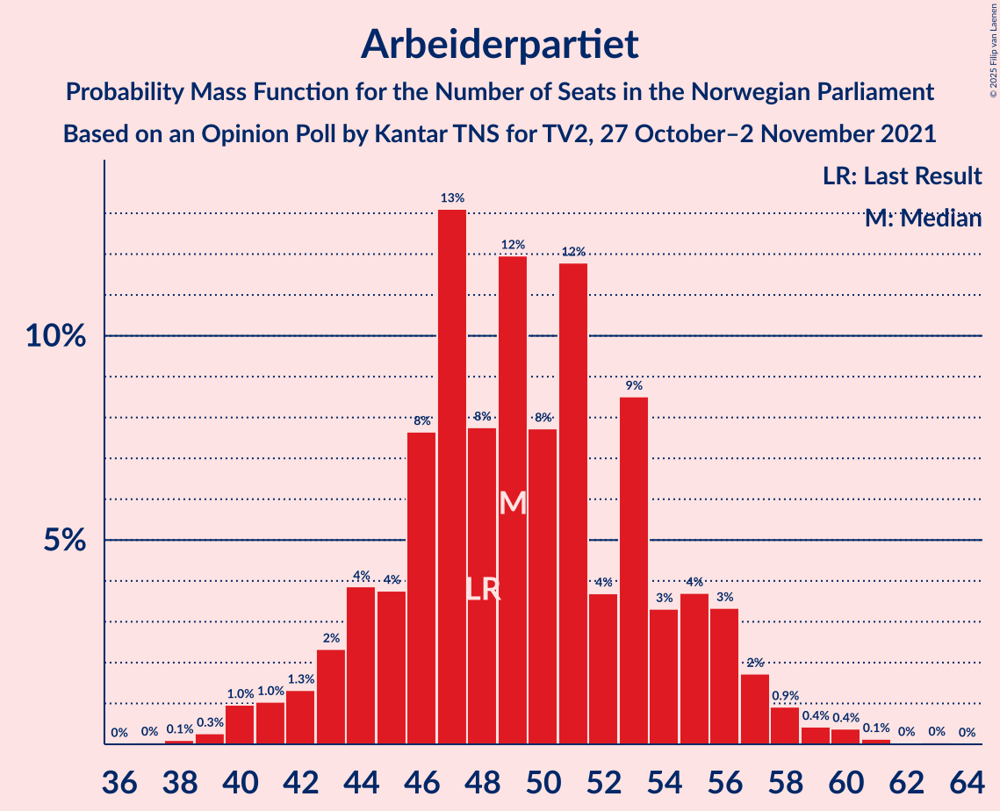
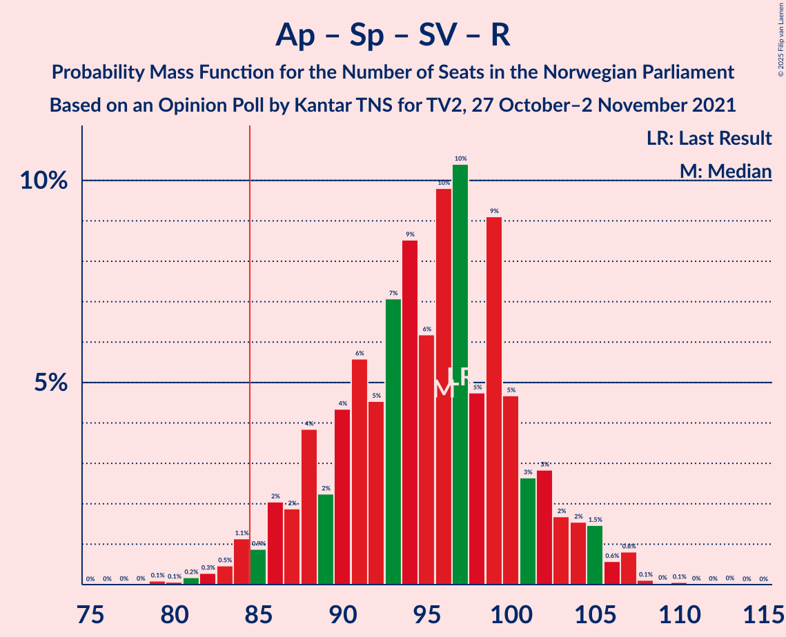
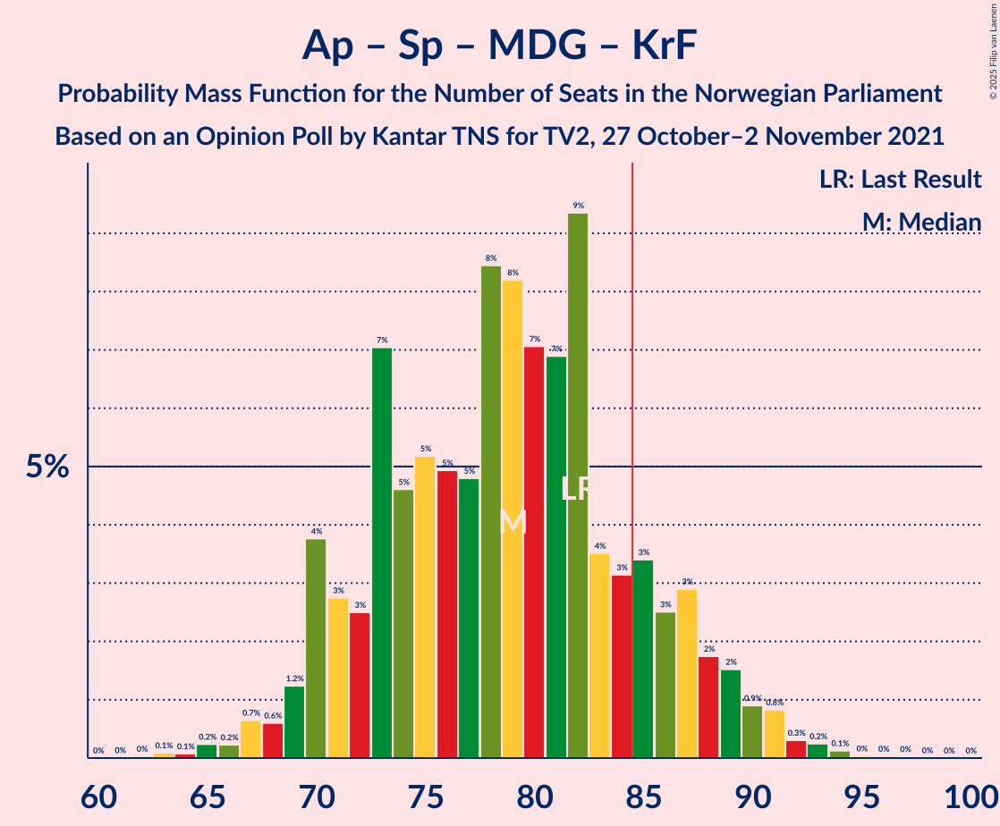

# Opinion Poll by Kantar TNS for TV2, 27 October–2 November 2021

<a href="#voting-intentions">Voting Intentions</a> | <a href="#seats">Seats</a> | <a href="#coalitions">Coalitions</a> | <a href="#technical-information">Technical Information</a>

## Voting Intentions

### Confidence Intervals

| Party | Last Result | Poll Result | 80% Confidence Interval | 90% Confidence Interval | 95% Confidence Interval | 99% Confidence Interval |
|:-----:|:-----------:|:-----------:|:-----------------------:|:-----------------------:|:-----------------------:|:-----------------------:|
| Arbeiderpartiet | 26.2% | 26.7% | 24.3–29.4% |23.6–30.1% |23.0–30.8% |21.9–32.1% |
| Høyre | 20.4% | 21.5% | 19.3–24.0% |18.6–24.7% |18.1–25.3% |17.1–26.6% |
| Senterpartiet | 13.5% | 12.0% | 10.3–14.1% |9.9–14.7% |9.5–15.2% |8.7–16.2% |
| Fremskrittspartiet | 11.6% | 11.4% | 9.8–13.5% |9.3–14.0% |8.9–14.6% |8.2–15.6% |
| Sosialistisk Venstreparti | 7.6% | 8.6% | 7.2–10.5% |6.8–11.0% |6.5–11.4% |5.9–12.4% |
| Rødt | 4.7% | 5.2% | 4.1–6.7% |3.8–7.2% |3.6–7.5% |3.1–8.3% |
| Venstre | 4.6% | 4.2% | 3.3–5.6% |3.0–6.0% |2.8–6.4% |2.4–7.1% |
| Miljøpartiet De Grønne | 3.9% | 3.6% | 2.7–4.9% |2.5–5.3% |2.3–5.7% |1.9–6.3% |
| Kristelig Folkeparti | 3.8% | 3.2% | 2.4–4.5% |2.2–4.8% |2.0–5.2% |1.7–5.8% |

*Note:* The poll result column reflects the actual value used in the calculations. Published results may vary slightly, and in addition be rounded to fewer digits.

## Seats

### Confidence Intervals

| Party | Last Result | Median | 80% Confidence Interval | 90% Confidence Interval | 95% Confidence Interval | 99% Confidence Interval |
|:-----:|:-----------:|:------:|:-----------------------:|:-----------------------:|:-----------------------:|:-----------------------:|
| <a href="#arbeiderpartiet">Arbeiderpartiet</a> | 48 | 49 | 45–55 |43–56 |42–57 |40–60 |
| <a href="#høyre">Høyre</a> | 36 | 39 | 33–43 |32–44 |31–45 |29–49 |
| <a href="#senterpartiet">Senterpartiet</a> | 28 | 21 | 18–28 |17–29 |16–30 |14–32 |
| <a href="#fremskrittspartiet">Fremskrittspartiet</a> | 21 | 20 | 17–23 |16–25 |15–26 |13–29 |
| <a href="#sosialistisk-venstreparti">Sosialistisk Venstreparti</a> | 13 | 15 | 12–18 |11–19 |10–20 |9–22 |
| <a href="#rødt">Rødt</a> | 8 | 9 | 6–12 |1–13 |1–13 |1–14 |
| <a href="#venstre">Venstre</a> | 8 | 7 | 2–10 |2–10 |2–11 |2–12 |
| <a href="#miljøpartiet-de-grønne">Miljøpartiet De Grønne</a> | 3 | 3 | 1–8 |1–9 |1–10 |1–11 |
| <a href="#kristelig-folkeparti">Kristelig Folkeparti</a> | 3 | 2 | 1–7 |1–8 |0–9 |0–10 |

### Arbeiderpartiet

*For a full overview of the results for this party, see the [Arbeiderpartiet](party-arbeiderpartiet.html) page.*

| Number of Seats | Probability | Accumulated | Special Marks |
|:---------------:|:-----------:|:-----------:|:-------------:|
| 37 | 0% | 100% |  |
| 38 | 0.1% | 99.9% |  |
| 39 | 0.3% | 99.8% |  |
| 40 | 1.0% | 99.6% |  |
| 41 | 1.0% | 98.6% |  |
| 42 | 1.3% | 98% |  |
| 43 | 2% | 96% |  |
| 44 | 4% | 94% |  |
| 45 | 4% | 90% |  |
| 46 | 8% | 86% |  |
| 47 | 13% | 79% |  |
| 48 | 8% | 66% | Last Result |
| 49 | 12% | 58% | Median |
| 50 | 8% | 46% |  |
| 51 | 12% | 38% |  |
| 52 | 4% | 26% |  |
| 53 | 9% | 23% |  |
| 54 | 3% | 14% |  |
| 55 | 4% | 11% |  |
| 56 | 3% | 7% |  |
| 57 | 2% | 4% |  |
| 58 | 0.9% | 2% |  |
| 59 | 0.4% | 1.1% |  |
| 60 | 0.4% | 0.6% |  |
| 61 | 0.1% | 0.2% |  |
| 62 | 0% | 0.1% |  |
| 63 | 0% | 0.1% |  |
| 64 | 0% | 0% |  |

### Høyre

*For a full overview of the results for this party, see the [Høyre](party-høyre.html) page.*

| Number of Seats | Probability | Accumulated | Special Marks |
|:---------------:|:-----------:|:-----------:|:-------------:|
| 26 | 0% | 100% |  |
| 27 | 0.1% | 99.9% |  |
| 28 | 0.2% | 99.9% |  |
| 29 | 0.4% | 99.6% |  |
| 30 | 1.2% | 99.2% |  |
| 31 | 2% | 98% |  |
| 32 | 2% | 96% |  |
| 33 | 4% | 94% |  |
| 34 | 5% | 90% |  |
| 35 | 7% | 85% |  |
| 36 | 9% | 78% | Last Result |
| 37 | 5% | 70% |  |
| 38 | 8% | 64% |  |
| 39 | 18% | 56% | Median |
| 40 | 8% | 39% |  |
| 41 | 9% | 30% |  |
| 42 | 6% | 21% |  |
| 43 | 8% | 15% |  |
| 44 | 3% | 7% |  |
| 45 | 2% | 4% |  |
| 46 | 0.4% | 2% |  |
| 47 | 0.6% | 1.5% |  |
| 48 | 0.3% | 0.9% |  |
| 49 | 0.4% | 0.5% |  |
| 50 | 0.1% | 0.1% |  |
| 51 | 0% | 0.1% |  |
| 52 | 0% | 0% |  |

### Senterpartiet

*For a full overview of the results for this party, see the [Senterpartiet](party-senterpartiet.html) page.*

| Number of Seats | Probability | Accumulated | Special Marks |
|:---------------:|:-----------:|:-----------:|:-------------:|
| 13 | 0.1% | 100% |  |
| 14 | 0.6% | 99.9% |  |
| 15 | 0.6% | 99.3% |  |
| 16 | 3% | 98.7% |  |
| 17 | 4% | 96% |  |
| 18 | 7% | 92% |  |
| 19 | 13% | 85% |  |
| 20 | 8% | 72% |  |
| 21 | 15% | 64% | Median |
| 22 | 13% | 49% |  |
| 23 | 7% | 36% |  |
| 24 | 4% | 29% |  |
| 25 | 5% | 25% |  |
| 26 | 4% | 19% |  |
| 27 | 4% | 15% |  |
| 28 | 4% | 11% | Last Result |
| 29 | 3% | 7% |  |
| 30 | 2% | 4% |  |
| 31 | 1.2% | 2% |  |
| 32 | 1.1% | 1.3% |  |
| 33 | 0.2% | 0.2% |  |
| 34 | 0% | 0.1% |  |
| 35 | 0% | 0% |  |

### Fremskrittspartiet

*For a full overview of the results for this party, see the [Fremskrittspartiet](party-fremskrittspartiet.html) page.*

| Number of Seats | Probability | Accumulated | Special Marks |
|:---------------:|:-----------:|:-----------:|:-------------:|
| 11 | 0.1% | 100% |  |
| 12 | 0.2% | 99.9% |  |
| 13 | 0.3% | 99.8% |  |
| 14 | 0.6% | 99.4% |  |
| 15 | 2% | 98.8% |  |
| 16 | 4% | 97% |  |
| 17 | 10% | 92% |  |
| 18 | 14% | 82% |  |
| 19 | 16% | 68% |  |
| 20 | 15% | 52% | Median |
| 21 | 14% | 38% | Last Result |
| 22 | 6% | 24% |  |
| 23 | 9% | 18% |  |
| 24 | 3% | 9% |  |
| 25 | 2% | 6% |  |
| 26 | 2% | 4% |  |
| 27 | 1.2% | 2% |  |
| 28 | 0.6% | 1.2% |  |
| 29 | 0.4% | 0.6% |  |
| 30 | 0.1% | 0.1% |  |
| 31 | 0% | 0.1% |  |
| 32 | 0% | 0% |  |

### Sosialistisk Venstreparti

*For a full overview of the results for this party, see the [Sosialistisk Venstreparti](party-sosialistiskvenstreparti.html) page.*

| Number of Seats | Probability | Accumulated | Special Marks |
|:---------------:|:-----------:|:-----------:|:-------------:|
| 8 | 0.2% | 100% |  |
| 9 | 0.7% | 99.8% |  |
| 10 | 3% | 99.2% |  |
| 11 | 6% | 96% |  |
| 12 | 9% | 90% |  |
| 13 | 11% | 81% | Last Result |
| 14 | 9% | 70% |  |
| 15 | 18% | 61% | Median |
| 16 | 20% | 43% |  |
| 17 | 9% | 22% |  |
| 18 | 6% | 14% |  |
| 19 | 4% | 8% |  |
| 20 | 2% | 4% |  |
| 21 | 1.1% | 2% |  |
| 22 | 0.8% | 1.0% |  |
| 23 | 0.2% | 0.2% |  |
| 24 | 0% | 0.1% |  |
| 25 | 0% | 0% |  |

### Rødt

*For a full overview of the results for this party, see the [Rødt](party-rødt.html) page.*

| Number of Seats | Probability | Accumulated | Special Marks |
|:---------------:|:-----------:|:-----------:|:-------------:|
| 1 | 9% | 100% |  |
| 2 | 0.3% | 91% |  |
| 3 | 0% | 91% |  |
| 4 | 0% | 91% |  |
| 5 | 0% | 91% |  |
| 6 | 1.4% | 91% |  |
| 7 | 11% | 90% |  |
| 8 | 14% | 78% | Last Result |
| 9 | 22% | 64% | Median |
| 10 | 15% | 43% |  |
| 11 | 15% | 27% |  |
| 12 | 7% | 13% |  |
| 13 | 5% | 6% |  |
| 14 | 1.0% | 2% |  |
| 15 | 0.3% | 0.5% |  |
| 16 | 0.1% | 0.1% |  |
| 17 | 0% | 0% |  |

### Venstre

*For a full overview of the results for this party, see the [Venstre](party-venstre.html) page.*

| Number of Seats | Probability | Accumulated | Special Marks |
|:---------------:|:-----------:|:-----------:|:-------------:|
| 1 | 0.4% | 100% |  |
| 2 | 21% | 99.6% |  |
| 3 | 20% | 78% |  |
| 4 | 0% | 58% |  |
| 5 | 0.1% | 58% |  |
| 6 | 1.3% | 58% |  |
| 7 | 14% | 57% | Median |
| 8 | 19% | 43% | Last Result |
| 9 | 12% | 23% |  |
| 10 | 6% | 11% |  |
| 11 | 3% | 5% |  |
| 12 | 1.2% | 1.5% |  |
| 13 | 0.2% | 0.2% |  |
| 14 | 0.1% | 0.1% |  |
| 15 | 0% | 0% |  |

### Miljøpartiet De Grønne

*For a full overview of the results for this party, see the [Miljøpartiet De Grønne](party-miljøpartietdegrønne.html) page.*

| Number of Seats | Probability | Accumulated | Special Marks |
|:---------------:|:-----------:|:-----------:|:-------------:|
| 0 | 0.1% | 100% |  |
| 1 | 15% | 99.9% |  |
| 2 | 24% | 85% |  |
| 3 | 26% | 62% | Last Result, Median |
| 4 | 0.4% | 35% |  |
| 5 | 0% | 35% |  |
| 6 | 3% | 35% |  |
| 7 | 11% | 32% |  |
| 8 | 12% | 21% |  |
| 9 | 6% | 9% |  |
| 10 | 2% | 3% |  |
| 11 | 0.7% | 0.9% |  |
| 12 | 0.2% | 0.2% |  |
| 13 | 0.1% | 0.1% |  |
| 14 | 0% | 0% |  |

### Kristelig Folkeparti

*For a full overview of the results for this party, see the [Kristelig Folkeparti](party-kristeligfolkeparti.html) page.*

| Number of Seats | Probability | Accumulated | Special Marks |
|:---------------:|:-----------:|:-----------:|:-------------:|
| 0 | 5% | 100% |  |
| 1 | 17% | 95% |  |
| 2 | 35% | 78% | Median |
| 3 | 22% | 43% | Last Result |
| 4 | 0% | 22% |  |
| 5 | 0% | 22% |  |
| 6 | 2% | 22% |  |
| 7 | 10% | 19% |  |
| 8 | 6% | 9% |  |
| 9 | 2% | 3% |  |
| 10 | 0.8% | 1.1% |  |
| 11 | 0.2% | 0.2% |  |
| 12 | 0% | 0% |  |

## Coalitions

### Confidence Intervals

| Coalition | Last Result | Median | Majority? | 80% Confidence Interval | 90% Confidence Interval | 95% Confidence Interval | 99% Confidence Interval |
|:---------:|:-----------:|:------:|:---------:|:-----------------------:|:-----------------------:|:-----------------------:|:-----------------------:|
| Arbeiderpartiet – Senterpartiet – Sosialistisk Venstreparti – Rødt – Miljøpartiet De Grønne | 100 | 99 | 99.8% | 92–106 | 90–108 | 89–109 | 86–112 |
| Arbeiderpartiet – Senterpartiet – Sosialistisk Venstreparti – Rødt | 97 | 96 | 98% | 88–101 | 86–103 | 85–105 | 82–107 |
| Arbeiderpartiet – Senterpartiet – Sosialistisk Venstreparti – Miljøpartiet De Grønne – Kristelig Folkeparti | 95 | 94 | 97% | 87–100 | 85–102 | 84–104 | 81–107 |
| Arbeiderpartiet – Senterpartiet – Sosialistisk Venstreparti – Miljøpartiet De Grønne | 92 | 90 | 87% | 84–97 | 83–99 | 81–100 | 78–104 |
| Høyre – Senterpartiet – Fremskrittspartiet – Venstre – Kristelig Folkeparti | 96 | 90 | 80% | 82–96 | 81–98 | 80–100 | 76–103 |
| Arbeiderpartiet – Senterpartiet – Sosialistisk Venstreparti | 89 | 86 | 70% | 81–92 | 79–94 | 77–96 | 75–98 |
| Arbeiderpartiet – Senterpartiet – Miljøpartiet De Grønne – Kristelig Folkeparti | 82 | 79 | 15% | 72–86 | 70–88 | 69–90 | 66–92 |
| Arbeiderpartiet – Sosialistisk Venstreparti – Rødt – Miljøpartiet De Grønne | 72 | 77 | 9% | 71–84 | 69–86 | 67–88 | 64–91 |
| Arbeiderpartiet – Senterpartiet – Kristelig Folkeparti | 79 | 75 | 3% | 68–81 | 67–83 | 65–85 | 62–86 |
| Høyre – Fremskrittspartiet – Venstre – Miljøpartiet De Grønne – Kristelig Folkeparti | 71 | 72 | 0.6% | 65–78 | 64–81 | 62–82 | 57–85 |
| Arbeiderpartiet – Senterpartiet | 76 | 72 | 0.1% | 66–77 | 64–79 | 63–81 | 60–83 |
| Høyre – Fremskrittspartiet – Venstre – Kristelig Folkeparti | 68 | 68 | 0% | 61–74 | 60–75 | 58–77 | 54–81 |
| Arbeiderpartiet – Sosialistisk Venstreparti | 61 | 64 | 0% | 59–70 | 58–71 | 56–73 | 54–77 |
| Høyre – Fremskrittspartiet – Venstre | 65 | 64 | 0% | 58–70 | 56–72 | 54–73 | 52–78 |
| Høyre – Fremskrittspartiet | 57 | 58 | 0% | 52–65 | 51–66 | 49–68 | 46–70 |
| Høyre – Venstre – Kristelig Folkeparti | 47 | 48 | 0% | 42–53 | 39–55 | 38–57 | 35–60 |
| Senterpartiet – Venstre – Kristelig Folkeparti | 39 | 31 | 0% | 24–38 | 23–40 | 22–42 | 20–45 |

### Arbeiderpartiet – Senterpartiet – Sosialistisk Venstreparti – Rødt – Miljøpartiet De Grønne

| Number of Seats | Probability | Accumulated | Special Marks |
|:---------------:|:-----------:|:-----------:|:-------------:|
| 82 | 0% | 100% |  |
| 83 | 0% | 99.9% |  |
| 84 | 0.1% | 99.9% |  |
| 85 | 0.1% | 99.8% | Majority |
| 86 | 0.3% | 99.6% |  |
| 87 | 0.5% | 99.4% |  |
| 88 | 0.8% | 98.9% |  |
| 89 | 0.7% | 98% |  |
| 90 | 3% | 97% |  |
| 91 | 0.8% | 95% |  |
| 92 | 5% | 94% |  |
| 93 | 1.5% | 89% |  |
| 94 | 5% | 87% |  |
| 95 | 4% | 82% |  |
| 96 | 7% | 78% |  |
| 97 | 7% | 72% | Median |
| 98 | 5% | 65% |  |
| 99 | 12% | 60% |  |
| 100 | 10% | 49% | Last Result |
| 101 | 8% | 39% |  |
| 102 | 7% | 31% |  |
| 103 | 3% | 24% |  |
| 104 | 4% | 21% |  |
| 105 | 4% | 17% |  |
| 106 | 5% | 13% |  |
| 107 | 2% | 8% |  |
| 108 | 2% | 5% |  |
| 109 | 2% | 4% |  |
| 110 | 0.5% | 2% |  |
| 111 | 0.4% | 1.1% |  |
| 112 | 0.3% | 0.7% |  |
| 113 | 0.1% | 0.4% |  |
| 114 | 0.1% | 0.2% |  |
| 115 | 0.1% | 0.2% |  |
| 116 | 0% | 0% |  |

### Arbeiderpartiet – Senterpartiet – Sosialistisk Venstreparti – Rødt

| Number of Seats | Probability | Accumulated | Special Marks |
|:---------------:|:-----------:|:-----------:|:-------------:|
| 79 | 0.1% | 100% |  |
| 80 | 0.1% | 99.9% |  |
| 81 | 0.2% | 99.8% |  |
| 82 | 0.3% | 99.6% |  |
| 83 | 0.5% | 99.3% |  |
| 84 | 1.1% | 98.9% |  |
| 85 | 0.9% | 98% | Majority |
| 86 | 2% | 97% |  |
| 87 | 2% | 95% |  |
| 88 | 4% | 93% |  |
| 89 | 2% | 89% |  |
| 90 | 4% | 87% |  |
| 91 | 6% | 82% |  |
| 92 | 5% | 77% |  |
| 93 | 7% | 72% |  |
| 94 | 9% | 65% | Median |
| 95 | 6% | 57% |  |
| 96 | 10% | 51% |  |
| 97 | 10% | 41% | Last Result |
| 98 | 5% | 30% |  |
| 99 | 9% | 26% |  |
| 100 | 5% | 17% |  |
| 101 | 3% | 12% |  |
| 102 | 3% | 9% |  |
| 103 | 2% | 6% |  |
| 104 | 2% | 5% |  |
| 105 | 1.5% | 3% |  |
| 106 | 0.6% | 2% |  |
| 107 | 0.8% | 1.1% |  |
| 108 | 0.1% | 0.3% |  |
| 109 | 0% | 0.1% |  |
| 110 | 0.1% | 0.1% |  |
| 111 | 0% | 0.1% |  |
| 112 | 0% | 0% |  |

### Arbeiderpartiet – Senterpartiet – Sosialistisk Venstreparti – Miljøpartiet De Grønne – Kristelig Folkeparti

| Number of Seats | Probability | Accumulated | Special Marks |
|:---------------:|:-----------:|:-----------:|:-------------:|
| 77 | 0% | 100% |  |
| 78 | 0.1% | 99.9% |  |
| 79 | 0.1% | 99.9% |  |
| 80 | 0.1% | 99.8% |  |
| 81 | 0.4% | 99.7% |  |
| 82 | 0.4% | 99.3% |  |
| 83 | 0.9% | 98.9% |  |
| 84 | 1.0% | 98% |  |
| 85 | 3% | 97% | Majority |
| 86 | 2% | 94% |  |
| 87 | 4% | 92% |  |
| 88 | 3% | 88% |  |
| 89 | 6% | 85% |  |
| 90 | 10% | 79% | Median |
| 91 | 7% | 69% |  |
| 92 | 6% | 62% |  |
| 93 | 5% | 57% |  |
| 94 | 6% | 51% |  |
| 95 | 7% | 46% | Last Result |
| 96 | 8% | 38% |  |
| 97 | 8% | 30% |  |
| 98 | 5% | 22% |  |
| 99 | 3% | 16% |  |
| 100 | 4% | 14% |  |
| 101 | 3% | 10% |  |
| 102 | 2% | 7% |  |
| 103 | 1.4% | 4% |  |
| 104 | 0.7% | 3% |  |
| 105 | 1.1% | 2% |  |
| 106 | 0.5% | 1.2% |  |
| 107 | 0.3% | 0.6% |  |
| 108 | 0.2% | 0.4% |  |
| 109 | 0.1% | 0.2% |  |
| 110 | 0% | 0.1% |  |
| 111 | 0% | 0% |  |

### Arbeiderpartiet – Senterpartiet – Sosialistisk Venstreparti – Miljøpartiet De Grønne

| Number of Seats | Probability | Accumulated | Special Marks |
|:---------------:|:-----------:|:-----------:|:-------------:|
| 75 | 0.1% | 100% |  |
| 76 | 0.1% | 99.9% |  |
| 77 | 0.1% | 99.8% |  |
| 78 | 0.3% | 99.7% |  |
| 79 | 0.5% | 99.4% |  |
| 80 | 0.6% | 99.0% |  |
| 81 | 1.4% | 98% |  |
| 82 | 1.3% | 97% |  |
| 83 | 5% | 96% |  |
| 84 | 4% | 91% |  |
| 85 | 4% | 87% | Majority |
| 86 | 3% | 84% |  |
| 87 | 6% | 80% |  |
| 88 | 12% | 75% | Median |
| 89 | 7% | 63% |  |
| 90 | 8% | 55% |  |
| 91 | 5% | 47% |  |
| 92 | 7% | 42% | Last Result |
| 93 | 9% | 35% |  |
| 94 | 4% | 27% |  |
| 95 | 6% | 22% |  |
| 96 | 3% | 16% |  |
| 97 | 4% | 13% |  |
| 98 | 3% | 9% |  |
| 99 | 2% | 6% |  |
| 100 | 2% | 4% |  |
| 101 | 0.6% | 2% |  |
| 102 | 0.4% | 2% |  |
| 103 | 0.4% | 1.2% |  |
| 104 | 0.5% | 0.8% |  |
| 105 | 0.2% | 0.4% |  |
| 106 | 0.1% | 0.2% |  |
| 107 | 0.1% | 0.1% |  |
| 108 | 0% | 0.1% |  |
| 109 | 0% | 0% |  |

### Høyre – Senterpartiet – Fremskrittspartiet – Venstre – Kristelig Folkeparti

| Number of Seats | Probability | Accumulated | Special Marks |
|:---------------:|:-----------:|:-----------:|:-------------:|
| 71 | 0.1% | 100% |  |
| 72 | 0% | 99.9% |  |
| 73 | 0.1% | 99.9% |  |
| 74 | 0% | 99.8% |  |
| 75 | 0.2% | 99.8% |  |
| 76 | 0.4% | 99.6% |  |
| 77 | 0.2% | 99.2% |  |
| 78 | 0.7% | 98.9% |  |
| 79 | 0.6% | 98% |  |
| 80 | 2% | 98% |  |
| 81 | 2% | 95% |  |
| 82 | 3% | 93% |  |
| 83 | 3% | 90% |  |
| 84 | 7% | 86% |  |
| 85 | 2% | 80% | Majority |
| 86 | 4% | 77% |  |
| 87 | 5% | 73% |  |
| 88 | 8% | 68% |  |
| 89 | 10% | 60% | Median |
| 90 | 6% | 50% |  |
| 91 | 5% | 45% |  |
| 92 | 10% | 39% |  |
| 93 | 6% | 30% |  |
| 94 | 7% | 24% |  |
| 95 | 6% | 17% |  |
| 96 | 3% | 11% | Last Result |
| 97 | 2% | 8% |  |
| 98 | 1.4% | 6% |  |
| 99 | 1.0% | 4% |  |
| 100 | 2% | 3% |  |
| 101 | 0.5% | 2% |  |
| 102 | 0.4% | 1.3% |  |
| 103 | 0.6% | 0.9% |  |
| 104 | 0.2% | 0.3% |  |
| 105 | 0% | 0.1% |  |
| 106 | 0% | 0.1% |  |
| 107 | 0% | 0.1% |  |
| 108 | 0% | 0% |  |

### Arbeiderpartiet – Senterpartiet – Sosialistisk Venstreparti

| Number of Seats | Probability | Accumulated | Special Marks |
|:---------------:|:-----------:|:-----------:|:-------------:|
| 71 | 0.1% | 100% |  |
| 72 | 0.1% | 99.9% |  |
| 73 | 0.1% | 99.8% |  |
| 74 | 0.2% | 99.7% |  |
| 75 | 0.6% | 99.5% |  |
| 76 | 0.7% | 98.9% |  |
| 77 | 1.0% | 98% |  |
| 78 | 2% | 97% |  |
| 79 | 1.5% | 95% |  |
| 80 | 3% | 94% |  |
| 81 | 7% | 90% |  |
| 82 | 5% | 84% |  |
| 83 | 4% | 79% |  |
| 84 | 5% | 75% |  |
| 85 | 15% | 70% | Median, Majority |
| 86 | 9% | 55% |  |
| 87 | 7% | 46% |  |
| 88 | 8% | 38% |  |
| 89 | 5% | 30% | Last Result |
| 90 | 8% | 25% |  |
| 91 | 4% | 17% |  |
| 92 | 4% | 14% |  |
| 93 | 2% | 9% |  |
| 94 | 4% | 8% |  |
| 95 | 0.8% | 4% |  |
| 96 | 2% | 3% |  |
| 97 | 0.5% | 2% |  |
| 98 | 0.6% | 1.1% |  |
| 99 | 0.2% | 0.5% |  |
| 100 | 0.2% | 0.3% |  |
| 101 | 0.1% | 0.2% |  |
| 102 | 0% | 0.1% |  |
| 103 | 0% | 0.1% |  |
| 104 | 0% | 0% |  |

### Arbeiderpartiet – Senterpartiet – Miljøpartiet De Grønne – Kristelig Folkeparti

| Number of Seats | Probability | Accumulated | Special Marks |
|:---------------:|:-----------:|:-----------:|:-------------:|
| 63 | 0.1% | 100% |  |
| 64 | 0.1% | 99.9% |  |
| 65 | 0.2% | 99.8% |  |
| 66 | 0.2% | 99.5% |  |
| 67 | 0.7% | 99.3% |  |
| 68 | 0.6% | 98.7% |  |
| 69 | 1.2% | 98% |  |
| 70 | 4% | 97% |  |
| 71 | 3% | 93% |  |
| 72 | 3% | 90% |  |
| 73 | 7% | 88% |  |
| 74 | 5% | 81% |  |
| 75 | 5% | 76% | Median |
| 76 | 5% | 71% |  |
| 77 | 5% | 66% |  |
| 78 | 8% | 61% |  |
| 79 | 8% | 53% |  |
| 80 | 7% | 45% |  |
| 81 | 7% | 38% |  |
| 82 | 9% | 31% | Last Result |
| 83 | 4% | 21% |  |
| 84 | 3% | 18% |  |
| 85 | 3% | 15% | Majority |
| 86 | 3% | 11% |  |
| 87 | 3% | 9% |  |
| 88 | 2% | 6% |  |
| 89 | 2% | 4% |  |
| 90 | 0.9% | 3% |  |
| 91 | 0.8% | 2% |  |
| 92 | 0.3% | 0.8% |  |
| 93 | 0.2% | 0.5% |  |
| 94 | 0.1% | 0.2% |  |
| 95 | 0% | 0.1% |  |
| 96 | 0% | 0.1% |  |
| 97 | 0% | 0% |  |

### Arbeiderpartiet – Sosialistisk Venstreparti – Rødt – Miljøpartiet De Grønne

| Number of Seats | Probability | Accumulated | Special Marks |
|:---------------:|:-----------:|:-----------:|:-------------:|
| 61 | 0.1% | 100% |  |
| 62 | 0.1% | 99.9% |  |
| 63 | 0.1% | 99.8% |  |
| 64 | 0.2% | 99.7% |  |
| 65 | 0.5% | 99.5% |  |
| 66 | 1.0% | 99.0% |  |
| 67 | 0.9% | 98% |  |
| 68 | 2% | 97% |  |
| 69 | 2% | 95% |  |
| 70 | 3% | 94% |  |
| 71 | 3% | 91% |  |
| 72 | 4% | 88% | Last Result |
| 73 | 6% | 84% |  |
| 74 | 7% | 78% |  |
| 75 | 8% | 71% |  |
| 76 | 6% | 63% | Median |
| 77 | 10% | 57% |  |
| 78 | 9% | 47% |  |
| 79 | 6% | 39% |  |
| 80 | 7% | 33% |  |
| 81 | 8% | 26% |  |
| 82 | 5% | 18% |  |
| 83 | 2% | 13% |  |
| 84 | 2% | 11% |  |
| 85 | 3% | 9% | Majority |
| 86 | 2% | 5% |  |
| 87 | 1.0% | 4% |  |
| 88 | 2% | 3% |  |
| 89 | 0.2% | 1.0% |  |
| 90 | 0.2% | 0.7% |  |
| 91 | 0.4% | 0.6% |  |
| 92 | 0.1% | 0.2% |  |
| 93 | 0.1% | 0.1% |  |
| 94 | 0% | 0% |  |

### Arbeiderpartiet – Senterpartiet – Kristelig Folkeparti

| Number of Seats | Probability | Accumulated | Special Marks |
|:---------------:|:-----------:|:-----------:|:-------------:|
| 59 | 0% | 100% |  |
| 60 | 0.1% | 99.9% |  |
| 61 | 0.1% | 99.8% |  |
| 62 | 0.4% | 99.7% |  |
| 63 | 0.4% | 99.3% |  |
| 64 | 0.6% | 98.9% |  |
| 65 | 0.9% | 98% |  |
| 66 | 2% | 97% |  |
| 67 | 3% | 96% |  |
| 68 | 5% | 93% |  |
| 69 | 4% | 88% |  |
| 70 | 7% | 84% |  |
| 71 | 4% | 77% |  |
| 72 | 7% | 73% | Median |
| 73 | 7% | 66% |  |
| 74 | 9% | 60% |  |
| 75 | 7% | 51% |  |
| 76 | 10% | 44% |  |
| 77 | 9% | 34% |  |
| 78 | 5% | 25% |  |
| 79 | 6% | 20% | Last Result |
| 80 | 3% | 14% |  |
| 81 | 3% | 11% |  |
| 82 | 2% | 8% |  |
| 83 | 2% | 6% |  |
| 84 | 1.2% | 4% |  |
| 85 | 2% | 3% | Majority |
| 86 | 1.2% | 2% |  |
| 87 | 0.2% | 0.5% |  |
| 88 | 0.1% | 0.3% |  |
| 89 | 0.1% | 0.2% |  |
| 90 | 0% | 0.1% |  |
| 91 | 0% | 0% |  |

### Høyre – Fremskrittspartiet – Venstre – Miljøpartiet De Grønne – Kristelig Folkeparti

| Number of Seats | Probability | Accumulated | Special Marks |
|:---------------:|:-----------:|:-----------:|:-------------:|
| 56 | 0.1% | 100% |  |
| 57 | 0.4% | 99.9% |  |
| 58 | 0.3% | 99.5% |  |
| 59 | 0.5% | 99.2% |  |
| 60 | 0.6% | 98.7% |  |
| 61 | 0.3% | 98% |  |
| 62 | 1.1% | 98% |  |
| 63 | 1.2% | 97% |  |
| 64 | 3% | 95% |  |
| 65 | 6% | 92% |  |
| 66 | 3% | 86% |  |
| 67 | 5% | 83% |  |
| 68 | 4% | 78% |  |
| 69 | 5% | 74% |  |
| 70 | 9% | 69% |  |
| 71 | 7% | 60% | Last Result, Median |
| 72 | 9% | 53% |  |
| 73 | 8% | 44% |  |
| 74 | 5% | 36% |  |
| 75 | 9% | 31% |  |
| 76 | 5% | 22% |  |
| 77 | 4% | 17% |  |
| 78 | 4% | 12% |  |
| 79 | 2% | 8% |  |
| 80 | 1.2% | 7% |  |
| 81 | 2% | 5% |  |
| 82 | 1.2% | 3% |  |
| 83 | 0.8% | 2% |  |
| 84 | 0.6% | 1.2% |  |
| 85 | 0.3% | 0.6% | Majority |
| 86 | 0.2% | 0.3% |  |
| 87 | 0% | 0.1% |  |
| 88 | 0% | 0.1% |  |
| 89 | 0% | 0% |  |

### Arbeiderpartiet – Senterpartiet

| Number of Seats | Probability | Accumulated | Special Marks |
|:---------------:|:-----------:|:-----------:|:-------------:|
| 57 | 0.1% | 100% |  |
| 58 | 0.1% | 99.9% |  |
| 59 | 0.1% | 99.8% |  |
| 60 | 0.6% | 99.7% |  |
| 61 | 0.4% | 99.1% |  |
| 62 | 0.9% | 98.7% |  |
| 63 | 2% | 98% |  |
| 64 | 2% | 96% |  |
| 65 | 3% | 94% |  |
| 66 | 6% | 90% |  |
| 67 | 4% | 84% |  |
| 68 | 4% | 80% |  |
| 69 | 10% | 76% |  |
| 70 | 7% | 66% | Median |
| 71 | 7% | 59% |  |
| 72 | 12% | 52% |  |
| 73 | 7% | 40% |  |
| 74 | 10% | 33% |  |
| 75 | 6% | 22% |  |
| 76 | 3% | 16% | Last Result |
| 77 | 4% | 13% |  |
| 78 | 4% | 10% |  |
| 79 | 2% | 6% |  |
| 80 | 1.4% | 4% |  |
| 81 | 1.3% | 3% |  |
| 82 | 0.9% | 1.4% |  |
| 83 | 0.3% | 0.5% |  |
| 84 | 0.1% | 0.2% |  |
| 85 | 0% | 0.1% | Majority |
| 86 | 0% | 0.1% |  |
| 87 | 0% | 0.1% |  |
| 88 | 0% | 0% |  |

### Høyre – Fremskrittspartiet – Venstre – Kristelig Folkeparti

| Number of Seats | Probability | Accumulated | Special Marks |
|:---------------:|:-----------:|:-----------:|:-------------:|
| 51 | 0.1% | 100% |  |
| 52 | 0.1% | 99.9% |  |
| 53 | 0.1% | 99.9% |  |
| 54 | 0.2% | 99.7% |  |
| 55 | 0.7% | 99.5% |  |
| 56 | 0.7% | 98.8% |  |
| 57 | 0.5% | 98% |  |
| 58 | 1.1% | 98% |  |
| 59 | 2% | 97% |  |
| 60 | 4% | 95% |  |
| 61 | 3% | 91% |  |
| 62 | 5% | 88% |  |
| 63 | 8% | 83% |  |
| 64 | 5% | 75% |  |
| 65 | 7% | 71% |  |
| 66 | 4% | 64% |  |
| 67 | 6% | 60% |  |
| 68 | 8% | 54% | Last Result, Median |
| 69 | 10% | 46% |  |
| 70 | 10% | 36% |  |
| 71 | 5% | 27% |  |
| 72 | 5% | 22% |  |
| 73 | 6% | 17% |  |
| 74 | 3% | 11% |  |
| 75 | 4% | 8% |  |
| 76 | 0.8% | 4% |  |
| 77 | 1.0% | 3% |  |
| 78 | 0.7% | 2% |  |
| 79 | 0.5% | 2% |  |
| 80 | 0.4% | 1.1% |  |
| 81 | 0.4% | 0.7% |  |
| 82 | 0.2% | 0.3% |  |
| 83 | 0.1% | 0.1% |  |
| 84 | 0% | 0.1% |  |
| 85 | 0% | 0% | Majority |

### Arbeiderpartiet – Sosialistisk Venstreparti

| Number of Seats | Probability | Accumulated | Special Marks |
|:---------------:|:-----------:|:-----------:|:-------------:|
| 51 | 0.1% | 100% |  |
| 52 | 0.1% | 99.9% |  |
| 53 | 0.2% | 99.8% |  |
| 54 | 0.3% | 99.6% |  |
| 55 | 0.5% | 99.3% |  |
| 56 | 2% | 98.8% |  |
| 57 | 2% | 97% |  |
| 58 | 3% | 95% |  |
| 59 | 5% | 92% |  |
| 60 | 8% | 87% |  |
| 61 | 4% | 79% | Last Result |
| 62 | 11% | 75% |  |
| 63 | 13% | 64% |  |
| 64 | 6% | 51% | Median |
| 65 | 8% | 45% |  |
| 66 | 6% | 37% |  |
| 67 | 5% | 31% |  |
| 68 | 8% | 26% |  |
| 69 | 6% | 18% |  |
| 70 | 5% | 12% |  |
| 71 | 3% | 8% |  |
| 72 | 2% | 5% |  |
| 73 | 1.2% | 3% |  |
| 74 | 0.4% | 2% |  |
| 75 | 0.5% | 1.4% |  |
| 76 | 0.3% | 0.9% |  |
| 77 | 0.4% | 0.6% |  |
| 78 | 0.1% | 0.2% |  |
| 79 | 0% | 0% |  |

### Høyre – Fremskrittspartiet – Venstre

| Number of Seats | Probability | Accumulated | Special Marks |
|:---------------:|:-----------:|:-----------:|:-------------:|
| 48 | 0% | 100% |  |
| 49 | 0% | 99.9% |  |
| 50 | 0.2% | 99.9% |  |
| 51 | 0.1% | 99.7% |  |
| 52 | 0.4% | 99.6% |  |
| 53 | 0.4% | 99.2% |  |
| 54 | 1.5% | 98.8% |  |
| 55 | 1.0% | 97% |  |
| 56 | 2% | 96% |  |
| 57 | 3% | 95% |  |
| 58 | 4% | 92% |  |
| 59 | 5% | 88% |  |
| 60 | 6% | 84% |  |
| 61 | 8% | 78% |  |
| 62 | 8% | 70% |  |
| 63 | 5% | 62% |  |
| 64 | 8% | 57% |  |
| 65 | 6% | 49% | Last Result |
| 66 | 8% | 43% | Median |
| 67 | 7% | 35% |  |
| 68 | 7% | 29% |  |
| 69 | 6% | 22% |  |
| 70 | 6% | 16% |  |
| 71 | 3% | 9% |  |
| 72 | 3% | 7% |  |
| 73 | 1.3% | 4% |  |
| 74 | 0.7% | 2% |  |
| 75 | 0.3% | 2% |  |
| 76 | 0.4% | 1.3% |  |
| 77 | 0.4% | 0.9% |  |
| 78 | 0.3% | 0.5% |  |
| 79 | 0.2% | 0.3% |  |
| 80 | 0.1% | 0.1% |  |
| 81 | 0% | 0% |  |

### Høyre – Fremskrittspartiet

| Number of Seats | Probability | Accumulated | Special Marks |
|:---------------:|:-----------:|:-----------:|:-------------:|
| 43 | 0% | 100% |  |
| 44 | 0% | 99.9% |  |
| 45 | 0.1% | 99.9% |  |
| 46 | 0.4% | 99.8% |  |
| 47 | 0.5% | 99.5% |  |
| 48 | 0.5% | 99.0% |  |
| 49 | 2% | 98.5% |  |
| 50 | 0.8% | 97% |  |
| 51 | 2% | 96% |  |
| 52 | 4% | 94% |  |
| 53 | 6% | 90% |  |
| 54 | 5% | 84% |  |
| 55 | 5% | 78% |  |
| 56 | 7% | 73% |  |
| 57 | 8% | 66% | Last Result |
| 58 | 10% | 57% |  |
| 59 | 9% | 48% | Median |
| 60 | 7% | 39% |  |
| 61 | 6% | 33% |  |
| 62 | 4% | 27% |  |
| 63 | 8% | 23% |  |
| 64 | 4% | 15% |  |
| 65 | 2% | 11% |  |
| 66 | 5% | 9% |  |
| 67 | 2% | 4% |  |
| 68 | 1.0% | 3% |  |
| 69 | 0.8% | 2% |  |
| 70 | 0.4% | 0.8% |  |
| 71 | 0.2% | 0.4% |  |
| 72 | 0.1% | 0.2% |  |
| 73 | 0% | 0.1% |  |
| 74 | 0% | 0.1% |  |
| 75 | 0% | 0% |  |

### Høyre – Venstre – Kristelig Folkeparti

| Number of Seats | Probability | Accumulated | Special Marks |
|:---------------:|:-----------:|:-----------:|:-------------:|
| 33 | 0% | 100% |  |
| 34 | 0.2% | 99.9% |  |
| 35 | 0.3% | 99.8% |  |
| 36 | 0.3% | 99.5% |  |
| 37 | 0.8% | 99.1% |  |
| 38 | 1.3% | 98% |  |
| 39 | 3% | 97% |  |
| 40 | 2% | 94% |  |
| 41 | 3% | 93% |  |
| 42 | 5% | 90% |  |
| 43 | 6% | 86% |  |
| 44 | 4% | 79% |  |
| 45 | 8% | 75% |  |
| 46 | 8% | 68% |  |
| 47 | 9% | 60% | Last Result |
| 48 | 8% | 51% | Median |
| 49 | 8% | 43% |  |
| 50 | 6% | 35% |  |
| 51 | 9% | 29% |  |
| 52 | 7% | 20% |  |
| 53 | 4% | 13% |  |
| 54 | 3% | 10% |  |
| 55 | 1.5% | 6% |  |
| 56 | 2% | 5% |  |
| 57 | 1.1% | 3% |  |
| 58 | 1.2% | 2% |  |
| 59 | 0.4% | 0.9% |  |
| 60 | 0.3% | 0.6% |  |
| 61 | 0.1% | 0.2% |  |
| 62 | 0.1% | 0.1% |  |
| 63 | 0% | 0.1% |  |
| 64 | 0% | 0% |  |

### Senterpartiet – Venstre – Kristelig Folkeparti

| Number of Seats | Probability | Accumulated | Special Marks |
|:---------------:|:-----------:|:-----------:|:-------------:|
| 19 | 0.2% | 100% |  |
| 20 | 0.3% | 99.7% |  |
| 21 | 0.4% | 99.4% |  |
| 22 | 2% | 99.0% |  |
| 23 | 3% | 97% |  |
| 24 | 5% | 94% |  |
| 25 | 5% | 89% |  |
| 26 | 8% | 84% |  |
| 27 | 2% | 76% |  |
| 28 | 3% | 73% |  |
| 29 | 4% | 70% |  |
| 30 | 8% | 66% | Median |
| 31 | 10% | 59% |  |
| 32 | 13% | 49% |  |
| 33 | 5% | 36% |  |
| 34 | 9% | 31% |  |
| 35 | 4% | 21% |  |
| 36 | 3% | 17% |  |
| 37 | 3% | 14% |  |
| 38 | 2% | 11% |  |
| 39 | 2% | 8% | Last Result |
| 40 | 2% | 6% |  |
| 41 | 2% | 5% |  |
| 42 | 1.2% | 3% |  |
| 43 | 0.8% | 2% |  |
| 44 | 0.4% | 1.0% |  |
| 45 | 0.2% | 0.5% |  |
| 46 | 0.2% | 0.4% |  |
| 47 | 0.1% | 0.2% |  |
| 48 | 0% | 0.1% |  |
| 49 | 0% | 0.1% |  |
| 50 | 0% | 0% |  |

## Technical Information

### Opinion Poll

+ **Polling firm:** Kantar TNS
+ **Commissioner(s):** TV2
+ **Fieldwork period:** 27 October–2 November 2021

### Calculations

+ **Sample size:** 498
+ **Simulations done:** 1,048,576
+ **Error estimate:** 2.85%

