# Opinion Poll by Norfakta for Klassekampen and Nationen, 2–3 November 2021

<a href="#voting-intentions">Voting Intentions</a> | <a href="#seats">Seats</a> | <a href="#coalitions">Coalitions</a> | <a href="#technical-information">Technical Information</a>

## Voting Intentions

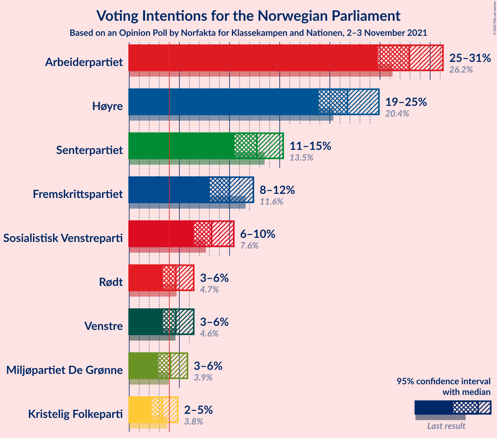

### Confidence Intervals

| Party | Last Result | Poll Result | 80% Confidence Interval | 90% Confidence Interval | 95% Confidence Interval | 99% Confidence Interval |
|:-----:|:-----------:|:-----------:|:-----------------------:|:-----------------------:|:-----------------------:|:-----------------------:|
| Arbeiderpartiet | 26.2% | 27.9% | 25.8–30.1% |25.3–30.7% |24.8–31.3% |23.8–32.3% |
| Høyre | 20.4% | 21.8% | 19.9–23.8% |19.4–24.4% |18.9–24.9% |18.0–25.9% |
| Senterpartiet | 13.5% | 12.7% | 11.3–14.4% |10.9–14.9% |10.5–15.3% |9.8–16.2% |
| Fremskrittspartiet | 11.6% | 10.0% | 8.7–11.6% |8.3–12.0% |8.0–12.4% |7.4–13.2% |
| Sosialistisk Venstreparti | 7.6% | 8.2% | 7.0–9.7% |6.7–10.1% |6.4–10.4% |5.9–11.2% |
| Venstre | 4.6% | 4.7% | 3.8–5.8% |3.6–6.1% |3.3–6.4% |3.0–7.0% |
| Rødt | 4.7% | 4.7% | 3.8–5.8% |3.6–6.1% |3.3–6.4% |3.0–7.0% |
| Miljøpartiet De Grønne | 3.9% | 4.1% | 3.3–5.2% |3.1–5.5% |2.9–5.8% |2.5–6.4% |
| Kristelig Folkeparti | 3.8% | 3.3% | 2.6–4.3% |2.4–4.6% |2.2–4.8% |1.9–5.4% |

*Note:* The poll result column reflects the actual value used in the calculations. Published results may vary slightly, and in addition be rounded to fewer digits.

## Seats

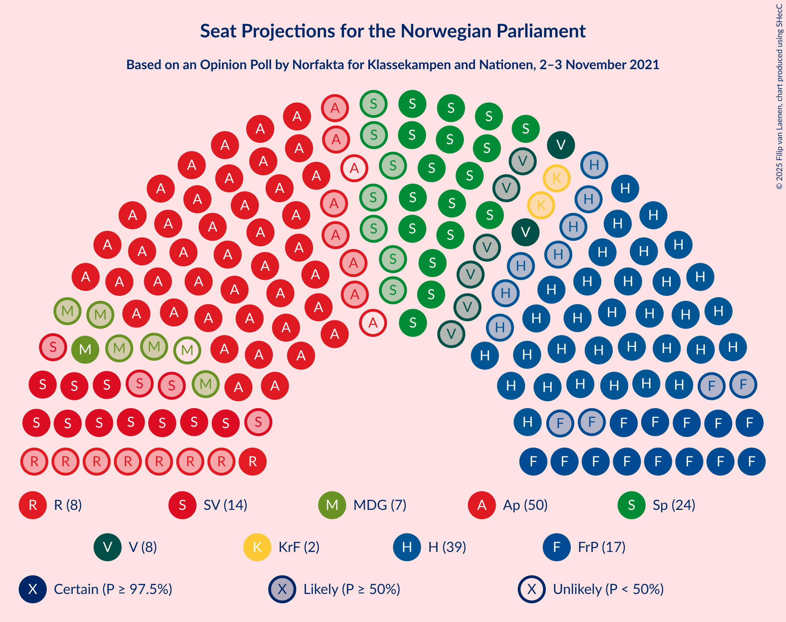

### Confidence Intervals

| Party | Last Result | Median | 80% Confidence Interval | 90% Confidence Interval | 95% Confidence Interval | 99% Confidence Interval |
|:-----:|:-----------:|:------:|:-----------------------:|:-----------------------:|:-----------------------:|:-----------------------:|
| <a href="#arbeiderpartiet">Arbeiderpartiet</a> | 48 | 51 | 47–57 |46–58 |45–58 |43–60 |
| <a href="#høyre">Høyre</a> | 36 | 39 | 34–43 |33–44 |32–45 |30–47 |
| <a href="#senterpartiet">Senterpartiet</a> | 28 | 24 | 19–29 |18–30 |17–30 |16–32 |
| <a href="#fremskrittspartiet">Fremskrittspartiet</a> | 21 | 17 | 14–21 |14–21 |13–22 |12–23 |
| <a href="#sosialistisk-venstreparti">Sosialistisk Venstreparti</a> | 13 | 14 | 12–17 |11–18 |10–19 |10–20 |
| <a href="#venstre">Venstre</a> | 8 | 8 | 3–10 |3–11 |2–11 |2–12 |
| <a href="#rødt">Rødt</a> | 8 | 8 | 1–10 |1–11 |1–11 |1–12 |
| <a href="#miljøpartiet-de-grønne">Miljøpartiet De Grønne</a> | 3 | 7 | 2–9 |2–9 |1–10 |1–11 |
| <a href="#kristelig-folkeparti">Kristelig Folkeparti</a> | 3 | 2 | 1–8 |1–8 |0–9 |0–9 |

### Arbeiderpartiet

*For a full overview of the results for this party, see the [Arbeiderpartiet](party-arbeiderpartiet.html) page.*

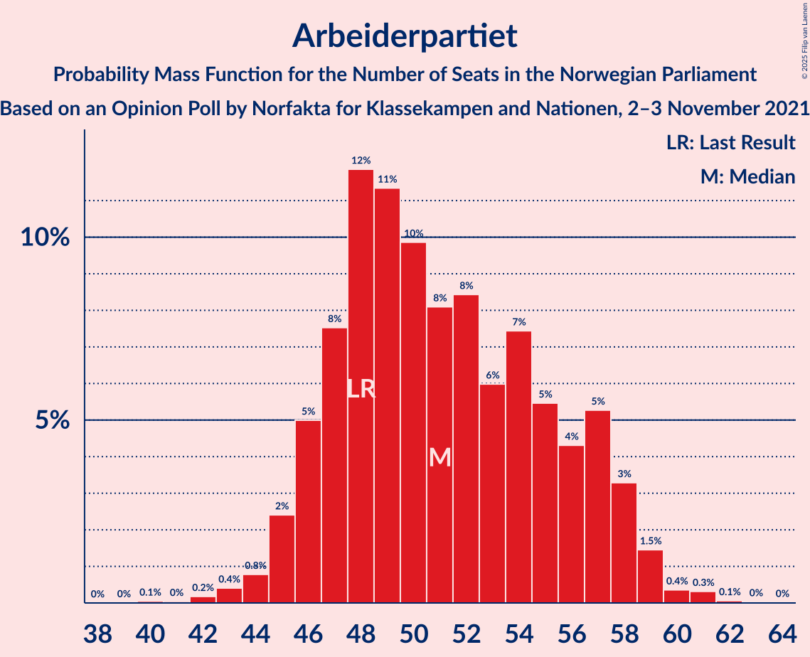

| Number of Seats | Probability | Accumulated | Special Marks |
|:---------------:|:-----------:|:-----------:|:-------------:|
| 40 | 0.1% | 100% |  |
| 41 | 0% | 99.9% |  |
| 42 | 0.2% | 99.9% |  |
| 43 | 0.4% | 99.7% |  |
| 44 | 0.8% | 99.3% |  |
| 45 | 2% | 98.5% |  |
| 46 | 5% | 96% |  |
| 47 | 8% | 91% |  |
| 48 | 12% | 84% | Last Result |
| 49 | 11% | 72% |  |
| 50 | 10% | 60% |  |
| 51 | 8% | 51% | Median |
| 52 | 8% | 42% |  |
| 53 | 6% | 34% |  |
| 54 | 7% | 28% |  |
| 55 | 5% | 21% |  |
| 56 | 4% | 15% |  |
| 57 | 5% | 11% |  |
| 58 | 3% | 6% |  |
| 59 | 1.5% | 2% |  |
| 60 | 0.4% | 0.8% |  |
| 61 | 0.3% | 0.4% |  |
| 62 | 0.1% | 0.1% |  |
| 63 | 0% | 0.1% |  |
| 64 | 0% | 0% |  |

### Høyre

*For a full overview of the results for this party, see the [Høyre](party-høyre.html) page.*

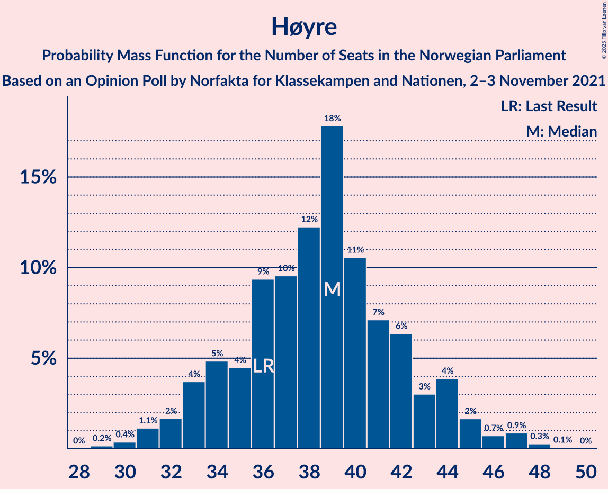

| Number of Seats | Probability | Accumulated | Special Marks |
|:---------------:|:-----------:|:-----------:|:-------------:|
| 29 | 0.2% | 100% |  |
| 30 | 0.4% | 99.8% |  |
| 31 | 1.1% | 99.4% |  |
| 32 | 2% | 98% |  |
| 33 | 4% | 97% |  |
| 34 | 5% | 93% |  |
| 35 | 4% | 88% |  |
| 36 | 9% | 84% | Last Result |
| 37 | 10% | 74% |  |
| 38 | 12% | 65% |  |
| 39 | 18% | 52% | Median |
| 40 | 11% | 35% |  |
| 41 | 7% | 24% |  |
| 42 | 6% | 17% |  |
| 43 | 3% | 11% |  |
| 44 | 4% | 8% |  |
| 45 | 2% | 4% |  |
| 46 | 0.7% | 2% |  |
| 47 | 0.9% | 1.3% |  |
| 48 | 0.3% | 0.4% |  |
| 49 | 0.1% | 0.1% |  |
| 50 | 0% | 0% |  |

### Senterpartiet

*For a full overview of the results for this party, see the [Senterpartiet](party-senterpartiet.html) page.*

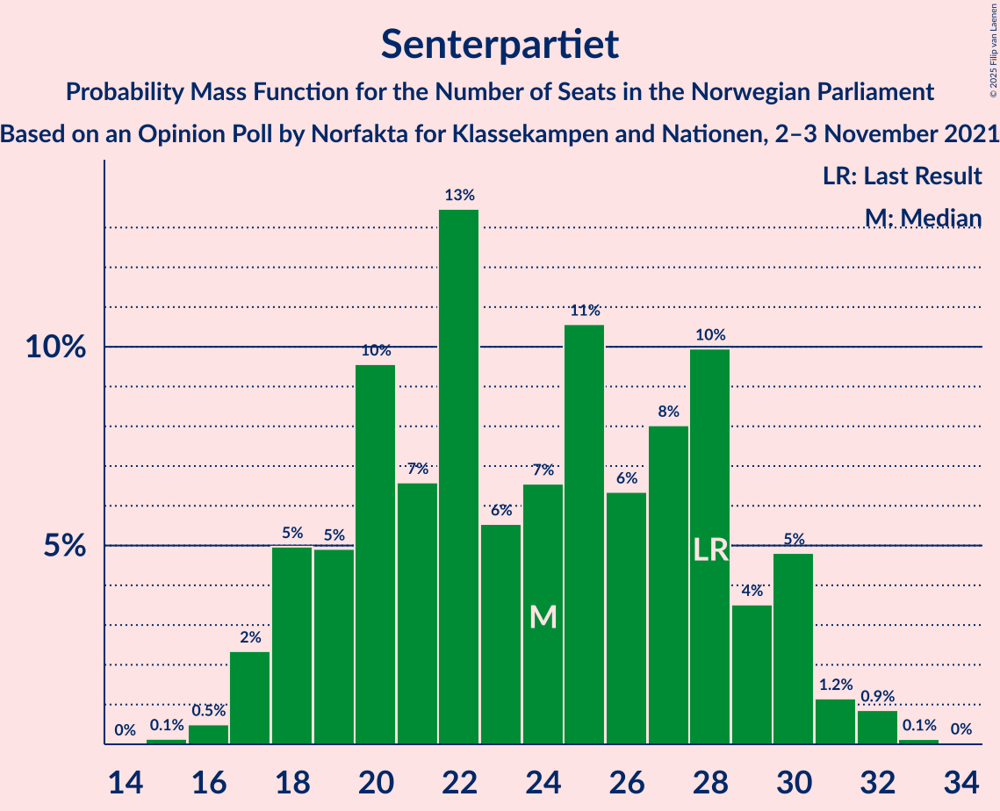

| Number of Seats | Probability | Accumulated | Special Marks |
|:---------------:|:-----------:|:-----------:|:-------------:|
| 15 | 0.1% | 100% |  |
| 16 | 0.5% | 99.9% |  |
| 17 | 2% | 99.4% |  |
| 18 | 5% | 97% |  |
| 19 | 5% | 92% |  |
| 20 | 10% | 87% |  |
| 21 | 7% | 78% |  |
| 22 | 13% | 71% |  |
| 23 | 6% | 58% |  |
| 24 | 7% | 52% | Median |
| 25 | 11% | 45% |  |
| 26 | 6% | 35% |  |
| 27 | 8% | 28% |  |
| 28 | 10% | 20% | Last Result |
| 29 | 4% | 11% |  |
| 30 | 5% | 7% |  |
| 31 | 1.2% | 2% |  |
| 32 | 0.9% | 1.0% |  |
| 33 | 0.1% | 0.2% |  |
| 34 | 0% | 0% |  |

### Fremskrittspartiet

*For a full overview of the results for this party, see the [Fremskrittspartiet](party-fremskrittspartiet.html) page.*

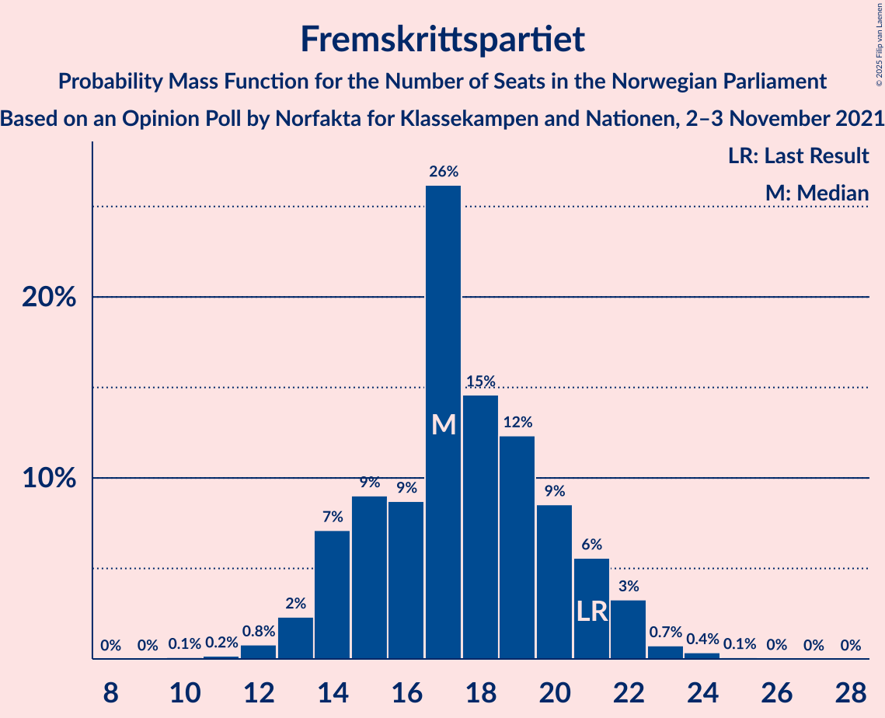

| Number of Seats | Probability | Accumulated | Special Marks |
|:---------------:|:-----------:|:-----------:|:-------------:|
| 10 | 0.1% | 100% |  |
| 11 | 0.2% | 99.9% |  |
| 12 | 0.8% | 99.7% |  |
| 13 | 2% | 98.9% |  |
| 14 | 7% | 97% |  |
| 15 | 9% | 90% |  |
| 16 | 9% | 80% |  |
| 17 | 26% | 72% | Median |
| 18 | 15% | 46% |  |
| 19 | 12% | 31% |  |
| 20 | 9% | 19% |  |
| 21 | 6% | 10% | Last Result |
| 22 | 3% | 5% |  |
| 23 | 0.7% | 1.2% |  |
| 24 | 0.4% | 0.5% |  |
| 25 | 0.1% | 0.1% |  |
| 26 | 0% | 0.1% |  |
| 27 | 0% | 0% |  |

### Sosialistisk Venstreparti

*For a full overview of the results for this party, see the [Sosialistisk Venstreparti](party-sosialistiskvenstreparti.html) page.*

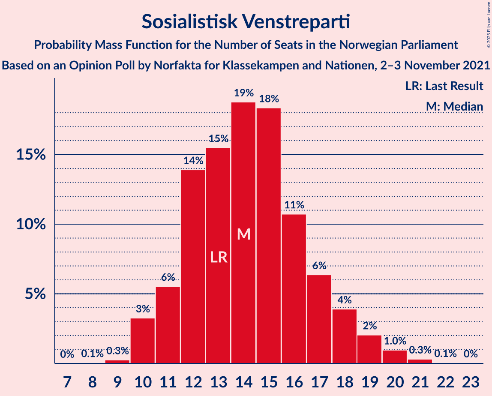

| Number of Seats | Probability | Accumulated | Special Marks |
|:---------------:|:-----------:|:-----------:|:-------------:|
| 8 | 0.1% | 100% |  |
| 9 | 0.3% | 99.9% |  |
| 10 | 3% | 99.7% |  |
| 11 | 6% | 96% |  |
| 12 | 14% | 91% |  |
| 13 | 15% | 77% | Last Result |
| 14 | 19% | 62% | Median |
| 15 | 18% | 43% |  |
| 16 | 11% | 24% |  |
| 17 | 6% | 14% |  |
| 18 | 4% | 7% |  |
| 19 | 2% | 3% |  |
| 20 | 1.0% | 1.4% |  |
| 21 | 0.3% | 0.4% |  |
| 22 | 0.1% | 0.1% |  |
| 23 | 0% | 0% |  |

### Venstre

*For a full overview of the results for this party, see the [Venstre](party-venstre.html) page.*

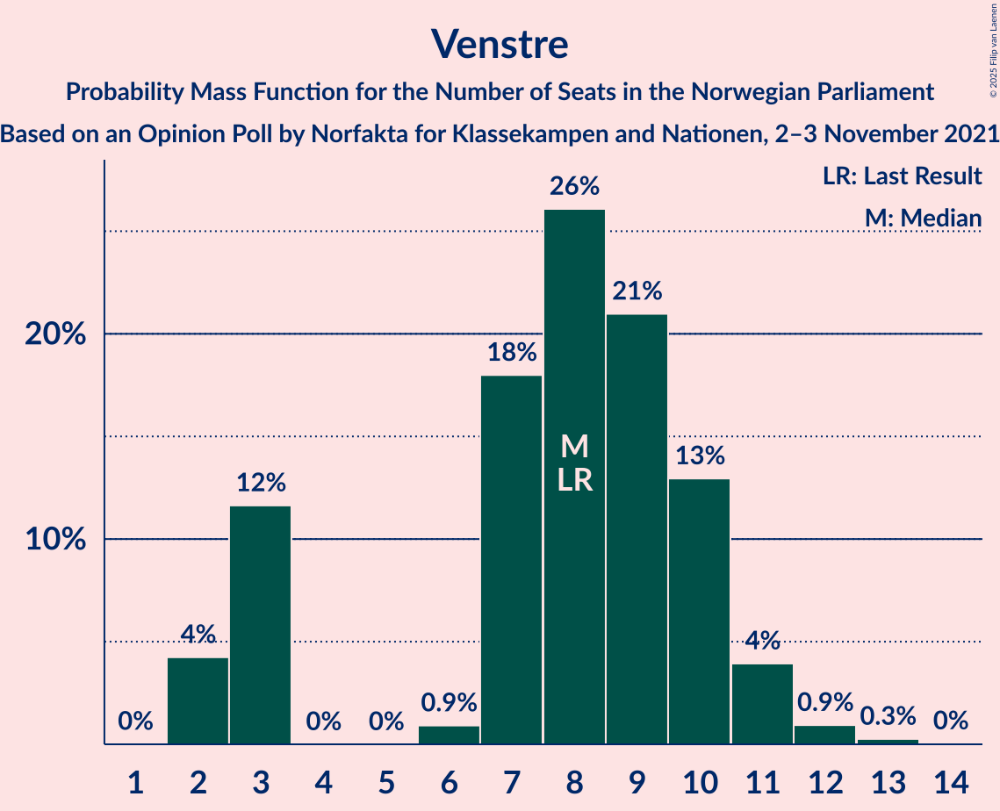

| Number of Seats | Probability | Accumulated | Special Marks |
|:---------------:|:-----------:|:-----------:|:-------------:|
| 2 | 4% | 100% |  |
| 3 | 12% | 96% |  |
| 4 | 0% | 84% |  |
| 5 | 0% | 84% |  |
| 6 | 0.9% | 84% |  |
| 7 | 18% | 83% |  |
| 8 | 26% | 65% | Last Result, Median |
| 9 | 21% | 39% |  |
| 10 | 13% | 18% |  |
| 11 | 4% | 5% |  |
| 12 | 0.9% | 1.2% |  |
| 13 | 0.3% | 0.3% |  |
| 14 | 0% | 0% |  |

### Rødt

*For a full overview of the results for this party, see the [Rødt](party-rødt.html) page.*

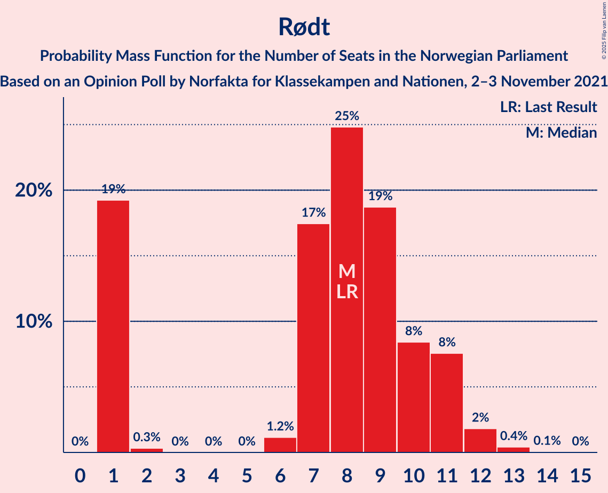

| Number of Seats | Probability | Accumulated | Special Marks |
|:---------------:|:-----------:|:-----------:|:-------------:|
| 1 | 19% | 100% |  |
| 2 | 0.3% | 81% |  |
| 3 | 0% | 80% |  |
| 4 | 0% | 80% |  |
| 5 | 0% | 80% |  |
| 6 | 1.2% | 80% |  |
| 7 | 17% | 79% |  |
| 8 | 25% | 62% | Last Result, Median |
| 9 | 19% | 37% |  |
| 10 | 8% | 18% |  |
| 11 | 8% | 10% |  |
| 12 | 2% | 2% |  |
| 13 | 0.4% | 0.5% |  |
| 14 | 0.1% | 0.1% |  |
| 15 | 0% | 0% |  |

### Miljøpartiet De Grønne

*For a full overview of the results for this party, see the [Miljøpartiet De Grønne](party-miljøpartietdegrønne.html) page.*

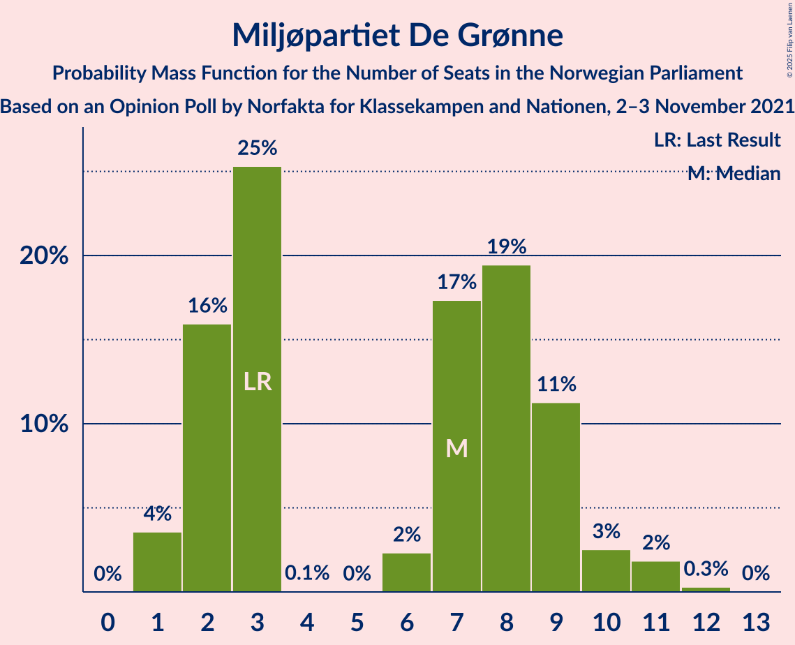

| Number of Seats | Probability | Accumulated | Special Marks |
|:---------------:|:-----------:|:-----------:|:-------------:|
| 1 | 4% | 100% |  |
| 2 | 16% | 96% |  |
| 3 | 25% | 80% | Last Result |
| 4 | 0.1% | 55% |  |
| 5 | 0% | 55% |  |
| 6 | 2% | 55% |  |
| 7 | 17% | 53% | Median |
| 8 | 19% | 35% |  |
| 9 | 11% | 16% |  |
| 10 | 3% | 5% |  |
| 11 | 2% | 2% |  |
| 12 | 0.3% | 0.3% |  |
| 13 | 0% | 0% |  |

### Kristelig Folkeparti

*For a full overview of the results for this party, see the [Kristelig Folkeparti](party-kristeligfolkeparti.html) page.*

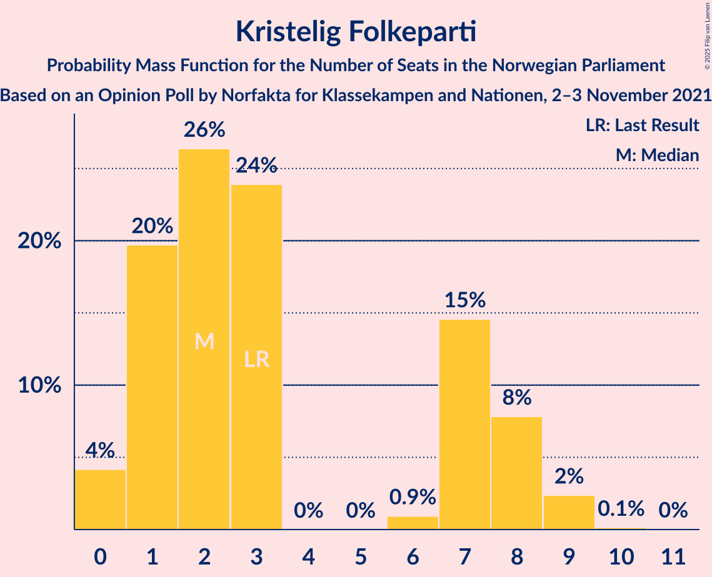

| Number of Seats | Probability | Accumulated | Special Marks |
|:---------------:|:-----------:|:-----------:|:-------------:|
| 0 | 4% | 100% |  |
| 1 | 20% | 96% |  |
| 2 | 26% | 76% | Median |
| 3 | 24% | 50% | Last Result |
| 4 | 0% | 26% |  |
| 5 | 0% | 26% |  |
| 6 | 0.9% | 26% |  |
| 7 | 15% | 25% |  |
| 8 | 8% | 10% |  |
| 9 | 2% | 3% |  |
| 10 | 0.1% | 0.2% |  |
| 11 | 0% | 0% |  |

## Coalitions

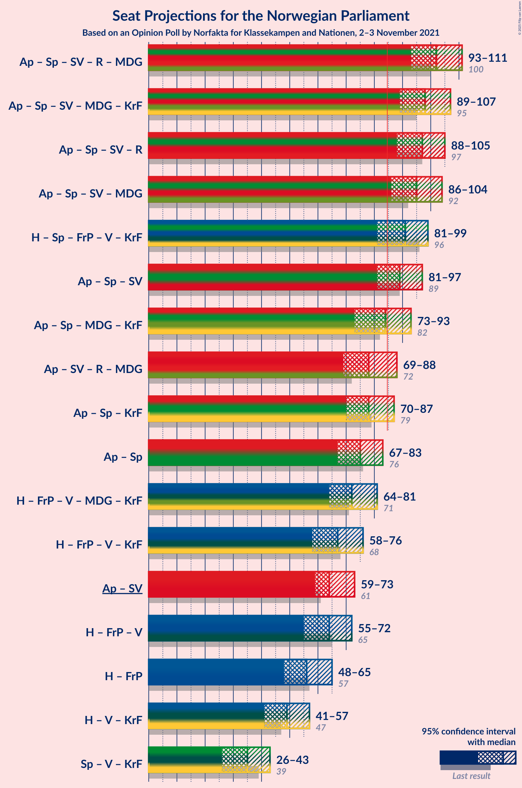

### Confidence Intervals

| Coalition | Last Result | Median | Majority? | 80% Confidence Interval | 90% Confidence Interval | 95% Confidence Interval | 99% Confidence Interval |
|:---------:|:-----------:|:------:|:---------:|:-----------------------:|:-----------------------:|:-----------------------:|:-----------------------:|
| Arbeiderpartiet – Senterpartiet – Sosialistisk Venstreparti – Rødt – Miljøpartiet De Grønne | 100 | 102 | 100% | 96–107 | 95–109 | 93–111 | 90–113 |
| Arbeiderpartiet – Senterpartiet – Sosialistisk Venstreparti – Miljøpartiet De Grønne – Kristelig Folkeparti | 95 | 98 | 100% | 93–104 | 91–106 | 89–107 | 88–109 |
| Arbeiderpartiet – Senterpartiet – Sosialistisk Venstreparti – Rødt | 97 | 97 | 99.8% | 90–102 | 89–104 | 88–105 | 85–108 |
| Arbeiderpartiet – Senterpartiet – Sosialistisk Venstreparti – Miljøpartiet De Grønne | 92 | 95 | 99.2% | 89–100 | 86–102 | 86–104 | 84–107 |
| Høyre – Senterpartiet – Fremskrittspartiet – Venstre – Kristelig Folkeparti | 96 | 91 | 90% | 84–97 | 83–98 | 81–99 | 79–101 |
| Arbeiderpartiet – Senterpartiet – Sosialistisk Venstreparti | 89 | 89 | 86% | 83–95 | 83–96 | 81–97 | 79–100 |
| Arbeiderpartiet – Senterpartiet – Miljøpartiet De Grønne – Kristelig Folkeparti | 82 | 84 | 45% | 78–90 | 76–91 | 73–93 | 72–95 |
| Arbeiderpartiet – Sosialistisk Venstreparti – Rødt – Miljøpartiet De Grønne | 72 | 78 | 9% | 72–84 | 71–86 | 69–88 | 67–90 |
| Arbeiderpartiet – Senterpartiet – Kristelig Folkeparti | 79 | 78 | 8% | 73–84 | 71–85 | 70–87 | 67–89 |
| Arbeiderpartiet – Senterpartiet | 76 | 75 | 0.6% | 70–80 | 68–81 | 67–83 | 64–85 |
| Høyre – Fremskrittspartiet – Venstre – Miljøpartiet De Grønne – Kristelig Folkeparti | 71 | 72 | 0.1% | 66–78 | 65–80 | 64–81 | 61–84 |
| Høyre – Fremskrittspartiet – Venstre – Kristelig Folkeparti | 68 | 67 | 0% | 61–72 | 60–74 | 58–76 | 55–79 |
| Arbeiderpartiet – Sosialistisk Venstreparti | 61 | 64 | 0% | 61–72 | 60–72 | 59–73 | 57–75 |
| Høyre – Fremskrittspartiet – Venstre | 65 | 64 | 0% | 57–69 | 56–70 | 55–72 | 53–74 |
| Høyre – Fremskrittspartiet | 57 | 56 | 0% | 51–61 | 49–62 | 48–65 | 46–67 |
| Høyre – Venstre – Kristelig Folkeparti | 47 | 49 | 0% | 44–55 | 43–56 | 41–57 | 39–59 |
| Senterpartiet – Venstre – Kristelig Folkeparti | 39 | 35 | 0% | 29–40 | 28–42 | 26–43 | 24–47 |

### Arbeiderpartiet – Senterpartiet – Sosialistisk Venstreparti – Rødt – Miljøpartiet De Grønne

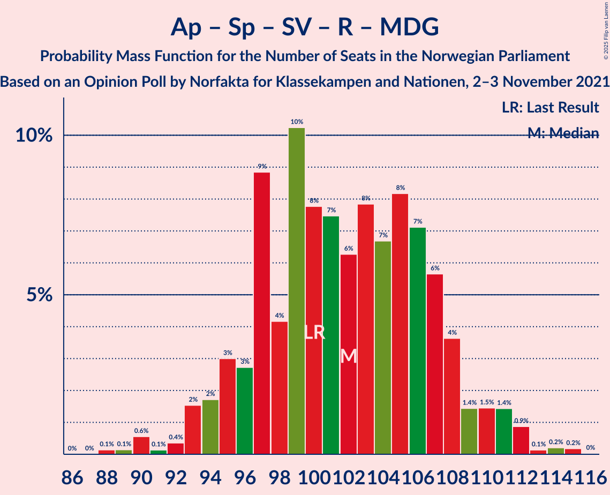

| Number of Seats | Probability | Accumulated | Special Marks |
|:---------------:|:-----------:|:-----------:|:-------------:|
| 88 | 0.1% | 100% |  |
| 89 | 0.1% | 99.8% |  |
| 90 | 0.6% | 99.7% |  |
| 91 | 0.1% | 99.1% |  |
| 92 | 0.4% | 99.0% |  |
| 93 | 2% | 98.6% |  |
| 94 | 2% | 97% |  |
| 95 | 3% | 95% |  |
| 96 | 3% | 92% |  |
| 97 | 9% | 90% |  |
| 98 | 4% | 81% |  |
| 99 | 10% | 77% |  |
| 100 | 8% | 66% | Last Result |
| 101 | 7% | 59% |  |
| 102 | 6% | 51% |  |
| 103 | 8% | 45% |  |
| 104 | 7% | 37% | Median |
| 105 | 8% | 30% |  |
| 106 | 7% | 22% |  |
| 107 | 6% | 15% |  |
| 108 | 4% | 9% |  |
| 109 | 1.4% | 6% |  |
| 110 | 1.5% | 4% |  |
| 111 | 1.4% | 3% |  |
| 112 | 0.9% | 1.4% |  |
| 113 | 0.1% | 0.6% |  |
| 114 | 0.2% | 0.4% |  |
| 115 | 0.2% | 0.2% |  |
| 116 | 0% | 0% |  |

### Arbeiderpartiet – Senterpartiet – Sosialistisk Venstreparti – Miljøpartiet De Grønne – Kristelig Folkeparti

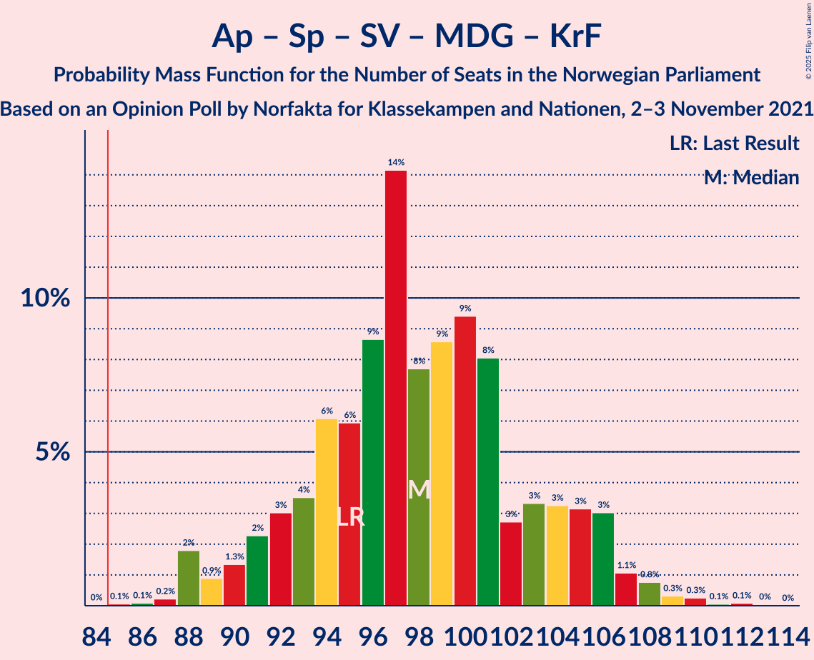

| Number of Seats | Probability | Accumulated | Special Marks |
|:---------------:|:-----------:|:-----------:|:-------------:|
| 85 | 0.1% | 100% | Majority |
| 86 | 0.1% | 99.9% |  |
| 87 | 0.2% | 99.8% |  |
| 88 | 2% | 99.6% |  |
| 89 | 0.9% | 98% |  |
| 90 | 1.3% | 97% |  |
| 91 | 2% | 96% |  |
| 92 | 3% | 93% |  |
| 93 | 4% | 90% |  |
| 94 | 6% | 87% |  |
| 95 | 6% | 81% | Last Result |
| 96 | 9% | 75% |  |
| 97 | 14% | 66% |  |
| 98 | 8% | 52% | Median |
| 99 | 9% | 44% |  |
| 100 | 9% | 36% |  |
| 101 | 8% | 26% |  |
| 102 | 3% | 18% |  |
| 103 | 3% | 15% |  |
| 104 | 3% | 12% |  |
| 105 | 3% | 9% |  |
| 106 | 3% | 6% |  |
| 107 | 1.1% | 3% |  |
| 108 | 0.8% | 2% |  |
| 109 | 0.3% | 0.8% |  |
| 110 | 0.3% | 0.5% |  |
| 111 | 0.1% | 0.2% |  |
| 112 | 0.1% | 0.1% |  |
| 113 | 0% | 0.1% |  |
| 114 | 0% | 0% |  |

### Arbeiderpartiet – Senterpartiet – Sosialistisk Venstreparti – Rødt

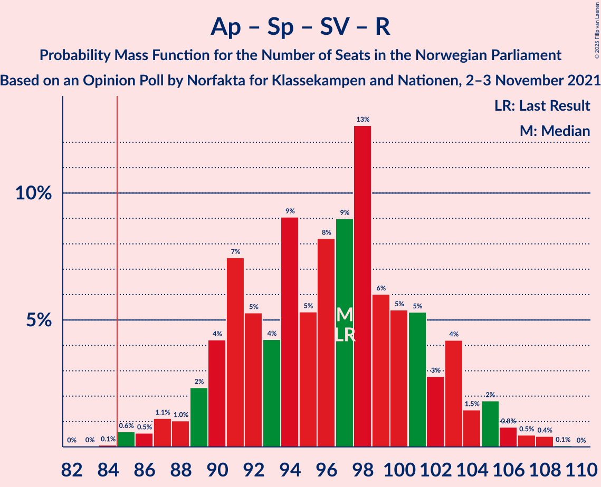

| Number of Seats | Probability | Accumulated | Special Marks |
|:---------------:|:-----------:|:-----------:|:-------------:|
| 82 | 0% | 100% |  |
| 83 | 0% | 99.9% |  |
| 84 | 0.1% | 99.9% |  |
| 85 | 0.6% | 99.8% | Majority |
| 86 | 0.5% | 99.2% |  |
| 87 | 1.1% | 98.7% |  |
| 88 | 1.0% | 98% |  |
| 89 | 2% | 97% |  |
| 90 | 4% | 94% |  |
| 91 | 7% | 90% |  |
| 92 | 5% | 83% |  |
| 93 | 4% | 77% |  |
| 94 | 9% | 73% |  |
| 95 | 5% | 64% |  |
| 96 | 8% | 59% |  |
| 97 | 9% | 50% | Last Result, Median |
| 98 | 13% | 41% |  |
| 99 | 6% | 29% |  |
| 100 | 5% | 23% |  |
| 101 | 5% | 17% |  |
| 102 | 3% | 12% |  |
| 103 | 4% | 9% |  |
| 104 | 1.5% | 5% |  |
| 105 | 2% | 4% |  |
| 106 | 0.8% | 2% |  |
| 107 | 0.5% | 1.0% |  |
| 108 | 0.4% | 0.5% |  |
| 109 | 0.1% | 0.1% |  |
| 110 | 0% | 0% |  |

### Arbeiderpartiet – Senterpartiet – Sosialistisk Venstreparti – Miljøpartiet De Grønne

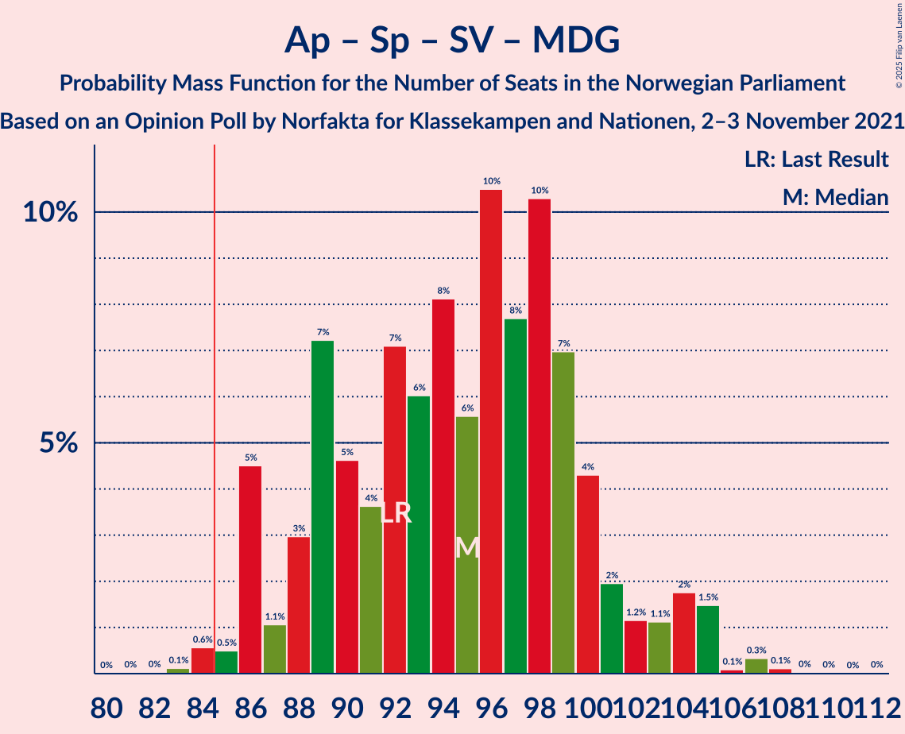

| Number of Seats | Probability | Accumulated | Special Marks |
|:---------------:|:-----------:|:-----------:|:-------------:|
| 81 | 0% | 100% |  |
| 82 | 0% | 99.9% |  |
| 83 | 0.1% | 99.9% |  |
| 84 | 0.6% | 99.8% |  |
| 85 | 0.5% | 99.2% | Majority |
| 86 | 5% | 98.7% |  |
| 87 | 1.1% | 94% |  |
| 88 | 3% | 93% |  |
| 89 | 7% | 90% |  |
| 90 | 5% | 83% |  |
| 91 | 4% | 78% |  |
| 92 | 7% | 75% | Last Result |
| 93 | 6% | 68% |  |
| 94 | 8% | 62% |  |
| 95 | 6% | 53% |  |
| 96 | 10% | 48% | Median |
| 97 | 8% | 37% |  |
| 98 | 10% | 30% |  |
| 99 | 7% | 19% |  |
| 100 | 4% | 12% |  |
| 101 | 2% | 8% |  |
| 102 | 1.2% | 6% |  |
| 103 | 1.1% | 5% |  |
| 104 | 2% | 4% |  |
| 105 | 1.5% | 2% |  |
| 106 | 0.1% | 0.6% |  |
| 107 | 0.3% | 0.5% |  |
| 108 | 0.1% | 0.2% |  |
| 109 | 0% | 0.1% |  |
| 110 | 0% | 0.1% |  |
| 111 | 0% | 0% |  |

### Høyre – Senterpartiet – Fremskrittspartiet – Venstre – Kristelig Folkeparti

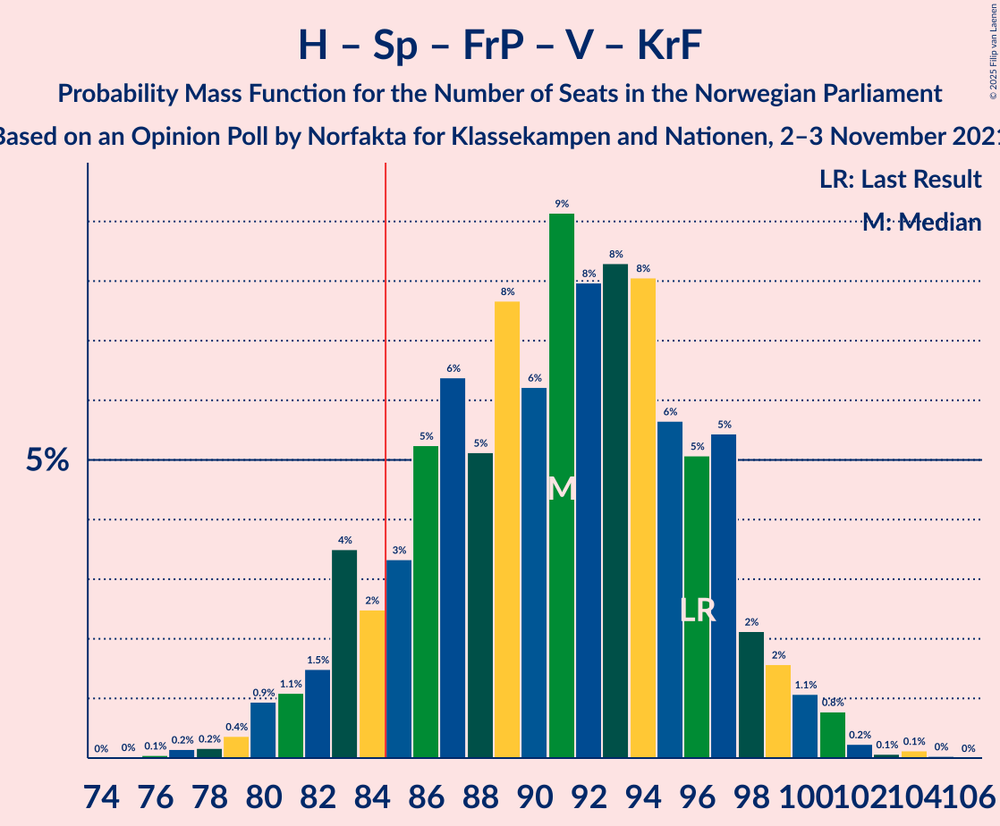

| Number of Seats | Probability | Accumulated | Special Marks |
|:---------------:|:-----------:|:-----------:|:-------------:|
| 76 | 0.1% | 100% |  |
| 77 | 0.2% | 99.9% |  |
| 78 | 0.2% | 99.8% |  |
| 79 | 0.4% | 99.6% |  |
| 80 | 0.9% | 99.2% |  |
| 81 | 1.1% | 98% |  |
| 82 | 1.5% | 97% |  |
| 83 | 4% | 96% |  |
| 84 | 2% | 92% |  |
| 85 | 3% | 90% | Majority |
| 86 | 5% | 86% |  |
| 87 | 6% | 81% |  |
| 88 | 5% | 75% |  |
| 89 | 8% | 70% |  |
| 90 | 6% | 62% | Median |
| 91 | 9% | 56% |  |
| 92 | 8% | 47% |  |
| 93 | 8% | 39% |  |
| 94 | 8% | 30% |  |
| 95 | 6% | 22% |  |
| 96 | 5% | 17% | Last Result |
| 97 | 5% | 11% |  |
| 98 | 2% | 6% |  |
| 99 | 2% | 4% |  |
| 100 | 1.1% | 2% |  |
| 101 | 0.8% | 1.3% |  |
| 102 | 0.2% | 0.5% |  |
| 103 | 0.1% | 0.3% |  |
| 104 | 0.1% | 0.2% |  |
| 105 | 0% | 0.1% |  |
| 106 | 0% | 0% |  |

### Arbeiderpartiet – Senterpartiet – Sosialistisk Venstreparti

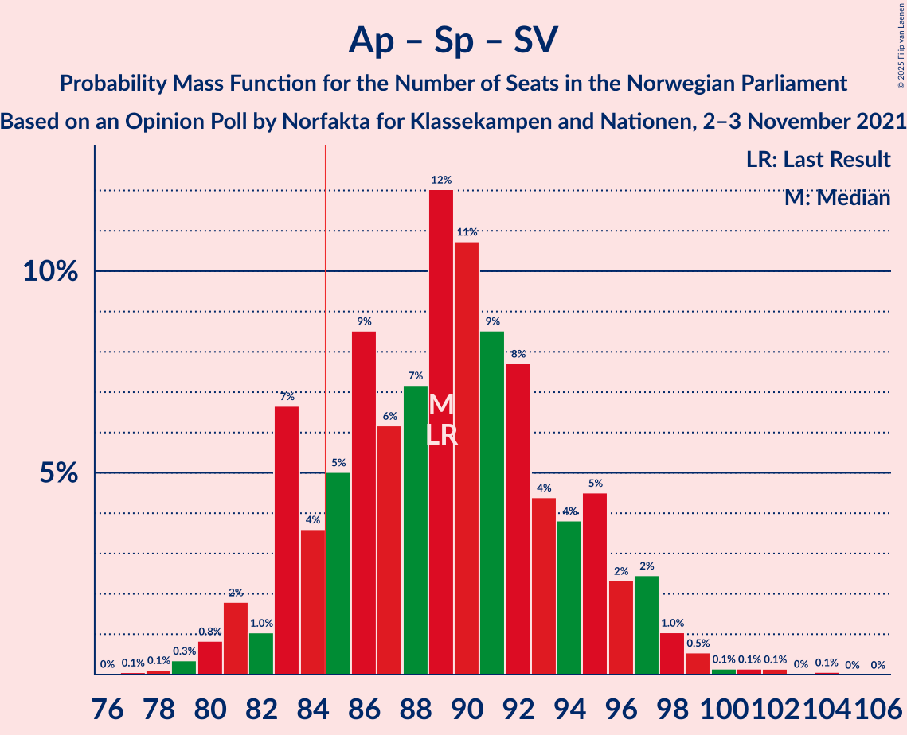

| Number of Seats | Probability | Accumulated | Special Marks |
|:---------------:|:-----------:|:-----------:|:-------------:|
| 77 | 0.1% | 100% |  |
| 78 | 0.1% | 99.9% |  |
| 79 | 0.3% | 99.8% |  |
| 80 | 0.8% | 99.4% |  |
| 81 | 2% | 98.6% |  |
| 82 | 1.0% | 97% |  |
| 83 | 7% | 96% |  |
| 84 | 4% | 89% |  |
| 85 | 5% | 86% | Majority |
| 86 | 9% | 80% |  |
| 87 | 6% | 72% |  |
| 88 | 7% | 66% |  |
| 89 | 12% | 59% | Last Result, Median |
| 90 | 11% | 47% |  |
| 91 | 9% | 36% |  |
| 92 | 8% | 27% |  |
| 93 | 4% | 20% |  |
| 94 | 4% | 15% |  |
| 95 | 5% | 11% |  |
| 96 | 2% | 7% |  |
| 97 | 2% | 5% |  |
| 98 | 1.0% | 2% |  |
| 99 | 0.5% | 1.1% |  |
| 100 | 0.1% | 0.5% |  |
| 101 | 0.1% | 0.4% |  |
| 102 | 0.1% | 0.2% |  |
| 103 | 0% | 0.1% |  |
| 104 | 0.1% | 0.1% |  |
| 105 | 0% | 0% |  |

### Arbeiderpartiet – Senterpartiet – Miljøpartiet De Grønne – Kristelig Folkeparti

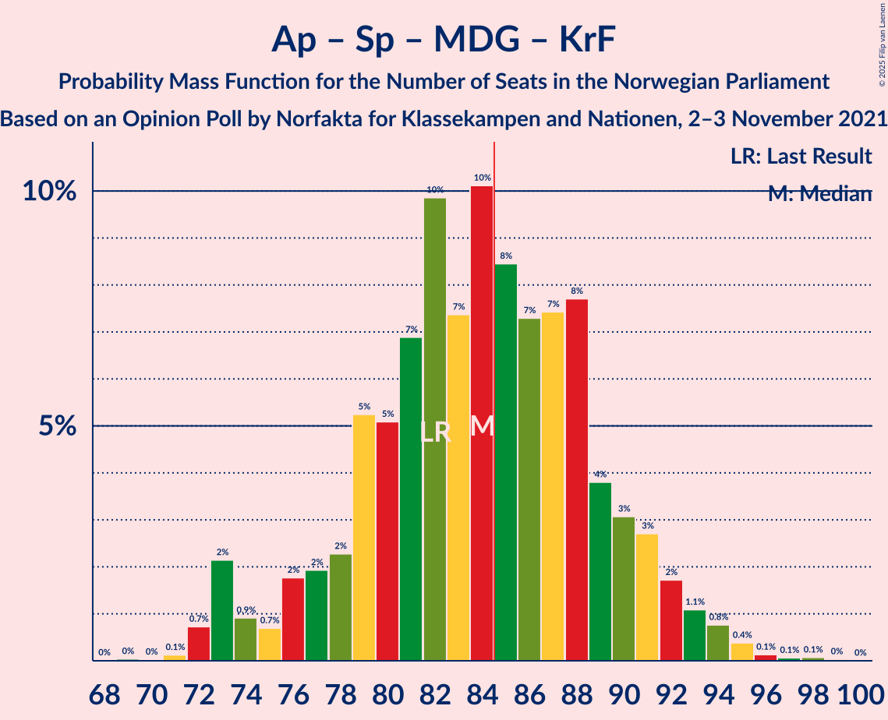

| Number of Seats | Probability | Accumulated | Special Marks |
|:---------------:|:-----------:|:-----------:|:-------------:|
| 69 | 0% | 100% |  |
| 70 | 0% | 99.9% |  |
| 71 | 0.1% | 99.9% |  |
| 72 | 0.7% | 99.8% |  |
| 73 | 2% | 99.1% |  |
| 74 | 0.9% | 97% |  |
| 75 | 0.7% | 96% |  |
| 76 | 2% | 95% |  |
| 77 | 2% | 94% |  |
| 78 | 2% | 92% |  |
| 79 | 5% | 89% |  |
| 80 | 5% | 84% |  |
| 81 | 7% | 79% |  |
| 82 | 10% | 72% | Last Result |
| 83 | 7% | 62% |  |
| 84 | 10% | 55% | Median |
| 85 | 8% | 45% | Majority |
| 86 | 7% | 36% |  |
| 87 | 7% | 29% |  |
| 88 | 8% | 22% |  |
| 89 | 4% | 14% |  |
| 90 | 3% | 10% |  |
| 91 | 3% | 7% |  |
| 92 | 2% | 4% |  |
| 93 | 1.1% | 3% |  |
| 94 | 0.8% | 1.5% |  |
| 95 | 0.4% | 0.7% |  |
| 96 | 0.1% | 0.3% |  |
| 97 | 0.1% | 0.2% |  |
| 98 | 0.1% | 0.1% |  |
| 99 | 0% | 0% |  |

### Arbeiderpartiet – Sosialistisk Venstreparti – Rødt – Miljøpartiet De Grønne

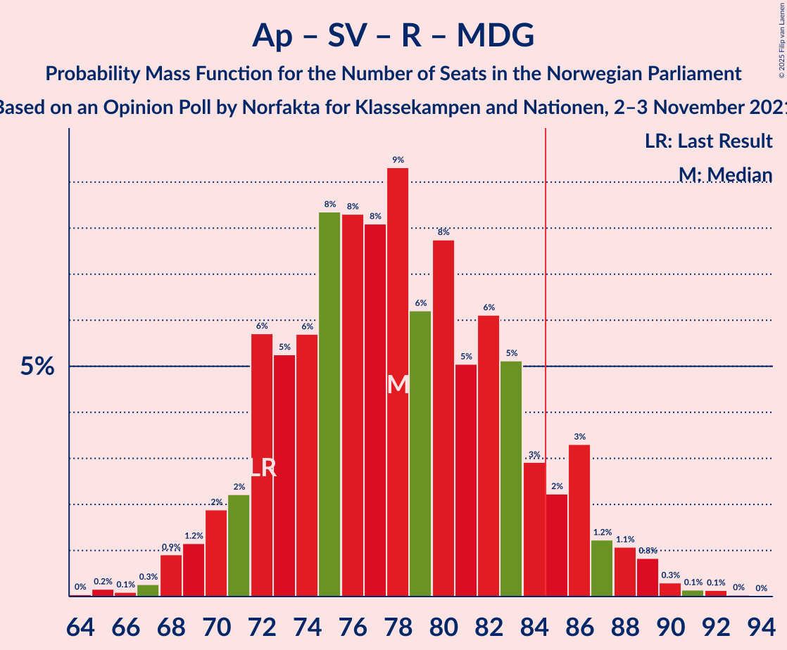

| Number of Seats | Probability | Accumulated | Special Marks |
|:---------------:|:-----------:|:-----------:|:-------------:|
| 64 | 0% | 100% |  |
| 65 | 0.2% | 99.9% |  |
| 66 | 0.1% | 99.8% |  |
| 67 | 0.3% | 99.7% |  |
| 68 | 0.9% | 99.4% |  |
| 69 | 1.2% | 98% |  |
| 70 | 2% | 97% |  |
| 71 | 2% | 95% |  |
| 72 | 6% | 93% | Last Result |
| 73 | 5% | 88% |  |
| 74 | 6% | 82% |  |
| 75 | 8% | 77% |  |
| 76 | 8% | 68% |  |
| 77 | 8% | 60% |  |
| 78 | 9% | 52% |  |
| 79 | 6% | 42% |  |
| 80 | 8% | 36% | Median |
| 81 | 5% | 29% |  |
| 82 | 6% | 23% |  |
| 83 | 5% | 17% |  |
| 84 | 3% | 12% |  |
| 85 | 2% | 9% | Majority |
| 86 | 3% | 7% |  |
| 87 | 1.2% | 4% |  |
| 88 | 1.1% | 3% |  |
| 89 | 0.8% | 1.5% |  |
| 90 | 0.3% | 0.6% |  |
| 91 | 0.1% | 0.3% |  |
| 92 | 0.1% | 0.2% |  |
| 93 | 0% | 0.1% |  |
| 94 | 0% | 0% |  |

### Arbeiderpartiet – Senterpartiet – Kristelig Folkeparti

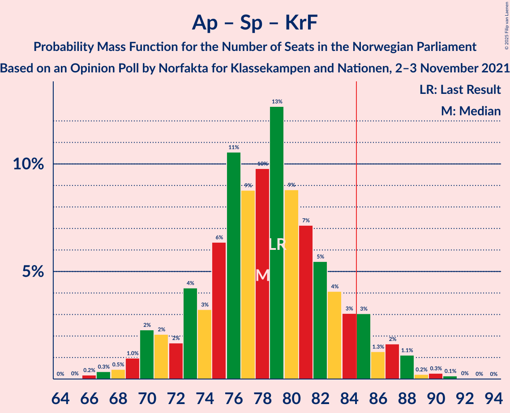

| Number of Seats | Probability | Accumulated | Special Marks |
|:---------------:|:-----------:|:-----------:|:-------------:|
| 65 | 0% | 100% |  |
| 66 | 0.2% | 99.9% |  |
| 67 | 0.3% | 99.8% |  |
| 68 | 0.5% | 99.4% |  |
| 69 | 1.0% | 99.0% |  |
| 70 | 2% | 98% |  |
| 71 | 2% | 96% |  |
| 72 | 2% | 94% |  |
| 73 | 4% | 92% |  |
| 74 | 3% | 88% |  |
| 75 | 6% | 84% |  |
| 76 | 11% | 78% |  |
| 77 | 9% | 68% | Median |
| 78 | 10% | 59% |  |
| 79 | 13% | 49% | Last Result |
| 80 | 9% | 36% |  |
| 81 | 7% | 28% |  |
| 82 | 5% | 20% |  |
| 83 | 4% | 15% |  |
| 84 | 3% | 11% |  |
| 85 | 3% | 8% | Majority |
| 86 | 1.3% | 5% |  |
| 87 | 2% | 3% |  |
| 88 | 1.1% | 2% |  |
| 89 | 0.2% | 0.7% |  |
| 90 | 0.3% | 0.5% |  |
| 91 | 0.1% | 0.2% |  |
| 92 | 0% | 0.1% |  |
| 93 | 0% | 0% |  |

### Arbeiderpartiet – Senterpartiet

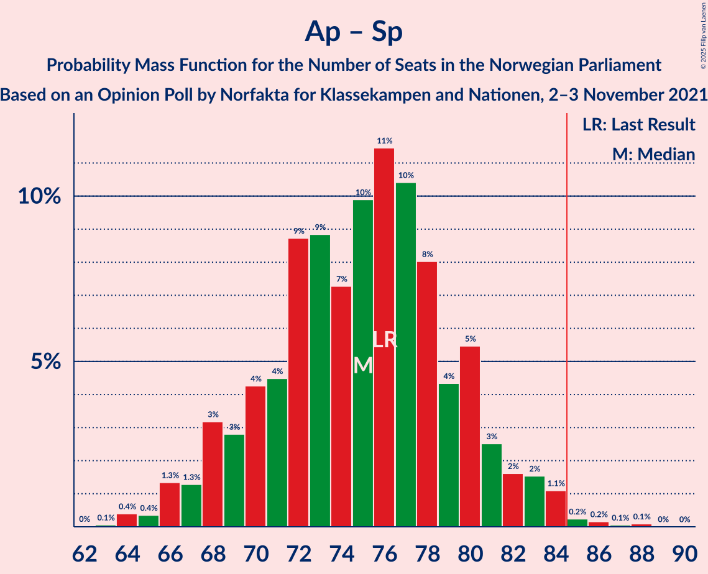

| Number of Seats | Probability | Accumulated | Special Marks |
|:---------------:|:-----------:|:-----------:|:-------------:|
| 62 | 0% | 100% |  |
| 63 | 0.1% | 99.9% |  |
| 64 | 0.4% | 99.9% |  |
| 65 | 0.4% | 99.5% |  |
| 66 | 1.3% | 99.1% |  |
| 67 | 1.3% | 98% |  |
| 68 | 3% | 97% |  |
| 69 | 3% | 93% |  |
| 70 | 4% | 91% |  |
| 71 | 4% | 86% |  |
| 72 | 9% | 82% |  |
| 73 | 9% | 73% |  |
| 74 | 7% | 64% |  |
| 75 | 10% | 57% | Median |
| 76 | 11% | 47% | Last Result |
| 77 | 10% | 36% |  |
| 78 | 8% | 25% |  |
| 79 | 4% | 17% |  |
| 80 | 5% | 13% |  |
| 81 | 3% | 7% |  |
| 82 | 2% | 5% |  |
| 83 | 2% | 3% |  |
| 84 | 1.1% | 2% |  |
| 85 | 0.2% | 0.6% | Majority |
| 86 | 0.2% | 0.3% |  |
| 87 | 0.1% | 0.2% |  |
| 88 | 0.1% | 0.1% |  |
| 89 | 0% | 0% |  |

### Høyre – Fremskrittspartiet – Venstre – Miljøpartiet De Grønne – Kristelig Folkeparti

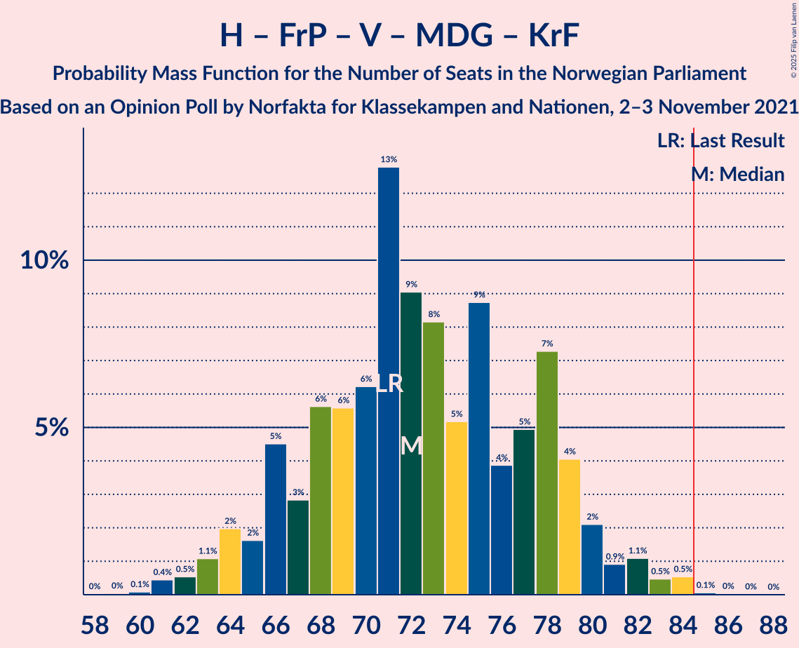

| Number of Seats | Probability | Accumulated | Special Marks |
|:---------------:|:-----------:|:-----------:|:-------------:|
| 59 | 0% | 100% |  |
| 60 | 0.1% | 99.9% |  |
| 61 | 0.4% | 99.8% |  |
| 62 | 0.5% | 99.4% |  |
| 63 | 1.1% | 98.8% |  |
| 64 | 2% | 98% |  |
| 65 | 2% | 96% |  |
| 66 | 5% | 94% |  |
| 67 | 3% | 90% |  |
| 68 | 6% | 87% |  |
| 69 | 6% | 81% |  |
| 70 | 6% | 76% |  |
| 71 | 13% | 69% | Last Result |
| 72 | 9% | 57% |  |
| 73 | 8% | 48% | Median |
| 74 | 5% | 39% |  |
| 75 | 9% | 34% |  |
| 76 | 4% | 25% |  |
| 77 | 5% | 22% |  |
| 78 | 7% | 17% |  |
| 79 | 4% | 9% |  |
| 80 | 2% | 5% |  |
| 81 | 0.9% | 3% |  |
| 82 | 1.1% | 2% |  |
| 83 | 0.5% | 1.1% |  |
| 84 | 0.5% | 0.7% |  |
| 85 | 0.1% | 0.1% | Majority |
| 86 | 0% | 0.1% |  |
| 87 | 0% | 0% |  |

### Høyre – Fremskrittspartiet – Venstre – Kristelig Folkeparti

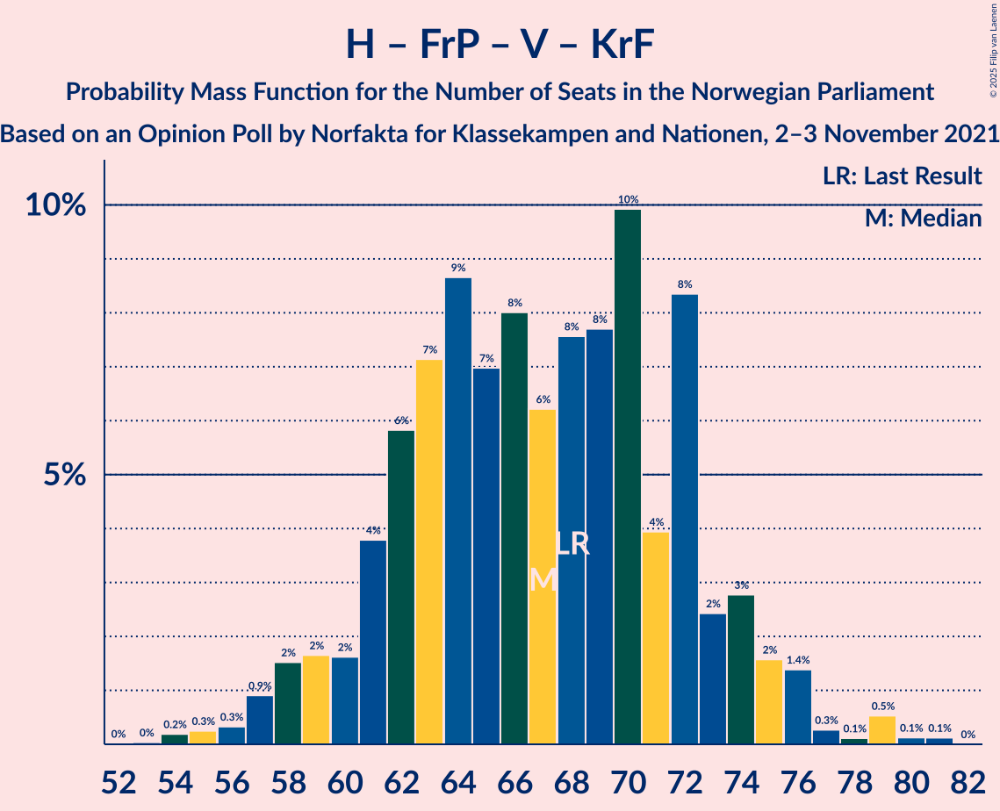

| Number of Seats | Probability | Accumulated | Special Marks |
|:---------------:|:-----------:|:-----------:|:-------------:|
| 53 | 0% | 100% |  |
| 54 | 0.2% | 99.9% |  |
| 55 | 0.3% | 99.7% |  |
| 56 | 0.3% | 99.5% |  |
| 57 | 0.9% | 99.2% |  |
| 58 | 2% | 98% |  |
| 59 | 2% | 97% |  |
| 60 | 2% | 95% |  |
| 61 | 4% | 93% |  |
| 62 | 6% | 90% |  |
| 63 | 7% | 84% |  |
| 64 | 9% | 77% |  |
| 65 | 7% | 68% |  |
| 66 | 8% | 61% | Median |
| 67 | 6% | 53% |  |
| 68 | 8% | 47% | Last Result |
| 69 | 8% | 39% |  |
| 70 | 10% | 32% |  |
| 71 | 4% | 22% |  |
| 72 | 8% | 18% |  |
| 73 | 2% | 9% |  |
| 74 | 3% | 7% |  |
| 75 | 2% | 4% |  |
| 76 | 1.4% | 3% |  |
| 77 | 0.3% | 1.2% |  |
| 78 | 0.1% | 0.9% |  |
| 79 | 0.5% | 0.8% |  |
| 80 | 0.1% | 0.3% |  |
| 81 | 0.1% | 0.1% |  |
| 82 | 0% | 0% |  |

### Arbeiderpartiet – Sosialistisk Venstreparti

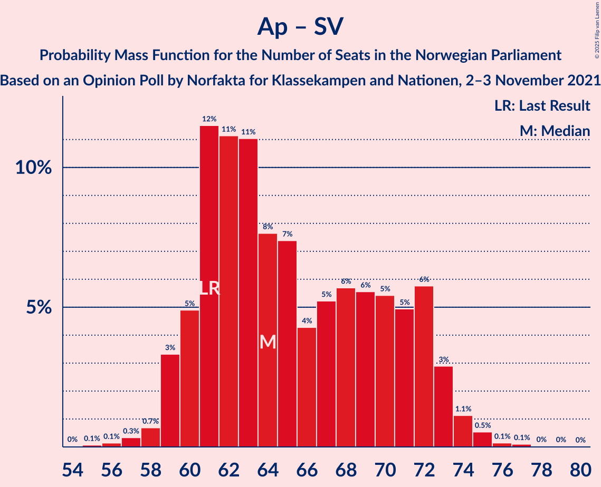

| Number of Seats | Probability | Accumulated | Special Marks |
|:---------------:|:-----------:|:-----------:|:-------------:|
| 54 | 0% | 100% |  |
| 55 | 0.1% | 99.9% |  |
| 56 | 0.1% | 99.9% |  |
| 57 | 0.3% | 99.7% |  |
| 58 | 0.7% | 99.4% |  |
| 59 | 3% | 98.7% |  |
| 60 | 5% | 95% |  |
| 61 | 12% | 90% | Last Result |
| 62 | 11% | 79% |  |
| 63 | 11% | 68% |  |
| 64 | 8% | 57% |  |
| 65 | 7% | 49% | Median |
| 66 | 4% | 42% |  |
| 67 | 5% | 37% |  |
| 68 | 6% | 32% |  |
| 69 | 6% | 27% |  |
| 70 | 5% | 21% |  |
| 71 | 5% | 16% |  |
| 72 | 6% | 11% |  |
| 73 | 3% | 5% |  |
| 74 | 1.1% | 2% |  |
| 75 | 0.5% | 0.9% |  |
| 76 | 0.1% | 0.3% |  |
| 77 | 0.1% | 0.2% |  |
| 78 | 0% | 0.1% |  |
| 79 | 0% | 0% |  |

### Høyre – Fremskrittspartiet – Venstre

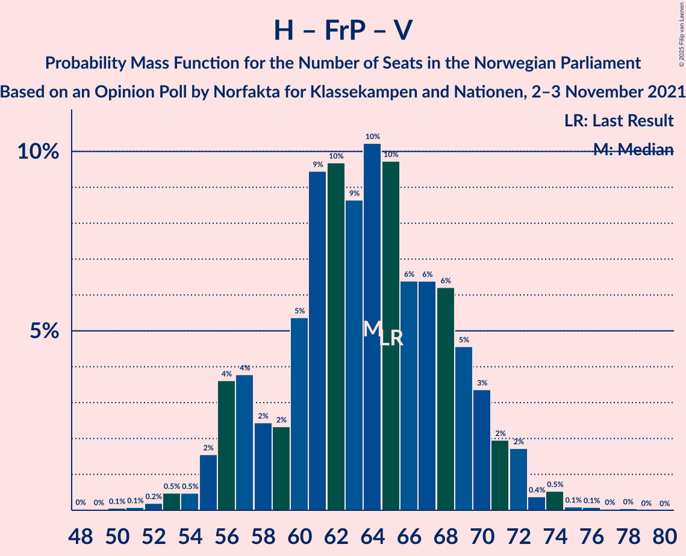

| Number of Seats | Probability | Accumulated | Special Marks |
|:---------------:|:-----------:|:-----------:|:-------------:|
| 49 | 0% | 100% |  |
| 50 | 0.1% | 99.9% |  |
| 51 | 0.1% | 99.9% |  |
| 52 | 0.2% | 99.8% |  |
| 53 | 0.5% | 99.6% |  |
| 54 | 0.5% | 99.1% |  |
| 55 | 2% | 98.6% |  |
| 56 | 4% | 97% |  |
| 57 | 4% | 93% |  |
| 58 | 2% | 90% |  |
| 59 | 2% | 87% |  |
| 60 | 5% | 85% |  |
| 61 | 9% | 80% |  |
| 62 | 10% | 70% |  |
| 63 | 9% | 60% |  |
| 64 | 10% | 52% | Median |
| 65 | 10% | 42% | Last Result |
| 66 | 6% | 32% |  |
| 67 | 6% | 25% |  |
| 68 | 6% | 19% |  |
| 69 | 5% | 13% |  |
| 70 | 3% | 8% |  |
| 71 | 2% | 5% |  |
| 72 | 2% | 3% |  |
| 73 | 0.4% | 1.2% |  |
| 74 | 0.5% | 0.8% |  |
| 75 | 0.1% | 0.3% |  |
| 76 | 0.1% | 0.2% |  |
| 77 | 0% | 0.1% |  |
| 78 | 0% | 0.1% |  |
| 79 | 0% | 0% |  |

### Høyre – Fremskrittspartiet

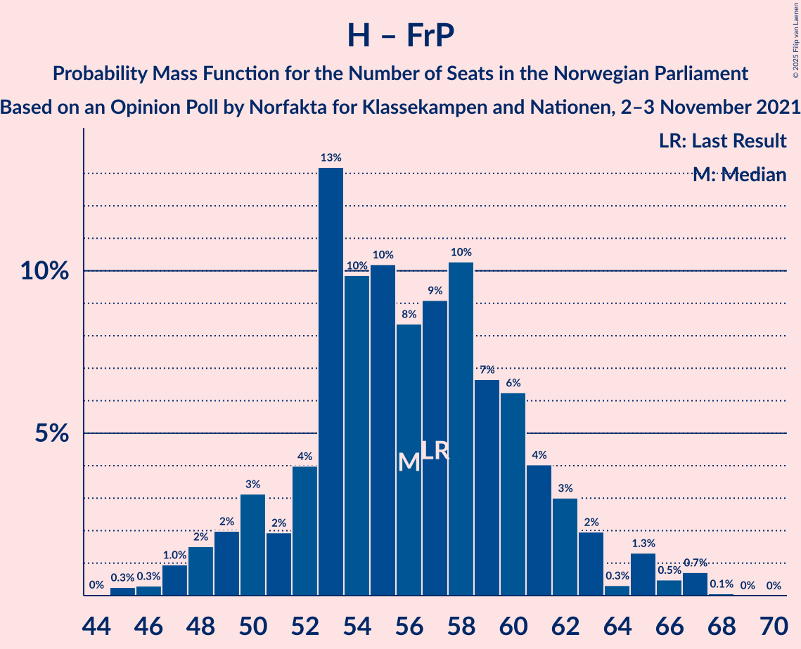

| Number of Seats | Probability | Accumulated | Special Marks |
|:---------------:|:-----------:|:-----------:|:-------------:|
| 44 | 0% | 100% |  |
| 45 | 0.3% | 99.9% |  |
| 46 | 0.3% | 99.7% |  |
| 47 | 1.0% | 99.4% |  |
| 48 | 2% | 98% |  |
| 49 | 2% | 97% |  |
| 50 | 3% | 95% |  |
| 51 | 2% | 92% |  |
| 52 | 4% | 90% |  |
| 53 | 13% | 86% |  |
| 54 | 10% | 73% |  |
| 55 | 10% | 63% |  |
| 56 | 8% | 53% | Median |
| 57 | 9% | 44% | Last Result |
| 58 | 10% | 35% |  |
| 59 | 7% | 25% |  |
| 60 | 6% | 18% |  |
| 61 | 4% | 12% |  |
| 62 | 3% | 8% |  |
| 63 | 2% | 5% |  |
| 64 | 0.3% | 3% |  |
| 65 | 1.3% | 3% |  |
| 66 | 0.5% | 1.3% |  |
| 67 | 0.7% | 0.8% |  |
| 68 | 0.1% | 0.1% |  |
| 69 | 0% | 0% |  |

### Høyre – Venstre – Kristelig Folkeparti

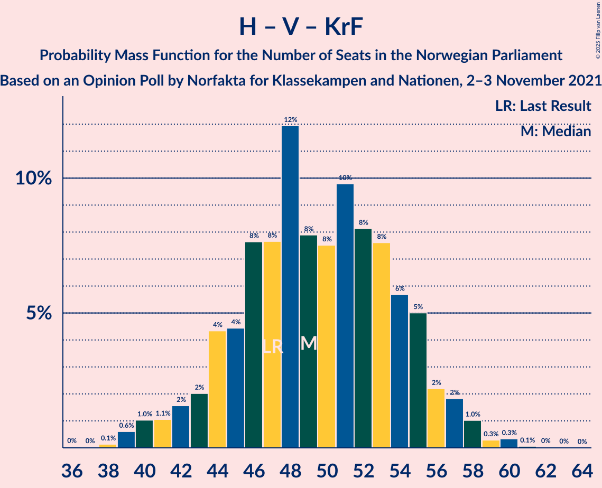

| Number of Seats | Probability | Accumulated | Special Marks |
|:---------------:|:-----------:|:-----------:|:-------------:|
| 36 | 0% | 100% |  |
| 37 | 0% | 99.9% |  |
| 38 | 0.1% | 99.9% |  |
| 39 | 0.6% | 99.8% |  |
| 40 | 1.0% | 99.2% |  |
| 41 | 1.1% | 98% |  |
| 42 | 2% | 97% |  |
| 43 | 2% | 96% |  |
| 44 | 4% | 93% |  |
| 45 | 4% | 89% |  |
| 46 | 8% | 85% |  |
| 47 | 8% | 77% | Last Result |
| 48 | 12% | 69% |  |
| 49 | 8% | 57% | Median |
| 50 | 8% | 50% |  |
| 51 | 10% | 42% |  |
| 52 | 8% | 32% |  |
| 53 | 8% | 24% |  |
| 54 | 6% | 17% |  |
| 55 | 5% | 11% |  |
| 56 | 2% | 6% |  |
| 57 | 2% | 4% |  |
| 58 | 1.0% | 2% |  |
| 59 | 0.3% | 0.8% |  |
| 60 | 0.3% | 0.5% |  |
| 61 | 0.1% | 0.1% |  |
| 62 | 0% | 0.1% |  |
| 63 | 0% | 0% |  |

### Senterpartiet – Venstre – Kristelig Folkeparti

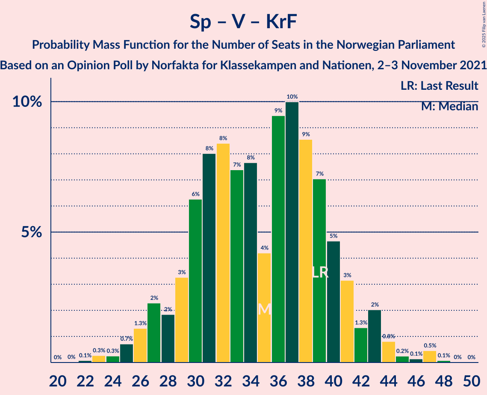

| Number of Seats | Probability | Accumulated | Special Marks |
|:---------------:|:-----------:|:-----------:|:-------------:|
| 22 | 0.1% | 100% |  |
| 23 | 0.3% | 99.9% |  |
| 24 | 0.3% | 99.6% |  |
| 25 | 0.7% | 99.4% |  |
| 26 | 1.3% | 98.7% |  |
| 27 | 2% | 97% |  |
| 28 | 2% | 95% |  |
| 29 | 3% | 93% |  |
| 30 | 6% | 90% |  |
| 31 | 8% | 84% |  |
| 32 | 8% | 76% |  |
| 33 | 7% | 67% |  |
| 34 | 8% | 60% | Median |
| 35 | 4% | 52% |  |
| 36 | 9% | 48% |  |
| 37 | 10% | 39% |  |
| 38 | 9% | 29% |  |
| 39 | 7% | 20% | Last Result |
| 40 | 5% | 13% |  |
| 41 | 3% | 8% |  |
| 42 | 1.3% | 5% |  |
| 43 | 2% | 4% |  |
| 44 | 0.8% | 2% |  |
| 45 | 0.2% | 1.0% |  |
| 46 | 0.1% | 0.7% |  |
| 47 | 0.5% | 0.6% |  |
| 48 | 0.1% | 0.1% |  |
| 49 | 0% | 0% |  |

## Technical Information

### Opinion Poll

+ **Polling firm:** Norfakta
+ **Commissioner(s):** Klassekampen and Nationen
+ **Fieldwork period:** 2–3 November 2021

### Calculations

+ **Sample size:** 731
+ **Simulations done:** 1,048,576
+ **Error estimate:** 2.23%

