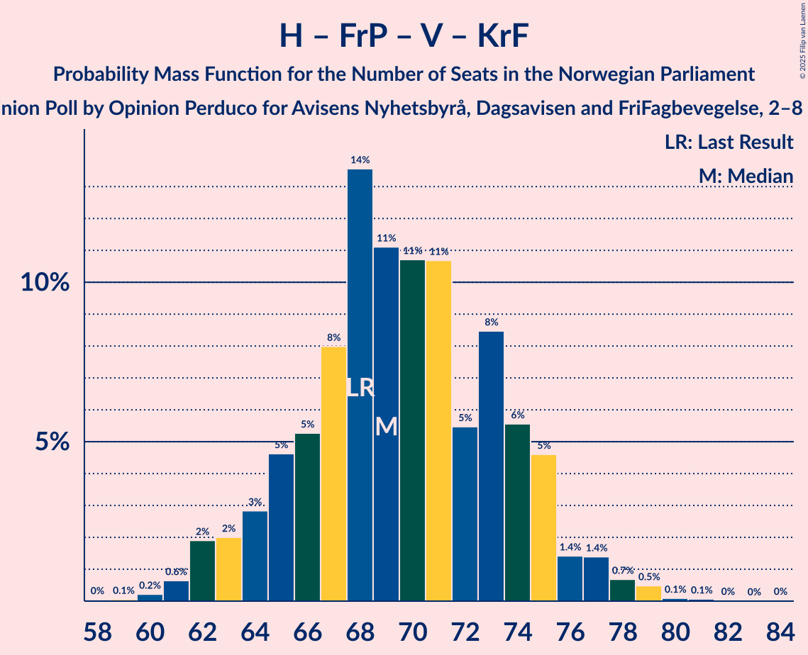

# Opinion Poll by Opinion Perduco for Avisens Nyhetsbyrå, Dagsavisen and FriFagbevegelse, 2–8 November 2021

<a href="#voting-intentions">Voting Intentions</a> | <a href="#seats">Seats</a> | <a href="#coalitions">Coalitions</a> | <a href="#technical-information">Technical Information</a>

## Voting Intentions

### Confidence Intervals

| Party | Last Result | Poll Result | 80% Confidence Interval | 90% Confidence Interval | 95% Confidence Interval | 99% Confidence Interval |
|:-----:|:-----------:|:-----------:|:-----------------------:|:-----------------------:|:-----------------------:|:-----------------------:|
| Arbeiderpartiet | 26.2% | 26.0% | 24.2–27.9% |23.7–28.4% |23.3–28.9% |22.5–29.8% |
| Høyre | 20.4% | 20.9% | 19.3–22.6% |18.8–23.2% |18.4–23.6% |17.7–24.4% |
| Senterpartiet | 13.5% | 13.3% | 12.0–14.8% |11.6–15.2% |11.3–15.6% |10.7–16.4% |
| Fremskrittspartiet | 11.6% | 12.0% | 10.7–13.4% |10.3–13.8% |10.0–14.2% |9.5–14.9% |
| Sosialistisk Venstreparti | 7.6% | 8.8% | 7.8–10.1% |7.5–10.5% |7.2–10.8% |6.7–11.4% |
| Rødt | 4.7% | 5.3% | 4.5–6.4% |4.3–6.6% |4.1–6.9% |3.7–7.5% |
| Venstre | 4.6% | 4.8% | 4.0–5.8% |3.8–6.1% |3.6–6.3% |3.3–6.8% |
| Kristelig Folkeparti | 3.8% | 3.6% | 3.0–4.5% |2.8–4.8% |2.6–5.0% |2.3–5.5% |
| Miljøpartiet De Grønne | 3.9% | 3.0% | 2.4–3.9% |2.2–4.1% |2.1–4.3% |1.8–4.7% |

*Note:* The poll result column reflects the actual value used in the calculations. Published results may vary slightly, and in addition be rounded to fewer digits.

## Seats

### Confidence Intervals

| Party | Last Result | Median | 80% Confidence Interval | 90% Confidence Interval | 95% Confidence Interval | 99% Confidence Interval |
|:-----:|:-----------:|:------:|:-----------------------:|:-----------------------:|:-----------------------:|:-----------------------:|
| <a href="#arbeiderpartiet">Arbeiderpartiet</a> | 48 | 48 | 44–52 |43–52 |42–53 |40–55 |
| <a href="#høyre">Høyre</a> | 36 | 37 | 33–40 |32–41 |32–42 |30–44 |
| <a href="#senterpartiet">Senterpartiet</a> | 28 | 24 | 21–30 |21–31 |20–31 |18–32 |
| <a href="#fremskrittspartiet">Fremskrittspartiet</a> | 21 | 21 | 19–23 |18–24 |17–25 |16–26 |
| <a href="#sosialistisk-venstreparti">Sosialistisk Venstreparti</a> | 13 | 16 | 13–18 |13–19 |12–19 |11–21 |
| <a href="#rødt">Rødt</a> | 8 | 9 | 8–11 |7–12 |7–12 |1–13 |
| <a href="#venstre">Venstre</a> | 8 | 9 | 3–10 |3–11 |3–11 |2–12 |
| <a href="#kristelig-folkeparti">Kristelig Folkeparti</a> | 3 | 3 | 2–8 |2–8 |1–8 |1–9 |
| <a href="#miljøpartiet-de-grønne">Miljøpartiet De Grønne</a> | 3 | 2 | 1–3 |1–7 |1–7 |1–8 |

### Arbeiderpartiet

*For a full overview of the results for this party, see the [Arbeiderpartiet](party-arbeiderpartiet.html) page.*

| Number of Seats | Probability | Accumulated | Special Marks |
|:---------------:|:-----------:|:-----------:|:-------------:|
| 39 | 0.2% | 100% |  |
| 40 | 0.4% | 99.8% |  |
| 41 | 1.0% | 99.4% |  |
| 42 | 2% | 98% |  |
| 43 | 3% | 96% |  |
| 44 | 6% | 93% |  |
| 45 | 9% | 87% |  |
| 46 | 15% | 78% |  |
| 47 | 12% | 63% |  |
| 48 | 18% | 51% | Last Result, Median |
| 49 | 16% | 33% |  |
| 50 | 3% | 17% |  |
| 51 | 3% | 14% |  |
| 52 | 6% | 10% |  |
| 53 | 2% | 4% |  |
| 54 | 0.8% | 2% |  |
| 55 | 0.7% | 1.1% |  |
| 56 | 0.3% | 0.4% |  |
| 57 | 0.1% | 0.1% |  |
| 58 | 0% | 0% |  |

### Høyre

*For a full overview of the results for this party, see the [Høyre](party-høyre.html) page.*

| Number of Seats | Probability | Accumulated | Special Marks |
|:---------------:|:-----------:|:-----------:|:-------------:|
| 29 | 0.1% | 100% |  |
| 30 | 0.4% | 99.8% |  |
| 31 | 2% | 99.5% |  |
| 32 | 4% | 98% |  |
| 33 | 7% | 94% |  |
| 34 | 9% | 87% |  |
| 35 | 9% | 79% |  |
| 36 | 7% | 69% | Last Result |
| 37 | 18% | 63% | Median |
| 38 | 22% | 45% |  |
| 39 | 10% | 23% |  |
| 40 | 5% | 13% |  |
| 41 | 4% | 8% |  |
| 42 | 1.2% | 3% |  |
| 43 | 2% | 2% |  |
| 44 | 0.4% | 0.6% |  |
| 45 | 0.1% | 0.2% |  |
| 46 | 0.1% | 0.1% |  |
| 47 | 0% | 0% |  |

### Senterpartiet

*For a full overview of the results for this party, see the [Senterpartiet](party-senterpartiet.html) page.*

| Number of Seats | Probability | Accumulated | Special Marks |
|:---------------:|:-----------:|:-----------:|:-------------:|
| 17 | 0.1% | 100% |  |
| 18 | 0.6% | 99.9% |  |
| 19 | 1.3% | 99.3% |  |
| 20 | 2% | 98% |  |
| 21 | 6% | 96% |  |
| 22 | 21% | 90% |  |
| 23 | 17% | 69% |  |
| 24 | 8% | 51% | Median |
| 25 | 5% | 43% |  |
| 26 | 5% | 39% |  |
| 27 | 7% | 34% |  |
| 28 | 7% | 27% | Last Result |
| 29 | 7% | 20% |  |
| 30 | 5% | 12% |  |
| 31 | 6% | 7% |  |
| 32 | 0.8% | 1.0% |  |
| 33 | 0.1% | 0.1% |  |
| 34 | 0% | 0% |  |

### Fremskrittspartiet

*For a full overview of the results for this party, see the [Fremskrittspartiet](party-fremskrittspartiet.html) page.*

| Number of Seats | Probability | Accumulated | Special Marks |
|:---------------:|:-----------:|:-----------:|:-------------:|
| 15 | 0.1% | 100% |  |
| 16 | 0.5% | 99.9% |  |
| 17 | 2% | 99.4% |  |
| 18 | 7% | 97% |  |
| 19 | 17% | 91% |  |
| 20 | 22% | 74% |  |
| 21 | 16% | 52% | Last Result, Median |
| 22 | 16% | 36% |  |
| 23 | 10% | 20% |  |
| 24 | 7% | 10% |  |
| 25 | 2% | 3% |  |
| 26 | 1.1% | 2% |  |
| 27 | 0.3% | 0.4% |  |
| 28 | 0.1% | 0.2% |  |
| 29 | 0% | 0.1% |  |
| 30 | 0% | 0% |  |

### Sosialistisk Venstreparti

*For a full overview of the results for this party, see the [Sosialistisk Venstreparti](party-sosialistiskvenstreparti.html) page.*

| Number of Seats | Probability | Accumulated | Special Marks |
|:---------------:|:-----------:|:-----------:|:-------------:|
| 10 | 0.2% | 100% |  |
| 11 | 1.0% | 99.8% |  |
| 12 | 3% | 98.9% |  |
| 13 | 8% | 96% | Last Result |
| 14 | 18% | 88% |  |
| 15 | 16% | 70% |  |
| 16 | 24% | 54% | Median |
| 17 | 15% | 31% |  |
| 18 | 8% | 16% |  |
| 19 | 7% | 8% |  |
| 20 | 1.0% | 1.5% |  |
| 21 | 0.4% | 0.5% |  |
| 22 | 0.1% | 0.1% |  |
| 23 | 0% | 0% |  |

### Rødt

*For a full overview of the results for this party, see the [Rødt](party-rødt.html) page.*

| Number of Seats | Probability | Accumulated | Special Marks |
|:---------------:|:-----------:|:-----------:|:-------------:|
| 1 | 2% | 100% |  |
| 2 | 0.2% | 98% |  |
| 3 | 0% | 98% |  |
| 4 | 0% | 98% |  |
| 5 | 0% | 98% |  |
| 6 | 0.1% | 98% |  |
| 7 | 5% | 98% |  |
| 8 | 19% | 93% | Last Result |
| 9 | 24% | 74% | Median |
| 10 | 26% | 50% |  |
| 11 | 16% | 24% |  |
| 12 | 7% | 8% |  |
| 13 | 0.9% | 1.2% |  |
| 14 | 0.2% | 0.2% |  |
| 15 | 0% | 0% |  |

### Venstre

*For a full overview of the results for this party, see the [Venstre](party-venstre.html) page.*

| Number of Seats | Probability | Accumulated | Special Marks |
|:---------------:|:-----------:|:-----------:|:-------------:|
| 2 | 0.8% | 100% |  |
| 3 | 10% | 99.2% |  |
| 4 | 0% | 89% |  |
| 5 | 0% | 89% |  |
| 6 | 0% | 89% |  |
| 7 | 12% | 89% |  |
| 8 | 27% | 77% | Last Result |
| 9 | 30% | 50% | Median |
| 10 | 14% | 21% |  |
| 11 | 6% | 7% |  |
| 12 | 0.9% | 1.1% |  |
| 13 | 0.1% | 0.2% |  |
| 14 | 0% | 0% |  |

### Kristelig Folkeparti

*For a full overview of the results for this party, see the [Kristelig Folkeparti](party-kristeligfolkeparti.html) page.*

| Number of Seats | Probability | Accumulated | Special Marks |
|:---------------:|:-----------:|:-----------:|:-------------:|
| 0 | 0.2% | 100% |  |
| 1 | 4% | 99.8% |  |
| 2 | 32% | 96% |  |
| 3 | 37% | 64% | Last Result, Median |
| 4 | 0% | 27% |  |
| 5 | 0% | 27% |  |
| 6 | 0.2% | 27% |  |
| 7 | 15% | 27% |  |
| 8 | 10% | 12% |  |
| 9 | 2% | 2% |  |
| 10 | 0.3% | 0.3% |  |
| 11 | 0% | 0% |  |

### Miljøpartiet De Grønne

*For a full overview of the results for this party, see the [Miljøpartiet De Grønne](party-miljøpartietdegrønne.html) page.*

| Number of Seats | Probability | Accumulated | Special Marks |
|:---------------:|:-----------:|:-----------:|:-------------:|
| 0 | 0.1% | 100% |  |
| 1 | 48% | 99.9% |  |
| 2 | 30% | 52% | Median |
| 3 | 15% | 22% | Last Result |
| 4 | 0% | 7% |  |
| 5 | 0% | 7% |  |
| 6 | 0.3% | 7% |  |
| 7 | 5% | 7% |  |
| 8 | 2% | 2% |  |
| 9 | 0.1% | 0.1% |  |
| 10 | 0% | 0% |  |

## Coalitions

### Confidence Intervals

| Coalition | Last Result | Median | Majority? | 80% Confidence Interval | 90% Confidence Interval | 95% Confidence Interval | 99% Confidence Interval |
|:---------:|:-----------:|:------:|:---------:|:-----------------------:|:-----------------------:|:-----------------------:|:-----------------------:|
| Arbeiderpartiet – Senterpartiet – Sosialistisk Venstreparti – Rødt – Miljøpartiet De Grønne | 100 | 100 | 100% | 95–104 | 94–105 | 92–107 | 90–108 |
| Arbeiderpartiet – Senterpartiet – Sosialistisk Venstreparti – Rødt | 97 | 98 | 100% | 93–102 | 92–103 | 90–104 | 88–106 |
| Høyre – Senterpartiet – Fremskrittspartiet – Venstre – Kristelig Folkeparti | 96 | 95 | 99.8% | 90–99 | 89–101 | 88–102 | 85–103 |
| Arbeiderpartiet – Senterpartiet – Sosialistisk Venstreparti – Kristelig Folkeparti – Miljøpartiet De Grønne | 95 | 93 | 99.5% | 90–99 | 89–100 | 87–101 | 85–104 |
| Arbeiderpartiet – Senterpartiet – Sosialistisk Venstreparti – Miljøpartiet De Grønne | 92 | 90 | 94% | 86–95 | 84–96 | 83–98 | 81–99 |
| Arbeiderpartiet – Senterpartiet – Sosialistisk Venstreparti | 89 | 88 | 86% | 84–92 | 82–94 | 81–94 | 79–96 |
| Arbeiderpartiet – Senterpartiet – Kristelig Folkeparti – Miljøpartiet De Grønne | 82 | 78 | 8% | 73–84 | 72–86 | 71–87 | 69–89 |
| Arbeiderpartiet – Senterpartiet – Kristelig Folkeparti | 79 | 76 | 2% | 71–82 | 70–83 | 69–84 | 67–87 |
| Arbeiderpartiet – Sosialistisk Venstreparti – Rødt – Miljøpartiet De Grønne | 72 | 74 | 0.2% | 70–79 | 68–80 | 67–81 | 66–83 |
| Arbeiderpartiet – Senterpartiet | 76 | 72 | 0% | 68–77 | 67–78 | 66–79 | 63–81 |
| Høyre – Fremskrittspartiet – Venstre – Kristelig Folkeparti – Miljøpartiet De Grønne | 71 | 71 | 0% | 67–76 | 66–77 | 65–79 | 63–81 |
| Høyre – Fremskrittspartiet – Venstre – Kristelig Folkeparti | 68 | 69 | 0% | 65–74 | 64–75 | 62–77 | 61–79 |
| Høyre – Fremskrittspartiet – Venstre | 65 | 66 | 0% | 61–70 | 60–72 | 59–72 | 57–75 |
| Arbeiderpartiet – Sosialistisk Venstreparti | 61 | 63 | 0% | 59–67 | 58–68 | 57–69 | 55–72 |
| Høyre – Fremskrittspartiet | 57 | 58 | 0% | 53–62 | 52–63 | 51–64 | 50–66 |
| Høyre – Venstre – Kristelig Folkeparti | 47 | 48 | 0% | 44–54 | 42–54 | 42–55 | 40–57 |
| Senterpartiet – Venstre – Kristelig Folkeparti | 39 | 36 | 0% | 32–43 | 30–44 | 28–46 | 28–47 |

### Arbeiderpartiet – Senterpartiet – Sosialistisk Venstreparti – Rødt – Miljøpartiet De Grønne

| Number of Seats | Probability | Accumulated | Special Marks |
|:---------------:|:-----------:|:-----------:|:-------------:|
| 87 | 0% | 100% |  |
| 88 | 0.1% | 99.9% |  |
| 89 | 0.1% | 99.9% |  |
| 90 | 0.5% | 99.7% |  |
| 91 | 0.7% | 99.3% |  |
| 92 | 1.4% | 98.5% |  |
| 93 | 2% | 97% |  |
| 94 | 4% | 95% |  |
| 95 | 6% | 91% |  |
| 96 | 8% | 85% |  |
| 97 | 6% | 77% |  |
| 98 | 11% | 71% |  |
| 99 | 11% | 61% | Median |
| 100 | 11% | 50% | Last Result |
| 101 | 14% | 39% |  |
| 102 | 8% | 25% |  |
| 103 | 5% | 18% |  |
| 104 | 5% | 12% |  |
| 105 | 3% | 8% |  |
| 106 | 2% | 5% |  |
| 107 | 2% | 3% |  |
| 108 | 0.6% | 1.0% |  |
| 109 | 0.2% | 0.3% |  |
| 110 | 0.1% | 0.1% |  |
| 111 | 0% | 0.1% |  |
| 112 | 0% | 0% |  |

### Arbeiderpartiet – Senterpartiet – Sosialistisk Venstreparti – Rødt

| Number of Seats | Probability | Accumulated | Special Marks |
|:---------------:|:-----------:|:-----------:|:-------------:|
| 85 | 0% | 100% | Majority |
| 86 | 0.1% | 99.9% |  |
| 87 | 0.2% | 99.8% |  |
| 88 | 0.4% | 99.6% |  |
| 89 | 0.9% | 99.2% |  |
| 90 | 2% | 98% |  |
| 91 | 1.4% | 97% |  |
| 92 | 4% | 95% |  |
| 93 | 8% | 91% |  |
| 94 | 8% | 84% |  |
| 95 | 7% | 76% |  |
| 96 | 4% | 69% |  |
| 97 | 14% | 65% | Last Result, Median |
| 98 | 10% | 52% |  |
| 99 | 15% | 42% |  |
| 100 | 11% | 27% |  |
| 101 | 6% | 16% |  |
| 102 | 5% | 10% |  |
| 103 | 1.3% | 5% |  |
| 104 | 2% | 4% |  |
| 105 | 2% | 2% |  |
| 106 | 0.6% | 0.8% |  |
| 107 | 0.1% | 0.1% |  |
| 108 | 0.1% | 0.1% |  |
| 109 | 0% | 0% |  |

### Høyre – Senterpartiet – Fremskrittspartiet – Venstre – Kristelig Folkeparti

| Number of Seats | Probability | Accumulated | Special Marks |
|:---------------:|:-----------:|:-----------:|:-------------:|
| 82 | 0% | 100% |  |
| 83 | 0.1% | 99.9% |  |
| 84 | 0.1% | 99.9% |  |
| 85 | 0.3% | 99.8% | Majority |
| 86 | 0.4% | 99.5% |  |
| 87 | 0.5% | 99.1% |  |
| 88 | 2% | 98.5% |  |
| 89 | 2% | 96% |  |
| 90 | 6% | 94% |  |
| 91 | 13% | 88% |  |
| 92 | 7% | 75% |  |
| 93 | 12% | 69% |  |
| 94 | 6% | 56% | Median |
| 95 | 9% | 51% |  |
| 96 | 15% | 42% | Last Result |
| 97 | 6% | 27% |  |
| 98 | 7% | 21% |  |
| 99 | 5% | 13% |  |
| 100 | 3% | 8% |  |
| 101 | 2% | 5% |  |
| 102 | 2% | 3% |  |
| 103 | 0.7% | 1.1% |  |
| 104 | 0.2% | 0.4% |  |
| 105 | 0.1% | 0.2% |  |
| 106 | 0.1% | 0.1% |  |
| 107 | 0% | 0% |  |

### Arbeiderpartiet – Senterpartiet – Sosialistisk Venstreparti – Kristelig Folkeparti – Miljøpartiet De Grønne

| Number of Seats | Probability | Accumulated | Special Marks |
|:---------------:|:-----------:|:-----------:|:-------------:|
| 83 | 0.1% | 100% |  |
| 84 | 0.4% | 99.9% |  |
| 85 | 0.8% | 99.5% | Majority |
| 86 | 0.8% | 98.8% |  |
| 87 | 1.2% | 98% |  |
| 88 | 2% | 97% |  |
| 89 | 4% | 95% |  |
| 90 | 7% | 92% |  |
| 91 | 16% | 85% |  |
| 92 | 7% | 69% |  |
| 93 | 12% | 62% | Median |
| 94 | 9% | 50% |  |
| 95 | 10% | 41% | Last Result |
| 96 | 9% | 31% |  |
| 97 | 4% | 22% |  |
| 98 | 7% | 18% |  |
| 99 | 3% | 11% |  |
| 100 | 3% | 8% |  |
| 101 | 2% | 5% |  |
| 102 | 0.9% | 2% |  |
| 103 | 0.6% | 1.3% |  |
| 104 | 0.3% | 0.7% |  |
| 105 | 0.3% | 0.4% |  |
| 106 | 0.1% | 0.2% |  |
| 107 | 0% | 0% |  |

### Arbeiderpartiet – Senterpartiet – Sosialistisk Venstreparti – Miljøpartiet De Grønne

| Number of Seats | Probability | Accumulated | Special Marks |
|:---------------:|:-----------:|:-----------:|:-------------:|
| 79 | 0.1% | 100% |  |
| 80 | 0.1% | 99.9% |  |
| 81 | 0.4% | 99.8% |  |
| 82 | 1.1% | 99.4% |  |
| 83 | 1.1% | 98% |  |
| 84 | 3% | 97% |  |
| 85 | 2% | 94% | Majority |
| 86 | 8% | 92% |  |
| 87 | 9% | 84% |  |
| 88 | 13% | 76% |  |
| 89 | 8% | 63% |  |
| 90 | 13% | 55% | Median |
| 91 | 9% | 42% |  |
| 92 | 5% | 33% | Last Result |
| 93 | 14% | 28% |  |
| 94 | 4% | 15% |  |
| 95 | 4% | 10% |  |
| 96 | 2% | 6% |  |
| 97 | 2% | 4% |  |
| 98 | 0.7% | 3% |  |
| 99 | 2% | 2% |  |
| 100 | 0.2% | 0.3% |  |
| 101 | 0.1% | 0.1% |  |
| 102 | 0% | 0% |  |

### Arbeiderpartiet – Senterpartiet – Sosialistisk Venstreparti

| Number of Seats | Probability | Accumulated | Special Marks |
|:---------------:|:-----------:|:-----------:|:-------------:|
| 77 | 0.1% | 100% |  |
| 78 | 0.2% | 99.9% |  |
| 79 | 0.4% | 99.7% |  |
| 80 | 1.2% | 99.3% |  |
| 81 | 0.7% | 98% |  |
| 82 | 3% | 97% |  |
| 83 | 3% | 94% |  |
| 84 | 5% | 91% |  |
| 85 | 11% | 86% | Majority |
| 86 | 7% | 75% |  |
| 87 | 12% | 68% |  |
| 88 | 11% | 56% | Median |
| 89 | 13% | 45% | Last Result |
| 90 | 6% | 31% |  |
| 91 | 10% | 25% |  |
| 92 | 8% | 15% |  |
| 93 | 2% | 7% |  |
| 94 | 3% | 5% |  |
| 95 | 1.0% | 2% |  |
| 96 | 0.6% | 1.0% |  |
| 97 | 0.4% | 0.5% |  |
| 98 | 0.1% | 0.1% |  |
| 99 | 0% | 0% |  |

### Arbeiderpartiet – Senterpartiet – Kristelig Folkeparti – Miljøpartiet De Grønne

| Number of Seats | Probability | Accumulated | Special Marks |
|:---------------:|:-----------:|:-----------:|:-------------:|
| 67 | 0.1% | 100% |  |
| 68 | 0.2% | 99.8% |  |
| 69 | 0.7% | 99.6% |  |
| 70 | 0.7% | 98.9% |  |
| 71 | 2% | 98% |  |
| 72 | 4% | 96% |  |
| 73 | 4% | 92% |  |
| 74 | 9% | 88% |  |
| 75 | 10% | 79% |  |
| 76 | 4% | 69% |  |
| 77 | 10% | 65% | Median |
| 78 | 9% | 55% |  |
| 79 | 12% | 46% |  |
| 80 | 8% | 35% |  |
| 81 | 7% | 27% |  |
| 82 | 3% | 20% | Last Result |
| 83 | 4% | 16% |  |
| 84 | 5% | 13% |  |
| 85 | 1.2% | 8% | Majority |
| 86 | 2% | 7% |  |
| 87 | 2% | 4% |  |
| 88 | 1.0% | 2% |  |
| 89 | 0.7% | 1.1% |  |
| 90 | 0.1% | 0.4% |  |
| 91 | 0.1% | 0.3% |  |
| 92 | 0.2% | 0.2% |  |
| 93 | 0% | 0% |  |

### Arbeiderpartiet – Senterpartiet – Kristelig Folkeparti

| Number of Seats | Probability | Accumulated | Special Marks |
|:---------------:|:-----------:|:-----------:|:-------------:|
| 64 | 0% | 100% |  |
| 65 | 0.1% | 99.9% |  |
| 66 | 0.3% | 99.9% |  |
| 67 | 0.7% | 99.6% |  |
| 68 | 1.3% | 98.9% |  |
| 69 | 1.2% | 98% |  |
| 70 | 2% | 96% |  |
| 71 | 7% | 95% |  |
| 72 | 4% | 88% |  |
| 73 | 8% | 83% |  |
| 74 | 11% | 75% |  |
| 75 | 7% | 63% | Median |
| 76 | 14% | 57% |  |
| 77 | 10% | 43% |  |
| 78 | 7% | 33% |  |
| 79 | 6% | 26% | Last Result |
| 80 | 6% | 20% |  |
| 81 | 3% | 14% |  |
| 82 | 3% | 11% |  |
| 83 | 5% | 8% |  |
| 84 | 1.2% | 3% |  |
| 85 | 0.7% | 2% | Majority |
| 86 | 0.8% | 1.4% |  |
| 87 | 0.3% | 0.6% |  |
| 88 | 0.2% | 0.3% |  |
| 89 | 0% | 0% |  |

### Arbeiderpartiet – Sosialistisk Venstreparti – Rødt – Miljøpartiet De Grønne

| Number of Seats | Probability | Accumulated | Special Marks |
|:---------------:|:-----------:|:-----------:|:-------------:|
| 62 | 0% | 100% |  |
| 63 | 0.1% | 99.9% |  |
| 64 | 0.1% | 99.9% |  |
| 65 | 0.3% | 99.8% |  |
| 66 | 0.7% | 99.5% |  |
| 67 | 2% | 98.9% |  |
| 68 | 2% | 97% |  |
| 69 | 3% | 95% |  |
| 70 | 6% | 92% |  |
| 71 | 7% | 86% |  |
| 72 | 6% | 79% | Last Result |
| 73 | 15% | 73% |  |
| 74 | 9% | 58% |  |
| 75 | 6% | 49% | Median |
| 76 | 12% | 43% |  |
| 77 | 7% | 31% |  |
| 78 | 13% | 25% |  |
| 79 | 6% | 11% |  |
| 80 | 2% | 6% |  |
| 81 | 2% | 4% |  |
| 82 | 0.5% | 1.4% |  |
| 83 | 0.4% | 0.9% |  |
| 84 | 0.3% | 0.5% |  |
| 85 | 0.1% | 0.2% | Majority |
| 86 | 0% | 0.1% |  |
| 87 | 0% | 0.1% |  |
| 88 | 0% | 0% |  |

### Arbeiderpartiet – Senterpartiet

| Number of Seats | Probability | Accumulated | Special Marks |
|:---------------:|:-----------:|:-----------:|:-------------:|
| 61 | 0% | 100% |  |
| 62 | 0.2% | 99.9% |  |
| 63 | 0.3% | 99.8% |  |
| 64 | 0.9% | 99.5% |  |
| 65 | 1.1% | 98.6% |  |
| 66 | 2% | 98% |  |
| 67 | 3% | 95% |  |
| 68 | 8% | 93% |  |
| 69 | 7% | 85% |  |
| 70 | 8% | 78% |  |
| 71 | 16% | 70% |  |
| 72 | 7% | 55% | Median |
| 73 | 8% | 48% |  |
| 74 | 12% | 40% |  |
| 75 | 11% | 29% |  |
| 76 | 7% | 18% | Last Result |
| 77 | 2% | 11% |  |
| 78 | 5% | 9% |  |
| 79 | 3% | 4% |  |
| 80 | 0.8% | 1.4% |  |
| 81 | 0.4% | 0.6% |  |
| 82 | 0.1% | 0.2% |  |
| 83 | 0.1% | 0.1% |  |
| 84 | 0% | 0% |  |

### Høyre – Fremskrittspartiet – Venstre – Kristelig Folkeparti – Miljøpartiet De Grønne

| Number of Seats | Probability | Accumulated | Special Marks |
|:---------------:|:-----------:|:-----------:|:-------------:|
| 61 | 0.1% | 100% |  |
| 62 | 0.1% | 99.9% |  |
| 63 | 0.6% | 99.8% |  |
| 64 | 2% | 99.2% |  |
| 65 | 2% | 98% |  |
| 66 | 1.4% | 96% |  |
| 67 | 5% | 95% |  |
| 68 | 6% | 90% |  |
| 69 | 11% | 84% |  |
| 70 | 15% | 73% |  |
| 71 | 10% | 58% | Last Result |
| 72 | 14% | 48% | Median |
| 73 | 4% | 34% |  |
| 74 | 7% | 31% |  |
| 75 | 8% | 24% |  |
| 76 | 8% | 16% |  |
| 77 | 4% | 8% |  |
| 78 | 2% | 5% |  |
| 79 | 2% | 3% |  |
| 80 | 0.9% | 2% |  |
| 81 | 0.4% | 0.8% |  |
| 82 | 0.2% | 0.3% |  |
| 83 | 0.1% | 0.2% |  |
| 84 | 0% | 0.1% |  |
| 85 | 0% | 0% | Majority |

### Høyre – Fremskrittspartiet – Venstre – Kristelig Folkeparti

| Number of Seats | Probability | Accumulated | Special Marks |
|:---------------:|:-----------:|:-----------:|:-------------:|
| 58 | 0% | 100% |  |
| 59 | 0.1% | 99.9% |  |
| 60 | 0.2% | 99.9% |  |
| 61 | 0.6% | 99.7% |  |
| 62 | 2% | 99.0% |  |
| 63 | 2% | 97% |  |
| 64 | 3% | 95% |  |
| 65 | 5% | 92% |  |
| 66 | 5% | 88% |  |
| 67 | 8% | 82% |  |
| 68 | 14% | 74% | Last Result |
| 69 | 11% | 61% |  |
| 70 | 11% | 50% | Median |
| 71 | 11% | 39% |  |
| 72 | 5% | 28% |  |
| 73 | 8% | 23% |  |
| 74 | 6% | 14% |  |
| 75 | 5% | 9% |  |
| 76 | 1.4% | 4% |  |
| 77 | 1.4% | 3% |  |
| 78 | 0.7% | 1.4% |  |
| 79 | 0.5% | 0.7% |  |
| 80 | 0.1% | 0.2% |  |
| 81 | 0.1% | 0.1% |  |
| 82 | 0% | 0.1% |  |
| 83 | 0% | 0% |  |

### Høyre – Fremskrittspartiet – Venstre

| Number of Seats | Probability | Accumulated | Special Marks |
|:---------------:|:-----------:|:-----------:|:-------------:|
| 54 | 0.1% | 100% |  |
| 55 | 0.1% | 99.9% |  |
| 56 | 0.2% | 99.8% |  |
| 57 | 0.7% | 99.6% |  |
| 58 | 0.8% | 98.9% |  |
| 59 | 2% | 98% |  |
| 60 | 4% | 96% |  |
| 61 | 4% | 92% |  |
| 62 | 5% | 88% |  |
| 63 | 8% | 83% |  |
| 64 | 8% | 75% |  |
| 65 | 10% | 68% | Last Result |
| 66 | 16% | 57% |  |
| 67 | 14% | 41% | Median |
| 68 | 8% | 27% |  |
| 69 | 6% | 20% |  |
| 70 | 4% | 13% |  |
| 71 | 3% | 9% |  |
| 72 | 4% | 6% |  |
| 73 | 1.1% | 2% |  |
| 74 | 0.6% | 1.4% |  |
| 75 | 0.5% | 0.8% |  |
| 76 | 0.2% | 0.3% |  |
| 77 | 0% | 0.1% |  |
| 78 | 0% | 0% |  |

### Arbeiderpartiet – Sosialistisk Venstreparti

| Number of Seats | Probability | Accumulated | Special Marks |
|:---------------:|:-----------:|:-----------:|:-------------:|
| 53 | 0% | 100% |  |
| 54 | 0.2% | 99.9% |  |
| 55 | 0.3% | 99.8% |  |
| 56 | 0.8% | 99.5% |  |
| 57 | 3% | 98.7% |  |
| 58 | 4% | 96% |  |
| 59 | 4% | 92% |  |
| 60 | 9% | 88% |  |
| 61 | 10% | 79% | Last Result |
| 62 | 8% | 69% |  |
| 63 | 17% | 60% |  |
| 64 | 9% | 43% | Median |
| 65 | 15% | 34% |  |
| 66 | 3% | 20% |  |
| 67 | 9% | 16% |  |
| 68 | 3% | 8% |  |
| 69 | 3% | 5% |  |
| 70 | 1.0% | 2% |  |
| 71 | 0.4% | 0.9% |  |
| 72 | 0.3% | 0.5% |  |
| 73 | 0.1% | 0.2% |  |
| 74 | 0% | 0% |  |

### Høyre – Fremskrittspartiet

| Number of Seats | Probability | Accumulated | Special Marks |
|:---------------:|:-----------:|:-----------:|:-------------:|
| 47 | 0% | 100% |  |
| 48 | 0.1% | 99.9% |  |
| 49 | 0.3% | 99.8% |  |
| 50 | 0.8% | 99.5% |  |
| 51 | 2% | 98.7% |  |
| 52 | 4% | 97% |  |
| 53 | 5% | 93% |  |
| 54 | 5% | 88% |  |
| 55 | 5% | 82% |  |
| 56 | 9% | 77% |  |
| 57 | 17% | 68% | Last Result |
| 58 | 15% | 51% | Median |
| 59 | 7% | 36% |  |
| 60 | 6% | 28% |  |
| 61 | 10% | 22% |  |
| 62 | 5% | 12% |  |
| 63 | 5% | 8% |  |
| 64 | 2% | 3% |  |
| 65 | 0.8% | 2% |  |
| 66 | 0.6% | 0.9% |  |
| 67 | 0.2% | 0.4% |  |
| 68 | 0.1% | 0.2% |  |
| 69 | 0% | 0.1% |  |
| 70 | 0% | 0% |  |

### Høyre – Venstre – Kristelig Folkeparti

| Number of Seats | Probability | Accumulated | Special Marks |
|:---------------:|:-----------:|:-----------:|:-------------:|
| 38 | 0.2% | 100% |  |
| 39 | 0.1% | 99.8% |  |
| 40 | 0.3% | 99.7% |  |
| 41 | 2% | 99.4% |  |
| 42 | 3% | 98% |  |
| 43 | 3% | 94% |  |
| 44 | 4% | 91% |  |
| 45 | 4% | 87% |  |
| 46 | 6% | 83% |  |
| 47 | 12% | 78% | Last Result |
| 48 | 17% | 66% |  |
| 49 | 10% | 50% | Median |
| 50 | 6% | 39% |  |
| 51 | 12% | 33% |  |
| 52 | 4% | 21% |  |
| 53 | 7% | 17% |  |
| 54 | 7% | 11% |  |
| 55 | 2% | 4% |  |
| 56 | 1.2% | 2% |  |
| 57 | 0.7% | 1.0% |  |
| 58 | 0.2% | 0.3% |  |
| 59 | 0.1% | 0.2% |  |
| 60 | 0% | 0.1% |  |
| 61 | 0% | 0% |  |

### Senterpartiet – Venstre – Kristelig Folkeparti

| Number of Seats | Probability | Accumulated | Special Marks |
|:---------------:|:-----------:|:-----------:|:-------------:|
| 25 | 0% | 100% |  |
| 26 | 0.1% | 99.9% |  |
| 27 | 0.3% | 99.9% |  |
| 28 | 2% | 99.6% |  |
| 29 | 2% | 97% |  |
| 30 | 1.2% | 95% |  |
| 31 | 3% | 94% |  |
| 32 | 5% | 91% |  |
| 33 | 10% | 87% |  |
| 34 | 8% | 76% |  |
| 35 | 8% | 68% |  |
| 36 | 11% | 60% | Median |
| 37 | 7% | 49% |  |
| 38 | 10% | 42% |  |
| 39 | 6% | 32% | Last Result |
| 40 | 5% | 26% |  |
| 41 | 5% | 21% |  |
| 42 | 5% | 16% |  |
| 43 | 4% | 11% |  |
| 44 | 3% | 7% |  |
| 45 | 0.9% | 4% |  |
| 46 | 2% | 3% |  |
| 47 | 0.4% | 0.8% |  |
| 48 | 0.3% | 0.4% |  |
| 49 | 0.1% | 0.1% |  |
| 50 | 0% | 0% |  |

## Technical Information

### Opinion Poll

+ **Polling firm:** Opinion Perduco
+ **Commissioner(s):** Avisens Nyhetsbyrå, Dagsavisen and FriFagbevegelse
+ **Fieldwork period:** 2–8 November 2021

### Calculations

+ **Sample size:** 962
+ **Simulations done:** 1,048,576
+ **Error estimate:** 1.55%

