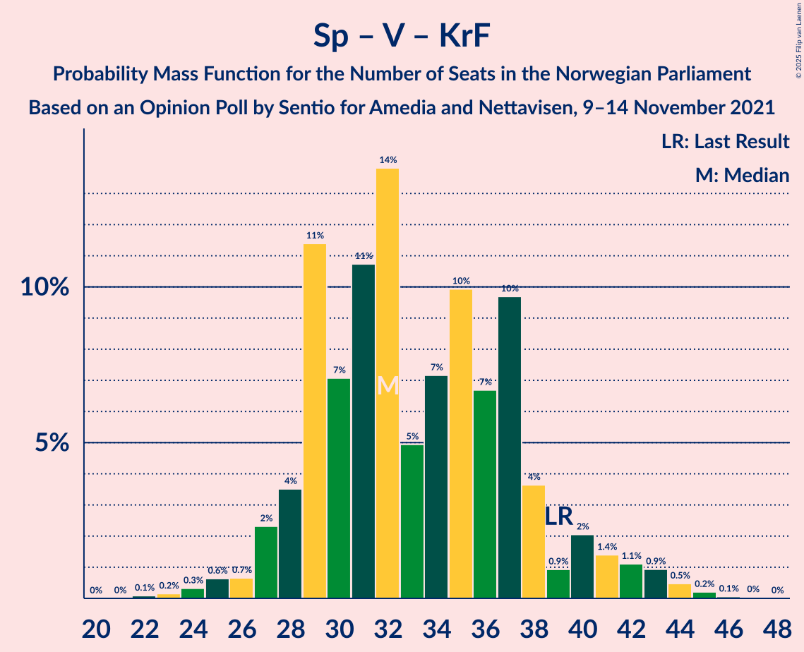

# Opinion Poll by Sentio for Amedia and Nettavisen, 9–14 November 2021

<a href="#voting-intentions">Voting Intentions</a> | <a href="#seats">Seats</a> | <a href="#coalitions">Coalitions</a> | <a href="#technical-information">Technical Information</a>

## Voting Intentions

### Confidence Intervals

| Party | Last Result | Poll Result | 80% Confidence Interval | 90% Confidence Interval | 95% Confidence Interval | 99% Confidence Interval |
|:-----:|:-----------:|:-----------:|:-----------------------:|:-----------------------:|:-----------------------:|:-----------------------:|
| Arbeiderpartiet | 26.2% | 27.3% | 25.5–29.2% |25.0–29.7% |24.6–30.1% |23.8–31.1% |
| Høyre | 20.4% | 20.7% | 19.1–22.4% |18.7–22.9% |18.3–23.3% |17.6–24.2% |
| Senterpartiet | 13.5% | 11.4% | 10.2–12.8% |9.9–13.2% |9.6–13.5% |9.0–14.2% |
| Fremskrittspartiet | 11.6% | 11.1% | 9.9–12.5% |9.6–12.9% |9.3–13.2% |8.7–13.9% |
| Sosialistisk Venstreparti | 7.6% | 8.5% | 7.5–9.7% |7.2–10.1% |6.9–10.4% |6.4–11.0% |
| Rødt | 4.7% | 5.1% | 4.3–6.1% |4.1–6.4% |3.9–6.6% |3.6–7.2% |
| Venstre | 4.6% | 5.0% | 4.2–6.0% |4.0–6.3% |3.8–6.5% |3.5–7.1% |
| Miljøpartiet De Grønne | 3.9% | 4.1% | 3.4–5.0% |3.2–5.3% |3.0–5.5% |2.7–6.0% |
| Kristelig Folkeparti | 3.8% | 3.9% | 3.2–4.8% |3.0–5.1% |2.9–5.3% |2.6–5.8% |

*Note:* The poll result column reflects the actual value used in the calculations. Published results may vary slightly, and in addition be rounded to fewer digits.

## Seats

### Confidence Intervals

| Party | Last Result | Median | 80% Confidence Interval | 90% Confidence Interval | 95% Confidence Interval | 99% Confidence Interval |
|:-----:|:-----------:|:------:|:-----------------------:|:-----------------------:|:-----------------------:|:-----------------------:|
| <a href="#arbeiderpartiet">Arbeiderpartiet</a> | 48 | 52 | 47–56 |46–57 |45–57 |44–59 |
| <a href="#høyre">Høyre</a> | 36 | 37 | 33–40 |32–41 |31–41 |29–44 |
| <a href="#senterpartiet">Senterpartiet</a> | 28 | 20 | 17–23 |17–25 |16–27 |15–29 |
| <a href="#fremskrittspartiet">Fremskrittspartiet</a> | 21 | 19 | 17–22 |16–22 |16–22 |14–24 |
| <a href="#sosialistisk-venstreparti">Sosialistisk Venstreparti</a> | 13 | 15 | 12–17 |12–18 |11–18 |10–20 |
| <a href="#rødt">Rødt</a> | 8 | 9 | 7–11 |5–11 |1–11 |1–12 |
| <a href="#venstre">Venstre</a> | 8 | 9 | 7–10 |7–10 |3–11 |2–12 |
| <a href="#miljøpartiet-de-grønne">Miljøpartiet De Grønne</a> | 3 | 7 | 2–8 |2–9 |2–9 |1–10 |
| <a href="#kristelig-folkeparti">Kristelig Folkeparti</a> | 3 | 3 | 2–8 |2–8 |2–9 |1–10 |

### Arbeiderpartiet

*For a full overview of the results for this party, see the [Arbeiderpartiet](party-arbeiderpartiet.html) page.*

| Number of Seats | Probability | Accumulated | Special Marks |
|:---------------:|:-----------:|:-----------:|:-------------:|
| 41 | 0.1% | 100% |  |
| 42 | 0.1% | 99.9% |  |
| 43 | 0.2% | 99.9% |  |
| 44 | 1.4% | 99.6% |  |
| 45 | 2% | 98% |  |
| 46 | 5% | 96% |  |
| 47 | 9% | 91% |  |
| 48 | 6% | 82% | Last Result |
| 49 | 8% | 77% |  |
| 50 | 8% | 69% |  |
| 51 | 6% | 60% |  |
| 52 | 14% | 55% | Median |
| 53 | 11% | 40% |  |
| 54 | 13% | 29% |  |
| 55 | 4% | 16% |  |
| 56 | 5% | 12% |  |
| 57 | 5% | 7% |  |
| 58 | 1.3% | 2% |  |
| 59 | 0.7% | 1.0% |  |
| 60 | 0.2% | 0.2% |  |
| 61 | 0% | 0.1% |  |
| 62 | 0% | 0% |  |

### Høyre

*For a full overview of the results for this party, see the [Høyre](party-høyre.html) page.*

| Number of Seats | Probability | Accumulated | Special Marks |
|:---------------:|:-----------:|:-----------:|:-------------:|
| 28 | 0.1% | 100% |  |
| 29 | 0.5% | 99.9% |  |
| 30 | 0.9% | 99.4% |  |
| 31 | 2% | 98% |  |
| 32 | 4% | 96% |  |
| 33 | 5% | 92% |  |
| 34 | 7% | 87% |  |
| 35 | 15% | 80% |  |
| 36 | 9% | 65% | Last Result |
| 37 | 9% | 57% | Median |
| 38 | 19% | 47% |  |
| 39 | 9% | 28% |  |
| 40 | 14% | 19% |  |
| 41 | 3% | 5% |  |
| 42 | 1.2% | 2% |  |
| 43 | 0.2% | 0.7% |  |
| 44 | 0.4% | 0.5% |  |
| 45 | 0.1% | 0.1% |  |
| 46 | 0.1% | 0.1% |  |
| 47 | 0% | 0% |  |

### Senterpartiet

*For a full overview of the results for this party, see the [Senterpartiet](party-senterpartiet.html) page.*

| Number of Seats | Probability | Accumulated | Special Marks |
|:---------------:|:-----------:|:-----------:|:-------------:|
| 14 | 0.2% | 100% |  |
| 15 | 2% | 99.8% |  |
| 16 | 3% | 98% |  |
| 17 | 11% | 95% |  |
| 18 | 12% | 84% |  |
| 19 | 15% | 72% |  |
| 20 | 21% | 57% | Median |
| 21 | 14% | 36% |  |
| 22 | 8% | 22% |  |
| 23 | 5% | 14% |  |
| 24 | 3% | 9% |  |
| 25 | 3% | 7% |  |
| 26 | 0.9% | 4% |  |
| 27 | 2% | 3% |  |
| 28 | 0.7% | 2% | Last Result |
| 29 | 0.6% | 0.9% |  |
| 30 | 0.3% | 0.3% |  |
| 31 | 0% | 0% |  |

### Fremskrittspartiet

*For a full overview of the results for this party, see the [Fremskrittspartiet](party-fremskrittspartiet.html) page.*

| Number of Seats | Probability | Accumulated | Special Marks |
|:---------------:|:-----------:|:-----------:|:-------------:|
| 13 | 0.1% | 100% |  |
| 14 | 0.7% | 99.9% |  |
| 15 | 1.0% | 99.2% |  |
| 16 | 6% | 98% |  |
| 17 | 13% | 92% |  |
| 18 | 24% | 78% |  |
| 19 | 17% | 54% | Median |
| 20 | 17% | 38% |  |
| 21 | 10% | 21% | Last Result |
| 22 | 9% | 11% |  |
| 23 | 1.2% | 2% |  |
| 24 | 0.9% | 1.2% |  |
| 25 | 0.1% | 0.3% |  |
| 26 | 0.1% | 0.1% |  |
| 27 | 0% | 0% |  |

### Sosialistisk Venstreparti

*For a full overview of the results for this party, see the [Sosialistisk Venstreparti](party-sosialistiskvenstreparti.html) page.*

| Number of Seats | Probability | Accumulated | Special Marks |
|:---------------:|:-----------:|:-----------:|:-------------:|
| 9 | 0.2% | 100% |  |
| 10 | 0.8% | 99.8% |  |
| 11 | 4% | 99.0% |  |
| 12 | 7% | 95% |  |
| 13 | 14% | 88% | Last Result |
| 14 | 22% | 74% |  |
| 15 | 20% | 52% | Median |
| 16 | 16% | 32% |  |
| 17 | 11% | 17% |  |
| 18 | 4% | 5% |  |
| 19 | 0.8% | 2% |  |
| 20 | 0.8% | 0.9% |  |
| 21 | 0.1% | 0.1% |  |
| 22 | 0% | 0% |  |

### Rødt

*For a full overview of the results for this party, see the [Rødt](party-rødt.html) page.*

| Number of Seats | Probability | Accumulated | Special Marks |
|:---------------:|:-----------:|:-----------:|:-------------:|
| 1 | 5% | 100% |  |
| 2 | 0.1% | 95% |  |
| 3 | 0% | 95% |  |
| 4 | 0% | 95% |  |
| 5 | 0% | 95% |  |
| 6 | 1.0% | 95% |  |
| 7 | 13% | 94% |  |
| 8 | 24% | 81% | Last Result |
| 9 | 28% | 58% | Median |
| 10 | 17% | 30% |  |
| 11 | 11% | 12% |  |
| 12 | 1.2% | 2% |  |
| 13 | 0.4% | 0.5% |  |
| 14 | 0% | 0% |  |

### Venstre

*For a full overview of the results for this party, see the [Venstre](party-venstre.html) page.*

| Number of Seats | Probability | Accumulated | Special Marks |
|:---------------:|:-----------:|:-----------:|:-------------:|
| 2 | 0.7% | 100% |  |
| 3 | 3% | 99.3% |  |
| 4 | 0% | 96% |  |
| 5 | 0% | 96% |  |
| 6 | 0.3% | 96% |  |
| 7 | 10% | 96% |  |
| 8 | 29% | 85% | Last Result |
| 9 | 40% | 56% | Median |
| 10 | 12% | 16% |  |
| 11 | 3% | 4% |  |
| 12 | 1.0% | 1.3% |  |
| 13 | 0.2% | 0.3% |  |
| 14 | 0% | 0% |  |

### Miljøpartiet De Grønne

*For a full overview of the results for this party, see the [Miljøpartiet De Grønne](party-miljøpartietdegrønne.html) page.*

| Number of Seats | Probability | Accumulated | Special Marks |
|:---------------:|:-----------:|:-----------:|:-------------:|
| 1 | 2% | 100% |  |
| 2 | 18% | 98% |  |
| 3 | 24% | 80% | Last Result |
| 4 | 0% | 56% |  |
| 5 | 0.1% | 56% |  |
| 6 | 1.3% | 56% |  |
| 7 | 32% | 55% | Median |
| 8 | 16% | 23% |  |
| 9 | 5% | 6% |  |
| 10 | 1.2% | 1.5% |  |
| 11 | 0.3% | 0.3% |  |
| 12 | 0% | 0% |  |

### Kristelig Folkeparti

*For a full overview of the results for this party, see the [Kristelig Folkeparti](party-kristeligfolkeparti.html) page.*

| Number of Seats | Probability | Accumulated | Special Marks |
|:---------------:|:-----------:|:-----------:|:-------------:|
| 1 | 1.0% | 100% |  |
| 2 | 26% | 99.0% |  |
| 3 | 31% | 73% | Last Result, Median |
| 4 | 0% | 42% |  |
| 5 | 0% | 42% |  |
| 6 | 2% | 42% |  |
| 7 | 18% | 40% |  |
| 8 | 20% | 23% |  |
| 9 | 2% | 3% |  |
| 10 | 0.4% | 0.5% |  |
| 11 | 0.1% | 0.1% |  |
| 12 | 0% | 0% |  |

## Coalitions

### Confidence Intervals

| Coalition | Last Result | Median | Majority? | 80% Confidence Interval | 90% Confidence Interval | 95% Confidence Interval | 99% Confidence Interval |
|:---------:|:-----------:|:------:|:---------:|:-----------------------:|:-----------------------:|:-----------------------:|:-----------------------:|
| Arbeiderpartiet – Senterpartiet – Sosialistisk Venstreparti – Rødt – Miljøpartiet De Grønne | 100 | 100 | 100% | 95–105 | 93–106 | 93–108 | 90–109 |
| Arbeiderpartiet – Senterpartiet – Sosialistisk Venstreparti – Miljøpartiet De Grønne – Kristelig Folkeparti | 95 | 96 | 99.9% | 91–101 | 90–102 | 89–104 | 87–107 |
| Arbeiderpartiet – Senterpartiet – Sosialistisk Venstreparti – Rødt | 97 | 95 | 99.5% | 90–99 | 88–101 | 87–102 | 84–103 |
| Arbeiderpartiet – Senterpartiet – Sosialistisk Venstreparti – Miljøpartiet De Grønne | 92 | 91 | 96% | 86–97 | 85–98 | 84–99 | 82–100 |
| Høyre – Senterpartiet – Fremskrittspartiet – Venstre – Kristelig Folkeparti | 96 | 89 | 83% | 84–94 | 82–96 | 81–97 | 79–101 |
| Arbeiderpartiet – Senterpartiet – Sosialistisk Venstreparti | 89 | 86 | 67% | 82–91 | 80–92 | 79–93 | 77–94 |
| Arbeiderpartiet – Senterpartiet – Miljøpartiet De Grønne – Kristelig Folkeparti | 82 | 81 | 23% | 75–87 | 75–88 | 73–89 | 71–92 |
| Arbeiderpartiet – Sosialistisk Venstreparti – Rødt – Miljøpartiet De Grønne | 72 | 80 | 16% | 75–85 | 73–86 | 72–88 | 68–90 |
| Arbeiderpartiet – Senterpartiet – Kristelig Folkeparti | 79 | 76 | 1.3% | 70–81 | 69–82 | 68–83 | 66–86 |
| Høyre – Fremskrittspartiet – Venstre – Miljøpartiet De Grønne – Kristelig Folkeparti | 71 | 74 | 0.4% | 70–79 | 68–81 | 67–82 | 65–84 |
| Arbeiderpartiet – Senterpartiet | 76 | 72 | 0% | 67–76 | 66–77 | 65–78 | 63–79 |
| Høyre – Fremskrittspartiet – Venstre – Kristelig Folkeparti | 68 | 69 | 0% | 64–74 | 62–75 | 61–76 | 60–78 |
| Arbeiderpartiet – Sosialistisk Venstreparti | 61 | 66 | 0% | 61–71 | 60–72 | 59–73 | 58–74 |
| Høyre – Fremskrittspartiet – Venstre | 65 | 64 | 0% | 59–69 | 58–70 | 57–71 | 55–73 |
| Høyre – Fremskrittspartiet | 57 | 56 | 0% | 51–60 | 50–61 | 49–62 | 48–64 |
| Høyre – Venstre – Kristelig Folkeparti | 47 | 50 | 0% | 45–55 | 44–56 | 43–57 | 41–59 |
| Senterpartiet – Venstre – Kristelig Folkeparti | 39 | 32 | 0% | 29–38 | 28–40 | 27–42 | 24–44 |

### Arbeiderpartiet – Senterpartiet – Sosialistisk Venstreparti – Rødt – Miljøpartiet De Grønne

| Number of Seats | Probability | Accumulated | Special Marks |
|:---------------:|:-----------:|:-----------:|:-------------:|
| 86 | 0.2% | 100% |  |
| 87 | 0% | 99.8% |  |
| 88 | 0.1% | 99.8% |  |
| 89 | 0.1% | 99.6% |  |
| 90 | 0.3% | 99.5% |  |
| 91 | 0.7% | 99.3% |  |
| 92 | 0.7% | 98.5% |  |
| 93 | 3% | 98% |  |
| 94 | 5% | 95% |  |
| 95 | 5% | 90% |  |
| 96 | 5% | 85% |  |
| 97 | 5% | 80% |  |
| 98 | 8% | 75% |  |
| 99 | 11% | 66% |  |
| 100 | 12% | 55% | Last Result |
| 101 | 8% | 43% |  |
| 102 | 10% | 35% |  |
| 103 | 7% | 25% | Median |
| 104 | 4% | 17% |  |
| 105 | 5% | 13% |  |
| 106 | 3% | 7% |  |
| 107 | 2% | 5% |  |
| 108 | 2% | 3% |  |
| 109 | 1.3% | 2% |  |
| 110 | 0.1% | 0.2% |  |
| 111 | 0.1% | 0.1% |  |
| 112 | 0.1% | 0.1% |  |
| 113 | 0% | 0% |  |

### Arbeiderpartiet – Senterpartiet – Sosialistisk Venstreparti – Miljøpartiet De Grønne – Kristelig Folkeparti

| Number of Seats | Probability | Accumulated | Special Marks |
|:---------------:|:-----------:|:-----------:|:-------------:|
| 84 | 0.1% | 100% |  |
| 85 | 0.1% | 99.9% | Majority |
| 86 | 0.3% | 99.8% |  |
| 87 | 0.3% | 99.6% |  |
| 88 | 0.6% | 99.3% |  |
| 89 | 3% | 98.7% |  |
| 90 | 1.1% | 96% |  |
| 91 | 6% | 95% |  |
| 92 | 8% | 89% |  |
| 93 | 9% | 81% |  |
| 94 | 10% | 72% |  |
| 95 | 9% | 62% | Last Result |
| 96 | 7% | 53% |  |
| 97 | 7% | 45% | Median |
| 98 | 12% | 38% |  |
| 99 | 6% | 27% |  |
| 100 | 10% | 21% |  |
| 101 | 3% | 10% |  |
| 102 | 3% | 7% |  |
| 103 | 2% | 5% |  |
| 104 | 1.0% | 3% |  |
| 105 | 0.8% | 2% |  |
| 106 | 0.3% | 0.9% |  |
| 107 | 0.4% | 0.5% |  |
| 108 | 0.1% | 0.1% |  |
| 109 | 0% | 0.1% |  |
| 110 | 0% | 0% |  |

### Arbeiderpartiet – Senterpartiet – Sosialistisk Venstreparti – Rødt

| Number of Seats | Probability | Accumulated | Special Marks |
|:---------------:|:-----------:|:-----------:|:-------------:|
| 82 | 0% | 100% |  |
| 83 | 0.3% | 99.9% |  |
| 84 | 0.2% | 99.7% |  |
| 85 | 0.2% | 99.5% | Majority |
| 86 | 0.6% | 99.2% |  |
| 87 | 3% | 98.6% |  |
| 88 | 2% | 96% |  |
| 89 | 3% | 94% |  |
| 90 | 5% | 91% |  |
| 91 | 8% | 85% |  |
| 92 | 5% | 77% |  |
| 93 | 7% | 73% |  |
| 94 | 12% | 66% |  |
| 95 | 11% | 53% |  |
| 96 | 12% | 42% | Median |
| 97 | 7% | 30% | Last Result |
| 98 | 11% | 23% |  |
| 99 | 4% | 12% |  |
| 100 | 2% | 8% |  |
| 101 | 3% | 6% |  |
| 102 | 3% | 3% |  |
| 103 | 0.3% | 0.7% |  |
| 104 | 0.2% | 0.3% |  |
| 105 | 0.1% | 0.2% |  |
| 106 | 0% | 0.1% |  |
| 107 | 0% | 0% |  |

### Arbeiderpartiet – Senterpartiet – Sosialistisk Venstreparti – Miljøpartiet De Grønne

| Number of Seats | Probability | Accumulated | Special Marks |
|:---------------:|:-----------:|:-----------:|:-------------:|
| 80 | 0.1% | 100% |  |
| 81 | 0.2% | 99.9% |  |
| 82 | 0.3% | 99.7% |  |
| 83 | 0.6% | 99.4% |  |
| 84 | 2% | 98.8% |  |
| 85 | 2% | 96% | Majority |
| 86 | 7% | 95% |  |
| 87 | 3% | 88% |  |
| 88 | 3% | 84% |  |
| 89 | 10% | 81% |  |
| 90 | 15% | 71% |  |
| 91 | 12% | 56% |  |
| 92 | 9% | 44% | Last Result |
| 93 | 8% | 35% |  |
| 94 | 7% | 27% | Median |
| 95 | 4% | 20% |  |
| 96 | 3% | 17% |  |
| 97 | 6% | 13% |  |
| 98 | 4% | 7% |  |
| 99 | 2% | 3% |  |
| 100 | 1.3% | 2% |  |
| 101 | 0.2% | 0.4% |  |
| 102 | 0.1% | 0.2% |  |
| 103 | 0.1% | 0.1% |  |
| 104 | 0% | 0% |  |

### Høyre – Senterpartiet – Fremskrittspartiet – Venstre – Kristelig Folkeparti

| Number of Seats | Probability | Accumulated | Special Marks |
|:---------------:|:-----------:|:-----------:|:-------------:|
| 76 | 0% | 100% |  |
| 77 | 0.1% | 99.9% |  |
| 78 | 0.2% | 99.8% |  |
| 79 | 0.3% | 99.6% |  |
| 80 | 2% | 99.3% |  |
| 81 | 1.0% | 98% |  |
| 82 | 2% | 97% |  |
| 83 | 3% | 95% |  |
| 84 | 9% | 92% |  |
| 85 | 5% | 83% | Majority |
| 86 | 4% | 78% |  |
| 87 | 11% | 74% |  |
| 88 | 12% | 63% | Median |
| 89 | 6% | 51% |  |
| 90 | 13% | 45% |  |
| 91 | 8% | 32% |  |
| 92 | 5% | 24% |  |
| 93 | 6% | 20% |  |
| 94 | 6% | 14% |  |
| 95 | 2% | 8% |  |
| 96 | 3% | 6% | Last Result |
| 97 | 1.0% | 3% |  |
| 98 | 0.6% | 2% |  |
| 99 | 0.2% | 1.1% |  |
| 100 | 0.2% | 0.9% |  |
| 101 | 0.5% | 0.7% |  |
| 102 | 0% | 0.2% |  |
| 103 | 0.2% | 0.2% |  |
| 104 | 0% | 0% |  |

### Arbeiderpartiet – Senterpartiet – Sosialistisk Venstreparti

| Number of Seats | Probability | Accumulated | Special Marks |
|:---------------:|:-----------:|:-----------:|:-------------:|
| 75 | 0.1% | 100% |  |
| 76 | 0.1% | 99.9% |  |
| 77 | 0.4% | 99.8% |  |
| 78 | 0.7% | 99.4% |  |
| 79 | 2% | 98.7% |  |
| 80 | 3% | 97% |  |
| 81 | 4% | 94% |  |
| 82 | 8% | 91% |  |
| 83 | 10% | 83% |  |
| 84 | 6% | 73% |  |
| 85 | 11% | 67% | Majority |
| 86 | 8% | 57% |  |
| 87 | 15% | 49% | Median |
| 88 | 10% | 34% |  |
| 89 | 7% | 23% | Last Result |
| 90 | 6% | 16% |  |
| 91 | 5% | 11% |  |
| 92 | 2% | 6% |  |
| 93 | 1.0% | 3% |  |
| 94 | 2% | 2% |  |
| 95 | 0.2% | 0.4% |  |
| 96 | 0.1% | 0.2% |  |
| 97 | 0% | 0.1% |  |
| 98 | 0% | 0% |  |

### Arbeiderpartiet – Senterpartiet – Miljøpartiet De Grønne – Kristelig Folkeparti

| Number of Seats | Probability | Accumulated | Special Marks |
|:---------------:|:-----------:|:-----------:|:-------------:|
| 68 | 0% | 100% |  |
| 69 | 0% | 99.9% |  |
| 70 | 0.1% | 99.9% |  |
| 71 | 0.9% | 99.8% |  |
| 72 | 0.6% | 98.9% |  |
| 73 | 1.2% | 98% |  |
| 74 | 0.8% | 97% |  |
| 75 | 7% | 96% |  |
| 76 | 2% | 89% |  |
| 77 | 4% | 87% |  |
| 78 | 10% | 83% |  |
| 79 | 7% | 74% |  |
| 80 | 5% | 67% |  |
| 81 | 12% | 61% |  |
| 82 | 6% | 49% | Last Result, Median |
| 83 | 14% | 43% |  |
| 84 | 6% | 29% |  |
| 85 | 9% | 23% | Majority |
| 86 | 5% | 15% |  |
| 87 | 3% | 10% |  |
| 88 | 3% | 7% |  |
| 89 | 2% | 4% |  |
| 90 | 0.6% | 2% |  |
| 91 | 1.0% | 2% |  |
| 92 | 0.5% | 0.8% |  |
| 93 | 0.3% | 0.4% |  |
| 94 | 0.1% | 0.1% |  |
| 95 | 0% | 0% |  |

### Arbeiderpartiet – Sosialistisk Venstreparti – Rødt – Miljøpartiet De Grønne

| Number of Seats | Probability | Accumulated | Special Marks |
|:---------------:|:-----------:|:-----------:|:-------------:|
| 66 | 0.2% | 100% |  |
| 67 | 0% | 99.8% |  |
| 68 | 0.5% | 99.8% |  |
| 69 | 0.3% | 99.2% |  |
| 70 | 0.3% | 98.9% |  |
| 71 | 0.6% | 98.7% |  |
| 72 | 1.4% | 98% | Last Result |
| 73 | 3% | 97% |  |
| 74 | 3% | 93% |  |
| 75 | 7% | 91% |  |
| 76 | 6% | 84% |  |
| 77 | 5% | 78% |  |
| 78 | 7% | 73% |  |
| 79 | 13% | 66% |  |
| 80 | 7% | 53% |  |
| 81 | 11% | 46% |  |
| 82 | 11% | 35% |  |
| 83 | 4% | 24% | Median |
| 84 | 4% | 20% |  |
| 85 | 9% | 16% | Majority |
| 86 | 3% | 7% |  |
| 87 | 1.1% | 4% |  |
| 88 | 0.9% | 3% |  |
| 89 | 2% | 2% |  |
| 90 | 0.3% | 0.5% |  |
| 91 | 0.2% | 0.2% |  |
| 92 | 0.1% | 0.1% |  |
| 93 | 0% | 0% |  |

### Arbeiderpartiet – Senterpartiet – Kristelig Folkeparti

| Number of Seats | Probability | Accumulated | Special Marks |
|:---------------:|:-----------:|:-----------:|:-------------:|
| 63 | 0.1% | 100% |  |
| 64 | 0% | 99.9% |  |
| 65 | 0.1% | 99.9% |  |
| 66 | 0.4% | 99.8% |  |
| 67 | 0.7% | 99.4% |  |
| 68 | 3% | 98.7% |  |
| 69 | 2% | 96% |  |
| 70 | 4% | 94% |  |
| 71 | 2% | 90% |  |
| 72 | 6% | 87% |  |
| 73 | 8% | 81% |  |
| 74 | 7% | 73% |  |
| 75 | 9% | 66% | Median |
| 76 | 12% | 57% |  |
| 77 | 4% | 45% |  |
| 78 | 13% | 41% |  |
| 79 | 6% | 28% | Last Result |
| 80 | 11% | 22% |  |
| 81 | 4% | 11% |  |
| 82 | 2% | 7% |  |
| 83 | 3% | 5% |  |
| 84 | 1.1% | 2% |  |
| 85 | 0.7% | 1.3% | Majority |
| 86 | 0.3% | 0.6% |  |
| 87 | 0.2% | 0.3% |  |
| 88 | 0% | 0.1% |  |
| 89 | 0% | 0% |  |

### Høyre – Fremskrittspartiet – Venstre – Miljøpartiet De Grønne – Kristelig Folkeparti

| Number of Seats | Probability | Accumulated | Special Marks |
|:---------------:|:-----------:|:-----------:|:-------------:|
| 62 | 0% | 100% |  |
| 63 | 0.1% | 99.9% |  |
| 64 | 0.2% | 99.9% |  |
| 65 | 0.2% | 99.7% |  |
| 66 | 0.4% | 99.5% |  |
| 67 | 3% | 99.1% |  |
| 68 | 3% | 96% |  |
| 69 | 3% | 93% |  |
| 70 | 4% | 91% |  |
| 71 | 11% | 87% | Last Result |
| 72 | 7% | 76% |  |
| 73 | 13% | 69% |  |
| 74 | 12% | 56% |  |
| 75 | 11% | 43% | Median |
| 76 | 7% | 32% |  |
| 77 | 5% | 25% |  |
| 78 | 7% | 20% |  |
| 79 | 4% | 13% |  |
| 80 | 3% | 8% |  |
| 81 | 2% | 5% |  |
| 82 | 2% | 3% |  |
| 83 | 0.4% | 1.0% |  |
| 84 | 0.2% | 0.6% |  |
| 85 | 0.2% | 0.4% | Majority |
| 86 | 0.2% | 0.3% |  |
| 87 | 0% | 0% |  |

### Arbeiderpartiet – Senterpartiet

| Number of Seats | Probability | Accumulated | Special Marks |
|:---------------:|:-----------:|:-----------:|:-------------:|
| 61 | 0.1% | 100% |  |
| 62 | 0.2% | 99.8% |  |
| 63 | 0.6% | 99.7% |  |
| 64 | 1.4% | 99.1% |  |
| 65 | 2% | 98% |  |
| 66 | 5% | 96% |  |
| 67 | 5% | 90% |  |
| 68 | 6% | 85% |  |
| 69 | 6% | 79% |  |
| 70 | 7% | 73% |  |
| 71 | 15% | 65% |  |
| 72 | 12% | 51% | Median |
| 73 | 15% | 39% |  |
| 74 | 6% | 24% |  |
| 75 | 8% | 18% |  |
| 76 | 4% | 10% | Last Result |
| 77 | 3% | 6% |  |
| 78 | 3% | 4% |  |
| 79 | 0.6% | 1.1% |  |
| 80 | 0.4% | 0.5% |  |
| 81 | 0.1% | 0.1% |  |
| 82 | 0% | 0% |  |

### Høyre – Fremskrittspartiet – Venstre – Kristelig Folkeparti

| Number of Seats | Probability | Accumulated | Special Marks |
|:---------------:|:-----------:|:-----------:|:-------------:|
| 57 | 0.1% | 100% |  |
| 58 | 0.1% | 99.9% |  |
| 59 | 0.1% | 99.8% |  |
| 60 | 1.4% | 99.7% |  |
| 61 | 2% | 98% |  |
| 62 | 2% | 97% |  |
| 63 | 3% | 95% |  |
| 64 | 6% | 92% |  |
| 65 | 5% | 86% |  |
| 66 | 8% | 82% |  |
| 67 | 11% | 74% |  |
| 68 | 7% | 63% | Last Result, Median |
| 69 | 13% | 55% |  |
| 70 | 12% | 43% |  |
| 71 | 8% | 30% |  |
| 72 | 5% | 23% |  |
| 73 | 4% | 17% |  |
| 74 | 5% | 13% |  |
| 75 | 4% | 8% |  |
| 76 | 3% | 4% |  |
| 77 | 0.6% | 2% |  |
| 78 | 0.7% | 1.1% |  |
| 79 | 0.2% | 0.5% |  |
| 80 | 0.1% | 0.3% |  |
| 81 | 0% | 0.3% |  |
| 82 | 0% | 0.2% |  |
| 83 | 0.2% | 0.2% |  |
| 84 | 0% | 0% |  |

### Arbeiderpartiet – Sosialistisk Venstreparti

| Number of Seats | Probability | Accumulated | Special Marks |
|:---------------:|:-----------:|:-----------:|:-------------:|
| 56 | 0.1% | 100% |  |
| 57 | 0.2% | 99.9% |  |
| 58 | 2% | 99.7% |  |
| 59 | 2% | 98% |  |
| 60 | 3% | 96% |  |
| 61 | 4% | 94% | Last Result |
| 62 | 12% | 89% |  |
| 63 | 5% | 77% |  |
| 64 | 3% | 72% |  |
| 65 | 14% | 69% |  |
| 66 | 5% | 55% |  |
| 67 | 13% | 50% | Median |
| 68 | 12% | 37% |  |
| 69 | 4% | 24% |  |
| 70 | 10% | 20% |  |
| 71 | 5% | 10% |  |
| 72 | 3% | 5% |  |
| 73 | 2% | 3% |  |
| 74 | 0.5% | 0.8% |  |
| 75 | 0.2% | 0.3% |  |
| 76 | 0.1% | 0.1% |  |
| 77 | 0% | 0.1% |  |
| 78 | 0% | 0% |  |

### Høyre – Fremskrittspartiet – Venstre

| Number of Seats | Probability | Accumulated | Special Marks |
|:---------------:|:-----------:|:-----------:|:-------------:|
| 53 | 0% | 100% |  |
| 54 | 0.3% | 99.9% |  |
| 55 | 0.4% | 99.7% |  |
| 56 | 0.7% | 99.3% |  |
| 57 | 2% | 98.6% |  |
| 58 | 3% | 97% |  |
| 59 | 4% | 94% |  |
| 60 | 4% | 90% |  |
| 61 | 10% | 86% |  |
| 62 | 11% | 77% |  |
| 63 | 8% | 65% |  |
| 64 | 11% | 57% |  |
| 65 | 7% | 46% | Last Result, Median |
| 66 | 9% | 39% |  |
| 67 | 12% | 30% |  |
| 68 | 7% | 18% |  |
| 69 | 3% | 11% |  |
| 70 | 4% | 7% |  |
| 71 | 2% | 3% |  |
| 72 | 0.6% | 1.4% |  |
| 73 | 0.3% | 0.8% |  |
| 74 | 0.2% | 0.4% |  |
| 75 | 0.2% | 0.3% |  |
| 76 | 0% | 0% |  |

### Høyre – Fremskrittspartiet

| Number of Seats | Probability | Accumulated | Special Marks |
|:---------------:|:-----------:|:-----------:|:-------------:|
| 46 | 0.2% | 100% |  |
| 47 | 0.3% | 99.8% |  |
| 48 | 1.3% | 99.6% |  |
| 49 | 3% | 98% |  |
| 50 | 3% | 96% |  |
| 51 | 4% | 93% |  |
| 52 | 6% | 90% |  |
| 53 | 11% | 83% |  |
| 54 | 9% | 72% |  |
| 55 | 11% | 63% |  |
| 56 | 10% | 52% | Median |
| 57 | 7% | 42% | Last Result |
| 58 | 15% | 36% |  |
| 59 | 8% | 21% |  |
| 60 | 6% | 13% |  |
| 61 | 3% | 7% |  |
| 62 | 3% | 4% |  |
| 63 | 0.4% | 1.4% |  |
| 64 | 0.6% | 0.9% |  |
| 65 | 0.2% | 0.3% |  |
| 66 | 0.1% | 0.2% |  |
| 67 | 0% | 0% |  |

### Høyre – Venstre – Kristelig Folkeparti

| Number of Seats | Probability | Accumulated | Special Marks |
|:---------------:|:-----------:|:-----------:|:-------------:|
| 39 | 0.1% | 100% |  |
| 40 | 0.2% | 99.9% |  |
| 41 | 0.5% | 99.7% |  |
| 42 | 0.8% | 99.1% |  |
| 43 | 3% | 98% |  |
| 44 | 4% | 96% |  |
| 45 | 5% | 92% |  |
| 46 | 4% | 87% |  |
| 47 | 7% | 83% | Last Result |
| 48 | 15% | 76% |  |
| 49 | 9% | 61% | Median |
| 50 | 7% | 52% |  |
| 51 | 9% | 45% |  |
| 52 | 14% | 36% |  |
| 53 | 7% | 23% |  |
| 54 | 4% | 16% |  |
| 55 | 4% | 12% |  |
| 56 | 4% | 8% |  |
| 57 | 3% | 4% |  |
| 58 | 0.3% | 0.8% |  |
| 59 | 0.2% | 0.5% |  |
| 60 | 0.1% | 0.3% |  |
| 61 | 0.2% | 0.2% |  |
| 62 | 0% | 0% |  |

### Senterpartiet – Venstre – Kristelig Folkeparti

| Number of Seats | Probability | Accumulated | Special Marks |
|:---------------:|:-----------:|:-----------:|:-------------:|
| 22 | 0.1% | 100% |  |
| 23 | 0.2% | 99.9% |  |
| 24 | 0.3% | 99.8% |  |
| 25 | 0.6% | 99.4% |  |
| 26 | 0.7% | 98.8% |  |
| 27 | 2% | 98% |  |
| 28 | 4% | 96% |  |
| 29 | 11% | 92% |  |
| 30 | 7% | 81% |  |
| 31 | 11% | 74% |  |
| 32 | 14% | 63% | Median |
| 33 | 5% | 49% |  |
| 34 | 7% | 44% |  |
| 35 | 10% | 37% |  |
| 36 | 7% | 27% |  |
| 37 | 10% | 21% |  |
| 38 | 4% | 11% |  |
| 39 | 0.9% | 7% | Last Result |
| 40 | 2% | 6% |  |
| 41 | 1.4% | 4% |  |
| 42 | 1.1% | 3% |  |
| 43 | 0.9% | 2% |  |
| 44 | 0.5% | 0.8% |  |
| 45 | 0.2% | 0.3% |  |
| 46 | 0.1% | 0.1% |  |
| 47 | 0% | 0% |  |

## Technical Information

### Opinion Poll

+ **Polling firm:** Sentio
+ **Commissioner(s):** Amedia and Nettavisen
+ **Fieldwork period:** 9–14 November 2021

### Calculations

+ **Sample size:** 1000
+ **Simulations done:** 1,048,576
+ **Error estimate:** 1.42%

