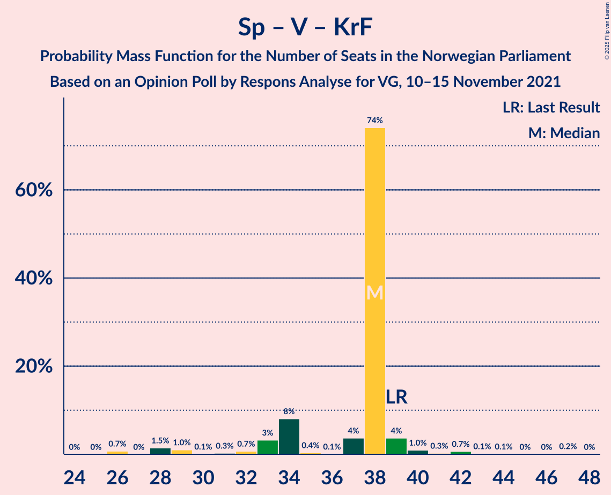

# Opinion Poll by Respons Analyse for VG, 10–15 November 2021

<a href="#voting-intentions">Voting Intentions</a> | <a href="#seats">Seats</a> | <a href="#coalitions">Coalitions</a> | <a href="#technical-information">Technical Information</a>

## Voting Intentions

### Confidence Intervals

| Party | Last Result | Poll Result | 80% Confidence Interval | 90% Confidence Interval | 95% Confidence Interval | 99% Confidence Interval |
|:-----:|:-----------:|:-----------:|:-----------------------:|:-----------------------:|:-----------------------:|:-----------------------:|
| Arbeiderpartiet | 26.2% | 25.5% | 23.8–27.3% |23.3–27.8% |22.9–28.3% |22.1–29.2% |
| Høyre | 20.4% | 21.7% | 20.1–23.4% |19.6–23.9% |19.2–24.3% |18.5–25.2% |
| Senterpartiet | 13.5% | 13.1% | 11.8–14.6% |11.4–15.0% |11.1–15.3% |10.5–16.0% |
| Fremskrittspartiet | 11.6% | 11.0% | 9.8–12.4% |9.5–12.7% |9.2–13.1% |8.7–13.8% |
| Sosialistisk Venstreparti | 7.6% | 8.5% | 7.5–9.7% |7.2–10.1% |6.9–10.4% |6.4–11.0% |
| Venstre | 4.6% | 5.2% | 4.4–6.2% |4.2–6.5% |4.0–6.8% |3.6–7.3% |
| Rødt | 4.7% | 4.8% | 4.0–5.8% |3.8–6.1% |3.6–6.3% |3.3–6.8% |
| Miljøpartiet De Grønne | 3.9% | 4.1% | 3.4–5.0% |3.2–5.3% |3.0–5.5% |2.7–6.0% |
| Kristelig Folkeparti | 3.8% | 2.8% | 2.2–3.6% |2.1–3.8% |1.9–4.0% |1.7–4.4% |
| Norgesdemokratene | 1.1% | 0.9% | 0.6–1.4% |0.5–1.6% |0.5–1.7% |0.4–2.0% |
| Industri- og Næringspartiet | 0.3% | 0.6% | 0.4–1.1% |0.3–1.2% |0.3–1.3% |0.2–1.6% |
| Liberalistene | 0.2% | 0.4% | 0.2–0.8% |0.2–0.9% |0.2–1.0% |0.1–1.3% |
| Pensjonistpartiet | 0.6% | 0.4% | 0.2–0.8% |0.2–0.9% |0.2–1.0% |0.1–1.3% |
| Konservativt | 0.4% | 0.2% | 0.1–0.5% |0.1–0.6% |0.1–0.7% |0.0–0.9% |
| Kystpartiet | 0.0% | 0.1% | 0.0–0.4% |0.0–0.5% |0.0–0.6% |0.0–0.7% |
| Helsepartiet | 0.2% | 0.1% | 0.0–0.4% |0.0–0.5% |0.0–0.6% |0.0–0.7% |

*Note:* The poll result column reflects the actual value used in the calculations. Published results may vary slightly, and in addition be rounded to fewer digits.

## Seats

### Confidence Intervals

| Party | Last Result | Median | 80% Confidence Interval | 90% Confidence Interval | 95% Confidence Interval | 99% Confidence Interval |
|:-----:|:-----------:|:------:|:-----------------------:|:-----------------------:|:-----------------------:|:-----------------------:|
| <a href="#arbeiderpartiet">Arbeiderpartiet</a> | 48 | 43 | 43–50 |43–50 |42–50 |39–53 |
| <a href="#høyre">Høyre</a> | 36 | 41 | 35–41 |34–41 |34–42 |33–44 |
| <a href="#senterpartiet">Senterpartiet</a> | 28 | 28 | 22–28 |21–29 |21–30 |18–30 |
| <a href="#fremskrittspartiet">Fremskrittspartiet</a> | 21 | 18 | 18–20 |17–21 |17–23 |15–25 |
| <a href="#sosialistisk-venstreparti">Sosialistisk Venstreparti</a> | 13 | 18 | 16–18 |15–18 |13–19 |13–21 |
| <a href="#venstre">Venstre</a> | 8 | 9 | 9–10 |8–10 |3–10 |2–12 |
| <a href="#rødt">Rødt</a> | 8 | 8 | 8–9 |8–9 |7–11 |1–11 |
| <a href="#miljøpartiet-de-grønne">Miljøpartiet De Grønne</a> | 3 | 3 | 3–7 |3–7 |3–9 |2–10 |
| <a href="#kristelig-folkeparti">Kristelig Folkeparti</a> | 3 | 1 | 1–2 |1–2 |1–2 |0–3 |
| <a href="#norgesdemokratene">Norgesdemokratene</a> | 0 | 0 | 0 |0 |0 |0 |
| <a href="#industri--og-næringspartiet">Industri- og Næringspartiet</a> | 0 | 0 | 0 |0 |0 |0 |
| <a href="#liberalistene">Liberalistene</a> | 0 | 0 | 0 |0 |0 |0 |
| <a href="#pensjonistpartiet">Pensjonistpartiet</a> | 0 | 0 | 0 |0 |0 |0 |
| <a href="#konservativt">Konservativt</a> | 0 | 0 | 0 |0 |0 |0 |
| <a href="#kystpartiet">Kystpartiet</a> | 0 | 0 | 0 |0 |0 |0–1 |
| <a href="#helsepartiet">Helsepartiet</a> | 0 | 0 | 0 |0 |0 |0 |

### Arbeiderpartiet

*For a full overview of the results for this party, see the [Arbeiderpartiet](party-arbeiderpartiet.html) page.*

| Number of Seats | Probability | Accumulated | Special Marks |
|:---------------:|:-----------:|:-----------:|:-------------:|
| 37 | 0.1% | 100% |  |
| 38 | 0% | 99.9% |  |
| 39 | 2% | 99.9% |  |
| 40 | 0.2% | 98% |  |
| 41 | 0.5% | 98% |  |
| 42 | 0.5% | 98% |  |
| 43 | 74% | 97% | Median |
| 44 | 3% | 23% |  |
| 45 | 0.2% | 20% |  |
| 46 | 2% | 20% |  |
| 47 | 0.1% | 18% |  |
| 48 | 3% | 18% | Last Result |
| 49 | 2% | 15% |  |
| 50 | 12% | 13% |  |
| 51 | 0.1% | 1.0% |  |
| 52 | 0.2% | 0.9% |  |
| 53 | 0.3% | 0.7% |  |
| 54 | 0.3% | 0.4% |  |
| 55 | 0.1% | 0.1% |  |
| 56 | 0% | 0% |  |

### Høyre

*For a full overview of the results for this party, see the [Høyre](party-høyre.html) page.*

| Number of Seats | Probability | Accumulated | Special Marks |
|:---------------:|:-----------:|:-----------:|:-------------:|
| 31 | 0.1% | 100% |  |
| 32 | 0% | 99.8% |  |
| 33 | 0.6% | 99.8% |  |
| 34 | 7% | 99.2% |  |
| 35 | 9% | 92% |  |
| 36 | 0.2% | 83% | Last Result |
| 37 | 0.4% | 83% |  |
| 38 | 1.2% | 83% |  |
| 39 | 0.3% | 81% |  |
| 40 | 2% | 81% |  |
| 41 | 76% | 79% | Median |
| 42 | 2% | 4% |  |
| 43 | 0.1% | 2% |  |
| 44 | 2% | 2% |  |
| 45 | 0% | 0.1% |  |
| 46 | 0% | 0.1% |  |
| 47 | 0.1% | 0.1% |  |
| 48 | 0.1% | 0.1% |  |
| 49 | 0% | 0% |  |

### Senterpartiet

*For a full overview of the results for this party, see the [Senterpartiet](party-senterpartiet.html) page.*

| Number of Seats | Probability | Accumulated | Special Marks |
|:---------------:|:-----------:|:-----------:|:-------------:|
| 17 | 0.2% | 100% |  |
| 18 | 0.4% | 99.8% |  |
| 19 | 0.2% | 99.4% |  |
| 20 | 0.1% | 99.1% |  |
| 21 | 4% | 99.0% |  |
| 22 | 8% | 95% |  |
| 23 | 2% | 87% |  |
| 24 | 0.1% | 85% |  |
| 25 | 0.3% | 85% |  |
| 26 | 4% | 85% |  |
| 27 | 0.5% | 80% |  |
| 28 | 75% | 80% | Last Result, Median |
| 29 | 0.7% | 5% |  |
| 30 | 4% | 4% |  |
| 31 | 0.1% | 0.3% |  |
| 32 | 0.2% | 0.2% |  |
| 33 | 0% | 0% |  |

### Fremskrittspartiet

*For a full overview of the results for this party, see the [Fremskrittspartiet](party-fremskrittspartiet.html) page.*

| Number of Seats | Probability | Accumulated | Special Marks |
|:---------------:|:-----------:|:-----------:|:-------------:|
| 13 | 0.2% | 100% |  |
| 14 | 0% | 99.8% |  |
| 15 | 2% | 99.8% |  |
| 16 | 0.2% | 98% |  |
| 17 | 4% | 98% |  |
| 18 | 76% | 94% | Median |
| 19 | 1.4% | 17% |  |
| 20 | 10% | 16% |  |
| 21 | 1.2% | 6% | Last Result |
| 22 | 0.3% | 4% |  |
| 23 | 3% | 4% |  |
| 24 | 0.2% | 0.9% |  |
| 25 | 0.7% | 0.7% |  |
| 26 | 0% | 0% |  |

### Sosialistisk Venstreparti

*For a full overview of the results for this party, see the [Sosialistisk Venstreparti](party-sosialistiskvenstreparti.html) page.*

| Number of Seats | Probability | Accumulated | Special Marks |
|:---------------:|:-----------:|:-----------:|:-------------:|
| 10 | 0.2% | 100% |  |
| 11 | 0% | 99.8% |  |
| 12 | 0.1% | 99.7% |  |
| 13 | 2% | 99.6% | Last Result |
| 14 | 0.5% | 97% |  |
| 15 | 6% | 97% |  |
| 16 | 6% | 91% |  |
| 17 | 0.5% | 85% |  |
| 18 | 82% | 85% | Median |
| 19 | 2% | 3% |  |
| 20 | 0.3% | 0.8% |  |
| 21 | 0.5% | 0.5% |  |
| 22 | 0% | 0% |  |

### Venstre

*For a full overview of the results for this party, see the [Venstre](party-venstre.html) page.*

| Number of Seats | Probability | Accumulated | Special Marks |
|:---------------:|:-----------:|:-----------:|:-------------:|
| 2 | 0.8% | 100% |  |
| 3 | 2% | 99.2% |  |
| 4 | 0% | 97% |  |
| 5 | 0% | 97% |  |
| 6 | 0% | 97% |  |
| 7 | 2% | 97% |  |
| 8 | 3% | 95% | Last Result |
| 9 | 75% | 93% | Median |
| 10 | 16% | 18% |  |
| 11 | 1.4% | 2% |  |
| 12 | 0.5% | 0.7% |  |
| 13 | 0.1% | 0.2% |  |
| 14 | 0% | 0.1% |  |
| 15 | 0.1% | 0.1% |  |
| 16 | 0% | 0% |  |

### Rødt

*For a full overview of the results for this party, see the [Rødt](party-rødt.html) page.*

| Number of Seats | Probability | Accumulated | Special Marks |
|:---------------:|:-----------:|:-----------:|:-------------:|
| 1 | 2% | 100% |  |
| 2 | 0% | 98% |  |
| 3 | 0% | 98% |  |
| 4 | 0% | 98% |  |
| 5 | 0% | 98% |  |
| 6 | 0% | 98% |  |
| 7 | 2% | 98% |  |
| 8 | 79% | 95% | Last Result, Median |
| 9 | 13% | 16% |  |
| 10 | 0.5% | 4% |  |
| 11 | 3% | 3% |  |
| 12 | 0% | 0.1% |  |
| 13 | 0.1% | 0.1% |  |
| 14 | 0% | 0% |  |

### Miljøpartiet De Grønne

*For a full overview of the results for this party, see the [Miljøpartiet De Grønne](party-miljøpartietdegrønne.html) page.*

| Number of Seats | Probability | Accumulated | Special Marks |
|:---------------:|:-----------:|:-----------:|:-------------:|
| 1 | 0.4% | 100% |  |
| 2 | 2% | 99.6% |  |
| 3 | 83% | 98% | Last Result, Median |
| 4 | 0% | 15% |  |
| 5 | 0% | 15% |  |
| 6 | 0% | 15% |  |
| 7 | 10% | 15% |  |
| 8 | 0.8% | 5% |  |
| 9 | 2% | 4% |  |
| 10 | 1.0% | 1.4% |  |
| 11 | 0.1% | 0.3% |  |
| 12 | 0.3% | 0.3% |  |
| 13 | 0% | 0% |  |

### Kristelig Folkeparti

*For a full overview of the results for this party, see the [Kristelig Folkeparti](party-kristeligfolkeparti.html) page.*

| Number of Seats | Probability | Accumulated | Special Marks |
|:---------------:|:-----------:|:-----------:|:-------------:|
| 0 | 1.3% | 100% |  |
| 1 | 81% | 98.7% | Median |
| 2 | 16% | 18% |  |
| 3 | 2% | 2% | Last Result |
| 4 | 0% | 0.2% |  |
| 5 | 0% | 0.2% |  |
| 6 | 0% | 0.2% |  |
| 7 | 0.2% | 0.2% |  |
| 8 | 0% | 0% |  |

### Norgesdemokratene

*For a full overview of the results for this party, see the [Norgesdemokratene](party-norgesdemokratene.html) page.*

| Number of Seats | Probability | Accumulated | Special Marks |
|:---------------:|:-----------:|:-----------:|:-------------:|
| 0 | 100% | 100% | Last Result, Median |

### Industri- og Næringspartiet

*For a full overview of the results for this party, see the [Industri- og Næringspartiet](party-industri-ognæringspartiet.html) page.*

| Number of Seats | Probability | Accumulated | Special Marks |
|:---------------:|:-----------:|:-----------:|:-------------:|
| 0 | 100% | 100% | Last Result, Median |

### Liberalistene

*For a full overview of the results for this party, see the [Liberalistene](party-liberalistene.html) page.*

| Number of Seats | Probability | Accumulated | Special Marks |
|:---------------:|:-----------:|:-----------:|:-------------:|
| 0 | 100% | 100% | Last Result, Median |

### Pensjonistpartiet

*For a full overview of the results for this party, see the [Pensjonistpartiet](party-pensjonistpartiet.html) page.*

| Number of Seats | Probability | Accumulated | Special Marks |
|:---------------:|:-----------:|:-----------:|:-------------:|
| 0 | 100% | 100% | Last Result, Median |

### Konservativt

*For a full overview of the results for this party, see the [Konservativt](party-konservativt.html) page.*

| Number of Seats | Probability | Accumulated | Special Marks |
|:---------------:|:-----------:|:-----------:|:-------------:|
| 0 | 100% | 100% | Last Result, Median |

### Kystpartiet

*For a full overview of the results for this party, see the [Kystpartiet](party-kystpartiet.html) page.*

| Number of Seats | Probability | Accumulated | Special Marks |
|:---------------:|:-----------:|:-----------:|:-------------:|
| 0 | 99.4% | 100% | Last Result, Median |
| 1 | 0.6% | 0.6% |  |
| 2 | 0% | 0% |  |

### Helsepartiet

*For a full overview of the results for this party, see the [Helsepartiet](party-helsepartiet.html) page.*

| Number of Seats | Probability | Accumulated | Special Marks |
|:---------------:|:-----------:|:-----------:|:-------------:|
| 0 | 100% | 100% | Last Result, Median |

## Coalitions

### Confidence Intervals

| Coalition | Last Result | Median | Majority? | 80% Confidence Interval | 90% Confidence Interval | 95% Confidence Interval | 99% Confidence Interval |
|:---------:|:-----------:|:------:|:---------:|:-----------------------:|:-----------------------:|:-----------------------:|:-----------------------:|
| Arbeiderpartiet – Senterpartiet – Sosialistisk Venstreparti – Rødt – Miljøpartiet De Grønne | 100 | 100 | 100% | 100–102 | 100–106 | 98–107 | 96–107 |
| Arbeiderpartiet – Senterpartiet – Sosialistisk Venstreparti – Miljøpartiet De Grønne – Kristelig Folkeparti | 95 | 93 | 99.8% | 93–95 | 93–99 | 93–100 | 88–102 |
| Arbeiderpartiet – Senterpartiet – Sosialistisk Venstreparti – Rødt | 97 | 97 | 100% | 95–99 | 93–99 | 93–100 | 88–102 |
| Arbeiderpartiet – Senterpartiet – Sosialistisk Venstreparti – Miljøpartiet De Grønne | 92 | 92 | 99.8% | 92–94 | 91–97 | 91–99 | 88–99 |
| Høyre – Senterpartiet – Fremskrittspartiet – Venstre – Kristelig Folkeparti | 96 | 97 | 99.2% | 89–97 | 88–97 | 88–98 | 84–100 |
| Arbeiderpartiet – Senterpartiet – Sosialistisk Venstreparti | 89 | 89 | 94% | 88–90 | 84–92 | 84–92 | 82–93 |
| Arbeiderpartiet – Senterpartiet – Miljøpartiet De Grønne – Kristelig Folkeparti | 82 | 75 | 0.3% | 75–80 | 75–83 | 75–84 | 72–84 |
| Arbeiderpartiet – Sosialistisk Venstreparti – Rødt – Miljøpartiet De Grønne | 72 | 72 | 0.8% | 72–80 | 72–81 | 71–81 | 68–85 |
| Arbeiderpartiet – Senterpartiet – Kristelig Folkeparti | 79 | 72 | 0% | 72–74 | 71–77 | 71–77 | 69–78 |
| Arbeiderpartiet – Senterpartiet | 76 | 71 | 0% | 71–72 | 69–75 | 69–76 | 67–77 |
| Høyre – Fremskrittspartiet – Venstre – Miljøpartiet De Grønne – Kristelig Folkeparti | 71 | 72 | 0% | 70–74 | 70–76 | 69–76 | 67–80 |
| Høyre – Fremskrittspartiet – Venstre – Kristelig Folkeparti | 68 | 69 | 0% | 67–69 | 62–69 | 62–71 | 62–73 |
| Høyre – Fremskrittspartiet – Venstre | 65 | 68 | 0% | 65–68 | 61–68 | 60–69 | 60–73 |
| Arbeiderpartiet – Sosialistisk Venstreparti | 61 | 61 | 0% | 61–66 | 60–68 | 57–68 | 57–68 |
| Høyre – Fremskrittspartiet | 57 | 59 | 0% | 55–59 | 53–59 | 51–62 | 51–65 |
| Høyre – Venstre – Kristelig Folkeparti | 47 | 51 | 0% | 46–51 | 45–51 | 44–53 | 43–53 |
| Senterpartiet – Venstre – Kristelig Folkeparti | 39 | 38 | 0% | 34–38 | 33–39 | 29–39 | 26–42 |

### Arbeiderpartiet – Senterpartiet – Sosialistisk Venstreparti – Rødt – Miljøpartiet De Grønne

| Number of Seats | Probability | Accumulated | Special Marks |
|:---------------:|:-----------:|:-----------:|:-------------:|
| 91 | 0.1% | 100% |  |
| 92 | 0% | 99.9% |  |
| 93 | 0.1% | 99.9% |  |
| 94 | 0.2% | 99.8% |  |
| 95 | 0.1% | 99.6% |  |
| 96 | 0.3% | 99.5% |  |
| 97 | 1.3% | 99.2% |  |
| 98 | 1.2% | 98% |  |
| 99 | 0.3% | 97% |  |
| 100 | 77% | 96% | Last Result, Median |
| 101 | 3% | 19% |  |
| 102 | 10% | 17% |  |
| 103 | 0.5% | 7% |  |
| 104 | 0.1% | 6% |  |
| 105 | 0.4% | 6% |  |
| 106 | 2% | 6% |  |
| 107 | 4% | 4% |  |
| 108 | 0.1% | 0.1% |  |
| 109 | 0% | 0% |  |

### Arbeiderpartiet – Senterpartiet – Sosialistisk Venstreparti – Miljøpartiet De Grønne – Kristelig Folkeparti

| Number of Seats | Probability | Accumulated | Special Marks |
|:---------------:|:-----------:|:-----------:|:-------------:|
| 83 | 0.2% | 100% |  |
| 84 | 0% | 99.8% |  |
| 85 | 0% | 99.8% | Majority |
| 86 | 0.2% | 99.8% |  |
| 87 | 0% | 99.7% |  |
| 88 | 0.2% | 99.6% |  |
| 89 | 0.2% | 99.5% |  |
| 90 | 0.3% | 99.3% |  |
| 91 | 0.3% | 99.0% |  |
| 92 | 0.5% | 98.7% |  |
| 93 | 79% | 98% | Median |
| 94 | 0.5% | 19% |  |
| 95 | 10% | 19% | Last Result |
| 96 | 0.4% | 9% |  |
| 97 | 1.4% | 9% |  |
| 98 | 1.3% | 8% |  |
| 99 | 2% | 6% |  |
| 100 | 4% | 5% |  |
| 101 | 0.1% | 0.6% |  |
| 102 | 0.3% | 0.6% |  |
| 103 | 0.2% | 0.2% |  |
| 104 | 0% | 0% |  |

### Arbeiderpartiet – Senterpartiet – Sosialistisk Venstreparti – Rødt

| Number of Seats | Probability | Accumulated | Special Marks |
|:---------------:|:-----------:|:-----------:|:-------------:|
| 85 | 0.1% | 100% | Majority |
| 86 | 0.3% | 99.9% |  |
| 87 | 0% | 99.6% |  |
| 88 | 0.4% | 99.6% |  |
| 89 | 0.1% | 99.2% |  |
| 90 | 0.8% | 99.1% |  |
| 91 | 0.2% | 98% |  |
| 92 | 0.1% | 98% |  |
| 93 | 3% | 98% |  |
| 94 | 3% | 95% |  |
| 95 | 2% | 91% |  |
| 96 | 1.0% | 90% |  |
| 97 | 76% | 89% | Last Result, Median |
| 98 | 0.3% | 13% |  |
| 99 | 8% | 13% |  |
| 100 | 4% | 5% |  |
| 101 | 0.1% | 0.6% |  |
| 102 | 0.5% | 0.6% |  |
| 103 | 0% | 0.1% |  |
| 104 | 0% | 0.1% |  |
| 105 | 0% | 0.1% |  |
| 106 | 0% | 0% |  |

### Arbeiderpartiet – Senterpartiet – Sosialistisk Venstreparti – Miljøpartiet De Grønne

| Number of Seats | Probability | Accumulated | Special Marks |
|:---------------:|:-----------:|:-----------:|:-------------:|
| 81 | 0.1% | 100% |  |
| 82 | 0% | 99.9% |  |
| 83 | 0.1% | 99.9% |  |
| 84 | 0% | 99.8% |  |
| 85 | 0% | 99.8% | Majority |
| 86 | 0.2% | 99.8% |  |
| 87 | 0% | 99.6% |  |
| 88 | 0.3% | 99.5% |  |
| 89 | 0.4% | 99.3% |  |
| 90 | 0.6% | 98.9% |  |
| 91 | 5% | 98% |  |
| 92 | 74% | 94% | Last Result, Median |
| 93 | 8% | 19% |  |
| 94 | 3% | 11% |  |
| 95 | 0.8% | 8% |  |
| 96 | 1.4% | 8% |  |
| 97 | 2% | 6% |  |
| 98 | 0.2% | 4% |  |
| 99 | 4% | 4% |  |
| 100 | 0.1% | 0.5% |  |
| 101 | 0.3% | 0.3% |  |
| 102 | 0.1% | 0.1% |  |
| 103 | 0% | 0% |  |

### Høyre – Senterpartiet – Fremskrittspartiet – Venstre – Kristelig Folkeparti

| Number of Seats | Probability | Accumulated | Special Marks |
|:---------------:|:-----------:|:-----------:|:-------------:|
| 84 | 0.7% | 100% |  |
| 85 | 0% | 99.2% | Majority |
| 86 | 0.3% | 99.2% |  |
| 87 | 0% | 98.9% |  |
| 88 | 4% | 98.9% |  |
| 89 | 8% | 95% |  |
| 90 | 5% | 87% |  |
| 91 | 0.3% | 82% |  |
| 92 | 2% | 82% |  |
| 93 | 0.3% | 80% |  |
| 94 | 0.5% | 80% |  |
| 95 | 0.2% | 79% |  |
| 96 | 0.6% | 79% | Last Result |
| 97 | 74% | 78% | Median |
| 98 | 3% | 4% |  |
| 99 | 0.1% | 1.5% |  |
| 100 | 1.0% | 1.4% |  |
| 101 | 0% | 0.4% |  |
| 102 | 0.2% | 0.4% |  |
| 103 | 0.1% | 0.2% |  |
| 104 | 0% | 0.1% |  |
| 105 | 0% | 0% |  |

### Arbeiderpartiet – Senterpartiet – Sosialistisk Venstreparti

| Number of Seats | Probability | Accumulated | Special Marks |
|:---------------:|:-----------:|:-----------:|:-------------:|
| 74 | 0.1% | 100% |  |
| 75 | 0% | 99.9% |  |
| 76 | 0% | 99.9% |  |
| 77 | 0% | 99.9% |  |
| 78 | 0% | 99.9% |  |
| 79 | 0.1% | 99.9% |  |
| 80 | 0% | 99.8% |  |
| 81 | 0.2% | 99.8% |  |
| 82 | 0.5% | 99.5% |  |
| 83 | 0% | 99.0% |  |
| 84 | 5% | 99.0% |  |
| 85 | 1.2% | 94% | Majority |
| 86 | 0.3% | 93% |  |
| 87 | 3% | 93% |  |
| 88 | 2% | 90% |  |
| 89 | 74% | 88% | Last Result, Median |
| 90 | 8% | 14% |  |
| 91 | 0.9% | 6% |  |
| 92 | 4% | 6% |  |
| 93 | 1.1% | 1.3% |  |
| 94 | 0% | 0.2% |  |
| 95 | 0% | 0.2% |  |
| 96 | 0% | 0.1% |  |
| 97 | 0.1% | 0.1% |  |
| 98 | 0% | 0% |  |

### Arbeiderpartiet – Senterpartiet – Miljøpartiet De Grønne – Kristelig Folkeparti

| Number of Seats | Probability | Accumulated | Special Marks |
|:---------------:|:-----------:|:-----------:|:-------------:|
| 66 | 0.1% | 100% |  |
| 67 | 0% | 99.9% |  |
| 68 | 0% | 99.9% |  |
| 69 | 0% | 99.9% |  |
| 70 | 0.1% | 99.9% |  |
| 71 | 0.2% | 99.7% |  |
| 72 | 0.3% | 99.5% |  |
| 73 | 0.1% | 99.3% |  |
| 74 | 0% | 99.2% |  |
| 75 | 74% | 99.1% | Median |
| 76 | 0.6% | 25% |  |
| 77 | 8% | 24% |  |
| 78 | 5% | 16% |  |
| 79 | 0.4% | 11% |  |
| 80 | 2% | 11% |  |
| 81 | 1.4% | 9% |  |
| 82 | 2% | 8% | Last Result |
| 83 | 0.9% | 5% |  |
| 84 | 4% | 4% |  |
| 85 | 0% | 0.3% | Majority |
| 86 | 0% | 0.3% |  |
| 87 | 0.1% | 0.3% |  |
| 88 | 0.1% | 0.2% |  |
| 89 | 0.1% | 0.1% |  |
| 90 | 0% | 0% |  |

### Arbeiderpartiet – Sosialistisk Venstreparti – Rødt – Miljøpartiet De Grønne

| Number of Seats | Probability | Accumulated | Special Marks |
|:---------------:|:-----------:|:-----------:|:-------------:|
| 65 | 0.1% | 100% |  |
| 66 | 0% | 99.8% |  |
| 67 | 0.1% | 99.8% |  |
| 68 | 0.2% | 99.6% |  |
| 69 | 0.9% | 99.5% |  |
| 70 | 0.5% | 98.6% |  |
| 71 | 2% | 98% |  |
| 72 | 74% | 96% | Last Result, Median |
| 73 | 0.5% | 22% |  |
| 74 | 0.3% | 21% |  |
| 75 | 0.4% | 21% |  |
| 76 | 2% | 20% |  |
| 77 | 0.5% | 19% |  |
| 78 | 0.3% | 18% |  |
| 79 | 5% | 18% |  |
| 80 | 8% | 13% |  |
| 81 | 4% | 5% |  |
| 82 | 0% | 1.1% |  |
| 83 | 0.3% | 1.1% |  |
| 84 | 0% | 0.8% |  |
| 85 | 0.7% | 0.8% | Majority |
| 86 | 0% | 0% |  |

### Arbeiderpartiet – Senterpartiet – Kristelig Folkeparti

| Number of Seats | Probability | Accumulated | Special Marks |
|:---------------:|:-----------:|:-----------:|:-------------:|
| 61 | 0.1% | 100% |  |
| 62 | 0% | 99.9% |  |
| 63 | 0% | 99.9% |  |
| 64 | 0.1% | 99.9% |  |
| 65 | 0% | 99.8% |  |
| 66 | 0% | 99.8% |  |
| 67 | 0% | 99.8% |  |
| 68 | 0.1% | 99.7% |  |
| 69 | 0.4% | 99.7% |  |
| 70 | 1.2% | 99.3% |  |
| 71 | 6% | 98% |  |
| 72 | 74% | 92% | Median |
| 73 | 1.1% | 18% |  |
| 74 | 8% | 17% |  |
| 75 | 3% | 9% |  |
| 76 | 0.3% | 6% |  |
| 77 | 4% | 5% |  |
| 78 | 1.0% | 1.4% |  |
| 79 | 0% | 0.4% | Last Result |
| 80 | 0.2% | 0.4% |  |
| 81 | 0.1% | 0.2% |  |
| 82 | 0.1% | 0.1% |  |
| 83 | 0% | 0% |  |

### Arbeiderpartiet – Senterpartiet

| Number of Seats | Probability | Accumulated | Special Marks |
|:---------------:|:-----------:|:-----------:|:-------------:|
| 61 | 0.1% | 100% |  |
| 62 | 0.1% | 99.9% |  |
| 63 | 0% | 99.8% |  |
| 64 | 0% | 99.8% |  |
| 65 | 0% | 99.8% |  |
| 66 | 0.1% | 99.8% |  |
| 67 | 0.4% | 99.7% |  |
| 68 | 0.8% | 99.3% |  |
| 69 | 7% | 98.5% |  |
| 70 | 1.0% | 92% |  |
| 71 | 75% | 91% | Median |
| 72 | 7% | 16% |  |
| 73 | 0.4% | 9% |  |
| 74 | 3% | 8% |  |
| 75 | 0.7% | 6% |  |
| 76 | 4% | 5% | Last Result |
| 77 | 0.9% | 1.1% |  |
| 78 | 0% | 0.2% |  |
| 79 | 0% | 0.2% |  |
| 80 | 0% | 0.1% |  |
| 81 | 0.1% | 0.1% |  |
| 82 | 0% | 0.1% |  |
| 83 | 0% | 0% |  |

### Høyre – Fremskrittspartiet – Venstre – Miljøpartiet De Grønne – Kristelig Folkeparti

| Number of Seats | Probability | Accumulated | Special Marks |
|:---------------:|:-----------:|:-----------:|:-------------:|
| 64 | 0% | 100% |  |
| 65 | 0% | 99.9% |  |
| 66 | 0% | 99.9% |  |
| 67 | 0.5% | 99.9% |  |
| 68 | 0.1% | 99.4% |  |
| 69 | 4% | 99.4% |  |
| 70 | 8% | 95% |  |
| 71 | 2% | 87% | Last Result |
| 72 | 74% | 85% | Median |
| 73 | 0.8% | 11% |  |
| 74 | 2% | 10% |  |
| 75 | 3% | 9% |  |
| 76 | 3% | 5% |  |
| 77 | 0.1% | 2% |  |
| 78 | 0.6% | 2% |  |
| 79 | 0.4% | 1.2% |  |
| 80 | 0.4% | 0.9% |  |
| 81 | 0.1% | 0.5% |  |
| 82 | 0% | 0.4% |  |
| 83 | 0.3% | 0.4% |  |
| 84 | 0% | 0.1% |  |
| 85 | 0% | 0% | Majority |

### Høyre – Fremskrittspartiet – Venstre – Kristelig Folkeparti

| Number of Seats | Probability | Accumulated | Special Marks |
|:---------------:|:-----------:|:-----------:|:-------------:|
| 61 | 0.1% | 100% |  |
| 62 | 5% | 99.9% |  |
| 63 | 0.8% | 95% |  |
| 64 | 0.3% | 94% |  |
| 65 | 0.1% | 94% |  |
| 66 | 0.5% | 94% |  |
| 67 | 10% | 93% |  |
| 68 | 3% | 83% | Last Result |
| 69 | 77% | 81% | Median |
| 70 | 0.8% | 3% |  |
| 71 | 1.1% | 3% |  |
| 72 | 0.9% | 2% |  |
| 73 | 0.3% | 0.7% |  |
| 74 | 0.1% | 0.4% |  |
| 75 | 0.2% | 0.3% |  |
| 76 | 0% | 0.2% |  |
| 77 | 0.1% | 0.1% |  |
| 78 | 0% | 0.1% |  |
| 79 | 0% | 0% |  |

### Høyre – Fremskrittspartiet – Venstre

| Number of Seats | Probability | Accumulated | Special Marks |
|:---------------:|:-----------:|:-----------:|:-------------:|
| 59 | 0.2% | 100% |  |
| 60 | 2% | 99.8% |  |
| 61 | 4% | 97% |  |
| 62 | 0.3% | 94% |  |
| 63 | 0.1% | 93% |  |
| 64 | 0.8% | 93% |  |
| 65 | 9% | 93% | Last Result |
| 66 | 0.5% | 84% |  |
| 67 | 5% | 83% |  |
| 68 | 75% | 78% | Median |
| 69 | 0.9% | 3% |  |
| 70 | 0.3% | 2% |  |
| 71 | 1.0% | 2% |  |
| 72 | 0.1% | 0.7% |  |
| 73 | 0.2% | 0.6% |  |
| 74 | 0.2% | 0.4% |  |
| 75 | 0.1% | 0.1% |  |
| 76 | 0% | 0% |  |

### Arbeiderpartiet – Sosialistisk Venstreparti

| Number of Seats | Probability | Accumulated | Special Marks |
|:---------------:|:-----------:|:-----------:|:-------------:|
| 50 | 0.1% | 100% |  |
| 51 | 0% | 99.9% |  |
| 52 | 0% | 99.9% |  |
| 53 | 0% | 99.9% |  |
| 54 | 0.1% | 99.9% |  |
| 55 | 0.2% | 99.9% |  |
| 56 | 0.2% | 99.7% |  |
| 57 | 2% | 99.5% |  |
| 58 | 2% | 97% |  |
| 59 | 0.3% | 96% |  |
| 60 | 0.5% | 95% |  |
| 61 | 76% | 95% | Last Result, Median |
| 62 | 0.1% | 19% |  |
| 63 | 4% | 19% |  |
| 64 | 2% | 16% |  |
| 65 | 2% | 14% |  |
| 66 | 4% | 12% |  |
| 67 | 0.1% | 8% |  |
| 68 | 8% | 8% |  |
| 69 | 0.3% | 0.4% |  |
| 70 | 0.1% | 0.1% |  |
| 71 | 0% | 0.1% |  |
| 72 | 0% | 0% |  |

### Høyre – Fremskrittspartiet

| Number of Seats | Probability | Accumulated | Special Marks |
|:---------------:|:-----------:|:-----------:|:-------------:|
| 48 | 0.1% | 100% |  |
| 49 | 0% | 99.8% |  |
| 50 | 0% | 99.8% |  |
| 51 | 4% | 99.8% |  |
| 52 | 0.4% | 96% |  |
| 53 | 2% | 96% |  |
| 54 | 0.6% | 94% |  |
| 55 | 7% | 93% |  |
| 56 | 0.2% | 86% |  |
| 57 | 3% | 86% | Last Result |
| 58 | 2% | 82% |  |
| 59 | 77% | 81% | Median |
| 60 | 1.0% | 4% |  |
| 61 | 0.4% | 3% |  |
| 62 | 2% | 3% |  |
| 63 | 0% | 1.2% |  |
| 64 | 0.3% | 1.1% |  |
| 65 | 0.4% | 0.9% |  |
| 66 | 0.4% | 0.4% |  |
| 67 | 0% | 0.1% |  |
| 68 | 0% | 0% |  |

### Høyre – Venstre – Kristelig Folkeparti

| Number of Seats | Probability | Accumulated | Special Marks |
|:---------------:|:-----------:|:-----------:|:-------------:|
| 42 | 0% | 100% |  |
| 43 | 1.2% | 99.9% |  |
| 44 | 2% | 98.8% |  |
| 45 | 4% | 97% |  |
| 46 | 5% | 94% |  |
| 47 | 9% | 89% | Last Result |
| 48 | 0.2% | 80% |  |
| 49 | 0.5% | 80% |  |
| 50 | 0.1% | 79% |  |
| 51 | 75% | 79% | Median |
| 52 | 1.1% | 5% |  |
| 53 | 3% | 3% |  |
| 54 | 0% | 0.3% |  |
| 55 | 0.1% | 0.3% |  |
| 56 | 0.1% | 0.2% |  |
| 57 | 0% | 0.1% |  |
| 58 | 0% | 0.1% |  |
| 59 | 0.1% | 0.1% |  |
| 60 | 0% | 0% |  |

### Senterpartiet – Venstre – Kristelig Folkeparti

| Number of Seats | Probability | Accumulated | Special Marks |
|:---------------:|:-----------:|:-----------:|:-------------:|
| 26 | 0.7% | 100% |  |
| 27 | 0% | 99.2% |  |
| 28 | 1.5% | 99.2% |  |
| 29 | 1.0% | 98% |  |
| 30 | 0.1% | 97% |  |
| 31 | 0.3% | 97% |  |
| 32 | 0.7% | 96% |  |
| 33 | 3% | 96% |  |
| 34 | 8% | 92% |  |
| 35 | 0.4% | 84% |  |
| 36 | 0.1% | 84% |  |
| 37 | 4% | 84% |  |
| 38 | 74% | 80% | Median |
| 39 | 4% | 6% | Last Result |
| 40 | 1.0% | 2% |  |
| 41 | 0.3% | 1.4% |  |
| 42 | 0.7% | 1.1% |  |
| 43 | 0.1% | 0.4% |  |
| 44 | 0.1% | 0.3% |  |
| 45 | 0% | 0.2% |  |
| 46 | 0% | 0.2% |  |
| 47 | 0.2% | 0.2% |  |
| 48 | 0% | 0% |  |

## Technical Information

### Opinion Poll

+ **Polling firm:** Respons Analyse
+ **Commissioner(s):** VG
+ **Fieldwork period:** 10–15 November 2021

### Calculations

+ **Sample size:** 1001
+ **Simulations done:** 1,048,576
+ **Error estimate:** 2.97%

