# Opinion Poll by Norstat for Vårt Land, 16–22 November 2021

<a href="#voting-intentions">Voting Intentions</a> | <a href="#seats">Seats</a> | <a href="#coalitions">Coalitions</a> | <a href="#technical-information">Technical Information</a>

## Voting Intentions

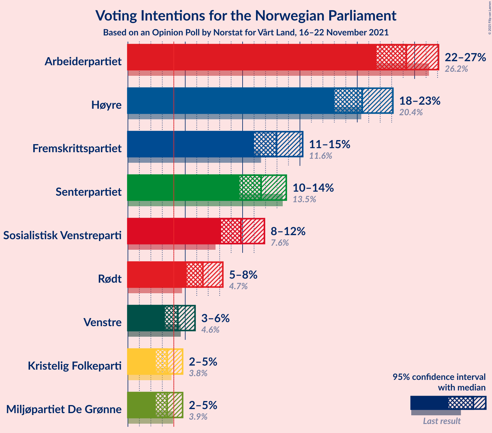

### Confidence Intervals

| Party | Last Result | Poll Result | 80% Confidence Interval | 90% Confidence Interval | 95% Confidence Interval | 99% Confidence Interval |
|:-----:|:-----------:|:-----------:|:-----------------------:|:-----------------------:|:-----------------------:|:-----------------------:|
| Arbeiderpartiet | 26.2% | 24.3% | 22.6–26.1% |22.1–26.6% |21.7–27.1% |20.9–28.0% |
| Høyre | 20.4% | 20.4% | 18.8–22.2% |18.4–22.7% |18.0–23.1% |17.3–24.0% |
| Fremskrittspartiet | 11.6% | 13.0% | 11.7–14.4% |11.3–14.9% |11.0–15.2% |10.4–16.0% |
| Senterpartiet | 13.5% | 11.6% | 10.4–13.0% |10.0–13.4% |9.7–13.8% |9.2–14.5% |
| Sosialistisk Venstreparti | 7.6% | 9.9% | 8.7–11.2% |8.4–11.6% |8.1–11.9% |7.6–12.6% |
| Rødt | 4.7% | 6.5% | 5.6–7.7% |5.3–8.0% |5.1–8.3% |4.7–8.9% |
| Venstre | 4.6% | 4.4% | 3.6–5.3% |3.4–5.6% |3.2–5.9% |2.9–6.3% |
| Kristelig Folkeparti | 3.8% | 3.4% | 2.8–4.3% |2.6–4.6% |2.4–4.8% |2.2–5.2% |
| Miljøpartiet De Grønne | 3.9% | 3.4% | 2.8–4.3% |2.6–4.6% |2.4–4.8% |2.2–5.2% |

*Note:* The poll result column reflects the actual value used in the calculations. Published results may vary slightly, and in addition be rounded to fewer digits.

## Seats

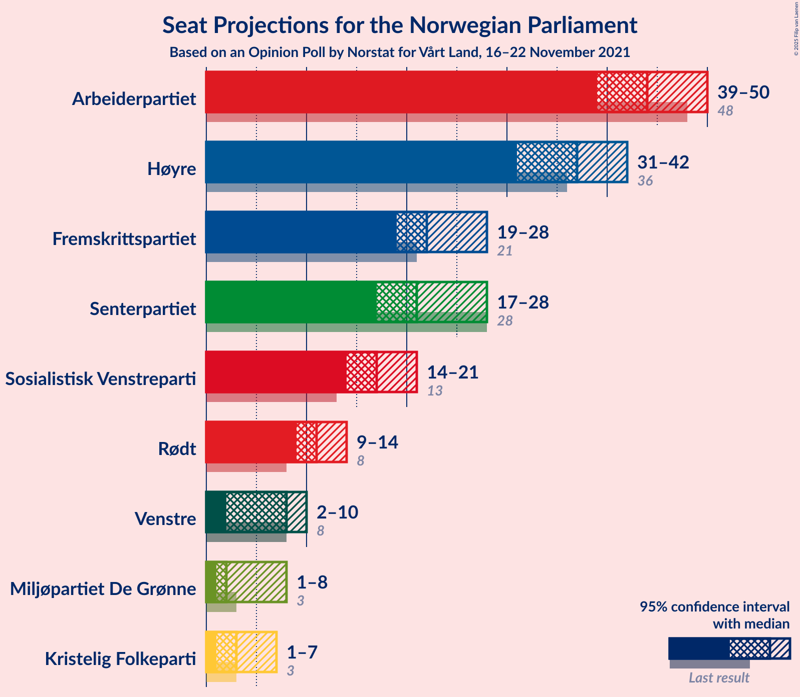

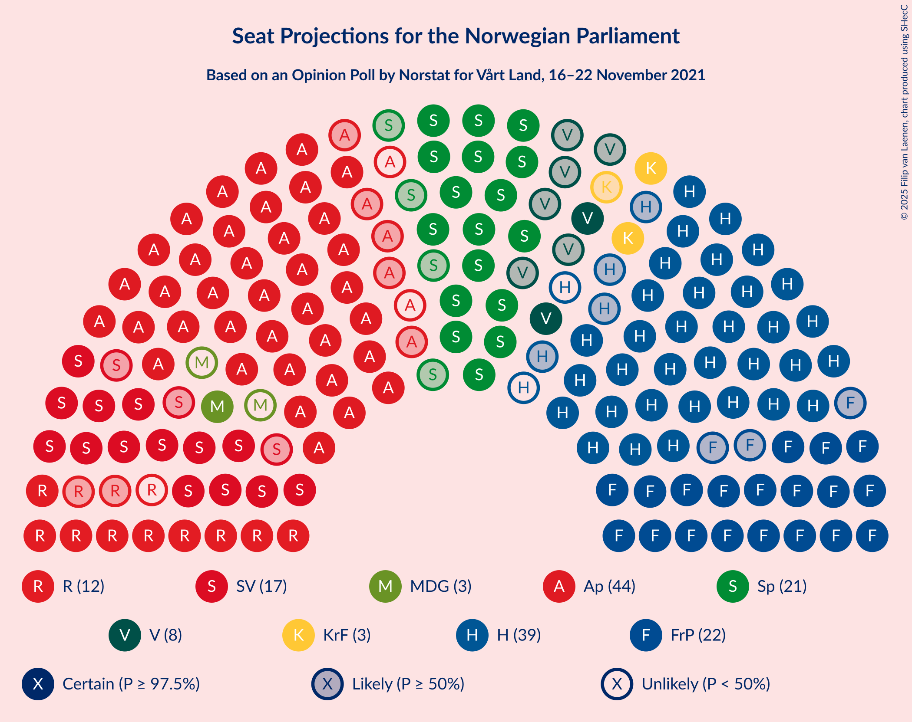

### Confidence Intervals

| Party | Last Result | Median | 80% Confidence Interval | 90% Confidence Interval | 95% Confidence Interval | 99% Confidence Interval |
|:-----:|:-----------:|:------:|:-----------------------:|:-----------------------:|:-----------------------:|:-----------------------:|
| <a href="#arbeiderpartiet">Arbeiderpartiet</a> | 48 | 44 | 41–48 |40–48 |39–50 |38–52 |
| <a href="#høyre">Høyre</a> | 36 | 37 | 33–40 |32–41 |31–42 |30–44 |
| <a href="#fremskrittspartiet">Fremskrittspartiet</a> | 21 | 22 | 20–26 |20–27 |19–28 |18–29 |
| <a href="#senterpartiet">Senterpartiet</a> | 28 | 21 | 18–24 |17–26 |17–28 |16–29 |
| <a href="#sosialistisk-venstreparti">Sosialistisk Venstreparti</a> | 13 | 17 | 15–20 |14–21 |14–21 |12–23 |
| <a href="#rødt">Rødt</a> | 8 | 11 | 9–13 |9–14 |9–14 |8–16 |
| <a href="#venstre">Venstre</a> | 8 | 8 | 3–9 |2–10 |2–10 |2–11 |
| <a href="#kristelig-folkeparti">Kristelig Folkeparti</a> | 3 | 3 | 3–7 |1–7 |1–7 |0–8 |
| <a href="#miljøpartiet-de-grønne">Miljøpartiet De Grønne</a> | 3 | 2 | 1–7 |1–8 |1–8 |1–9 |

### Arbeiderpartiet

*For a full overview of the results for this party, see the [Arbeiderpartiet](party-arbeiderpartiet.html) page.*

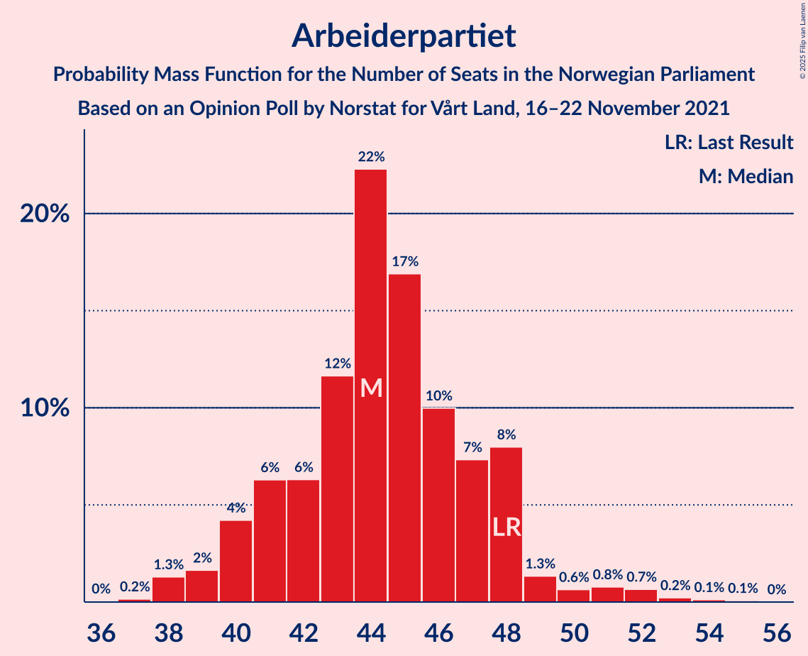

| Number of Seats | Probability | Accumulated | Special Marks |
|:---------------:|:-----------:|:-----------:|:-------------:|
| 36 | 0% | 100% |  |
| 37 | 0.2% | 99.9% |  |
| 38 | 1.3% | 99.8% |  |
| 39 | 2% | 98% |  |
| 40 | 4% | 97% |  |
| 41 | 6% | 93% |  |
| 42 | 6% | 86% |  |
| 43 | 12% | 80% |  |
| 44 | 22% | 68% | Median |
| 45 | 17% | 46% |  |
| 46 | 10% | 29% |  |
| 47 | 7% | 19% |  |
| 48 | 8% | 12% | Last Result |
| 49 | 1.3% | 4% |  |
| 50 | 0.6% | 3% |  |
| 51 | 0.8% | 2% |  |
| 52 | 0.7% | 1.1% |  |
| 53 | 0.2% | 0.4% |  |
| 54 | 0.1% | 0.2% |  |
| 55 | 0.1% | 0.1% |  |
| 56 | 0% | 0% |  |

### Høyre

*For a full overview of the results for this party, see the [Høyre](party-høyre.html) page.*

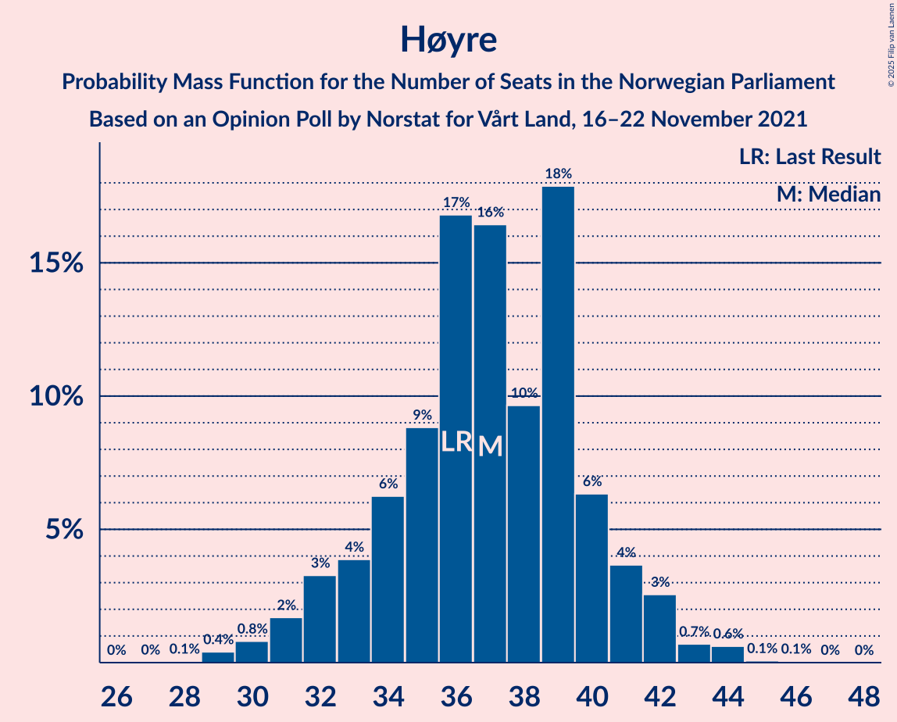

| Number of Seats | Probability | Accumulated | Special Marks |
|:---------------:|:-----------:|:-----------:|:-------------:|
| 28 | 0.1% | 100% |  |
| 29 | 0.4% | 99.9% |  |
| 30 | 0.8% | 99.5% |  |
| 31 | 2% | 98.7% |  |
| 32 | 3% | 97% |  |
| 33 | 4% | 94% |  |
| 34 | 6% | 90% |  |
| 35 | 9% | 84% |  |
| 36 | 17% | 75% | Last Result |
| 37 | 16% | 58% | Median |
| 38 | 10% | 42% |  |
| 39 | 18% | 32% |  |
| 40 | 6% | 14% |  |
| 41 | 4% | 8% |  |
| 42 | 3% | 4% |  |
| 43 | 0.7% | 1.5% |  |
| 44 | 0.6% | 0.7% |  |
| 45 | 0.1% | 0.1% |  |
| 46 | 0.1% | 0.1% |  |
| 47 | 0% | 0% |  |

### Fremskrittspartiet

*For a full overview of the results for this party, see the [Fremskrittspartiet](party-fremskrittspartiet.html) page.*

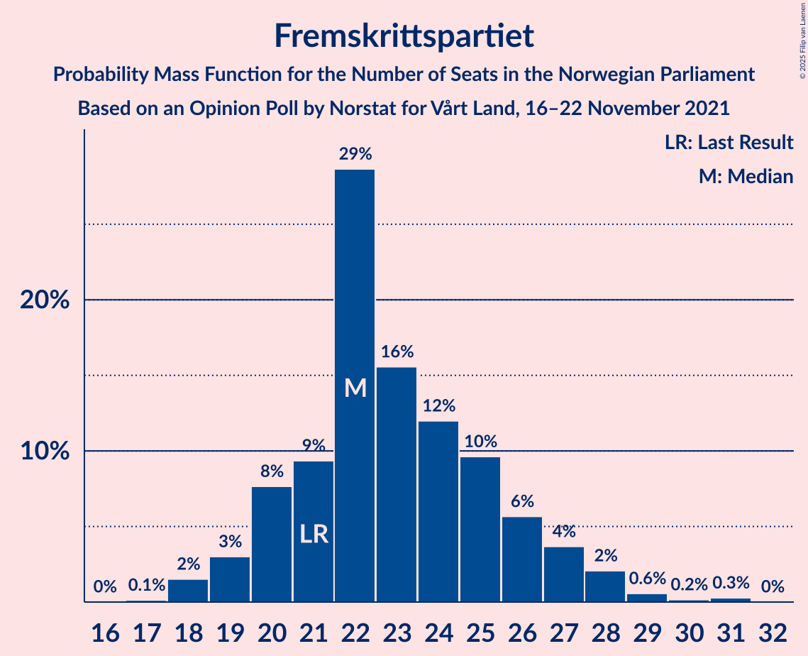

| Number of Seats | Probability | Accumulated | Special Marks |
|:---------------:|:-----------:|:-----------:|:-------------:|
| 17 | 0.1% | 100% |  |
| 18 | 2% | 99.8% |  |
| 19 | 3% | 98% |  |
| 20 | 8% | 95% |  |
| 21 | 9% | 88% | Last Result |
| 22 | 29% | 78% | Median |
| 23 | 16% | 50% |  |
| 24 | 12% | 34% |  |
| 25 | 10% | 22% |  |
| 26 | 6% | 12% |  |
| 27 | 4% | 7% |  |
| 28 | 2% | 3% |  |
| 29 | 0.6% | 1.0% |  |
| 30 | 0.2% | 0.5% |  |
| 31 | 0.3% | 0.3% |  |
| 32 | 0% | 0% |  |

### Senterpartiet

*For a full overview of the results for this party, see the [Senterpartiet](party-senterpartiet.html) page.*

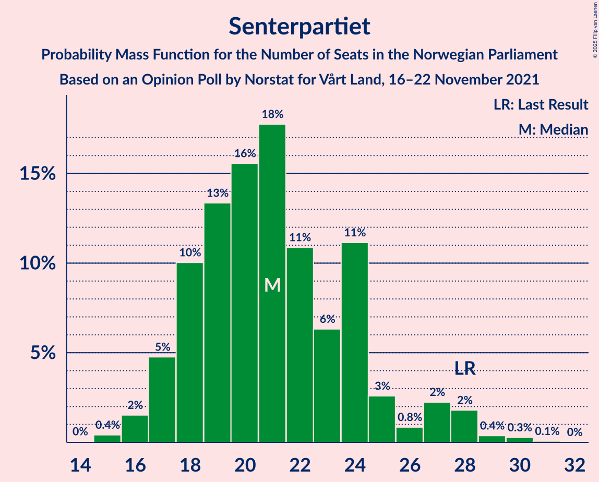

| Number of Seats | Probability | Accumulated | Special Marks |
|:---------------:|:-----------:|:-----------:|:-------------:|
| 14 | 0% | 100% |  |
| 15 | 0.4% | 99.9% |  |
| 16 | 2% | 99.5% |  |
| 17 | 5% | 98% |  |
| 18 | 10% | 93% |  |
| 19 | 13% | 83% |  |
| 20 | 16% | 70% |  |
| 21 | 18% | 54% | Median |
| 22 | 11% | 37% |  |
| 23 | 6% | 26% |  |
| 24 | 11% | 19% |  |
| 25 | 3% | 8% |  |
| 26 | 0.8% | 6% |  |
| 27 | 2% | 5% |  |
| 28 | 2% | 3% | Last Result |
| 29 | 0.4% | 0.7% |  |
| 30 | 0.3% | 0.3% |  |
| 31 | 0.1% | 0.1% |  |
| 32 | 0% | 0% |  |

### Sosialistisk Venstreparti

*For a full overview of the results for this party, see the [Sosialistisk Venstreparti](party-sosialistiskvenstreparti.html) page.*

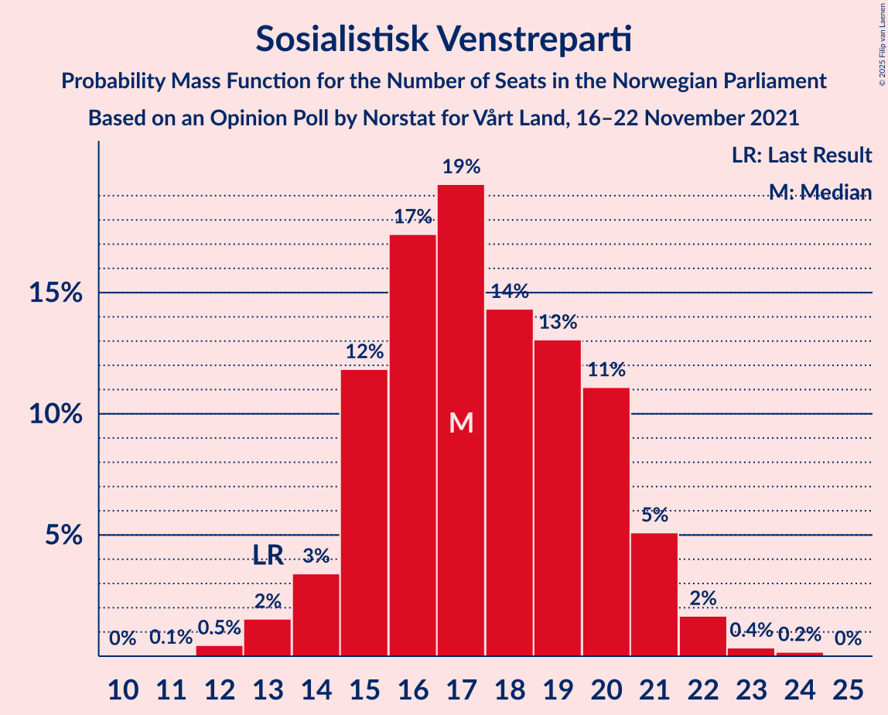

| Number of Seats | Probability | Accumulated | Special Marks |
|:---------------:|:-----------:|:-----------:|:-------------:|
| 11 | 0.1% | 100% |  |
| 12 | 0.5% | 99.9% |  |
| 13 | 2% | 99.5% | Last Result |
| 14 | 3% | 98% |  |
| 15 | 12% | 95% |  |
| 16 | 17% | 83% |  |
| 17 | 19% | 65% | Median |
| 18 | 14% | 46% |  |
| 19 | 13% | 31% |  |
| 20 | 11% | 18% |  |
| 21 | 5% | 7% |  |
| 22 | 2% | 2% |  |
| 23 | 0.4% | 0.5% |  |
| 24 | 0.2% | 0.2% |  |
| 25 | 0% | 0% |  |

### Rødt

*For a full overview of the results for this party, see the [Rødt](party-rødt.html) page.*

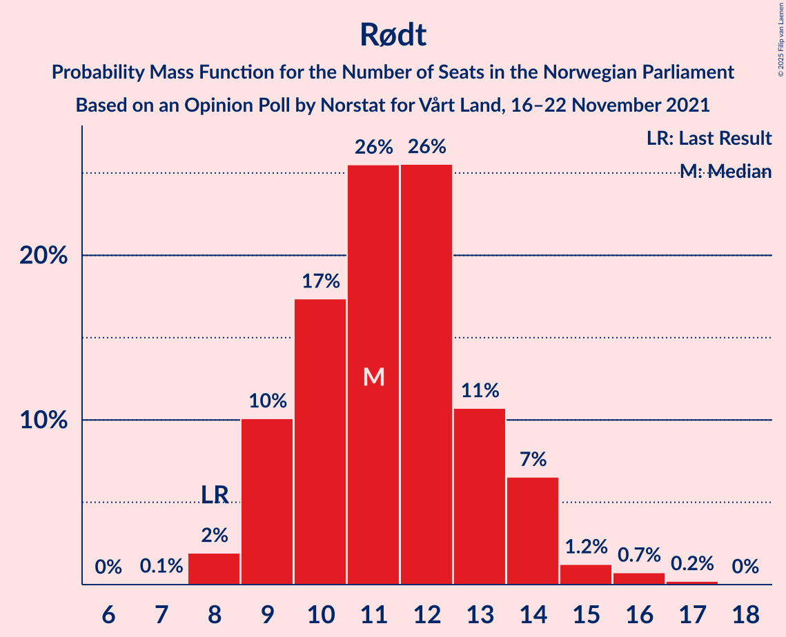

| Number of Seats | Probability | Accumulated | Special Marks |
|:---------------:|:-----------:|:-----------:|:-------------:|
| 7 | 0.1% | 100% |  |
| 8 | 2% | 99.9% | Last Result |
| 9 | 10% | 98% |  |
| 10 | 17% | 88% |  |
| 11 | 26% | 71% | Median |
| 12 | 26% | 45% |  |
| 13 | 11% | 19% |  |
| 14 | 7% | 9% |  |
| 15 | 1.2% | 2% |  |
| 16 | 0.7% | 1.0% |  |
| 17 | 0.2% | 0.2% |  |
| 18 | 0% | 0% |  |

### Venstre

*For a full overview of the results for this party, see the [Venstre](party-venstre.html) page.*

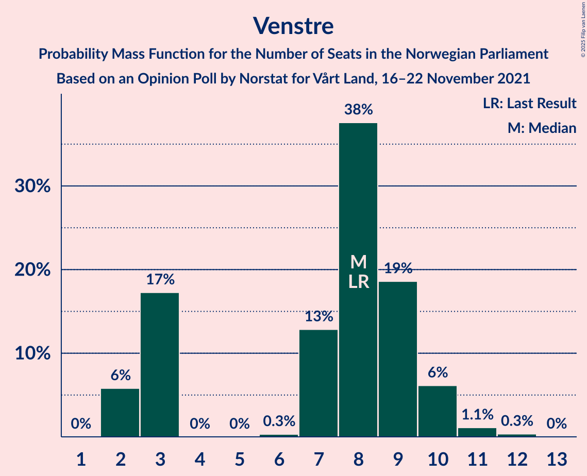

| Number of Seats | Probability | Accumulated | Special Marks |
|:---------------:|:-----------:|:-----------:|:-------------:|
| 2 | 6% | 100% |  |
| 3 | 17% | 94% |  |
| 4 | 0% | 77% |  |
| 5 | 0% | 77% |  |
| 6 | 0.3% | 77% |  |
| 7 | 13% | 77% |  |
| 8 | 38% | 64% | Last Result, Median |
| 9 | 19% | 26% |  |
| 10 | 6% | 8% |  |
| 11 | 1.1% | 1.5% |  |
| 12 | 0.3% | 0.4% |  |
| 13 | 0% | 0% |  |

### Kristelig Folkeparti

*For a full overview of the results for this party, see the [Kristelig Folkeparti](party-kristeligfolkeparti.html) page.*

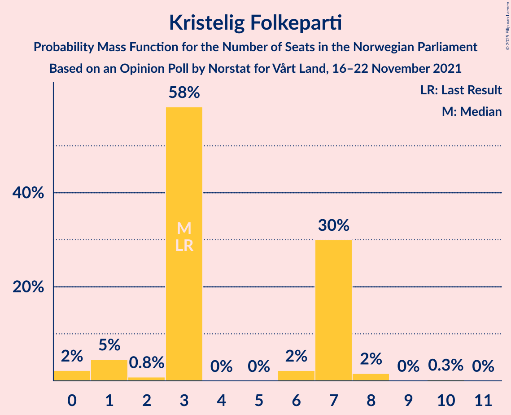

| Number of Seats | Probability | Accumulated | Special Marks |
|:---------------:|:-----------:|:-----------:|:-------------:|
| 0 | 2% | 100% |  |
| 1 | 5% | 98% |  |
| 2 | 0.8% | 93% |  |
| 3 | 58% | 92% | Last Result, Median |
| 4 | 0% | 34% |  |
| 5 | 0% | 34% |  |
| 6 | 2% | 34% |  |
| 7 | 30% | 32% |  |
| 8 | 2% | 2% |  |
| 9 | 0% | 0.3% |  |
| 10 | 0.3% | 0.3% |  |
| 11 | 0% | 0% |  |

### Miljøpartiet De Grønne

*For a full overview of the results for this party, see the [Miljøpartiet De Grønne](party-miljøpartietdegrønne.html) page.*

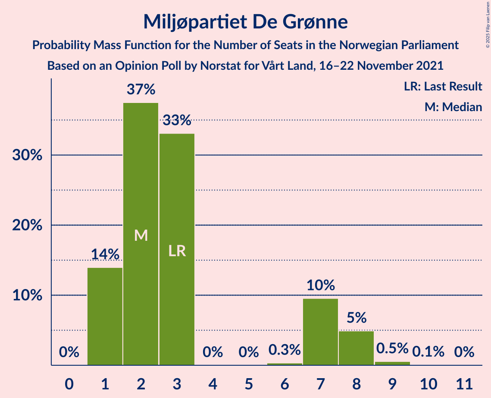

| Number of Seats | Probability | Accumulated | Special Marks |
|:---------------:|:-----------:|:-----------:|:-------------:|
| 1 | 14% | 100% |  |
| 2 | 37% | 86% | Median |
| 3 | 33% | 49% | Last Result |
| 4 | 0% | 15% |  |
| 5 | 0% | 15% |  |
| 6 | 0.3% | 15% |  |
| 7 | 10% | 15% |  |
| 8 | 5% | 6% |  |
| 9 | 0.5% | 0.6% |  |
| 10 | 0.1% | 0.1% |  |
| 11 | 0% | 0% |  |

## Coalitions

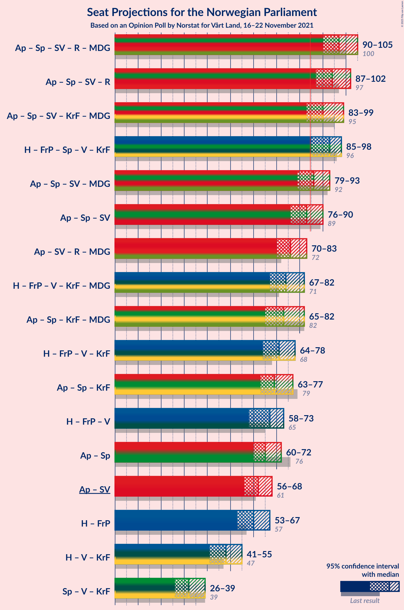

### Confidence Intervals

| Coalition | Last Result | Median | Majority? | 80% Confidence Interval | 90% Confidence Interval | 95% Confidence Interval | 99% Confidence Interval |
|:---------:|:-----------:|:------:|:---------:|:-----------------------:|:-----------------------:|:-----------------------:|:-----------------------:|
| Arbeiderpartiet – Senterpartiet – Sosialistisk Venstreparti – Rødt – Miljøpartiet De Grønne | 100 | 97 | 99.9% | 93–102 | 92–104 | 90–105 | 88–107 |
| Arbeiderpartiet – Senterpartiet – Sosialistisk Venstreparti – Rødt | 97 | 94 | 99.5% | 90–99 | 88–100 | 87–102 | 85–104 |
| Arbeiderpartiet – Senterpartiet – Sosialistisk Venstreparti – Kristelig Folkeparti – Miljøpartiet De Grønne | 95 | 90 | 92% | 85–95 | 84–98 | 83–99 | 80–101 |
| Høyre – Fremskrittspartiet – Senterpartiet – Venstre – Kristelig Folkeparti | 96 | 93 | 98% | 87–96 | 86–98 | 85–98 | 81–100 |
| Arbeiderpartiet – Senterpartiet – Sosialistisk Venstreparti – Miljøpartiet De Grønne | 92 | 86 | 63% | 81–91 | 80–92 | 79–93 | 77–96 |
| Arbeiderpartiet – Senterpartiet – Sosialistisk Venstreparti | 89 | 83 | 42% | 78–87 | 77–88 | 76–90 | 74–92 |
| Arbeiderpartiet – Sosialistisk Venstreparti – Rødt – Miljøpartiet De Grønne | 72 | 76 | 1.2% | 72–81 | 71–82 | 70–83 | 68–86 |
| Høyre – Fremskrittspartiet – Venstre – Kristelig Folkeparti – Miljøpartiet De Grønne | 71 | 74 | 0.2% | 70–79 | 68–80 | 67–82 | 63–84 |
| Arbeiderpartiet – Senterpartiet – Kristelig Folkeparti – Miljøpartiet De Grønne | 82 | 73 | 0.6% | 67–78 | 66–81 | 65–82 | 63–85 |
| Høyre – Fremskrittspartiet – Venstre – Kristelig Folkeparti | 68 | 71 | 0% | 66–76 | 65–76 | 64–78 | 61–80 |
| Arbeiderpartiet – Senterpartiet – Kristelig Folkeparti | 79 | 69 | 0% | 65–75 | 63–76 | 63–77 | 60–80 |
| Høyre – Fremskrittspartiet – Venstre | 65 | 67 | 0% | 62–72 | 60–73 | 58–73 | 56–76 |
| Arbeiderpartiet – Senterpartiet | 76 | 65 | 0% | 61–69 | 60–70 | 60–72 | 57–74 |
| Arbeiderpartiet – Sosialistisk Venstreparti | 61 | 62 | 0% | 58–65 | 57–66 | 56–68 | 54–70 |
| Høyre – Fremskrittspartiet | 57 | 60 | 0% | 55–64 | 53–65 | 53–67 | 50–69 |
| Høyre – Venstre – Kristelig Folkeparti | 47 | 48 | 0% | 44–53 | 42–54 | 41–55 | 38–55 |
| Senterpartiet – Venstre – Kristelig Folkeparti | 39 | 32 | 0% | 28–36 | 27–38 | 26–39 | 23–42 |

### Arbeiderpartiet – Senterpartiet – Sosialistisk Venstreparti – Rødt – Miljøpartiet De Grønne

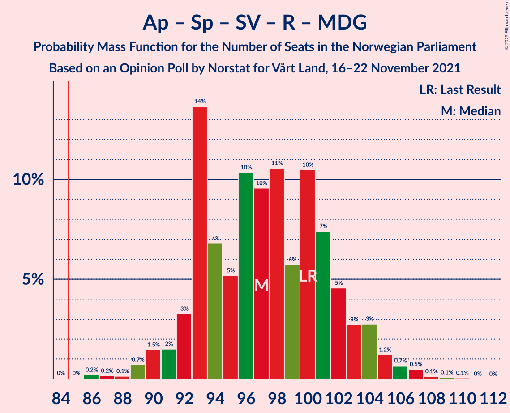

| Number of Seats | Probability | Accumulated | Special Marks |
|:---------------:|:-----------:|:-----------:|:-------------:|
| 84 | 0% | 100% |  |
| 85 | 0% | 99.9% | Majority |
| 86 | 0.2% | 99.9% |  |
| 87 | 0.2% | 99.7% |  |
| 88 | 0.1% | 99.5% |  |
| 89 | 0.7% | 99.4% |  |
| 90 | 1.5% | 98.7% |  |
| 91 | 2% | 97% |  |
| 92 | 3% | 96% |  |
| 93 | 14% | 92% |  |
| 94 | 7% | 79% |  |
| 95 | 5% | 72% | Median |
| 96 | 10% | 67% |  |
| 97 | 10% | 56% |  |
| 98 | 11% | 47% |  |
| 99 | 6% | 36% |  |
| 100 | 10% | 31% | Last Result |
| 101 | 7% | 20% |  |
| 102 | 5% | 13% |  |
| 103 | 3% | 8% |  |
| 104 | 3% | 5% |  |
| 105 | 1.2% | 3% |  |
| 106 | 0.7% | 1.4% |  |
| 107 | 0.5% | 0.8% |  |
| 108 | 0.1% | 0.3% |  |
| 109 | 0.1% | 0.1% |  |
| 110 | 0.1% | 0.1% |  |
| 111 | 0% | 0% |  |

### Arbeiderpartiet – Senterpartiet – Sosialistisk Venstreparti – Rødt

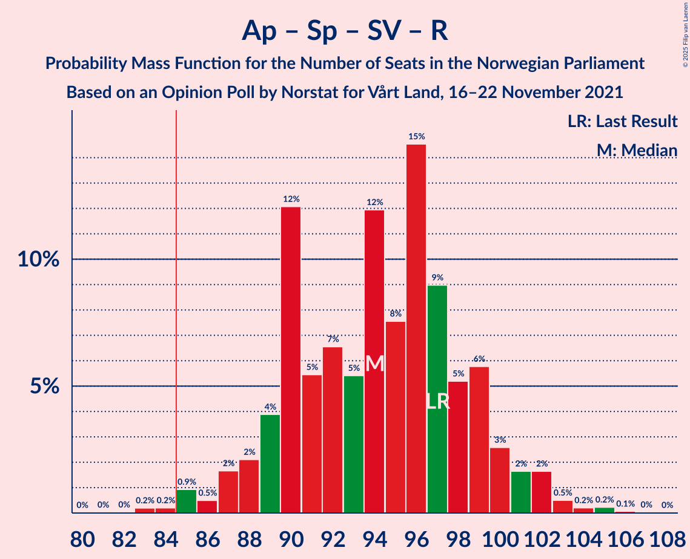

| Number of Seats | Probability | Accumulated | Special Marks |
|:---------------:|:-----------:|:-----------:|:-------------:|
| 81 | 0% | 100% |  |
| 82 | 0% | 99.9% |  |
| 83 | 0.2% | 99.9% |  |
| 84 | 0.2% | 99.7% |  |
| 85 | 0.9% | 99.5% | Majority |
| 86 | 0.5% | 98.6% |  |
| 87 | 2% | 98% |  |
| 88 | 2% | 96% |  |
| 89 | 4% | 94% |  |
| 90 | 12% | 90% |  |
| 91 | 5% | 78% |  |
| 92 | 7% | 73% |  |
| 93 | 5% | 66% | Median |
| 94 | 12% | 61% |  |
| 95 | 8% | 49% |  |
| 96 | 15% | 41% |  |
| 97 | 9% | 27% | Last Result |
| 98 | 5% | 18% |  |
| 99 | 6% | 13% |  |
| 100 | 3% | 7% |  |
| 101 | 2% | 4% |  |
| 102 | 2% | 3% |  |
| 103 | 0.5% | 1.1% |  |
| 104 | 0.2% | 0.6% |  |
| 105 | 0.2% | 0.3% |  |
| 106 | 0.1% | 0.1% |  |
| 107 | 0% | 0.1% |  |
| 108 | 0% | 0% |  |

### Arbeiderpartiet – Senterpartiet – Sosialistisk Venstreparti – Kristelig Folkeparti – Miljøpartiet De Grønne

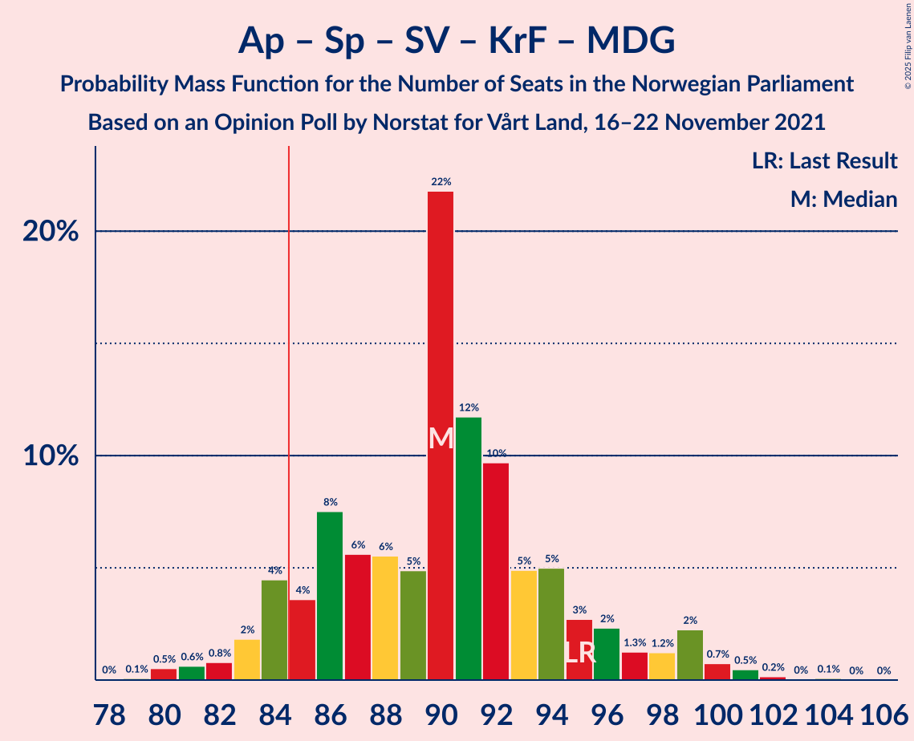

| Number of Seats | Probability | Accumulated | Special Marks |
|:---------------:|:-----------:|:-----------:|:-------------:|
| 78 | 0% | 100% |  |
| 79 | 0.1% | 99.9% |  |
| 80 | 0.5% | 99.8% |  |
| 81 | 0.6% | 99.3% |  |
| 82 | 0.8% | 98.7% |  |
| 83 | 2% | 98% |  |
| 84 | 4% | 96% |  |
| 85 | 4% | 92% | Majority |
| 86 | 8% | 88% |  |
| 87 | 6% | 80% | Median |
| 88 | 6% | 75% |  |
| 89 | 5% | 69% |  |
| 90 | 22% | 64% |  |
| 91 | 12% | 43% |  |
| 92 | 10% | 31% |  |
| 93 | 5% | 21% |  |
| 94 | 5% | 16% |  |
| 95 | 3% | 11% | Last Result |
| 96 | 2% | 9% |  |
| 97 | 1.3% | 6% |  |
| 98 | 1.2% | 5% |  |
| 99 | 2% | 4% |  |
| 100 | 0.7% | 2% |  |
| 101 | 0.5% | 0.8% |  |
| 102 | 0.2% | 0.3% |  |
| 103 | 0% | 0.1% |  |
| 104 | 0.1% | 0.1% |  |
| 105 | 0% | 0% |  |

### Høyre – Fremskrittspartiet – Senterpartiet – Venstre – Kristelig Folkeparti

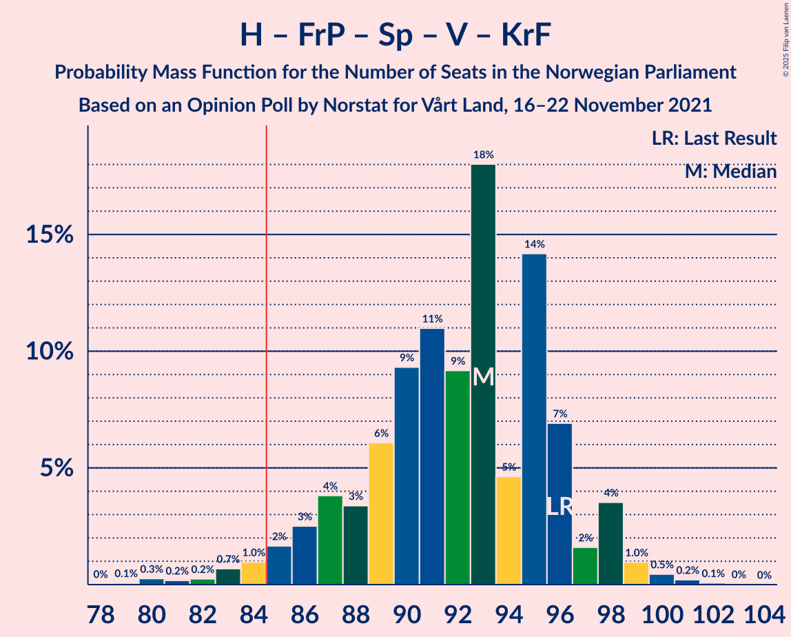

| Number of Seats | Probability | Accumulated | Special Marks |
|:---------------:|:-----------:|:-----------:|:-------------:|
| 78 | 0% | 100% |  |
| 79 | 0.1% | 99.9% |  |
| 80 | 0.3% | 99.9% |  |
| 81 | 0.2% | 99.6% |  |
| 82 | 0.2% | 99.4% |  |
| 83 | 0.7% | 99.2% |  |
| 84 | 1.0% | 98% |  |
| 85 | 2% | 98% | Majority |
| 86 | 3% | 96% |  |
| 87 | 4% | 93% |  |
| 88 | 3% | 90% |  |
| 89 | 6% | 86% |  |
| 90 | 9% | 80% |  |
| 91 | 11% | 71% | Median |
| 92 | 9% | 60% |  |
| 93 | 18% | 51% |  |
| 94 | 5% | 33% |  |
| 95 | 14% | 28% |  |
| 96 | 7% | 14% | Last Result |
| 97 | 2% | 7% |  |
| 98 | 4% | 5% |  |
| 99 | 1.0% | 2% |  |
| 100 | 0.5% | 0.8% |  |
| 101 | 0.2% | 0.3% |  |
| 102 | 0.1% | 0.1% |  |
| 103 | 0% | 0% |  |

### Arbeiderpartiet – Senterpartiet – Sosialistisk Venstreparti – Miljøpartiet De Grønne

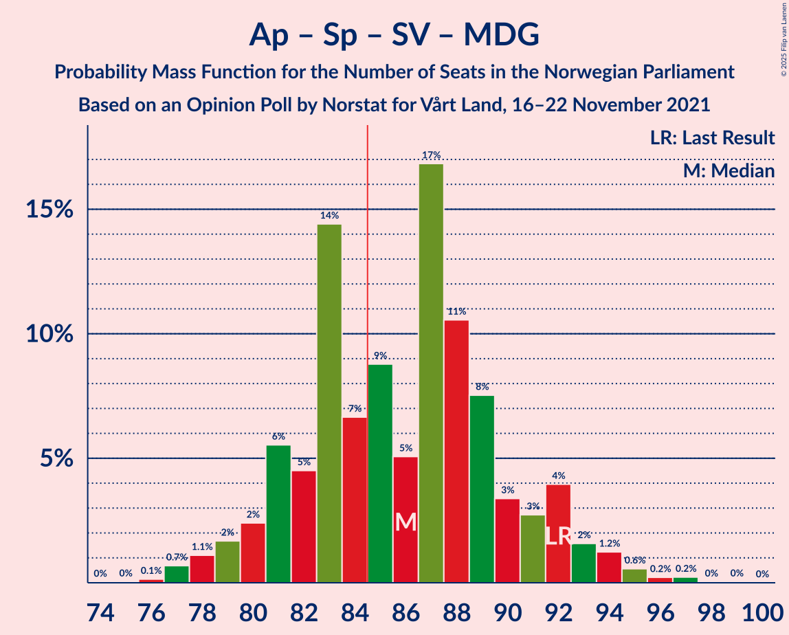

| Number of Seats | Probability | Accumulated | Special Marks |
|:---------------:|:-----------:|:-----------:|:-------------:|
| 74 | 0% | 100% |  |
| 75 | 0% | 99.9% |  |
| 76 | 0.1% | 99.9% |  |
| 77 | 0.7% | 99.8% |  |
| 78 | 1.1% | 99.1% |  |
| 79 | 2% | 98% |  |
| 80 | 2% | 96% |  |
| 81 | 6% | 94% |  |
| 82 | 5% | 88% |  |
| 83 | 14% | 84% |  |
| 84 | 7% | 69% | Median |
| 85 | 9% | 63% | Majority |
| 86 | 5% | 54% |  |
| 87 | 17% | 49% |  |
| 88 | 11% | 32% |  |
| 89 | 8% | 22% |  |
| 90 | 3% | 14% |  |
| 91 | 3% | 11% |  |
| 92 | 4% | 8% | Last Result |
| 93 | 2% | 4% |  |
| 94 | 1.2% | 2% |  |
| 95 | 0.6% | 1.1% |  |
| 96 | 0.2% | 0.6% |  |
| 97 | 0.2% | 0.3% |  |
| 98 | 0% | 0.1% |  |
| 99 | 0% | 0.1% |  |
| 100 | 0% | 0% |  |

### Arbeiderpartiet – Senterpartiet – Sosialistisk Venstreparti

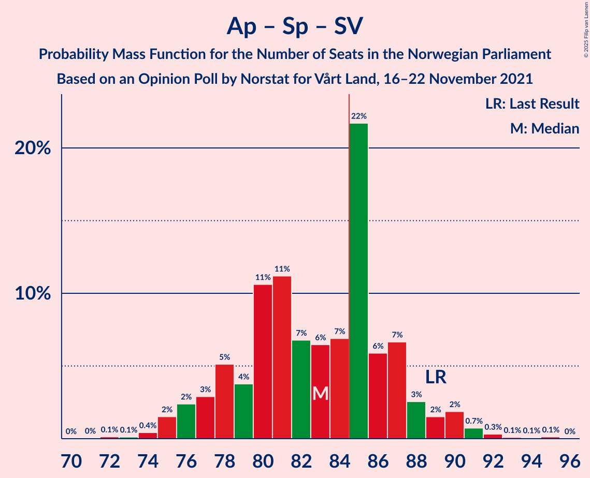

| Number of Seats | Probability | Accumulated | Special Marks |
|:---------------:|:-----------:|:-----------:|:-------------:|
| 71 | 0% | 100% |  |
| 72 | 0.1% | 99.9% |  |
| 73 | 0.1% | 99.8% |  |
| 74 | 0.4% | 99.7% |  |
| 75 | 2% | 99.3% |  |
| 76 | 2% | 98% |  |
| 77 | 3% | 95% |  |
| 78 | 5% | 92% |  |
| 79 | 4% | 87% |  |
| 80 | 11% | 84% |  |
| 81 | 11% | 73% |  |
| 82 | 7% | 62% | Median |
| 83 | 6% | 55% |  |
| 84 | 7% | 48% |  |
| 85 | 22% | 42% | Majority |
| 86 | 6% | 20% |  |
| 87 | 7% | 14% |  |
| 88 | 3% | 7% |  |
| 89 | 2% | 5% | Last Result |
| 90 | 2% | 3% |  |
| 91 | 0.7% | 1.4% |  |
| 92 | 0.3% | 0.6% |  |
| 93 | 0.1% | 0.3% |  |
| 94 | 0.1% | 0.2% |  |
| 95 | 0.1% | 0.1% |  |
| 96 | 0% | 0% |  |

### Arbeiderpartiet – Sosialistisk Venstreparti – Rødt – Miljøpartiet De Grønne

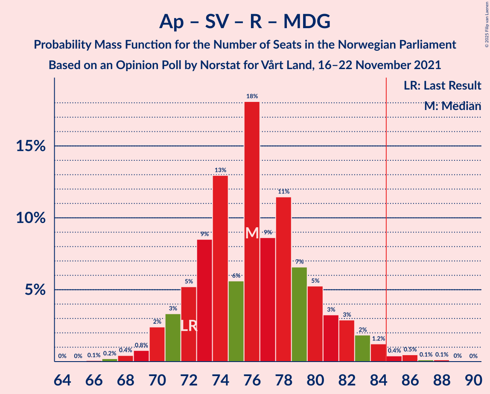

| Number of Seats | Probability | Accumulated | Special Marks |
|:---------------:|:-----------:|:-----------:|:-------------:|
| 66 | 0.1% | 100% |  |
| 67 | 0.2% | 99.9% |  |
| 68 | 0.4% | 99.7% |  |
| 69 | 0.8% | 99.2% |  |
| 70 | 2% | 98% |  |
| 71 | 3% | 96% |  |
| 72 | 5% | 93% | Last Result |
| 73 | 9% | 88% |  |
| 74 | 13% | 79% | Median |
| 75 | 6% | 66% |  |
| 76 | 18% | 60% |  |
| 77 | 9% | 42% |  |
| 78 | 11% | 34% |  |
| 79 | 7% | 22% |  |
| 80 | 5% | 16% |  |
| 81 | 3% | 10% |  |
| 82 | 3% | 7% |  |
| 83 | 2% | 4% |  |
| 84 | 1.2% | 2% |  |
| 85 | 0.4% | 1.2% | Majority |
| 86 | 0.5% | 0.8% |  |
| 87 | 0.1% | 0.3% |  |
| 88 | 0.1% | 0.2% |  |
| 89 | 0% | 0.1% |  |
| 90 | 0% | 0% |  |

### Høyre – Fremskrittspartiet – Venstre – Kristelig Folkeparti – Miljøpartiet De Grønne

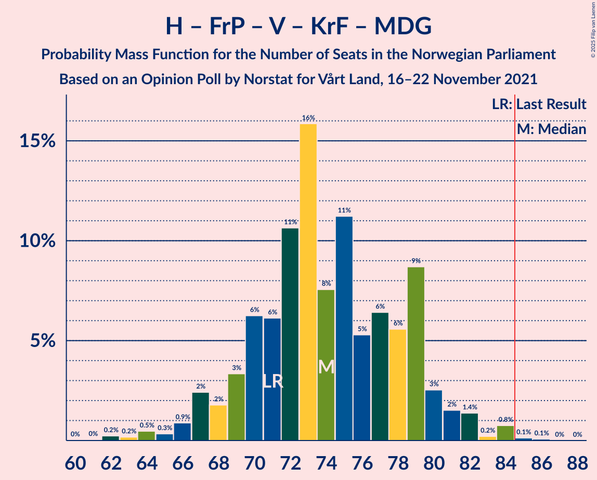

| Number of Seats | Probability | Accumulated | Special Marks |
|:---------------:|:-----------:|:-----------:|:-------------:|
| 60 | 0% | 100% |  |
| 61 | 0% | 99.9% |  |
| 62 | 0.2% | 99.9% |  |
| 63 | 0.2% | 99.7% |  |
| 64 | 0.5% | 99.5% |  |
| 65 | 0.3% | 99.0% |  |
| 66 | 0.9% | 98.7% |  |
| 67 | 2% | 98% |  |
| 68 | 2% | 95% |  |
| 69 | 3% | 94% |  |
| 70 | 6% | 90% |  |
| 71 | 6% | 84% | Last Result |
| 72 | 11% | 78% | Median |
| 73 | 16% | 67% |  |
| 74 | 8% | 51% |  |
| 75 | 11% | 44% |  |
| 76 | 5% | 33% |  |
| 77 | 6% | 27% |  |
| 78 | 6% | 21% |  |
| 79 | 9% | 15% |  |
| 80 | 3% | 7% |  |
| 81 | 2% | 4% |  |
| 82 | 1.4% | 3% |  |
| 83 | 0.2% | 1.2% |  |
| 84 | 0.8% | 1.0% |  |
| 85 | 0.1% | 0.2% | Majority |
| 86 | 0.1% | 0.1% |  |
| 87 | 0% | 0% |  |

### Arbeiderpartiet – Senterpartiet – Kristelig Folkeparti – Miljøpartiet De Grønne

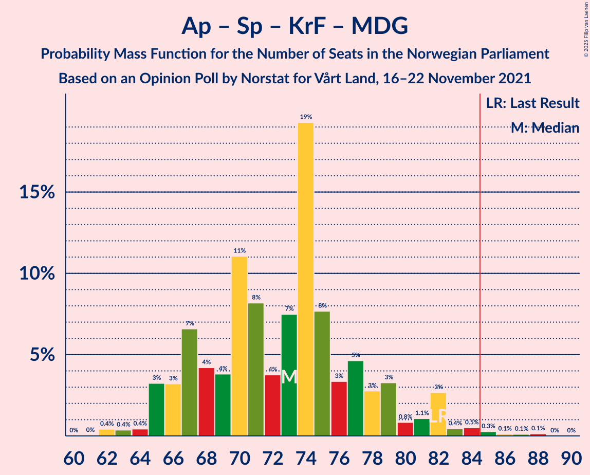

| Number of Seats | Probability | Accumulated | Special Marks |
|:---------------:|:-----------:|:-----------:|:-------------:|
| 61 | 0% | 100% |  |
| 62 | 0.4% | 99.9% |  |
| 63 | 0.4% | 99.5% |  |
| 64 | 0.4% | 99.2% |  |
| 65 | 3% | 98.7% |  |
| 66 | 3% | 95% |  |
| 67 | 7% | 92% |  |
| 68 | 4% | 86% |  |
| 69 | 4% | 81% |  |
| 70 | 11% | 78% | Median |
| 71 | 8% | 67% |  |
| 72 | 4% | 58% |  |
| 73 | 7% | 55% |  |
| 74 | 19% | 47% |  |
| 75 | 8% | 28% |  |
| 76 | 3% | 20% |  |
| 77 | 5% | 17% |  |
| 78 | 3% | 12% |  |
| 79 | 3% | 9% |  |
| 80 | 0.8% | 6% |  |
| 81 | 1.1% | 5% |  |
| 82 | 3% | 4% | Last Result |
| 83 | 0.4% | 2% |  |
| 84 | 0.5% | 1.2% |  |
| 85 | 0.3% | 0.6% | Majority |
| 86 | 0.1% | 0.4% |  |
| 87 | 0.1% | 0.3% |  |
| 88 | 0.1% | 0.1% |  |
| 89 | 0% | 0% |  |

### Høyre – Fremskrittspartiet – Venstre – Kristelig Folkeparti

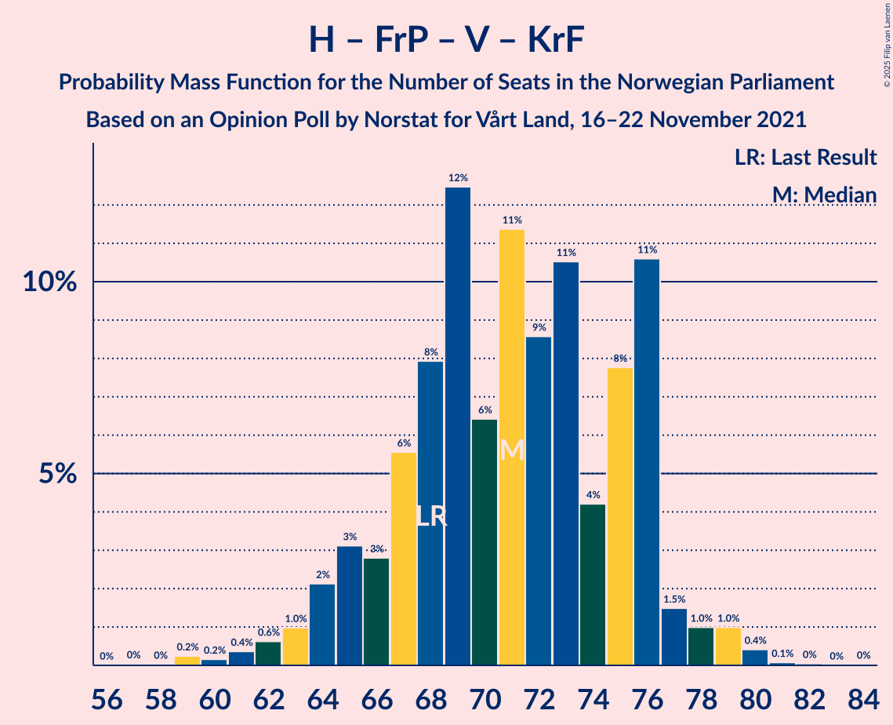

| Number of Seats | Probability | Accumulated | Special Marks |
|:---------------:|:-----------:|:-----------:|:-------------:|
| 57 | 0% | 100% |  |
| 58 | 0% | 99.9% |  |
| 59 | 0.2% | 99.9% |  |
| 60 | 0.2% | 99.7% |  |
| 61 | 0.4% | 99.5% |  |
| 62 | 0.6% | 99.2% |  |
| 63 | 1.0% | 98.5% |  |
| 64 | 2% | 98% |  |
| 65 | 3% | 95% |  |
| 66 | 3% | 92% |  |
| 67 | 6% | 89% |  |
| 68 | 8% | 84% | Last Result |
| 69 | 12% | 76% |  |
| 70 | 6% | 64% | Median |
| 71 | 11% | 57% |  |
| 72 | 9% | 46% |  |
| 73 | 11% | 37% |  |
| 74 | 4% | 27% |  |
| 75 | 8% | 22% |  |
| 76 | 11% | 15% |  |
| 77 | 1.5% | 4% |  |
| 78 | 1.0% | 3% |  |
| 79 | 1.0% | 2% |  |
| 80 | 0.4% | 0.6% |  |
| 81 | 0.1% | 0.2% |  |
| 82 | 0% | 0.1% |  |
| 83 | 0% | 0% |  |

### Arbeiderpartiet – Senterpartiet – Kristelig Folkeparti

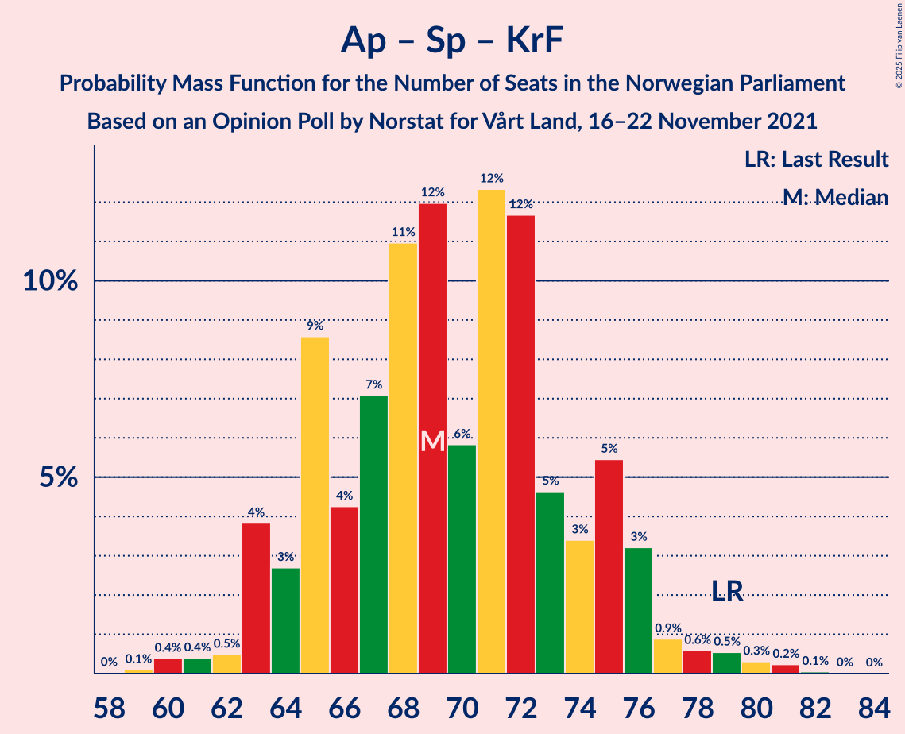

| Number of Seats | Probability | Accumulated | Special Marks |
|:---------------:|:-----------:|:-----------:|:-------------:|
| 59 | 0.1% | 100% |  |
| 60 | 0.4% | 99.9% |  |
| 61 | 0.4% | 99.5% |  |
| 62 | 0.5% | 99.1% |  |
| 63 | 4% | 98.6% |  |
| 64 | 3% | 95% |  |
| 65 | 9% | 92% |  |
| 66 | 4% | 83% |  |
| 67 | 7% | 79% |  |
| 68 | 11% | 72% | Median |
| 69 | 12% | 61% |  |
| 70 | 6% | 49% |  |
| 71 | 12% | 43% |  |
| 72 | 12% | 31% |  |
| 73 | 5% | 19% |  |
| 74 | 3% | 15% |  |
| 75 | 5% | 11% |  |
| 76 | 3% | 6% |  |
| 77 | 0.9% | 3% |  |
| 78 | 0.6% | 2% |  |
| 79 | 0.5% | 1.2% | Last Result |
| 80 | 0.3% | 0.6% |  |
| 81 | 0.2% | 0.3% |  |
| 82 | 0.1% | 0.1% |  |
| 83 | 0% | 0% |  |

### Høyre – Fremskrittspartiet – Venstre

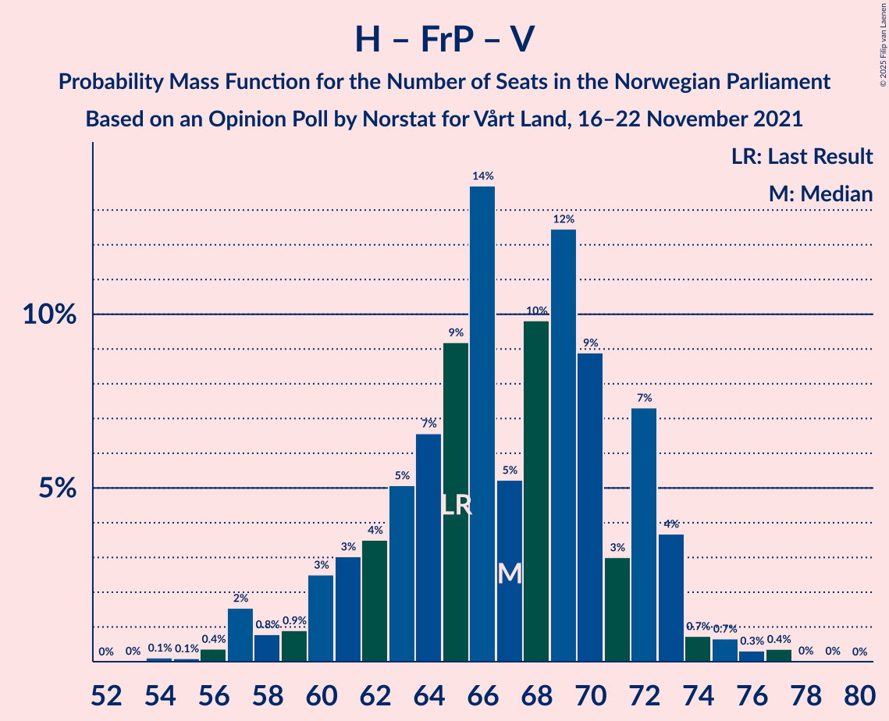

| Number of Seats | Probability | Accumulated | Special Marks |
|:---------------:|:-----------:|:-----------:|:-------------:|
| 54 | 0.1% | 100% |  |
| 55 | 0.1% | 99.8% |  |
| 56 | 0.4% | 99.7% |  |
| 57 | 2% | 99.4% |  |
| 58 | 0.8% | 98% |  |
| 59 | 0.9% | 97% |  |
| 60 | 3% | 96% |  |
| 61 | 3% | 94% |  |
| 62 | 4% | 91% |  |
| 63 | 5% | 87% |  |
| 64 | 7% | 82% |  |
| 65 | 9% | 75% | Last Result |
| 66 | 14% | 66% |  |
| 67 | 5% | 53% | Median |
| 68 | 10% | 47% |  |
| 69 | 12% | 38% |  |
| 70 | 9% | 25% |  |
| 71 | 3% | 16% |  |
| 72 | 7% | 13% |  |
| 73 | 4% | 6% |  |
| 74 | 0.7% | 2% |  |
| 75 | 0.7% | 1.4% |  |
| 76 | 0.3% | 0.7% |  |
| 77 | 0.4% | 0.4% |  |
| 78 | 0% | 0.1% |  |
| 79 | 0% | 0% |  |

### Arbeiderpartiet – Senterpartiet

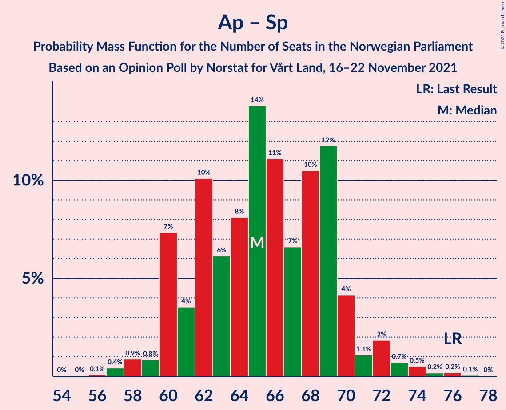

| Number of Seats | Probability | Accumulated | Special Marks |
|:---------------:|:-----------:|:-----------:|:-------------:|
| 56 | 0.1% | 100% |  |
| 57 | 0.4% | 99.9% |  |
| 58 | 0.9% | 99.5% |  |
| 59 | 0.8% | 98.6% |  |
| 60 | 7% | 98% |  |
| 61 | 4% | 90% |  |
| 62 | 10% | 87% |  |
| 63 | 6% | 77% |  |
| 64 | 8% | 71% |  |
| 65 | 14% | 63% | Median |
| 66 | 11% | 49% |  |
| 67 | 7% | 38% |  |
| 68 | 10% | 31% |  |
| 69 | 12% | 20% |  |
| 70 | 4% | 9% |  |
| 71 | 1.1% | 5% |  |
| 72 | 2% | 4% |  |
| 73 | 0.7% | 2% |  |
| 74 | 0.5% | 1.0% |  |
| 75 | 0.2% | 0.4% |  |
| 76 | 0.2% | 0.3% | Last Result |
| 77 | 0.1% | 0.1% |  |
| 78 | 0% | 0% |  |

### Arbeiderpartiet – Sosialistisk Venstreparti

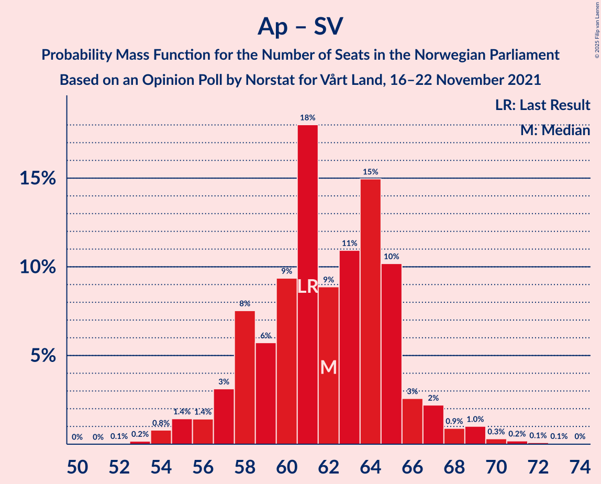

| Number of Seats | Probability | Accumulated | Special Marks |
|:---------------:|:-----------:|:-----------:|:-------------:|
| 52 | 0.1% | 100% |  |
| 53 | 0.2% | 99.9% |  |
| 54 | 0.8% | 99.8% |  |
| 55 | 1.4% | 99.0% |  |
| 56 | 1.4% | 98% |  |
| 57 | 3% | 96% |  |
| 58 | 8% | 93% |  |
| 59 | 6% | 85% |  |
| 60 | 9% | 80% |  |
| 61 | 18% | 70% | Last Result, Median |
| 62 | 9% | 52% |  |
| 63 | 11% | 43% |  |
| 64 | 15% | 33% |  |
| 65 | 10% | 18% |  |
| 66 | 3% | 7% |  |
| 67 | 2% | 5% |  |
| 68 | 0.9% | 3% |  |
| 69 | 1.0% | 2% |  |
| 70 | 0.3% | 0.7% |  |
| 71 | 0.2% | 0.4% |  |
| 72 | 0.1% | 0.2% |  |
| 73 | 0.1% | 0.1% |  |
| 74 | 0% | 0% |  |

### Høyre – Fremskrittspartiet

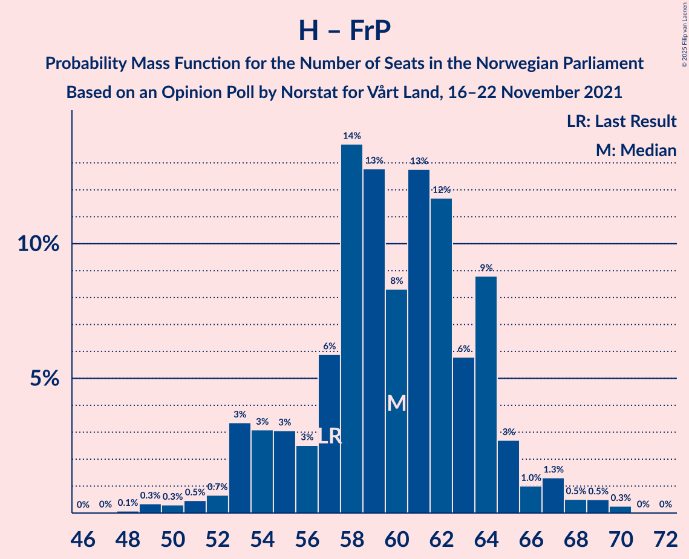

| Number of Seats | Probability | Accumulated | Special Marks |
|:---------------:|:-----------:|:-----------:|:-------------:|
| 48 | 0.1% | 100% |  |
| 49 | 0.3% | 99.9% |  |
| 50 | 0.3% | 99.5% |  |
| 51 | 0.5% | 99.2% |  |
| 52 | 0.7% | 98.8% |  |
| 53 | 3% | 98% |  |
| 54 | 3% | 95% |  |
| 55 | 3% | 92% |  |
| 56 | 3% | 89% |  |
| 57 | 6% | 86% | Last Result |
| 58 | 14% | 80% |  |
| 59 | 13% | 66% | Median |
| 60 | 8% | 54% |  |
| 61 | 13% | 45% |  |
| 62 | 12% | 33% |  |
| 63 | 6% | 21% |  |
| 64 | 9% | 15% |  |
| 65 | 3% | 6% |  |
| 66 | 1.0% | 4% |  |
| 67 | 1.3% | 3% |  |
| 68 | 0.5% | 1.3% |  |
| 69 | 0.5% | 0.8% |  |
| 70 | 0.3% | 0.3% |  |
| 71 | 0% | 0% |  |

### Høyre – Venstre – Kristelig Folkeparti

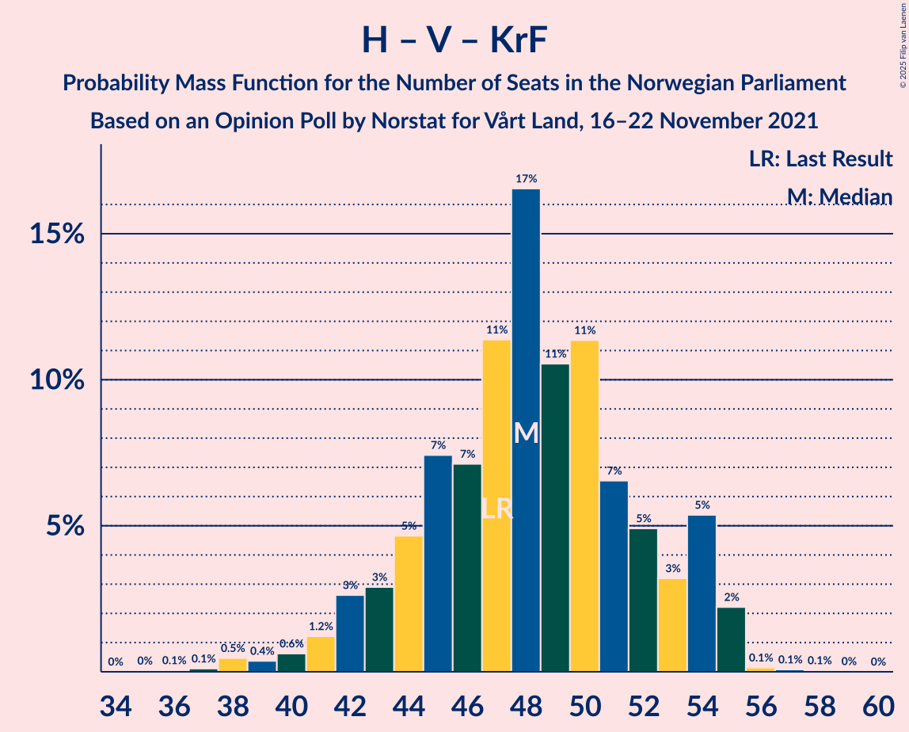

| Number of Seats | Probability | Accumulated | Special Marks |
|:---------------:|:-----------:|:-----------:|:-------------:|
| 36 | 0.1% | 100% |  |
| 37 | 0.1% | 99.9% |  |
| 38 | 0.5% | 99.8% |  |
| 39 | 0.4% | 99.3% |  |
| 40 | 0.6% | 98.9% |  |
| 41 | 1.2% | 98% |  |
| 42 | 3% | 97% |  |
| 43 | 3% | 94% |  |
| 44 | 5% | 92% |  |
| 45 | 7% | 87% |  |
| 46 | 7% | 79% |  |
| 47 | 11% | 72% | Last Result |
| 48 | 17% | 61% | Median |
| 49 | 11% | 44% |  |
| 50 | 11% | 34% |  |
| 51 | 7% | 23% |  |
| 52 | 5% | 16% |  |
| 53 | 3% | 11% |  |
| 54 | 5% | 8% |  |
| 55 | 2% | 3% |  |
| 56 | 0.1% | 0.3% |  |
| 57 | 0.1% | 0.2% |  |
| 58 | 0.1% | 0.1% |  |
| 59 | 0% | 0% |  |

### Senterpartiet – Venstre – Kristelig Folkeparti

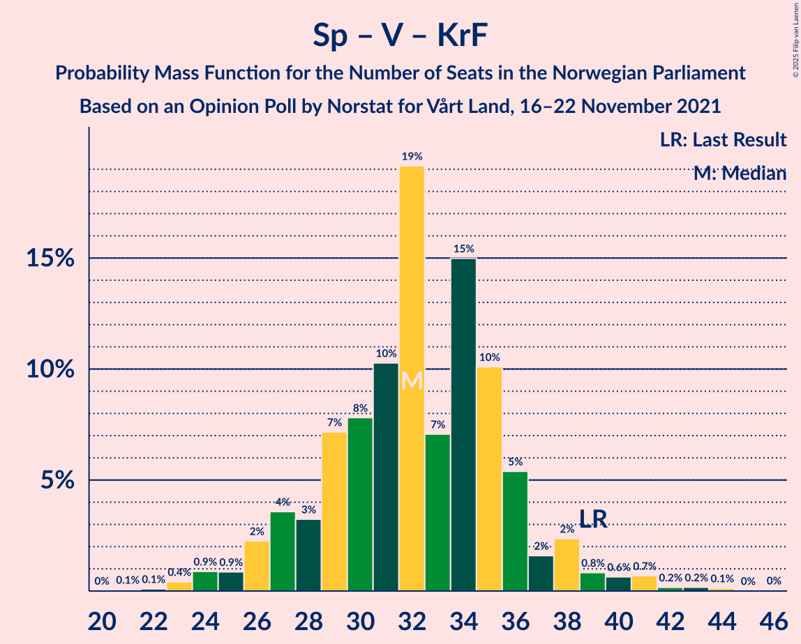

| Number of Seats | Probability | Accumulated | Special Marks |
|:---------------:|:-----------:|:-----------:|:-------------:|
| 21 | 0.1% | 100% |  |
| 22 | 0.1% | 99.9% |  |
| 23 | 0.4% | 99.8% |  |
| 24 | 0.9% | 99.4% |  |
| 25 | 0.9% | 98.5% |  |
| 26 | 2% | 98% |  |
| 27 | 4% | 95% |  |
| 28 | 3% | 92% |  |
| 29 | 7% | 89% |  |
| 30 | 8% | 81% |  |
| 31 | 10% | 74% |  |
| 32 | 19% | 63% | Median |
| 33 | 7% | 44% |  |
| 34 | 15% | 37% |  |
| 35 | 10% | 22% |  |
| 36 | 5% | 12% |  |
| 37 | 2% | 7% |  |
| 38 | 2% | 5% |  |
| 39 | 0.8% | 3% | Last Result |
| 40 | 0.6% | 2% |  |
| 41 | 0.7% | 1.2% |  |
| 42 | 0.2% | 0.5% |  |
| 43 | 0.2% | 0.3% |  |
| 44 | 0.1% | 0.2% |  |
| 45 | 0% | 0% |  |

## Technical Information

### Opinion Poll

+ **Polling firm:** Norstat
+ **Commissioner(s):** Vårt Land
+ **Fieldwork period:** 16–22 November 2021

### Calculations

+ **Sample size:** 964
+ **Simulations done:** 1,048,576
+ **Error estimate:** 2.10%

