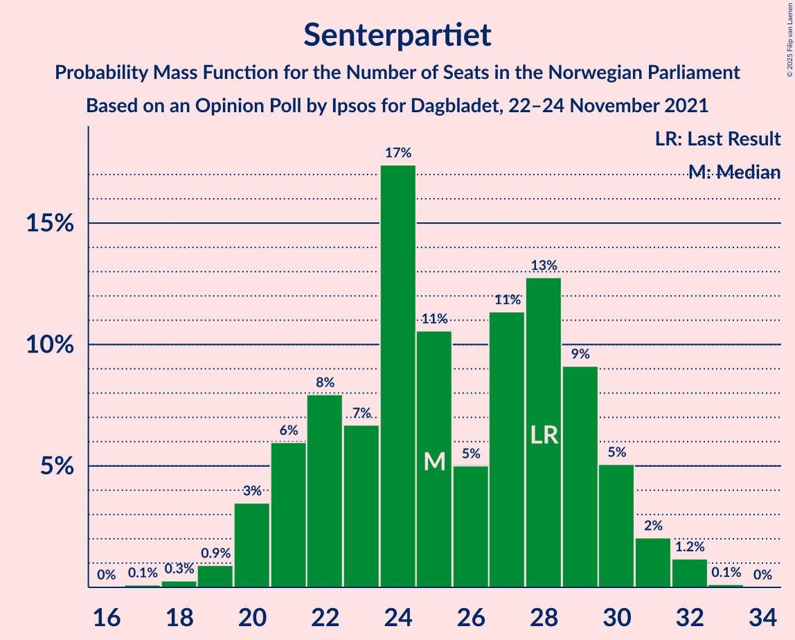

# Opinion Poll by Ipsos for Dagbladet, 22–24 November 2021

<a href="#voting-intentions">Voting Intentions</a> | <a href="#seats">Seats</a> | <a href="#coalitions">Coalitions</a> | <a href="#technical-information">Technical Information</a>

## Voting Intentions

### Confidence Intervals

| Party | Last Result | Poll Result | 80% Confidence Interval | 90% Confidence Interval | 95% Confidence Interval | 99% Confidence Interval |
|:-----:|:-----------:|:-----------:|:-----------------------:|:-----------------------:|:-----------------------:|:-----------------------:|
| Arbeiderpartiet | 26.2% | 24.0% | 22.3–25.9% |21.8–26.4% |21.4–26.9% |20.6–27.8% |
| Høyre | 20.4% | 22.3% | 20.6–24.1% |20.2–24.6% |19.8–25.1% |19.0–26.0% |
| Senterpartiet | 13.5% | 13.4% | 12.1–14.9% |11.7–15.3% |11.4–15.7% |10.7–16.5% |
| Fremskrittspartiet | 11.6% | 11.3% | 10.0–12.7% |9.7–13.1% |9.4–13.5% |8.8–14.2% |
| Sosialistisk Venstreparti | 7.6% | 9.4% | 8.2–10.7% |7.9–11.1% |7.7–11.4% |7.1–12.1% |
| Rødt | 4.7% | 5.4% | 4.6–6.5% |4.3–6.8% |4.1–7.1% |3.8–7.6% |
| Venstre | 4.6% | 4.5% | 3.7–5.5% |3.5–5.7% |3.3–6.0% |3.0–6.5% |
| Miljøpartiet De Grønne | 3.9% | 4.3% | 3.5–5.2% |3.3–5.5% |3.1–5.7% |2.8–6.2% |
| Kristelig Folkeparti | 3.8% | 2.6% | 2.0–3.4% |1.8–3.6% |1.7–3.8% |1.5–4.2% |

*Note:* The poll result column reflects the actual value used in the calculations. Published results may vary slightly, and in addition be rounded to fewer digits.

## Seats

### Confidence Intervals

| Party | Last Result | Median | 80% Confidence Interval | 90% Confidence Interval | 95% Confidence Interval | 99% Confidence Interval |
|:-----:|:-----------:|:------:|:-----------------------:|:-----------------------:|:-----------------------:|:-----------------------:|
| <a href="#arbeiderpartiet">Arbeiderpartiet</a> | 48 | 44 | 40–47 |40–49 |39–49 |37–51 |
| <a href="#høyre">Høyre</a> | 36 | 39 | 36–43 |35–44 |35–46 |33–47 |
| <a href="#senterpartiet">Senterpartiet</a> | 28 | 25 | 21–29 |21–30 |20–31 |19–32 |
| <a href="#fremskrittspartiet">Fremskrittspartiet</a> | 21 | 20 | 18–22 |17–23 |17–24 |15–25 |
| <a href="#sosialistisk-venstreparti">Sosialistisk Venstreparti</a> | 13 | 16 | 13–18 |13–19 |12–20 |12–21 |
| <a href="#rødt">Rødt</a> | 8 | 9 | 8–11 |8–11 |7–12 |1–13 |
| <a href="#venstre">Venstre</a> | 8 | 8 | 3–9 |2–9 |2–10 |2–11 |
| <a href="#miljøpartiet-de-grønne">Miljøpartiet De Grønne</a> | 3 | 7 | 3–9 |2–10 |2–10 |1–11 |
| <a href="#kristelig-folkeparti">Kristelig Folkeparti</a> | 3 | 2 | 0–2 |0–3 |0–3 |0–7 |

### Arbeiderpartiet

*For a full overview of the results for this party, see the [Arbeiderpartiet](party-arbeiderpartiet.html) page.*

| Number of Seats | Probability | Accumulated | Special Marks |
|:---------------:|:-----------:|:-----------:|:-------------:|
| 36 | 0.1% | 100% |  |
| 37 | 0.4% | 99.8% |  |
| 38 | 1.4% | 99.4% |  |
| 39 | 3% | 98% |  |
| 40 | 9% | 96% |  |
| 41 | 4% | 87% |  |
| 42 | 16% | 83% |  |
| 43 | 12% | 67% |  |
| 44 | 10% | 55% | Median |
| 45 | 13% | 45% |  |
| 46 | 12% | 32% |  |
| 47 | 11% | 20% |  |
| 48 | 4% | 10% | Last Result |
| 49 | 4% | 6% |  |
| 50 | 1.4% | 2% |  |
| 51 | 0.5% | 0.8% |  |
| 52 | 0.2% | 0.3% |  |
| 53 | 0.1% | 0.2% |  |
| 54 | 0.1% | 0.1% |  |
| 55 | 0% | 0% |  |

### Høyre

*For a full overview of the results for this party, see the [Høyre](party-høyre.html) page.*

| Number of Seats | Probability | Accumulated | Special Marks |
|:---------------:|:-----------:|:-----------:|:-------------:|
| 31 | 0.1% | 100% |  |
| 32 | 0.2% | 99.9% |  |
| 33 | 0.8% | 99.6% |  |
| 34 | 0.9% | 98.8% |  |
| 35 | 5% | 98% |  |
| 36 | 4% | 92% | Last Result |
| 37 | 10% | 88% |  |
| 38 | 13% | 78% |  |
| 39 | 17% | 65% | Median |
| 40 | 17% | 48% |  |
| 41 | 12% | 31% |  |
| 42 | 8% | 19% |  |
| 43 | 4% | 11% |  |
| 44 | 4% | 8% |  |
| 45 | 0.8% | 4% |  |
| 46 | 2% | 3% |  |
| 47 | 0.4% | 0.6% |  |
| 48 | 0.1% | 0.2% |  |
| 49 | 0.1% | 0.1% |  |
| 50 | 0% | 0% |  |

### Senterpartiet

*For a full overview of the results for this party, see the [Senterpartiet](party-senterpartiet.html) page.*

| Number of Seats | Probability | Accumulated | Special Marks |
|:---------------:|:-----------:|:-----------:|:-------------:|
| 17 | 0.1% | 100% |  |
| 18 | 0.3% | 99.9% |  |
| 19 | 0.9% | 99.6% |  |
| 20 | 3% | 98.7% |  |
| 21 | 6% | 95% |  |
| 22 | 8% | 89% |  |
| 23 | 7% | 81% |  |
| 24 | 17% | 75% |  |
| 25 | 11% | 57% | Median |
| 26 | 5% | 47% |  |
| 27 | 11% | 42% |  |
| 28 | 13% | 30% | Last Result |
| 29 | 9% | 18% |  |
| 30 | 5% | 8% |  |
| 31 | 2% | 3% |  |
| 32 | 1.2% | 1.3% |  |
| 33 | 0.1% | 0.1% |  |
| 34 | 0% | 0% |  |

### Fremskrittspartiet

*For a full overview of the results for this party, see the [Fremskrittspartiet](party-fremskrittspartiet.html) page.*

| Number of Seats | Probability | Accumulated | Special Marks |
|:---------------:|:-----------:|:-----------:|:-------------:|
| 14 | 0.1% | 100% |  |
| 15 | 0.4% | 99.8% |  |
| 16 | 2% | 99.5% |  |
| 17 | 5% | 98% |  |
| 18 | 20% | 93% |  |
| 19 | 13% | 73% |  |
| 20 | 16% | 60% | Median |
| 21 | 20% | 44% | Last Result |
| 22 | 16% | 24% |  |
| 23 | 5% | 8% |  |
| 24 | 2% | 3% |  |
| 25 | 0.8% | 1.2% |  |
| 26 | 0.2% | 0.4% |  |
| 27 | 0.2% | 0.2% |  |
| 28 | 0% | 0% |  |

### Sosialistisk Venstreparti

*For a full overview of the results for this party, see the [Sosialistisk Venstreparti](party-sosialistiskvenstreparti.html) page.*

| Number of Seats | Probability | Accumulated | Special Marks |
|:---------------:|:-----------:|:-----------:|:-------------:|
| 11 | 0.3% | 100% |  |
| 12 | 2% | 99.6% |  |
| 13 | 11% | 97% | Last Result |
| 14 | 7% | 86% |  |
| 15 | 19% | 78% |  |
| 16 | 14% | 59% | Median |
| 17 | 22% | 45% |  |
| 18 | 16% | 23% |  |
| 19 | 4% | 8% |  |
| 20 | 2% | 3% |  |
| 21 | 1.1% | 1.3% |  |
| 22 | 0.1% | 0.2% |  |
| 23 | 0.1% | 0.1% |  |
| 24 | 0% | 0% |  |

### Rødt

*For a full overview of the results for this party, see the [Rødt](party-rødt.html) page.*

| Number of Seats | Probability | Accumulated | Special Marks |
|:---------------:|:-----------:|:-----------:|:-------------:|
| 1 | 2% | 100% |  |
| 2 | 0% | 98% |  |
| 3 | 0% | 98% |  |
| 4 | 0% | 98% |  |
| 5 | 0% | 98% |  |
| 6 | 0.6% | 98% |  |
| 7 | 2% | 98% |  |
| 8 | 14% | 95% | Last Result |
| 9 | 34% | 81% | Median |
| 10 | 29% | 47% |  |
| 11 | 13% | 18% |  |
| 12 | 4% | 5% |  |
| 13 | 1.0% | 1.2% |  |
| 14 | 0.2% | 0.2% |  |
| 15 | 0% | 0% |  |

### Venstre

*For a full overview of the results for this party, see the [Venstre](party-venstre.html) page.*

| Number of Seats | Probability | Accumulated | Special Marks |
|:---------------:|:-----------:|:-----------:|:-------------:|
| 2 | 6% | 100% |  |
| 3 | 23% | 94% |  |
| 4 | 0% | 70% |  |
| 5 | 0% | 70% |  |
| 6 | 0.6% | 70% |  |
| 7 | 19% | 70% |  |
| 8 | 36% | 51% | Last Result, Median |
| 9 | 11% | 15% |  |
| 10 | 3% | 4% |  |
| 11 | 0.8% | 1.0% |  |
| 12 | 0.2% | 0.2% |  |
| 13 | 0% | 0% |  |

### Miljøpartiet De Grønne

*For a full overview of the results for this party, see the [Miljøpartiet De Grønne](party-miljøpartietdegrønne.html) page.*

| Number of Seats | Probability | Accumulated | Special Marks |
|:---------------:|:-----------:|:-----------:|:-------------:|
| 1 | 0.6% | 100% |  |
| 2 | 9% | 99.4% |  |
| 3 | 24% | 91% | Last Result |
| 4 | 0% | 66% |  |
| 5 | 0% | 66% |  |
| 6 | 1.2% | 66% |  |
| 7 | 31% | 65% | Median |
| 8 | 16% | 34% |  |
| 9 | 12% | 18% |  |
| 10 | 5% | 6% |  |
| 11 | 0.6% | 0.7% |  |
| 12 | 0.1% | 0.1% |  |
| 13 | 0% | 0% |  |

### Kristelig Folkeparti

*For a full overview of the results for this party, see the [Kristelig Folkeparti](party-kristeligfolkeparti.html) page.*

| Number of Seats | Probability | Accumulated | Special Marks |
|:---------------:|:-----------:|:-----------:|:-------------:|
| 0 | 10% | 100% |  |
| 1 | 37% | 90% |  |
| 2 | 43% | 52% | Median |
| 3 | 8% | 10% | Last Result |
| 4 | 0% | 1.1% |  |
| 5 | 0% | 1.1% |  |
| 6 | 0% | 1.1% |  |
| 7 | 1.0% | 1.1% |  |
| 8 | 0.1% | 0.1% |  |
| 9 | 0% | 0% |  |

## Coalitions

### Confidence Intervals

| Coalition | Last Result | Median | Majority? | 80% Confidence Interval | 90% Confidence Interval | 95% Confidence Interval | 99% Confidence Interval |
|:---------:|:-----------:|:------:|:---------:|:-----------------------:|:-----------------------:|:-----------------------:|:-----------------------:|
| Arbeiderpartiet – Senterpartiet – Sosialistisk Venstreparti – Rødt – Miljøpartiet De Grønne | 100 | 101 | 100% | 96–106 | 95–108 | 94–108 | 91–110 |
| Arbeiderpartiet – Senterpartiet – Sosialistisk Venstreparti – Rødt | 97 | 94 | 99.6% | 90–100 | 89–101 | 88–102 | 85–103 |
| Arbeiderpartiet – Senterpartiet – Sosialistisk Venstreparti – Miljøpartiet De Grønne – Kristelig Folkeparti | 95 | 93 | 99.2% | 89–98 | 87–100 | 86–101 | 84–102 |
| Arbeiderpartiet – Senterpartiet – Sosialistisk Venstreparti – Miljøpartiet De Grønne | 92 | 92 | 97% | 87–97 | 86–99 | 84–99 | 82–101 |
| Høyre – Senterpartiet – Fremskrittspartiet – Venstre – Kristelig Folkeparti | 96 | 94 | 98% | 88–96 | 86–97 | 85–98 | 83–101 |
| Arbeiderpartiet – Senterpartiet – Sosialistisk Venstreparti | 89 | 85 | 63% | 81–90 | 80–92 | 79–93 | 77–94 |
| Arbeiderpartiet – Senterpartiet – Miljøpartiet De Grønne – Kristelig Folkeparti | 82 | 77 | 5% | 71–83 | 70–85 | 70–85 | 67–87 |
| Arbeiderpartiet – Sosialistisk Venstreparti – Rødt – Miljøpartiet De Grønne | 72 | 75 | 1.4% | 72–80 | 70–83 | 69–84 | 67–85 |
| Høyre – Fremskrittspartiet – Venstre – Miljøpartiet De Grønne – Kristelig Folkeparti | 71 | 74 | 0.2% | 69–78 | 67–79 | 66–80 | 64–83 |
| Arbeiderpartiet – Senterpartiet – Kristelig Folkeparti | 79 | 71 | 0% | 66–77 | 65–77 | 64–78 | 62–79 |
| Arbeiderpartiet – Senterpartiet | 76 | 69 | 0% | 65–75 | 64–76 | 62–77 | 60–77 |
| Høyre – Fremskrittspartiet – Venstre – Kristelig Folkeparti | 68 | 67 | 0% | 62–72 | 61–73 | 60–74 | 58–77 |
| Høyre – Fremskrittspartiet – Venstre | 65 | 66 | 0% | 61–71 | 60–71 | 59–72 | 57–75 |
| Høyre – Fremskrittspartiet | 57 | 59 | 0% | 56–64 | 54–66 | 53–68 | 51–68 |
| Arbeiderpartiet – Sosialistisk Venstreparti | 61 | 60 | 0% | 56–65 | 55–66 | 54–66 | 53–68 |
| Høyre – Venstre – Kristelig Folkeparti | 47 | 48 | 0% | 43–51 | 42–53 | 40–54 | 39–56 |
| Senterpartiet – Venstre – Kristelig Folkeparti | 39 | 34 | 0% | 28–38 | 27–39 | 26–40 | 24–42 |

### Arbeiderpartiet – Senterpartiet – Sosialistisk Venstreparti – Rødt – Miljøpartiet De Grønne

| Number of Seats | Probability | Accumulated | Special Marks |
|:---------------:|:-----------:|:-----------:|:-------------:|
| 88 | 0% | 100% |  |
| 89 | 0.1% | 99.9% |  |
| 90 | 0.1% | 99.8% |  |
| 91 | 0.5% | 99.7% |  |
| 92 | 0.6% | 99.2% |  |
| 93 | 0.8% | 98.6% |  |
| 94 | 1.0% | 98% |  |
| 95 | 2% | 97% |  |
| 96 | 5% | 95% |  |
| 97 | 10% | 89% |  |
| 98 | 9% | 80% |  |
| 99 | 8% | 70% |  |
| 100 | 6% | 63% | Last Result |
| 101 | 11% | 57% | Median |
| 102 | 11% | 45% |  |
| 103 | 10% | 34% |  |
| 104 | 5% | 24% |  |
| 105 | 6% | 18% |  |
| 106 | 4% | 13% |  |
| 107 | 2% | 8% |  |
| 108 | 4% | 6% |  |
| 109 | 1.0% | 2% |  |
| 110 | 0.4% | 0.7% |  |
| 111 | 0.2% | 0.2% |  |
| 112 | 0% | 0.1% |  |
| 113 | 0% | 0% |  |

### Arbeiderpartiet – Senterpartiet – Sosialistisk Venstreparti – Rødt

| Number of Seats | Probability | Accumulated | Special Marks |
|:---------------:|:-----------:|:-----------:|:-------------:|
| 82 | 0.1% | 100% |  |
| 83 | 0.1% | 99.8% |  |
| 84 | 0.2% | 99.8% |  |
| 85 | 0.3% | 99.6% | Majority |
| 86 | 0.4% | 99.2% |  |
| 87 | 0.4% | 98.8% |  |
| 88 | 1.1% | 98% |  |
| 89 | 4% | 97% |  |
| 90 | 4% | 93% |  |
| 91 | 8% | 90% |  |
| 92 | 7% | 82% |  |
| 93 | 9% | 76% |  |
| 94 | 18% | 67% | Median |
| 95 | 6% | 49% |  |
| 96 | 13% | 43% |  |
| 97 | 6% | 29% | Last Result |
| 98 | 5% | 23% |  |
| 99 | 8% | 18% |  |
| 100 | 4% | 11% |  |
| 101 | 3% | 6% |  |
| 102 | 3% | 3% |  |
| 103 | 0.2% | 0.7% |  |
| 104 | 0.2% | 0.4% |  |
| 105 | 0.2% | 0.2% |  |
| 106 | 0% | 0.1% |  |
| 107 | 0% | 0.1% |  |
| 108 | 0% | 0% |  |

### Arbeiderpartiet – Senterpartiet – Sosialistisk Venstreparti – Miljøpartiet De Grønne – Kristelig Folkeparti

| Number of Seats | Probability | Accumulated | Special Marks |
|:---------------:|:-----------:|:-----------:|:-------------:|
| 81 | 0.1% | 100% |  |
| 82 | 0.2% | 99.9% |  |
| 83 | 0.2% | 99.7% |  |
| 84 | 0.4% | 99.6% |  |
| 85 | 0.9% | 99.2% | Majority |
| 86 | 1.1% | 98% |  |
| 87 | 4% | 97% |  |
| 88 | 2% | 93% |  |
| 89 | 10% | 91% |  |
| 90 | 12% | 81% |  |
| 91 | 5% | 69% |  |
| 92 | 7% | 65% |  |
| 93 | 8% | 58% |  |
| 94 | 14% | 50% | Median |
| 95 | 10% | 35% | Last Result |
| 96 | 5% | 25% |  |
| 97 | 6% | 20% |  |
| 98 | 5% | 14% |  |
| 99 | 3% | 9% |  |
| 100 | 2% | 6% |  |
| 101 | 3% | 4% |  |
| 102 | 0.3% | 0.8% |  |
| 103 | 0.3% | 0.5% |  |
| 104 | 0.2% | 0.2% |  |
| 105 | 0% | 0.1% |  |
| 106 | 0% | 0% |  |

### Arbeiderpartiet – Senterpartiet – Sosialistisk Venstreparti – Miljøpartiet De Grønne

| Number of Seats | Probability | Accumulated | Special Marks |
|:---------------:|:-----------:|:-----------:|:-------------:|
| 79 | 0.1% | 100% |  |
| 80 | 0% | 99.9% |  |
| 81 | 0.3% | 99.9% |  |
| 82 | 0.4% | 99.6% |  |
| 83 | 0.9% | 99.1% |  |
| 84 | 0.8% | 98% |  |
| 85 | 1.3% | 97% | Majority |
| 86 | 4% | 96% |  |
| 87 | 7% | 92% |  |
| 88 | 14% | 85% |  |
| 89 | 4% | 71% |  |
| 90 | 7% | 68% |  |
| 91 | 7% | 61% |  |
| 92 | 7% | 53% | Last Result, Median |
| 93 | 20% | 47% |  |
| 94 | 4% | 27% |  |
| 95 | 5% | 22% |  |
| 96 | 7% | 17% |  |
| 97 | 3% | 10% |  |
| 98 | 2% | 7% |  |
| 99 | 4% | 5% |  |
| 100 | 0.5% | 1.2% |  |
| 101 | 0.4% | 0.7% |  |
| 102 | 0.2% | 0.3% |  |
| 103 | 0% | 0.1% |  |
| 104 | 0% | 0% |  |

### Høyre – Senterpartiet – Fremskrittspartiet – Venstre – Kristelig Folkeparti

| Number of Seats | Probability | Accumulated | Special Marks |
|:---------------:|:-----------:|:-----------:|:-------------:|
| 80 | 0% | 100% |  |
| 81 | 0.1% | 99.9% |  |
| 82 | 0.1% | 99.9% |  |
| 83 | 0.3% | 99.7% |  |
| 84 | 1.2% | 99.4% |  |
| 85 | 1.3% | 98% | Majority |
| 86 | 3% | 97% |  |
| 87 | 2% | 94% |  |
| 88 | 4% | 92% |  |
| 89 | 4% | 89% |  |
| 90 | 6% | 84% |  |
| 91 | 10% | 79% |  |
| 92 | 8% | 69% |  |
| 93 | 5% | 60% |  |
| 94 | 14% | 55% | Median |
| 95 | 19% | 41% |  |
| 96 | 16% | 22% | Last Result |
| 97 | 2% | 6% |  |
| 98 | 2% | 4% |  |
| 99 | 1.1% | 2% |  |
| 100 | 0.5% | 1.0% |  |
| 101 | 0.3% | 0.6% |  |
| 102 | 0.2% | 0.3% |  |
| 103 | 0% | 0.1% |  |
| 104 | 0.1% | 0.1% |  |
| 105 | 0% | 0% |  |

### Arbeiderpartiet – Senterpartiet – Sosialistisk Venstreparti

| Number of Seats | Probability | Accumulated | Special Marks |
|:---------------:|:-----------:|:-----------:|:-------------:|
| 74 | 0.1% | 100% |  |
| 75 | 0.1% | 99.9% |  |
| 76 | 0.2% | 99.7% |  |
| 77 | 0.4% | 99.5% |  |
| 78 | 0.7% | 99.1% |  |
| 79 | 3% | 98% |  |
| 80 | 3% | 95% |  |
| 81 | 8% | 92% |  |
| 82 | 5% | 84% |  |
| 83 | 6% | 79% |  |
| 84 | 11% | 73% |  |
| 85 | 13% | 63% | Median, Majority |
| 86 | 15% | 50% |  |
| 87 | 8% | 35% |  |
| 88 | 7% | 27% |  |
| 89 | 6% | 20% | Last Result |
| 90 | 5% | 14% |  |
| 91 | 4% | 9% |  |
| 92 | 2% | 5% |  |
| 93 | 3% | 3% |  |
| 94 | 0.3% | 0.5% |  |
| 95 | 0.1% | 0.2% |  |
| 96 | 0.1% | 0.1% |  |
| 97 | 0% | 0% |  |

### Arbeiderpartiet – Senterpartiet – Miljøpartiet De Grønne – Kristelig Folkeparti

| Number of Seats | Probability | Accumulated | Special Marks |
|:---------------:|:-----------:|:-----------:|:-------------:|
| 65 | 0.2% | 100% |  |
| 66 | 0.2% | 99.7% |  |
| 67 | 0.5% | 99.6% |  |
| 68 | 0.5% | 99.1% |  |
| 69 | 1.0% | 98.6% |  |
| 70 | 4% | 98% |  |
| 71 | 7% | 94% |  |
| 72 | 3% | 87% |  |
| 73 | 5% | 83% |  |
| 74 | 4% | 78% |  |
| 75 | 11% | 74% |  |
| 76 | 9% | 62% |  |
| 77 | 6% | 53% |  |
| 78 | 11% | 48% | Median |
| 79 | 5% | 37% |  |
| 80 | 5% | 32% |  |
| 81 | 10% | 26% |  |
| 82 | 4% | 16% | Last Result |
| 83 | 3% | 13% |  |
| 84 | 4% | 10% |  |
| 85 | 4% | 5% | Majority |
| 86 | 0.3% | 1.0% |  |
| 87 | 0.4% | 0.7% |  |
| 88 | 0.2% | 0.3% |  |
| 89 | 0.1% | 0.2% |  |
| 90 | 0% | 0% |  |

### Arbeiderpartiet – Sosialistisk Venstreparti – Rødt – Miljøpartiet De Grønne

| Number of Seats | Probability | Accumulated | Special Marks |
|:---------------:|:-----------:|:-----------:|:-------------:|
| 64 | 0.1% | 100% |  |
| 65 | 0.1% | 99.9% |  |
| 66 | 0.2% | 99.8% |  |
| 67 | 0.4% | 99.6% |  |
| 68 | 0.5% | 99.2% |  |
| 69 | 1.5% | 98.7% |  |
| 70 | 2% | 97% |  |
| 71 | 2% | 95% |  |
| 72 | 7% | 92% | Last Result |
| 73 | 13% | 86% |  |
| 74 | 18% | 72% |  |
| 75 | 14% | 54% |  |
| 76 | 5% | 40% | Median |
| 77 | 8% | 35% |  |
| 78 | 9% | 27% |  |
| 79 | 5% | 18% |  |
| 80 | 4% | 13% |  |
| 81 | 3% | 9% |  |
| 82 | 1.4% | 7% |  |
| 83 | 3% | 5% |  |
| 84 | 1.1% | 3% |  |
| 85 | 1.1% | 1.4% | Majority |
| 86 | 0.2% | 0.3% |  |
| 87 | 0.1% | 0.1% |  |
| 88 | 0% | 0% |  |

### Høyre – Fremskrittspartiet – Venstre – Miljøpartiet De Grønne – Kristelig Folkeparti

| Number of Seats | Probability | Accumulated | Special Marks |
|:---------------:|:-----------:|:-----------:|:-------------:|
| 60 | 0.1% | 100% |  |
| 61 | 0.1% | 99.9% |  |
| 62 | 0.2% | 99.8% |  |
| 63 | 0.1% | 99.6% |  |
| 64 | 0.4% | 99.6% |  |
| 65 | 0.5% | 99.2% |  |
| 66 | 1.4% | 98.7% |  |
| 67 | 3% | 97% |  |
| 68 | 4% | 95% |  |
| 69 | 5% | 91% |  |
| 70 | 9% | 86% |  |
| 71 | 5% | 77% | Last Result |
| 72 | 6% | 72% |  |
| 73 | 12% | 66% |  |
| 74 | 8% | 54% |  |
| 75 | 17% | 46% |  |
| 76 | 9% | 29% | Median |
| 77 | 5% | 20% |  |
| 78 | 8% | 16% |  |
| 79 | 4% | 7% |  |
| 80 | 2% | 3% |  |
| 81 | 0.7% | 2% |  |
| 82 | 0.3% | 0.9% |  |
| 83 | 0.2% | 0.6% |  |
| 84 | 0.1% | 0.3% |  |
| 85 | 0.1% | 0.2% | Majority |
| 86 | 0.1% | 0.1% |  |
| 87 | 0.1% | 0.1% |  |
| 88 | 0% | 0% |  |

### Arbeiderpartiet – Senterpartiet – Kristelig Folkeparti

| Number of Seats | Probability | Accumulated | Special Marks |
|:---------------:|:-----------:|:-----------:|:-------------:|
| 60 | 0.1% | 100% |  |
| 61 | 0.3% | 99.9% |  |
| 62 | 0.3% | 99.6% |  |
| 63 | 0.9% | 99.3% |  |
| 64 | 2% | 98% |  |
| 65 | 2% | 97% |  |
| 66 | 5% | 94% |  |
| 67 | 4% | 89% |  |
| 68 | 19% | 86% |  |
| 69 | 5% | 67% |  |
| 70 | 7% | 62% |  |
| 71 | 12% | 54% | Median |
| 72 | 5% | 42% |  |
| 73 | 8% | 37% |  |
| 74 | 11% | 29% |  |
| 75 | 3% | 18% |  |
| 76 | 4% | 15% |  |
| 77 | 8% | 11% |  |
| 78 | 2% | 3% |  |
| 79 | 0.4% | 0.9% | Last Result |
| 80 | 0.3% | 0.5% |  |
| 81 | 0.1% | 0.2% |  |
| 82 | 0.1% | 0.1% |  |
| 83 | 0% | 0% |  |

### Arbeiderpartiet – Senterpartiet

| Number of Seats | Probability | Accumulated | Special Marks |
|:---------------:|:-----------:|:-----------:|:-------------:|
| 58 | 0.1% | 100% |  |
| 59 | 0.1% | 99.9% |  |
| 60 | 0.7% | 99.8% |  |
| 61 | 0.5% | 99.2% |  |
| 62 | 2% | 98.6% |  |
| 63 | 1.3% | 97% |  |
| 64 | 5% | 96% |  |
| 65 | 3% | 90% |  |
| 66 | 11% | 87% |  |
| 67 | 12% | 76% |  |
| 68 | 7% | 65% |  |
| 69 | 11% | 57% | Median |
| 70 | 8% | 46% |  |
| 71 | 6% | 38% |  |
| 72 | 7% | 32% |  |
| 73 | 8% | 25% |  |
| 74 | 4% | 17% |  |
| 75 | 7% | 13% |  |
| 76 | 4% | 6% | Last Result |
| 77 | 2% | 3% |  |
| 78 | 0.3% | 0.5% |  |
| 79 | 0.1% | 0.2% |  |
| 80 | 0% | 0.1% |  |
| 81 | 0% | 0% |  |

### Høyre – Fremskrittspartiet – Venstre – Kristelig Folkeparti

| Number of Seats | Probability | Accumulated | Special Marks |
|:---------------:|:-----------:|:-----------:|:-------------:|
| 56 | 0.1% | 100% |  |
| 57 | 0.2% | 99.9% |  |
| 58 | 0.3% | 99.7% |  |
| 59 | 0.6% | 99.5% |  |
| 60 | 1.4% | 98.8% |  |
| 61 | 5% | 97% |  |
| 62 | 3% | 93% |  |
| 63 | 5% | 90% |  |
| 64 | 7% | 84% |  |
| 65 | 6% | 77% |  |
| 66 | 11% | 72% |  |
| 67 | 11% | 60% |  |
| 68 | 12% | 49% | Last Result |
| 69 | 5% | 37% | Median |
| 70 | 7% | 33% |  |
| 71 | 9% | 26% |  |
| 72 | 10% | 17% |  |
| 73 | 4% | 7% |  |
| 74 | 1.4% | 4% |  |
| 75 | 0.9% | 2% |  |
| 76 | 0.5% | 1.2% |  |
| 77 | 0.5% | 0.7% |  |
| 78 | 0% | 0.2% |  |
| 79 | 0.1% | 0.2% |  |
| 80 | 0% | 0% |  |

### Høyre – Fremskrittspartiet – Venstre

| Number of Seats | Probability | Accumulated | Special Marks |
|:---------------:|:-----------:|:-----------:|:-------------:|
| 55 | 0.1% | 100% |  |
| 56 | 0.3% | 99.9% |  |
| 57 | 0.4% | 99.6% |  |
| 58 | 0.6% | 99.2% |  |
| 59 | 4% | 98.6% |  |
| 60 | 4% | 95% |  |
| 61 | 5% | 91% |  |
| 62 | 5% | 86% |  |
| 63 | 7% | 81% |  |
| 64 | 5% | 75% |  |
| 65 | 14% | 70% | Last Result |
| 66 | 15% | 56% |  |
| 67 | 5% | 41% | Median |
| 68 | 9% | 35% |  |
| 69 | 9% | 27% |  |
| 70 | 5% | 17% |  |
| 71 | 9% | 13% |  |
| 72 | 2% | 4% |  |
| 73 | 1.0% | 2% |  |
| 74 | 0.6% | 1.2% |  |
| 75 | 0.2% | 0.6% |  |
| 76 | 0.2% | 0.3% |  |
| 77 | 0.1% | 0.1% |  |
| 78 | 0% | 0% |  |

### Høyre – Fremskrittspartiet

| Number of Seats | Probability | Accumulated | Special Marks |
|:---------------:|:-----------:|:-----------:|:-------------:|
| 49 | 0.2% | 100% |  |
| 50 | 0.2% | 99.8% |  |
| 51 | 0.4% | 99.6% |  |
| 52 | 0.6% | 99.2% |  |
| 53 | 3% | 98.5% |  |
| 54 | 2% | 96% |  |
| 55 | 4% | 94% |  |
| 56 | 8% | 90% |  |
| 57 | 13% | 83% | Last Result |
| 58 | 15% | 69% |  |
| 59 | 8% | 55% | Median |
| 60 | 7% | 46% |  |
| 61 | 14% | 39% |  |
| 62 | 5% | 26% |  |
| 63 | 6% | 20% |  |
| 64 | 7% | 14% |  |
| 65 | 2% | 7% |  |
| 66 | 2% | 5% |  |
| 67 | 0.7% | 3% |  |
| 68 | 2% | 3% |  |
| 69 | 0% | 0.4% |  |
| 70 | 0.3% | 0.4% |  |
| 71 | 0% | 0.1% |  |
| 72 | 0% | 0% |  |

### Arbeiderpartiet – Sosialistisk Venstreparti

| Number of Seats | Probability | Accumulated | Special Marks |
|:---------------:|:-----------:|:-----------:|:-------------:|
| 50 | 0% | 100% |  |
| 51 | 0.1% | 99.9% |  |
| 52 | 0.3% | 99.8% |  |
| 53 | 0.7% | 99.5% |  |
| 54 | 1.4% | 98.8% |  |
| 55 | 6% | 97% |  |
| 56 | 4% | 92% |  |
| 57 | 10% | 88% |  |
| 58 | 11% | 78% |  |
| 59 | 14% | 67% |  |
| 60 | 7% | 53% | Median |
| 61 | 14% | 46% | Last Result |
| 62 | 13% | 32% |  |
| 63 | 5% | 19% |  |
| 64 | 4% | 14% |  |
| 65 | 5% | 10% |  |
| 66 | 3% | 5% |  |
| 67 | 1.1% | 2% |  |
| 68 | 0.3% | 0.6% |  |
| 69 | 0.1% | 0.3% |  |
| 70 | 0.1% | 0.1% |  |
| 71 | 0% | 0.1% |  |
| 72 | 0% | 0% |  |

### Høyre – Venstre – Kristelig Folkeparti

| Number of Seats | Probability | Accumulated | Special Marks |
|:---------------:|:-----------:|:-----------:|:-------------:|
| 37 | 0.1% | 100% |  |
| 38 | 0.3% | 99.9% |  |
| 39 | 0.5% | 99.6% |  |
| 40 | 3% | 99.1% |  |
| 41 | 1.0% | 96% |  |
| 42 | 2% | 95% |  |
| 43 | 7% | 93% |  |
| 44 | 6% | 87% |  |
| 45 | 8% | 80% |  |
| 46 | 7% | 73% |  |
| 47 | 13% | 66% | Last Result |
| 48 | 14% | 53% |  |
| 49 | 8% | 39% | Median |
| 50 | 18% | 31% |  |
| 51 | 4% | 13% |  |
| 52 | 3% | 9% |  |
| 53 | 3% | 6% |  |
| 54 | 1.1% | 3% |  |
| 55 | 2% | 2% |  |
| 56 | 0.2% | 0.5% |  |
| 57 | 0.2% | 0.3% |  |
| 58 | 0.1% | 0.1% |  |
| 59 | 0% | 0% |  |

### Senterpartiet – Venstre – Kristelig Folkeparti

| Number of Seats | Probability | Accumulated | Special Marks |
|:---------------:|:-----------:|:-----------:|:-------------:|
| 22 | 0.1% | 100% |  |
| 23 | 0.2% | 99.9% |  |
| 24 | 0.8% | 99.8% |  |
| 25 | 0.8% | 99.0% |  |
| 26 | 2% | 98% |  |
| 27 | 3% | 97% |  |
| 28 | 5% | 94% |  |
| 29 | 7% | 89% |  |
| 30 | 4% | 82% |  |
| 31 | 9% | 78% |  |
| 32 | 9% | 70% |  |
| 33 | 8% | 61% |  |
| 34 | 14% | 53% |  |
| 35 | 6% | 39% | Median |
| 36 | 5% | 33% |  |
| 37 | 16% | 28% |  |
| 38 | 5% | 12% |  |
| 39 | 4% | 7% | Last Result |
| 40 | 2% | 3% |  |
| 41 | 0.9% | 2% |  |
| 42 | 0.3% | 0.8% |  |
| 43 | 0.3% | 0.5% |  |
| 44 | 0.1% | 0.2% |  |
| 45 | 0% | 0.1% |  |
| 46 | 0% | 0% |  |

## Technical Information

### Opinion Poll

+ **Polling firm:** Ipsos
+ **Commissioner(s):** Dagbladet
+ **Fieldwork period:** 22–24 November 2021

### Calculations

+ **Sample size:** 941
+ **Simulations done:** 1,048,576
+ **Error estimate:** 2.45%

