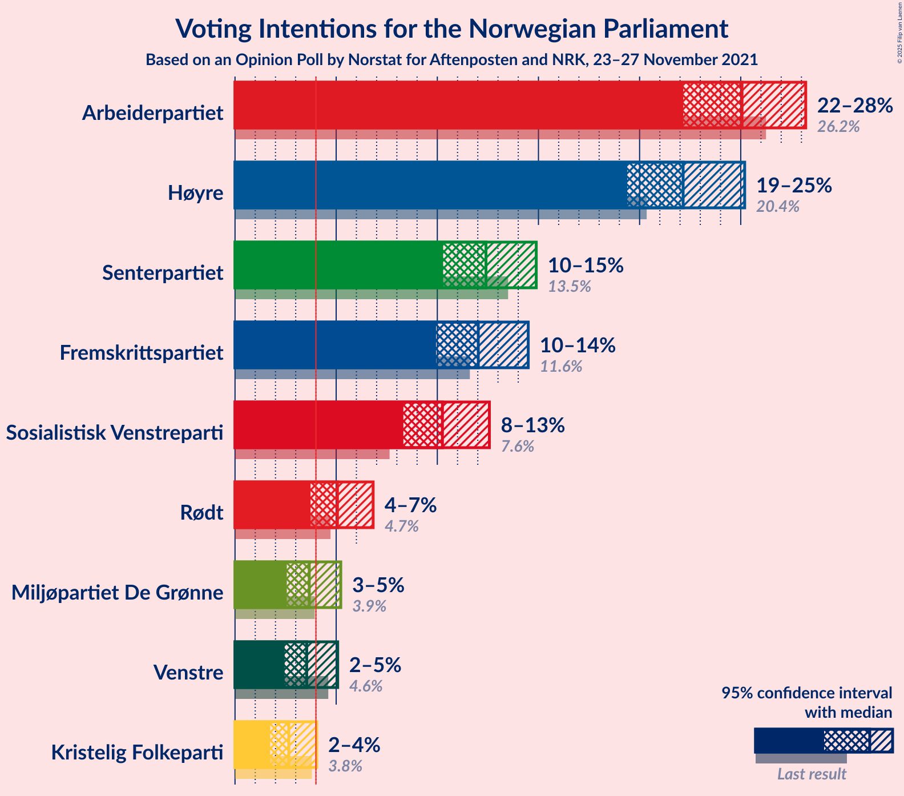
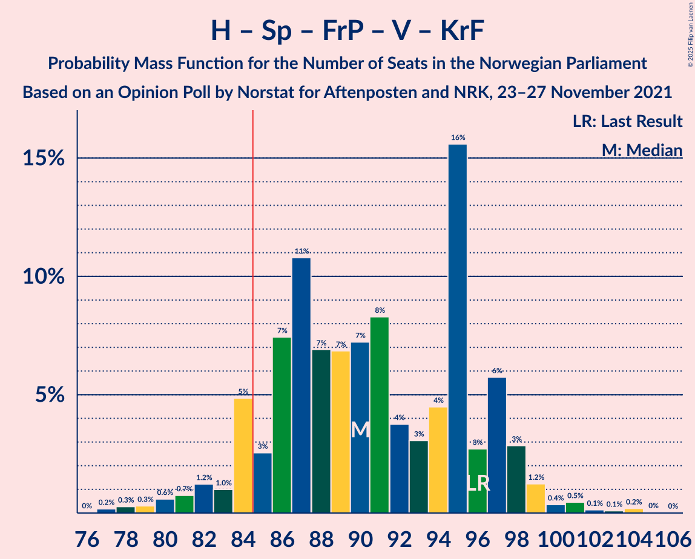

# Opinion Poll by Norstat for Aftenposten and NRK, 23–27 November 2021

<a href="#voting-intentions">Voting Intentions</a> | <a href="#seats">Seats</a> | <a href="#coalitions">Coalitions</a> | <a href="#technical-information">Technical Information</a>

## Voting Intentions

### Confidence Intervals

| Party | Last Result | Poll Result | 80% Confidence Interval | 90% Confidence Interval | 95% Confidence Interval | 99% Confidence Interval |
|:-----:|:-----------:|:-----------:|:-----------------------:|:-----------------------:|:-----------------------:|:-----------------------:|
| Arbeiderpartiet | 26.2% | 25.1% | 23.2–27.1% |22.6–27.7% |22.2–28.2% |21.3–29.2% |
| Høyre | 20.4% | 22.2% | 20.3–24.1% |19.8–24.7% |19.4–25.2% |18.5–26.2% |
| Senterpartiet | 13.5% | 12.4% | 11.0–14.0% |10.6–14.5% |10.3–14.9% |9.6–15.7% |
| Fremskrittspartiet | 11.6% | 12.0% | 10.7–13.6% |10.3–14.1% |9.9–14.5% |9.3–15.3% |
| Sosialistisk Venstreparti | 7.6% | 10.3% | 9.0–11.8% |8.6–12.2% |8.3–12.6% |7.8–13.3% |
| Rødt | 4.7% | 5.1% | 4.2–6.2% |3.9–6.5% |3.7–6.8% |3.4–7.4% |
| Miljøpartiet De Grønne | 3.9% | 3.7% | 2.9–4.7% |2.7–5.0% |2.6–5.2% |2.3–5.8% |
| Venstre | 4.6% | 3.5% | 2.8–4.5% |2.6–4.8% |2.5–5.1% |2.2–5.6% |
| Kristelig Folkeparti | 3.8% | 2.7% | 2.1–3.6% |1.9–3.8% |1.7–4.0% |1.5–4.5% |

*Note:* The poll result column reflects the actual value used in the calculations. Published results may vary slightly, and in addition be rounded to fewer digits.

## Seats

### Confidence Intervals

| Party | Last Result | Median | 80% Confidence Interval | 90% Confidence Interval | 95% Confidence Interval | 99% Confidence Interval |
|:-----:|:-----------:|:------:|:-----------------------:|:-----------------------:|:-----------------------:|:-----------------------:|
| <a href="#arbeiderpartiet">Arbeiderpartiet</a> | 48 | 46 | 42–50 |41–51 |40–52 |39–55 |
| <a href="#høyre">Høyre</a> | 36 | 40 | 36–44 |35–45 |34–46 |32–48 |
| <a href="#senterpartiet">Senterpartiet</a> | 28 | 23 | 20–27 |19–28 |18–29 |17–30 |
| <a href="#fremskrittspartiet">Fremskrittspartiet</a> | 21 | 21 | 19–24 |18–25 |17–26 |16–28 |
| <a href="#sosialistisk-venstreparti">Sosialistisk Venstreparti</a> | 13 | 18 | 16–21 |15–22 |15–23 |13–24 |
| <a href="#rødt">Rødt</a> | 8 | 9 | 7–11 |7–12 |1–12 |1–13 |
| <a href="#miljøpartiet-de-grønne">Miljøpartiet De Grønne</a> | 3 | 3 | 1–9 |1–9 |1–9 |1–10 |
| <a href="#venstre">Venstre</a> | 8 | 3 | 2–8 |2–9 |2–9 |1–10 |
| <a href="#kristelig-folkeparti">Kristelig Folkeparti</a> | 3 | 2 | 0–3 |0–3 |0–3 |0–8 |

### Arbeiderpartiet

*For a full overview of the results for this party, see the [Arbeiderpartiet](party-arbeiderpartiet.html) page.*

| Number of Seats | Probability | Accumulated | Special Marks |
|:---------------:|:-----------:|:-----------:|:-------------:|
| 37 | 0.1% | 100% |  |
| 38 | 0.2% | 99.9% |  |
| 39 | 0.9% | 99.7% |  |
| 40 | 3% | 98.8% |  |
| 41 | 4% | 96% |  |
| 42 | 4% | 92% |  |
| 43 | 9% | 87% |  |
| 44 | 16% | 78% |  |
| 45 | 9% | 62% |  |
| 46 | 15% | 53% | Median |
| 47 | 10% | 38% |  |
| 48 | 9% | 28% | Last Result |
| 49 | 8% | 19% |  |
| 50 | 5% | 11% |  |
| 51 | 2% | 6% |  |
| 52 | 1.4% | 4% |  |
| 53 | 1.1% | 2% |  |
| 54 | 0.5% | 1.3% |  |
| 55 | 0.5% | 0.8% |  |
| 56 | 0.2% | 0.3% |  |
| 57 | 0% | 0.1% |  |
| 58 | 0% | 0% |  |

### Høyre

*For a full overview of the results for this party, see the [Høyre](party-høyre.html) page.*

| Number of Seats | Probability | Accumulated | Special Marks |
|:---------------:|:-----------:|:-----------:|:-------------:|
| 30 | 0% | 100% |  |
| 31 | 0.1% | 99.9% |  |
| 32 | 0.4% | 99.8% |  |
| 33 | 0.9% | 99.4% |  |
| 34 | 2% | 98.5% |  |
| 35 | 3% | 97% |  |
| 36 | 6% | 94% | Last Result |
| 37 | 4% | 88% |  |
| 38 | 13% | 84% |  |
| 39 | 10% | 71% |  |
| 40 | 14% | 61% | Median |
| 41 | 14% | 46% |  |
| 42 | 11% | 32% |  |
| 43 | 8% | 22% |  |
| 44 | 6% | 14% |  |
| 45 | 4% | 8% |  |
| 46 | 2% | 4% |  |
| 47 | 1.2% | 2% |  |
| 48 | 1.0% | 1.3% |  |
| 49 | 0.1% | 0.3% |  |
| 50 | 0.1% | 0.1% |  |
| 51 | 0% | 0.1% |  |
| 52 | 0% | 0% |  |

### Senterpartiet

*For a full overview of the results for this party, see the [Senterpartiet](party-senterpartiet.html) page.*

| Number of Seats | Probability | Accumulated | Special Marks |
|:---------------:|:-----------:|:-----------:|:-------------:|
| 15 | 0.1% | 100% |  |
| 16 | 0.2% | 99.9% |  |
| 17 | 1.1% | 99.7% |  |
| 18 | 3% | 98.6% |  |
| 19 | 5% | 96% |  |
| 20 | 12% | 91% |  |
| 21 | 10% | 79% |  |
| 22 | 14% | 69% |  |
| 23 | 10% | 55% | Median |
| 24 | 13% | 45% |  |
| 25 | 8% | 32% |  |
| 26 | 12% | 24% |  |
| 27 | 7% | 12% |  |
| 28 | 2% | 5% | Last Result |
| 29 | 2% | 3% |  |
| 30 | 1.2% | 2% |  |
| 31 | 0.3% | 0.5% |  |
| 32 | 0.2% | 0.2% |  |
| 33 | 0% | 0% |  |

### Fremskrittspartiet

*For a full overview of the results for this party, see the [Fremskrittspartiet](party-fremskrittspartiet.html) page.*

| Number of Seats | Probability | Accumulated | Special Marks |
|:---------------:|:-----------:|:-----------:|:-------------:|
| 15 | 0.2% | 100% |  |
| 16 | 0.6% | 99.8% |  |
| 17 | 2% | 99.1% |  |
| 18 | 5% | 97% |  |
| 19 | 8% | 93% |  |
| 20 | 21% | 85% |  |
| 21 | 17% | 64% | Last Result, Median |
| 22 | 15% | 47% |  |
| 23 | 17% | 32% |  |
| 24 | 5% | 14% |  |
| 25 | 6% | 10% |  |
| 26 | 2% | 4% |  |
| 27 | 1.1% | 2% |  |
| 28 | 0.6% | 0.8% |  |
| 29 | 0.2% | 0.3% |  |
| 30 | 0% | 0.1% |  |
| 31 | 0% | 0% |  |

### Sosialistisk Venstreparti

*For a full overview of the results for this party, see the [Sosialistisk Venstreparti](party-sosialistiskvenstreparti.html) page.*

| Number of Seats | Probability | Accumulated | Special Marks |
|:---------------:|:-----------:|:-----------:|:-------------:|
| 12 | 0.1% | 100% |  |
| 13 | 0.6% | 99.8% | Last Result |
| 14 | 1.5% | 99.2% |  |
| 15 | 4% | 98% |  |
| 16 | 12% | 94% |  |
| 17 | 14% | 82% |  |
| 18 | 27% | 68% | Median |
| 19 | 15% | 41% |  |
| 20 | 15% | 26% |  |
| 21 | 6% | 11% |  |
| 22 | 2% | 5% |  |
| 23 | 1.4% | 3% |  |
| 24 | 1.4% | 2% |  |
| 25 | 0.3% | 0.4% |  |
| 26 | 0.1% | 0.1% |  |
| 27 | 0% | 0% |  |

### Rødt

*For a full overview of the results for this party, see the [Rødt](party-rødt.html) page.*

| Number of Seats | Probability | Accumulated | Special Marks |
|:---------------:|:-----------:|:-----------:|:-------------:|
| 1 | 5% | 100% |  |
| 2 | 0.2% | 95% |  |
| 3 | 0% | 95% |  |
| 4 | 0% | 95% |  |
| 5 | 0% | 95% |  |
| 6 | 0.1% | 95% |  |
| 7 | 5% | 95% |  |
| 8 | 21% | 90% | Last Result |
| 9 | 27% | 68% | Median |
| 10 | 25% | 41% |  |
| 11 | 11% | 16% |  |
| 12 | 3% | 5% |  |
| 13 | 2% | 2% |  |
| 14 | 0.4% | 0.4% |  |
| 15 | 0% | 0% |  |

### Miljøpartiet De Grønne

*For a full overview of the results for this party, see the [Miljøpartiet De Grønne](party-miljøpartietdegrønne.html) page.*

| Number of Seats | Probability | Accumulated | Special Marks |
|:---------------:|:-----------:|:-----------:|:-------------:|
| 1 | 21% | 100% |  |
| 2 | 27% | 79% |  |
| 3 | 20% | 52% | Last Result, Median |
| 4 | 0% | 32% |  |
| 5 | 0% | 32% |  |
| 6 | 0.2% | 32% |  |
| 7 | 5% | 32% |  |
| 8 | 15% | 27% |  |
| 9 | 9% | 12% |  |
| 10 | 2% | 2% |  |
| 11 | 0.3% | 0.3% |  |
| 12 | 0% | 0% |  |

### Venstre

*For a full overview of the results for this party, see the [Venstre](party-venstre.html) page.*

| Number of Seats | Probability | Accumulated | Special Marks |
|:---------------:|:-----------:|:-----------:|:-------------:|
| 1 | 2% | 100% |  |
| 2 | 37% | 98% |  |
| 3 | 30% | 61% | Median |
| 4 | 0% | 31% |  |
| 5 | 0% | 31% |  |
| 6 | 0.3% | 31% |  |
| 7 | 8% | 31% |  |
| 8 | 16% | 23% | Last Result |
| 9 | 6% | 7% |  |
| 10 | 0.7% | 0.9% |  |
| 11 | 0.1% | 0.2% |  |
| 12 | 0% | 0% |  |

### Kristelig Folkeparti

*For a full overview of the results for this party, see the [Kristelig Folkeparti](party-kristeligfolkeparti.html) page.*

| Number of Seats | Probability | Accumulated | Special Marks |
|:---------------:|:-----------:|:-----------:|:-------------:|
| 0 | 15% | 100% |  |
| 1 | 35% | 85% |  |
| 2 | 34% | 51% | Median |
| 3 | 14% | 17% | Last Result |
| 4 | 0% | 2% |  |
| 5 | 0% | 2% |  |
| 6 | 0.1% | 2% |  |
| 7 | 2% | 2% |  |
| 8 | 0.7% | 0.8% |  |
| 9 | 0.1% | 0.1% |  |
| 10 | 0% | 0% |  |

## Coalitions

### Confidence Intervals

| Coalition | Last Result | Median | Majority? | 80% Confidence Interval | 90% Confidence Interval | 95% Confidence Interval | 99% Confidence Interval |
|:---------:|:-----------:|:------:|:---------:|:-----------------------:|:-----------------------:|:-----------------------:|:-----------------------:|
| Arbeiderpartiet – Senterpartiet – Sosialistisk Venstreparti – Rødt – Miljøpartiet De Grønne | 100 | 100 | 100% | 95–106 | 93–107 | 92–109 | 89–112 |
| Arbeiderpartiet – Senterpartiet – Sosialistisk Venstreparti – Rødt | 97 | 96 | 99.7% | 91–101 | 90–103 | 88–104 | 85–106 |
| Arbeiderpartiet – Senterpartiet – Sosialistisk Venstreparti – Miljøpartiet De Grønne – Kristelig Folkeparti | 95 | 93 | 98% | 88–98 | 86–100 | 85–102 | 82–104 |
| Arbeiderpartiet – Senterpartiet – Sosialistisk Venstreparti – Miljøpartiet De Grønne | 92 | 91 | 95% | 86–97 | 85–98 | 83–100 | 80–103 |
| Høyre – Senterpartiet – Fremskrittspartiet – Venstre – Kristelig Folkeparti | 96 | 90 | 91% | 85–97 | 84–98 | 82–99 | 79–101 |
| Arbeiderpartiet – Senterpartiet – Sosialistisk Venstreparti | 89 | 87 | 73% | 83–92 | 81–94 | 80–95 | 77–98 |
| Arbeiderpartiet – Sosialistisk Venstreparti – Rødt – Miljøpartiet De Grønne | 72 | 77 | 6% | 71–83 | 70–85 | 69–85 | 65–90 |
| Arbeiderpartiet – Senterpartiet – Miljøpartiet De Grønne – Kristelig Folkeparti | 82 | 75 | 1.2% | 69–80 | 68–81 | 67–83 | 64–86 |
| Høyre – Fremskrittspartiet – Miljøpartiet De Grønne – Venstre – Kristelig Folkeparti | 71 | 72 | 0.1% | 65–76 | 64–78 | 63–80 | 61–83 |
| Arbeiderpartiet – Senterpartiet – Kristelig Folkeparti | 79 | 70 | 0% | 66–75 | 64–77 | 64–78 | 61–81 |
| Arbeiderpartiet – Senterpartiet | 76 | 69 | 0% | 64–73 | 62–76 | 62–77 | 60–78 |
| Høyre – Fremskrittspartiet – Venstre – Kristelig Folkeparti | 68 | 67 | 0% | 62–73 | 61–74 | 59–75 | 57–78 |
| Høyre – Fremskrittspartiet – Venstre | 65 | 66 | 0% | 60–71 | 59–73 | 57–73 | 56–76 |
| Arbeiderpartiet – Sosialistisk Venstreparti | 61 | 64 | 0% | 60–69 | 59–70 | 58–71 | 56–74 |
| Høyre – Fremskrittspartiet | 57 | 62 | 0% | 57–67 | 56–68 | 54–69 | 52–71 |
| Høyre – Venstre – Kristelig Folkeparti | 47 | 46 | 0% | 41–52 | 40–52 | 39–54 | 37–56 |
| Senterpartiet – Venstre – Kristelig Folkeparti | 39 | 29 | 0% | 23–35 | 23–35 | 23–36 | 21–39 |

### Arbeiderpartiet – Senterpartiet – Sosialistisk Venstreparti – Rødt – Miljøpartiet De Grønne

| Number of Seats | Probability | Accumulated | Special Marks |
|:---------------:|:-----------:|:-----------:|:-------------:|
| 86 | 0.1% | 100% |  |
| 87 | 0.1% | 99.9% |  |
| 88 | 0.2% | 99.7% |  |
| 89 | 0.5% | 99.6% |  |
| 90 | 0.5% | 99.1% |  |
| 91 | 0.9% | 98.6% |  |
| 92 | 1.2% | 98% |  |
| 93 | 3% | 97% |  |
| 94 | 3% | 94% |  |
| 95 | 5% | 90% |  |
| 96 | 9% | 85% |  |
| 97 | 5% | 75% |  |
| 98 | 3% | 70% |  |
| 99 | 9% | 67% | Median |
| 100 | 11% | 58% | Last Result |
| 101 | 6% | 47% |  |
| 102 | 10% | 41% |  |
| 103 | 10% | 31% |  |
| 104 | 4% | 21% |  |
| 105 | 5% | 17% |  |
| 106 | 3% | 12% |  |
| 107 | 5% | 9% |  |
| 108 | 1.0% | 4% |  |
| 109 | 0.8% | 3% |  |
| 110 | 0.9% | 2% |  |
| 111 | 0.4% | 1.0% |  |
| 112 | 0.5% | 0.6% |  |
| 113 | 0% | 0.1% |  |
| 114 | 0% | 0% |  |

### Arbeiderpartiet – Senterpartiet – Sosialistisk Venstreparti – Rødt

| Number of Seats | Probability | Accumulated | Special Marks |
|:---------------:|:-----------:|:-----------:|:-------------:|
| 82 | 0% | 100% |  |
| 83 | 0.1% | 99.9% |  |
| 84 | 0.2% | 99.8% |  |
| 85 | 0.3% | 99.7% | Majority |
| 86 | 0.8% | 99.4% |  |
| 87 | 0.8% | 98.6% |  |
| 88 | 1.2% | 98% |  |
| 89 | 1.5% | 97% |  |
| 90 | 2% | 95% |  |
| 91 | 5% | 94% |  |
| 92 | 4% | 89% |  |
| 93 | 9% | 84% |  |
| 94 | 12% | 76% |  |
| 95 | 8% | 64% |  |
| 96 | 7% | 56% | Median |
| 97 | 14% | 49% | Last Result |
| 98 | 7% | 36% |  |
| 99 | 11% | 29% |  |
| 100 | 5% | 18% |  |
| 101 | 4% | 13% |  |
| 102 | 5% | 10% |  |
| 103 | 1.1% | 5% |  |
| 104 | 3% | 4% |  |
| 105 | 0.5% | 1.2% |  |
| 106 | 0.5% | 0.7% |  |
| 107 | 0.1% | 0.2% |  |
| 108 | 0% | 0.1% |  |
| 109 | 0% | 0% |  |

### Arbeiderpartiet – Senterpartiet – Sosialistisk Venstreparti – Miljøpartiet De Grønne – Kristelig Folkeparti

| Number of Seats | Probability | Accumulated | Special Marks |
|:---------------:|:-----------:|:-----------:|:-------------:|
| 80 | 0% | 100% |  |
| 81 | 0.2% | 99.9% |  |
| 82 | 0.4% | 99.8% |  |
| 83 | 0.5% | 99.4% |  |
| 84 | 1.1% | 98.9% |  |
| 85 | 1.4% | 98% | Majority |
| 86 | 2% | 96% |  |
| 87 | 2% | 94% |  |
| 88 | 9% | 92% |  |
| 89 | 6% | 83% |  |
| 90 | 5% | 77% |  |
| 91 | 8% | 72% |  |
| 92 | 14% | 64% | Median |
| 93 | 9% | 50% |  |
| 94 | 7% | 42% |  |
| 95 | 9% | 35% | Last Result |
| 96 | 5% | 26% |  |
| 97 | 6% | 20% |  |
| 98 | 5% | 14% |  |
| 99 | 3% | 9% |  |
| 100 | 2% | 6% |  |
| 101 | 1.4% | 4% |  |
| 102 | 1.1% | 3% |  |
| 103 | 0.5% | 2% |  |
| 104 | 0.8% | 1.1% |  |
| 105 | 0.1% | 0.3% |  |
| 106 | 0.1% | 0.2% |  |
| 107 | 0.1% | 0.1% |  |
| 108 | 0% | 0% |  |

### Arbeiderpartiet – Senterpartiet – Sosialistisk Venstreparti – Miljøpartiet De Grønne

| Number of Seats | Probability | Accumulated | Special Marks |
|:---------------:|:-----------:|:-----------:|:-------------:|
| 78 | 0% | 100% |  |
| 79 | 0.1% | 99.9% |  |
| 80 | 0.3% | 99.8% |  |
| 81 | 0.7% | 99.5% |  |
| 82 | 0.9% | 98.8% |  |
| 83 | 1.0% | 98% |  |
| 84 | 1.5% | 97% |  |
| 85 | 4% | 95% | Majority |
| 86 | 6% | 92% |  |
| 87 | 8% | 85% |  |
| 88 | 6% | 77% |  |
| 89 | 3% | 71% |  |
| 90 | 5% | 67% | Median |
| 91 | 16% | 62% |  |
| 92 | 12% | 47% | Last Result |
| 93 | 6% | 35% |  |
| 94 | 7% | 29% |  |
| 95 | 5% | 22% |  |
| 96 | 4% | 17% |  |
| 97 | 5% | 12% |  |
| 98 | 3% | 8% |  |
| 99 | 2% | 5% |  |
| 100 | 1.1% | 3% |  |
| 101 | 0.5% | 2% |  |
| 102 | 0.4% | 1.2% |  |
| 103 | 0.4% | 0.8% |  |
| 104 | 0.2% | 0.3% |  |
| 105 | 0.1% | 0.1% |  |
| 106 | 0% | 0% |  |

### Høyre – Senterpartiet – Fremskrittspartiet – Venstre – Kristelig Folkeparti

| Number of Seats | Probability | Accumulated | Special Marks |
|:---------------:|:-----------:|:-----------:|:-------------:|
| 77 | 0.2% | 100% |  |
| 78 | 0.3% | 99.8% |  |
| 79 | 0.3% | 99.5% |  |
| 80 | 0.6% | 99.2% |  |
| 81 | 0.7% | 98.6% |  |
| 82 | 1.2% | 98% |  |
| 83 | 1.0% | 97% |  |
| 84 | 5% | 96% |  |
| 85 | 3% | 91% | Majority |
| 86 | 7% | 88% |  |
| 87 | 11% | 81% |  |
| 88 | 7% | 70% |  |
| 89 | 7% | 63% | Median |
| 90 | 7% | 56% |  |
| 91 | 8% | 49% |  |
| 92 | 4% | 41% |  |
| 93 | 3% | 37% |  |
| 94 | 4% | 34% |  |
| 95 | 16% | 29% |  |
| 96 | 3% | 14% | Last Result |
| 97 | 6% | 11% |  |
| 98 | 3% | 5% |  |
| 99 | 1.2% | 3% |  |
| 100 | 0.4% | 1.3% |  |
| 101 | 0.5% | 0.9% |  |
| 102 | 0.1% | 0.5% |  |
| 103 | 0.1% | 0.4% |  |
| 104 | 0.2% | 0.3% |  |
| 105 | 0% | 0.1% |  |
| 106 | 0% | 0% |  |

### Arbeiderpartiet – Senterpartiet – Sosialistisk Venstreparti

| Number of Seats | Probability | Accumulated | Special Marks |
|:---------------:|:-----------:|:-----------:|:-------------:|
| 75 | 0.1% | 100% |  |
| 76 | 0.2% | 99.9% |  |
| 77 | 0.3% | 99.7% |  |
| 78 | 0.7% | 99.4% |  |
| 79 | 1.2% | 98.7% |  |
| 80 | 2% | 98% |  |
| 81 | 2% | 96% |  |
| 82 | 4% | 94% |  |
| 83 | 6% | 90% |  |
| 84 | 11% | 84% |  |
| 85 | 7% | 73% | Majority |
| 86 | 9% | 66% |  |
| 87 | 8% | 57% | Median |
| 88 | 13% | 49% |  |
| 89 | 11% | 36% | Last Result |
| 90 | 8% | 26% |  |
| 91 | 4% | 18% |  |
| 92 | 4% | 13% |  |
| 93 | 4% | 10% |  |
| 94 | 1.5% | 6% |  |
| 95 | 3% | 4% |  |
| 96 | 0.6% | 2% |  |
| 97 | 0.3% | 0.9% |  |
| 98 | 0.4% | 0.7% |  |
| 99 | 0.2% | 0.3% |  |
| 100 | 0% | 0.1% |  |
| 101 | 0% | 0% |  |

### Arbeiderpartiet – Sosialistisk Venstreparti – Rødt – Miljøpartiet De Grønne

| Number of Seats | Probability | Accumulated | Special Marks |
|:---------------:|:-----------:|:-----------:|:-------------:|
| 63 | 0% | 100% |  |
| 64 | 0.1% | 99.9% |  |
| 65 | 0.3% | 99.8% |  |
| 66 | 0.2% | 99.5% |  |
| 67 | 0.3% | 99.3% |  |
| 68 | 0.7% | 99.0% |  |
| 69 | 2% | 98% |  |
| 70 | 2% | 96% |  |
| 71 | 6% | 95% |  |
| 72 | 5% | 89% | Last Result |
| 73 | 5% | 84% |  |
| 74 | 20% | 79% |  |
| 75 | 5% | 59% |  |
| 76 | 3% | 53% | Median |
| 77 | 4% | 50% |  |
| 78 | 8% | 46% |  |
| 79 | 6% | 39% |  |
| 80 | 7% | 33% |  |
| 81 | 4% | 26% |  |
| 82 | 8% | 22% |  |
| 83 | 6% | 14% |  |
| 84 | 2% | 9% |  |
| 85 | 4% | 6% | Majority |
| 86 | 0.5% | 2% |  |
| 87 | 0.6% | 2% |  |
| 88 | 0.4% | 1.4% |  |
| 89 | 0.4% | 1.0% |  |
| 90 | 0.2% | 0.6% |  |
| 91 | 0.2% | 0.4% |  |
| 92 | 0.1% | 0.2% |  |
| 93 | 0% | 0% |  |

### Arbeiderpartiet – Senterpartiet – Miljøpartiet De Grønne – Kristelig Folkeparti

| Number of Seats | Probability | Accumulated | Special Marks |
|:---------------:|:-----------:|:-----------:|:-------------:|
| 62 | 0% | 100% |  |
| 63 | 0.1% | 99.9% |  |
| 64 | 0.4% | 99.9% |  |
| 65 | 0.4% | 99.5% |  |
| 66 | 1.0% | 99.1% |  |
| 67 | 2% | 98% |  |
| 68 | 2% | 96% |  |
| 69 | 5% | 94% |  |
| 70 | 7% | 89% |  |
| 71 | 9% | 82% |  |
| 72 | 9% | 73% |  |
| 73 | 6% | 64% |  |
| 74 | 8% | 58% | Median |
| 75 | 5% | 50% |  |
| 76 | 14% | 45% |  |
| 77 | 8% | 31% |  |
| 78 | 5% | 23% |  |
| 79 | 5% | 18% |  |
| 80 | 5% | 14% |  |
| 81 | 4% | 9% |  |
| 82 | 0.8% | 5% | Last Result |
| 83 | 2% | 4% |  |
| 84 | 0.9% | 2% |  |
| 85 | 0.6% | 1.2% | Majority |
| 86 | 0.4% | 0.6% |  |
| 87 | 0.1% | 0.3% |  |
| 88 | 0.1% | 0.2% |  |
| 89 | 0.1% | 0.1% |  |
| 90 | 0% | 0% |  |

### Høyre – Fremskrittspartiet – Miljøpartiet De Grønne – Venstre – Kristelig Folkeparti

| Number of Seats | Probability | Accumulated | Special Marks |
|:---------------:|:-----------:|:-----------:|:-------------:|
| 58 | 0.1% | 100% |  |
| 59 | 0.2% | 99.9% |  |
| 60 | 0.2% | 99.7% |  |
| 61 | 0.5% | 99.5% |  |
| 62 | 0.8% | 99.0% |  |
| 63 | 0.9% | 98% |  |
| 64 | 3% | 97% |  |
| 65 | 5% | 94% |  |
| 66 | 2% | 90% |  |
| 67 | 5% | 88% |  |
| 68 | 4% | 82% |  |
| 69 | 6% | 78% | Median |
| 70 | 12% | 72% |  |
| 71 | 9% | 60% | Last Result |
| 72 | 11% | 51% |  |
| 73 | 6% | 40% |  |
| 74 | 8% | 34% |  |
| 75 | 11% | 26% |  |
| 76 | 7% | 15% |  |
| 77 | 3% | 9% |  |
| 78 | 2% | 6% |  |
| 79 | 1.3% | 4% |  |
| 80 | 1.0% | 3% |  |
| 81 | 0.6% | 2% |  |
| 82 | 0.3% | 1.0% |  |
| 83 | 0.4% | 0.6% |  |
| 84 | 0.2% | 0.2% |  |
| 85 | 0% | 0.1% | Majority |
| 86 | 0% | 0.1% |  |
| 87 | 0% | 0% |  |

### Arbeiderpartiet – Senterpartiet – Kristelig Folkeparti

| Number of Seats | Probability | Accumulated | Special Marks |
|:---------------:|:-----------:|:-----------:|:-------------:|
| 59 | 0.1% | 100% |  |
| 60 | 0.1% | 99.9% |  |
| 61 | 0.7% | 99.8% |  |
| 62 | 0.4% | 99.2% |  |
| 63 | 0.9% | 98.7% |  |
| 64 | 3% | 98% |  |
| 65 | 4% | 95% |  |
| 66 | 4% | 91% |  |
| 67 | 5% | 87% |  |
| 68 | 14% | 82% |  |
| 69 | 10% | 68% |  |
| 70 | 9% | 57% |  |
| 71 | 7% | 48% | Median |
| 72 | 10% | 41% |  |
| 73 | 11% | 32% |  |
| 74 | 5% | 20% |  |
| 75 | 7% | 16% |  |
| 76 | 2% | 8% |  |
| 77 | 2% | 6% |  |
| 78 | 3% | 5% |  |
| 79 | 0.4% | 1.3% | Last Result |
| 80 | 0.3% | 0.9% |  |
| 81 | 0.2% | 0.6% |  |
| 82 | 0.3% | 0.4% |  |
| 83 | 0.1% | 0.1% |  |
| 84 | 0% | 0% |  |

### Arbeiderpartiet – Senterpartiet

| Number of Seats | Probability | Accumulated | Special Marks |
|:---------------:|:-----------:|:-----------:|:-------------:|
| 58 | 0.1% | 100% |  |
| 59 | 0.3% | 99.9% |  |
| 60 | 0.3% | 99.6% |  |
| 61 | 1.2% | 99.3% |  |
| 62 | 3% | 98% |  |
| 63 | 3% | 95% |  |
| 64 | 4% | 92% |  |
| 65 | 3% | 87% |  |
| 66 | 8% | 84% |  |
| 67 | 15% | 76% |  |
| 68 | 10% | 60% |  |
| 69 | 6% | 50% | Median |
| 70 | 7% | 44% |  |
| 71 | 9% | 37% |  |
| 72 | 14% | 29% |  |
| 73 | 5% | 14% |  |
| 74 | 3% | 9% |  |
| 75 | 2% | 7% |  |
| 76 | 1.2% | 5% | Last Result |
| 77 | 3% | 4% |  |
| 78 | 0.4% | 0.8% |  |
| 79 | 0.2% | 0.4% |  |
| 80 | 0.1% | 0.2% |  |
| 81 | 0% | 0.1% |  |
| 82 | 0.1% | 0.1% |  |
| 83 | 0% | 0% |  |

### Høyre – Fremskrittspartiet – Venstre – Kristelig Folkeparti

| Number of Seats | Probability | Accumulated | Special Marks |
|:---------------:|:-----------:|:-----------:|:-------------:|
| 55 | 0.1% | 100% |  |
| 56 | 0.1% | 99.9% |  |
| 57 | 0.7% | 99.8% |  |
| 58 | 1.0% | 99.1% |  |
| 59 | 1.1% | 98% |  |
| 60 | 1.5% | 97% |  |
| 61 | 2% | 95% |  |
| 62 | 8% | 94% |  |
| 63 | 5% | 86% |  |
| 64 | 6% | 81% |  |
| 65 | 4% | 74% |  |
| 66 | 11% | 70% | Median |
| 67 | 11% | 59% |  |
| 68 | 7% | 49% | Last Result |
| 69 | 12% | 42% |  |
| 70 | 6% | 29% |  |
| 71 | 3% | 23% |  |
| 72 | 5% | 21% |  |
| 73 | 8% | 16% |  |
| 74 | 4% | 8% |  |
| 75 | 1.3% | 4% |  |
| 76 | 0.8% | 2% |  |
| 77 | 0.9% | 2% |  |
| 78 | 0.3% | 0.7% |  |
| 79 | 0.1% | 0.4% |  |
| 80 | 0.2% | 0.3% |  |
| 81 | 0.1% | 0.1% |  |
| 82 | 0% | 0.1% |  |
| 83 | 0% | 0% |  |

### Høyre – Fremskrittspartiet – Venstre

| Number of Seats | Probability | Accumulated | Special Marks |
|:---------------:|:-----------:|:-----------:|:-------------:|
| 53 | 0.1% | 100% |  |
| 54 | 0.1% | 99.9% |  |
| 55 | 0.2% | 99.8% |  |
| 56 | 1.0% | 99.6% |  |
| 57 | 1.4% | 98.6% |  |
| 58 | 1.1% | 97% |  |
| 59 | 1.4% | 96% |  |
| 60 | 5% | 95% |  |
| 61 | 5% | 89% |  |
| 62 | 5% | 84% |  |
| 63 | 6% | 79% |  |
| 64 | 10% | 73% | Median |
| 65 | 10% | 63% | Last Result |
| 66 | 11% | 53% |  |
| 67 | 7% | 42% |  |
| 68 | 10% | 36% |  |
| 69 | 5% | 26% |  |
| 70 | 5% | 20% |  |
| 71 | 8% | 15% |  |
| 72 | 2% | 7% |  |
| 73 | 3% | 6% |  |
| 74 | 1.0% | 2% |  |
| 75 | 0.7% | 1.5% |  |
| 76 | 0.4% | 0.8% |  |
| 77 | 0.2% | 0.4% |  |
| 78 | 0.1% | 0.2% |  |
| 79 | 0.1% | 0.2% |  |
| 80 | 0% | 0% |  |

### Arbeiderpartiet – Sosialistisk Venstreparti

| Number of Seats | Probability | Accumulated | Special Marks |
|:---------------:|:-----------:|:-----------:|:-------------:|
| 54 | 0.1% | 100% |  |
| 55 | 0.3% | 99.9% |  |
| 56 | 0.6% | 99.6% |  |
| 57 | 1.4% | 98.9% |  |
| 58 | 2% | 98% |  |
| 59 | 4% | 96% |  |
| 60 | 2% | 92% |  |
| 61 | 7% | 90% | Last Result |
| 62 | 21% | 83% |  |
| 63 | 10% | 61% |  |
| 64 | 11% | 52% | Median |
| 65 | 12% | 41% |  |
| 66 | 5% | 29% |  |
| 67 | 6% | 24% |  |
| 68 | 8% | 19% |  |
| 69 | 5% | 11% |  |
| 70 | 2% | 6% |  |
| 71 | 2% | 4% |  |
| 72 | 1.0% | 2% |  |
| 73 | 0.6% | 1.1% |  |
| 74 | 0.2% | 0.5% |  |
| 75 | 0.2% | 0.3% |  |
| 76 | 0.1% | 0.1% |  |
| 77 | 0.1% | 0.1% |  |
| 78 | 0% | 0% |  |

### Høyre – Fremskrittspartiet

| Number of Seats | Probability | Accumulated | Special Marks |
|:---------------:|:-----------:|:-----------:|:-------------:|
| 50 | 0.2% | 100% |  |
| 51 | 0.2% | 99.8% |  |
| 52 | 0.4% | 99.6% |  |
| 53 | 0.5% | 99.1% |  |
| 54 | 1.5% | 98.7% |  |
| 55 | 2% | 97% |  |
| 56 | 4% | 95% |  |
| 57 | 4% | 91% | Last Result |
| 58 | 6% | 87% |  |
| 59 | 7% | 81% |  |
| 60 | 11% | 73% |  |
| 61 | 10% | 62% | Median |
| 62 | 11% | 52% |  |
| 63 | 8% | 40% |  |
| 64 | 10% | 32% |  |
| 65 | 4% | 22% |  |
| 66 | 7% | 18% |  |
| 67 | 4% | 11% |  |
| 68 | 3% | 6% |  |
| 69 | 1.1% | 3% |  |
| 70 | 1.1% | 2% |  |
| 71 | 0.4% | 0.7% |  |
| 72 | 0.2% | 0.3% |  |
| 73 | 0.1% | 0.2% |  |
| 74 | 0% | 0.1% |  |
| 75 | 0% | 0% |  |

### Høyre – Venstre – Kristelig Folkeparti

| Number of Seats | Probability | Accumulated | Special Marks |
|:---------------:|:-----------:|:-----------:|:-------------:|
| 35 | 0.1% | 100% |  |
| 36 | 0.3% | 99.9% |  |
| 37 | 0.6% | 99.5% |  |
| 38 | 1.4% | 98.9% |  |
| 39 | 2% | 98% |  |
| 40 | 3% | 95% |  |
| 41 | 6% | 92% |  |
| 42 | 9% | 86% |  |
| 43 | 5% | 77% |  |
| 44 | 8% | 72% |  |
| 45 | 14% | 64% | Median |
| 46 | 4% | 51% |  |
| 47 | 11% | 46% | Last Result |
| 48 | 5% | 36% |  |
| 49 | 12% | 30% |  |
| 50 | 4% | 18% |  |
| 51 | 3% | 14% |  |
| 52 | 6% | 11% |  |
| 53 | 1.3% | 5% |  |
| 54 | 2% | 4% |  |
| 55 | 0.8% | 2% |  |
| 56 | 0.4% | 0.8% |  |
| 57 | 0.2% | 0.4% |  |
| 58 | 0.1% | 0.3% |  |
| 59 | 0.1% | 0.2% |  |
| 60 | 0% | 0% |  |

### Senterpartiet – Venstre – Kristelig Folkeparti

| Number of Seats | Probability | Accumulated | Special Marks |
|:---------------:|:-----------:|:-----------:|:-------------:|
| 19 | 0% | 100% |  |
| 20 | 0.2% | 99.9% |  |
| 21 | 0.6% | 99.8% |  |
| 22 | 1.3% | 99.2% |  |
| 23 | 9% | 98% |  |
| 24 | 6% | 89% |  |
| 25 | 10% | 84% |  |
| 26 | 7% | 74% |  |
| 27 | 6% | 67% |  |
| 28 | 3% | 61% | Median |
| 29 | 10% | 58% |  |
| 30 | 12% | 48% |  |
| 31 | 10% | 37% |  |
| 32 | 5% | 27% |  |
| 33 | 8% | 21% |  |
| 34 | 3% | 13% |  |
| 35 | 8% | 10% |  |
| 36 | 0.7% | 3% |  |
| 37 | 0.6% | 2% |  |
| 38 | 0.4% | 1.2% |  |
| 39 | 0.5% | 0.8% | Last Result |
| 40 | 0.1% | 0.3% |  |
| 41 | 0.1% | 0.2% |  |
| 42 | 0.1% | 0.1% |  |
| 43 | 0% | 0% |  |

## Technical Information

### Opinion Poll

+ **Polling firm:** Norstat
+ **Commissioner(s):** Aftenposten and NRK
+ **Fieldwork period:** 23–27 November 2021

### Calculations

+ **Sample size:** 790
+ **Simulations done:** 1,048,576
+ **Error estimate:** 2.18%

