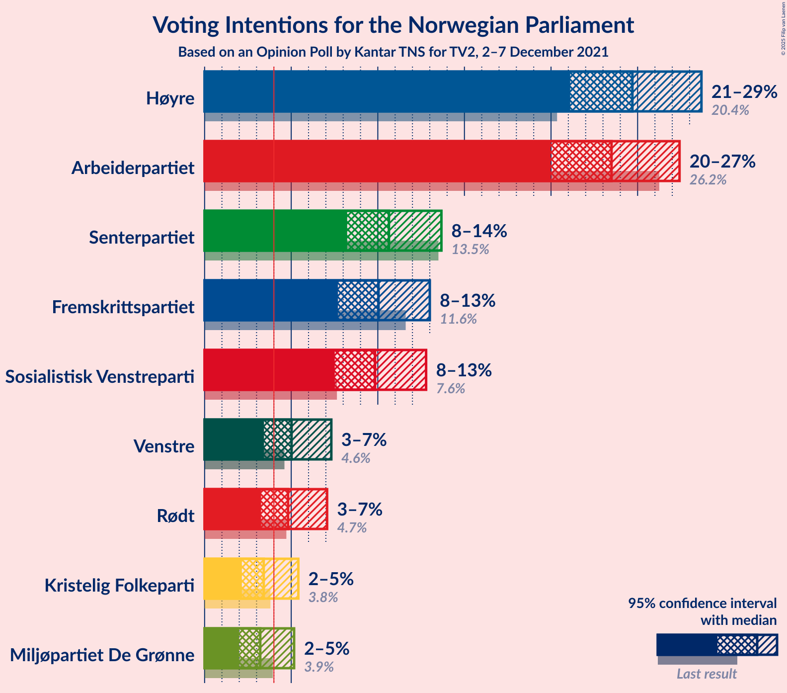
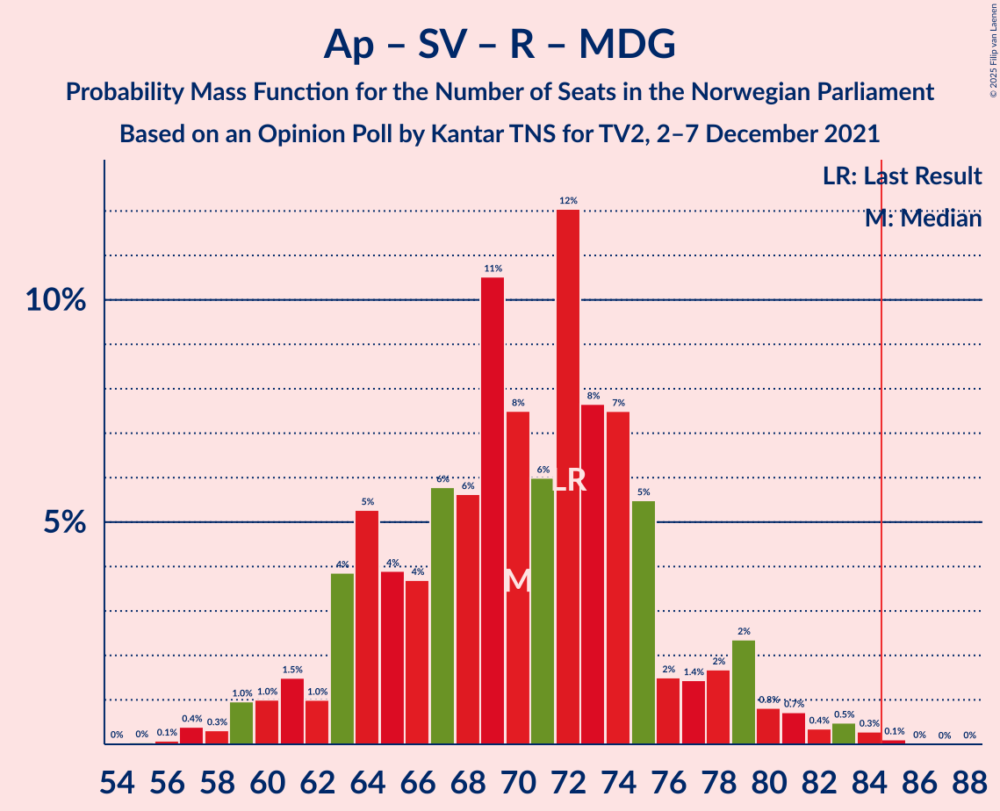

# Opinion Poll by Kantar TNS for TV2, 2–7 December 2021

<a href="#voting-intentions">Voting Intentions</a> | <a href="#seats">Seats</a> | <a href="#coalitions">Coalitions</a> | <a href="#technical-information">Technical Information</a>

## Voting Intentions

### Confidence Intervals

| Party | Last Result | Poll Result | 80% Confidence Interval | 90% Confidence Interval | 95% Confidence Interval | 99% Confidence Interval |
|:-----:|:-----------:|:-----------:|:-----------------------:|:-----------------------:|:-----------------------:|:-----------------------:|
| Høyre | 20.4% | 24.7% | 22.3–27.3% |21.7–28.0% |21.1–28.7% |20.0–29.9% |
| Arbeiderpartiet | 26.2% | 23.5% | 21.2–26.1% |20.5–26.8% |20.0–27.4% |18.9–28.7% |
| Senterpartiet | 13.5% | 10.6% | 9.1–12.6% |8.6–13.2% |8.2–13.7% |7.5–14.7% |
| Fremskrittspartiet | 11.6% | 10.0% | 8.5–12.0% |8.1–12.5% |7.7–13.0% |7.0–14.0% |
| Sosialistisk Venstreparti | 7.6% | 9.8% | 8.3–11.8% |7.9–12.3% |7.5–12.8% |6.8–13.7% |
| Venstre | 4.6% | 5.0% | 4.0–6.5% |3.7–6.9% |3.4–7.3% |3.0–8.1% |
| Rødt | 4.7% | 4.8% | 3.8–6.3% |3.5–6.7% |3.3–7.1% |2.8–7.8% |
| Kristelig Folkeparti | 3.8% | 3.4% | 2.6–4.7% |2.3–5.1% |2.1–5.4% |1.8–6.1% |
| Miljøpartiet De Grønne | 3.9% | 3.2% | 2.4–4.5% |2.2–4.8% |2.0–5.2% |1.7–5.8% |

*Note:* The poll result column reflects the actual value used in the calculations. Published results may vary slightly, and in addition be rounded to fewer digits.

## Seats

### Confidence Intervals

| Party | Last Result | Median | 80% Confidence Interval | 90% Confidence Interval | 95% Confidence Interval | 99% Confidence Interval |
|:-----:|:-----------:|:------:|:-----------------------:|:-----------------------:|:-----------------------:|:-----------------------:|
| <a href="#høyre">Høyre</a> | 36 | 44 | 40–49 |39–50 |38–51 |35–53 |
| <a href="#arbeiderpartiet">Arbeiderpartiet</a> | 48 | 44 | 39–48 |39–51 |37–52 |35–55 |
| <a href="#senterpartiet">Senterpartiet</a> | 28 | 18 | 15–23 |14–25 |14–27 |13–29 |
| <a href="#fremskrittspartiet">Fremskrittspartiet</a> | 21 | 17 | 14–20 |13–22 |12–22 |10–24 |
| <a href="#sosialistisk-venstreparti">Sosialistisk Venstreparti</a> | 13 | 16 | 13–19 |12–21 |11–22 |10–24 |
| <a href="#venstre">Venstre</a> | 8 | 8 | 3–11 |3–11 |3–12 |2–13 |
| <a href="#rødt">Rødt</a> | 8 | 8 | 1–10 |1–11 |1–12 |1–13 |
| <a href="#kristelig-folkeparti">Kristelig Folkeparti</a> | 3 | 3 | 2–7 |1–8 |1–9 |0–10 |
| <a href="#miljøpartiet-de-grønne">Miljøpartiet De Grønne</a> | 3 | 2 | 1–7 |1–7 |1–8 |0–9 |

### Høyre

*For a full overview of the results for this party, see the [Høyre](party-høyre.html) page.*

| Number of Seats | Probability | Accumulated | Special Marks |
|:---------------:|:-----------:|:-----------:|:-------------:|
| 32 | 0.1% | 100% |  |
| 33 | 0% | 99.9% |  |
| 34 | 0.2% | 99.9% |  |
| 35 | 0.3% | 99.7% |  |
| 36 | 0.6% | 99.3% | Last Result |
| 37 | 0.9% | 98.7% |  |
| 38 | 2% | 98% |  |
| 39 | 5% | 96% |  |
| 40 | 10% | 91% |  |
| 41 | 9% | 82% |  |
| 42 | 13% | 73% |  |
| 43 | 5% | 60% |  |
| 44 | 11% | 55% | Median |
| 45 | 9% | 44% |  |
| 46 | 10% | 35% |  |
| 47 | 5% | 25% |  |
| 48 | 6% | 20% |  |
| 49 | 8% | 14% |  |
| 50 | 3% | 5% |  |
| 51 | 1.0% | 3% |  |
| 52 | 0.6% | 2% |  |
| 53 | 0.6% | 1.0% |  |
| 54 | 0.3% | 0.5% |  |
| 55 | 0% | 0.1% |  |
| 56 | 0% | 0.1% |  |
| 57 | 0% | 0.1% |  |
| 58 | 0% | 0% |  |

### Arbeiderpartiet

*For a full overview of the results for this party, see the [Arbeiderpartiet](party-arbeiderpartiet.html) page.*

| Number of Seats | Probability | Accumulated | Special Marks |
|:---------------:|:-----------:|:-----------:|:-------------:|
| 32 | 0.1% | 100% |  |
| 33 | 0.1% | 99.9% |  |
| 34 | 0.2% | 99.8% |  |
| 35 | 0.4% | 99.6% |  |
| 36 | 0.5% | 99.2% |  |
| 37 | 2% | 98.6% |  |
| 38 | 2% | 97% |  |
| 39 | 6% | 95% |  |
| 40 | 12% | 89% |  |
| 41 | 8% | 77% |  |
| 42 | 7% | 69% |  |
| 43 | 11% | 63% |  |
| 44 | 10% | 51% | Median |
| 45 | 8% | 42% |  |
| 46 | 8% | 34% |  |
| 47 | 10% | 26% |  |
| 48 | 7% | 16% | Last Result |
| 49 | 2% | 9% |  |
| 50 | 2% | 7% |  |
| 51 | 3% | 5% |  |
| 52 | 0.7% | 3% |  |
| 53 | 0.5% | 2% |  |
| 54 | 0.4% | 1.5% |  |
| 55 | 0.6% | 1.1% |  |
| 56 | 0.3% | 0.4% |  |
| 57 | 0.1% | 0.1% |  |
| 58 | 0% | 0.1% |  |
| 59 | 0% | 0% |  |

### Senterpartiet

*For a full overview of the results for this party, see the [Senterpartiet](party-senterpartiet.html) page.*

| Number of Seats | Probability | Accumulated | Special Marks |
|:---------------:|:-----------:|:-----------:|:-------------:|
| 12 | 0.4% | 100% |  |
| 13 | 0.9% | 99.6% |  |
| 14 | 4% | 98.6% |  |
| 15 | 7% | 94% |  |
| 16 | 9% | 87% |  |
| 17 | 13% | 79% |  |
| 18 | 23% | 66% | Median |
| 19 | 15% | 43% |  |
| 20 | 6% | 28% |  |
| 21 | 7% | 22% |  |
| 22 | 4% | 15% |  |
| 23 | 2% | 11% |  |
| 24 | 2% | 9% |  |
| 25 | 3% | 7% |  |
| 26 | 1.4% | 4% |  |
| 27 | 0.9% | 3% |  |
| 28 | 1.1% | 2% | Last Result |
| 29 | 0.7% | 1.1% |  |
| 30 | 0.3% | 0.4% |  |
| 31 | 0.1% | 0.1% |  |
| 32 | 0% | 0% |  |

### Fremskrittspartiet

*For a full overview of the results for this party, see the [Fremskrittspartiet](party-fremskrittspartiet.html) page.*

| Number of Seats | Probability | Accumulated | Special Marks |
|:---------------:|:-----------:|:-----------:|:-------------:|
| 9 | 0.1% | 100% |  |
| 10 | 0.5% | 99.9% |  |
| 11 | 1.3% | 99.4% |  |
| 12 | 2% | 98% |  |
| 13 | 6% | 96% |  |
| 14 | 6% | 90% |  |
| 15 | 6% | 84% |  |
| 16 | 14% | 79% |  |
| 17 | 20% | 65% | Median |
| 18 | 19% | 45% |  |
| 19 | 6% | 26% |  |
| 20 | 11% | 19% |  |
| 21 | 3% | 9% | Last Result |
| 22 | 3% | 5% |  |
| 23 | 1.1% | 2% |  |
| 24 | 0.5% | 0.8% |  |
| 25 | 0.1% | 0.3% |  |
| 26 | 0.1% | 0.2% |  |
| 27 | 0% | 0.1% |  |
| 28 | 0% | 0% |  |

### Sosialistisk Venstreparti

*For a full overview of the results for this party, see the [Sosialistisk Venstreparti](party-sosialistiskvenstreparti.html) page.*

| Number of Seats | Probability | Accumulated | Special Marks |
|:---------------:|:-----------:|:-----------:|:-------------:|
| 8 | 0.1% | 100% |  |
| 9 | 0.3% | 99.9% |  |
| 10 | 0.7% | 99.6% |  |
| 11 | 2% | 98.9% |  |
| 12 | 4% | 97% |  |
| 13 | 6% | 92% | Last Result |
| 14 | 13% | 86% |  |
| 15 | 16% | 73% |  |
| 16 | 11% | 56% | Median |
| 17 | 13% | 45% |  |
| 18 | 9% | 32% |  |
| 19 | 14% | 23% |  |
| 20 | 4% | 9% |  |
| 21 | 2% | 6% |  |
| 22 | 2% | 3% |  |
| 23 | 0.4% | 1.1% |  |
| 24 | 0.5% | 0.7% |  |
| 25 | 0.1% | 0.2% |  |
| 26 | 0% | 0.1% |  |
| 27 | 0% | 0% |  |

### Venstre

*For a full overview of the results for this party, see the [Venstre](party-venstre.html) page.*

| Number of Seats | Probability | Accumulated | Special Marks |
|:---------------:|:-----------:|:-----------:|:-------------:|
| 2 | 2% | 100% |  |
| 3 | 12% | 98% |  |
| 4 | 0% | 86% |  |
| 5 | 0% | 86% |  |
| 6 | 3% | 86% |  |
| 7 | 19% | 83% |  |
| 8 | 21% | 64% | Last Result, Median |
| 9 | 22% | 44% |  |
| 10 | 10% | 21% |  |
| 11 | 7% | 11% |  |
| 12 | 2% | 4% |  |
| 13 | 1.4% | 2% |  |
| 14 | 0.4% | 0.5% |  |
| 15 | 0% | 0.1% |  |
| 16 | 0% | 0% |  |

### Rødt

*For a full overview of the results for this party, see the [Rødt](party-rødt.html) page.*

| Number of Seats | Probability | Accumulated | Special Marks |
|:---------------:|:-----------:|:-----------:|:-------------:|
| 1 | 17% | 100% |  |
| 2 | 0.2% | 83% |  |
| 3 | 0% | 83% |  |
| 4 | 0% | 83% |  |
| 5 | 0.1% | 83% |  |
| 6 | 4% | 83% |  |
| 7 | 19% | 79% |  |
| 8 | 21% | 60% | Last Result, Median |
| 9 | 22% | 38% |  |
| 10 | 10% | 16% |  |
| 11 | 4% | 7% |  |
| 12 | 2% | 3% |  |
| 13 | 0.7% | 0.9% |  |
| 14 | 0.1% | 0.2% |  |
| 15 | 0% | 0.1% |  |
| 16 | 0% | 0% |  |

### Kristelig Folkeparti

*For a full overview of the results for this party, see the [Kristelig Folkeparti](party-kristeligfolkeparti.html) page.*

| Number of Seats | Probability | Accumulated | Special Marks |
|:---------------:|:-----------:|:-----------:|:-------------:|
| 0 | 2% | 100% |  |
| 1 | 8% | 98% |  |
| 2 | 30% | 91% |  |
| 3 | 35% | 60% | Last Result, Median |
| 4 | 0% | 25% |  |
| 5 | 0.1% | 25% |  |
| 6 | 6% | 25% |  |
| 7 | 10% | 19% |  |
| 8 | 6% | 9% |  |
| 9 | 2% | 3% |  |
| 10 | 0.6% | 0.8% |  |
| 11 | 0.1% | 0.2% |  |
| 12 | 0% | 0% |  |

### Miljøpartiet De Grønne

*For a full overview of the results for this party, see the [Miljøpartiet De Grønne](party-miljøpartietdegrønne.html) page.*

| Number of Seats | Probability | Accumulated | Special Marks |
|:---------------:|:-----------:|:-----------:|:-------------:|
| 0 | 0.6% | 100% |  |
| 1 | 29% | 99.4% |  |
| 2 | 37% | 71% | Median |
| 3 | 13% | 34% | Last Result |
| 4 | 0% | 21% |  |
| 5 | 0.1% | 21% |  |
| 6 | 9% | 21% |  |
| 7 | 7% | 12% |  |
| 8 | 3% | 5% |  |
| 9 | 1.5% | 2% |  |
| 10 | 0.2% | 0.3% |  |
| 11 | 0.1% | 0.1% |  |
| 12 | 0% | 0% |  |

## Coalitions

### Confidence Intervals

| Coalition | Last Result | Median | Majority? | 80% Confidence Interval | 90% Confidence Interval | 95% Confidence Interval | 99% Confidence Interval |
|:---------:|:-----------:|:------:|:---------:|:-----------------------:|:-----------------------:|:-----------------------:|:-----------------------:|
| Høyre – Senterpartiet – Fremskrittspartiet – Venstre – Kristelig Folkeparti | 96 | 91 | 94% | 86–98 | 84–99 | 82–101 | 79–103 |
| Arbeiderpartiet – Senterpartiet – Sosialistisk Venstreparti – Rødt – Miljøpartiet De Grønne | 100 | 89 | 79% | 82–95 | 81–98 | 79–100 | 77–102 |
| Arbeiderpartiet – Senterpartiet – Sosialistisk Venstreparti – Rødt | 97 | 87 | 60% | 80–92 | 78–94 | 76–96 | 74–100 |
| Arbeiderpartiet – Senterpartiet – Sosialistisk Venstreparti – Kristelig Folkeparti – Miljøpartiet De Grønne | 95 | 85 | 53% | 79–92 | 77–94 | 77–95 | 74–98 |
| Arbeiderpartiet – Senterpartiet – Sosialistisk Venstreparti – Miljøpartiet De Grønne | 92 | 82 | 23% | 75–88 | 74–91 | 74–92 | 71–95 |
| Arbeiderpartiet – Senterpartiet – Sosialistisk Venstreparti | 89 | 79 | 11% | 73–85 | 72–87 | 71–89 | 69–91 |
| Høyre – Fremskrittspartiet – Venstre – Kristelig Folkeparti – Miljøpartiet De Grønne | 71 | 75 | 3% | 69–81 | 68–83 | 66–85 | 63–87 |
| Høyre – Fremskrittspartiet – Venstre – Kristelig Folkeparti | 68 | 72 | 0.5% | 67–78 | 65–81 | 63–82 | 60–84 |
| Arbeiderpartiet – Sosialistisk Venstreparti – Rødt – Miljøpartiet De Grønne | 72 | 70 | 0.2% | 64–75 | 62–79 | 60–80 | 57–83 |
| Arbeiderpartiet – Senterpartiet – Kristelig Folkeparti – Miljøpartiet De Grønne | 82 | 69 | 0.3% | 63–76 | 61–78 | 60–79 | 58–83 |
| Høyre – Fremskrittspartiet – Venstre | 65 | 69 | 0% | 63–75 | 61–76 | 60–79 | 57–81 |
| Arbeiderpartiet – Senterpartiet – Kristelig Folkeparti | 79 | 66 | 0% | 60–72 | 59–75 | 58–76 | 56–80 |
| Arbeiderpartiet – Senterpartiet | 76 | 62 | 0% | 57–69 | 56–70 | 55–72 | 53–75 |
| Høyre – Fremskrittspartiet | 57 | 61 | 0% | 56–66 | 54–67 | 53–69 | 51–72 |
| Arbeiderpartiet – Sosialistisk Venstreparti | 61 | 61 | 0% | 55–65 | 54–67 | 52–68 | 50–72 |
| Høyre – Venstre – Kristelig Folkeparti | 47 | 55 | 0% | 50–61 | 48–62 | 47–64 | 44–67 |
| Senterpartiet – Venstre – Kristelig Folkeparti | 39 | 30 | 0% | 25–36 | 24–38 | 23–40 | 20–43 |

### Høyre – Senterpartiet – Fremskrittspartiet – Venstre – Kristelig Folkeparti

| Number of Seats | Probability | Accumulated | Special Marks |
|:---------------:|:-----------:|:-----------:|:-------------:|
| 76 | 0.1% | 100% |  |
| 77 | 0.1% | 99.8% |  |
| 78 | 0.2% | 99.7% |  |
| 79 | 0.3% | 99.5% |  |
| 80 | 0.5% | 99.2% |  |
| 81 | 0.7% | 98.7% |  |
| 82 | 0.6% | 98% |  |
| 83 | 2% | 97% |  |
| 84 | 2% | 96% |  |
| 85 | 3% | 94% | Majority |
| 86 | 6% | 91% |  |
| 87 | 6% | 85% |  |
| 88 | 6% | 79% |  |
| 89 | 12% | 72% |  |
| 90 | 7% | 60% | Median |
| 91 | 7% | 53% |  |
| 92 | 9% | 46% |  |
| 93 | 5% | 37% |  |
| 94 | 4% | 31% |  |
| 95 | 4% | 28% |  |
| 96 | 9% | 23% | Last Result |
| 97 | 3% | 14% |  |
| 98 | 3% | 11% |  |
| 99 | 3% | 8% |  |
| 100 | 2% | 5% |  |
| 101 | 1.1% | 3% |  |
| 102 | 1.0% | 2% |  |
| 103 | 0.4% | 0.8% |  |
| 104 | 0.1% | 0.4% |  |
| 105 | 0.1% | 0.3% |  |
| 106 | 0.1% | 0.2% |  |
| 107 | 0.1% | 0.1% |  |
| 108 | 0% | 0.1% |  |
| 109 | 0% | 0% |  |

### Arbeiderpartiet – Senterpartiet – Sosialistisk Venstreparti – Rødt – Miljøpartiet De Grønne

| Number of Seats | Probability | Accumulated | Special Marks |
|:---------------:|:-----------:|:-----------:|:-------------:|
| 73 | 0% | 100% |  |
| 74 | 0.1% | 99.9% |  |
| 75 | 0.2% | 99.9% |  |
| 76 | 0.1% | 99.7% |  |
| 77 | 0.8% | 99.6% |  |
| 78 | 1.0% | 98.8% |  |
| 79 | 0.8% | 98% |  |
| 80 | 0.5% | 97% |  |
| 81 | 5% | 97% |  |
| 82 | 4% | 92% |  |
| 83 | 4% | 88% |  |
| 84 | 4% | 84% |  |
| 85 | 4% | 79% | Majority |
| 86 | 5% | 75% |  |
| 87 | 6% | 70% |  |
| 88 | 7% | 64% | Median |
| 89 | 13% | 57% |  |
| 90 | 6% | 44% |  |
| 91 | 9% | 38% |  |
| 92 | 10% | 29% |  |
| 93 | 5% | 18% |  |
| 94 | 3% | 14% |  |
| 95 | 2% | 11% |  |
| 96 | 2% | 9% |  |
| 97 | 2% | 7% |  |
| 98 | 2% | 5% |  |
| 99 | 1.1% | 4% |  |
| 100 | 1.5% | 3% | Last Result |
| 101 | 0.3% | 1.2% |  |
| 102 | 0.4% | 0.9% |  |
| 103 | 0.3% | 0.5% |  |
| 104 | 0.1% | 0.2% |  |
| 105 | 0% | 0.1% |  |
| 106 | 0% | 0.1% |  |
| 107 | 0% | 0% |  |

### Arbeiderpartiet – Senterpartiet – Sosialistisk Venstreparti – Rødt

| Number of Seats | Probability | Accumulated | Special Marks |
|:---------------:|:-----------:|:-----------:|:-------------:|
| 71 | 0% | 100% |  |
| 72 | 0.1% | 99.9% |  |
| 73 | 0.1% | 99.8% |  |
| 74 | 0.4% | 99.7% |  |
| 75 | 0.3% | 99.2% |  |
| 76 | 2% | 98.9% |  |
| 77 | 0.7% | 97% |  |
| 78 | 2% | 97% |  |
| 79 | 2% | 94% |  |
| 80 | 8% | 92% |  |
| 81 | 8% | 84% |  |
| 82 | 5% | 76% |  |
| 83 | 6% | 71% |  |
| 84 | 5% | 66% |  |
| 85 | 4% | 60% | Majority |
| 86 | 5% | 56% | Median |
| 87 | 11% | 51% |  |
| 88 | 6% | 41% |  |
| 89 | 9% | 35% |  |
| 90 | 11% | 26% |  |
| 91 | 4% | 15% |  |
| 92 | 3% | 11% |  |
| 93 | 2% | 8% |  |
| 94 | 1.2% | 6% |  |
| 95 | 1.2% | 5% |  |
| 96 | 1.5% | 3% |  |
| 97 | 0.7% | 2% | Last Result |
| 98 | 0.3% | 1.2% |  |
| 99 | 0.3% | 0.9% |  |
| 100 | 0.4% | 0.6% |  |
| 101 | 0% | 0.1% |  |
| 102 | 0% | 0.1% |  |
| 103 | 0% | 0.1% |  |
| 104 | 0% | 0% |  |

### Arbeiderpartiet – Senterpartiet – Sosialistisk Venstreparti – Kristelig Folkeparti – Miljøpartiet De Grønne

| Number of Seats | Probability | Accumulated | Special Marks |
|:---------------:|:-----------:|:-----------:|:-------------:|
| 72 | 0.1% | 100% |  |
| 73 | 0.2% | 99.9% |  |
| 74 | 0.4% | 99.7% |  |
| 75 | 0.5% | 99.3% |  |
| 76 | 1.1% | 98.9% |  |
| 77 | 3% | 98% |  |
| 78 | 2% | 95% |  |
| 79 | 2% | 92% |  |
| 80 | 7% | 90% |  |
| 81 | 6% | 83% |  |
| 82 | 6% | 77% |  |
| 83 | 9% | 72% | Median |
| 84 | 10% | 63% |  |
| 85 | 11% | 53% | Majority |
| 86 | 8% | 42% |  |
| 87 | 7% | 35% |  |
| 88 | 4% | 28% |  |
| 89 | 5% | 24% |  |
| 90 | 4% | 19% |  |
| 91 | 4% | 15% |  |
| 92 | 2% | 11% |  |
| 93 | 3% | 9% |  |
| 94 | 3% | 6% |  |
| 95 | 1.2% | 3% | Last Result |
| 96 | 0.8% | 2% |  |
| 97 | 0.5% | 1.4% |  |
| 98 | 0.4% | 0.9% |  |
| 99 | 0.2% | 0.5% |  |
| 100 | 0.1% | 0.3% |  |
| 101 | 0% | 0.2% |  |
| 102 | 0% | 0.2% |  |
| 103 | 0.1% | 0.1% |  |
| 104 | 0% | 0.1% |  |
| 105 | 0% | 0% |  |

### Arbeiderpartiet – Senterpartiet – Sosialistisk Venstreparti – Miljøpartiet De Grønne

| Number of Seats | Probability | Accumulated | Special Marks |
|:---------------:|:-----------:|:-----------:|:-------------:|
| 68 | 0% | 100% |  |
| 69 | 0.1% | 99.9% |  |
| 70 | 0.2% | 99.9% |  |
| 71 | 0.3% | 99.7% |  |
| 72 | 0.6% | 99.3% |  |
| 73 | 1.2% | 98.7% |  |
| 74 | 7% | 98% |  |
| 75 | 0.8% | 91% |  |
| 76 | 5% | 90% |  |
| 77 | 5% | 85% |  |
| 78 | 5% | 80% |  |
| 79 | 7% | 76% |  |
| 80 | 10% | 69% | Median |
| 81 | 9% | 59% |  |
| 82 | 11% | 50% |  |
| 83 | 11% | 40% |  |
| 84 | 5% | 28% |  |
| 85 | 4% | 23% | Majority |
| 86 | 4% | 19% |  |
| 87 | 3% | 15% |  |
| 88 | 3% | 12% |  |
| 89 | 2% | 9% |  |
| 90 | 2% | 7% |  |
| 91 | 3% | 5% |  |
| 92 | 1.0% | 3% | Last Result |
| 93 | 0.7% | 2% |  |
| 94 | 0.4% | 0.9% |  |
| 95 | 0.2% | 0.5% |  |
| 96 | 0.1% | 0.3% |  |
| 97 | 0.1% | 0.2% |  |
| 98 | 0.1% | 0.1% |  |
| 99 | 0% | 0% |  |

### Arbeiderpartiet – Senterpartiet – Sosialistisk Venstreparti

| Number of Seats | Probability | Accumulated | Special Marks |
|:---------------:|:-----------:|:-----------:|:-------------:|
| 66 | 0% | 100% |  |
| 67 | 0.1% | 99.9% |  |
| 68 | 0.3% | 99.8% |  |
| 69 | 0.5% | 99.5% |  |
| 70 | 1.0% | 99.0% |  |
| 71 | 2% | 98% |  |
| 72 | 2% | 96% |  |
| 73 | 10% | 94% |  |
| 74 | 5% | 84% |  |
| 75 | 5% | 79% |  |
| 76 | 6% | 74% |  |
| 77 | 7% | 69% |  |
| 78 | 10% | 61% | Median |
| 79 | 7% | 51% |  |
| 80 | 7% | 44% |  |
| 81 | 14% | 37% |  |
| 82 | 5% | 23% |  |
| 83 | 4% | 18% |  |
| 84 | 3% | 14% |  |
| 85 | 3% | 11% | Majority |
| 86 | 2% | 8% |  |
| 87 | 2% | 6% |  |
| 88 | 1.1% | 4% |  |
| 89 | 2% | 3% | Last Result |
| 90 | 0.4% | 1.1% |  |
| 91 | 0.2% | 0.7% |  |
| 92 | 0.1% | 0.4% |  |
| 93 | 0.1% | 0.3% |  |
| 94 | 0.1% | 0.1% |  |
| 95 | 0% | 0.1% |  |
| 96 | 0% | 0% |  |

### Høyre – Fremskrittspartiet – Venstre – Kristelig Folkeparti – Miljøpartiet De Grønne

| Number of Seats | Probability | Accumulated | Special Marks |
|:---------------:|:-----------:|:-----------:|:-------------:|
| 60 | 0% | 100% |  |
| 61 | 0.1% | 99.9% |  |
| 62 | 0.1% | 99.8% |  |
| 63 | 0.3% | 99.7% |  |
| 64 | 0.5% | 99.4% |  |
| 65 | 0.7% | 98.9% |  |
| 66 | 2% | 98% |  |
| 67 | 0.6% | 96% |  |
| 68 | 2% | 96% |  |
| 69 | 6% | 94% |  |
| 70 | 4% | 88% |  |
| 71 | 6% | 84% | Last Result |
| 72 | 7% | 78% |  |
| 73 | 3% | 71% |  |
| 74 | 13% | 67% | Median |
| 75 | 4% | 54% |  |
| 76 | 4% | 50% |  |
| 77 | 5% | 45% |  |
| 78 | 9% | 40% |  |
| 79 | 14% | 31% |  |
| 80 | 4% | 17% |  |
| 81 | 3% | 13% |  |
| 82 | 4% | 10% |  |
| 83 | 2% | 6% |  |
| 84 | 2% | 5% |  |
| 85 | 1.2% | 3% | Majority |
| 86 | 0.9% | 2% |  |
| 87 | 0.5% | 1.0% |  |
| 88 | 0.2% | 0.5% |  |
| 89 | 0.1% | 0.3% |  |
| 90 | 0.1% | 0.2% |  |
| 91 | 0% | 0.1% |  |
| 92 | 0% | 0% |  |

### Høyre – Fremskrittspartiet – Venstre – Kristelig Folkeparti

| Number of Seats | Probability | Accumulated | Special Marks |
|:---------------:|:-----------:|:-----------:|:-------------:|
| 56 | 0% | 100% |  |
| 57 | 0% | 99.9% |  |
| 58 | 0.1% | 99.9% |  |
| 59 | 0.1% | 99.9% |  |
| 60 | 0.6% | 99.8% |  |
| 61 | 0.4% | 99.2% |  |
| 62 | 0.8% | 98.8% |  |
| 63 | 1.1% | 98% |  |
| 64 | 2% | 97% |  |
| 65 | 1.3% | 95% |  |
| 66 | 3% | 94% |  |
| 67 | 5% | 91% |  |
| 68 | 3% | 86% | Last Result |
| 69 | 9% | 83% |  |
| 70 | 8% | 74% |  |
| 71 | 5% | 66% |  |
| 72 | 13% | 61% | Median |
| 73 | 9% | 48% |  |
| 74 | 4% | 39% |  |
| 75 | 5% | 35% |  |
| 76 | 6% | 30% |  |
| 77 | 7% | 23% |  |
| 78 | 8% | 16% |  |
| 79 | 2% | 9% |  |
| 80 | 2% | 7% |  |
| 81 | 2% | 5% |  |
| 82 | 1.0% | 3% |  |
| 83 | 1.2% | 2% |  |
| 84 | 0.3% | 0.8% |  |
| 85 | 0.2% | 0.5% | Majority |
| 86 | 0.2% | 0.3% |  |
| 87 | 0% | 0.1% |  |
| 88 | 0% | 0.1% |  |
| 89 | 0% | 0.1% |  |
| 90 | 0% | 0% |  |

### Arbeiderpartiet – Sosialistisk Venstreparti – Rødt – Miljøpartiet De Grønne

| Number of Seats | Probability | Accumulated | Special Marks |
|:---------------:|:-----------:|:-----------:|:-------------:|
| 55 | 0% | 100% |  |
| 56 | 0.1% | 99.9% |  |
| 57 | 0.4% | 99.8% |  |
| 58 | 0.3% | 99.4% |  |
| 59 | 1.0% | 99.1% |  |
| 60 | 1.0% | 98% |  |
| 61 | 1.5% | 97% |  |
| 62 | 1.0% | 96% |  |
| 63 | 4% | 95% |  |
| 64 | 5% | 91% |  |
| 65 | 4% | 86% |  |
| 66 | 4% | 82% |  |
| 67 | 6% | 78% |  |
| 68 | 6% | 72% |  |
| 69 | 11% | 67% |  |
| 70 | 8% | 56% | Median |
| 71 | 6% | 49% |  |
| 72 | 12% | 43% | Last Result |
| 73 | 8% | 30% |  |
| 74 | 7% | 23% |  |
| 75 | 5% | 15% |  |
| 76 | 2% | 10% |  |
| 77 | 1.4% | 8% |  |
| 78 | 2% | 7% |  |
| 79 | 2% | 5% |  |
| 80 | 0.8% | 3% |  |
| 81 | 0.7% | 2% |  |
| 82 | 0.4% | 1.3% |  |
| 83 | 0.5% | 0.9% |  |
| 84 | 0.3% | 0.5% |  |
| 85 | 0.1% | 0.2% | Majority |
| 86 | 0% | 0.1% |  |
| 87 | 0% | 0% |  |

### Arbeiderpartiet – Senterpartiet – Kristelig Folkeparti – Miljøpartiet De Grønne

| Number of Seats | Probability | Accumulated | Special Marks |
|:---------------:|:-----------:|:-----------:|:-------------:|
| 54 | 0% | 100% |  |
| 55 | 0% | 99.9% |  |
| 56 | 0.1% | 99.9% |  |
| 57 | 0.1% | 99.9% |  |
| 58 | 0.4% | 99.8% |  |
| 59 | 0.9% | 99.4% |  |
| 60 | 1.1% | 98.5% |  |
| 61 | 4% | 97% |  |
| 62 | 2% | 94% |  |
| 63 | 3% | 92% |  |
| 64 | 5% | 89% |  |
| 65 | 4% | 84% |  |
| 66 | 9% | 80% |  |
| 67 | 14% | 70% | Median |
| 68 | 7% | 57% |  |
| 69 | 10% | 50% |  |
| 70 | 9% | 40% |  |
| 71 | 4% | 31% |  |
| 72 | 6% | 28% |  |
| 73 | 6% | 22% |  |
| 74 | 2% | 16% |  |
| 75 | 3% | 13% |  |
| 76 | 3% | 11% |  |
| 77 | 2% | 8% |  |
| 78 | 2% | 6% |  |
| 79 | 1.4% | 4% |  |
| 80 | 0.5% | 2% |  |
| 81 | 0.6% | 2% |  |
| 82 | 0.7% | 1.3% | Last Result |
| 83 | 0.3% | 0.6% |  |
| 84 | 0.1% | 0.4% |  |
| 85 | 0.1% | 0.3% | Majority |
| 86 | 0.1% | 0.1% |  |
| 87 | 0% | 0.1% |  |
| 88 | 0% | 0% |  |

### Høyre – Fremskrittspartiet – Venstre

| Number of Seats | Probability | Accumulated | Special Marks |
|:---------------:|:-----------:|:-----------:|:-------------:|
| 53 | 0% | 100% |  |
| 54 | 0% | 99.9% |  |
| 55 | 0.1% | 99.9% |  |
| 56 | 0.1% | 99.8% |  |
| 57 | 0.5% | 99.7% |  |
| 58 | 0.5% | 99.2% |  |
| 59 | 0.9% | 98.7% |  |
| 60 | 2% | 98% |  |
| 61 | 2% | 96% |  |
| 62 | 2% | 94% |  |
| 63 | 4% | 92% |  |
| 64 | 5% | 89% |  |
| 65 | 4% | 84% | Last Result |
| 66 | 6% | 80% |  |
| 67 | 12% | 74% |  |
| 68 | 6% | 62% |  |
| 69 | 12% | 56% | Median |
| 70 | 7% | 44% |  |
| 71 | 6% | 37% |  |
| 72 | 9% | 31% |  |
| 73 | 3% | 22% |  |
| 74 | 6% | 19% |  |
| 75 | 7% | 12% |  |
| 76 | 1.4% | 5% |  |
| 77 | 0.8% | 4% |  |
| 78 | 0.5% | 3% |  |
| 79 | 2% | 3% |  |
| 80 | 0.3% | 1.0% |  |
| 81 | 0.4% | 0.7% |  |
| 82 | 0.2% | 0.3% |  |
| 83 | 0.1% | 0.2% |  |
| 84 | 0% | 0% |  |

### Arbeiderpartiet – Senterpartiet – Kristelig Folkeparti

| Number of Seats | Probability | Accumulated | Special Marks |
|:---------------:|:-----------:|:-----------:|:-------------:|
| 53 | 0.1% | 100% |  |
| 54 | 0.1% | 99.9% |  |
| 55 | 0.2% | 99.8% |  |
| 56 | 0.3% | 99.7% |  |
| 57 | 1.2% | 99.3% |  |
| 58 | 1.4% | 98% |  |
| 59 | 2% | 97% |  |
| 60 | 6% | 95% |  |
| 61 | 4% | 89% |  |
| 62 | 4% | 85% |  |
| 63 | 6% | 81% |  |
| 64 | 15% | 74% |  |
| 65 | 9% | 60% | Median |
| 66 | 7% | 51% |  |
| 67 | 11% | 44% |  |
| 68 | 8% | 33% |  |
| 69 | 3% | 25% |  |
| 70 | 5% | 22% |  |
| 71 | 5% | 17% |  |
| 72 | 3% | 12% |  |
| 73 | 2% | 9% |  |
| 74 | 1.5% | 7% |  |
| 75 | 0.9% | 5% |  |
| 76 | 2% | 4% |  |
| 77 | 0.8% | 2% |  |
| 78 | 0.7% | 2% |  |
| 79 | 0.2% | 0.8% | Last Result |
| 80 | 0.3% | 0.7% |  |
| 81 | 0.3% | 0.4% |  |
| 82 | 0% | 0.1% |  |
| 83 | 0% | 0.1% |  |
| 84 | 0.1% | 0.1% |  |
| 85 | 0% | 0% | Majority |

### Arbeiderpartiet – Senterpartiet

| Number of Seats | Probability | Accumulated | Special Marks |
|:---------------:|:-----------:|:-----------:|:-------------:|
| 50 | 0.1% | 100% |  |
| 51 | 0.1% | 99.9% |  |
| 52 | 0.2% | 99.8% |  |
| 53 | 0.2% | 99.7% |  |
| 54 | 0.5% | 99.5% |  |
| 55 | 2% | 99.0% |  |
| 56 | 3% | 97% |  |
| 57 | 6% | 95% |  |
| 58 | 9% | 89% |  |
| 59 | 6% | 80% |  |
| 60 | 5% | 74% |  |
| 61 | 8% | 69% |  |
| 62 | 17% | 61% | Median |
| 63 | 5% | 44% |  |
| 64 | 12% | 39% |  |
| 65 | 6% | 27% |  |
| 66 | 4% | 20% |  |
| 67 | 4% | 16% |  |
| 68 | 2% | 12% |  |
| 69 | 3% | 11% |  |
| 70 | 3% | 7% |  |
| 71 | 1.1% | 4% |  |
| 72 | 0.7% | 3% |  |
| 73 | 0.9% | 2% |  |
| 74 | 0.7% | 2% |  |
| 75 | 0.4% | 0.9% |  |
| 76 | 0.3% | 0.4% | Last Result |
| 77 | 0.1% | 0.1% |  |
| 78 | 0% | 0.1% |  |
| 79 | 0% | 0% |  |

### Høyre – Fremskrittspartiet

| Number of Seats | Probability | Accumulated | Special Marks |
|:---------------:|:-----------:|:-----------:|:-------------:|
| 48 | 0.1% | 100% |  |
| 49 | 0.1% | 99.9% |  |
| 50 | 0.3% | 99.8% |  |
| 51 | 0.5% | 99.5% |  |
| 52 | 0.9% | 99.0% |  |
| 53 | 1.5% | 98% |  |
| 54 | 2% | 97% |  |
| 55 | 3% | 94% |  |
| 56 | 4% | 91% |  |
| 57 | 4% | 87% | Last Result |
| 58 | 8% | 83% |  |
| 59 | 6% | 75% |  |
| 60 | 11% | 69% |  |
| 61 | 10% | 58% | Median |
| 62 | 8% | 48% |  |
| 63 | 11% | 39% |  |
| 64 | 7% | 28% |  |
| 65 | 9% | 22% |  |
| 66 | 6% | 13% |  |
| 67 | 2% | 7% |  |
| 68 | 1.3% | 5% |  |
| 69 | 1.0% | 3% |  |
| 70 | 1.4% | 2% |  |
| 71 | 0.4% | 1.1% |  |
| 72 | 0.2% | 0.6% |  |
| 73 | 0.1% | 0.4% |  |
| 74 | 0.1% | 0.3% |  |
| 75 | 0.1% | 0.2% |  |
| 76 | 0% | 0.1% |  |
| 77 | 0% | 0.1% |  |
| 78 | 0.1% | 0.1% |  |
| 79 | 0% | 0% |  |

### Arbeiderpartiet – Sosialistisk Venstreparti

| Number of Seats | Probability | Accumulated | Special Marks |
|:---------------:|:-----------:|:-----------:|:-------------:|
| 46 | 0% | 100% |  |
| 47 | 0% | 99.9% |  |
| 48 | 0.1% | 99.9% |  |
| 49 | 0.2% | 99.8% |  |
| 50 | 0.3% | 99.5% |  |
| 51 | 0.6% | 99.2% |  |
| 52 | 1.1% | 98.6% |  |
| 53 | 2% | 97% |  |
| 54 | 3% | 96% |  |
| 55 | 10% | 93% |  |
| 56 | 4% | 83% |  |
| 57 | 8% | 78% |  |
| 58 | 6% | 70% |  |
| 59 | 7% | 65% |  |
| 60 | 6% | 57% | Median |
| 61 | 14% | 52% | Last Result |
| 62 | 13% | 38% |  |
| 63 | 8% | 25% |  |
| 64 | 4% | 17% |  |
| 65 | 4% | 13% |  |
| 66 | 2% | 9% |  |
| 67 | 3% | 7% |  |
| 68 | 2% | 4% |  |
| 69 | 1.0% | 2% |  |
| 70 | 0.6% | 1.5% |  |
| 71 | 0.4% | 0.9% |  |
| 72 | 0.3% | 0.5% |  |
| 73 | 0.1% | 0.3% |  |
| 74 | 0.1% | 0.1% |  |
| 75 | 0% | 0% |  |

### Høyre – Venstre – Kristelig Folkeparti

| Number of Seats | Probability | Accumulated | Special Marks |
|:---------------:|:-----------:|:-----------:|:-------------:|
| 40 | 0% | 100% |  |
| 41 | 0% | 99.9% |  |
| 42 | 0.1% | 99.9% |  |
| 43 | 0.3% | 99.8% |  |
| 44 | 0.2% | 99.6% |  |
| 45 | 0.3% | 99.4% |  |
| 46 | 1.3% | 99.1% |  |
| 47 | 2% | 98% | Last Result |
| 48 | 2% | 96% |  |
| 49 | 3% | 94% |  |
| 50 | 8% | 92% |  |
| 51 | 5% | 84% |  |
| 52 | 6% | 79% |  |
| 53 | 5% | 73% |  |
| 54 | 9% | 68% |  |
| 55 | 13% | 59% | Median |
| 56 | 6% | 46% |  |
| 57 | 8% | 40% |  |
| 58 | 4% | 32% |  |
| 59 | 7% | 28% |  |
| 60 | 5% | 20% |  |
| 61 | 6% | 15% |  |
| 62 | 4% | 9% |  |
| 63 | 2% | 5% |  |
| 64 | 1.1% | 3% |  |
| 65 | 0.8% | 2% |  |
| 66 | 0.2% | 0.9% |  |
| 67 | 0.4% | 0.7% |  |
| 68 | 0.1% | 0.3% |  |
| 69 | 0.1% | 0.2% |  |
| 70 | 0% | 0.1% |  |
| 71 | 0% | 0% |  |

### Senterpartiet – Venstre – Kristelig Folkeparti

| Number of Seats | Probability | Accumulated | Special Marks |
|:---------------:|:-----------:|:-----------:|:-------------:|
| 18 | 0.1% | 100% |  |
| 19 | 0.1% | 99.9% |  |
| 20 | 0.3% | 99.8% |  |
| 21 | 0.4% | 99.4% |  |
| 22 | 1.1% | 99.0% |  |
| 23 | 2% | 98% |  |
| 24 | 2% | 96% |  |
| 25 | 9% | 95% |  |
| 26 | 4% | 86% |  |
| 27 | 13% | 82% |  |
| 28 | 9% | 69% |  |
| 29 | 9% | 60% | Median |
| 30 | 11% | 51% |  |
| 31 | 6% | 40% |  |
| 32 | 7% | 34% |  |
| 33 | 7% | 28% |  |
| 34 | 5% | 21% |  |
| 35 | 4% | 16% |  |
| 36 | 2% | 11% |  |
| 37 | 3% | 9% |  |
| 38 | 2% | 6% |  |
| 39 | 0.8% | 4% | Last Result |
| 40 | 1.1% | 3% |  |
| 41 | 0.8% | 2% |  |
| 42 | 0.3% | 0.8% |  |
| 43 | 0.3% | 0.6% |  |
| 44 | 0.1% | 0.3% |  |
| 45 | 0.1% | 0.1% |  |
| 46 | 0% | 0.1% |  |
| 47 | 0% | 0% |  |

## Technical Information

### Opinion Poll

+ **Polling firm:** Kantar TNS
+ **Commissioner(s):** TV2
+ **Fieldwork period:** 2–7 December 2021

### Calculations

+ **Sample size:** 498
+ **Simulations done:** 1,048,576
+ **Error estimate:** 2.39%

