# Opinion Poll by Norfakta for Klassekampen and Nationen, 7–8 December 2021

<a href="#voting-intentions">Voting Intentions</a> | <a href="#seats">Seats</a> | <a href="#coalitions">Coalitions</a> | <a href="#technical-information">Technical Information</a>

## Voting Intentions

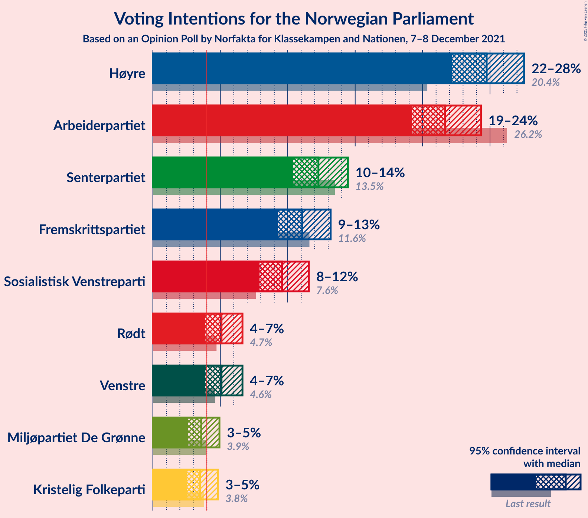

### Confidence Intervals

| Party | Last Result | Poll Result | 80% Confidence Interval | 90% Confidence Interval | 95% Confidence Interval | 99% Confidence Interval |
|:-----:|:-----------:|:-----------:|:-----------------------:|:-----------------------:|:-----------------------:|:-----------------------:|
| Høyre | 20.4% | 24.8% | 23.1–26.6% |22.6–27.1% |22.2–27.5% |21.4–28.4% |
| Arbeiderpartiet | 26.2% | 21.7% | 20.1–23.4% |19.6–23.9% |19.2–24.3% |18.5–25.2% |
| Senterpartiet | 13.5% | 12.3% | 11.0–13.7% |10.7–14.1% |10.4–14.5% |9.8–15.2% |
| Fremskrittspartiet | 11.6% | 11.1% | 9.9–12.5% |9.6–12.8% |9.3–13.2% |8.7–13.9% |
| Sosialistisk Venstreparti | 7.6% | 9.6% | 8.5–10.9% |8.2–11.2% |7.9–11.6% |7.4–12.2% |
| Venstre | 4.6% | 5.1% | 4.3–6.1% |4.1–6.4% |3.9–6.6% |3.5–7.1% |
| Rødt | 4.7% | 5.1% | 4.3–6.1% |4.1–6.4% |3.9–6.6% |3.5–7.1% |
| Miljøpartiet De Grønne | 3.9% | 3.6% | 2.9–4.5% |2.8–4.7% |2.6–4.9% |2.3–5.4% |
| Kristelig Folkeparti | 3.8% | 3.5% | 2.9–4.4% |2.7–4.6% |2.5–4.8% |2.2–5.3% |

*Note:* The poll result column reflects the actual value used in the calculations. Published results may vary slightly, and in addition be rounded to fewer digits.

## Seats

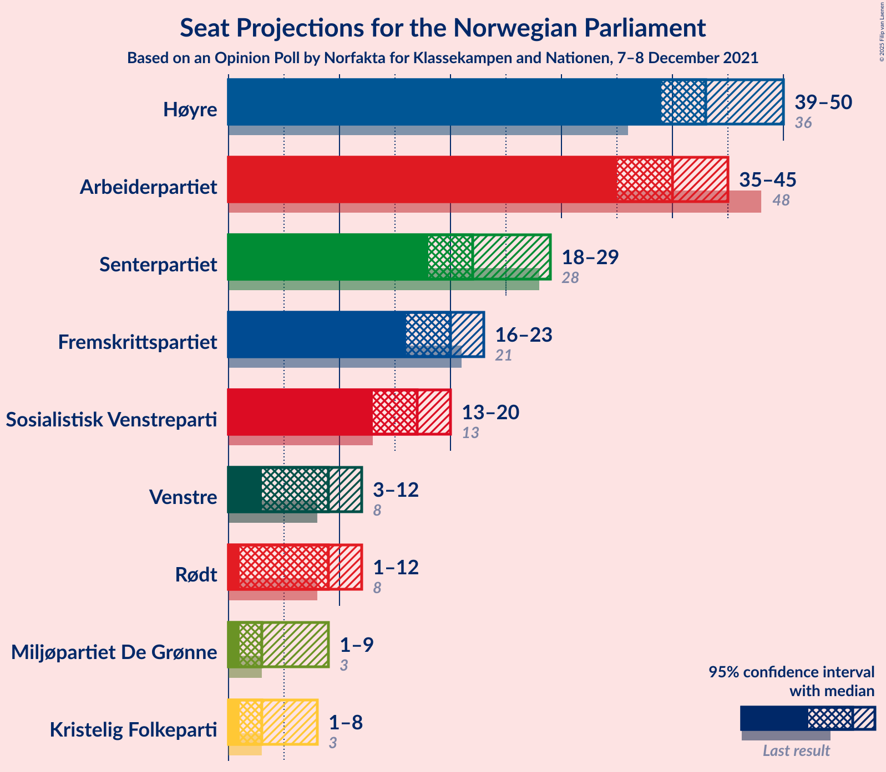

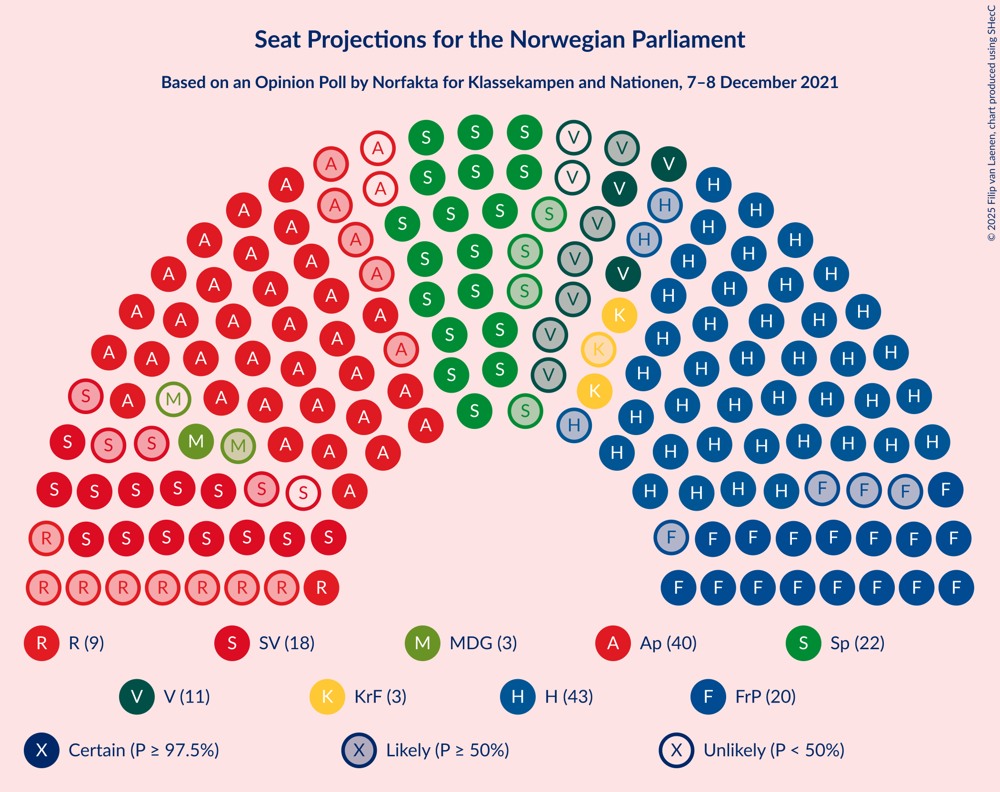

### Confidence Intervals

| Party | Last Result | Median | 80% Confidence Interval | 90% Confidence Interval | 95% Confidence Interval | 99% Confidence Interval |
|:-----:|:-----------:|:------:|:-----------------------:|:-----------------------:|:-----------------------:|:-----------------------:|
| <a href="#høyre">Høyre</a> | 36 | 43 | 41–48 |40–49 |39–50 |37–51 |
| <a href="#arbeiderpartiet">Arbeiderpartiet</a> | 48 | 40 | 37–43 |36–44 |35–45 |33–46 |
| <a href="#senterpartiet">Senterpartiet</a> | 28 | 22 | 19–26 |18–27 |18–29 |17–30 |
| <a href="#fremskrittspartiet">Fremskrittspartiet</a> | 21 | 20 | 17–22 |17–23 |16–23 |15–25 |
| <a href="#sosialistisk-venstreparti">Sosialistisk Venstreparti</a> | 13 | 17 | 14–19 |14–20 |13–20 |12–22 |
| <a href="#venstre">Venstre</a> | 8 | 9 | 7–11 |6–11 |3–12 |2–13 |
| <a href="#rødt">Rødt</a> | 8 | 9 | 7–10 |1–11 |1–12 |1–13 |
| <a href="#miljøpartiet-de-grønne">Miljøpartiet De Grønne</a> | 3 | 3 | 1–7 |1–8 |1–9 |1–9 |
| <a href="#kristelig-folkeparti">Kristelig Folkeparti</a> | 3 | 3 | 2–7 |2–8 |1–8 |1–9 |

### Høyre

*For a full overview of the results for this party, see the [Høyre](party-høyre.html) page.*

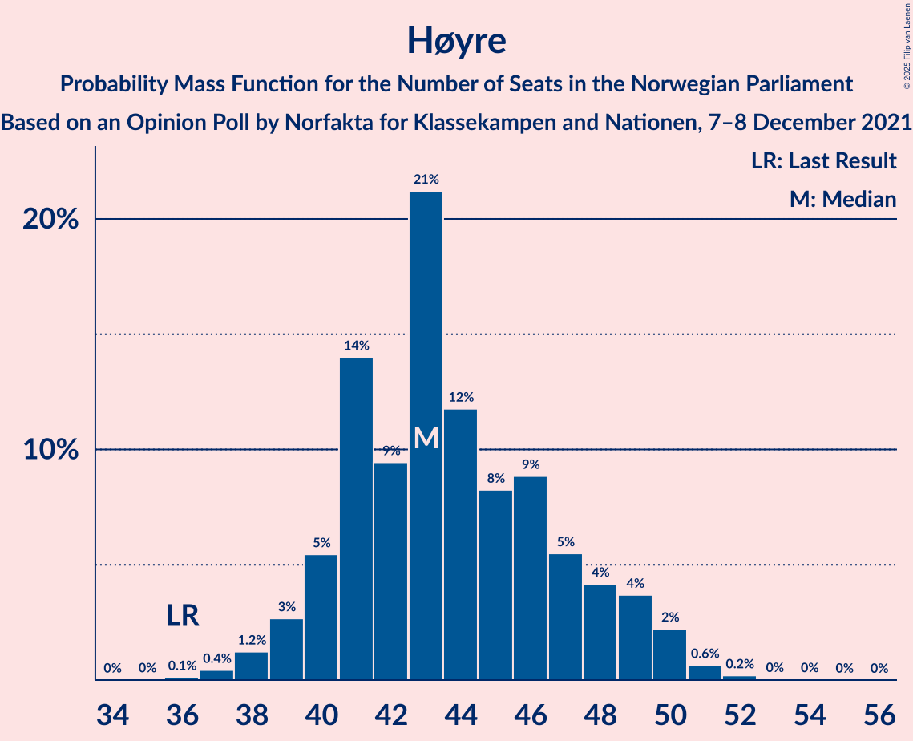

| Number of Seats | Probability | Accumulated | Special Marks |
|:---------------:|:-----------:|:-----------:|:-------------:|
| 36 | 0.1% | 100% | Last Result |
| 37 | 0.4% | 99.8% |  |
| 38 | 1.2% | 99.4% |  |
| 39 | 3% | 98% |  |
| 40 | 5% | 95% |  |
| 41 | 14% | 90% |  |
| 42 | 9% | 76% |  |
| 43 | 21% | 67% | Median |
| 44 | 12% | 45% |  |
| 45 | 8% | 34% |  |
| 46 | 9% | 25% |  |
| 47 | 5% | 17% |  |
| 48 | 4% | 11% |  |
| 49 | 4% | 7% |  |
| 50 | 2% | 3% |  |
| 51 | 0.6% | 0.9% |  |
| 52 | 0.2% | 0.3% |  |
| 53 | 0% | 0.1% |  |
| 54 | 0% | 0.1% |  |
| 55 | 0% | 0% |  |

### Arbeiderpartiet

*For a full overview of the results for this party, see the [Arbeiderpartiet](party-arbeiderpartiet.html) page.*

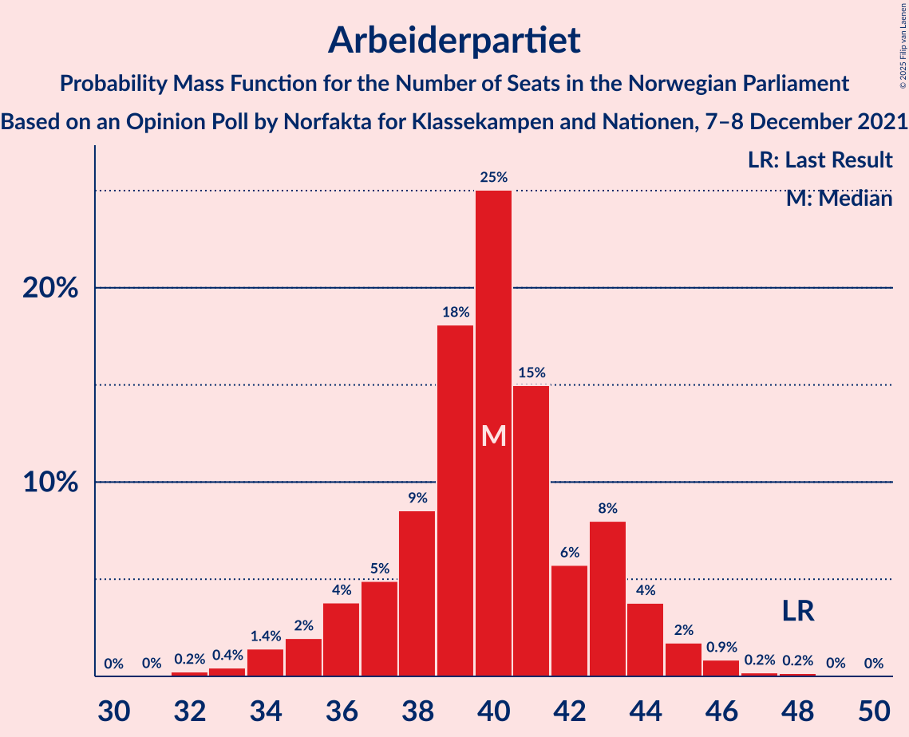

| Number of Seats | Probability | Accumulated | Special Marks |
|:---------------:|:-----------:|:-----------:|:-------------:|
| 32 | 0.2% | 100% |  |
| 33 | 0.4% | 99.7% |  |
| 34 | 1.4% | 99.3% |  |
| 35 | 2% | 98% |  |
| 36 | 4% | 96% |  |
| 37 | 5% | 92% |  |
| 38 | 9% | 87% |  |
| 39 | 18% | 79% |  |
| 40 | 25% | 61% | Median |
| 41 | 15% | 36% |  |
| 42 | 6% | 21% |  |
| 43 | 8% | 15% |  |
| 44 | 4% | 7% |  |
| 45 | 2% | 3% |  |
| 46 | 0.9% | 1.3% |  |
| 47 | 0.2% | 0.4% |  |
| 48 | 0.2% | 0.2% | Last Result |
| 49 | 0% | 0.1% |  |
| 50 | 0% | 0% |  |

### Senterpartiet

*For a full overview of the results for this party, see the [Senterpartiet](party-senterpartiet.html) page.*

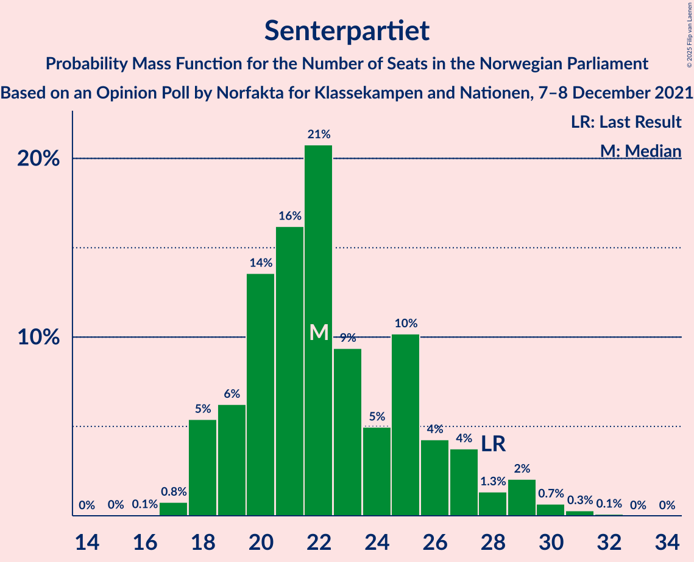

| Number of Seats | Probability | Accumulated | Special Marks |
|:---------------:|:-----------:|:-----------:|:-------------:|
| 16 | 0.1% | 100% |  |
| 17 | 0.8% | 99.9% |  |
| 18 | 5% | 99.1% |  |
| 19 | 6% | 94% |  |
| 20 | 14% | 88% |  |
| 21 | 16% | 74% |  |
| 22 | 21% | 58% | Median |
| 23 | 9% | 37% |  |
| 24 | 5% | 28% |  |
| 25 | 10% | 23% |  |
| 26 | 4% | 12% |  |
| 27 | 4% | 8% |  |
| 28 | 1.3% | 4% | Last Result |
| 29 | 2% | 3% |  |
| 30 | 0.7% | 1.0% |  |
| 31 | 0.3% | 0.4% |  |
| 32 | 0.1% | 0.1% |  |
| 33 | 0% | 0% |  |

### Fremskrittspartiet

*For a full overview of the results for this party, see the [Fremskrittspartiet](party-fremskrittspartiet.html) page.*

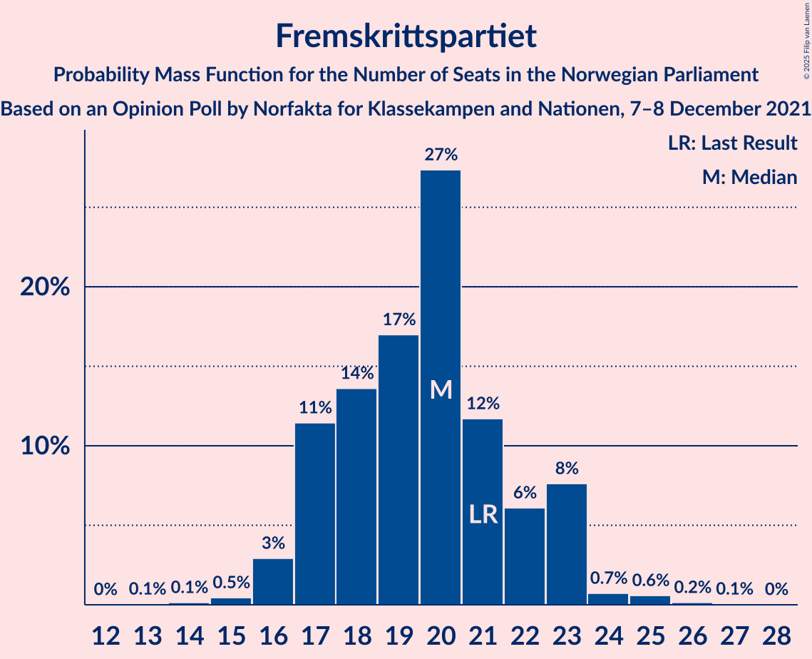

| Number of Seats | Probability | Accumulated | Special Marks |
|:---------------:|:-----------:|:-----------:|:-------------:|
| 13 | 0.1% | 100% |  |
| 14 | 0.1% | 99.9% |  |
| 15 | 0.5% | 99.8% |  |
| 16 | 3% | 99.3% |  |
| 17 | 11% | 96% |  |
| 18 | 14% | 85% |  |
| 19 | 17% | 71% |  |
| 20 | 27% | 54% | Median |
| 21 | 12% | 27% | Last Result |
| 22 | 6% | 15% |  |
| 23 | 8% | 9% |  |
| 24 | 0.7% | 2% |  |
| 25 | 0.6% | 0.8% |  |
| 26 | 0.2% | 0.2% |  |
| 27 | 0.1% | 0.1% |  |
| 28 | 0% | 0% |  |

### Sosialistisk Venstreparti

*For a full overview of the results for this party, see the [Sosialistisk Venstreparti](party-sosialistiskvenstreparti.html) page.*

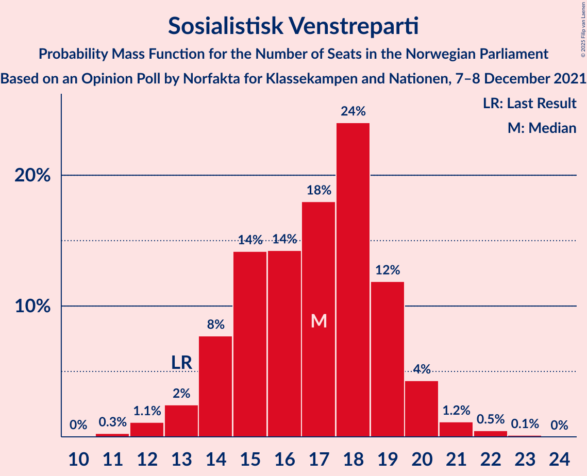

| Number of Seats | Probability | Accumulated | Special Marks |
|:---------------:|:-----------:|:-----------:|:-------------:|
| 11 | 0.3% | 100% |  |
| 12 | 1.1% | 99.7% |  |
| 13 | 2% | 98.6% | Last Result |
| 14 | 8% | 96% |  |
| 15 | 14% | 88% |  |
| 16 | 14% | 74% |  |
| 17 | 18% | 60% | Median |
| 18 | 24% | 42% |  |
| 19 | 12% | 18% |  |
| 20 | 4% | 6% |  |
| 21 | 1.2% | 2% |  |
| 22 | 0.5% | 0.6% |  |
| 23 | 0.1% | 0.1% |  |
| 24 | 0% | 0% |  |

### Venstre

*For a full overview of the results for this party, see the [Venstre](party-venstre.html) page.*

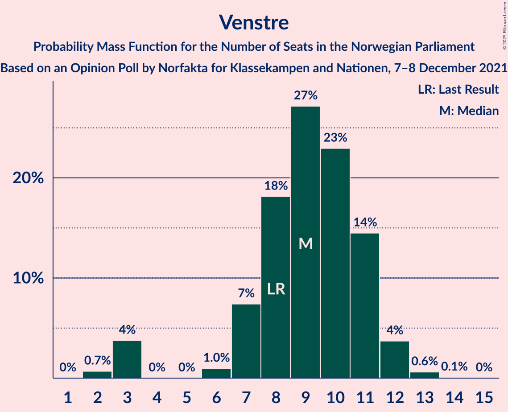

| Number of Seats | Probability | Accumulated | Special Marks |
|:---------------:|:-----------:|:-----------:|:-------------:|
| 2 | 0.7% | 100% |  |
| 3 | 4% | 99.3% |  |
| 4 | 0% | 96% |  |
| 5 | 0% | 96% |  |
| 6 | 1.0% | 96% |  |
| 7 | 7% | 95% |  |
| 8 | 18% | 87% | Last Result |
| 9 | 27% | 69% | Median |
| 10 | 23% | 42% |  |
| 11 | 14% | 19% |  |
| 12 | 4% | 4% |  |
| 13 | 0.6% | 0.7% |  |
| 14 | 0.1% | 0.1% |  |
| 15 | 0% | 0% |  |

### Rødt

*For a full overview of the results for this party, see the [Rødt](party-rødt.html) page.*

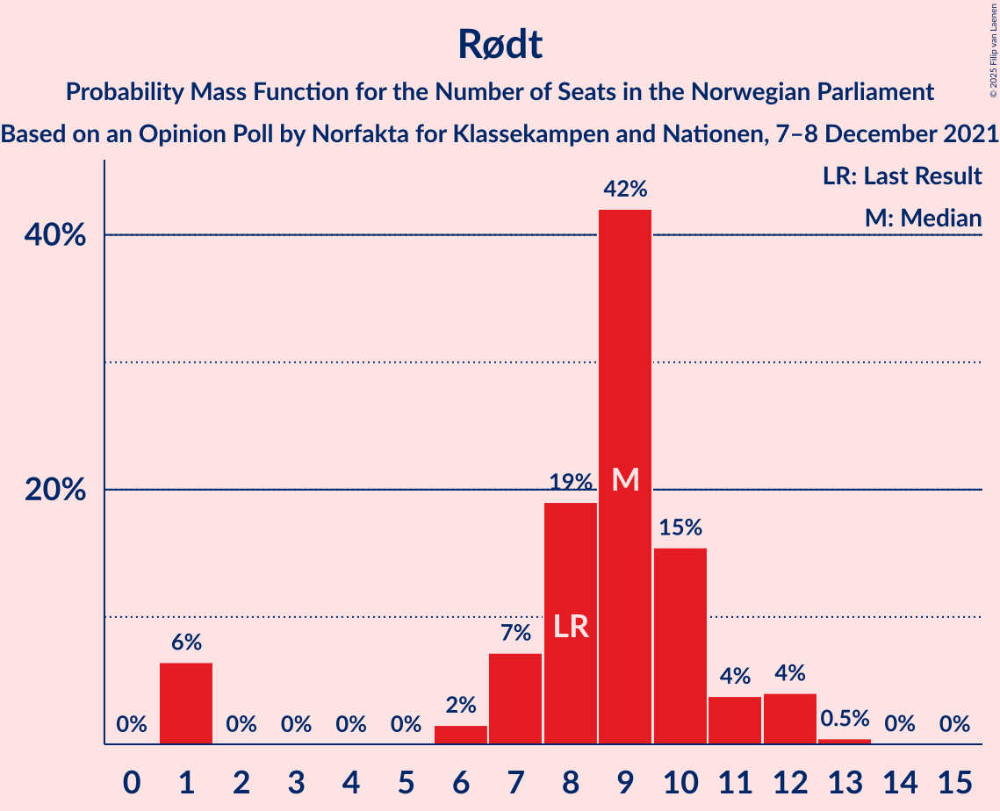

| Number of Seats | Probability | Accumulated | Special Marks |
|:---------------:|:-----------:|:-----------:|:-------------:|
| 1 | 6% | 100% |  |
| 2 | 0% | 94% |  |
| 3 | 0% | 94% |  |
| 4 | 0% | 94% |  |
| 5 | 0% | 94% |  |
| 6 | 2% | 94% |  |
| 7 | 7% | 92% |  |
| 8 | 19% | 85% | Last Result |
| 9 | 42% | 66% | Median |
| 10 | 15% | 24% |  |
| 11 | 4% | 8% |  |
| 12 | 4% | 5% |  |
| 13 | 0.5% | 0.5% |  |
| 14 | 0% | 0.1% |  |
| 15 | 0% | 0% |  |

### Miljøpartiet De Grønne

*For a full overview of the results for this party, see the [Miljøpartiet De Grønne](party-miljøpartietdegrønne.html) page.*

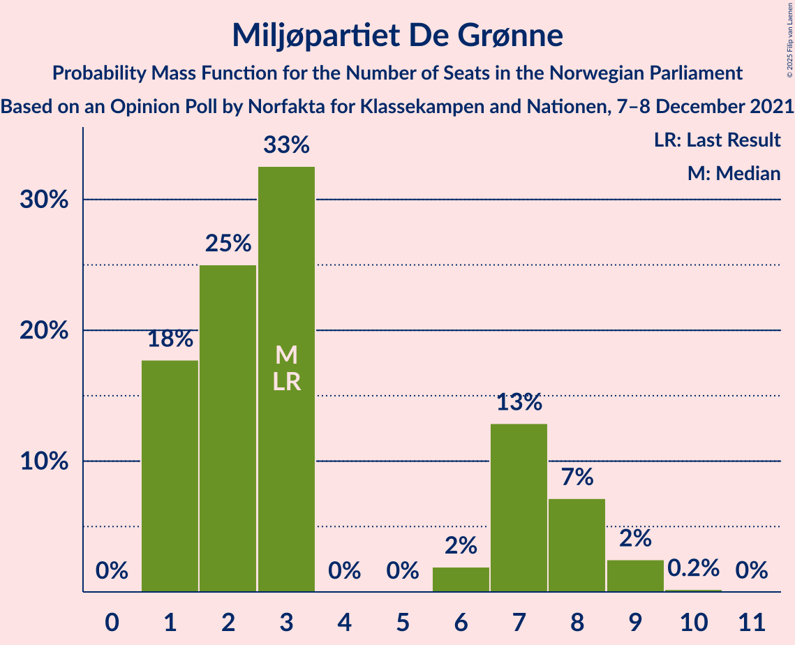

| Number of Seats | Probability | Accumulated | Special Marks |
|:---------------:|:-----------:|:-----------:|:-------------:|
| 1 | 18% | 100% |  |
| 2 | 25% | 82% |  |
| 3 | 33% | 57% | Last Result, Median |
| 4 | 0% | 25% |  |
| 5 | 0% | 25% |  |
| 6 | 2% | 25% |  |
| 7 | 13% | 23% |  |
| 8 | 7% | 10% |  |
| 9 | 2% | 3% |  |
| 10 | 0.2% | 0.2% |  |
| 11 | 0% | 0% |  |

### Kristelig Folkeparti

*For a full overview of the results for this party, see the [Kristelig Folkeparti](party-kristeligfolkeparti.html) page.*

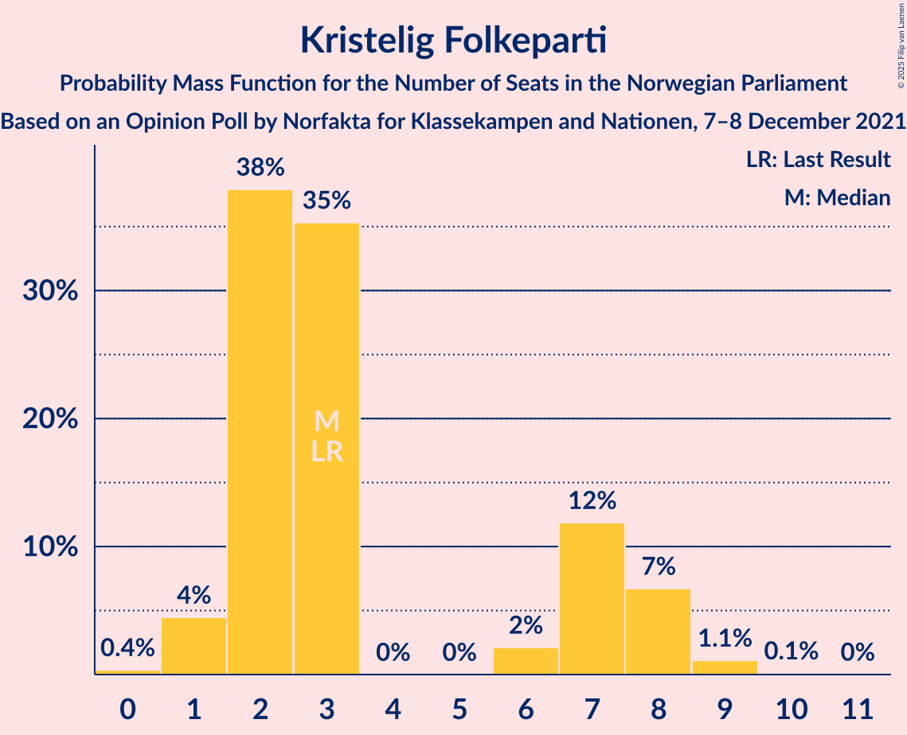

| Number of Seats | Probability | Accumulated | Special Marks |
|:---------------:|:-----------:|:-----------:|:-------------:|
| 0 | 0.4% | 100% |  |
| 1 | 4% | 99.6% |  |
| 2 | 38% | 95% |  |
| 3 | 35% | 57% | Last Result, Median |
| 4 | 0% | 22% |  |
| 5 | 0% | 22% |  |
| 6 | 2% | 22% |  |
| 7 | 12% | 20% |  |
| 8 | 7% | 8% |  |
| 9 | 1.1% | 1.2% |  |
| 10 | 0.1% | 0.1% |  |
| 11 | 0% | 0% |  |

## Coalitions

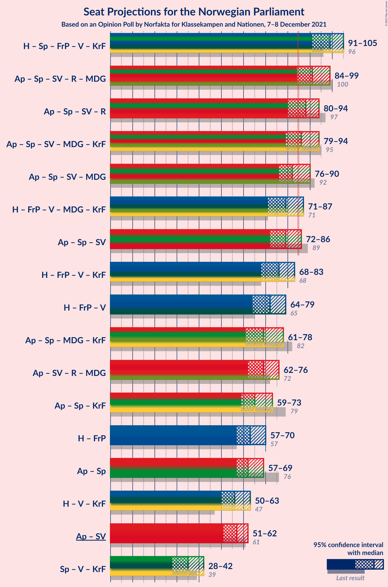

### Confidence Intervals

| Coalition | Last Result | Median | Majority? | 80% Confidence Interval | 90% Confidence Interval | 95% Confidence Interval | 99% Confidence Interval |
|:---------:|:-----------:|:------:|:---------:|:-----------------------:|:-----------------------:|:-----------------------:|:-----------------------:|
| Høyre – Senterpartiet – Fremskrittspartiet – Venstre – Kristelig Folkeparti | 96 | 99 | 100% | 93–103 | 92–104 | 91–105 | 88–108 |
| Arbeiderpartiet – Senterpartiet – Sosialistisk Venstreparti – Rødt – Miljøpartiet De Grønne | 100 | 91 | 96% | 86–96 | 85–97 | 84–99 | 81–101 |
| Arbeiderpartiet – Senterpartiet – Sosialistisk Venstreparti – Rødt | 97 | 88 | 81% | 83–92 | 81–94 | 80–94 | 78–97 |
| Arbeiderpartiet – Senterpartiet – Sosialistisk Venstreparti – Miljøpartiet De Grønne – Kristelig Folkeparti | 95 | 86 | 66% | 81–91 | 79–93 | 79–94 | 77–97 |
| Arbeiderpartiet – Senterpartiet – Sosialistisk Venstreparti – Miljøpartiet De Grønne | 92 | 82 | 32% | 78–87 | 77–89 | 76–90 | 74–93 |
| Høyre – Fremskrittspartiet – Venstre – Miljøpartiet De Grønne – Kristelig Folkeparti | 71 | 79 | 8% | 75–84 | 73–85 | 71–87 | 69–90 |
| Arbeiderpartiet – Senterpartiet – Sosialistisk Venstreparti | 89 | 79 | 5% | 75–83 | 73–84 | 72–86 | 70–88 |
| Høyre – Fremskrittspartiet – Venstre – Kristelig Folkeparti | 68 | 76 | 1.0% | 71–81 | 69–82 | 68–83 | 65–85 |
| Høyre – Fremskrittspartiet – Venstre | 65 | 72 | 0% | 68–77 | 67–79 | 64–79 | 62–82 |
| Arbeiderpartiet – Senterpartiet – Miljøpartiet De Grønne – Kristelig Folkeparti | 82 | 69 | 0% | 64–75 | 63–76 | 61–78 | 60–81 |
| Arbeiderpartiet – Sosialistisk Venstreparti – Rødt – Miljøpartiet De Grønne | 72 | 69 | 0% | 64–73 | 63–75 | 62–76 | 59–78 |
| Arbeiderpartiet – Senterpartiet – Kristelig Folkeparti | 79 | 65 | 0% | 61–70 | 60–72 | 59–73 | 57–76 |
| Høyre – Fremskrittspartiet | 57 | 63 | 0% | 59–68 | 58–69 | 57–70 | 55–73 |
| Arbeiderpartiet – Senterpartiet | 76 | 62 | 0% | 58–66 | 57–67 | 57–69 | 54–71 |
| Høyre – Venstre – Kristelig Folkeparti | 47 | 56 | 0% | 52–61 | 51–62 | 50–63 | 47–65 |
| Arbeiderpartiet – Sosialistisk Venstreparti | 61 | 57 | 0% | 53–61 | 51–61 | 51–62 | 48–64 |
| Senterpartiet – Venstre – Kristelig Folkeparti | 39 | 35 | 0% | 31–39 | 29–41 | 28–42 | 26–45 |

### Høyre – Senterpartiet – Fremskrittspartiet – Venstre – Kristelig Folkeparti

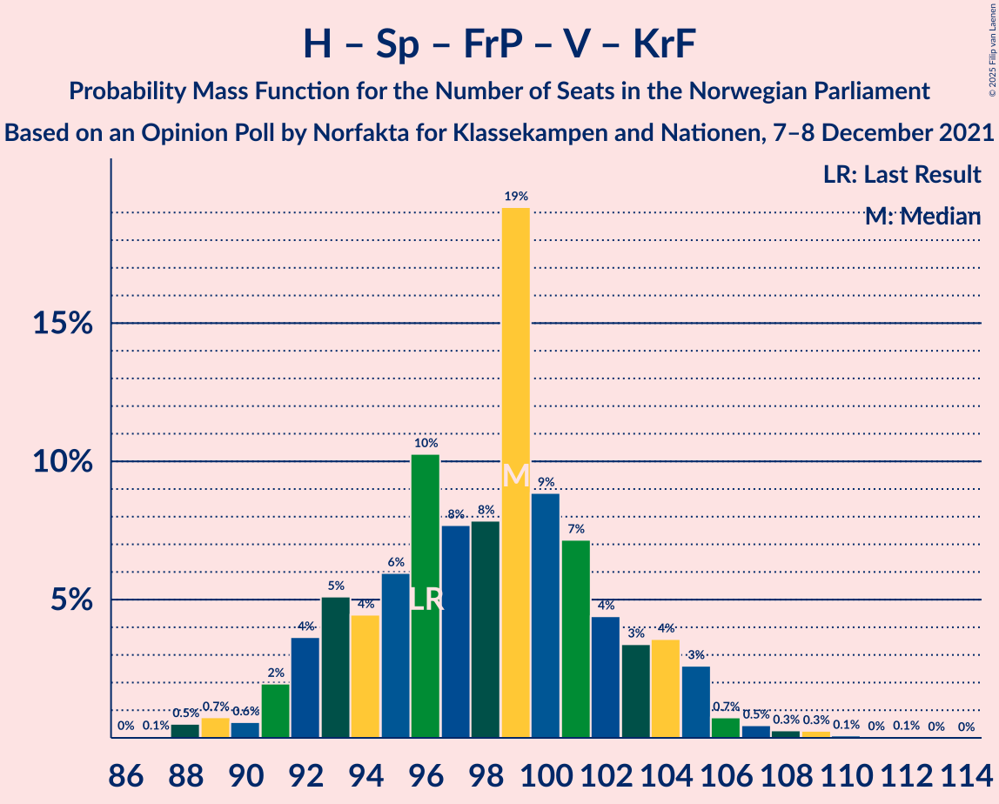

| Number of Seats | Probability | Accumulated | Special Marks |
|:---------------:|:-----------:|:-----------:|:-------------:|
| 86 | 0% | 100% |  |
| 87 | 0.1% | 99.9% |  |
| 88 | 0.5% | 99.9% |  |
| 89 | 0.7% | 99.4% |  |
| 90 | 0.6% | 98.6% |  |
| 91 | 2% | 98% |  |
| 92 | 4% | 96% |  |
| 93 | 5% | 92% |  |
| 94 | 4% | 87% |  |
| 95 | 6% | 83% |  |
| 96 | 10% | 77% | Last Result |
| 97 | 8% | 67% | Median |
| 98 | 8% | 59% |  |
| 99 | 19% | 51% |  |
| 100 | 9% | 32% |  |
| 101 | 7% | 23% |  |
| 102 | 4% | 16% |  |
| 103 | 3% | 11% |  |
| 104 | 4% | 8% |  |
| 105 | 3% | 5% |  |
| 106 | 0.7% | 2% |  |
| 107 | 0.5% | 1.2% |  |
| 108 | 0.3% | 0.7% |  |
| 109 | 0.3% | 0.4% |  |
| 110 | 0.1% | 0.2% |  |
| 111 | 0% | 0.1% |  |
| 112 | 0.1% | 0.1% |  |
| 113 | 0% | 0% |  |

### Arbeiderpartiet – Senterpartiet – Sosialistisk Venstreparti – Rødt – Miljøpartiet De Grønne

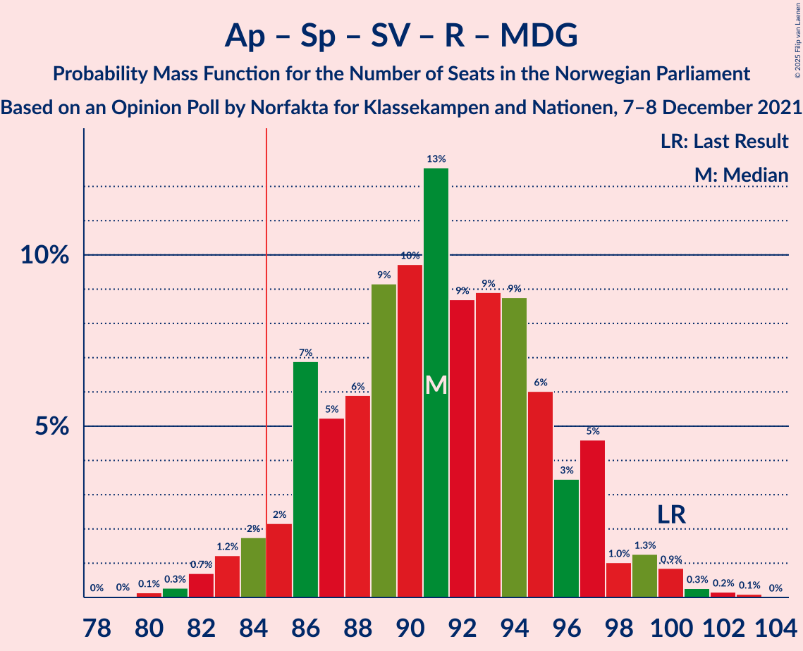

| Number of Seats | Probability | Accumulated | Special Marks |
|:---------------:|:-----------:|:-----------:|:-------------:|
| 79 | 0% | 100% |  |
| 80 | 0.1% | 99.9% |  |
| 81 | 0.3% | 99.8% |  |
| 82 | 0.7% | 99.5% |  |
| 83 | 1.2% | 98.8% |  |
| 84 | 2% | 98% |  |
| 85 | 2% | 96% | Majority |
| 86 | 7% | 94% |  |
| 87 | 5% | 87% |  |
| 88 | 6% | 82% |  |
| 89 | 9% | 76% |  |
| 90 | 10% | 66% |  |
| 91 | 13% | 57% | Median |
| 92 | 9% | 44% |  |
| 93 | 9% | 35% |  |
| 94 | 9% | 27% |  |
| 95 | 6% | 18% |  |
| 96 | 3% | 12% |  |
| 97 | 5% | 8% |  |
| 98 | 1.0% | 4% |  |
| 99 | 1.3% | 3% |  |
| 100 | 0.9% | 1.4% | Last Result |
| 101 | 0.3% | 0.6% |  |
| 102 | 0.2% | 0.3% |  |
| 103 | 0.1% | 0.1% |  |
| 104 | 0% | 0% |  |

### Arbeiderpartiet – Senterpartiet – Sosialistisk Venstreparti – Rødt

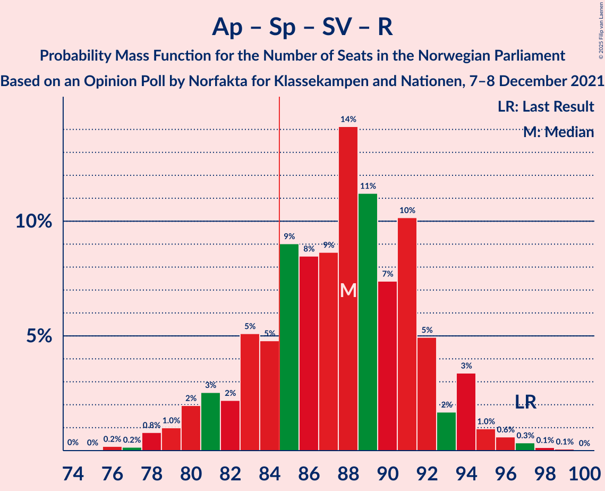

| Number of Seats | Probability | Accumulated | Special Marks |
|:---------------:|:-----------:|:-----------:|:-------------:|
| 74 | 0% | 100% |  |
| 75 | 0% | 99.9% |  |
| 76 | 0.2% | 99.9% |  |
| 77 | 0.2% | 99.7% |  |
| 78 | 0.8% | 99.6% |  |
| 79 | 1.0% | 98.8% |  |
| 80 | 2% | 98% |  |
| 81 | 3% | 96% |  |
| 82 | 2% | 93% |  |
| 83 | 5% | 91% |  |
| 84 | 5% | 86% |  |
| 85 | 9% | 81% | Majority |
| 86 | 8% | 72% |  |
| 87 | 9% | 64% |  |
| 88 | 14% | 55% | Median |
| 89 | 11% | 41% |  |
| 90 | 7% | 30% |  |
| 91 | 10% | 22% |  |
| 92 | 5% | 12% |  |
| 93 | 2% | 7% |  |
| 94 | 3% | 6% |  |
| 95 | 1.0% | 2% |  |
| 96 | 0.6% | 1.2% |  |
| 97 | 0.3% | 0.6% | Last Result |
| 98 | 0.1% | 0.2% |  |
| 99 | 0.1% | 0.1% |  |
| 100 | 0% | 0% |  |

### Arbeiderpartiet – Senterpartiet – Sosialistisk Venstreparti – Miljøpartiet De Grønne – Kristelig Folkeparti

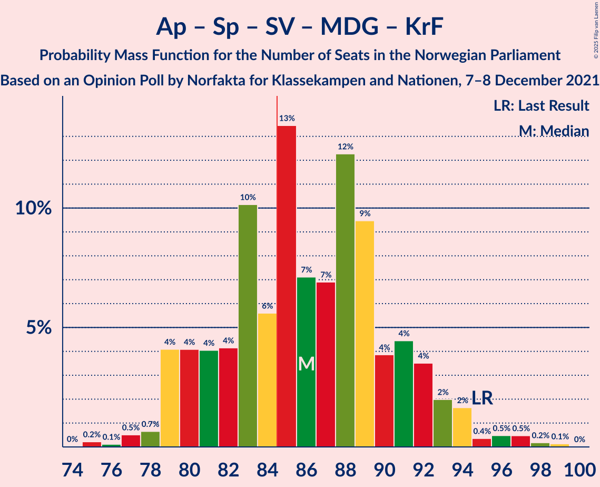

| Number of Seats | Probability | Accumulated | Special Marks |
|:---------------:|:-----------:|:-----------:|:-------------:|
| 75 | 0.2% | 100% |  |
| 76 | 0.1% | 99.7% |  |
| 77 | 0.5% | 99.6% |  |
| 78 | 0.7% | 99.1% |  |
| 79 | 4% | 98% |  |
| 80 | 4% | 94% |  |
| 81 | 4% | 90% |  |
| 82 | 4% | 86% |  |
| 83 | 10% | 82% |  |
| 84 | 6% | 72% |  |
| 85 | 13% | 66% | Median, Majority |
| 86 | 7% | 53% |  |
| 87 | 7% | 46% |  |
| 88 | 12% | 39% |  |
| 89 | 9% | 27% |  |
| 90 | 4% | 17% |  |
| 91 | 4% | 13% |  |
| 92 | 4% | 9% |  |
| 93 | 2% | 5% |  |
| 94 | 2% | 3% |  |
| 95 | 0.4% | 2% | Last Result |
| 96 | 0.5% | 1.3% |  |
| 97 | 0.5% | 0.8% |  |
| 98 | 0.2% | 0.3% |  |
| 99 | 0.1% | 0.2% |  |
| 100 | 0% | 0% |  |

### Arbeiderpartiet – Senterpartiet – Sosialistisk Venstreparti – Miljøpartiet De Grønne

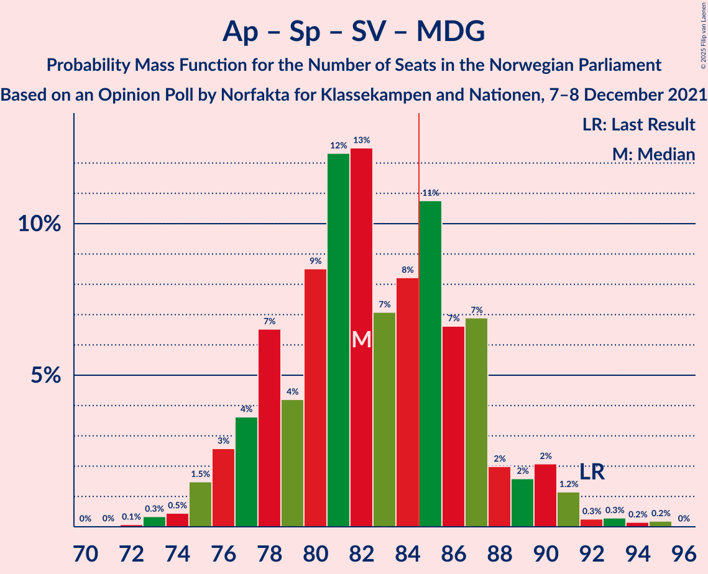

| Number of Seats | Probability | Accumulated | Special Marks |
|:---------------:|:-----------:|:-----------:|:-------------:|
| 72 | 0.1% | 100% |  |
| 73 | 0.3% | 99.9% |  |
| 74 | 0.5% | 99.5% |  |
| 75 | 1.5% | 99.1% |  |
| 76 | 3% | 98% |  |
| 77 | 4% | 95% |  |
| 78 | 7% | 91% |  |
| 79 | 4% | 85% |  |
| 80 | 9% | 81% |  |
| 81 | 12% | 72% |  |
| 82 | 13% | 60% | Median |
| 83 | 7% | 47% |  |
| 84 | 8% | 40% |  |
| 85 | 11% | 32% | Majority |
| 86 | 7% | 21% |  |
| 87 | 7% | 15% |  |
| 88 | 2% | 8% |  |
| 89 | 2% | 6% |  |
| 90 | 2% | 4% |  |
| 91 | 1.2% | 2% |  |
| 92 | 0.3% | 0.9% | Last Result |
| 93 | 0.3% | 0.7% |  |
| 94 | 0.2% | 0.4% |  |
| 95 | 0.2% | 0.2% |  |
| 96 | 0% | 0% |  |

### Høyre – Fremskrittspartiet – Venstre – Miljøpartiet De Grønne – Kristelig Folkeparti

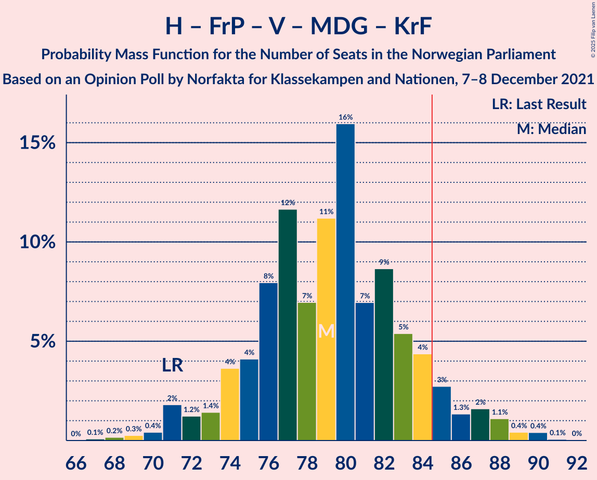

| Number of Seats | Probability | Accumulated | Special Marks |
|:---------------:|:-----------:|:-----------:|:-------------:|
| 67 | 0.1% | 100% |  |
| 68 | 0.2% | 99.9% |  |
| 69 | 0.3% | 99.7% |  |
| 70 | 0.4% | 99.5% |  |
| 71 | 2% | 99.0% | Last Result |
| 72 | 1.2% | 97% |  |
| 73 | 1.4% | 96% |  |
| 74 | 4% | 95% |  |
| 75 | 4% | 91% |  |
| 76 | 8% | 87% |  |
| 77 | 12% | 79% |  |
| 78 | 7% | 67% | Median |
| 79 | 11% | 60% |  |
| 80 | 16% | 49% |  |
| 81 | 7% | 33% |  |
| 82 | 9% | 26% |  |
| 83 | 5% | 17% |  |
| 84 | 4% | 12% |  |
| 85 | 3% | 8% | Majority |
| 86 | 1.3% | 5% |  |
| 87 | 2% | 4% |  |
| 88 | 1.1% | 2% |  |
| 89 | 0.4% | 0.9% |  |
| 90 | 0.4% | 0.5% |  |
| 91 | 0.1% | 0.1% |  |
| 92 | 0% | 0% |  |

### Arbeiderpartiet – Senterpartiet – Sosialistisk Venstreparti

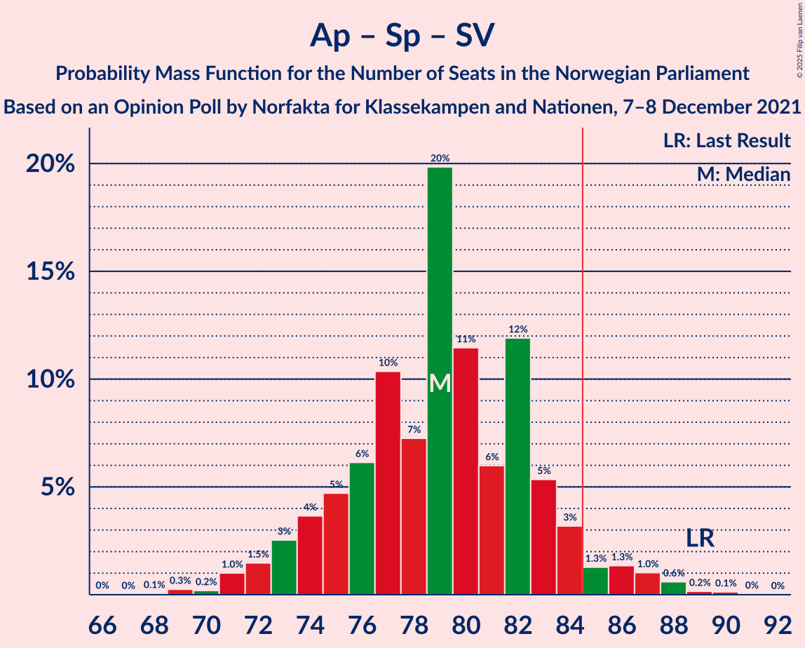

| Number of Seats | Probability | Accumulated | Special Marks |
|:---------------:|:-----------:|:-----------:|:-------------:|
| 68 | 0.1% | 100% |  |
| 69 | 0.3% | 99.9% |  |
| 70 | 0.2% | 99.6% |  |
| 71 | 1.0% | 99.4% |  |
| 72 | 1.5% | 98% |  |
| 73 | 3% | 97% |  |
| 74 | 4% | 94% |  |
| 75 | 5% | 91% |  |
| 76 | 6% | 86% |  |
| 77 | 10% | 80% |  |
| 78 | 7% | 70% |  |
| 79 | 20% | 62% | Median |
| 80 | 11% | 42% |  |
| 81 | 6% | 31% |  |
| 82 | 12% | 25% |  |
| 83 | 5% | 13% |  |
| 84 | 3% | 8% |  |
| 85 | 1.3% | 5% | Majority |
| 86 | 1.3% | 3% |  |
| 87 | 1.0% | 2% |  |
| 88 | 0.6% | 0.9% |  |
| 89 | 0.2% | 0.3% | Last Result |
| 90 | 0.1% | 0.2% |  |
| 91 | 0% | 0.1% |  |
| 92 | 0% | 0% |  |

### Høyre – Fremskrittspartiet – Venstre – Kristelig Folkeparti

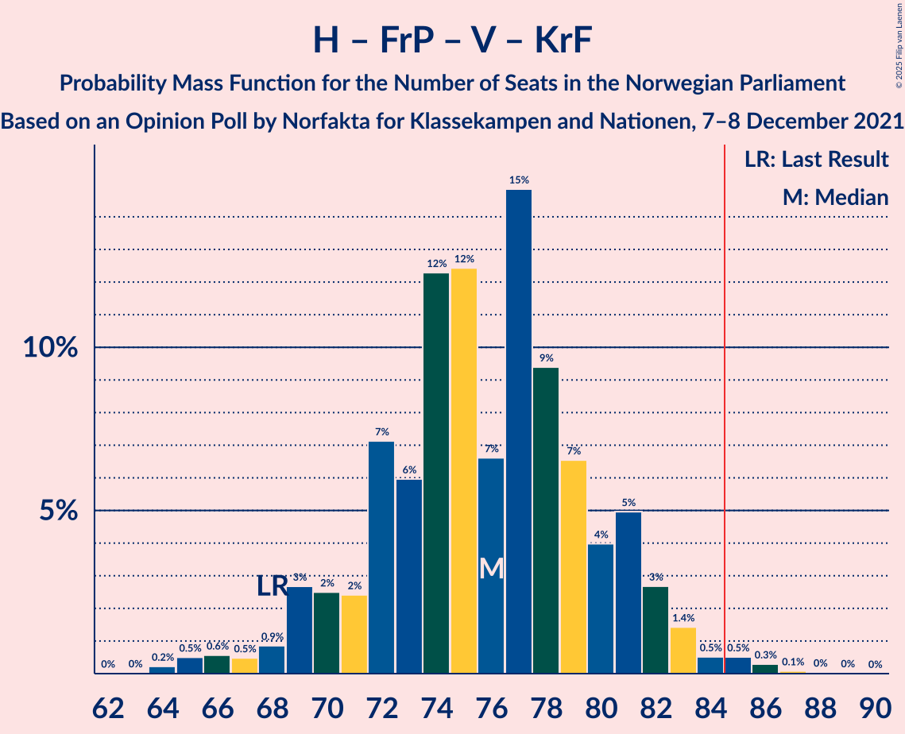

| Number of Seats | Probability | Accumulated | Special Marks |
|:---------------:|:-----------:|:-----------:|:-------------:|
| 64 | 0.2% | 100% |  |
| 65 | 0.5% | 99.7% |  |
| 66 | 0.6% | 99.2% |  |
| 67 | 0.5% | 98.7% |  |
| 68 | 0.9% | 98% | Last Result |
| 69 | 3% | 97% |  |
| 70 | 2% | 95% |  |
| 71 | 2% | 92% |  |
| 72 | 7% | 90% |  |
| 73 | 6% | 83% |  |
| 74 | 12% | 77% |  |
| 75 | 12% | 64% | Median |
| 76 | 7% | 52% |  |
| 77 | 15% | 45% |  |
| 78 | 9% | 30% |  |
| 79 | 7% | 21% |  |
| 80 | 4% | 15% |  |
| 81 | 5% | 11% |  |
| 82 | 3% | 6% |  |
| 83 | 1.4% | 3% |  |
| 84 | 0.5% | 1.5% |  |
| 85 | 0.5% | 1.0% | Majority |
| 86 | 0.3% | 0.4% |  |
| 87 | 0.1% | 0.1% |  |
| 88 | 0% | 0.1% |  |
| 89 | 0% | 0% |  |

### Høyre – Fremskrittspartiet – Venstre

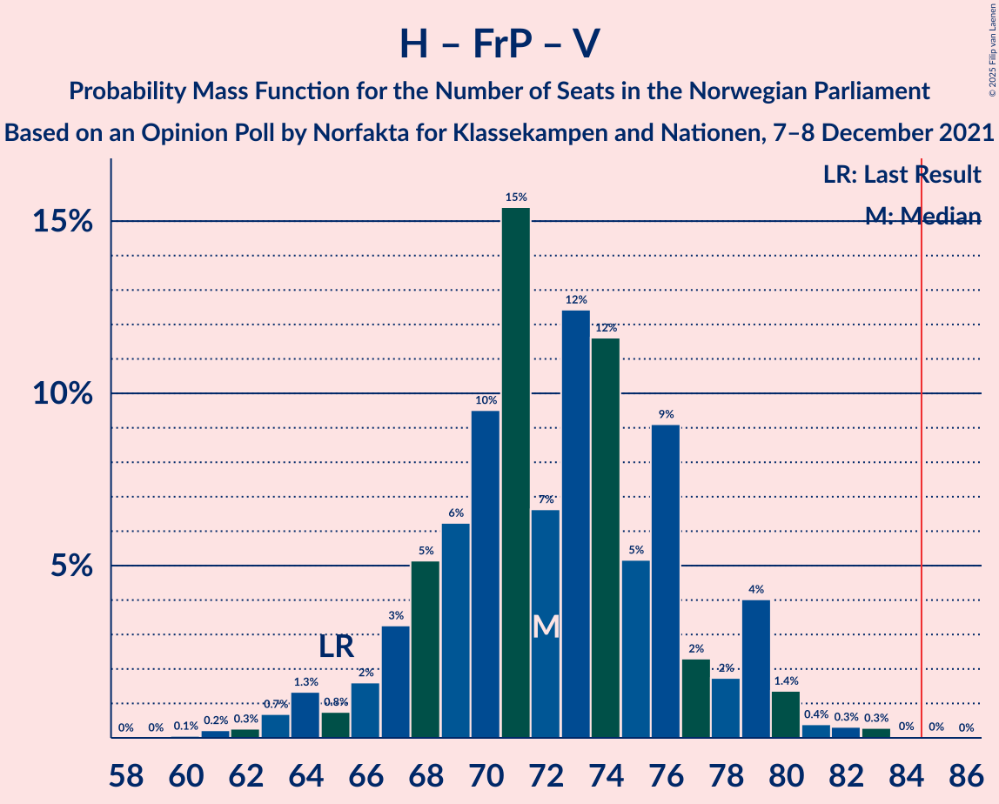

| Number of Seats | Probability | Accumulated | Special Marks |
|:---------------:|:-----------:|:-----------:|:-------------:|
| 60 | 0.1% | 100% |  |
| 61 | 0.2% | 99.9% |  |
| 62 | 0.3% | 99.7% |  |
| 63 | 0.7% | 99.4% |  |
| 64 | 1.3% | 98.7% |  |
| 65 | 0.8% | 97% | Last Result |
| 66 | 2% | 97% |  |
| 67 | 3% | 95% |  |
| 68 | 5% | 92% |  |
| 69 | 6% | 87% |  |
| 70 | 10% | 80% |  |
| 71 | 15% | 71% |  |
| 72 | 7% | 55% | Median |
| 73 | 12% | 49% |  |
| 74 | 12% | 36% |  |
| 75 | 5% | 25% |  |
| 76 | 9% | 20% |  |
| 77 | 2% | 11% |  |
| 78 | 2% | 8% |  |
| 79 | 4% | 6% |  |
| 80 | 1.4% | 2% |  |
| 81 | 0.4% | 1.1% |  |
| 82 | 0.3% | 0.7% |  |
| 83 | 0.3% | 0.4% |  |
| 84 | 0% | 0.1% |  |
| 85 | 0% | 0% | Majority |

### Arbeiderpartiet – Senterpartiet – Miljøpartiet De Grønne – Kristelig Folkeparti

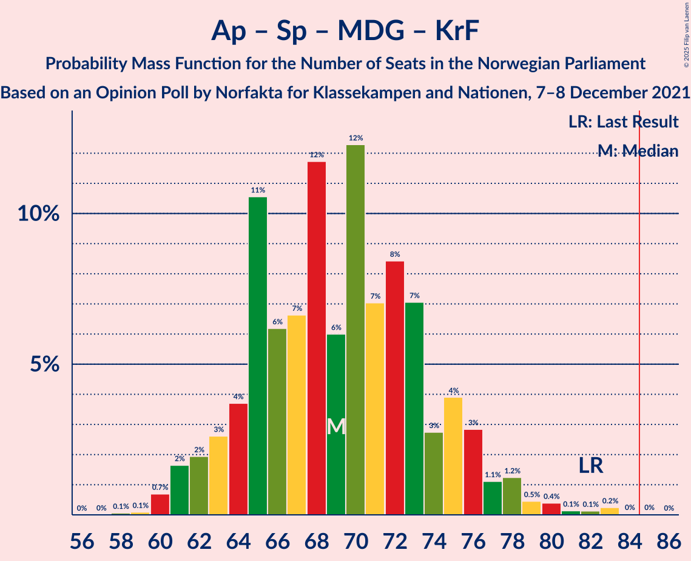

| Number of Seats | Probability | Accumulated | Special Marks |
|:---------------:|:-----------:|:-----------:|:-------------:|
| 58 | 0.1% | 100% |  |
| 59 | 0.1% | 99.9% |  |
| 60 | 0.7% | 99.8% |  |
| 61 | 2% | 99.1% |  |
| 62 | 2% | 97% |  |
| 63 | 3% | 96% |  |
| 64 | 4% | 93% |  |
| 65 | 11% | 89% |  |
| 66 | 6% | 79% |  |
| 67 | 7% | 72% |  |
| 68 | 12% | 66% | Median |
| 69 | 6% | 54% |  |
| 70 | 12% | 48% |  |
| 71 | 7% | 36% |  |
| 72 | 8% | 29% |  |
| 73 | 7% | 20% |  |
| 74 | 3% | 13% |  |
| 75 | 4% | 11% |  |
| 76 | 3% | 7% |  |
| 77 | 1.1% | 4% |  |
| 78 | 1.2% | 3% |  |
| 79 | 0.5% | 1.4% |  |
| 80 | 0.4% | 1.0% |  |
| 81 | 0.1% | 0.6% |  |
| 82 | 0.1% | 0.4% | Last Result |
| 83 | 0.2% | 0.3% |  |
| 84 | 0% | 0.1% |  |
| 85 | 0% | 0% | Majority |

### Arbeiderpartiet – Sosialistisk Venstreparti – Rødt – Miljøpartiet De Grønne

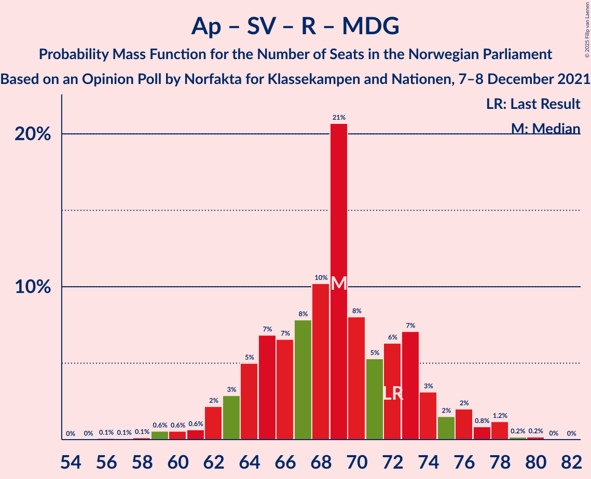

| Number of Seats | Probability | Accumulated | Special Marks |
|:---------------:|:-----------:|:-----------:|:-------------:|
| 56 | 0.1% | 100% |  |
| 57 | 0.1% | 99.9% |  |
| 58 | 0.1% | 99.8% |  |
| 59 | 0.6% | 99.7% |  |
| 60 | 0.6% | 99.1% |  |
| 61 | 0.6% | 98.6% |  |
| 62 | 2% | 98% |  |
| 63 | 3% | 96% |  |
| 64 | 5% | 93% |  |
| 65 | 7% | 88% |  |
| 66 | 7% | 81% |  |
| 67 | 8% | 74% |  |
| 68 | 10% | 67% |  |
| 69 | 21% | 56% | Median |
| 70 | 8% | 36% |  |
| 71 | 5% | 28% |  |
| 72 | 6% | 22% | Last Result |
| 73 | 7% | 16% |  |
| 74 | 3% | 9% |  |
| 75 | 2% | 6% |  |
| 76 | 2% | 4% |  |
| 77 | 0.8% | 2% |  |
| 78 | 1.2% | 2% |  |
| 79 | 0.2% | 0.4% |  |
| 80 | 0.2% | 0.2% |  |
| 81 | 0% | 0% |  |

### Arbeiderpartiet – Senterpartiet – Kristelig Folkeparti

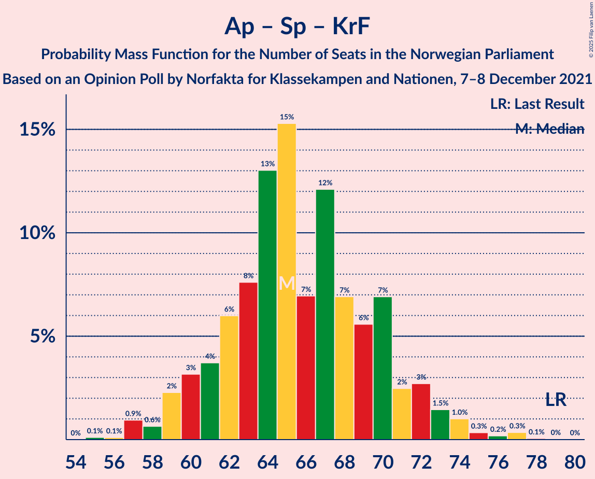

| Number of Seats | Probability | Accumulated | Special Marks |
|:---------------:|:-----------:|:-----------:|:-------------:|
| 55 | 0.1% | 100% |  |
| 56 | 0.1% | 99.9% |  |
| 57 | 0.9% | 99.8% |  |
| 58 | 0.6% | 98.8% |  |
| 59 | 2% | 98% |  |
| 60 | 3% | 96% |  |
| 61 | 4% | 93% |  |
| 62 | 6% | 89% |  |
| 63 | 8% | 83% |  |
| 64 | 13% | 75% |  |
| 65 | 15% | 62% | Median |
| 66 | 7% | 47% |  |
| 67 | 12% | 40% |  |
| 68 | 7% | 28% |  |
| 69 | 6% | 21% |  |
| 70 | 7% | 16% |  |
| 71 | 2% | 9% |  |
| 72 | 3% | 6% |  |
| 73 | 1.5% | 3% |  |
| 74 | 1.0% | 2% |  |
| 75 | 0.3% | 1.0% |  |
| 76 | 0.2% | 0.7% |  |
| 77 | 0.3% | 0.5% |  |
| 78 | 0.1% | 0.1% |  |
| 79 | 0% | 0.1% | Last Result |
| 80 | 0% | 0% |  |

### Høyre – Fremskrittspartiet

| Number of Seats | Probability | Accumulated | Special Marks |
|:---------------:|:-----------:|:-----------:|:-------------:|
| 53 | 0.1% | 100% |  |
| 54 | 0.2% | 99.9% |  |
| 55 | 0.3% | 99.7% |  |
| 56 | 1.2% | 99.4% |  |
| 57 | 2% | 98% | Last Result |
| 58 | 2% | 96% |  |
| 59 | 6% | 94% |  |
| 60 | 5% | 88% |  |
| 61 | 15% | 83% |  |
| 62 | 9% | 69% |  |
| 63 | 18% | 60% | Median |
| 64 | 9% | 42% |  |
| 65 | 11% | 33% |  |
| 66 | 5% | 22% |  |
| 67 | 6% | 17% |  |
| 68 | 3% | 11% |  |
| 69 | 3% | 8% |  |
| 70 | 2% | 4% |  |
| 71 | 1.5% | 2% |  |
| 72 | 0.3% | 0.8% |  |
| 73 | 0.4% | 0.5% |  |
| 74 | 0.1% | 0.1% |  |
| 75 | 0% | 0% |  |

### Arbeiderpartiet – Senterpartiet

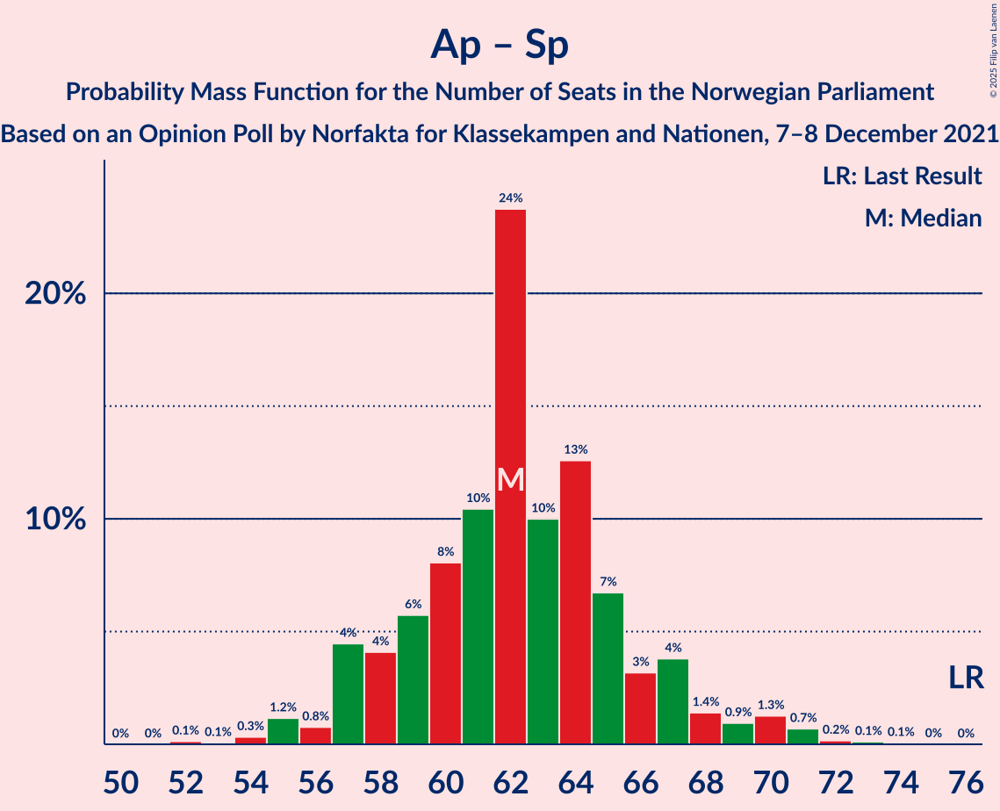

| Number of Seats | Probability | Accumulated | Special Marks |
|:---------------:|:-----------:|:-----------:|:-------------:|
| 52 | 0.1% | 100% |  |
| 53 | 0.1% | 99.9% |  |
| 54 | 0.3% | 99.8% |  |
| 55 | 1.2% | 99.5% |  |
| 56 | 0.8% | 98% |  |
| 57 | 4% | 98% |  |
| 58 | 4% | 93% |  |
| 59 | 6% | 89% |  |
| 60 | 8% | 83% |  |
| 61 | 10% | 75% |  |
| 62 | 24% | 65% | Median |
| 63 | 10% | 41% |  |
| 64 | 13% | 31% |  |
| 65 | 7% | 18% |  |
| 66 | 3% | 12% |  |
| 67 | 4% | 8% |  |
| 68 | 1.4% | 5% |  |
| 69 | 0.9% | 3% |  |
| 70 | 1.3% | 2% |  |
| 71 | 0.7% | 1.1% |  |
| 72 | 0.2% | 0.4% |  |
| 73 | 0.1% | 0.2% |  |
| 74 | 0.1% | 0.1% |  |
| 75 | 0% | 0% |  |
| 76 | 0% | 0% | Last Result |

### Høyre – Venstre – Kristelig Folkeparti

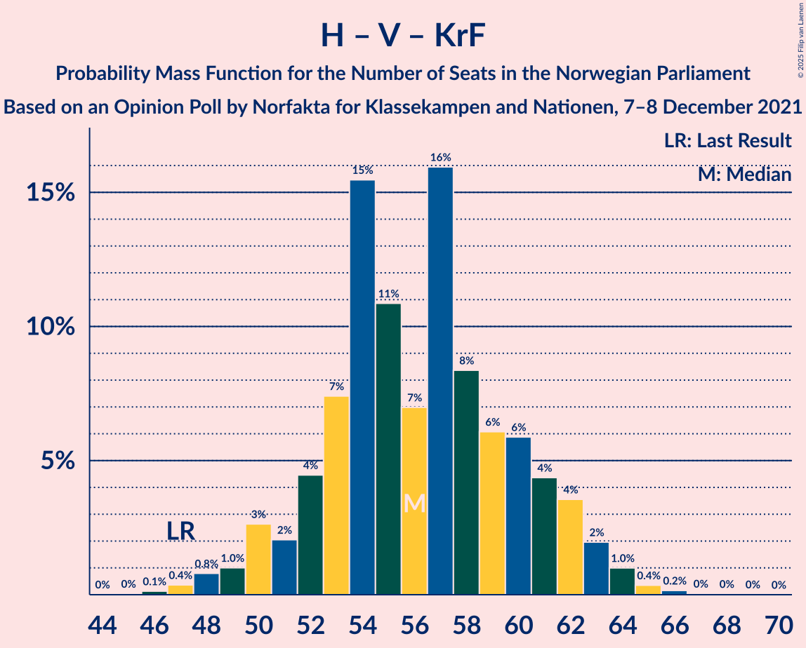

| Number of Seats | Probability | Accumulated | Special Marks |
|:---------------:|:-----------:|:-----------:|:-------------:|
| 45 | 0% | 100% |  |
| 46 | 0.1% | 99.9% |  |
| 47 | 0.4% | 99.8% | Last Result |
| 48 | 0.8% | 99.4% |  |
| 49 | 1.0% | 98.6% |  |
| 50 | 3% | 98% |  |
| 51 | 2% | 95% |  |
| 52 | 4% | 93% |  |
| 53 | 7% | 88% |  |
| 54 | 15% | 81% |  |
| 55 | 11% | 66% | Median |
| 56 | 7% | 55% |  |
| 57 | 16% | 48% |  |
| 58 | 8% | 32% |  |
| 59 | 6% | 23% |  |
| 60 | 6% | 17% |  |
| 61 | 4% | 11% |  |
| 62 | 4% | 7% |  |
| 63 | 2% | 4% |  |
| 64 | 1.0% | 2% |  |
| 65 | 0.4% | 0.6% |  |
| 66 | 0.2% | 0.3% |  |
| 67 | 0% | 0.1% |  |
| 68 | 0% | 0.1% |  |
| 69 | 0% | 0% |  |

### Arbeiderpartiet – Sosialistisk Venstreparti

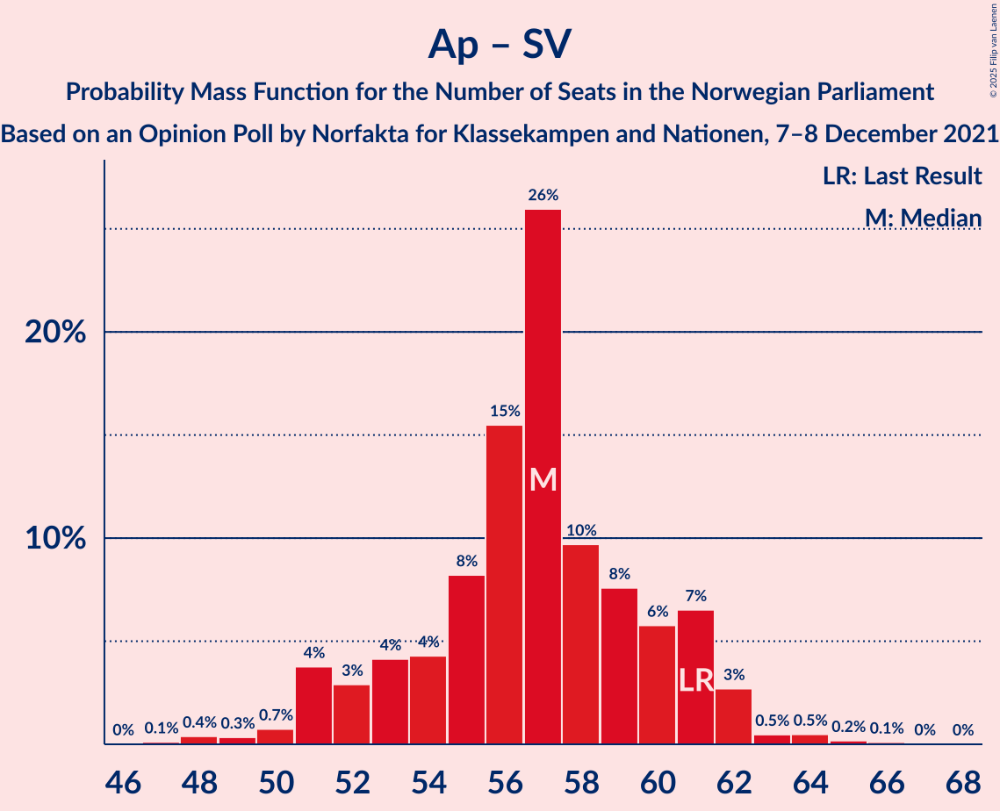

| Number of Seats | Probability | Accumulated | Special Marks |
|:---------------:|:-----------:|:-----------:|:-------------:|
| 47 | 0.1% | 100% |  |
| 48 | 0.4% | 99.9% |  |
| 49 | 0.3% | 99.5% |  |
| 50 | 0.7% | 99.1% |  |
| 51 | 4% | 98% |  |
| 52 | 3% | 95% |  |
| 53 | 4% | 92% |  |
| 54 | 4% | 88% |  |
| 55 | 8% | 83% |  |
| 56 | 15% | 75% |  |
| 57 | 26% | 60% | Median |
| 58 | 10% | 34% |  |
| 59 | 8% | 24% |  |
| 60 | 6% | 16% |  |
| 61 | 7% | 11% | Last Result |
| 62 | 3% | 4% |  |
| 63 | 0.5% | 1.3% |  |
| 64 | 0.5% | 0.8% |  |
| 65 | 0.2% | 0.3% |  |
| 66 | 0.1% | 0.1% |  |
| 67 | 0% | 0% |  |

### Senterpartiet – Venstre – Kristelig Folkeparti

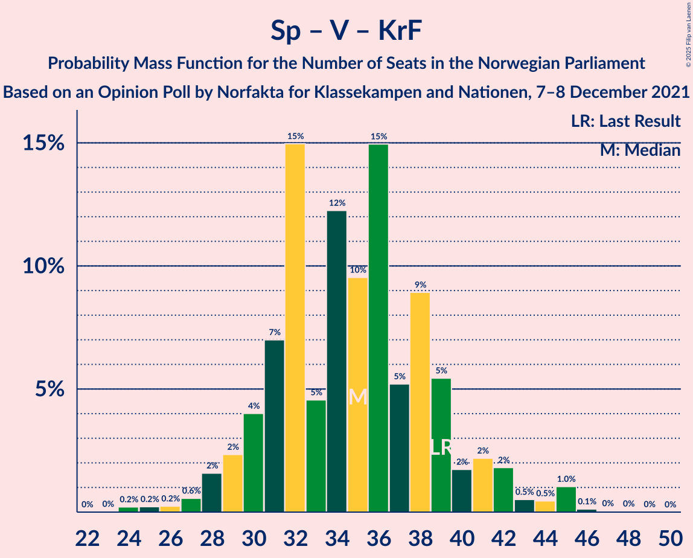

| Number of Seats | Probability | Accumulated | Special Marks |
|:---------------:|:-----------:|:-----------:|:-------------:|
| 24 | 0.2% | 100% |  |
| 25 | 0.2% | 99.8% |  |
| 26 | 0.2% | 99.5% |  |
| 27 | 0.6% | 99.3% |  |
| 28 | 2% | 98.7% |  |
| 29 | 2% | 97% |  |
| 30 | 4% | 95% |  |
| 31 | 7% | 91% |  |
| 32 | 15% | 84% |  |
| 33 | 5% | 69% |  |
| 34 | 12% | 64% | Median |
| 35 | 10% | 52% |  |
| 36 | 15% | 42% |  |
| 37 | 5% | 28% |  |
| 38 | 9% | 22% |  |
| 39 | 5% | 13% | Last Result |
| 40 | 2% | 8% |  |
| 41 | 2% | 6% |  |
| 42 | 2% | 4% |  |
| 43 | 0.5% | 2% |  |
| 44 | 0.5% | 2% |  |
| 45 | 1.0% | 1.3% |  |
| 46 | 0.1% | 0.2% |  |
| 47 | 0% | 0.1% |  |
| 48 | 0% | 0.1% |  |
| 49 | 0% | 0% |  |

## Technical Information

### Opinion Poll

+ **Polling firm:** Norfakta
+ **Commissioner(s):** Klassekampen and Nationen
+ **Fieldwork period:** 7–8 December 2021

### Calculations

+ **Sample size:** 1002
+ **Simulations done:** 1,048,576
+ **Error estimate:** 1.23%

