# Opinion Poll by Opinion Perduco for Avisens Nyhetsbyrå, Dagsavisen and FriFagbevegelse, 3–9 December 2021

<a href="#voting-intentions">Voting Intentions</a> | <a href="#seats">Seats</a> | <a href="#coalitions">Coalitions</a> | <a href="#technical-information">Technical Information</a>

## Voting Intentions

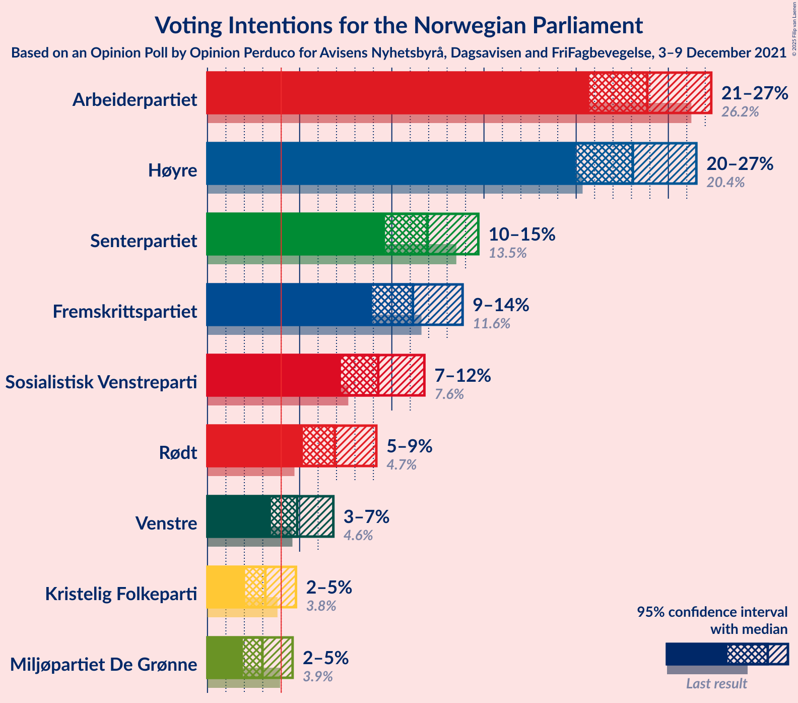

### Confidence Intervals

| Party | Last Result | Poll Result | 80% Confidence Interval | 90% Confidence Interval | 95% Confidence Interval | 99% Confidence Interval |
|:-----:|:-----------:|:-----------:|:-----------------------:|:-----------------------:|:-----------------------:|:-----------------------:|
| Arbeiderpartiet | 26.2% | 23.9% | 21.8–26.1% |21.2–26.8% |20.7–27.3% |19.8–28.4% |
| Høyre | 20.4% | 23.1% | 21.0–25.3% |20.5–26.0% |20.0–26.5% |19.0–27.6% |
| Senterpartiet | 13.5% | 11.9% | 10.4–13.7% |10.0–14.2% |9.6–14.7% |9.0–15.6% |
| Fremskrittspartiet | 11.6% | 11.1% | 9.7–12.9% |9.3–13.4% |8.9–13.8% |8.3–14.7% |
| Sosialistisk Venstreparti | 7.6% | 9.3% | 7.9–10.9% |7.6–11.4% |7.2–11.8% |6.7–12.6% |
| Rødt | 4.7% | 6.9% | 5.8–8.4% |5.5–8.8% |5.2–9.2% |4.7–9.9% |
| Venstre | 4.6% | 4.9% | 3.9–6.1% |3.7–6.5% |3.4–6.8% |3.0–7.5% |
| Kristelig Folkeparti | 3.8% | 3.1% | 2.4–4.2% |2.2–4.5% |2.0–4.8% |1.7–5.4% |
| Miljøpartiet De Grønne | 3.9% | 3.0% | 2.3–4.0% |2.1–4.3% |1.9–4.6% |1.6–5.2% |

*Note:* The poll result column reflects the actual value used in the calculations. Published results may vary slightly, and in addition be rounded to fewer digits.

## Seats

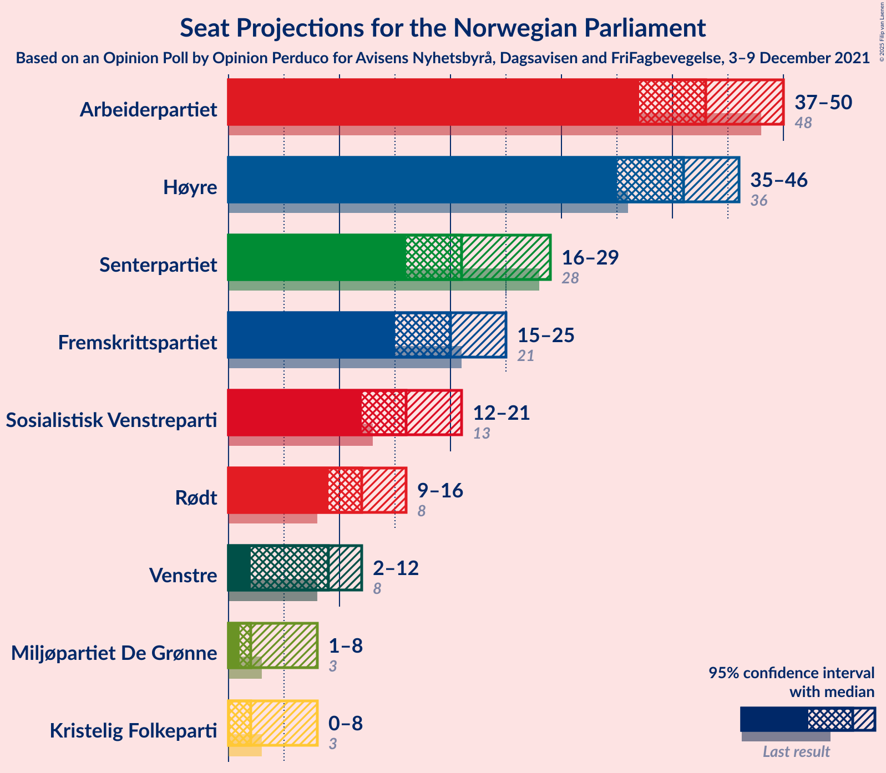

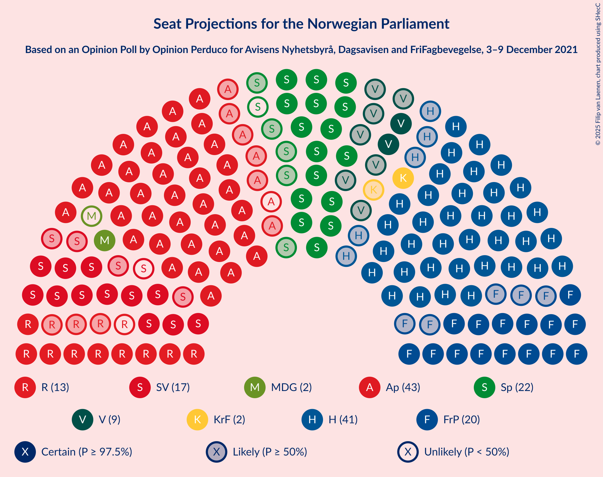

### Confidence Intervals

| Party | Last Result | Median | 80% Confidence Interval | 90% Confidence Interval | 95% Confidence Interval | 99% Confidence Interval |
|:-----:|:-----------:|:------:|:-----------------------:|:-----------------------:|:-----------------------:|:-----------------------:|
| <a href="#arbeiderpartiet">Arbeiderpartiet</a> | 48 | 43 | 39–48 |38–50 |37–50 |36–53 |
| <a href="#høyre">Høyre</a> | 36 | 41 | 37–45 |36–46 |35–46 |33–49 |
| <a href="#senterpartiet">Senterpartiet</a> | 28 | 21 | 18–26 |17–27 |16–29 |15–31 |
| <a href="#fremskrittspartiet">Fremskrittspartiet</a> | 21 | 20 | 17–23 |16–24 |15–25 |14–26 |
| <a href="#sosialistisk-venstreparti">Sosialistisk Venstreparti</a> | 13 | 16 | 14–20 |13–20 |12–21 |11–22 |
| <a href="#rødt">Rødt</a> | 8 | 12 | 10–15 |9–15 |9–16 |8–17 |
| <a href="#venstre">Venstre</a> | 8 | 9 | 3–11 |3–11 |2–12 |2–13 |
| <a href="#kristelig-folkeparti">Kristelig Folkeparti</a> | 3 | 2 | 1–7 |0–8 |0–8 |0–9 |
| <a href="#miljøpartiet-de-grønne">Miljøpartiet De Grønne</a> | 3 | 2 | 1–3 |1–7 |1–8 |1–9 |

### Arbeiderpartiet

*For a full overview of the results for this party, see the [Arbeiderpartiet](party-arbeiderpartiet.html) page.*

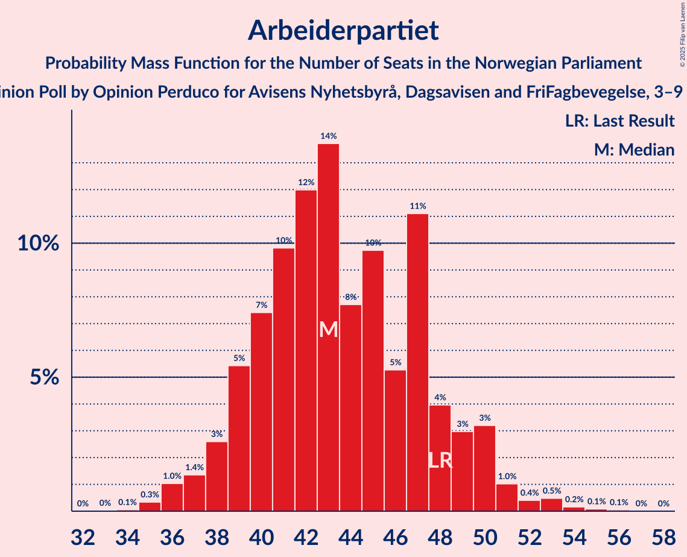

| Number of Seats | Probability | Accumulated | Special Marks |
|:---------------:|:-----------:|:-----------:|:-------------:|
| 34 | 0.1% | 100% |  |
| 35 | 0.3% | 99.9% |  |
| 36 | 1.0% | 99.6% |  |
| 37 | 1.4% | 98.5% |  |
| 38 | 3% | 97% |  |
| 39 | 5% | 95% |  |
| 40 | 7% | 89% |  |
| 41 | 10% | 82% |  |
| 42 | 12% | 72% |  |
| 43 | 14% | 60% | Median |
| 44 | 8% | 46% |  |
| 45 | 10% | 38% |  |
| 46 | 5% | 29% |  |
| 47 | 11% | 23% |  |
| 48 | 4% | 12% | Last Result |
| 49 | 3% | 8% |  |
| 50 | 3% | 5% |  |
| 51 | 1.0% | 2% |  |
| 52 | 0.4% | 1.2% |  |
| 53 | 0.5% | 0.8% |  |
| 54 | 0.2% | 0.3% |  |
| 55 | 0.1% | 0.2% |  |
| 56 | 0.1% | 0.1% |  |
| 57 | 0% | 0% |  |

### Høyre

*For a full overview of the results for this party, see the [Høyre](party-høyre.html) page.*

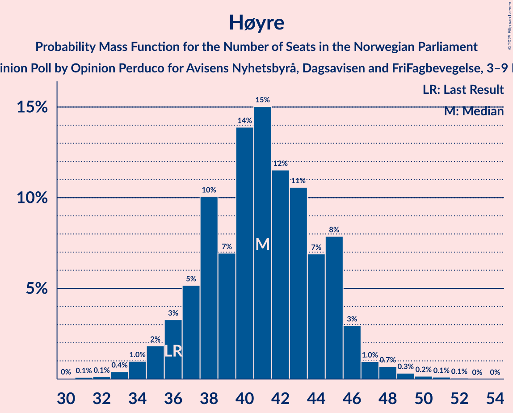

| Number of Seats | Probability | Accumulated | Special Marks |
|:---------------:|:-----------:|:-----------:|:-------------:|
| 31 | 0.1% | 100% |  |
| 32 | 0.1% | 99.9% |  |
| 33 | 0.4% | 99.7% |  |
| 34 | 1.0% | 99.3% |  |
| 35 | 2% | 98% |  |
| 36 | 3% | 97% | Last Result |
| 37 | 5% | 93% |  |
| 38 | 10% | 88% |  |
| 39 | 7% | 78% |  |
| 40 | 14% | 71% |  |
| 41 | 15% | 57% | Median |
| 42 | 12% | 42% |  |
| 43 | 11% | 31% |  |
| 44 | 7% | 20% |  |
| 45 | 8% | 13% |  |
| 46 | 3% | 5% |  |
| 47 | 1.0% | 2% |  |
| 48 | 0.7% | 1.4% |  |
| 49 | 0.3% | 0.7% |  |
| 50 | 0.2% | 0.3% |  |
| 51 | 0.1% | 0.2% |  |
| 52 | 0.1% | 0.1% |  |
| 53 | 0% | 0% |  |

### Senterpartiet

*For a full overview of the results for this party, see the [Senterpartiet](party-senterpartiet.html) page.*

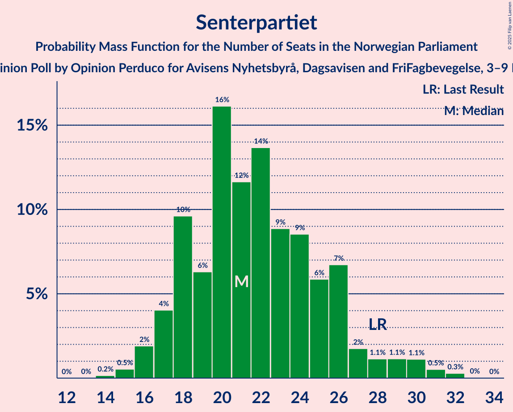

| Number of Seats | Probability | Accumulated | Special Marks |
|:---------------:|:-----------:|:-----------:|:-------------:|
| 14 | 0.2% | 100% |  |
| 15 | 0.5% | 99.8% |  |
| 16 | 2% | 99.3% |  |
| 17 | 4% | 97% |  |
| 18 | 10% | 93% |  |
| 19 | 6% | 84% |  |
| 20 | 16% | 77% |  |
| 21 | 12% | 61% | Median |
| 22 | 14% | 50% |  |
| 23 | 9% | 36% |  |
| 24 | 9% | 27% |  |
| 25 | 6% | 19% |  |
| 26 | 7% | 13% |  |
| 27 | 2% | 6% |  |
| 28 | 1.1% | 4% | Last Result |
| 29 | 1.1% | 3% |  |
| 30 | 1.1% | 2% |  |
| 31 | 0.5% | 0.8% |  |
| 32 | 0.3% | 0.3% |  |
| 33 | 0% | 0% |  |

### Fremskrittspartiet

*For a full overview of the results for this party, see the [Fremskrittspartiet](party-fremskrittspartiet.html) page.*

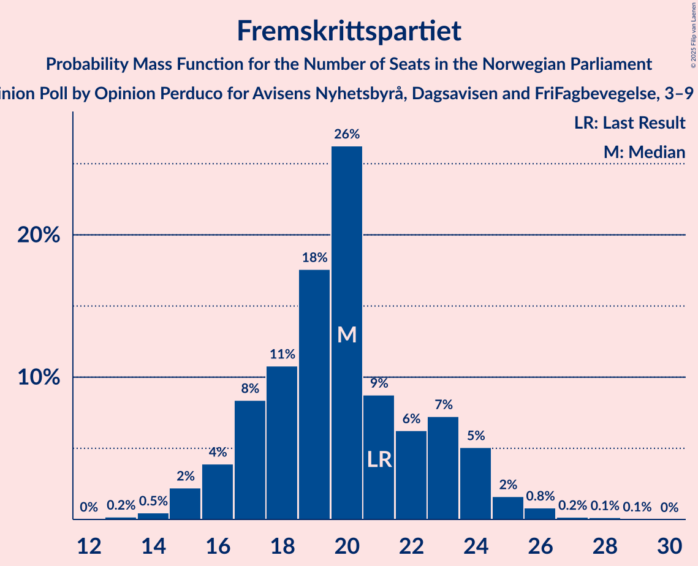

| Number of Seats | Probability | Accumulated | Special Marks |
|:---------------:|:-----------:|:-----------:|:-------------:|
| 12 | 0% | 100% |  |
| 13 | 0.2% | 99.9% |  |
| 14 | 0.5% | 99.8% |  |
| 15 | 2% | 99.3% |  |
| 16 | 4% | 97% |  |
| 17 | 8% | 93% |  |
| 18 | 11% | 85% |  |
| 19 | 18% | 74% |  |
| 20 | 26% | 56% | Median |
| 21 | 9% | 30% | Last Result |
| 22 | 6% | 21% |  |
| 23 | 7% | 15% |  |
| 24 | 5% | 8% |  |
| 25 | 2% | 3% |  |
| 26 | 0.8% | 1.2% |  |
| 27 | 0.2% | 0.4% |  |
| 28 | 0.1% | 0.2% |  |
| 29 | 0.1% | 0.1% |  |
| 30 | 0% | 0% |  |

### Sosialistisk Venstreparti

*For a full overview of the results for this party, see the [Sosialistisk Venstreparti](party-sosialistiskvenstreparti.html) page.*

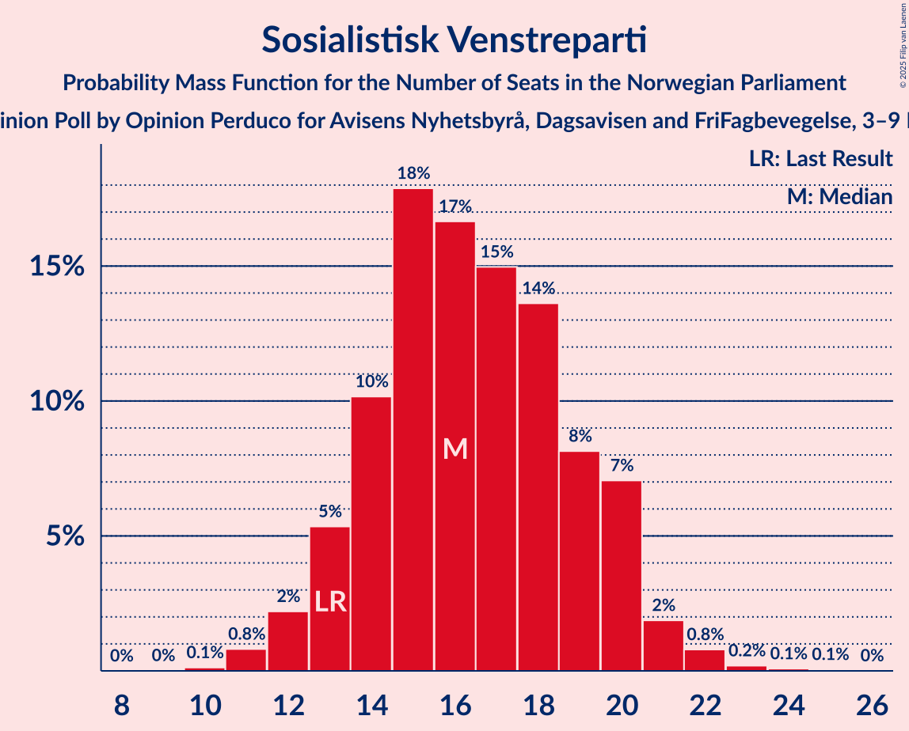

| Number of Seats | Probability | Accumulated | Special Marks |
|:---------------:|:-----------:|:-----------:|:-------------:|
| 10 | 0.1% | 100% |  |
| 11 | 0.8% | 99.9% |  |
| 12 | 2% | 99.1% |  |
| 13 | 5% | 97% | Last Result |
| 14 | 10% | 91% |  |
| 15 | 18% | 81% |  |
| 16 | 17% | 63% | Median |
| 17 | 15% | 47% |  |
| 18 | 14% | 32% |  |
| 19 | 8% | 18% |  |
| 20 | 7% | 10% |  |
| 21 | 2% | 3% |  |
| 22 | 0.8% | 1.1% |  |
| 23 | 0.2% | 0.3% |  |
| 24 | 0.1% | 0.2% |  |
| 25 | 0.1% | 0.1% |  |
| 26 | 0% | 0% |  |

### Rødt

*For a full overview of the results for this party, see the [Rødt](party-rødt.html) page.*

| Number of Seats | Probability | Accumulated | Special Marks |
|:---------------:|:-----------:|:-----------:|:-------------:|
| 7 | 0.1% | 100% |  |
| 8 | 1.1% | 99.9% | Last Result |
| 9 | 4% | 98.8% |  |
| 10 | 13% | 95% |  |
| 11 | 19% | 82% |  |
| 12 | 19% | 63% | Median |
| 13 | 17% | 45% |  |
| 14 | 14% | 28% |  |
| 15 | 9% | 13% |  |
| 16 | 2% | 4% |  |
| 17 | 2% | 2% |  |
| 18 | 0.3% | 0.4% |  |
| 19 | 0.1% | 0.1% |  |
| 20 | 0% | 0% |  |

### Venstre

*For a full overview of the results for this party, see the [Venstre](party-venstre.html) page.*

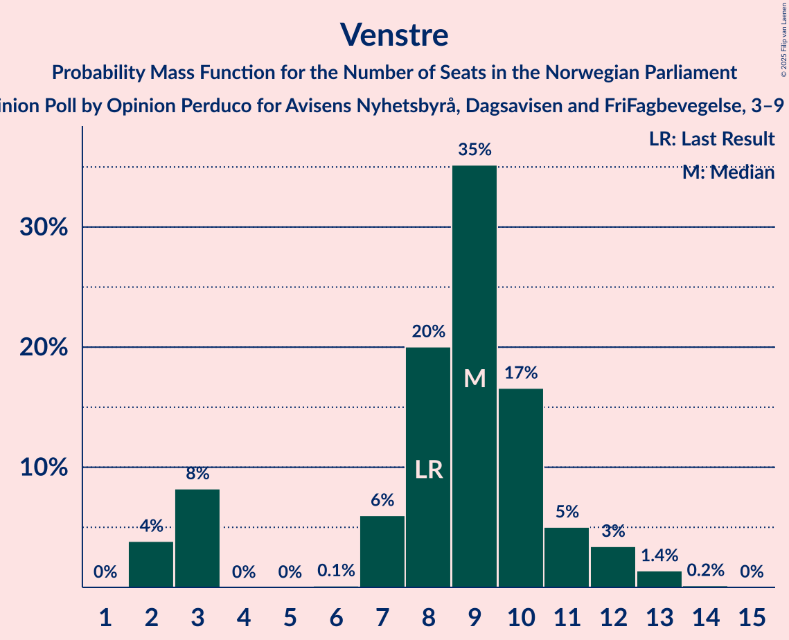

| Number of Seats | Probability | Accumulated | Special Marks |
|:---------------:|:-----------:|:-----------:|:-------------:|
| 2 | 4% | 100% |  |
| 3 | 8% | 96% |  |
| 4 | 0% | 88% |  |
| 5 | 0% | 88% |  |
| 6 | 0.1% | 88% |  |
| 7 | 6% | 88% |  |
| 8 | 20% | 82% | Last Result |
| 9 | 35% | 62% | Median |
| 10 | 17% | 27% |  |
| 11 | 5% | 10% |  |
| 12 | 3% | 5% |  |
| 13 | 1.4% | 2% |  |
| 14 | 0.2% | 0.2% |  |
| 15 | 0% | 0% |  |

### Kristelig Folkeparti

*For a full overview of the results for this party, see the [Kristelig Folkeparti](party-kristeligfolkeparti.html) page.*

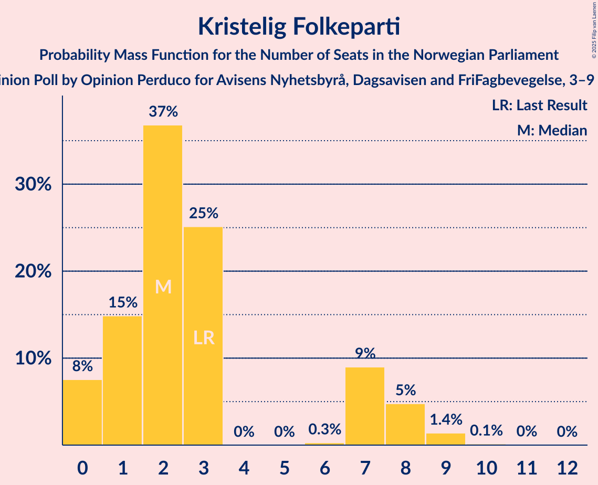

| Number of Seats | Probability | Accumulated | Special Marks |
|:---------------:|:-----------:|:-----------:|:-------------:|
| 0 | 8% | 100% |  |
| 1 | 15% | 92% |  |
| 2 | 37% | 78% | Median |
| 3 | 25% | 41% | Last Result |
| 4 | 0% | 16% |  |
| 5 | 0% | 16% |  |
| 6 | 0.3% | 16% |  |
| 7 | 9% | 15% |  |
| 8 | 5% | 6% |  |
| 9 | 1.4% | 2% |  |
| 10 | 0.1% | 0.2% |  |
| 11 | 0% | 0.1% |  |
| 12 | 0% | 0% |  |

### Miljøpartiet De Grønne

*For a full overview of the results for this party, see the [Miljøpartiet De Grønne](party-miljøpartietdegrønne.html) page.*

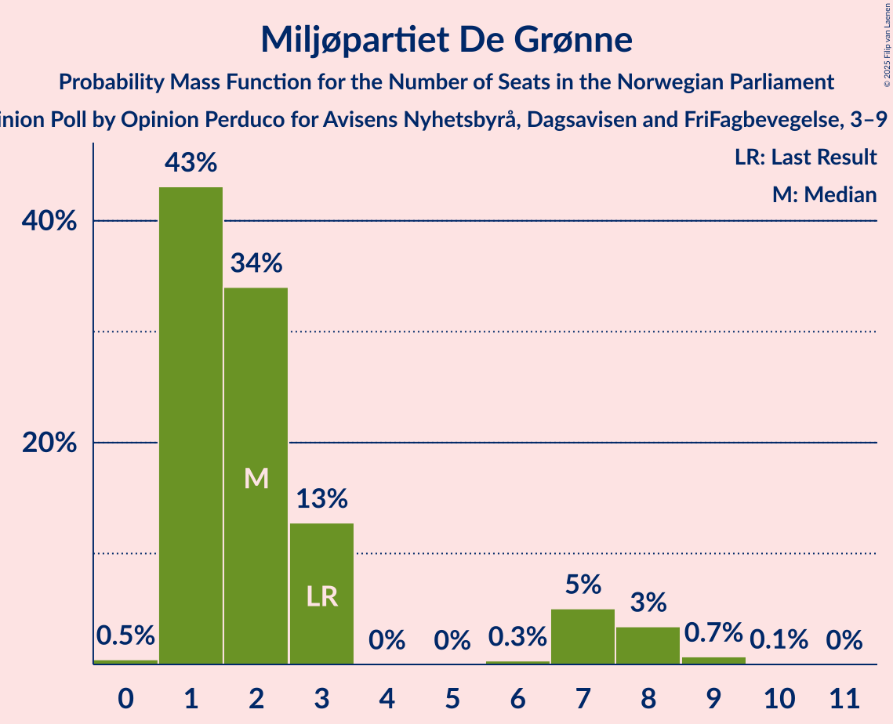

| Number of Seats | Probability | Accumulated | Special Marks |
|:---------------:|:-----------:|:-----------:|:-------------:|
| 0 | 0.5% | 100% |  |
| 1 | 43% | 99.5% |  |
| 2 | 34% | 56% | Median |
| 3 | 13% | 22% | Last Result |
| 4 | 0% | 10% |  |
| 5 | 0% | 10% |  |
| 6 | 0.3% | 10% |  |
| 7 | 5% | 9% |  |
| 8 | 3% | 4% |  |
| 9 | 0.7% | 0.8% |  |
| 10 | 0.1% | 0.1% |  |
| 11 | 0% | 0% |  |

## Coalitions

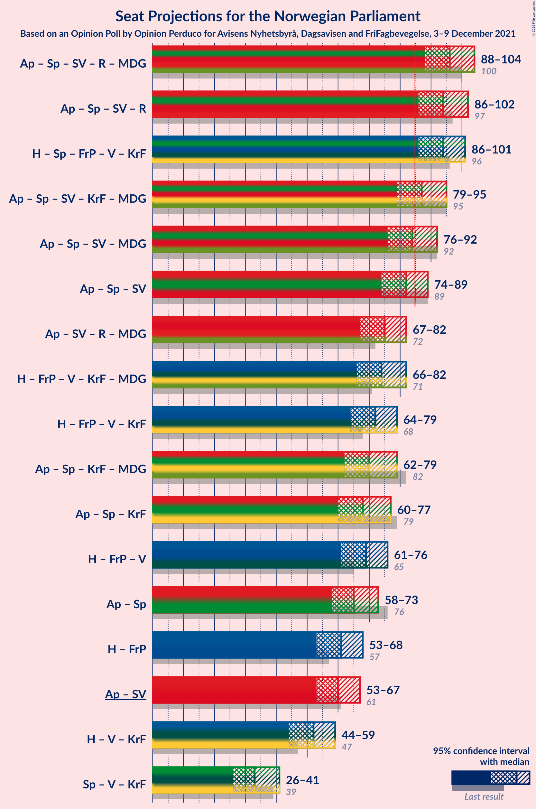

### Confidence Intervals

| Coalition | Last Result | Median | Majority? | 80% Confidence Interval | 90% Confidence Interval | 95% Confidence Interval | 99% Confidence Interval |
|:---------:|:-----------:|:------:|:---------:|:-----------------------:|:-----------------------:|:-----------------------:|:-----------------------:|
| Arbeiderpartiet – Senterpartiet – Sosialistisk Venstreparti – Rødt – Miljøpartiet De Grønne | 100 | 96 | 99.8% | 91–101 | 90–103 | 88–104 | 86–107 |
| Arbeiderpartiet – Senterpartiet – Sosialistisk Venstreparti – Rødt | 97 | 94 | 98.9% | 89–99 | 87–100 | 86–102 | 84–105 |
| Høyre – Senterpartiet – Fremskrittspartiet – Venstre – Kristelig Folkeparti | 96 | 94 | 98.8% | 89–98 | 87–100 | 86–101 | 83–104 |
| Arbeiderpartiet – Senterpartiet – Sosialistisk Venstreparti – Kristelig Folkeparti – Miljøpartiet De Grønne | 95 | 87 | 72% | 82–92 | 81–94 | 79–95 | 76–98 |
| Arbeiderpartiet – Senterpartiet – Sosialistisk Venstreparti – Miljøpartiet De Grønne | 92 | 84 | 46% | 79–89 | 78–90 | 76–92 | 74–95 |
| Arbeiderpartiet – Senterpartiet – Sosialistisk Venstreparti | 89 | 82 | 21% | 77–87 | 76–88 | 74–89 | 72–92 |
| Arbeiderpartiet – Sosialistisk Venstreparti – Rødt – Miljøpartiet De Grønne | 72 | 75 | 0.7% | 70–79 | 68–81 | 67–82 | 64–85 |
| Høyre – Fremskrittspartiet – Venstre – Kristelig Folkeparti – Miljøpartiet De Grønne | 71 | 74 | 0.3% | 69–79 | 68–81 | 66–82 | 64–84 |
| Høyre – Fremskrittspartiet – Venstre – Kristelig Folkeparti | 68 | 72 | 0.1% | 67–77 | 65–78 | 64–79 | 61–82 |
| Arbeiderpartiet – Senterpartiet – Kristelig Folkeparti – Miljøpartiet De Grønne | 82 | 70 | 0.2% | 65–76 | 63–78 | 62–79 | 60–83 |
| Arbeiderpartiet – Senterpartiet – Kristelig Folkeparti | 79 | 68 | 0% | 62–73 | 62–75 | 60–77 | 58–80 |
| Høyre – Fremskrittspartiet – Venstre | 65 | 69 | 0% | 64–74 | 62–75 | 61–76 | 58–79 |
| Arbeiderpartiet – Senterpartiet | 76 | 65 | 0% | 60–70 | 59–72 | 58–73 | 56–76 |
| Høyre – Fremskrittspartiet | 57 | 61 | 0% | 56–65 | 55–67 | 53–68 | 51–70 |
| Arbeiderpartiet – Sosialistisk Venstreparti | 61 | 60 | 0% | 56–64 | 54–66 | 53–67 | 50–69 |
| Høyre – Venstre – Kristelig Folkeparti | 47 | 52 | 0% | 47–57 | 46–58 | 44–59 | 42–62 |
| Senterpartiet – Venstre – Kristelig Folkeparti | 39 | 33 | 0% | 28–38 | 27–39 | 26–41 | 24–44 |

### Arbeiderpartiet – Senterpartiet – Sosialistisk Venstreparti – Rødt – Miljøpartiet De Grønne

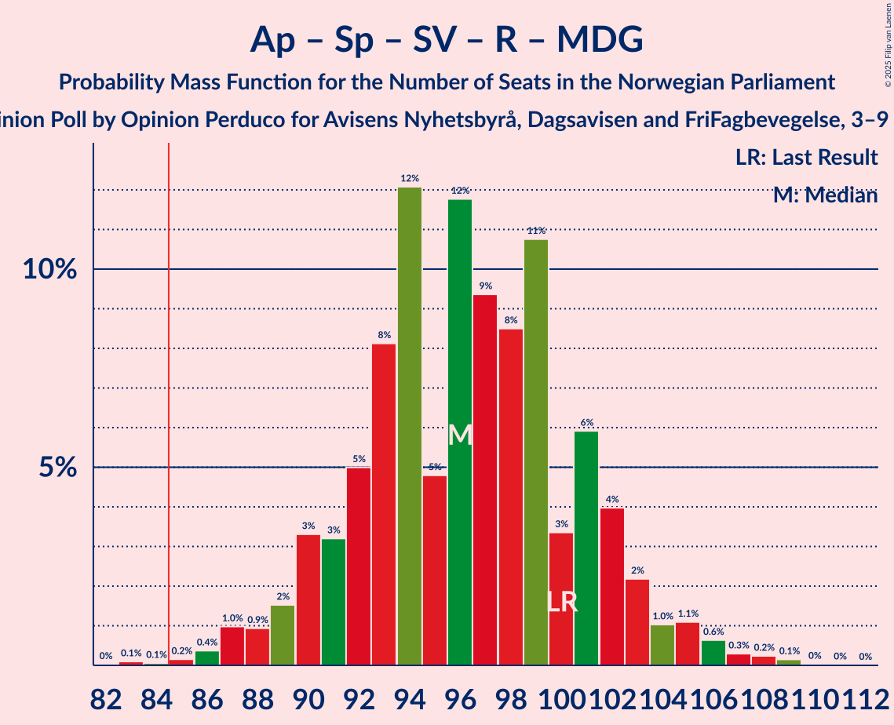

| Number of Seats | Probability | Accumulated | Special Marks |
|:---------------:|:-----------:|:-----------:|:-------------:|
| 83 | 0.1% | 100% |  |
| 84 | 0.1% | 99.9% |  |
| 85 | 0.2% | 99.8% | Majority |
| 86 | 0.4% | 99.7% |  |
| 87 | 1.0% | 99.3% |  |
| 88 | 0.9% | 98% |  |
| 89 | 2% | 97% |  |
| 90 | 3% | 96% |  |
| 91 | 3% | 93% |  |
| 92 | 5% | 89% |  |
| 93 | 8% | 84% |  |
| 94 | 12% | 76% | Median |
| 95 | 5% | 64% |  |
| 96 | 12% | 59% |  |
| 97 | 9% | 48% |  |
| 98 | 8% | 38% |  |
| 99 | 11% | 30% |  |
| 100 | 3% | 19% | Last Result |
| 101 | 6% | 16% |  |
| 102 | 4% | 10% |  |
| 103 | 2% | 6% |  |
| 104 | 1.0% | 4% |  |
| 105 | 1.1% | 2% |  |
| 106 | 0.6% | 1.4% |  |
| 107 | 0.3% | 0.7% |  |
| 108 | 0.2% | 0.5% |  |
| 109 | 0.1% | 0.2% |  |
| 110 | 0% | 0.1% |  |
| 111 | 0% | 0% |  |

### Arbeiderpartiet – Senterpartiet – Sosialistisk Venstreparti – Rødt

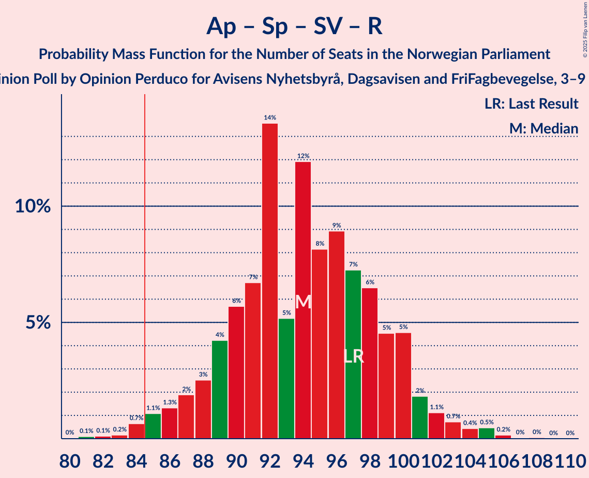

| Number of Seats | Probability | Accumulated | Special Marks |
|:---------------:|:-----------:|:-----------:|:-------------:|
| 81 | 0.1% | 100% |  |
| 82 | 0.1% | 99.9% |  |
| 83 | 0.2% | 99.7% |  |
| 84 | 0.7% | 99.6% |  |
| 85 | 1.1% | 98.9% | Majority |
| 86 | 1.3% | 98% |  |
| 87 | 2% | 97% |  |
| 88 | 3% | 95% |  |
| 89 | 4% | 92% |  |
| 90 | 6% | 88% |  |
| 91 | 7% | 82% |  |
| 92 | 14% | 75% | Median |
| 93 | 5% | 62% |  |
| 94 | 12% | 57% |  |
| 95 | 8% | 45% |  |
| 96 | 9% | 37% |  |
| 97 | 7% | 28% | Last Result |
| 98 | 6% | 20% |  |
| 99 | 5% | 14% |  |
| 100 | 5% | 9% |  |
| 101 | 2% | 5% |  |
| 102 | 1.1% | 3% |  |
| 103 | 0.7% | 2% |  |
| 104 | 0.4% | 1.2% |  |
| 105 | 0.5% | 0.7% |  |
| 106 | 0.2% | 0.3% |  |
| 107 | 0% | 0.1% |  |
| 108 | 0% | 0.1% |  |
| 109 | 0% | 0% |  |

### Høyre – Senterpartiet – Fremskrittspartiet – Venstre – Kristelig Folkeparti

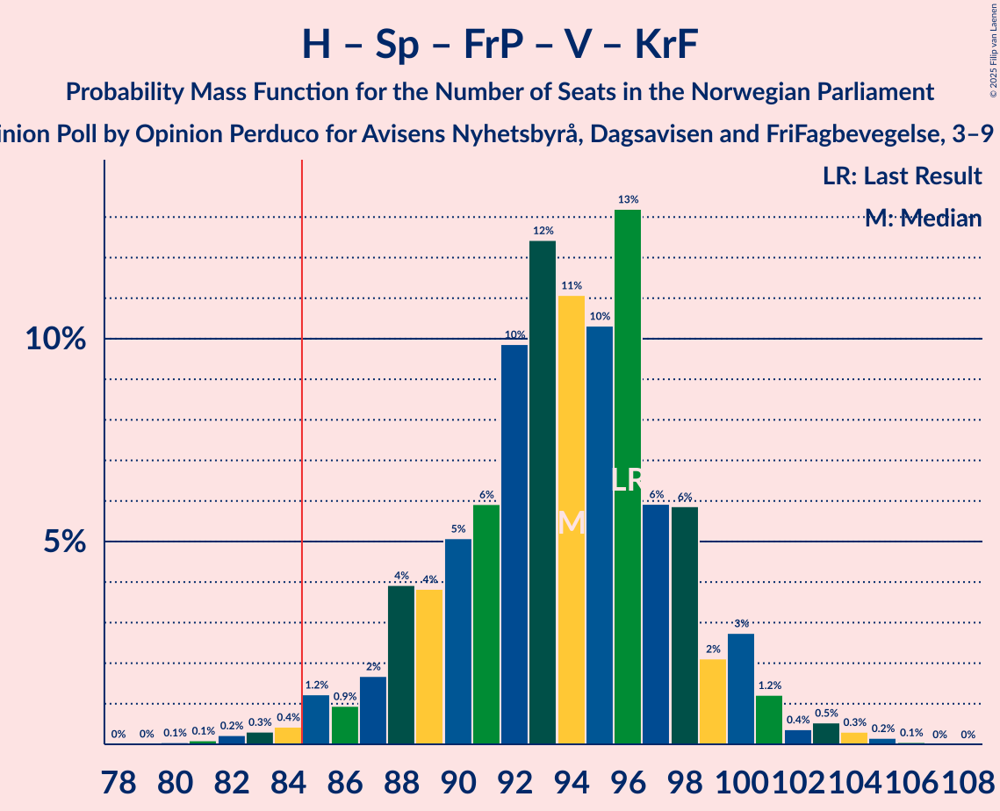

| Number of Seats | Probability | Accumulated | Special Marks |
|:---------------:|:-----------:|:-----------:|:-------------:|
| 79 | 0% | 100% |  |
| 80 | 0.1% | 99.9% |  |
| 81 | 0.1% | 99.9% |  |
| 82 | 0.2% | 99.8% |  |
| 83 | 0.3% | 99.6% |  |
| 84 | 0.4% | 99.3% |  |
| 85 | 1.2% | 98.8% | Majority |
| 86 | 0.9% | 98% |  |
| 87 | 2% | 97% |  |
| 88 | 4% | 95% |  |
| 89 | 4% | 91% |  |
| 90 | 5% | 87% |  |
| 91 | 6% | 82% |  |
| 92 | 10% | 76% |  |
| 93 | 12% | 66% | Median |
| 94 | 11% | 54% |  |
| 95 | 10% | 43% |  |
| 96 | 13% | 33% | Last Result |
| 97 | 6% | 19% |  |
| 98 | 6% | 13% |  |
| 99 | 2% | 8% |  |
| 100 | 3% | 5% |  |
| 101 | 1.2% | 3% |  |
| 102 | 0.4% | 1.4% |  |
| 103 | 0.5% | 1.1% |  |
| 104 | 0.3% | 0.5% |  |
| 105 | 0.2% | 0.2% |  |
| 106 | 0.1% | 0.1% |  |
| 107 | 0% | 0% |  |

### Arbeiderpartiet – Senterpartiet – Sosialistisk Venstreparti – Kristelig Folkeparti – Miljøpartiet De Grønne

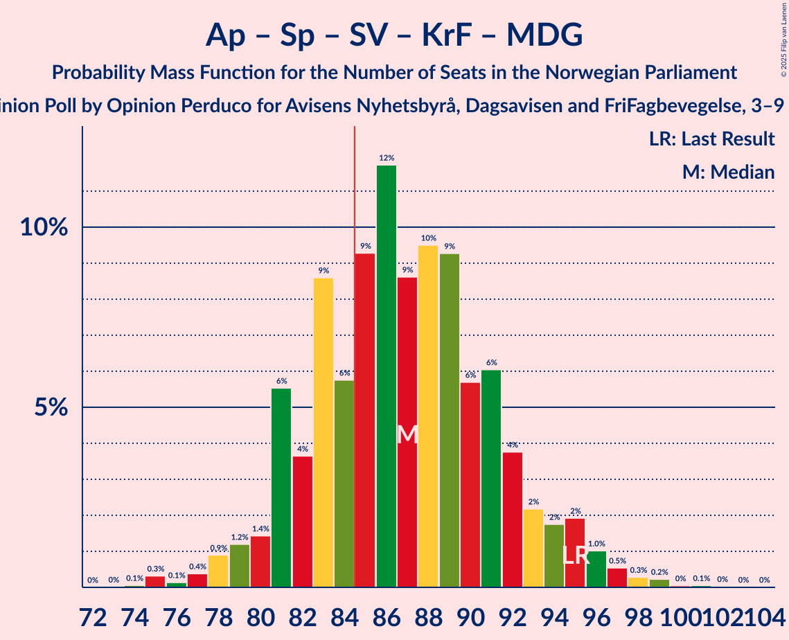

| Number of Seats | Probability | Accumulated | Special Marks |
|:---------------:|:-----------:|:-----------:|:-------------:|
| 74 | 0.1% | 100% |  |
| 75 | 0.3% | 99.9% |  |
| 76 | 0.1% | 99.6% |  |
| 77 | 0.4% | 99.5% |  |
| 78 | 0.9% | 99.1% |  |
| 79 | 1.2% | 98% |  |
| 80 | 1.4% | 97% |  |
| 81 | 6% | 96% |  |
| 82 | 4% | 90% |  |
| 83 | 9% | 86% |  |
| 84 | 6% | 78% | Median |
| 85 | 9% | 72% | Majority |
| 86 | 12% | 63% |  |
| 87 | 9% | 51% |  |
| 88 | 10% | 42% |  |
| 89 | 9% | 33% |  |
| 90 | 6% | 24% |  |
| 91 | 6% | 18% |  |
| 92 | 4% | 12% |  |
| 93 | 2% | 8% |  |
| 94 | 2% | 6% |  |
| 95 | 2% | 4% | Last Result |
| 96 | 1.0% | 2% |  |
| 97 | 0.5% | 1.2% |  |
| 98 | 0.3% | 0.7% |  |
| 99 | 0.2% | 0.4% |  |
| 100 | 0% | 0.2% |  |
| 101 | 0.1% | 0.1% |  |
| 102 | 0% | 0.1% |  |
| 103 | 0% | 0% |  |

### Arbeiderpartiet – Senterpartiet – Sosialistisk Venstreparti – Miljøpartiet De Grønne

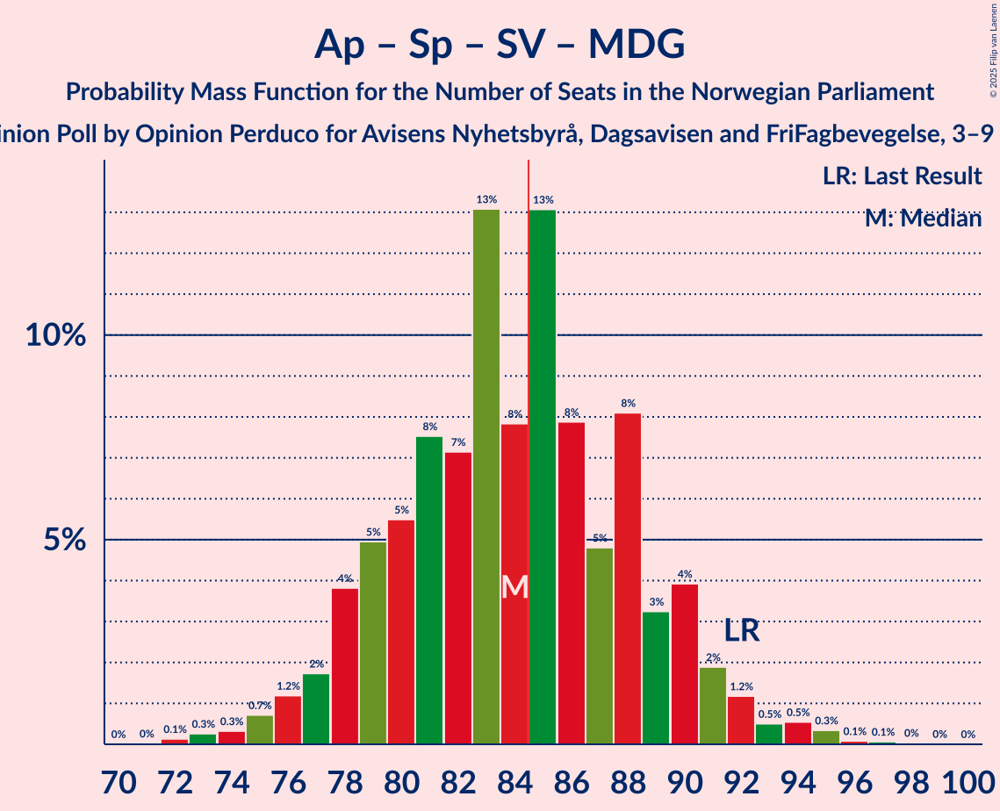

| Number of Seats | Probability | Accumulated | Special Marks |
|:---------------:|:-----------:|:-----------:|:-------------:|
| 72 | 0.1% | 100% |  |
| 73 | 0.3% | 99.8% |  |
| 74 | 0.3% | 99.6% |  |
| 75 | 0.7% | 99.2% |  |
| 76 | 1.2% | 98.5% |  |
| 77 | 2% | 97% |  |
| 78 | 4% | 96% |  |
| 79 | 5% | 92% |  |
| 80 | 5% | 87% |  |
| 81 | 8% | 81% |  |
| 82 | 7% | 74% | Median |
| 83 | 13% | 67% |  |
| 84 | 8% | 54% |  |
| 85 | 13% | 46% | Majority |
| 86 | 8% | 33% |  |
| 87 | 5% | 25% |  |
| 88 | 8% | 20% |  |
| 89 | 3% | 12% |  |
| 90 | 4% | 9% |  |
| 91 | 2% | 5% |  |
| 92 | 1.2% | 3% | Last Result |
| 93 | 0.5% | 2% |  |
| 94 | 0.5% | 1.1% |  |
| 95 | 0.3% | 0.6% |  |
| 96 | 0.1% | 0.2% |  |
| 97 | 0.1% | 0.1% |  |
| 98 | 0% | 0.1% |  |
| 99 | 0% | 0% |  |

### Arbeiderpartiet – Senterpartiet – Sosialistisk Venstreparti

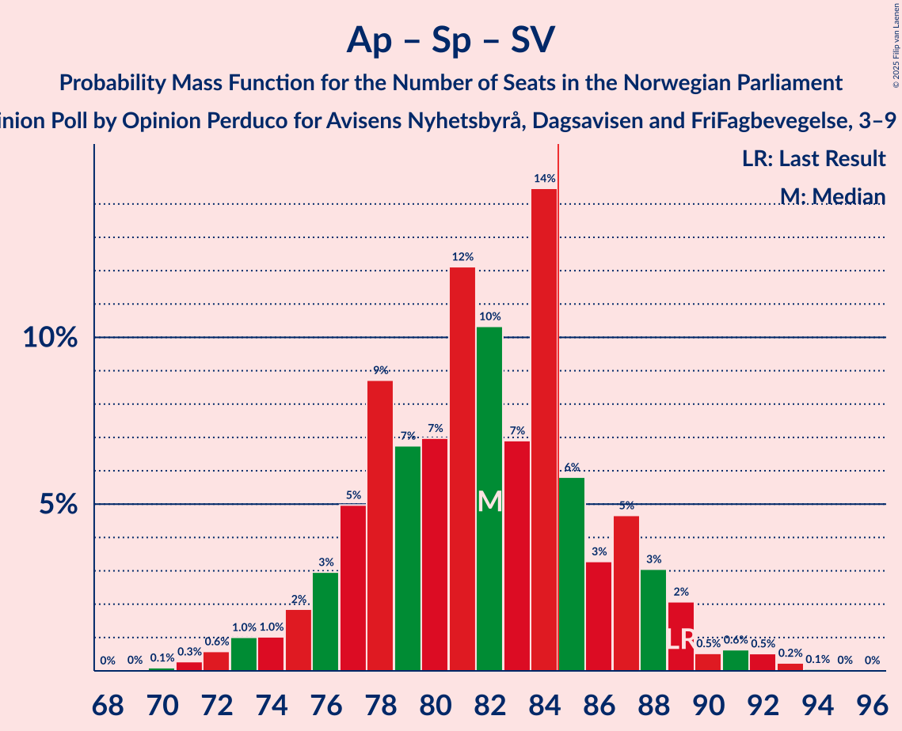

| Number of Seats | Probability | Accumulated | Special Marks |
|:---------------:|:-----------:|:-----------:|:-------------:|
| 70 | 0.1% | 100% |  |
| 71 | 0.3% | 99.9% |  |
| 72 | 0.6% | 99.6% |  |
| 73 | 1.0% | 99.0% |  |
| 74 | 1.0% | 98% |  |
| 75 | 2% | 97% |  |
| 76 | 3% | 95% |  |
| 77 | 5% | 92% |  |
| 78 | 9% | 87% |  |
| 79 | 7% | 78% |  |
| 80 | 7% | 72% | Median |
| 81 | 12% | 65% |  |
| 82 | 10% | 53% |  |
| 83 | 7% | 42% |  |
| 84 | 14% | 35% |  |
| 85 | 6% | 21% | Majority |
| 86 | 3% | 15% |  |
| 87 | 5% | 12% |  |
| 88 | 3% | 7% |  |
| 89 | 2% | 4% | Last Result |
| 90 | 0.5% | 2% |  |
| 91 | 0.6% | 2% |  |
| 92 | 0.5% | 0.9% |  |
| 93 | 0.2% | 0.3% |  |
| 94 | 0.1% | 0.1% |  |
| 95 | 0% | 0.1% |  |
| 96 | 0% | 0% |  |

### Arbeiderpartiet – Sosialistisk Venstreparti – Rødt – Miljøpartiet De Grønne

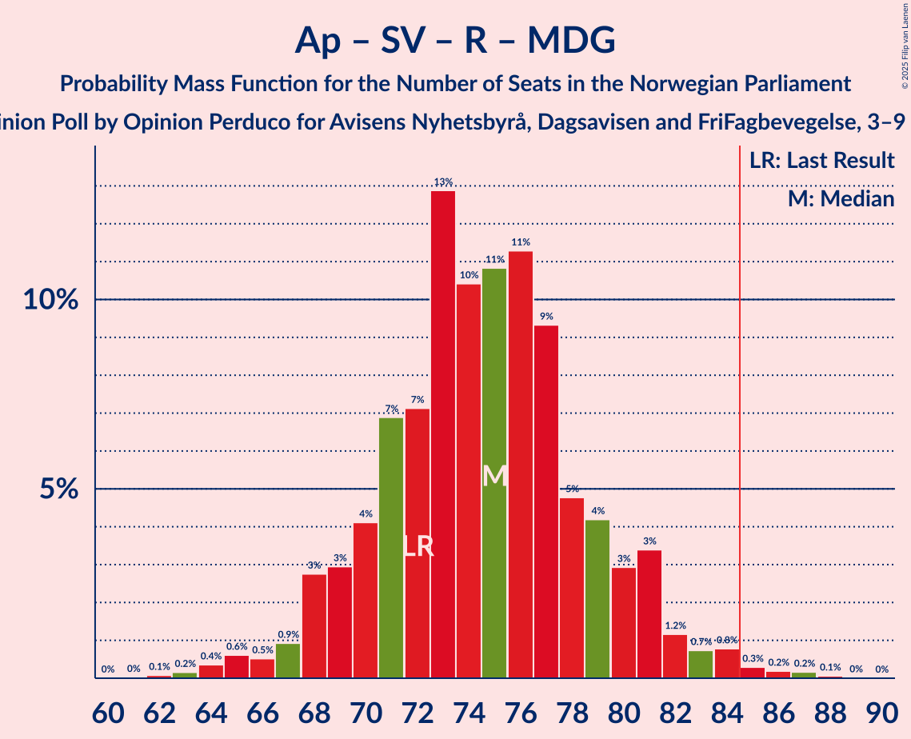

| Number of Seats | Probability | Accumulated | Special Marks |
|:---------------:|:-----------:|:-----------:|:-------------:|
| 62 | 0.1% | 100% |  |
| 63 | 0.2% | 99.9% |  |
| 64 | 0.4% | 99.7% |  |
| 65 | 0.6% | 99.4% |  |
| 66 | 0.5% | 98.8% |  |
| 67 | 0.9% | 98% |  |
| 68 | 3% | 97% |  |
| 69 | 3% | 95% |  |
| 70 | 4% | 92% |  |
| 71 | 7% | 87% |  |
| 72 | 7% | 81% | Last Result |
| 73 | 13% | 73% | Median |
| 74 | 10% | 61% |  |
| 75 | 11% | 50% |  |
| 76 | 11% | 39% |  |
| 77 | 9% | 28% |  |
| 78 | 5% | 19% |  |
| 79 | 4% | 14% |  |
| 80 | 3% | 10% |  |
| 81 | 3% | 7% |  |
| 82 | 1.2% | 3% |  |
| 83 | 0.7% | 2% |  |
| 84 | 0.8% | 2% |  |
| 85 | 0.3% | 0.7% | Majority |
| 86 | 0.2% | 0.5% |  |
| 87 | 0.2% | 0.3% |  |
| 88 | 0.1% | 0.1% |  |
| 89 | 0% | 0% |  |

### Høyre – Fremskrittspartiet – Venstre – Kristelig Folkeparti – Miljøpartiet De Grønne

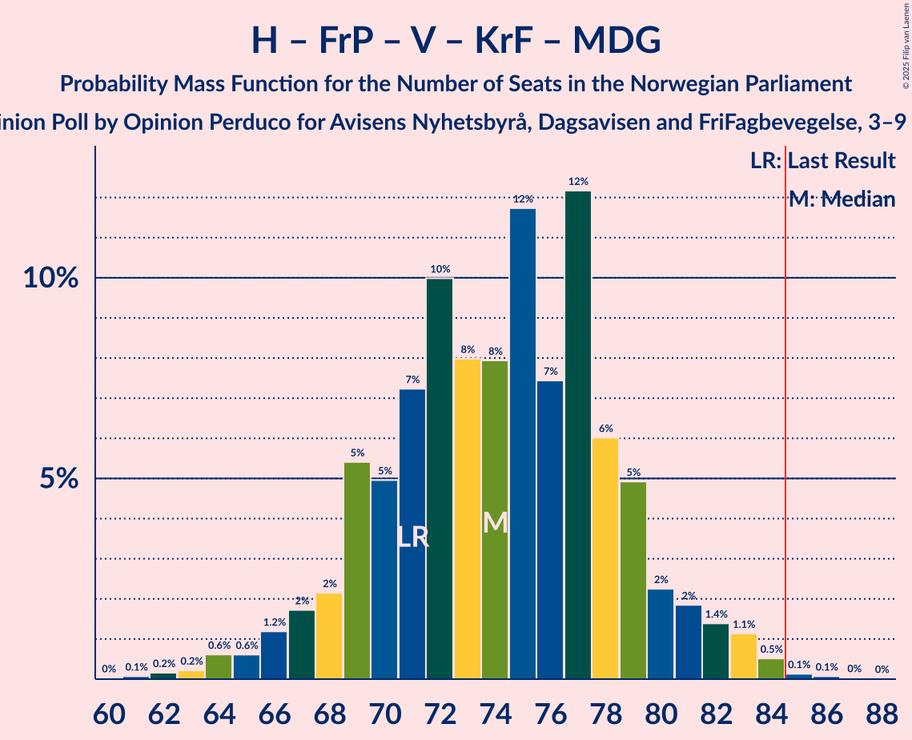

| Number of Seats | Probability | Accumulated | Special Marks |
|:---------------:|:-----------:|:-----------:|:-------------:|
| 61 | 0.1% | 100% |  |
| 62 | 0.2% | 99.9% |  |
| 63 | 0.2% | 99.7% |  |
| 64 | 0.6% | 99.5% |  |
| 65 | 0.6% | 98.9% |  |
| 66 | 1.2% | 98% |  |
| 67 | 2% | 97% |  |
| 68 | 2% | 95% |  |
| 69 | 5% | 93% |  |
| 70 | 5% | 88% |  |
| 71 | 7% | 83% | Last Result |
| 72 | 10% | 76% |  |
| 73 | 8% | 66% |  |
| 74 | 8% | 58% | Median |
| 75 | 12% | 50% |  |
| 76 | 7% | 38% |  |
| 77 | 12% | 31% |  |
| 78 | 6% | 18% |  |
| 79 | 5% | 12% |  |
| 80 | 2% | 7% |  |
| 81 | 2% | 5% |  |
| 82 | 1.4% | 3% |  |
| 83 | 1.1% | 2% |  |
| 84 | 0.5% | 0.8% |  |
| 85 | 0.1% | 0.3% | Majority |
| 86 | 0.1% | 0.1% |  |
| 87 | 0% | 0.1% |  |
| 88 | 0% | 0% |  |

### Høyre – Fremskrittspartiet – Venstre – Kristelig Folkeparti

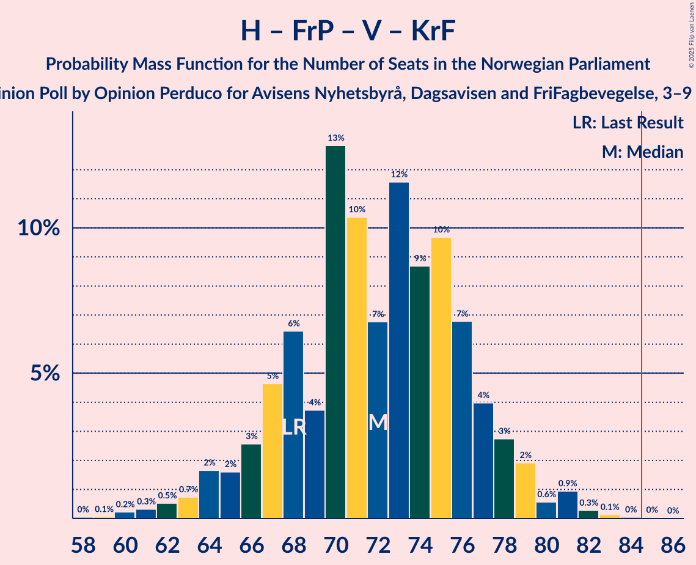

| Number of Seats | Probability | Accumulated | Special Marks |
|:---------------:|:-----------:|:-----------:|:-------------:|
| 58 | 0% | 100% |  |
| 59 | 0.1% | 99.9% |  |
| 60 | 0.2% | 99.9% |  |
| 61 | 0.3% | 99.6% |  |
| 62 | 0.5% | 99.3% |  |
| 63 | 0.7% | 98.8% |  |
| 64 | 2% | 98% |  |
| 65 | 2% | 96% |  |
| 66 | 3% | 95% |  |
| 67 | 5% | 92% |  |
| 68 | 6% | 88% | Last Result |
| 69 | 4% | 81% |  |
| 70 | 13% | 77% |  |
| 71 | 10% | 65% |  |
| 72 | 7% | 54% | Median |
| 73 | 12% | 47% |  |
| 74 | 9% | 36% |  |
| 75 | 10% | 27% |  |
| 76 | 7% | 17% |  |
| 77 | 4% | 11% |  |
| 78 | 3% | 7% |  |
| 79 | 2% | 4% |  |
| 80 | 0.6% | 2% |  |
| 81 | 0.9% | 1.5% |  |
| 82 | 0.3% | 0.5% |  |
| 83 | 0.1% | 0.2% |  |
| 84 | 0% | 0.1% |  |
| 85 | 0% | 0.1% | Majority |
| 86 | 0% | 0% |  |

### Arbeiderpartiet – Senterpartiet – Kristelig Folkeparti – Miljøpartiet De Grønne

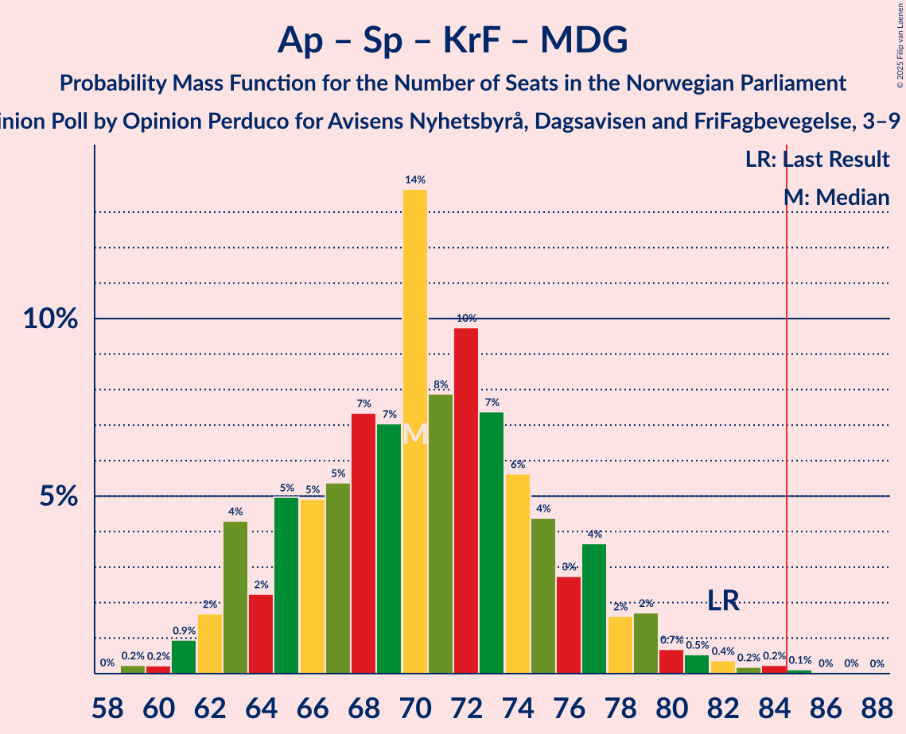

| Number of Seats | Probability | Accumulated | Special Marks |
|:---------------:|:-----------:|:-----------:|:-------------:|
| 58 | 0% | 100% |  |
| 59 | 0.2% | 99.9% |  |
| 60 | 0.2% | 99.7% |  |
| 61 | 0.9% | 99.5% |  |
| 62 | 2% | 98.5% |  |
| 63 | 4% | 97% |  |
| 64 | 2% | 93% |  |
| 65 | 5% | 90% |  |
| 66 | 5% | 85% |  |
| 67 | 5% | 80% |  |
| 68 | 7% | 75% | Median |
| 69 | 7% | 68% |  |
| 70 | 14% | 61% |  |
| 71 | 8% | 47% |  |
| 72 | 10% | 39% |  |
| 73 | 7% | 29% |  |
| 74 | 6% | 22% |  |
| 75 | 4% | 16% |  |
| 76 | 3% | 12% |  |
| 77 | 4% | 9% |  |
| 78 | 2% | 6% |  |
| 79 | 2% | 4% |  |
| 80 | 0.7% | 2% |  |
| 81 | 0.5% | 2% |  |
| 82 | 0.4% | 1.0% | Last Result |
| 83 | 0.2% | 0.6% |  |
| 84 | 0.2% | 0.4% |  |
| 85 | 0.1% | 0.2% | Majority |
| 86 | 0% | 0.1% |  |
| 87 | 0% | 0.1% |  |
| 88 | 0% | 0% |  |

### Arbeiderpartiet – Senterpartiet – Kristelig Folkeparti

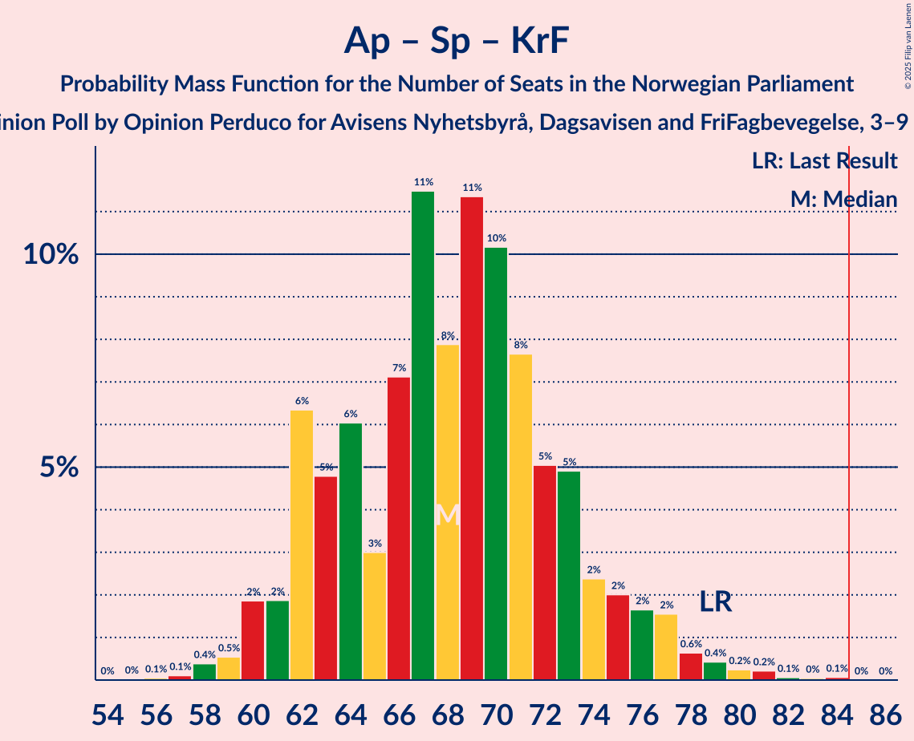

| Number of Seats | Probability | Accumulated | Special Marks |
|:---------------:|:-----------:|:-----------:|:-------------:|
| 56 | 0.1% | 100% |  |
| 57 | 0.1% | 99.9% |  |
| 58 | 0.4% | 99.8% |  |
| 59 | 0.5% | 99.4% |  |
| 60 | 2% | 98.9% |  |
| 61 | 2% | 97% |  |
| 62 | 6% | 95% |  |
| 63 | 5% | 89% |  |
| 64 | 6% | 84% |  |
| 65 | 3% | 78% |  |
| 66 | 7% | 75% | Median |
| 67 | 11% | 68% |  |
| 68 | 8% | 56% |  |
| 69 | 11% | 48% |  |
| 70 | 10% | 37% |  |
| 71 | 8% | 27% |  |
| 72 | 5% | 19% |  |
| 73 | 5% | 14% |  |
| 74 | 2% | 9% |  |
| 75 | 2% | 7% |  |
| 76 | 2% | 5% |  |
| 77 | 2% | 3% |  |
| 78 | 0.6% | 2% |  |
| 79 | 0.4% | 1.1% | Last Result |
| 80 | 0.2% | 0.6% |  |
| 81 | 0.2% | 0.4% |  |
| 82 | 0.1% | 0.2% |  |
| 83 | 0% | 0.1% |  |
| 84 | 0.1% | 0.1% |  |
| 85 | 0% | 0% | Majority |

### Høyre – Fremskrittspartiet – Venstre

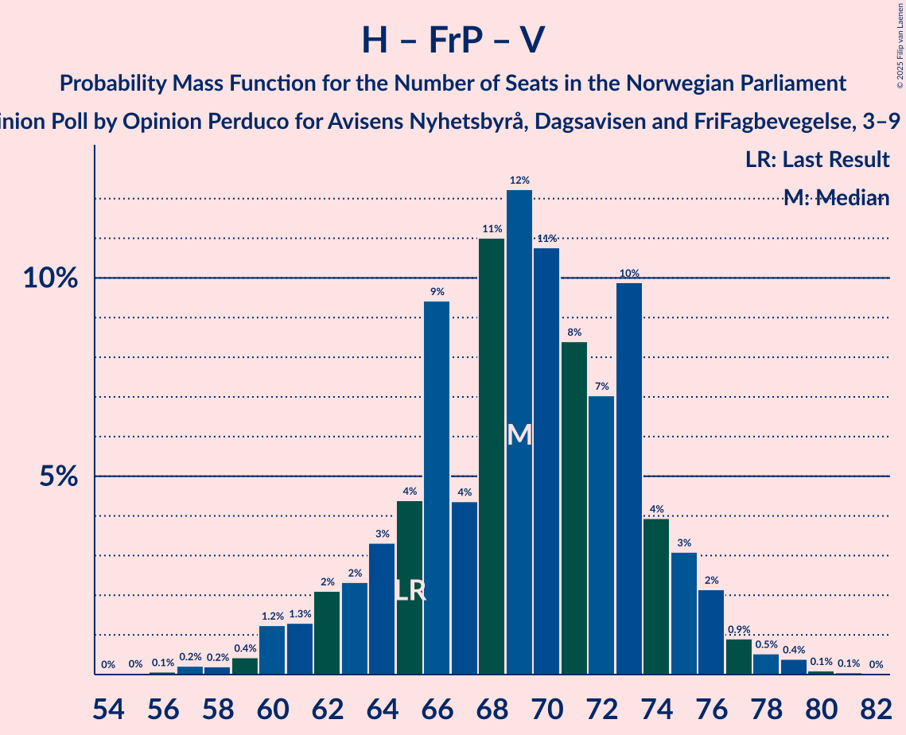

| Number of Seats | Probability | Accumulated | Special Marks |
|:---------------:|:-----------:|:-----------:|:-------------:|
| 55 | 0% | 100% |  |
| 56 | 0.1% | 99.9% |  |
| 57 | 0.2% | 99.9% |  |
| 58 | 0.2% | 99.6% |  |
| 59 | 0.4% | 99.4% |  |
| 60 | 1.2% | 99.0% |  |
| 61 | 1.3% | 98% |  |
| 62 | 2% | 96% |  |
| 63 | 2% | 94% |  |
| 64 | 3% | 92% |  |
| 65 | 4% | 89% | Last Result |
| 66 | 9% | 84% |  |
| 67 | 4% | 75% |  |
| 68 | 11% | 71% |  |
| 69 | 12% | 60% |  |
| 70 | 11% | 47% | Median |
| 71 | 8% | 37% |  |
| 72 | 7% | 28% |  |
| 73 | 10% | 21% |  |
| 74 | 4% | 11% |  |
| 75 | 3% | 7% |  |
| 76 | 2% | 4% |  |
| 77 | 0.9% | 2% |  |
| 78 | 0.5% | 1.1% |  |
| 79 | 0.4% | 0.6% |  |
| 80 | 0.1% | 0.2% |  |
| 81 | 0.1% | 0.1% |  |
| 82 | 0% | 0% |  |

### Arbeiderpartiet – Senterpartiet

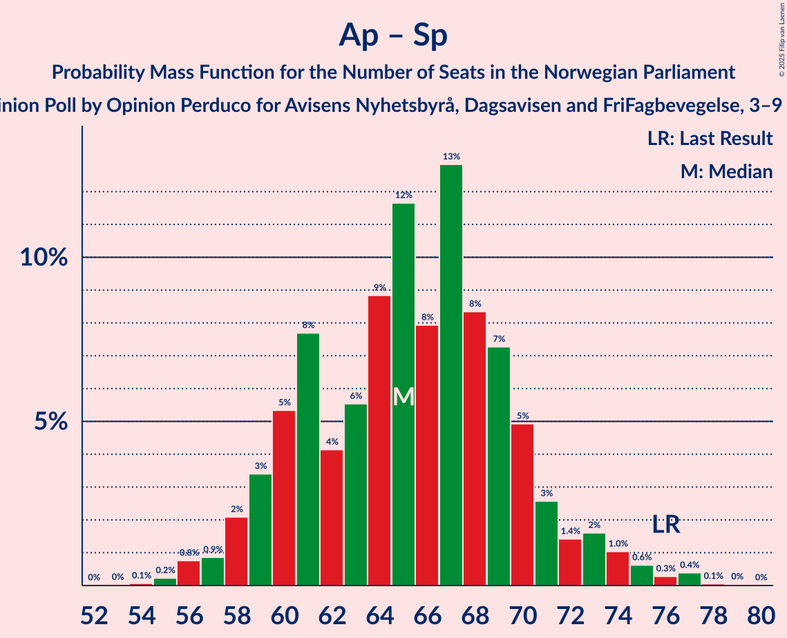

| Number of Seats | Probability | Accumulated | Special Marks |
|:---------------:|:-----------:|:-----------:|:-------------:|
| 54 | 0.1% | 100% |  |
| 55 | 0.2% | 99.9% |  |
| 56 | 0.8% | 99.7% |  |
| 57 | 0.9% | 98.9% |  |
| 58 | 2% | 98% |  |
| 59 | 3% | 96% |  |
| 60 | 5% | 93% |  |
| 61 | 8% | 87% |  |
| 62 | 4% | 80% |  |
| 63 | 6% | 75% |  |
| 64 | 9% | 70% | Median |
| 65 | 12% | 61% |  |
| 66 | 8% | 49% |  |
| 67 | 13% | 41% |  |
| 68 | 8% | 29% |  |
| 69 | 7% | 20% |  |
| 70 | 5% | 13% |  |
| 71 | 3% | 8% |  |
| 72 | 1.4% | 5% |  |
| 73 | 2% | 4% |  |
| 74 | 1.0% | 2% |  |
| 75 | 0.6% | 1.4% |  |
| 76 | 0.3% | 0.8% | Last Result |
| 77 | 0.4% | 0.5% |  |
| 78 | 0.1% | 0.1% |  |
| 79 | 0% | 0.1% |  |
| 80 | 0% | 0% |  |

### Høyre – Fremskrittspartiet

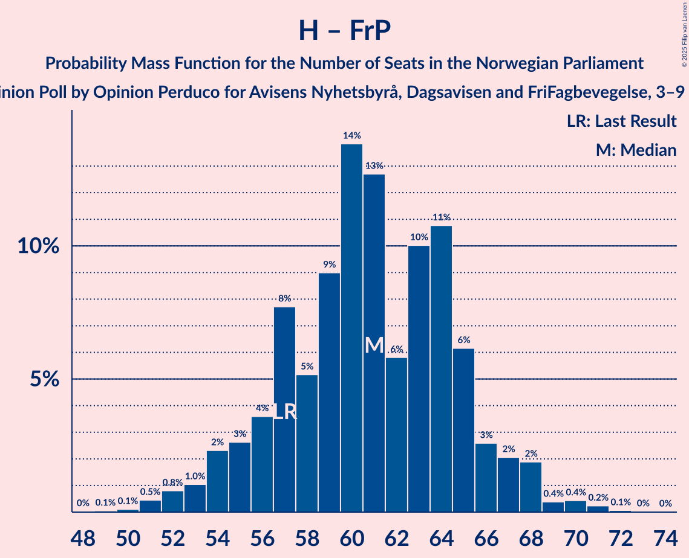

| Number of Seats | Probability | Accumulated | Special Marks |
|:---------------:|:-----------:|:-----------:|:-------------:|
| 48 | 0% | 100% |  |
| 49 | 0.1% | 99.9% |  |
| 50 | 0.1% | 99.9% |  |
| 51 | 0.5% | 99.8% |  |
| 52 | 0.8% | 99.3% |  |
| 53 | 1.0% | 98.5% |  |
| 54 | 2% | 97% |  |
| 55 | 3% | 95% |  |
| 56 | 4% | 93% |  |
| 57 | 8% | 89% | Last Result |
| 58 | 5% | 81% |  |
| 59 | 9% | 76% |  |
| 60 | 14% | 67% |  |
| 61 | 13% | 53% | Median |
| 62 | 6% | 40% |  |
| 63 | 10% | 35% |  |
| 64 | 11% | 25% |  |
| 65 | 6% | 14% |  |
| 66 | 3% | 8% |  |
| 67 | 2% | 5% |  |
| 68 | 2% | 3% |  |
| 69 | 0.4% | 1.2% |  |
| 70 | 0.4% | 0.8% |  |
| 71 | 0.2% | 0.4% |  |
| 72 | 0.1% | 0.1% |  |
| 73 | 0% | 0.1% |  |
| 74 | 0% | 0% |  |

### Arbeiderpartiet – Sosialistisk Venstreparti

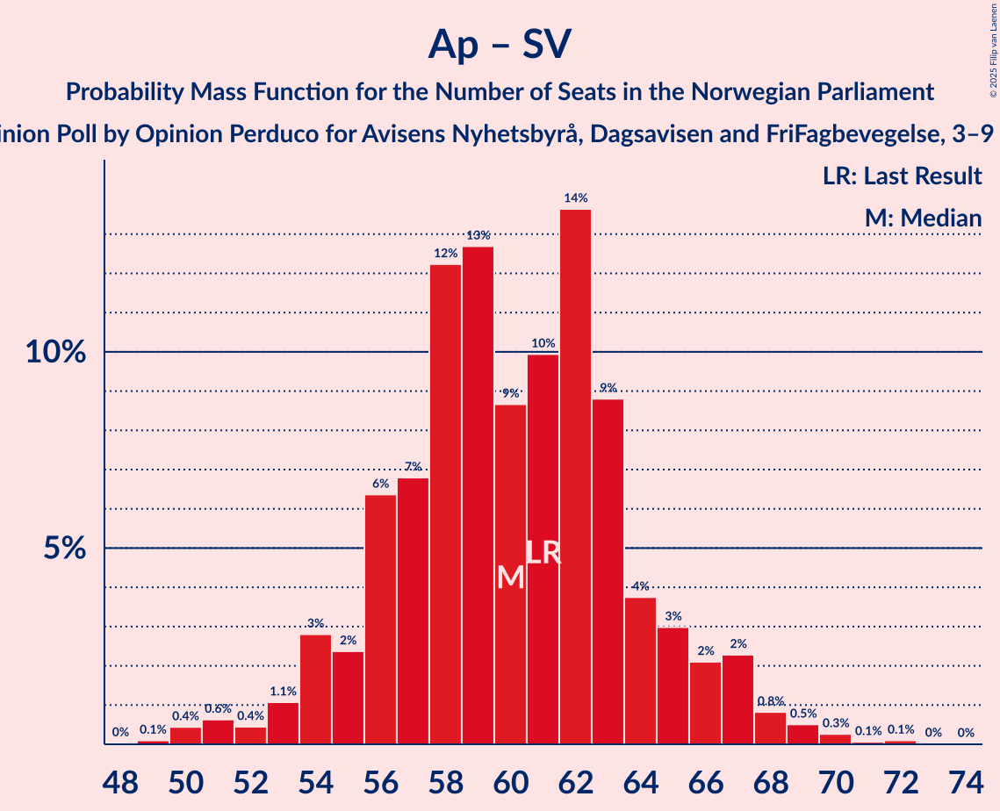

| Number of Seats | Probability | Accumulated | Special Marks |
|:---------------:|:-----------:|:-----------:|:-------------:|
| 49 | 0.1% | 100% |  |
| 50 | 0.4% | 99.9% |  |
| 51 | 0.6% | 99.4% |  |
| 52 | 0.4% | 98.8% |  |
| 53 | 1.1% | 98% |  |
| 54 | 3% | 97% |  |
| 55 | 2% | 94% |  |
| 56 | 6% | 92% |  |
| 57 | 7% | 86% |  |
| 58 | 12% | 79% |  |
| 59 | 13% | 67% | Median |
| 60 | 9% | 54% |  |
| 61 | 10% | 45% | Last Result |
| 62 | 14% | 35% |  |
| 63 | 9% | 22% |  |
| 64 | 4% | 13% |  |
| 65 | 3% | 9% |  |
| 66 | 2% | 6% |  |
| 67 | 2% | 4% |  |
| 68 | 0.8% | 2% |  |
| 69 | 0.5% | 1.0% |  |
| 70 | 0.3% | 0.5% |  |
| 71 | 0.1% | 0.2% |  |
| 72 | 0.1% | 0.1% |  |
| 73 | 0% | 0% |  |

### Høyre – Venstre – Kristelig Folkeparti

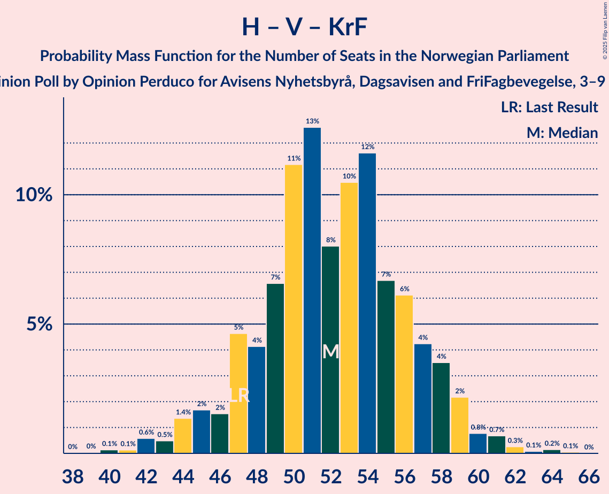

| Number of Seats | Probability | Accumulated | Special Marks |
|:---------------:|:-----------:|:-----------:|:-------------:|
| 39 | 0% | 100% |  |
| 40 | 0.1% | 99.9% |  |
| 41 | 0.1% | 99.8% |  |
| 42 | 0.6% | 99.7% |  |
| 43 | 0.5% | 99.1% |  |
| 44 | 1.4% | 98.6% |  |
| 45 | 2% | 97% |  |
| 46 | 2% | 96% |  |
| 47 | 5% | 94% | Last Result |
| 48 | 4% | 89% |  |
| 49 | 7% | 85% |  |
| 50 | 11% | 79% |  |
| 51 | 13% | 67% |  |
| 52 | 8% | 55% | Median |
| 53 | 10% | 47% |  |
| 54 | 12% | 36% |  |
| 55 | 7% | 25% |  |
| 56 | 6% | 18% |  |
| 57 | 4% | 12% |  |
| 58 | 4% | 8% |  |
| 59 | 2% | 4% |  |
| 60 | 0.8% | 2% |  |
| 61 | 0.7% | 1.2% |  |
| 62 | 0.3% | 0.6% |  |
| 63 | 0.1% | 0.3% |  |
| 64 | 0.2% | 0.2% |  |
| 65 | 0.1% | 0.1% |  |
| 66 | 0% | 0% |  |

### Senterpartiet – Venstre – Kristelig Folkeparti

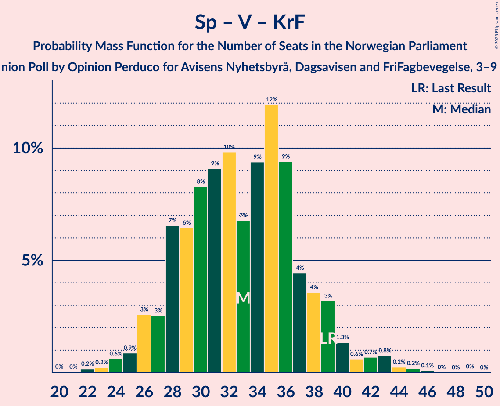

| Number of Seats | Probability | Accumulated | Special Marks |
|:---------------:|:-----------:|:-----------:|:-------------:|
| 21 | 0% | 100% |  |
| 22 | 0.2% | 99.9% |  |
| 23 | 0.2% | 99.7% |  |
| 24 | 0.6% | 99.5% |  |
| 25 | 0.9% | 98.9% |  |
| 26 | 3% | 98% |  |
| 27 | 3% | 95% |  |
| 28 | 7% | 93% |  |
| 29 | 6% | 86% |  |
| 30 | 8% | 80% |  |
| 31 | 9% | 72% |  |
| 32 | 10% | 63% | Median |
| 33 | 7% | 53% |  |
| 34 | 9% | 46% |  |
| 35 | 12% | 37% |  |
| 36 | 9% | 25% |  |
| 37 | 4% | 15% |  |
| 38 | 4% | 11% |  |
| 39 | 3% | 7% | Last Result |
| 40 | 1.3% | 4% |  |
| 41 | 0.6% | 3% |  |
| 42 | 0.7% | 2% |  |
| 43 | 0.8% | 1.4% |  |
| 44 | 0.2% | 0.6% |  |
| 45 | 0.2% | 0.4% |  |
| 46 | 0.1% | 0.2% |  |
| 47 | 0% | 0.1% |  |
| 48 | 0% | 0.1% |  |
| 49 | 0% | 0.1% |  |
| 50 | 0% | 0% |  |

## Technical Information

### Opinion Poll

+ **Polling firm:** Opinion Perduco
+ **Commissioner(s):** Avisens Nyhetsbyrå, Dagsavisen and FriFagbevegelse
+ **Fieldwork period:** 3–9 December 2021

### Calculations

+ **Sample size:** 637
+ **Simulations done:** 1,048,576
+ **Error estimate:** 2.12%

