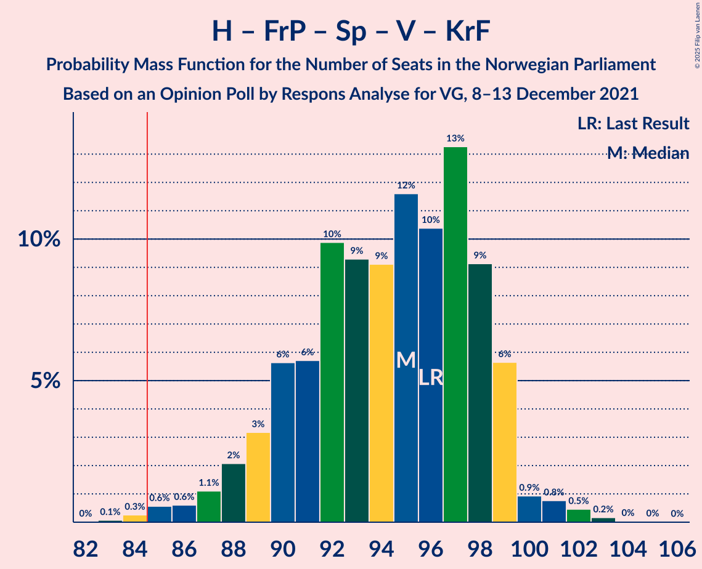

# Opinion Poll by Respons Analyse for VG, 8–13 December 2021

<a href="#voting-intentions">Voting Intentions</a> | <a href="#seats">Seats</a> | <a href="#coalitions">Coalitions</a> | <a href="#technical-information">Technical Information</a>

## Voting Intentions

### Confidence Intervals

| Party | Last Result | Poll Result | 80% Confidence Interval | 90% Confidence Interval | 95% Confidence Interval | 99% Confidence Interval |
|:-----:|:-----------:|:-----------:|:-----------------------:|:-----------------------:|:-----------------------:|:-----------------------:|
| Høyre | 20.4% | 26.3% | 24.5–28.1% |24.1–28.6% |23.6–29.1% |22.8–30.0% |
| Arbeiderpartiet | 26.2% | 22.6% | 20.9–24.3% |20.5–24.8% |20.1–25.3% |19.3–26.1% |
| Fremskrittspartiet | 11.6% | 11.4% | 10.2–12.8% |9.8–13.2% |9.6–13.5% |9.0–14.2% |
| Sosialistisk Venstreparti | 7.6% | 10.4% | 9.2–11.7% |8.9–12.1% |8.6–12.4% |8.1–13.1% |
| Senterpartiet | 13.5% | 10.0% | 8.9–11.3% |8.6–11.7% |8.3–12.0% |7.8–12.7% |
| Rødt | 4.7% | 6.1% | 5.2–7.2% |5.0–7.5% |4.8–7.8% |4.4–8.3% |
| Venstre | 4.6% | 4.0% | 3.3–4.9% |3.1–5.2% |2.9–5.4% |2.6–5.9% |
| Miljøpartiet De Grønne | 3.9% | 3.5% | 2.9–4.4% |2.7–4.6% |2.5–4.8% |2.2–5.3% |
| Kristelig Folkeparti | 3.8% | 3.4% | 2.8–4.3% |2.6–4.5% |2.4–4.7% |2.2–5.2% |

*Note:* The poll result column reflects the actual value used in the calculations. Published results may vary slightly, and in addition be rounded to fewer digits.

## Seats

### Confidence Intervals

| Party | Last Result | Median | 80% Confidence Interval | 90% Confidence Interval | 95% Confidence Interval | 99% Confidence Interval |
|:-----:|:-----------:|:------:|:-----------------------:|:-----------------------:|:-----------------------:|:-----------------------:|
| <a href="#høyre">Høyre</a> | 36 | 46 | 43–51 |42–52 |42–53 |40–54 |
| <a href="#arbeiderpartiet">Arbeiderpartiet</a> | 48 | 41 | 39–45 |38–46 |37–47 |36–48 |
| <a href="#fremskrittspartiet">Fremskrittspartiet</a> | 21 | 20 | 18–23 |18–23 |17–24 |16–26 |
| <a href="#sosialistisk-venstreparti">Sosialistisk Venstreparti</a> | 13 | 18 | 16–21 |16–21 |15–22 |14–24 |
| <a href="#senterpartiet">Senterpartiet</a> | 28 | 19 | 16–21 |15–21 |15–22 |14–23 |
| <a href="#rødt">Rødt</a> | 8 | 11 | 9–13 |9–14 |9–14 |8–15 |
| <a href="#venstre">Venstre</a> | 8 | 7 | 2–9 |2–9 |2–10 |2–10 |
| <a href="#miljøpartiet-de-grønne">Miljøpartiet De Grønne</a> | 3 | 2 | 1–8 |1–8 |1–8 |1–9 |
| <a href="#kristelig-folkeparti">Kristelig Folkeparti</a> | 3 | 3 | 2–8 |2–8 |2–8 |0–9 |

### Høyre

*For a full overview of the results for this party, see the [Høyre](party-høyre.html) page.*

| Number of Seats | Probability | Accumulated | Special Marks |
|:---------------:|:-----------:|:-----------:|:-------------:|
| 36 | 0% | 100% | Last Result |
| 37 | 0% | 100% |  |
| 38 | 0% | 100% |  |
| 39 | 0.1% | 100% |  |
| 40 | 0.8% | 99.9% |  |
| 41 | 1.2% | 99.1% |  |
| 42 | 4% | 98% |  |
| 43 | 6% | 94% |  |
| 44 | 12% | 88% |  |
| 45 | 13% | 75% |  |
| 46 | 14% | 62% | Median |
| 47 | 15% | 49% |  |
| 48 | 11% | 34% |  |
| 49 | 10% | 23% |  |
| 50 | 3% | 13% |  |
| 51 | 3% | 11% |  |
| 52 | 5% | 7% |  |
| 53 | 2% | 3% |  |
| 54 | 0.6% | 1.1% |  |
| 55 | 0.3% | 0.5% |  |
| 56 | 0.1% | 0.2% |  |
| 57 | 0.1% | 0.1% |  |
| 58 | 0% | 0% |  |

### Arbeiderpartiet

*For a full overview of the results for this party, see the [Arbeiderpartiet](party-arbeiderpartiet.html) page.*

| Number of Seats | Probability | Accumulated | Special Marks |
|:---------------:|:-----------:|:-----------:|:-------------:|
| 34 | 0.1% | 100% |  |
| 35 | 0.4% | 99.9% |  |
| 36 | 1.0% | 99.5% |  |
| 37 | 3% | 98.5% |  |
| 38 | 4% | 95% |  |
| 39 | 8% | 91% |  |
| 40 | 14% | 83% |  |
| 41 | 19% | 68% | Median |
| 42 | 19% | 50% |  |
| 43 | 13% | 31% |  |
| 44 | 6% | 18% |  |
| 45 | 4% | 12% |  |
| 46 | 4% | 8% |  |
| 47 | 3% | 4% |  |
| 48 | 1.1% | 2% | Last Result |
| 49 | 0.2% | 0.5% |  |
| 50 | 0.2% | 0.2% |  |
| 51 | 0% | 0% |  |

### Fremskrittspartiet

*For a full overview of the results for this party, see the [Fremskrittspartiet](party-fremskrittspartiet.html) page.*

| Number of Seats | Probability | Accumulated | Special Marks |
|:---------------:|:-----------:|:-----------:|:-------------:|
| 14 | 0.1% | 100% |  |
| 15 | 0.3% | 99.9% |  |
| 16 | 0.6% | 99.7% |  |
| 17 | 4% | 99.0% |  |
| 18 | 10% | 95% |  |
| 19 | 16% | 86% |  |
| 20 | 23% | 70% | Median |
| 21 | 18% | 47% | Last Result |
| 22 | 15% | 28% |  |
| 23 | 9% | 13% |  |
| 24 | 3% | 5% |  |
| 25 | 1.0% | 2% |  |
| 26 | 0.4% | 0.6% |  |
| 27 | 0.1% | 0.1% |  |
| 28 | 0% | 0% |  |

### Sosialistisk Venstreparti

*For a full overview of the results for this party, see the [Sosialistisk Venstreparti](party-sosialistiskvenstreparti.html) page.*

| Number of Seats | Probability | Accumulated | Special Marks |
|:---------------:|:-----------:|:-----------:|:-------------:|
| 13 | 0.1% | 100% | Last Result |
| 14 | 0.7% | 99.8% |  |
| 15 | 4% | 99.2% |  |
| 16 | 8% | 95% |  |
| 17 | 16% | 87% |  |
| 18 | 28% | 71% | Median |
| 19 | 13% | 43% |  |
| 20 | 15% | 30% |  |
| 21 | 11% | 15% |  |
| 22 | 3% | 5% |  |
| 23 | 1.1% | 2% |  |
| 24 | 0.5% | 0.6% |  |
| 25 | 0.1% | 0.1% |  |
| 26 | 0% | 0% |  |

### Senterpartiet

*For a full overview of the results for this party, see the [Senterpartiet](party-senterpartiet.html) page.*

| Number of Seats | Probability | Accumulated | Special Marks |
|:---------------:|:-----------:|:-----------:|:-------------:|
| 13 | 0.4% | 100% |  |
| 14 | 2% | 99.6% |  |
| 15 | 4% | 98% |  |
| 16 | 10% | 94% |  |
| 17 | 11% | 84% |  |
| 18 | 23% | 73% |  |
| 19 | 20% | 51% | Median |
| 20 | 19% | 31% |  |
| 21 | 8% | 12% |  |
| 22 | 3% | 4% |  |
| 23 | 0.7% | 0.9% |  |
| 24 | 0.2% | 0.2% |  |
| 25 | 0.1% | 0.1% |  |
| 26 | 0% | 0% |  |
| 27 | 0% | 0% |  |
| 28 | 0% | 0% | Last Result |

### Rødt

*For a full overview of the results for this party, see the [Rødt](party-rødt.html) page.*

| Number of Seats | Probability | Accumulated | Special Marks |
|:---------------:|:-----------:|:-----------:|:-------------:|
| 1 | 0.1% | 100% |  |
| 2 | 0% | 99.9% |  |
| 3 | 0% | 99.9% |  |
| 4 | 0% | 99.9% |  |
| 5 | 0% | 99.9% |  |
| 6 | 0% | 99.9% |  |
| 7 | 0.2% | 99.9% |  |
| 8 | 2% | 99.8% | Last Result |
| 9 | 13% | 98% |  |
| 10 | 20% | 85% |  |
| 11 | 25% | 65% | Median |
| 12 | 24% | 40% |  |
| 13 | 10% | 16% |  |
| 14 | 4% | 6% |  |
| 15 | 1.2% | 2% |  |
| 16 | 0.3% | 0.3% |  |
| 17 | 0% | 0% |  |

### Venstre

*For a full overview of the results for this party, see the [Venstre](party-venstre.html) page.*

| Number of Seats | Probability | Accumulated | Special Marks |
|:---------------:|:-----------:|:-----------:|:-------------:|
| 1 | 0.1% | 100% |  |
| 2 | 20% | 99.9% |  |
| 3 | 28% | 80% |  |
| 4 | 0% | 52% |  |
| 5 | 0% | 52% |  |
| 6 | 0% | 52% |  |
| 7 | 13% | 52% | Median |
| 8 | 25% | 39% | Last Result |
| 9 | 11% | 14% |  |
| 10 | 2% | 3% |  |
| 11 | 0.3% | 0.4% |  |
| 12 | 0.1% | 0.1% |  |
| 13 | 0% | 0% |  |

### Miljøpartiet De Grønne

*For a full overview of the results for this party, see the [Miljøpartiet De Grønne](party-miljøpartietdegrønne.html) page.*

| Number of Seats | Probability | Accumulated | Special Marks |
|:---------------:|:-----------:|:-----------:|:-------------:|
| 1 | 17% | 100% |  |
| 2 | 58% | 83% | Median |
| 3 | 10% | 25% | Last Result |
| 4 | 0% | 15% |  |
| 5 | 0% | 15% |  |
| 6 | 0% | 15% |  |
| 7 | 4% | 15% |  |
| 8 | 9% | 11% |  |
| 9 | 2% | 2% |  |
| 10 | 0.2% | 0.2% |  |
| 11 | 0% | 0% |  |

### Kristelig Folkeparti

*For a full overview of the results for this party, see the [Kristelig Folkeparti](party-kristeligfolkeparti.html) page.*

| Number of Seats | Probability | Accumulated | Special Marks |
|:---------------:|:-----------:|:-----------:|:-------------:|
| 0 | 0.7% | 100% |  |
| 1 | 0.9% | 99.3% |  |
| 2 | 45% | 98% |  |
| 3 | 34% | 53% | Last Result, Median |
| 4 | 0% | 19% |  |
| 5 | 0% | 19% |  |
| 6 | 0% | 19% |  |
| 7 | 7% | 19% |  |
| 8 | 10% | 12% |  |
| 9 | 1.5% | 2% |  |
| 10 | 0.1% | 0.2% |  |
| 11 | 0% | 0% |  |

## Coalitions

### Confidence Intervals

| Coalition | Last Result | Median | Majority? | 80% Confidence Interval | 90% Confidence Interval | 95% Confidence Interval | 99% Confidence Interval |
|:---------:|:-----------:|:------:|:---------:|:-----------------------:|:-----------------------:|:-----------------------:|:-----------------------:|
| Høyre – Fremskrittspartiet – Senterpartiet – Venstre – Kristelig Folkeparti | 96 | 95 | 99.6% | 90–98 | 89–99 | 87–99 | 85–102 |
| Arbeiderpartiet – Sosialistisk Venstreparti – Senterpartiet – Rødt – Miljøpartiet De Grønne | 100 | 92 | 98.7% | 89–97 | 87–99 | 86–99 | 83–102 |
| Arbeiderpartiet – Sosialistisk Venstreparti – Senterpartiet – Rødt | 97 | 89 | 94% | 86–95 | 84–96 | 83–97 | 81–97 |
| Arbeiderpartiet – Sosialistisk Venstreparti – Senterpartiet – Miljøpartiet De Grønne – Kristelig Folkeparti | 95 | 85 | 53% | 80–89 | 79–91 | 78–92 | 76–94 |
| Arbeiderpartiet – Sosialistisk Venstreparti – Senterpartiet – Miljøpartiet De Grønne | 92 | 81 | 19% | 77–86 | 76–87 | 75–88 | 73–90 |
| Arbeiderpartiet – Sosialistisk Venstreparti – Senterpartiet | 89 | 78 | 3% | 75–83 | 73–84 | 72–86 | 70–87 |
| Høyre – Fremskrittspartiet – Venstre – Miljøpartiet De Grønne – Kristelig Folkeparti | 71 | 79 | 4% | 74–82 | 73–84 | 72–85 | 71–87 |
| Høyre – Fremskrittspartiet – Venstre – Kristelig Folkeparti | 68 | 77 | 0.7% | 71–79 | 70–81 | 69–82 | 67–85 |
| Arbeiderpartiet – Sosialistisk Venstreparti – Rødt – Miljøpartiet De Grønne | 72 | 74 | 0.3% | 70–79 | 69–80 | 69–81 | 66–83 |
| Høyre – Fremskrittspartiet – Venstre | 65 | 72 | 0% | 68–77 | 67–77 | 66–79 | 64–82 |
| Høyre – Fremskrittspartiet | 57 | 67 | 0% | 63–72 | 62–73 | 61–74 | 59–76 |
| Arbeiderpartiet – Senterpartiet – Miljøpartiet De Grønne – Kristelig Folkeparti | 82 | 66 | 0% | 62–71 | 61–72 | 60–73 | 57–76 |
| Arbeiderpartiet – Senterpartiet – Kristelig Folkeparti | 79 | 63 | 0% | 59–68 | 58–68 | 57–69 | 54–72 |
| Arbeiderpartiet – Sosialistisk Venstreparti | 61 | 60 | 0% | 57–64 | 56–66 | 55–67 | 53–68 |
| Arbeiderpartiet – Senterpartiet | 76 | 60 | 0% | 57–64 | 55–65 | 54–66 | 52–67 |
| Høyre – Venstre – Kristelig Folkeparti | 47 | 56 | 0% | 51–60 | 50–61 | 49–62 | 47–64 |
| Senterpartiet – Venstre – Kristelig Folkeparti | 39 | 28 | 0% | 23–31 | 21–33 | 20–34 | 19–36 |

### Høyre – Fremskrittspartiet – Senterpartiet – Venstre – Kristelig Folkeparti

| Number of Seats | Probability | Accumulated | Special Marks |
|:---------------:|:-----------:|:-----------:|:-------------:|
| 83 | 0.1% | 100% |  |
| 84 | 0.3% | 99.9% |  |
| 85 | 0.6% | 99.6% | Majority |
| 86 | 0.6% | 99.1% |  |
| 87 | 1.1% | 98% |  |
| 88 | 2% | 97% |  |
| 89 | 3% | 95% |  |
| 90 | 6% | 92% |  |
| 91 | 6% | 86% |  |
| 92 | 10% | 81% |  |
| 93 | 9% | 71% |  |
| 94 | 9% | 62% |  |
| 95 | 12% | 52% | Median |
| 96 | 10% | 41% | Last Result |
| 97 | 13% | 30% |  |
| 98 | 9% | 17% |  |
| 99 | 6% | 8% |  |
| 100 | 0.9% | 2% |  |
| 101 | 0.8% | 1.5% |  |
| 102 | 0.5% | 0.7% |  |
| 103 | 0.2% | 0.2% |  |
| 104 | 0% | 0.1% |  |
| 105 | 0% | 0% |  |

### Arbeiderpartiet – Sosialistisk Venstreparti – Senterpartiet – Rødt – Miljøpartiet De Grønne

| Number of Seats | Probability | Accumulated | Special Marks |
|:---------------:|:-----------:|:-----------:|:-------------:|
| 82 | 0.1% | 100% |  |
| 83 | 0.5% | 99.8% |  |
| 84 | 0.6% | 99.3% |  |
| 85 | 1.0% | 98.7% | Majority |
| 86 | 1.4% | 98% |  |
| 87 | 2% | 96% |  |
| 88 | 3% | 94% |  |
| 89 | 12% | 92% |  |
| 90 | 11% | 80% |  |
| 91 | 16% | 69% | Median |
| 92 | 11% | 53% |  |
| 93 | 6% | 42% |  |
| 94 | 4% | 36% |  |
| 95 | 6% | 31% |  |
| 96 | 10% | 25% |  |
| 97 | 6% | 15% |  |
| 98 | 4% | 9% |  |
| 99 | 3% | 5% |  |
| 100 | 0.9% | 2% | Last Result |
| 101 | 0.3% | 0.9% |  |
| 102 | 0.2% | 0.6% |  |
| 103 | 0.3% | 0.4% |  |
| 104 | 0% | 0% |  |

### Arbeiderpartiet – Sosialistisk Venstreparti – Senterpartiet – Rødt

| Number of Seats | Probability | Accumulated | Special Marks |
|:---------------:|:-----------:|:-----------:|:-------------:|
| 79 | 0.1% | 100% |  |
| 80 | 0.1% | 99.9% |  |
| 81 | 1.1% | 99.7% |  |
| 82 | 1.0% | 98.6% |  |
| 83 | 2% | 98% |  |
| 84 | 2% | 96% |  |
| 85 | 3% | 94% | Majority |
| 86 | 4% | 91% |  |
| 87 | 12% | 87% |  |
| 88 | 17% | 75% |  |
| 89 | 15% | 58% | Median |
| 90 | 11% | 43% |  |
| 91 | 5% | 32% |  |
| 92 | 2% | 27% |  |
| 93 | 4% | 24% |  |
| 94 | 7% | 20% |  |
| 95 | 5% | 13% |  |
| 96 | 5% | 8% |  |
| 97 | 2% | 3% | Last Result |
| 98 | 0.2% | 0.4% |  |
| 99 | 0.1% | 0.2% |  |
| 100 | 0% | 0.1% |  |
| 101 | 0% | 0% |  |

### Arbeiderpartiet – Sosialistisk Venstreparti – Senterpartiet – Miljøpartiet De Grønne – Kristelig Folkeparti

| Number of Seats | Probability | Accumulated | Special Marks |
|:---------------:|:-----------:|:-----------:|:-------------:|
| 74 | 0.2% | 100% |  |
| 75 | 0.2% | 99.8% |  |
| 76 | 0.4% | 99.6% |  |
| 77 | 0.7% | 99.3% |  |
| 78 | 2% | 98.6% |  |
| 79 | 2% | 97% |  |
| 80 | 7% | 95% |  |
| 81 | 5% | 88% |  |
| 82 | 12% | 83% |  |
| 83 | 7% | 71% | Median |
| 84 | 11% | 64% |  |
| 85 | 8% | 53% | Majority |
| 86 | 14% | 44% |  |
| 87 | 7% | 31% |  |
| 88 | 10% | 24% |  |
| 89 | 6% | 14% |  |
| 90 | 3% | 8% |  |
| 91 | 2% | 5% |  |
| 92 | 2% | 3% |  |
| 93 | 0.3% | 1.2% |  |
| 94 | 0.5% | 0.9% |  |
| 95 | 0.3% | 0.4% | Last Result |
| 96 | 0.1% | 0.2% |  |
| 97 | 0% | 0% |  |

### Arbeiderpartiet – Sosialistisk Venstreparti – Senterpartiet – Miljøpartiet De Grønne

| Number of Seats | Probability | Accumulated | Special Marks |
|:---------------:|:-----------:|:-----------:|:-------------:|
| 71 | 0.1% | 100% |  |
| 72 | 0.2% | 99.9% |  |
| 73 | 0.5% | 99.7% |  |
| 74 | 1.1% | 99.2% |  |
| 75 | 2% | 98% |  |
| 76 | 3% | 97% |  |
| 77 | 7% | 94% |  |
| 78 | 8% | 87% |  |
| 79 | 7% | 79% |  |
| 80 | 17% | 72% | Median |
| 81 | 10% | 55% |  |
| 82 | 7% | 45% |  |
| 83 | 11% | 38% |  |
| 84 | 8% | 27% |  |
| 85 | 7% | 19% | Majority |
| 86 | 6% | 12% |  |
| 87 | 2% | 6% |  |
| 88 | 2% | 4% |  |
| 89 | 1.3% | 2% |  |
| 90 | 0.4% | 0.8% |  |
| 91 | 0.1% | 0.3% |  |
| 92 | 0.2% | 0.2% | Last Result |
| 93 | 0% | 0% |  |

### Arbeiderpartiet – Sosialistisk Venstreparti – Senterpartiet

| Number of Seats | Probability | Accumulated | Special Marks |
|:---------------:|:-----------:|:-----------:|:-------------:|
| 69 | 0.2% | 100% |  |
| 70 | 0.5% | 99.8% |  |
| 71 | 0.8% | 99.3% |  |
| 72 | 2% | 98% |  |
| 73 | 2% | 97% |  |
| 74 | 4% | 95% |  |
| 75 | 7% | 90% |  |
| 76 | 10% | 83% |  |
| 77 | 9% | 73% |  |
| 78 | 17% | 63% | Median |
| 79 | 11% | 46% |  |
| 80 | 6% | 35% |  |
| 81 | 9% | 29% |  |
| 82 | 6% | 19% |  |
| 83 | 5% | 14% |  |
| 84 | 6% | 9% |  |
| 85 | 0.9% | 3% | Majority |
| 86 | 2% | 3% |  |
| 87 | 0.8% | 1.0% |  |
| 88 | 0.1% | 0.1% |  |
| 89 | 0% | 0.1% | Last Result |
| 90 | 0% | 0% |  |

### Høyre – Fremskrittspartiet – Venstre – Miljøpartiet De Grønne – Kristelig Folkeparti

| Number of Seats | Probability | Accumulated | Special Marks |
|:---------------:|:-----------:|:-----------:|:-------------:|
| 69 | 0% | 100% |  |
| 70 | 0.1% | 99.9% |  |
| 71 | 0.4% | 99.8% | Last Result |
| 72 | 3% | 99.4% |  |
| 73 | 5% | 96% |  |
| 74 | 6% | 91% |  |
| 75 | 8% | 85% |  |
| 76 | 3% | 77% |  |
| 77 | 6% | 75% |  |
| 78 | 5% | 69% | Median |
| 79 | 18% | 63% |  |
| 80 | 16% | 45% |  |
| 81 | 15% | 29% |  |
| 82 | 5% | 14% |  |
| 83 | 3% | 9% |  |
| 84 | 2% | 6% |  |
| 85 | 2% | 4% | Majority |
| 86 | 1.0% | 2% |  |
| 87 | 1.1% | 1.4% |  |
| 88 | 0.1% | 0.2% |  |
| 89 | 0.1% | 0.1% |  |
| 90 | 0% | 0% |  |

### Høyre – Fremskrittspartiet – Venstre – Kristelig Folkeparti

| Number of Seats | Probability | Accumulated | Special Marks |
|:---------------:|:-----------:|:-----------:|:-------------:|
| 66 | 0.4% | 100% |  |
| 67 | 0.2% | 99.6% |  |
| 68 | 0.5% | 99.4% | Last Result |
| 69 | 1.4% | 98.9% |  |
| 70 | 3% | 97% |  |
| 71 | 5% | 94% |  |
| 72 | 9% | 90% |  |
| 73 | 10% | 80% |  |
| 74 | 5% | 70% |  |
| 75 | 6% | 66% |  |
| 76 | 6% | 59% | Median |
| 77 | 19% | 53% |  |
| 78 | 11% | 34% |  |
| 79 | 14% | 23% |  |
| 80 | 3% | 9% |  |
| 81 | 2% | 6% |  |
| 82 | 1.4% | 4% |  |
| 83 | 1.0% | 2% |  |
| 84 | 0.6% | 1.3% |  |
| 85 | 0.5% | 0.7% | Majority |
| 86 | 0.1% | 0.2% |  |
| 87 | 0% | 0% |  |

### Arbeiderpartiet – Sosialistisk Venstreparti – Rødt – Miljøpartiet De Grønne

| Number of Seats | Probability | Accumulated | Special Marks |
|:---------------:|:-----------:|:-----------:|:-------------:|
| 64 | 0% | 100% |  |
| 65 | 0.1% | 99.9% |  |
| 66 | 0.5% | 99.8% |  |
| 67 | 0.8% | 99.3% |  |
| 68 | 0.9% | 98.6% |  |
| 69 | 5% | 98% |  |
| 70 | 7% | 93% |  |
| 71 | 13% | 86% |  |
| 72 | 12% | 73% | Last Result, Median |
| 73 | 10% | 62% |  |
| 74 | 11% | 52% |  |
| 75 | 7% | 40% |  |
| 76 | 9% | 33% |  |
| 77 | 8% | 24% |  |
| 78 | 6% | 16% |  |
| 79 | 4% | 10% |  |
| 80 | 3% | 7% |  |
| 81 | 2% | 4% |  |
| 82 | 0.6% | 2% |  |
| 83 | 0.6% | 1.0% |  |
| 84 | 0.2% | 0.4% |  |
| 85 | 0.2% | 0.3% | Majority |
| 86 | 0.1% | 0.1% |  |
| 87 | 0% | 0% |  |

### Høyre – Fremskrittspartiet – Venstre

| Number of Seats | Probability | Accumulated | Special Marks |
|:---------------:|:-----------:|:-----------:|:-------------:|
| 62 | 0.1% | 100% |  |
| 63 | 0.4% | 99.9% |  |
| 64 | 0.8% | 99.5% |  |
| 65 | 0.7% | 98.7% | Last Result |
| 66 | 1.4% | 98% |  |
| 67 | 4% | 97% |  |
| 68 | 5% | 93% |  |
| 69 | 9% | 88% |  |
| 70 | 8% | 78% |  |
| 71 | 13% | 70% |  |
| 72 | 9% | 57% |  |
| 73 | 5% | 48% | Median |
| 74 | 9% | 43% |  |
| 75 | 14% | 34% |  |
| 76 | 8% | 19% |  |
| 77 | 7% | 12% |  |
| 78 | 2% | 5% |  |
| 79 | 0.9% | 3% |  |
| 80 | 0.7% | 2% |  |
| 81 | 0.4% | 0.9% |  |
| 82 | 0.3% | 0.5% |  |
| 83 | 0.1% | 0.2% |  |
| 84 | 0% | 0.1% |  |
| 85 | 0% | 0% | Majority |

### Høyre – Fremskrittspartiet

| Number of Seats | Probability | Accumulated | Special Marks |
|:---------------:|:-----------:|:-----------:|:-------------:|
| 57 | 0% | 100% | Last Result |
| 58 | 0.2% | 100% |  |
| 59 | 0.3% | 99.8% |  |
| 60 | 1.0% | 99.5% |  |
| 61 | 2% | 98.5% |  |
| 62 | 4% | 97% |  |
| 63 | 7% | 93% |  |
| 64 | 9% | 86% |  |
| 65 | 8% | 77% |  |
| 66 | 12% | 69% | Median |
| 67 | 16% | 57% |  |
| 68 | 12% | 40% |  |
| 69 | 7% | 28% |  |
| 70 | 6% | 21% |  |
| 71 | 5% | 15% |  |
| 72 | 4% | 10% |  |
| 73 | 4% | 6% |  |
| 74 | 0.7% | 3% |  |
| 75 | 1.5% | 2% |  |
| 76 | 0.3% | 0.6% |  |
| 77 | 0.1% | 0.3% |  |
| 78 | 0.1% | 0.1% |  |
| 79 | 0% | 0% |  |

### Arbeiderpartiet – Senterpartiet – Miljøpartiet De Grønne – Kristelig Folkeparti

| Number of Seats | Probability | Accumulated | Special Marks |
|:---------------:|:-----------:|:-----------:|:-------------:|
| 55 | 0.1% | 100% |  |
| 56 | 0.2% | 99.9% |  |
| 57 | 0.5% | 99.7% |  |
| 58 | 0.8% | 99.2% |  |
| 59 | 0.8% | 98% |  |
| 60 | 2% | 98% |  |
| 61 | 3% | 96% |  |
| 62 | 5% | 92% |  |
| 63 | 9% | 87% |  |
| 64 | 6% | 78% |  |
| 65 | 13% | 73% | Median |
| 66 | 15% | 60% |  |
| 67 | 9% | 45% |  |
| 68 | 11% | 37% |  |
| 69 | 8% | 25% |  |
| 70 | 7% | 17% |  |
| 71 | 5% | 10% |  |
| 72 | 1.3% | 5% |  |
| 73 | 2% | 4% |  |
| 74 | 1.2% | 2% |  |
| 75 | 0.3% | 1.2% |  |
| 76 | 0.5% | 0.9% |  |
| 77 | 0.1% | 0.4% |  |
| 78 | 0.2% | 0.2% |  |
| 79 | 0% | 0% |  |
| 80 | 0% | 0% |  |
| 81 | 0% | 0% |  |
| 82 | 0% | 0% | Last Result |

### Arbeiderpartiet – Senterpartiet – Kristelig Folkeparti

| Number of Seats | Probability | Accumulated | Special Marks |
|:---------------:|:-----------:|:-----------:|:-------------:|
| 53 | 0.1% | 100% |  |
| 54 | 0.4% | 99.9% |  |
| 55 | 0.6% | 99.4% |  |
| 56 | 0.8% | 98.8% |  |
| 57 | 1.4% | 98% |  |
| 58 | 3% | 97% |  |
| 59 | 5% | 94% |  |
| 60 | 7% | 89% |  |
| 61 | 10% | 82% |  |
| 62 | 7% | 72% |  |
| 63 | 16% | 65% | Median |
| 64 | 11% | 49% |  |
| 65 | 10% | 38% |  |
| 66 | 10% | 28% |  |
| 67 | 6% | 18% |  |
| 68 | 8% | 12% |  |
| 69 | 3% | 5% |  |
| 70 | 0.9% | 2% |  |
| 71 | 0.3% | 0.8% |  |
| 72 | 0.1% | 0.5% |  |
| 73 | 0.3% | 0.4% |  |
| 74 | 0.1% | 0.2% |  |
| 75 | 0.1% | 0.1% |  |
| 76 | 0% | 0% |  |
| 77 | 0% | 0% |  |
| 78 | 0% | 0% |  |
| 79 | 0% | 0% | Last Result |

### Arbeiderpartiet – Sosialistisk Venstreparti

| Number of Seats | Probability | Accumulated | Special Marks |
|:---------------:|:-----------:|:-----------:|:-------------:|
| 51 | 0.1% | 100% |  |
| 52 | 0.1% | 99.9% |  |
| 53 | 0.7% | 99.8% |  |
| 54 | 0.8% | 99.1% |  |
| 55 | 2% | 98% |  |
| 56 | 5% | 97% |  |
| 57 | 11% | 92% |  |
| 58 | 14% | 81% |  |
| 59 | 12% | 67% | Median |
| 60 | 15% | 55% |  |
| 61 | 10% | 40% | Last Result |
| 62 | 11% | 30% |  |
| 63 | 8% | 20% |  |
| 64 | 3% | 12% |  |
| 65 | 3% | 8% |  |
| 66 | 2% | 5% |  |
| 67 | 2% | 3% |  |
| 68 | 0.7% | 0.9% |  |
| 69 | 0.1% | 0.2% |  |
| 70 | 0% | 0.1% |  |
| 71 | 0% | 0% |  |

### Arbeiderpartiet – Senterpartiet

| Number of Seats | Probability | Accumulated | Special Marks |
|:---------------:|:-----------:|:-----------:|:-------------:|
| 50 | 0% | 100% |  |
| 51 | 0.1% | 99.9% |  |
| 52 | 0.5% | 99.8% |  |
| 53 | 1.0% | 99.3% |  |
| 54 | 2% | 98% |  |
| 55 | 2% | 97% |  |
| 56 | 4% | 94% |  |
| 57 | 10% | 90% |  |
| 58 | 9% | 80% |  |
| 59 | 11% | 70% |  |
| 60 | 12% | 59% | Median |
| 61 | 16% | 47% |  |
| 62 | 10% | 31% |  |
| 63 | 9% | 21% |  |
| 64 | 5% | 11% |  |
| 65 | 3% | 7% |  |
| 66 | 2% | 3% |  |
| 67 | 0.6% | 0.9% |  |
| 68 | 0.2% | 0.3% |  |
| 69 | 0.1% | 0.1% |  |
| 70 | 0% | 0% |  |
| 71 | 0% | 0% |  |
| 72 | 0% | 0% |  |
| 73 | 0% | 0% |  |
| 74 | 0% | 0% |  |
| 75 | 0% | 0% |  |
| 76 | 0% | 0% | Last Result |

### Høyre – Venstre – Kristelig Folkeparti

| Number of Seats | Probability | Accumulated | Special Marks |
|:---------------:|:-----------:|:-----------:|:-------------:|
| 45 | 0% | 100% |  |
| 46 | 0.2% | 99.9% |  |
| 47 | 0.5% | 99.7% | Last Result |
| 48 | 1.2% | 99.2% |  |
| 49 | 2% | 98% |  |
| 50 | 5% | 96% |  |
| 51 | 5% | 90% |  |
| 52 | 5% | 85% |  |
| 53 | 8% | 80% |  |
| 54 | 14% | 73% |  |
| 55 | 6% | 59% |  |
| 56 | 9% | 53% | Median |
| 57 | 18% | 43% |  |
| 58 | 8% | 26% |  |
| 59 | 7% | 18% |  |
| 60 | 4% | 11% |  |
| 61 | 3% | 7% |  |
| 62 | 2% | 3% |  |
| 63 | 0.8% | 2% |  |
| 64 | 0.4% | 0.7% |  |
| 65 | 0.2% | 0.4% |  |
| 66 | 0.1% | 0.2% |  |
| 67 | 0% | 0.1% |  |
| 68 | 0% | 0% |  |

### Senterpartiet – Venstre – Kristelig Folkeparti

| Number of Seats | Probability | Accumulated | Special Marks |
|:---------------:|:-----------:|:-----------:|:-------------:|
| 17 | 0% | 100% |  |
| 18 | 0.1% | 99.9% |  |
| 19 | 0.7% | 99.8% |  |
| 20 | 2% | 99.2% |  |
| 21 | 3% | 97% |  |
| 22 | 3% | 94% |  |
| 23 | 8% | 91% |  |
| 24 | 7% | 83% |  |
| 25 | 5% | 76% |  |
| 26 | 11% | 71% |  |
| 27 | 9% | 60% |  |
| 28 | 7% | 51% |  |
| 29 | 9% | 44% | Median |
| 30 | 20% | 35% |  |
| 31 | 6% | 15% |  |
| 32 | 3% | 8% |  |
| 33 | 2% | 5% |  |
| 34 | 1.3% | 3% |  |
| 35 | 1.5% | 2% |  |
| 36 | 0.5% | 0.6% |  |
| 37 | 0.1% | 0.1% |  |
| 38 | 0% | 0% |  |
| 39 | 0% | 0% | Last Result |

## Technical Information

### Opinion Poll

+ **Polling firm:** Respons Analyse
+ **Commissioner(s):** VG
+ **Fieldwork period:** 8–13 December 2021

### Calculations

+ **Sample size:** 1001
+ **Simulations done:** 1,048,576
+ **Error estimate:** 2.19%

