# Opinion Poll by Sentio for Amedia and Nettavisen, 7–13 December 2021

<a href="#voting-intentions">Voting Intentions</a> | <a href="#seats">Seats</a> | <a href="#coalitions">Coalitions</a> | <a href="#technical-information">Technical Information</a>

## Voting Intentions

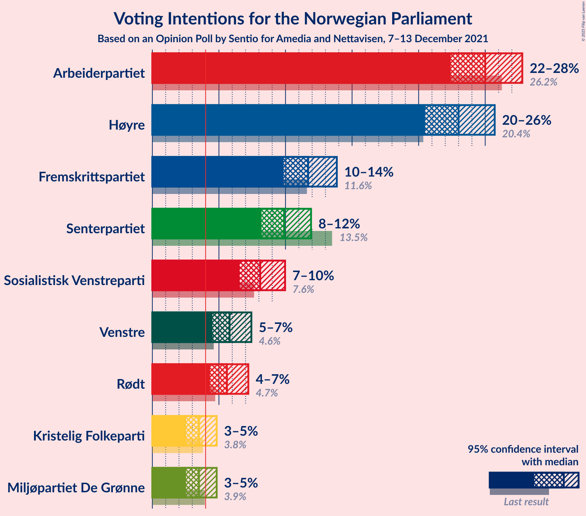

### Confidence Intervals

| Party | Last Result | Poll Result | 80% Confidence Interval | 90% Confidence Interval | 95% Confidence Interval | 99% Confidence Interval |
|:-----:|:-----------:|:-----------:|:-----------------------:|:-----------------------:|:-----------------------:|:-----------------------:|
| Arbeiderpartiet | 26.2% | 25.0% | 23.3–26.8% |22.8–27.3% |22.4–27.8% |21.6–28.7% |
| Høyre | 20.4% | 23.0% | 21.4–24.8% |20.9–25.3% |20.5–25.7% |19.7–26.6% |
| Fremskrittspartiet | 11.6% | 11.7% | 10.5–13.1% |10.1–13.5% |9.8–13.9% |9.3–14.5% |
| Senterpartiet | 13.5% | 9.9% | 8.8–11.2% |8.5–11.6% |8.2–11.9% |7.7–12.6% |
| Sosialistisk Venstreparti | 7.6% | 8.1% | 7.1–9.3% |6.8–9.7% |6.6–10.0% |6.1–10.6% |
| Venstre | 4.6% | 5.8% | 5.0–6.9% |4.7–7.2% |4.5–7.4% |4.1–8.0% |
| Rødt | 4.7% | 5.6% | 4.8–6.6% |4.5–7.0% |4.3–7.2% |4.0–7.7% |
| Kristelig Folkeparti | 3.8% | 3.5% | 2.9–4.4% |2.7–4.6% |2.5–4.8% |2.2–5.3% |
| Miljøpartiet De Grønne | 3.9% | 3.5% | 2.9–4.4% |2.7–4.6% |2.5–4.8% |2.2–5.3% |

*Note:* The poll result column reflects the actual value used in the calculations. Published results may vary slightly, and in addition be rounded to fewer digits.

## Seats

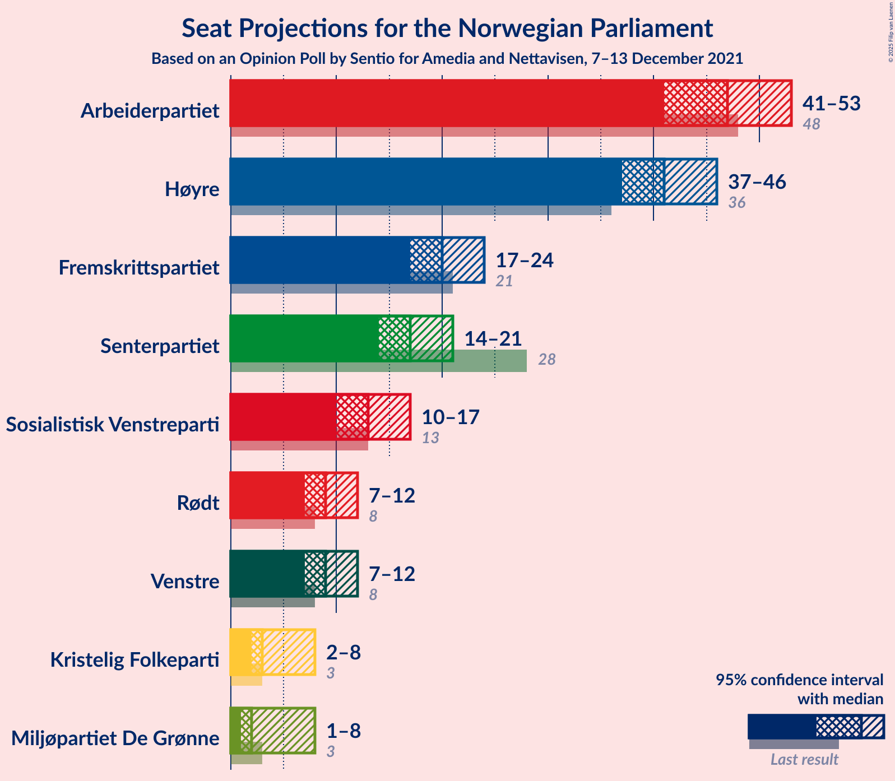

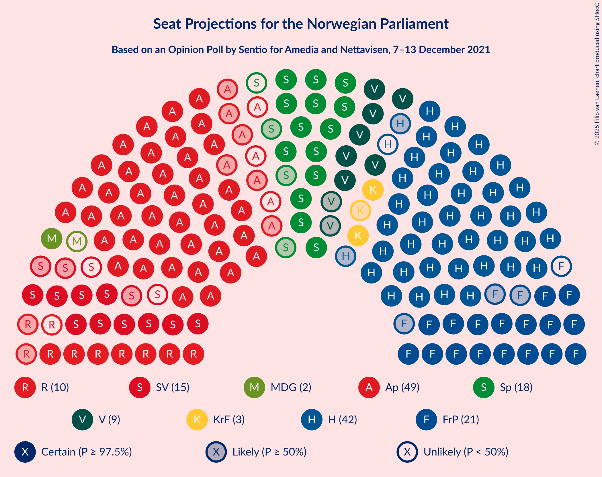

### Confidence Intervals

| Party | Last Result | Median | 80% Confidence Interval | 90% Confidence Interval | 95% Confidence Interval | 99% Confidence Interval |
|:-----:|:-----------:|:------:|:-----------------------:|:-----------------------:|:-----------------------:|:-----------------------:|
| <a href="#arbeiderpartiet">Arbeiderpartiet</a> | 48 | 47 | 44–51 |43–52 |41–53 |40–55 |
| <a href="#høyre">Høyre</a> | 36 | 41 | 39–44 |38–45 |37–46 |35–48 |
| <a href="#fremskrittspartiet">Fremskrittspartiet</a> | 21 | 20 | 18–22 |18–23 |17–24 |16–26 |
| <a href="#senterpartiet">Senterpartiet</a> | 28 | 17 | 15–20 |14–21 |14–21 |13–23 |
| <a href="#sosialistisk-venstreparti">Sosialistisk Venstreparti</a> | 13 | 13 | 11–16 |10–16 |10–17 |9–18 |
| <a href="#venstre">Venstre</a> | 8 | 9 | 8–12 |8–12 |7–12 |6–13 |
| <a href="#rødt">Rødt</a> | 8 | 9 | 7–12 |7–12 |7–12 |1–13 |
| <a href="#kristelig-folkeparti">Kristelig Folkeparti</a> | 3 | 3 | 2–7 |2–8 |2–8 |1–9 |
| <a href="#miljøpartiet-de-grønne">Miljøpartiet De Grønne</a> | 3 | 2 | 1–7 |1–7 |1–8 |1–9 |

### Arbeiderpartiet

*For a full overview of the results for this party, see the [Arbeiderpartiet](party-arbeiderpartiet.html) page.*

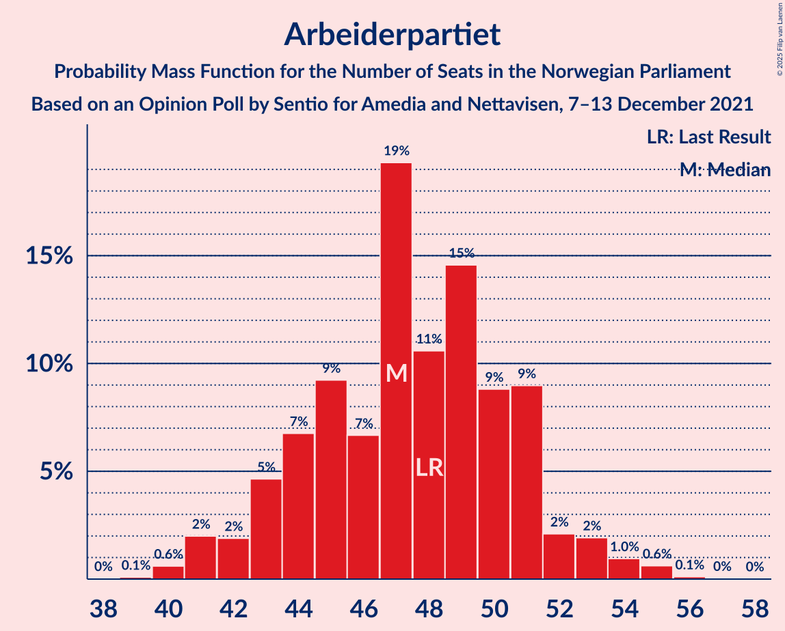

| Number of Seats | Probability | Accumulated | Special Marks |
|:---------------:|:-----------:|:-----------:|:-------------:|
| 39 | 0.1% | 100% |  |
| 40 | 0.6% | 99.9% |  |
| 41 | 2% | 99.3% |  |
| 42 | 2% | 97% |  |
| 43 | 5% | 95% |  |
| 44 | 7% | 91% |  |
| 45 | 9% | 84% |  |
| 46 | 7% | 75% |  |
| 47 | 19% | 68% | Median |
| 48 | 11% | 49% | Last Result |
| 49 | 15% | 38% |  |
| 50 | 9% | 24% |  |
| 51 | 9% | 15% |  |
| 52 | 2% | 6% |  |
| 53 | 2% | 4% |  |
| 54 | 1.0% | 2% |  |
| 55 | 0.6% | 0.8% |  |
| 56 | 0.1% | 0.2% |  |
| 57 | 0% | 0.1% |  |
| 58 | 0% | 0% |  |

### Høyre

*For a full overview of the results for this party, see the [Høyre](party-høyre.html) page.*

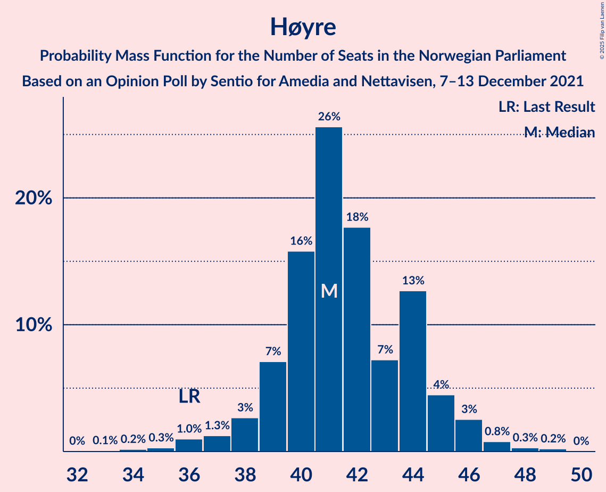

| Number of Seats | Probability | Accumulated | Special Marks |
|:---------------:|:-----------:|:-----------:|:-------------:|
| 33 | 0.1% | 100% |  |
| 34 | 0.2% | 99.9% |  |
| 35 | 0.3% | 99.7% |  |
| 36 | 1.0% | 99.4% | Last Result |
| 37 | 1.3% | 98% |  |
| 38 | 3% | 97% |  |
| 39 | 7% | 94% |  |
| 40 | 16% | 87% |  |
| 41 | 26% | 72% | Median |
| 42 | 18% | 46% |  |
| 43 | 7% | 28% |  |
| 44 | 13% | 21% |  |
| 45 | 4% | 8% |  |
| 46 | 3% | 4% |  |
| 47 | 0.8% | 1.3% |  |
| 48 | 0.3% | 0.5% |  |
| 49 | 0.2% | 0.2% |  |
| 50 | 0% | 0% |  |

### Fremskrittspartiet

*For a full overview of the results for this party, see the [Fremskrittspartiet](party-fremskrittspartiet.html) page.*

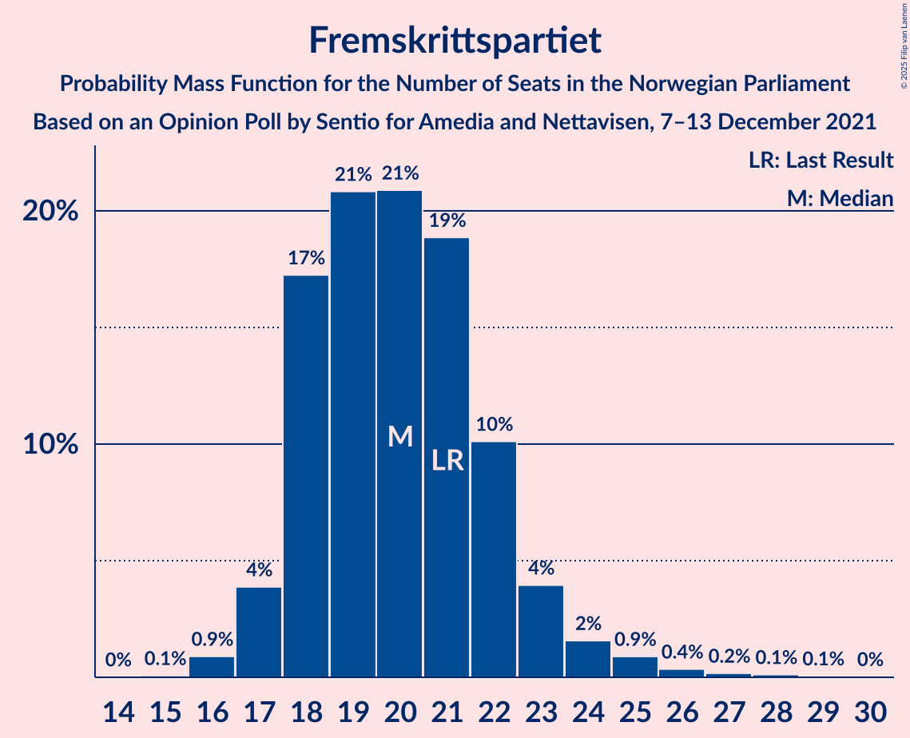

| Number of Seats | Probability | Accumulated | Special Marks |
|:---------------:|:-----------:|:-----------:|:-------------:|
| 15 | 0.1% | 100% |  |
| 16 | 0.9% | 99.9% |  |
| 17 | 4% | 99.0% |  |
| 18 | 17% | 95% |  |
| 19 | 21% | 78% |  |
| 20 | 21% | 57% | Median |
| 21 | 19% | 36% | Last Result |
| 22 | 10% | 17% |  |
| 23 | 4% | 7% |  |
| 24 | 2% | 3% |  |
| 25 | 0.9% | 2% |  |
| 26 | 0.4% | 0.7% |  |
| 27 | 0.2% | 0.4% |  |
| 28 | 0.1% | 0.2% |  |
| 29 | 0.1% | 0.1% |  |
| 30 | 0% | 0% |  |

### Senterpartiet

*For a full overview of the results for this party, see the [Senterpartiet](party-senterpartiet.html) page.*

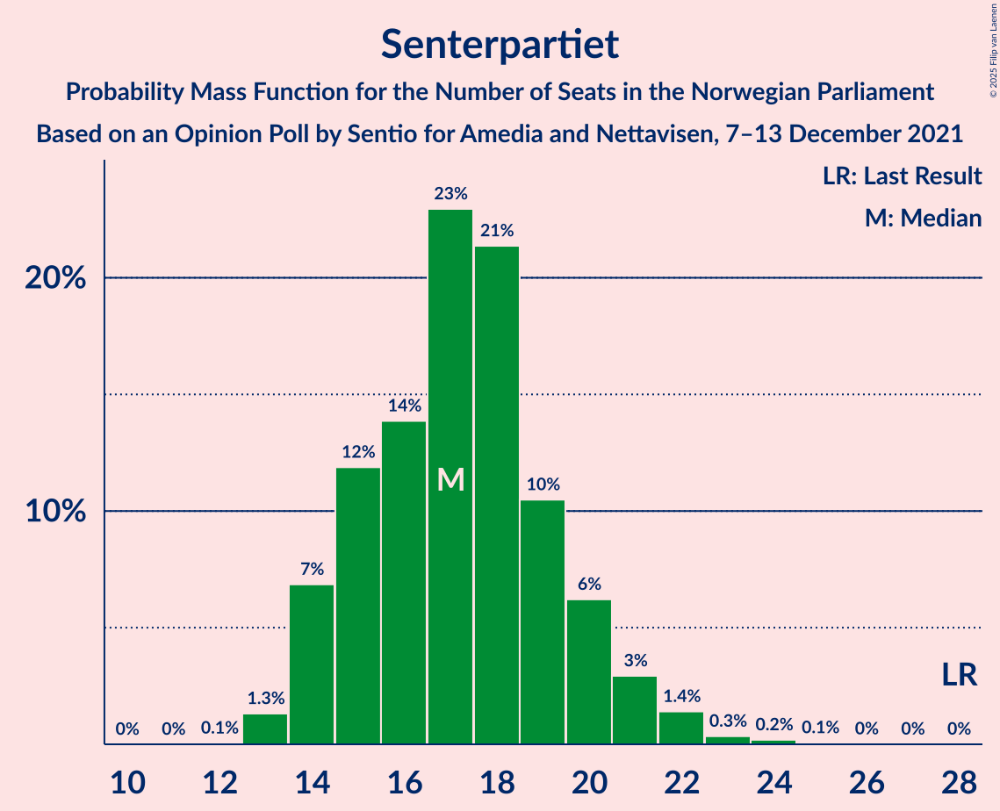

| Number of Seats | Probability | Accumulated | Special Marks |
|:---------------:|:-----------:|:-----------:|:-------------:|
| 12 | 0.1% | 100% |  |
| 13 | 1.3% | 99.9% |  |
| 14 | 7% | 98.6% |  |
| 15 | 12% | 92% |  |
| 16 | 14% | 80% |  |
| 17 | 23% | 66% | Median |
| 18 | 21% | 43% |  |
| 19 | 10% | 22% |  |
| 20 | 6% | 11% |  |
| 21 | 3% | 5% |  |
| 22 | 1.4% | 2% |  |
| 23 | 0.3% | 0.7% |  |
| 24 | 0.2% | 0.3% |  |
| 25 | 0.1% | 0.1% |  |
| 26 | 0% | 0% |  |
| 27 | 0% | 0% |  |
| 28 | 0% | 0% | Last Result |

### Sosialistisk Venstreparti

*For a full overview of the results for this party, see the [Sosialistisk Venstreparti](party-sosialistiskvenstreparti.html) page.*

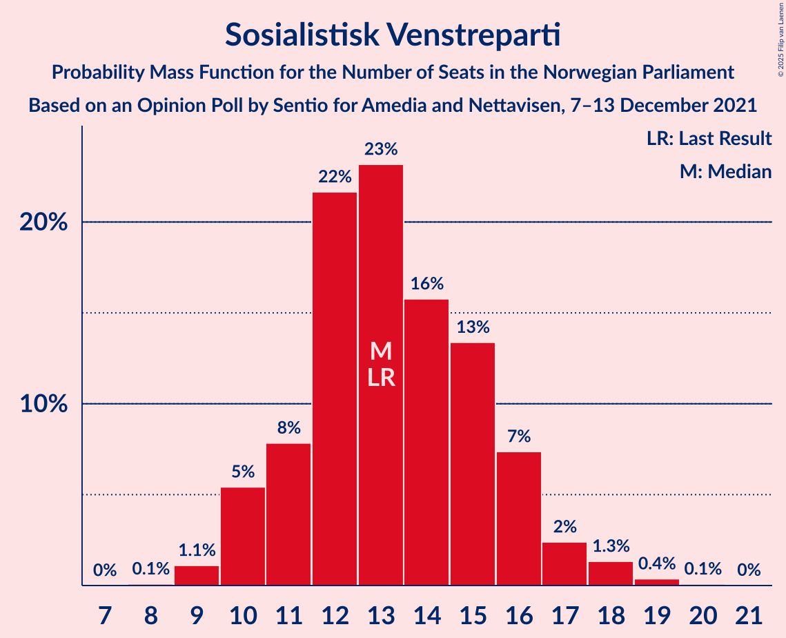

| Number of Seats | Probability | Accumulated | Special Marks |
|:---------------:|:-----------:|:-----------:|:-------------:|
| 8 | 0.1% | 100% |  |
| 9 | 1.1% | 99.9% |  |
| 10 | 5% | 98.8% |  |
| 11 | 8% | 93% |  |
| 12 | 22% | 86% |  |
| 13 | 23% | 64% | Last Result, Median |
| 14 | 16% | 41% |  |
| 15 | 13% | 25% |  |
| 16 | 7% | 12% |  |
| 17 | 2% | 4% |  |
| 18 | 1.3% | 2% |  |
| 19 | 0.4% | 0.5% |  |
| 20 | 0.1% | 0.1% |  |
| 21 | 0% | 0% |  |

### Venstre

*For a full overview of the results for this party, see the [Venstre](party-venstre.html) page.*

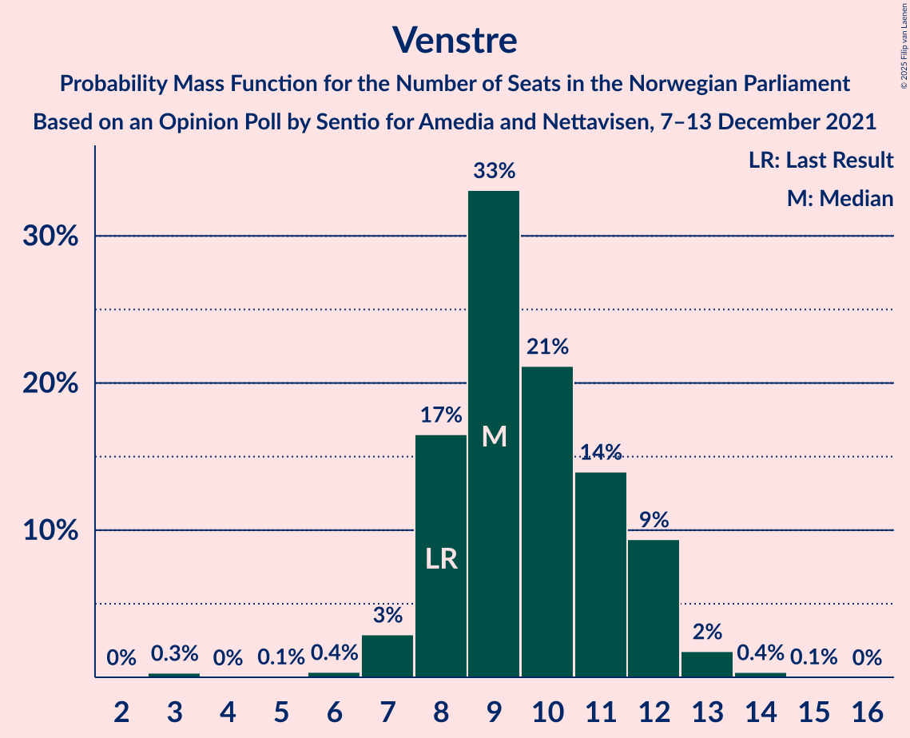

| Number of Seats | Probability | Accumulated | Special Marks |
|:---------------:|:-----------:|:-----------:|:-------------:|
| 3 | 0.3% | 100% |  |
| 4 | 0% | 99.7% |  |
| 5 | 0.1% | 99.7% |  |
| 6 | 0.4% | 99.6% |  |
| 7 | 3% | 99.3% |  |
| 8 | 17% | 96% | Last Result |
| 9 | 33% | 80% | Median |
| 10 | 21% | 47% |  |
| 11 | 14% | 26% |  |
| 12 | 9% | 12% |  |
| 13 | 2% | 2% |  |
| 14 | 0.4% | 0.4% |  |
| 15 | 0.1% | 0.1% |  |
| 16 | 0% | 0% |  |

### Rødt

*For a full overview of the results for this party, see the [Rødt](party-rødt.html) page.*

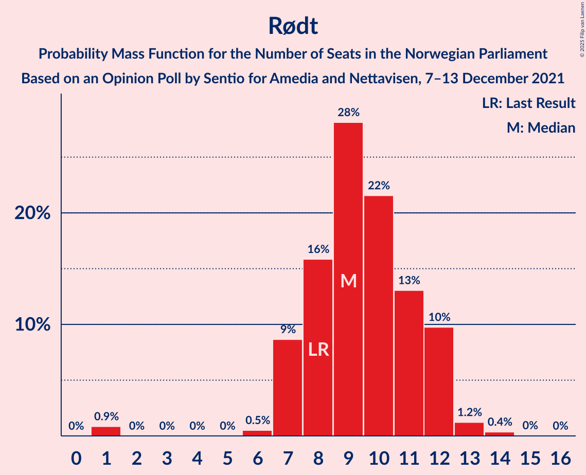

| Number of Seats | Probability | Accumulated | Special Marks |
|:---------------:|:-----------:|:-----------:|:-------------:|
| 1 | 0.9% | 100% |  |
| 2 | 0% | 99.1% |  |
| 3 | 0% | 99.1% |  |
| 4 | 0% | 99.1% |  |
| 5 | 0% | 99.1% |  |
| 6 | 0.5% | 99.1% |  |
| 7 | 9% | 98.6% |  |
| 8 | 16% | 90% | Last Result |
| 9 | 28% | 74% | Median |
| 10 | 22% | 46% |  |
| 11 | 13% | 24% |  |
| 12 | 10% | 11% |  |
| 13 | 1.2% | 2% |  |
| 14 | 0.4% | 0.4% |  |
| 15 | 0% | 0.1% |  |
| 16 | 0% | 0% |  |

### Kristelig Folkeparti

*For a full overview of the results for this party, see the [Kristelig Folkeparti](party-kristeligfolkeparti.html) page.*

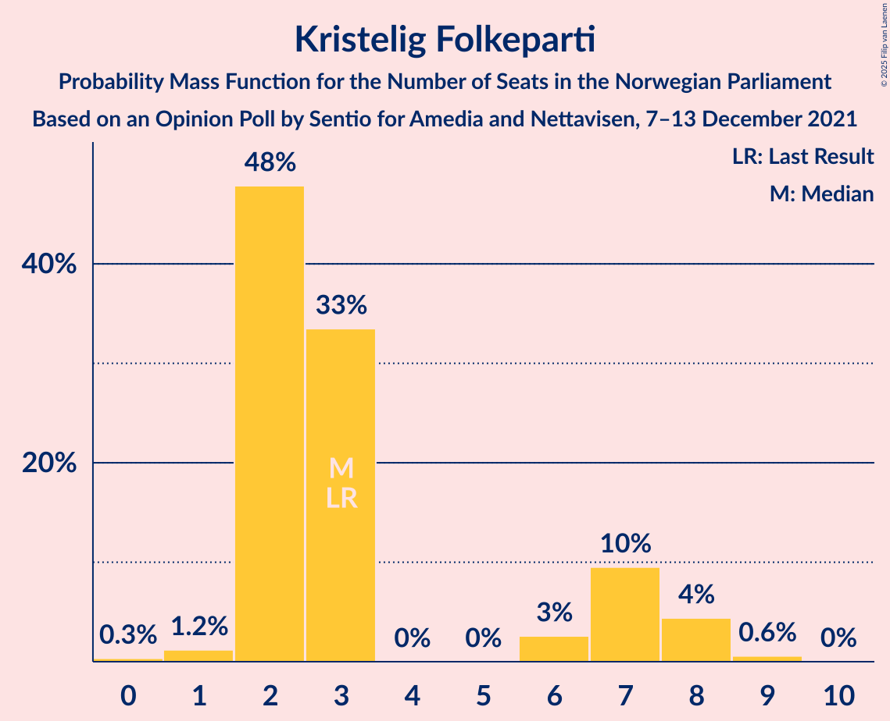

| Number of Seats | Probability | Accumulated | Special Marks |
|:---------------:|:-----------:|:-----------:|:-------------:|
| 0 | 0.3% | 100% |  |
| 1 | 1.2% | 99.7% |  |
| 2 | 48% | 98% |  |
| 3 | 33% | 51% | Last Result, Median |
| 4 | 0% | 17% |  |
| 5 | 0% | 17% |  |
| 6 | 3% | 17% |  |
| 7 | 10% | 15% |  |
| 8 | 4% | 5% |  |
| 9 | 0.6% | 0.6% |  |
| 10 | 0% | 0% |  |

### Miljøpartiet De Grønne

*For a full overview of the results for this party, see the [Miljøpartiet De Grønne](party-miljøpartietdegrønne.html) page.*

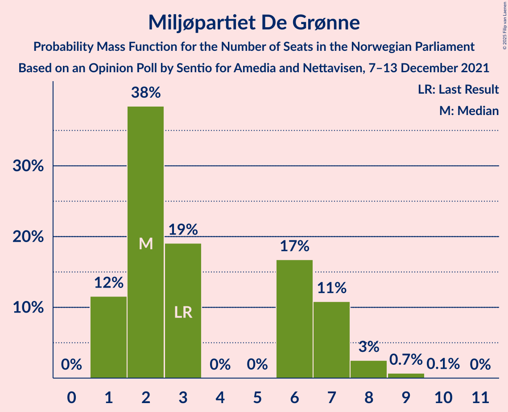

| Number of Seats | Probability | Accumulated | Special Marks |
|:---------------:|:-----------:|:-----------:|:-------------:|
| 1 | 12% | 100% |  |
| 2 | 38% | 88% | Median |
| 3 | 19% | 50% | Last Result |
| 4 | 0% | 31% |  |
| 5 | 0% | 31% |  |
| 6 | 17% | 31% |  |
| 7 | 11% | 14% |  |
| 8 | 3% | 3% |  |
| 9 | 0.7% | 0.8% |  |
| 10 | 0.1% | 0.1% |  |
| 11 | 0% | 0% |  |

## Coalitions

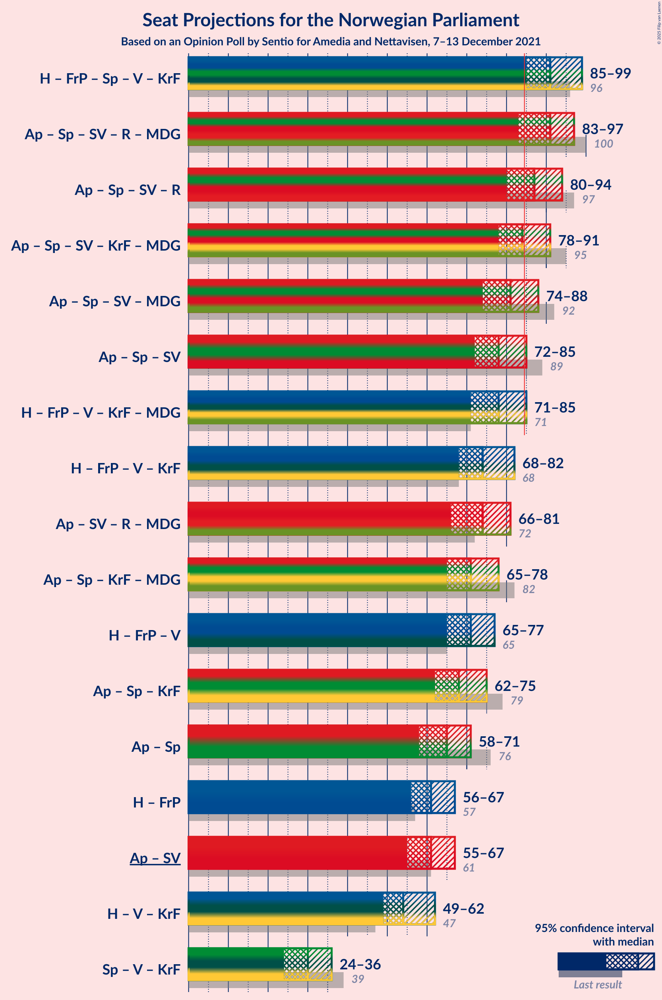

### Confidence Intervals

| Coalition | Last Result | Median | Majority? | 80% Confidence Interval | 90% Confidence Interval | 95% Confidence Interval | 99% Confidence Interval |
|:---------:|:-----------:|:------:|:---------:|:-----------------------:|:-----------------------:|:-----------------------:|:-----------------------:|
| Høyre – Fremskrittspartiet – Senterpartiet – Venstre – Kristelig Folkeparti | 96 | 91 | 98% | 86–97 | 86–98 | 85–99 | 82–102 |
| Arbeiderpartiet – Senterpartiet – Sosialistisk Venstreparti – Rødt – Miljøpartiet De Grønne | 100 | 91 | 95% | 86–95 | 85–96 | 83–97 | 81–99 |
| Arbeiderpartiet – Senterpartiet – Sosialistisk Venstreparti – Rødt | 97 | 87 | 77% | 82–93 | 81–93 | 80–94 | 79–97 |
| Arbeiderpartiet – Senterpartiet – Sosialistisk Venstreparti – Kristelig Folkeparti – Miljøpartiet De Grønne | 95 | 84 | 46% | 81–89 | 80–90 | 78–91 | 77–94 |
| Arbeiderpartiet – Senterpartiet – Sosialistisk Venstreparti – Miljøpartiet De Grønne | 92 | 81 | 17% | 77–86 | 76–87 | 74–88 | 73–90 |
| Arbeiderpartiet – Senterpartiet – Sosialistisk Venstreparti | 89 | 78 | 4% | 73–82 | 73–83 | 72–85 | 70–88 |
| Høyre – Fremskrittspartiet – Venstre – Kristelig Folkeparti – Miljøpartiet De Grønne | 71 | 78 | 3% | 73–82 | 72–83 | 71–85 | 69–87 |
| Høyre – Fremskrittspartiet – Venstre – Kristelig Folkeparti | 68 | 74 | 0.4% | 70–79 | 69–81 | 68–82 | 66–84 |
| Arbeiderpartiet – Sosialistisk Venstreparti – Rødt – Miljøpartiet De Grønne | 72 | 74 | 0.1% | 69–78 | 68–79 | 66–81 | 65–82 |
| Arbeiderpartiet – Senterpartiet – Kristelig Folkeparti – Miljøpartiet De Grønne | 82 | 71 | 0.1% | 67–76 | 66–77 | 65–78 | 63–81 |
| Høyre – Fremskrittspartiet – Venstre | 65 | 71 | 0% | 67–75 | 67–76 | 65–77 | 63–79 |
| Arbeiderpartiet – Senterpartiet – Kristelig Folkeparti | 79 | 68 | 0% | 64–71 | 63–73 | 62–75 | 60–78 |
| Arbeiderpartiet – Senterpartiet | 76 | 65 | 0% | 61–68 | 60–69 | 58–71 | 57–73 |
| Høyre – Fremskrittspartiet | 57 | 61 | 0% | 58–65 | 57–67 | 56–67 | 54–69 |
| Arbeiderpartiet – Sosialistisk Venstreparti | 61 | 61 | 0% | 56–65 | 56–65 | 55–67 | 53–69 |
| Høyre – Venstre – Kristelig Folkeparti | 47 | 54 | 0% | 51–58 | 50–60 | 49–62 | 48–63 |
| Senterpartiet – Venstre – Kristelig Folkeparti | 39 | 30 | 0% | 26–34 | 25–35 | 24–36 | 24–39 |

### Høyre – Fremskrittspartiet – Senterpartiet – Venstre – Kristelig Folkeparti

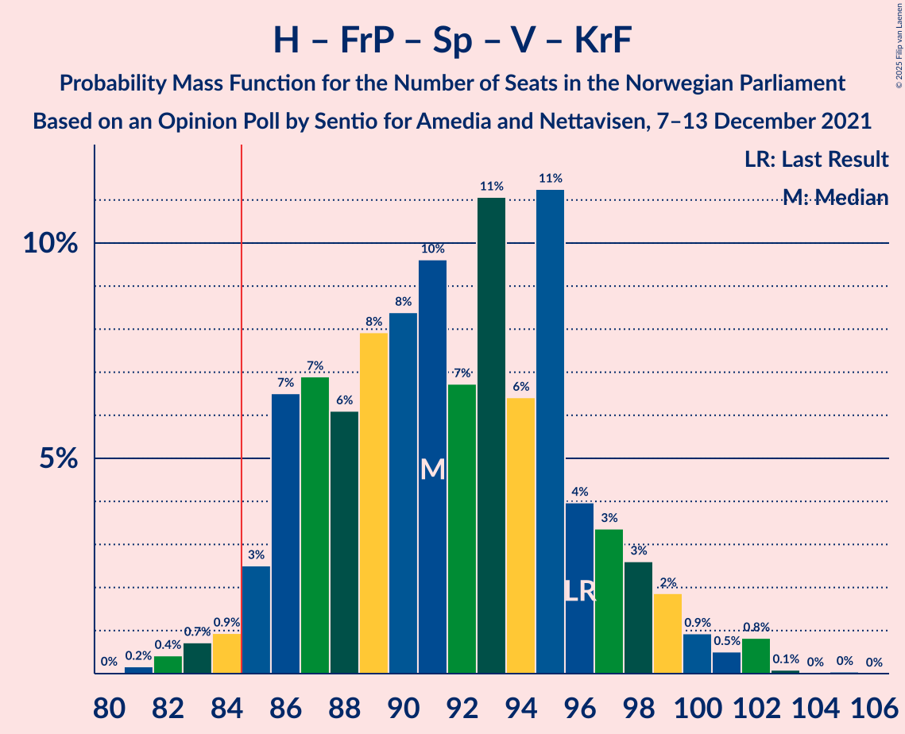

| Number of Seats | Probability | Accumulated | Special Marks |
|:---------------:|:-----------:|:-----------:|:-------------:|
| 80 | 0% | 100% |  |
| 81 | 0.2% | 99.9% |  |
| 82 | 0.4% | 99.8% |  |
| 83 | 0.7% | 99.3% |  |
| 84 | 0.9% | 98.6% |  |
| 85 | 3% | 98% | Majority |
| 86 | 7% | 95% |  |
| 87 | 7% | 89% |  |
| 88 | 6% | 82% |  |
| 89 | 8% | 76% |  |
| 90 | 8% | 68% | Median |
| 91 | 10% | 59% |  |
| 92 | 7% | 50% |  |
| 93 | 11% | 43% |  |
| 94 | 6% | 32% |  |
| 95 | 11% | 26% |  |
| 96 | 4% | 14% | Last Result |
| 97 | 3% | 10% |  |
| 98 | 3% | 7% |  |
| 99 | 2% | 4% |  |
| 100 | 0.9% | 2% |  |
| 101 | 0.5% | 2% |  |
| 102 | 0.8% | 1.0% |  |
| 103 | 0.1% | 0.2% |  |
| 104 | 0% | 0.1% |  |
| 105 | 0% | 0.1% |  |
| 106 | 0% | 0% |  |

### Arbeiderpartiet – Senterpartiet – Sosialistisk Venstreparti – Rødt – Miljøpartiet De Grønne

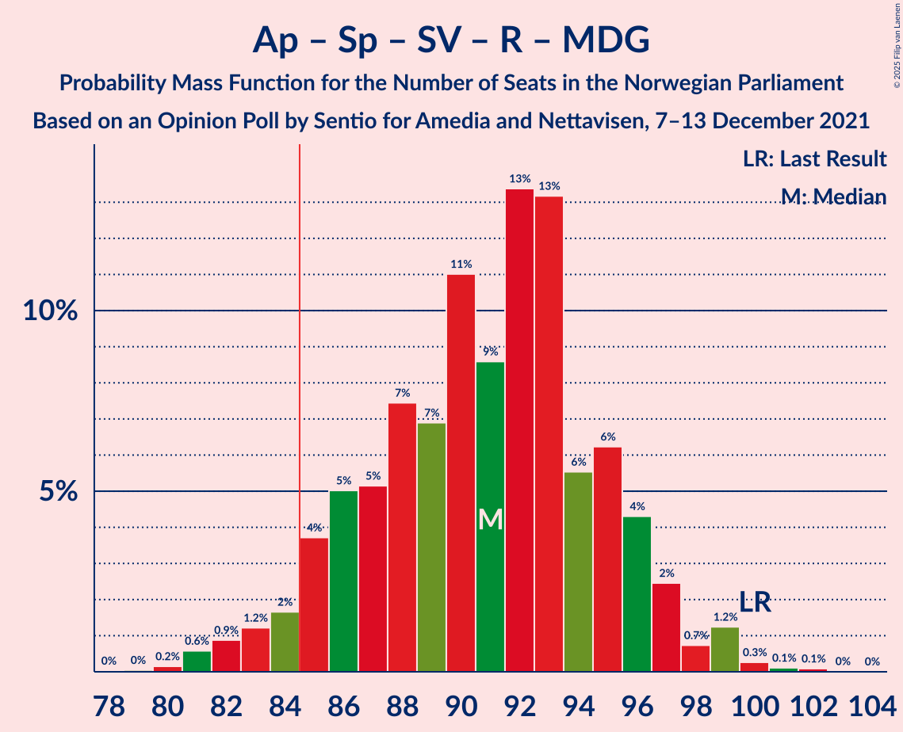

| Number of Seats | Probability | Accumulated | Special Marks |
|:---------------:|:-----------:|:-----------:|:-------------:|
| 78 | 0% | 100% |  |
| 79 | 0% | 99.9% |  |
| 80 | 0.2% | 99.9% |  |
| 81 | 0.6% | 99.7% |  |
| 82 | 0.9% | 99.2% |  |
| 83 | 1.2% | 98% |  |
| 84 | 2% | 97% |  |
| 85 | 4% | 95% | Majority |
| 86 | 5% | 92% |  |
| 87 | 5% | 87% |  |
| 88 | 7% | 82% | Median |
| 89 | 7% | 74% |  |
| 90 | 11% | 67% |  |
| 91 | 9% | 56% |  |
| 92 | 13% | 48% |  |
| 93 | 13% | 34% |  |
| 94 | 6% | 21% |  |
| 95 | 6% | 15% |  |
| 96 | 4% | 9% |  |
| 97 | 2% | 5% |  |
| 98 | 0.7% | 2% |  |
| 99 | 1.2% | 2% |  |
| 100 | 0.3% | 0.5% | Last Result |
| 101 | 0.1% | 0.2% |  |
| 102 | 0.1% | 0.1% |  |
| 103 | 0% | 0% |  |

### Arbeiderpartiet – Senterpartiet – Sosialistisk Venstreparti – Rødt

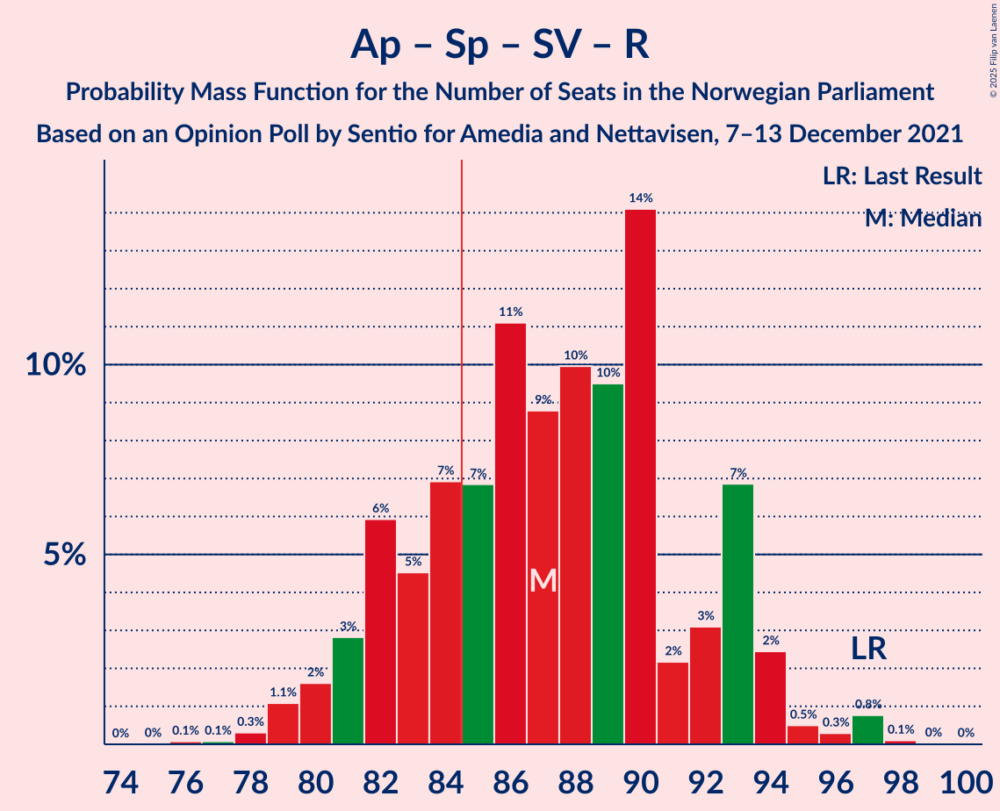

| Number of Seats | Probability | Accumulated | Special Marks |
|:---------------:|:-----------:|:-----------:|:-------------:|
| 76 | 0.1% | 100% |  |
| 77 | 0.1% | 99.9% |  |
| 78 | 0.3% | 99.8% |  |
| 79 | 1.1% | 99.5% |  |
| 80 | 2% | 98% |  |
| 81 | 3% | 97% |  |
| 82 | 6% | 94% |  |
| 83 | 5% | 88% |  |
| 84 | 7% | 84% |  |
| 85 | 7% | 77% | Majority |
| 86 | 11% | 70% | Median |
| 87 | 9% | 59% |  |
| 88 | 10% | 50% |  |
| 89 | 10% | 40% |  |
| 90 | 14% | 30% |  |
| 91 | 2% | 16% |  |
| 92 | 3% | 14% |  |
| 93 | 7% | 11% |  |
| 94 | 2% | 4% |  |
| 95 | 0.5% | 2% |  |
| 96 | 0.3% | 1.2% |  |
| 97 | 0.8% | 0.9% | Last Result |
| 98 | 0.1% | 0.2% |  |
| 99 | 0% | 0% |  |

### Arbeiderpartiet – Senterpartiet – Sosialistisk Venstreparti – Kristelig Folkeparti – Miljøpartiet De Grønne

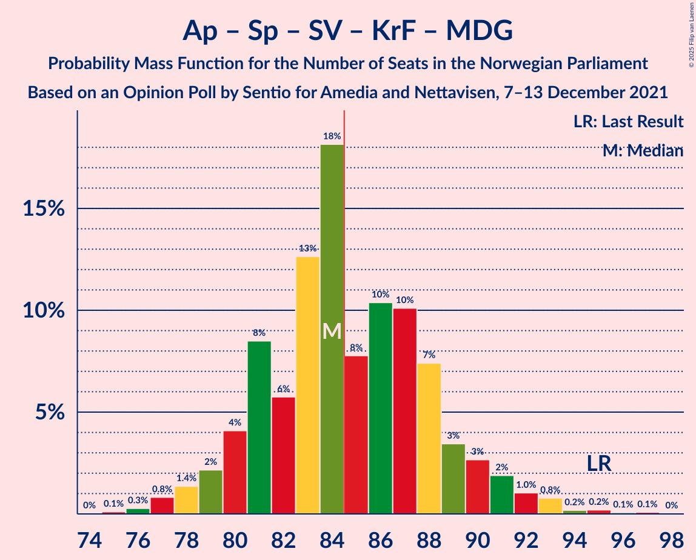

| Number of Seats | Probability | Accumulated | Special Marks |
|:---------------:|:-----------:|:-----------:|:-------------:|
| 74 | 0% | 100% |  |
| 75 | 0.1% | 99.9% |  |
| 76 | 0.3% | 99.8% |  |
| 77 | 0.8% | 99.5% |  |
| 78 | 1.4% | 98.7% |  |
| 79 | 2% | 97% |  |
| 80 | 4% | 95% |  |
| 81 | 8% | 91% |  |
| 82 | 6% | 83% | Median |
| 83 | 13% | 77% |  |
| 84 | 18% | 64% |  |
| 85 | 8% | 46% | Majority |
| 86 | 10% | 38% |  |
| 87 | 10% | 28% |  |
| 88 | 7% | 18% |  |
| 89 | 3% | 10% |  |
| 90 | 3% | 7% |  |
| 91 | 2% | 4% |  |
| 92 | 1.0% | 2% |  |
| 93 | 0.8% | 1.4% |  |
| 94 | 0.2% | 0.6% |  |
| 95 | 0.2% | 0.4% | Last Result |
| 96 | 0.1% | 0.2% |  |
| 97 | 0.1% | 0.1% |  |
| 98 | 0% | 0% |  |

### Arbeiderpartiet – Senterpartiet – Sosialistisk Venstreparti – Miljøpartiet De Grønne

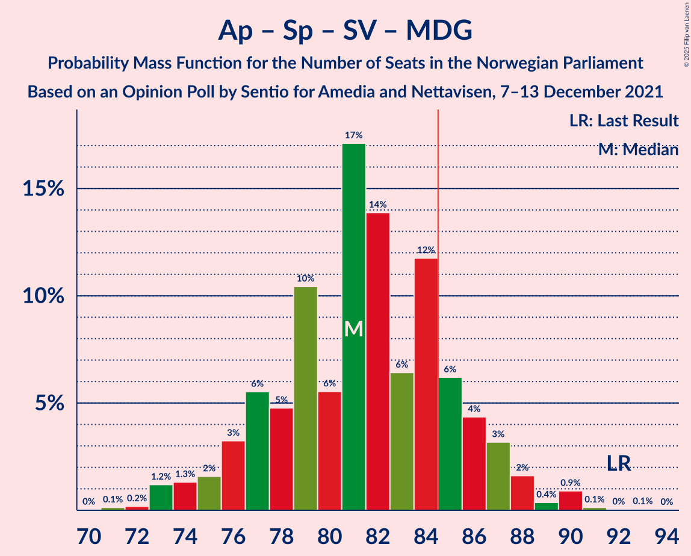

| Number of Seats | Probability | Accumulated | Special Marks |
|:---------------:|:-----------:|:-----------:|:-------------:|
| 71 | 0.1% | 100% |  |
| 72 | 0.2% | 99.8% |  |
| 73 | 1.2% | 99.6% |  |
| 74 | 1.3% | 98% |  |
| 75 | 2% | 97% |  |
| 76 | 3% | 96% |  |
| 77 | 6% | 92% |  |
| 78 | 5% | 87% |  |
| 79 | 10% | 82% | Median |
| 80 | 6% | 72% |  |
| 81 | 17% | 66% |  |
| 82 | 14% | 49% |  |
| 83 | 6% | 35% |  |
| 84 | 12% | 29% |  |
| 85 | 6% | 17% | Majority |
| 86 | 4% | 11% |  |
| 87 | 3% | 6% |  |
| 88 | 2% | 3% |  |
| 89 | 0.4% | 2% |  |
| 90 | 0.9% | 1.2% |  |
| 91 | 0.1% | 0.3% |  |
| 92 | 0% | 0.1% | Last Result |
| 93 | 0.1% | 0.1% |  |
| 94 | 0% | 0% |  |

### Arbeiderpartiet – Senterpartiet – Sosialistisk Venstreparti

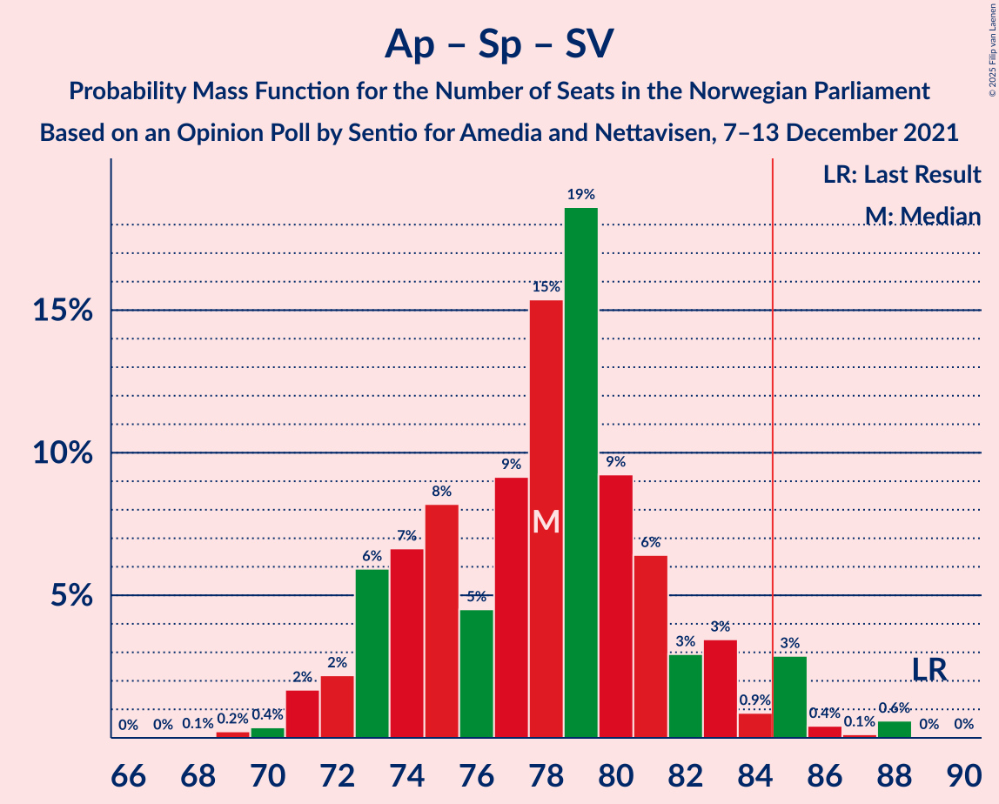

| Number of Seats | Probability | Accumulated | Special Marks |
|:---------------:|:-----------:|:-----------:|:-------------:|
| 68 | 0.1% | 100% |  |
| 69 | 0.2% | 99.9% |  |
| 70 | 0.4% | 99.7% |  |
| 71 | 2% | 99.3% |  |
| 72 | 2% | 98% |  |
| 73 | 6% | 95% |  |
| 74 | 7% | 90% |  |
| 75 | 8% | 83% |  |
| 76 | 5% | 75% |  |
| 77 | 9% | 70% | Median |
| 78 | 15% | 61% |  |
| 79 | 19% | 46% |  |
| 80 | 9% | 27% |  |
| 81 | 6% | 18% |  |
| 82 | 3% | 11% |  |
| 83 | 3% | 8% |  |
| 84 | 0.9% | 5% |  |
| 85 | 3% | 4% | Majority |
| 86 | 0.4% | 1.2% |  |
| 87 | 0.1% | 0.8% |  |
| 88 | 0.6% | 0.7% |  |
| 89 | 0% | 0.1% | Last Result |
| 90 | 0% | 0% |  |

### Høyre – Fremskrittspartiet – Venstre – Kristelig Folkeparti – Miljøpartiet De Grønne

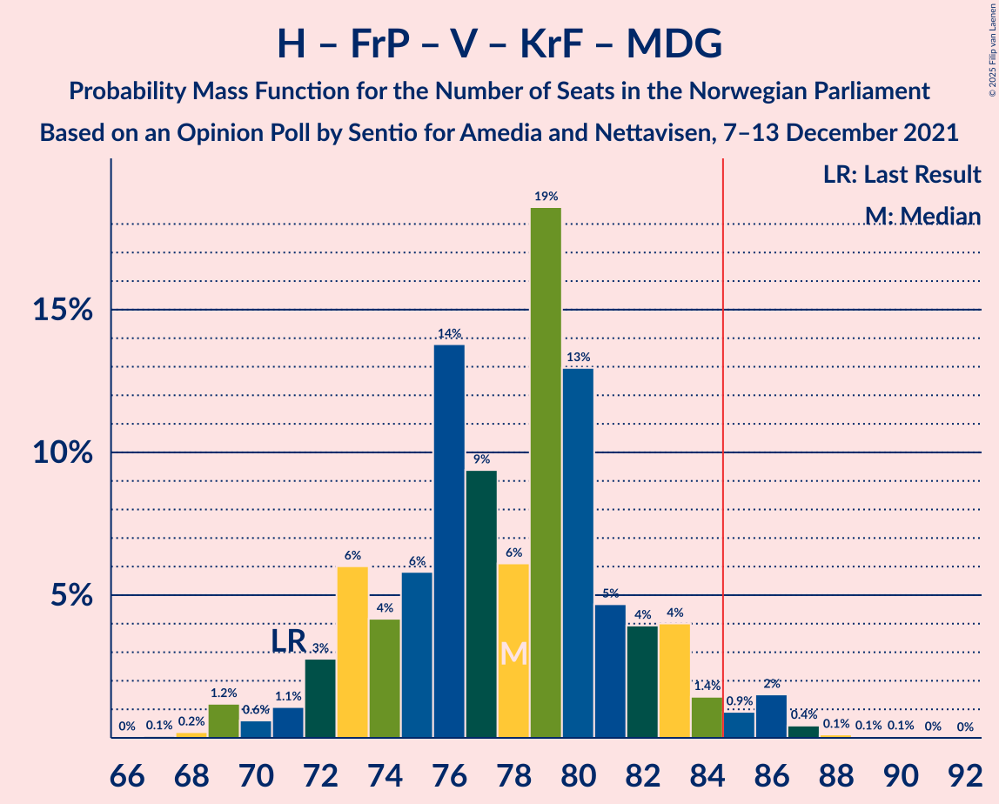

| Number of Seats | Probability | Accumulated | Special Marks |
|:---------------:|:-----------:|:-----------:|:-------------:|
| 67 | 0.1% | 100% |  |
| 68 | 0.2% | 99.9% |  |
| 69 | 1.2% | 99.7% |  |
| 70 | 0.6% | 98% |  |
| 71 | 1.1% | 98% | Last Result |
| 72 | 3% | 97% |  |
| 73 | 6% | 94% |  |
| 74 | 4% | 88% |  |
| 75 | 6% | 84% | Median |
| 76 | 14% | 78% |  |
| 77 | 9% | 64% |  |
| 78 | 6% | 55% |  |
| 79 | 19% | 49% |  |
| 80 | 13% | 30% |  |
| 81 | 5% | 17% |  |
| 82 | 4% | 13% |  |
| 83 | 4% | 9% |  |
| 84 | 1.4% | 5% |  |
| 85 | 0.9% | 3% | Majority |
| 86 | 2% | 2% |  |
| 87 | 0.4% | 0.7% |  |
| 88 | 0.1% | 0.3% |  |
| 89 | 0.1% | 0.1% |  |
| 90 | 0.1% | 0.1% |  |
| 91 | 0% | 0% |  |

### Høyre – Fremskrittspartiet – Venstre – Kristelig Folkeparti

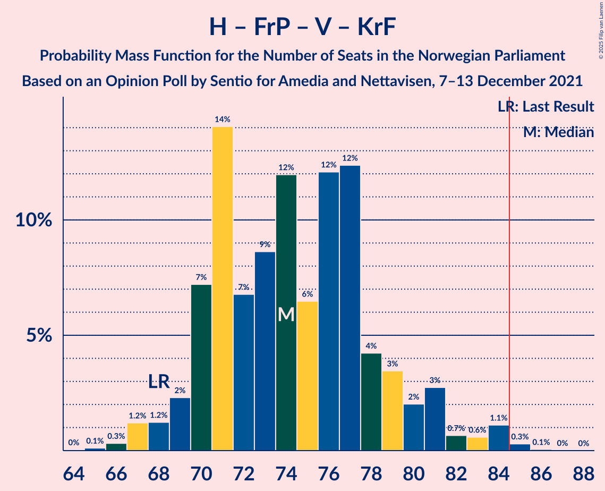

| Number of Seats | Probability | Accumulated | Special Marks |
|:---------------:|:-----------:|:-----------:|:-------------:|
| 64 | 0% | 100% |  |
| 65 | 0.1% | 99.9% |  |
| 66 | 0.3% | 99.8% |  |
| 67 | 1.2% | 99.5% |  |
| 68 | 1.2% | 98% | Last Result |
| 69 | 2% | 97% |  |
| 70 | 7% | 95% |  |
| 71 | 14% | 88% |  |
| 72 | 7% | 73% |  |
| 73 | 9% | 67% | Median |
| 74 | 12% | 58% |  |
| 75 | 6% | 46% |  |
| 76 | 12% | 40% |  |
| 77 | 12% | 28% |  |
| 78 | 4% | 15% |  |
| 79 | 3% | 11% |  |
| 80 | 2% | 8% |  |
| 81 | 3% | 5% |  |
| 82 | 0.7% | 3% |  |
| 83 | 0.6% | 2% |  |
| 84 | 1.1% | 1.5% |  |
| 85 | 0.3% | 0.4% | Majority |
| 86 | 0.1% | 0.1% |  |
| 87 | 0% | 0% |  |

### Arbeiderpartiet – Sosialistisk Venstreparti – Rødt – Miljøpartiet De Grønne

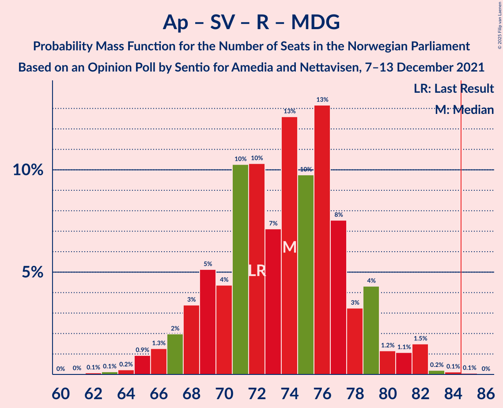

| Number of Seats | Probability | Accumulated | Special Marks |
|:---------------:|:-----------:|:-----------:|:-------------:|
| 61 | 0% | 100% |  |
| 62 | 0.1% | 99.9% |  |
| 63 | 0.1% | 99.9% |  |
| 64 | 0.2% | 99.7% |  |
| 65 | 0.9% | 99.5% |  |
| 66 | 1.3% | 98.6% |  |
| 67 | 2% | 97% |  |
| 68 | 3% | 95% |  |
| 69 | 5% | 92% |  |
| 70 | 4% | 87% |  |
| 71 | 10% | 82% | Median |
| 72 | 10% | 72% | Last Result |
| 73 | 7% | 62% |  |
| 74 | 13% | 55% |  |
| 75 | 10% | 42% |  |
| 76 | 13% | 32% |  |
| 77 | 8% | 19% |  |
| 78 | 3% | 12% |  |
| 79 | 4% | 8% |  |
| 80 | 1.2% | 4% |  |
| 81 | 1.1% | 3% |  |
| 82 | 1.5% | 2% |  |
| 83 | 0.2% | 0.4% |  |
| 84 | 0.1% | 0.2% |  |
| 85 | 0.1% | 0.1% | Majority |
| 86 | 0% | 0% |  |

### Arbeiderpartiet – Senterpartiet – Kristelig Folkeparti – Miljøpartiet De Grønne

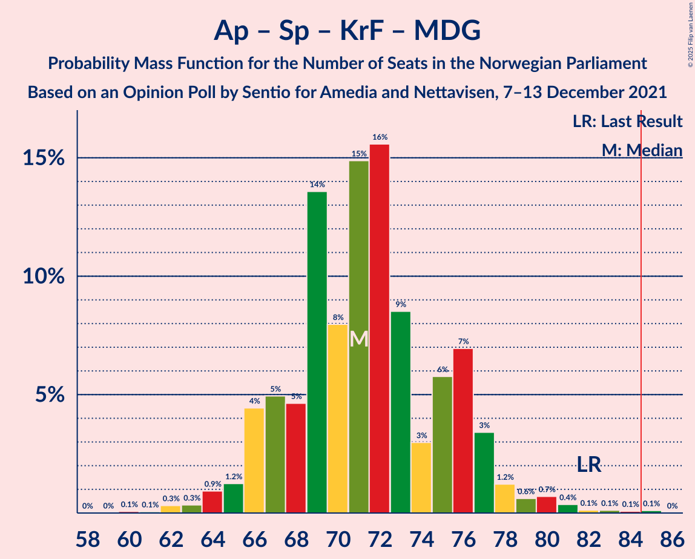

| Number of Seats | Probability | Accumulated | Special Marks |
|:---------------:|:-----------:|:-----------:|:-------------:|
| 60 | 0.1% | 100% |  |
| 61 | 0.1% | 99.9% |  |
| 62 | 0.3% | 99.9% |  |
| 63 | 0.3% | 99.5% |  |
| 64 | 0.9% | 99.2% |  |
| 65 | 1.2% | 98% |  |
| 66 | 4% | 97% |  |
| 67 | 5% | 93% |  |
| 68 | 5% | 88% |  |
| 69 | 14% | 83% | Median |
| 70 | 8% | 69% |  |
| 71 | 15% | 61% |  |
| 72 | 16% | 47% |  |
| 73 | 9% | 31% |  |
| 74 | 3% | 22% |  |
| 75 | 6% | 19% |  |
| 76 | 7% | 14% |  |
| 77 | 3% | 7% |  |
| 78 | 1.2% | 3% |  |
| 79 | 0.6% | 2% |  |
| 80 | 0.7% | 2% |  |
| 81 | 0.4% | 0.8% |  |
| 82 | 0.1% | 0.5% | Last Result |
| 83 | 0.1% | 0.3% |  |
| 84 | 0.1% | 0.2% |  |
| 85 | 0.1% | 0.1% | Majority |
| 86 | 0% | 0% |  |

### Høyre – Fremskrittspartiet – Venstre

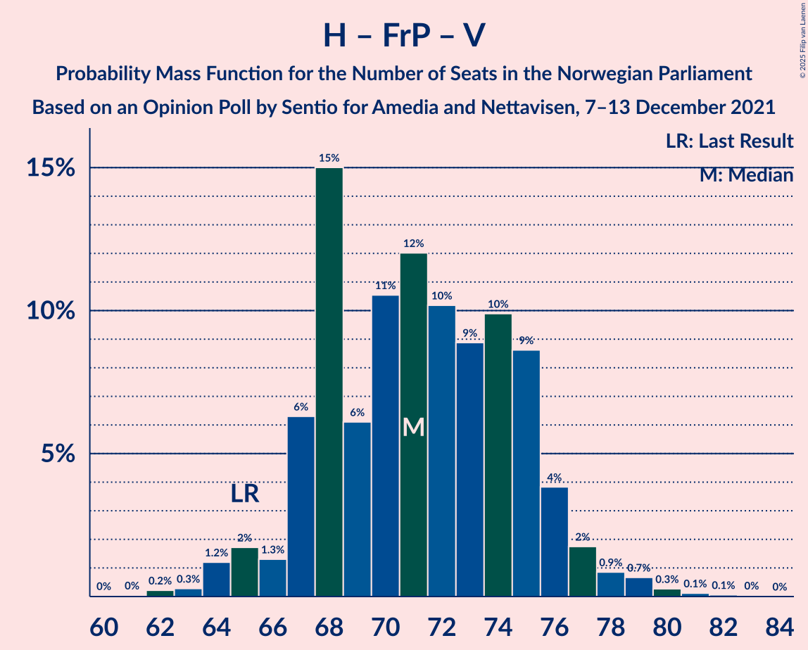

| Number of Seats | Probability | Accumulated | Special Marks |
|:---------------:|:-----------:|:-----------:|:-------------:|
| 60 | 0% | 100% |  |
| 61 | 0% | 99.9% |  |
| 62 | 0.2% | 99.9% |  |
| 63 | 0.3% | 99.7% |  |
| 64 | 1.2% | 99.4% |  |
| 65 | 2% | 98% | Last Result |
| 66 | 1.3% | 96% |  |
| 67 | 6% | 95% |  |
| 68 | 15% | 89% |  |
| 69 | 6% | 74% |  |
| 70 | 11% | 68% | Median |
| 71 | 12% | 57% |  |
| 72 | 10% | 45% |  |
| 73 | 9% | 35% |  |
| 74 | 10% | 26% |  |
| 75 | 9% | 16% |  |
| 76 | 4% | 8% |  |
| 77 | 2% | 4% |  |
| 78 | 0.9% | 2% |  |
| 79 | 0.7% | 1.2% |  |
| 80 | 0.3% | 0.5% |  |
| 81 | 0.1% | 0.2% |  |
| 82 | 0.1% | 0.1% |  |
| 83 | 0% | 0% |  |

### Arbeiderpartiet – Senterpartiet – Kristelig Folkeparti

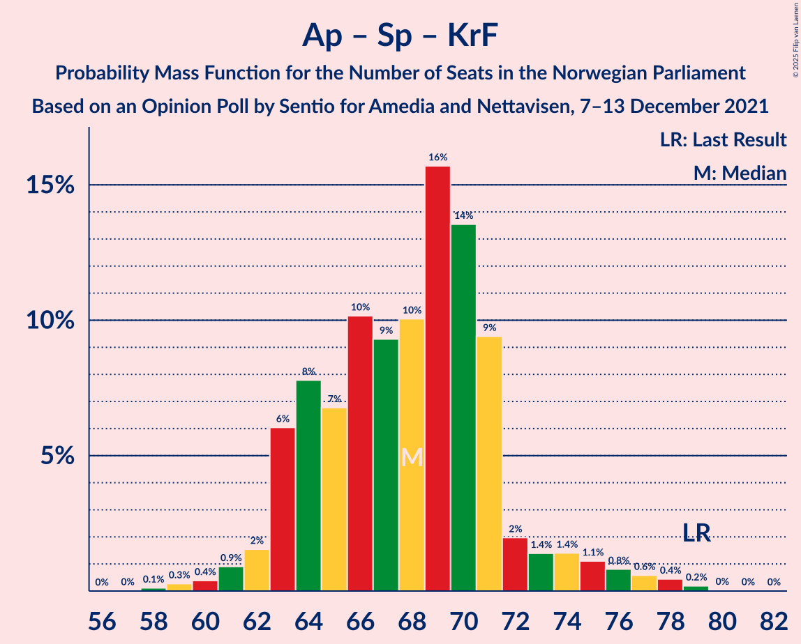

| Number of Seats | Probability | Accumulated | Special Marks |
|:---------------:|:-----------:|:-----------:|:-------------:|
| 58 | 0.1% | 100% |  |
| 59 | 0.3% | 99.9% |  |
| 60 | 0.4% | 99.6% |  |
| 61 | 0.9% | 99.2% |  |
| 62 | 2% | 98% |  |
| 63 | 6% | 97% |  |
| 64 | 8% | 91% |  |
| 65 | 7% | 83% |  |
| 66 | 10% | 76% |  |
| 67 | 9% | 66% | Median |
| 68 | 10% | 57% |  |
| 69 | 16% | 47% |  |
| 70 | 14% | 31% |  |
| 71 | 9% | 17% |  |
| 72 | 2% | 8% |  |
| 73 | 1.4% | 6% |  |
| 74 | 1.4% | 5% |  |
| 75 | 1.1% | 3% |  |
| 76 | 0.8% | 2% |  |
| 77 | 0.6% | 1.3% |  |
| 78 | 0.4% | 0.7% |  |
| 79 | 0.2% | 0.3% | Last Result |
| 80 | 0% | 0.1% |  |
| 81 | 0% | 0% |  |

### Arbeiderpartiet – Senterpartiet

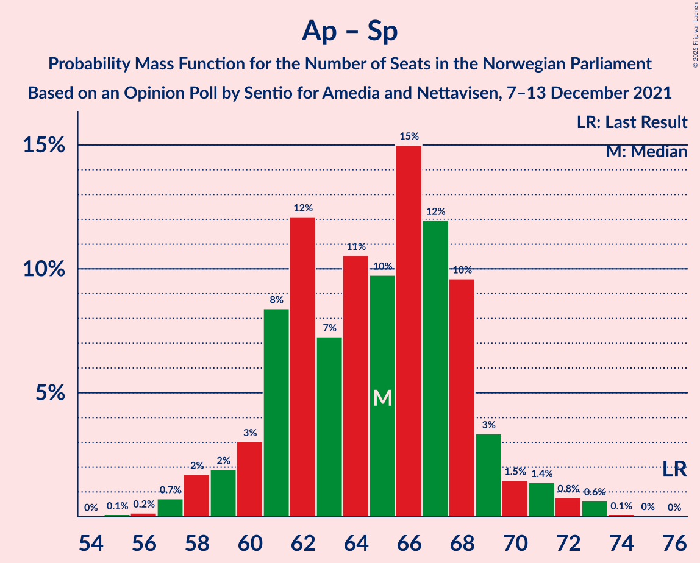

| Number of Seats | Probability | Accumulated | Special Marks |
|:---------------:|:-----------:|:-----------:|:-------------:|
| 55 | 0.1% | 100% |  |
| 56 | 0.2% | 99.9% |  |
| 57 | 0.7% | 99.7% |  |
| 58 | 2% | 99.0% |  |
| 59 | 2% | 97% |  |
| 60 | 3% | 95% |  |
| 61 | 8% | 92% |  |
| 62 | 12% | 84% |  |
| 63 | 7% | 72% |  |
| 64 | 11% | 65% | Median |
| 65 | 10% | 54% |  |
| 66 | 15% | 44% |  |
| 67 | 12% | 29% |  |
| 68 | 10% | 17% |  |
| 69 | 3% | 8% |  |
| 70 | 1.5% | 4% |  |
| 71 | 1.4% | 3% |  |
| 72 | 0.8% | 2% |  |
| 73 | 0.6% | 0.8% |  |
| 74 | 0.1% | 0.2% |  |
| 75 | 0% | 0.1% |  |
| 76 | 0% | 0% | Last Result |

### Høyre – Fremskrittspartiet

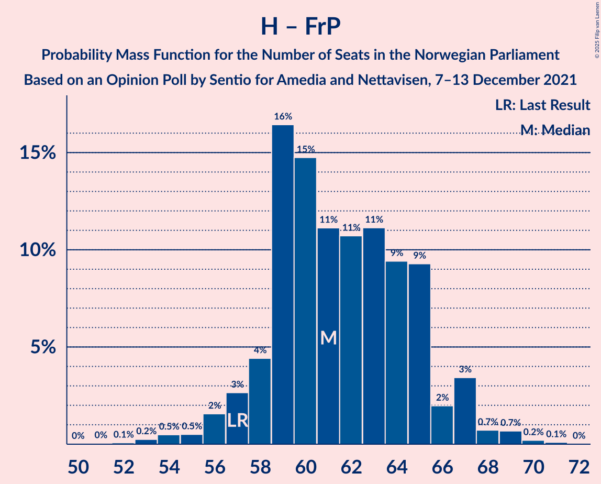

| Number of Seats | Probability | Accumulated | Special Marks |
|:---------------:|:-----------:|:-----------:|:-------------:|
| 51 | 0% | 100% |  |
| 52 | 0.1% | 99.9% |  |
| 53 | 0.2% | 99.9% |  |
| 54 | 0.5% | 99.6% |  |
| 55 | 0.5% | 99.1% |  |
| 56 | 2% | 98.6% |  |
| 57 | 3% | 97% | Last Result |
| 58 | 4% | 94% |  |
| 59 | 16% | 90% |  |
| 60 | 15% | 74% |  |
| 61 | 11% | 59% | Median |
| 62 | 11% | 48% |  |
| 63 | 11% | 37% |  |
| 64 | 9% | 26% |  |
| 65 | 9% | 16% |  |
| 66 | 2% | 7% |  |
| 67 | 3% | 5% |  |
| 68 | 0.7% | 2% |  |
| 69 | 0.7% | 1.0% |  |
| 70 | 0.2% | 0.3% |  |
| 71 | 0.1% | 0.1% |  |
| 72 | 0% | 0% |  |

### Arbeiderpartiet – Sosialistisk Venstreparti

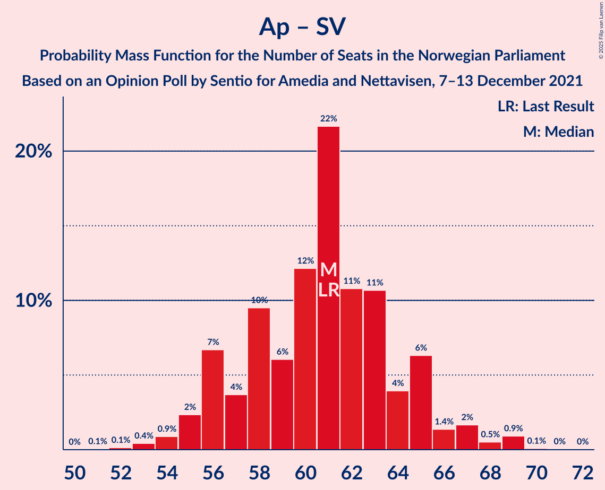

| Number of Seats | Probability | Accumulated | Special Marks |
|:---------------:|:-----------:|:-----------:|:-------------:|
| 51 | 0.1% | 100% |  |
| 52 | 0.1% | 99.9% |  |
| 53 | 0.4% | 99.8% |  |
| 54 | 0.9% | 99.4% |  |
| 55 | 2% | 98% |  |
| 56 | 7% | 96% |  |
| 57 | 4% | 89% |  |
| 58 | 10% | 86% |  |
| 59 | 6% | 76% |  |
| 60 | 12% | 70% | Median |
| 61 | 22% | 58% | Last Result |
| 62 | 11% | 36% |  |
| 63 | 11% | 26% |  |
| 64 | 4% | 15% |  |
| 65 | 6% | 11% |  |
| 66 | 1.4% | 5% |  |
| 67 | 2% | 3% |  |
| 68 | 0.5% | 2% |  |
| 69 | 0.9% | 1.1% |  |
| 70 | 0.1% | 0.2% |  |
| 71 | 0% | 0.1% |  |
| 72 | 0% | 0% |  |

### Høyre – Venstre – Kristelig Folkeparti

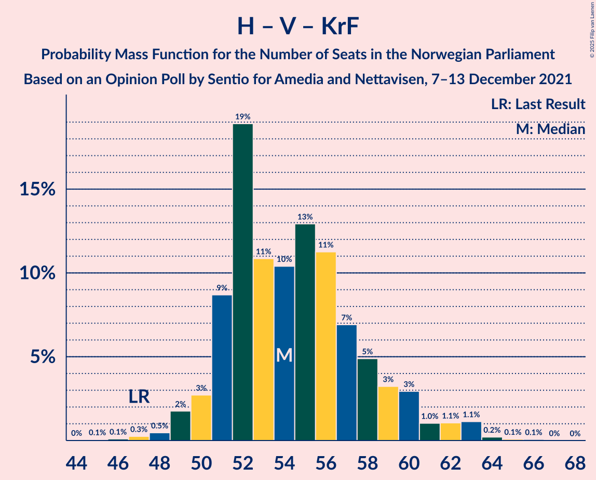

| Number of Seats | Probability | Accumulated | Special Marks |
|:---------------:|:-----------:|:-----------:|:-------------:|
| 45 | 0.1% | 100% |  |
| 46 | 0.1% | 99.9% |  |
| 47 | 0.3% | 99.8% | Last Result |
| 48 | 0.5% | 99.6% |  |
| 49 | 2% | 99.1% |  |
| 50 | 3% | 97% |  |
| 51 | 9% | 95% |  |
| 52 | 19% | 86% |  |
| 53 | 11% | 67% | Median |
| 54 | 10% | 56% |  |
| 55 | 13% | 46% |  |
| 56 | 11% | 33% |  |
| 57 | 7% | 22% |  |
| 58 | 5% | 15% |  |
| 59 | 3% | 10% |  |
| 60 | 3% | 7% |  |
| 61 | 1.0% | 4% |  |
| 62 | 1.1% | 3% |  |
| 63 | 1.1% | 2% |  |
| 64 | 0.2% | 0.4% |  |
| 65 | 0.1% | 0.2% |  |
| 66 | 0.1% | 0.1% |  |
| 67 | 0% | 0% |  |

### Senterpartiet – Venstre – Kristelig Folkeparti

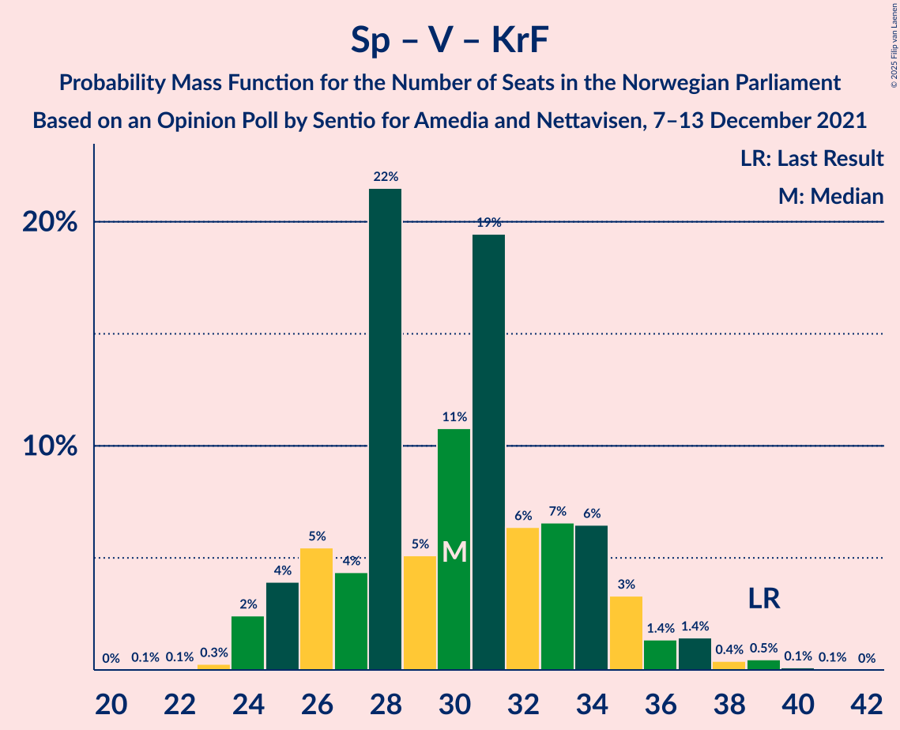

| Number of Seats | Probability | Accumulated | Special Marks |
|:---------------:|:-----------:|:-----------:|:-------------:|
| 21 | 0.1% | 100% |  |
| 22 | 0.1% | 99.9% |  |
| 23 | 0.3% | 99.9% |  |
| 24 | 2% | 99.6% |  |
| 25 | 4% | 97% |  |
| 26 | 5% | 93% |  |
| 27 | 4% | 88% |  |
| 28 | 22% | 83% |  |
| 29 | 5% | 62% | Median |
| 30 | 11% | 57% |  |
| 31 | 19% | 46% |  |
| 32 | 6% | 27% |  |
| 33 | 7% | 20% |  |
| 34 | 6% | 14% |  |
| 35 | 3% | 7% |  |
| 36 | 1.4% | 4% |  |
| 37 | 1.4% | 2% |  |
| 38 | 0.4% | 1.1% |  |
| 39 | 0.5% | 0.7% | Last Result |
| 40 | 0.1% | 0.2% |  |
| 41 | 0.1% | 0.1% |  |
| 42 | 0% | 0% |  |

## Technical Information

### Opinion Poll

+ **Polling firm:** Sentio
+ **Commissioner(s):** Amedia and Nettavisen
+ **Fieldwork period:** 7–13 December 2021

### Calculations

+ **Sample size:** 1000
+ **Simulations done:** 1,048,576
+ **Error estimate:** 1.28%

