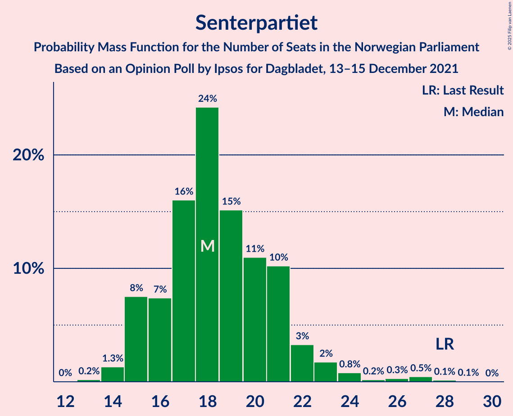
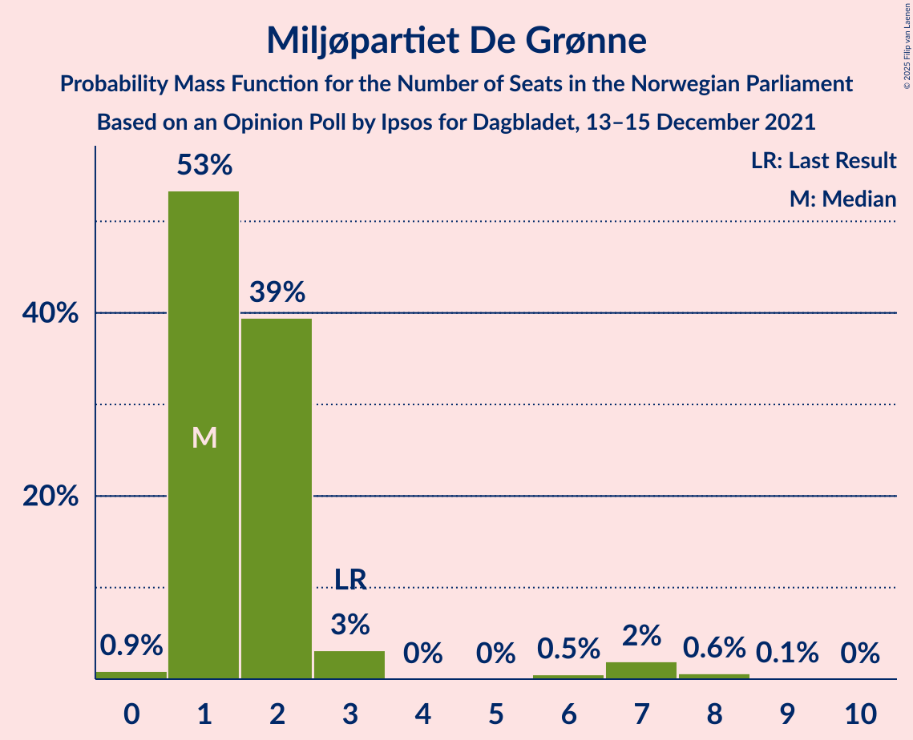

# Opinion Poll by Ipsos for Dagbladet, 13–15 December 2021

<a href="#voting-intentions">Voting Intentions</a> | <a href="#seats">Seats</a> | <a href="#coalitions">Coalitions</a> | <a href="#technical-information">Technical Information</a>

## Voting Intentions

### Confidence Intervals

| Party | Last Result | Poll Result | 80% Confidence Interval | 90% Confidence Interval | 95% Confidence Interval | 99% Confidence Interval |
|:-----:|:-----------:|:-----------:|:-----------------------:|:-----------------------:|:-----------------------:|:-----------------------:|
| Høyre | 20.4% | 24.8% | 22.9–26.8% |22.4–27.4% |21.9–27.9% |21.0–28.9% |
| Arbeiderpartiet | 26.2% | 20.8% | 19.0–22.7% |18.5–23.2% |18.1–23.7% |17.3–24.7% |
| Fremskrittspartiet | 11.6% | 12.8% | 11.4–14.5% |11.0–14.9% |10.7–15.3% |10.0–16.2% |
| Senterpartiet | 13.5% | 10.4% | 9.2–12.0% |8.8–12.4% |8.5–12.8% |7.9–13.5% |
| Sosialistisk Venstreparti | 7.6% | 9.4% | 8.2–10.9% |7.9–11.3% |7.6–11.7% |7.0–12.4% |
| Venstre | 4.6% | 6.3% | 5.3–7.5% |5.0–7.9% |4.8–8.2% |4.4–8.8% |
| Rødt | 4.7% | 5.8% | 4.8–7.0% |4.6–7.3% |4.4–7.6% |3.9–8.3% |
| Kristelig Folkeparti | 3.8% | 2.9% | 2.3–3.8% |2.1–4.1% |1.9–4.3% |1.7–4.8% |
| Miljøpartiet De Grønne | 3.9% | 2.8% | 2.1–3.7% |2.0–3.9% |1.8–4.2% |1.6–4.6% |

*Note:* The poll result column reflects the actual value used in the calculations. Published results may vary slightly, and in addition be rounded to fewer digits.

## Seats

### Confidence Intervals

| Party | Last Result | Median | 80% Confidence Interval | 90% Confidence Interval | 95% Confidence Interval | 99% Confidence Interval |
|:-----:|:-----------:|:------:|:-----------------------:|:-----------------------:|:-----------------------:|:-----------------------:|
| <a href="#høyre">Høyre</a> | 36 | 44 | 41–47 |40–48 |39–49 |37–52 |
| <a href="#arbeiderpartiet">Arbeiderpartiet</a> | 48 | 39 | 36–41 |35–42 |34–44 |32–47 |
| <a href="#fremskrittspartiet">Fremskrittspartiet</a> | 21 | 22 | 19–26 |19–27 |18–28 |17–30 |
| <a href="#senterpartiet">Senterpartiet</a> | 28 | 18 | 16–21 |15–22 |15–23 |14–27 |
| <a href="#sosialistisk-venstreparti">Sosialistisk Venstreparti</a> | 13 | 16 | 14–19 |13–19 |12–20 |11–22 |
| <a href="#venstre">Venstre</a> | 8 | 11 | 9–13 |9–14 |8–14 |7–16 |
| <a href="#rødt">Rødt</a> | 8 | 10 | 8–12 |8–13 |7–13 |1–14 |
| <a href="#kristelig-folkeparti">Kristelig Folkeparti</a> | 3 | 2 | 1–3 |0–6 |0–7 |0–8 |
| <a href="#miljøpartiet-de-grønne">Miljøpartiet De Grønne</a> | 3 | 1 | 1–2 |1–3 |1–7 |0–8 |

### Høyre

*For a full overview of the results for this party, see the [Høyre](party-høyre.html) page.*

| Number of Seats | Probability | Accumulated | Special Marks |
|:---------------:|:-----------:|:-----------:|:-------------:|
| 35 | 0% | 100% |  |
| 36 | 0.1% | 99.9% | Last Result |
| 37 | 0.4% | 99.9% |  |
| 38 | 1.2% | 99.5% |  |
| 39 | 1.1% | 98% |  |
| 40 | 3% | 97% |  |
| 41 | 11% | 94% |  |
| 42 | 13% | 83% |  |
| 43 | 13% | 70% |  |
| 44 | 16% | 57% | Median |
| 45 | 11% | 40% |  |
| 46 | 14% | 30% |  |
| 47 | 8% | 15% |  |
| 48 | 5% | 7% |  |
| 49 | 0.9% | 3% |  |
| 50 | 0.5% | 2% |  |
| 51 | 0.6% | 1.2% |  |
| 52 | 0.4% | 0.5% |  |
| 53 | 0.1% | 0.1% |  |
| 54 | 0% | 0% |  |

### Arbeiderpartiet

*For a full overview of the results for this party, see the [Arbeiderpartiet](party-arbeiderpartiet.html) page.*

| Number of Seats | Probability | Accumulated | Special Marks |
|:---------------:|:-----------:|:-----------:|:-------------:|
| 31 | 0.2% | 100% |  |
| 32 | 0.7% | 99.8% |  |
| 33 | 0.9% | 99.0% |  |
| 34 | 2% | 98% |  |
| 35 | 3% | 97% |  |
| 36 | 15% | 94% |  |
| 37 | 10% | 79% |  |
| 38 | 16% | 68% |  |
| 39 | 12% | 52% | Median |
| 40 | 14% | 40% |  |
| 41 | 17% | 26% |  |
| 42 | 4% | 9% |  |
| 43 | 1.4% | 4% |  |
| 44 | 1.2% | 3% |  |
| 45 | 0.8% | 2% |  |
| 46 | 0.4% | 1.0% |  |
| 47 | 0.4% | 0.6% |  |
| 48 | 0.1% | 0.2% | Last Result |
| 49 | 0% | 0.1% |  |
| 50 | 0% | 0% |  |

### Fremskrittspartiet

*For a full overview of the results for this party, see the [Fremskrittspartiet](party-fremskrittspartiet.html) page.*

| Number of Seats | Probability | Accumulated | Special Marks |
|:---------------:|:-----------:|:-----------:|:-------------:|
| 17 | 0.9% | 100% |  |
| 18 | 4% | 99.1% |  |
| 19 | 10% | 95% |  |
| 20 | 13% | 85% |  |
| 21 | 15% | 72% | Last Result |
| 22 | 18% | 58% | Median |
| 23 | 11% | 40% |  |
| 24 | 11% | 29% |  |
| 25 | 5% | 17% |  |
| 26 | 5% | 12% |  |
| 27 | 4% | 7% |  |
| 28 | 2% | 3% |  |
| 29 | 0.6% | 1.2% |  |
| 30 | 0.4% | 0.6% |  |
| 31 | 0.2% | 0.2% |  |
| 32 | 0% | 0.1% |  |
| 33 | 0% | 0% |  |

### Senterpartiet

*For a full overview of the results for this party, see the [Senterpartiet](party-senterpartiet.html) page.*

| Number of Seats | Probability | Accumulated | Special Marks |
|:---------------:|:-----------:|:-----------:|:-------------:|
| 13 | 0.2% | 100% |  |
| 14 | 1.3% | 99.8% |  |
| 15 | 8% | 98% |  |
| 16 | 7% | 91% |  |
| 17 | 16% | 84% |  |
| 18 | 24% | 68% | Median |
| 19 | 15% | 43% |  |
| 20 | 11% | 28% |  |
| 21 | 10% | 17% |  |
| 22 | 3% | 7% |  |
| 23 | 2% | 4% |  |
| 24 | 0.8% | 2% |  |
| 25 | 0.2% | 1.1% |  |
| 26 | 0.3% | 1.0% |  |
| 27 | 0.5% | 0.7% |  |
| 28 | 0.1% | 0.2% | Last Result |
| 29 | 0.1% | 0.1% |  |
| 30 | 0% | 0% |  |

### Sosialistisk Venstreparti

*For a full overview of the results for this party, see the [Sosialistisk Venstreparti](party-sosialistiskvenstreparti.html) page.*

| Number of Seats | Probability | Accumulated | Special Marks |
|:---------------:|:-----------:|:-----------:|:-------------:|
| 10 | 0.2% | 100% |  |
| 11 | 0.8% | 99.7% |  |
| 12 | 2% | 98.9% |  |
| 13 | 4% | 97% | Last Result |
| 14 | 12% | 93% |  |
| 15 | 19% | 81% |  |
| 16 | 21% | 62% | Median |
| 17 | 16% | 42% |  |
| 18 | 13% | 25% |  |
| 19 | 7% | 12% |  |
| 20 | 3% | 5% |  |
| 21 | 1.0% | 2% |  |
| 22 | 0.7% | 0.8% |  |
| 23 | 0.1% | 0.2% |  |
| 24 | 0% | 0% |  |

### Venstre

*For a full overview of the results for this party, see the [Venstre](party-venstre.html) page.*

| Number of Seats | Probability | Accumulated | Special Marks |
|:---------------:|:-----------:|:-----------:|:-------------:|
| 3 | 0.1% | 100% |  |
| 4 | 0% | 99.9% |  |
| 5 | 0% | 99.9% |  |
| 6 | 0% | 99.9% |  |
| 7 | 0.7% | 99.9% |  |
| 8 | 3% | 99.2% | Last Result |
| 9 | 14% | 96% |  |
| 10 | 20% | 82% |  |
| 11 | 27% | 63% | Median |
| 12 | 20% | 36% |  |
| 13 | 10% | 16% |  |
| 14 | 3% | 5% |  |
| 15 | 2% | 2% |  |
| 16 | 0.8% | 0.9% |  |
| 17 | 0.1% | 0.1% |  |
| 18 | 0% | 0% |  |

### Rødt

*For a full overview of the results for this party, see the [Rødt](party-rødt.html) page.*

| Number of Seats | Probability | Accumulated | Special Marks |
|:---------------:|:-----------:|:-----------:|:-------------:|
| 1 | 0.6% | 100% |  |
| 2 | 0% | 99.4% |  |
| 3 | 0% | 99.4% |  |
| 4 | 0% | 99.4% |  |
| 5 | 0% | 99.4% |  |
| 6 | 0.1% | 99.4% |  |
| 7 | 2% | 99.3% |  |
| 8 | 11% | 97% | Last Result |
| 9 | 18% | 86% |  |
| 10 | 30% | 68% | Median |
| 11 | 22% | 38% |  |
| 12 | 10% | 16% |  |
| 13 | 4% | 6% |  |
| 14 | 1.4% | 2% |  |
| 15 | 0.2% | 0.2% |  |
| 16 | 0% | 0% |  |

### Kristelig Folkeparti

*For a full overview of the results for this party, see the [Kristelig Folkeparti](party-kristeligfolkeparti.html) page.*

| Number of Seats | Probability | Accumulated | Special Marks |
|:---------------:|:-----------:|:-----------:|:-------------:|
| 0 | 9% | 100% |  |
| 1 | 8% | 91% |  |
| 2 | 63% | 82% | Median |
| 3 | 15% | 20% | Last Result |
| 4 | 0% | 5% |  |
| 5 | 0% | 5% |  |
| 6 | 0.9% | 5% |  |
| 7 | 3% | 4% |  |
| 8 | 0.9% | 1.0% |  |
| 9 | 0.1% | 0.1% |  |
| 10 | 0% | 0% |  |

### Miljøpartiet De Grønne

*For a full overview of the results for this party, see the [Miljøpartiet De Grønne](party-miljøpartietdegrønne.html) page.*

| Number of Seats | Probability | Accumulated | Special Marks |
|:---------------:|:-----------:|:-----------:|:-------------:|
| 0 | 0.9% | 100% |  |
| 1 | 53% | 99.1% | Median |
| 2 | 39% | 46% |  |
| 3 | 3% | 6% | Last Result |
| 4 | 0% | 3% |  |
| 5 | 0% | 3% |  |
| 6 | 0.5% | 3% |  |
| 7 | 2% | 3% |  |
| 8 | 0.6% | 0.7% |  |
| 9 | 0.1% | 0.1% |  |
| 10 | 0% | 0% |  |

## Coalitions

### Confidence Intervals

| Coalition | Last Result | Median | Majority? | 80% Confidence Interval | 90% Confidence Interval | 95% Confidence Interval | 99% Confidence Interval |
|:---------:|:-----------:|:------:|:---------:|:-----------------------:|:-----------------------:|:-----------------------:|:-----------------------:|
| Høyre – Fremskrittspartiet – Senterpartiet – Venstre – Kristelig Folkeparti | 96 | 98 | 100% | 92–103 | 91–104 | 90–105 | 88–108 |
| Arbeiderpartiet – Senterpartiet – Sosialistisk Venstreparti – Rødt – Miljøpartiet De Grønne | 100 | 85 | 58% | 80–90 | 79–91 | 78–92 | 76–94 |
| Arbeiderpartiet – Senterpartiet – Sosialistisk Venstreparti – Rødt | 97 | 84 | 41% | 79–88 | 77–89 | 77–90 | 74–92 |
| Høyre – Fremskrittspartiet – Venstre – Kristelig Folkeparti – Miljøpartiet De Grønne | 71 | 81 | 17% | 76–86 | 75–87 | 74–88 | 71–90 |
| Høyre – Fremskrittspartiet – Venstre – Kristelig Folkeparti | 68 | 79 | 9% | 75–84 | 73–85 | 72–87 | 70–89 |
| Arbeiderpartiet – Senterpartiet – Sosialistisk Venstreparti – Kristelig Folkeparti – Miljøpartiet De Grønne | 95 | 77 | 2% | 73–81 | 72–83 | 71–84 | 69–87 |
| Høyre – Fremskrittspartiet – Venstre | 65 | 77 | 2% | 73–82 | 71–83 | 70–84 | 68–87 |
| Arbeiderpartiet – Senterpartiet – Sosialistisk Venstreparti – Miljøpartiet De Grønne | 92 | 75 | 0.5% | 71–79 | 70–80 | 69–82 | 66–84 |
| Arbeiderpartiet – Senterpartiet – Sosialistisk Venstreparti | 89 | 74 | 0.1% | 69–77 | 68–79 | 67–80 | 65–82 |
| Arbeiderpartiet – Sosialistisk Venstreparti – Rødt – Miljøpartiet De Grønne | 72 | 67 | 0% | 63–71 | 61–72 | 60–73 | 58–75 |
| Høyre – Fremskrittspartiet | 57 | 66 | 0% | 62–71 | 61–72 | 60–73 | 58–75 |
| Arbeiderpartiet – Senterpartiet – Kristelig Folkeparti – Miljøpartiet De Grønne | 82 | 61 | 0% | 57–65 | 56–66 | 55–68 | 53–71 |
| Arbeiderpartiet – Senterpartiet – Kristelig Folkeparti | 79 | 59 | 0% | 55–63 | 55–64 | 54–66 | 52–69 |
| Arbeiderpartiet – Senterpartiet | 76 | 57 | 0% | 53–61 | 52–62 | 52–63 | 50–66 |
| Høyre – Venstre – Kristelig Folkeparti | 47 | 57 | 0% | 53–61 | 52–62 | 51–63 | 49–66 |
| Arbeiderpartiet – Sosialistisk Venstreparti | 61 | 55 | 0% | 52–58 | 50–59 | 49–60 | 47–63 |
| Senterpartiet – Venstre – Kristelig Folkeparti | 39 | 31 | 0% | 28–35 | 27–36 | 26–38 | 25–40 |

### Høyre – Fremskrittspartiet – Senterpartiet – Venstre – Kristelig Folkeparti

| Number of Seats | Probability | Accumulated | Special Marks |
|:---------------:|:-----------:|:-----------:|:-------------:|
| 85 | 0% | 100% | Majority |
| 86 | 0.1% | 99.9% |  |
| 87 | 0.1% | 99.8% |  |
| 88 | 0.4% | 99.7% |  |
| 89 | 0.9% | 99.3% |  |
| 90 | 3% | 98% |  |
| 91 | 2% | 95% |  |
| 92 | 5% | 94% |  |
| 93 | 3% | 88% |  |
| 94 | 10% | 85% |  |
| 95 | 9% | 75% |  |
| 96 | 7% | 66% | Last Result |
| 97 | 8% | 59% | Median |
| 98 | 5% | 51% |  |
| 99 | 8% | 46% |  |
| 100 | 8% | 39% |  |
| 101 | 12% | 31% |  |
| 102 | 6% | 19% |  |
| 103 | 4% | 12% |  |
| 104 | 3% | 8% |  |
| 105 | 2% | 5% |  |
| 106 | 1.1% | 2% |  |
| 107 | 0.4% | 1.3% |  |
| 108 | 0.6% | 0.9% |  |
| 109 | 0.2% | 0.3% |  |
| 110 | 0.1% | 0.1% |  |
| 111 | 0% | 0.1% |  |
| 112 | 0% | 0% |  |

### Arbeiderpartiet – Senterpartiet – Sosialistisk Venstreparti – Rødt – Miljøpartiet De Grønne

| Number of Seats | Probability | Accumulated | Special Marks |
|:---------------:|:-----------:|:-----------:|:-------------:|
| 73 | 0.1% | 100% |  |
| 74 | 0.1% | 99.9% |  |
| 75 | 0.2% | 99.7% |  |
| 76 | 0.4% | 99.5% |  |
| 77 | 0.7% | 99.1% |  |
| 78 | 2% | 98% |  |
| 79 | 3% | 96% |  |
| 80 | 4% | 93% |  |
| 81 | 4% | 89% |  |
| 82 | 6% | 85% |  |
| 83 | 12% | 78% |  |
| 84 | 9% | 66% | Median |
| 85 | 10% | 58% | Majority |
| 86 | 13% | 48% |  |
| 87 | 10% | 35% |  |
| 88 | 12% | 26% |  |
| 89 | 4% | 14% |  |
| 90 | 3% | 10% |  |
| 91 | 4% | 7% |  |
| 92 | 2% | 3% |  |
| 93 | 1.0% | 2% |  |
| 94 | 0.3% | 0.8% |  |
| 95 | 0.2% | 0.5% |  |
| 96 | 0.2% | 0.3% |  |
| 97 | 0.1% | 0.1% |  |
| 98 | 0% | 0% |  |
| 99 | 0% | 0% |  |
| 100 | 0% | 0% | Last Result |

### Arbeiderpartiet – Senterpartiet – Sosialistisk Venstreparti – Rødt

| Number of Seats | Probability | Accumulated | Special Marks |
|:---------------:|:-----------:|:-----------:|:-------------:|
| 71 | 0.1% | 100% |  |
| 72 | 0.1% | 99.9% |  |
| 73 | 0.3% | 99.8% |  |
| 74 | 0.3% | 99.5% |  |
| 75 | 0.7% | 99.3% |  |
| 76 | 1.1% | 98.6% |  |
| 77 | 3% | 98% |  |
| 78 | 4% | 95% |  |
| 79 | 4% | 91% |  |
| 80 | 5% | 87% |  |
| 81 | 11% | 82% |  |
| 82 | 9% | 71% |  |
| 83 | 11% | 62% | Median |
| 84 | 9% | 51% |  |
| 85 | 15% | 41% | Majority |
| 86 | 7% | 26% |  |
| 87 | 9% | 19% |  |
| 88 | 3% | 10% |  |
| 89 | 3% | 7% |  |
| 90 | 3% | 5% |  |
| 91 | 0.7% | 2% |  |
| 92 | 0.8% | 1.2% |  |
| 93 | 0.2% | 0.4% |  |
| 94 | 0.1% | 0.3% |  |
| 95 | 0.1% | 0.2% |  |
| 96 | 0.1% | 0.1% |  |
| 97 | 0% | 0% | Last Result |

### Høyre – Fremskrittspartiet – Venstre – Kristelig Folkeparti – Miljøpartiet De Grønne

| Number of Seats | Probability | Accumulated | Special Marks |
|:---------------:|:-----------:|:-----------:|:-------------:|
| 69 | 0% | 100% |  |
| 70 | 0.2% | 99.9% |  |
| 71 | 0.5% | 99.8% | Last Result |
| 72 | 0.5% | 99.3% |  |
| 73 | 1.2% | 98.9% |  |
| 74 | 1.4% | 98% |  |
| 75 | 3% | 96% |  |
| 76 | 4% | 94% |  |
| 77 | 10% | 90% |  |
| 78 | 5% | 80% |  |
| 79 | 11% | 75% |  |
| 80 | 9% | 64% | Median |
| 81 | 11% | 55% |  |
| 82 | 10% | 44% |  |
| 83 | 9% | 34% |  |
| 84 | 8% | 25% |  |
| 85 | 5% | 17% | Majority |
| 86 | 6% | 12% |  |
| 87 | 2% | 5% |  |
| 88 | 2% | 4% |  |
| 89 | 0.8% | 2% |  |
| 90 | 0.6% | 1.0% |  |
| 91 | 0.2% | 0.5% |  |
| 92 | 0.1% | 0.2% |  |
| 93 | 0% | 0.1% |  |
| 94 | 0% | 0% |  |

### Høyre – Fremskrittspartiet – Venstre – Kristelig Folkeparti

| Number of Seats | Probability | Accumulated | Special Marks |
|:---------------:|:-----------:|:-----------:|:-------------:|
| 67 | 0% | 100% |  |
| 68 | 0.1% | 99.9% | Last Result |
| 69 | 0.3% | 99.9% |  |
| 70 | 0.6% | 99.6% |  |
| 71 | 0.8% | 99.0% |  |
| 72 | 2% | 98% |  |
| 73 | 2% | 96% |  |
| 74 | 4% | 95% |  |
| 75 | 9% | 91% |  |
| 76 | 7% | 82% |  |
| 77 | 10% | 76% |  |
| 78 | 5% | 65% |  |
| 79 | 11% | 61% | Median |
| 80 | 13% | 50% |  |
| 81 | 6% | 37% |  |
| 82 | 12% | 30% |  |
| 83 | 4% | 18% |  |
| 84 | 6% | 15% |  |
| 85 | 4% | 9% | Majority |
| 86 | 2% | 4% |  |
| 87 | 2% | 3% |  |
| 88 | 0.5% | 1.1% |  |
| 89 | 0.3% | 0.6% |  |
| 90 | 0.2% | 0.3% |  |
| 91 | 0% | 0.1% |  |
| 92 | 0% | 0% |  |

### Arbeiderpartiet – Senterpartiet – Sosialistisk Venstreparti – Kristelig Folkeparti – Miljøpartiet De Grønne

| Number of Seats | Probability | Accumulated | Special Marks |
|:---------------:|:-----------:|:-----------:|:-------------:|
| 66 | 0% | 100% |  |
| 67 | 0.1% | 99.9% |  |
| 68 | 0.2% | 99.8% |  |
| 69 | 0.4% | 99.5% |  |
| 70 | 1.4% | 99.1% |  |
| 71 | 2% | 98% |  |
| 72 | 4% | 96% |  |
| 73 | 5% | 92% |  |
| 74 | 11% | 87% |  |
| 75 | 12% | 76% |  |
| 76 | 6% | 64% | Median |
| 77 | 9% | 58% |  |
| 78 | 12% | 49% |  |
| 79 | 16% | 38% |  |
| 80 | 8% | 22% |  |
| 81 | 7% | 15% |  |
| 82 | 2% | 8% |  |
| 83 | 2% | 5% |  |
| 84 | 2% | 4% |  |
| 85 | 0.5% | 2% | Majority |
| 86 | 0.5% | 1.2% |  |
| 87 | 0.3% | 0.6% |  |
| 88 | 0.2% | 0.3% |  |
| 89 | 0.1% | 0.1% |  |
| 90 | 0% | 0% |  |
| 91 | 0% | 0% |  |
| 92 | 0% | 0% |  |
| 93 | 0% | 0% |  |
| 94 | 0% | 0% |  |
| 95 | 0% | 0% | Last Result |

### Høyre – Fremskrittspartiet – Venstre

| Number of Seats | Probability | Accumulated | Special Marks |
|:---------------:|:-----------:|:-----------:|:-------------:|
| 65 | 0% | 100% | Last Result |
| 66 | 0.1% | 99.9% |  |
| 67 | 0.3% | 99.9% |  |
| 68 | 0.6% | 99.6% |  |
| 69 | 0.6% | 99.0% |  |
| 70 | 2% | 98% |  |
| 71 | 3% | 97% |  |
| 72 | 4% | 94% |  |
| 73 | 10% | 90% |  |
| 74 | 4% | 80% |  |
| 75 | 7% | 76% |  |
| 76 | 10% | 69% |  |
| 77 | 12% | 59% | Median |
| 78 | 13% | 47% |  |
| 79 | 7% | 34% |  |
| 80 | 9% | 27% |  |
| 81 | 6% | 18% |  |
| 82 | 5% | 13% |  |
| 83 | 4% | 8% |  |
| 84 | 1.3% | 4% |  |
| 85 | 0.6% | 2% | Majority |
| 86 | 1.1% | 2% |  |
| 87 | 0.4% | 0.5% |  |
| 88 | 0.1% | 0.1% |  |
| 89 | 0% | 0.1% |  |
| 90 | 0% | 0% |  |

### Arbeiderpartiet – Senterpartiet – Sosialistisk Venstreparti – Miljøpartiet De Grønne

| Number of Seats | Probability | Accumulated | Special Marks |
|:---------------:|:-----------:|:-----------:|:-------------:|
| 64 | 0% | 100% |  |
| 65 | 0.2% | 99.9% |  |
| 66 | 0.4% | 99.8% |  |
| 67 | 0.7% | 99.4% |  |
| 68 | 1.1% | 98.7% |  |
| 69 | 3% | 98% |  |
| 70 | 3% | 95% |  |
| 71 | 7% | 92% |  |
| 72 | 7% | 85% |  |
| 73 | 16% | 79% |  |
| 74 | 5% | 63% | Median |
| 75 | 9% | 58% |  |
| 76 | 15% | 48% |  |
| 77 | 14% | 33% |  |
| 78 | 5% | 20% |  |
| 79 | 7% | 14% |  |
| 80 | 2% | 7% |  |
| 81 | 2% | 5% |  |
| 82 | 1.4% | 3% |  |
| 83 | 0.4% | 1.2% |  |
| 84 | 0.3% | 0.8% |  |
| 85 | 0.2% | 0.5% | Majority |
| 86 | 0.1% | 0.2% |  |
| 87 | 0.1% | 0.1% |  |
| 88 | 0% | 0% |  |
| 89 | 0% | 0% |  |
| 90 | 0% | 0% |  |
| 91 | 0% | 0% |  |
| 92 | 0% | 0% | Last Result |

### Arbeiderpartiet – Senterpartiet – Sosialistisk Venstreparti

| Number of Seats | Probability | Accumulated | Special Marks |
|:---------------:|:-----------:|:-----------:|:-------------:|
| 63 | 0.1% | 100% |  |
| 64 | 0.2% | 99.8% |  |
| 65 | 0.6% | 99.6% |  |
| 66 | 1.0% | 99.1% |  |
| 67 | 2% | 98% |  |
| 68 | 3% | 97% |  |
| 69 | 5% | 94% |  |
| 70 | 6% | 89% |  |
| 71 | 16% | 83% |  |
| 72 | 8% | 68% |  |
| 73 | 8% | 60% | Median |
| 74 | 11% | 51% |  |
| 75 | 17% | 40% |  |
| 76 | 8% | 23% |  |
| 77 | 6% | 15% |  |
| 78 | 4% | 9% |  |
| 79 | 2% | 5% |  |
| 80 | 1.0% | 3% |  |
| 81 | 1.1% | 2% |  |
| 82 | 0.2% | 0.7% |  |
| 83 | 0.3% | 0.5% |  |
| 84 | 0.1% | 0.2% |  |
| 85 | 0.1% | 0.1% | Majority |
| 86 | 0% | 0% |  |
| 87 | 0% | 0% |  |
| 88 | 0% | 0% |  |
| 89 | 0% | 0% | Last Result |

### Arbeiderpartiet – Sosialistisk Venstreparti – Rødt – Miljøpartiet De Grønne

| Number of Seats | Probability | Accumulated | Special Marks |
|:---------------:|:-----------:|:-----------:|:-------------:|
| 55 | 0% | 100% |  |
| 56 | 0.1% | 99.9% |  |
| 57 | 0.3% | 99.8% |  |
| 58 | 0.6% | 99.6% |  |
| 59 | 1.1% | 99.0% |  |
| 60 | 1.4% | 98% |  |
| 61 | 3% | 96% |  |
| 62 | 3% | 94% |  |
| 63 | 7% | 91% |  |
| 64 | 7% | 84% |  |
| 65 | 11% | 77% |  |
| 66 | 11% | 66% | Median |
| 67 | 16% | 54% |  |
| 68 | 12% | 38% |  |
| 69 | 9% | 27% |  |
| 70 | 6% | 17% |  |
| 71 | 4% | 11% |  |
| 72 | 2% | 6% | Last Result |
| 73 | 2% | 4% |  |
| 74 | 0.8% | 2% |  |
| 75 | 0.7% | 1.1% |  |
| 76 | 0.1% | 0.4% |  |
| 77 | 0.1% | 0.3% |  |
| 78 | 0.1% | 0.1% |  |
| 79 | 0% | 0.1% |  |
| 80 | 0% | 0% |  |

### Høyre – Fremskrittspartiet

| Number of Seats | Probability | Accumulated | Special Marks |
|:---------------:|:-----------:|:-----------:|:-------------:|
| 55 | 0% | 100% |  |
| 56 | 0.1% | 99.9% |  |
| 57 | 0.3% | 99.9% | Last Result |
| 58 | 0.4% | 99.6% |  |
| 59 | 1.0% | 99.1% |  |
| 60 | 2% | 98% |  |
| 61 | 5% | 96% |  |
| 62 | 6% | 92% |  |
| 63 | 8% | 86% |  |
| 64 | 11% | 78% |  |
| 65 | 8% | 67% |  |
| 66 | 13% | 59% | Median |
| 67 | 13% | 46% |  |
| 68 | 10% | 33% |  |
| 69 | 6% | 22% |  |
| 70 | 6% | 16% |  |
| 71 | 5% | 10% |  |
| 72 | 1.4% | 6% |  |
| 73 | 2% | 4% |  |
| 74 | 0.8% | 2% |  |
| 75 | 1.1% | 1.5% |  |
| 76 | 0.2% | 0.3% |  |
| 77 | 0.1% | 0.1% |  |
| 78 | 0% | 0.1% |  |
| 79 | 0% | 0% |  |

### Arbeiderpartiet – Senterpartiet – Kristelig Folkeparti – Miljøpartiet De Grønne

| Number of Seats | Probability | Accumulated | Special Marks |
|:---------------:|:-----------:|:-----------:|:-------------:|
| 50 | 0% | 100% |  |
| 51 | 0% | 99.9% |  |
| 52 | 0.1% | 99.9% |  |
| 53 | 0.5% | 99.8% |  |
| 54 | 0.7% | 99.3% |  |
| 55 | 2% | 98.5% |  |
| 56 | 4% | 97% |  |
| 57 | 8% | 92% |  |
| 58 | 7% | 85% |  |
| 59 | 13% | 78% |  |
| 60 | 12% | 65% | Median |
| 61 | 10% | 53% |  |
| 62 | 9% | 43% |  |
| 63 | 14% | 34% |  |
| 64 | 8% | 20% |  |
| 65 | 5% | 12% |  |
| 66 | 3% | 7% |  |
| 67 | 2% | 4% |  |
| 68 | 0.9% | 3% |  |
| 69 | 0.8% | 2% |  |
| 70 | 0.3% | 0.9% |  |
| 71 | 0.2% | 0.6% |  |
| 72 | 0.2% | 0.3% |  |
| 73 | 0.1% | 0.1% |  |
| 74 | 0% | 0.1% |  |
| 75 | 0% | 0% |  |
| 76 | 0% | 0% |  |
| 77 | 0% | 0% |  |
| 78 | 0% | 0% |  |
| 79 | 0% | 0% |  |
| 80 | 0% | 0% |  |
| 81 | 0% | 0% |  |
| 82 | 0% | 0% | Last Result |

### Arbeiderpartiet – Senterpartiet – Kristelig Folkeparti

| Number of Seats | Probability | Accumulated | Special Marks |
|:---------------:|:-----------:|:-----------:|:-------------:|
| 49 | 0.1% | 100% |  |
| 50 | 0.1% | 99.9% |  |
| 51 | 0.2% | 99.8% |  |
| 52 | 0.7% | 99.7% |  |
| 53 | 1.2% | 99.0% |  |
| 54 | 2% | 98% |  |
| 55 | 6% | 95% |  |
| 56 | 8% | 89% |  |
| 57 | 13% | 82% |  |
| 58 | 7% | 68% |  |
| 59 | 17% | 62% | Median |
| 60 | 10% | 45% |  |
| 61 | 8% | 34% |  |
| 62 | 14% | 27% |  |
| 63 | 3% | 13% |  |
| 64 | 5% | 9% |  |
| 65 | 2% | 4% |  |
| 66 | 2% | 3% |  |
| 67 | 0.5% | 1.4% |  |
| 68 | 0.3% | 0.8% |  |
| 69 | 0.3% | 0.5% |  |
| 70 | 0.1% | 0.3% |  |
| 71 | 0.1% | 0.1% |  |
| 72 | 0% | 0% |  |
| 73 | 0% | 0% |  |
| 74 | 0% | 0% |  |
| 75 | 0% | 0% |  |
| 76 | 0% | 0% |  |
| 77 | 0% | 0% |  |
| 78 | 0% | 0% |  |
| 79 | 0% | 0% | Last Result |

### Arbeiderpartiet – Senterpartiet

| Number of Seats | Probability | Accumulated | Special Marks |
|:---------------:|:-----------:|:-----------:|:-------------:|
| 48 | 0.1% | 100% |  |
| 49 | 0.2% | 99.8% |  |
| 50 | 0.7% | 99.6% |  |
| 51 | 1.3% | 98.9% |  |
| 52 | 3% | 98% |  |
| 53 | 5% | 95% |  |
| 54 | 9% | 90% |  |
| 55 | 10% | 81% |  |
| 56 | 13% | 71% |  |
| 57 | 12% | 58% | Median |
| 58 | 11% | 46% |  |
| 59 | 13% | 35% |  |
| 60 | 11% | 22% |  |
| 61 | 3% | 10% |  |
| 62 | 4% | 8% |  |
| 63 | 2% | 4% |  |
| 64 | 1.3% | 2% |  |
| 65 | 0.3% | 0.8% |  |
| 66 | 0.2% | 0.5% |  |
| 67 | 0.1% | 0.3% |  |
| 68 | 0.2% | 0.2% |  |
| 69 | 0% | 0% |  |
| 70 | 0% | 0% |  |
| 71 | 0% | 0% |  |
| 72 | 0% | 0% |  |
| 73 | 0% | 0% |  |
| 74 | 0% | 0% |  |
| 75 | 0% | 0% |  |
| 76 | 0% | 0% | Last Result |

### Høyre – Venstre – Kristelig Folkeparti

| Number of Seats | Probability | Accumulated | Special Marks |
|:---------------:|:-----------:|:-----------:|:-------------:|
| 47 | 0% | 100% | Last Result |
| 48 | 0.2% | 99.9% |  |
| 49 | 0.3% | 99.8% |  |
| 50 | 0.6% | 99.5% |  |
| 51 | 2% | 98.8% |  |
| 52 | 2% | 97% |  |
| 53 | 6% | 95% |  |
| 54 | 8% | 89% |  |
| 55 | 8% | 81% |  |
| 56 | 21% | 73% |  |
| 57 | 9% | 52% | Median |
| 58 | 11% | 44% |  |
| 59 | 10% | 33% |  |
| 60 | 12% | 22% |  |
| 61 | 3% | 11% |  |
| 62 | 3% | 7% |  |
| 63 | 3% | 5% |  |
| 64 | 0.7% | 2% |  |
| 65 | 0.6% | 1.3% |  |
| 66 | 0.3% | 0.6% |  |
| 67 | 0.3% | 0.4% |  |
| 68 | 0.1% | 0.1% |  |
| 69 | 0% | 0% |  |

### Arbeiderpartiet – Sosialistisk Venstreparti

| Number of Seats | Probability | Accumulated | Special Marks |
|:---------------:|:-----------:|:-----------:|:-------------:|
| 45 | 0% | 100% |  |
| 46 | 0.2% | 99.9% |  |
| 47 | 0.5% | 99.7% |  |
| 48 | 0.9% | 99.2% |  |
| 49 | 1.5% | 98% |  |
| 50 | 3% | 97% |  |
| 51 | 4% | 94% |  |
| 52 | 9% | 90% |  |
| 53 | 12% | 82% |  |
| 54 | 11% | 69% |  |
| 55 | 18% | 58% | Median |
| 56 | 9% | 40% |  |
| 57 | 16% | 31% |  |
| 58 | 5% | 15% |  |
| 59 | 5% | 10% |  |
| 60 | 2% | 4% |  |
| 61 | 1.1% | 2% | Last Result |
| 62 | 0.6% | 1.3% |  |
| 63 | 0.3% | 0.7% |  |
| 64 | 0.3% | 0.4% |  |
| 65 | 0.1% | 0.1% |  |
| 66 | 0% | 0.1% |  |
| 67 | 0% | 0% |  |

### Senterpartiet – Venstre – Kristelig Folkeparti

| Number of Seats | Probability | Accumulated | Special Marks |
|:---------------:|:-----------:|:-----------:|:-------------:|
| 23 | 0% | 100% |  |
| 24 | 0.3% | 99.9% |  |
| 25 | 0.6% | 99.6% |  |
| 26 | 2% | 99.0% |  |
| 27 | 3% | 97% |  |
| 28 | 8% | 94% |  |
| 29 | 11% | 86% |  |
| 30 | 14% | 75% |  |
| 31 | 12% | 61% | Median |
| 32 | 12% | 49% |  |
| 33 | 10% | 37% |  |
| 34 | 11% | 27% |  |
| 35 | 8% | 16% |  |
| 36 | 3% | 8% |  |
| 37 | 2% | 5% |  |
| 38 | 1.3% | 3% |  |
| 39 | 0.7% | 1.4% | Last Result |
| 40 | 0.4% | 0.7% |  |
| 41 | 0.2% | 0.3% |  |
| 42 | 0.1% | 0.1% |  |
| 43 | 0% | 0% |  |

## Technical Information

### Opinion Poll

+ **Polling firm:** Ipsos
+ **Commissioner(s):** Dagbladet
+ **Fieldwork period:** 13–15 December 2021

### Calculations

+ **Sample size:** 795
+ **Simulations done:** 1,048,576
+ **Error estimate:** 1.51%

