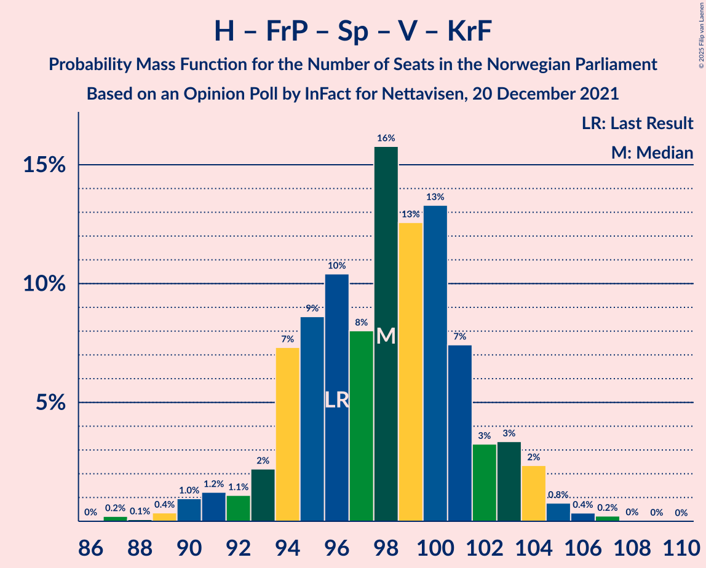
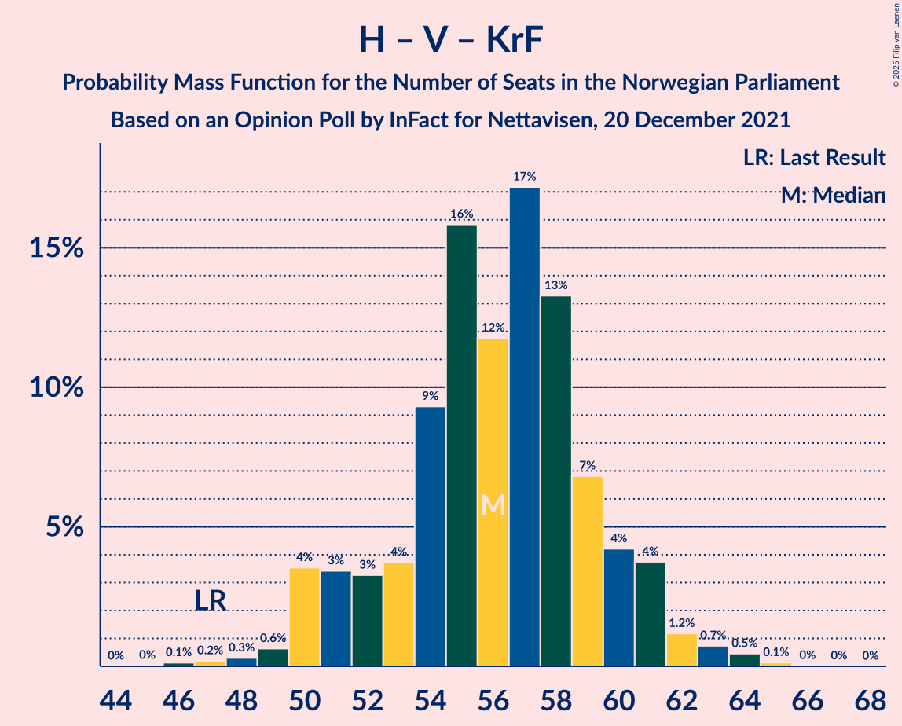

# Opinion Poll by InFact for Nettavisen, 20 December 2021

<a href="#voting-intentions">Voting Intentions</a> | <a href="#seats">Seats</a> | <a href="#coalitions">Coalitions</a> | <a href="#technical-information">Technical Information</a>

## Voting Intentions

### Confidence Intervals

| Party | Last Result | Poll Result | 80% Confidence Interval | 90% Confidence Interval | 95% Confidence Interval | 99% Confidence Interval |
|:-----:|:-----------:|:-----------:|:-----------------------:|:-----------------------:|:-----------------------:|:-----------------------:|
| Høyre | 20.4% | 25.4% | 23.7–27.2% |23.2–27.8% |22.8–28.2% |22.0–29.1% |
| Arbeiderpartiet | 26.2% | 21.6% | 20.0–23.3% |19.5–23.8% |19.1–24.2% |18.4–25.1% |
| Fremskrittspartiet | 11.6% | 13.8% | 12.5–15.3% |12.1–15.7% |11.8–16.1% |11.2–16.8% |
| Senterpartiet | 13.5% | 9.9% | 8.7–11.2% |8.4–11.5% |8.2–11.8% |7.7–12.5% |
| Sosialistisk Venstreparti | 7.6% | 9.1% | 8.0–10.3% |7.7–10.7% |7.4–11.0% |7.0–11.6% |
| Rødt | 4.7% | 6.1% | 5.2–7.2% |5.0–7.5% |4.8–7.8% |4.4–8.3% |
| Venstre | 4.6% | 4.7% | 4.0–5.7% |3.8–6.0% |3.6–6.2% |3.2–6.7% |
| Miljøpartiet De Grønne | 3.9% | 3.4% | 2.8–4.3% |2.6–4.5% |2.5–4.8% |2.2–5.2% |
| Kristelig Folkeparti | 3.8% | 3.2% | 2.5–4.0% |2.4–4.2% |2.2–4.4% |2.0–4.8% |

*Note:* The poll result column reflects the actual value used in the calculations. Published results may vary slightly, and in addition be rounded to fewer digits.

## Seats

### Confidence Intervals

| Party | Last Result | Median | 80% Confidence Interval | 90% Confidence Interval | 95% Confidence Interval | 99% Confidence Interval |
|:-----:|:-----------:|:------:|:-----------------------:|:-----------------------:|:-----------------------:|:-----------------------:|
| <a href="#høyre">Høyre</a> | 36 | 45 | 42–48 |41–49 |41–50 |40–53 |
| <a href="#arbeiderpartiet">Arbeiderpartiet</a> | 48 | 40 | 37–43 |37–44 |36–45 |34–47 |
| <a href="#fremskrittspartiet">Fremskrittspartiet</a> | 21 | 24 | 22–27 |21–28 |21–29 |19–30 |
| <a href="#senterpartiet">Senterpartiet</a> | 28 | 17 | 15–20 |15–20 |14–21 |14–22 |
| <a href="#sosialistisk-venstreparti">Sosialistisk Venstreparti</a> | 13 | 16 | 14–18 |14–19 |13–19 |12–21 |
| <a href="#rødt">Rødt</a> | 8 | 11 | 9–13 |9–13 |9–14 |8–15 |
| <a href="#venstre">Venstre</a> | 8 | 8 | 3–10 |3–11 |3–11 |2–12 |
| <a href="#miljøpartiet-de-grønne">Miljøpartiet De Grønne</a> | 3 | 2 | 1–7 |1–8 |1–8 |1–9 |
| <a href="#kristelig-folkeparti">Kristelig Folkeparti</a> | 3 | 2 | 2–3 |2–7 |1–7 |0–8 |

### Høyre

*For a full overview of the results for this party, see the [Høyre](party-høyre.html) page.*

| Number of Seats | Probability | Accumulated | Special Marks |
|:---------------:|:-----------:|:-----------:|:-------------:|
| 36 | 0% | 100% | Last Result |
| 37 | 0% | 100% |  |
| 38 | 0.1% | 100% |  |
| 39 | 0.3% | 99.9% |  |
| 40 | 1.5% | 99.5% |  |
| 41 | 4% | 98% |  |
| 42 | 8% | 94% |  |
| 43 | 6% | 86% |  |
| 44 | 15% | 81% |  |
| 45 | 19% | 65% | Median |
| 46 | 13% | 46% |  |
| 47 | 14% | 33% |  |
| 48 | 9% | 19% |  |
| 49 | 5% | 10% |  |
| 50 | 3% | 5% |  |
| 51 | 0.6% | 2% |  |
| 52 | 0.6% | 1.4% |  |
| 53 | 0.6% | 0.8% |  |
| 54 | 0.1% | 0.1% |  |
| 55 | 0% | 0% |  |

### Arbeiderpartiet

*For a full overview of the results for this party, see the [Arbeiderpartiet](party-arbeiderpartiet.html) page.*

| Number of Seats | Probability | Accumulated | Special Marks |
|:---------------:|:-----------:|:-----------:|:-------------:|
| 32 | 0% | 100% |  |
| 33 | 0.2% | 99.9% |  |
| 34 | 0.5% | 99.7% |  |
| 35 | 0.8% | 99.3% |  |
| 36 | 3% | 98% |  |
| 37 | 10% | 96% |  |
| 38 | 9% | 85% |  |
| 39 | 23% | 77% |  |
| 40 | 10% | 54% | Median |
| 41 | 18% | 44% |  |
| 42 | 11% | 25% |  |
| 43 | 7% | 15% |  |
| 44 | 2% | 7% |  |
| 45 | 3% | 5% |  |
| 46 | 0.9% | 2% |  |
| 47 | 0.4% | 0.6% |  |
| 48 | 0.1% | 0.3% | Last Result |
| 49 | 0.1% | 0.1% |  |
| 50 | 0% | 0% |  |

### Fremskrittspartiet

*For a full overview of the results for this party, see the [Fremskrittspartiet](party-fremskrittspartiet.html) page.*

| Number of Seats | Probability | Accumulated | Special Marks |
|:---------------:|:-----------:|:-----------:|:-------------:|
| 18 | 0.1% | 100% |  |
| 19 | 0.6% | 99.9% |  |
| 20 | 2% | 99.4% |  |
| 21 | 4% | 98% | Last Result |
| 22 | 14% | 93% |  |
| 23 | 16% | 80% |  |
| 24 | 15% | 63% | Median |
| 25 | 14% | 48% |  |
| 26 | 19% | 34% |  |
| 27 | 8% | 15% |  |
| 28 | 4% | 7% |  |
| 29 | 2% | 3% |  |
| 30 | 0.9% | 1.2% |  |
| 31 | 0.3% | 0.3% |  |
| 32 | 0.1% | 0.1% |  |
| 33 | 0% | 0% |  |

### Senterpartiet

*For a full overview of the results for this party, see the [Senterpartiet](party-senterpartiet.html) page.*

| Number of Seats | Probability | Accumulated | Special Marks |
|:---------------:|:-----------:|:-----------:|:-------------:|
| 12 | 0.1% | 100% |  |
| 13 | 0.4% | 99.9% |  |
| 14 | 2% | 99.5% |  |
| 15 | 9% | 97% |  |
| 16 | 17% | 88% |  |
| 17 | 29% | 71% | Median |
| 18 | 17% | 42% |  |
| 19 | 12% | 25% |  |
| 20 | 10% | 13% |  |
| 21 | 2% | 3% |  |
| 22 | 0.7% | 1.1% |  |
| 23 | 0.3% | 0.4% |  |
| 24 | 0% | 0.1% |  |
| 25 | 0% | 0.1% |  |
| 26 | 0% | 0% |  |
| 27 | 0% | 0% |  |
| 28 | 0% | 0% | Last Result |

### Sosialistisk Venstreparti

*For a full overview of the results for this party, see the [Sosialistisk Venstreparti](party-sosialistiskvenstreparti.html) page.*

| Number of Seats | Probability | Accumulated | Special Marks |
|:---------------:|:-----------:|:-----------:|:-------------:|
| 11 | 0.2% | 100% |  |
| 12 | 1.1% | 99.8% |  |
| 13 | 3% | 98.7% | Last Result |
| 14 | 13% | 96% |  |
| 15 | 17% | 82% |  |
| 16 | 18% | 65% | Median |
| 17 | 26% | 47% |  |
| 18 | 14% | 21% |  |
| 19 | 6% | 8% |  |
| 20 | 1.4% | 2% |  |
| 21 | 0.5% | 0.7% |  |
| 22 | 0.1% | 0.1% |  |
| 23 | 0% | 0% |  |

### Rødt

*For a full overview of the results for this party, see the [Rødt](party-rødt.html) page.*

| Number of Seats | Probability | Accumulated | Special Marks |
|:---------------:|:-----------:|:-----------:|:-------------:|
| 7 | 0.2% | 100% |  |
| 8 | 2% | 99.7% | Last Result |
| 9 | 14% | 98% |  |
| 10 | 22% | 84% |  |
| 11 | 25% | 62% | Median |
| 12 | 24% | 37% |  |
| 13 | 10% | 13% |  |
| 14 | 3% | 4% |  |
| 15 | 1.0% | 1.1% |  |
| 16 | 0.1% | 0.1% |  |
| 17 | 0% | 0% |  |

### Venstre

*For a full overview of the results for this party, see the [Venstre](party-venstre.html) page.*

| Number of Seats | Probability | Accumulated | Special Marks |
|:---------------:|:-----------:|:-----------:|:-------------:|
| 2 | 2% | 100% |  |
| 3 | 9% | 98% |  |
| 4 | 0% | 88% |  |
| 5 | 0% | 88% |  |
| 6 | 0.1% | 88% |  |
| 7 | 8% | 88% |  |
| 8 | 31% | 80% | Last Result, Median |
| 9 | 30% | 49% |  |
| 10 | 14% | 19% |  |
| 11 | 4% | 5% |  |
| 12 | 0.8% | 0.9% |  |
| 13 | 0.1% | 0.1% |  |
| 14 | 0% | 0% |  |

### Miljøpartiet De Grønne

*For a full overview of the results for this party, see the [Miljøpartiet De Grønne](party-miljøpartietdegrønne.html) page.*

| Number of Seats | Probability | Accumulated | Special Marks |
|:---------------:|:-----------:|:-----------:|:-------------:|
| 1 | 13% | 100% |  |
| 2 | 47% | 87% | Median |
| 3 | 22% | 40% | Last Result |
| 4 | 0% | 18% |  |
| 5 | 0% | 18% |  |
| 6 | 0.3% | 18% |  |
| 7 | 11% | 18% |  |
| 8 | 5% | 7% |  |
| 9 | 1.2% | 1.4% |  |
| 10 | 0.2% | 0.2% |  |
| 11 | 0% | 0% |  |

### Kristelig Folkeparti

*For a full overview of the results for this party, see the [Kristelig Folkeparti](party-kristeligfolkeparti.html) page.*

| Number of Seats | Probability | Accumulated | Special Marks |
|:---------------:|:-----------:|:-----------:|:-------------:|
| 0 | 2% | 100% |  |
| 1 | 2% | 98% |  |
| 2 | 63% | 96% | Median |
| 3 | 25% | 34% | Last Result |
| 4 | 0% | 8% |  |
| 5 | 0% | 8% |  |
| 6 | 0.6% | 8% |  |
| 7 | 5% | 8% |  |
| 8 | 2% | 2% |  |
| 9 | 0.3% | 0.3% |  |
| 10 | 0% | 0% |  |

## Coalitions

### Confidence Intervals

| Coalition | Last Result | Median | Majority? | 80% Confidence Interval | 90% Confidence Interval | 95% Confidence Interval | 99% Confidence Interval |
|:---------:|:-----------:|:------:|:---------:|:-----------------------:|:-----------------------:|:-----------------------:|:-----------------------:|
| Høyre – Fremskrittspartiet – Senterpartiet – Venstre – Kristelig Folkeparti | 96 | 98 | 100% | 94–102 | 93–103 | 91–104 | 89–106 |
| Arbeiderpartiet – Senterpartiet – Sosialistisk Venstreparti – Rødt – Miljøpartiet De Grønne | 100 | 88 | 86% | 84–92 | 82–93 | 81–94 | 80–96 |
| Arbeiderpartiet – Senterpartiet – Sosialistisk Venstreparti – Rødt | 97 | 85 | 52% | 80–89 | 79–90 | 78–91 | 76–93 |
| Høyre – Fremskrittspartiet – Venstre – Miljøpartiet De Grønne – Kristelig Folkeparti | 71 | 83 | 40% | 80–88 | 78–89 | 78–90 | 75–91 |
| Høyre – Fremskrittspartiet – Venstre – Kristelig Folkeparti | 68 | 81 | 9% | 76–84 | 75–86 | 74–87 | 71–88 |
| Arbeiderpartiet – Senterpartiet – Sosialistisk Venstreparti – Miljøpartiet De Grønne – Kristelig Folkeparti | 95 | 80 | 5% | 76–83 | 74–85 | 72–86 | 71–88 |
| Høyre – Fremskrittspartiet – Venstre | 65 | 78 | 2% | 74–81 | 73–83 | 72–84 | 69–86 |
| Arbeiderpartiet – Senterpartiet – Sosialistisk Venstreparti – Miljøpartiet De Grønne | 92 | 77 | 1.0% | 73–81 | 72–82 | 70–83 | 69–85 |
| Arbeiderpartiet – Senterpartiet – Sosialistisk Venstreparti | 89 | 74 | 0% | 70–77 | 68–78 | 68–79 | 66–82 |
| Arbeiderpartiet – Sosialistisk Venstreparti – Rødt – Miljøpartiet De Grønne | 72 | 70 | 0% | 67–74 | 65–75 | 64–76 | 63–79 |
| Høyre – Fremskrittspartiet | 57 | 70 | 0% | 66–73 | 65–75 | 64–76 | 62–78 |
| Arbeiderpartiet – Senterpartiet – Miljøpartiet De Grønne – Kristelig Folkeparti | 82 | 63 | 0% | 59–67 | 58–69 | 57–70 | 56–73 |
| Arbeiderpartiet – Senterpartiet – Kristelig Folkeparti | 79 | 60 | 0% | 56–64 | 55–65 | 55–66 | 53–68 |
| Arbeiderpartiet – Senterpartiet | 76 | 58 | 0% | 54–61 | 53–62 | 52–63 | 51–65 |
| Høyre – Venstre – Kristelig Folkeparti | 47 | 56 | 0% | 52–60 | 51–61 | 50–62 | 48–64 |
| Arbeiderpartiet – Sosialistisk Venstreparti | 61 | 56 | 0% | 53–59 | 52–61 | 51–61 | 50–63 |
| Senterpartiet – Venstre – Kristelig Folkeparti | 39 | 28 | 0% | 24–32 | 23–33 | 22–34 | 20–36 |

### Høyre – Fremskrittspartiet – Senterpartiet – Venstre – Kristelig Folkeparti

| Number of Seats | Probability | Accumulated | Special Marks |
|:---------------:|:-----------:|:-----------:|:-------------:|
| 86 | 0% | 100% |  |
| 87 | 0.2% | 99.9% |  |
| 88 | 0.1% | 99.7% |  |
| 89 | 0.4% | 99.7% |  |
| 90 | 1.0% | 99.3% |  |
| 91 | 1.2% | 98% |  |
| 92 | 1.1% | 97% |  |
| 93 | 2% | 96% |  |
| 94 | 7% | 94% |  |
| 95 | 9% | 86% |  |
| 96 | 10% | 78% | Last Result, Median |
| 97 | 8% | 67% |  |
| 98 | 16% | 59% |  |
| 99 | 13% | 44% |  |
| 100 | 13% | 31% |  |
| 101 | 7% | 18% |  |
| 102 | 3% | 10% |  |
| 103 | 3% | 7% |  |
| 104 | 2% | 4% |  |
| 105 | 0.8% | 1.4% |  |
| 106 | 0.4% | 0.6% |  |
| 107 | 0.2% | 0.3% |  |
| 108 | 0% | 0.1% |  |
| 109 | 0% | 0% |  |

### Arbeiderpartiet – Senterpartiet – Sosialistisk Venstreparti – Rødt – Miljøpartiet De Grønne

| Number of Seats | Probability | Accumulated | Special Marks |
|:---------------:|:-----------:|:-----------:|:-------------:|
| 77 | 0.1% | 100% |  |
| 78 | 0.1% | 99.9% |  |
| 79 | 0.2% | 99.8% |  |
| 80 | 1.2% | 99.6% |  |
| 81 | 1.4% | 98% |  |
| 82 | 3% | 97% |  |
| 83 | 2% | 95% |  |
| 84 | 6% | 92% |  |
| 85 | 7% | 86% | Majority |
| 86 | 16% | 80% | Median |
| 87 | 11% | 63% |  |
| 88 | 7% | 52% |  |
| 89 | 22% | 45% |  |
| 90 | 6% | 23% |  |
| 91 | 4% | 17% |  |
| 92 | 6% | 13% |  |
| 93 | 4% | 7% |  |
| 94 | 0.9% | 3% |  |
| 95 | 1.1% | 2% |  |
| 96 | 0.4% | 0.9% |  |
| 97 | 0.3% | 0.5% |  |
| 98 | 0.1% | 0.2% |  |
| 99 | 0% | 0.1% |  |
| 100 | 0% | 0% | Last Result |

### Arbeiderpartiet – Senterpartiet – Sosialistisk Venstreparti – Rødt

| Number of Seats | Probability | Accumulated | Special Marks |
|:---------------:|:-----------:|:-----------:|:-------------:|
| 74 | 0.1% | 100% |  |
| 75 | 0.1% | 99.9% |  |
| 76 | 0.3% | 99.7% |  |
| 77 | 0.8% | 99.4% |  |
| 78 | 2% | 98.7% |  |
| 79 | 2% | 97% |  |
| 80 | 7% | 95% |  |
| 81 | 3% | 88% |  |
| 82 | 7% | 84% |  |
| 83 | 11% | 78% |  |
| 84 | 15% | 67% | Median |
| 85 | 7% | 52% | Majority |
| 86 | 17% | 45% |  |
| 87 | 13% | 28% |  |
| 88 | 4% | 15% |  |
| 89 | 5% | 11% |  |
| 90 | 2% | 6% |  |
| 91 | 2% | 4% |  |
| 92 | 0.6% | 1.2% |  |
| 93 | 0.3% | 0.5% |  |
| 94 | 0.2% | 0.3% |  |
| 95 | 0.1% | 0.1% |  |
| 96 | 0% | 0% |  |
| 97 | 0% | 0% | Last Result |

### Høyre – Fremskrittspartiet – Venstre – Miljøpartiet De Grønne – Kristelig Folkeparti

| Number of Seats | Probability | Accumulated | Special Marks |
|:---------------:|:-----------:|:-----------:|:-------------:|
| 71 | 0% | 100% | Last Result |
| 72 | 0.1% | 100% |  |
| 73 | 0.1% | 99.9% |  |
| 74 | 0.1% | 99.9% |  |
| 75 | 0.3% | 99.8% |  |
| 76 | 0.5% | 99.5% |  |
| 77 | 1.1% | 99.0% |  |
| 78 | 3% | 98% |  |
| 79 | 3% | 95% |  |
| 80 | 6% | 92% |  |
| 81 | 10% | 86% | Median |
| 82 | 14% | 76% |  |
| 83 | 14% | 62% |  |
| 84 | 8% | 48% |  |
| 85 | 16% | 40% | Majority |
| 86 | 7% | 24% |  |
| 87 | 5% | 17% |  |
| 88 | 7% | 12% |  |
| 89 | 3% | 6% |  |
| 90 | 2% | 3% |  |
| 91 | 0.9% | 1.4% |  |
| 92 | 0.3% | 0.5% |  |
| 93 | 0.1% | 0.2% |  |
| 94 | 0% | 0.1% |  |
| 95 | 0% | 0% |  |

### Høyre – Fremskrittspartiet – Venstre – Kristelig Folkeparti

| Number of Seats | Probability | Accumulated | Special Marks |
|:---------------:|:-----------:|:-----------:|:-------------:|
| 68 | 0% | 100% | Last Result |
| 69 | 0% | 100% |  |
| 70 | 0.1% | 99.9% |  |
| 71 | 0.4% | 99.8% |  |
| 72 | 0.3% | 99.5% |  |
| 73 | 1.0% | 99.1% |  |
| 74 | 0.9% | 98% |  |
| 75 | 2% | 97% |  |
| 76 | 5% | 95% |  |
| 77 | 7% | 90% |  |
| 78 | 5% | 83% |  |
| 79 | 16% | 78% | Median |
| 80 | 12% | 62% |  |
| 81 | 13% | 51% |  |
| 82 | 11% | 38% |  |
| 83 | 11% | 27% |  |
| 84 | 7% | 16% |  |
| 85 | 3% | 9% | Majority |
| 86 | 3% | 5% |  |
| 87 | 1.1% | 3% |  |
| 88 | 1.2% | 2% |  |
| 89 | 0.2% | 0.3% |  |
| 90 | 0% | 0.1% |  |
| 91 | 0% | 0.1% |  |
| 92 | 0% | 0% |  |

### Arbeiderpartiet – Senterpartiet – Sosialistisk Venstreparti – Miljøpartiet De Grønne – Kristelig Folkeparti

| Number of Seats | Probability | Accumulated | Special Marks |
|:---------------:|:-----------:|:-----------:|:-------------:|
| 69 | 0% | 100% |  |
| 70 | 0.1% | 99.9% |  |
| 71 | 0.5% | 99.9% |  |
| 72 | 2% | 99.4% |  |
| 73 | 1.1% | 97% |  |
| 74 | 2% | 96% |  |
| 75 | 2% | 94% |  |
| 76 | 11% | 92% |  |
| 77 | 9% | 81% | Median |
| 78 | 11% | 72% |  |
| 79 | 11% | 62% |  |
| 80 | 14% | 50% |  |
| 81 | 13% | 36% |  |
| 82 | 9% | 23% |  |
| 83 | 7% | 14% |  |
| 84 | 2% | 8% |  |
| 85 | 2% | 5% | Majority |
| 86 | 2% | 3% |  |
| 87 | 0.8% | 2% |  |
| 88 | 0.4% | 0.9% |  |
| 89 | 0.3% | 0.4% |  |
| 90 | 0.1% | 0.2% |  |
| 91 | 0% | 0.1% |  |
| 92 | 0% | 0% |  |
| 93 | 0% | 0% |  |
| 94 | 0% | 0% |  |
| 95 | 0% | 0% | Last Result |

### Høyre – Fremskrittspartiet – Venstre

| Number of Seats | Probability | Accumulated | Special Marks |
|:---------------:|:-----------:|:-----------:|:-------------:|
| 65 | 0% | 100% | Last Result |
| 66 | 0% | 100% |  |
| 67 | 0% | 100% |  |
| 68 | 0.3% | 99.9% |  |
| 69 | 0.4% | 99.7% |  |
| 70 | 0.7% | 99.2% |  |
| 71 | 0.9% | 98.6% |  |
| 72 | 1.3% | 98% |  |
| 73 | 3% | 96% |  |
| 74 | 6% | 94% |  |
| 75 | 8% | 87% |  |
| 76 | 10% | 79% |  |
| 77 | 15% | 69% | Median |
| 78 | 10% | 54% |  |
| 79 | 17% | 44% |  |
| 80 | 6% | 27% |  |
| 81 | 11% | 21% |  |
| 82 | 4% | 10% |  |
| 83 | 1.4% | 6% |  |
| 84 | 2% | 4% |  |
| 85 | 1.0% | 2% | Majority |
| 86 | 0.7% | 0.8% |  |
| 87 | 0.1% | 0.1% |  |
| 88 | 0% | 0% |  |

### Arbeiderpartiet – Senterpartiet – Sosialistisk Venstreparti – Miljøpartiet De Grønne

| Number of Seats | Probability | Accumulated | Special Marks |
|:---------------:|:-----------:|:-----------:|:-------------:|
| 66 | 0% | 100% |  |
| 67 | 0.1% | 99.9% |  |
| 68 | 0.4% | 99.9% |  |
| 69 | 0.5% | 99.5% |  |
| 70 | 2% | 99.0% |  |
| 71 | 1.3% | 97% |  |
| 72 | 3% | 95% |  |
| 73 | 5% | 92% |  |
| 74 | 14% | 87% |  |
| 75 | 7% | 73% | Median |
| 76 | 11% | 66% |  |
| 77 | 13% | 56% |  |
| 78 | 17% | 43% |  |
| 79 | 9% | 26% |  |
| 80 | 7% | 18% |  |
| 81 | 4% | 10% |  |
| 82 | 2% | 6% |  |
| 83 | 2% | 4% |  |
| 84 | 0.8% | 2% |  |
| 85 | 0.5% | 1.0% | Majority |
| 86 | 0.3% | 0.5% |  |
| 87 | 0.1% | 0.2% |  |
| 88 | 0% | 0.1% |  |
| 89 | 0% | 0.1% |  |
| 90 | 0% | 0% |  |
| 91 | 0% | 0% |  |
| 92 | 0% | 0% | Last Result |

### Arbeiderpartiet – Senterpartiet – Sosialistisk Venstreparti

| Number of Seats | Probability | Accumulated | Special Marks |
|:---------------:|:-----------:|:-----------:|:-------------:|
| 64 | 0.1% | 100% |  |
| 65 | 0.2% | 99.9% |  |
| 66 | 0.9% | 99.7% |  |
| 67 | 0.8% | 98.9% |  |
| 68 | 3% | 98% |  |
| 69 | 2% | 95% |  |
| 70 | 8% | 92% |  |
| 71 | 6% | 85% |  |
| 72 | 15% | 79% |  |
| 73 | 9% | 64% | Median |
| 74 | 12% | 55% |  |
| 75 | 14% | 43% |  |
| 76 | 17% | 30% |  |
| 77 | 4% | 12% |  |
| 78 | 3% | 8% |  |
| 79 | 2% | 5% |  |
| 80 | 1.4% | 2% |  |
| 81 | 0.5% | 1.1% |  |
| 82 | 0.3% | 0.6% |  |
| 83 | 0.1% | 0.2% |  |
| 84 | 0.1% | 0.1% |  |
| 85 | 0% | 0% | Majority |
| 86 | 0% | 0% |  |
| 87 | 0% | 0% |  |
| 88 | 0% | 0% |  |
| 89 | 0% | 0% | Last Result |

### Arbeiderpartiet – Sosialistisk Venstreparti – Rødt – Miljøpartiet De Grønne

| Number of Seats | Probability | Accumulated | Special Marks |
|:---------------:|:-----------:|:-----------:|:-------------:|
| 60 | 0% | 100% |  |
| 61 | 0.1% | 99.9% |  |
| 62 | 0.3% | 99.8% |  |
| 63 | 0.6% | 99.5% |  |
| 64 | 1.5% | 98.9% |  |
| 65 | 4% | 97% |  |
| 66 | 2% | 94% |  |
| 67 | 8% | 91% |  |
| 68 | 7% | 83% |  |
| 69 | 17% | 77% | Median |
| 70 | 14% | 59% |  |
| 71 | 10% | 45% |  |
| 72 | 13% | 36% | Last Result |
| 73 | 8% | 23% |  |
| 74 | 6% | 15% |  |
| 75 | 5% | 8% |  |
| 76 | 1.3% | 3% |  |
| 77 | 1.0% | 2% |  |
| 78 | 0.5% | 1.2% |  |
| 79 | 0.4% | 0.7% |  |
| 80 | 0.1% | 0.2% |  |
| 81 | 0.1% | 0.1% |  |
| 82 | 0% | 0% |  |

### Høyre – Fremskrittspartiet

| Number of Seats | Probability | Accumulated | Special Marks |
|:---------------:|:-----------:|:-----------:|:-------------:|
| 57 | 0% | 100% | Last Result |
| 58 | 0% | 100% |  |
| 59 | 0% | 100% |  |
| 60 | 0.1% | 100% |  |
| 61 | 0.3% | 99.9% |  |
| 62 | 0.3% | 99.6% |  |
| 63 | 0.9% | 99.4% |  |
| 64 | 2% | 98% |  |
| 65 | 3% | 97% |  |
| 66 | 7% | 94% |  |
| 67 | 8% | 87% |  |
| 68 | 15% | 79% |  |
| 69 | 6% | 64% | Median |
| 70 | 18% | 57% |  |
| 71 | 6% | 40% |  |
| 72 | 19% | 34% |  |
| 73 | 5% | 14% |  |
| 74 | 3% | 9% |  |
| 75 | 3% | 6% |  |
| 76 | 2% | 3% |  |
| 77 | 1.1% | 2% |  |
| 78 | 0.5% | 0.7% |  |
| 79 | 0.1% | 0.2% |  |
| 80 | 0.1% | 0.1% |  |
| 81 | 0% | 0% |  |

### Arbeiderpartiet – Senterpartiet – Miljøpartiet De Grønne – Kristelig Folkeparti

| Number of Seats | Probability | Accumulated | Special Marks |
|:---------------:|:-----------:|:-----------:|:-------------:|
| 53 | 0% | 100% |  |
| 54 | 0.2% | 99.9% |  |
| 55 | 0.2% | 99.8% |  |
| 56 | 0.7% | 99.6% |  |
| 57 | 2% | 98.8% |  |
| 58 | 3% | 97% |  |
| 59 | 7% | 93% |  |
| 60 | 8% | 87% |  |
| 61 | 7% | 78% | Median |
| 62 | 14% | 71% |  |
| 63 | 16% | 57% |  |
| 64 | 9% | 41% |  |
| 65 | 9% | 33% |  |
| 66 | 9% | 24% |  |
| 67 | 5% | 15% |  |
| 68 | 4% | 10% |  |
| 69 | 2% | 6% |  |
| 70 | 1.4% | 3% |  |
| 71 | 1.3% | 2% |  |
| 72 | 0.3% | 0.8% |  |
| 73 | 0.3% | 0.6% |  |
| 74 | 0.2% | 0.3% |  |
| 75 | 0.1% | 0.1% |  |
| 76 | 0% | 0% |  |
| 77 | 0% | 0% |  |
| 78 | 0% | 0% |  |
| 79 | 0% | 0% |  |
| 80 | 0% | 0% |  |
| 81 | 0% | 0% |  |
| 82 | 0% | 0% | Last Result |

### Arbeiderpartiet – Senterpartiet – Kristelig Folkeparti

| Number of Seats | Probability | Accumulated | Special Marks |
|:---------------:|:-----------:|:-----------:|:-------------:|
| 51 | 0.1% | 100% |  |
| 52 | 0.2% | 99.9% |  |
| 53 | 0.5% | 99.7% |  |
| 54 | 2% | 99.2% |  |
| 55 | 3% | 98% |  |
| 56 | 9% | 94% |  |
| 57 | 4% | 86% |  |
| 58 | 11% | 82% |  |
| 59 | 11% | 70% | Median |
| 60 | 15% | 60% |  |
| 61 | 16% | 45% |  |
| 62 | 10% | 29% |  |
| 63 | 6% | 20% |  |
| 64 | 7% | 14% |  |
| 65 | 3% | 7% |  |
| 66 | 2% | 4% |  |
| 67 | 1.1% | 2% |  |
| 68 | 0.5% | 0.9% |  |
| 69 | 0.2% | 0.4% |  |
| 70 | 0.1% | 0.2% |  |
| 71 | 0% | 0.1% |  |
| 72 | 0% | 0% |  |
| 73 | 0% | 0% |  |
| 74 | 0% | 0% |  |
| 75 | 0% | 0% |  |
| 76 | 0% | 0% |  |
| 77 | 0% | 0% |  |
| 78 | 0% | 0% |  |
| 79 | 0% | 0% | Last Result |

### Arbeiderpartiet – Senterpartiet

| Number of Seats | Probability | Accumulated | Special Marks |
|:---------------:|:-----------:|:-----------:|:-------------:|
| 49 | 0.1% | 100% |  |
| 50 | 0.2% | 99.9% |  |
| 51 | 0.5% | 99.7% |  |
| 52 | 3% | 99.1% |  |
| 53 | 5% | 97% |  |
| 54 | 7% | 92% |  |
| 55 | 8% | 84% |  |
| 56 | 11% | 76% |  |
| 57 | 11% | 65% | Median |
| 58 | 19% | 54% |  |
| 59 | 15% | 35% |  |
| 60 | 7% | 20% |  |
| 61 | 5% | 13% |  |
| 62 | 5% | 8% |  |
| 63 | 1.4% | 3% |  |
| 64 | 0.7% | 1.5% |  |
| 65 | 0.4% | 0.7% |  |
| 66 | 0.2% | 0.3% |  |
| 67 | 0.1% | 0.1% |  |
| 68 | 0% | 0% |  |
| 69 | 0% | 0% |  |
| 70 | 0% | 0% |  |
| 71 | 0% | 0% |  |
| 72 | 0% | 0% |  |
| 73 | 0% | 0% |  |
| 74 | 0% | 0% |  |
| 75 | 0% | 0% |  |
| 76 | 0% | 0% | Last Result |

### Høyre – Venstre – Kristelig Folkeparti

| Number of Seats | Probability | Accumulated | Special Marks |
|:---------------:|:-----------:|:-----------:|:-------------:|
| 45 | 0% | 100% |  |
| 46 | 0.1% | 99.9% |  |
| 47 | 0.2% | 99.8% | Last Result |
| 48 | 0.3% | 99.6% |  |
| 49 | 0.6% | 99.3% |  |
| 50 | 4% | 98.7% |  |
| 51 | 3% | 95% |  |
| 52 | 3% | 92% |  |
| 53 | 4% | 88% |  |
| 54 | 9% | 85% |  |
| 55 | 16% | 75% | Median |
| 56 | 12% | 60% |  |
| 57 | 17% | 48% |  |
| 58 | 13% | 31% |  |
| 59 | 7% | 17% |  |
| 60 | 4% | 11% |  |
| 61 | 4% | 6% |  |
| 62 | 1.2% | 3% |  |
| 63 | 0.7% | 1.4% |  |
| 64 | 0.5% | 0.6% |  |
| 65 | 0.1% | 0.2% |  |
| 66 | 0% | 0.1% |  |
| 67 | 0% | 0% |  |

### Arbeiderpartiet – Sosialistisk Venstreparti

| Number of Seats | Probability | Accumulated | Special Marks |
|:---------------:|:-----------:|:-----------:|:-------------:|
| 47 | 0% | 100% |  |
| 48 | 0.1% | 99.9% |  |
| 49 | 0.3% | 99.8% |  |
| 50 | 0.7% | 99.5% |  |
| 51 | 3% | 98.8% |  |
| 52 | 3% | 96% |  |
| 53 | 4% | 93% |  |
| 54 | 12% | 89% |  |
| 55 | 16% | 77% |  |
| 56 | 17% | 61% | Median |
| 57 | 11% | 44% |  |
| 58 | 14% | 34% |  |
| 59 | 11% | 19% |  |
| 60 | 2% | 8% |  |
| 61 | 3% | 5% | Last Result |
| 62 | 1.1% | 2% |  |
| 63 | 0.6% | 1.0% |  |
| 64 | 0.2% | 0.4% |  |
| 65 | 0.1% | 0.2% |  |
| 66 | 0.1% | 0.1% |  |
| 67 | 0% | 0% |  |

### Senterpartiet – Venstre – Kristelig Folkeparti

| Number of Seats | Probability | Accumulated | Special Marks |
|:---------------:|:-----------:|:-----------:|:-------------:|
| 18 | 0% | 100% |  |
| 19 | 0.2% | 99.9% |  |
| 20 | 0.6% | 99.7% |  |
| 21 | 0.5% | 99.1% |  |
| 22 | 2% | 98.6% |  |
| 23 | 4% | 97% |  |
| 24 | 3% | 93% |  |
| 25 | 4% | 90% |  |
| 26 | 10% | 86% |  |
| 27 | 15% | 76% | Median |
| 28 | 20% | 61% |  |
| 29 | 15% | 42% |  |
| 30 | 9% | 27% |  |
| 31 | 8% | 18% |  |
| 32 | 5% | 10% |  |
| 33 | 3% | 5% |  |
| 34 | 1.1% | 3% |  |
| 35 | 0.8% | 1.4% |  |
| 36 | 0.4% | 0.6% |  |
| 37 | 0.1% | 0.2% |  |
| 38 | 0% | 0.1% |  |
| 39 | 0% | 0% | Last Result |

## Technical Information

### Opinion Poll

+ **Polling firm:** InFact
+ **Commissioner(s):** Nettavisen
+ **Fieldwork period:** 20 December 2021

### Calculations

+ **Sample size:** 1015
+ **Simulations done:** 1,048,576
+ **Error estimate:** 2.00%

