# Opinion Poll by Norstat for Vårt Land, 14–20 December 2021

<a href="#voting-intentions">Voting Intentions</a> | <a href="#seats">Seats</a> | <a href="#coalitions">Coalitions</a> | <a href="#technical-information">Technical Information</a>

## Voting Intentions

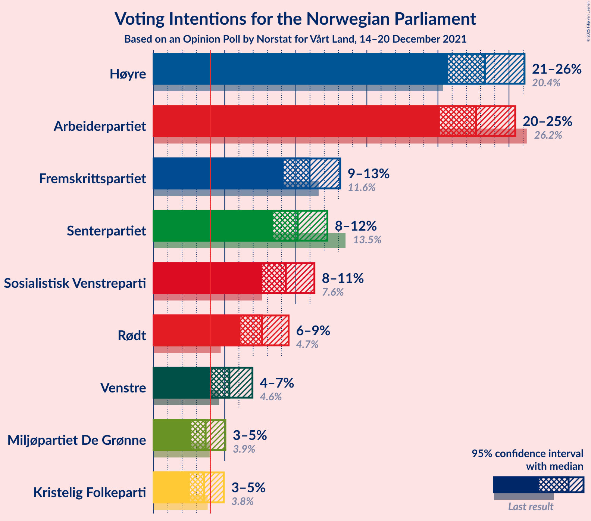

### Confidence Intervals

| Party | Last Result | Poll Result | 80% Confidence Interval | 90% Confidence Interval | 95% Confidence Interval | 99% Confidence Interval |
|:-----:|:-----------:|:-----------:|:-----------------------:|:-----------------------:|:-----------------------:|:-----------------------:|
| Høyre | 20.4% | 23.3% | 21.6–25.1% |21.1–25.6% |20.7–26.1% |19.9–27.0% |
| Arbeiderpartiet | 26.2% | 22.7% | 21.0–24.5% |20.5–25.0% |20.1–25.4% |19.4–26.3% |
| Fremskrittspartiet | 11.6% | 11.0% | 9.8–12.4% |9.4–12.8% |9.1–13.1% |8.6–13.8% |
| Senterpartiet | 13.5% | 10.1% | 9.0–11.5% |8.7–11.9% |8.4–12.2% |7.8–12.9% |
| Sosialistisk Venstreparti | 7.6% | 9.3% | 8.2–10.6% |7.9–11.0% |7.6–11.3% |7.1–12.0% |
| Rødt | 4.7% | 7.6% | 6.6–8.8% |6.3–9.2% |6.1–9.5% |5.7–10.1% |
| Venstre | 4.6% | 5.3% | 4.5–6.4% |4.3–6.7% |4.1–7.0% |3.7–7.5% |
| Miljøpartiet De Grønne | 3.9% | 3.7% | 3.0–4.6% |2.8–4.8% |2.6–5.0% |2.3–5.5% |
| Kristelig Folkeparti | 3.8% | 3.6% | 2.9–4.5% |2.7–4.7% |2.5–4.9% |2.3–5.4% |

*Note:* The poll result column reflects the actual value used in the calculations. Published results may vary slightly, and in addition be rounded to fewer digits.

## Seats

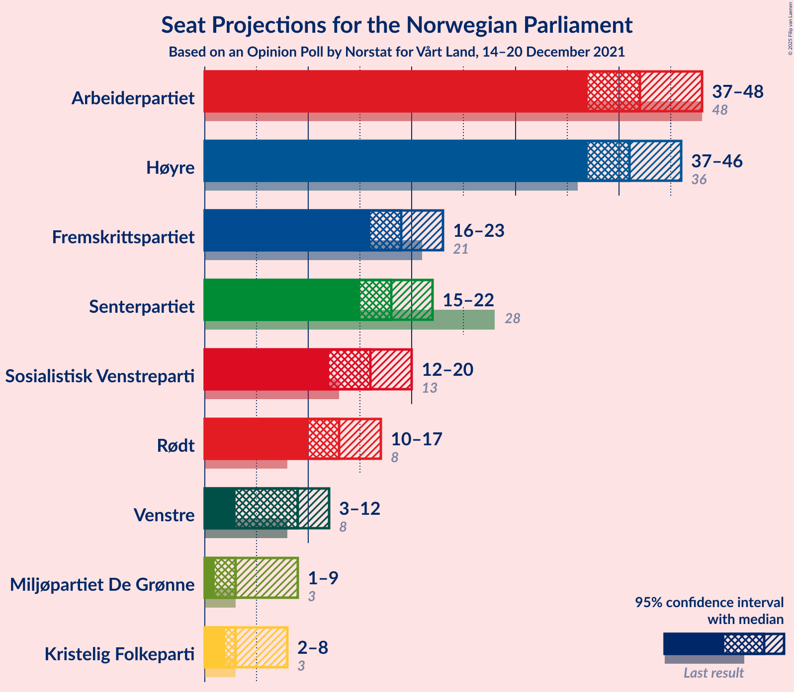

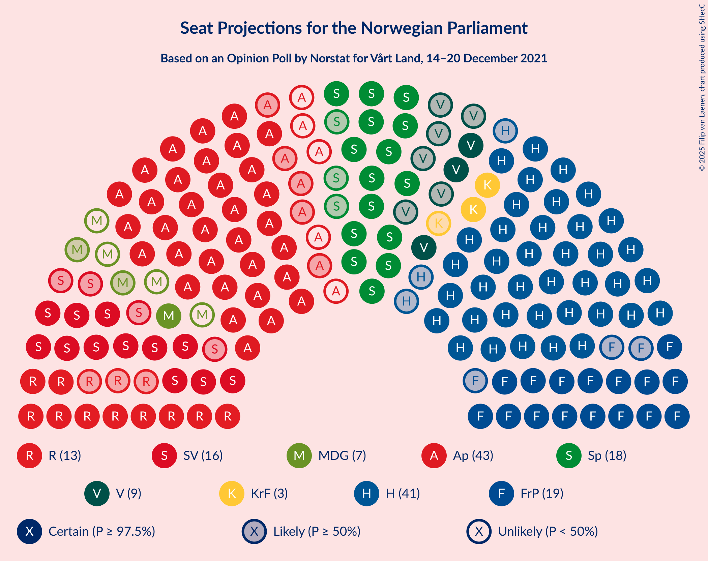

### Confidence Intervals

| Party | Last Result | Median | 80% Confidence Interval | 90% Confidence Interval | 95% Confidence Interval | 99% Confidence Interval |
|:-----:|:-----------:|:------:|:-----------------------:|:-----------------------:|:-----------------------:|:-----------------------:|
| <a href="#høyre">Høyre</a> | 36 | 41 | 39–45 |38–45 |37–46 |35–48 |
| <a href="#arbeiderpartiet">Arbeiderpartiet</a> | 48 | 42 | 38–46 |38–47 |37–48 |36–50 |
| <a href="#fremskrittspartiet">Fremskrittspartiet</a> | 21 | 19 | 17–21 |17–22 |16–23 |15–24 |
| <a href="#senterpartiet">Senterpartiet</a> | 28 | 18 | 16–20 |15–21 |15–22 |14–23 |
| <a href="#sosialistisk-venstreparti">Sosialistisk Venstreparti</a> | 13 | 16 | 14–19 |13–19 |12–20 |11–21 |
| <a href="#rødt">Rødt</a> | 8 | 13 | 11–15 |11–16 |10–17 |9–18 |
| <a href="#venstre">Venstre</a> | 8 | 9 | 8–11 |7–12 |3–12 |3–13 |
| <a href="#miljøpartiet-de-grønne">Miljøpartiet De Grønne</a> | 3 | 3 | 1–8 |1–8 |1–9 |1–9 |
| <a href="#kristelig-folkeparti">Kristelig Folkeparti</a> | 3 | 3 | 2–8 |2–8 |2–8 |0–9 |

### Høyre

*For a full overview of the results for this party, see the [Høyre](party-høyre.html) page.*

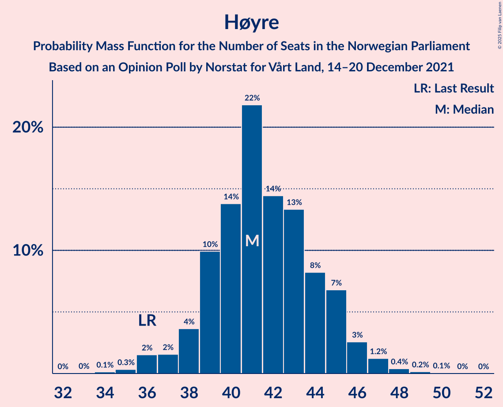

| Number of Seats | Probability | Accumulated | Special Marks |
|:---------------:|:-----------:|:-----------:|:-------------:|
| 34 | 0.1% | 100% |  |
| 35 | 0.3% | 99.8% |  |
| 36 | 2% | 99.5% | Last Result |
| 37 | 2% | 98% |  |
| 38 | 4% | 96% |  |
| 39 | 10% | 93% |  |
| 40 | 14% | 83% |  |
| 41 | 22% | 69% | Median |
| 42 | 14% | 47% |  |
| 43 | 13% | 33% |  |
| 44 | 8% | 19% |  |
| 45 | 7% | 11% |  |
| 46 | 3% | 4% |  |
| 47 | 1.2% | 2% |  |
| 48 | 0.4% | 0.6% |  |
| 49 | 0.2% | 0.2% |  |
| 50 | 0.1% | 0.1% |  |
| 51 | 0% | 0% |  |

### Arbeiderpartiet

*For a full overview of the results for this party, see the [Arbeiderpartiet](party-arbeiderpartiet.html) page.*

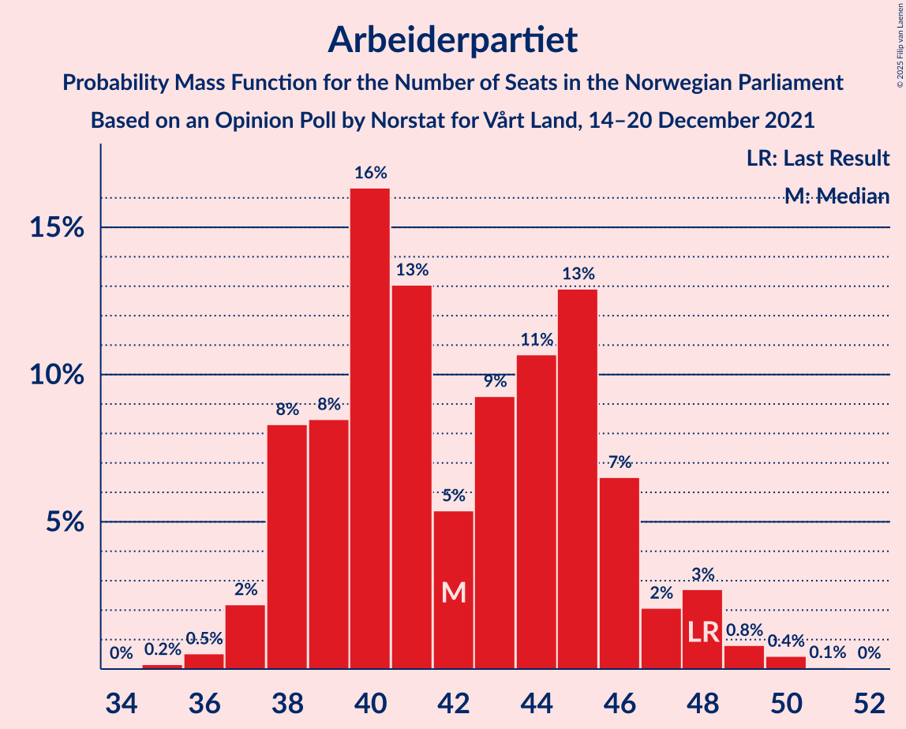

| Number of Seats | Probability | Accumulated | Special Marks |
|:---------------:|:-----------:|:-----------:|:-------------:|
| 35 | 0.2% | 100% |  |
| 36 | 0.5% | 99.8% |  |
| 37 | 2% | 99.3% |  |
| 38 | 8% | 97% |  |
| 39 | 8% | 89% |  |
| 40 | 16% | 80% |  |
| 41 | 13% | 64% |  |
| 42 | 5% | 51% | Median |
| 43 | 9% | 46% |  |
| 44 | 11% | 36% |  |
| 45 | 13% | 26% |  |
| 46 | 7% | 13% |  |
| 47 | 2% | 6% |  |
| 48 | 3% | 4% | Last Result |
| 49 | 0.8% | 1.4% |  |
| 50 | 0.4% | 0.5% |  |
| 51 | 0.1% | 0.1% |  |
| 52 | 0% | 0% |  |

### Fremskrittspartiet

*For a full overview of the results for this party, see the [Fremskrittspartiet](party-fremskrittspartiet.html) page.*

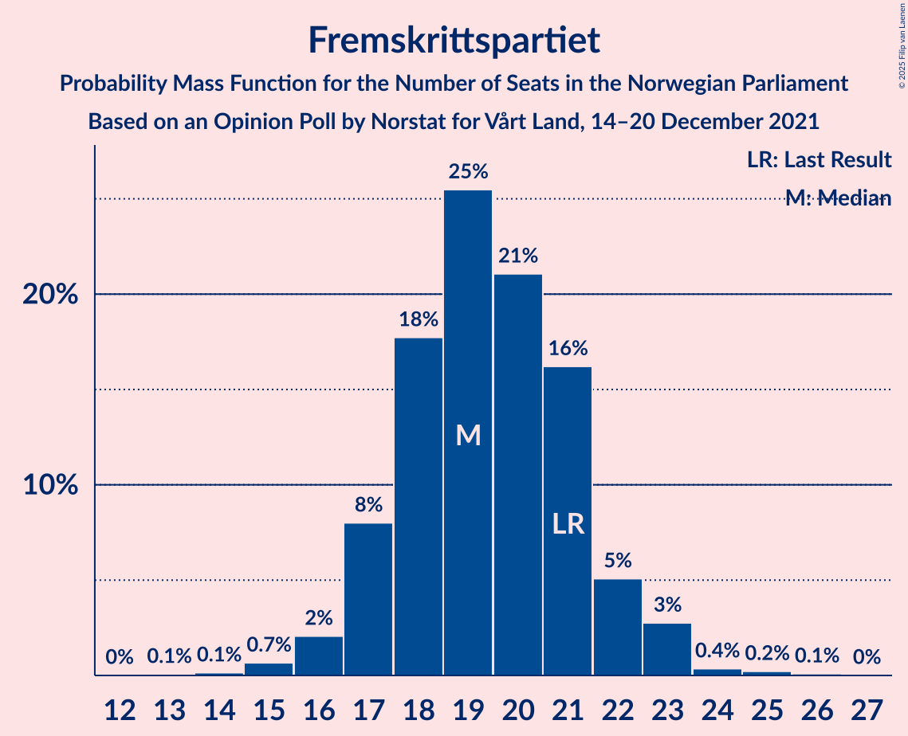

| Number of Seats | Probability | Accumulated | Special Marks |
|:---------------:|:-----------:|:-----------:|:-------------:|
| 13 | 0.1% | 100% |  |
| 14 | 0.1% | 99.9% |  |
| 15 | 0.7% | 99.8% |  |
| 16 | 2% | 99.1% |  |
| 17 | 8% | 97% |  |
| 18 | 18% | 89% |  |
| 19 | 25% | 71% | Median |
| 20 | 21% | 46% |  |
| 21 | 16% | 25% | Last Result |
| 22 | 5% | 9% |  |
| 23 | 3% | 3% |  |
| 24 | 0.4% | 0.7% |  |
| 25 | 0.2% | 0.3% |  |
| 26 | 0.1% | 0.1% |  |
| 27 | 0% | 0% |  |

### Senterpartiet

*For a full overview of the results for this party, see the [Senterpartiet](party-senterpartiet.html) page.*

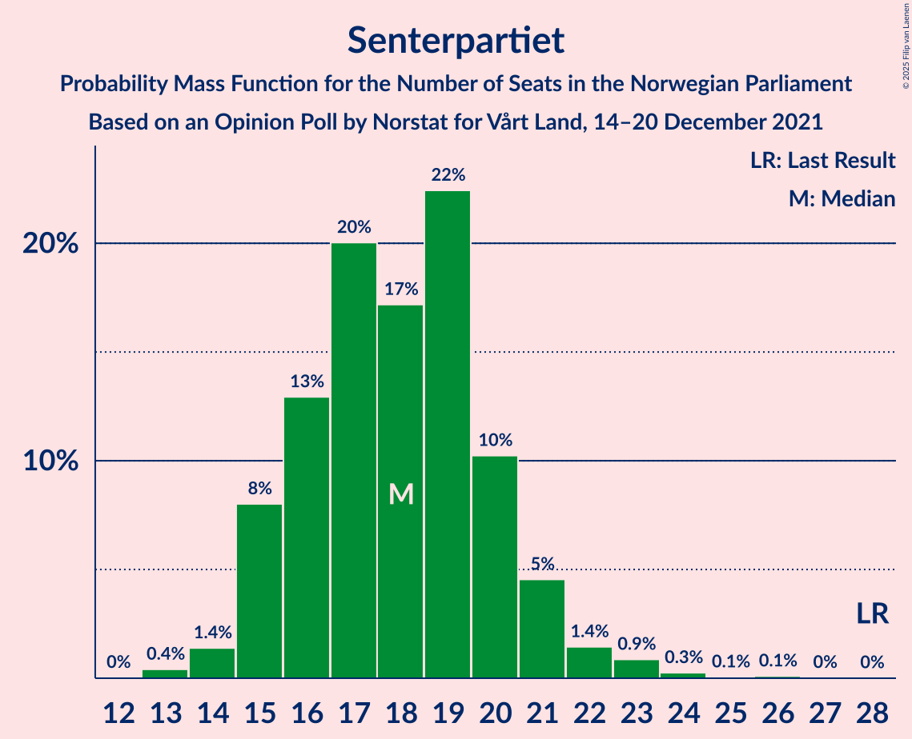

| Number of Seats | Probability | Accumulated | Special Marks |
|:---------------:|:-----------:|:-----------:|:-------------:|
| 13 | 0.4% | 100% |  |
| 14 | 1.4% | 99.6% |  |
| 15 | 8% | 98% |  |
| 16 | 13% | 90% |  |
| 17 | 20% | 77% |  |
| 18 | 17% | 57% | Median |
| 19 | 22% | 40% |  |
| 20 | 10% | 18% |  |
| 21 | 5% | 7% |  |
| 22 | 1.4% | 3% |  |
| 23 | 0.9% | 1.3% |  |
| 24 | 0.3% | 0.5% |  |
| 25 | 0.1% | 0.2% |  |
| 26 | 0.1% | 0.2% |  |
| 27 | 0% | 0.1% |  |
| 28 | 0% | 0% | Last Result |

### Sosialistisk Venstreparti

*For a full overview of the results for this party, see the [Sosialistisk Venstreparti](party-sosialistiskvenstreparti.html) page.*

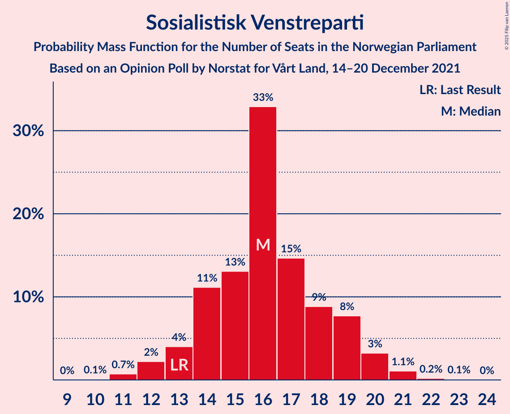

| Number of Seats | Probability | Accumulated | Special Marks |
|:---------------:|:-----------:|:-----------:|:-------------:|
| 10 | 0.1% | 100% |  |
| 11 | 0.7% | 99.9% |  |
| 12 | 2% | 99.2% |  |
| 13 | 4% | 97% | Last Result |
| 14 | 11% | 93% |  |
| 15 | 13% | 82% |  |
| 16 | 33% | 69% | Median |
| 17 | 15% | 36% |  |
| 18 | 9% | 21% |  |
| 19 | 8% | 12% |  |
| 20 | 3% | 5% |  |
| 21 | 1.1% | 1.4% |  |
| 22 | 0.2% | 0.3% |  |
| 23 | 0.1% | 0.1% |  |
| 24 | 0% | 0% |  |

### Rødt

*For a full overview of the results for this party, see the [Rødt](party-rødt.html) page.*

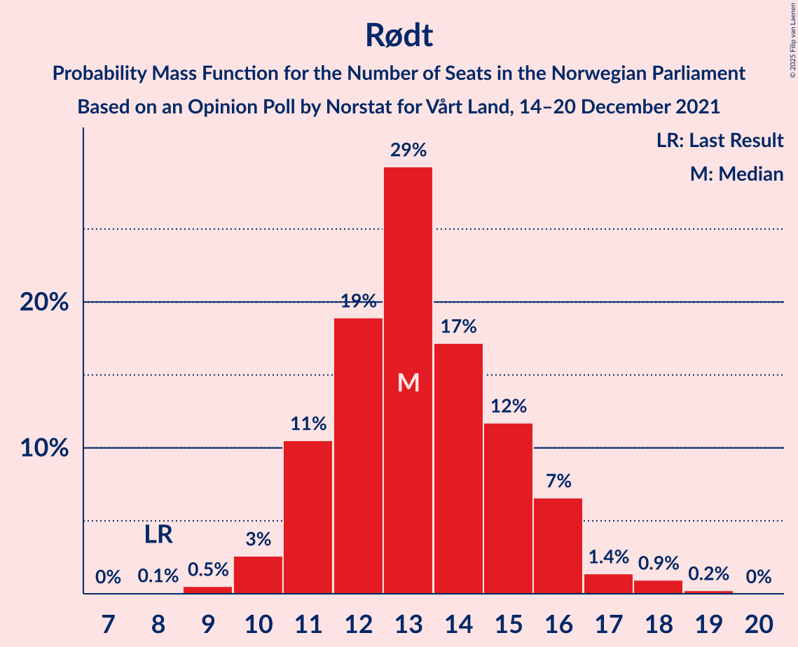

| Number of Seats | Probability | Accumulated | Special Marks |
|:---------------:|:-----------:|:-----------:|:-------------:|
| 8 | 0.1% | 100% | Last Result |
| 9 | 0.5% | 99.9% |  |
| 10 | 3% | 99.4% |  |
| 11 | 11% | 97% |  |
| 12 | 19% | 86% |  |
| 13 | 29% | 67% | Median |
| 14 | 17% | 38% |  |
| 15 | 12% | 21% |  |
| 16 | 7% | 9% |  |
| 17 | 1.4% | 3% |  |
| 18 | 0.9% | 1.2% |  |
| 19 | 0.2% | 0.3% |  |
| 20 | 0% | 0% |  |

### Venstre

*For a full overview of the results for this party, see the [Venstre](party-venstre.html) page.*

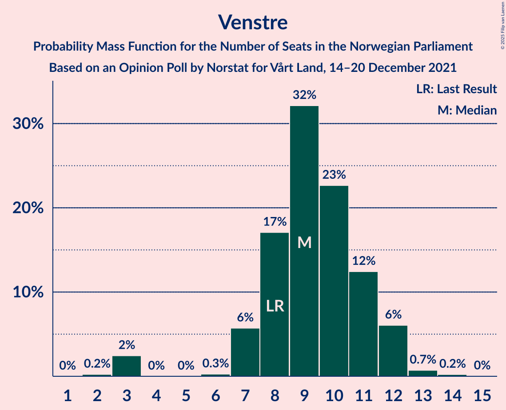

| Number of Seats | Probability | Accumulated | Special Marks |
|:---------------:|:-----------:|:-----------:|:-------------:|
| 2 | 0.2% | 100% |  |
| 3 | 2% | 99.8% |  |
| 4 | 0% | 97% |  |
| 5 | 0% | 97% |  |
| 6 | 0.3% | 97% |  |
| 7 | 6% | 97% |  |
| 8 | 17% | 91% | Last Result |
| 9 | 32% | 74% | Median |
| 10 | 23% | 42% |  |
| 11 | 12% | 19% |  |
| 12 | 6% | 7% |  |
| 13 | 0.7% | 1.0% |  |
| 14 | 0.2% | 0.3% |  |
| 15 | 0% | 0% |  |

### Miljøpartiet De Grønne

*For a full overview of the results for this party, see the [Miljøpartiet De Grønne](party-miljøpartietdegrønne.html) page.*

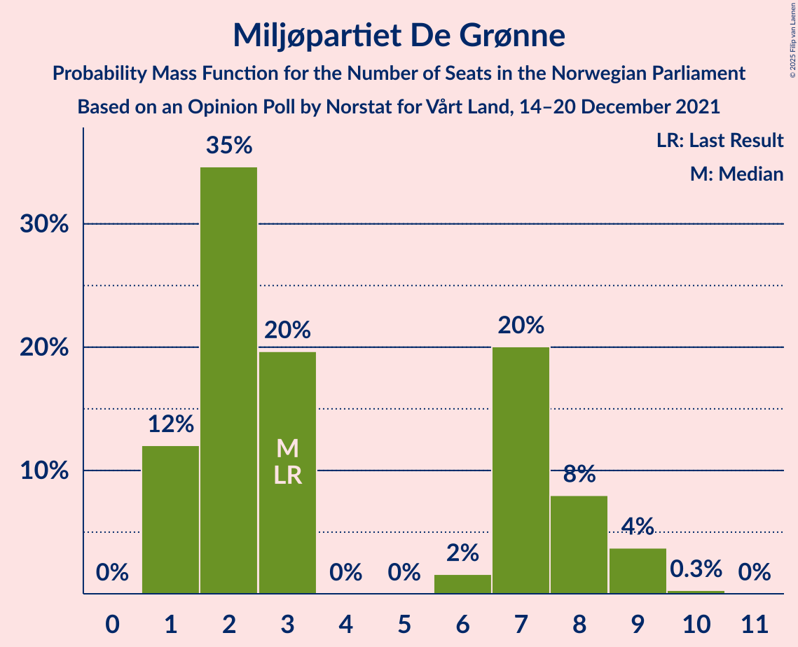

| Number of Seats | Probability | Accumulated | Special Marks |
|:---------------:|:-----------:|:-----------:|:-------------:|
| 1 | 12% | 100% |  |
| 2 | 35% | 88% |  |
| 3 | 20% | 53% | Last Result, Median |
| 4 | 0% | 34% |  |
| 5 | 0% | 34% |  |
| 6 | 2% | 34% |  |
| 7 | 20% | 32% |  |
| 8 | 8% | 12% |  |
| 9 | 4% | 4% |  |
| 10 | 0.3% | 0.3% |  |
| 11 | 0% | 0% |  |

### Kristelig Folkeparti

*For a full overview of the results for this party, see the [Kristelig Folkeparti](party-kristeligfolkeparti.html) page.*

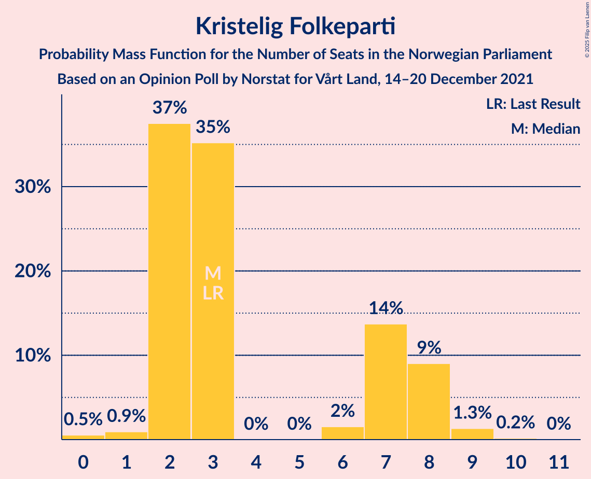

| Number of Seats | Probability | Accumulated | Special Marks |
|:---------------:|:-----------:|:-----------:|:-------------:|
| 0 | 0.5% | 100% |  |
| 1 | 0.9% | 99.5% |  |
| 2 | 37% | 98.5% |  |
| 3 | 35% | 61% | Last Result, Median |
| 4 | 0% | 26% |  |
| 5 | 0% | 26% |  |
| 6 | 2% | 26% |  |
| 7 | 14% | 24% |  |
| 8 | 9% | 11% |  |
| 9 | 1.3% | 2% |  |
| 10 | 0.2% | 0.2% |  |
| 11 | 0% | 0% |  |

## Coalitions

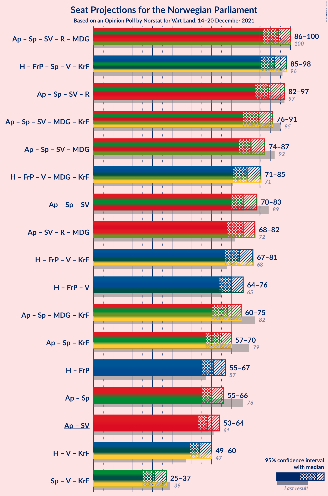

### Confidence Intervals

| Coalition | Last Result | Median | Majority? | 80% Confidence Interval | 90% Confidence Interval | 95% Confidence Interval | 99% Confidence Interval |
|:---------:|:-----------:|:------:|:---------:|:-----------------------:|:-----------------------:|:-----------------------:|:-----------------------:|
| Arbeiderpartiet – Senterpartiet – Sosialistisk Venstreparti – Rødt – Miljøpartiet De Grønne | 100 | 94 | 98.9% | 89–98 | 87–99 | 86–100 | 84–103 |
| Høyre – Fremskrittspartiet – Senterpartiet – Venstre – Kristelig Folkeparti | 96 | 92 | 98% | 88–96 | 86–97 | 85–98 | 82–100 |
| Arbeiderpartiet – Senterpartiet – Sosialistisk Venstreparti – Rødt | 97 | 89 | 90% | 84–95 | 83–96 | 82–97 | 80–99 |
| Arbeiderpartiet – Senterpartiet – Sosialistisk Venstreparti – Miljøpartiet De Grønne – Kristelig Folkeparti | 95 | 84 | 47% | 79–88 | 78–89 | 76–91 | 75–93 |
| Arbeiderpartiet – Senterpartiet – Sosialistisk Venstreparti – Miljøpartiet De Grønne | 92 | 80 | 12% | 76–85 | 74–85 | 74–87 | 71–89 |
| Høyre – Fremskrittspartiet – Venstre – Miljøpartiet De Grønne – Kristelig Folkeparti | 71 | 78 | 3% | 73–82 | 72–84 | 71–85 | 69–86 |
| Arbeiderpartiet – Senterpartiet – Sosialistisk Venstreparti | 89 | 76 | 0.5% | 72–80 | 71–82 | 70–83 | 68–84 |
| Arbeiderpartiet – Sosialistisk Venstreparti – Rødt – Miljøpartiet De Grønne | 72 | 76 | 0.5% | 71–79 | 70–81 | 68–82 | 66–85 |
| Høyre – Fremskrittspartiet – Venstre – Kristelig Folkeparti | 68 | 74 | 0% | 70–78 | 68–79 | 67–81 | 65–82 |
| Høyre – Fremskrittspartiet – Venstre | 65 | 70 | 0% | 66–74 | 65–76 | 64–76 | 62–78 |
| Arbeiderpartiet – Senterpartiet – Miljøpartiet De Grønne – Kristelig Folkeparti | 82 | 68 | 0% | 62–72 | 61–74 | 60–75 | 58–77 |
| Arbeiderpartiet – Senterpartiet – Kristelig Folkeparti | 79 | 64 | 0% | 59–68 | 58–69 | 57–70 | 56–73 |
| Høyre – Fremskrittspartiet | 57 | 61 | 0% | 57–65 | 56–66 | 55–67 | 54–68 |
| Arbeiderpartiet – Senterpartiet | 76 | 60 | 0% | 56–64 | 55–65 | 55–66 | 53–69 |
| Arbeiderpartiet – Sosialistisk Venstreparti | 61 | 58 | 0% | 54–62 | 54–63 | 53–64 | 51–66 |
| Høyre – Venstre – Kristelig Folkeparti | 47 | 54 | 0% | 50–59 | 50–59 | 49–60 | 47–62 |
| Senterpartiet – Venstre – Kristelig Folkeparti | 39 | 31 | 0% | 27–35 | 26–36 | 25–37 | 23–39 |

### Arbeiderpartiet – Senterpartiet – Sosialistisk Venstreparti – Rødt – Miljøpartiet De Grønne

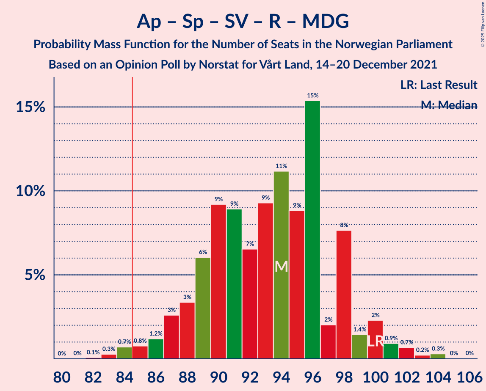

| Number of Seats | Probability | Accumulated | Special Marks |
|:---------------:|:-----------:|:-----------:|:-------------:|
| 82 | 0.1% | 100% |  |
| 83 | 0.3% | 99.9% |  |
| 84 | 0.7% | 99.6% |  |
| 85 | 0.8% | 98.9% | Majority |
| 86 | 1.2% | 98% |  |
| 87 | 3% | 97% |  |
| 88 | 3% | 94% |  |
| 89 | 6% | 91% |  |
| 90 | 9% | 85% |  |
| 91 | 9% | 76% |  |
| 92 | 7% | 67% | Median |
| 93 | 9% | 60% |  |
| 94 | 11% | 51% |  |
| 95 | 9% | 40% |  |
| 96 | 15% | 31% |  |
| 97 | 2% | 16% |  |
| 98 | 8% | 14% |  |
| 99 | 1.4% | 6% |  |
| 100 | 2% | 4% | Last Result |
| 101 | 0.9% | 2% |  |
| 102 | 0.7% | 1.3% |  |
| 103 | 0.2% | 0.6% |  |
| 104 | 0.3% | 0.4% |  |
| 105 | 0% | 0.1% |  |
| 106 | 0% | 0% |  |

### Høyre – Fremskrittspartiet – Senterpartiet – Venstre – Kristelig Folkeparti

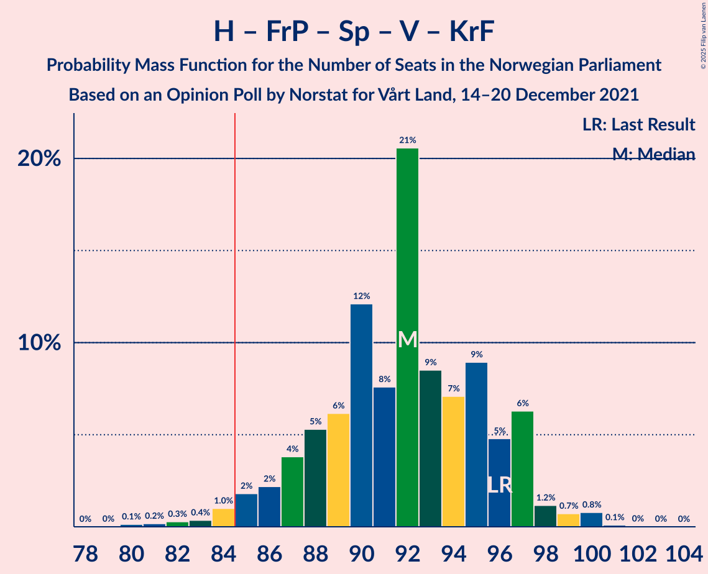

| Number of Seats | Probability | Accumulated | Special Marks |
|:---------------:|:-----------:|:-----------:|:-------------:|
| 80 | 0.1% | 100% |  |
| 81 | 0.2% | 99.8% |  |
| 82 | 0.3% | 99.7% |  |
| 83 | 0.4% | 99.4% |  |
| 84 | 1.0% | 99.0% |  |
| 85 | 2% | 98% | Majority |
| 86 | 2% | 96% |  |
| 87 | 4% | 94% |  |
| 88 | 5% | 90% |  |
| 89 | 6% | 85% |  |
| 90 | 12% | 79% | Median |
| 91 | 8% | 67% |  |
| 92 | 21% | 59% |  |
| 93 | 9% | 38% |  |
| 94 | 7% | 30% |  |
| 95 | 9% | 23% |  |
| 96 | 5% | 14% | Last Result |
| 97 | 6% | 9% |  |
| 98 | 1.2% | 3% |  |
| 99 | 0.7% | 2% |  |
| 100 | 0.8% | 0.9% |  |
| 101 | 0.1% | 0.2% |  |
| 102 | 0% | 0.1% |  |
| 103 | 0% | 0% |  |

### Arbeiderpartiet – Senterpartiet – Sosialistisk Venstreparti – Rødt

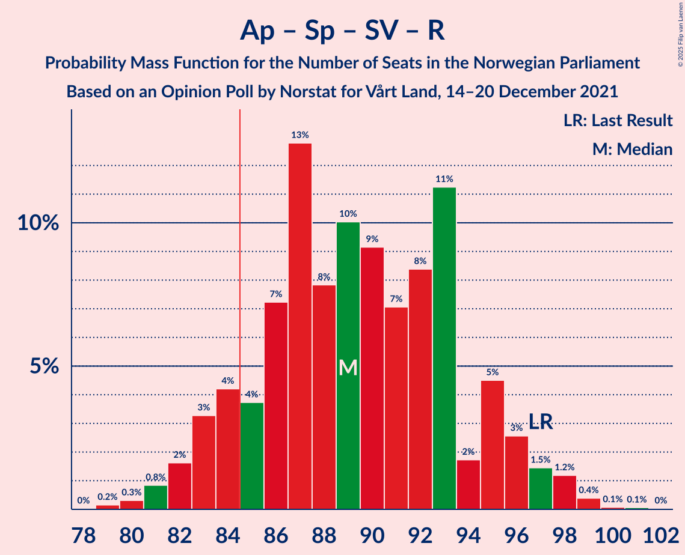

| Number of Seats | Probability | Accumulated | Special Marks |
|:---------------:|:-----------:|:-----------:|:-------------:|
| 78 | 0% | 100% |  |
| 79 | 0.2% | 99.9% |  |
| 80 | 0.3% | 99.8% |  |
| 81 | 0.8% | 99.5% |  |
| 82 | 2% | 98.6% |  |
| 83 | 3% | 97% |  |
| 84 | 4% | 94% |  |
| 85 | 4% | 90% | Majority |
| 86 | 7% | 86% |  |
| 87 | 13% | 79% |  |
| 88 | 8% | 66% |  |
| 89 | 10% | 58% | Median |
| 90 | 9% | 48% |  |
| 91 | 7% | 39% |  |
| 92 | 8% | 32% |  |
| 93 | 11% | 23% |  |
| 94 | 2% | 12% |  |
| 95 | 5% | 10% |  |
| 96 | 3% | 6% |  |
| 97 | 1.5% | 3% | Last Result |
| 98 | 1.2% | 2% |  |
| 99 | 0.4% | 0.6% |  |
| 100 | 0.1% | 0.2% |  |
| 101 | 0.1% | 0.1% |  |
| 102 | 0% | 0% |  |

### Arbeiderpartiet – Senterpartiet – Sosialistisk Venstreparti – Miljøpartiet De Grønne – Kristelig Folkeparti

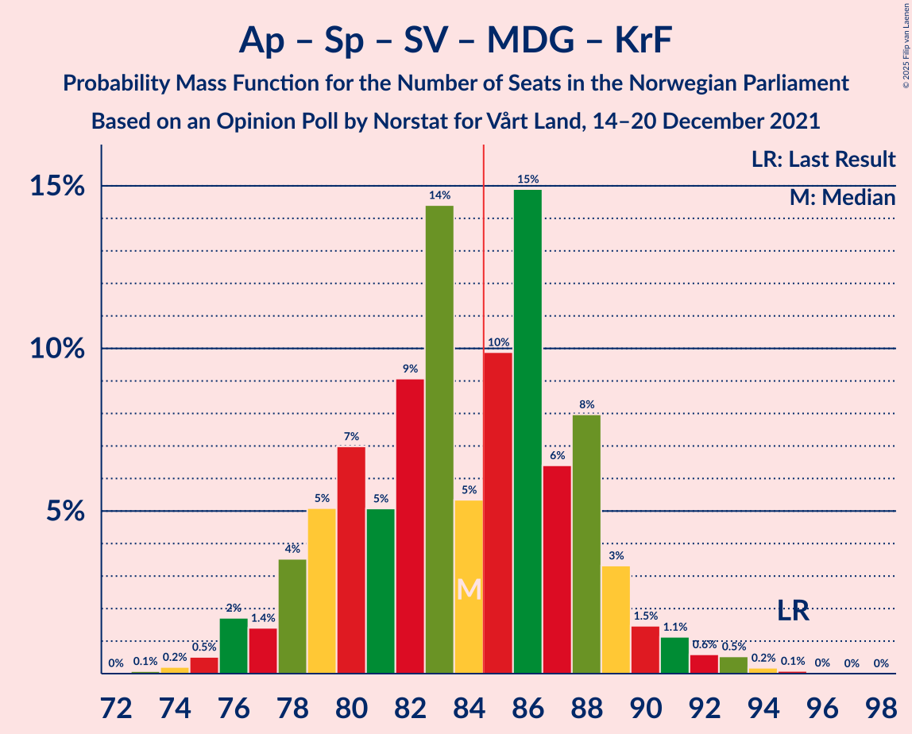

| Number of Seats | Probability | Accumulated | Special Marks |
|:---------------:|:-----------:|:-----------:|:-------------:|
| 73 | 0.1% | 100% |  |
| 74 | 0.2% | 99.9% |  |
| 75 | 0.5% | 99.7% |  |
| 76 | 2% | 99.2% |  |
| 77 | 1.4% | 97% |  |
| 78 | 4% | 96% |  |
| 79 | 5% | 93% |  |
| 80 | 7% | 87% |  |
| 81 | 5% | 80% |  |
| 82 | 9% | 75% | Median |
| 83 | 14% | 66% |  |
| 84 | 5% | 52% |  |
| 85 | 10% | 47% | Majority |
| 86 | 15% | 37% |  |
| 87 | 6% | 22% |  |
| 88 | 8% | 15% |  |
| 89 | 3% | 7% |  |
| 90 | 1.5% | 4% |  |
| 91 | 1.1% | 3% |  |
| 92 | 0.6% | 1.4% |  |
| 93 | 0.5% | 0.8% |  |
| 94 | 0.2% | 0.3% |  |
| 95 | 0.1% | 0.1% | Last Result |
| 96 | 0% | 0.1% |  |
| 97 | 0% | 0% |  |

### Arbeiderpartiet – Senterpartiet – Sosialistisk Venstreparti – Miljøpartiet De Grønne

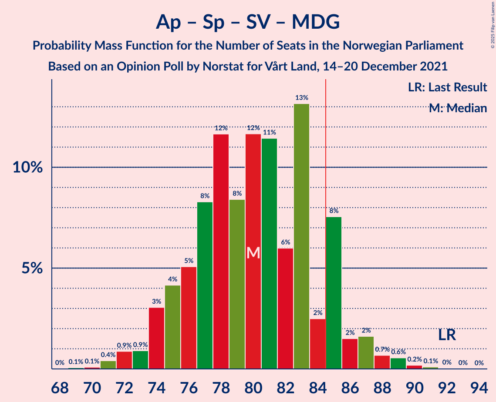

| Number of Seats | Probability | Accumulated | Special Marks |
|:---------------:|:-----------:|:-----------:|:-------------:|
| 69 | 0.1% | 100% |  |
| 70 | 0.1% | 99.9% |  |
| 71 | 0.4% | 99.8% |  |
| 72 | 0.9% | 99.4% |  |
| 73 | 0.9% | 98.5% |  |
| 74 | 3% | 98% |  |
| 75 | 4% | 95% |  |
| 76 | 5% | 90% |  |
| 77 | 8% | 85% |  |
| 78 | 12% | 77% |  |
| 79 | 8% | 65% | Median |
| 80 | 12% | 57% |  |
| 81 | 11% | 45% |  |
| 82 | 6% | 34% |  |
| 83 | 13% | 28% |  |
| 84 | 2% | 15% |  |
| 85 | 8% | 12% | Majority |
| 86 | 2% | 5% |  |
| 87 | 2% | 3% |  |
| 88 | 0.7% | 2% |  |
| 89 | 0.6% | 0.9% |  |
| 90 | 0.2% | 0.3% |  |
| 91 | 0.1% | 0.2% |  |
| 92 | 0% | 0.1% | Last Result |
| 93 | 0% | 0% |  |

### Høyre – Fremskrittspartiet – Venstre – Miljøpartiet De Grønne – Kristelig Folkeparti

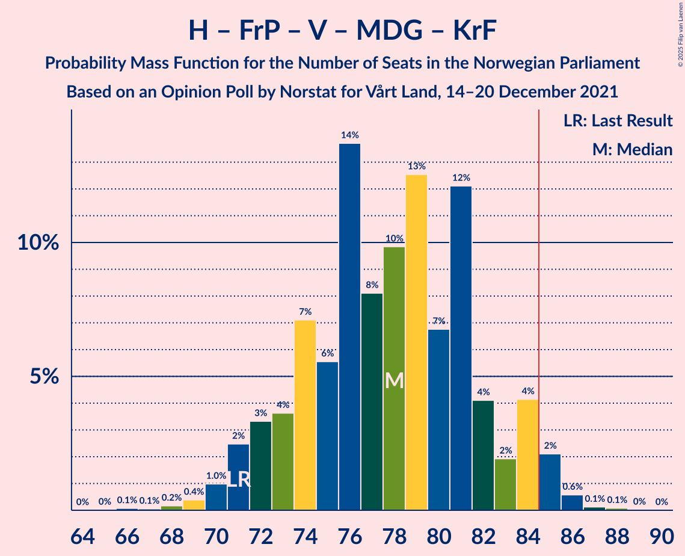

| Number of Seats | Probability | Accumulated | Special Marks |
|:---------------:|:-----------:|:-----------:|:-------------:|
| 66 | 0.1% | 100% |  |
| 67 | 0.1% | 99.9% |  |
| 68 | 0.2% | 99.8% |  |
| 69 | 0.4% | 99.7% |  |
| 70 | 1.0% | 99.3% |  |
| 71 | 2% | 98% | Last Result |
| 72 | 3% | 96% |  |
| 73 | 4% | 92% |  |
| 74 | 7% | 89% |  |
| 75 | 6% | 82% | Median |
| 76 | 14% | 76% |  |
| 77 | 8% | 62% |  |
| 78 | 10% | 54% |  |
| 79 | 13% | 45% |  |
| 80 | 7% | 32% |  |
| 81 | 12% | 25% |  |
| 82 | 4% | 13% |  |
| 83 | 2% | 9% |  |
| 84 | 4% | 7% |  |
| 85 | 2% | 3% | Majority |
| 86 | 0.6% | 0.8% |  |
| 87 | 0.1% | 0.2% |  |
| 88 | 0.1% | 0.1% |  |
| 89 | 0% | 0% |  |

### Arbeiderpartiet – Senterpartiet – Sosialistisk Venstreparti

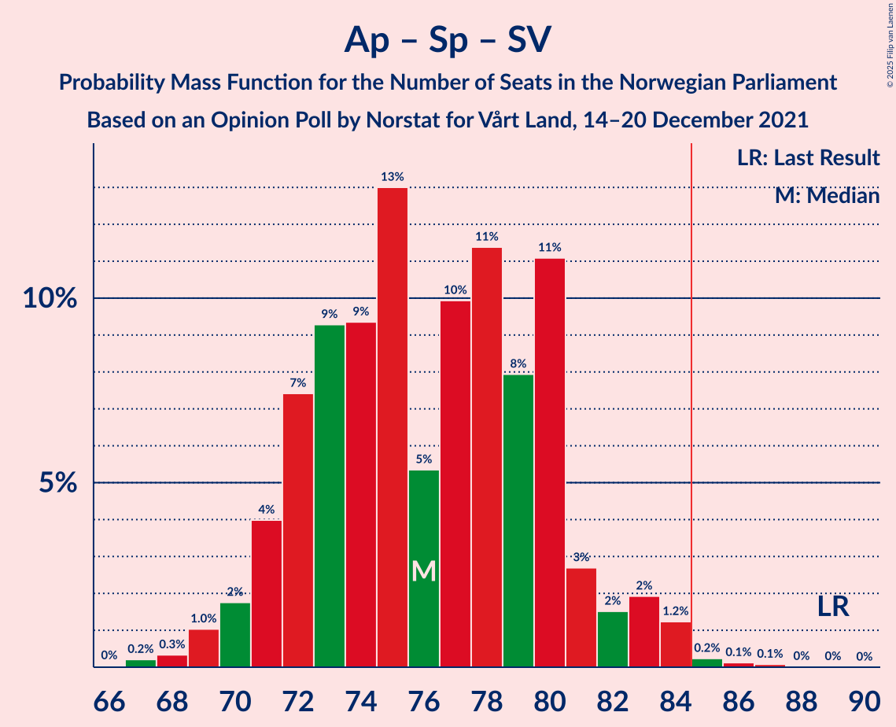

| Number of Seats | Probability | Accumulated | Special Marks |
|:---------------:|:-----------:|:-----------:|:-------------:|
| 66 | 0% | 100% |  |
| 67 | 0.2% | 99.9% |  |
| 68 | 0.3% | 99.7% |  |
| 69 | 1.0% | 99.4% |  |
| 70 | 2% | 98% |  |
| 71 | 4% | 97% |  |
| 72 | 7% | 93% |  |
| 73 | 9% | 85% |  |
| 74 | 9% | 76% |  |
| 75 | 13% | 67% |  |
| 76 | 5% | 54% | Median |
| 77 | 10% | 48% |  |
| 78 | 11% | 38% |  |
| 79 | 8% | 27% |  |
| 80 | 11% | 19% |  |
| 81 | 3% | 8% |  |
| 82 | 2% | 5% |  |
| 83 | 2% | 4% |  |
| 84 | 1.2% | 2% |  |
| 85 | 0.2% | 0.5% | Majority |
| 86 | 0.1% | 0.2% |  |
| 87 | 0.1% | 0.1% |  |
| 88 | 0% | 0% |  |
| 89 | 0% | 0% | Last Result |

### Arbeiderpartiet – Sosialistisk Venstreparti – Rødt – Miljøpartiet De Grønne

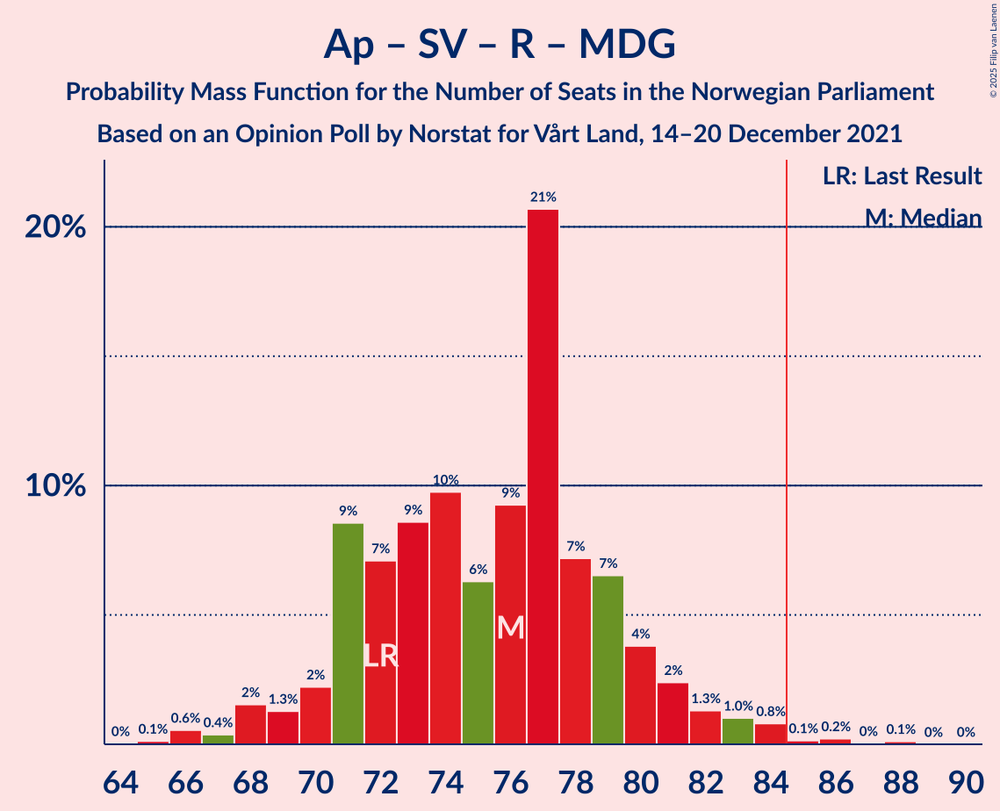

| Number of Seats | Probability | Accumulated | Special Marks |
|:---------------:|:-----------:|:-----------:|:-------------:|
| 64 | 0% | 100% |  |
| 65 | 0.1% | 99.9% |  |
| 66 | 0.6% | 99.8% |  |
| 67 | 0.4% | 99.2% |  |
| 68 | 2% | 98.9% |  |
| 69 | 1.3% | 97% |  |
| 70 | 2% | 96% |  |
| 71 | 9% | 94% |  |
| 72 | 7% | 85% | Last Result |
| 73 | 9% | 78% |  |
| 74 | 10% | 70% | Median |
| 75 | 6% | 60% |  |
| 76 | 9% | 54% |  |
| 77 | 21% | 44% |  |
| 78 | 7% | 24% |  |
| 79 | 7% | 16% |  |
| 80 | 4% | 10% |  |
| 81 | 2% | 6% |  |
| 82 | 1.3% | 4% |  |
| 83 | 1.0% | 2% |  |
| 84 | 0.8% | 1.3% |  |
| 85 | 0.1% | 0.5% | Majority |
| 86 | 0.2% | 0.4% |  |
| 87 | 0% | 0.2% |  |
| 88 | 0.1% | 0.1% |  |
| 89 | 0% | 0% |  |

### Høyre – Fremskrittspartiet – Venstre – Kristelig Folkeparti

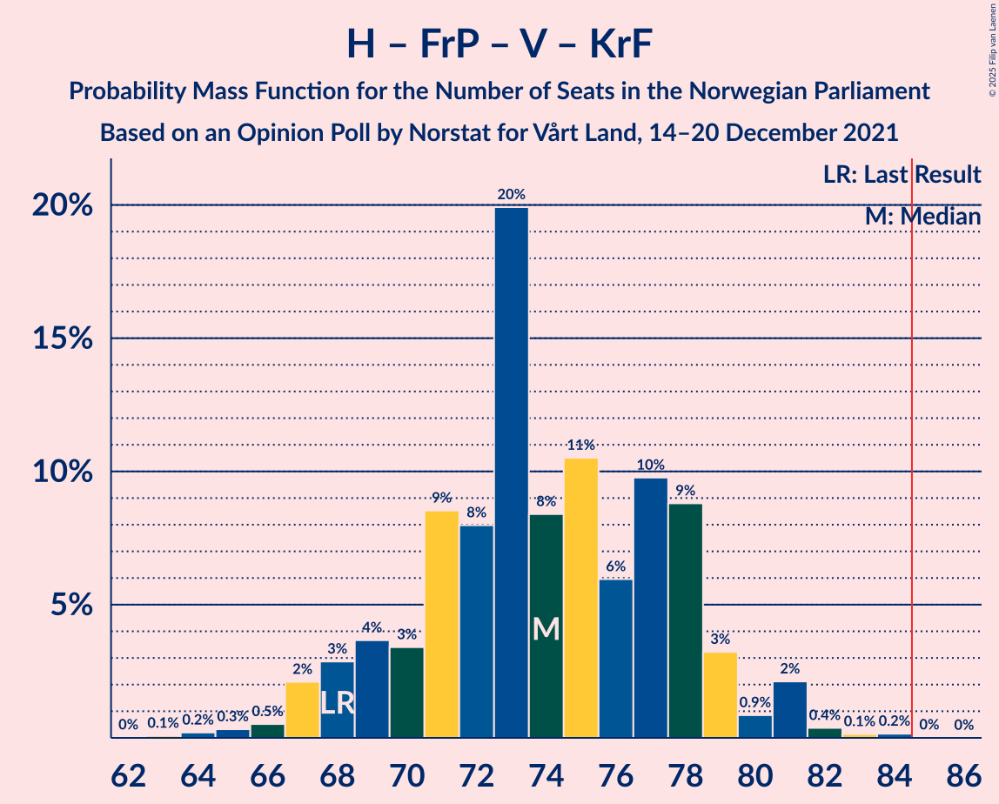

| Number of Seats | Probability | Accumulated | Special Marks |
|:---------------:|:-----------:|:-----------:|:-------------:|
| 63 | 0.1% | 100% |  |
| 64 | 0.2% | 99.9% |  |
| 65 | 0.3% | 99.7% |  |
| 66 | 0.5% | 99.3% |  |
| 67 | 2% | 98.8% |  |
| 68 | 3% | 97% | Last Result |
| 69 | 4% | 94% |  |
| 70 | 3% | 90% |  |
| 71 | 9% | 87% |  |
| 72 | 8% | 78% | Median |
| 73 | 20% | 70% |  |
| 74 | 8% | 50% |  |
| 75 | 11% | 42% |  |
| 76 | 6% | 31% |  |
| 77 | 10% | 25% |  |
| 78 | 9% | 16% |  |
| 79 | 3% | 7% |  |
| 80 | 0.9% | 4% |  |
| 81 | 2% | 3% |  |
| 82 | 0.4% | 0.7% |  |
| 83 | 0.1% | 0.3% |  |
| 84 | 0.2% | 0.2% |  |
| 85 | 0% | 0% | Majority |

### Høyre – Fremskrittspartiet – Venstre

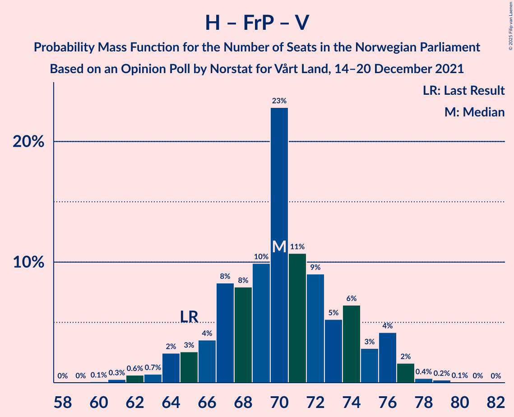

| Number of Seats | Probability | Accumulated | Special Marks |
|:---------------:|:-----------:|:-----------:|:-------------:|
| 59 | 0% | 100% |  |
| 60 | 0.1% | 99.9% |  |
| 61 | 0.3% | 99.9% |  |
| 62 | 0.6% | 99.6% |  |
| 63 | 0.7% | 99.0% |  |
| 64 | 2% | 98% |  |
| 65 | 3% | 96% | Last Result |
| 66 | 4% | 93% |  |
| 67 | 8% | 90% |  |
| 68 | 8% | 81% |  |
| 69 | 10% | 73% | Median |
| 70 | 23% | 64% |  |
| 71 | 11% | 41% |  |
| 72 | 9% | 30% |  |
| 73 | 5% | 21% |  |
| 74 | 6% | 16% |  |
| 75 | 3% | 9% |  |
| 76 | 4% | 6% |  |
| 77 | 2% | 2% |  |
| 78 | 0.4% | 0.7% |  |
| 79 | 0.2% | 0.3% |  |
| 80 | 0.1% | 0.1% |  |
| 81 | 0% | 0% |  |

### Arbeiderpartiet – Senterpartiet – Miljøpartiet De Grønne – Kristelig Folkeparti

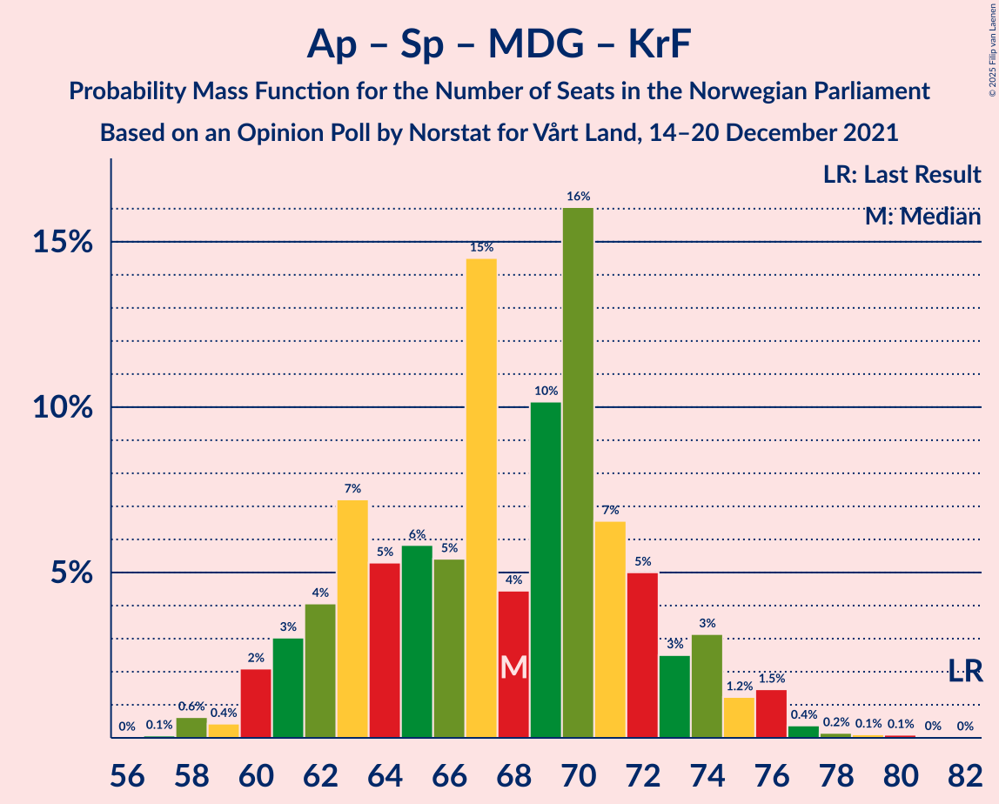

| Number of Seats | Probability | Accumulated | Special Marks |
|:---------------:|:-----------:|:-----------:|:-------------:|
| 57 | 0.1% | 100% |  |
| 58 | 0.6% | 99.9% |  |
| 59 | 0.4% | 99.3% |  |
| 60 | 2% | 98.8% |  |
| 61 | 3% | 97% |  |
| 62 | 4% | 94% |  |
| 63 | 7% | 90% |  |
| 64 | 5% | 82% |  |
| 65 | 6% | 77% |  |
| 66 | 5% | 71% | Median |
| 67 | 15% | 66% |  |
| 68 | 4% | 51% |  |
| 69 | 10% | 47% |  |
| 70 | 16% | 37% |  |
| 71 | 7% | 21% |  |
| 72 | 5% | 14% |  |
| 73 | 3% | 9% |  |
| 74 | 3% | 7% |  |
| 75 | 1.2% | 4% |  |
| 76 | 1.5% | 2% |  |
| 77 | 0.4% | 0.8% |  |
| 78 | 0.2% | 0.4% |  |
| 79 | 0.1% | 0.3% |  |
| 80 | 0.1% | 0.2% |  |
| 81 | 0% | 0.1% |  |
| 82 | 0% | 0% | Last Result |

### Arbeiderpartiet – Senterpartiet – Kristelig Folkeparti

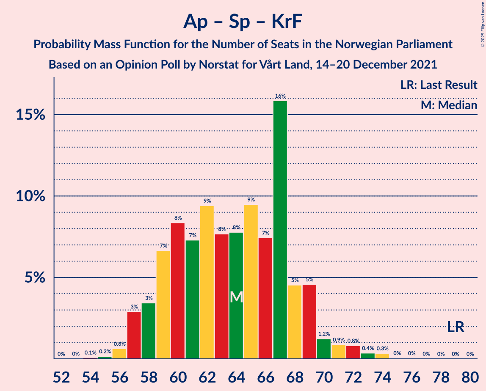

| Number of Seats | Probability | Accumulated | Special Marks |
|:---------------:|:-----------:|:-----------:|:-------------:|
| 54 | 0.1% | 100% |  |
| 55 | 0.2% | 99.9% |  |
| 56 | 0.6% | 99.7% |  |
| 57 | 3% | 99.1% |  |
| 58 | 3% | 96% |  |
| 59 | 7% | 93% |  |
| 60 | 8% | 86% |  |
| 61 | 7% | 78% |  |
| 62 | 9% | 70% |  |
| 63 | 8% | 61% | Median |
| 64 | 8% | 53% |  |
| 65 | 9% | 46% |  |
| 66 | 7% | 36% |  |
| 67 | 16% | 29% |  |
| 68 | 5% | 13% |  |
| 69 | 5% | 8% |  |
| 70 | 1.2% | 4% |  |
| 71 | 0.9% | 2% |  |
| 72 | 0.8% | 2% |  |
| 73 | 0.4% | 0.8% |  |
| 74 | 0.3% | 0.4% |  |
| 75 | 0% | 0.1% |  |
| 76 | 0% | 0.1% |  |
| 77 | 0% | 0% |  |
| 78 | 0% | 0% |  |
| 79 | 0% | 0% | Last Result |

### Høyre – Fremskrittspartiet

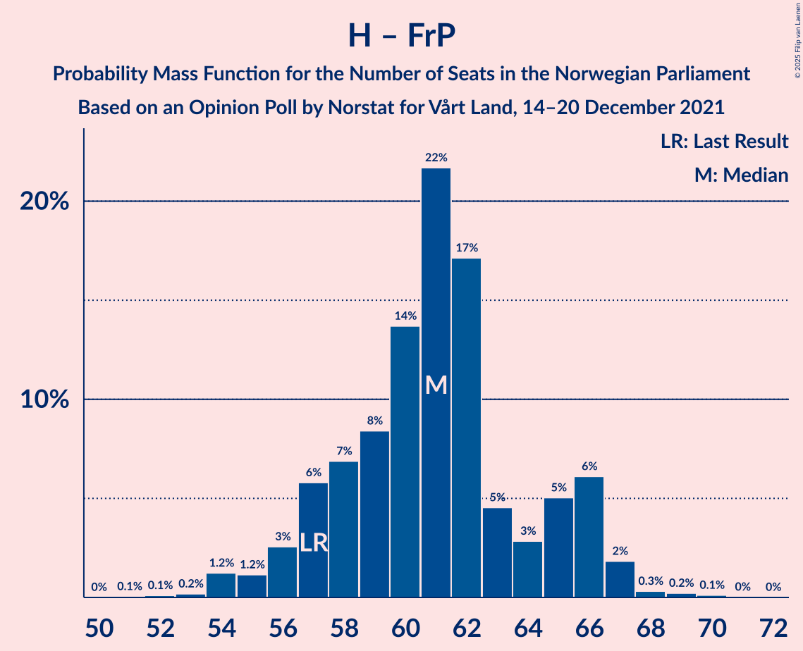

| Number of Seats | Probability | Accumulated | Special Marks |
|:---------------:|:-----------:|:-----------:|:-------------:|
| 51 | 0.1% | 100% |  |
| 52 | 0.1% | 99.9% |  |
| 53 | 0.2% | 99.8% |  |
| 54 | 1.2% | 99.6% |  |
| 55 | 1.2% | 98% |  |
| 56 | 3% | 97% |  |
| 57 | 6% | 95% | Last Result |
| 58 | 7% | 89% |  |
| 59 | 8% | 82% |  |
| 60 | 14% | 74% | Median |
| 61 | 22% | 60% |  |
| 62 | 17% | 38% |  |
| 63 | 5% | 21% |  |
| 64 | 3% | 17% |  |
| 65 | 5% | 14% |  |
| 66 | 6% | 9% |  |
| 67 | 2% | 3% |  |
| 68 | 0.3% | 0.7% |  |
| 69 | 0.2% | 0.4% |  |
| 70 | 0.1% | 0.2% |  |
| 71 | 0% | 0% |  |

### Arbeiderpartiet – Senterpartiet

| Number of Seats | Probability | Accumulated | Special Marks |
|:---------------:|:-----------:|:-----------:|:-------------:|
| 51 | 0.1% | 100% |  |
| 52 | 0.2% | 99.9% |  |
| 53 | 0.7% | 99.7% |  |
| 54 | 1.0% | 99.0% |  |
| 55 | 6% | 98% |  |
| 56 | 7% | 92% |  |
| 57 | 13% | 86% |  |
| 58 | 9% | 73% |  |
| 59 | 11% | 64% |  |
| 60 | 12% | 54% | Median |
| 61 | 6% | 42% |  |
| 62 | 8% | 35% |  |
| 63 | 6% | 27% |  |
| 64 | 15% | 21% |  |
| 65 | 3% | 6% |  |
| 66 | 2% | 4% |  |
| 67 | 0.5% | 2% |  |
| 68 | 0.7% | 1.2% |  |
| 69 | 0.4% | 0.5% |  |
| 70 | 0% | 0.1% |  |
| 71 | 0% | 0.1% |  |
| 72 | 0% | 0% |  |
| 73 | 0% | 0% |  |
| 74 | 0% | 0% |  |
| 75 | 0% | 0% |  |
| 76 | 0% | 0% | Last Result |

### Arbeiderpartiet – Sosialistisk Venstreparti

| Number of Seats | Probability | Accumulated | Special Marks |
|:---------------:|:-----------:|:-----------:|:-------------:|
| 49 | 0.1% | 100% |  |
| 50 | 0.1% | 99.9% |  |
| 51 | 0.5% | 99.7% |  |
| 52 | 1.1% | 99.3% |  |
| 53 | 3% | 98% |  |
| 54 | 7% | 96% |  |
| 55 | 7% | 89% |  |
| 56 | 12% | 81% |  |
| 57 | 14% | 70% |  |
| 58 | 6% | 56% | Median |
| 59 | 11% | 50% |  |
| 60 | 14% | 38% |  |
| 61 | 11% | 24% | Last Result |
| 62 | 4% | 13% |  |
| 63 | 5% | 8% |  |
| 64 | 0.8% | 3% |  |
| 65 | 1.2% | 2% |  |
| 66 | 0.4% | 0.8% |  |
| 67 | 0.3% | 0.4% |  |
| 68 | 0% | 0.1% |  |
| 69 | 0% | 0% |  |

### Høyre – Venstre – Kristelig Folkeparti

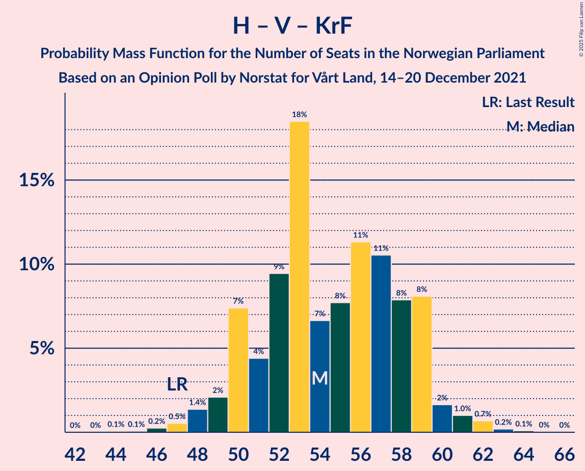

| Number of Seats | Probability | Accumulated | Special Marks |
|:---------------:|:-----------:|:-----------:|:-------------:|
| 44 | 0.1% | 100% |  |
| 45 | 0.1% | 99.9% |  |
| 46 | 0.2% | 99.8% |  |
| 47 | 0.5% | 99.6% | Last Result |
| 48 | 1.4% | 99.1% |  |
| 49 | 2% | 98% |  |
| 50 | 7% | 96% |  |
| 51 | 4% | 88% |  |
| 52 | 9% | 84% |  |
| 53 | 18% | 74% | Median |
| 54 | 7% | 56% |  |
| 55 | 8% | 49% |  |
| 56 | 11% | 42% |  |
| 57 | 11% | 30% |  |
| 58 | 8% | 20% |  |
| 59 | 8% | 12% |  |
| 60 | 2% | 4% |  |
| 61 | 1.0% | 2% |  |
| 62 | 0.7% | 1.0% |  |
| 63 | 0.2% | 0.3% |  |
| 64 | 0.1% | 0.1% |  |
| 65 | 0% | 0.1% |  |
| 66 | 0% | 0% |  |

### Senterpartiet – Venstre – Kristelig Folkeparti

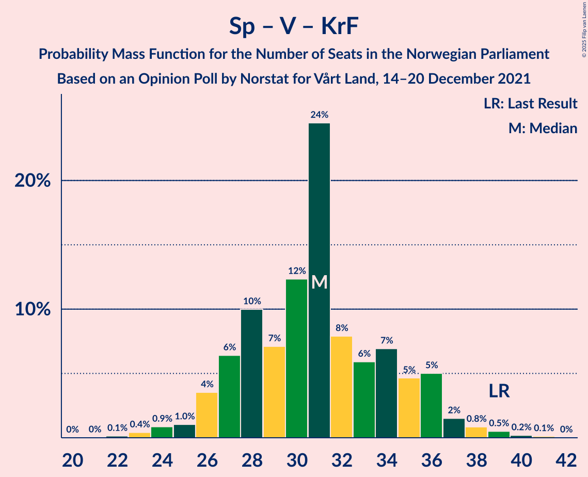

| Number of Seats | Probability | Accumulated | Special Marks |
|:---------------:|:-----------:|:-----------:|:-------------:|
| 21 | 0% | 100% |  |
| 22 | 0.1% | 99.9% |  |
| 23 | 0.4% | 99.8% |  |
| 24 | 0.9% | 99.4% |  |
| 25 | 1.0% | 98.5% |  |
| 26 | 4% | 97% |  |
| 27 | 6% | 94% |  |
| 28 | 10% | 88% |  |
| 29 | 7% | 78% |  |
| 30 | 12% | 70% | Median |
| 31 | 24% | 58% |  |
| 32 | 8% | 34% |  |
| 33 | 6% | 26% |  |
| 34 | 7% | 20% |  |
| 35 | 5% | 13% |  |
| 36 | 5% | 8% |  |
| 37 | 2% | 3% |  |
| 38 | 0.8% | 2% |  |
| 39 | 0.5% | 0.9% | Last Result |
| 40 | 0.2% | 0.3% |  |
| 41 | 0.1% | 0.2% |  |
| 42 | 0% | 0% |  |

## Technical Information

### Opinion Poll

+ **Polling firm:** Norstat
+ **Commissioner(s):** Vårt Land
+ **Fieldwork period:** 14–20 December 2021

### Calculations

+ **Sample size:** 957
+ **Simulations done:** 1,048,576
+ **Error estimate:** 1.02%

