# Opinion Poll by Norstat, 19–25 September 2017

<a href="#voting-intentions">Voting Intentions</a> | <a href="#seats">Seats</a> | <a href="#coalitions">Coalitions</a> | <a href="#technical-information">Technical Information</a>

## Voting Intentions

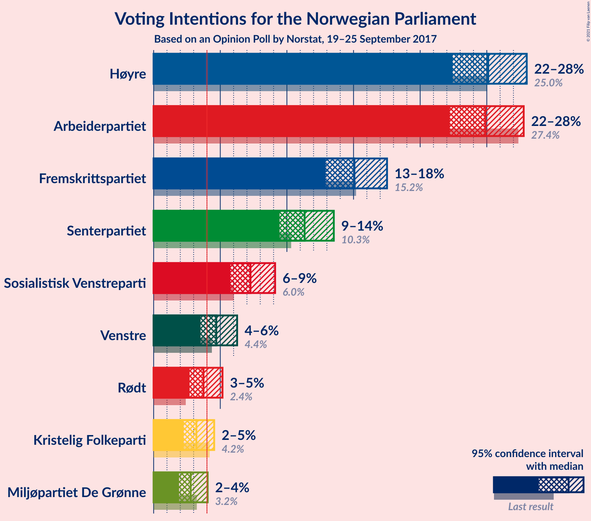

### Confidence Intervals

| Party | Last Result | Poll Result | 80% Confidence Interval | 90% Confidence Interval | 95% Confidence Interval | 99% Confidence Interval |
|:-----:|:-----------:|:-----------:|:-----------------------:|:-----------------------:|:-----------------------:|:-----------------------:|
| Høyre | 25.0% | 25.1% | 23.4–27.0% |22.8–27.5% |22.4–28.0% |21.6–28.9% |
| Arbeiderpartiet | 27.4% | 24.9% | 23.1–26.8% |22.6–27.3% |22.2–27.8% |21.4–28.7% |
| Fremskrittspartiet | 15.2% | 15.1% | 13.6–16.7% |13.2–17.1% |12.9–17.5% |12.3–18.3% |
| Senterpartiet | 10.3% | 11.3% | 10.1–12.8% |9.7–13.2% |9.4–13.5% |8.9–14.2% |
| Sosialistisk Venstreparti | 6.0% | 7.3% | 6.3–8.5% |6.0–8.8% |5.8–9.1% |5.3–9.7% |
| Venstre | 4.4% | 4.7% | 3.9–5.7% |3.7–6.0% |3.5–6.3% |3.2–6.8% |
| Rødt | 2.4% | 3.7% | 3.0–4.7% |2.9–4.9% |2.7–5.2% |2.4–5.6% |
| Kristelig Folkeparti | 4.2% | 3.2% | 2.6–4.1% |2.4–4.3% |2.3–4.5% |2.0–5.0% |
| Miljøpartiet De Grønne | 3.2% | 2.8% | 2.2–3.6% |2.0–3.8% |1.9–4.1% |1.7–4.5% |

*Note:* The poll result column reflects the actual value used in the calculations. Published results may vary slightly, and in addition be rounded to fewer digits.

## Seats

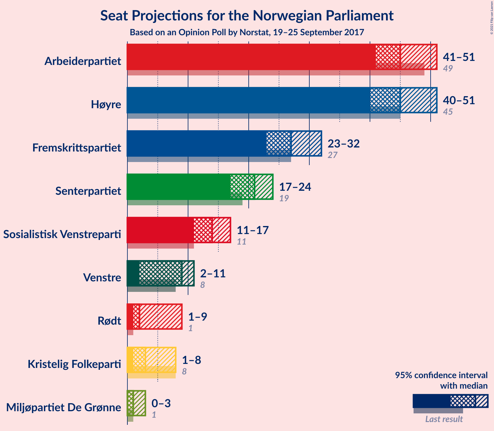

### Confidence Intervals

| Party | Last Result | Median | 80% Confidence Interval | 90% Confidence Interval | 95% Confidence Interval | 99% Confidence Interval |
|:-----:|:-----------:|:------:|:-----------------------:|:-----------------------:|:-----------------------:|:-----------------------:|
| <a href="#høyre">Høyre</a> | 45 | 45 | 42–49 |41–49 |40–51 |39–53 |
| <a href="#arbeiderpartiet">Arbeiderpartiet</a> | 49 | 45 | 42–49 |41–50 |41–51 |40–53 |
| <a href="#fremskrittspartiet">Fremskrittspartiet</a> | 27 | 27 | 25–30 |24–31 |23–32 |22–33 |
| <a href="#senterpartiet">Senterpartiet</a> | 19 | 21 | 18–23 |18–24 |17–24 |16–26 |
| <a href="#sosialistisk-venstreparti">Sosialistisk Venstreparti</a> | 11 | 14 | 11–15 |11–16 |11–17 |10–18 |
| <a href="#venstre">Venstre</a> | 8 | 9 | 7–10 |3–10 |2–11 |2–12 |
| <a href="#rødt">Rødt</a> | 1 | 2 | 2–8 |1–9 |1–9 |1–10 |
| <a href="#kristelig-folkeparti">Kristelig Folkeparti</a> | 8 | 3 | 1–7 |1–8 |1–8 |0–9 |
| <a href="#miljøpartiet-de-grønne">Miljøpartiet De Grønne</a> | 1 | 1 | 1–2 |1–2 |0–3 |0–8 |

### Høyre

*For a full overview of the results for this party, see the [Høyre](party-høyre.html) page.*

| Number of Seats | Probability | Accumulated | Special Marks |
|:---------------:|:-----------:|:-----------:|:-------------:|
| 37 | 0.1% | 100% |  |
| 38 | 0.2% | 99.8% |  |
| 39 | 0.6% | 99.6% |  |
| 40 | 3% | 99.1% |  |
| 41 | 3% | 96% |  |
| 42 | 7% | 93% |  |
| 43 | 8% | 87% |  |
| 44 | 14% | 78% |  |
| 45 | 19% | 65% | Last Result, Median |
| 46 | 16% | 45% |  |
| 47 | 6% | 29% |  |
| 48 | 7% | 23% |  |
| 49 | 12% | 17% |  |
| 50 | 2% | 5% |  |
| 51 | 1.2% | 3% |  |
| 52 | 0.8% | 1.4% |  |
| 53 | 0.5% | 0.6% |  |
| 54 | 0.1% | 0.2% |  |
| 55 | 0% | 0.1% |  |
| 56 | 0% | 0% |  |

### Arbeiderpartiet

*For a full overview of the results for this party, see the [Arbeiderpartiet](party-arbeiderpartiet.html) page.*

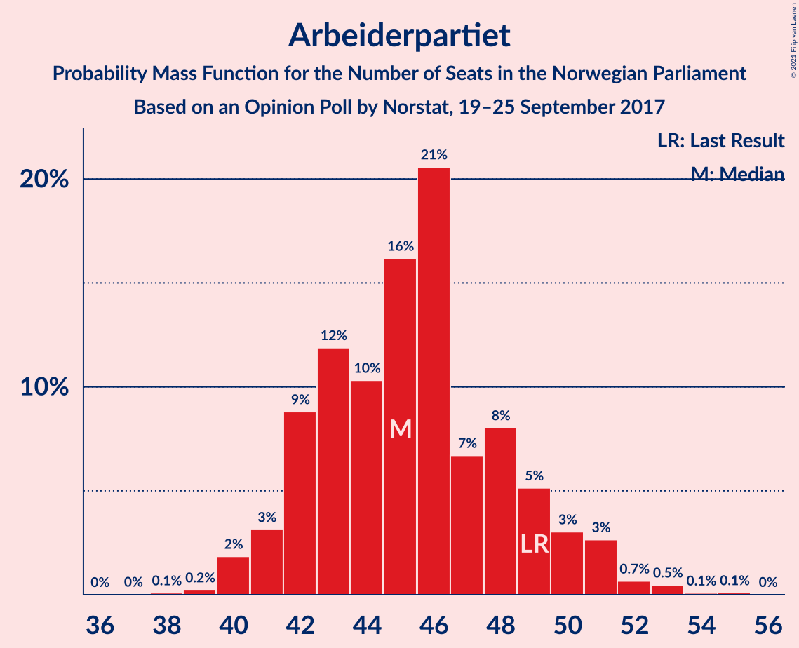

| Number of Seats | Probability | Accumulated | Special Marks |
|:---------------:|:-----------:|:-----------:|:-------------:|
| 38 | 0.1% | 100% |  |
| 39 | 0.2% | 99.9% |  |
| 40 | 2% | 99.6% |  |
| 41 | 3% | 98% |  |
| 42 | 9% | 95% |  |
| 43 | 12% | 86% |  |
| 44 | 10% | 74% |  |
| 45 | 16% | 64% | Median |
| 46 | 21% | 47% |  |
| 47 | 7% | 27% |  |
| 48 | 8% | 20% |  |
| 49 | 5% | 12% | Last Result |
| 50 | 3% | 7% |  |
| 51 | 3% | 4% |  |
| 52 | 0.7% | 1.3% |  |
| 53 | 0.5% | 0.7% |  |
| 54 | 0.1% | 0.2% |  |
| 55 | 0.1% | 0.1% |  |
| 56 | 0% | 0% |  |

### Fremskrittspartiet

*For a full overview of the results for this party, see the [Fremskrittspartiet](party-fremskrittspartiet.html) page.*

| Number of Seats | Probability | Accumulated | Special Marks |
|:---------------:|:-----------:|:-----------:|:-------------:|
| 21 | 0.1% | 100% |  |
| 22 | 0.7% | 99.8% |  |
| 23 | 2% | 99.1% |  |
| 24 | 4% | 97% |  |
| 25 | 16% | 93% |  |
| 26 | 16% | 77% |  |
| 27 | 22% | 61% | Last Result, Median |
| 28 | 12% | 39% |  |
| 29 | 10% | 27% |  |
| 30 | 11% | 17% |  |
| 31 | 3% | 6% |  |
| 32 | 2% | 3% |  |
| 33 | 0.8% | 1.1% |  |
| 34 | 0.2% | 0.3% |  |
| 35 | 0.1% | 0.1% |  |
| 36 | 0% | 0% |  |

### Senterpartiet

*For a full overview of the results for this party, see the [Senterpartiet](party-senterpartiet.html) page.*

| Number of Seats | Probability | Accumulated | Special Marks |
|:---------------:|:-----------:|:-----------:|:-------------:|
| 15 | 0.2% | 100% |  |
| 16 | 0.8% | 99.7% |  |
| 17 | 3% | 98.9% |  |
| 18 | 10% | 96% |  |
| 19 | 14% | 86% | Last Result |
| 20 | 20% | 72% |  |
| 21 | 18% | 52% | Median |
| 22 | 16% | 34% |  |
| 23 | 11% | 18% |  |
| 24 | 6% | 7% |  |
| 25 | 1.0% | 2% |  |
| 26 | 0.5% | 0.7% |  |
| 27 | 0.1% | 0.2% |  |
| 28 | 0% | 0.1% |  |
| 29 | 0% | 0% |  |

### Sosialistisk Venstreparti

*For a full overview of the results for this party, see the [Sosialistisk Venstreparti](party-sosialistiskvenstreparti.html) page.*

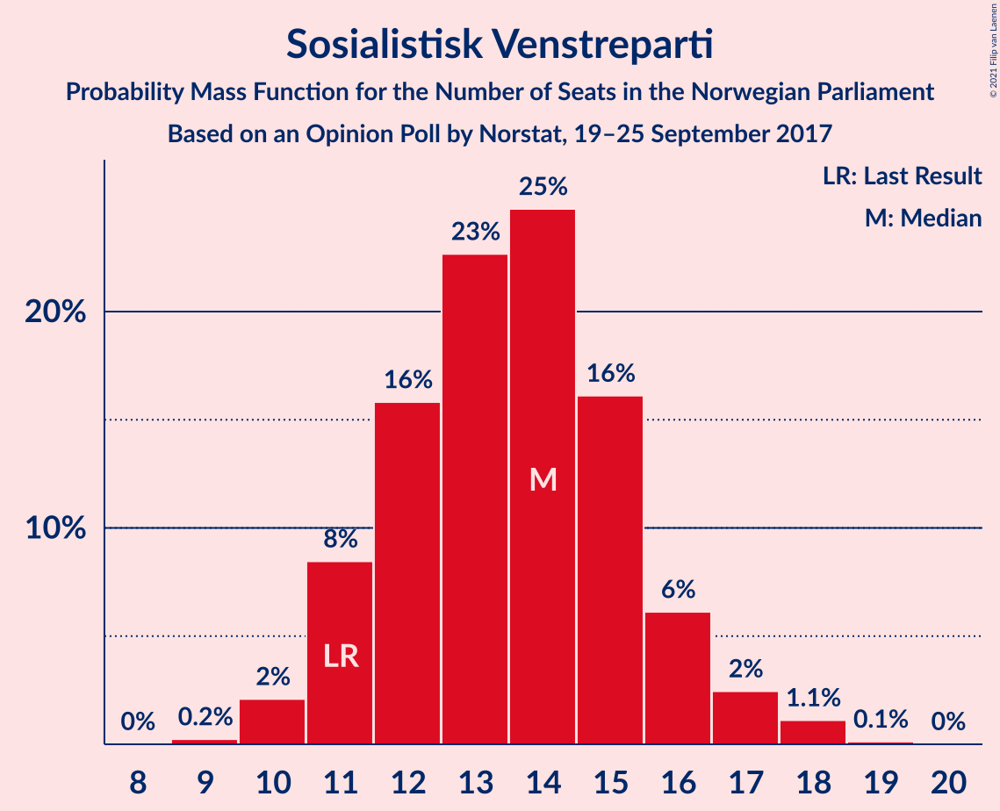

| Number of Seats | Probability | Accumulated | Special Marks |
|:---------------:|:-----------:|:-----------:|:-------------:|
| 9 | 0.2% | 100% |  |
| 10 | 2% | 99.7% |  |
| 11 | 8% | 98% | Last Result |
| 12 | 16% | 89% |  |
| 13 | 23% | 73% |  |
| 14 | 25% | 51% | Median |
| 15 | 16% | 26% |  |
| 16 | 6% | 10% |  |
| 17 | 2% | 4% |  |
| 18 | 1.1% | 1.3% |  |
| 19 | 0.1% | 0.1% |  |
| 20 | 0% | 0% |  |

### Venstre

*For a full overview of the results for this party, see the [Venstre](party-venstre.html) page.*

| Number of Seats | Probability | Accumulated | Special Marks |
|:---------------:|:-----------:|:-----------:|:-------------:|
| 2 | 3% | 100% |  |
| 3 | 3% | 97% |  |
| 4 | 0% | 94% |  |
| 5 | 0% | 94% |  |
| 6 | 0% | 94% |  |
| 7 | 12% | 94% |  |
| 8 | 10% | 82% | Last Result |
| 9 | 46% | 72% | Median |
| 10 | 24% | 26% |  |
| 11 | 1.5% | 3% |  |
| 12 | 1.1% | 1.3% |  |
| 13 | 0.1% | 0.1% |  |
| 14 | 0.1% | 0.1% |  |
| 15 | 0% | 0% |  |

### Rødt

*For a full overview of the results for this party, see the [Rødt](party-rødt.html) page.*

| Number of Seats | Probability | Accumulated | Special Marks |
|:---------------:|:-----------:|:-----------:|:-------------:|
| 1 | 5% | 100% | Last Result |
| 2 | 61% | 95% | Median |
| 3 | 0% | 34% |  |
| 4 | 0% | 34% |  |
| 5 | 0% | 34% |  |
| 6 | 0% | 34% |  |
| 7 | 10% | 34% |  |
| 8 | 17% | 23% |  |
| 9 | 5% | 6% |  |
| 10 | 1.0% | 1.1% |  |
| 11 | 0.2% | 0.2% |  |
| 12 | 0% | 0% |  |

### Kristelig Folkeparti

*For a full overview of the results for this party, see the [Kristelig Folkeparti](party-kristeligfolkeparti.html) page.*

| Number of Seats | Probability | Accumulated | Special Marks |
|:---------------:|:-----------:|:-----------:|:-------------:|
| 0 | 2% | 100% |  |
| 1 | 24% | 98% |  |
| 2 | 11% | 75% |  |
| 3 | 52% | 64% | Median |
| 4 | 0% | 12% |  |
| 5 | 0% | 12% |  |
| 6 | 0% | 12% |  |
| 7 | 6% | 12% |  |
| 8 | 6% | 6% | Last Result |
| 9 | 0.4% | 0.7% |  |
| 10 | 0.2% | 0.2% |  |
| 11 | 0% | 0% |  |

### Miljøpartiet De Grønne

*For a full overview of the results for this party, see the [Miljøpartiet De Grønne](party-miljøpartietdegrønne.html) page.*

| Number of Seats | Probability | Accumulated | Special Marks |
|:---------------:|:-----------:|:-----------:|:-------------:|
| 0 | 3% | 100% |  |
| 1 | 68% | 97% | Last Result, Median |
| 2 | 25% | 29% |  |
| 3 | 2% | 4% |  |
| 4 | 0% | 2% |  |
| 5 | 0% | 2% |  |
| 6 | 0% | 2% |  |
| 7 | 1.0% | 2% |  |
| 8 | 1.1% | 1.2% |  |
| 9 | 0.1% | 0.1% |  |
| 10 | 0% | 0% |  |

## Coalitions

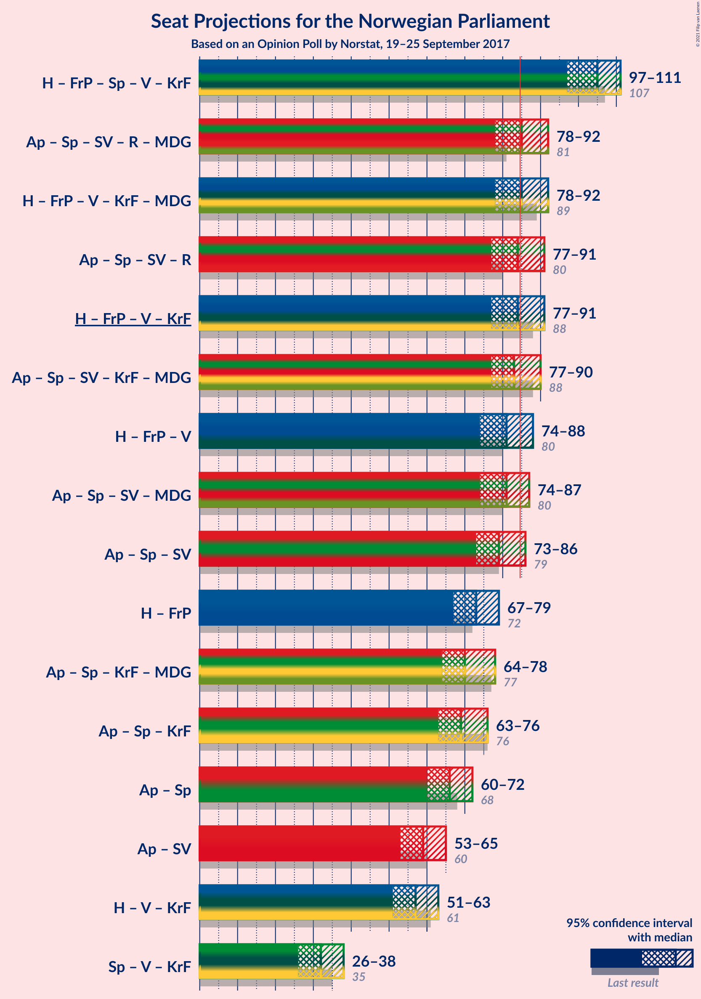

### Confidence Intervals

| Coalition | Last Result | Median | Majority? | 80% Confidence Interval | 90% Confidence Interval | 95% Confidence Interval | 99% Confidence Interval |
|:---------:|:-----------:|:------:|:---------:|:-----------------------:|:-----------------------:|:-----------------------:|:-----------------------:|
| Høyre – Fremskrittspartiet – Senterpartiet – Venstre – Kristelig Folkeparti | 107 | 105 | 100% | 100–109 | 99–110 | 97–111 | 95–113 |
| Arbeiderpartiet – Senterpartiet – Sosialistisk Venstreparti – Rødt – Miljøpartiet De Grønne | 81 | 85 | 54% | 81–89 | 79–90 | 78–92 | 76–94 |
| Høyre – Fremskrittspartiet – Venstre – Kristelig Folkeparti – Miljøpartiet De Grønne | 89 | 85 | 58% | 82–90 | 80–91 | 78–92 | 76–94 |
| Arbeiderpartiet – Senterpartiet – Sosialistisk Venstreparti – Rødt | 80 | 84 | 42% | 79–87 | 78–89 | 77–91 | 75–93 |
| Høyre – Fremskrittspartiet – Venstre – Kristelig Folkeparti | 88 | 84 | 46% | 80–88 | 79–90 | 77–91 | 75–93 |
| Arbeiderpartiet – Senterpartiet – Sosialistisk Venstreparti – Kristelig Folkeparti – Miljøpartiet De Grønne | 88 | 83 | 40% | 80–88 | 78–89 | 77–90 | 75–93 |
| Høyre – Fremskrittspartiet – Venstre | 80 | 81 | 15% | 77–85 | 76–86 | 74–88 | 72–90 |
| Arbeiderpartiet – Senterpartiet – Sosialistisk Venstreparti – Miljøpartiet De Grønne | 80 | 81 | 14% | 76–85 | 75–87 | 74–87 | 73–90 |
| Arbeiderpartiet – Senterpartiet – Sosialistisk Venstreparti | 79 | 79 | 6% | 75–84 | 74–85 | 73–86 | 71–88 |
| Høyre – Fremskrittspartiet | 72 | 73 | 0% | 69–76 | 68–78 | 67–79 | 65–81 |
| Arbeiderpartiet – Senterpartiet – Kristelig Folkeparti – Miljøpartiet De Grønne | 77 | 70 | 0% | 67–74 | 65–76 | 64–78 | 63–79 |
| Arbeiderpartiet – Senterpartiet – Kristelig Folkeparti | 76 | 69 | 0% | 65–73 | 64–75 | 63–76 | 61–77 |
| Arbeiderpartiet – Senterpartiet | 68 | 66 | 0% | 62–70 | 61–71 | 60–72 | 59–74 |
| Arbeiderpartiet – Sosialistisk Venstreparti | 60 | 59 | 0% | 55–63 | 54–64 | 53–65 | 52–66 |
| Høyre – Venstre – Kristelig Folkeparti | 61 | 57 | 0% | 53–61 | 52–62 | 51–63 | 48–65 |
| Senterpartiet – Venstre – Kristelig Folkeparti | 35 | 32 | 0% | 29–36 | 28–37 | 26–38 | 23–40 |

### Høyre – Fremskrittspartiet – Senterpartiet – Venstre – Kristelig Folkeparti

| Number of Seats | Probability | Accumulated | Special Marks |
|:---------------:|:-----------:|:-----------:|:-------------:|
| 92 | 0% | 100% |  |
| 93 | 0% | 99.9% |  |
| 94 | 0.2% | 99.9% |  |
| 95 | 0.3% | 99.7% |  |
| 96 | 0.9% | 99.4% |  |
| 97 | 1.1% | 98.5% |  |
| 98 | 1.5% | 97% |  |
| 99 | 2% | 96% |  |
| 100 | 6% | 94% |  |
| 101 | 6% | 88% |  |
| 102 | 10% | 82% |  |
| 103 | 7% | 72% |  |
| 104 | 11% | 65% |  |
| 105 | 11% | 54% | Median |
| 106 | 10% | 43% |  |
| 107 | 9% | 33% | Last Result |
| 108 | 6% | 24% |  |
| 109 | 9% | 18% |  |
| 110 | 5% | 9% |  |
| 111 | 2% | 4% |  |
| 112 | 0.8% | 2% |  |
| 113 | 0.7% | 1.0% |  |
| 114 | 0.2% | 0.3% |  |
| 115 | 0.1% | 0.1% |  |
| 116 | 0% | 0% |  |

### Arbeiderpartiet – Senterpartiet – Sosialistisk Venstreparti – Rødt – Miljøpartiet De Grønne

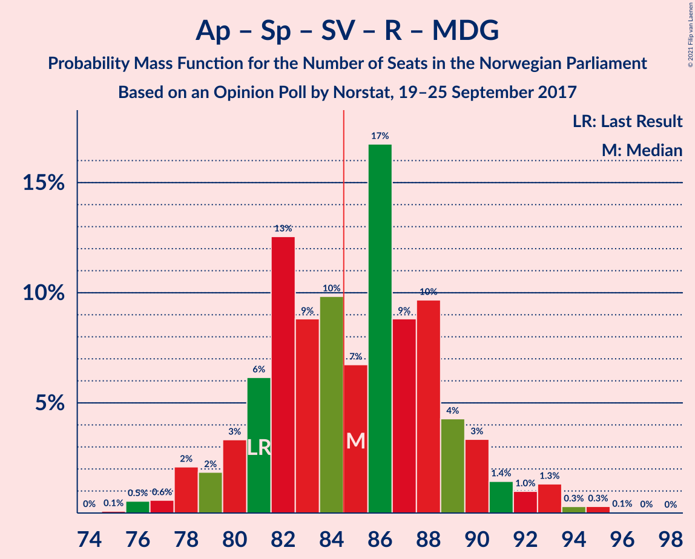

| Number of Seats | Probability | Accumulated | Special Marks |
|:---------------:|:-----------:|:-----------:|:-------------:|
| 74 | 0% | 100% |  |
| 75 | 0.1% | 99.9% |  |
| 76 | 0.5% | 99.8% |  |
| 77 | 0.6% | 99.3% |  |
| 78 | 2% | 98.7% |  |
| 79 | 2% | 97% |  |
| 80 | 3% | 95% |  |
| 81 | 6% | 91% | Last Result |
| 82 | 13% | 85% |  |
| 83 | 9% | 73% | Median |
| 84 | 10% | 64% |  |
| 85 | 7% | 54% | Majority |
| 86 | 17% | 47% |  |
| 87 | 9% | 31% |  |
| 88 | 10% | 22% |  |
| 89 | 4% | 12% |  |
| 90 | 3% | 8% |  |
| 91 | 1.4% | 4% |  |
| 92 | 1.0% | 3% |  |
| 93 | 1.3% | 2% |  |
| 94 | 0.3% | 0.7% |  |
| 95 | 0.3% | 0.4% |  |
| 96 | 0.1% | 0.1% |  |
| 97 | 0% | 0.1% |  |
| 98 | 0% | 0% |  |

### Høyre – Fremskrittspartiet – Venstre – Kristelig Folkeparti – Miljøpartiet De Grønne

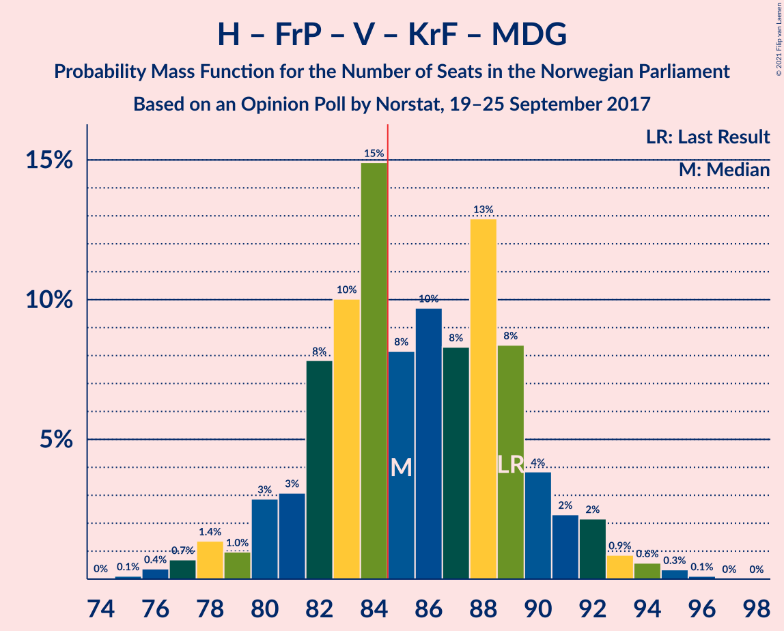

| Number of Seats | Probability | Accumulated | Special Marks |
|:---------------:|:-----------:|:-----------:|:-------------:|
| 74 | 0% | 100% |  |
| 75 | 0.1% | 99.9% |  |
| 76 | 0.4% | 99.8% |  |
| 77 | 0.7% | 99.4% |  |
| 78 | 1.4% | 98.7% |  |
| 79 | 1.0% | 97% |  |
| 80 | 3% | 96% |  |
| 81 | 3% | 94% |  |
| 82 | 8% | 90% |  |
| 83 | 10% | 83% |  |
| 84 | 15% | 73% |  |
| 85 | 8% | 58% | Median, Majority |
| 86 | 10% | 50% |  |
| 87 | 8% | 40% |  |
| 88 | 13% | 32% |  |
| 89 | 8% | 19% | Last Result |
| 90 | 4% | 10% |  |
| 91 | 2% | 6% |  |
| 92 | 2% | 4% |  |
| 93 | 0.9% | 2% |  |
| 94 | 0.6% | 1.1% |  |
| 95 | 0.3% | 0.5% |  |
| 96 | 0.1% | 0.1% |  |
| 97 | 0% | 0% |  |

### Arbeiderpartiet – Senterpartiet – Sosialistisk Venstreparti – Rødt

| Number of Seats | Probability | Accumulated | Special Marks |
|:---------------:|:-----------:|:-----------:|:-------------:|
| 73 | 0.1% | 100% |  |
| 74 | 0.3% | 99.9% |  |
| 75 | 0.6% | 99.5% |  |
| 76 | 0.9% | 98.9% |  |
| 77 | 2% | 98% |  |
| 78 | 2% | 96% |  |
| 79 | 4% | 94% |  |
| 80 | 8% | 90% | Last Result |
| 81 | 13% | 81% |  |
| 82 | 8% | 68% | Median |
| 83 | 10% | 60% |  |
| 84 | 8% | 50% |  |
| 85 | 15% | 42% | Majority |
| 86 | 10% | 27% |  |
| 87 | 8% | 17% |  |
| 88 | 3% | 10% |  |
| 89 | 3% | 6% |  |
| 90 | 1.0% | 4% |  |
| 91 | 1.4% | 3% |  |
| 92 | 0.7% | 1.3% |  |
| 93 | 0.4% | 0.6% |  |
| 94 | 0.1% | 0.2% |  |
| 95 | 0% | 0.1% |  |
| 96 | 0% | 0% |  |

### Høyre – Fremskrittspartiet – Venstre – Kristelig Folkeparti

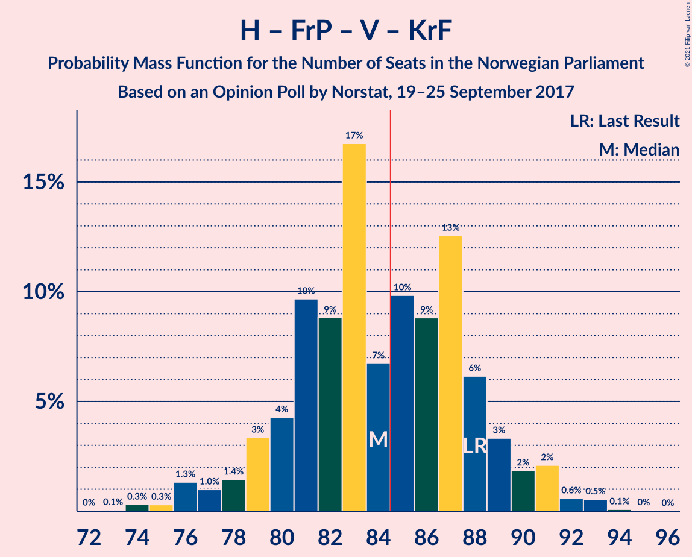

| Number of Seats | Probability | Accumulated | Special Marks |
|:---------------:|:-----------:|:-----------:|:-------------:|
| 72 | 0% | 100% |  |
| 73 | 0.1% | 99.9% |  |
| 74 | 0.3% | 99.9% |  |
| 75 | 0.3% | 99.6% |  |
| 76 | 1.3% | 99.3% |  |
| 77 | 1.0% | 98% |  |
| 78 | 1.4% | 97% |  |
| 79 | 3% | 96% |  |
| 80 | 4% | 92% |  |
| 81 | 10% | 88% |  |
| 82 | 9% | 78% |  |
| 83 | 17% | 69% |  |
| 84 | 7% | 53% | Median |
| 85 | 10% | 46% | Majority |
| 86 | 9% | 36% |  |
| 87 | 13% | 27% |  |
| 88 | 6% | 15% | Last Result |
| 89 | 3% | 9% |  |
| 90 | 2% | 5% |  |
| 91 | 2% | 3% |  |
| 92 | 0.6% | 1.3% |  |
| 93 | 0.5% | 0.7% |  |
| 94 | 0.1% | 0.2% |  |
| 95 | 0% | 0.1% |  |
| 96 | 0% | 0% |  |

### Arbeiderpartiet – Senterpartiet – Sosialistisk Venstreparti – Kristelig Folkeparti – Miljøpartiet De Grønne

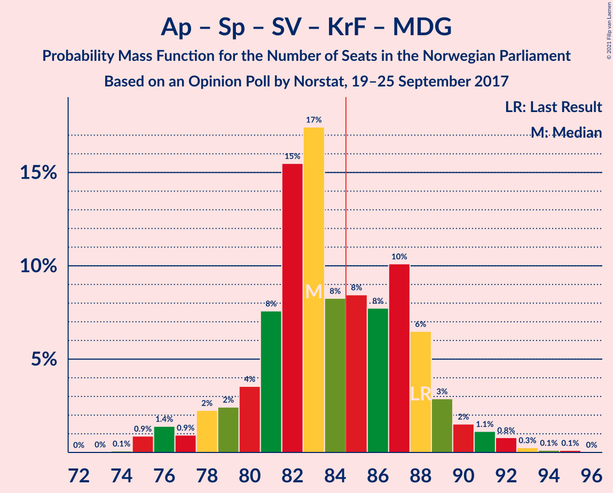

| Number of Seats | Probability | Accumulated | Special Marks |
|:---------------:|:-----------:|:-----------:|:-------------:|
| 73 | 0% | 100% |  |
| 74 | 0.1% | 99.9% |  |
| 75 | 0.9% | 99.9% |  |
| 76 | 1.4% | 99.0% |  |
| 77 | 0.9% | 98% |  |
| 78 | 2% | 97% |  |
| 79 | 2% | 94% |  |
| 80 | 4% | 92% |  |
| 81 | 8% | 88% |  |
| 82 | 15% | 81% |  |
| 83 | 17% | 65% |  |
| 84 | 8% | 48% | Median |
| 85 | 8% | 40% | Majority |
| 86 | 8% | 31% |  |
| 87 | 10% | 23% |  |
| 88 | 6% | 13% | Last Result |
| 89 | 3% | 7% |  |
| 90 | 2% | 4% |  |
| 91 | 1.1% | 2% |  |
| 92 | 0.8% | 1.3% |  |
| 93 | 0.3% | 0.5% |  |
| 94 | 0.1% | 0.3% |  |
| 95 | 0.1% | 0.2% |  |
| 96 | 0% | 0% |  |

### Høyre – Fremskrittspartiet – Venstre

| Number of Seats | Probability | Accumulated | Special Marks |
|:---------------:|:-----------:|:-----------:|:-------------:|
| 69 | 0.1% | 100% |  |
| 70 | 0% | 99.9% |  |
| 71 | 0.1% | 99.9% |  |
| 72 | 0.3% | 99.8% |  |
| 73 | 0.7% | 99.5% |  |
| 74 | 1.3% | 98.8% |  |
| 75 | 2% | 97% |  |
| 76 | 4% | 96% |  |
| 77 | 3% | 92% |  |
| 78 | 8% | 89% |  |
| 79 | 8% | 81% |  |
| 80 | 20% | 73% | Last Result |
| 81 | 8% | 52% | Median |
| 82 | 8% | 44% |  |
| 83 | 9% | 36% |  |
| 84 | 12% | 28% |  |
| 85 | 8% | 15% | Majority |
| 86 | 3% | 8% |  |
| 87 | 1.4% | 5% |  |
| 88 | 2% | 3% |  |
| 89 | 1.1% | 2% |  |
| 90 | 0.3% | 0.7% |  |
| 91 | 0.3% | 0.4% |  |
| 92 | 0.1% | 0.1% |  |
| 93 | 0% | 0% |  |

### Arbeiderpartiet – Senterpartiet – Sosialistisk Venstreparti – Miljøpartiet De Grønne

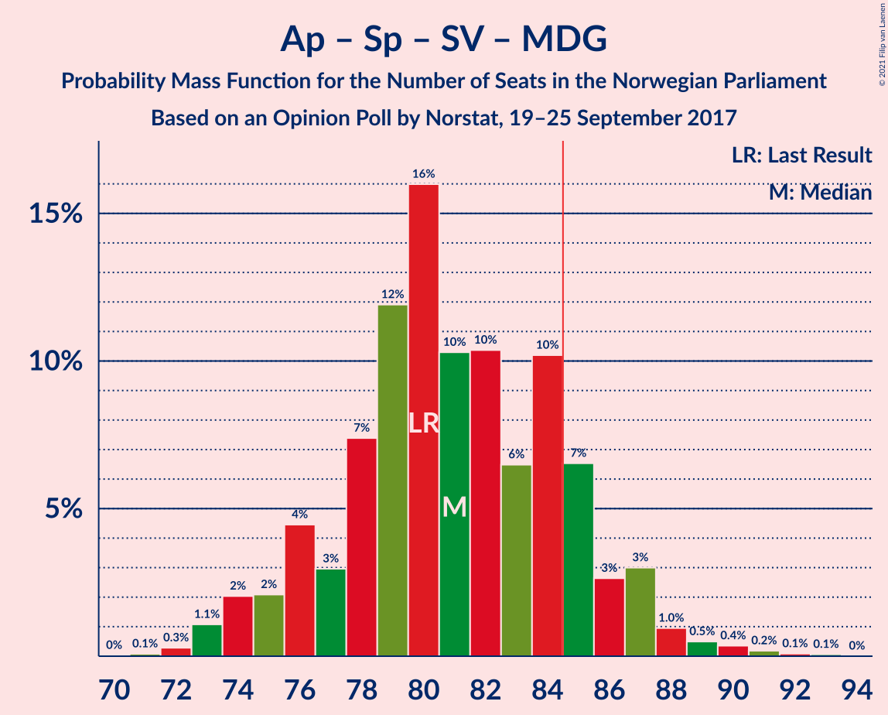

| Number of Seats | Probability | Accumulated | Special Marks |
|:---------------:|:-----------:|:-----------:|:-------------:|
| 71 | 0.1% | 100% |  |
| 72 | 0.3% | 99.9% |  |
| 73 | 1.1% | 99.6% |  |
| 74 | 2% | 98.5% |  |
| 75 | 2% | 96% |  |
| 76 | 4% | 94% |  |
| 77 | 3% | 90% |  |
| 78 | 7% | 87% |  |
| 79 | 12% | 80% |  |
| 80 | 16% | 68% | Last Result |
| 81 | 10% | 52% | Median |
| 82 | 10% | 41% |  |
| 83 | 6% | 31% |  |
| 84 | 10% | 25% |  |
| 85 | 7% | 14% | Majority |
| 86 | 3% | 8% |  |
| 87 | 3% | 5% |  |
| 88 | 1.0% | 2% |  |
| 89 | 0.5% | 1.2% |  |
| 90 | 0.4% | 0.7% |  |
| 91 | 0.2% | 0.3% |  |
| 92 | 0.1% | 0.2% |  |
| 93 | 0.1% | 0.1% |  |
| 94 | 0% | 0% |  |

### Arbeiderpartiet – Senterpartiet – Sosialistisk Venstreparti

| Number of Seats | Probability | Accumulated | Special Marks |
|:---------------:|:-----------:|:-----------:|:-------------:|
| 69 | 0% | 100% |  |
| 70 | 0.1% | 99.9% |  |
| 71 | 0.5% | 99.9% |  |
| 72 | 1.4% | 99.3% |  |
| 73 | 2% | 98% |  |
| 74 | 3% | 95% |  |
| 75 | 4% | 93% |  |
| 76 | 4% | 89% |  |
| 77 | 11% | 85% |  |
| 78 | 12% | 74% |  |
| 79 | 17% | 63% | Last Result |
| 80 | 9% | 46% | Median |
| 81 | 9% | 37% |  |
| 82 | 7% | 28% |  |
| 83 | 9% | 21% |  |
| 84 | 7% | 13% |  |
| 85 | 3% | 6% | Majority |
| 86 | 1.4% | 3% |  |
| 87 | 0.8% | 2% |  |
| 88 | 0.2% | 0.7% |  |
| 89 | 0.2% | 0.5% |  |
| 90 | 0.1% | 0.2% |  |
| 91 | 0.1% | 0.1% |  |
| 92 | 0.1% | 0.1% |  |
| 93 | 0% | 0% |  |

### Høyre – Fremskrittspartiet

| Number of Seats | Probability | Accumulated | Special Marks |
|:---------------:|:-----------:|:-----------:|:-------------:|
| 62 | 0% | 100% |  |
| 63 | 0.1% | 99.9% |  |
| 64 | 0.2% | 99.9% |  |
| 65 | 0.8% | 99.6% |  |
| 66 | 1.1% | 98.8% |  |
| 67 | 1.5% | 98% |  |
| 68 | 3% | 96% |  |
| 69 | 8% | 94% |  |
| 70 | 7% | 85% |  |
| 71 | 18% | 78% |  |
| 72 | 7% | 60% | Last Result, Median |
| 73 | 13% | 54% |  |
| 74 | 13% | 40% |  |
| 75 | 13% | 27% |  |
| 76 | 6% | 14% |  |
| 77 | 3% | 8% |  |
| 78 | 1.4% | 5% |  |
| 79 | 2% | 4% |  |
| 80 | 0.9% | 2% |  |
| 81 | 0.5% | 0.8% |  |
| 82 | 0.2% | 0.3% |  |
| 83 | 0% | 0.1% |  |
| 84 | 0% | 0% |  |

### Arbeiderpartiet – Senterpartiet – Kristelig Folkeparti – Miljøpartiet De Grønne

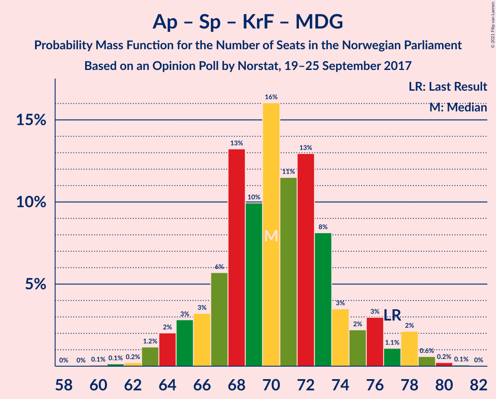

| Number of Seats | Probability | Accumulated | Special Marks |
|:---------------:|:-----------:|:-----------:|:-------------:|
| 60 | 0.1% | 100% |  |
| 61 | 0.1% | 99.9% |  |
| 62 | 0.2% | 99.8% |  |
| 63 | 1.2% | 99.6% |  |
| 64 | 2% | 98% |  |
| 65 | 3% | 96% |  |
| 66 | 3% | 94% |  |
| 67 | 6% | 90% |  |
| 68 | 13% | 85% |  |
| 69 | 10% | 71% |  |
| 70 | 16% | 61% | Median |
| 71 | 11% | 45% |  |
| 72 | 13% | 34% |  |
| 73 | 8% | 21% |  |
| 74 | 3% | 13% |  |
| 75 | 2% | 9% |  |
| 76 | 3% | 7% |  |
| 77 | 1.1% | 4% | Last Result |
| 78 | 2% | 3% |  |
| 79 | 0.6% | 0.9% |  |
| 80 | 0.2% | 0.3% |  |
| 81 | 0.1% | 0.1% |  |
| 82 | 0% | 0% |  |

### Arbeiderpartiet – Senterpartiet – Kristelig Folkeparti

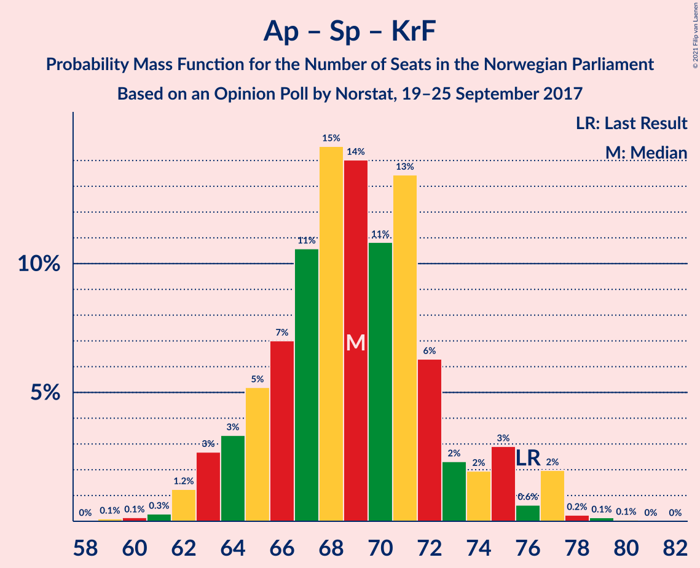

| Number of Seats | Probability | Accumulated | Special Marks |
|:---------------:|:-----------:|:-----------:|:-------------:|
| 59 | 0.1% | 100% |  |
| 60 | 0.1% | 99.9% |  |
| 61 | 0.3% | 99.7% |  |
| 62 | 1.2% | 99.4% |  |
| 63 | 3% | 98% |  |
| 64 | 3% | 96% |  |
| 65 | 5% | 92% |  |
| 66 | 7% | 87% |  |
| 67 | 11% | 80% |  |
| 68 | 15% | 69% |  |
| 69 | 14% | 55% | Median |
| 70 | 11% | 41% |  |
| 71 | 13% | 30% |  |
| 72 | 6% | 17% |  |
| 73 | 2% | 10% |  |
| 74 | 2% | 8% |  |
| 75 | 3% | 6% |  |
| 76 | 0.6% | 3% | Last Result |
| 77 | 2% | 2% |  |
| 78 | 0.2% | 0.5% |  |
| 79 | 0.1% | 0.2% |  |
| 80 | 0.1% | 0.1% |  |
| 81 | 0% | 0% |  |

### Arbeiderpartiet – Senterpartiet

| Number of Seats | Probability | Accumulated | Special Marks |
|:---------------:|:-----------:|:-----------:|:-------------:|
| 57 | 0.1% | 100% |  |
| 58 | 0.2% | 99.9% |  |
| 59 | 0.5% | 99.7% |  |
| 60 | 2% | 99.1% |  |
| 61 | 3% | 97% |  |
| 62 | 6% | 94% |  |
| 63 | 5% | 88% |  |
| 64 | 12% | 83% |  |
| 65 | 17% | 71% |  |
| 66 | 12% | 54% | Median |
| 67 | 10% | 42% |  |
| 68 | 13% | 32% | Last Result |
| 69 | 7% | 19% |  |
| 70 | 7% | 12% |  |
| 71 | 2% | 6% |  |
| 72 | 1.4% | 3% |  |
| 73 | 0.8% | 2% |  |
| 74 | 0.4% | 0.9% |  |
| 75 | 0.3% | 0.5% |  |
| 76 | 0.1% | 0.2% |  |
| 77 | 0% | 0.1% |  |
| 78 | 0.1% | 0.1% |  |
| 79 | 0% | 0% |  |

### Arbeiderpartiet – Sosialistisk Venstreparti

| Number of Seats | Probability | Accumulated | Special Marks |
|:---------------:|:-----------:|:-----------:|:-------------:|
| 50 | 0.1% | 100% |  |
| 51 | 0.2% | 99.9% |  |
| 52 | 0.8% | 99.7% |  |
| 53 | 2% | 98.9% |  |
| 54 | 3% | 97% |  |
| 55 | 7% | 94% |  |
| 56 | 10% | 87% |  |
| 57 | 15% | 78% |  |
| 58 | 8% | 63% |  |
| 59 | 13% | 54% | Median |
| 60 | 12% | 41% | Last Result |
| 61 | 13% | 30% |  |
| 62 | 3% | 17% |  |
| 63 | 6% | 14% |  |
| 64 | 5% | 8% |  |
| 65 | 2% | 3% |  |
| 66 | 0.9% | 1.3% |  |
| 67 | 0.1% | 0.4% |  |
| 68 | 0.1% | 0.3% |  |
| 69 | 0.1% | 0.2% |  |
| 70 | 0.1% | 0.1% |  |
| 71 | 0% | 0% |  |

### Høyre – Venstre – Kristelig Folkeparti

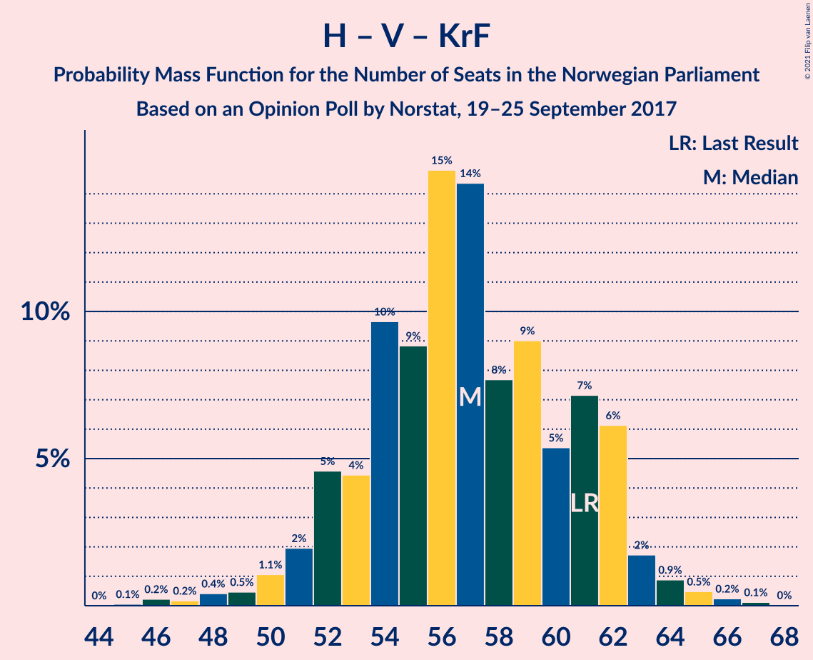

| Number of Seats | Probability | Accumulated | Special Marks |
|:---------------:|:-----------:|:-----------:|:-------------:|
| 45 | 0.1% | 100% |  |
| 46 | 0.2% | 99.9% |  |
| 47 | 0.2% | 99.7% |  |
| 48 | 0.4% | 99.5% |  |
| 49 | 0.5% | 99.1% |  |
| 50 | 1.1% | 98.6% |  |
| 51 | 2% | 98% |  |
| 52 | 5% | 96% |  |
| 53 | 4% | 91% |  |
| 54 | 10% | 87% |  |
| 55 | 9% | 77% |  |
| 56 | 15% | 68% |  |
| 57 | 14% | 53% | Median |
| 58 | 8% | 39% |  |
| 59 | 9% | 31% |  |
| 60 | 5% | 22% |  |
| 61 | 7% | 17% | Last Result |
| 62 | 6% | 10% |  |
| 63 | 2% | 4% |  |
| 64 | 0.9% | 2% |  |
| 65 | 0.5% | 0.9% |  |
| 66 | 0.2% | 0.4% |  |
| 67 | 0.1% | 0.2% |  |
| 68 | 0% | 0% |  |

### Senterpartiet – Venstre – Kristelig Folkeparti

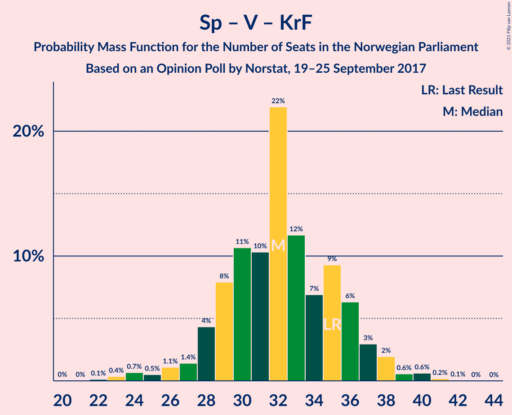

| Number of Seats | Probability | Accumulated | Special Marks |
|:---------------:|:-----------:|:-----------:|:-------------:|
| 21 | 0% | 100% |  |
| 22 | 0.1% | 99.9% |  |
| 23 | 0.4% | 99.8% |  |
| 24 | 0.7% | 99.4% |  |
| 25 | 0.5% | 98.8% |  |
| 26 | 1.1% | 98% |  |
| 27 | 1.4% | 97% |  |
| 28 | 4% | 96% |  |
| 29 | 8% | 91% |  |
| 30 | 11% | 84% |  |
| 31 | 10% | 73% |  |
| 32 | 22% | 63% |  |
| 33 | 12% | 41% | Median |
| 34 | 7% | 29% |  |
| 35 | 9% | 22% | Last Result |
| 36 | 6% | 13% |  |
| 37 | 3% | 6% |  |
| 38 | 2% | 3% |  |
| 39 | 0.6% | 1.4% |  |
| 40 | 0.6% | 0.9% |  |
| 41 | 0.2% | 0.3% |  |
| 42 | 0.1% | 0.1% |  |
| 43 | 0% | 0% |  |

## Technical Information

### Opinion Poll

+ **Polling firm:** Norstat
+ **Commissioner(s):** —
+ **Fieldwork period:** 19–25 September 2017

### Calculations

+ **Sample size:** 936
+ **Simulations done:** 1,048,576
+ **Error estimate:** 1.57%

