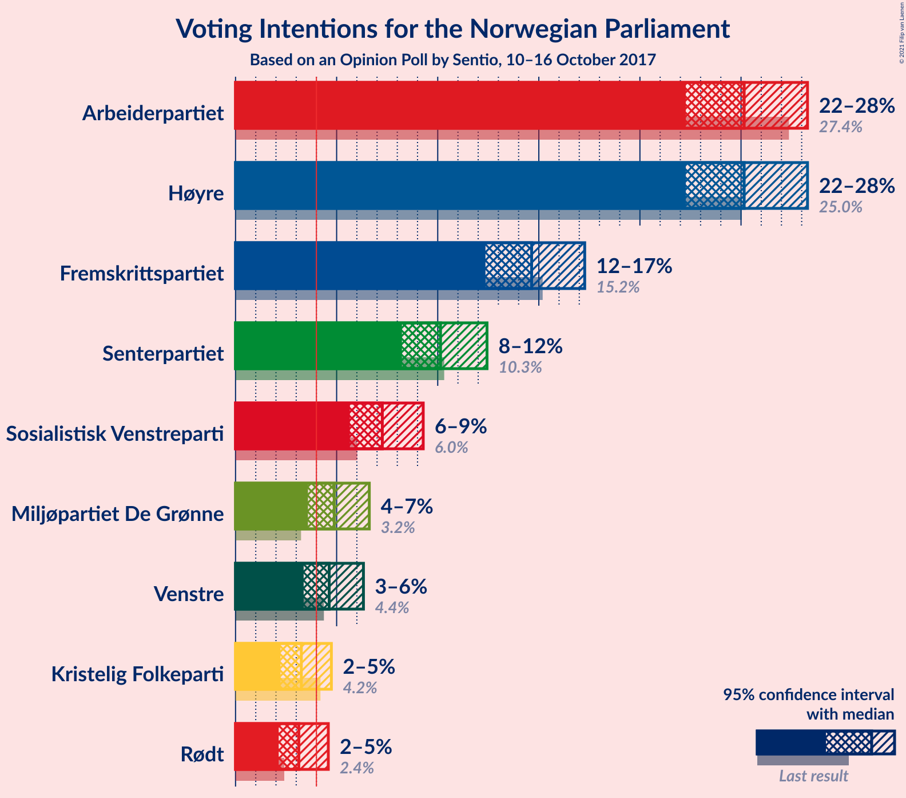
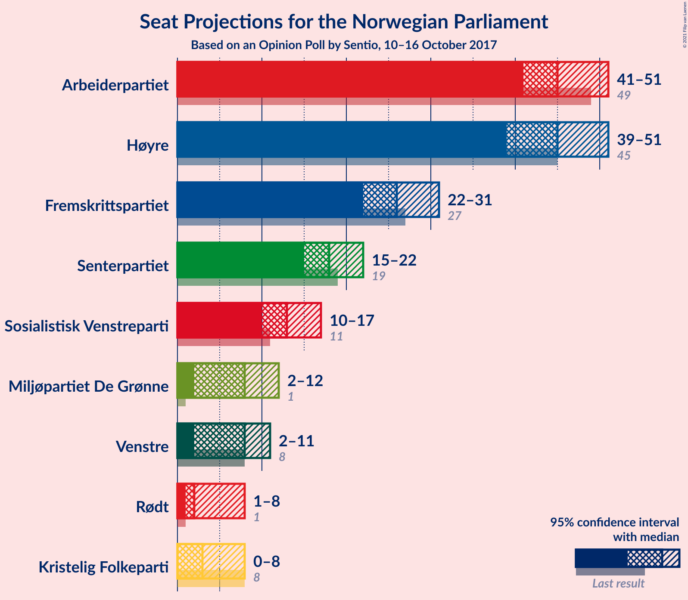
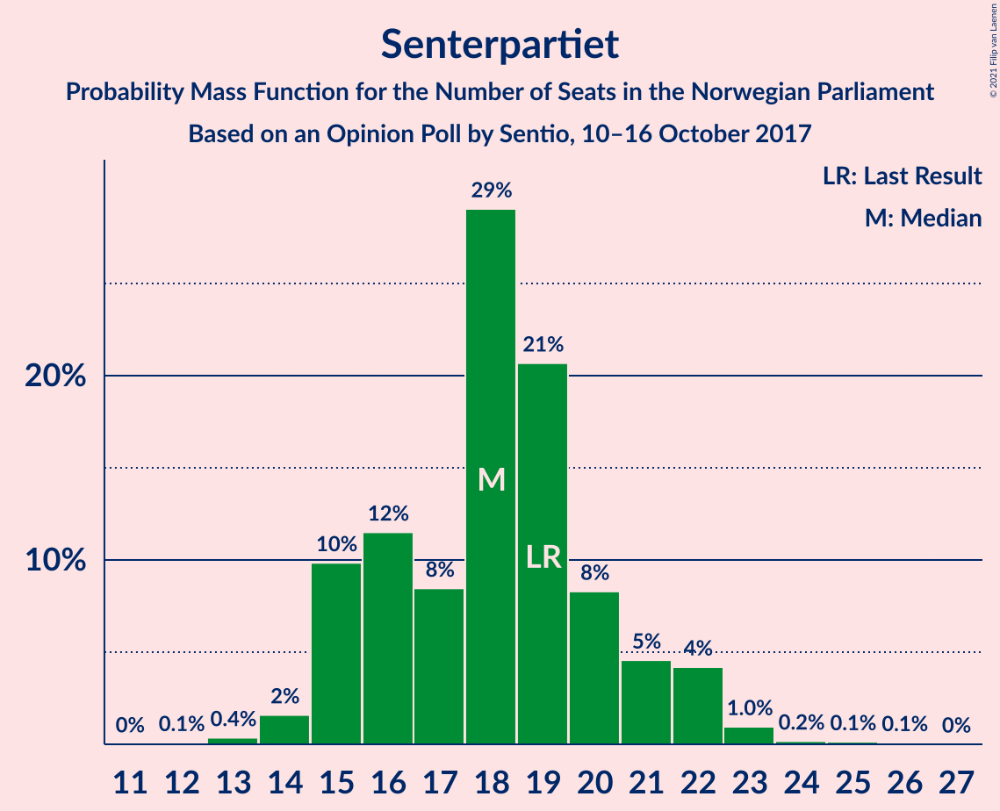
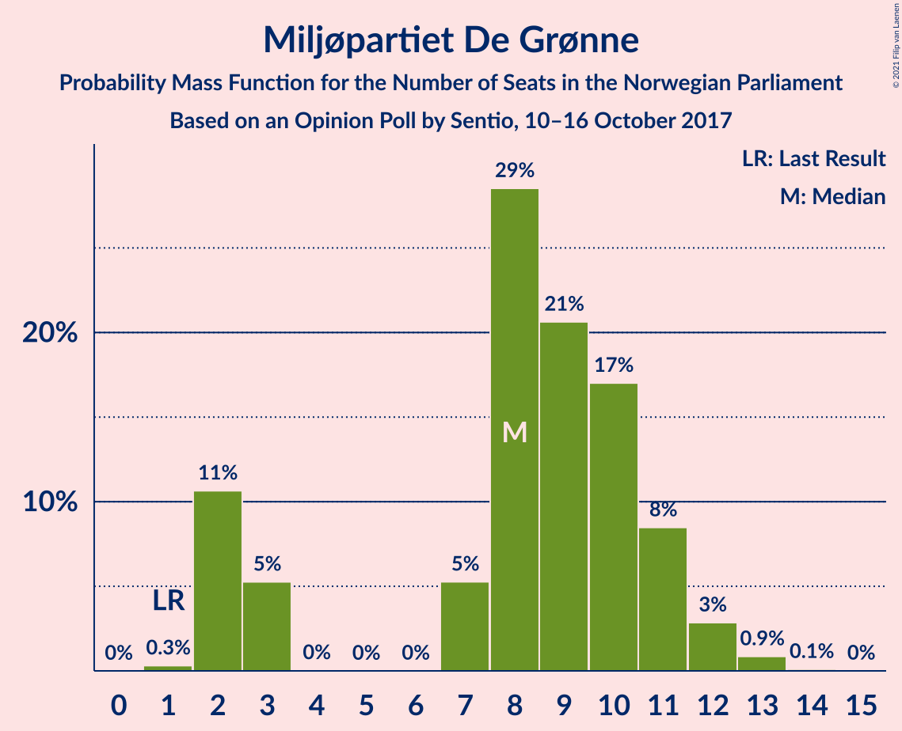
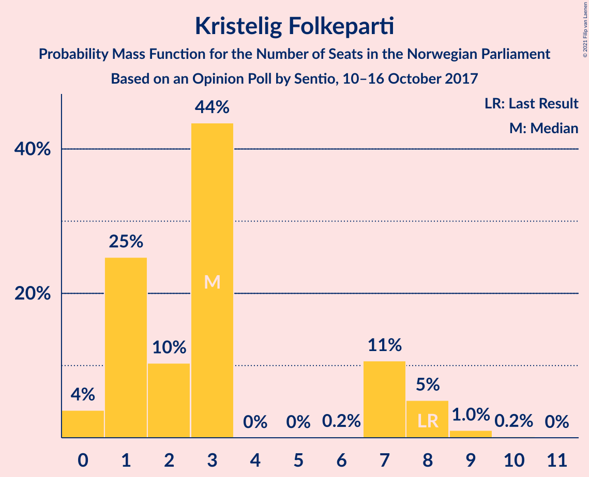
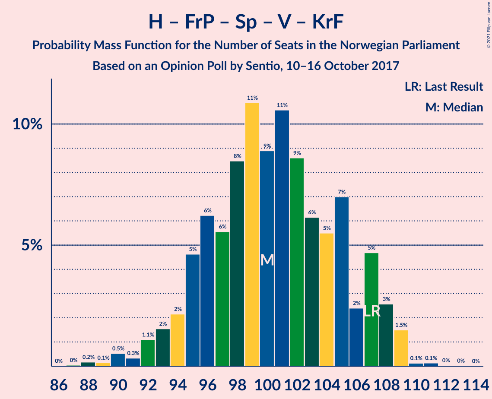
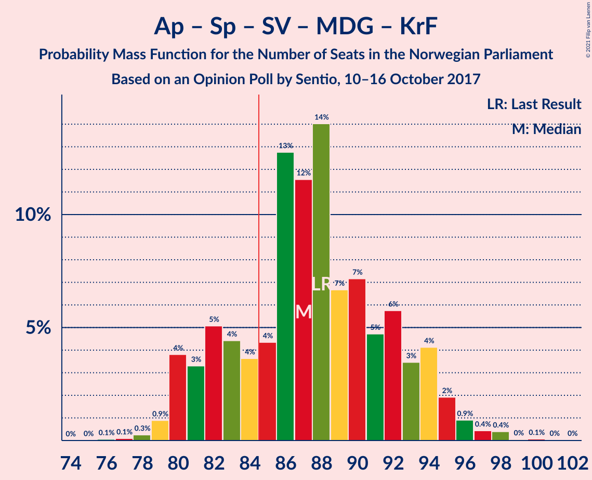
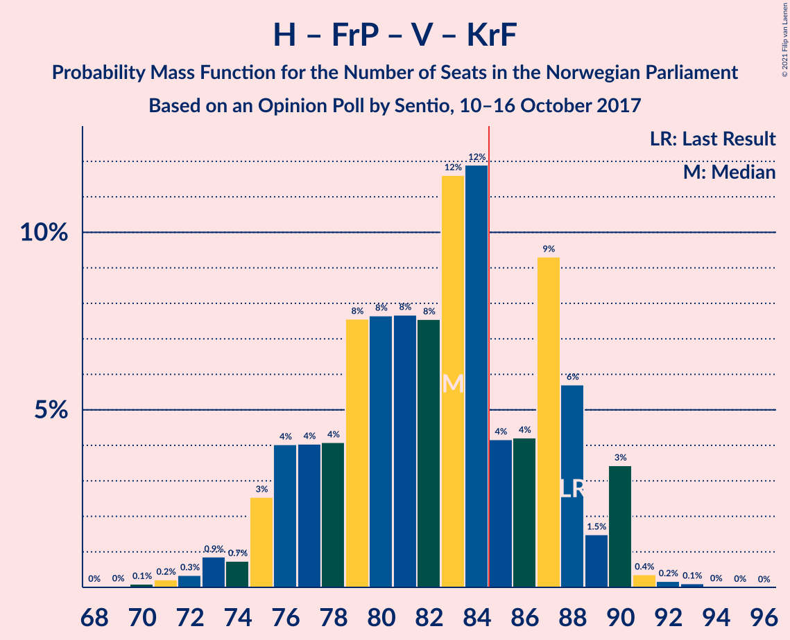
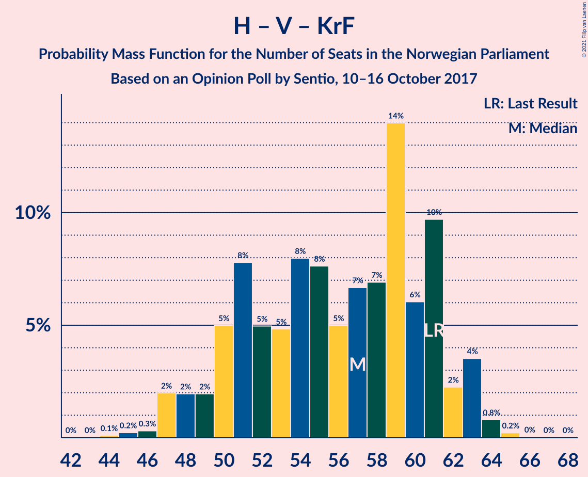
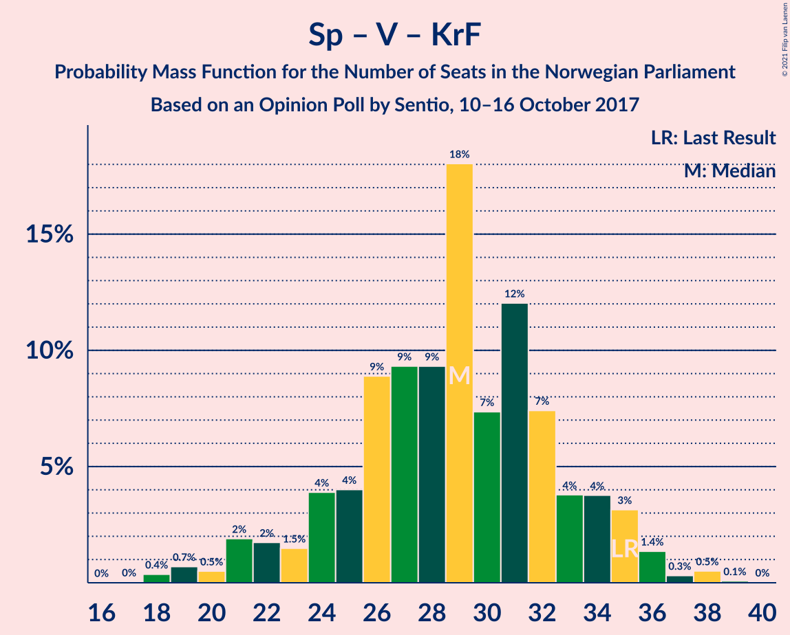

# Opinion Poll by Sentio, 10–16 October 2017

<a href="#voting-intentions">Voting Intentions</a> | <a href="#seats">Seats</a> | <a href="#coalitions">Coalitions</a> | <a href="#technical-information">Technical Information</a>

## Voting Intentions

### Confidence Intervals

| Party | Last Result | Poll Result | 80% Confidence Interval | 90% Confidence Interval | 95% Confidence Interval | 99% Confidence Interval |
|:-----:|:-----------:|:-----------:|:-----------------------:|:-----------------------:|:-----------------------:|:-----------------------:|
| Arbeiderpartiet | 27.4% | 25.2% | 23.3–27.2% |22.7–27.8% |22.3–28.3% |21.4–29.3% |
| Høyre | 25.0% | 25.2% | 23.3–27.2% |22.7–27.8% |22.3–28.3% |21.4–29.3% |
| Fremskrittspartiet | 15.2% | 14.6% | 13.1–16.4% |12.7–16.8% |12.4–17.3% |11.7–18.1% |
| Senterpartiet | 10.3% | 10.1% | 8.9–11.6% |8.5–12.1% |8.2–12.4% |7.7–13.2% |
| Sosialistisk Venstreparti | 6.0% | 7.3% | 6.2–8.6% |5.9–8.9% |5.7–9.3% |5.2–10.0% |
| Miljøpartiet De Grønne | 3.2% | 4.9% | 4.0–6.0% |3.8–6.3% |3.6–6.6% |3.2–7.2% |
| Venstre | 4.4% | 4.6% | 3.8–5.7% |3.6–6.1% |3.4–6.3% |3.0–6.9% |
| Kristelig Folkeparti | 4.2% | 3.3% | 2.6–4.2% |2.4–4.5% |2.2–4.7% |1.9–5.2% |
| Rødt | 2.4% | 3.1% | 2.5–4.1% |2.3–4.3% |2.1–4.6% |1.8–5.1% |

*Note:* The poll result column reflects the actual value used in the calculations. Published results may vary slightly, and in addition be rounded to fewer digits.

## Seats

### Confidence Intervals

| Party | Last Result | Median | 80% Confidence Interval | 90% Confidence Interval | 95% Confidence Interval | 99% Confidence Interval |
|:-----:|:-----------:|:------:|:-----------------------:|:-----------------------:|:-----------------------:|:-----------------------:|
| <a href="#arbeiderpartiet">Arbeiderpartiet</a> | 49 | 45 | 42–49 |41–50 |41–51 |39–54 |
| <a href="#høyre">Høyre</a> | 45 | 45 | 41–49 |40–50 |39–51 |38–53 |
| <a href="#fremskrittspartiet">Fremskrittspartiet</a> | 27 | 26 | 24–30 |23–30 |22–31 |20–33 |
| <a href="#senterpartiet">Senterpartiet</a> | 19 | 18 | 15–21 |15–22 |15–22 |14–23 |
| <a href="#sosialistisk-venstreparti">Sosialistisk Venstreparti</a> | 11 | 13 | 11–15 |10–16 |10–17 |9–18 |
| <a href="#miljøpartiet-de-grønne">Miljøpartiet De Grønne</a> | 1 | 8 | 2–11 |2–11 |2–12 |2–13 |
| <a href="#venstre">Venstre</a> | 8 | 8 | 2–10 |2–11 |2–11 |2–12 |
| <a href="#kristelig-folkeparti">Kristelig Folkeparti</a> | 8 | 3 | 1–7 |1–8 |0–8 |0–9 |
| <a href="#rødt">Rødt</a> | 1 | 2 | 1–2 |1–7 |1–8 |1–9 |

### Arbeiderpartiet

*For a full overview of the results for this party, see the [Arbeiderpartiet](party-arbeiderpartiet.html) page.*

| Number of Seats | Probability | Accumulated | Special Marks |
|:---------------:|:-----------:|:-----------:|:-------------:|
| 38 | 0.1% | 100% |  |
| 39 | 0.6% | 99.9% |  |
| 40 | 2% | 99.3% |  |
| 41 | 4% | 98% |  |
| 42 | 5% | 94% |  |
| 43 | 16% | 88% |  |
| 44 | 10% | 72% |  |
| 45 | 19% | 62% | Median |
| 46 | 9% | 43% |  |
| 47 | 18% | 34% |  |
| 48 | 4% | 15% |  |
| 49 | 4% | 11% | Last Result |
| 50 | 4% | 8% |  |
| 51 | 2% | 4% |  |
| 52 | 0.7% | 2% |  |
| 53 | 0.5% | 1.2% |  |
| 54 | 0.4% | 0.8% |  |
| 55 | 0.2% | 0.3% |  |
| 56 | 0.1% | 0.1% |  |
| 57 | 0% | 0% |  |

### Høyre

*For a full overview of the results for this party, see the [Høyre](party-høyre.html) page.*

| Number of Seats | Probability | Accumulated | Special Marks |
|:---------------:|:-----------:|:-----------:|:-------------:|
| 36 | 0.1% | 100% |  |
| 37 | 0.2% | 99.9% |  |
| 38 | 1.3% | 99.7% |  |
| 39 | 1.2% | 98% |  |
| 40 | 3% | 97% |  |
| 41 | 7% | 94% |  |
| 42 | 9% | 88% |  |
| 43 | 8% | 79% |  |
| 44 | 8% | 71% |  |
| 45 | 13% | 63% | Last Result, Median |
| 46 | 16% | 49% |  |
| 47 | 7% | 33% |  |
| 48 | 13% | 27% |  |
| 49 | 6% | 13% |  |
| 50 | 3% | 7% |  |
| 51 | 2% | 4% |  |
| 52 | 1.2% | 2% |  |
| 53 | 0.3% | 0.6% |  |
| 54 | 0.2% | 0.3% |  |
| 55 | 0% | 0.1% |  |
| 56 | 0% | 0.1% |  |
| 57 | 0% | 0% |  |

### Fremskrittspartiet

*For a full overview of the results for this party, see the [Fremskrittspartiet](party-fremskrittspartiet.html) page.*

| Number of Seats | Probability | Accumulated | Special Marks |
|:---------------:|:-----------:|:-----------:|:-------------:|
| 19 | 0.1% | 100% |  |
| 20 | 0.6% | 99.8% |  |
| 21 | 1.0% | 99.3% |  |
| 22 | 2% | 98% |  |
| 23 | 4% | 96% |  |
| 24 | 8% | 92% |  |
| 25 | 24% | 83% |  |
| 26 | 11% | 59% | Median |
| 27 | 18% | 48% | Last Result |
| 28 | 11% | 31% |  |
| 29 | 9% | 20% |  |
| 30 | 6% | 10% |  |
| 31 | 2% | 4% |  |
| 32 | 1.0% | 2% |  |
| 33 | 0.3% | 0.7% |  |
| 34 | 0.3% | 0.4% |  |
| 35 | 0% | 0.1% |  |
| 36 | 0% | 0% |  |

### Senterpartiet

*For a full overview of the results for this party, see the [Senterpartiet](party-senterpartiet.html) page.*

| Number of Seats | Probability | Accumulated | Special Marks |
|:---------------:|:-----------:|:-----------:|:-------------:|
| 12 | 0.1% | 100% |  |
| 13 | 0.4% | 99.9% |  |
| 14 | 2% | 99.5% |  |
| 15 | 10% | 98% |  |
| 16 | 12% | 88% |  |
| 17 | 8% | 77% |  |
| 18 | 29% | 68% | Median |
| 19 | 21% | 39% | Last Result |
| 20 | 8% | 18% |  |
| 21 | 5% | 10% |  |
| 22 | 4% | 6% |  |
| 23 | 1.0% | 1.4% |  |
| 24 | 0.2% | 0.4% |  |
| 25 | 0.1% | 0.2% |  |
| 26 | 0.1% | 0.1% |  |
| 27 | 0% | 0% |  |

### Sosialistisk Venstreparti

*For a full overview of the results for this party, see the [Sosialistisk Venstreparti](party-sosialistiskvenstreparti.html) page.*

| Number of Seats | Probability | Accumulated | Special Marks |
|:---------------:|:-----------:|:-----------:|:-------------:|
| 8 | 0.2% | 100% |  |
| 9 | 1.0% | 99.8% |  |
| 10 | 4% | 98.8% |  |
| 11 | 13% | 95% | Last Result |
| 12 | 21% | 81% |  |
| 13 | 24% | 61% | Median |
| 14 | 15% | 37% |  |
| 15 | 14% | 22% |  |
| 16 | 6% | 8% |  |
| 17 | 2% | 3% |  |
| 18 | 0.6% | 0.8% |  |
| 19 | 0.1% | 0.2% |  |
| 20 | 0% | 0.1% |  |
| 21 | 0% | 0% |  |

### Miljøpartiet De Grønne

*For a full overview of the results for this party, see the [Miljøpartiet De Grønne](party-miljøpartietdegrønne.html) page.*

| Number of Seats | Probability | Accumulated | Special Marks |
|:---------------:|:-----------:|:-----------:|:-------------:|
| 1 | 0.3% | 100% | Last Result |
| 2 | 11% | 99.7% |  |
| 3 | 5% | 89% |  |
| 4 | 0% | 84% |  |
| 5 | 0% | 84% |  |
| 6 | 0% | 84% |  |
| 7 | 5% | 84% |  |
| 8 | 29% | 78% | Median |
| 9 | 21% | 50% |  |
| 10 | 17% | 29% |  |
| 11 | 8% | 12% |  |
| 12 | 3% | 4% |  |
| 13 | 0.9% | 1.0% |  |
| 14 | 0.1% | 0.1% |  |
| 15 | 0% | 0% |  |

### Venstre

*For a full overview of the results for this party, see the [Venstre](party-venstre.html) page.*

| Number of Seats | Probability | Accumulated | Special Marks |
|:---------------:|:-----------:|:-----------:|:-------------:|
| 2 | 14% | 100% |  |
| 3 | 3% | 86% |  |
| 4 | 0% | 83% |  |
| 5 | 0% | 83% |  |
| 6 | 0.4% | 83% |  |
| 7 | 6% | 83% |  |
| 8 | 32% | 77% | Last Result, Median |
| 9 | 23% | 45% |  |
| 10 | 17% | 23% |  |
| 11 | 4% | 6% |  |
| 12 | 1.1% | 1.5% |  |
| 13 | 0.3% | 0.4% |  |
| 14 | 0.1% | 0.1% |  |
| 15 | 0% | 0% |  |

### Kristelig Folkeparti

*For a full overview of the results for this party, see the [Kristelig Folkeparti](party-kristeligfolkeparti.html) page.*

| Number of Seats | Probability | Accumulated | Special Marks |
|:---------------:|:-----------:|:-----------:|:-------------:|
| 0 | 4% | 100% |  |
| 1 | 25% | 96% |  |
| 2 | 10% | 71% |  |
| 3 | 44% | 61% | Median |
| 4 | 0% | 17% |  |
| 5 | 0% | 17% |  |
| 6 | 0.2% | 17% |  |
| 7 | 11% | 17% |  |
| 8 | 5% | 6% | Last Result |
| 9 | 1.0% | 1.2% |  |
| 10 | 0.2% | 0.2% |  |
| 11 | 0% | 0% |  |

### Rødt

*For a full overview of the results for this party, see the [Rødt](party-rødt.html) page.*

| Number of Seats | Probability | Accumulated | Special Marks |
|:---------------:|:-----------:|:-----------:|:-------------:|
| 1 | 37% | 100% | Last Result |
| 2 | 54% | 63% | Median |
| 3 | 0% | 9% |  |
| 4 | 0% | 9% |  |
| 5 | 0% | 9% |  |
| 6 | 0.2% | 9% |  |
| 7 | 5% | 9% |  |
| 8 | 3% | 4% |  |
| 9 | 0.7% | 0.9% |  |
| 10 | 0.2% | 0.2% |  |
| 11 | 0% | 0% |  |

## Coalitions

### Confidence Intervals

| Coalition | Last Result | Median | Majority? | 80% Confidence Interval | 90% Confidence Interval | 95% Confidence Interval | 99% Confidence Interval |
|:---------:|:-----------:|:------:|:---------:|:-----------------------:|:-----------------------:|:-----------------------:|:-----------------------:|
| Høyre – Fremskrittspartiet – Senterpartiet – Venstre – Kristelig Folkeparti | 107 | 100 | 100% | 95–106 | 94–107 | 93–108 | 90–109 |
| Høyre – Fremskrittspartiet – Miljøpartiet De Grønne – Venstre – Kristelig Folkeparti | 89 | 91 | 94% | 86–95 | 84–96 | 82–97 | 80–98 |
| Arbeiderpartiet – Senterpartiet – Sosialistisk Venstreparti – Miljøpartiet De Grønne – Kristelig Folkeparti | 88 | 87 | 78% | 82–93 | 80–94 | 80–95 | 79–98 |
| Arbeiderpartiet – Senterpartiet – Sosialistisk Venstreparti – Miljøpartiet De Grønne – Rødt | 81 | 86 | 71% | 81–92 | 80–93 | 79–94 | 78–97 |
| Arbeiderpartiet – Senterpartiet – Sosialistisk Venstreparti – Miljøpartiet De Grønne | 80 | 84 | 48% | 79–90 | 78–92 | 77–93 | 76–94 |
| Høyre – Fremskrittspartiet – Venstre – Kristelig Folkeparti | 88 | 83 | 29% | 77–88 | 76–89 | 75–90 | 72–91 |
| Arbeiderpartiet – Senterpartiet – Sosialistisk Venstreparti – Rødt | 80 | 78 | 6% | 74–83 | 73–85 | 72–87 | 71–89 |
| Høyre – Fremskrittspartiet – Venstre | 80 | 80 | 12% | 74–85 | 73–86 | 72–87 | 69–88 |
| Arbeiderpartiet – Senterpartiet – Sosialistisk Venstreparti | 79 | 76 | 2% | 72–82 | 71–83 | 71–84 | 68–86 |
| Arbeiderpartiet – Senterpartiet – Miljøpartiet De Grønne – Kristelig Folkeparti | 77 | 75 | 0.4% | 68–79 | 68–80 | 67–82 | 65–84 |
| Høyre – Fremskrittspartiet | 72 | 71 | 0% | 67–76 | 66–78 | 65–78 | 63–80 |
| Arbeiderpartiet – Senterpartiet – Kristelig Folkeparti | 76 | 66 | 0% | 62–70 | 61–72 | 60–74 | 59–77 |
| Arbeiderpartiet – Senterpartiet | 68 | 63 | 0% | 60–67 | 59–69 | 58–70 | 57–73 |
| Arbeiderpartiet – Sosialistisk Venstreparti | 60 | 58 | 0% | 55–63 | 54–64 | 53–65 | 51–67 |
| Høyre – Venstre – Kristelig Folkeparti | 61 | 57 | 0% | 50–61 | 49–62 | 47–63 | 46–64 |
| Senterpartiet – Venstre – Kristelig Folkeparti | 35 | 29 | 0% | 24–33 | 22–35 | 21–35 | 19–38 |

### Høyre – Fremskrittspartiet – Senterpartiet – Venstre – Kristelig Folkeparti

| Number of Seats | Probability | Accumulated | Special Marks |
|:---------------:|:-----------:|:-----------:|:-------------:|
| 87 | 0% | 100% |  |
| 88 | 0.2% | 99.9% |  |
| 89 | 0.1% | 99.8% |  |
| 90 | 0.5% | 99.6% |  |
| 91 | 0.3% | 99.1% |  |
| 92 | 1.1% | 98.8% |  |
| 93 | 2% | 98% |  |
| 94 | 2% | 96% |  |
| 95 | 5% | 94% |  |
| 96 | 6% | 89% |  |
| 97 | 6% | 83% |  |
| 98 | 8% | 78% |  |
| 99 | 11% | 69% |  |
| 100 | 9% | 58% | Median |
| 101 | 11% | 49% |  |
| 102 | 9% | 39% |  |
| 103 | 6% | 30% |  |
| 104 | 5% | 24% |  |
| 105 | 7% | 18% |  |
| 106 | 2% | 11% |  |
| 107 | 5% | 9% | Last Result |
| 108 | 3% | 4% |  |
| 109 | 1.5% | 2% |  |
| 110 | 0.1% | 0.3% |  |
| 111 | 0.1% | 0.2% |  |
| 112 | 0% | 0.1% |  |
| 113 | 0% | 0% |  |

### Høyre – Fremskrittspartiet – Miljøpartiet De Grønne – Venstre – Kristelig Folkeparti

| Number of Seats | Probability | Accumulated | Special Marks |
|:---------------:|:-----------:|:-----------:|:-------------:|
| 77 | 0% | 100% |  |
| 78 | 0.1% | 99.9% |  |
| 79 | 0.1% | 99.9% |  |
| 80 | 0.5% | 99.8% |  |
| 81 | 0.6% | 99.2% |  |
| 82 | 1.2% | 98.7% |  |
| 83 | 1.3% | 97% |  |
| 84 | 2% | 96% |  |
| 85 | 4% | 94% | Majority |
| 86 | 6% | 90% |  |
| 87 | 7% | 84% |  |
| 88 | 5% | 78% |  |
| 89 | 10% | 73% | Last Result |
| 90 | 5% | 63% | Median |
| 91 | 17% | 57% |  |
| 92 | 11% | 40% |  |
| 93 | 10% | 29% |  |
| 94 | 6% | 19% |  |
| 95 | 7% | 14% |  |
| 96 | 4% | 7% |  |
| 97 | 2% | 3% |  |
| 98 | 0.5% | 1.0% |  |
| 99 | 0.2% | 0.5% |  |
| 100 | 0.2% | 0.2% |  |
| 101 | 0% | 0.1% |  |
| 102 | 0% | 0% |  |

### Arbeiderpartiet – Senterpartiet – Sosialistisk Venstreparti – Miljøpartiet De Grønne – Kristelig Folkeparti

| Number of Seats | Probability | Accumulated | Special Marks |
|:---------------:|:-----------:|:-----------:|:-------------:|
| 76 | 0.1% | 100% |  |
| 77 | 0.1% | 99.9% |  |
| 78 | 0.3% | 99.8% |  |
| 79 | 0.9% | 99.6% |  |
| 80 | 4% | 98.7% |  |
| 81 | 3% | 95% |  |
| 82 | 5% | 92% |  |
| 83 | 4% | 86% |  |
| 84 | 4% | 82% |  |
| 85 | 4% | 78% | Majority |
| 86 | 13% | 74% |  |
| 87 | 12% | 61% | Median |
| 88 | 14% | 50% | Last Result |
| 89 | 7% | 36% |  |
| 90 | 7% | 29% |  |
| 91 | 5% | 22% |  |
| 92 | 6% | 17% |  |
| 93 | 3% | 11% |  |
| 94 | 4% | 8% |  |
| 95 | 2% | 4% |  |
| 96 | 0.9% | 2% |  |
| 97 | 0.4% | 1.0% |  |
| 98 | 0.4% | 0.6% |  |
| 99 | 0% | 0.2% |  |
| 100 | 0.1% | 0.1% |  |
| 101 | 0% | 0.1% |  |
| 102 | 0% | 0% |  |

### Arbeiderpartiet – Senterpartiet – Sosialistisk Venstreparti – Miljøpartiet De Grønne – Rødt

| Number of Seats | Probability | Accumulated | Special Marks |
|:---------------:|:-----------:|:-----------:|:-------------:|
| 75 | 0% | 100% |  |
| 76 | 0.1% | 99.9% |  |
| 77 | 0.2% | 99.8% |  |
| 78 | 0.4% | 99.7% |  |
| 79 | 3% | 99.3% |  |
| 80 | 1.5% | 96% |  |
| 81 | 6% | 94% | Last Result |
| 82 | 9% | 89% |  |
| 83 | 4% | 79% |  |
| 84 | 4% | 75% |  |
| 85 | 12% | 71% | Majority |
| 86 | 12% | 59% | Median |
| 87 | 8% | 47% |  |
| 88 | 8% | 40% |  |
| 89 | 8% | 32% |  |
| 90 | 8% | 25% |  |
| 91 | 4% | 17% |  |
| 92 | 4% | 13% |  |
| 93 | 4% | 9% |  |
| 94 | 3% | 5% |  |
| 95 | 0.7% | 2% |  |
| 96 | 0.9% | 2% |  |
| 97 | 0.3% | 0.7% |  |
| 98 | 0.2% | 0.4% |  |
| 99 | 0.1% | 0.2% |  |
| 100 | 0% | 0.1% |  |
| 101 | 0% | 0% |  |

### Arbeiderpartiet – Senterpartiet – Sosialistisk Venstreparti – Miljøpartiet De Grønne

| Number of Seats | Probability | Accumulated | Special Marks |
|:---------------:|:-----------:|:-----------:|:-------------:|
| 73 | 0% | 100% |  |
| 74 | 0.1% | 99.9% |  |
| 75 | 0.2% | 99.9% |  |
| 76 | 0.6% | 99.7% |  |
| 77 | 4% | 99.0% |  |
| 78 | 2% | 95% |  |
| 79 | 5% | 94% |  |
| 80 | 9% | 89% | Last Result |
| 81 | 6% | 80% |  |
| 82 | 6% | 74% |  |
| 83 | 12% | 68% |  |
| 84 | 9% | 56% | Median |
| 85 | 9% | 48% | Majority |
| 86 | 9% | 38% |  |
| 87 | 6% | 29% |  |
| 88 | 4% | 23% |  |
| 89 | 7% | 19% |  |
| 90 | 2% | 12% |  |
| 91 | 4% | 10% |  |
| 92 | 3% | 6% |  |
| 93 | 2% | 3% |  |
| 94 | 0.7% | 1.1% |  |
| 95 | 0.2% | 0.4% |  |
| 96 | 0.2% | 0.2% |  |
| 97 | 0% | 0.1% |  |
| 98 | 0% | 0% |  |

### Høyre – Fremskrittspartiet – Venstre – Kristelig Folkeparti

| Number of Seats | Probability | Accumulated | Special Marks |
|:---------------:|:-----------:|:-----------:|:-------------:|
| 69 | 0% | 100% |  |
| 70 | 0.1% | 99.9% |  |
| 71 | 0.2% | 99.8% |  |
| 72 | 0.3% | 99.6% |  |
| 73 | 0.9% | 99.3% |  |
| 74 | 0.7% | 98% |  |
| 75 | 3% | 98% |  |
| 76 | 4% | 95% |  |
| 77 | 4% | 91% |  |
| 78 | 4% | 87% |  |
| 79 | 8% | 83% |  |
| 80 | 8% | 75% |  |
| 81 | 8% | 68% |  |
| 82 | 8% | 60% | Median |
| 83 | 12% | 53% |  |
| 84 | 12% | 41% |  |
| 85 | 4% | 29% | Majority |
| 86 | 4% | 25% |  |
| 87 | 9% | 21% |  |
| 88 | 6% | 11% | Last Result |
| 89 | 1.5% | 6% |  |
| 90 | 3% | 4% |  |
| 91 | 0.4% | 0.7% |  |
| 92 | 0.2% | 0.3% |  |
| 93 | 0.1% | 0.2% |  |
| 94 | 0% | 0.1% |  |
| 95 | 0% | 0% |  |

### Arbeiderpartiet – Senterpartiet – Sosialistisk Venstreparti – Rødt

| Number of Seats | Probability | Accumulated | Special Marks |
|:---------------:|:-----------:|:-----------:|:-------------:|
| 68 | 0% | 100% |  |
| 69 | 0.2% | 99.9% |  |
| 70 | 0.2% | 99.8% |  |
| 71 | 0.5% | 99.5% |  |
| 72 | 2% | 99.0% |  |
| 73 | 4% | 97% |  |
| 74 | 7% | 93% |  |
| 75 | 6% | 86% |  |
| 76 | 10% | 81% |  |
| 77 | 11% | 71% |  |
| 78 | 17% | 60% | Median |
| 79 | 5% | 43% |  |
| 80 | 10% | 37% | Last Result |
| 81 | 5% | 27% |  |
| 82 | 7% | 22% |  |
| 83 | 6% | 16% |  |
| 84 | 4% | 10% |  |
| 85 | 2% | 6% | Majority |
| 86 | 1.3% | 4% |  |
| 87 | 1.2% | 3% |  |
| 88 | 0.6% | 1.3% |  |
| 89 | 0.5% | 0.7% |  |
| 90 | 0.1% | 0.2% |  |
| 91 | 0.1% | 0.1% |  |
| 92 | 0% | 0.1% |  |
| 93 | 0% | 0% |  |

### Høyre – Fremskrittspartiet – Venstre

| Number of Seats | Probability | Accumulated | Special Marks |
|:---------------:|:-----------:|:-----------:|:-------------:|
| 66 | 0% | 100% |  |
| 67 | 0.1% | 99.9% |  |
| 68 | 0.1% | 99.8% |  |
| 69 | 0.3% | 99.8% |  |
| 70 | 0.8% | 99.4% |  |
| 71 | 0.7% | 98.6% |  |
| 72 | 2% | 98% |  |
| 73 | 2% | 96% |  |
| 74 | 5% | 94% |  |
| 75 | 6% | 89% |  |
| 76 | 6% | 83% |  |
| 77 | 6% | 76% |  |
| 78 | 7% | 70% |  |
| 79 | 11% | 63% | Median |
| 80 | 17% | 52% | Last Result |
| 81 | 12% | 36% |  |
| 82 | 3% | 24% |  |
| 83 | 5% | 20% |  |
| 84 | 4% | 16% |  |
| 85 | 5% | 12% | Majority |
| 86 | 3% | 8% |  |
| 87 | 3% | 4% |  |
| 88 | 0.8% | 1.2% |  |
| 89 | 0.1% | 0.3% |  |
| 90 | 0.1% | 0.2% |  |
| 91 | 0% | 0.1% |  |
| 92 | 0% | 0% |  |

### Arbeiderpartiet – Senterpartiet – Sosialistisk Venstreparti

| Number of Seats | Probability | Accumulated | Special Marks |
|:---------------:|:-----------:|:-----------:|:-------------:|
| 67 | 0.1% | 100% |  |
| 68 | 0.5% | 99.8% |  |
| 69 | 0.5% | 99.3% |  |
| 70 | 1.2% | 98.8% |  |
| 71 | 3% | 98% |  |
| 72 | 7% | 94% |  |
| 73 | 5% | 87% |  |
| 74 | 13% | 82% |  |
| 75 | 12% | 69% |  |
| 76 | 16% | 57% | Median |
| 77 | 8% | 41% |  |
| 78 | 8% | 33% |  |
| 79 | 6% | 26% | Last Result |
| 80 | 4% | 20% |  |
| 81 | 5% | 16% |  |
| 82 | 6% | 11% |  |
| 83 | 1.4% | 5% |  |
| 84 | 2% | 4% |  |
| 85 | 1.1% | 2% | Majority |
| 86 | 0.5% | 0.7% |  |
| 87 | 0.2% | 0.3% |  |
| 88 | 0% | 0.1% |  |
| 89 | 0% | 0.1% |  |
| 90 | 0% | 0% |  |

### Arbeiderpartiet – Senterpartiet – Miljøpartiet De Grønne – Kristelig Folkeparti

| Number of Seats | Probability | Accumulated | Special Marks |
|:---------------:|:-----------:|:-----------:|:-------------:|
| 63 | 0.1% | 100% |  |
| 64 | 0.3% | 99.9% |  |
| 65 | 0.3% | 99.5% |  |
| 66 | 0.5% | 99.3% |  |
| 67 | 2% | 98.8% |  |
| 68 | 8% | 97% |  |
| 69 | 3% | 89% |  |
| 70 | 3% | 86% |  |
| 71 | 4% | 83% |  |
| 72 | 8% | 80% |  |
| 73 | 8% | 71% |  |
| 74 | 9% | 63% | Median |
| 75 | 15% | 54% |  |
| 76 | 10% | 39% |  |
| 77 | 7% | 29% | Last Result |
| 78 | 9% | 22% |  |
| 79 | 4% | 12% |  |
| 80 | 4% | 9% |  |
| 81 | 1.4% | 5% |  |
| 82 | 2% | 3% |  |
| 83 | 0.8% | 2% |  |
| 84 | 0.4% | 0.8% |  |
| 85 | 0.2% | 0.4% | Majority |
| 86 | 0.1% | 0.2% |  |
| 87 | 0% | 0.1% |  |
| 88 | 0% | 0.1% |  |
| 89 | 0% | 0% |  |

### Høyre – Fremskrittspartiet

| Number of Seats | Probability | Accumulated | Special Marks |
|:---------------:|:-----------:|:-----------:|:-------------:|
| 60 | 0% | 100% |  |
| 61 | 0.1% | 99.9% |  |
| 62 | 0.2% | 99.9% |  |
| 63 | 0.4% | 99.7% |  |
| 64 | 1.0% | 99.3% |  |
| 65 | 1.3% | 98% |  |
| 66 | 3% | 97% |  |
| 67 | 7% | 94% |  |
| 68 | 4% | 87% |  |
| 69 | 5% | 83% |  |
| 70 | 15% | 78% |  |
| 71 | 16% | 64% | Median |
| 72 | 9% | 48% | Last Result |
| 73 | 13% | 39% |  |
| 74 | 5% | 26% |  |
| 75 | 9% | 22% |  |
| 76 | 5% | 13% |  |
| 77 | 1.2% | 8% |  |
| 78 | 5% | 7% |  |
| 79 | 1.0% | 2% |  |
| 80 | 0.8% | 1.3% |  |
| 81 | 0.3% | 0.4% |  |
| 82 | 0.1% | 0.2% |  |
| 83 | 0.1% | 0.1% |  |
| 84 | 0% | 0% |  |

### Arbeiderpartiet – Senterpartiet – Kristelig Folkeparti

| Number of Seats | Probability | Accumulated | Special Marks |
|:---------------:|:-----------:|:-----------:|:-------------:|
| 56 | 0% | 100% |  |
| 57 | 0.1% | 99.9% |  |
| 58 | 0.2% | 99.9% |  |
| 59 | 1.2% | 99.7% |  |
| 60 | 1.0% | 98% |  |
| 61 | 4% | 97% |  |
| 62 | 4% | 93% |  |
| 63 | 4% | 90% |  |
| 64 | 9% | 86% |  |
| 65 | 17% | 77% |  |
| 66 | 18% | 60% | Median |
| 67 | 5% | 41% |  |
| 68 | 14% | 36% |  |
| 69 | 7% | 22% |  |
| 70 | 6% | 15% |  |
| 71 | 3% | 9% |  |
| 72 | 1.4% | 6% |  |
| 73 | 2% | 5% |  |
| 74 | 1.0% | 3% |  |
| 75 | 0.5% | 2% |  |
| 76 | 0.2% | 1.4% | Last Result |
| 77 | 1.1% | 1.2% |  |
| 78 | 0.1% | 0.1% |  |
| 79 | 0% | 0.1% |  |
| 80 | 0% | 0% |  |

### Arbeiderpartiet – Senterpartiet

| Number of Seats | Probability | Accumulated | Special Marks |
|:---------------:|:-----------:|:-----------:|:-------------:|
| 55 | 0.1% | 100% |  |
| 56 | 0.3% | 99.9% |  |
| 57 | 1.0% | 99.6% |  |
| 58 | 2% | 98.6% |  |
| 59 | 6% | 96% |  |
| 60 | 6% | 90% |  |
| 61 | 13% | 85% |  |
| 62 | 13% | 72% |  |
| 63 | 19% | 59% | Median |
| 64 | 6% | 40% |  |
| 65 | 12% | 34% |  |
| 66 | 7% | 22% |  |
| 67 | 6% | 15% |  |
| 68 | 2% | 9% | Last Result |
| 69 | 2% | 7% |  |
| 70 | 3% | 5% |  |
| 71 | 0.8% | 2% |  |
| 72 | 0.5% | 1.1% |  |
| 73 | 0.2% | 0.6% |  |
| 74 | 0.2% | 0.4% |  |
| 75 | 0.1% | 0.1% |  |
| 76 | 0% | 0% |  |

### Arbeiderpartiet – Sosialistisk Venstreparti

| Number of Seats | Probability | Accumulated | Special Marks |
|:---------------:|:-----------:|:-----------:|:-------------:|
| 49 | 0% | 100% |  |
| 50 | 0.2% | 99.9% |  |
| 51 | 0.6% | 99.8% |  |
| 52 | 0.9% | 99.2% |  |
| 53 | 3% | 98% |  |
| 54 | 5% | 95% |  |
| 55 | 7% | 90% |  |
| 56 | 15% | 84% |  |
| 57 | 14% | 68% |  |
| 58 | 7% | 55% | Median |
| 59 | 12% | 48% |  |
| 60 | 12% | 36% | Last Result |
| 61 | 7% | 24% |  |
| 62 | 6% | 17% |  |
| 63 | 4% | 11% |  |
| 64 | 3% | 7% |  |
| 65 | 2% | 4% |  |
| 66 | 0.7% | 2% |  |
| 67 | 0.5% | 0.8% |  |
| 68 | 0.2% | 0.3% |  |
| 69 | 0.1% | 0.1% |  |
| 70 | 0% | 0% |  |

### Høyre – Venstre – Kristelig Folkeparti

| Number of Seats | Probability | Accumulated | Special Marks |
|:---------------:|:-----------:|:-----------:|:-------------:|
| 43 | 0% | 100% |  |
| 44 | 0.1% | 99.9% |  |
| 45 | 0.2% | 99.8% |  |
| 46 | 0.3% | 99.6% |  |
| 47 | 2% | 99.3% |  |
| 48 | 2% | 97% |  |
| 49 | 2% | 95% |  |
| 50 | 5% | 93% |  |
| 51 | 8% | 88% |  |
| 52 | 5% | 81% |  |
| 53 | 5% | 76% |  |
| 54 | 8% | 71% |  |
| 55 | 8% | 63% |  |
| 56 | 5% | 55% | Median |
| 57 | 7% | 50% |  |
| 58 | 7% | 44% |  |
| 59 | 14% | 37% |  |
| 60 | 6% | 23% |  |
| 61 | 10% | 17% | Last Result |
| 62 | 2% | 7% |  |
| 63 | 4% | 5% |  |
| 64 | 0.8% | 1.1% |  |
| 65 | 0.2% | 0.3% |  |
| 66 | 0% | 0.1% |  |
| 67 | 0% | 0.1% |  |
| 68 | 0% | 0% |  |

### Senterpartiet – Venstre – Kristelig Folkeparti

| Number of Seats | Probability | Accumulated | Special Marks |
|:---------------:|:-----------:|:-----------:|:-------------:|
| 18 | 0.4% | 100% |  |
| 19 | 0.7% | 99.6% |  |
| 20 | 0.5% | 98.9% |  |
| 21 | 2% | 98% |  |
| 22 | 2% | 96% |  |
| 23 | 1.5% | 95% |  |
| 24 | 4% | 93% |  |
| 25 | 4% | 89% |  |
| 26 | 9% | 85% |  |
| 27 | 9% | 76% |  |
| 28 | 9% | 67% |  |
| 29 | 18% | 58% | Median |
| 30 | 7% | 40% |  |
| 31 | 12% | 32% |  |
| 32 | 7% | 20% |  |
| 33 | 4% | 13% |  |
| 34 | 4% | 9% |  |
| 35 | 3% | 5% | Last Result |
| 36 | 1.4% | 2% |  |
| 37 | 0.3% | 0.9% |  |
| 38 | 0.5% | 0.6% |  |
| 39 | 0.1% | 0.1% |  |
| 40 | 0% | 0% |  |

## Technical Information

### Opinion Poll

+ **Polling firm:** Sentio
+ **Commissioner(s):** —
+ **Fieldwork period:** 10–16 October 2017

### Calculations

+ **Sample size:** 799
+ **Simulations done:** 1,048,576
+ **Error estimate:** 1.71%

