# Opinion Poll by Opinion Perduco, 31 October–6 November 2017

<a href="#voting-intentions">Voting Intentions</a> | <a href="#seats">Seats</a> | <a href="#coalitions">Coalitions</a> | <a href="#technical-information">Technical Information</a>

## Voting Intentions

### Confidence Intervals

| Party | Last Result | Poll Result | 80% Confidence Interval | 90% Confidence Interval | 95% Confidence Interval | 99% Confidence Interval |
|:-----:|:-----------:|:-----------:|:-----------------------:|:-----------------------:|:-----------------------:|:-----------------------:|
| Høyre | 25.0% | 25.7% | 23.7–27.8% |23.2–28.4% |22.7–28.9% |21.8–30.0% |
| Arbeiderpartiet | 27.4% | 25.2% | 23.2–27.3% |22.7–27.9% |22.2–28.4% |21.3–29.4% |
| Fremskrittspartiet | 15.2% | 14.8% | 13.3–16.6% |12.8–17.1% |12.5–17.6% |11.8–18.4% |
| Senterpartiet | 10.3% | 11.3% | 9.9–12.9% |9.5–13.3% |9.2–13.7% |8.6–14.5% |
| Sosialistisk Venstreparti | 6.0% | 7.3% | 6.2–8.6% |5.9–9.0% |5.6–9.4% |5.2–10.1% |
| Venstre | 4.4% | 4.2% | 3.4–5.3% |3.2–5.7% |3.0–5.9% |2.7–6.5% |
| Kristelig Folkeparti | 4.2% | 4.0% | 3.2–5.0% |3.0–5.3% |2.8–5.6% |2.5–6.2% |
| Miljøpartiet De Grønne | 3.2% | 3.8% | 3.1–4.9% |2.9–5.2% |2.7–5.5% |2.4–6.0% |
| Rødt | 2.4% | 2.8% | 2.1–3.7% |2.0–4.0% |1.8–4.2% |1.6–4.7% |

*Note:* The poll result column reflects the actual value used in the calculations. Published results may vary slightly, and in addition be rounded to fewer digits.

## Seats

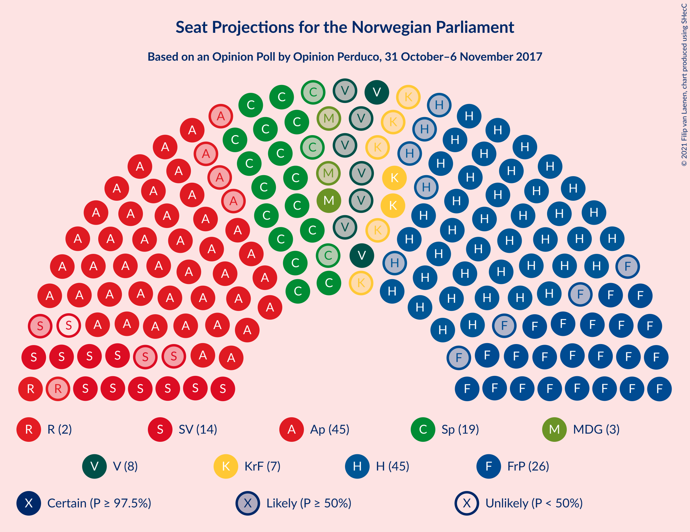

### Confidence Intervals

| Party | Last Result | Median | 80% Confidence Interval | 90% Confidence Interval | 95% Confidence Interval | 99% Confidence Interval |
|:-----:|:-----------:|:------:|:-----------------------:|:-----------------------:|:-----------------------:|:-----------------------:|
| <a href="#høyre">Høyre</a> | 45 | 45 | 42–51 |41–52 |40–53 |39–54 |
| <a href="#arbeiderpartiet">Arbeiderpartiet</a> | 49 | 45 | 42–49 |41–49 |41–50 |39–54 |
| <a href="#fremskrittspartiet">Fremskrittspartiet</a> | 27 | 26 | 24–29 |23–30 |22–31 |21–33 |
| <a href="#senterpartiet">Senterpartiet</a> | 19 | 19 | 17–23 |17–24 |16–25 |15–26 |
| <a href="#sosialistisk-venstreparti">Sosialistisk Venstreparti</a> | 11 | 13 | 11–14 |11–16 |10–16 |9–17 |
| <a href="#venstre">Venstre</a> | 8 | 8 | 2–9 |2–10 |2–10 |2–12 |
| <a href="#kristelig-folkeparti">Kristelig Folkeparti</a> | 8 | 7 | 3–8 |3–9 |2–9 |1–11 |
| <a href="#miljøpartiet-de-grønne">Miljøpartiet De Grønne</a> | 1 | 3 | 1–9 |1–9 |1–9 |1–10 |
| <a href="#rødt">Rødt</a> | 1 | 2 | 1–2 |1–2 |1–7 |1–8 |

### Høyre

*For a full overview of the results for this party, see the [Høyre](party-høyre.html) page.*

| Number of Seats | Probability | Accumulated | Special Marks |
|:---------------:|:-----------:|:-----------:|:-------------:|
| 37 | 0.1% | 100% |  |
| 38 | 0.4% | 99.9% |  |
| 39 | 1.3% | 99.5% |  |
| 40 | 1.1% | 98% |  |
| 41 | 3% | 97% |  |
| 42 | 7% | 94% |  |
| 43 | 13% | 87% |  |
| 44 | 5% | 74% |  |
| 45 | 19% | 68% | Last Result, Median |
| 46 | 20% | 49% |  |
| 47 | 3% | 29% |  |
| 48 | 7% | 26% |  |
| 49 | 5% | 19% |  |
| 50 | 3% | 14% |  |
| 51 | 4% | 11% |  |
| 52 | 3% | 7% |  |
| 53 | 3% | 4% |  |
| 54 | 1.1% | 1.4% |  |
| 55 | 0.3% | 0.4% |  |
| 56 | 0.1% | 0.1% |  |
| 57 | 0% | 0% |  |

### Arbeiderpartiet

*For a full overview of the results for this party, see the [Arbeiderpartiet](party-arbeiderpartiet.html) page.*

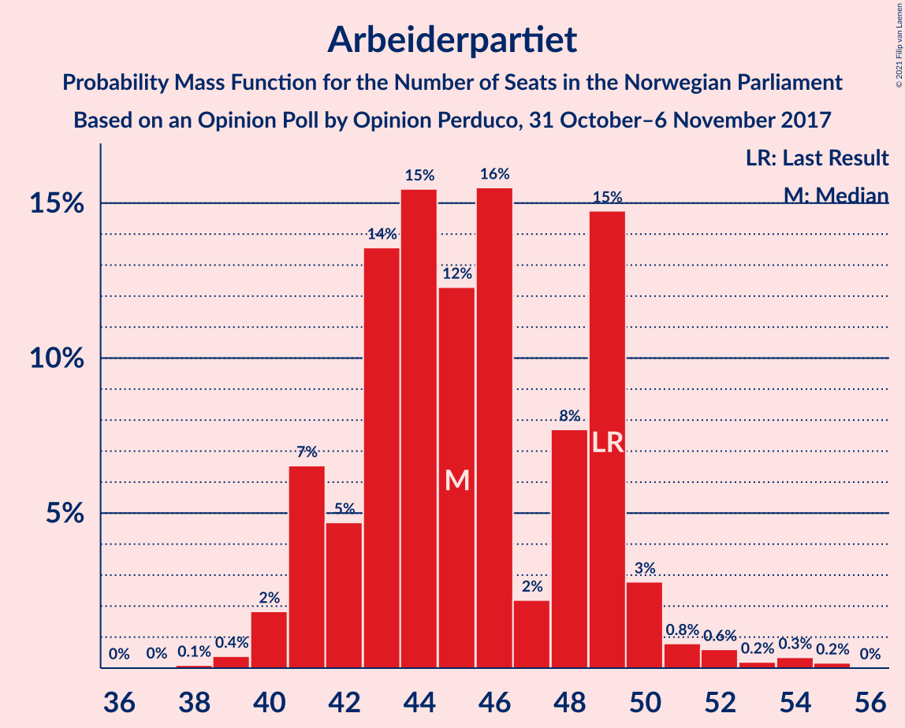

| Number of Seats | Probability | Accumulated | Special Marks |
|:---------------:|:-----------:|:-----------:|:-------------:|
| 37 | 0% | 100% |  |
| 38 | 0.1% | 99.9% |  |
| 39 | 0.4% | 99.8% |  |
| 40 | 2% | 99.4% |  |
| 41 | 7% | 98% |  |
| 42 | 5% | 91% |  |
| 43 | 14% | 86% |  |
| 44 | 15% | 73% |  |
| 45 | 12% | 57% | Median |
| 46 | 16% | 45% |  |
| 47 | 2% | 30% |  |
| 48 | 8% | 27% |  |
| 49 | 15% | 20% | Last Result |
| 50 | 3% | 5% |  |
| 51 | 0.8% | 2% |  |
| 52 | 0.6% | 1.3% |  |
| 53 | 0.2% | 0.7% |  |
| 54 | 0.3% | 0.5% |  |
| 55 | 0.2% | 0.2% |  |
| 56 | 0% | 0% |  |

### Fremskrittspartiet

*For a full overview of the results for this party, see the [Fremskrittspartiet](party-fremskrittspartiet.html) page.*

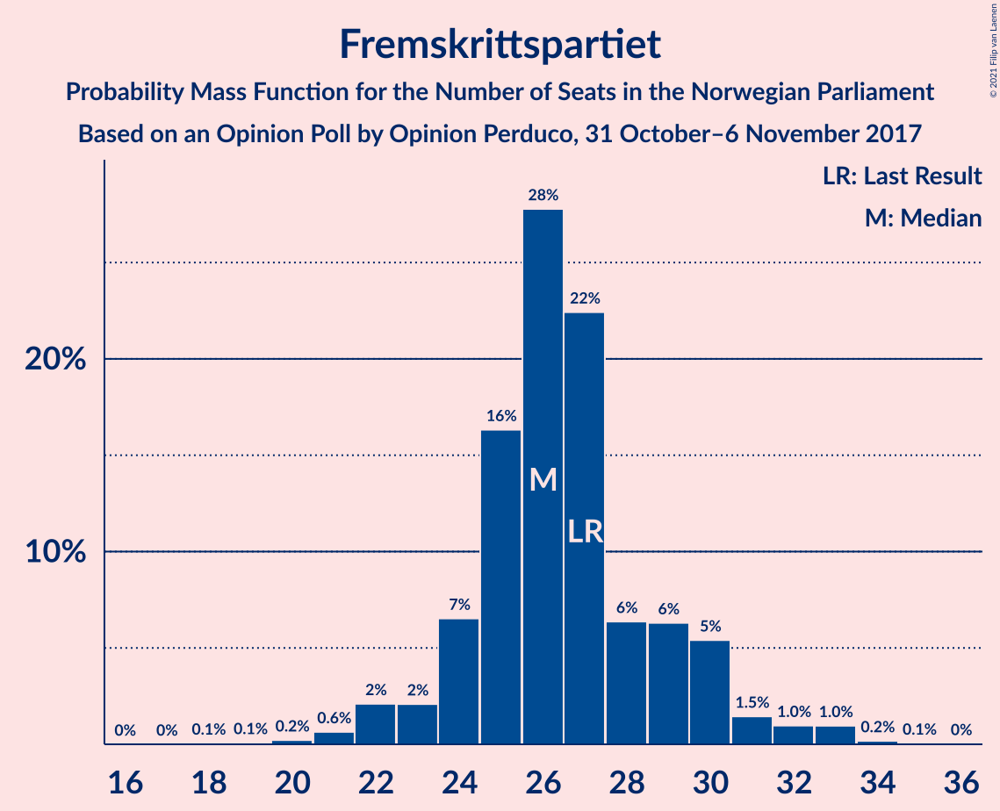

| Number of Seats | Probability | Accumulated | Special Marks |
|:---------------:|:-----------:|:-----------:|:-------------:|
| 18 | 0.1% | 100% |  |
| 19 | 0.1% | 99.9% |  |
| 20 | 0.2% | 99.9% |  |
| 21 | 0.6% | 99.6% |  |
| 22 | 2% | 99.0% |  |
| 23 | 2% | 97% |  |
| 24 | 7% | 95% |  |
| 25 | 16% | 88% |  |
| 26 | 28% | 72% | Median |
| 27 | 22% | 44% | Last Result |
| 28 | 6% | 22% |  |
| 29 | 6% | 15% |  |
| 30 | 5% | 9% |  |
| 31 | 1.5% | 4% |  |
| 32 | 1.0% | 2% |  |
| 33 | 1.0% | 1.2% |  |
| 34 | 0.2% | 0.3% |  |
| 35 | 0.1% | 0.1% |  |
| 36 | 0% | 0% |  |

### Senterpartiet

*For a full overview of the results for this party, see the [Senterpartiet](party-senterpartiet.html) page.*

| Number of Seats | Probability | Accumulated | Special Marks |
|:---------------:|:-----------:|:-----------:|:-------------:|
| 14 | 0.1% | 100% |  |
| 15 | 0.4% | 99.8% |  |
| 16 | 2% | 99.4% |  |
| 17 | 13% | 97% |  |
| 18 | 10% | 84% |  |
| 19 | 28% | 74% | Last Result, Median |
| 20 | 10% | 46% |  |
| 21 | 6% | 36% |  |
| 22 | 19% | 31% |  |
| 23 | 6% | 11% |  |
| 24 | 3% | 6% |  |
| 25 | 2% | 3% |  |
| 26 | 0.2% | 0.6% |  |
| 27 | 0.2% | 0.3% |  |
| 28 | 0.1% | 0.1% |  |
| 29 | 0% | 0% |  |

### Sosialistisk Venstreparti

*For a full overview of the results for this party, see the [Sosialistisk Venstreparti](party-sosialistiskvenstreparti.html) page.*

| Number of Seats | Probability | Accumulated | Special Marks |
|:---------------:|:-----------:|:-----------:|:-------------:|
| 8 | 0.1% | 100% |  |
| 9 | 1.3% | 99.9% |  |
| 10 | 2% | 98.6% |  |
| 11 | 14% | 96% | Last Result |
| 12 | 26% | 83% |  |
| 13 | 20% | 57% | Median |
| 14 | 29% | 37% |  |
| 15 | 3% | 8% |  |
| 16 | 3% | 5% |  |
| 17 | 1.2% | 2% |  |
| 18 | 0.3% | 0.5% |  |
| 19 | 0.2% | 0.2% |  |
| 20 | 0% | 0% |  |

### Venstre

*For a full overview of the results for this party, see the [Venstre](party-venstre.html) page.*

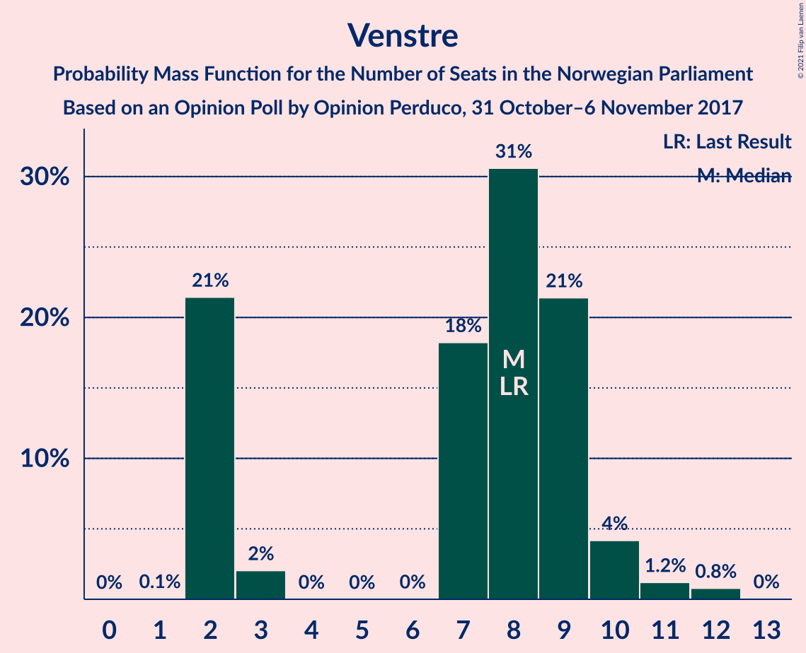

| Number of Seats | Probability | Accumulated | Special Marks |
|:---------------:|:-----------:|:-----------:|:-------------:|
| 1 | 0.1% | 100% |  |
| 2 | 21% | 99.9% |  |
| 3 | 2% | 79% |  |
| 4 | 0% | 76% |  |
| 5 | 0% | 76% |  |
| 6 | 0% | 76% |  |
| 7 | 18% | 76% |  |
| 8 | 31% | 58% | Last Result, Median |
| 9 | 21% | 28% |  |
| 10 | 4% | 6% |  |
| 11 | 1.2% | 2% |  |
| 12 | 0.8% | 0.8% |  |
| 13 | 0% | 0% |  |

### Kristelig Folkeparti

*For a full overview of the results for this party, see the [Kristelig Folkeparti](party-kristeligfolkeparti.html) page.*

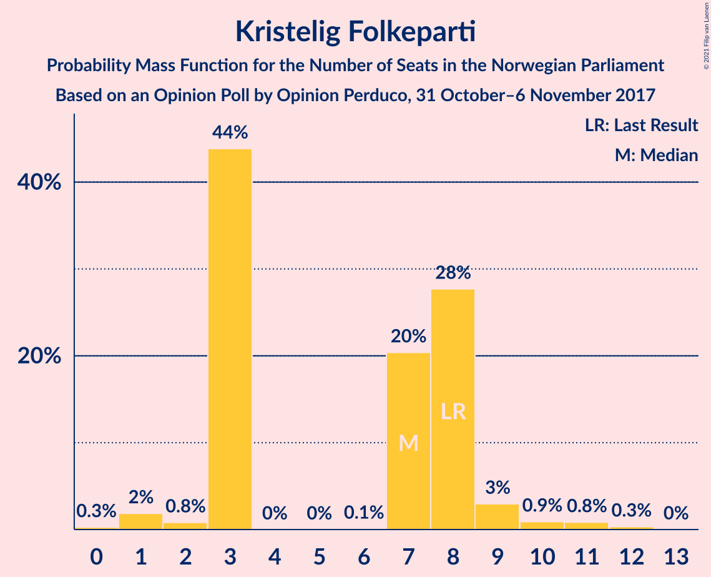

| Number of Seats | Probability | Accumulated | Special Marks |
|:---------------:|:-----------:|:-----------:|:-------------:|
| 0 | 0.3% | 100% |  |
| 1 | 2% | 99.7% |  |
| 2 | 0.8% | 98% |  |
| 3 | 44% | 97% |  |
| 4 | 0% | 53% |  |
| 5 | 0% | 53% |  |
| 6 | 0.1% | 53% |  |
| 7 | 20% | 53% | Median |
| 8 | 28% | 33% | Last Result |
| 9 | 3% | 5% |  |
| 10 | 0.9% | 2% |  |
| 11 | 0.8% | 1.2% |  |
| 12 | 0.3% | 0.3% |  |
| 13 | 0% | 0% |  |

### Miljøpartiet De Grønne

*For a full overview of the results for this party, see the [Miljøpartiet De Grønne](party-miljøpartietdegrønne.html) page.*

| Number of Seats | Probability | Accumulated | Special Marks |
|:---------------:|:-----------:|:-----------:|:-------------:|
| 1 | 11% | 100% | Last Result |
| 2 | 36% | 89% |  |
| 3 | 12% | 53% | Median |
| 4 | 0.1% | 41% |  |
| 5 | 0% | 41% |  |
| 6 | 0% | 41% |  |
| 7 | 8% | 41% |  |
| 8 | 21% | 32% |  |
| 9 | 10% | 12% |  |
| 10 | 0.9% | 1.3% |  |
| 11 | 0.3% | 0.4% |  |
| 12 | 0.1% | 0.1% |  |
| 13 | 0% | 0% |  |

### Rødt

*For a full overview of the results for this party, see the [Rødt](party-rødt.html) page.*

| Number of Seats | Probability | Accumulated | Special Marks |
|:---------------:|:-----------:|:-----------:|:-------------:|
| 0 | 0.1% | 100% |  |
| 1 | 44% | 99.9% | Last Result |
| 2 | 51% | 56% | Median |
| 3 | 0% | 5% |  |
| 4 | 0% | 5% |  |
| 5 | 0% | 5% |  |
| 6 | 0.1% | 5% |  |
| 7 | 3% | 5% |  |
| 8 | 1.3% | 2% |  |
| 9 | 0.2% | 0.3% |  |
| 10 | 0% | 0% |  |

## Coalitions

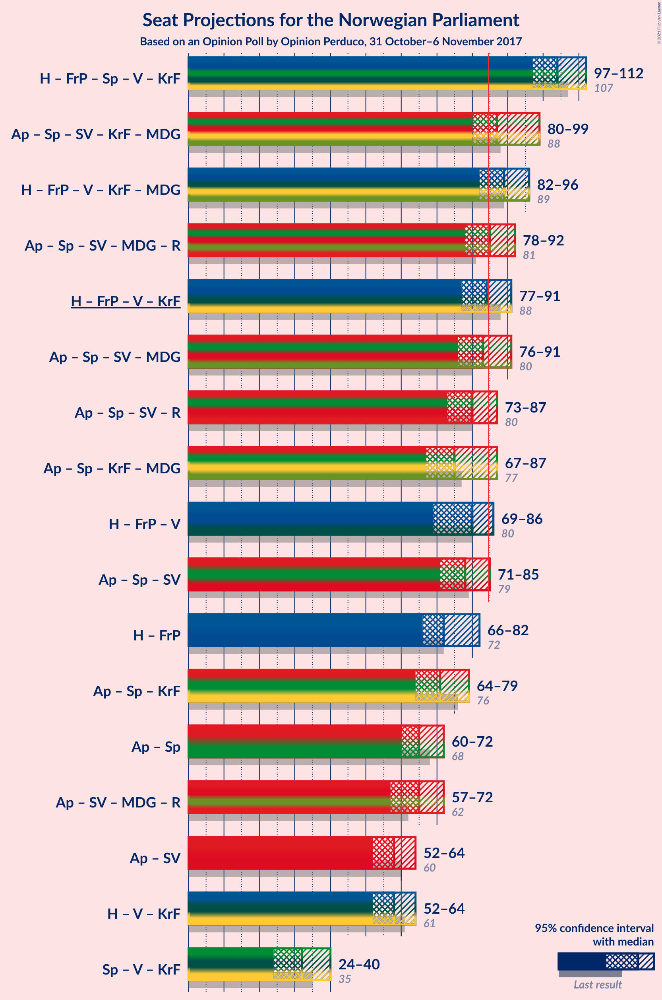

### Confidence Intervals

| Coalition | Last Result | Median | Majority? | 80% Confidence Interval | 90% Confidence Interval | 95% Confidence Interval | 99% Confidence Interval |
|:---------:|:-----------:|:------:|:---------:|:-----------------------:|:-----------------------:|:-----------------------:|:-----------------------:|
| Høyre – Fremskrittspartiet – Senterpartiet – Venstre – Kristelig Folkeparti | 107 | 104 | 100% | 101–109 | 99–111 | 97–112 | 95–113 |
| Arbeiderpartiet – Senterpartiet – Sosialistisk Venstreparti – Kristelig Folkeparti – Miljøpartiet De Grønne | 88 | 87 | 85% | 83–93 | 82–96 | 80–99 | 77–99 |
| Høyre – Fremskrittspartiet – Venstre – Kristelig Folkeparti – Miljøpartiet De Grønne | 89 | 89 | 92% | 85–94 | 83–96 | 82–96 | 79–97 |
| Arbeiderpartiet – Senterpartiet – Sosialistisk Venstreparti – Miljøpartiet De Grønne – Rødt | 81 | 85 | 63% | 80–89 | 79–92 | 78–92 | 76–94 |
| Høyre – Fremskrittspartiet – Venstre – Kristelig Folkeparti | 88 | 84 | 37% | 80–89 | 77–90 | 77–91 | 75–93 |
| Arbeiderpartiet – Senterpartiet – Sosialistisk Venstreparti – Miljøpartiet De Grønne | 80 | 83 | 16% | 78–87 | 77–89 | 76–91 | 74–93 |
| Arbeiderpartiet – Senterpartiet – Sosialistisk Venstreparti – Rødt | 80 | 80 | 8% | 75–84 | 73–86 | 73–87 | 72–90 |
| Arbeiderpartiet – Senterpartiet – Kristelig Folkeparti – Miljøpartiet De Grønne | 77 | 75 | 4% | 71–80 | 69–83 | 67–87 | 65–87 |
| Høyre – Fremskrittspartiet – Venstre | 80 | 80 | 9% | 74–84 | 71–85 | 69–86 | 68–89 |
| Arbeiderpartiet – Senterpartiet – Sosialistisk Venstreparti | 79 | 78 | 4% | 73–82 | 72–84 | 71–85 | 70–87 |
| Høyre – Fremskrittspartiet | 72 | 72 | 0% | 69–77 | 67–79 | 66–82 | 63–84 |
| Arbeiderpartiet – Senterpartiet – Kristelig Folkeparti | 76 | 71 | 0% | 67–76 | 66–79 | 64–79 | 62–82 |
| Arbeiderpartiet – Senterpartiet | 68 | 65 | 0% | 61–70 | 60–71 | 60–72 | 58–75 |
| Arbeiderpartiet – Sosialistisk Venstreparti – Miljøpartiet De Grønne – Rødt | 62 | 65 | 0% | 60–68 | 58–70 | 57–72 | 56–74 |
| Arbeiderpartiet – Sosialistisk Venstreparti | 60 | 58 | 0% | 54–63 | 53–63 | 52–64 | 51–66 |
| Høyre – Venstre – Kristelig Folkeparti | 61 | 58 | 0% | 54–62 | 52–63 | 52–64 | 48–66 |
| Senterpartiet – Venstre – Kristelig Folkeparti | 35 | 32 | 0% | 28–37 | 25–38 | 24–40 | 23–41 |

### Høyre – Fremskrittspartiet – Senterpartiet – Venstre – Kristelig Folkeparti

| Number of Seats | Probability | Accumulated | Special Marks |
|:---------------:|:-----------:|:-----------:|:-------------:|
| 91 | 0.1% | 100% |  |
| 92 | 0% | 99.9% |  |
| 93 | 0.1% | 99.9% |  |
| 94 | 0.2% | 99.8% |  |
| 95 | 0.6% | 99.6% |  |
| 96 | 0.2% | 98.9% |  |
| 97 | 1.4% | 98.7% |  |
| 98 | 0.7% | 97% |  |
| 99 | 4% | 97% |  |
| 100 | 2% | 93% |  |
| 101 | 13% | 91% |  |
| 102 | 14% | 78% |  |
| 103 | 8% | 64% |  |
| 104 | 7% | 57% |  |
| 105 | 7% | 49% | Median |
| 106 | 15% | 42% |  |
| 107 | 12% | 27% | Last Result |
| 108 | 3% | 16% |  |
| 109 | 4% | 13% |  |
| 110 | 2% | 9% |  |
| 111 | 3% | 7% |  |
| 112 | 3% | 4% |  |
| 113 | 1.1% | 1.3% |  |
| 114 | 0% | 0.3% |  |
| 115 | 0.2% | 0.2% |  |
| 116 | 0% | 0.1% |  |
| 117 | 0% | 0% |  |

### Arbeiderpartiet – Senterpartiet – Sosialistisk Venstreparti – Kristelig Folkeparti – Miljøpartiet De Grønne

| Number of Seats | Probability | Accumulated | Special Marks |
|:---------------:|:-----------:|:-----------:|:-------------:|
| 76 | 0% | 100% |  |
| 77 | 0.7% | 99.9% |  |
| 78 | 0.2% | 99.2% |  |
| 79 | 1.0% | 99.0% |  |
| 80 | 0.9% | 98% |  |
| 81 | 0.7% | 97% |  |
| 82 | 3% | 96% |  |
| 83 | 6% | 94% |  |
| 84 | 2% | 88% |  |
| 85 | 5% | 85% | Majority |
| 86 | 12% | 80% |  |
| 87 | 22% | 68% | Median |
| 88 | 9% | 46% | Last Result |
| 89 | 4% | 38% |  |
| 90 | 3% | 34% |  |
| 91 | 17% | 30% |  |
| 92 | 3% | 13% |  |
| 93 | 2% | 11% |  |
| 94 | 1.0% | 9% |  |
| 95 | 2% | 8% |  |
| 96 | 1.4% | 6% |  |
| 97 | 0.8% | 4% |  |
| 98 | 0.5% | 3% |  |
| 99 | 3% | 3% |  |
| 100 | 0.3% | 0.4% |  |
| 101 | 0.1% | 0.1% |  |
| 102 | 0% | 0% |  |

### Høyre – Fremskrittspartiet – Venstre – Kristelig Folkeparti – Miljøpartiet De Grønne

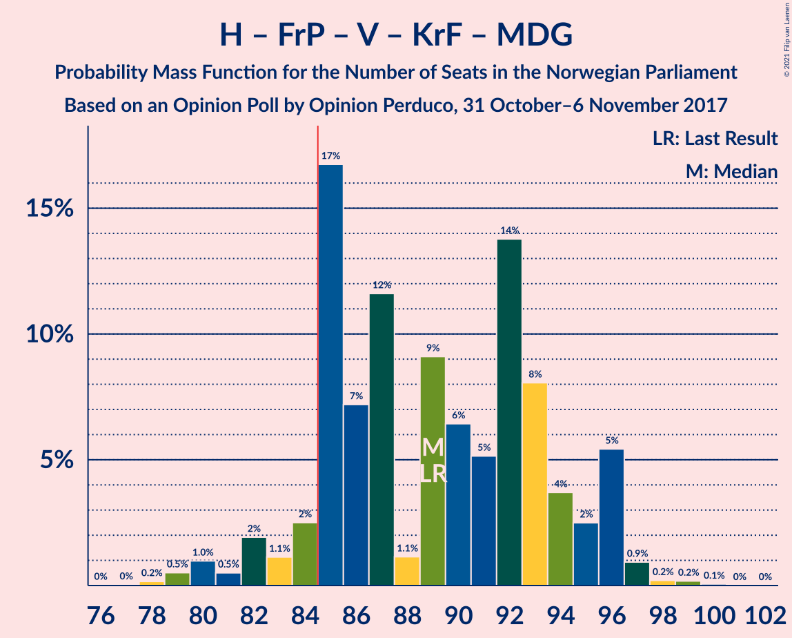

| Number of Seats | Probability | Accumulated | Special Marks |
|:---------------:|:-----------:|:-----------:|:-------------:|
| 77 | 0% | 100% |  |
| 78 | 0.2% | 99.9% |  |
| 79 | 0.5% | 99.8% |  |
| 80 | 1.0% | 99.3% |  |
| 81 | 0.5% | 98% |  |
| 82 | 2% | 98% |  |
| 83 | 1.1% | 96% |  |
| 84 | 2% | 95% |  |
| 85 | 17% | 92% | Majority |
| 86 | 7% | 75% |  |
| 87 | 12% | 68% |  |
| 88 | 1.1% | 57% |  |
| 89 | 9% | 56% | Last Result, Median |
| 90 | 6% | 46% |  |
| 91 | 5% | 40% |  |
| 92 | 14% | 35% |  |
| 93 | 8% | 21% |  |
| 94 | 4% | 13% |  |
| 95 | 2% | 9% |  |
| 96 | 5% | 7% |  |
| 97 | 0.9% | 1.4% |  |
| 98 | 0.2% | 0.5% |  |
| 99 | 0.2% | 0.3% |  |
| 100 | 0.1% | 0.1% |  |
| 101 | 0% | 0% |  |

### Arbeiderpartiet – Senterpartiet – Sosialistisk Venstreparti – Miljøpartiet De Grønne – Rødt

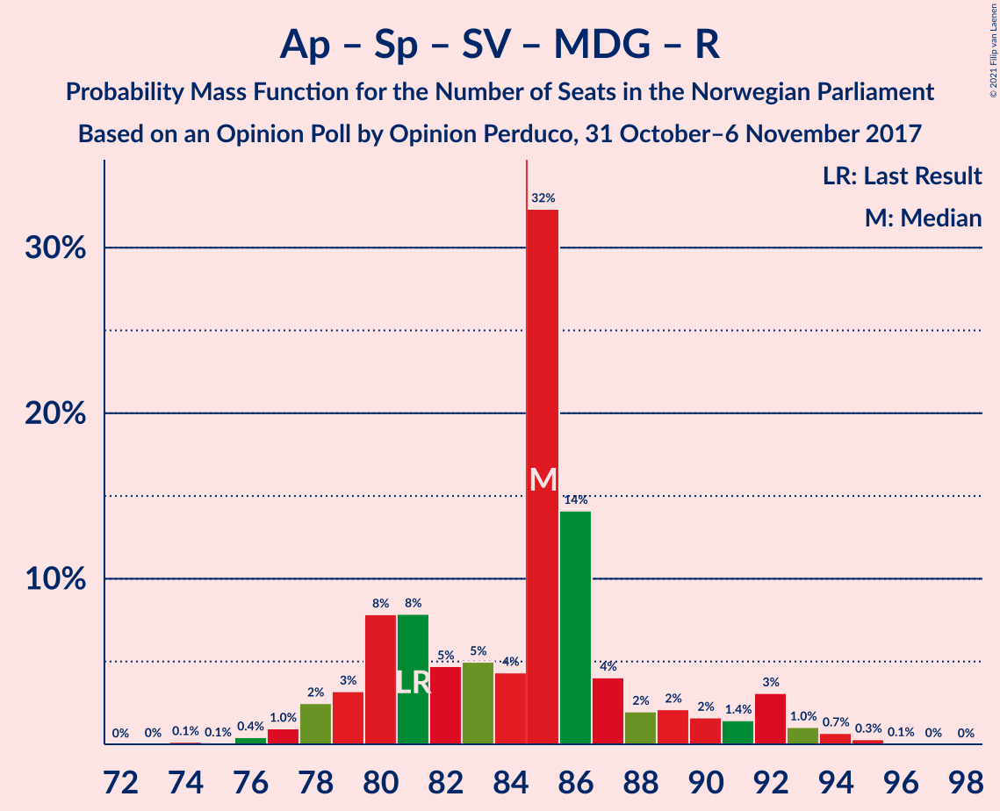

| Number of Seats | Probability | Accumulated | Special Marks |
|:---------------:|:-----------:|:-----------:|:-------------:|
| 73 | 0% | 100% |  |
| 74 | 0.1% | 99.9% |  |
| 75 | 0.1% | 99.8% |  |
| 76 | 0.4% | 99.7% |  |
| 77 | 1.0% | 99.3% |  |
| 78 | 2% | 98% |  |
| 79 | 3% | 96% |  |
| 80 | 8% | 93% |  |
| 81 | 8% | 85% | Last Result |
| 82 | 5% | 77% | Median |
| 83 | 5% | 72% |  |
| 84 | 4% | 67% |  |
| 85 | 32% | 63% | Majority |
| 86 | 14% | 31% |  |
| 87 | 4% | 16% |  |
| 88 | 2% | 12% |  |
| 89 | 2% | 10% |  |
| 90 | 2% | 8% |  |
| 91 | 1.4% | 7% |  |
| 92 | 3% | 5% |  |
| 93 | 1.0% | 2% |  |
| 94 | 0.7% | 1.1% |  |
| 95 | 0.3% | 0.4% |  |
| 96 | 0.1% | 0.1% |  |
| 97 | 0% | 0.1% |  |
| 98 | 0% | 0% |  |

### Høyre – Fremskrittspartiet – Venstre – Kristelig Folkeparti

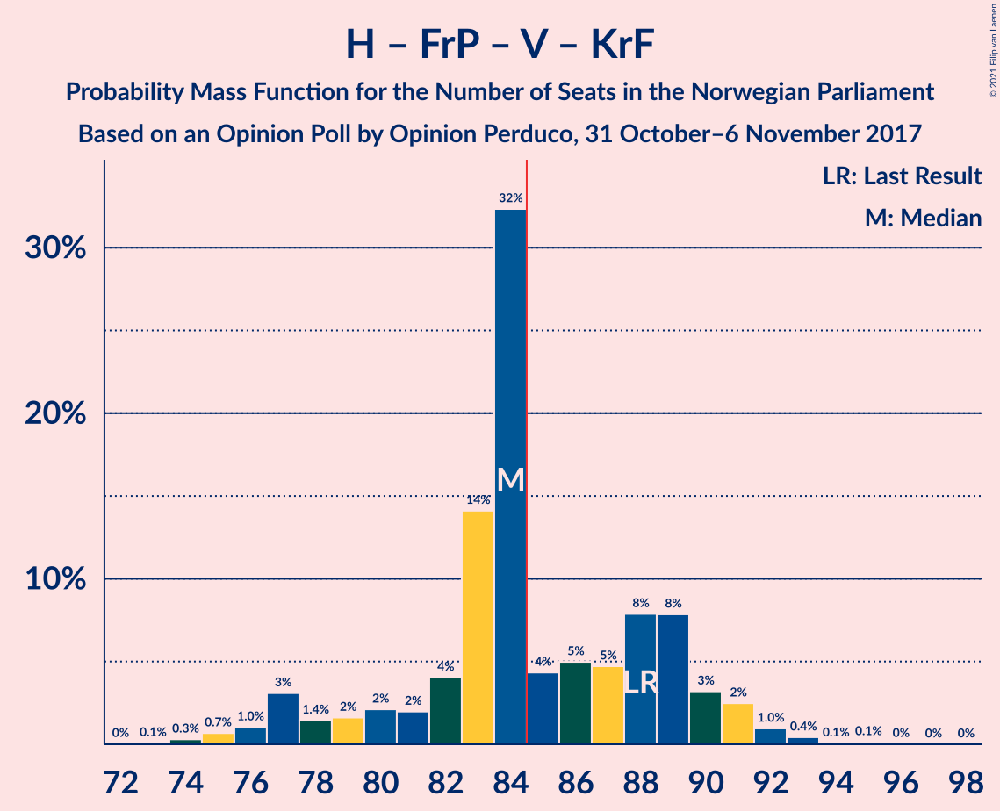

| Number of Seats | Probability | Accumulated | Special Marks |
|:---------------:|:-----------:|:-----------:|:-------------:|
| 72 | 0% | 100% |  |
| 73 | 0.1% | 99.9% |  |
| 74 | 0.3% | 99.9% |  |
| 75 | 0.7% | 99.6% |  |
| 76 | 1.0% | 98.9% |  |
| 77 | 3% | 98% |  |
| 78 | 1.4% | 95% |  |
| 79 | 2% | 93% |  |
| 80 | 2% | 92% |  |
| 81 | 2% | 90% |  |
| 82 | 4% | 88% |  |
| 83 | 14% | 84% |  |
| 84 | 32% | 69% |  |
| 85 | 4% | 37% | Majority |
| 86 | 5% | 33% | Median |
| 87 | 5% | 28% |  |
| 88 | 8% | 23% | Last Result |
| 89 | 8% | 15% |  |
| 90 | 3% | 7% |  |
| 91 | 2% | 4% |  |
| 92 | 1.0% | 2% |  |
| 93 | 0.4% | 0.7% |  |
| 94 | 0.1% | 0.3% |  |
| 95 | 0.1% | 0.2% |  |
| 96 | 0% | 0.1% |  |
| 97 | 0% | 0% |  |

### Arbeiderpartiet – Senterpartiet – Sosialistisk Venstreparti – Miljøpartiet De Grønne

| Number of Seats | Probability | Accumulated | Special Marks |
|:---------------:|:-----------:|:-----------:|:-------------:|
| 72 | 0.1% | 100% |  |
| 73 | 0.2% | 99.9% |  |
| 74 | 0.8% | 99.7% |  |
| 75 | 0.5% | 98.9% |  |
| 76 | 2% | 98% |  |
| 77 | 2% | 97% |  |
| 78 | 5% | 94% |  |
| 79 | 9% | 89% |  |
| 80 | 9% | 80% | Last Result, Median |
| 81 | 5% | 72% |  |
| 82 | 5% | 67% |  |
| 83 | 22% | 62% |  |
| 84 | 24% | 40% |  |
| 85 | 4% | 16% | Majority |
| 86 | 2% | 12% |  |
| 87 | 3% | 10% |  |
| 88 | 1.3% | 8% |  |
| 89 | 2% | 6% |  |
| 90 | 0.8% | 5% |  |
| 91 | 3% | 4% |  |
| 92 | 0.4% | 1.2% |  |
| 93 | 0.6% | 0.8% |  |
| 94 | 0.2% | 0.2% |  |
| 95 | 0% | 0% |  |

### Arbeiderpartiet – Senterpartiet – Sosialistisk Venstreparti – Rødt

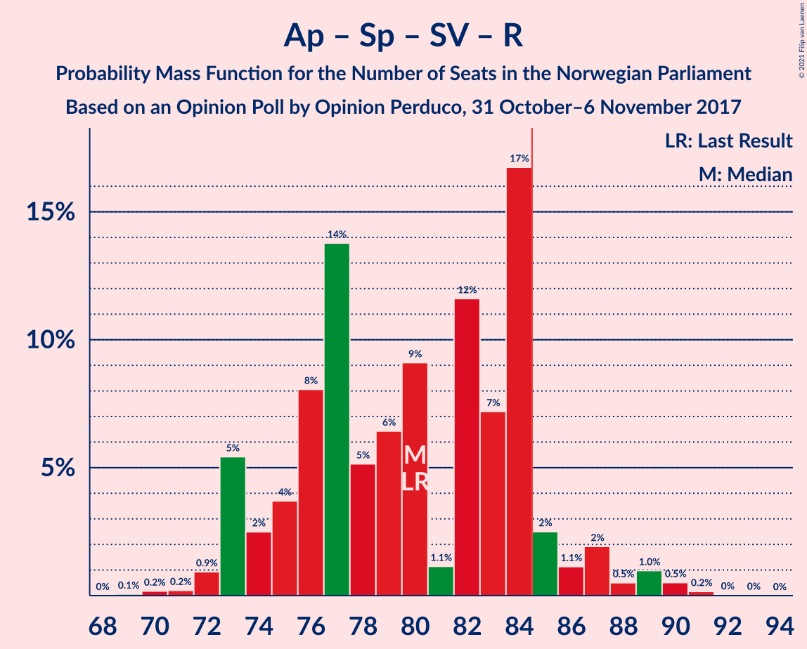

| Number of Seats | Probability | Accumulated | Special Marks |
|:---------------:|:-----------:|:-----------:|:-------------:|
| 69 | 0.1% | 100% |  |
| 70 | 0.2% | 99.9% |  |
| 71 | 0.2% | 99.7% |  |
| 72 | 0.9% | 99.5% |  |
| 73 | 5% | 98.6% |  |
| 74 | 2% | 93% |  |
| 75 | 4% | 91% |  |
| 76 | 8% | 87% |  |
| 77 | 14% | 79% |  |
| 78 | 5% | 65% |  |
| 79 | 6% | 60% | Median |
| 80 | 9% | 54% | Last Result |
| 81 | 1.1% | 44% |  |
| 82 | 12% | 43% |  |
| 83 | 7% | 32% |  |
| 84 | 17% | 25% |  |
| 85 | 2% | 8% | Majority |
| 86 | 1.1% | 5% |  |
| 87 | 2% | 4% |  |
| 88 | 0.5% | 2% |  |
| 89 | 1.0% | 2% |  |
| 90 | 0.5% | 0.7% |  |
| 91 | 0.2% | 0.2% |  |
| 92 | 0% | 0.1% |  |
| 93 | 0% | 0% |  |

### Arbeiderpartiet – Senterpartiet – Kristelig Folkeparti – Miljøpartiet De Grønne

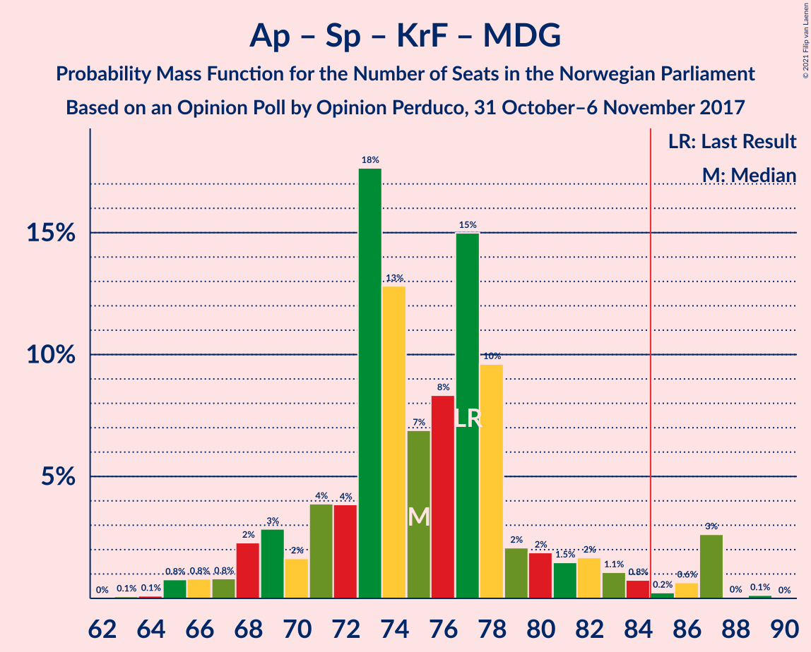

| Number of Seats | Probability | Accumulated | Special Marks |
|:---------------:|:-----------:|:-----------:|:-------------:|
| 63 | 0.1% | 100% |  |
| 64 | 0.1% | 99.9% |  |
| 65 | 0.8% | 99.8% |  |
| 66 | 0.8% | 99.0% |  |
| 67 | 0.8% | 98% |  |
| 68 | 2% | 97% |  |
| 69 | 3% | 95% |  |
| 70 | 2% | 92% |  |
| 71 | 4% | 91% |  |
| 72 | 4% | 87% |  |
| 73 | 18% | 83% |  |
| 74 | 13% | 65% | Median |
| 75 | 7% | 52% |  |
| 76 | 8% | 46% |  |
| 77 | 15% | 37% | Last Result |
| 78 | 10% | 22% |  |
| 79 | 2% | 13% |  |
| 80 | 2% | 11% |  |
| 81 | 1.5% | 9% |  |
| 82 | 2% | 7% |  |
| 83 | 1.1% | 6% |  |
| 84 | 0.8% | 4% |  |
| 85 | 0.2% | 4% | Majority |
| 86 | 0.6% | 3% |  |
| 87 | 3% | 3% |  |
| 88 | 0% | 0.2% |  |
| 89 | 0.1% | 0.1% |  |
| 90 | 0% | 0% |  |

### Høyre – Fremskrittspartiet – Venstre

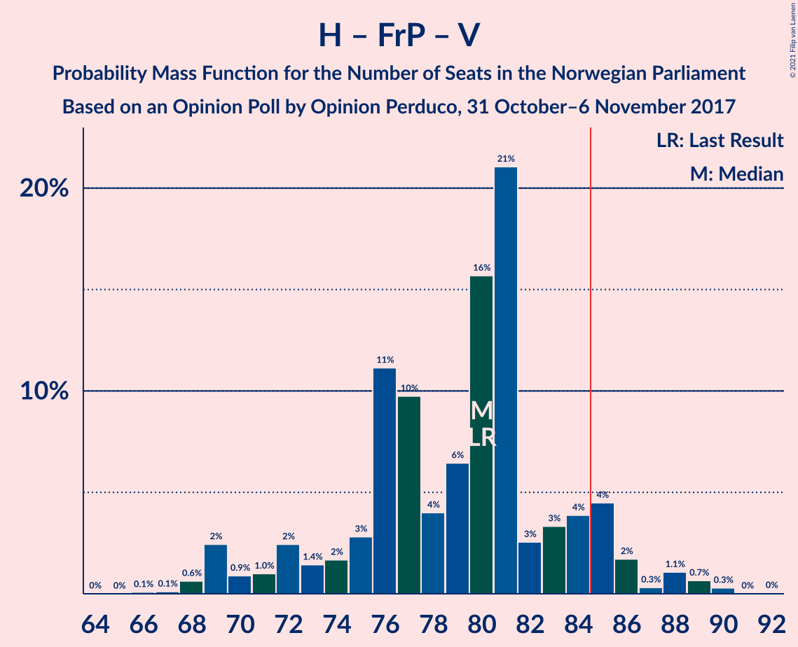

| Number of Seats | Probability | Accumulated | Special Marks |
|:---------------:|:-----------:|:-----------:|:-------------:|
| 66 | 0.1% | 100% |  |
| 67 | 0.1% | 99.9% |  |
| 68 | 0.6% | 99.8% |  |
| 69 | 2% | 99.1% |  |
| 70 | 0.9% | 97% |  |
| 71 | 1.0% | 96% |  |
| 72 | 2% | 95% |  |
| 73 | 1.4% | 92% |  |
| 74 | 2% | 91% |  |
| 75 | 3% | 89% |  |
| 76 | 11% | 86% |  |
| 77 | 10% | 75% |  |
| 78 | 4% | 66% |  |
| 79 | 6% | 62% | Median |
| 80 | 16% | 55% | Last Result |
| 81 | 21% | 39% |  |
| 82 | 3% | 18% |  |
| 83 | 3% | 16% |  |
| 84 | 4% | 12% |  |
| 85 | 4% | 9% | Majority |
| 86 | 2% | 4% |  |
| 87 | 0.3% | 2% |  |
| 88 | 1.1% | 2% |  |
| 89 | 0.7% | 1.0% |  |
| 90 | 0.3% | 0.4% |  |
| 91 | 0% | 0.1% |  |
| 92 | 0% | 0% |  |

### Arbeiderpartiet – Senterpartiet – Sosialistisk Venstreparti

| Number of Seats | Probability | Accumulated | Special Marks |
|:---------------:|:-----------:|:-----------:|:-------------:|
| 67 | 0% | 100% |  |
| 68 | 0.1% | 99.9% |  |
| 69 | 0.2% | 99.8% |  |
| 70 | 0.3% | 99.6% |  |
| 71 | 2% | 99.3% |  |
| 72 | 5% | 97% |  |
| 73 | 4% | 92% |  |
| 74 | 3% | 88% |  |
| 75 | 18% | 85% |  |
| 76 | 7% | 66% |  |
| 77 | 4% | 59% | Median |
| 78 | 10% | 56% |  |
| 79 | 4% | 45% | Last Result |
| 80 | 11% | 41% |  |
| 81 | 2% | 30% |  |
| 82 | 19% | 29% |  |
| 83 | 4% | 10% |  |
| 84 | 2% | 6% |  |
| 85 | 2% | 4% | Majority |
| 86 | 1.0% | 2% |  |
| 87 | 0.6% | 1.0% |  |
| 88 | 0.2% | 0.4% |  |
| 89 | 0.1% | 0.2% |  |
| 90 | 0.1% | 0.1% |  |
| 91 | 0% | 0% |  |

### Høyre – Fremskrittspartiet

| Number of Seats | Probability | Accumulated | Special Marks |
|:---------------:|:-----------:|:-----------:|:-------------:|
| 61 | 0% | 100% |  |
| 62 | 0.4% | 99.9% |  |
| 63 | 0.1% | 99.5% |  |
| 64 | 0.3% | 99.4% |  |
| 65 | 0.6% | 99.0% |  |
| 66 | 2% | 98% |  |
| 67 | 4% | 96% |  |
| 68 | 2% | 92% |  |
| 69 | 13% | 91% |  |
| 70 | 12% | 77% |  |
| 71 | 3% | 65% | Median |
| 72 | 26% | 62% | Last Result |
| 73 | 10% | 36% |  |
| 74 | 3% | 26% |  |
| 75 | 5% | 24% |  |
| 76 | 3% | 19% |  |
| 77 | 8% | 16% |  |
| 78 | 1.1% | 8% |  |
| 79 | 3% | 7% |  |
| 80 | 0.6% | 4% |  |
| 81 | 0.4% | 3% |  |
| 82 | 2% | 3% |  |
| 83 | 0.7% | 1.4% |  |
| 84 | 0.7% | 0.7% |  |
| 85 | 0% | 0% | Majority |

### Arbeiderpartiet – Senterpartiet – Kristelig Folkeparti

| Number of Seats | Probability | Accumulated | Special Marks |
|:---------------:|:-----------:|:-----------:|:-------------:|
| 60 | 0.1% | 100% |  |
| 61 | 0.1% | 99.9% |  |
| 62 | 0.3% | 99.8% |  |
| 63 | 2% | 99.5% |  |
| 64 | 1.0% | 98% |  |
| 65 | 0.7% | 97% |  |
| 66 | 3% | 96% |  |
| 67 | 7% | 93% |  |
| 68 | 2% | 86% |  |
| 69 | 23% | 84% |  |
| 70 | 8% | 60% |  |
| 71 | 26% | 52% | Median |
| 72 | 6% | 26% |  |
| 73 | 6% | 21% |  |
| 74 | 1.3% | 14% |  |
| 75 | 3% | 13% |  |
| 76 | 3% | 10% | Last Result |
| 77 | 0.6% | 7% |  |
| 78 | 0.7% | 6% |  |
| 79 | 3% | 6% |  |
| 80 | 1.4% | 2% |  |
| 81 | 0.4% | 0.9% |  |
| 82 | 0.3% | 0.5% |  |
| 83 | 0.2% | 0.2% |  |
| 84 | 0% | 0% |  |

### Arbeiderpartiet – Senterpartiet

| Number of Seats | Probability | Accumulated | Special Marks |
|:---------------:|:-----------:|:-----------:|:-------------:|
| 56 | 0.1% | 100% |  |
| 57 | 0.3% | 99.9% |  |
| 58 | 0.4% | 99.6% |  |
| 59 | 1.3% | 99.2% |  |
| 60 | 4% | 98% |  |
| 61 | 15% | 94% |  |
| 62 | 10% | 79% |  |
| 63 | 6% | 69% |  |
| 64 | 9% | 63% | Median |
| 65 | 6% | 54% |  |
| 66 | 4% | 48% |  |
| 67 | 6% | 45% |  |
| 68 | 26% | 39% | Last Result |
| 69 | 3% | 13% |  |
| 70 | 3% | 10% |  |
| 71 | 4% | 7% |  |
| 72 | 2% | 3% |  |
| 73 | 0.7% | 1.5% |  |
| 74 | 0.2% | 0.8% |  |
| 75 | 0.5% | 0.6% |  |
| 76 | 0.1% | 0.1% |  |
| 77 | 0% | 0% |  |

### Arbeiderpartiet – Sosialistisk Venstreparti – Miljøpartiet De Grønne – Rødt

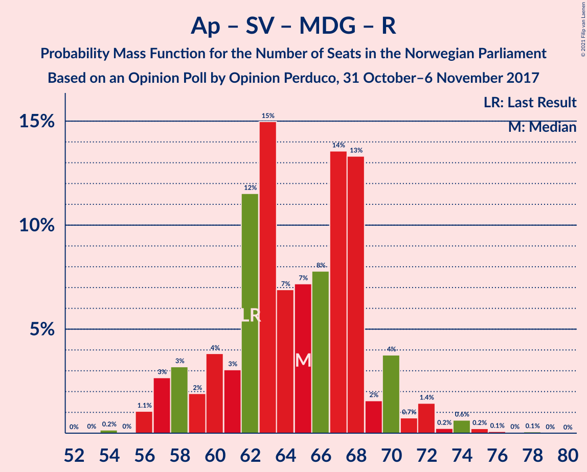

| Number of Seats | Probability | Accumulated | Special Marks |
|:---------------:|:-----------:|:-----------:|:-------------:|
| 53 | 0% | 100% |  |
| 54 | 0.2% | 99.9% |  |
| 55 | 0% | 99.8% |  |
| 56 | 1.1% | 99.7% |  |
| 57 | 3% | 98.7% |  |
| 58 | 3% | 96% |  |
| 59 | 2% | 93% |  |
| 60 | 4% | 91% |  |
| 61 | 3% | 87% |  |
| 62 | 12% | 84% | Last Result |
| 63 | 15% | 73% | Median |
| 64 | 7% | 58% |  |
| 65 | 7% | 51% |  |
| 66 | 8% | 43% |  |
| 67 | 14% | 36% |  |
| 68 | 13% | 22% |  |
| 69 | 2% | 9% |  |
| 70 | 4% | 7% |  |
| 71 | 0.7% | 3% |  |
| 72 | 1.4% | 3% |  |
| 73 | 0.2% | 1.3% |  |
| 74 | 0.6% | 1.1% |  |
| 75 | 0.2% | 0.4% |  |
| 76 | 0.1% | 0.2% |  |
| 77 | 0% | 0.1% |  |
| 78 | 0.1% | 0.1% |  |
| 79 | 0% | 0% |  |

### Arbeiderpartiet – Sosialistisk Venstreparti

| Number of Seats | Probability | Accumulated | Special Marks |
|:---------------:|:-----------:|:-----------:|:-------------:|
| 49 | 0.1% | 100% |  |
| 50 | 0.4% | 99.9% |  |
| 51 | 0.4% | 99.5% |  |
| 52 | 2% | 99.1% |  |
| 53 | 3% | 97% |  |
| 54 | 11% | 94% |  |
| 55 | 5% | 83% |  |
| 56 | 9% | 79% |  |
| 57 | 8% | 70% |  |
| 58 | 24% | 61% | Median |
| 59 | 6% | 38% |  |
| 60 | 5% | 32% | Last Result |
| 61 | 6% | 27% |  |
| 62 | 5% | 21% |  |
| 63 | 13% | 16% |  |
| 64 | 0.9% | 3% |  |
| 65 | 0.9% | 2% |  |
| 66 | 0.7% | 1.1% |  |
| 67 | 0.3% | 0.4% |  |
| 68 | 0.1% | 0.1% |  |
| 69 | 0.1% | 0.1% |  |
| 70 | 0% | 0% |  |

### Høyre – Venstre – Kristelig Folkeparti

| Number of Seats | Probability | Accumulated | Special Marks |
|:---------------:|:-----------:|:-----------:|:-------------:|
| 45 | 0% | 100% |  |
| 46 | 0.1% | 99.9% |  |
| 47 | 0.2% | 99.8% |  |
| 48 | 0.3% | 99.6% |  |
| 49 | 0.2% | 99.4% |  |
| 50 | 0.6% | 99.1% |  |
| 51 | 1.0% | 98.6% |  |
| 52 | 4% | 98% |  |
| 53 | 3% | 94% |  |
| 54 | 2% | 90% |  |
| 55 | 2% | 88% |  |
| 56 | 5% | 86% |  |
| 57 | 25% | 81% |  |
| 58 | 13% | 56% |  |
| 59 | 14% | 43% |  |
| 60 | 9% | 29% | Median |
| 61 | 6% | 20% | Last Result |
| 62 | 9% | 14% |  |
| 63 | 1.3% | 5% |  |
| 64 | 2% | 4% |  |
| 65 | 0.7% | 1.4% |  |
| 66 | 0.3% | 0.7% |  |
| 67 | 0.2% | 0.4% |  |
| 68 | 0.1% | 0.2% |  |
| 69 | 0.1% | 0.1% |  |
| 70 | 0.1% | 0.1% |  |
| 71 | 0% | 0% |  |

### Senterpartiet – Venstre – Kristelig Folkeparti

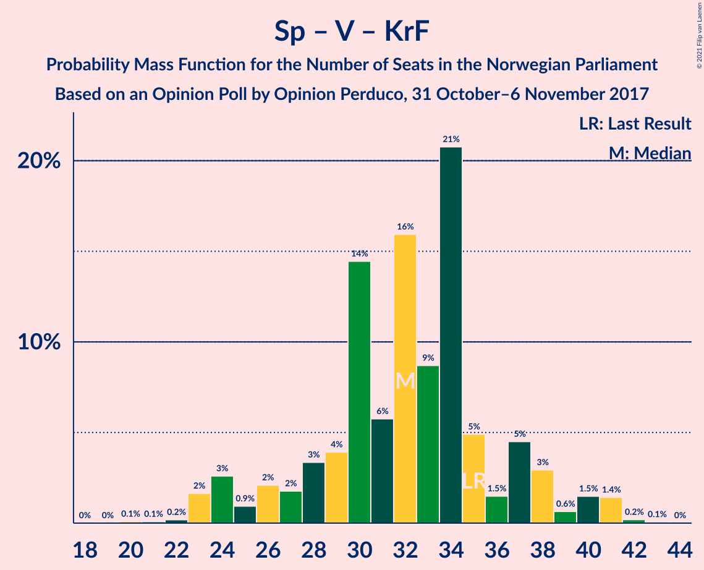

| Number of Seats | Probability | Accumulated | Special Marks |
|:---------------:|:-----------:|:-----------:|:-------------:|
| 20 | 0.1% | 100% |  |
| 21 | 0.1% | 99.9% |  |
| 22 | 0.2% | 99.8% |  |
| 23 | 2% | 99.6% |  |
| 24 | 3% | 98% |  |
| 25 | 0.9% | 95% |  |
| 26 | 2% | 94% |  |
| 27 | 2% | 92% |  |
| 28 | 3% | 91% |  |
| 29 | 4% | 87% |  |
| 30 | 14% | 83% |  |
| 31 | 6% | 69% |  |
| 32 | 16% | 63% |  |
| 33 | 9% | 47% |  |
| 34 | 21% | 38% | Median |
| 35 | 5% | 18% | Last Result |
| 36 | 1.5% | 13% |  |
| 37 | 5% | 11% |  |
| 38 | 3% | 7% |  |
| 39 | 0.6% | 4% |  |
| 40 | 1.5% | 3% |  |
| 41 | 1.4% | 2% |  |
| 42 | 0.2% | 0.3% |  |
| 43 | 0.1% | 0.1% |  |
| 44 | 0% | 0% |  |

## Technical Information

### Opinion Poll

+ **Polling firm:** Opinion Perduco
+ **Commissioner(s):** —
+ **Fieldwork period:** 31 October–6 November 2017

### Calculations

+ **Sample size:** 755
+ **Simulations done:** 524,288
+ **Error estimate:** 1.55%

