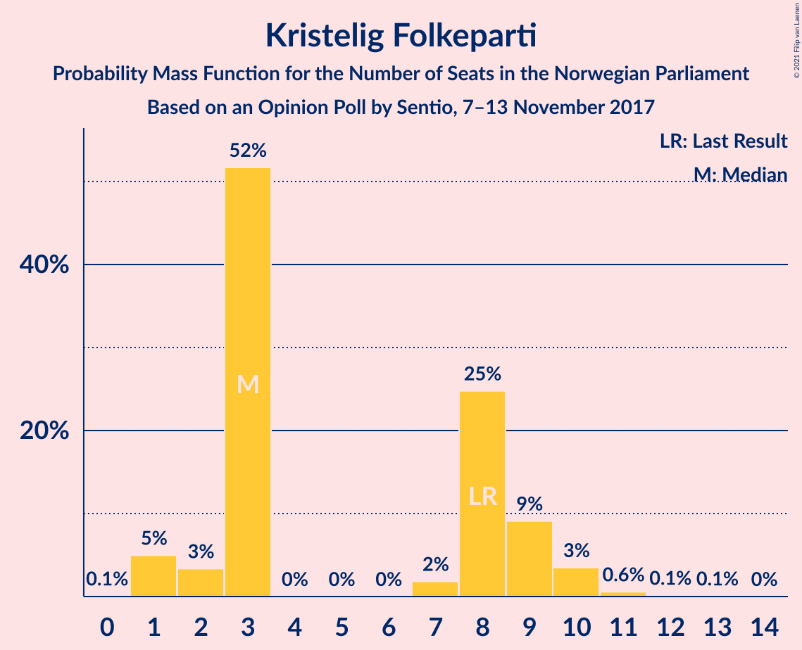
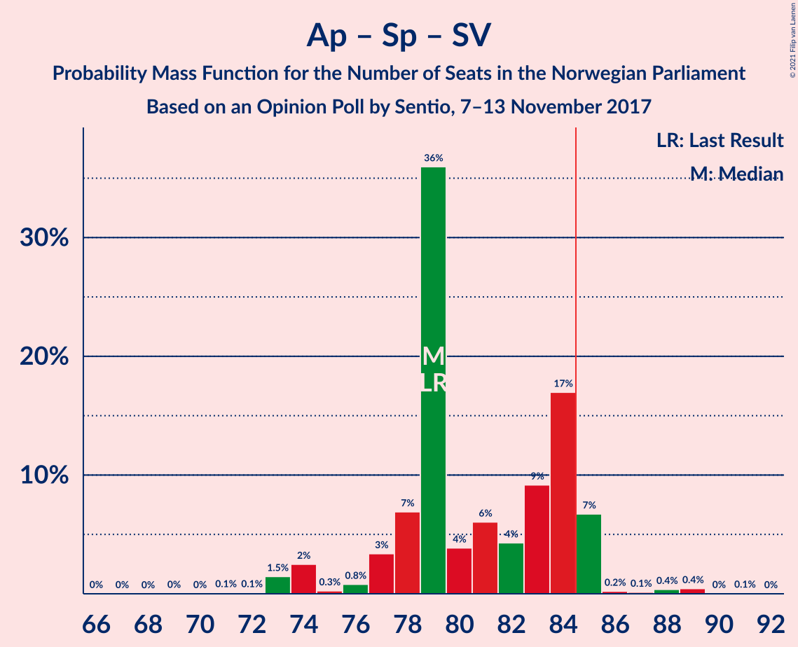

# Opinion Poll by Sentio, 7–13 November 2017

<a href="#voting-intentions">Voting Intentions</a> | <a href="#seats">Seats</a> | <a href="#coalitions">Coalitions</a> | <a href="#technical-information">Technical Information</a>

## Voting Intentions

### Confidence Intervals

| Party | Last Result | Poll Result | 80% Confidence Interval | 90% Confidence Interval | 95% Confidence Interval | 99% Confidence Interval |
|:-----:|:-----------:|:-----------:|:-----------------------:|:-----------------------:|:-----------------------:|:-----------------------:|
| Høyre | 25.0% | 28.2% | 26.2–30.3% |25.6–30.9% |25.1–31.4% |24.2–32.4% |
| Arbeiderpartiet | 27.4% | 25.6% | 23.7–27.7% |23.2–28.3% |22.7–28.8% |21.8–29.8% |
| Fremskrittspartiet | 15.2% | 13.3% | 11.8–14.9% |11.4–15.4% |11.1–15.8% |10.4–16.6% |
| Senterpartiet | 10.3% | 10.9% | 9.6–12.4% |9.2–12.8% |8.9–13.2% |8.3–14.0% |
| Sosialistisk Venstreparti | 6.0% | 6.7% | 5.7–8.0% |5.4–8.3% |5.2–8.7% |4.7–9.3% |
| Kristelig Folkeparti | 4.2% | 4.0% | 3.3–5.1% |3.0–5.4% |2.9–5.7% |2.5–6.2% |
| Venstre | 4.4% | 3.9% | 3.2–5.0% |2.9–5.2% |2.8–5.5% |2.4–6.1% |
| Rødt | 2.4% | 3.0% | 2.4–4.0% |2.2–4.2% |2.0–4.5% |1.8–5.0% |
| Miljøpartiet De Grønne | 3.2% | 2.8% | 2.1–3.7% |2.0–3.9% |1.8–4.2% |1.6–4.6% |

*Note:* The poll result column reflects the actual value used in the calculations. Published results may vary slightly, and in addition be rounded to fewer digits.

## Seats

### Confidence Intervals

| Party | Last Result | Median | 80% Confidence Interval | 90% Confidence Interval | 95% Confidence Interval | 99% Confidence Interval |
|:-----:|:-----------:|:------:|:-----------------------:|:-----------------------:|:-----------------------:|:-----------------------:|
| <a href="#høyre">Høyre</a> | 45 | 52 | 48–55 |46–56 |44–59 |44–60 |
| <a href="#arbeiderpartiet">Arbeiderpartiet</a> | 49 | 47 | 44–51 |44–52 |42–52 |41–55 |
| <a href="#fremskrittspartiet">Fremskrittspartiet</a> | 27 | 23 | 21–26 |20–27 |20–27 |19–28 |
| <a href="#senterpartiet">Senterpartiet</a> | 19 | 20 | 19–23 |18–24 |17–24 |16–25 |
| <a href="#sosialistisk-venstreparti">Sosialistisk Venstreparti</a> | 11 | 12 | 11–14 |10–16 |10–16 |8–17 |
| <a href="#kristelig-folkeparti">Kristelig Folkeparti</a> | 8 | 3 | 3–9 |1–9 |1–10 |1–11 |
| <a href="#venstre">Venstre</a> | 8 | 7 | 2–8 |2–10 |2–10 |2–10 |
| <a href="#rødt">Rødt</a> | 1 | 1 | 1–2 |1–2 |1–7 |1–8 |
| <a href="#miljøpartiet-de-grønne">Miljøpartiet De Grønne</a> | 1 | 1 | 1–2 |1–2 |0–2 |0–7 |

### Høyre

*For a full overview of the results for this party, see the [Høyre](party-høyre.html) page.*

| Number of Seats | Probability | Accumulated | Special Marks |
|:---------------:|:-----------:|:-----------:|:-------------:|
| 42 | 0.2% | 100% |  |
| 43 | 0.1% | 99.7% |  |
| 44 | 3% | 99.7% |  |
| 45 | 1.2% | 97% | Last Result |
| 46 | 2% | 96% |  |
| 47 | 2% | 93% |  |
| 48 | 8% | 91% |  |
| 49 | 15% | 84% |  |
| 50 | 4% | 68% |  |
| 51 | 5% | 64% |  |
| 52 | 16% | 60% | Median |
| 53 | 6% | 44% |  |
| 54 | 24% | 38% |  |
| 55 | 8% | 13% |  |
| 56 | 2% | 5% |  |
| 57 | 0.5% | 3% |  |
| 58 | 0.3% | 3% |  |
| 59 | 0.3% | 3% |  |
| 60 | 2% | 2% |  |
| 61 | 0.1% | 0.1% |  |
| 62 | 0% | 0.1% |  |
| 63 | 0% | 0% |  |

### Arbeiderpartiet

*For a full overview of the results for this party, see the [Arbeiderpartiet](party-arbeiderpartiet.html) page.*

| Number of Seats | Probability | Accumulated | Special Marks |
|:---------------:|:-----------:|:-----------:|:-------------:|
| 39 | 0% | 100% |  |
| 40 | 0.1% | 99.9% |  |
| 41 | 0.7% | 99.8% |  |
| 42 | 2% | 99.1% |  |
| 43 | 2% | 97% |  |
| 44 | 6% | 96% |  |
| 45 | 5% | 90% |  |
| 46 | 5% | 85% |  |
| 47 | 40% | 80% | Median |
| 48 | 7% | 40% |  |
| 49 | 9% | 32% | Last Result |
| 50 | 9% | 24% |  |
| 51 | 6% | 14% |  |
| 52 | 6% | 8% |  |
| 53 | 0.1% | 2% |  |
| 54 | 1.1% | 2% |  |
| 55 | 0.4% | 0.9% |  |
| 56 | 0.5% | 0.5% |  |
| 57 | 0% | 0% |  |

### Fremskrittspartiet

*For a full overview of the results for this party, see the [Fremskrittspartiet](party-fremskrittspartiet.html) page.*

| Number of Seats | Probability | Accumulated | Special Marks |
|:---------------:|:-----------:|:-----------:|:-------------:|
| 17 | 0% | 100% |  |
| 18 | 0.2% | 99.9% |  |
| 19 | 2% | 99.8% |  |
| 20 | 6% | 98% |  |
| 21 | 8% | 92% |  |
| 22 | 8% | 84% |  |
| 23 | 34% | 76% | Median |
| 24 | 13% | 42% |  |
| 25 | 13% | 29% |  |
| 26 | 8% | 16% |  |
| 27 | 6% | 8% | Last Result |
| 28 | 2% | 2% |  |
| 29 | 0.3% | 0.4% |  |
| 30 | 0.1% | 0.1% |  |
| 31 | 0% | 0% |  |

### Senterpartiet

*For a full overview of the results for this party, see the [Senterpartiet](party-senterpartiet.html) page.*

| Number of Seats | Probability | Accumulated | Special Marks |
|:---------------:|:-----------:|:-----------:|:-------------:|
| 14 | 0.1% | 100% |  |
| 15 | 0.3% | 99.9% |  |
| 16 | 1.4% | 99.6% |  |
| 17 | 0.9% | 98% |  |
| 18 | 3% | 97% |  |
| 19 | 24% | 94% | Last Result |
| 20 | 40% | 70% | Median |
| 21 | 5% | 30% |  |
| 22 | 9% | 25% |  |
| 23 | 9% | 16% |  |
| 24 | 5% | 7% |  |
| 25 | 2% | 2% |  |
| 26 | 0.2% | 0.3% |  |
| 27 | 0% | 0.1% |  |
| 28 | 0% | 0% |  |

### Sosialistisk Venstreparti

*For a full overview of the results for this party, see the [Sosialistisk Venstreparti](party-sosialistiskvenstreparti.html) page.*

| Number of Seats | Probability | Accumulated | Special Marks |
|:---------------:|:-----------:|:-----------:|:-------------:|
| 7 | 0% | 100% |  |
| 8 | 0.5% | 99.9% |  |
| 9 | 2% | 99.4% |  |
| 10 | 5% | 98% |  |
| 11 | 17% | 93% | Last Result |
| 12 | 32% | 76% | Median |
| 13 | 14% | 44% |  |
| 14 | 24% | 30% |  |
| 15 | 0.6% | 6% |  |
| 16 | 4% | 5% |  |
| 17 | 0.9% | 1.0% |  |
| 18 | 0.1% | 0.1% |  |
| 19 | 0% | 0% |  |

### Kristelig Folkeparti

*For a full overview of the results for this party, see the [Kristelig Folkeparti](party-kristeligfolkeparti.html) page.*

| Number of Seats | Probability | Accumulated | Special Marks |
|:---------------:|:-----------:|:-----------:|:-------------:|
| 0 | 0.1% | 100% |  |
| 1 | 5% | 99.9% |  |
| 2 | 3% | 95% |  |
| 3 | 52% | 92% | Median |
| 4 | 0% | 40% |  |
| 5 | 0% | 40% |  |
| 6 | 0% | 40% |  |
| 7 | 2% | 40% |  |
| 8 | 25% | 38% | Last Result |
| 9 | 9% | 13% |  |
| 10 | 3% | 4% |  |
| 11 | 0.6% | 0.8% |  |
| 12 | 0.1% | 0.2% |  |
| 13 | 0.1% | 0.1% |  |
| 14 | 0% | 0% |  |

### Venstre

*For a full overview of the results for this party, see the [Venstre](party-venstre.html) page.*

| Number of Seats | Probability | Accumulated | Special Marks |
|:---------------:|:-----------:|:-----------:|:-------------:|
| 1 | 0.2% | 100% |  |
| 2 | 42% | 99.8% |  |
| 3 | 1.5% | 57% |  |
| 4 | 0% | 56% |  |
| 5 | 0% | 56% |  |
| 6 | 0% | 56% |  |
| 7 | 32% | 56% | Median |
| 8 | 14% | 24% | Last Result |
| 9 | 2% | 10% |  |
| 10 | 8% | 8% |  |
| 11 | 0.4% | 0.4% |  |
| 12 | 0% | 0% |  |

### Rødt

*For a full overview of the results for this party, see the [Rødt](party-rødt.html) page.*

| Number of Seats | Probability | Accumulated | Special Marks |
|:---------------:|:-----------:|:-----------:|:-------------:|
| 1 | 54% | 100% | Last Result, Median |
| 2 | 43% | 46% |  |
| 3 | 0% | 3% |  |
| 4 | 0% | 3% |  |
| 5 | 0% | 3% |  |
| 6 | 0% | 3% |  |
| 7 | 2% | 3% |  |
| 8 | 1.2% | 1.3% |  |
| 9 | 0.1% | 0.1% |  |
| 10 | 0% | 0% |  |

### Miljøpartiet De Grønne

*For a full overview of the results for this party, see the [Miljøpartiet De Grønne](party-miljøpartietdegrønne.html) page.*

| Number of Seats | Probability | Accumulated | Special Marks |
|:---------------:|:-----------:|:-----------:|:-------------:|
| 0 | 3% | 100% |  |
| 1 | 62% | 97% | Last Result, Median |
| 2 | 34% | 35% |  |
| 3 | 0.1% | 1.2% |  |
| 4 | 0% | 1.1% |  |
| 5 | 0% | 1.0% |  |
| 6 | 0% | 1.0% |  |
| 7 | 0.8% | 1.0% |  |
| 8 | 0.1% | 0.2% |  |
| 9 | 0.1% | 0.1% |  |
| 10 | 0% | 0% |  |

## Coalitions

### Confidence Intervals

| Coalition | Last Result | Median | Majority? | 80% Confidence Interval | 90% Confidence Interval | 95% Confidence Interval | 99% Confidence Interval |
|:---------:|:-----------:|:------:|:---------:|:-----------------------:|:-----------------------:|:-----------------------:|:-----------------------:|
| Høyre – Fremskrittspartiet – Senterpartiet – Kristelig Folkeparti – Venstre | 107 | 106 | 100% | 102–108 | 101–111 | 100–113 | 96–115 |
| Arbeiderpartiet – Senterpartiet – Sosialistisk Venstreparti – Kristelig Folkeparti – Miljøpartiet De Grønne | 88 | 87 | 65% | 84–92 | 82–93 | 82–94 | 78–95 |
| Høyre – Fremskrittspartiet – Kristelig Folkeparti – Venstre – Miljøpartiet De Grønne | 89 | 88 | 70% | 83–90 | 82–91 | 82–94 | 78–95 |
| Høyre – Fremskrittspartiet – Kristelig Folkeparti – Venstre | 88 | 86 | 57% | 82–89 | 81–90 | 80–94 | 76–94 |
| Arbeiderpartiet – Senterpartiet – Sosialistisk Venstreparti – Rødt – Miljøpartiet De Grønne | 81 | 83 | 43% | 80–87 | 79–88 | 75–89 | 75–93 |
| Arbeiderpartiet – Senterpartiet – Sosialistisk Venstreparti – Rødt | 80 | 81 | 30% | 79–86 | 78–87 | 75–87 | 74–91 |
| Arbeiderpartiet – Senterpartiet – Sosialistisk Venstreparti – Miljøpartiet De Grønne | 80 | 81 | 26% | 79–86 | 77–86 | 74–86 | 74–91 |
| Høyre – Fremskrittspartiet – Venstre | 80 | 80 | 7% | 74–84 | 74–85 | 74–86 | 72–88 |
| Arbeiderpartiet – Senterpartiet – Sosialistisk Venstreparti | 79 | 79 | 8% | 78–84 | 76–85 | 74–85 | 73–89 |
| Arbeiderpartiet – Senterpartiet – Kristelig Folkeparti – Miljøpartiet De Grønne | 77 | 74 | 0.1% | 72–80 | 71–80 | 71–81 | 68–83 |
| Høyre – Fremskrittspartiet | 72 | 77 | 0.1% | 69–79 | 69–79 | 68–81 | 67–82 |
| Arbeiderpartiet – Senterpartiet – Kristelig Folkeparti | 76 | 73 | 0% | 70–78 | 70–79 | 70–79 | 67–81 |
| Arbeiderpartiet – Senterpartiet | 68 | 67 | 0% | 65–71 | 64–73 | 63–73 | 62–74 |
| Høyre – Kristelig Folkeparti – Venstre | 61 | 63 | 0% | 57–67 | 54–68 | 54–70 | 54–71 |
| Arbeiderpartiet – Sosialistisk Venstreparti | 60 | 60 | 0% | 58–65 | 55–65 | 53–65 | 53–68 |
| Senterpartiet – Kristelig Folkeparti – Venstre | 35 | 30 | 0% | 25–37 | 24–37 | 24–38 | 22–40 |

### Høyre – Fremskrittspartiet – Senterpartiet – Kristelig Folkeparti – Venstre

| Number of Seats | Probability | Accumulated | Special Marks |
|:---------------:|:-----------:|:-----------:|:-------------:|
| 94 | 0.1% | 100% |  |
| 95 | 0% | 99.9% |  |
| 96 | 0.5% | 99.9% |  |
| 97 | 0.2% | 99.4% |  |
| 98 | 0.4% | 99.2% |  |
| 99 | 1.1% | 98.8% |  |
| 100 | 2% | 98% |  |
| 101 | 5% | 96% |  |
| 102 | 5% | 91% |  |
| 103 | 1.2% | 86% |  |
| 104 | 12% | 85% |  |
| 105 | 14% | 73% | Median |
| 106 | 13% | 58% |  |
| 107 | 28% | 46% | Last Result |
| 108 | 10% | 18% |  |
| 109 | 2% | 7% |  |
| 110 | 0.1% | 5% |  |
| 111 | 0.6% | 5% |  |
| 112 | 0.4% | 5% |  |
| 113 | 3% | 4% |  |
| 114 | 0.1% | 2% |  |
| 115 | 1.4% | 1.5% |  |
| 116 | 0.1% | 0.1% |  |
| 117 | 0% | 0% |  |

### Arbeiderpartiet – Senterpartiet – Sosialistisk Venstreparti – Kristelig Folkeparti – Miljøpartiet De Grønne

| Number of Seats | Probability | Accumulated | Special Marks |
|:---------------:|:-----------:|:-----------:|:-------------:|
| 75 | 0% | 100% |  |
| 76 | 0% | 99.9% |  |
| 77 | 0.1% | 99.9% |  |
| 78 | 0.3% | 99.8% |  |
| 79 | 0.1% | 99.5% |  |
| 80 | 0.5% | 99.4% |  |
| 81 | 0.1% | 98.9% |  |
| 82 | 5% | 98.7% |  |
| 83 | 2% | 94% | Median |
| 84 | 27% | 92% |  |
| 85 | 3% | 65% | Majority |
| 86 | 4% | 62% |  |
| 87 | 12% | 59% |  |
| 88 | 18% | 46% | Last Result |
| 89 | 12% | 29% |  |
| 90 | 0.4% | 16% |  |
| 91 | 3% | 16% |  |
| 92 | 3% | 13% |  |
| 93 | 7% | 10% |  |
| 94 | 2% | 3% |  |
| 95 | 0.2% | 0.6% |  |
| 96 | 0.3% | 0.4% |  |
| 97 | 0.1% | 0.1% |  |
| 98 | 0% | 0.1% |  |
| 99 | 0% | 0% |  |

### Høyre – Fremskrittspartiet – Kristelig Folkeparti – Venstre – Miljøpartiet De Grønne

| Number of Seats | Probability | Accumulated | Special Marks |
|:---------------:|:-----------:|:-----------:|:-------------:|
| 75 | 0% | 100% |  |
| 76 | 0% | 99.9% |  |
| 77 | 0.1% | 99.9% |  |
| 78 | 0.5% | 99.8% |  |
| 79 | 1.2% | 99.3% |  |
| 80 | 0.1% | 98% |  |
| 81 | 0.3% | 98% |  |
| 82 | 6% | 98% |  |
| 83 | 14% | 92% |  |
| 84 | 8% | 79% |  |
| 85 | 10% | 70% | Majority |
| 86 | 7% | 61% | Median |
| 87 | 4% | 54% |  |
| 88 | 5% | 50% |  |
| 89 | 34% | 45% | Last Result |
| 90 | 5% | 11% |  |
| 91 | 2% | 7% |  |
| 92 | 0.4% | 5% |  |
| 93 | 0.3% | 4% |  |
| 94 | 2% | 4% |  |
| 95 | 1.4% | 2% |  |
| 96 | 0.1% | 0.2% |  |
| 97 | 0% | 0.1% |  |
| 98 | 0% | 0% |  |

### Høyre – Fremskrittspartiet – Kristelig Folkeparti – Venstre

| Number of Seats | Probability | Accumulated | Special Marks |
|:---------------:|:-----------:|:-----------:|:-------------:|
| 74 | 0.1% | 100% |  |
| 75 | 0.1% | 99.9% |  |
| 76 | 0.5% | 99.8% |  |
| 77 | 0.3% | 99.3% |  |
| 78 | 1.0% | 99.0% |  |
| 79 | 0.3% | 98% |  |
| 80 | 0.5% | 98% |  |
| 81 | 6% | 97% |  |
| 82 | 14% | 91% |  |
| 83 | 7% | 77% |  |
| 84 | 12% | 69% |  |
| 85 | 5% | 57% | Median, Majority |
| 86 | 3% | 52% |  |
| 87 | 31% | 49% |  |
| 88 | 7% | 18% | Last Result |
| 89 | 5% | 11% |  |
| 90 | 2% | 6% |  |
| 91 | 0.4% | 5% |  |
| 92 | 0.2% | 4% |  |
| 93 | 1.2% | 4% |  |
| 94 | 3% | 3% |  |
| 95 | 0.2% | 0.2% |  |
| 96 | 0% | 0% |  |

### Arbeiderpartiet – Senterpartiet – Sosialistisk Venstreparti – Rødt – Miljøpartiet De Grønne

| Number of Seats | Probability | Accumulated | Special Marks |
|:---------------:|:-----------:|:-----------:|:-------------:|
| 74 | 0.2% | 100% |  |
| 75 | 3% | 99.8% |  |
| 76 | 1.2% | 97% |  |
| 77 | 0.2% | 96% |  |
| 78 | 0.4% | 96% |  |
| 79 | 2% | 95% |  |
| 80 | 5% | 94% |  |
| 81 | 7% | 89% | Last Result, Median |
| 82 | 31% | 82% |  |
| 83 | 3% | 51% |  |
| 84 | 5% | 48% |  |
| 85 | 12% | 43% | Majority |
| 86 | 7% | 31% |  |
| 87 | 14% | 23% |  |
| 88 | 6% | 9% |  |
| 89 | 0.5% | 3% |  |
| 90 | 0.3% | 2% |  |
| 91 | 1.0% | 2% |  |
| 92 | 0.3% | 1.0% |  |
| 93 | 0.5% | 0.7% |  |
| 94 | 0.1% | 0.2% |  |
| 95 | 0.1% | 0.1% |  |
| 96 | 0% | 0% |  |

### Arbeiderpartiet – Senterpartiet – Sosialistisk Venstreparti – Rødt

| Number of Seats | Probability | Accumulated | Special Marks |
|:---------------:|:-----------:|:-----------:|:-------------:|
| 72 | 0% | 100% |  |
| 73 | 0.1% | 99.9% |  |
| 74 | 1.4% | 99.8% |  |
| 75 | 2% | 98% |  |
| 76 | 0.3% | 96% |  |
| 77 | 0.4% | 96% |  |
| 78 | 2% | 95% |  |
| 79 | 5% | 93% |  |
| 80 | 34% | 89% | Last Result, Median |
| 81 | 5% | 55% |  |
| 82 | 4% | 50% |  |
| 83 | 7% | 46% |  |
| 84 | 10% | 39% |  |
| 85 | 8% | 30% | Majority |
| 86 | 14% | 21% |  |
| 87 | 6% | 8% |  |
| 88 | 0.3% | 2% |  |
| 89 | 0.1% | 2% |  |
| 90 | 1.2% | 2% |  |
| 91 | 0.5% | 0.7% |  |
| 92 | 0.1% | 0.2% |  |
| 93 | 0% | 0.1% |  |
| 94 | 0% | 0.1% |  |
| 95 | 0% | 0% |  |

### Arbeiderpartiet – Senterpartiet – Sosialistisk Venstreparti – Miljøpartiet De Grønne

| Number of Seats | Probability | Accumulated | Special Marks |
|:---------------:|:-----------:|:-----------:|:-------------:|
| 71 | 0% | 100% |  |
| 72 | 0% | 99.9% |  |
| 73 | 0.3% | 99.9% |  |
| 74 | 3% | 99.6% |  |
| 75 | 1.2% | 97% |  |
| 76 | 0.4% | 96% |  |
| 77 | 1.2% | 95% |  |
| 78 | 3% | 94% |  |
| 79 | 7% | 92% |  |
| 80 | 10% | 84% | Last Result, Median |
| 81 | 29% | 75% |  |
| 82 | 4% | 46% |  |
| 83 | 7% | 42% |  |
| 84 | 9% | 35% |  |
| 85 | 16% | 26% | Majority |
| 86 | 8% | 10% |  |
| 87 | 0.9% | 2% |  |
| 88 | 0.3% | 1.4% |  |
| 89 | 0.2% | 1.1% |  |
| 90 | 0.3% | 0.9% |  |
| 91 | 0.5% | 0.7% |  |
| 92 | 0% | 0.2% |  |
| 93 | 0.1% | 0.1% |  |
| 94 | 0% | 0% |  |

### Høyre – Fremskrittspartiet – Venstre

| Number of Seats | Probability | Accumulated | Special Marks |
|:---------------:|:-----------:|:-----------:|:-------------:|
| 68 | 0% | 100% |  |
| 69 | 0% | 99.9% |  |
| 70 | 0% | 99.9% |  |
| 71 | 0.3% | 99.9% |  |
| 72 | 0.3% | 99.6% |  |
| 73 | 1.4% | 99.3% |  |
| 74 | 8% | 98% |  |
| 75 | 4% | 90% |  |
| 76 | 4% | 86% |  |
| 77 | 0.7% | 82% |  |
| 78 | 5% | 81% |  |
| 79 | 19% | 76% |  |
| 80 | 9% | 57% | Last Result |
| 81 | 10% | 48% |  |
| 82 | 3% | 38% | Median |
| 83 | 3% | 35% |  |
| 84 | 25% | 32% |  |
| 85 | 4% | 7% | Majority |
| 86 | 2% | 3% |  |
| 87 | 0.2% | 0.9% |  |
| 88 | 0.4% | 0.8% |  |
| 89 | 0.1% | 0.3% |  |
| 90 | 0.2% | 0.2% |  |
| 91 | 0% | 0% |  |

### Arbeiderpartiet – Senterpartiet – Sosialistisk Venstreparti

| Number of Seats | Probability | Accumulated | Special Marks |
|:---------------:|:-----------:|:-----------:|:-------------:|
| 67 | 0% | 100% |  |
| 68 | 0% | 99.9% |  |
| 69 | 0% | 99.9% |  |
| 70 | 0% | 99.9% |  |
| 71 | 0.1% | 99.9% |  |
| 72 | 0.1% | 99.8% |  |
| 73 | 1.5% | 99.7% |  |
| 74 | 2% | 98% |  |
| 75 | 0.3% | 96% |  |
| 76 | 0.8% | 95% |  |
| 77 | 3% | 95% |  |
| 78 | 7% | 91% |  |
| 79 | 36% | 84% | Last Result, Median |
| 80 | 4% | 48% |  |
| 81 | 6% | 45% |  |
| 82 | 4% | 38% |  |
| 83 | 9% | 34% |  |
| 84 | 17% | 25% |  |
| 85 | 7% | 8% | Majority |
| 86 | 0.2% | 1.3% |  |
| 87 | 0.1% | 1.1% |  |
| 88 | 0.4% | 0.9% |  |
| 89 | 0.4% | 0.6% |  |
| 90 | 0% | 0.1% |  |
| 91 | 0.1% | 0.1% |  |
| 92 | 0% | 0% |  |

### Arbeiderpartiet – Senterpartiet – Kristelig Folkeparti – Miljøpartiet De Grønne

| Number of Seats | Probability | Accumulated | Special Marks |
|:---------------:|:-----------:|:-----------:|:-------------:|
| 63 | 0% | 100% |  |
| 64 | 0% | 99.9% |  |
| 65 | 0.1% | 99.9% |  |
| 66 | 0.1% | 99.8% |  |
| 67 | 0.1% | 99.7% |  |
| 68 | 0.5% | 99.6% |  |
| 69 | 0.9% | 99.1% |  |
| 70 | 0.3% | 98% |  |
| 71 | 5% | 98% | Median |
| 72 | 31% | 93% |  |
| 73 | 10% | 62% |  |
| 74 | 6% | 52% |  |
| 75 | 15% | 46% |  |
| 76 | 5% | 31% |  |
| 77 | 10% | 26% | Last Result |
| 78 | 3% | 16% |  |
| 79 | 1.2% | 13% |  |
| 80 | 9% | 12% |  |
| 81 | 1.0% | 3% |  |
| 82 | 0.8% | 2% |  |
| 83 | 0.7% | 1.2% |  |
| 84 | 0.4% | 0.5% |  |
| 85 | 0% | 0.1% | Majority |
| 86 | 0% | 0.1% |  |
| 87 | 0% | 0.1% |  |
| 88 | 0% | 0% |  |

### Høyre – Fremskrittspartiet

| Number of Seats | Probability | Accumulated | Special Marks |
|:---------------:|:-----------:|:-----------:|:-------------:|
| 64 | 0.1% | 100% |  |
| 65 | 0.1% | 99.8% |  |
| 66 | 0.1% | 99.7% |  |
| 67 | 0.7% | 99.6% |  |
| 68 | 4% | 99.0% |  |
| 69 | 6% | 95% |  |
| 70 | 0.6% | 90% |  |
| 71 | 7% | 89% |  |
| 72 | 11% | 82% | Last Result |
| 73 | 7% | 71% |  |
| 74 | 0.6% | 64% |  |
| 75 | 2% | 63% | Median |
| 76 | 7% | 62% |  |
| 77 | 34% | 55% |  |
| 78 | 6% | 20% |  |
| 79 | 10% | 15% |  |
| 80 | 1.3% | 4% |  |
| 81 | 2% | 3% |  |
| 82 | 0.1% | 0.5% |  |
| 83 | 0.3% | 0.4% |  |
| 84 | 0% | 0.1% |  |
| 85 | 0% | 0.1% | Majority |
| 86 | 0% | 0.1% |  |
| 87 | 0% | 0% |  |

### Arbeiderpartiet – Senterpartiet – Kristelig Folkeparti

| Number of Seats | Probability | Accumulated | Special Marks |
|:---------------:|:-----------:|:-----------:|:-------------:|
| 60 | 0% | 100% |  |
| 61 | 0% | 99.9% |  |
| 62 | 0% | 99.9% |  |
| 63 | 0% | 99.9% |  |
| 64 | 0.1% | 99.9% |  |
| 65 | 0.1% | 99.8% |  |
| 66 | 0.1% | 99.7% |  |
| 67 | 0.4% | 99.5% |  |
| 68 | 0.9% | 99.2% |  |
| 69 | 0.5% | 98% |  |
| 70 | 29% | 98% | Median |
| 71 | 7% | 69% |  |
| 72 | 11% | 62% |  |
| 73 | 6% | 51% |  |
| 74 | 16% | 45% |  |
| 75 | 5% | 30% |  |
| 76 | 11% | 24% | Last Result |
| 77 | 2% | 14% |  |
| 78 | 3% | 12% |  |
| 79 | 7% | 8% |  |
| 80 | 0.7% | 2% |  |
| 81 | 0.7% | 1.1% |  |
| 82 | 0.3% | 0.4% |  |
| 83 | 0.1% | 0.1% |  |
| 84 | 0% | 0% |  |

### Arbeiderpartiet – Senterpartiet

| Number of Seats | Probability | Accumulated | Special Marks |
|:---------------:|:-----------:|:-----------:|:-------------:|
| 56 | 0% | 100% |  |
| 57 | 0.1% | 99.9% |  |
| 58 | 0% | 99.9% |  |
| 59 | 0.1% | 99.9% |  |
| 60 | 0.1% | 99.8% |  |
| 61 | 0.1% | 99.7% |  |
| 62 | 1.5% | 99.6% |  |
| 63 | 3% | 98% |  |
| 64 | 5% | 95% |  |
| 65 | 5% | 91% |  |
| 66 | 9% | 85% |  |
| 67 | 28% | 76% | Median |
| 68 | 4% | 48% | Last Result |
| 69 | 13% | 45% |  |
| 70 | 9% | 31% |  |
| 71 | 13% | 22% |  |
| 72 | 1.3% | 9% |  |
| 73 | 7% | 8% |  |
| 74 | 0.5% | 0.8% |  |
| 75 | 0.1% | 0.3% |  |
| 76 | 0.2% | 0.2% |  |
| 77 | 0% | 0% |  |

### Høyre – Kristelig Folkeparti – Venstre

| Number of Seats | Probability | Accumulated | Special Marks |
|:---------------:|:-----------:|:-----------:|:-------------:|
| 50 | 0.1% | 100% |  |
| 51 | 0.1% | 99.9% |  |
| 52 | 0.1% | 99.8% |  |
| 53 | 0.2% | 99.7% |  |
| 54 | 6% | 99.5% |  |
| 55 | 0.8% | 93% |  |
| 56 | 2% | 93% |  |
| 57 | 11% | 91% |  |
| 58 | 3% | 80% |  |
| 59 | 6% | 77% |  |
| 60 | 11% | 71% |  |
| 61 | 5% | 60% | Last Result |
| 62 | 4% | 55% | Median |
| 63 | 2% | 51% |  |
| 64 | 26% | 49% |  |
| 65 | 2% | 22% |  |
| 66 | 10% | 20% |  |
| 67 | 0.8% | 11% |  |
| 68 | 5% | 10% |  |
| 69 | 1.2% | 4% |  |
| 70 | 2% | 3% |  |
| 71 | 0.7% | 1.0% |  |
| 72 | 0% | 0.3% |  |
| 73 | 0.2% | 0.3% |  |
| 74 | 0% | 0.1% |  |
| 75 | 0% | 0.1% |  |
| 76 | 0% | 0% |  |

### Arbeiderpartiet – Sosialistisk Venstreparti

| Number of Seats | Probability | Accumulated | Special Marks |
|:---------------:|:-----------:|:-----------:|:-------------:|
| 50 | 0% | 100% |  |
| 51 | 0.1% | 99.9% |  |
| 52 | 0.1% | 99.8% |  |
| 53 | 2% | 99.7% |  |
| 54 | 2% | 97% |  |
| 55 | 0.2% | 95% |  |
| 56 | 2% | 95% |  |
| 57 | 3% | 93% |  |
| 58 | 6% | 91% |  |
| 59 | 34% | 85% | Median |
| 60 | 11% | 50% | Last Result |
| 61 | 15% | 40% |  |
| 62 | 4% | 25% |  |
| 63 | 7% | 20% |  |
| 64 | 0.8% | 13% |  |
| 65 | 10% | 12% |  |
| 66 | 0.2% | 2% |  |
| 67 | 1.3% | 2% |  |
| 68 | 0.3% | 0.7% |  |
| 69 | 0.4% | 0.5% |  |
| 70 | 0% | 0% |  |

### Senterpartiet – Kristelig Folkeparti – Venstre

| Number of Seats | Probability | Accumulated | Special Marks |
|:---------------:|:-----------:|:-----------:|:-------------:|
| 21 | 0.2% | 100% |  |
| 22 | 0.5% | 99.8% |  |
| 23 | 0.3% | 99.3% |  |
| 24 | 6% | 99.0% |  |
| 25 | 6% | 93% |  |
| 26 | 2% | 87% |  |
| 27 | 1.3% | 84% |  |
| 28 | 10% | 83% |  |
| 29 | 12% | 73% |  |
| 30 | 27% | 62% | Median |
| 31 | 4% | 35% |  |
| 32 | 2% | 31% |  |
| 33 | 3% | 29% |  |
| 34 | 3% | 27% |  |
| 35 | 5% | 24% | Last Result |
| 36 | 4% | 19% |  |
| 37 | 11% | 15% |  |
| 38 | 4% | 4% |  |
| 39 | 0.1% | 0.7% |  |
| 40 | 0.2% | 0.6% |  |
| 41 | 0.1% | 0.4% |  |
| 42 | 0.3% | 0.3% |  |
| 43 | 0% | 0% |  |

## Technical Information

### Opinion Poll

+ **Polling firm:** Sentio
+ **Commissioner(s):** —
+ **Fieldwork period:** 7–13 November 2017

### Calculations

+ **Sample size:** 792
+ **Simulations done:** 131,072
+ **Error estimate:** 1.08%

