# Opinion Poll by Ipsos MMI, 20–22 November 2017

<a href="#voting-intentions">Voting Intentions</a> | <a href="#seats">Seats</a> | <a href="#coalitions">Coalitions</a> | <a href="#technical-information">Technical Information</a>

## Voting Intentions

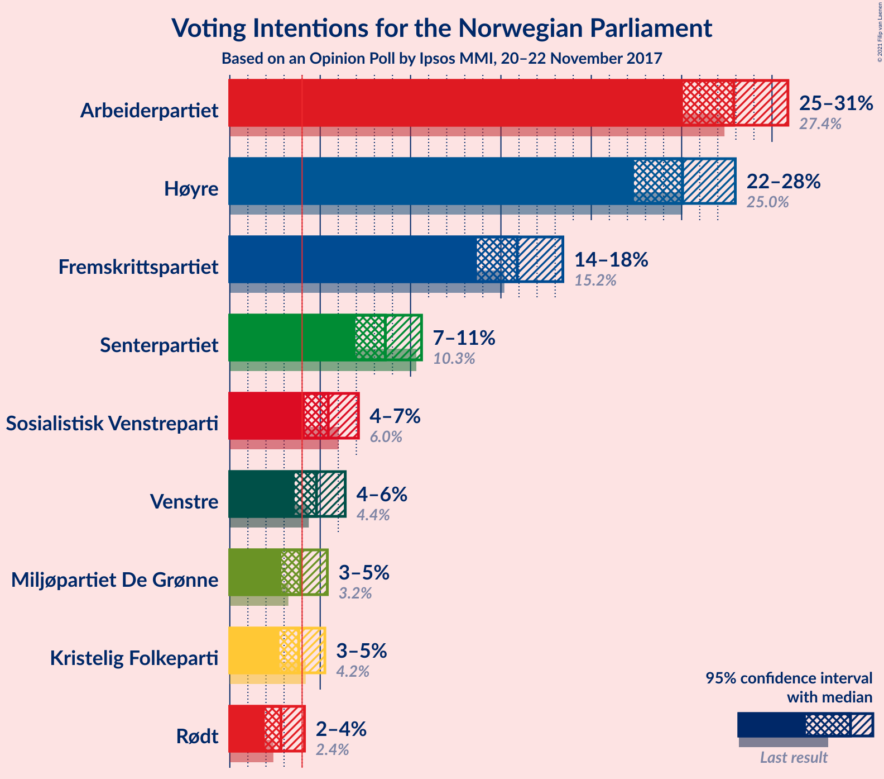

### Confidence Intervals

| Party | Last Result | Poll Result | 80% Confidence Interval | 90% Confidence Interval | 95% Confidence Interval | 99% Confidence Interval |
|:-----:|:-----------:|:-----------:|:-----------------------:|:-----------------------:|:-----------------------:|:-----------------------:|
| Arbeiderpartiet | 27.4% | 27.9% | 26.0–29.8% |25.5–30.4% |25.1–30.9% |24.2–31.8% |
| Høyre | 25.0% | 25.1% | 23.3–27.0% |22.8–27.5% |22.4–28.0% |21.5–28.9% |
| Fremskrittspartiet | 15.2% | 15.9% | 14.4–17.5% |14.0–18.0% |13.7–18.4% |13.0–19.2% |
| Senterpartiet | 10.3% | 8.6% | 7.5–9.9% |7.2–10.3% |7.0–10.6% |6.5–11.3% |
| Sosialistisk Venstreparti | 6.0% | 5.4% | 4.6–6.5% |4.4–6.8% |4.1–7.1% |3.8–7.7% |
| Venstre | 4.4% | 4.8% | 4.0–5.8% |3.8–6.1% |3.6–6.4% |3.2–6.9% |
| Miljøpartiet De Grønne | 3.2% | 3.9% | 3.2–4.9% |3.0–5.2% |2.9–5.4% |2.5–5.9% |
| Kristelig Folkeparti | 4.2% | 3.8% | 3.1–4.8% |2.9–5.0% |2.7–5.3% |2.5–5.7% |
| Rødt | 2.4% | 2.8% | 2.2–3.7% |2.1–3.9% |1.9–4.1% |1.7–4.6% |

*Note:* The poll result column reflects the actual value used in the calculations. Published results may vary slightly, and in addition be rounded to fewer digits.

## Seats

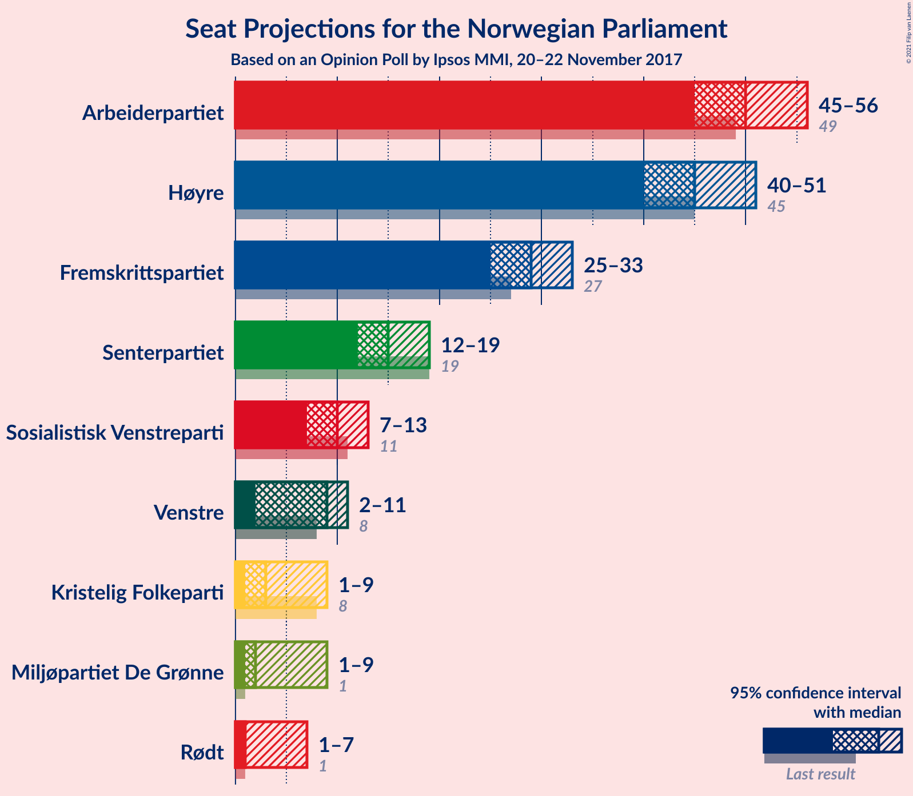

### Confidence Intervals

| Party | Last Result | Median | 80% Confidence Interval | 90% Confidence Interval | 95% Confidence Interval | 99% Confidence Interval |
|:-----:|:-----------:|:------:|:-----------------------:|:-----------------------:|:-----------------------:|:-----------------------:|
| <a href="#arbeiderpartiet">Arbeiderpartiet</a> | 49 | 50 | 47–55 |46–55 |45–56 |43–59 |
| <a href="#høyre">Høyre</a> | 45 | 45 | 42–48 |41–49 |40–51 |39–53 |
| <a href="#fremskrittspartiet">Fremskrittspartiet</a> | 27 | 29 | 26–31 |25–32 |25–33 |24–35 |
| <a href="#senterpartiet">Senterpartiet</a> | 19 | 15 | 14–18 |13–18 |12–19 |11–20 |
| <a href="#sosialistisk-venstreparti">Sosialistisk Venstreparti</a> | 11 | 10 | 8–11 |8–12 |7–13 |2–14 |
| <a href="#venstre">Venstre</a> | 8 | 9 | 3–10 |2–11 |2–11 |2–12 |
| <a href="#miljøpartiet-de-grønne">Miljøpartiet De Grønne</a> | 1 | 2 | 2–8 |1–9 |1–9 |1–10 |
| <a href="#kristelig-folkeparti">Kristelig Folkeparti</a> | 8 | 3 | 1–8 |1–9 |1–9 |1–10 |
| <a href="#rødt">Rødt</a> | 1 | 1 | 1–2 |1–2 |1–7 |1–8 |

### Arbeiderpartiet

*For a full overview of the results for this party, see the [Arbeiderpartiet](party-arbeiderpartiet.html) page.*

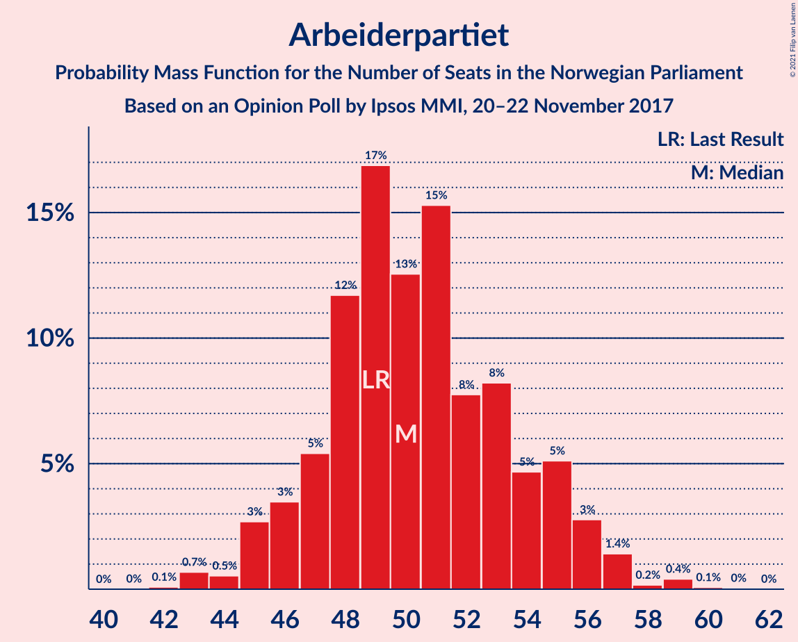

| Number of Seats | Probability | Accumulated | Special Marks |
|:---------------:|:-----------:|:-----------:|:-------------:|
| 42 | 0.1% | 100% |  |
| 43 | 0.7% | 99.9% |  |
| 44 | 0.5% | 99.2% |  |
| 45 | 3% | 98.7% |  |
| 46 | 3% | 96% |  |
| 47 | 5% | 93% |  |
| 48 | 12% | 87% |  |
| 49 | 17% | 75% | Last Result |
| 50 | 13% | 59% | Median |
| 51 | 15% | 46% |  |
| 52 | 8% | 31% |  |
| 53 | 8% | 23% |  |
| 54 | 5% | 15% |  |
| 55 | 5% | 10% |  |
| 56 | 3% | 5% |  |
| 57 | 1.4% | 2% |  |
| 58 | 0.2% | 0.7% |  |
| 59 | 0.4% | 0.5% |  |
| 60 | 0.1% | 0.1% |  |
| 61 | 0% | 0.1% |  |
| 62 | 0% | 0% |  |

### Høyre

*For a full overview of the results for this party, see the [Høyre](party-høyre.html) page.*

| Number of Seats | Probability | Accumulated | Special Marks |
|:---------------:|:-----------:|:-----------:|:-------------:|
| 37 | 0.1% | 100% |  |
| 38 | 0.3% | 99.9% |  |
| 39 | 1.2% | 99.5% |  |
| 40 | 3% | 98% |  |
| 41 | 5% | 95% |  |
| 42 | 10% | 91% |  |
| 43 | 7% | 81% |  |
| 44 | 14% | 74% |  |
| 45 | 14% | 60% | Last Result, Median |
| 46 | 18% | 47% |  |
| 47 | 9% | 28% |  |
| 48 | 10% | 19% |  |
| 49 | 5% | 9% |  |
| 50 | 2% | 5% |  |
| 51 | 1.0% | 3% |  |
| 52 | 1.2% | 2% |  |
| 53 | 0.4% | 0.6% |  |
| 54 | 0.2% | 0.2% |  |
| 55 | 0% | 0.1% |  |
| 56 | 0% | 0% |  |

### Fremskrittspartiet

*For a full overview of the results for this party, see the [Fremskrittspartiet](party-fremskrittspartiet.html) page.*

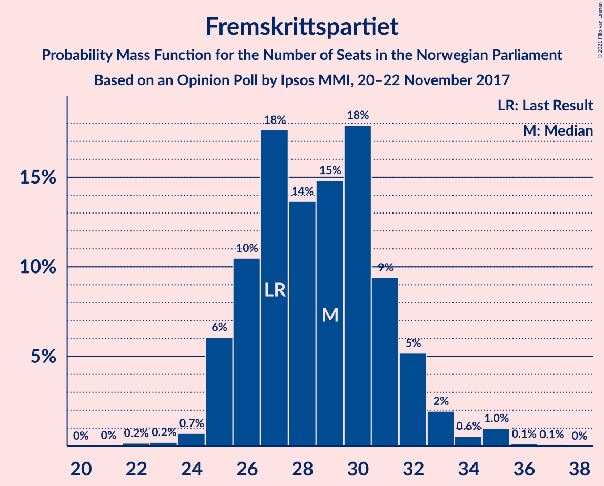

| Number of Seats | Probability | Accumulated | Special Marks |
|:---------------:|:-----------:|:-----------:|:-------------:|
| 21 | 0% | 100% |  |
| 22 | 0.2% | 99.9% |  |
| 23 | 0.2% | 99.8% |  |
| 24 | 0.7% | 99.6% |  |
| 25 | 6% | 98.9% |  |
| 26 | 10% | 93% |  |
| 27 | 18% | 82% | Last Result |
| 28 | 14% | 65% |  |
| 29 | 15% | 51% | Median |
| 30 | 18% | 36% |  |
| 31 | 9% | 18% |  |
| 32 | 5% | 9% |  |
| 33 | 2% | 4% |  |
| 34 | 0.6% | 2% |  |
| 35 | 1.0% | 1.2% |  |
| 36 | 0.1% | 0.2% |  |
| 37 | 0.1% | 0.1% |  |
| 38 | 0% | 0% |  |

### Senterpartiet

*For a full overview of the results for this party, see the [Senterpartiet](party-senterpartiet.html) page.*

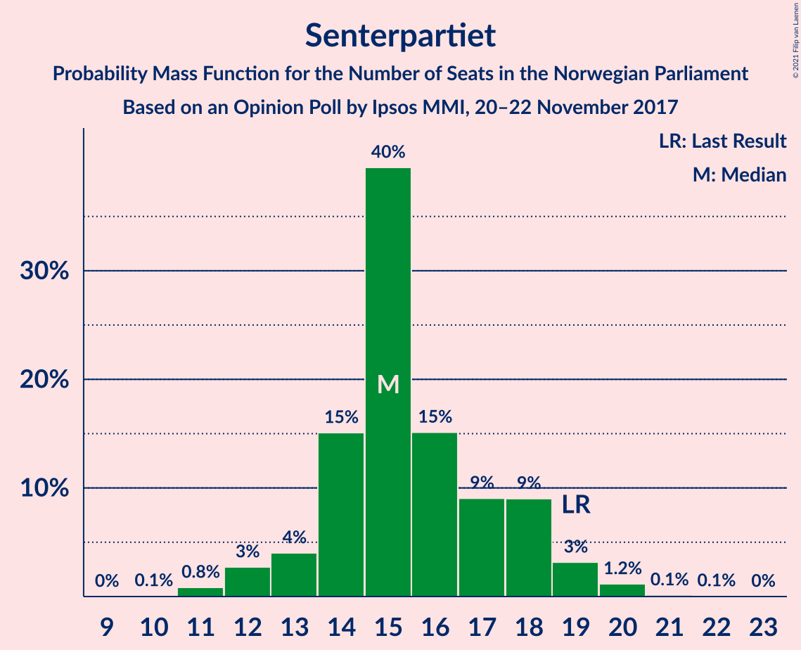

| Number of Seats | Probability | Accumulated | Special Marks |
|:---------------:|:-----------:|:-----------:|:-------------:|
| 10 | 0.1% | 100% |  |
| 11 | 0.8% | 99.9% |  |
| 12 | 3% | 99.1% |  |
| 13 | 4% | 96% |  |
| 14 | 15% | 92% |  |
| 15 | 40% | 77% | Median |
| 16 | 15% | 38% |  |
| 17 | 9% | 23% |  |
| 18 | 9% | 14% |  |
| 19 | 3% | 5% | Last Result |
| 20 | 1.2% | 1.4% |  |
| 21 | 0.1% | 0.2% |  |
| 22 | 0.1% | 0.1% |  |
| 23 | 0% | 0% |  |

### Sosialistisk Venstreparti

*For a full overview of the results for this party, see the [Sosialistisk Venstreparti](party-sosialistiskvenstreparti.html) page.*

| Number of Seats | Probability | Accumulated | Special Marks |
|:---------------:|:-----------:|:-----------:|:-------------:|
| 1 | 0.5% | 100% |  |
| 2 | 1.2% | 99.5% |  |
| 3 | 0% | 98% |  |
| 4 | 0% | 98% |  |
| 5 | 0% | 98% |  |
| 6 | 0% | 98% |  |
| 7 | 2% | 98% |  |
| 8 | 12% | 97% |  |
| 9 | 35% | 85% |  |
| 10 | 19% | 50% | Median |
| 11 | 21% | 31% | Last Result |
| 12 | 7% | 10% |  |
| 13 | 3% | 3% |  |
| 14 | 0.5% | 0.7% |  |
| 15 | 0.1% | 0.2% |  |
| 16 | 0% | 0% |  |

### Venstre

*For a full overview of the results for this party, see the [Venstre](party-venstre.html) page.*

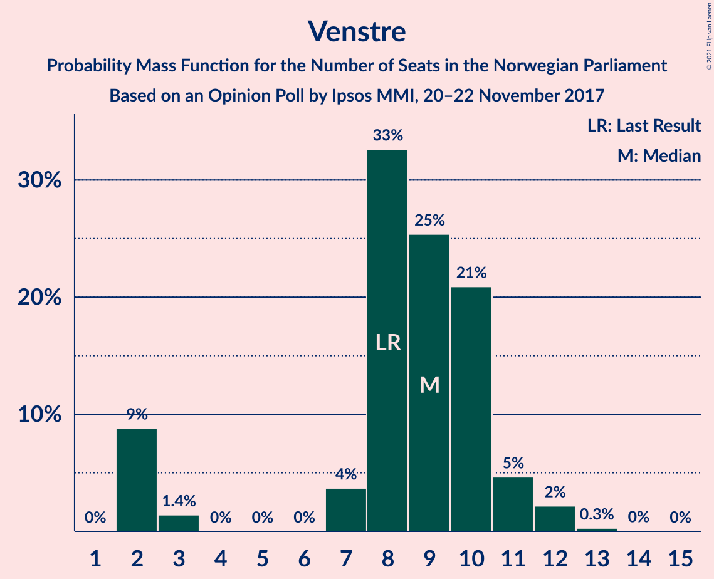

| Number of Seats | Probability | Accumulated | Special Marks |
|:---------------:|:-----------:|:-----------:|:-------------:|
| 2 | 9% | 100% |  |
| 3 | 1.4% | 91% |  |
| 4 | 0% | 90% |  |
| 5 | 0% | 90% |  |
| 6 | 0% | 90% |  |
| 7 | 4% | 90% |  |
| 8 | 33% | 86% | Last Result |
| 9 | 25% | 53% | Median |
| 10 | 21% | 28% |  |
| 11 | 5% | 7% |  |
| 12 | 2% | 2% |  |
| 13 | 0.3% | 0.3% |  |
| 14 | 0% | 0.1% |  |
| 15 | 0% | 0% |  |

### Miljøpartiet De Grønne

*For a full overview of the results for this party, see the [Miljøpartiet De Grønne](party-miljøpartietdegrønne.html) page.*

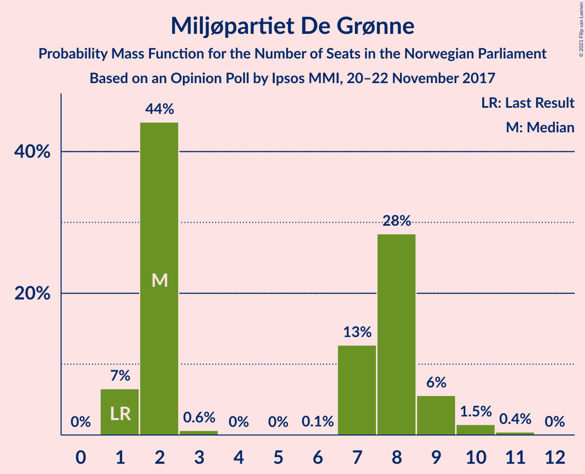

| Number of Seats | Probability | Accumulated | Special Marks |
|:---------------:|:-----------:|:-----------:|:-------------:|
| 1 | 7% | 100% | Last Result |
| 2 | 44% | 93% | Median |
| 3 | 0.6% | 49% |  |
| 4 | 0% | 49% |  |
| 5 | 0% | 49% |  |
| 6 | 0.1% | 49% |  |
| 7 | 13% | 49% |  |
| 8 | 28% | 36% |  |
| 9 | 6% | 8% |  |
| 10 | 1.5% | 2% |  |
| 11 | 0.4% | 0.5% |  |
| 12 | 0% | 0% |  |

### Kristelig Folkeparti

*For a full overview of the results for this party, see the [Kristelig Folkeparti](party-kristeligfolkeparti.html) page.*

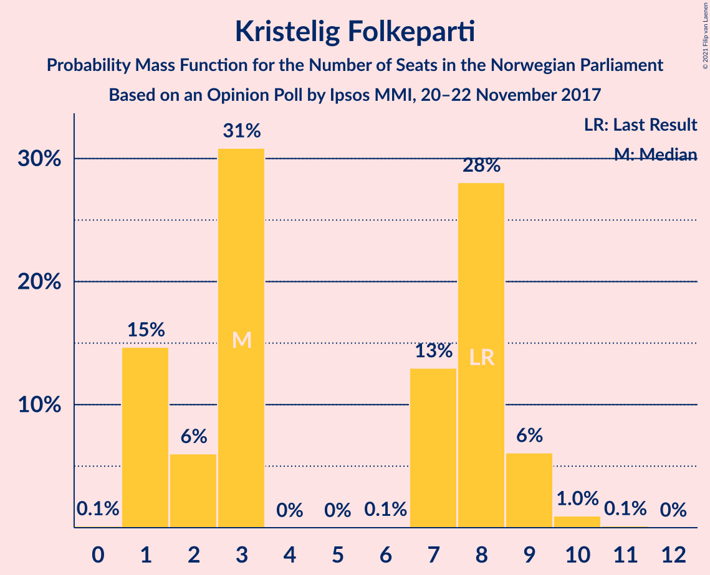

| Number of Seats | Probability | Accumulated | Special Marks |
|:---------------:|:-----------:|:-----------:|:-------------:|
| 0 | 0.1% | 100% |  |
| 1 | 15% | 99.9% |  |
| 2 | 6% | 85% |  |
| 3 | 31% | 79% | Median |
| 4 | 0% | 48% |  |
| 5 | 0% | 48% |  |
| 6 | 0.1% | 48% |  |
| 7 | 13% | 48% |  |
| 8 | 28% | 35% | Last Result |
| 9 | 6% | 7% |  |
| 10 | 1.0% | 1.1% |  |
| 11 | 0.1% | 0.2% |  |
| 12 | 0% | 0% |  |

### Rødt

*For a full overview of the results for this party, see the [Rødt](party-rødt.html) page.*

| Number of Seats | Probability | Accumulated | Special Marks |
|:---------------:|:-----------:|:-----------:|:-------------:|
| 1 | 53% | 100% | Last Result, Median |
| 2 | 44% | 47% |  |
| 3 | 0% | 3% |  |
| 4 | 0% | 3% |  |
| 5 | 0% | 3% |  |
| 6 | 0.1% | 3% |  |
| 7 | 2% | 3% |  |
| 8 | 0.7% | 0.8% |  |
| 9 | 0.1% | 0.1% |  |
| 10 | 0% | 0% |  |

## Coalitions

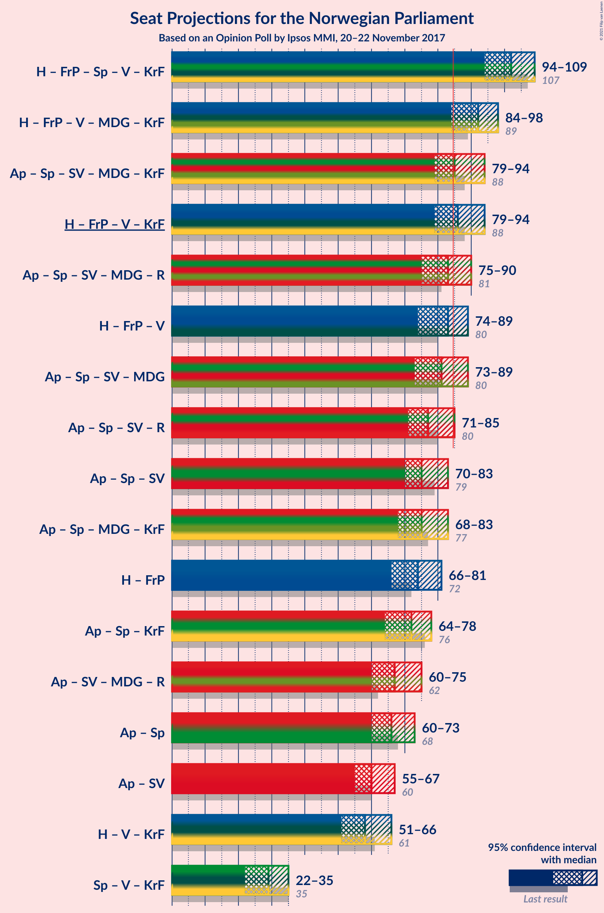

### Confidence Intervals

| Coalition | Last Result | Median | Majority? | 80% Confidence Interval | 90% Confidence Interval | 95% Confidence Interval | 99% Confidence Interval |
|:---------:|:-----------:|:------:|:---------:|:-----------------------:|:-----------------------:|:-----------------------:|:-----------------------:|
| Høyre – Fremskrittspartiet – Senterpartiet – Venstre – Kristelig Folkeparti | 107 | 102 | 100% | 98–107 | 96–108 | 94–109 | 92–111 |
| Høyre – Fremskrittspartiet – Venstre – Miljøpartiet De Grønne – Kristelig Folkeparti | 89 | 92 | 97% | 87–95 | 85–97 | 84–98 | 82–101 |
| Arbeiderpartiet – Senterpartiet – Sosialistisk Venstreparti – Miljøpartiet De Grønne – Kristelig Folkeparti | 88 | 85 | 55% | 80–90 | 80–92 | 79–94 | 76–95 |
| Høyre – Fremskrittspartiet – Venstre – Kristelig Folkeparti | 88 | 86 | 79% | 82–92 | 80–93 | 79–94 | 76–96 |
| Arbeiderpartiet – Senterpartiet – Sosialistisk Venstreparti – Miljøpartiet De Grønne – Rødt | 81 | 83 | 21% | 77–87 | 76–89 | 75–90 | 73–93 |
| Høyre – Fremskrittspartiet – Venstre | 80 | 83 | 18% | 77–87 | 76–88 | 74–89 | 73–91 |
| Arbeiderpartiet – Senterpartiet – Sosialistisk Venstreparti – Miljøpartiet De Grønne | 80 | 81 | 14% | 75–85 | 75–87 | 73–89 | 71–92 |
| Arbeiderpartiet – Senterpartiet – Sosialistisk Venstreparti – Rødt | 80 | 77 | 3% | 74–82 | 72–84 | 71–85 | 68–87 |
| Arbeiderpartiet – Senterpartiet – Sosialistisk Venstreparti | 79 | 75 | 0.5% | 72–79 | 71–82 | 70–83 | 67–85 |
| Arbeiderpartiet – Senterpartiet – Miljøpartiet De Grønne – Kristelig Folkeparti | 77 | 75 | 0.7% | 71–81 | 69–83 | 68–83 | 66–85 |
| Høyre – Fremskrittspartiet | 72 | 74 | 0.1% | 69–78 | 68–79 | 66–81 | 66–83 |
| Arbeiderpartiet – Senterpartiet – Kristelig Folkeparti | 76 | 72 | 0% | 66–75 | 65–76 | 64–78 | 61–80 |
| Arbeiderpartiet – Sosialistisk Venstreparti – Miljøpartiet De Grønne – Rødt | 62 | 67 | 0% | 62–71 | 61–73 | 60–75 | 58–77 |
| Arbeiderpartiet – Senterpartiet | 68 | 66 | 0% | 62–71 | 61–72 | 60–73 | 59–74 |
| Arbeiderpartiet – Sosialistisk Venstreparti | 60 | 60 | 0% | 56–64 | 56–66 | 55–67 | 51–69 |
| Høyre – Venstre – Kristelig Folkeparti | 61 | 58 | 0% | 53–63 | 52–64 | 51–66 | 48–67 |
| Senterpartiet – Venstre – Kristelig Folkeparti | 35 | 29 | 0% | 25–33 | 22–34 | 22–35 | 18–37 |

### Høyre – Fremskrittspartiet – Senterpartiet – Venstre – Kristelig Folkeparti

| Number of Seats | Probability | Accumulated | Special Marks |
|:---------------:|:-----------:|:-----------:|:-------------:|
| 89 | 0% | 100% |  |
| 90 | 0% | 99.9% |  |
| 91 | 0.2% | 99.9% |  |
| 92 | 0.3% | 99.7% |  |
| 93 | 1.2% | 99.4% |  |
| 94 | 0.8% | 98% |  |
| 95 | 1.4% | 97% |  |
| 96 | 2% | 96% |  |
| 97 | 2% | 94% |  |
| 98 | 4% | 92% |  |
| 99 | 10% | 88% |  |
| 100 | 7% | 79% |  |
| 101 | 15% | 72% | Median |
| 102 | 10% | 57% |  |
| 103 | 10% | 46% |  |
| 104 | 4% | 36% |  |
| 105 | 6% | 32% |  |
| 106 | 6% | 26% |  |
| 107 | 12% | 20% | Last Result |
| 108 | 3% | 7% |  |
| 109 | 3% | 5% |  |
| 110 | 1.2% | 2% |  |
| 111 | 0.3% | 0.7% |  |
| 112 | 0.1% | 0.4% |  |
| 113 | 0.1% | 0.2% |  |
| 114 | 0.1% | 0.1% |  |
| 115 | 0.1% | 0.1% |  |
| 116 | 0% | 0% |  |

### Høyre – Fremskrittspartiet – Venstre – Miljøpartiet De Grønne – Kristelig Folkeparti

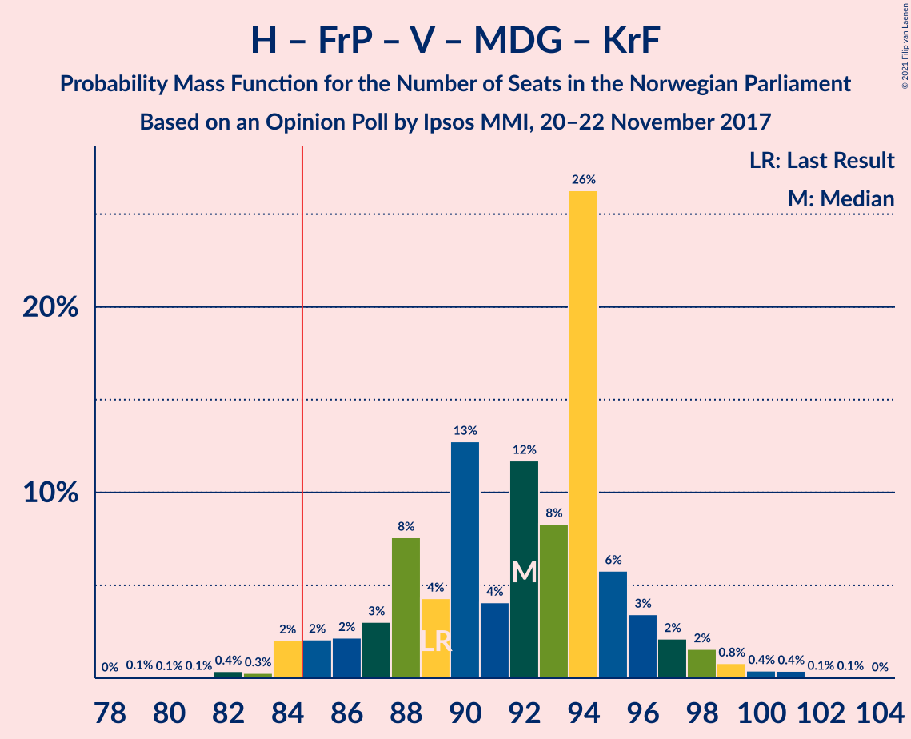

| Number of Seats | Probability | Accumulated | Special Marks |
|:---------------:|:-----------:|:-----------:|:-------------:|
| 79 | 0.1% | 100% |  |
| 80 | 0.1% | 99.9% |  |
| 81 | 0.1% | 99.8% |  |
| 82 | 0.4% | 99.7% |  |
| 83 | 0.3% | 99.3% |  |
| 84 | 2% | 99.0% |  |
| 85 | 2% | 97% | Majority |
| 86 | 2% | 95% |  |
| 87 | 3% | 93% |  |
| 88 | 8% | 90% | Median |
| 89 | 4% | 82% | Last Result |
| 90 | 13% | 78% |  |
| 91 | 4% | 65% |  |
| 92 | 12% | 61% |  |
| 93 | 8% | 49% |  |
| 94 | 26% | 41% |  |
| 95 | 6% | 15% |  |
| 96 | 3% | 9% |  |
| 97 | 2% | 5% |  |
| 98 | 2% | 3% |  |
| 99 | 0.8% | 2% |  |
| 100 | 0.4% | 1.0% |  |
| 101 | 0.4% | 0.6% |  |
| 102 | 0.1% | 0.2% |  |
| 103 | 0.1% | 0.1% |  |
| 104 | 0% | 0% |  |

### Arbeiderpartiet – Senterpartiet – Sosialistisk Venstreparti – Miljøpartiet De Grønne – Kristelig Folkeparti

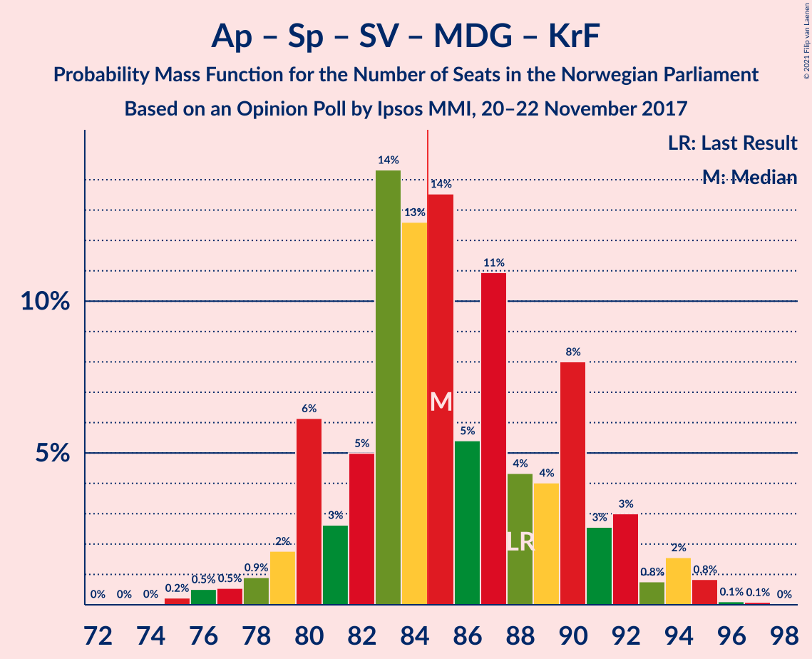

| Number of Seats | Probability | Accumulated | Special Marks |
|:---------------:|:-----------:|:-----------:|:-------------:|
| 73 | 0% | 100% |  |
| 74 | 0% | 99.9% |  |
| 75 | 0.2% | 99.9% |  |
| 76 | 0.5% | 99.7% |  |
| 77 | 0.5% | 99.2% |  |
| 78 | 0.9% | 98.6% |  |
| 79 | 2% | 98% |  |
| 80 | 6% | 96% | Median |
| 81 | 3% | 90% |  |
| 82 | 5% | 87% |  |
| 83 | 14% | 82% |  |
| 84 | 13% | 68% |  |
| 85 | 14% | 55% | Majority |
| 86 | 5% | 42% |  |
| 87 | 11% | 36% |  |
| 88 | 4% | 25% | Last Result |
| 89 | 4% | 21% |  |
| 90 | 8% | 17% |  |
| 91 | 3% | 9% |  |
| 92 | 3% | 6% |  |
| 93 | 0.8% | 3% |  |
| 94 | 2% | 3% |  |
| 95 | 0.8% | 1.1% |  |
| 96 | 0.1% | 0.2% |  |
| 97 | 0.1% | 0.1% |  |
| 98 | 0% | 0% |  |

### Høyre – Fremskrittspartiet – Venstre – Kristelig Folkeparti

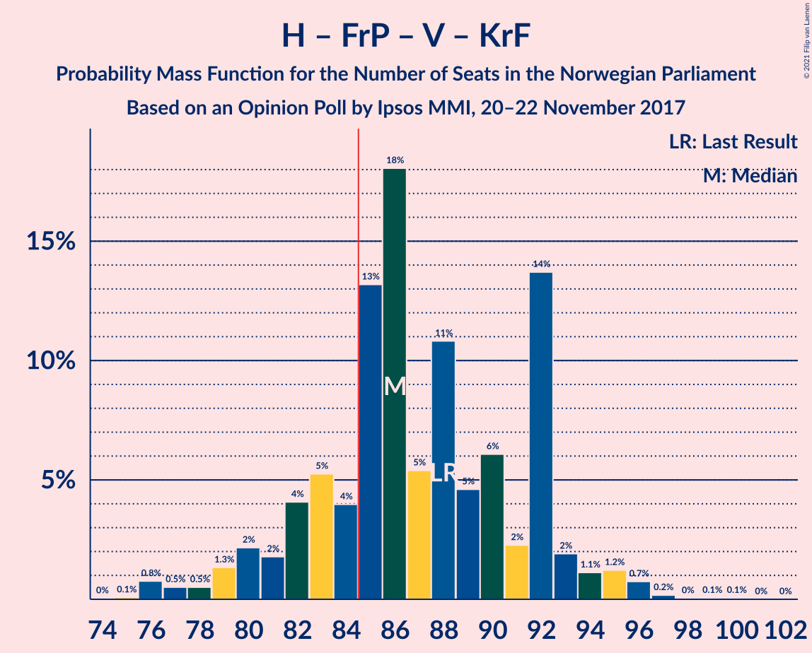

| Number of Seats | Probability | Accumulated | Special Marks |
|:---------------:|:-----------:|:-----------:|:-------------:|
| 74 | 0% | 100% |  |
| 75 | 0.1% | 99.9% |  |
| 76 | 0.8% | 99.9% |  |
| 77 | 0.5% | 99.1% |  |
| 78 | 0.5% | 98.6% |  |
| 79 | 1.3% | 98% |  |
| 80 | 2% | 97% |  |
| 81 | 2% | 95% |  |
| 82 | 4% | 93% |  |
| 83 | 5% | 89% |  |
| 84 | 4% | 83% |  |
| 85 | 13% | 79% | Majority |
| 86 | 18% | 66% | Median |
| 87 | 5% | 48% |  |
| 88 | 11% | 43% | Last Result |
| 89 | 5% | 32% |  |
| 90 | 6% | 27% |  |
| 91 | 2% | 21% |  |
| 92 | 14% | 19% |  |
| 93 | 2% | 5% |  |
| 94 | 1.1% | 3% |  |
| 95 | 1.2% | 2% |  |
| 96 | 0.7% | 1.1% |  |
| 97 | 0.2% | 0.3% |  |
| 98 | 0% | 0.2% |  |
| 99 | 0.1% | 0.1% |  |
| 100 | 0.1% | 0.1% |  |
| 101 | 0% | 0% |  |

### Arbeiderpartiet – Senterpartiet – Sosialistisk Venstreparti – Miljøpartiet De Grønne – Rødt

| Number of Seats | Probability | Accumulated | Special Marks |
|:---------------:|:-----------:|:-----------:|:-------------:|
| 69 | 0.1% | 100% |  |
| 70 | 0.1% | 99.9% |  |
| 71 | 0% | 99.9% |  |
| 72 | 0.2% | 99.8% |  |
| 73 | 0.7% | 99.7% |  |
| 74 | 1.2% | 98.9% |  |
| 75 | 1.1% | 98% |  |
| 76 | 2% | 97% |  |
| 77 | 14% | 95% |  |
| 78 | 2% | 81% | Median |
| 79 | 6% | 79% |  |
| 80 | 5% | 73% |  |
| 81 | 11% | 68% | Last Result |
| 82 | 5% | 57% |  |
| 83 | 18% | 52% |  |
| 84 | 13% | 34% |  |
| 85 | 4% | 21% | Majority |
| 86 | 5% | 17% |  |
| 87 | 4% | 11% |  |
| 88 | 2% | 7% |  |
| 89 | 2% | 5% |  |
| 90 | 1.3% | 3% |  |
| 91 | 0.5% | 2% |  |
| 92 | 0.5% | 1.4% |  |
| 93 | 0.8% | 0.9% |  |
| 94 | 0.1% | 0.1% |  |
| 95 | 0% | 0.1% |  |
| 96 | 0% | 0% |  |

### Høyre – Fremskrittspartiet – Venstre

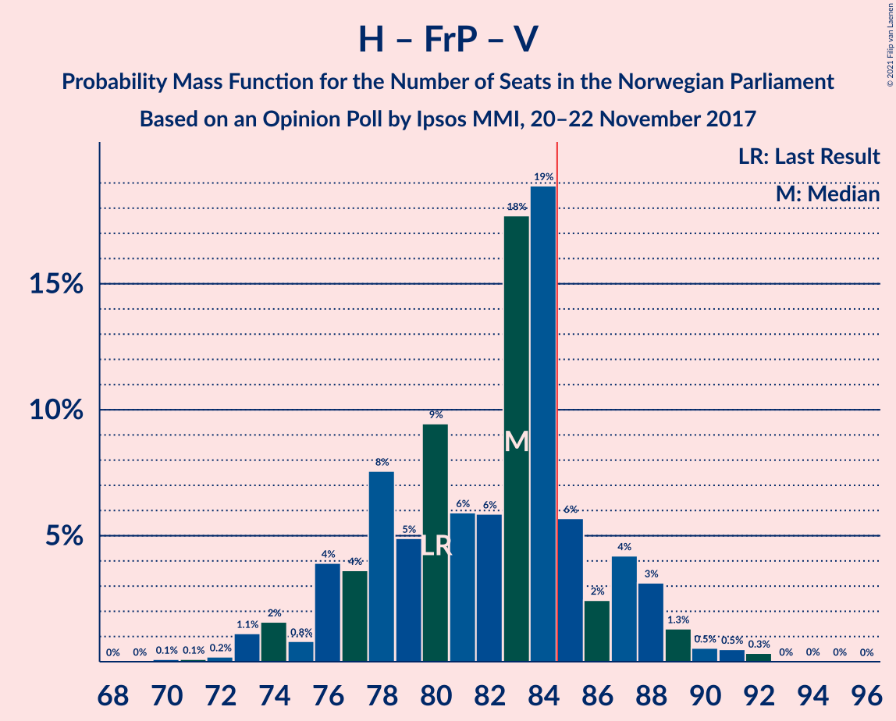

| Number of Seats | Probability | Accumulated | Special Marks |
|:---------------:|:-----------:|:-----------:|:-------------:|
| 70 | 0.1% | 100% |  |
| 71 | 0.1% | 99.9% |  |
| 72 | 0.2% | 99.8% |  |
| 73 | 1.1% | 99.6% |  |
| 74 | 2% | 98% |  |
| 75 | 0.8% | 97% |  |
| 76 | 4% | 96% |  |
| 77 | 4% | 92% |  |
| 78 | 8% | 89% |  |
| 79 | 5% | 81% |  |
| 80 | 9% | 76% | Last Result |
| 81 | 6% | 67% |  |
| 82 | 6% | 61% |  |
| 83 | 18% | 55% | Median |
| 84 | 19% | 37% |  |
| 85 | 6% | 18% | Majority |
| 86 | 2% | 13% |  |
| 87 | 4% | 10% |  |
| 88 | 3% | 6% |  |
| 89 | 1.3% | 3% |  |
| 90 | 0.5% | 1.5% |  |
| 91 | 0.5% | 0.9% |  |
| 92 | 0.3% | 0.4% |  |
| 93 | 0% | 0.1% |  |
| 94 | 0% | 0.1% |  |
| 95 | 0% | 0% |  |

### Arbeiderpartiet – Senterpartiet – Sosialistisk Venstreparti – Miljøpartiet De Grønne

| Number of Seats | Probability | Accumulated | Special Marks |
|:---------------:|:-----------:|:-----------:|:-------------:|
| 68 | 0.1% | 100% |  |
| 69 | 0.1% | 99.9% |  |
| 70 | 0.2% | 99.8% |  |
| 71 | 0.2% | 99.7% |  |
| 72 | 1.2% | 99.5% |  |
| 73 | 2% | 98% |  |
| 74 | 1.3% | 97% |  |
| 75 | 13% | 95% |  |
| 76 | 3% | 82% |  |
| 77 | 6% | 79% | Median |
| 78 | 3% | 74% |  |
| 79 | 11% | 70% |  |
| 80 | 6% | 59% | Last Result |
| 81 | 10% | 54% |  |
| 82 | 14% | 44% |  |
| 83 | 12% | 29% |  |
| 84 | 4% | 17% |  |
| 85 | 5% | 14% | Majority |
| 86 | 3% | 9% |  |
| 87 | 2% | 6% |  |
| 88 | 1.0% | 4% |  |
| 89 | 1.3% | 3% |  |
| 90 | 0.4% | 1.5% |  |
| 91 | 0.3% | 1.0% |  |
| 92 | 0.6% | 0.7% |  |
| 93 | 0.1% | 0.1% |  |
| 94 | 0% | 0% |  |

### Arbeiderpartiet – Senterpartiet – Sosialistisk Venstreparti – Rødt

| Number of Seats | Probability | Accumulated | Special Marks |
|:---------------:|:-----------:|:-----------:|:-------------:|
| 66 | 0.1% | 100% |  |
| 67 | 0.1% | 99.9% |  |
| 68 | 0.4% | 99.8% |  |
| 69 | 0.4% | 99.4% |  |
| 70 | 0.8% | 99.0% |  |
| 71 | 2% | 98% |  |
| 72 | 2% | 97% |  |
| 73 | 3% | 95% |  |
| 74 | 6% | 91% |  |
| 75 | 26% | 85% |  |
| 76 | 8% | 59% | Median |
| 77 | 12% | 51% |  |
| 78 | 4% | 39% |  |
| 79 | 13% | 35% |  |
| 80 | 4% | 22% | Last Result |
| 81 | 8% | 18% |  |
| 82 | 3% | 10% |  |
| 83 | 2% | 7% |  |
| 84 | 2% | 5% |  |
| 85 | 2% | 3% | Majority |
| 86 | 0.3% | 1.0% |  |
| 87 | 0.4% | 0.7% |  |
| 88 | 0.1% | 0.3% |  |
| 89 | 0.1% | 0.2% |  |
| 90 | 0.1% | 0.1% |  |
| 91 | 0% | 0% |  |

### Arbeiderpartiet – Senterpartiet – Sosialistisk Venstreparti

| Number of Seats | Probability | Accumulated | Special Marks |
|:---------------:|:-----------:|:-----------:|:-------------:|
| 64 | 0% | 100% |  |
| 65 | 0.1% | 99.9% |  |
| 66 | 0.2% | 99.9% |  |
| 67 | 0.4% | 99.7% |  |
| 68 | 0.6% | 99.3% |  |
| 69 | 0.9% | 98.7% |  |
| 70 | 2% | 98% |  |
| 71 | 2% | 96% |  |
| 72 | 4% | 93% |  |
| 73 | 17% | 89% |  |
| 74 | 16% | 72% |  |
| 75 | 11% | 56% | Median |
| 76 | 9% | 45% |  |
| 77 | 11% | 36% |  |
| 78 | 8% | 26% |  |
| 79 | 9% | 18% | Last Result |
| 80 | 3% | 10% |  |
| 81 | 2% | 7% |  |
| 82 | 2% | 5% |  |
| 83 | 2% | 3% |  |
| 84 | 0.9% | 1.5% |  |
| 85 | 0.3% | 0.5% | Majority |
| 86 | 0.1% | 0.3% |  |
| 87 | 0.1% | 0.1% |  |
| 88 | 0.1% | 0.1% |  |
| 89 | 0% | 0% |  |

### Arbeiderpartiet – Senterpartiet – Miljøpartiet De Grønne – Kristelig Folkeparti

| Number of Seats | Probability | Accumulated | Special Marks |
|:---------------:|:-----------:|:-----------:|:-------------:|
| 64 | 0.1% | 100% |  |
| 65 | 0.1% | 99.9% |  |
| 66 | 0.3% | 99.7% |  |
| 67 | 1.1% | 99.4% |  |
| 68 | 1.0% | 98% |  |
| 69 | 2% | 97% |  |
| 70 | 2% | 95% | Median |
| 71 | 4% | 93% |  |
| 72 | 6% | 88% |  |
| 73 | 4% | 82% |  |
| 74 | 19% | 78% |  |
| 75 | 9% | 59% |  |
| 76 | 18% | 50% |  |
| 77 | 5% | 32% | Last Result |
| 78 | 5% | 27% |  |
| 79 | 4% | 22% |  |
| 80 | 4% | 18% |  |
| 81 | 5% | 14% |  |
| 82 | 3% | 8% |  |
| 83 | 3% | 5% |  |
| 84 | 2% | 2% |  |
| 85 | 0.2% | 0.7% | Majority |
| 86 | 0.3% | 0.5% |  |
| 87 | 0.1% | 0.2% |  |
| 88 | 0% | 0.1% |  |
| 89 | 0% | 0% |  |

### Høyre – Fremskrittspartiet

| Number of Seats | Probability | Accumulated | Special Marks |
|:---------------:|:-----------:|:-----------:|:-------------:|
| 63 | 0.1% | 100% |  |
| 64 | 0.1% | 99.9% |  |
| 65 | 0.2% | 99.8% |  |
| 66 | 2% | 99.6% |  |
| 67 | 1.2% | 97% |  |
| 68 | 2% | 96% |  |
| 69 | 6% | 94% |  |
| 70 | 6% | 88% |  |
| 71 | 10% | 82% |  |
| 72 | 6% | 73% | Last Result |
| 73 | 6% | 66% |  |
| 74 | 15% | 60% | Median |
| 75 | 15% | 45% |  |
| 76 | 14% | 29% |  |
| 77 | 5% | 15% |  |
| 78 | 3% | 10% |  |
| 79 | 3% | 7% |  |
| 80 | 1.5% | 4% |  |
| 81 | 1.1% | 3% |  |
| 82 | 0.8% | 2% |  |
| 83 | 0.4% | 0.7% |  |
| 84 | 0.1% | 0.3% |  |
| 85 | 0.1% | 0.1% | Majority |
| 86 | 0.1% | 0.1% |  |
| 87 | 0% | 0% |  |

### Arbeiderpartiet – Senterpartiet – Kristelig Folkeparti

| Number of Seats | Probability | Accumulated | Special Marks |
|:---------------:|:-----------:|:-----------:|:-------------:|
| 60 | 0.1% | 100% |  |
| 61 | 0.6% | 99.9% |  |
| 62 | 0.3% | 99.3% |  |
| 63 | 0.8% | 99.0% |  |
| 64 | 2% | 98% |  |
| 65 | 2% | 96% |  |
| 66 | 8% | 94% |  |
| 67 | 6% | 85% |  |
| 68 | 11% | 79% | Median |
| 69 | 5% | 68% |  |
| 70 | 7% | 63% |  |
| 71 | 5% | 56% |  |
| 72 | 15% | 51% |  |
| 73 | 6% | 35% |  |
| 74 | 15% | 29% |  |
| 75 | 5% | 14% |  |
| 76 | 5% | 10% | Last Result |
| 77 | 2% | 5% |  |
| 78 | 1.0% | 3% |  |
| 79 | 0.8% | 2% |  |
| 80 | 0.5% | 0.9% |  |
| 81 | 0.2% | 0.4% |  |
| 82 | 0.1% | 0.2% |  |
| 83 | 0% | 0% |  |

### Arbeiderpartiet – Sosialistisk Venstreparti – Miljøpartiet De Grønne – Rødt

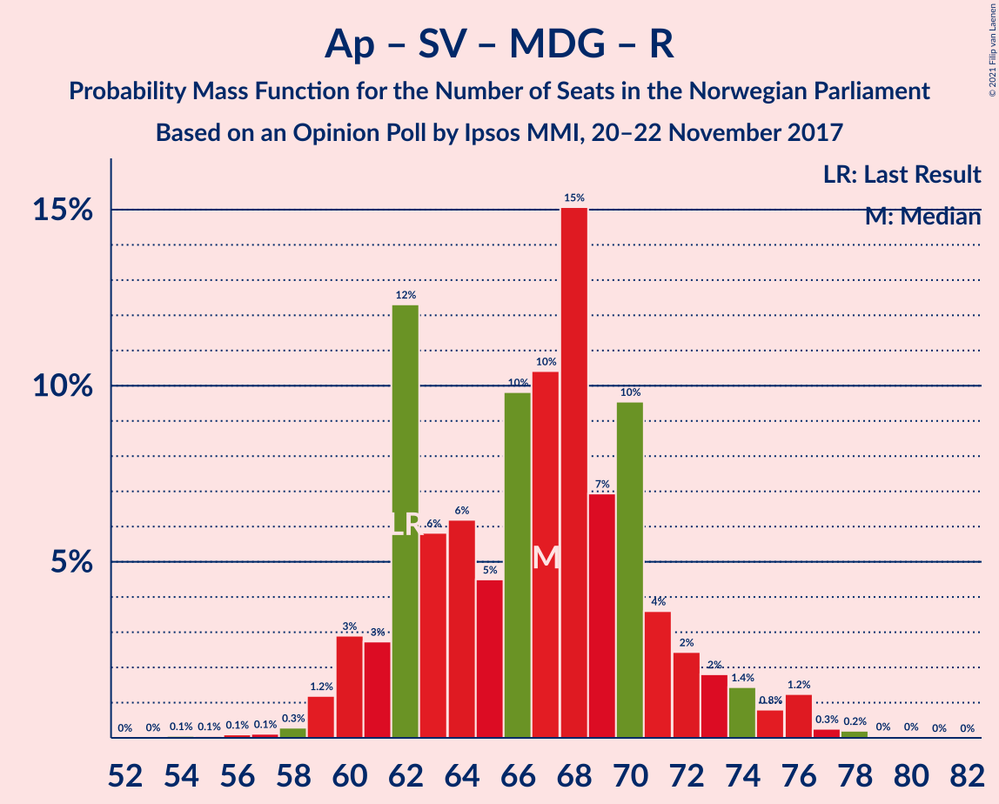

| Number of Seats | Probability | Accumulated | Special Marks |
|:---------------:|:-----------:|:-----------:|:-------------:|
| 54 | 0.1% | 100% |  |
| 55 | 0.1% | 99.9% |  |
| 56 | 0.1% | 99.9% |  |
| 57 | 0.1% | 99.8% |  |
| 58 | 0.3% | 99.6% |  |
| 59 | 1.2% | 99.3% |  |
| 60 | 3% | 98% |  |
| 61 | 3% | 95% |  |
| 62 | 12% | 93% | Last Result |
| 63 | 6% | 80% | Median |
| 64 | 6% | 74% |  |
| 65 | 5% | 68% |  |
| 66 | 10% | 64% |  |
| 67 | 10% | 54% |  |
| 68 | 15% | 43% |  |
| 69 | 7% | 28% |  |
| 70 | 10% | 21% |  |
| 71 | 4% | 12% |  |
| 72 | 2% | 8% |  |
| 73 | 2% | 6% |  |
| 74 | 1.4% | 4% |  |
| 75 | 0.8% | 3% |  |
| 76 | 1.2% | 2% |  |
| 77 | 0.3% | 0.6% |  |
| 78 | 0.2% | 0.3% |  |
| 79 | 0% | 0.1% |  |
| 80 | 0% | 0.1% |  |
| 81 | 0% | 0% |  |

### Arbeiderpartiet – Senterpartiet

| Number of Seats | Probability | Accumulated | Special Marks |
|:---------------:|:-----------:|:-----------:|:-------------:|
| 57 | 0.2% | 100% |  |
| 58 | 0.2% | 99.8% |  |
| 59 | 0.9% | 99.6% |  |
| 60 | 2% | 98.7% |  |
| 61 | 3% | 97% |  |
| 62 | 4% | 93% |  |
| 63 | 10% | 90% |  |
| 64 | 15% | 79% |  |
| 65 | 14% | 64% | Median |
| 66 | 14% | 50% |  |
| 67 | 12% | 36% |  |
| 68 | 5% | 25% | Last Result |
| 69 | 6% | 19% |  |
| 70 | 3% | 13% |  |
| 71 | 5% | 11% |  |
| 72 | 3% | 5% |  |
| 73 | 2% | 3% |  |
| 74 | 0.5% | 0.9% |  |
| 75 | 0.2% | 0.5% |  |
| 76 | 0.1% | 0.2% |  |
| 77 | 0.1% | 0.1% |  |
| 78 | 0% | 0.1% |  |
| 79 | 0% | 0% |  |

### Arbeiderpartiet – Sosialistisk Venstreparti

| Number of Seats | Probability | Accumulated | Special Marks |
|:---------------:|:-----------:|:-----------:|:-------------:|
| 49 | 0% | 100% |  |
| 50 | 0.1% | 99.9% |  |
| 51 | 0.4% | 99.8% |  |
| 52 | 0.4% | 99.4% |  |
| 53 | 0.4% | 99.0% |  |
| 54 | 0.8% | 98.6% |  |
| 55 | 3% | 98% |  |
| 56 | 6% | 95% |  |
| 57 | 5% | 90% |  |
| 58 | 17% | 84% |  |
| 59 | 17% | 68% |  |
| 60 | 8% | 51% | Last Result, Median |
| 61 | 9% | 43% |  |
| 62 | 13% | 33% |  |
| 63 | 9% | 21% |  |
| 64 | 4% | 11% |  |
| 65 | 2% | 7% |  |
| 66 | 2% | 5% |  |
| 67 | 2% | 3% |  |
| 68 | 0.2% | 0.9% |  |
| 69 | 0.4% | 0.7% |  |
| 70 | 0.3% | 0.3% |  |
| 71 | 0% | 0.1% |  |
| 72 | 0% | 0% |  |

### Høyre – Venstre – Kristelig Folkeparti

| Number of Seats | Probability | Accumulated | Special Marks |
|:---------------:|:-----------:|:-----------:|:-------------:|
| 45 | 0.1% | 100% |  |
| 46 | 0% | 99.9% |  |
| 47 | 0.1% | 99.9% |  |
| 48 | 0.8% | 99.8% |  |
| 49 | 0.3% | 98.9% |  |
| 50 | 0.7% | 98.6% |  |
| 51 | 2% | 98% |  |
| 52 | 2% | 95% |  |
| 53 | 4% | 93% |  |
| 54 | 3% | 90% |  |
| 55 | 10% | 87% |  |
| 56 | 8% | 76% |  |
| 57 | 5% | 69% | Median |
| 58 | 15% | 64% |  |
| 59 | 7% | 49% |  |
| 60 | 9% | 42% |  |
| 61 | 10% | 33% | Last Result |
| 62 | 13% | 23% |  |
| 63 | 4% | 10% |  |
| 64 | 2% | 7% |  |
| 65 | 1.4% | 5% |  |
| 66 | 2% | 4% |  |
| 67 | 1.3% | 2% |  |
| 68 | 0.1% | 0.3% |  |
| 69 | 0.1% | 0.2% |  |
| 70 | 0.1% | 0.1% |  |
| 71 | 0% | 0% |  |

### Senterpartiet – Venstre – Kristelig Folkeparti

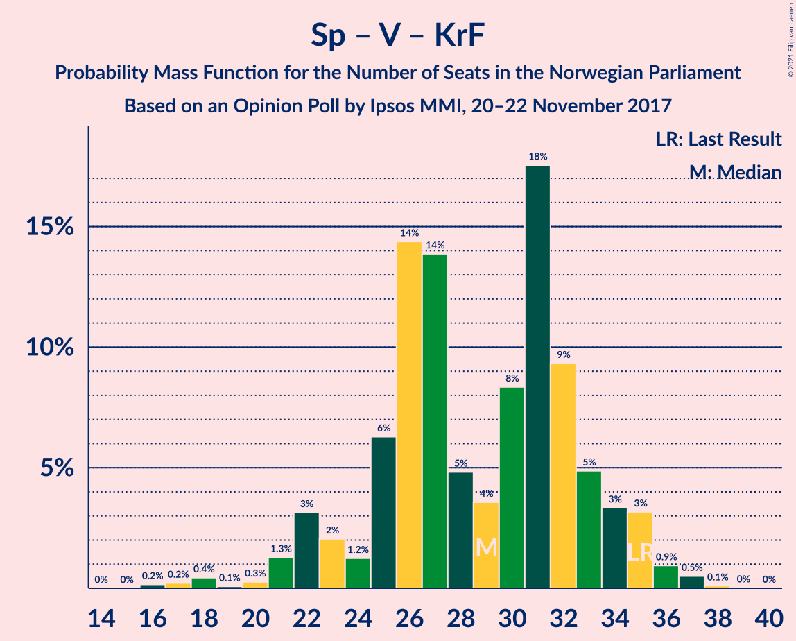

| Number of Seats | Probability | Accumulated | Special Marks |
|:---------------:|:-----------:|:-----------:|:-------------:|
| 16 | 0.2% | 100% |  |
| 17 | 0.2% | 99.8% |  |
| 18 | 0.4% | 99.6% |  |
| 19 | 0.1% | 99.2% |  |
| 20 | 0.3% | 99.1% |  |
| 21 | 1.3% | 98.8% |  |
| 22 | 3% | 98% |  |
| 23 | 2% | 94% |  |
| 24 | 1.2% | 92% |  |
| 25 | 6% | 91% |  |
| 26 | 14% | 85% |  |
| 27 | 14% | 70% | Median |
| 28 | 5% | 57% |  |
| 29 | 4% | 52% |  |
| 30 | 8% | 48% |  |
| 31 | 18% | 40% |  |
| 32 | 9% | 22% |  |
| 33 | 5% | 13% |  |
| 34 | 3% | 8% |  |
| 35 | 3% | 5% | Last Result |
| 36 | 0.9% | 2% |  |
| 37 | 0.5% | 0.6% |  |
| 38 | 0.1% | 0.1% |  |
| 39 | 0% | 0% |  |

## Technical Information

### Opinion Poll

+ **Polling firm:** Ipsos MMI
+ **Commissioner(s):** —
+ **Fieldwork period:** 20–22 November 2017

### Calculations

+ **Sample size:** 918
+ **Simulations done:** 1,048,576
+ **Error estimate:** 1.74%

