# Opinion Poll by Norfakta, 5–6 December 2017

<a href="#voting-intentions">Voting Intentions</a> | <a href="#seats">Seats</a> | <a href="#coalitions">Coalitions</a> | <a href="#technical-information">Technical Information</a>

## Voting Intentions

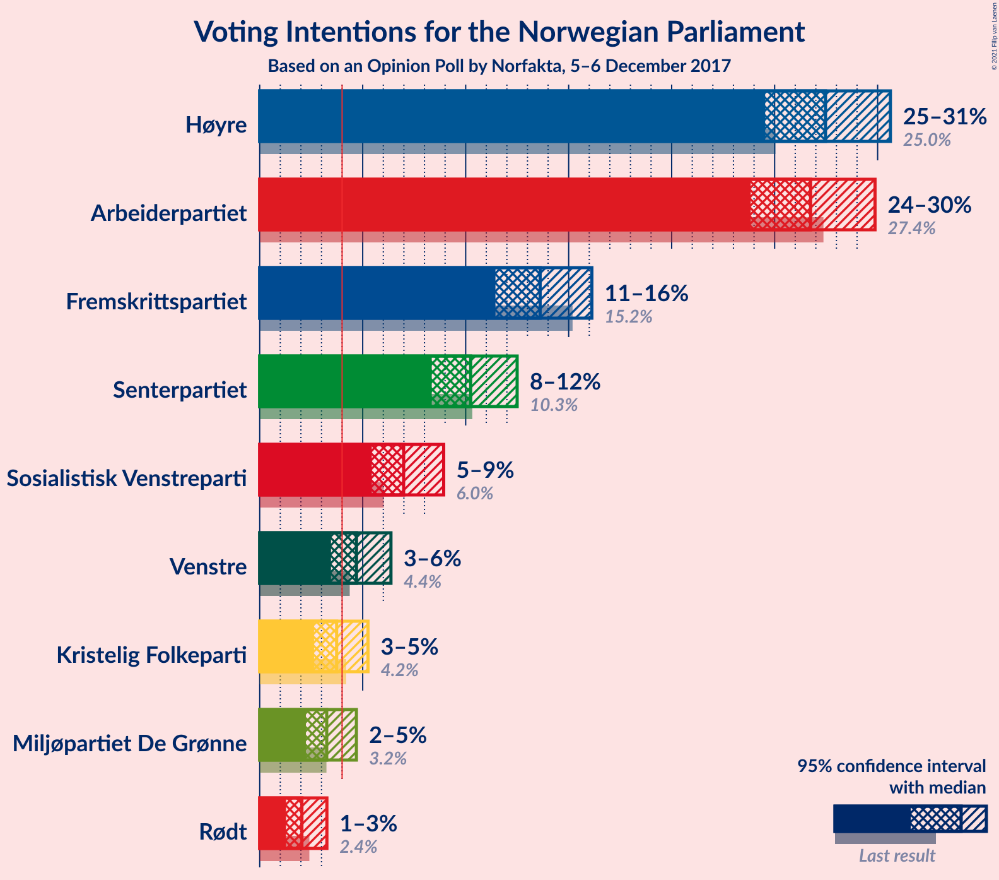

### Confidence Intervals

| Party | Last Result | Poll Result | 80% Confidence Interval | 90% Confidence Interval | 95% Confidence Interval | 99% Confidence Interval |
|:-----:|:-----------:|:-----------:|:-----------------------:|:-----------------------:|:-----------------------:|:-----------------------:|
| Høyre | 25.0% | 27.5% | 25.5–29.5% |25.0–30.1% |24.5–30.6% |23.6–31.6% |
| Arbeiderpartiet | 27.4% | 26.7% | 24.8–28.8% |24.3–29.4% |23.8–29.9% |23.0–30.9% |
| Fremskrittspartiet | 15.2% | 13.6% | 12.2–15.3% |11.8–15.7% |11.4–16.1% |10.8–16.9% |
| Senterpartiet | 10.3% | 10.2% | 9.0–11.7% |8.7–12.1% |8.4–12.5% |7.8–13.2% |
| Sosialistisk Venstreparti | 6.0% | 7.0% | 6.0–8.3% |5.7–8.6% |5.4–8.9% |5.0–9.6% |
| Venstre | 4.4% | 4.7% | 3.9–5.8% |3.6–6.1% |3.5–6.4% |3.1–6.9% |
| Kristelig Folkeparti | 4.2% | 3.7% | 3.0–4.7% |2.8–5.0% |2.6–5.3% |2.3–5.8% |
| Miljøpartiet De Grønne | 3.2% | 3.3% | 2.6–4.2% |2.4–4.5% |2.2–4.7% |2.0–5.2% |
| Rødt | 2.4% | 2.0% | 1.5–2.8% |1.4–3.1% |1.3–3.3% |1.1–3.7% |

*Note:* The poll result column reflects the actual value used in the calculations. Published results may vary slightly, and in addition be rounded to fewer digits.

## Seats

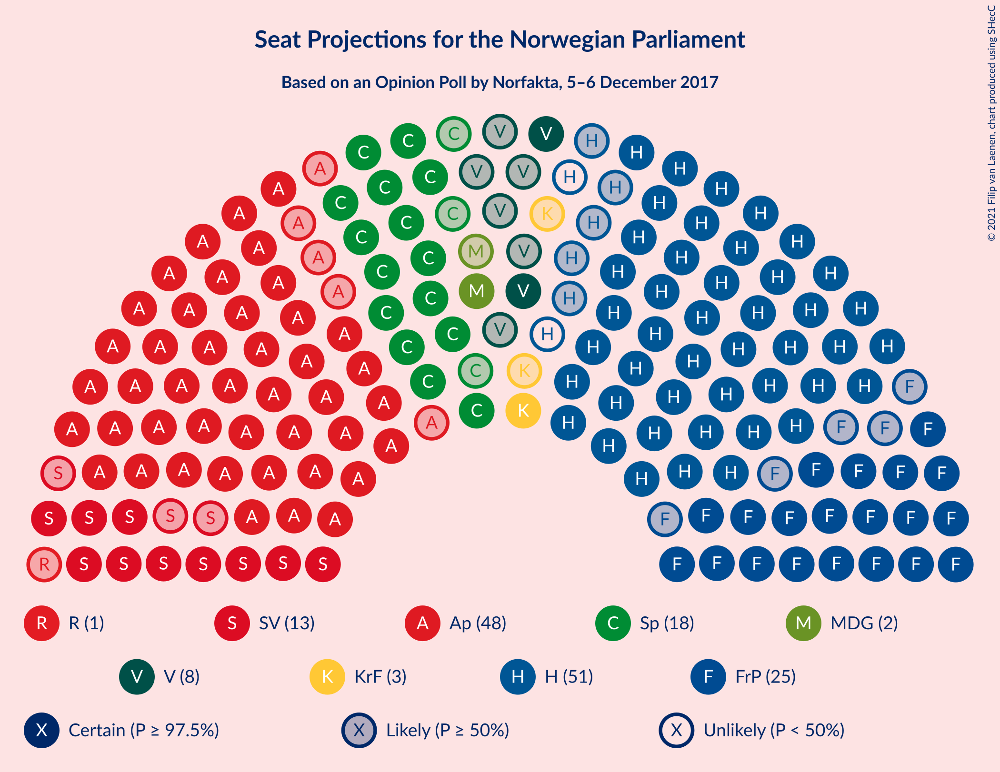

### Confidence Intervals

| Party | Last Result | Median | 80% Confidence Interval | 90% Confidence Interval | 95% Confidence Interval | 99% Confidence Interval |
|:-----:|:-----------:|:------:|:-----------------------:|:-----------------------:|:-----------------------:|:-----------------------:|
| <a href="#høyre">Høyre</a> | 45 | 49 | 45–53 |44–54 |44–55 |42–57 |
| <a href="#arbeiderpartiet">Arbeiderpartiet</a> | 49 | 48 | 45–52 |43–53 |43–54 |41–56 |
| <a href="#fremskrittspartiet">Fremskrittspartiet</a> | 27 | 25 | 22–28 |21–29 |20–29 |19–30 |
| <a href="#senterpartiet">Senterpartiet</a> | 19 | 18 | 16–21 |15–23 |15–23 |14–24 |
| <a href="#sosialistisk-venstreparti">Sosialistisk Venstreparti</a> | 11 | 13 | 11–15 |10–15 |10–16 |9–17 |
| <a href="#venstre">Venstre</a> | 8 | 8 | 2–10 |2–11 |2–11 |2–13 |
| <a href="#kristelig-folkeparti">Kristelig Folkeparti</a> | 8 | 3 | 1–8 |1–9 |1–9 |0–10 |
| <a href="#miljøpartiet-de-grønne">Miljøpartiet De Grønne</a> | 1 | 2 | 1–7 |1–8 |1–8 |1–9 |
| <a href="#rødt">Rødt</a> | 1 | 1 | 1 |1–2 |0–2 |0–2 |

### Høyre

*For a full overview of the results for this party, see the [Høyre](party-høyre.html) page.*

| Number of Seats | Probability | Accumulated | Special Marks |
|:---------------:|:-----------:|:-----------:|:-------------:|
| 40 | 0.1% | 100% |  |
| 41 | 0.2% | 99.8% |  |
| 42 | 0.7% | 99.6% |  |
| 43 | 1.1% | 98.9% |  |
| 44 | 4% | 98% |  |
| 45 | 8% | 94% | Last Result |
| 46 | 6% | 86% |  |
| 47 | 12% | 81% |  |
| 48 | 10% | 69% |  |
| 49 | 11% | 58% | Median |
| 50 | 9% | 48% |  |
| 51 | 14% | 39% |  |
| 52 | 8% | 25% |  |
| 53 | 8% | 16% |  |
| 54 | 6% | 9% |  |
| 55 | 2% | 3% |  |
| 56 | 0.6% | 1.2% |  |
| 57 | 0.3% | 0.7% |  |
| 58 | 0.2% | 0.4% |  |
| 59 | 0.1% | 0.2% |  |
| 60 | 0% | 0.1% |  |
| 61 | 0% | 0% |  |

### Arbeiderpartiet

*For a full overview of the results for this party, see the [Arbeiderpartiet](party-arbeiderpartiet.html) page.*

| Number of Seats | Probability | Accumulated | Special Marks |
|:---------------:|:-----------:|:-----------:|:-------------:|
| 40 | 0.1% | 100% |  |
| 41 | 0.6% | 99.8% |  |
| 42 | 1.0% | 99.3% |  |
| 43 | 3% | 98% |  |
| 44 | 3% | 95% |  |
| 45 | 7% | 91% |  |
| 46 | 10% | 84% |  |
| 47 | 12% | 74% |  |
| 48 | 18% | 62% | Median |
| 49 | 17% | 45% | Last Result |
| 50 | 9% | 27% |  |
| 51 | 7% | 18% |  |
| 52 | 4% | 11% |  |
| 53 | 3% | 7% |  |
| 54 | 2% | 4% |  |
| 55 | 1.2% | 2% |  |
| 56 | 0.3% | 0.6% |  |
| 57 | 0.2% | 0.3% |  |
| 58 | 0% | 0.1% |  |
| 59 | 0% | 0.1% |  |
| 60 | 0% | 0% |  |

### Fremskrittspartiet

*For a full overview of the results for this party, see the [Fremskrittspartiet](party-fremskrittspartiet.html) page.*

| Number of Seats | Probability | Accumulated | Special Marks |
|:---------------:|:-----------:|:-----------:|:-------------:|
| 17 | 0% | 100% |  |
| 18 | 0.2% | 99.9% |  |
| 19 | 0.8% | 99.7% |  |
| 20 | 2% | 98.9% |  |
| 21 | 4% | 97% |  |
| 22 | 15% | 93% |  |
| 23 | 13% | 78% |  |
| 24 | 8% | 65% |  |
| 25 | 19% | 57% | Median |
| 26 | 19% | 37% |  |
| 27 | 7% | 18% | Last Result |
| 28 | 4% | 11% |  |
| 29 | 4% | 6% |  |
| 30 | 2% | 2% |  |
| 31 | 0.3% | 0.4% |  |
| 32 | 0.1% | 0.1% |  |
| 33 | 0% | 0.1% |  |
| 34 | 0% | 0% |  |

### Senterpartiet

*For a full overview of the results for this party, see the [Senterpartiet](party-senterpartiet.html) page.*

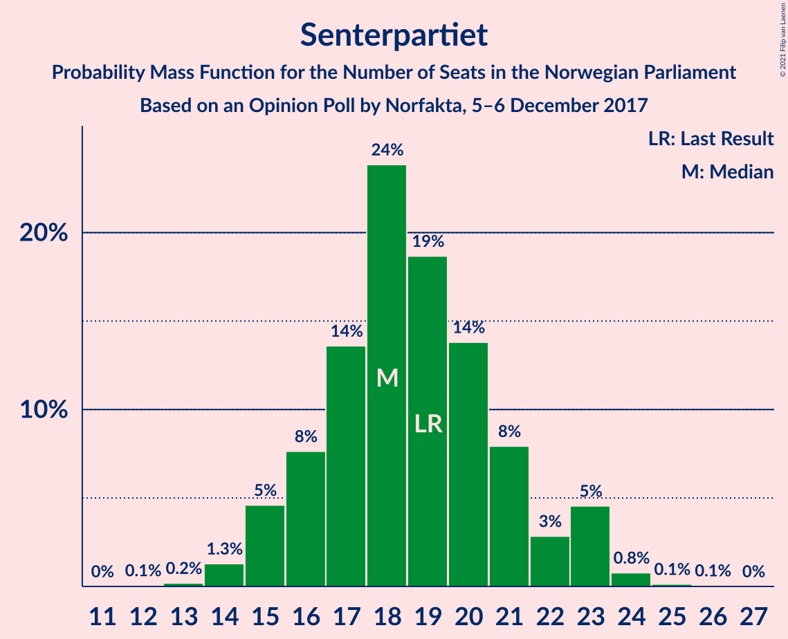

| Number of Seats | Probability | Accumulated | Special Marks |
|:---------------:|:-----------:|:-----------:|:-------------:|
| 12 | 0.1% | 100% |  |
| 13 | 0.2% | 99.9% |  |
| 14 | 1.3% | 99.7% |  |
| 15 | 5% | 98% |  |
| 16 | 8% | 94% |  |
| 17 | 14% | 86% |  |
| 18 | 24% | 73% | Median |
| 19 | 19% | 49% | Last Result |
| 20 | 14% | 30% |  |
| 21 | 8% | 16% |  |
| 22 | 3% | 8% |  |
| 23 | 5% | 6% |  |
| 24 | 0.8% | 1.0% |  |
| 25 | 0.1% | 0.2% |  |
| 26 | 0.1% | 0.1% |  |
| 27 | 0% | 0% |  |

### Sosialistisk Venstreparti

*For a full overview of the results for this party, see the [Sosialistisk Venstreparti](party-sosialistiskvenstreparti.html) page.*

| Number of Seats | Probability | Accumulated | Special Marks |
|:---------------:|:-----------:|:-----------:|:-------------:|
| 8 | 0.2% | 100% |  |
| 9 | 2% | 99.8% |  |
| 10 | 6% | 98% |  |
| 11 | 15% | 92% | Last Result |
| 12 | 21% | 77% |  |
| 13 | 20% | 56% | Median |
| 14 | 21% | 35% |  |
| 15 | 11% | 15% |  |
| 16 | 3% | 4% |  |
| 17 | 0.8% | 1.1% |  |
| 18 | 0.3% | 0.3% |  |
| 19 | 0.1% | 0.1% |  |
| 20 | 0% | 0% |  |

### Venstre

*For a full overview of the results for this party, see the [Venstre](party-venstre.html) page.*

| Number of Seats | Probability | Accumulated | Special Marks |
|:---------------:|:-----------:|:-----------:|:-------------:|
| 2 | 12% | 100% |  |
| 3 | 4% | 88% |  |
| 4 | 0% | 84% |  |
| 5 | 0% | 84% |  |
| 6 | 0% | 84% |  |
| 7 | 9% | 84% |  |
| 8 | 30% | 75% | Last Result, Median |
| 9 | 24% | 46% |  |
| 10 | 13% | 21% |  |
| 11 | 6% | 8% |  |
| 12 | 0.6% | 1.4% |  |
| 13 | 0.7% | 0.7% |  |
| 14 | 0% | 0% |  |

### Kristelig Folkeparti

*For a full overview of the results for this party, see the [Kristelig Folkeparti](party-kristeligfolkeparti.html) page.*

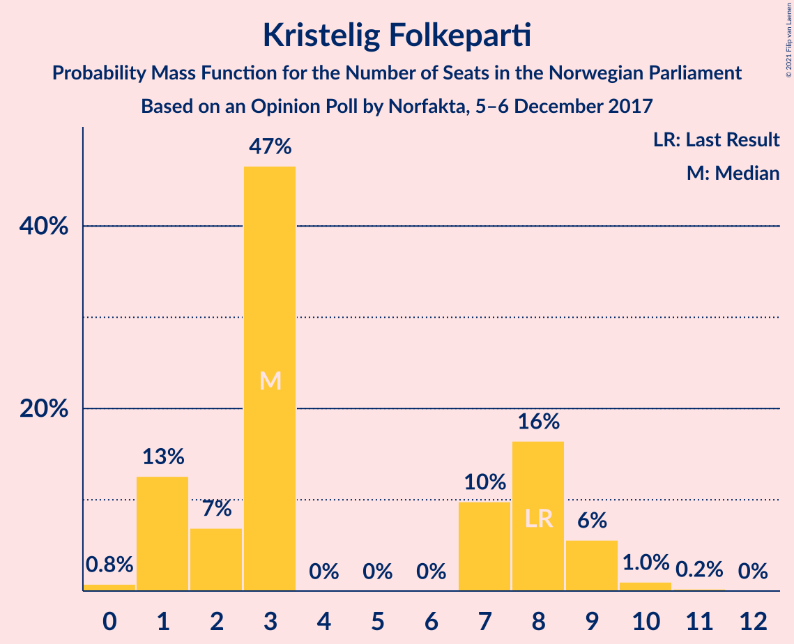

| Number of Seats | Probability | Accumulated | Special Marks |
|:---------------:|:-----------:|:-----------:|:-------------:|
| 0 | 0.8% | 100% |  |
| 1 | 13% | 99.2% |  |
| 2 | 7% | 87% |  |
| 3 | 47% | 80% | Median |
| 4 | 0% | 33% |  |
| 5 | 0% | 33% |  |
| 6 | 0% | 33% |  |
| 7 | 10% | 33% |  |
| 8 | 16% | 23% | Last Result |
| 9 | 6% | 7% |  |
| 10 | 1.0% | 1.3% |  |
| 11 | 0.2% | 0.3% |  |
| 12 | 0% | 0% |  |

### Miljøpartiet De Grønne

*For a full overview of the results for this party, see the [Miljøpartiet De Grønne](party-miljøpartietdegrønne.html) page.*

| Number of Seats | Probability | Accumulated | Special Marks |
|:---------------:|:-----------:|:-----------:|:-------------:|
| 0 | 0.3% | 100% |  |
| 1 | 38% | 99.7% | Last Result |
| 2 | 47% | 62% | Median |
| 3 | 2% | 15% |  |
| 4 | 0% | 13% |  |
| 5 | 0% | 13% |  |
| 6 | 0% | 13% |  |
| 7 | 3% | 13% |  |
| 8 | 8% | 10% |  |
| 9 | 1.2% | 2% |  |
| 10 | 0.4% | 0.4% |  |
| 11 | 0% | 0% |  |

### Rødt

*For a full overview of the results for this party, see the [Rødt](party-rødt.html) page.*

| Number of Seats | Probability | Accumulated | Special Marks |
|:---------------:|:-----------:|:-----------:|:-------------:|
| 0 | 4% | 100% |  |
| 1 | 88% | 96% | Last Result, Median |
| 2 | 8% | 8% |  |
| 3 | 0% | 0.1% |  |
| 4 | 0% | 0.1% |  |
| 5 | 0% | 0.1% |  |
| 6 | 0% | 0.1% |  |
| 7 | 0.1% | 0.1% |  |
| 8 | 0% | 0% |  |

## Coalitions

### Confidence Intervals

| Coalition | Last Result | Median | Majority? | 80% Confidence Interval | 90% Confidence Interval | 95% Confidence Interval | 99% Confidence Interval |
|:---------:|:-----------:|:------:|:---------:|:-----------------------:|:-----------------------:|:-----------------------:|:-----------------------:|
| Høyre – Fremskrittspartiet – Senterpartiet – Venstre – Kristelig Folkeparti | 107 | 104 | 100% | 100–108 | 98–110 | 97–111 | 94–113 |
| Høyre – Fremskrittspartiet – Venstre – Kristelig Folkeparti – Miljøpartiet De Grønne | 89 | 88 | 83% | 83–93 | 82–94 | 82–95 | 80–98 |
| Arbeiderpartiet – Senterpartiet – Sosialistisk Venstreparti – Kristelig Folkeparti – Miljøpartiet De Grønne | 88 | 86 | 71% | 81–91 | 80–93 | 80–94 | 77–97 |
| Høyre – Fremskrittspartiet – Venstre – Kristelig Folkeparti | 88 | 86 | 66% | 81–91 | 80–91 | 79–93 | 76–95 |
| Arbeiderpartiet – Senterpartiet – Sosialistisk Venstreparti – Miljøpartiet De Grønne – Rødt | 81 | 83 | 34% | 78–88 | 78–89 | 76–90 | 74–93 |
| Arbeiderpartiet – Senterpartiet – Sosialistisk Venstreparti – Miljøpartiet De Grønne | 80 | 82 | 24% | 77–87 | 77–88 | 75–89 | 73–93 |
| Høyre – Fremskrittspartiet – Venstre | 80 | 82 | 19% | 77–87 | 75–88 | 74–88 | 71–91 |
| Arbeiderpartiet – Senterpartiet – Sosialistisk Venstreparti – Rødt | 80 | 81 | 17% | 76–86 | 75–87 | 74–87 | 71–89 |
| Arbeiderpartiet – Senterpartiet – Sosialistisk Venstreparti | 79 | 80 | 10% | 75–85 | 74–86 | 73–86 | 70–88 |
| Arbeiderpartiet – Senterpartiet – Kristelig Folkeparti – Miljøpartiet De Grønne | 77 | 73 | 0.3% | 69–78 | 68–80 | 67–82 | 65–84 |
| Høyre – Fremskrittspartiet | 72 | 74 | 0.2% | 69–79 | 68–80 | 67–81 | 64–83 |
| Arbeiderpartiet – Senterpartiet – Kristelig Folkeparti | 76 | 71 | 0% | 67–75 | 65–77 | 65–78 | 62–80 |
| Arbeiderpartiet – Senterpartiet | 68 | 67 | 0% | 62–71 | 61–72 | 60–73 | 59–75 |
| Høyre – Venstre – Kristelig Folkeparti | 61 | 61 | 0% | 57–66 | 55–68 | 55–69 | 52–71 |
| Arbeiderpartiet – Sosialistisk Venstreparti | 60 | 61 | 0% | 57–65 | 56–66 | 55–67 | 53–69 |
| Senterpartiet – Venstre – Kristelig Folkeparti | 35 | 31 | 0% | 26–35 | 24–36 | 24–37 | 21–40 |

### Høyre – Fremskrittspartiet – Senterpartiet – Venstre – Kristelig Folkeparti

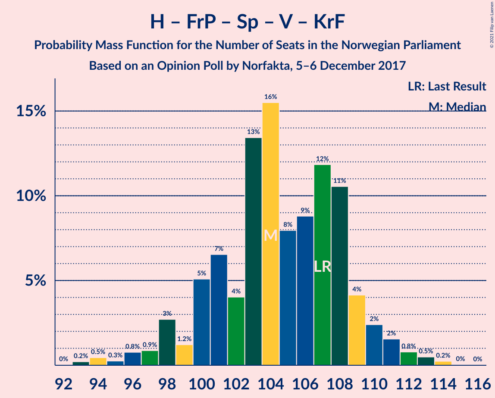

| Number of Seats | Probability | Accumulated | Special Marks |
|:---------------:|:-----------:|:-----------:|:-------------:|
| 92 | 0% | 100% |  |
| 93 | 0.2% | 99.9% |  |
| 94 | 0.5% | 99.7% |  |
| 95 | 0.3% | 99.3% |  |
| 96 | 0.8% | 99.0% |  |
| 97 | 0.9% | 98% |  |
| 98 | 3% | 97% |  |
| 99 | 1.2% | 95% |  |
| 100 | 5% | 93% |  |
| 101 | 7% | 88% |  |
| 102 | 4% | 82% |  |
| 103 | 13% | 78% | Median |
| 104 | 16% | 64% |  |
| 105 | 8% | 49% |  |
| 106 | 9% | 41% |  |
| 107 | 12% | 32% | Last Result |
| 108 | 11% | 20% |  |
| 109 | 4% | 10% |  |
| 110 | 2% | 6% |  |
| 111 | 2% | 3% |  |
| 112 | 0.8% | 2% |  |
| 113 | 0.5% | 0.8% |  |
| 114 | 0.2% | 0.3% |  |
| 115 | 0% | 0.1% |  |
| 116 | 0% | 0% |  |

### Høyre – Fremskrittspartiet – Venstre – Kristelig Folkeparti – Miljøpartiet De Grønne

| Number of Seats | Probability | Accumulated | Special Marks |
|:---------------:|:-----------:|:-----------:|:-------------:|
| 76 | 0% | 100% |  |
| 77 | 0% | 99.9% |  |
| 78 | 0.1% | 99.9% |  |
| 79 | 0.3% | 99.8% |  |
| 80 | 0.2% | 99.6% |  |
| 81 | 0.8% | 99.3% |  |
| 82 | 4% | 98.6% |  |
| 83 | 5% | 95% |  |
| 84 | 6% | 89% |  |
| 85 | 4% | 83% | Majority |
| 86 | 8% | 79% |  |
| 87 | 9% | 70% | Median |
| 88 | 17% | 61% |  |
| 89 | 8% | 44% | Last Result |
| 90 | 4% | 36% |  |
| 91 | 11% | 32% |  |
| 92 | 7% | 21% |  |
| 93 | 7% | 14% |  |
| 94 | 3% | 7% |  |
| 95 | 2% | 4% |  |
| 96 | 1.1% | 2% |  |
| 97 | 0.5% | 1.4% |  |
| 98 | 0.6% | 0.8% |  |
| 99 | 0.2% | 0.2% |  |
| 100 | 0.1% | 0.1% |  |
| 101 | 0% | 0% |  |

### Arbeiderpartiet – Senterpartiet – Sosialistisk Venstreparti – Kristelig Folkeparti – Miljøpartiet De Grønne

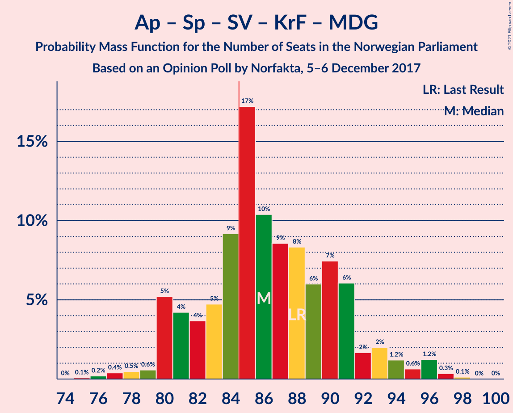

| Number of Seats | Probability | Accumulated | Special Marks |
|:---------------:|:-----------:|:-----------:|:-------------:|
| 75 | 0.1% | 100% |  |
| 76 | 0.2% | 99.9% |  |
| 77 | 0.4% | 99.7% |  |
| 78 | 0.5% | 99.3% |  |
| 79 | 0.6% | 98.8% |  |
| 80 | 5% | 98% |  |
| 81 | 4% | 93% |  |
| 82 | 4% | 89% |  |
| 83 | 5% | 85% |  |
| 84 | 9% | 80% | Median |
| 85 | 17% | 71% | Majority |
| 86 | 10% | 54% |  |
| 87 | 9% | 44% |  |
| 88 | 8% | 35% | Last Result |
| 89 | 6% | 27% |  |
| 90 | 7% | 21% |  |
| 91 | 6% | 13% |  |
| 92 | 2% | 7% |  |
| 93 | 2% | 6% |  |
| 94 | 1.2% | 4% |  |
| 95 | 0.6% | 2% |  |
| 96 | 1.2% | 2% |  |
| 97 | 0.3% | 0.5% |  |
| 98 | 0.1% | 0.2% |  |
| 99 | 0% | 0% |  |

### Høyre – Fremskrittspartiet – Venstre – Kristelig Folkeparti

| Number of Seats | Probability | Accumulated | Special Marks |
|:---------------:|:-----------:|:-----------:|:-------------:|
| 73 | 0% | 100% |  |
| 74 | 0.1% | 99.9% |  |
| 75 | 0.3% | 99.9% |  |
| 76 | 0.4% | 99.5% |  |
| 77 | 0.3% | 99.2% |  |
| 78 | 0.9% | 98.9% |  |
| 79 | 1.4% | 98% |  |
| 80 | 4% | 97% |  |
| 81 | 7% | 92% |  |
| 82 | 5% | 86% |  |
| 83 | 7% | 81% |  |
| 84 | 8% | 73% |  |
| 85 | 6% | 66% | Median, Majority |
| 86 | 18% | 60% |  |
| 87 | 9% | 42% |  |
| 88 | 4% | 33% | Last Result |
| 89 | 9% | 28% |  |
| 90 | 6% | 20% |  |
| 91 | 8% | 13% |  |
| 92 | 1.1% | 5% |  |
| 93 | 2% | 4% |  |
| 94 | 1.1% | 2% |  |
| 95 | 0.4% | 0.8% |  |
| 96 | 0.2% | 0.4% |  |
| 97 | 0.1% | 0.1% |  |
| 98 | 0.1% | 0.1% |  |
| 99 | 0% | 0% |  |

### Arbeiderpartiet – Senterpartiet – Sosialistisk Venstreparti – Miljøpartiet De Grønne – Rødt

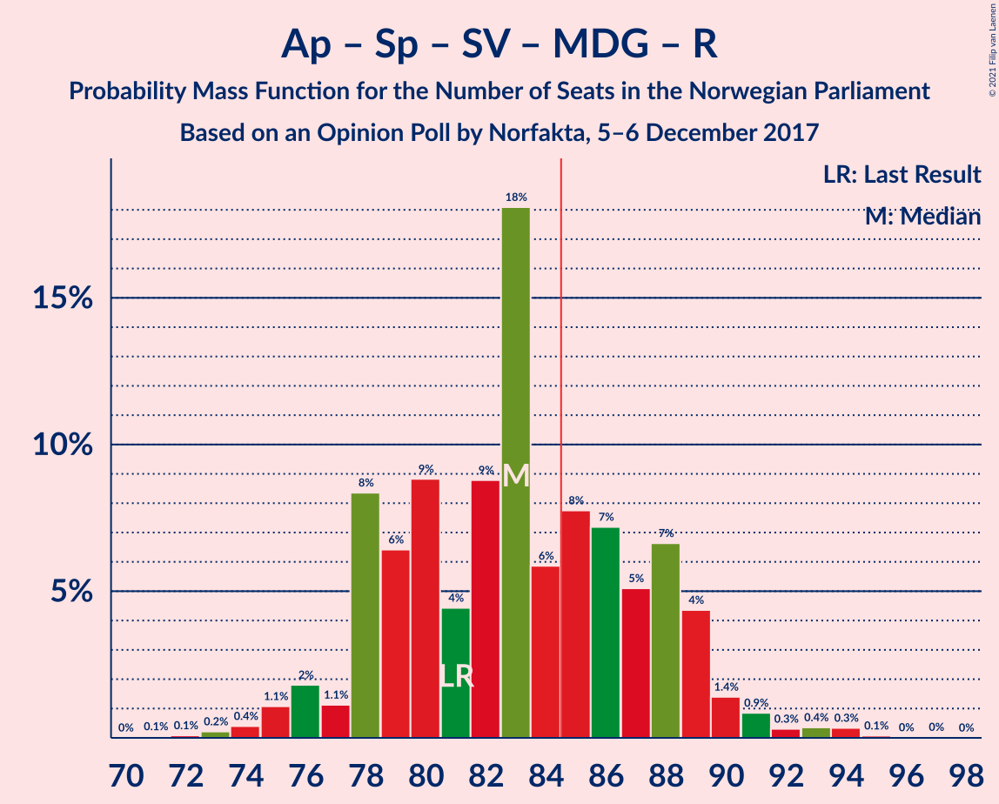

| Number of Seats | Probability | Accumulated | Special Marks |
|:---------------:|:-----------:|:-----------:|:-------------:|
| 71 | 0.1% | 100% |  |
| 72 | 0.1% | 99.9% |  |
| 73 | 0.2% | 99.9% |  |
| 74 | 0.4% | 99.6% |  |
| 75 | 1.1% | 99.2% |  |
| 76 | 2% | 98% |  |
| 77 | 1.1% | 96% |  |
| 78 | 8% | 95% |  |
| 79 | 6% | 87% |  |
| 80 | 9% | 80% |  |
| 81 | 4% | 72% | Last Result |
| 82 | 9% | 67% | Median |
| 83 | 18% | 58% |  |
| 84 | 6% | 40% |  |
| 85 | 8% | 34% | Majority |
| 86 | 7% | 27% |  |
| 87 | 5% | 19% |  |
| 88 | 7% | 14% |  |
| 89 | 4% | 8% |  |
| 90 | 1.4% | 3% |  |
| 91 | 0.9% | 2% |  |
| 92 | 0.3% | 1.1% |  |
| 93 | 0.4% | 0.8% |  |
| 94 | 0.3% | 0.5% |  |
| 95 | 0.1% | 0.1% |  |
| 96 | 0% | 0.1% |  |
| 97 | 0% | 0% |  |

### Arbeiderpartiet – Senterpartiet – Sosialistisk Venstreparti – Miljøpartiet De Grønne

| Number of Seats | Probability | Accumulated | Special Marks |
|:---------------:|:-----------:|:-----------:|:-------------:|
| 70 | 0.1% | 100% |  |
| 71 | 0.1% | 99.9% |  |
| 72 | 0.2% | 99.9% |  |
| 73 | 0.4% | 99.6% |  |
| 74 | 1.3% | 99.3% |  |
| 75 | 2% | 98% |  |
| 76 | 1.1% | 96% |  |
| 77 | 9% | 95% |  |
| 78 | 6% | 86% |  |
| 79 | 9% | 81% |  |
| 80 | 5% | 71% | Last Result |
| 81 | 9% | 67% | Median |
| 82 | 17% | 58% |  |
| 83 | 7% | 41% |  |
| 84 | 9% | 34% |  |
| 85 | 5% | 24% | Majority |
| 86 | 5% | 19% |  |
| 87 | 6% | 14% |  |
| 88 | 5% | 8% |  |
| 89 | 1.3% | 3% |  |
| 90 | 0.9% | 2% |  |
| 91 | 0.2% | 1.1% |  |
| 92 | 0.3% | 0.9% |  |
| 93 | 0.4% | 0.5% |  |
| 94 | 0.1% | 0.1% |  |
| 95 | 0% | 0.1% |  |
| 96 | 0% | 0% |  |

### Høyre – Fremskrittspartiet – Venstre

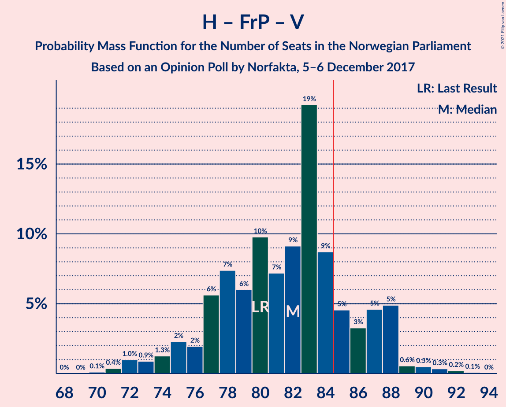

| Number of Seats | Probability | Accumulated | Special Marks |
|:---------------:|:-----------:|:-----------:|:-------------:|
| 70 | 0.1% | 100% |  |
| 71 | 0.4% | 99.9% |  |
| 72 | 1.0% | 99.5% |  |
| 73 | 0.9% | 98% |  |
| 74 | 1.3% | 98% |  |
| 75 | 2% | 96% |  |
| 76 | 2% | 94% |  |
| 77 | 6% | 92% |  |
| 78 | 7% | 86% |  |
| 79 | 6% | 79% |  |
| 80 | 10% | 73% | Last Result |
| 81 | 7% | 63% |  |
| 82 | 9% | 56% | Median |
| 83 | 19% | 47% |  |
| 84 | 9% | 28% |  |
| 85 | 5% | 19% | Majority |
| 86 | 3% | 14% |  |
| 87 | 5% | 11% |  |
| 88 | 5% | 7% |  |
| 89 | 0.6% | 2% |  |
| 90 | 0.5% | 1.2% |  |
| 91 | 0.3% | 0.7% |  |
| 92 | 0.2% | 0.3% |  |
| 93 | 0.1% | 0.1% |  |
| 94 | 0% | 0% |  |

### Arbeiderpartiet – Senterpartiet – Sosialistisk Venstreparti – Rødt

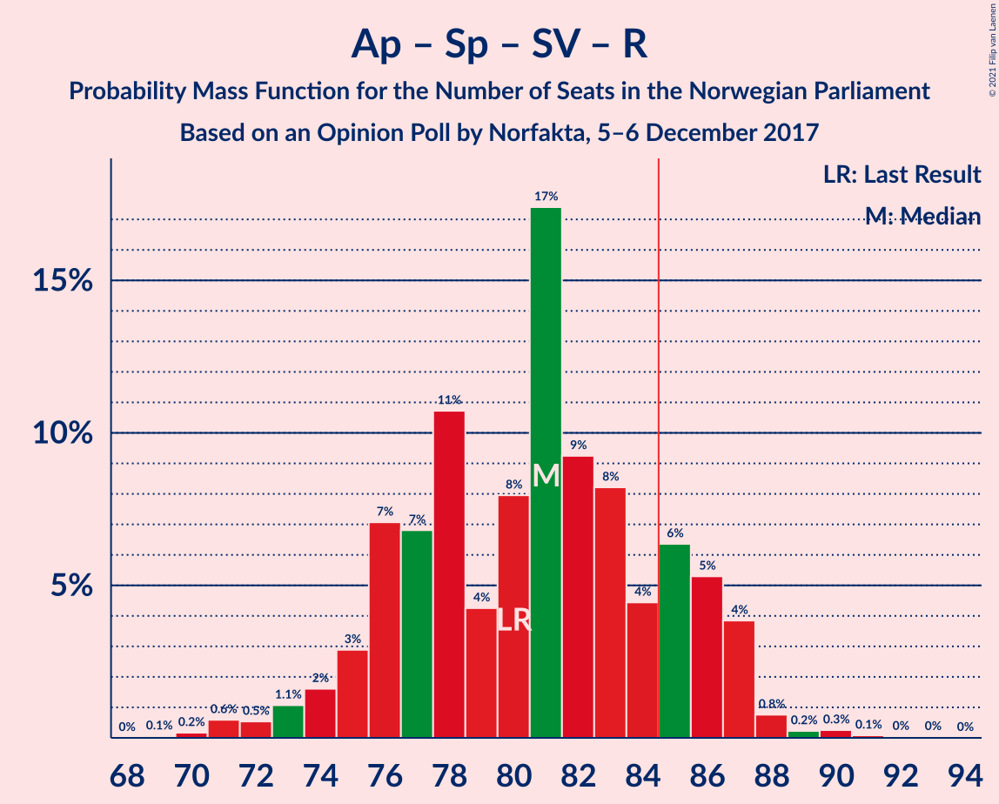

| Number of Seats | Probability | Accumulated | Special Marks |
|:---------------:|:-----------:|:-----------:|:-------------:|
| 69 | 0.1% | 100% |  |
| 70 | 0.2% | 99.9% |  |
| 71 | 0.6% | 99.8% |  |
| 72 | 0.5% | 99.2% |  |
| 73 | 1.1% | 98.6% |  |
| 74 | 2% | 98% |  |
| 75 | 3% | 96% |  |
| 76 | 7% | 93% |  |
| 77 | 7% | 86% |  |
| 78 | 11% | 79% |  |
| 79 | 4% | 68% |  |
| 80 | 8% | 64% | Last Result, Median |
| 81 | 17% | 56% |  |
| 82 | 9% | 39% |  |
| 83 | 8% | 30% |  |
| 84 | 4% | 21% |  |
| 85 | 6% | 17% | Majority |
| 86 | 5% | 11% |  |
| 87 | 4% | 5% |  |
| 88 | 0.8% | 1.4% |  |
| 89 | 0.2% | 0.7% |  |
| 90 | 0.3% | 0.4% |  |
| 91 | 0.1% | 0.2% |  |
| 92 | 0% | 0.1% |  |
| 93 | 0% | 0.1% |  |
| 94 | 0% | 0% |  |

### Arbeiderpartiet – Senterpartiet – Sosialistisk Venstreparti

| Number of Seats | Probability | Accumulated | Special Marks |
|:---------------:|:-----------:|:-----------:|:-------------:|
| 68 | 0.1% | 100% |  |
| 69 | 0.2% | 99.9% |  |
| 70 | 0.6% | 99.8% |  |
| 71 | 0.5% | 99.2% |  |
| 72 | 1.0% | 98.6% |  |
| 73 | 2% | 98% |  |
| 74 | 3% | 96% |  |
| 75 | 7% | 93% |  |
| 76 | 7% | 86% |  |
| 77 | 11% | 79% |  |
| 78 | 5% | 68% |  |
| 79 | 8% | 64% | Last Result, Median |
| 80 | 17% | 56% |  |
| 81 | 8% | 38% |  |
| 82 | 9% | 30% |  |
| 83 | 6% | 21% |  |
| 84 | 4% | 15% |  |
| 85 | 5% | 10% | Majority |
| 86 | 4% | 5% |  |
| 87 | 0.6% | 1.3% |  |
| 88 | 0.2% | 0.6% |  |
| 89 | 0.2% | 0.4% |  |
| 90 | 0.1% | 0.2% |  |
| 91 | 0.1% | 0.1% |  |
| 92 | 0% | 0% |  |

### Arbeiderpartiet – Senterpartiet – Kristelig Folkeparti – Miljøpartiet De Grønne

| Number of Seats | Probability | Accumulated | Special Marks |
|:---------------:|:-----------:|:-----------:|:-------------:|
| 62 | 0.1% | 100% |  |
| 63 | 0.1% | 99.9% |  |
| 64 | 0.2% | 99.8% |  |
| 65 | 0.4% | 99.6% |  |
| 66 | 0.7% | 99.2% |  |
| 67 | 3% | 98.5% |  |
| 68 | 2% | 96% |  |
| 69 | 6% | 94% |  |
| 70 | 7% | 87% |  |
| 71 | 15% | 81% | Median |
| 72 | 9% | 66% |  |
| 73 | 7% | 57% |  |
| 74 | 13% | 50% |  |
| 75 | 8% | 37% |  |
| 76 | 11% | 29% |  |
| 77 | 5% | 18% | Last Result |
| 78 | 4% | 14% |  |
| 79 | 2% | 9% |  |
| 80 | 3% | 7% |  |
| 81 | 2% | 5% |  |
| 82 | 2% | 3% |  |
| 83 | 0.7% | 1.3% |  |
| 84 | 0.3% | 0.7% |  |
| 85 | 0.1% | 0.3% | Majority |
| 86 | 0.2% | 0.2% |  |
| 87 | 0.1% | 0.1% |  |
| 88 | 0% | 0% |  |

### Høyre – Fremskrittspartiet

| Number of Seats | Probability | Accumulated | Special Marks |
|:---------------:|:-----------:|:-----------:|:-------------:|
| 61 | 0.1% | 100% |  |
| 62 | 0.1% | 99.9% |  |
| 63 | 0% | 99.8% |  |
| 64 | 0.4% | 99.8% |  |
| 65 | 0.4% | 99.4% |  |
| 66 | 0.6% | 99.0% |  |
| 67 | 2% | 98% |  |
| 68 | 2% | 97% |  |
| 69 | 6% | 95% |  |
| 70 | 8% | 89% |  |
| 71 | 4% | 81% |  |
| 72 | 9% | 76% | Last Result |
| 73 | 5% | 67% |  |
| 74 | 23% | 62% | Median |
| 75 | 11% | 40% |  |
| 76 | 9% | 29% |  |
| 77 | 5% | 20% |  |
| 78 | 5% | 16% |  |
| 79 | 4% | 10% |  |
| 80 | 3% | 6% |  |
| 81 | 0.7% | 3% |  |
| 82 | 1.1% | 2% |  |
| 83 | 0.7% | 1.0% |  |
| 84 | 0.1% | 0.3% |  |
| 85 | 0.2% | 0.2% | Majority |
| 86 | 0% | 0.1% |  |
| 87 | 0% | 0% |  |

### Arbeiderpartiet – Senterpartiet – Kristelig Folkeparti

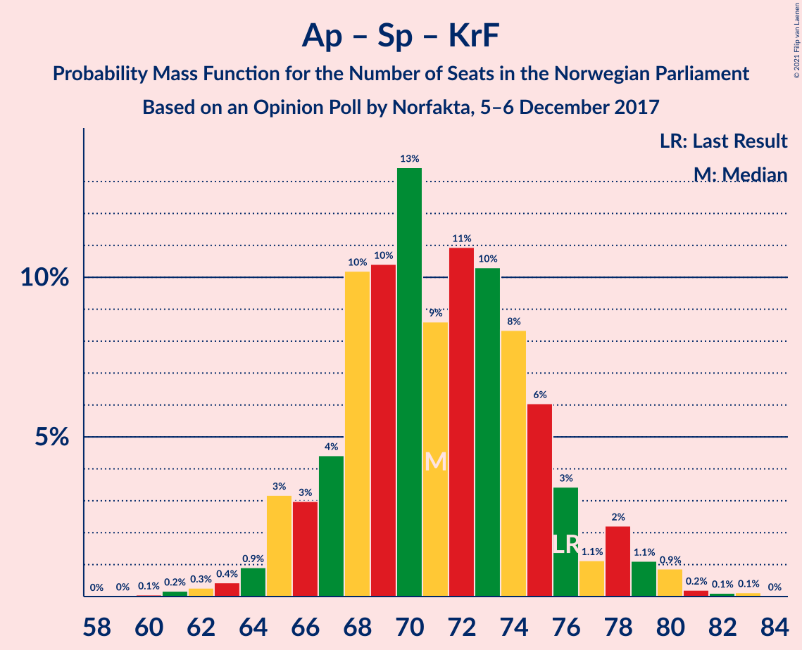

| Number of Seats | Probability | Accumulated | Special Marks |
|:---------------:|:-----------:|:-----------:|:-------------:|
| 60 | 0.1% | 100% |  |
| 61 | 0.2% | 99.9% |  |
| 62 | 0.3% | 99.7% |  |
| 63 | 0.4% | 99.5% |  |
| 64 | 0.9% | 99.0% |  |
| 65 | 3% | 98% |  |
| 66 | 3% | 95% |  |
| 67 | 4% | 92% |  |
| 68 | 10% | 88% |  |
| 69 | 10% | 77% | Median |
| 70 | 13% | 67% |  |
| 71 | 9% | 53% |  |
| 72 | 11% | 45% |  |
| 73 | 10% | 34% |  |
| 74 | 8% | 24% |  |
| 75 | 6% | 15% |  |
| 76 | 3% | 9% | Last Result |
| 77 | 1.1% | 6% |  |
| 78 | 2% | 5% |  |
| 79 | 1.1% | 2% |  |
| 80 | 0.9% | 1.3% |  |
| 81 | 0.2% | 0.5% |  |
| 82 | 0.1% | 0.3% |  |
| 83 | 0.1% | 0.2% |  |
| 84 | 0% | 0% |  |

### Arbeiderpartiet – Senterpartiet

| Number of Seats | Probability | Accumulated | Special Marks |
|:---------------:|:-----------:|:-----------:|:-------------:|
| 57 | 0.1% | 100% |  |
| 58 | 0.3% | 99.9% |  |
| 59 | 0.8% | 99.5% |  |
| 60 | 2% | 98.7% |  |
| 61 | 3% | 97% |  |
| 62 | 4% | 93% |  |
| 63 | 4% | 89% |  |
| 64 | 7% | 86% |  |
| 65 | 12% | 78% |  |
| 66 | 14% | 67% | Median |
| 67 | 15% | 53% |  |
| 68 | 9% | 39% | Last Result |
| 69 | 9% | 29% |  |
| 70 | 6% | 21% |  |
| 71 | 5% | 14% |  |
| 72 | 5% | 9% |  |
| 73 | 2% | 4% |  |
| 74 | 0.3% | 2% |  |
| 75 | 1.2% | 1.5% |  |
| 76 | 0.1% | 0.3% |  |
| 77 | 0.1% | 0.2% |  |
| 78 | 0% | 0.1% |  |
| 79 | 0% | 0% |  |

### Høyre – Venstre – Kristelig Folkeparti

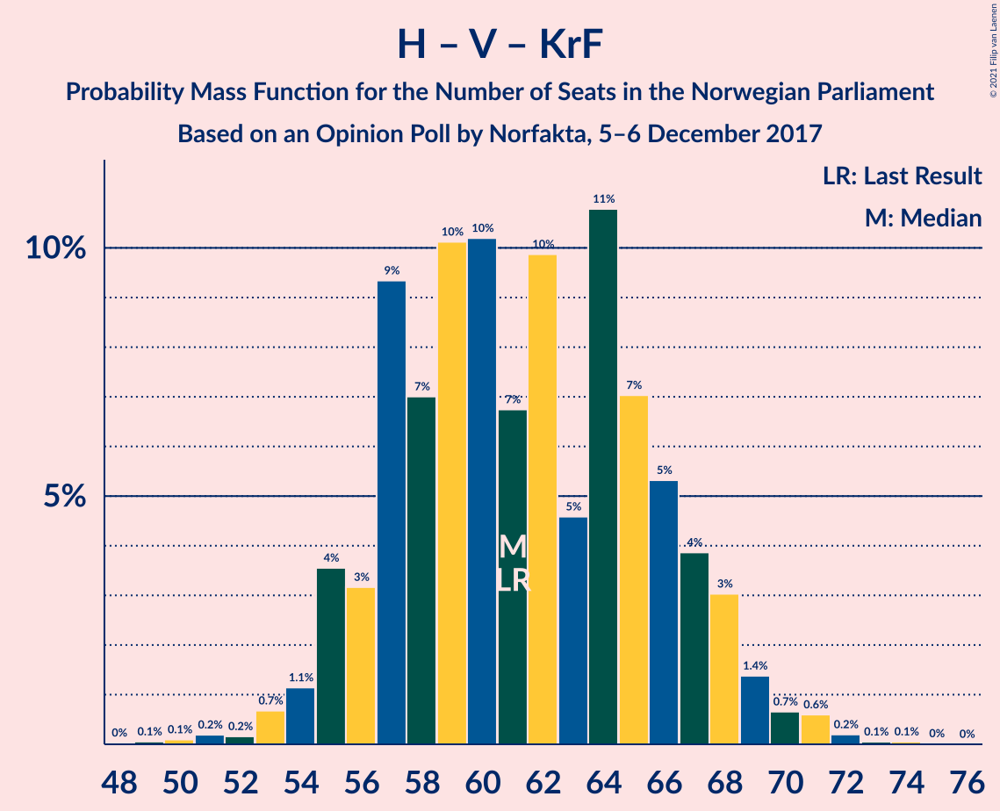

| Number of Seats | Probability | Accumulated | Special Marks |
|:---------------:|:-----------:|:-----------:|:-------------:|
| 48 | 0% | 100% |  |
| 49 | 0.1% | 99.9% |  |
| 50 | 0.1% | 99.9% |  |
| 51 | 0.2% | 99.8% |  |
| 52 | 0.2% | 99.6% |  |
| 53 | 0.7% | 99.4% |  |
| 54 | 1.1% | 98.7% |  |
| 55 | 4% | 98% |  |
| 56 | 3% | 94% |  |
| 57 | 9% | 91% |  |
| 58 | 7% | 82% |  |
| 59 | 10% | 75% |  |
| 60 | 10% | 64% | Median |
| 61 | 7% | 54% | Last Result |
| 62 | 10% | 47% |  |
| 63 | 5% | 38% |  |
| 64 | 11% | 33% |  |
| 65 | 7% | 22% |  |
| 66 | 5% | 15% |  |
| 67 | 4% | 10% |  |
| 68 | 3% | 6% |  |
| 69 | 1.4% | 3% |  |
| 70 | 0.7% | 2% |  |
| 71 | 0.6% | 0.9% |  |
| 72 | 0.2% | 0.3% |  |
| 73 | 0.1% | 0.1% |  |
| 74 | 0.1% | 0.1% |  |
| 75 | 0% | 0% |  |

### Arbeiderpartiet – Sosialistisk Venstreparti

| Number of Seats | Probability | Accumulated | Special Marks |
|:---------------:|:-----------:|:-----------:|:-------------:|
| 51 | 0.1% | 100% |  |
| 52 | 0.3% | 99.9% |  |
| 53 | 0.8% | 99.6% |  |
| 54 | 0.9% | 98.8% |  |
| 55 | 1.4% | 98% |  |
| 56 | 3% | 96% |  |
| 57 | 5% | 93% |  |
| 58 | 7% | 88% |  |
| 59 | 16% | 81% |  |
| 60 | 7% | 65% | Last Result |
| 61 | 9% | 57% | Median |
| 62 | 18% | 48% |  |
| 63 | 12% | 30% |  |
| 64 | 7% | 18% |  |
| 65 | 4% | 11% |  |
| 66 | 4% | 7% |  |
| 67 | 2% | 3% |  |
| 68 | 0.8% | 2% |  |
| 69 | 0.4% | 0.8% |  |
| 70 | 0.2% | 0.3% |  |
| 71 | 0.1% | 0.1% |  |
| 72 | 0% | 0.1% |  |
| 73 | 0% | 0% |  |

### Senterpartiet – Venstre – Kristelig Folkeparti

| Number of Seats | Probability | Accumulated | Special Marks |
|:---------------:|:-----------:|:-----------:|:-------------:|
| 18 | 0% | 100% |  |
| 19 | 0% | 99.9% |  |
| 20 | 0.4% | 99.9% |  |
| 21 | 0.5% | 99.5% |  |
| 22 | 0.2% | 99.0% |  |
| 23 | 1.0% | 98.8% |  |
| 24 | 3% | 98% |  |
| 25 | 3% | 95% |  |
| 26 | 4% | 92% |  |
| 27 | 5% | 88% |  |
| 28 | 5% | 83% |  |
| 29 | 11% | 79% | Median |
| 30 | 17% | 68% |  |
| 31 | 11% | 51% |  |
| 32 | 11% | 41% |  |
| 33 | 12% | 30% |  |
| 34 | 7% | 18% |  |
| 35 | 4% | 11% | Last Result |
| 36 | 2% | 7% |  |
| 37 | 2% | 4% |  |
| 38 | 0.7% | 2% |  |
| 39 | 0.6% | 1.5% |  |
| 40 | 0.8% | 0.9% |  |
| 41 | 0% | 0.1% |  |
| 42 | 0% | 0% |  |

## Technical Information

### Opinion Poll

+ **Polling firm:** Norfakta
+ **Commissioner(s):** —
+ **Fieldwork period:** 5–6 December 2017

### Calculations

+ **Sample size:** 830
+ **Simulations done:** 1,048,576
+ **Error estimate:** 3.22%

