# Opinion Poll by Sentio, 5–11 December 2017

<a href="#voting-intentions">Voting Intentions</a> | <a href="#seats">Seats</a> | <a href="#coalitions">Coalitions</a> | <a href="#technical-information">Technical Information</a>

## Voting Intentions

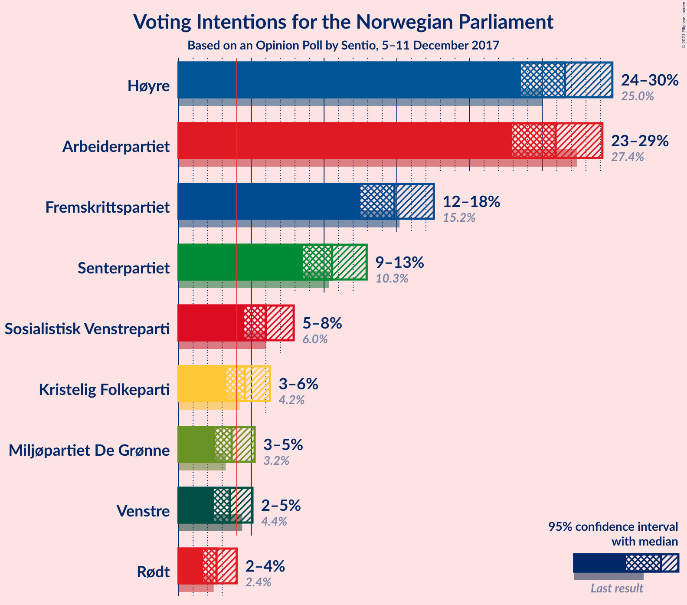

### Confidence Intervals

| Party | Last Result | Poll Result | 80% Confidence Interval | 90% Confidence Interval | 95% Confidence Interval | 99% Confidence Interval |
|:-----:|:-----------:|:-----------:|:-----------------------:|:-----------------------:|:-----------------------:|:-----------------------:|
| Høyre | 25.0% | 26.6% | 24.6–28.7% |24.0–29.3% |23.5–29.8% |22.6–30.8% |
| Arbeiderpartiet | 27.4% | 25.9% | 24.0–28.0% |23.4–28.6% |22.9–29.1% |22.0–30.2% |
| Fremskrittspartiet | 15.2% | 14.8% | 13.3–16.6% |12.9–17.1% |12.5–17.5% |11.8–18.4% |
| Senterpartiet | 10.3% | 10.5% | 9.2–12.1% |8.9–12.5% |8.6–12.9% |8.0–13.7% |
| Sosialistisk Venstreparti | 6.0% | 6.0% | 5.0–7.2% |4.7–7.6% |4.5–7.9% |4.1–8.5% |
| Kristelig Folkeparti | 4.2% | 4.6% | 3.7–5.7% |3.5–6.0% |3.3–6.3% |2.9–6.9% |
| Miljøpartiet De Grønne | 3.2% | 3.6% | 2.9–4.7% |2.7–5.0% |2.5–5.2% |2.2–5.8% |
| Venstre | 4.4% | 3.5% | 2.8–4.5% |2.6–4.8% |2.4–5.1% |2.1–5.6% |
| Rødt | 2.4% | 2.6% | 2.0–3.5% |1.8–3.8% |1.7–4.0% |1.4–4.5% |

*Note:* The poll result column reflects the actual value used in the calculations. Published results may vary slightly, and in addition be rounded to fewer digits.

## Seats

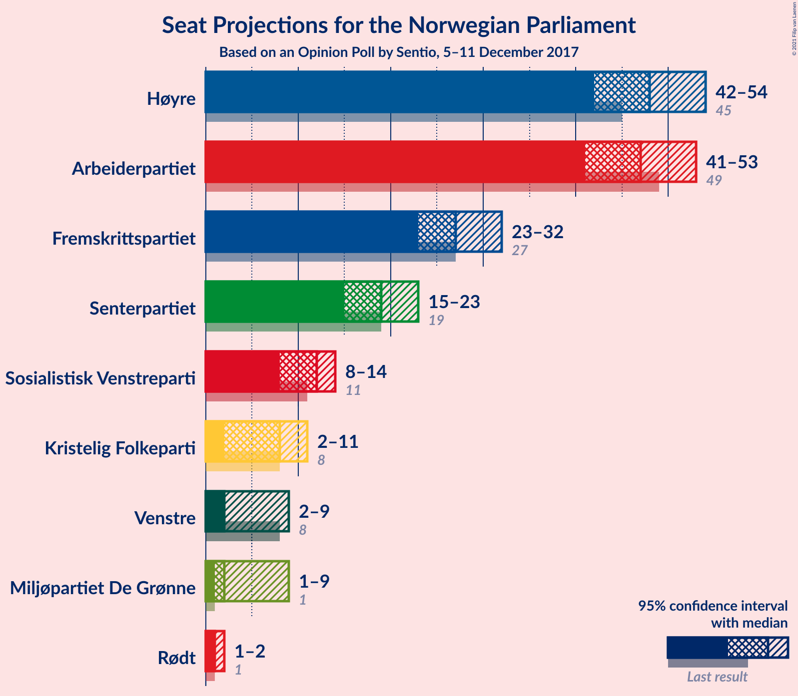

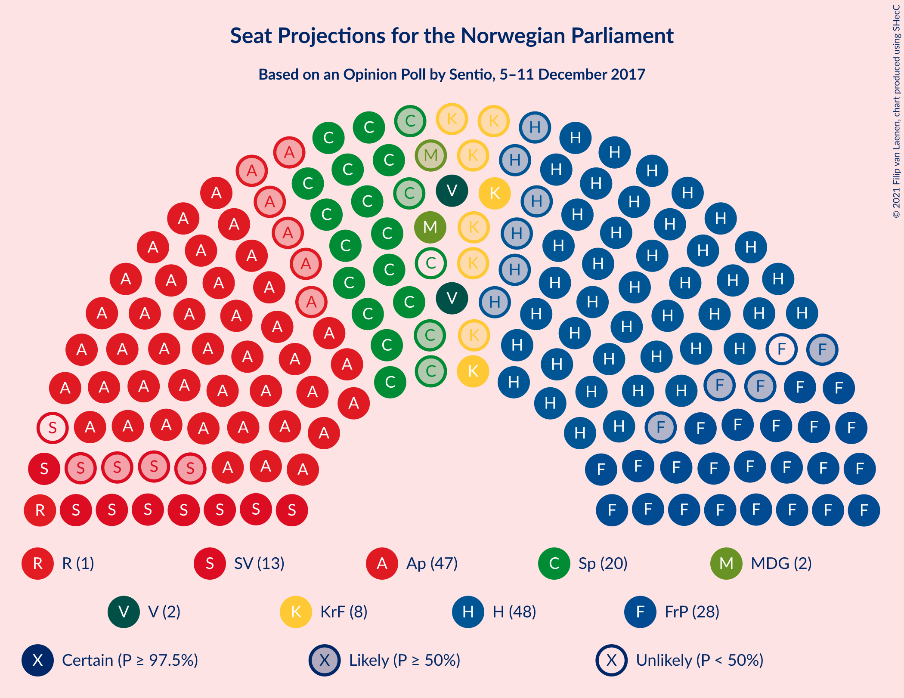

### Confidence Intervals

| Party | Last Result | Median | 80% Confidence Interval | 90% Confidence Interval | 95% Confidence Interval | 99% Confidence Interval |
|:-----:|:-----------:|:------:|:-----------------------:|:-----------------------:|:-----------------------:|:-----------------------:|
| <a href="#høyre">Høyre</a> | 45 | 48 | 44–52 |43–53 |42–54 |40–57 |
| <a href="#arbeiderpartiet">Arbeiderpartiet</a> | 49 | 47 | 43–51 |42–52 |41–53 |40–56 |
| <a href="#fremskrittspartiet">Fremskrittspartiet</a> | 27 | 27 | 24–30 |23–31 |23–32 |21–33 |
| <a href="#senterpartiet">Senterpartiet</a> | 19 | 19 | 16–22 |16–22 |15–23 |14–25 |
| <a href="#sosialistisk-venstreparti">Sosialistisk Venstreparti</a> | 11 | 12 | 8–13 |8–14 |8–14 |7–15 |
| <a href="#kristelig-folkeparti">Kristelig Folkeparti</a> | 8 | 8 | 3–10 |3–11 |2–11 |1–13 |
| <a href="#miljøpartiet-de-grønne">Miljøpartiet De Grønne</a> | 1 | 2 | 1–8 |1–9 |1–9 |1–10 |
| <a href="#venstre">Venstre</a> | 8 | 2 | 2–8 |2–8 |2–9 |1–10 |
| <a href="#rødt">Rødt</a> | 1 | 1 | 1–2 |1–2 |1–2 |1–8 |

### Høyre

*For a full overview of the results for this party, see the [Høyre](party-høyre.html) page.*

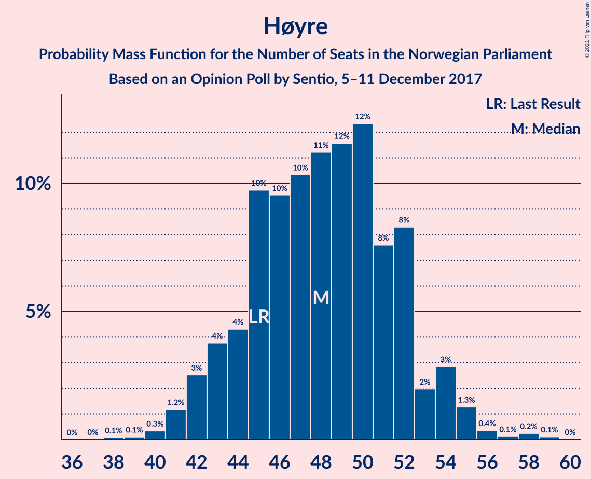

| Number of Seats | Probability | Accumulated | Special Marks |
|:---------------:|:-----------:|:-----------:|:-------------:|
| 38 | 0.1% | 100% |  |
| 39 | 0.1% | 99.9% |  |
| 40 | 0.3% | 99.8% |  |
| 41 | 1.2% | 99.5% |  |
| 42 | 3% | 98% |  |
| 43 | 4% | 96% |  |
| 44 | 4% | 92% |  |
| 45 | 10% | 88% | Last Result |
| 46 | 10% | 78% |  |
| 47 | 10% | 68% |  |
| 48 | 11% | 58% | Median |
| 49 | 12% | 47% |  |
| 50 | 12% | 35% |  |
| 51 | 8% | 23% |  |
| 52 | 8% | 15% |  |
| 53 | 2% | 7% |  |
| 54 | 3% | 5% |  |
| 55 | 1.3% | 2% |  |
| 56 | 0.4% | 0.9% |  |
| 57 | 0.1% | 0.5% |  |
| 58 | 0.2% | 0.4% |  |
| 59 | 0.1% | 0.1% |  |
| 60 | 0% | 0% |  |

### Arbeiderpartiet

*For a full overview of the results for this party, see the [Arbeiderpartiet](party-arbeiderpartiet.html) page.*

| Number of Seats | Probability | Accumulated | Special Marks |
|:---------------:|:-----------:|:-----------:|:-------------:|
| 38 | 0.1% | 100% |  |
| 39 | 0.2% | 99.9% |  |
| 40 | 0.4% | 99.7% |  |
| 41 | 2% | 99.3% |  |
| 42 | 3% | 97% |  |
| 43 | 7% | 94% |  |
| 44 | 7% | 86% |  |
| 45 | 11% | 79% |  |
| 46 | 6% | 68% |  |
| 47 | 15% | 62% | Median |
| 48 | 11% | 47% |  |
| 49 | 12% | 36% | Last Result |
| 50 | 13% | 24% |  |
| 51 | 4% | 11% |  |
| 52 | 3% | 7% |  |
| 53 | 1.2% | 4% |  |
| 54 | 1.3% | 2% |  |
| 55 | 0.5% | 1.1% |  |
| 56 | 0.5% | 0.6% |  |
| 57 | 0.1% | 0.1% |  |
| 58 | 0.1% | 0.1% |  |
| 59 | 0% | 0% |  |

### Fremskrittspartiet

*For a full overview of the results for this party, see the [Fremskrittspartiet](party-fremskrittspartiet.html) page.*

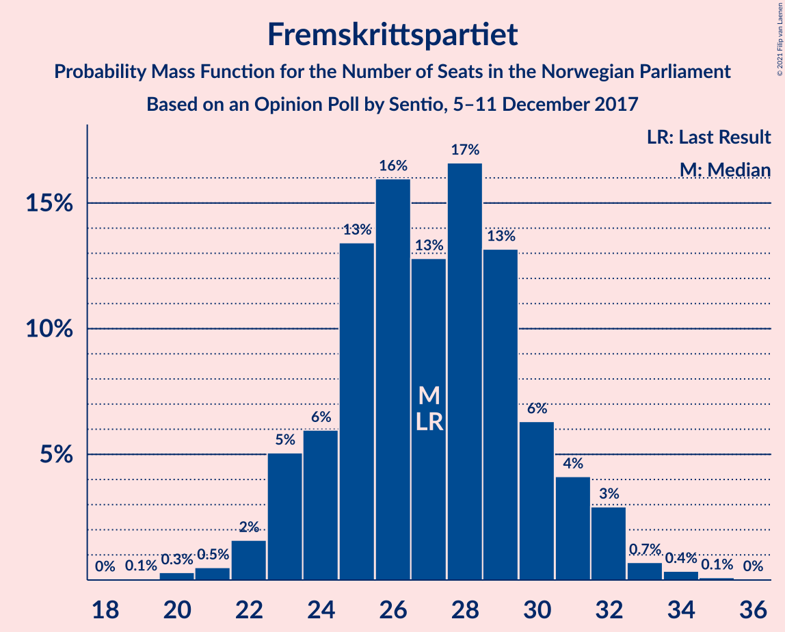

| Number of Seats | Probability | Accumulated | Special Marks |
|:---------------:|:-----------:|:-----------:|:-------------:|
| 19 | 0.1% | 100% |  |
| 20 | 0.3% | 99.9% |  |
| 21 | 0.5% | 99.6% |  |
| 22 | 2% | 99.1% |  |
| 23 | 5% | 98% |  |
| 24 | 6% | 92% |  |
| 25 | 13% | 87% |  |
| 26 | 16% | 73% |  |
| 27 | 13% | 57% | Last Result, Median |
| 28 | 17% | 44% |  |
| 29 | 13% | 28% |  |
| 30 | 6% | 15% |  |
| 31 | 4% | 8% |  |
| 32 | 3% | 4% |  |
| 33 | 0.7% | 1.2% |  |
| 34 | 0.4% | 0.5% |  |
| 35 | 0.1% | 0.1% |  |
| 36 | 0% | 0% |  |

### Senterpartiet

*For a full overview of the results for this party, see the [Senterpartiet](party-senterpartiet.html) page.*

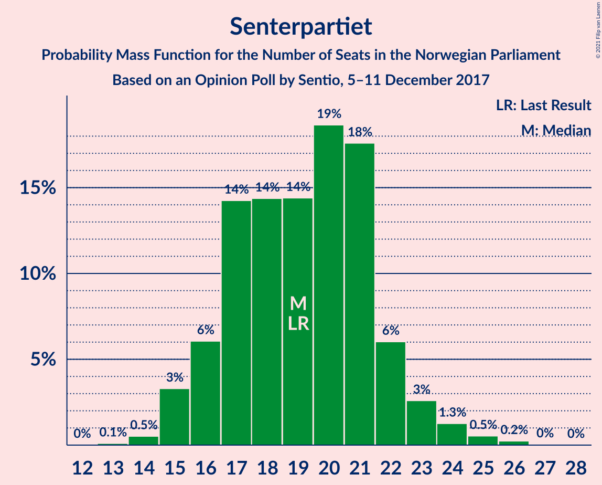

| Number of Seats | Probability | Accumulated | Special Marks |
|:---------------:|:-----------:|:-----------:|:-------------:|
| 13 | 0.1% | 100% |  |
| 14 | 0.5% | 99.9% |  |
| 15 | 3% | 99.4% |  |
| 16 | 6% | 96% |  |
| 17 | 14% | 90% |  |
| 18 | 14% | 76% |  |
| 19 | 14% | 61% | Last Result, Median |
| 20 | 19% | 47% |  |
| 21 | 18% | 28% |  |
| 22 | 6% | 11% |  |
| 23 | 3% | 5% |  |
| 24 | 1.3% | 2% |  |
| 25 | 0.5% | 0.8% |  |
| 26 | 0.2% | 0.3% |  |
| 27 | 0% | 0.1% |  |
| 28 | 0% | 0% |  |

### Sosialistisk Venstreparti

*For a full overview of the results for this party, see the [Sosialistisk Venstreparti](party-sosialistiskvenstreparti.html) page.*

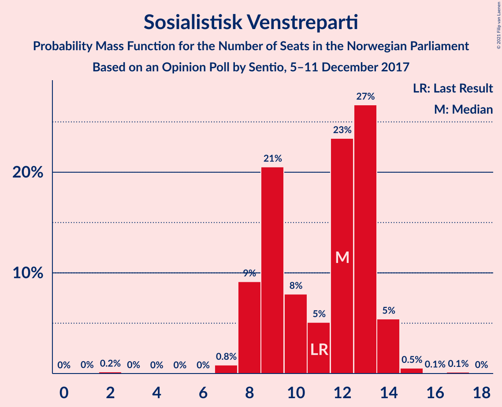

| Number of Seats | Probability | Accumulated | Special Marks |
|:---------------:|:-----------:|:-----------:|:-------------:|
| 2 | 0.2% | 100% |  |
| 3 | 0% | 99.8% |  |
| 4 | 0% | 99.8% |  |
| 5 | 0% | 99.8% |  |
| 6 | 0% | 99.8% |  |
| 7 | 0.8% | 99.8% |  |
| 8 | 9% | 98.9% |  |
| 9 | 21% | 90% |  |
| 10 | 8% | 69% |  |
| 11 | 5% | 61% | Last Result |
| 12 | 23% | 56% | Median |
| 13 | 27% | 33% |  |
| 14 | 5% | 6% |  |
| 15 | 0.5% | 0.8% |  |
| 16 | 0.1% | 0.3% |  |
| 17 | 0.1% | 0.2% |  |
| 18 | 0% | 0% |  |

### Kristelig Folkeparti

*For a full overview of the results for this party, see the [Kristelig Folkeparti](party-kristeligfolkeparti.html) page.*

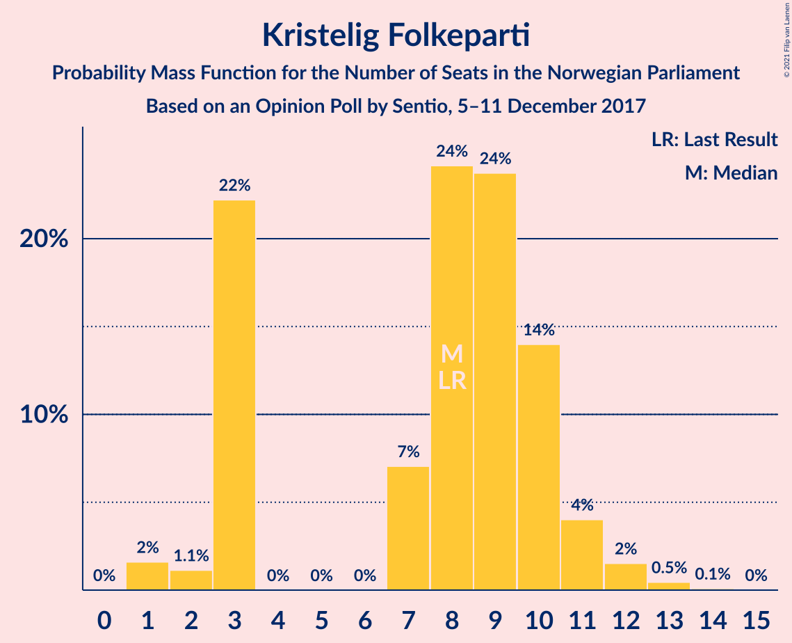

| Number of Seats | Probability | Accumulated | Special Marks |
|:---------------:|:-----------:|:-----------:|:-------------:|
| 1 | 2% | 100% |  |
| 2 | 1.1% | 98% |  |
| 3 | 22% | 97% |  |
| 4 | 0% | 75% |  |
| 5 | 0% | 75% |  |
| 6 | 0% | 75% |  |
| 7 | 7% | 75% |  |
| 8 | 24% | 68% | Last Result, Median |
| 9 | 24% | 44% |  |
| 10 | 14% | 20% |  |
| 11 | 4% | 6% |  |
| 12 | 2% | 2% |  |
| 13 | 0.5% | 0.6% |  |
| 14 | 0.1% | 0.1% |  |
| 15 | 0% | 0% |  |

### Miljøpartiet De Grønne

*For a full overview of the results for this party, see the [Miljøpartiet De Grønne](party-miljøpartietdegrønne.html) page.*

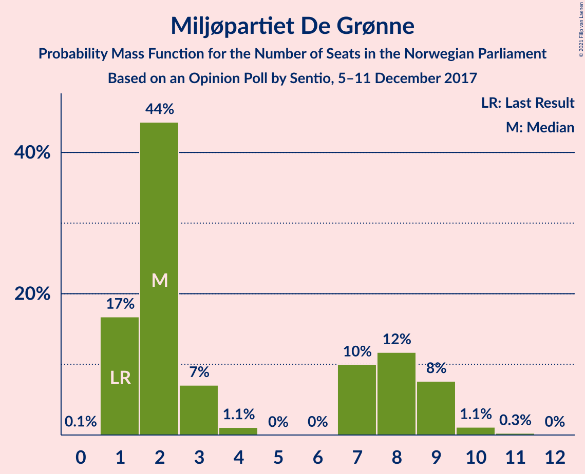

| Number of Seats | Probability | Accumulated | Special Marks |
|:---------------:|:-----------:|:-----------:|:-------------:|
| 0 | 0.1% | 100% |  |
| 1 | 17% | 99.9% | Last Result |
| 2 | 44% | 83% | Median |
| 3 | 7% | 39% |  |
| 4 | 1.1% | 32% |  |
| 5 | 0% | 31% |  |
| 6 | 0% | 31% |  |
| 7 | 10% | 31% |  |
| 8 | 12% | 21% |  |
| 9 | 8% | 9% |  |
| 10 | 1.1% | 1.4% |  |
| 11 | 0.3% | 0.3% |  |
| 12 | 0% | 0% |  |

### Venstre

*For a full overview of the results for this party, see the [Venstre](party-venstre.html) page.*

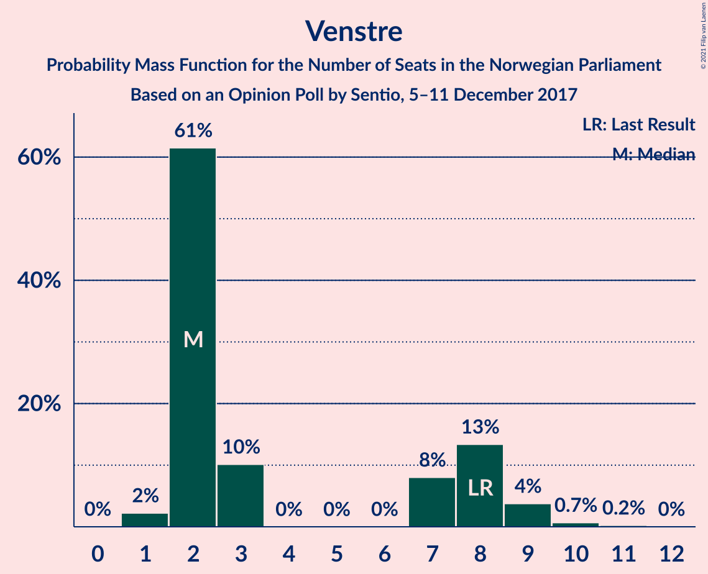

| Number of Seats | Probability | Accumulated | Special Marks |
|:---------------:|:-----------:|:-----------:|:-------------:|
| 1 | 2% | 100% |  |
| 2 | 61% | 98% | Median |
| 3 | 10% | 36% |  |
| 4 | 0% | 26% |  |
| 5 | 0% | 26% |  |
| 6 | 0% | 26% |  |
| 7 | 8% | 26% |  |
| 8 | 13% | 18% | Last Result |
| 9 | 4% | 5% |  |
| 10 | 0.7% | 0.9% |  |
| 11 | 0.2% | 0.3% |  |
| 12 | 0% | 0% |  |

### Rødt

*For a full overview of the results for this party, see the [Rødt](party-rødt.html) page.*

| Number of Seats | Probability | Accumulated | Special Marks |
|:---------------:|:-----------:|:-----------:|:-------------:|
| 0 | 0.1% | 100% |  |
| 1 | 59% | 99.9% | Last Result, Median |
| 2 | 39% | 41% |  |
| 3 | 0% | 2% |  |
| 4 | 0% | 2% |  |
| 5 | 0% | 2% |  |
| 6 | 0% | 2% |  |
| 7 | 1.0% | 2% |  |
| 8 | 1.0% | 1.2% |  |
| 9 | 0.1% | 0.1% |  |
| 10 | 0% | 0% |  |

## Coalitions

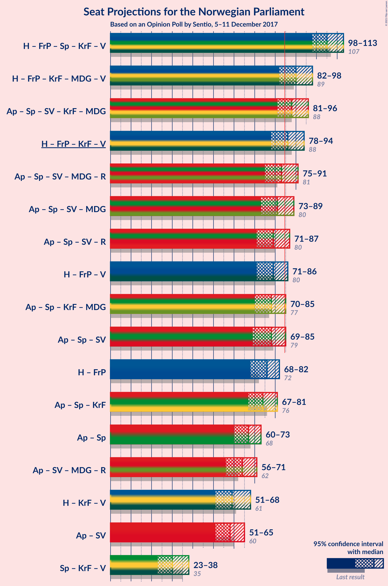

### Confidence Intervals

| Coalition | Last Result | Median | Majority? | 80% Confidence Interval | 90% Confidence Interval | 95% Confidence Interval | 99% Confidence Interval |
|:---------:|:-----------:|:------:|:---------:|:-----------------------:|:-----------------------:|:-----------------------:|:-----------------------:|
| Høyre – Fremskrittspartiet – Senterpartiet – Kristelig Folkeparti – Venstre | 107 | 105 | 100% | 100–110 | 98–112 | 98–113 | 94–115 |
| Høyre – Fremskrittspartiet – Kristelig Folkeparti – Miljøpartiet De Grønne – Venstre | 89 | 90 | 93% | 85–96 | 83–97 | 82–98 | 80–100 |
| Arbeiderpartiet – Senterpartiet – Sosialistisk Venstreparti – Kristelig Folkeparti – Miljøpartiet De Grønne | 88 | 88 | 84% | 83–94 | 82–95 | 81–96 | 79–99 |
| Høyre – Fremskrittspartiet – Kristelig Folkeparti – Venstre | 88 | 86 | 64% | 81–91 | 79–93 | 78–94 | 76–96 |
| Arbeiderpartiet – Senterpartiet – Sosialistisk Venstreparti – Miljøpartiet De Grønne – Rødt | 81 | 83 | 36% | 78–88 | 76–90 | 75–91 | 73–93 |
| Arbeiderpartiet – Senterpartiet – Sosialistisk Venstreparti – Miljøpartiet De Grønne | 80 | 81 | 20% | 76–86 | 74–89 | 73–89 | 71–92 |
| Arbeiderpartiet – Senterpartiet – Sosialistisk Venstreparti – Rødt | 80 | 79 | 7% | 73–84 | 72–86 | 71–87 | 69–89 |
| Høyre – Fremskrittspartiet – Venstre | 80 | 79 | 8% | 74–84 | 72–86 | 71–86 | 69–89 |
| Arbeiderpartiet – Senterpartiet – Kristelig Folkeparti – Miljøpartiet De Grønne | 77 | 78 | 5% | 73–83 | 71–84 | 70–85 | 68–88 |
| Arbeiderpartiet – Senterpartiet – Sosialistisk Venstreparti | 79 | 78 | 3% | 72–82 | 70–84 | 69–85 | 68–88 |
| Høyre – Fremskrittspartiet | 72 | 76 | 0.7% | 70–80 | 69–81 | 68–82 | 66–85 |
| Arbeiderpartiet – Senterpartiet – Kristelig Folkeparti | 76 | 74 | 0.1% | 68–78 | 67–80 | 67–81 | 64–83 |
| Arbeiderpartiet – Senterpartiet | 68 | 67 | 0% | 61–70 | 60–72 | 60–73 | 58–76 |
| Arbeiderpartiet – Sosialistisk Venstreparti – Miljøpartiet De Grønne – Rødt | 62 | 64 | 0% | 59–69 | 57–71 | 56–71 | 54–75 |
| Høyre – Kristelig Folkeparti – Venstre | 61 | 59 | 0% | 54–65 | 52–67 | 51–68 | 49–69 |
| Arbeiderpartiet – Sosialistisk Venstreparti | 60 | 58 | 0% | 53–63 | 52–64 | 51–65 | 50–67 |
| Senterpartiet – Kristelig Folkeparti – Venstre | 35 | 30 | 0% | 25–35 | 25–37 | 23–38 | 21–40 |

### Høyre – Fremskrittspartiet – Senterpartiet – Kristelig Folkeparti – Venstre

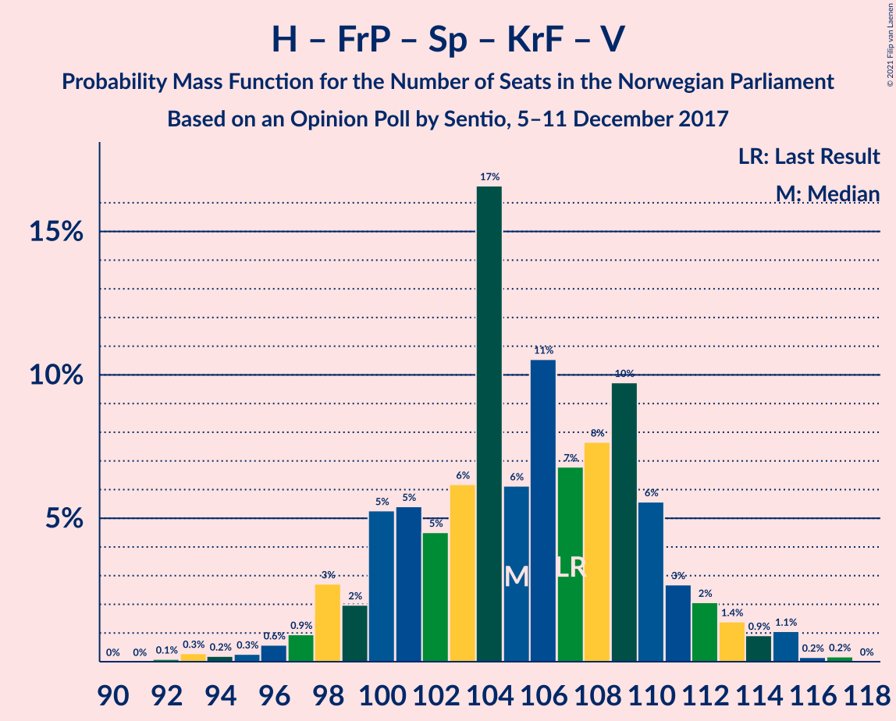

| Number of Seats | Probability | Accumulated | Special Marks |
|:---------------:|:-----------:|:-----------:|:-------------:|
| 92 | 0.1% | 100% |  |
| 93 | 0.3% | 99.9% |  |
| 94 | 0.2% | 99.6% |  |
| 95 | 0.3% | 99.4% |  |
| 96 | 0.6% | 99.1% |  |
| 97 | 0.9% | 98.5% |  |
| 98 | 3% | 98% |  |
| 99 | 2% | 95% |  |
| 100 | 5% | 93% |  |
| 101 | 5% | 88% |  |
| 102 | 5% | 82% |  |
| 103 | 6% | 78% |  |
| 104 | 17% | 72% | Median |
| 105 | 6% | 55% |  |
| 106 | 11% | 49% |  |
| 107 | 7% | 38% | Last Result |
| 108 | 8% | 31% |  |
| 109 | 10% | 24% |  |
| 110 | 6% | 14% |  |
| 111 | 3% | 8% |  |
| 112 | 2% | 6% |  |
| 113 | 1.4% | 4% |  |
| 114 | 0.9% | 2% |  |
| 115 | 1.1% | 1.4% |  |
| 116 | 0.2% | 0.4% |  |
| 117 | 0.2% | 0.2% |  |
| 118 | 0% | 0% |  |

### Høyre – Fremskrittspartiet – Kristelig Folkeparti – Miljøpartiet De Grønne – Venstre

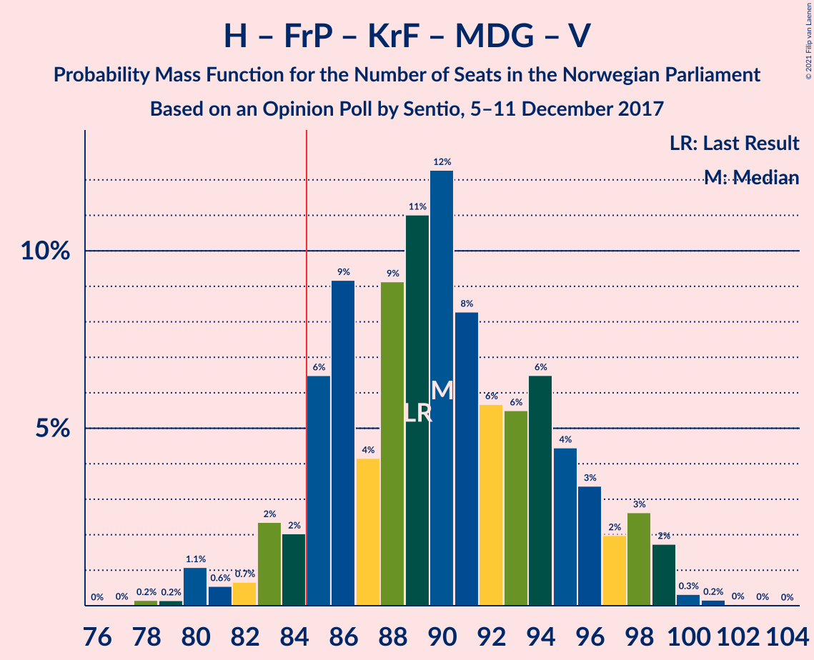

| Number of Seats | Probability | Accumulated | Special Marks |
|:---------------:|:-----------:|:-----------:|:-------------:|
| 77 | 0% | 100% |  |
| 78 | 0.2% | 99.9% |  |
| 79 | 0.2% | 99.8% |  |
| 80 | 1.1% | 99.6% |  |
| 81 | 0.6% | 98.6% |  |
| 82 | 0.7% | 98% |  |
| 83 | 2% | 97% |  |
| 84 | 2% | 95% |  |
| 85 | 6% | 93% | Majority |
| 86 | 9% | 86% |  |
| 87 | 4% | 77% | Median |
| 88 | 9% | 73% |  |
| 89 | 11% | 64% | Last Result |
| 90 | 12% | 53% |  |
| 91 | 8% | 41% |  |
| 92 | 6% | 32% |  |
| 93 | 6% | 27% |  |
| 94 | 6% | 21% |  |
| 95 | 4% | 15% |  |
| 96 | 3% | 10% |  |
| 97 | 2% | 7% |  |
| 98 | 3% | 5% |  |
| 99 | 2% | 2% |  |
| 100 | 0.3% | 0.6% |  |
| 101 | 0.2% | 0.2% |  |
| 102 | 0% | 0.1% |  |
| 103 | 0% | 0% |  |

### Arbeiderpartiet – Senterpartiet – Sosialistisk Venstreparti – Kristelig Folkeparti – Miljøpartiet De Grønne

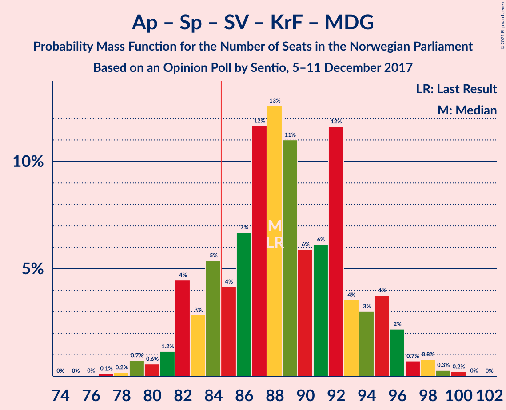

| Number of Seats | Probability | Accumulated | Special Marks |
|:---------------:|:-----------:|:-----------:|:-------------:|
| 75 | 0% | 100% |  |
| 76 | 0% | 99.9% |  |
| 77 | 0.1% | 99.9% |  |
| 78 | 0.2% | 99.8% |  |
| 79 | 0.7% | 99.6% |  |
| 80 | 0.6% | 98.9% |  |
| 81 | 1.2% | 98% |  |
| 82 | 4% | 97% |  |
| 83 | 3% | 93% |  |
| 84 | 5% | 90% |  |
| 85 | 4% | 84% | Majority |
| 86 | 7% | 80% |  |
| 87 | 12% | 74% |  |
| 88 | 13% | 62% | Last Result, Median |
| 89 | 11% | 49% |  |
| 90 | 6% | 38% |  |
| 91 | 6% | 32% |  |
| 92 | 12% | 26% |  |
| 93 | 4% | 15% |  |
| 94 | 3% | 11% |  |
| 95 | 4% | 8% |  |
| 96 | 2% | 4% |  |
| 97 | 0.7% | 2% |  |
| 98 | 0.8% | 1.4% |  |
| 99 | 0.3% | 0.6% |  |
| 100 | 0.2% | 0.3% |  |
| 101 | 0% | 0.1% |  |
| 102 | 0% | 0% |  |

### Høyre – Fremskrittspartiet – Kristelig Folkeparti – Venstre

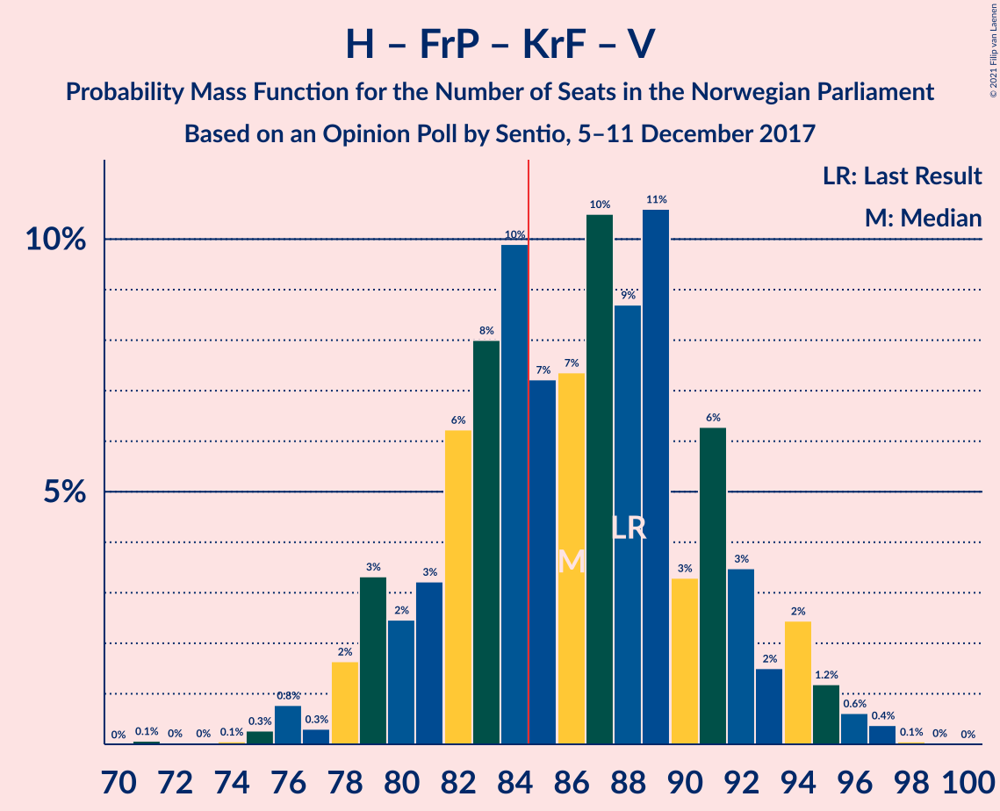

| Number of Seats | Probability | Accumulated | Special Marks |
|:---------------:|:-----------:|:-----------:|:-------------:|
| 71 | 0.1% | 100% |  |
| 72 | 0% | 99.9% |  |
| 73 | 0% | 99.9% |  |
| 74 | 0.1% | 99.9% |  |
| 75 | 0.3% | 99.8% |  |
| 76 | 0.8% | 99.5% |  |
| 77 | 0.3% | 98.8% |  |
| 78 | 2% | 98% |  |
| 79 | 3% | 97% |  |
| 80 | 2% | 94% |  |
| 81 | 3% | 91% |  |
| 82 | 6% | 88% |  |
| 83 | 8% | 82% |  |
| 84 | 10% | 74% |  |
| 85 | 7% | 64% | Median, Majority |
| 86 | 7% | 56% |  |
| 87 | 10% | 49% |  |
| 88 | 9% | 39% | Last Result |
| 89 | 11% | 30% |  |
| 90 | 3% | 19% |  |
| 91 | 6% | 16% |  |
| 92 | 3% | 10% |  |
| 93 | 2% | 6% |  |
| 94 | 2% | 5% |  |
| 95 | 1.2% | 2% |  |
| 96 | 0.6% | 1.1% |  |
| 97 | 0.4% | 0.5% |  |
| 98 | 0.1% | 0.1% |  |
| 99 | 0% | 0% |  |

### Arbeiderpartiet – Senterpartiet – Sosialistisk Venstreparti – Miljøpartiet De Grønne – Rødt

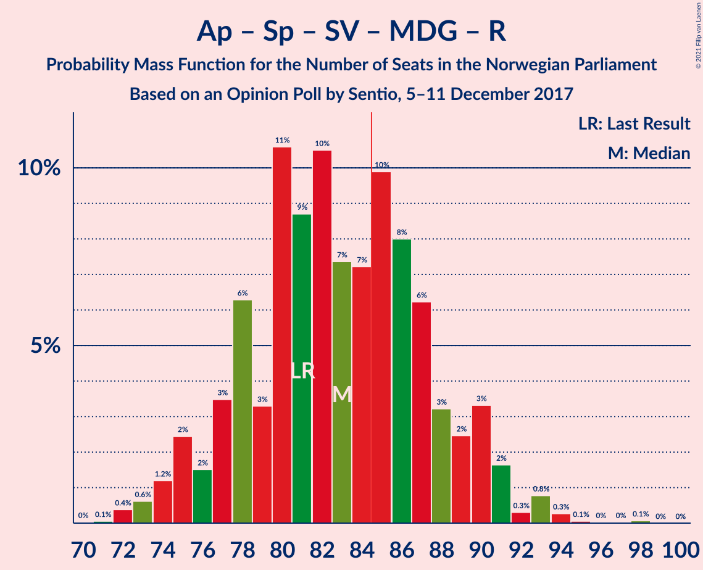

| Number of Seats | Probability | Accumulated | Special Marks |
|:---------------:|:-----------:|:-----------:|:-------------:|
| 71 | 0.1% | 100% |  |
| 72 | 0.4% | 99.9% |  |
| 73 | 0.6% | 99.5% |  |
| 74 | 1.2% | 98.9% |  |
| 75 | 2% | 98% |  |
| 76 | 2% | 95% |  |
| 77 | 3% | 94% |  |
| 78 | 6% | 90% |  |
| 79 | 3% | 84% |  |
| 80 | 11% | 81% |  |
| 81 | 9% | 70% | Last Result, Median |
| 82 | 10% | 61% |  |
| 83 | 7% | 51% |  |
| 84 | 7% | 44% |  |
| 85 | 10% | 36% | Majority |
| 86 | 8% | 26% |  |
| 87 | 6% | 18% |  |
| 88 | 3% | 12% |  |
| 89 | 2% | 9% |  |
| 90 | 3% | 6% |  |
| 91 | 2% | 3% |  |
| 92 | 0.3% | 2% |  |
| 93 | 0.8% | 1.2% |  |
| 94 | 0.3% | 0.4% |  |
| 95 | 0.1% | 0.2% |  |
| 96 | 0% | 0.1% |  |
| 97 | 0% | 0.1% |  |
| 98 | 0.1% | 0.1% |  |
| 99 | 0% | 0% |  |

### Arbeiderpartiet – Senterpartiet – Sosialistisk Venstreparti – Miljøpartiet De Grønne

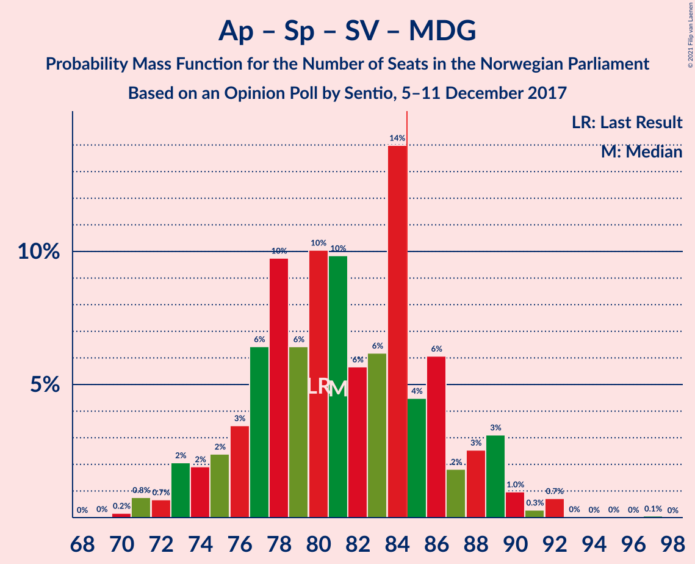

| Number of Seats | Probability | Accumulated | Special Marks |
|:---------------:|:-----------:|:-----------:|:-------------:|
| 69 | 0% | 100% |  |
| 70 | 0.2% | 99.9% |  |
| 71 | 0.8% | 99.8% |  |
| 72 | 0.7% | 99.0% |  |
| 73 | 2% | 98% |  |
| 74 | 2% | 96% |  |
| 75 | 2% | 94% |  |
| 76 | 3% | 92% |  |
| 77 | 6% | 89% |  |
| 78 | 10% | 82% |  |
| 79 | 6% | 72% |  |
| 80 | 10% | 66% | Last Result, Median |
| 81 | 10% | 56% |  |
| 82 | 6% | 46% |  |
| 83 | 6% | 40% |  |
| 84 | 14% | 34% |  |
| 85 | 4% | 20% | Majority |
| 86 | 6% | 16% |  |
| 87 | 2% | 10% |  |
| 88 | 3% | 8% |  |
| 89 | 3% | 5% |  |
| 90 | 1.0% | 2% |  |
| 91 | 0.3% | 1.2% |  |
| 92 | 0.7% | 0.9% |  |
| 93 | 0% | 0.2% |  |
| 94 | 0% | 0.1% |  |
| 95 | 0% | 0.1% |  |
| 96 | 0% | 0.1% |  |
| 97 | 0.1% | 0.1% |  |
| 98 | 0% | 0% |  |

### Arbeiderpartiet – Senterpartiet – Sosialistisk Venstreparti – Rødt

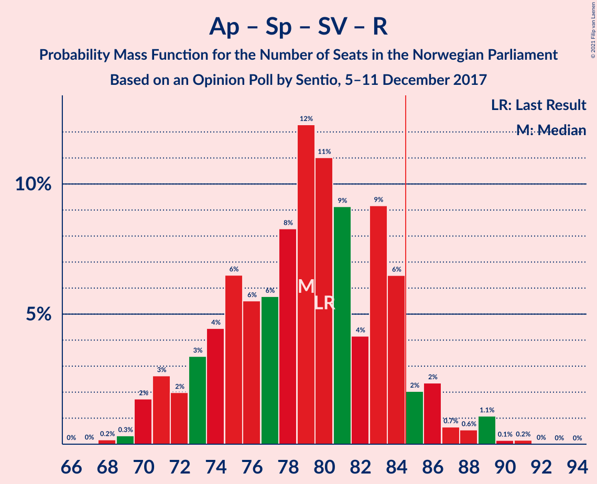

| Number of Seats | Probability | Accumulated | Special Marks |
|:---------------:|:-----------:|:-----------:|:-------------:|
| 67 | 0% | 100% |  |
| 68 | 0.2% | 99.9% |  |
| 69 | 0.3% | 99.8% |  |
| 70 | 2% | 99.4% |  |
| 71 | 3% | 98% |  |
| 72 | 2% | 95% |  |
| 73 | 3% | 93% |  |
| 74 | 4% | 90% |  |
| 75 | 6% | 85% |  |
| 76 | 6% | 79% |  |
| 77 | 6% | 73% |  |
| 78 | 8% | 68% |  |
| 79 | 12% | 59% | Median |
| 80 | 11% | 47% | Last Result |
| 81 | 9% | 36% |  |
| 82 | 4% | 27% |  |
| 83 | 9% | 23% |  |
| 84 | 6% | 14% |  |
| 85 | 2% | 7% | Majority |
| 86 | 2% | 5% |  |
| 87 | 0.7% | 3% |  |
| 88 | 0.6% | 2% |  |
| 89 | 1.1% | 1.4% |  |
| 90 | 0.1% | 0.4% |  |
| 91 | 0.2% | 0.2% |  |
| 92 | 0% | 0.1% |  |
| 93 | 0% | 0% |  |

### Høyre – Fremskrittspartiet – Venstre

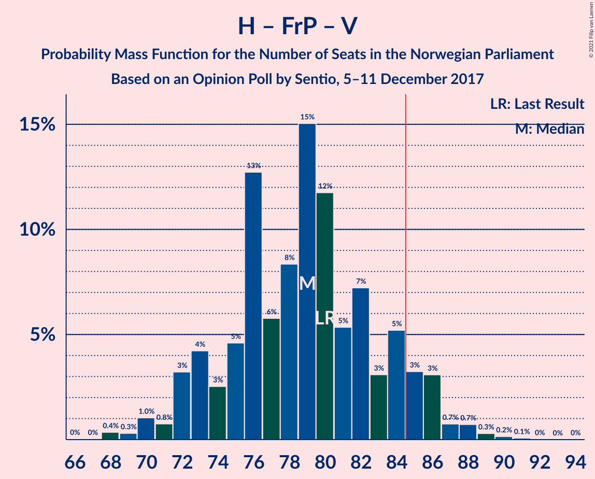

| Number of Seats | Probability | Accumulated | Special Marks |
|:---------------:|:-----------:|:-----------:|:-------------:|
| 66 | 0% | 100% |  |
| 67 | 0% | 99.9% |  |
| 68 | 0.4% | 99.9% |  |
| 69 | 0.3% | 99.6% |  |
| 70 | 1.0% | 99.3% |  |
| 71 | 0.8% | 98% |  |
| 72 | 3% | 97% |  |
| 73 | 4% | 94% |  |
| 74 | 3% | 90% |  |
| 75 | 5% | 87% |  |
| 76 | 13% | 83% |  |
| 77 | 6% | 70% | Median |
| 78 | 8% | 64% |  |
| 79 | 15% | 56% |  |
| 80 | 12% | 41% | Last Result |
| 81 | 5% | 29% |  |
| 82 | 7% | 24% |  |
| 83 | 3% | 17% |  |
| 84 | 5% | 14% |  |
| 85 | 3% | 8% | Majority |
| 86 | 3% | 5% |  |
| 87 | 0.7% | 2% |  |
| 88 | 0.7% | 1.3% |  |
| 89 | 0.3% | 0.6% |  |
| 90 | 0.2% | 0.3% |  |
| 91 | 0.1% | 0.1% |  |
| 92 | 0% | 0.1% |  |
| 93 | 0% | 0% |  |

### Arbeiderpartiet – Senterpartiet – Kristelig Folkeparti – Miljøpartiet De Grønne

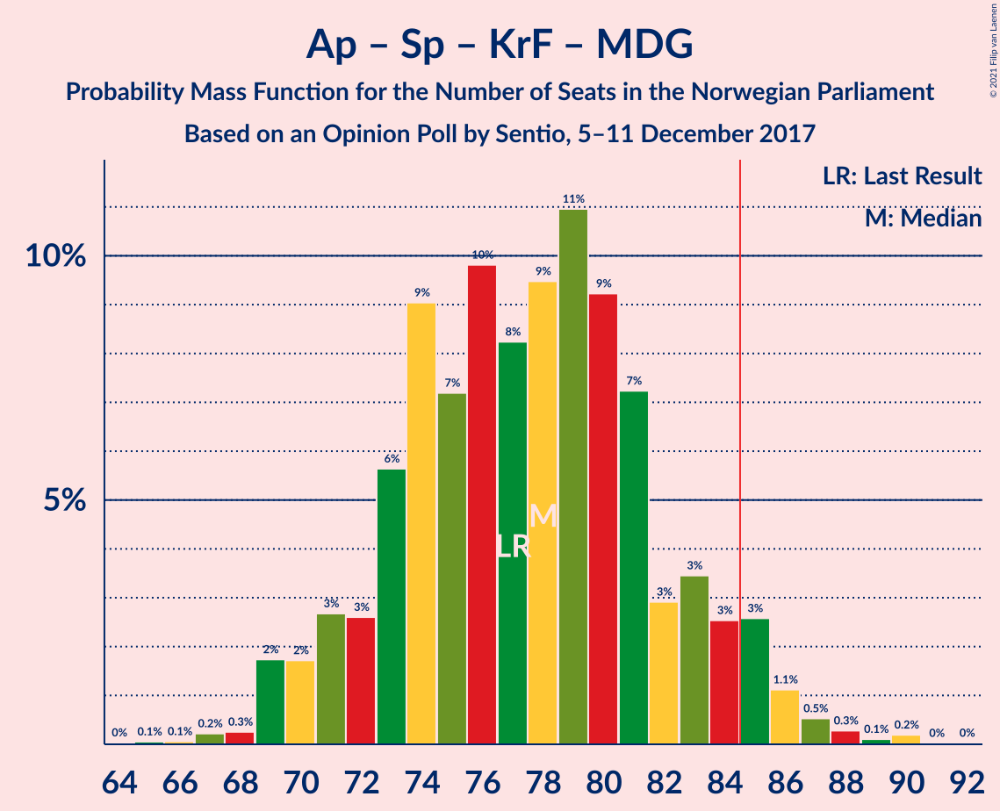

| Number of Seats | Probability | Accumulated | Special Marks |
|:---------------:|:-----------:|:-----------:|:-------------:|
| 65 | 0.1% | 100% |  |
| 66 | 0.1% | 99.9% |  |
| 67 | 0.2% | 99.8% |  |
| 68 | 0.3% | 99.6% |  |
| 69 | 2% | 99.4% |  |
| 70 | 2% | 98% |  |
| 71 | 3% | 96% |  |
| 72 | 3% | 93% |  |
| 73 | 6% | 91% |  |
| 74 | 9% | 85% |  |
| 75 | 7% | 76% |  |
| 76 | 10% | 69% | Median |
| 77 | 8% | 59% | Last Result |
| 78 | 9% | 51% |  |
| 79 | 11% | 41% |  |
| 80 | 9% | 30% |  |
| 81 | 7% | 21% |  |
| 82 | 3% | 14% |  |
| 83 | 3% | 11% |  |
| 84 | 3% | 7% |  |
| 85 | 3% | 5% | Majority |
| 86 | 1.1% | 2% |  |
| 87 | 0.5% | 1.2% |  |
| 88 | 0.3% | 0.6% |  |
| 89 | 0.1% | 0.4% |  |
| 90 | 0.2% | 0.3% |  |
| 91 | 0% | 0.1% |  |
| 92 | 0% | 0% |  |

### Arbeiderpartiet – Senterpartiet – Sosialistisk Venstreparti

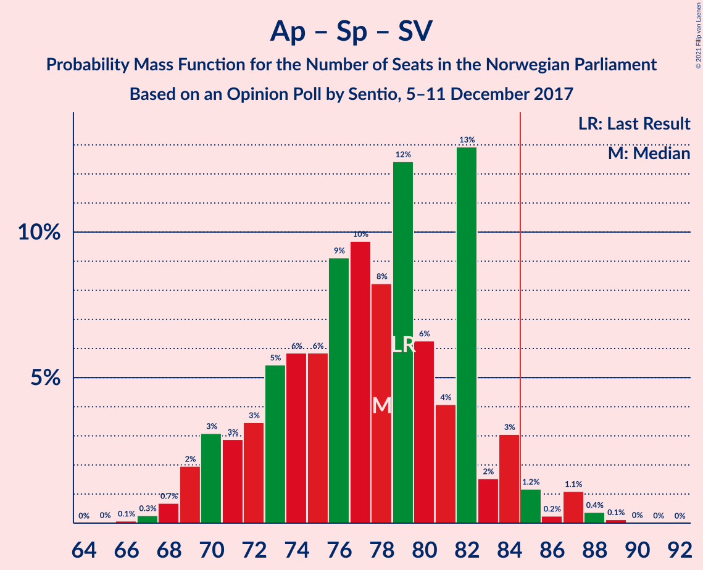

| Number of Seats | Probability | Accumulated | Special Marks |
|:---------------:|:-----------:|:-----------:|:-------------:|
| 66 | 0.1% | 100% |  |
| 67 | 0.3% | 99.9% |  |
| 68 | 0.7% | 99.6% |  |
| 69 | 2% | 98.9% |  |
| 70 | 3% | 97% |  |
| 71 | 3% | 94% |  |
| 72 | 3% | 91% |  |
| 73 | 5% | 88% |  |
| 74 | 6% | 82% |  |
| 75 | 6% | 76% |  |
| 76 | 9% | 70% |  |
| 77 | 10% | 61% |  |
| 78 | 8% | 52% | Median |
| 79 | 12% | 43% | Last Result |
| 80 | 6% | 31% |  |
| 81 | 4% | 25% |  |
| 82 | 13% | 21% |  |
| 83 | 2% | 8% |  |
| 84 | 3% | 6% |  |
| 85 | 1.2% | 3% | Majority |
| 86 | 0.2% | 2% |  |
| 87 | 1.1% | 2% |  |
| 88 | 0.4% | 0.6% |  |
| 89 | 0.1% | 0.2% |  |
| 90 | 0% | 0.1% |  |
| 91 | 0% | 0% |  |

### Høyre – Fremskrittspartiet

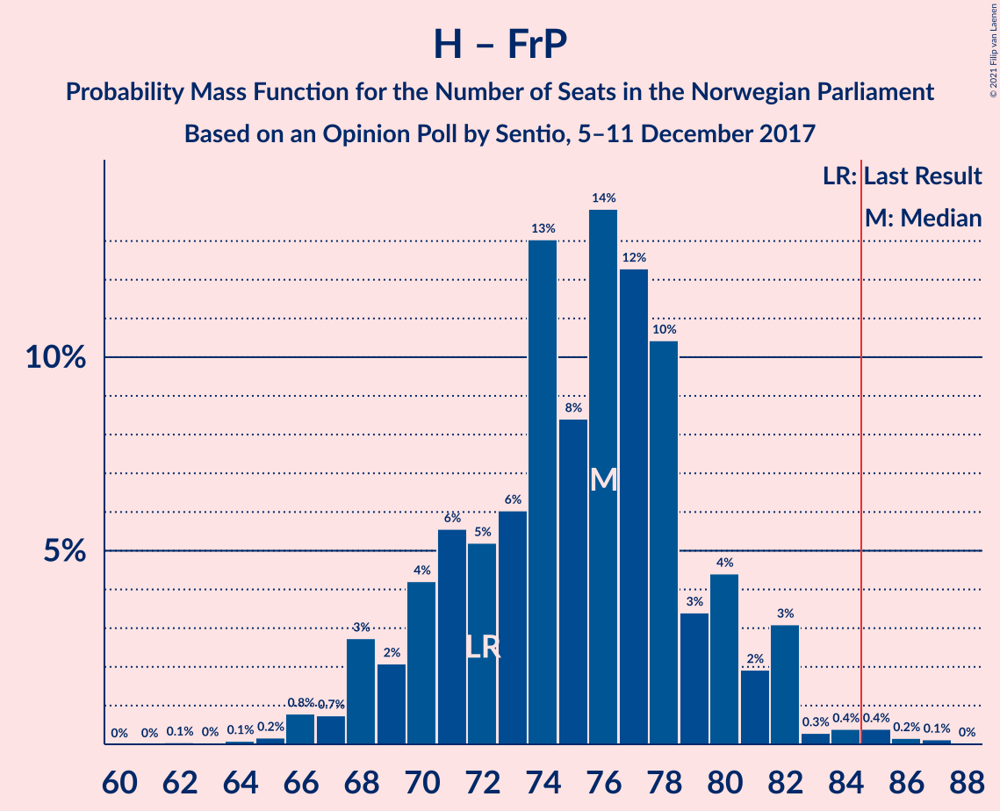

| Number of Seats | Probability | Accumulated | Special Marks |
|:---------------:|:-----------:|:-----------:|:-------------:|
| 62 | 0.1% | 100% |  |
| 63 | 0% | 99.9% |  |
| 64 | 0.1% | 99.9% |  |
| 65 | 0.2% | 99.8% |  |
| 66 | 0.8% | 99.6% |  |
| 67 | 0.7% | 98.8% |  |
| 68 | 3% | 98% |  |
| 69 | 2% | 95% |  |
| 70 | 4% | 93% |  |
| 71 | 6% | 89% |  |
| 72 | 5% | 84% | Last Result |
| 73 | 6% | 78% |  |
| 74 | 13% | 72% |  |
| 75 | 8% | 59% | Median |
| 76 | 14% | 51% |  |
| 77 | 12% | 37% |  |
| 78 | 10% | 25% |  |
| 79 | 3% | 14% |  |
| 80 | 4% | 11% |  |
| 81 | 2% | 6% |  |
| 82 | 3% | 5% |  |
| 83 | 0.3% | 1.4% |  |
| 84 | 0.4% | 1.1% |  |
| 85 | 0.4% | 0.7% | Majority |
| 86 | 0.2% | 0.3% |  |
| 87 | 0.1% | 0.2% |  |
| 88 | 0% | 0% |  |

### Arbeiderpartiet – Senterpartiet – Kristelig Folkeparti

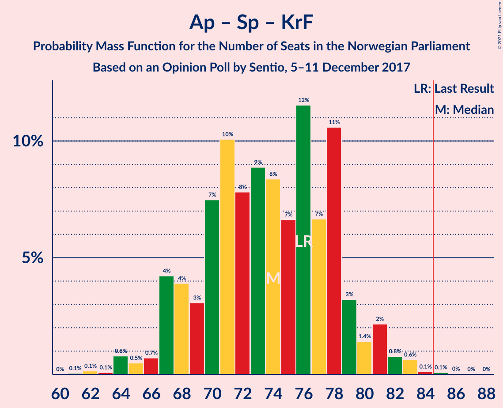

| Number of Seats | Probability | Accumulated | Special Marks |
|:---------------:|:-----------:|:-----------:|:-------------:|
| 61 | 0.1% | 100% |  |
| 62 | 0.1% | 99.9% |  |
| 63 | 0.1% | 99.8% |  |
| 64 | 0.8% | 99.7% |  |
| 65 | 0.5% | 98.9% |  |
| 66 | 0.7% | 98% |  |
| 67 | 4% | 98% |  |
| 68 | 4% | 93% |  |
| 69 | 3% | 90% |  |
| 70 | 7% | 87% |  |
| 71 | 10% | 79% |  |
| 72 | 8% | 69% |  |
| 73 | 9% | 61% |  |
| 74 | 8% | 52% | Median |
| 75 | 7% | 44% |  |
| 76 | 12% | 37% | Last Result |
| 77 | 7% | 26% |  |
| 78 | 11% | 19% |  |
| 79 | 3% | 8% |  |
| 80 | 1.4% | 5% |  |
| 81 | 2% | 4% |  |
| 82 | 0.8% | 2% |  |
| 83 | 0.6% | 0.9% |  |
| 84 | 0.1% | 0.3% |  |
| 85 | 0.1% | 0.1% | Majority |
| 86 | 0% | 0.1% |  |
| 87 | 0% | 0% |  |

### Arbeiderpartiet – Senterpartiet

| Number of Seats | Probability | Accumulated | Special Marks |
|:---------------:|:-----------:|:-----------:|:-------------:|
| 56 | 0.1% | 100% |  |
| 57 | 0.2% | 99.9% |  |
| 58 | 0.6% | 99.7% |  |
| 59 | 1.4% | 99.1% |  |
| 60 | 4% | 98% |  |
| 61 | 4% | 94% |  |
| 62 | 6% | 89% |  |
| 63 | 5% | 83% |  |
| 64 | 9% | 78% |  |
| 65 | 8% | 69% |  |
| 66 | 10% | 61% | Median |
| 67 | 10% | 51% |  |
| 68 | 12% | 41% | Last Result |
| 69 | 9% | 29% |  |
| 70 | 11% | 20% |  |
| 71 | 4% | 10% |  |
| 72 | 3% | 6% |  |
| 73 | 1.2% | 3% |  |
| 74 | 1.1% | 2% |  |
| 75 | 0.4% | 1.2% |  |
| 76 | 0.5% | 0.8% |  |
| 77 | 0.2% | 0.3% |  |
| 78 | 0% | 0.1% |  |
| 79 | 0% | 0% |  |

### Arbeiderpartiet – Sosialistisk Venstreparti – Miljøpartiet De Grønne – Rødt

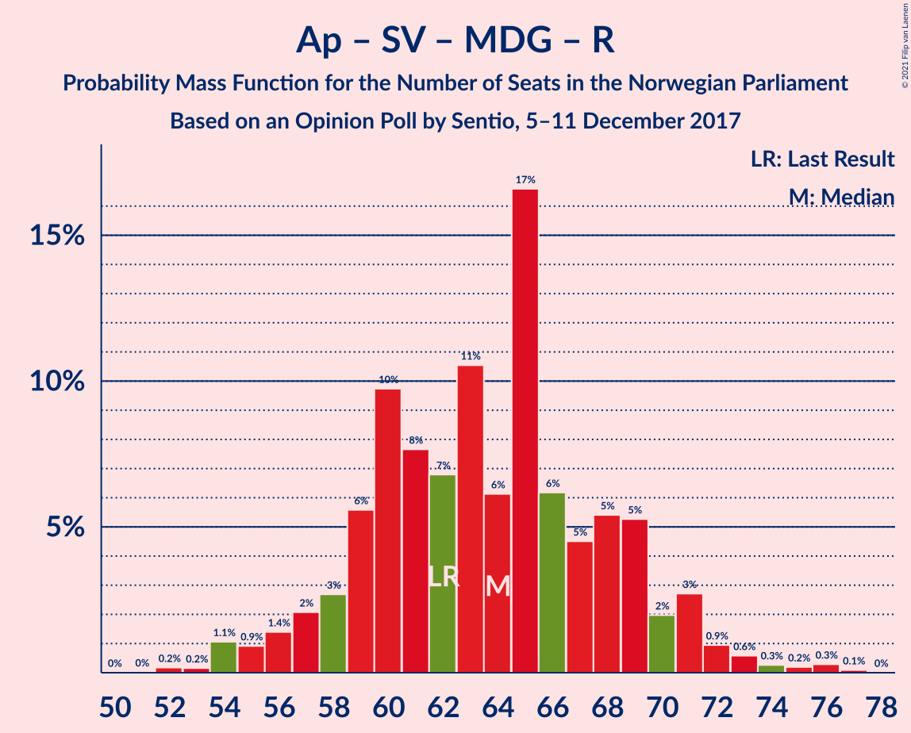

| Number of Seats | Probability | Accumulated | Special Marks |
|:---------------:|:-----------:|:-----------:|:-------------:|
| 52 | 0.2% | 100% |  |
| 53 | 0.2% | 99.8% |  |
| 54 | 1.1% | 99.6% |  |
| 55 | 0.9% | 98.6% |  |
| 56 | 1.4% | 98% |  |
| 57 | 2% | 96% |  |
| 58 | 3% | 94% |  |
| 59 | 6% | 91% |  |
| 60 | 10% | 86% |  |
| 61 | 8% | 76% |  |
| 62 | 7% | 69% | Last Result, Median |
| 63 | 11% | 62% |  |
| 64 | 6% | 51% |  |
| 65 | 17% | 45% |  |
| 66 | 6% | 28% |  |
| 67 | 5% | 22% |  |
| 68 | 5% | 18% |  |
| 69 | 5% | 12% |  |
| 70 | 2% | 7% |  |
| 71 | 3% | 5% |  |
| 72 | 0.9% | 2% |  |
| 73 | 0.6% | 1.4% |  |
| 74 | 0.3% | 0.9% |  |
| 75 | 0.2% | 0.6% |  |
| 76 | 0.3% | 0.4% |  |
| 77 | 0.1% | 0.1% |  |
| 78 | 0% | 0% |  |

### Høyre – Kristelig Folkeparti – Venstre

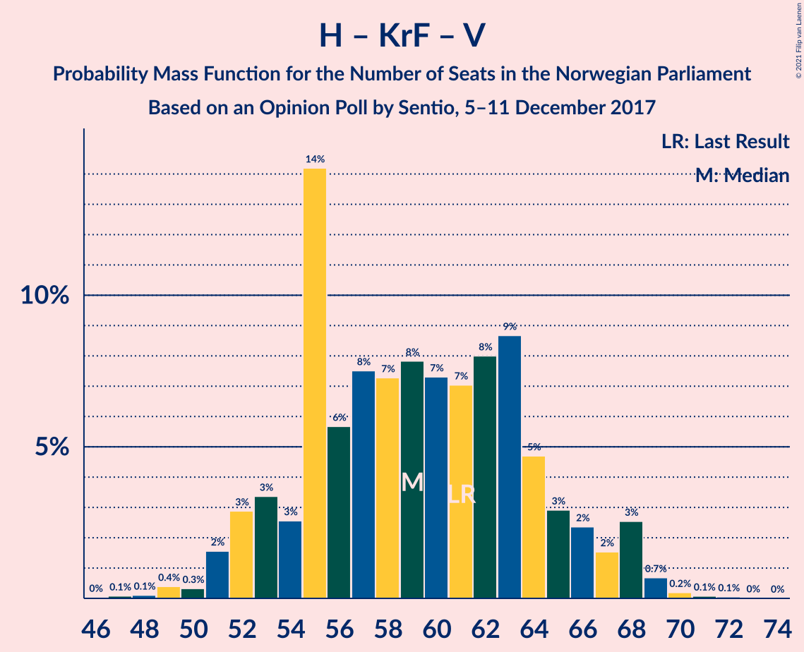

| Number of Seats | Probability | Accumulated | Special Marks |
|:---------------:|:-----------:|:-----------:|:-------------:|
| 46 | 0% | 100% |  |
| 47 | 0.1% | 99.9% |  |
| 48 | 0.1% | 99.9% |  |
| 49 | 0.4% | 99.7% |  |
| 50 | 0.3% | 99.4% |  |
| 51 | 2% | 99.0% |  |
| 52 | 3% | 97% |  |
| 53 | 3% | 95% |  |
| 54 | 3% | 91% |  |
| 55 | 14% | 89% |  |
| 56 | 6% | 74% |  |
| 57 | 8% | 69% |  |
| 58 | 7% | 61% | Median |
| 59 | 8% | 54% |  |
| 60 | 7% | 46% |  |
| 61 | 7% | 39% | Last Result |
| 62 | 8% | 32% |  |
| 63 | 9% | 24% |  |
| 64 | 5% | 15% |  |
| 65 | 3% | 10% |  |
| 66 | 2% | 7% |  |
| 67 | 2% | 5% |  |
| 68 | 3% | 4% |  |
| 69 | 0.7% | 1.0% |  |
| 70 | 0.2% | 0.4% |  |
| 71 | 0.1% | 0.2% |  |
| 72 | 0.1% | 0.1% |  |
| 73 | 0% | 0% |  |

### Arbeiderpartiet – Sosialistisk Venstreparti

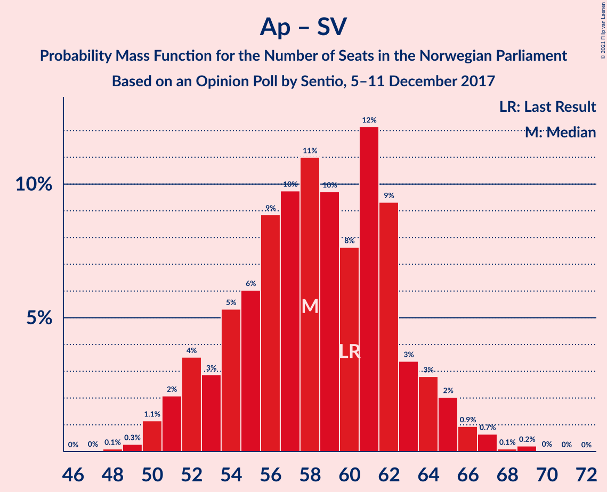

| Number of Seats | Probability | Accumulated | Special Marks |
|:---------------:|:-----------:|:-----------:|:-------------:|
| 48 | 0.1% | 100% |  |
| 49 | 0.3% | 99.9% |  |
| 50 | 1.1% | 99.6% |  |
| 51 | 2% | 98% |  |
| 52 | 4% | 96% |  |
| 53 | 3% | 93% |  |
| 54 | 5% | 90% |  |
| 55 | 6% | 85% |  |
| 56 | 9% | 79% |  |
| 57 | 10% | 70% |  |
| 58 | 11% | 60% |  |
| 59 | 10% | 49% | Median |
| 60 | 8% | 39% | Last Result |
| 61 | 12% | 32% |  |
| 62 | 9% | 19% |  |
| 63 | 3% | 10% |  |
| 64 | 3% | 7% |  |
| 65 | 2% | 4% |  |
| 66 | 0.9% | 2% |  |
| 67 | 0.7% | 1.0% |  |
| 68 | 0.1% | 0.4% |  |
| 69 | 0.2% | 0.3% |  |
| 70 | 0% | 0.1% |  |
| 71 | 0% | 0% |  |

### Senterpartiet – Kristelig Folkeparti – Venstre

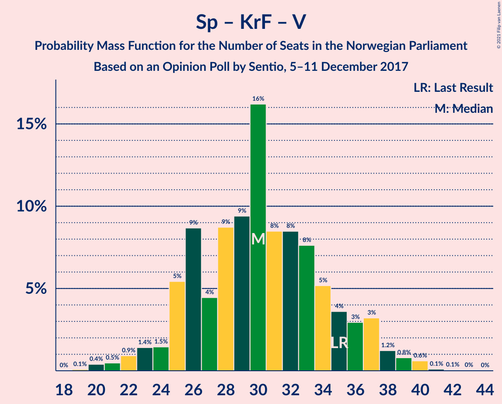

| Number of Seats | Probability | Accumulated | Special Marks |
|:---------------:|:-----------:|:-----------:|:-------------:|
| 19 | 0.1% | 100% |  |
| 20 | 0.4% | 99.9% |  |
| 21 | 0.5% | 99.5% |  |
| 22 | 0.9% | 99.0% |  |
| 23 | 1.4% | 98% |  |
| 24 | 1.5% | 97% |  |
| 25 | 5% | 95% |  |
| 26 | 9% | 90% |  |
| 27 | 4% | 81% |  |
| 28 | 9% | 77% |  |
| 29 | 9% | 68% | Median |
| 30 | 16% | 59% |  |
| 31 | 8% | 42% |  |
| 32 | 8% | 34% |  |
| 33 | 8% | 25% |  |
| 34 | 5% | 18% |  |
| 35 | 4% | 13% | Last Result |
| 36 | 3% | 9% |  |
| 37 | 3% | 6% |  |
| 38 | 1.2% | 3% |  |
| 39 | 0.8% | 2% |  |
| 40 | 0.6% | 0.8% |  |
| 41 | 0.1% | 0.2% |  |
| 42 | 0.1% | 0.1% |  |
| 43 | 0% | 0.1% |  |
| 44 | 0% | 0% |  |

## Technical Information

### Opinion Poll

+ **Polling firm:** Sentio
+ **Commissioner(s):** —
+ **Fieldwork period:** 5–11 December 2017

### Calculations

+ **Sample size:** 768
+ **Simulations done:** 1,048,576
+ **Error estimate:** 4.22%

