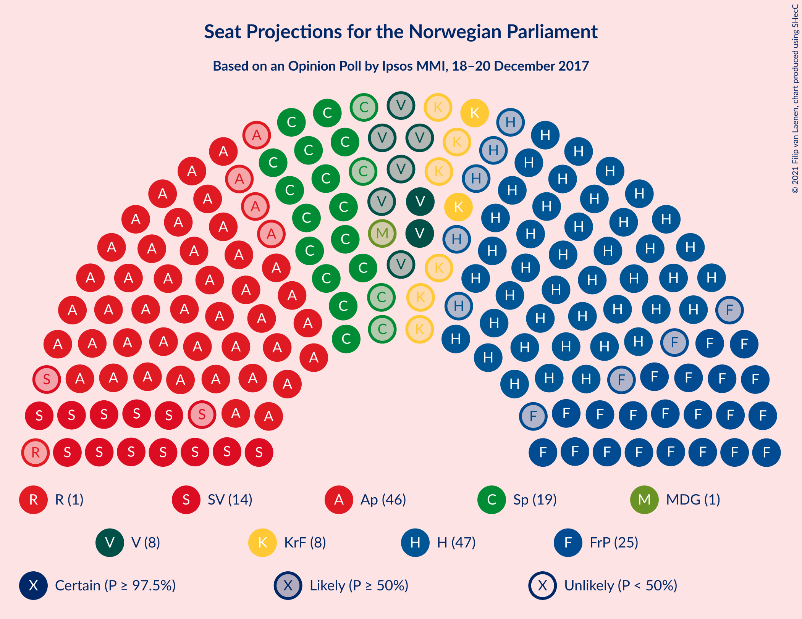
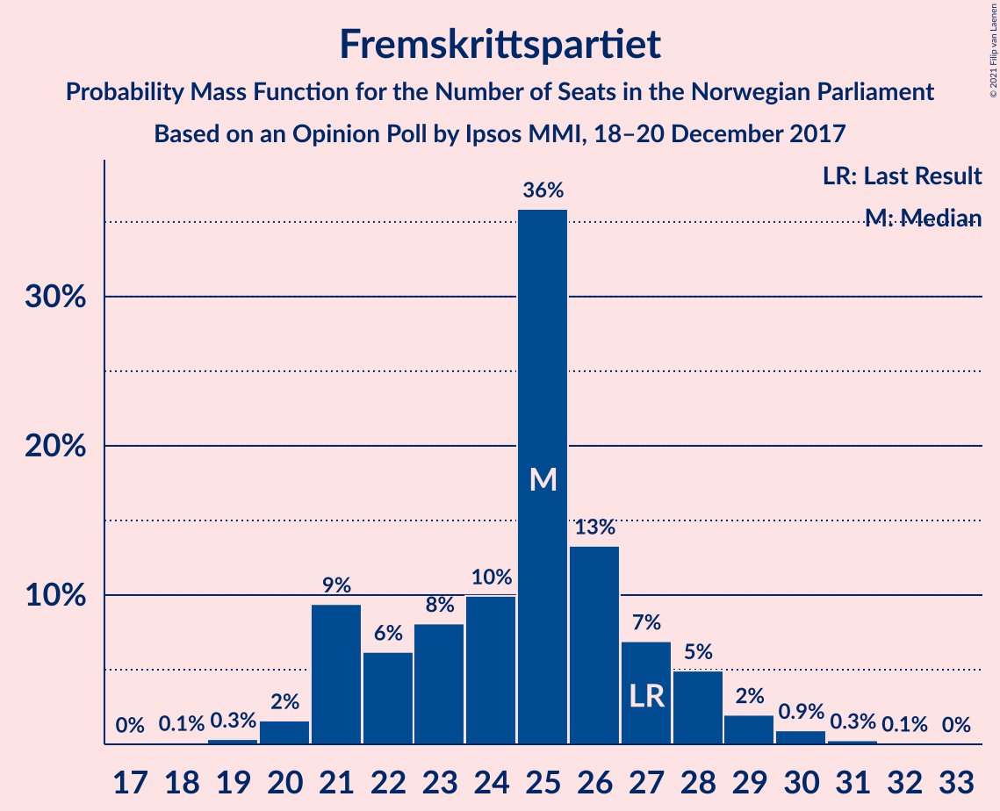
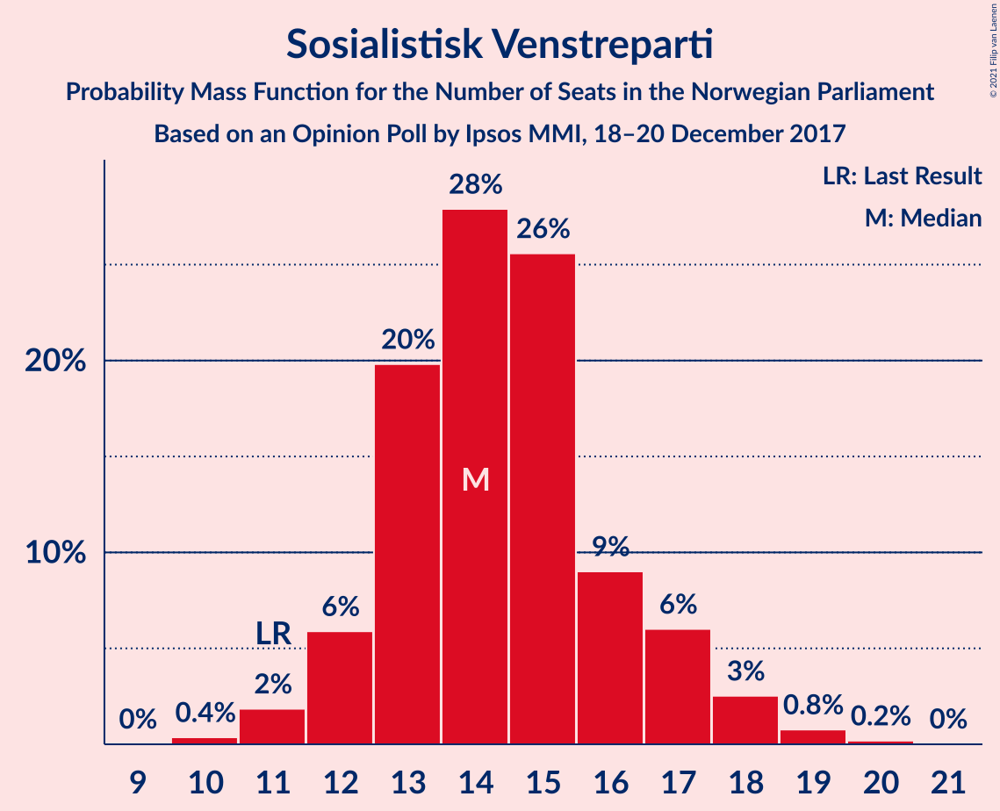
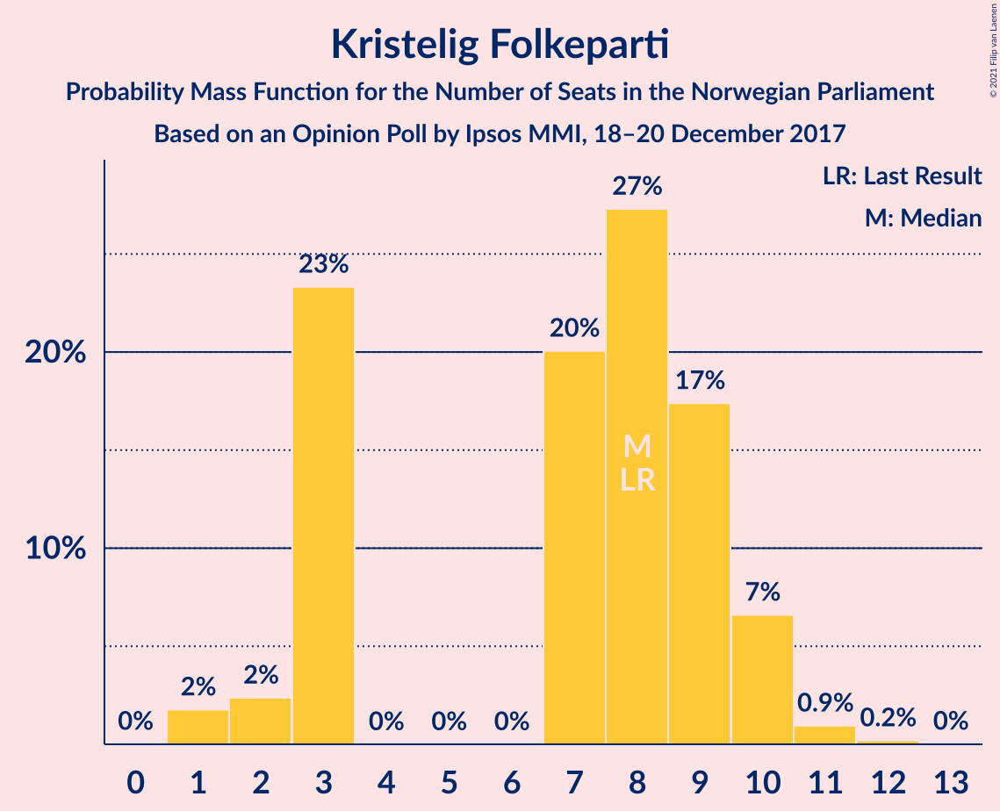
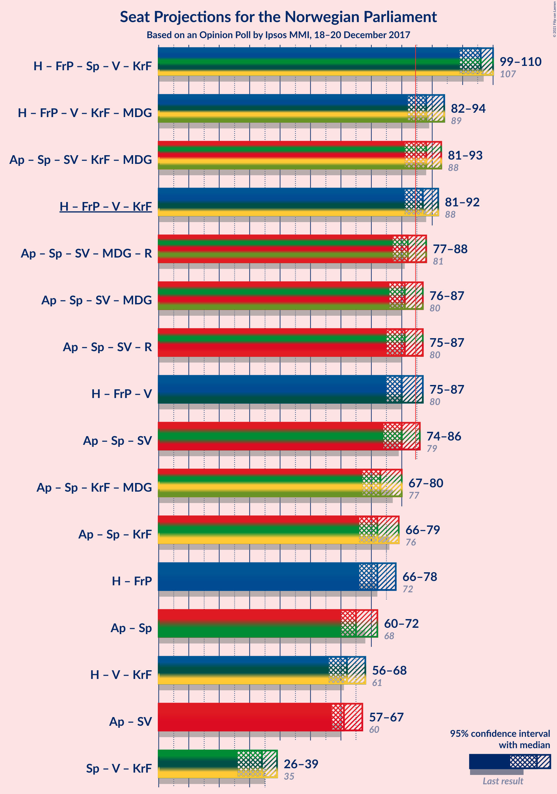
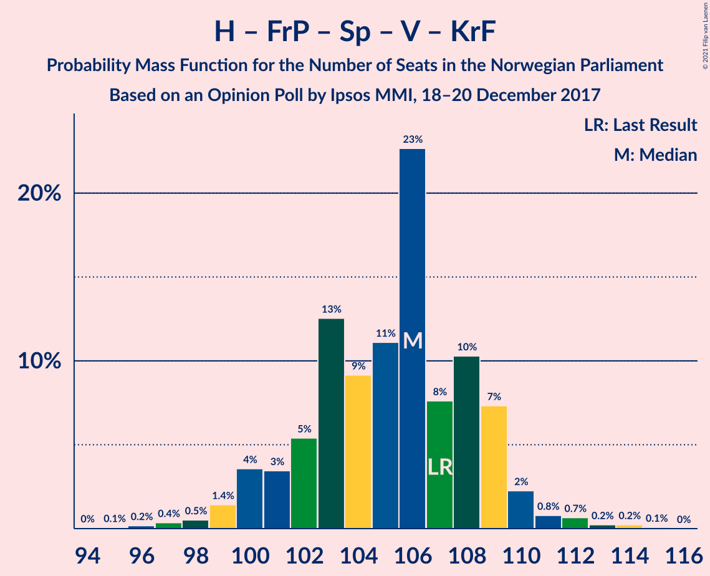
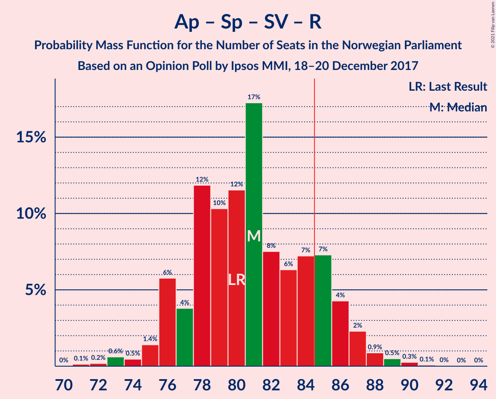
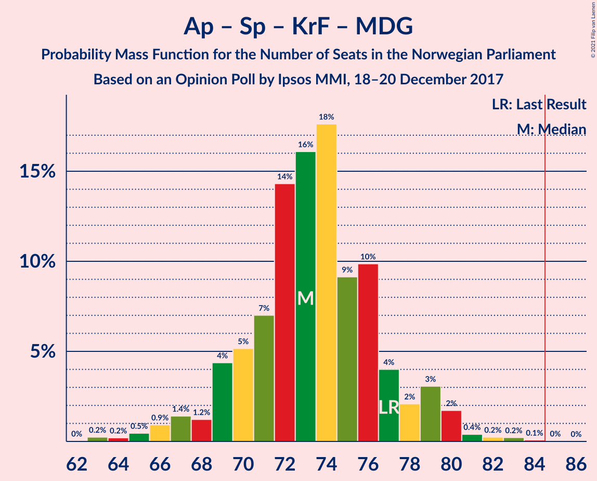

# Opinion Poll by Ipsos MMI, 18–20 December 2017

<a href="#voting-intentions">Voting Intentions</a> | <a href="#seats">Seats</a> | <a href="#coalitions">Coalitions</a> | <a href="#technical-information">Technical Information</a>

## Voting Intentions

### Confidence Intervals

| Party | Last Result | Poll Result | 80% Confidence Interval | 90% Confidence Interval | 95% Confidence Interval | 99% Confidence Interval |
|:-----:|:-----------:|:-----------:|:-----------------------:|:-----------------------:|:-----------------------:|:-----------------------:|
| Høyre | 25.0% | 26.5% | 24.7–28.4% |24.2–28.9% |23.7–29.4% |22.9–30.4% |
| Arbeiderpartiet | 27.4% | 26.3% | 24.5–28.2% |24.0–28.7% |23.5–29.2% |22.7–30.1% |
| Fremskrittspartiet | 15.2% | 13.7% | 12.3–15.2% |11.9–15.7% |11.6–16.0% |11.0–16.8% |
| Senterpartiet | 10.3% | 10.1% | 8.9–11.5% |8.6–11.9% |8.3–12.2% |7.8–12.9% |
| Sosialistisk Venstreparti | 6.0% | 8.0% | 6.9–9.2% |6.6–9.6% |6.4–9.9% |5.9–10.5% |
| Venstre | 4.4% | 4.8% | 4.0–5.9% |3.8–6.2% |3.6–6.4% |3.3–7.0% |
| Kristelig Folkeparti | 4.2% | 4.3% | 3.6–5.3% |3.4–5.6% |3.2–5.8% |2.9–6.3% |
| Miljøpartiet De Grønne | 3.2% | 2.6% | 2.0–3.4% |1.9–3.6% |1.7–3.8% |1.5–4.2% |
| Rødt | 2.4% | 1.9% | 1.5–2.7% |1.3–2.9% |1.2–3.0% |1.0–3.4% |

*Note:* The poll result column reflects the actual value used in the calculations. Published results may vary slightly, and in addition be rounded to fewer digits.

## Seats

### Confidence Intervals

| Party | Last Result | Median | 80% Confidence Interval | 90% Confidence Interval | 95% Confidence Interval | 99% Confidence Interval |
|:-----:|:-----------:|:------:|:-----------------------:|:-----------------------:|:-----------------------:|:-----------------------:|
| <a href="#høyre">Høyre</a> | 45 | 47 | 44–50 |43–51 |42–53 |40–55 |
| <a href="#arbeiderpartiet">Arbeiderpartiet</a> | 49 | 47 | 44–51 |43–52 |42–53 |41–54 |
| <a href="#fremskrittspartiet">Fremskrittspartiet</a> | 27 | 25 | 21–27 |21–28 |21–29 |20–30 |
| <a href="#senterpartiet">Senterpartiet</a> | 19 | 19 | 16–21 |15–22 |15–22 |13–23 |
| <a href="#sosialistisk-venstreparti">Sosialistisk Venstreparti</a> | 11 | 14 | 13–16 |12–17 |12–18 |11–19 |
| <a href="#venstre">Venstre</a> | 8 | 9 | 7–10 |2–11 |2–12 |2–13 |
| <a href="#kristelig-folkeparti">Kristelig Folkeparti</a> | 8 | 8 | 3–9 |3–10 |2–10 |1–11 |
| <a href="#miljøpartiet-de-grønne">Miljøpartiet De Grønne</a> | 1 | 1 | 1–2 |0–2 |0–2 |0–7 |
| <a href="#rødt">Rødt</a> | 1 | 1 | 1 |1 |0–2 |0–2 |

### Høyre

*For a full overview of the results for this party, see the [Høyre](party-høyre.html) page.*

| Number of Seats | Probability | Accumulated | Special Marks |
|:---------------:|:-----------:|:-----------:|:-------------:|
| 39 | 0.1% | 100% |  |
| 40 | 0.4% | 99.9% |  |
| 41 | 0.6% | 99.5% |  |
| 42 | 2% | 98.9% |  |
| 43 | 3% | 97% |  |
| 44 | 6% | 95% |  |
| 45 | 10% | 88% | Last Result |
| 46 | 12% | 78% |  |
| 47 | 23% | 66% | Median |
| 48 | 11% | 43% |  |
| 49 | 17% | 32% |  |
| 50 | 6% | 14% |  |
| 51 | 4% | 8% |  |
| 52 | 2% | 5% |  |
| 53 | 1.3% | 3% |  |
| 54 | 1.0% | 2% |  |
| 55 | 0.4% | 0.6% |  |
| 56 | 0.1% | 0.2% |  |
| 57 | 0.1% | 0.1% |  |
| 58 | 0% | 0% |  |

### Arbeiderpartiet

*For a full overview of the results for this party, see the [Arbeiderpartiet](party-arbeiderpartiet.html) page.*

| Number of Seats | Probability | Accumulated | Special Marks |
|:---------------:|:-----------:|:-----------:|:-------------:|
| 39 | 0% | 100% |  |
| 40 | 0.1% | 99.9% |  |
| 41 | 0.5% | 99.8% |  |
| 42 | 3% | 99.3% |  |
| 43 | 4% | 97% |  |
| 44 | 6% | 93% |  |
| 45 | 13% | 87% |  |
| 46 | 18% | 74% |  |
| 47 | 14% | 56% | Median |
| 48 | 11% | 42% |  |
| 49 | 15% | 32% | Last Result |
| 50 | 5% | 17% |  |
| 51 | 4% | 11% |  |
| 52 | 4% | 8% |  |
| 53 | 2% | 3% |  |
| 54 | 0.5% | 1.0% |  |
| 55 | 0.2% | 0.5% |  |
| 56 | 0.2% | 0.2% |  |
| 57 | 0% | 0.1% |  |
| 58 | 0% | 0% |  |

### Fremskrittspartiet

*For a full overview of the results for this party, see the [Fremskrittspartiet](party-fremskrittspartiet.html) page.*

| Number of Seats | Probability | Accumulated | Special Marks |
|:---------------:|:-----------:|:-----------:|:-------------:|
| 18 | 0.1% | 100% |  |
| 19 | 0.3% | 99.9% |  |
| 20 | 2% | 99.5% |  |
| 21 | 9% | 98% |  |
| 22 | 6% | 89% |  |
| 23 | 8% | 82% |  |
| 24 | 10% | 74% |  |
| 25 | 36% | 64% | Median |
| 26 | 13% | 28% |  |
| 27 | 7% | 15% | Last Result |
| 28 | 5% | 8% |  |
| 29 | 2% | 3% |  |
| 30 | 0.9% | 1.3% |  |
| 31 | 0.3% | 0.4% |  |
| 32 | 0.1% | 0.1% |  |
| 33 | 0% | 0% |  |

### Senterpartiet

*For a full overview of the results for this party, see the [Senterpartiet](party-senterpartiet.html) page.*

| Number of Seats | Probability | Accumulated | Special Marks |
|:---------------:|:-----------:|:-----------:|:-------------:|
| 13 | 0.5% | 100% |  |
| 14 | 1.1% | 99.5% |  |
| 15 | 6% | 98% |  |
| 16 | 15% | 92% |  |
| 17 | 11% | 78% |  |
| 18 | 15% | 67% |  |
| 19 | 27% | 51% | Last Result, Median |
| 20 | 10% | 24% |  |
| 21 | 8% | 14% |  |
| 22 | 5% | 6% |  |
| 23 | 0.6% | 0.9% |  |
| 24 | 0.3% | 0.3% |  |
| 25 | 0% | 0.1% |  |
| 26 | 0% | 0% |  |

### Sosialistisk Venstreparti

*For a full overview of the results for this party, see the [Sosialistisk Venstreparti](party-sosialistiskvenstreparti.html) page.*

| Number of Seats | Probability | Accumulated | Special Marks |
|:---------------:|:-----------:|:-----------:|:-------------:|
| 10 | 0.4% | 100% |  |
| 11 | 2% | 99.6% | Last Result |
| 12 | 6% | 98% |  |
| 13 | 20% | 92% |  |
| 14 | 28% | 72% | Median |
| 15 | 26% | 44% |  |
| 16 | 9% | 19% |  |
| 17 | 6% | 10% |  |
| 18 | 3% | 4% |  |
| 19 | 0.8% | 1.0% |  |
| 20 | 0.2% | 0.2% |  |
| 21 | 0% | 0% |  |

### Venstre

*For a full overview of the results for this party, see the [Venstre](party-venstre.html) page.*

| Number of Seats | Probability | Accumulated | Special Marks |
|:---------------:|:-----------:|:-----------:|:-------------:|
| 2 | 6% | 100% |  |
| 3 | 2% | 94% |  |
| 4 | 0% | 92% |  |
| 5 | 0% | 92% |  |
| 6 | 0% | 92% |  |
| 7 | 7% | 92% |  |
| 8 | 34% | 85% | Last Result |
| 9 | 29% | 50% | Median |
| 10 | 14% | 21% |  |
| 11 | 5% | 7% |  |
| 12 | 2% | 3% |  |
| 13 | 0.5% | 0.6% |  |
| 14 | 0% | 0% |  |

### Kristelig Folkeparti

*For a full overview of the results for this party, see the [Kristelig Folkeparti](party-kristeligfolkeparti.html) page.*

| Number of Seats | Probability | Accumulated | Special Marks |
|:---------------:|:-----------:|:-----------:|:-------------:|
| 1 | 2% | 100% |  |
| 2 | 2% | 98% |  |
| 3 | 23% | 96% |  |
| 4 | 0% | 73% |  |
| 5 | 0% | 73% |  |
| 6 | 0% | 73% |  |
| 7 | 20% | 73% |  |
| 8 | 27% | 52% | Last Result, Median |
| 9 | 17% | 25% |  |
| 10 | 7% | 8% |  |
| 11 | 0.9% | 1.2% |  |
| 12 | 0.2% | 0.2% |  |
| 13 | 0% | 0% |  |

### Miljøpartiet De Grønne

*For a full overview of the results for this party, see the [Miljøpartiet De Grønne](party-miljøpartietdegrønne.html) page.*

| Number of Seats | Probability | Accumulated | Special Marks |
|:---------------:|:-----------:|:-----------:|:-------------:|
| 0 | 6% | 100% |  |
| 1 | 75% | 94% | Last Result, Median |
| 2 | 18% | 19% |  |
| 3 | 0.1% | 1.4% |  |
| 4 | 0% | 1.2% |  |
| 5 | 0% | 1.2% |  |
| 6 | 0% | 1.2% |  |
| 7 | 0.9% | 1.2% |  |
| 8 | 0.3% | 0.3% |  |
| 9 | 0% | 0% |  |

### Rødt

*For a full overview of the results for this party, see the [Rødt](party-rødt.html) page.*

| Number of Seats | Probability | Accumulated | Special Marks |
|:---------------:|:-----------:|:-----------:|:-------------:|
| 0 | 4% | 100% |  |
| 1 | 92% | 96% | Last Result, Median |
| 2 | 4% | 4% |  |
| 3 | 0% | 0% |  |

## Coalitions

### Confidence Intervals

| Coalition | Last Result | Median | Majority? | 80% Confidence Interval | 90% Confidence Interval | 95% Confidence Interval | 99% Confidence Interval |
|:---------:|:-----------:|:------:|:---------:|:-----------------------:|:-----------------------:|:-----------------------:|:-----------------------:|
| Høyre – Fremskrittspartiet – Senterpartiet – Venstre – Kristelig Folkeparti | 107 | 106 | 100% | 102–109 | 100–109 | 99–110 | 97–113 |
| Høyre – Fremskrittspartiet – Venstre – Kristelig Folkeparti – Miljøpartiet De Grønne | 89 | 88 | 84% | 84–92 | 83–93 | 82–94 | 80–96 |
| Arbeiderpartiet – Senterpartiet – Sosialistisk Venstreparti – Kristelig Folkeparti – Miljøpartiet De Grønne | 88 | 88 | 90% | 84–91 | 83–93 | 81–93 | 79–96 |
| Høyre – Fremskrittspartiet – Venstre – Kristelig Folkeparti | 88 | 87 | 75% | 83–91 | 82–92 | 81–92 | 79–95 |
| Arbeiderpartiet – Senterpartiet – Sosialistisk Venstreparti – Miljøpartiet De Grønne – Rødt | 81 | 82 | 25% | 78–86 | 77–87 | 77–88 | 74–90 |
| Arbeiderpartiet – Senterpartiet – Sosialistisk Venstreparti – Miljøpartiet De Grønne | 80 | 81 | 16% | 77–85 | 76–86 | 76–87 | 73–89 |
| Arbeiderpartiet – Senterpartiet – Sosialistisk Venstreparti – Rødt | 80 | 81 | 16% | 77–85 | 76–86 | 75–87 | 73–89 |
| Høyre – Fremskrittspartiet – Venstre | 80 | 80 | 5% | 77–83 | 75–85 | 75–87 | 72–89 |
| Arbeiderpartiet – Senterpartiet – Sosialistisk Venstreparti | 79 | 80 | 8% | 76–84 | 75–85 | 74–86 | 72–88 |
| Arbeiderpartiet – Senterpartiet – Kristelig Folkeparti – Miljøpartiet De Grønne | 77 | 73 | 0.1% | 70–77 | 69–79 | 67–80 | 65–82 |
| Arbeiderpartiet – Senterpartiet – Kristelig Folkeparti | 76 | 72 | 0% | 69–76 | 67–78 | 66–79 | 63–81 |
| Høyre – Fremskrittspartiet | 72 | 72 | 0% | 69–75 | 67–77 | 66–78 | 63–80 |
| Arbeiderpartiet – Senterpartiet | 68 | 65 | 0% | 62–70 | 61–71 | 60–72 | 58–74 |
| Høyre – Venstre – Kristelig Folkeparti | 61 | 62 | 0% | 58–66 | 57–67 | 56–68 | 53–70 |
| Arbeiderpartiet – Sosialistisk Venstreparti | 60 | 61 | 0% | 58–65 | 58–67 | 57–67 | 54–70 |
| Senterpartiet – Venstre – Kristelig Folkeparti | 35 | 34 | 0% | 30–37 | 28–38 | 26–39 | 23–41 |

### Høyre – Fremskrittspartiet – Senterpartiet – Venstre – Kristelig Folkeparti

| Number of Seats | Probability | Accumulated | Special Marks |
|:---------------:|:-----------:|:-----------:|:-------------:|
| 94 | 0% | 100% |  |
| 95 | 0.1% | 99.9% |  |
| 96 | 0.2% | 99.9% |  |
| 97 | 0.4% | 99.7% |  |
| 98 | 0.5% | 99.3% |  |
| 99 | 1.4% | 98.8% |  |
| 100 | 4% | 97% |  |
| 101 | 3% | 94% |  |
| 102 | 5% | 90% |  |
| 103 | 13% | 85% |  |
| 104 | 9% | 72% |  |
| 105 | 11% | 63% |  |
| 106 | 23% | 52% |  |
| 107 | 8% | 29% | Last Result |
| 108 | 10% | 22% | Median |
| 109 | 7% | 12% |  |
| 110 | 2% | 4% |  |
| 111 | 0.8% | 2% |  |
| 112 | 0.7% | 1.2% |  |
| 113 | 0.2% | 0.6% |  |
| 114 | 0.2% | 0.3% |  |
| 115 | 0.1% | 0.1% |  |
| 116 | 0% | 0% |  |

### Høyre – Fremskrittspartiet – Venstre – Kristelig Folkeparti – Miljøpartiet De Grønne

| Number of Seats | Probability | Accumulated | Special Marks |
|:---------------:|:-----------:|:-----------:|:-------------:|
| 77 | 0% | 100% |  |
| 78 | 0.1% | 99.9% |  |
| 79 | 0.3% | 99.9% |  |
| 80 | 0.5% | 99.6% |  |
| 81 | 0.9% | 99.1% |  |
| 82 | 2% | 98% |  |
| 83 | 4% | 96% |  |
| 84 | 7% | 92% |  |
| 85 | 7% | 84% | Majority |
| 86 | 6% | 77% |  |
| 87 | 8% | 71% |  |
| 88 | 17% | 63% |  |
| 89 | 12% | 46% | Last Result |
| 90 | 10% | 35% | Median |
| 91 | 12% | 24% |  |
| 92 | 4% | 12% |  |
| 93 | 6% | 9% |  |
| 94 | 1.4% | 3% |  |
| 95 | 0.5% | 1.4% |  |
| 96 | 0.6% | 0.9% |  |
| 97 | 0.2% | 0.3% |  |
| 98 | 0.1% | 0.2% |  |
| 99 | 0% | 0% |  |

### Arbeiderpartiet – Senterpartiet – Sosialistisk Venstreparti – Kristelig Folkeparti – Miljøpartiet De Grønne

| Number of Seats | Probability | Accumulated | Special Marks |
|:---------------:|:-----------:|:-----------:|:-------------:|
| 77 | 0.1% | 100% |  |
| 78 | 0.2% | 99.9% |  |
| 79 | 0.6% | 99.7% |  |
| 80 | 1.1% | 99.1% |  |
| 81 | 0.9% | 98% |  |
| 82 | 1.2% | 97% |  |
| 83 | 1.0% | 96% |  |
| 84 | 5% | 95% |  |
| 85 | 7% | 90% | Majority |
| 86 | 10% | 83% |  |
| 87 | 10% | 73% |  |
| 88 | 26% | 62% | Last Result |
| 89 | 17% | 36% | Median |
| 90 | 6% | 19% |  |
| 91 | 3% | 12% |  |
| 92 | 4% | 9% |  |
| 93 | 3% | 5% |  |
| 94 | 1.0% | 2% |  |
| 95 | 0.7% | 1.4% |  |
| 96 | 0.3% | 0.7% |  |
| 97 | 0.2% | 0.4% |  |
| 98 | 0.1% | 0.2% |  |
| 99 | 0.1% | 0.1% |  |
| 100 | 0% | 0% |  |

### Høyre – Fremskrittspartiet – Venstre – Kristelig Folkeparti

| Number of Seats | Probability | Accumulated | Special Marks |
|:---------------:|:-----------:|:-----------:|:-------------:|
| 76 | 0% | 100% |  |
| 77 | 0.1% | 99.9% |  |
| 78 | 0.3% | 99.8% |  |
| 79 | 0.6% | 99.5% |  |
| 80 | 1.1% | 99.0% |  |
| 81 | 2% | 98% |  |
| 82 | 5% | 96% |  |
| 83 | 7% | 91% |  |
| 84 | 9% | 84% |  |
| 85 | 5% | 75% | Majority |
| 86 | 10% | 70% |  |
| 87 | 21% | 61% |  |
| 88 | 6% | 40% | Last Result |
| 89 | 12% | 34% | Median |
| 90 | 10% | 22% |  |
| 91 | 4% | 12% |  |
| 92 | 5% | 7% |  |
| 93 | 0.9% | 2% |  |
| 94 | 0.5% | 1.3% |  |
| 95 | 0.6% | 0.9% |  |
| 96 | 0.2% | 0.3% |  |
| 97 | 0.1% | 0.1% |  |
| 98 | 0% | 0% |  |

### Arbeiderpartiet – Senterpartiet – Sosialistisk Venstreparti – Miljøpartiet De Grønne – Rødt

| Number of Seats | Probability | Accumulated | Special Marks |
|:---------------:|:-----------:|:-----------:|:-------------:|
| 72 | 0.1% | 100% |  |
| 73 | 0.2% | 99.9% |  |
| 74 | 0.6% | 99.7% |  |
| 75 | 0.5% | 99.1% |  |
| 76 | 0.9% | 98.7% |  |
| 77 | 5% | 98% |  |
| 78 | 4% | 93% |  |
| 79 | 10% | 88% |  |
| 80 | 12% | 78% |  |
| 81 | 6% | 66% | Last Result |
| 82 | 21% | 60% | Median |
| 83 | 10% | 39% |  |
| 84 | 5% | 30% |  |
| 85 | 9% | 25% | Majority |
| 86 | 7% | 16% |  |
| 87 | 5% | 9% |  |
| 88 | 2% | 4% |  |
| 89 | 1.1% | 2% |  |
| 90 | 0.6% | 1.0% |  |
| 91 | 0.3% | 0.5% |  |
| 92 | 0.1% | 0.2% |  |
| 93 | 0% | 0.1% |  |
| 94 | 0% | 0% |  |

### Arbeiderpartiet – Senterpartiet – Sosialistisk Venstreparti – Miljøpartiet De Grønne

| Number of Seats | Probability | Accumulated | Special Marks |
|:---------------:|:-----------:|:-----------:|:-------------:|
| 71 | 0.1% | 100% |  |
| 72 | 0.2% | 99.9% |  |
| 73 | 0.5% | 99.7% |  |
| 74 | 0.5% | 99.2% |  |
| 75 | 0.9% | 98.7% |  |
| 76 | 6% | 98% |  |
| 77 | 3% | 92% |  |
| 78 | 10% | 89% |  |
| 79 | 12% | 79% |  |
| 80 | 6% | 67% | Last Result |
| 81 | 21% | 61% | Median |
| 82 | 9% | 39% |  |
| 83 | 5% | 30% |  |
| 84 | 9% | 25% |  |
| 85 | 7% | 16% | Majority |
| 86 | 5% | 9% |  |
| 87 | 2% | 4% |  |
| 88 | 1.0% | 2% |  |
| 89 | 0.6% | 1.0% |  |
| 90 | 0.3% | 0.4% |  |
| 91 | 0.1% | 0.2% |  |
| 92 | 0% | 0.1% |  |
| 93 | 0% | 0% |  |

### Arbeiderpartiet – Senterpartiet – Sosialistisk Venstreparti – Rødt

| Number of Seats | Probability | Accumulated | Special Marks |
|:---------------:|:-----------:|:-----------:|:-------------:|
| 71 | 0.1% | 100% |  |
| 72 | 0.2% | 99.8% |  |
| 73 | 0.6% | 99.7% |  |
| 74 | 0.5% | 99.1% |  |
| 75 | 1.4% | 98.6% |  |
| 76 | 6% | 97% |  |
| 77 | 4% | 91% |  |
| 78 | 12% | 88% |  |
| 79 | 10% | 76% |  |
| 80 | 12% | 65% | Last Result |
| 81 | 17% | 54% | Median |
| 82 | 8% | 37% |  |
| 83 | 6% | 29% |  |
| 84 | 7% | 23% |  |
| 85 | 7% | 16% | Majority |
| 86 | 4% | 8% |  |
| 87 | 2% | 4% |  |
| 88 | 0.9% | 2% |  |
| 89 | 0.5% | 0.9% |  |
| 90 | 0.3% | 0.4% |  |
| 91 | 0.1% | 0.1% |  |
| 92 | 0% | 0.1% |  |
| 93 | 0% | 0% |  |

### Høyre – Fremskrittspartiet – Venstre

| Number of Seats | Probability | Accumulated | Special Marks |
|:---------------:|:-----------:|:-----------:|:-------------:|
| 69 | 0.1% | 100% |  |
| 70 | 0.1% | 99.9% |  |
| 71 | 0.2% | 99.8% |  |
| 72 | 0.4% | 99.6% |  |
| 73 | 0.7% | 99.3% |  |
| 74 | 1.1% | 98.6% |  |
| 75 | 3% | 98% |  |
| 76 | 4% | 95% |  |
| 77 | 4% | 91% |  |
| 78 | 6% | 87% |  |
| 79 | 17% | 81% |  |
| 80 | 26% | 64% | Last Result |
| 81 | 10% | 38% | Median |
| 82 | 11% | 28% |  |
| 83 | 8% | 17% |  |
| 84 | 4% | 10% |  |
| 85 | 1.2% | 5% | Majority |
| 86 | 1.2% | 4% |  |
| 87 | 0.9% | 3% |  |
| 88 | 1.1% | 2% |  |
| 89 | 0.6% | 0.9% |  |
| 90 | 0.2% | 0.3% |  |
| 91 | 0.1% | 0.1% |  |
| 92 | 0% | 0% |  |

### Arbeiderpartiet – Senterpartiet – Sosialistisk Venstreparti

| Number of Seats | Probability | Accumulated | Special Marks |
|:---------------:|:-----------:|:-----------:|:-------------:|
| 70 | 0.1% | 100% |  |
| 71 | 0.2% | 99.8% |  |
| 72 | 0.6% | 99.7% |  |
| 73 | 0.5% | 99.1% |  |
| 74 | 1.4% | 98.6% |  |
| 75 | 6% | 97% |  |
| 76 | 4% | 91% |  |
| 77 | 11% | 88% |  |
| 78 | 11% | 76% |  |
| 79 | 12% | 66% | Last Result |
| 80 | 17% | 54% | Median |
| 81 | 8% | 37% |  |
| 82 | 6% | 29% |  |
| 83 | 8% | 23% |  |
| 84 | 7% | 15% |  |
| 85 | 4% | 8% | Majority |
| 86 | 2% | 4% |  |
| 87 | 0.9% | 2% |  |
| 88 | 0.5% | 0.9% |  |
| 89 | 0.2% | 0.4% |  |
| 90 | 0.1% | 0.1% |  |
| 91 | 0% | 0.1% |  |
| 92 | 0% | 0% |  |

### Arbeiderpartiet – Senterpartiet – Kristelig Folkeparti – Miljøpartiet De Grønne

| Number of Seats | Probability | Accumulated | Special Marks |
|:---------------:|:-----------:|:-----------:|:-------------:|
| 62 | 0% | 100% |  |
| 63 | 0.2% | 99.9% |  |
| 64 | 0.2% | 99.7% |  |
| 65 | 0.5% | 99.5% |  |
| 66 | 0.9% | 99.0% |  |
| 67 | 1.4% | 98% |  |
| 68 | 1.2% | 97% |  |
| 69 | 4% | 95% |  |
| 70 | 5% | 91% |  |
| 71 | 7% | 86% |  |
| 72 | 14% | 79% |  |
| 73 | 16% | 65% |  |
| 74 | 18% | 49% |  |
| 75 | 9% | 31% | Median |
| 76 | 10% | 22% |  |
| 77 | 4% | 12% | Last Result |
| 78 | 2% | 8% |  |
| 79 | 3% | 6% |  |
| 80 | 2% | 3% |  |
| 81 | 0.4% | 1.0% |  |
| 82 | 0.2% | 0.6% |  |
| 83 | 0.2% | 0.4% |  |
| 84 | 0.1% | 0.1% |  |
| 85 | 0% | 0.1% | Majority |
| 86 | 0% | 0% |  |

### Arbeiderpartiet – Senterpartiet – Kristelig Folkeparti

| Number of Seats | Probability | Accumulated | Special Marks |
|:---------------:|:-----------:|:-----------:|:-------------:|
| 61 | 0% | 100% |  |
| 62 | 0.3% | 99.9% |  |
| 63 | 0.2% | 99.7% |  |
| 64 | 0.5% | 99.5% |  |
| 65 | 1.0% | 99.0% |  |
| 66 | 1.4% | 98% |  |
| 67 | 2% | 97% |  |
| 68 | 4% | 95% |  |
| 69 | 7% | 91% |  |
| 70 | 8% | 84% |  |
| 71 | 13% | 76% |  |
| 72 | 19% | 64% |  |
| 73 | 19% | 45% |  |
| 74 | 6% | 26% | Median |
| 75 | 8% | 20% |  |
| 76 | 5% | 12% | Last Result |
| 77 | 2% | 7% |  |
| 78 | 3% | 5% |  |
| 79 | 2% | 3% |  |
| 80 | 0.3% | 0.8% |  |
| 81 | 0.3% | 0.5% |  |
| 82 | 0.2% | 0.2% |  |
| 83 | 0% | 0.1% |  |
| 84 | 0% | 0% |  |

### Høyre – Fremskrittspartiet

| Number of Seats | Probability | Accumulated | Special Marks |
|:---------------:|:-----------:|:-----------:|:-------------:|
| 62 | 0.1% | 100% |  |
| 63 | 0.4% | 99.9% |  |
| 64 | 0.5% | 99.5% |  |
| 65 | 0.9% | 99.0% |  |
| 66 | 0.9% | 98% |  |
| 67 | 3% | 97% |  |
| 68 | 4% | 95% |  |
| 69 | 4% | 90% |  |
| 70 | 10% | 86% |  |
| 71 | 20% | 75% |  |
| 72 | 21% | 56% | Last Result, Median |
| 73 | 10% | 34% |  |
| 74 | 9% | 24% |  |
| 75 | 6% | 15% |  |
| 76 | 2% | 9% |  |
| 77 | 3% | 7% |  |
| 78 | 1.5% | 4% |  |
| 79 | 0.9% | 2% |  |
| 80 | 0.9% | 1.3% |  |
| 81 | 0.2% | 0.4% |  |
| 82 | 0.1% | 0.2% |  |
| 83 | 0.1% | 0.1% |  |
| 84 | 0% | 0% |  |

### Arbeiderpartiet – Senterpartiet

| Number of Seats | Probability | Accumulated | Special Marks |
|:---------------:|:-----------:|:-----------:|:-------------:|
| 56 | 0.1% | 100% |  |
| 57 | 0.2% | 99.9% |  |
| 58 | 0.3% | 99.7% |  |
| 59 | 1.1% | 99.4% |  |
| 60 | 2% | 98% |  |
| 61 | 5% | 96% |  |
| 62 | 5% | 91% |  |
| 63 | 9% | 86% |  |
| 64 | 14% | 77% |  |
| 65 | 22% | 63% |  |
| 66 | 6% | 41% | Median |
| 67 | 10% | 34% |  |
| 68 | 6% | 24% | Last Result |
| 69 | 6% | 18% |  |
| 70 | 8% | 13% |  |
| 71 | 3% | 5% |  |
| 72 | 0.6% | 3% |  |
| 73 | 1.3% | 2% |  |
| 74 | 0.4% | 0.7% |  |
| 75 | 0.2% | 0.3% |  |
| 76 | 0% | 0.1% |  |
| 77 | 0% | 0% |  |

### Høyre – Venstre – Kristelig Folkeparti

| Number of Seats | Probability | Accumulated | Special Marks |
|:---------------:|:-----------:|:-----------:|:-------------:|
| 51 | 0.1% | 100% |  |
| 52 | 0.1% | 99.9% |  |
| 53 | 0.3% | 99.8% |  |
| 54 | 0.4% | 99.4% |  |
| 55 | 0.6% | 99.1% |  |
| 56 | 2% | 98.5% |  |
| 57 | 3% | 96% |  |
| 58 | 6% | 93% |  |
| 59 | 6% | 87% |  |
| 60 | 7% | 81% |  |
| 61 | 15% | 74% | Last Result |
| 62 | 16% | 60% |  |
| 63 | 6% | 44% |  |
| 64 | 11% | 39% | Median |
| 65 | 14% | 27% |  |
| 66 | 6% | 14% |  |
| 67 | 4% | 8% |  |
| 68 | 2% | 4% |  |
| 69 | 0.8% | 2% |  |
| 70 | 0.9% | 1.4% |  |
| 71 | 0.4% | 0.5% |  |
| 72 | 0.1% | 0.1% |  |
| 73 | 0% | 0% |  |

### Arbeiderpartiet – Sosialistisk Venstreparti

| Number of Seats | Probability | Accumulated | Special Marks |
|:---------------:|:-----------:|:-----------:|:-------------:|
| 52 | 0.1% | 100% |  |
| 53 | 0.2% | 99.9% |  |
| 54 | 0.3% | 99.7% |  |
| 55 | 0.8% | 99.4% |  |
| 56 | 0.9% | 98.6% |  |
| 57 | 3% | 98% |  |
| 58 | 7% | 95% |  |
| 59 | 11% | 88% |  |
| 60 | 8% | 77% | Last Result |
| 61 | 23% | 68% | Median |
| 62 | 10% | 45% |  |
| 63 | 14% | 35% |  |
| 64 | 6% | 21% |  |
| 65 | 6% | 15% |  |
| 66 | 3% | 8% |  |
| 67 | 3% | 6% |  |
| 68 | 1.4% | 2% |  |
| 69 | 0.4% | 1.0% |  |
| 70 | 0.4% | 0.6% |  |
| 71 | 0.1% | 0.2% |  |
| 72 | 0.1% | 0.1% |  |
| 73 | 0% | 0% |  |

### Senterpartiet – Venstre – Kristelig Folkeparti

| Number of Seats | Probability | Accumulated | Special Marks |
|:---------------:|:-----------:|:-----------:|:-------------:|
| 20 | 0% | 100% |  |
| 21 | 0.2% | 99.9% |  |
| 22 | 0.1% | 99.7% |  |
| 23 | 0.3% | 99.6% |  |
| 24 | 0.4% | 99.4% |  |
| 25 | 0.8% | 99.0% |  |
| 26 | 1.2% | 98% |  |
| 27 | 2% | 97% |  |
| 28 | 2% | 95% |  |
| 29 | 3% | 93% |  |
| 30 | 9% | 90% |  |
| 31 | 4% | 81% |  |
| 32 | 17% | 77% |  |
| 33 | 10% | 60% |  |
| 34 | 16% | 50% |  |
| 35 | 9% | 34% | Last Result |
| 36 | 6% | 25% | Median |
| 37 | 11% | 19% |  |
| 38 | 4% | 8% |  |
| 39 | 2% | 3% |  |
| 40 | 0.8% | 2% |  |
| 41 | 0.6% | 0.8% |  |
| 42 | 0.1% | 0.1% |  |
| 43 | 0% | 0% |  |

## Technical Information

### Opinion Poll

+ **Polling firm:** Ipsos MMI
+ **Commissioner(s):** —
+ **Fieldwork period:** 18–20 December 2017

### Calculations

+ **Sample size:** 929
+ **Simulations done:** 1,048,576
+ **Error estimate:** 1.81%

