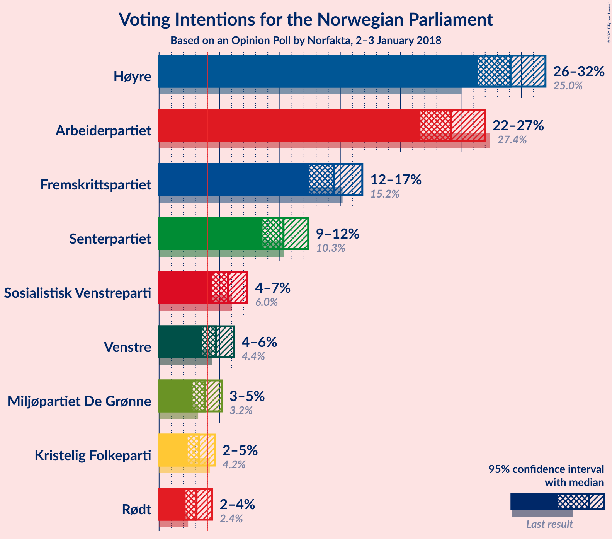
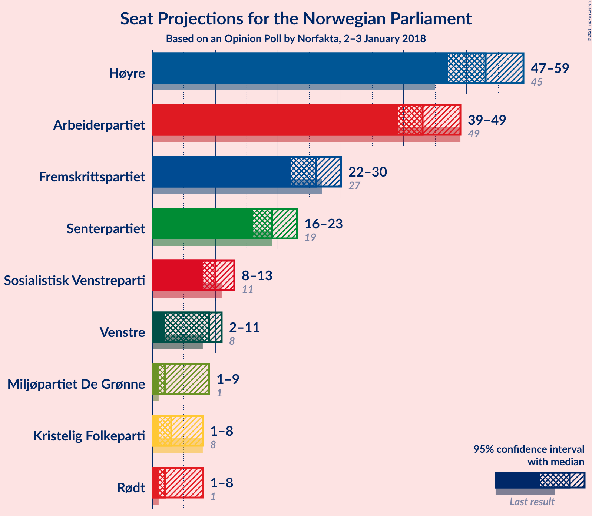
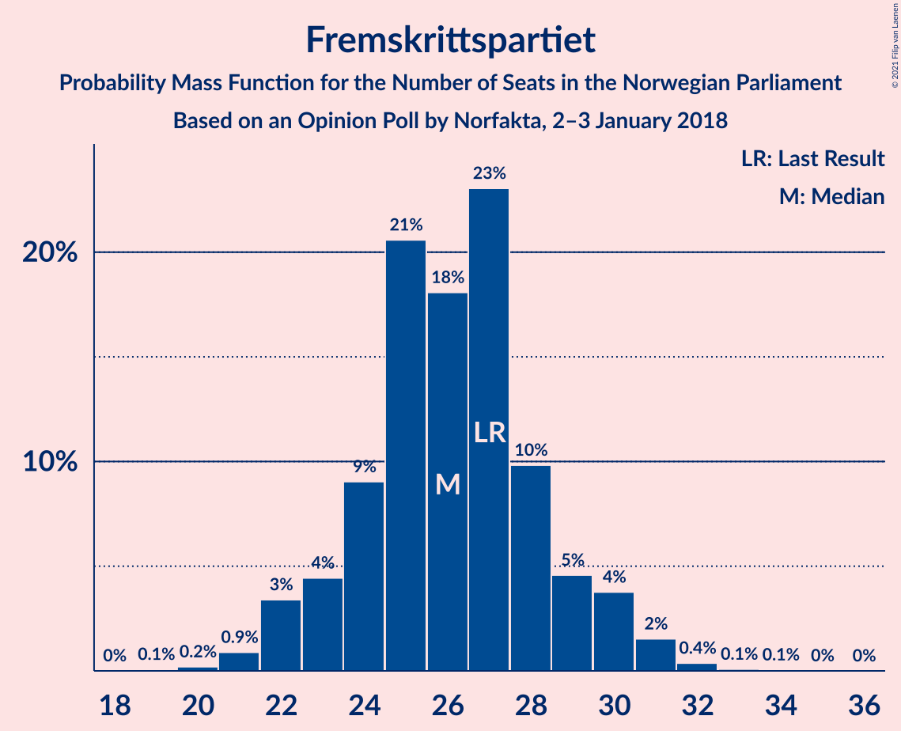
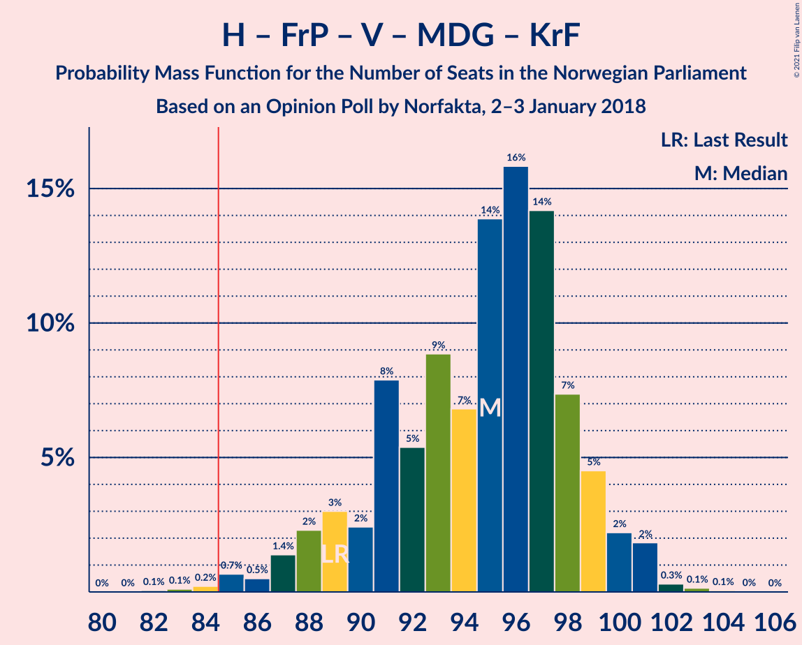
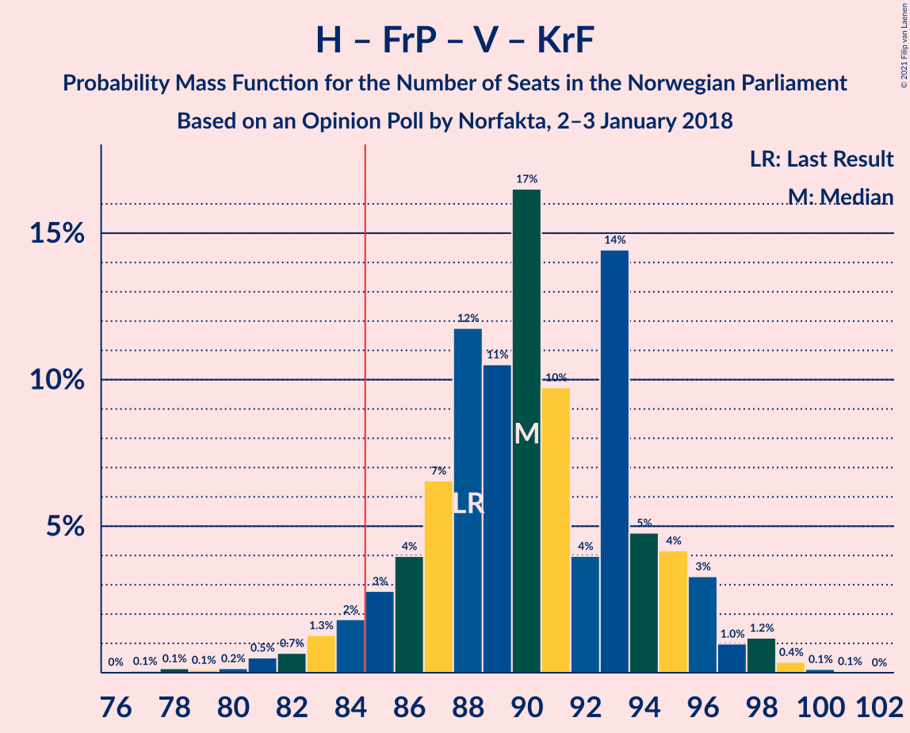
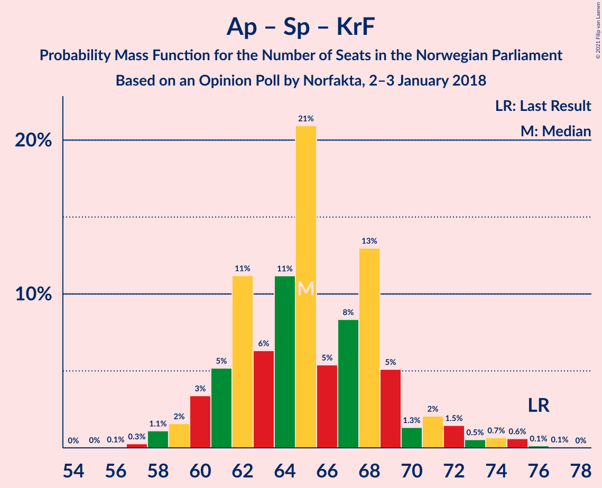
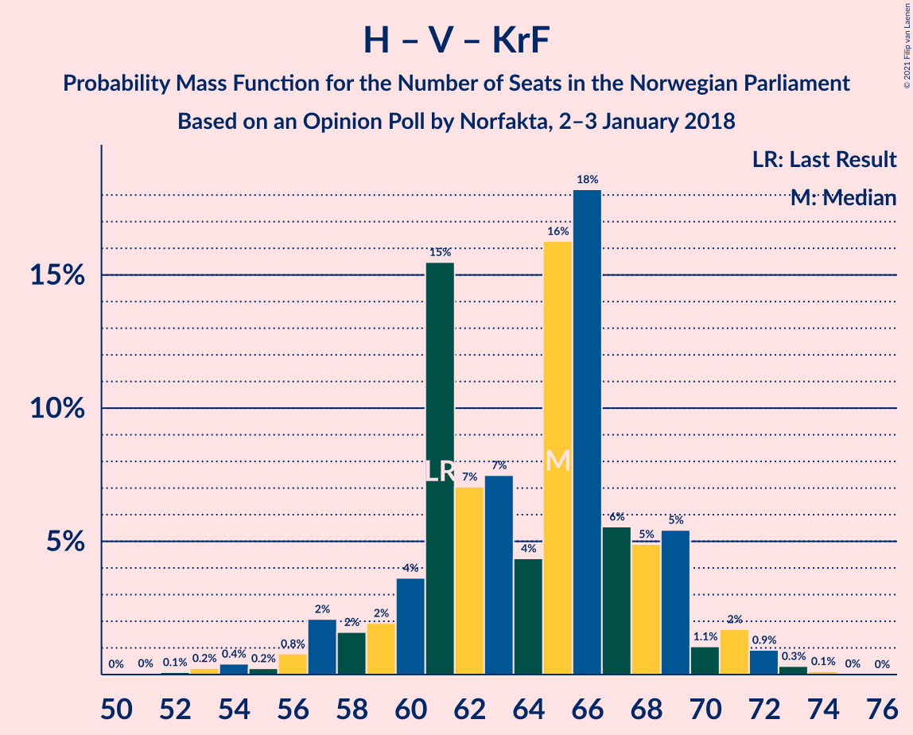
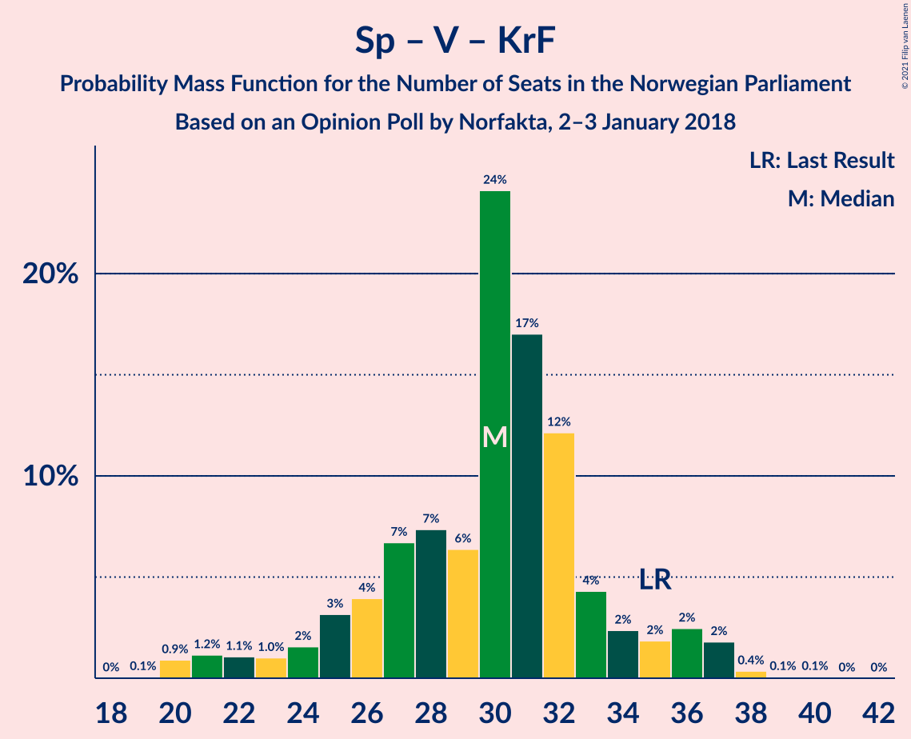

# Opinion Poll by Norfakta, 2–3 January 2018

<a href="#voting-intentions">Voting Intentions</a> | <a href="#seats">Seats</a> | <a href="#coalitions">Coalitions</a> | <a href="#technical-information">Technical Information</a>

## Voting Intentions

### Confidence Intervals

| Party | Last Result | Poll Result | 80% Confidence Interval | 90% Confidence Interval | 95% Confidence Interval | 99% Confidence Interval |
|:-----:|:-----------:|:-----------:|:-----------------------:|:-----------------------:|:-----------------------:|:-----------------------:|
| Høyre | 25.0% | 29.1% | 27.3–31.0% |26.8–31.5% |26.4–32.0% |25.5–32.9% |
| Arbeiderpartiet | 27.4% | 24.2% | 22.5–26.0% |22.1–26.5% |21.6–27.0% |20.9–27.8% |
| Fremskrittspartiet | 15.2% | 14.5% | 13.2–16.0% |12.8–16.4% |12.5–16.8% |11.8–17.6% |
| Senterpartiet | 10.3% | 10.3% | 9.2–11.6% |8.8–12.0% |8.6–12.3% |8.0–13.0% |
| Sosialistisk Venstreparti | 6.0% | 5.7% | 4.9–6.8% |4.6–7.1% |4.4–7.3% |4.1–7.9% |
| Venstre | 4.4% | 4.7% | 3.9–5.7% |3.7–6.0% |3.6–6.2% |3.2–6.7% |
| Miljøpartiet De Grønne | 3.2% | 3.8% | 3.1–4.7% |2.9–5.0% |2.8–5.2% |2.5–5.6% |
| Kristelig Folkeparti | 4.2% | 3.3% | 2.7–4.1% |2.5–4.4% |2.4–4.6% |2.1–5.0% |
| Rødt | 2.4% | 3.1% | 2.5–3.9% |2.3–4.2% |2.2–4.4% |1.9–4.8% |

*Note:* The poll result column reflects the actual value used in the calculations. Published results may vary slightly, and in addition be rounded to fewer digits.

## Seats

### Confidence Intervals

| Party | Last Result | Median | 80% Confidence Interval | 90% Confidence Interval | 95% Confidence Interval | 99% Confidence Interval |
|:-----:|:-----------:|:------:|:-----------------------:|:-----------------------:|:-----------------------:|:-----------------------:|
| <a href="#høyre">Høyre</a> | 45 | 53 | 50–57 |48–58 |47–59 |45–61 |
| <a href="#arbeiderpartiet">Arbeiderpartiet</a> | 49 | 43 | 40–47 |40–48 |39–49 |38–52 |
| <a href="#fremskrittspartiet">Fremskrittspartiet</a> | 27 | 26 | 24–29 |23–30 |22–30 |21–32 |
| <a href="#senterpartiet">Senterpartiet</a> | 19 | 19 | 17–21 |16–22 |16–23 |14–24 |
| <a href="#sosialistisk-venstreparti">Sosialistisk Venstreparti</a> | 11 | 10 | 8–12 |8–13 |8–13 |7–14 |
| <a href="#venstre">Venstre</a> | 8 | 9 | 3–10 |2–11 |2–11 |2–12 |
| <a href="#miljøpartiet-de-grønne">Miljøpartiet De Grønne</a> | 1 | 2 | 2–8 |1–9 |1–9 |1–10 |
| <a href="#kristelig-folkeparti">Kristelig Folkeparti</a> | 8 | 3 | 1–3 |1–7 |1–8 |0–9 |
| <a href="#rødt">Rødt</a> | 1 | 2 | 1–2 |1–6 |1–8 |1–8 |

### Høyre

*For a full overview of the results for this party, see the [Høyre](party-høyre.html) page.*

| Number of Seats | Probability | Accumulated | Special Marks |
|:---------------:|:-----------:|:-----------:|:-------------:|
| 43 | 0.1% | 100% |  |
| 44 | 0.1% | 99.9% |  |
| 45 | 0.4% | 99.8% | Last Result |
| 46 | 0.7% | 99.4% |  |
| 47 | 1.3% | 98.8% |  |
| 48 | 3% | 97% |  |
| 49 | 3% | 94% |  |
| 50 | 15% | 91% |  |
| 51 | 9% | 77% |  |
| 52 | 8% | 67% |  |
| 53 | 20% | 59% | Median |
| 54 | 12% | 39% |  |
| 55 | 10% | 27% |  |
| 56 | 4% | 17% |  |
| 57 | 6% | 13% |  |
| 58 | 2% | 7% |  |
| 59 | 3% | 4% |  |
| 60 | 0.4% | 2% |  |
| 61 | 0.7% | 1.1% |  |
| 62 | 0.3% | 0.4% |  |
| 63 | 0.1% | 0.1% |  |
| 64 | 0% | 0% |  |

### Arbeiderpartiet

*For a full overview of the results for this party, see the [Arbeiderpartiet](party-arbeiderpartiet.html) page.*

| Number of Seats | Probability | Accumulated | Special Marks |
|:---------------:|:-----------:|:-----------:|:-------------:|
| 36 | 0.1% | 100% |  |
| 37 | 0.1% | 99.9% |  |
| 38 | 0.8% | 99.8% |  |
| 39 | 2% | 99.0% |  |
| 40 | 7% | 97% |  |
| 41 | 8% | 90% |  |
| 42 | 10% | 82% |  |
| 43 | 28% | 72% | Median |
| 44 | 12% | 44% |  |
| 45 | 10% | 33% |  |
| 46 | 5% | 22% |  |
| 47 | 10% | 18% |  |
| 48 | 3% | 7% |  |
| 49 | 2% | 4% | Last Result |
| 50 | 0.5% | 2% |  |
| 51 | 1.0% | 2% |  |
| 52 | 0.5% | 0.6% |  |
| 53 | 0.1% | 0.1% |  |
| 54 | 0% | 0% |  |

### Fremskrittspartiet

*For a full overview of the results for this party, see the [Fremskrittspartiet](party-fremskrittspartiet.html) page.*

| Number of Seats | Probability | Accumulated | Special Marks |
|:---------------:|:-----------:|:-----------:|:-------------:|
| 19 | 0.1% | 100% |  |
| 20 | 0.2% | 99.9% |  |
| 21 | 0.9% | 99.7% |  |
| 22 | 3% | 98.8% |  |
| 23 | 4% | 95% |  |
| 24 | 9% | 91% |  |
| 25 | 21% | 82% |  |
| 26 | 18% | 61% | Median |
| 27 | 23% | 43% | Last Result |
| 28 | 10% | 20% |  |
| 29 | 5% | 10% |  |
| 30 | 4% | 6% |  |
| 31 | 2% | 2% |  |
| 32 | 0.4% | 0.5% |  |
| 33 | 0.1% | 0.2% |  |
| 34 | 0.1% | 0.1% |  |
| 35 | 0% | 0% |  |

### Senterpartiet

*For a full overview of the results for this party, see the [Senterpartiet](party-senterpartiet.html) page.*

| Number of Seats | Probability | Accumulated | Special Marks |
|:---------------:|:-----------:|:-----------:|:-------------:|
| 13 | 0.1% | 100% |  |
| 14 | 0.4% | 99.8% |  |
| 15 | 1.0% | 99.4% |  |
| 16 | 4% | 98% |  |
| 17 | 18% | 95% |  |
| 18 | 21% | 77% |  |
| 19 | 36% | 56% | Last Result, Median |
| 20 | 9% | 20% |  |
| 21 | 3% | 11% |  |
| 22 | 5% | 8% |  |
| 23 | 2% | 3% |  |
| 24 | 0.5% | 0.9% |  |
| 25 | 0.4% | 0.4% |  |
| 26 | 0% | 0% |  |

### Sosialistisk Venstreparti

*For a full overview of the results for this party, see the [Sosialistisk Venstreparti](party-sosialistiskvenstreparti.html) page.*

| Number of Seats | Probability | Accumulated | Special Marks |
|:---------------:|:-----------:|:-----------:|:-------------:|
| 1 | 0.1% | 100% |  |
| 2 | 0.3% | 99.9% |  |
| 3 | 0% | 99.6% |  |
| 4 | 0% | 99.6% |  |
| 5 | 0% | 99.6% |  |
| 6 | 0% | 99.6% |  |
| 7 | 0.7% | 99.6% |  |
| 8 | 10% | 98.9% |  |
| 9 | 24% | 89% |  |
| 10 | 31% | 65% | Median |
| 11 | 16% | 34% | Last Result |
| 12 | 12% | 18% |  |
| 13 | 5% | 6% |  |
| 14 | 0.9% | 1.3% |  |
| 15 | 0.4% | 0.4% |  |
| 16 | 0% | 0% |  |

### Venstre

*For a full overview of the results for this party, see the [Venstre](party-venstre.html) page.*

| Number of Seats | Probability | Accumulated | Special Marks |
|:---------------:|:-----------:|:-----------:|:-------------:|
| 2 | 9% | 100% |  |
| 3 | 2% | 91% |  |
| 4 | 0% | 90% |  |
| 5 | 0% | 90% |  |
| 6 | 0% | 90% |  |
| 7 | 2% | 90% |  |
| 8 | 18% | 87% | Last Result |
| 9 | 40% | 69% | Median |
| 10 | 21% | 29% |  |
| 11 | 7% | 8% |  |
| 12 | 0.9% | 1.1% |  |
| 13 | 0.2% | 0.2% |  |
| 14 | 0% | 0% |  |

### Miljøpartiet De Grønne

*For a full overview of the results for this party, see the [Miljøpartiet De Grønne](party-miljøpartietdegrønne.html) page.*

| Number of Seats | Probability | Accumulated | Special Marks |
|:---------------:|:-----------:|:-----------:|:-------------:|
| 1 | 9% | 100% | Last Result |
| 2 | 43% | 91% | Median |
| 3 | 5% | 48% |  |
| 4 | 0% | 42% |  |
| 5 | 0% | 42% |  |
| 6 | 0.1% | 42% |  |
| 7 | 16% | 42% |  |
| 8 | 19% | 26% |  |
| 9 | 6% | 7% |  |
| 10 | 0.9% | 1.1% |  |
| 11 | 0.2% | 0.2% |  |
| 12 | 0% | 0% |  |

### Kristelig Folkeparti

*For a full overview of the results for this party, see the [Kristelig Folkeparti](party-kristeligfolkeparti.html) page.*

| Number of Seats | Probability | Accumulated | Special Marks |
|:---------------:|:-----------:|:-----------:|:-------------:|
| 0 | 1.5% | 100% |  |
| 1 | 24% | 98.5% |  |
| 2 | 16% | 75% |  |
| 3 | 50% | 59% | Median |
| 4 | 0% | 9% |  |
| 5 | 0% | 9% |  |
| 6 | 0% | 9% |  |
| 7 | 4% | 9% |  |
| 8 | 4% | 5% | Last Result |
| 9 | 0.6% | 0.7% |  |
| 10 | 0.1% | 0.1% |  |
| 11 | 0% | 0% |  |

### Rødt

*For a full overview of the results for this party, see the [Rødt](party-rødt.html) page.*

| Number of Seats | Probability | Accumulated | Special Marks |
|:---------------:|:-----------:|:-----------:|:-------------:|
| 1 | 44% | 100% | Last Result |
| 2 | 51% | 56% | Median |
| 3 | 0% | 5% |  |
| 4 | 0% | 5% |  |
| 5 | 0% | 5% |  |
| 6 | 0.1% | 5% |  |
| 7 | 2% | 5% |  |
| 8 | 2% | 3% |  |
| 9 | 0.3% | 0.3% |  |
| 10 | 0% | 0% |  |

## Coalitions

### Confidence Intervals

| Coalition | Last Result | Median | Majority? | 80% Confidence Interval | 90% Confidence Interval | 95% Confidence Interval | 99% Confidence Interval |
|:---------:|:-----------:|:------:|:---------:|:-----------------------:|:-----------------------:|:-----------------------:|:-----------------------:|
| Høyre – Fremskrittspartiet – Senterpartiet – Venstre – Kristelig Folkeparti | 107 | 109 | 100% | 105–113 | 103–114 | 102–115 | 98–117 |
| Høyre – Fremskrittspartiet – Venstre – Miljøpartiet De Grønne – Kristelig Folkeparti | 89 | 95 | 99.6% | 90–98 | 88–99 | 87–100 | 85–102 |
| Høyre – Fremskrittspartiet – Venstre – Kristelig Folkeparti | 88 | 90 | 95% | 86–95 | 85–96 | 83–97 | 81–99 |
| Høyre – Fremskrittspartiet – Venstre | 80 | 88 | 84% | 83–92 | 81–93 | 80–94 | 78–96 |
| Arbeiderpartiet – Senterpartiet – Sosialistisk Venstreparti – Miljøpartiet De Grønne – Kristelig Folkeparti | 88 | 80 | 8% | 75–84 | 74–86 | 73–87 | 71–89 |
| Høyre – Fremskrittspartiet | 72 | 79 | 7% | 76–84 | 74–85 | 73–86 | 71–88 |
| Arbeiderpartiet – Senterpartiet – Sosialistisk Venstreparti – Miljøpartiet De Grønne – Rødt | 81 | 79 | 5% | 74–83 | 73–84 | 72–86 | 70–88 |
| Arbeiderpartiet – Senterpartiet – Sosialistisk Venstreparti – Miljøpartiet De Grønne | 80 | 77 | 2% | 73–81 | 71–82 | 70–84 | 68–86 |
| Arbeiderpartiet – Senterpartiet – Sosialistisk Venstreparti – Rødt | 80 | 74 | 0.4% | 71–79 | 70–81 | 69–82 | 67–84 |
| Arbeiderpartiet – Senterpartiet – Sosialistisk Venstreparti | 79 | 72 | 0.1% | 69–77 | 68–78 | 67–79 | 65–83 |
| Arbeiderpartiet – Senterpartiet – Miljøpartiet De Grønne – Kristelig Folkeparti | 77 | 70 | 0% | 65–74 | 63–76 | 63–76 | 61–78 |
| Arbeiderpartiet – Senterpartiet – Kristelig Folkeparti | 76 | 65 | 0% | 61–69 | 60–71 | 59–72 | 58–75 |
| Høyre – Venstre – Kristelig Folkeparti | 61 | 65 | 0% | 60–68 | 58–69 | 57–71 | 54–72 |
| Arbeiderpartiet – Senterpartiet | 68 | 62 | 0% | 59–66 | 58–67 | 57–69 | 56–71 |
| Arbeiderpartiet – Sosialistisk Venstreparti | 60 | 53 | 0% | 50–58 | 50–59 | 49–61 | 47–63 |
| Senterpartiet – Venstre – Kristelig Folkeparti | 35 | 30 | 0% | 26–33 | 24–35 | 22–36 | 20–38 |

### Høyre – Fremskrittspartiet – Senterpartiet – Venstre – Kristelig Folkeparti

| Number of Seats | Probability | Accumulated | Special Marks |
|:---------------:|:-----------:|:-----------:|:-------------:|
| 95 | 0% | 100% |  |
| 96 | 0% | 99.9% |  |
| 97 | 0.1% | 99.9% |  |
| 98 | 0.4% | 99.8% |  |
| 99 | 0.2% | 99.4% |  |
| 100 | 0.2% | 99.1% |  |
| 101 | 1.2% | 98.9% |  |
| 102 | 1.5% | 98% |  |
| 103 | 3% | 96% |  |
| 104 | 3% | 94% |  |
| 105 | 3% | 91% |  |
| 106 | 6% | 87% |  |
| 107 | 16% | 82% | Last Result |
| 108 | 7% | 66% |  |
| 109 | 22% | 59% |  |
| 110 | 4% | 36% | Median |
| 111 | 9% | 33% |  |
| 112 | 10% | 24% |  |
| 113 | 4% | 13% |  |
| 114 | 5% | 10% |  |
| 115 | 3% | 5% |  |
| 116 | 1.3% | 2% |  |
| 117 | 0.4% | 0.7% |  |
| 118 | 0.2% | 0.3% |  |
| 119 | 0.1% | 0.1% |  |
| 120 | 0% | 0% |  |

### Høyre – Fremskrittspartiet – Venstre – Miljøpartiet De Grønne – Kristelig Folkeparti

| Number of Seats | Probability | Accumulated | Special Marks |
|:---------------:|:-----------:|:-----------:|:-------------:|
| 82 | 0.1% | 100% |  |
| 83 | 0.1% | 99.9% |  |
| 84 | 0.2% | 99.8% |  |
| 85 | 0.7% | 99.6% | Majority |
| 86 | 0.5% | 98.9% |  |
| 87 | 1.4% | 98% |  |
| 88 | 2% | 97% |  |
| 89 | 3% | 95% | Last Result |
| 90 | 2% | 92% |  |
| 91 | 8% | 89% |  |
| 92 | 5% | 81% |  |
| 93 | 9% | 76% | Median |
| 94 | 7% | 67% |  |
| 95 | 14% | 60% |  |
| 96 | 16% | 46% |  |
| 97 | 14% | 31% |  |
| 98 | 7% | 16% |  |
| 99 | 5% | 9% |  |
| 100 | 2% | 5% |  |
| 101 | 2% | 2% |  |
| 102 | 0.3% | 0.5% |  |
| 103 | 0.1% | 0.2% |  |
| 104 | 0.1% | 0.1% |  |
| 105 | 0% | 0% |  |

### Høyre – Fremskrittspartiet – Venstre – Kristelig Folkeparti

| Number of Seats | Probability | Accumulated | Special Marks |
|:---------------:|:-----------:|:-----------:|:-------------:|
| 77 | 0.1% | 100% |  |
| 78 | 0.1% | 99.9% |  |
| 79 | 0.1% | 99.8% |  |
| 80 | 0.2% | 99.7% |  |
| 81 | 0.5% | 99.5% |  |
| 82 | 0.7% | 99.0% |  |
| 83 | 1.3% | 98% |  |
| 84 | 2% | 97% |  |
| 85 | 3% | 95% | Majority |
| 86 | 4% | 92% |  |
| 87 | 7% | 88% |  |
| 88 | 12% | 82% | Last Result |
| 89 | 11% | 70% |  |
| 90 | 17% | 60% |  |
| 91 | 10% | 43% | Median |
| 92 | 4% | 33% |  |
| 93 | 14% | 29% |  |
| 94 | 5% | 15% |  |
| 95 | 4% | 10% |  |
| 96 | 3% | 6% |  |
| 97 | 1.0% | 3% |  |
| 98 | 1.2% | 2% |  |
| 99 | 0.4% | 0.6% |  |
| 100 | 0.1% | 0.2% |  |
| 101 | 0.1% | 0.1% |  |
| 102 | 0% | 0% |  |

### Høyre – Fremskrittspartiet – Venstre

| Number of Seats | Probability | Accumulated | Special Marks |
|:---------------:|:-----------:|:-----------:|:-------------:|
| 75 | 0.2% | 100% |  |
| 76 | 0.1% | 99.8% |  |
| 77 | 0.2% | 99.7% |  |
| 78 | 0.8% | 99.5% |  |
| 79 | 0.6% | 98.7% |  |
| 80 | 2% | 98% | Last Result |
| 81 | 1.5% | 96% |  |
| 82 | 3% | 95% |  |
| 83 | 3% | 92% |  |
| 84 | 5% | 89% |  |
| 85 | 8% | 84% | Majority |
| 86 | 14% | 76% |  |
| 87 | 12% | 62% |  |
| 88 | 16% | 50% | Median |
| 89 | 5% | 35% |  |
| 90 | 12% | 29% |  |
| 91 | 3% | 17% |  |
| 92 | 5% | 14% |  |
| 93 | 4% | 8% |  |
| 94 | 2% | 4% |  |
| 95 | 1.3% | 2% |  |
| 96 | 0.5% | 0.9% |  |
| 97 | 0.2% | 0.4% |  |
| 98 | 0.1% | 0.1% |  |
| 99 | 0% | 0% |  |

### Arbeiderpartiet – Senterpartiet – Sosialistisk Venstreparti – Miljøpartiet De Grønne – Kristelig Folkeparti

| Number of Seats | Probability | Accumulated | Special Marks |
|:---------------:|:-----------:|:-----------:|:-------------:|
| 69 | 0.1% | 100% |  |
| 70 | 0.2% | 99.9% |  |
| 71 | 0.4% | 99.7% |  |
| 72 | 2% | 99.3% |  |
| 73 | 2% | 98% |  |
| 74 | 3% | 96% |  |
| 75 | 7% | 93% |  |
| 76 | 3% | 86% |  |
| 77 | 13% | 84% | Median |
| 78 | 6% | 71% |  |
| 79 | 14% | 65% |  |
| 80 | 8% | 52% |  |
| 81 | 13% | 43% |  |
| 82 | 13% | 30% |  |
| 83 | 7% | 18% |  |
| 84 | 3% | 11% |  |
| 85 | 2% | 8% | Majority |
| 86 | 2% | 6% |  |
| 87 | 1.5% | 3% |  |
| 88 | 1.1% | 2% | Last Result |
| 89 | 0.4% | 0.7% |  |
| 90 | 0.2% | 0.4% |  |
| 91 | 0.1% | 0.2% |  |
| 92 | 0% | 0.1% |  |
| 93 | 0% | 0% |  |

### Høyre – Fremskrittspartiet

| Number of Seats | Probability | Accumulated | Special Marks |
|:---------------:|:-----------:|:-----------:|:-------------:|
| 68 | 0.1% | 100% |  |
| 69 | 0.1% | 99.9% |  |
| 70 | 0.2% | 99.8% |  |
| 71 | 0.5% | 99.6% |  |
| 72 | 1.1% | 99.1% | Last Result |
| 73 | 2% | 98% |  |
| 74 | 3% | 96% |  |
| 75 | 2% | 93% |  |
| 76 | 8% | 90% |  |
| 77 | 14% | 83% |  |
| 78 | 16% | 69% |  |
| 79 | 14% | 52% | Median |
| 80 | 11% | 38% |  |
| 81 | 8% | 28% |  |
| 82 | 4% | 19% |  |
| 83 | 5% | 15% |  |
| 84 | 3% | 10% |  |
| 85 | 3% | 7% | Majority |
| 86 | 1.2% | 4% |  |
| 87 | 1.4% | 2% |  |
| 88 | 0.6% | 1.1% |  |
| 89 | 0.2% | 0.5% |  |
| 90 | 0% | 0.3% |  |
| 91 | 0.3% | 0.3% |  |
| 92 | 0% | 0% |  |

### Arbeiderpartiet – Senterpartiet – Sosialistisk Venstreparti – Miljøpartiet De Grønne – Rødt

| Number of Seats | Probability | Accumulated | Special Marks |
|:---------------:|:-----------:|:-----------:|:-------------:|
| 68 | 0.1% | 100% |  |
| 69 | 0.1% | 99.9% |  |
| 70 | 0.4% | 99.8% |  |
| 71 | 1.2% | 99.4% |  |
| 72 | 1.0% | 98% |  |
| 73 | 3% | 97% |  |
| 74 | 4% | 94% |  |
| 75 | 5% | 90% |  |
| 76 | 14% | 85% | Median |
| 77 | 4% | 71% |  |
| 78 | 10% | 67% |  |
| 79 | 17% | 57% |  |
| 80 | 11% | 40% |  |
| 81 | 12% | 30% | Last Result |
| 82 | 7% | 18% |  |
| 83 | 4% | 12% |  |
| 84 | 3% | 8% |  |
| 85 | 2% | 5% | Majority |
| 86 | 1.3% | 3% |  |
| 87 | 0.7% | 2% |  |
| 88 | 0.5% | 1.0% |  |
| 89 | 0.2% | 0.5% |  |
| 90 | 0.1% | 0.3% |  |
| 91 | 0.1% | 0.2% |  |
| 92 | 0.1% | 0.1% |  |
| 93 | 0% | 0% |  |

### Arbeiderpartiet – Senterpartiet – Sosialistisk Venstreparti – Miljøpartiet De Grønne

| Number of Seats | Probability | Accumulated | Special Marks |
|:---------------:|:-----------:|:-----------:|:-------------:|
| 66 | 0% | 100% |  |
| 67 | 0.1% | 99.9% |  |
| 68 | 0.4% | 99.8% |  |
| 69 | 1.4% | 99.4% |  |
| 70 | 1.1% | 98% |  |
| 71 | 3% | 97% |  |
| 72 | 4% | 94% |  |
| 73 | 4% | 90% |  |
| 74 | 15% | 87% | Median |
| 75 | 5% | 72% |  |
| 76 | 10% | 67% |  |
| 77 | 9% | 56% |  |
| 78 | 16% | 48% |  |
| 79 | 8% | 32% |  |
| 80 | 14% | 24% | Last Result |
| 81 | 3% | 11% |  |
| 82 | 3% | 7% |  |
| 83 | 2% | 4% |  |
| 84 | 1.0% | 3% |  |
| 85 | 0.8% | 2% | Majority |
| 86 | 0.5% | 0.8% |  |
| 87 | 0.1% | 0.3% |  |
| 88 | 0.1% | 0.2% |  |
| 89 | 0.1% | 0.1% |  |
| 90 | 0% | 0% |  |

### Arbeiderpartiet – Senterpartiet – Sosialistisk Venstreparti – Rødt

| Number of Seats | Probability | Accumulated | Special Marks |
|:---------------:|:-----------:|:-----------:|:-------------:|
| 65 | 0.1% | 100% |  |
| 66 | 0.1% | 99.9% |  |
| 67 | 0.3% | 99.8% |  |
| 68 | 2% | 99.5% |  |
| 69 | 2% | 98% |  |
| 70 | 5% | 95% |  |
| 71 | 7% | 91% |  |
| 72 | 14% | 84% |  |
| 73 | 16% | 69% |  |
| 74 | 14% | 54% | Median |
| 75 | 7% | 40% |  |
| 76 | 9% | 33% |  |
| 77 | 5% | 24% |  |
| 78 | 8% | 19% |  |
| 79 | 2% | 11% |  |
| 80 | 3% | 8% | Last Result |
| 81 | 2% | 5% |  |
| 82 | 1.4% | 3% |  |
| 83 | 0.5% | 2% |  |
| 84 | 0.7% | 1.1% |  |
| 85 | 0.2% | 0.4% | Majority |
| 86 | 0.1% | 0.2% |  |
| 87 | 0.1% | 0.1% |  |
| 88 | 0% | 0% |  |

### Arbeiderpartiet – Senterpartiet – Sosialistisk Venstreparti

| Number of Seats | Probability | Accumulated | Special Marks |
|:---------------:|:-----------:|:-----------:|:-------------:|
| 62 | 0% | 100% |  |
| 63 | 0.1% | 99.9% |  |
| 64 | 0.2% | 99.9% |  |
| 65 | 0.5% | 99.7% |  |
| 66 | 0.7% | 99.2% |  |
| 67 | 3% | 98.5% |  |
| 68 | 3% | 95% |  |
| 69 | 8% | 92% |  |
| 70 | 7% | 85% |  |
| 71 | 17% | 78% |  |
| 72 | 21% | 61% | Median |
| 73 | 8% | 40% |  |
| 74 | 11% | 33% |  |
| 75 | 5% | 22% |  |
| 76 | 6% | 18% |  |
| 77 | 5% | 12% |  |
| 78 | 3% | 7% |  |
| 79 | 2% | 4% | Last Result |
| 80 | 1.1% | 2% |  |
| 81 | 0.4% | 1.2% |  |
| 82 | 0.2% | 0.9% |  |
| 83 | 0.6% | 0.7% |  |
| 84 | 0.1% | 0.1% |  |
| 85 | 0% | 0.1% | Majority |
| 86 | 0% | 0% |  |

### Arbeiderpartiet – Senterpartiet – Miljøpartiet De Grønne – Kristelig Folkeparti

| Number of Seats | Probability | Accumulated | Special Marks |
|:---------------:|:-----------:|:-----------:|:-------------:|
| 58 | 0% | 100% |  |
| 59 | 0.1% | 99.9% |  |
| 60 | 0.2% | 99.8% |  |
| 61 | 2% | 99.6% |  |
| 62 | 0.5% | 98% |  |
| 63 | 3% | 98% |  |
| 64 | 4% | 95% |  |
| 65 | 4% | 91% |  |
| 66 | 4% | 87% |  |
| 67 | 12% | 83% | Median |
| 68 | 6% | 70% |  |
| 69 | 10% | 64% |  |
| 70 | 13% | 54% |  |
| 71 | 9% | 41% |  |
| 72 | 15% | 32% |  |
| 73 | 4% | 16% |  |
| 74 | 5% | 12% |  |
| 75 | 2% | 7% |  |
| 76 | 4% | 5% |  |
| 77 | 0.7% | 2% | Last Result |
| 78 | 0.4% | 0.9% |  |
| 79 | 0.3% | 0.5% |  |
| 80 | 0.1% | 0.2% |  |
| 81 | 0.1% | 0.1% |  |
| 82 | 0% | 0% |  |

### Arbeiderpartiet – Senterpartiet – Kristelig Folkeparti

| Number of Seats | Probability | Accumulated | Special Marks |
|:---------------:|:-----------:|:-----------:|:-------------:|
| 56 | 0.1% | 100% |  |
| 57 | 0.3% | 99.9% |  |
| 58 | 1.1% | 99.6% |  |
| 59 | 2% | 98.5% |  |
| 60 | 3% | 97% |  |
| 61 | 5% | 94% |  |
| 62 | 11% | 88% |  |
| 63 | 6% | 77% |  |
| 64 | 11% | 71% |  |
| 65 | 21% | 60% | Median |
| 66 | 5% | 39% |  |
| 67 | 8% | 33% |  |
| 68 | 13% | 25% |  |
| 69 | 5% | 12% |  |
| 70 | 1.3% | 7% |  |
| 71 | 2% | 6% |  |
| 72 | 1.5% | 3% |  |
| 73 | 0.5% | 2% |  |
| 74 | 0.7% | 1.5% |  |
| 75 | 0.6% | 0.8% |  |
| 76 | 0.1% | 0.2% | Last Result |
| 77 | 0.1% | 0.1% |  |
| 78 | 0% | 0% |  |

### Høyre – Venstre – Kristelig Folkeparti

| Number of Seats | Probability | Accumulated | Special Marks |
|:---------------:|:-----------:|:-----------:|:-------------:|
| 51 | 0% | 100% |  |
| 52 | 0.1% | 99.9% |  |
| 53 | 0.2% | 99.8% |  |
| 54 | 0.4% | 99.6% |  |
| 55 | 0.2% | 99.2% |  |
| 56 | 0.8% | 98.9% |  |
| 57 | 2% | 98% |  |
| 58 | 2% | 96% |  |
| 59 | 2% | 94% |  |
| 60 | 4% | 93% |  |
| 61 | 15% | 89% | Last Result |
| 62 | 7% | 73% |  |
| 63 | 7% | 66% |  |
| 64 | 4% | 59% |  |
| 65 | 16% | 55% | Median |
| 66 | 18% | 38% |  |
| 67 | 6% | 20% |  |
| 68 | 5% | 15% |  |
| 69 | 5% | 10% |  |
| 70 | 1.1% | 4% |  |
| 71 | 2% | 3% |  |
| 72 | 0.9% | 1.4% |  |
| 73 | 0.3% | 0.5% |  |
| 74 | 0.1% | 0.2% |  |
| 75 | 0% | 0.1% |  |
| 76 | 0% | 0% |  |

### Arbeiderpartiet – Senterpartiet

| Number of Seats | Probability | Accumulated | Special Marks |
|:---------------:|:-----------:|:-----------:|:-------------:|
| 54 | 0.1% | 100% |  |
| 55 | 0.2% | 99.9% |  |
| 56 | 0.5% | 99.7% |  |
| 57 | 2% | 99.1% |  |
| 58 | 4% | 97% |  |
| 59 | 10% | 93% |  |
| 60 | 6% | 83% |  |
| 61 | 10% | 77% |  |
| 62 | 30% | 67% | Median |
| 63 | 4% | 38% |  |
| 64 | 7% | 34% |  |
| 65 | 17% | 27% |  |
| 66 | 5% | 10% |  |
| 67 | 2% | 6% |  |
| 68 | 1.3% | 4% | Last Result |
| 69 | 1.1% | 3% |  |
| 70 | 0.6% | 2% |  |
| 71 | 0.9% | 1.1% |  |
| 72 | 0.1% | 0.3% |  |
| 73 | 0.1% | 0.1% |  |
| 74 | 0% | 0.1% |  |
| 75 | 0% | 0% |  |

### Arbeiderpartiet – Sosialistisk Venstreparti

| Number of Seats | Probability | Accumulated | Special Marks |
|:---------------:|:-----------:|:-----------:|:-------------:|
| 44 | 0% | 100% |  |
| 45 | 0.1% | 99.9% |  |
| 46 | 0.2% | 99.9% |  |
| 47 | 0.3% | 99.7% |  |
| 48 | 0.9% | 99.4% |  |
| 49 | 3% | 98% |  |
| 50 | 6% | 96% |  |
| 51 | 8% | 89% |  |
| 52 | 16% | 81% |  |
| 53 | 19% | 65% | Median |
| 54 | 13% | 47% |  |
| 55 | 7% | 33% |  |
| 56 | 8% | 26% |  |
| 57 | 6% | 18% |  |
| 58 | 5% | 12% |  |
| 59 | 4% | 7% |  |
| 60 | 0.8% | 3% | Last Result |
| 61 | 0.9% | 3% |  |
| 62 | 1.0% | 2% |  |
| 63 | 0.6% | 0.8% |  |
| 64 | 0.1% | 0.2% |  |
| 65 | 0% | 0.1% |  |
| 66 | 0% | 0% |  |

### Senterpartiet – Venstre – Kristelig Folkeparti

| Number of Seats | Probability | Accumulated | Special Marks |
|:---------------:|:-----------:|:-----------:|:-------------:|
| 19 | 0.1% | 100% |  |
| 20 | 0.9% | 99.9% |  |
| 21 | 1.2% | 99.0% |  |
| 22 | 1.1% | 98% |  |
| 23 | 1.0% | 97% |  |
| 24 | 2% | 96% |  |
| 25 | 3% | 94% |  |
| 26 | 4% | 91% |  |
| 27 | 7% | 87% |  |
| 28 | 7% | 80% |  |
| 29 | 6% | 73% |  |
| 30 | 24% | 67% |  |
| 31 | 17% | 43% | Median |
| 32 | 12% | 25% |  |
| 33 | 4% | 13% |  |
| 34 | 2% | 9% |  |
| 35 | 2% | 7% | Last Result |
| 36 | 2% | 5% |  |
| 37 | 2% | 2% |  |
| 38 | 0.4% | 0.5% |  |
| 39 | 0.1% | 0.2% |  |
| 40 | 0.1% | 0.1% |  |
| 41 | 0% | 0% |  |

## Technical Information

### Opinion Poll

+ **Polling firm:** Norfakta
+ **Commissioner(s):** —
+ **Fieldwork period:** 2–3 January 2018

### Calculations

+ **Sample size:** 1000
+ **Simulations done:** 1,048,576
+ **Error estimate:** 2.73%

