# Opinion Poll by Opinion Perduco, 9–15 January 2018

<a href="#voting-intentions">Voting Intentions</a> | <a href="#seats">Seats</a> | <a href="#coalitions">Coalitions</a> | <a href="#technical-information">Technical Information</a>

## Voting Intentions

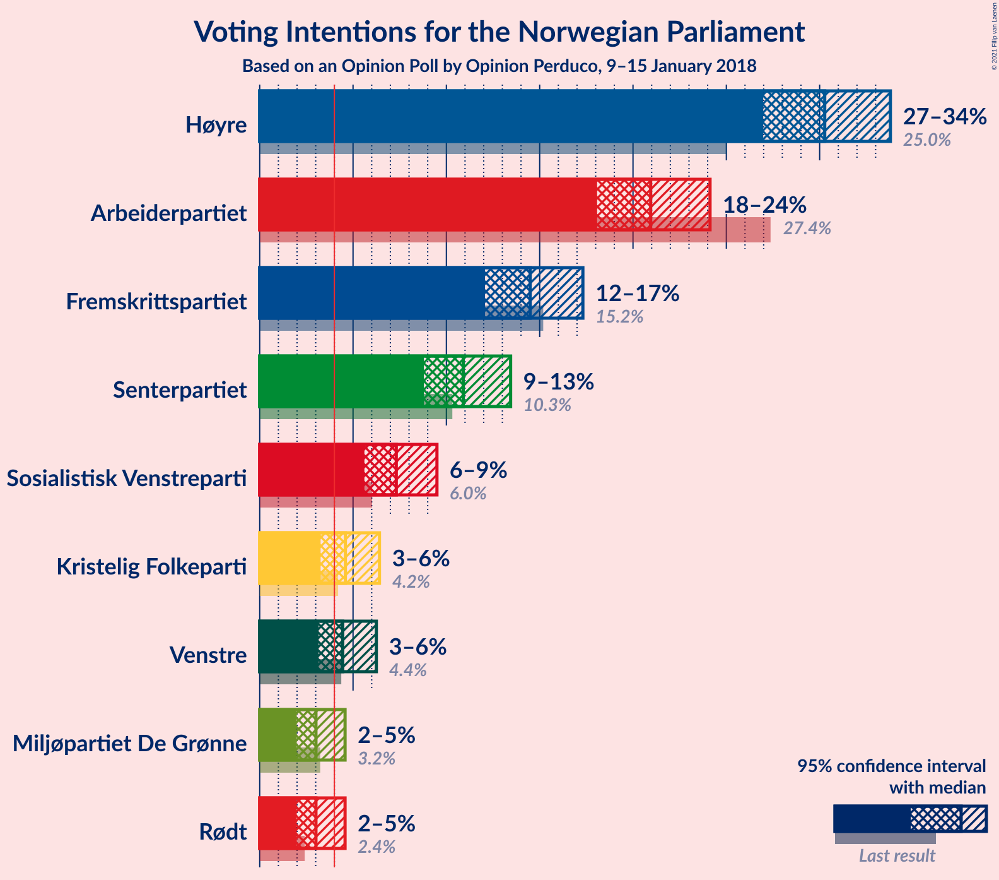

### Confidence Intervals

| Party | Last Result | Poll Result | 80% Confidence Interval | 90% Confidence Interval | 95% Confidence Interval | 99% Confidence Interval |
|:-----:|:-----------:|:-----------:|:-----------------------:|:-----------------------:|:-----------------------:|:-----------------------:|
| Høyre | 25.0% | 30.3% | 28.1–32.6% |27.5–33.2% |27.0–33.8% |26.0–34.9% |
| Arbeiderpartiet | 27.4% | 20.9% | 19.1–23.0% |18.5–23.6% |18.1–24.1% |17.2–25.1% |
| Fremskrittspartiet | 15.2% | 14.5% | 12.9–16.3% |12.5–16.9% |12.1–17.3% |11.3–18.2% |
| Senterpartiet | 10.3% | 10.9% | 9.5–12.6% |9.1–13.0% |8.8–13.4% |8.2–14.3% |
| Sosialistisk Venstreparti | 6.0% | 7.3% | 6.2–8.7% |5.9–9.1% |5.6–9.5% |5.1–10.2% |
| Kristelig Folkeparti | 4.2% | 4.6% | 3.7–5.8% |3.5–6.1% |3.3–6.4% |2.9–7.0% |
| Venstre | 4.4% | 4.4% | 3.6–5.6% |3.4–6.0% |3.2–6.2% |2.8–6.9% |
| Rødt | 2.4% | 3.0% | 2.3–4.0% |2.1–4.3% |2.0–4.6% |1.7–5.1% |
| Miljøpartiet De Grønne | 3.2% | 3.0% | 2.3–4.0% |2.1–4.3% |2.0–4.6% |1.7–5.1% |

*Note:* The poll result column reflects the actual value used in the calculations. Published results may vary slightly, and in addition be rounded to fewer digits.

## Seats

### Confidence Intervals

| Party | Last Result | Median | 80% Confidence Interval | 90% Confidence Interval | 95% Confidence Interval | 99% Confidence Interval |
|:-----:|:-----------:|:------:|:-----------------------:|:-----------------------:|:-----------------------:|:-----------------------:|
| <a href="#høyre">Høyre</a> | 45 | 53 | 50–58 |48–60 |47–61 |45–64 |
| <a href="#arbeiderpartiet">Arbeiderpartiet</a> | 49 | 38 | 35–42 |34–43 |33–43 |31–45 |
| <a href="#fremskrittspartiet">Fremskrittspartiet</a> | 27 | 26 | 22–30 |22–31 |21–32 |18–33 |
| <a href="#senterpartiet">Senterpartiet</a> | 19 | 20 | 16–22 |15–23 |15–24 |14–26 |
| <a href="#sosialistisk-venstreparti">Sosialistisk Venstreparti</a> | 11 | 13 | 11–16 |10–16 |10–17 |9–18 |
| <a href="#kristelig-folkeparti">Kristelig Folkeparti</a> | 8 | 8 | 3–10 |3–11 |2–11 |1–12 |
| <a href="#venstre">Venstre</a> | 8 | 8 | 2–10 |2–10 |2–11 |2–12 |
| <a href="#rødt">Rødt</a> | 1 | 2 | 1–7 |1–8 |1–8 |1–9 |
| <a href="#miljøpartiet-de-grønne">Miljøpartiet De Grønne</a> | 1 | 2 | 1–7 |1–8 |1–8 |0–9 |

### Høyre

*For a full overview of the results for this party, see the [Høyre](party-høyre.html) page.*

| Number of Seats | Probability | Accumulated | Special Marks |
|:---------------:|:-----------:|:-----------:|:-------------:|
| 43 | 0.1% | 100% |  |
| 44 | 0.2% | 99.9% |  |
| 45 | 0.2% | 99.7% | Last Result |
| 46 | 1.2% | 99.4% |  |
| 47 | 2% | 98% |  |
| 48 | 3% | 97% |  |
| 49 | 3% | 94% |  |
| 50 | 10% | 90% |  |
| 51 | 12% | 80% |  |
| 52 | 12% | 68% |  |
| 53 | 12% | 56% | Median |
| 54 | 8% | 44% |  |
| 55 | 8% | 35% |  |
| 56 | 5% | 27% |  |
| 57 | 6% | 22% |  |
| 58 | 9% | 16% |  |
| 59 | 1.5% | 7% |  |
| 60 | 2% | 5% |  |
| 61 | 1.1% | 3% |  |
| 62 | 0.4% | 2% |  |
| 63 | 0.8% | 1.3% |  |
| 64 | 0.4% | 0.5% |  |
| 65 | 0% | 0.1% |  |
| 66 | 0% | 0.1% |  |
| 67 | 0% | 0% |  |

### Arbeiderpartiet

*For a full overview of the results for this party, see the [Arbeiderpartiet](party-arbeiderpartiet.html) page.*

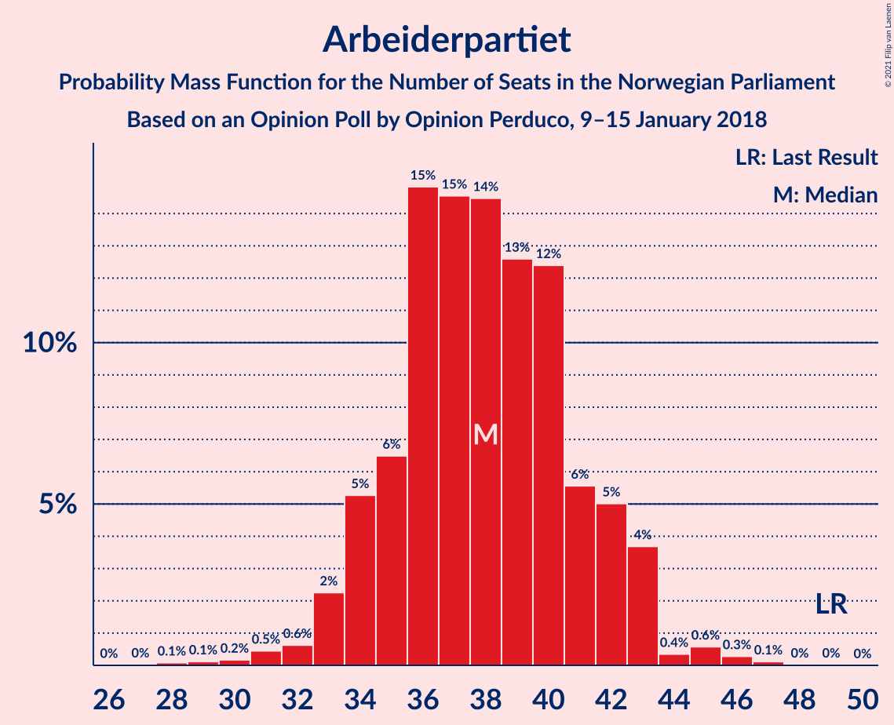

| Number of Seats | Probability | Accumulated | Special Marks |
|:---------------:|:-----------:|:-----------:|:-------------:|
| 28 | 0.1% | 100% |  |
| 29 | 0.1% | 99.9% |  |
| 30 | 0.2% | 99.8% |  |
| 31 | 0.5% | 99.6% |  |
| 32 | 0.6% | 99.1% |  |
| 33 | 2% | 98.5% |  |
| 34 | 5% | 96% |  |
| 35 | 6% | 91% |  |
| 36 | 15% | 84% |  |
| 37 | 15% | 70% |  |
| 38 | 14% | 55% | Median |
| 39 | 13% | 41% |  |
| 40 | 12% | 28% |  |
| 41 | 6% | 16% |  |
| 42 | 5% | 10% |  |
| 43 | 4% | 5% |  |
| 44 | 0.4% | 1.4% |  |
| 45 | 0.6% | 1.0% |  |
| 46 | 0.3% | 0.4% |  |
| 47 | 0.1% | 0.2% |  |
| 48 | 0% | 0% |  |
| 49 | 0% | 0% | Last Result |

### Fremskrittspartiet

*For a full overview of the results for this party, see the [Fremskrittspartiet](party-fremskrittspartiet.html) page.*

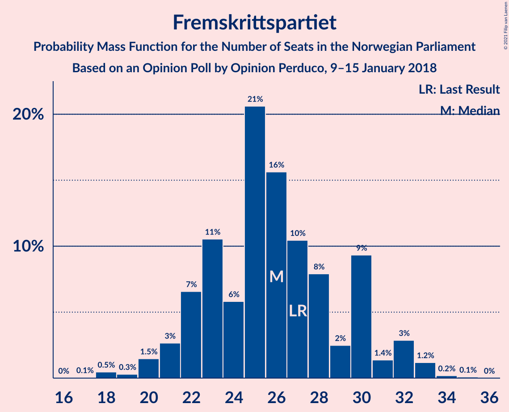

| Number of Seats | Probability | Accumulated | Special Marks |
|:---------------:|:-----------:|:-----------:|:-------------:|
| 17 | 0.1% | 100% |  |
| 18 | 0.5% | 99.9% |  |
| 19 | 0.3% | 99.5% |  |
| 20 | 1.5% | 99.2% |  |
| 21 | 3% | 98% |  |
| 22 | 7% | 95% |  |
| 23 | 11% | 88% |  |
| 24 | 6% | 78% |  |
| 25 | 21% | 72% |  |
| 26 | 16% | 52% | Median |
| 27 | 10% | 36% | Last Result |
| 28 | 8% | 25% |  |
| 29 | 2% | 18% |  |
| 30 | 9% | 15% |  |
| 31 | 1.4% | 6% |  |
| 32 | 3% | 4% |  |
| 33 | 1.2% | 1.5% |  |
| 34 | 0.2% | 0.3% |  |
| 35 | 0.1% | 0.1% |  |
| 36 | 0% | 0% |  |

### Senterpartiet

*For a full overview of the results for this party, see the [Senterpartiet](party-senterpartiet.html) page.*

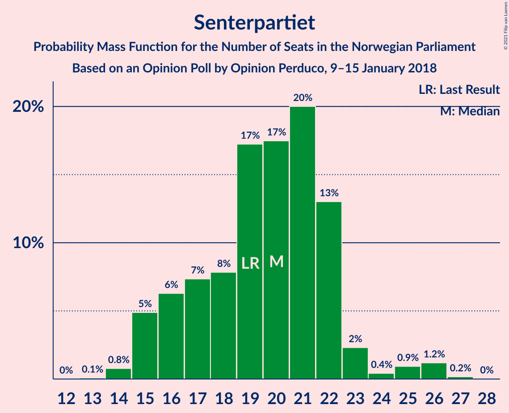

| Number of Seats | Probability | Accumulated | Special Marks |
|:---------------:|:-----------:|:-----------:|:-------------:|
| 13 | 0.1% | 100% |  |
| 14 | 0.8% | 99.9% |  |
| 15 | 5% | 99.1% |  |
| 16 | 6% | 94% |  |
| 17 | 7% | 88% |  |
| 18 | 8% | 81% |  |
| 19 | 17% | 73% | Last Result |
| 20 | 17% | 56% | Median |
| 21 | 20% | 38% |  |
| 22 | 13% | 18% |  |
| 23 | 2% | 5% |  |
| 24 | 0.4% | 3% |  |
| 25 | 0.9% | 2% |  |
| 26 | 1.2% | 1.4% |  |
| 27 | 0.2% | 0.2% |  |
| 28 | 0% | 0% |  |

### Sosialistisk Venstreparti

*For a full overview of the results for this party, see the [Sosialistisk Venstreparti](party-sosialistiskvenstreparti.html) page.*

| Number of Seats | Probability | Accumulated | Special Marks |
|:---------------:|:-----------:|:-----------:|:-------------:|
| 8 | 0.2% | 100% |  |
| 9 | 2% | 99.8% |  |
| 10 | 6% | 98% |  |
| 11 | 10% | 92% | Last Result |
| 12 | 20% | 82% |  |
| 13 | 21% | 62% | Median |
| 14 | 18% | 40% |  |
| 15 | 11% | 22% |  |
| 16 | 7% | 12% |  |
| 17 | 4% | 4% |  |
| 18 | 0.4% | 0.9% |  |
| 19 | 0.4% | 0.5% |  |
| 20 | 0.1% | 0.1% |  |
| 21 | 0% | 0% |  |

### Kristelig Folkeparti

*For a full overview of the results for this party, see the [Kristelig Folkeparti](party-kristeligfolkeparti.html) page.*

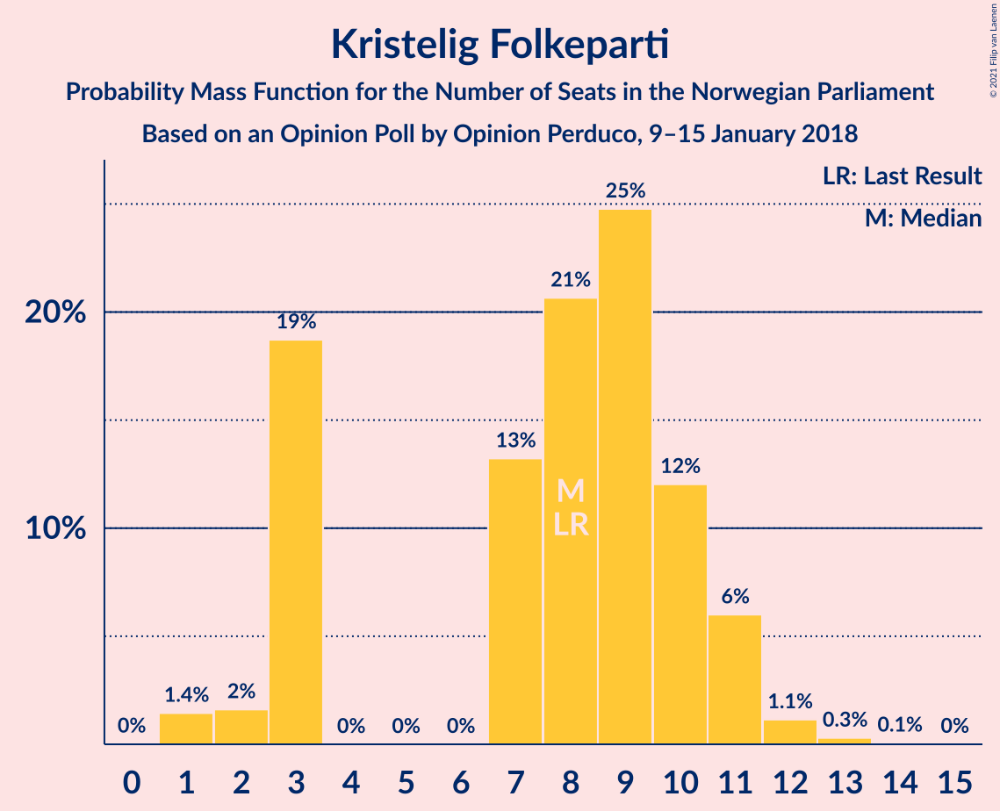

| Number of Seats | Probability | Accumulated | Special Marks |
|:---------------:|:-----------:|:-----------:|:-------------:|
| 1 | 1.4% | 100% |  |
| 2 | 2% | 98.5% |  |
| 3 | 19% | 97% |  |
| 4 | 0% | 78% |  |
| 5 | 0% | 78% |  |
| 6 | 0% | 78% |  |
| 7 | 13% | 78% |  |
| 8 | 21% | 65% | Last Result, Median |
| 9 | 25% | 44% |  |
| 10 | 12% | 20% |  |
| 11 | 6% | 8% |  |
| 12 | 1.1% | 2% |  |
| 13 | 0.3% | 0.4% |  |
| 14 | 0.1% | 0.1% |  |
| 15 | 0% | 0% |  |

### Venstre

*For a full overview of the results for this party, see the [Venstre](party-venstre.html) page.*

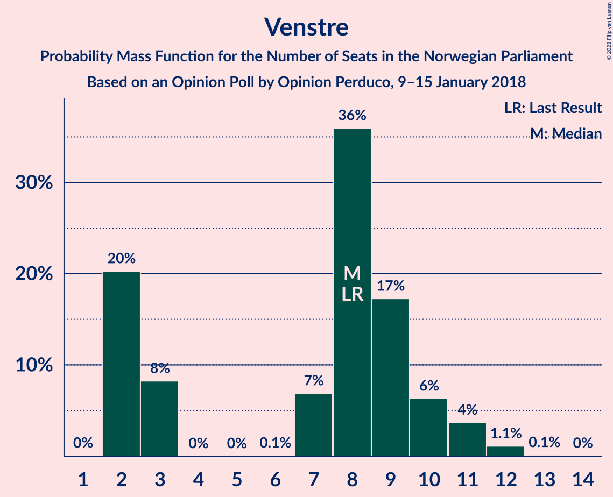

| Number of Seats | Probability | Accumulated | Special Marks |
|:---------------:|:-----------:|:-----------:|:-------------:|
| 2 | 20% | 100% |  |
| 3 | 8% | 80% |  |
| 4 | 0% | 71% |  |
| 5 | 0% | 71% |  |
| 6 | 0.1% | 71% |  |
| 7 | 7% | 71% |  |
| 8 | 36% | 64% | Last Result, Median |
| 9 | 17% | 29% |  |
| 10 | 6% | 11% |  |
| 11 | 4% | 5% |  |
| 12 | 1.1% | 1.3% |  |
| 13 | 0.1% | 0.2% |  |
| 14 | 0% | 0% |  |

### Rødt

*For a full overview of the results for this party, see the [Rødt](party-rødt.html) page.*

| Number of Seats | Probability | Accumulated | Special Marks |
|:---------------:|:-----------:|:-----------:|:-------------:|
| 1 | 38% | 100% | Last Result |
| 2 | 43% | 62% | Median |
| 3 | 0% | 20% |  |
| 4 | 0% | 20% |  |
| 5 | 0% | 20% |  |
| 6 | 0% | 20% |  |
| 7 | 14% | 20% |  |
| 8 | 4% | 5% |  |
| 9 | 0.5% | 0.7% |  |
| 10 | 0.2% | 0.2% |  |
| 11 | 0% | 0% |  |

### Miljøpartiet De Grønne

*For a full overview of the results for this party, see the [Miljøpartiet De Grønne](party-miljøpartietdegrønne.html) page.*

| Number of Seats | Probability | Accumulated | Special Marks |
|:---------------:|:-----------:|:-----------:|:-------------:|
| 0 | 2% | 100% |  |
| 1 | 46% | 98% | Last Result |
| 2 | 40% | 53% | Median |
| 3 | 3% | 13% |  |
| 4 | 0% | 10% |  |
| 5 | 0% | 10% |  |
| 6 | 0.2% | 10% |  |
| 7 | 4% | 10% |  |
| 8 | 5% | 6% |  |
| 9 | 1.1% | 1.1% |  |
| 10 | 0.1% | 0.1% |  |
| 11 | 0% | 0% |  |

## Coalitions

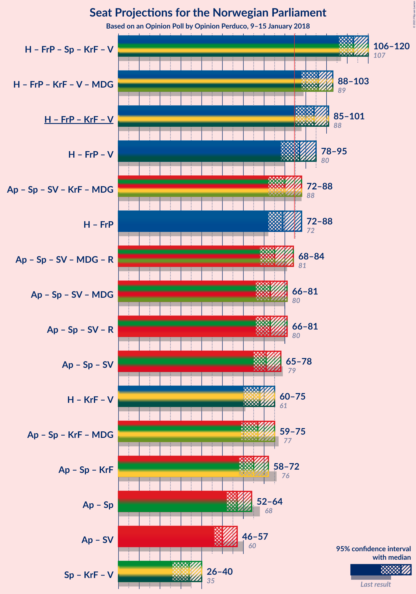

### Confidence Intervals

| Coalition | Last Result | Median | Majority? | 80% Confidence Interval | 90% Confidence Interval | 95% Confidence Interval | 99% Confidence Interval |
|:---------:|:-----------:|:------:|:---------:|:-----------------------:|:-----------------------:|:-----------------------:|:-----------------------:|
| Høyre – Fremskrittspartiet – Senterpartiet – Kristelig Folkeparti – Venstre | 107 | 113 | 100% | 108–118 | 107–119 | 106–120 | 103–122 |
| Høyre – Fremskrittspartiet – Kristelig Folkeparti – Venstre – Miljøpartiet De Grønne | 89 | 96 | 99.8% | 90–101 | 89–102 | 88–103 | 86–105 |
| Høyre – Fremskrittspartiet – Kristelig Folkeparti – Venstre | 88 | 94 | 99.1% | 89–99 | 87–100 | 85–101 | 83–103 |
| Høyre – Fremskrittspartiet – Venstre | 80 | 87 | 62% | 81–91 | 80–93 | 78–95 | 75–98 |
| Arbeiderpartiet – Senterpartiet – Sosialistisk Venstreparti – Kristelig Folkeparti – Miljøpartiet De Grønne | 88 | 80 | 17% | 75–86 | 73–86 | 72–88 | 70–91 |
| Høyre – Fremskrittspartiet | 72 | 79 | 10% | 74–84 | 73–87 | 72–88 | 70–90 |
| Arbeiderpartiet – Senterpartiet – Sosialistisk Venstreparti – Miljøpartiet De Grønne – Rødt | 81 | 75 | 0.9% | 70–80 | 69–82 | 68–84 | 66–86 |
| Arbeiderpartiet – Senterpartiet – Sosialistisk Venstreparti – Miljøpartiet De Grønne | 80 | 73 | 0.2% | 68–77 | 68–80 | 66–81 | 63–83 |
| Arbeiderpartiet – Senterpartiet – Sosialistisk Venstreparti – Rødt | 80 | 73 | 0.2% | 68–79 | 67–80 | 66–81 | 64–83 |
| Arbeiderpartiet – Senterpartiet – Sosialistisk Venstreparti | 79 | 71 | 0% | 66–75 | 66–76 | 65–78 | 62–80 |
| Høyre – Kristelig Folkeparti – Venstre | 61 | 68 | 0% | 62–73 | 61–75 | 60–75 | 57–78 |
| Arbeiderpartiet – Senterpartiet – Kristelig Folkeparti – Miljøpartiet De Grønne | 77 | 67 | 0% | 61–72 | 60–74 | 59–75 | 57–78 |
| Arbeiderpartiet – Senterpartiet – Kristelig Folkeparti | 76 | 65 | 0% | 59–70 | 59–71 | 58–72 | 55–76 |
| Arbeiderpartiet – Senterpartiet | 68 | 57 | 0% | 54–62 | 53–62 | 52–64 | 50–66 |
| Arbeiderpartiet – Sosialistisk Venstreparti | 60 | 50 | 0% | 48–55 | 47–56 | 46–57 | 43–59 |
| Senterpartiet – Kristelig Folkeparti – Venstre | 35 | 34 | 0% | 29–38 | 28–40 | 26–40 | 24–42 |

### Høyre – Fremskrittspartiet – Senterpartiet – Kristelig Folkeparti – Venstre

| Number of Seats | Probability | Accumulated | Special Marks |
|:---------------:|:-----------:|:-----------:|:-------------:|
| 100 | 0.1% | 100% |  |
| 101 | 0.1% | 99.9% |  |
| 102 | 0.2% | 99.8% |  |
| 103 | 0.3% | 99.7% |  |
| 104 | 0.6% | 99.4% |  |
| 105 | 0.8% | 98.7% |  |
| 106 | 2% | 98% |  |
| 107 | 3% | 96% | Last Result |
| 108 | 3% | 93% |  |
| 109 | 6% | 90% |  |
| 110 | 5% | 84% |  |
| 111 | 16% | 78% |  |
| 112 | 9% | 62% |  |
| 113 | 7% | 54% |  |
| 114 | 6% | 46% |  |
| 115 | 9% | 40% | Median |
| 116 | 12% | 31% |  |
| 117 | 7% | 19% |  |
| 118 | 6% | 12% |  |
| 119 | 3% | 6% |  |
| 120 | 2% | 3% |  |
| 121 | 0.7% | 1.2% |  |
| 122 | 0.1% | 0.6% |  |
| 123 | 0.3% | 0.4% |  |
| 124 | 0% | 0.1% |  |
| 125 | 0.1% | 0.1% |  |
| 126 | 0% | 0% |  |

### Høyre – Fremskrittspartiet – Kristelig Folkeparti – Venstre – Miljøpartiet De Grønne

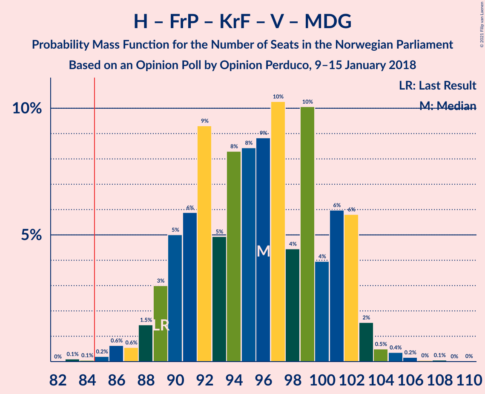

| Number of Seats | Probability | Accumulated | Special Marks |
|:---------------:|:-----------:|:-----------:|:-------------:|
| 83 | 0.1% | 100% |  |
| 84 | 0.1% | 99.9% |  |
| 85 | 0.2% | 99.8% | Majority |
| 86 | 0.6% | 99.6% |  |
| 87 | 0.6% | 99.0% |  |
| 88 | 1.5% | 98% |  |
| 89 | 3% | 97% | Last Result |
| 90 | 5% | 94% |  |
| 91 | 6% | 89% |  |
| 92 | 9% | 83% |  |
| 93 | 5% | 74% |  |
| 94 | 8% | 69% |  |
| 95 | 8% | 61% |  |
| 96 | 9% | 52% |  |
| 97 | 10% | 43% | Median |
| 98 | 4% | 33% |  |
| 99 | 10% | 29% |  |
| 100 | 4% | 18% |  |
| 101 | 6% | 15% |  |
| 102 | 6% | 9% |  |
| 103 | 2% | 3% |  |
| 104 | 0.5% | 1.2% |  |
| 105 | 0.4% | 0.7% |  |
| 106 | 0.2% | 0.3% |  |
| 107 | 0% | 0.1% |  |
| 108 | 0.1% | 0.1% |  |
| 109 | 0% | 0% |  |

### Høyre – Fremskrittspartiet – Kristelig Folkeparti – Venstre

| Number of Seats | Probability | Accumulated | Special Marks |
|:---------------:|:-----------:|:-----------:|:-------------:|
| 80 | 0% | 100% |  |
| 81 | 0.1% | 99.9% |  |
| 82 | 0.1% | 99.8% |  |
| 83 | 0.2% | 99.7% |  |
| 84 | 0.4% | 99.5% |  |
| 85 | 2% | 99.1% | Majority |
| 86 | 1.0% | 97% |  |
| 87 | 4% | 96% |  |
| 88 | 2% | 93% | Last Result |
| 89 | 6% | 90% |  |
| 90 | 12% | 84% |  |
| 91 | 8% | 72% |  |
| 92 | 6% | 64% |  |
| 93 | 5% | 58% |  |
| 94 | 12% | 53% |  |
| 95 | 11% | 41% | Median |
| 96 | 3% | 31% |  |
| 97 | 4% | 27% |  |
| 98 | 10% | 23% |  |
| 99 | 5% | 13% |  |
| 100 | 5% | 8% |  |
| 101 | 2% | 3% |  |
| 102 | 0.6% | 1.1% |  |
| 103 | 0.2% | 0.6% |  |
| 104 | 0.3% | 0.4% |  |
| 105 | 0.1% | 0.1% |  |
| 106 | 0% | 0.1% |  |
| 107 | 0% | 0% |  |

### Høyre – Fremskrittspartiet – Venstre

| Number of Seats | Probability | Accumulated | Special Marks |
|:---------------:|:-----------:|:-----------:|:-------------:|
| 73 | 0.2% | 100% |  |
| 74 | 0.2% | 99.8% |  |
| 75 | 0.1% | 99.6% |  |
| 76 | 0.6% | 99.5% |  |
| 77 | 0.5% | 98.9% |  |
| 78 | 2% | 98% |  |
| 79 | 1.4% | 96% |  |
| 80 | 5% | 95% | Last Result |
| 81 | 9% | 90% |  |
| 82 | 4% | 81% |  |
| 83 | 7% | 77% |  |
| 84 | 9% | 70% |  |
| 85 | 7% | 62% | Majority |
| 86 | 4% | 55% |  |
| 87 | 10% | 51% | Median |
| 88 | 10% | 40% |  |
| 89 | 7% | 30% |  |
| 90 | 7% | 23% |  |
| 91 | 6% | 15% |  |
| 92 | 4% | 9% |  |
| 93 | 1.2% | 6% |  |
| 94 | 0.7% | 4% |  |
| 95 | 2% | 4% |  |
| 96 | 0.9% | 2% |  |
| 97 | 0.1% | 0.7% |  |
| 98 | 0.4% | 0.5% |  |
| 99 | 0.1% | 0.2% |  |
| 100 | 0% | 0.1% |  |
| 101 | 0% | 0% |  |

### Arbeiderpartiet – Senterpartiet – Sosialistisk Venstreparti – Kristelig Folkeparti – Miljøpartiet De Grønne

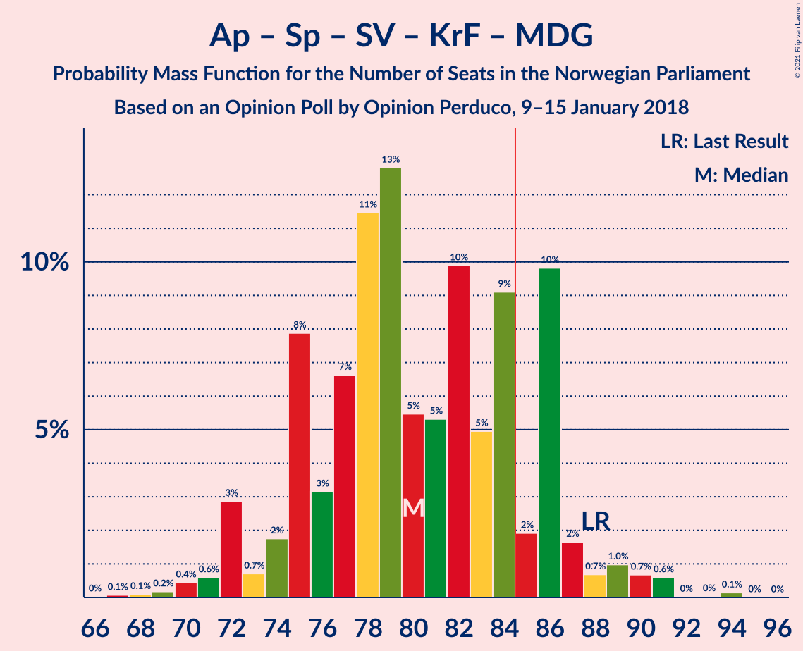

| Number of Seats | Probability | Accumulated | Special Marks |
|:---------------:|:-----------:|:-----------:|:-------------:|
| 67 | 0.1% | 100% |  |
| 68 | 0.1% | 99.9% |  |
| 69 | 0.2% | 99.8% |  |
| 70 | 0.4% | 99.6% |  |
| 71 | 0.6% | 99.2% |  |
| 72 | 3% | 98.6% |  |
| 73 | 0.7% | 96% |  |
| 74 | 2% | 95% |  |
| 75 | 8% | 93% |  |
| 76 | 3% | 85% |  |
| 77 | 7% | 82% |  |
| 78 | 11% | 76% |  |
| 79 | 13% | 64% |  |
| 80 | 5% | 51% |  |
| 81 | 5% | 46% | Median |
| 82 | 10% | 40% |  |
| 83 | 5% | 31% |  |
| 84 | 9% | 26% |  |
| 85 | 2% | 17% | Majority |
| 86 | 10% | 15% |  |
| 87 | 2% | 5% |  |
| 88 | 0.7% | 3% | Last Result |
| 89 | 1.0% | 2% |  |
| 90 | 0.7% | 1.5% |  |
| 91 | 0.6% | 0.8% |  |
| 92 | 0% | 0.2% |  |
| 93 | 0% | 0.2% |  |
| 94 | 0.1% | 0.2% |  |
| 95 | 0% | 0% |  |

### Høyre – Fremskrittspartiet

| Number of Seats | Probability | Accumulated | Special Marks |
|:---------------:|:-----------:|:-----------:|:-------------:|
| 68 | 0.1% | 100% |  |
| 69 | 0.3% | 99.9% |  |
| 70 | 1.0% | 99.6% |  |
| 71 | 0.8% | 98.7% |  |
| 72 | 1.2% | 98% | Last Result |
| 73 | 6% | 97% |  |
| 74 | 4% | 91% |  |
| 75 | 6% | 87% |  |
| 76 | 7% | 81% |  |
| 77 | 9% | 74% |  |
| 78 | 8% | 64% |  |
| 79 | 8% | 57% | Median |
| 80 | 8% | 49% |  |
| 81 | 14% | 41% |  |
| 82 | 4% | 28% |  |
| 83 | 10% | 24% |  |
| 84 | 4% | 14% |  |
| 85 | 2% | 10% | Majority |
| 86 | 1.1% | 7% |  |
| 87 | 2% | 6% |  |
| 88 | 3% | 4% |  |
| 89 | 0.4% | 1.0% |  |
| 90 | 0.4% | 0.7% |  |
| 91 | 0.2% | 0.3% |  |
| 92 | 0% | 0.1% |  |
| 93 | 0% | 0.1% |  |
| 94 | 0% | 0% |  |

### Arbeiderpartiet – Senterpartiet – Sosialistisk Venstreparti – Miljøpartiet De Grønne – Rødt

| Number of Seats | Probability | Accumulated | Special Marks |
|:---------------:|:-----------:|:-----------:|:-------------:|
| 63 | 0% | 100% |  |
| 64 | 0.1% | 99.9% |  |
| 65 | 0.3% | 99.9% |  |
| 66 | 0.2% | 99.6% |  |
| 67 | 0.6% | 99.4% |  |
| 68 | 2% | 98.9% |  |
| 69 | 5% | 97% |  |
| 70 | 5% | 92% |  |
| 71 | 10% | 87% |  |
| 72 | 4% | 77% |  |
| 73 | 3% | 73% |  |
| 74 | 11% | 69% |  |
| 75 | 12% | 59% | Median |
| 76 | 5% | 47% |  |
| 77 | 6% | 42% |  |
| 78 | 8% | 36% |  |
| 79 | 12% | 28% |  |
| 80 | 6% | 16% |  |
| 81 | 2% | 10% | Last Result |
| 82 | 4% | 7% |  |
| 83 | 1.0% | 4% |  |
| 84 | 2% | 3% |  |
| 85 | 0.4% | 0.9% | Majority |
| 86 | 0.2% | 0.5% |  |
| 87 | 0.1% | 0.3% |  |
| 88 | 0.1% | 0.2% |  |
| 89 | 0% | 0.1% |  |
| 90 | 0% | 0% |  |

### Arbeiderpartiet – Senterpartiet – Sosialistisk Venstreparti – Miljøpartiet De Grønne

| Number of Seats | Probability | Accumulated | Special Marks |
|:---------------:|:-----------:|:-----------:|:-------------:|
| 60 | 0% | 100% |  |
| 61 | 0.1% | 99.9% |  |
| 62 | 0.2% | 99.9% |  |
| 63 | 0.3% | 99.7% |  |
| 64 | 0.3% | 99.4% |  |
| 65 | 0.5% | 99.1% |  |
| 66 | 1.1% | 98.6% |  |
| 67 | 2% | 97% |  |
| 68 | 8% | 95% |  |
| 69 | 7% | 87% |  |
| 70 | 11% | 80% |  |
| 71 | 5% | 69% |  |
| 72 | 14% | 64% |  |
| 73 | 13% | 50% | Median |
| 74 | 7% | 38% |  |
| 75 | 5% | 30% |  |
| 76 | 8% | 26% |  |
| 77 | 9% | 18% |  |
| 78 | 2% | 9% |  |
| 79 | 1.4% | 7% |  |
| 80 | 3% | 5% | Last Result |
| 81 | 0.7% | 3% |  |
| 82 | 0.2% | 2% |  |
| 83 | 1.3% | 2% |  |
| 84 | 0.1% | 0.3% |  |
| 85 | 0% | 0.2% | Majority |
| 86 | 0.1% | 0.1% |  |
| 87 | 0% | 0% |  |

### Arbeiderpartiet – Senterpartiet – Sosialistisk Venstreparti – Rødt

| Number of Seats | Probability | Accumulated | Special Marks |
|:---------------:|:-----------:|:-----------:|:-------------:|
| 61 | 0.1% | 100% |  |
| 62 | 0% | 99.9% |  |
| 63 | 0.2% | 99.9% |  |
| 64 | 0.4% | 99.7% |  |
| 65 | 0.5% | 99.3% |  |
| 66 | 2% | 98.8% |  |
| 67 | 6% | 97% |  |
| 68 | 6% | 91% |  |
| 69 | 4% | 85% |  |
| 70 | 10% | 82% |  |
| 71 | 4% | 71% |  |
| 72 | 10% | 67% |  |
| 73 | 9% | 57% | Median |
| 74 | 8% | 48% |  |
| 75 | 8% | 39% |  |
| 76 | 5% | 31% |  |
| 77 | 9% | 26% |  |
| 78 | 6% | 17% |  |
| 79 | 5% | 11% |  |
| 80 | 3% | 6% | Last Result |
| 81 | 1.5% | 3% |  |
| 82 | 0.6% | 2% |  |
| 83 | 0.6% | 1.0% |  |
| 84 | 0.2% | 0.4% |  |
| 85 | 0.1% | 0.2% | Majority |
| 86 | 0.1% | 0.1% |  |
| 87 | 0% | 0% |  |

### Arbeiderpartiet – Senterpartiet – Sosialistisk Venstreparti

| Number of Seats | Probability | Accumulated | Special Marks |
|:---------------:|:-----------:|:-----------:|:-------------:|
| 58 | 0% | 100% |  |
| 59 | 0.1% | 99.9% |  |
| 60 | 0.1% | 99.9% |  |
| 61 | 0.2% | 99.8% |  |
| 62 | 0.5% | 99.6% |  |
| 63 | 0.6% | 99.1% |  |
| 64 | 0.9% | 98.5% |  |
| 65 | 2% | 98% |  |
| 66 | 9% | 96% |  |
| 67 | 7% | 87% |  |
| 68 | 7% | 80% |  |
| 69 | 11% | 73% |  |
| 70 | 10% | 62% |  |
| 71 | 12% | 52% | Median |
| 72 | 11% | 41% |  |
| 73 | 8% | 29% |  |
| 74 | 5% | 21% |  |
| 75 | 10% | 16% |  |
| 76 | 2% | 6% |  |
| 77 | 1.4% | 4% |  |
| 78 | 2% | 3% |  |
| 79 | 0.6% | 1.1% | Last Result |
| 80 | 0.1% | 0.5% |  |
| 81 | 0.3% | 0.4% |  |
| 82 | 0% | 0.1% |  |
| 83 | 0% | 0% |  |

### Høyre – Kristelig Folkeparti – Venstre

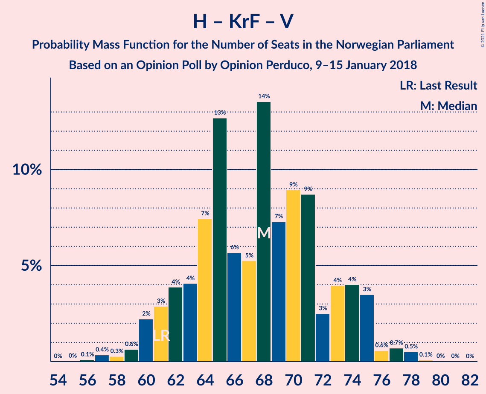

| Number of Seats | Probability | Accumulated | Special Marks |
|:---------------:|:-----------:|:-----------:|:-------------:|
| 55 | 0% | 100% |  |
| 56 | 0.1% | 99.9% |  |
| 57 | 0.4% | 99.8% |  |
| 58 | 0.3% | 99.5% |  |
| 59 | 0.6% | 99.2% |  |
| 60 | 2% | 98.6% |  |
| 61 | 3% | 96% | Last Result |
| 62 | 4% | 93% |  |
| 63 | 4% | 90% |  |
| 64 | 7% | 86% |  |
| 65 | 13% | 78% |  |
| 66 | 6% | 65% |  |
| 67 | 5% | 60% |  |
| 68 | 14% | 54% |  |
| 69 | 7% | 41% | Median |
| 70 | 9% | 34% |  |
| 71 | 9% | 25% |  |
| 72 | 3% | 16% |  |
| 73 | 4% | 13% |  |
| 74 | 4% | 9% |  |
| 75 | 3% | 5% |  |
| 76 | 0.6% | 2% |  |
| 77 | 0.7% | 1.4% |  |
| 78 | 0.5% | 0.7% |  |
| 79 | 0.1% | 0.1% |  |
| 80 | 0% | 0.1% |  |
| 81 | 0% | 0% |  |

### Arbeiderpartiet – Senterpartiet – Kristelig Folkeparti – Miljøpartiet De Grønne

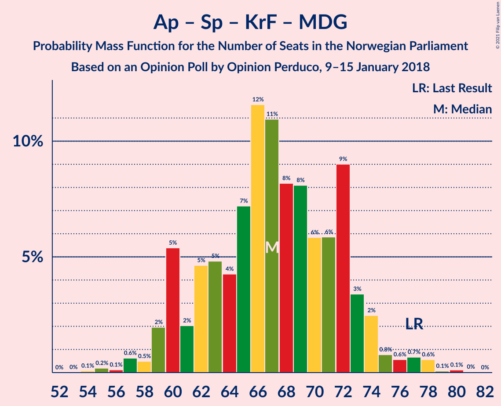

| Number of Seats | Probability | Accumulated | Special Marks |
|:---------------:|:-----------:|:-----------:|:-------------:|
| 54 | 0.1% | 100% |  |
| 55 | 0.2% | 99.9% |  |
| 56 | 0.1% | 99.7% |  |
| 57 | 0.6% | 99.6% |  |
| 58 | 0.5% | 99.0% |  |
| 59 | 2% | 98% |  |
| 60 | 5% | 97% |  |
| 61 | 2% | 91% |  |
| 62 | 5% | 89% |  |
| 63 | 5% | 84% |  |
| 64 | 4% | 80% |  |
| 65 | 7% | 75% |  |
| 66 | 12% | 68% |  |
| 67 | 11% | 57% |  |
| 68 | 8% | 46% | Median |
| 69 | 8% | 37% |  |
| 70 | 6% | 29% |  |
| 71 | 6% | 24% |  |
| 72 | 9% | 18% |  |
| 73 | 3% | 9% |  |
| 74 | 2% | 5% |  |
| 75 | 0.8% | 3% |  |
| 76 | 0.6% | 2% |  |
| 77 | 0.7% | 1.5% | Last Result |
| 78 | 0.6% | 0.8% |  |
| 79 | 0.1% | 0.2% |  |
| 80 | 0.1% | 0.2% |  |
| 81 | 0% | 0% |  |

### Arbeiderpartiet – Senterpartiet – Kristelig Folkeparti

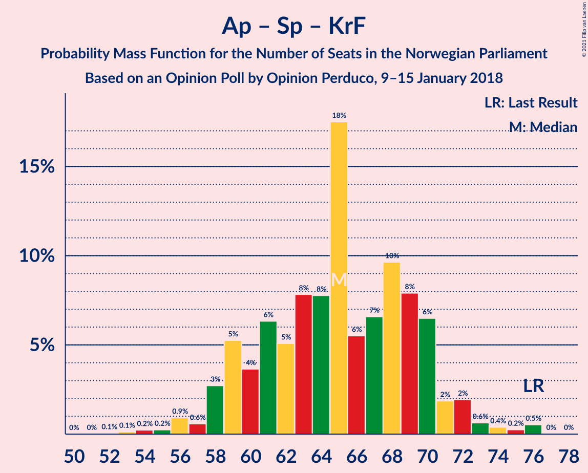

| Number of Seats | Probability | Accumulated | Special Marks |
|:---------------:|:-----------:|:-----------:|:-------------:|
| 52 | 0.1% | 100% |  |
| 53 | 0.1% | 99.9% |  |
| 54 | 0.2% | 99.8% |  |
| 55 | 0.2% | 99.6% |  |
| 56 | 0.9% | 99.3% |  |
| 57 | 0.6% | 98% |  |
| 58 | 3% | 98% |  |
| 59 | 5% | 95% |  |
| 60 | 4% | 90% |  |
| 61 | 6% | 86% |  |
| 62 | 5% | 80% |  |
| 63 | 8% | 75% |  |
| 64 | 8% | 67% |  |
| 65 | 18% | 59% |  |
| 66 | 6% | 42% | Median |
| 67 | 7% | 36% |  |
| 68 | 10% | 30% |  |
| 69 | 8% | 20% |  |
| 70 | 6% | 12% |  |
| 71 | 2% | 6% |  |
| 72 | 2% | 4% |  |
| 73 | 0.6% | 2% |  |
| 74 | 0.4% | 1.2% |  |
| 75 | 0.2% | 0.8% |  |
| 76 | 0.5% | 0.6% | Last Result |
| 77 | 0% | 0% |  |

### Arbeiderpartiet – Senterpartiet

| Number of Seats | Probability | Accumulated | Special Marks |
|:---------------:|:-----------:|:-----------:|:-------------:|
| 46 | 0% | 100% |  |
| 47 | 0.1% | 99.9% |  |
| 48 | 0.1% | 99.9% |  |
| 49 | 0.2% | 99.8% |  |
| 50 | 0.6% | 99.6% |  |
| 51 | 0.9% | 99.0% |  |
| 52 | 1.4% | 98% |  |
| 53 | 7% | 97% |  |
| 54 | 4% | 90% |  |
| 55 | 12% | 86% |  |
| 56 | 12% | 73% |  |
| 57 | 12% | 61% |  |
| 58 | 14% | 50% | Median |
| 59 | 10% | 36% |  |
| 60 | 5% | 26% |  |
| 61 | 10% | 20% |  |
| 62 | 6% | 10% |  |
| 63 | 1.3% | 4% |  |
| 64 | 1.0% | 3% |  |
| 65 | 0.7% | 2% |  |
| 66 | 0.6% | 0.8% |  |
| 67 | 0.1% | 0.2% |  |
| 68 | 0% | 0.1% | Last Result |
| 69 | 0% | 0.1% |  |
| 70 | 0% | 0% |  |

### Arbeiderpartiet – Sosialistisk Venstreparti

| Number of Seats | Probability | Accumulated | Special Marks |
|:---------------:|:-----------:|:-----------:|:-------------:|
| 40 | 0.1% | 100% |  |
| 41 | 0.1% | 99.9% |  |
| 42 | 0.1% | 99.8% |  |
| 43 | 0.3% | 99.6% |  |
| 44 | 0.4% | 99.3% |  |
| 45 | 1.4% | 98.9% |  |
| 46 | 2% | 98% |  |
| 47 | 4% | 95% |  |
| 48 | 6% | 91% |  |
| 49 | 11% | 85% |  |
| 50 | 25% | 74% |  |
| 51 | 12% | 49% | Median |
| 52 | 5% | 37% |  |
| 53 | 7% | 32% |  |
| 54 | 11% | 25% |  |
| 55 | 6% | 13% |  |
| 56 | 3% | 8% |  |
| 57 | 3% | 4% |  |
| 58 | 0.6% | 2% |  |
| 59 | 0.7% | 0.9% |  |
| 60 | 0.1% | 0.2% | Last Result |
| 61 | 0.1% | 0.1% |  |
| 62 | 0% | 0.1% |  |
| 63 | 0% | 0% |  |

### Senterpartiet – Kristelig Folkeparti – Venstre

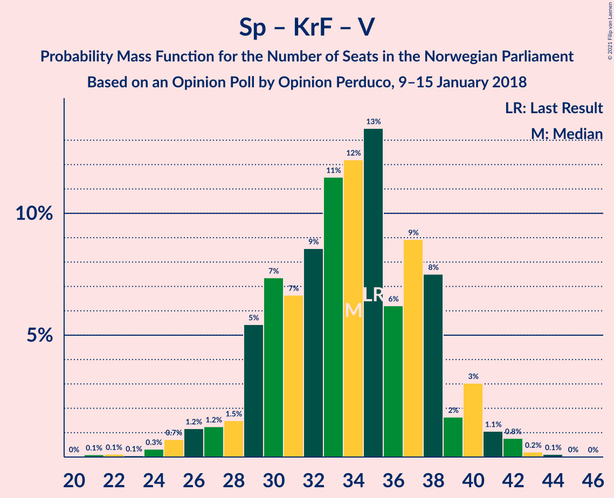

| Number of Seats | Probability | Accumulated | Special Marks |
|:---------------:|:-----------:|:-----------:|:-------------:|
| 21 | 0.1% | 100% |  |
| 22 | 0.1% | 99.9% |  |
| 23 | 0.1% | 99.7% |  |
| 24 | 0.3% | 99.7% |  |
| 25 | 0.7% | 99.4% |  |
| 26 | 1.2% | 98.6% |  |
| 27 | 1.2% | 97% |  |
| 28 | 1.5% | 96% |  |
| 29 | 5% | 95% |  |
| 30 | 7% | 89% |  |
| 31 | 7% | 82% |  |
| 32 | 9% | 75% |  |
| 33 | 11% | 67% |  |
| 34 | 12% | 55% |  |
| 35 | 13% | 43% | Last Result |
| 36 | 6% | 30% | Median |
| 37 | 9% | 23% |  |
| 38 | 8% | 14% |  |
| 39 | 2% | 7% |  |
| 40 | 3% | 5% |  |
| 41 | 1.1% | 2% |  |
| 42 | 0.8% | 1.1% |  |
| 43 | 0.2% | 0.4% |  |
| 44 | 0.1% | 0.2% |  |
| 45 | 0% | 0.1% |  |
| 46 | 0% | 0% |  |

## Technical Information

### Opinion Poll

+ **Polling firm:** Opinion Perduco
+ **Commissioner(s):** —
+ **Fieldwork period:** 9–15 January 2018

### Calculations

+ **Sample size:** 697
+ **Simulations done:** 524,288
+ **Error estimate:** 1.92%

