# Opinion Poll by Kantar TNS, 29 January–5 February 2018

<a href="#voting-intentions">Voting Intentions</a> | <a href="#seats">Seats</a> | <a href="#coalitions">Coalitions</a> | <a href="#technical-information">Technical Information</a>

## Voting Intentions

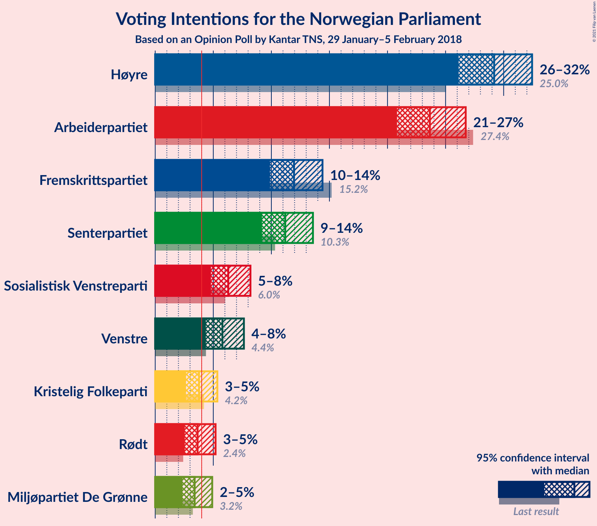

### Confidence Intervals

| Party | Last Result | Poll Result | 80% Confidence Interval | 90% Confidence Interval | 95% Confidence Interval | 99% Confidence Interval |
|:-----:|:-----------:|:-----------:|:-----------------------:|:-----------------------:|:-----------------------:|:-----------------------:|
| Høyre | 25.0% | 29.2% | 27.2–31.3% |26.6–31.9% |26.1–32.4% |25.2–33.5% |
| Arbeiderpartiet | 27.4% | 23.6% | 21.8–25.7% |21.3–26.2% |20.8–26.7% |20.0–27.7% |
| Fremskrittspartiet | 15.2% | 11.9% | 10.6–13.5% |10.2–14.0% |9.9–14.4% |9.3–15.2% |
| Senterpartiet | 10.3% | 11.2% | 9.9–12.8% |9.5–13.2% |9.2–13.6% |8.6–14.4% |
| Sosialistisk Venstreparti | 6.0% | 6.3% | 5.3–7.5% |5.0–7.9% |4.8–8.2% |4.4–8.8% |
| Venstre | 4.4% | 5.8% | 4.8–7.0% |4.6–7.3% |4.4–7.6% |3.9–8.3% |
| Kristelig Folkeparti | 4.2% | 3.8% | 3.0–4.8% |2.8–5.1% |2.7–5.3% |2.3–5.9% |
| Rødt | 2.4% | 3.6% | 2.9–4.7% |2.7–4.9% |2.5–5.2% |2.2–5.7% |
| Miljøpartiet De Grønne | 3.2% | 3.4% | 2.7–4.4% |2.5–4.6% |2.3–4.9% |2.0–5.4% |

*Note:* The poll result column reflects the actual value used in the calculations. Published results may vary slightly, and in addition be rounded to fewer digits.

## Seats

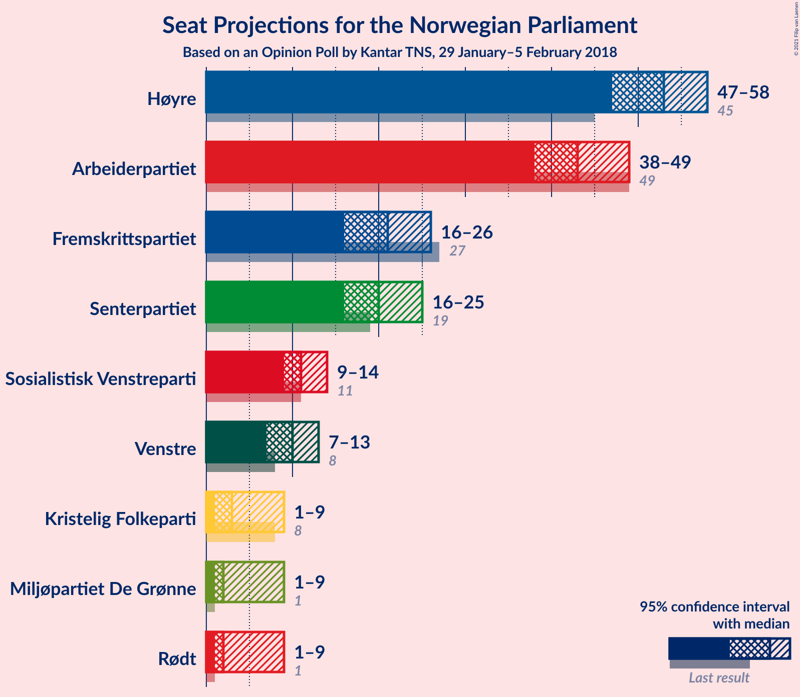

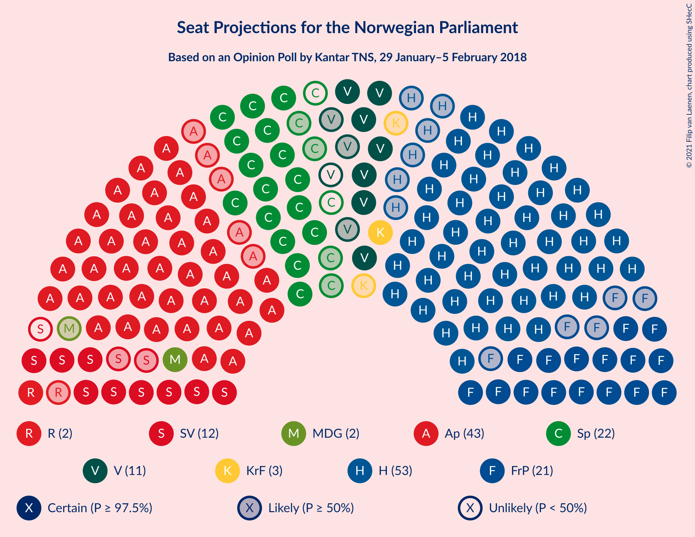

### Confidence Intervals

| Party | Last Result | Median | 80% Confidence Interval | 90% Confidence Interval | 95% Confidence Interval | 99% Confidence Interval |
|:-----:|:-----------:|:------:|:-----------------------:|:-----------------------:|:-----------------------:|:-----------------------:|
| <a href="#høyre">Høyre</a> | 45 | 53 | 48–56 |47–57 |47–58 |44–61 |
| <a href="#arbeiderpartiet">Arbeiderpartiet</a> | 49 | 43 | 40–46 |38–48 |38–49 |36–50 |
| <a href="#fremskrittspartiet">Fremskrittspartiet</a> | 27 | 21 | 19–25 |17–26 |16–26 |15–28 |
| <a href="#senterpartiet">Senterpartiet</a> | 19 | 20 | 17–24 |16–24 |16–25 |15–26 |
| <a href="#sosialistisk-venstreparti">Sosialistisk Venstreparti</a> | 11 | 11 | 9–14 |9–14 |9–14 |7–16 |
| <a href="#venstre">Venstre</a> | 8 | 10 | 8–12 |7–13 |7–13 |3–15 |
| <a href="#kristelig-folkeparti">Kristelig Folkeparti</a> | 8 | 3 | 2–8 |1–9 |1–9 |0–10 |
| <a href="#rødt">Rødt</a> | 1 | 2 | 1–8 |1–9 |1–9 |1–10 |
| <a href="#miljøpartiet-de-grønne">Miljøpartiet De Grønne</a> | 1 | 2 | 1–8 |1–8 |1–9 |0–9 |

### Høyre

*For a full overview of the results for this party, see the [Høyre](party-høyre.html) page.*

| Number of Seats | Probability | Accumulated | Special Marks |
|:---------------:|:-----------:|:-----------:|:-------------:|
| 42 | 0.2% | 100% |  |
| 43 | 0.1% | 99.8% |  |
| 44 | 0.6% | 99.6% |  |
| 45 | 0.5% | 99.1% | Last Result |
| 46 | 0.8% | 98.6% |  |
| 47 | 5% | 98% |  |
| 48 | 6% | 92% |  |
| 49 | 7% | 86% |  |
| 50 | 8% | 79% |  |
| 51 | 5% | 71% |  |
| 52 | 15% | 66% |  |
| 53 | 21% | 50% | Median |
| 54 | 12% | 29% |  |
| 55 | 3% | 17% |  |
| 56 | 8% | 14% |  |
| 57 | 3% | 7% |  |
| 58 | 1.3% | 4% |  |
| 59 | 0.2% | 2% |  |
| 60 | 0.8% | 2% |  |
| 61 | 1.4% | 2% |  |
| 62 | 0% | 0.1% |  |
| 63 | 0% | 0.1% |  |
| 64 | 0% | 0% |  |

### Arbeiderpartiet

*For a full overview of the results for this party, see the [Arbeiderpartiet](party-arbeiderpartiet.html) page.*

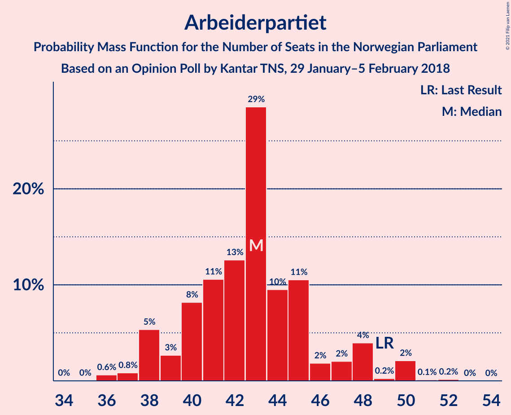

| Number of Seats | Probability | Accumulated | Special Marks |
|:---------------:|:-----------:|:-----------:|:-------------:|
| 34 | 0% | 100% |  |
| 35 | 0% | 99.9% |  |
| 36 | 0.6% | 99.9% |  |
| 37 | 0.8% | 99.3% |  |
| 38 | 5% | 98% |  |
| 39 | 3% | 93% |  |
| 40 | 8% | 90% |  |
| 41 | 11% | 82% |  |
| 42 | 13% | 72% |  |
| 43 | 29% | 59% | Median |
| 44 | 10% | 31% |  |
| 45 | 11% | 21% |  |
| 46 | 2% | 10% |  |
| 47 | 2% | 9% |  |
| 48 | 4% | 7% |  |
| 49 | 0.2% | 3% | Last Result |
| 50 | 2% | 2% |  |
| 51 | 0.1% | 0.3% |  |
| 52 | 0.2% | 0.2% |  |
| 53 | 0% | 0% |  |

### Fremskrittspartiet

*For a full overview of the results for this party, see the [Fremskrittspartiet](party-fremskrittspartiet.html) page.*

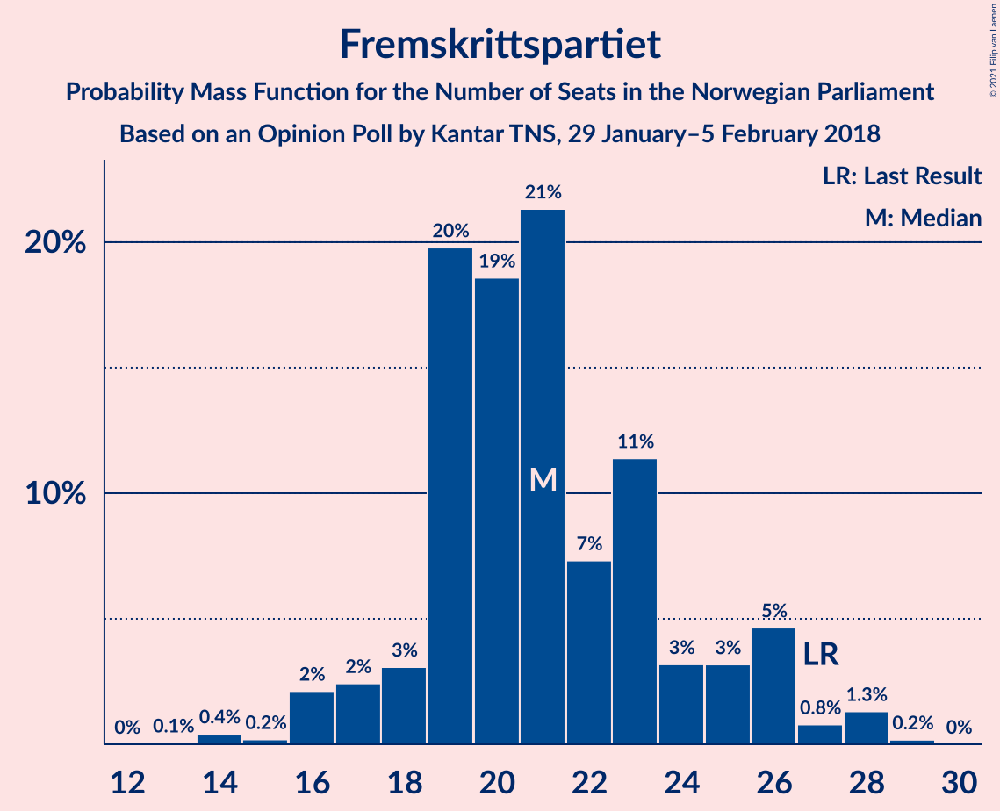

| Number of Seats | Probability | Accumulated | Special Marks |
|:---------------:|:-----------:|:-----------:|:-------------:|
| 13 | 0.1% | 100% |  |
| 14 | 0.4% | 99.9% |  |
| 15 | 0.2% | 99.5% |  |
| 16 | 2% | 99.3% |  |
| 17 | 2% | 97% |  |
| 18 | 3% | 95% |  |
| 19 | 20% | 92% |  |
| 20 | 19% | 72% |  |
| 21 | 21% | 53% | Median |
| 22 | 7% | 32% |  |
| 23 | 11% | 25% |  |
| 24 | 3% | 13% |  |
| 25 | 3% | 10% |  |
| 26 | 5% | 7% |  |
| 27 | 0.8% | 2% | Last Result |
| 28 | 1.3% | 1.5% |  |
| 29 | 0.2% | 0.2% |  |
| 30 | 0% | 0% |  |

### Senterpartiet

*For a full overview of the results for this party, see the [Senterpartiet](party-senterpartiet.html) page.*

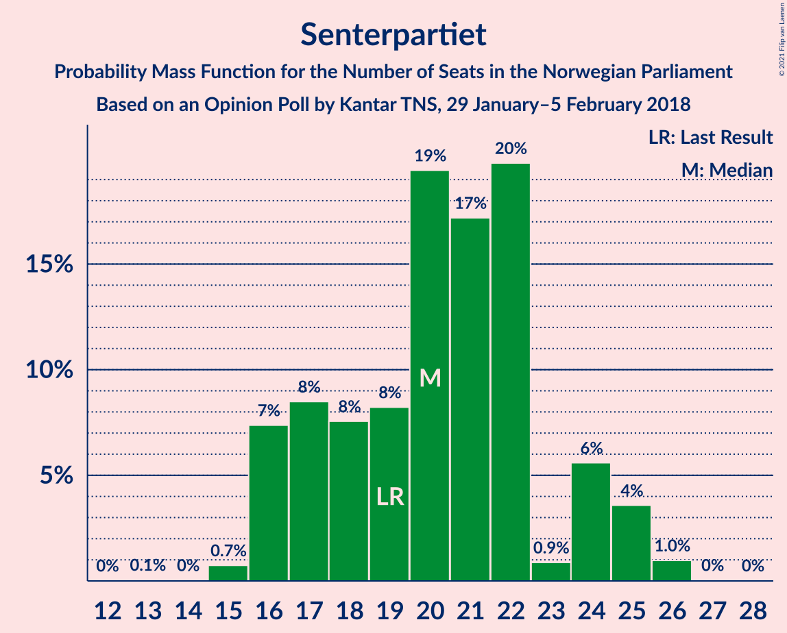

| Number of Seats | Probability | Accumulated | Special Marks |
|:---------------:|:-----------:|:-----------:|:-------------:|
| 13 | 0.1% | 100% |  |
| 14 | 0% | 99.9% |  |
| 15 | 0.7% | 99.9% |  |
| 16 | 7% | 99.2% |  |
| 17 | 8% | 92% |  |
| 18 | 8% | 83% |  |
| 19 | 8% | 76% | Last Result |
| 20 | 19% | 68% | Median |
| 21 | 17% | 48% |  |
| 22 | 20% | 31% |  |
| 23 | 0.9% | 11% |  |
| 24 | 6% | 10% |  |
| 25 | 4% | 5% |  |
| 26 | 1.0% | 1.1% |  |
| 27 | 0% | 0.1% |  |
| 28 | 0% | 0% |  |

### Sosialistisk Venstreparti

*For a full overview of the results for this party, see the [Sosialistisk Venstreparti](party-sosialistiskvenstreparti.html) page.*

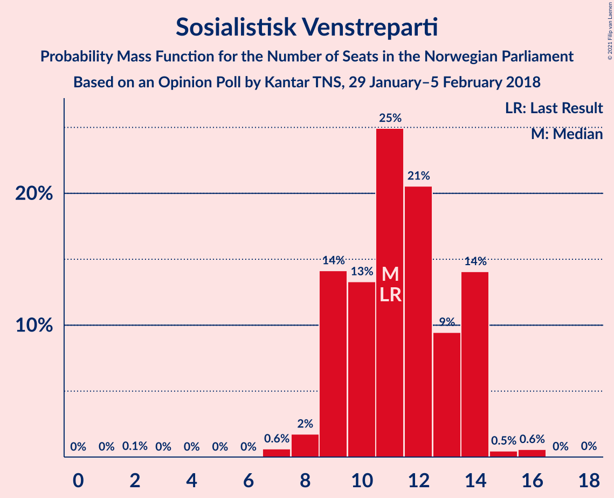

| Number of Seats | Probability | Accumulated | Special Marks |
|:---------------:|:-----------:|:-----------:|:-------------:|
| 2 | 0.1% | 100% |  |
| 3 | 0% | 99.9% |  |
| 4 | 0% | 99.9% |  |
| 5 | 0% | 99.9% |  |
| 6 | 0% | 99.9% |  |
| 7 | 0.6% | 99.9% |  |
| 8 | 2% | 99.3% |  |
| 9 | 14% | 98% |  |
| 10 | 13% | 83% |  |
| 11 | 25% | 70% | Last Result, Median |
| 12 | 21% | 45% |  |
| 13 | 9% | 25% |  |
| 14 | 14% | 15% |  |
| 15 | 0.5% | 1.1% |  |
| 16 | 0.6% | 0.7% |  |
| 17 | 0% | 0.1% |  |
| 18 | 0% | 0% |  |

### Venstre

*For a full overview of the results for this party, see the [Venstre](party-venstre.html) page.*

| Number of Seats | Probability | Accumulated | Special Marks |
|:---------------:|:-----------:|:-----------:|:-------------:|
| 2 | 0.4% | 100% |  |
| 3 | 0.4% | 99.6% |  |
| 4 | 0% | 99.2% |  |
| 5 | 0% | 99.2% |  |
| 6 | 0% | 99.2% |  |
| 7 | 6% | 99.2% |  |
| 8 | 16% | 93% | Last Result |
| 9 | 20% | 77% |  |
| 10 | 14% | 57% | Median |
| 11 | 26% | 44% |  |
| 12 | 8% | 18% |  |
| 13 | 8% | 9% |  |
| 14 | 0.5% | 1.2% |  |
| 15 | 0.5% | 0.7% |  |
| 16 | 0.1% | 0.2% |  |
| 17 | 0% | 0% |  |

### Kristelig Folkeparti

*For a full overview of the results for this party, see the [Kristelig Folkeparti](party-kristeligfolkeparti.html) page.*

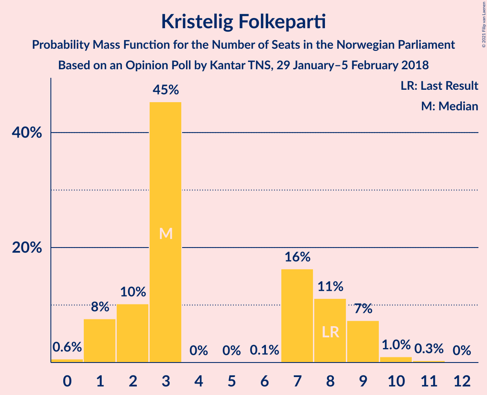

| Number of Seats | Probability | Accumulated | Special Marks |
|:---------------:|:-----------:|:-----------:|:-------------:|
| 0 | 0.6% | 100% |  |
| 1 | 8% | 99.4% |  |
| 2 | 10% | 92% |  |
| 3 | 45% | 82% | Median |
| 4 | 0% | 36% |  |
| 5 | 0% | 36% |  |
| 6 | 0.1% | 36% |  |
| 7 | 16% | 36% |  |
| 8 | 11% | 20% | Last Result |
| 9 | 7% | 9% |  |
| 10 | 1.0% | 1.4% |  |
| 11 | 0.3% | 0.3% |  |
| 12 | 0% | 0% |  |

### Rødt

*For a full overview of the results for this party, see the [Rødt](party-rødt.html) page.*

| Number of Seats | Probability | Accumulated | Special Marks |
|:---------------:|:-----------:|:-----------:|:-------------:|
| 1 | 17% | 100% | Last Result |
| 2 | 55% | 83% | Median |
| 3 | 0% | 28% |  |
| 4 | 0% | 28% |  |
| 5 | 0% | 28% |  |
| 6 | 1.2% | 28% |  |
| 7 | 14% | 26% |  |
| 8 | 7% | 13% |  |
| 9 | 5% | 6% |  |
| 10 | 0.9% | 1.0% |  |
| 11 | 0.1% | 0.2% |  |
| 12 | 0% | 0% |  |

### Miljøpartiet De Grønne

*For a full overview of the results for this party, see the [Miljøpartiet De Grønne](party-miljøpartietdegrønne.html) page.*

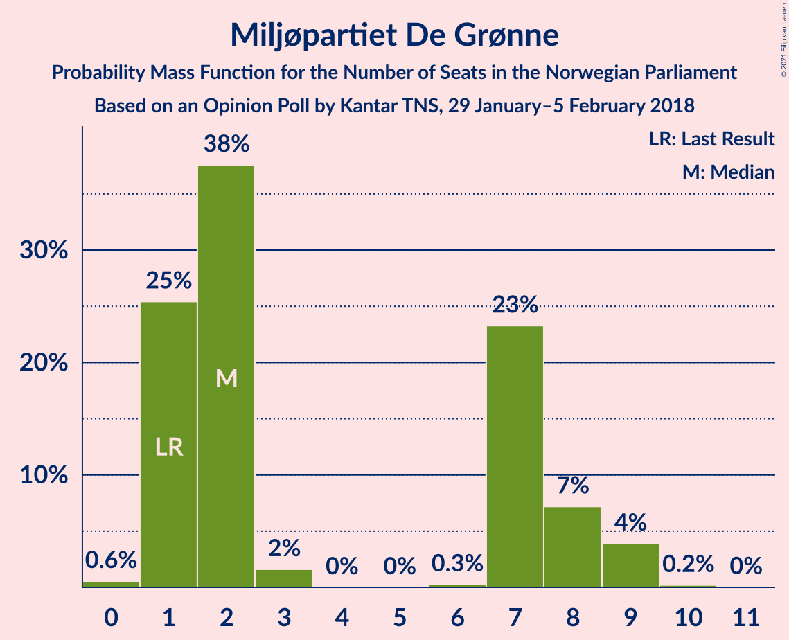

| Number of Seats | Probability | Accumulated | Special Marks |
|:---------------:|:-----------:|:-----------:|:-------------:|
| 0 | 0.6% | 100% |  |
| 1 | 25% | 99.4% | Last Result |
| 2 | 38% | 74% | Median |
| 3 | 2% | 36% |  |
| 4 | 0% | 35% |  |
| 5 | 0% | 35% |  |
| 6 | 0.3% | 35% |  |
| 7 | 23% | 35% |  |
| 8 | 7% | 11% |  |
| 9 | 4% | 4% |  |
| 10 | 0.2% | 0.2% |  |
| 11 | 0% | 0% |  |

## Coalitions

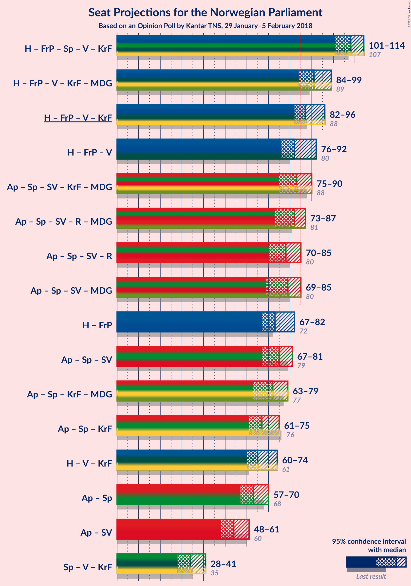

### Confidence Intervals

| Coalition | Last Result | Median | Majority? | 80% Confidence Interval | 90% Confidence Interval | 95% Confidence Interval | 99% Confidence Interval |
|:---------:|:-----------:|:------:|:---------:|:-----------------------:|:-----------------------:|:-----------------------:|:-----------------------:|
| Høyre – Fremskrittspartiet – Senterpartiet – Venstre – Kristelig Folkeparti | 107 | 108 | 100% | 104–113 | 102–114 | 101–114 | 98–117 |
| Høyre – Fremskrittspartiet – Venstre – Kristelig Folkeparti – Miljøpartiet De Grønne | 89 | 91 | 96% | 86–96 | 85–98 | 84–99 | 81–99 |
| Høyre – Fremskrittspartiet – Venstre – Kristelig Folkeparti | 88 | 87 | 74% | 84–93 | 82–95 | 82–96 | 79–97 |
| Høyre – Fremskrittspartiet – Venstre | 80 | 82 | 34% | 80–87 | 78–89 | 76–92 | 74–93 |
| Arbeiderpartiet – Senterpartiet – Sosialistisk Venstreparti – Kristelig Folkeparti – Miljøpartiet De Grønne | 88 | 83 | 40% | 76–86 | 75–88 | 75–90 | 73–91 |
| Arbeiderpartiet – Senterpartiet – Sosialistisk Venstreparti – Rødt – Miljøpartiet De Grønne | 81 | 82 | 26% | 76–85 | 74–87 | 73–87 | 72–90 |
| Arbeiderpartiet – Senterpartiet – Sosialistisk Venstreparti – Rødt | 80 | 78 | 4% | 73–83 | 71–84 | 70–85 | 70–88 |
| Arbeiderpartiet – Senterpartiet – Sosialistisk Venstreparti – Miljøpartiet De Grønne | 80 | 79 | 3% | 71–83 | 69–83 | 69–85 | 69–87 |
| Høyre – Fremskrittspartiet | 72 | 73 | 0.1% | 69–77 | 68–78 | 67–82 | 64–83 |
| Arbeiderpartiet – Senterpartiet – Sosialistisk Venstreparti | 79 | 75 | 0.1% | 69–81 | 67–81 | 67–81 | 66–83 |
| Arbeiderpartiet – Senterpartiet – Kristelig Folkeparti – Miljøpartiet De Grønne | 77 | 72 | 0% | 66–75 | 65–78 | 63–79 | 61–82 |
| Arbeiderpartiet – Senterpartiet – Kristelig Folkeparti | 76 | 67 | 0% | 64–72 | 62–73 | 61–75 | 59–77 |
| Høyre – Venstre – Kristelig Folkeparti | 61 | 65 | 0% | 63–72 | 62–74 | 60–74 | 57–78 |
| Arbeiderpartiet – Senterpartiet | 68 | 63 | 0% | 58–67 | 57–68 | 57–70 | 56–72 |
| Arbeiderpartiet – Sosialistisk Venstreparti | 60 | 54 | 0% | 51–59 | 49–60 | 48–61 | 46–61 |
| Senterpartiet – Venstre – Kristelig Folkeparti | 35 | 34 | 0% | 31–38 | 31–40 | 28–41 | 27–44 |

### Høyre – Fremskrittspartiet – Senterpartiet – Venstre – Kristelig Folkeparti

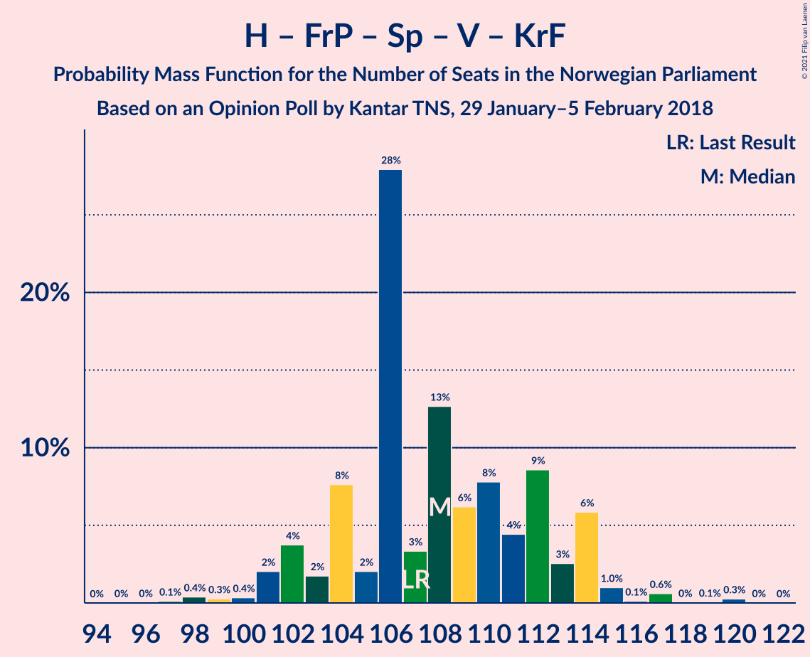

| Number of Seats | Probability | Accumulated | Special Marks |
|:---------------:|:-----------:|:-----------:|:-------------:|
| 94 | 0% | 100% |  |
| 95 | 0% | 99.9% |  |
| 96 | 0% | 99.9% |  |
| 97 | 0.1% | 99.9% |  |
| 98 | 0.4% | 99.8% |  |
| 99 | 0.3% | 99.4% |  |
| 100 | 0.4% | 99.1% |  |
| 101 | 2% | 98.8% |  |
| 102 | 4% | 97% |  |
| 103 | 2% | 93% |  |
| 104 | 8% | 91% |  |
| 105 | 2% | 84% |  |
| 106 | 28% | 82% |  |
| 107 | 3% | 54% | Last Result, Median |
| 108 | 13% | 50% |  |
| 109 | 6% | 38% |  |
| 110 | 8% | 31% |  |
| 111 | 4% | 24% |  |
| 112 | 9% | 19% |  |
| 113 | 3% | 11% |  |
| 114 | 6% | 8% |  |
| 115 | 1.0% | 2% |  |
| 116 | 0.1% | 1.1% |  |
| 117 | 0.6% | 1.0% |  |
| 118 | 0% | 0.4% |  |
| 119 | 0.1% | 0.4% |  |
| 120 | 0.3% | 0.3% |  |
| 121 | 0% | 0% |  |

### Høyre – Fremskrittspartiet – Venstre – Kristelig Folkeparti – Miljøpartiet De Grønne

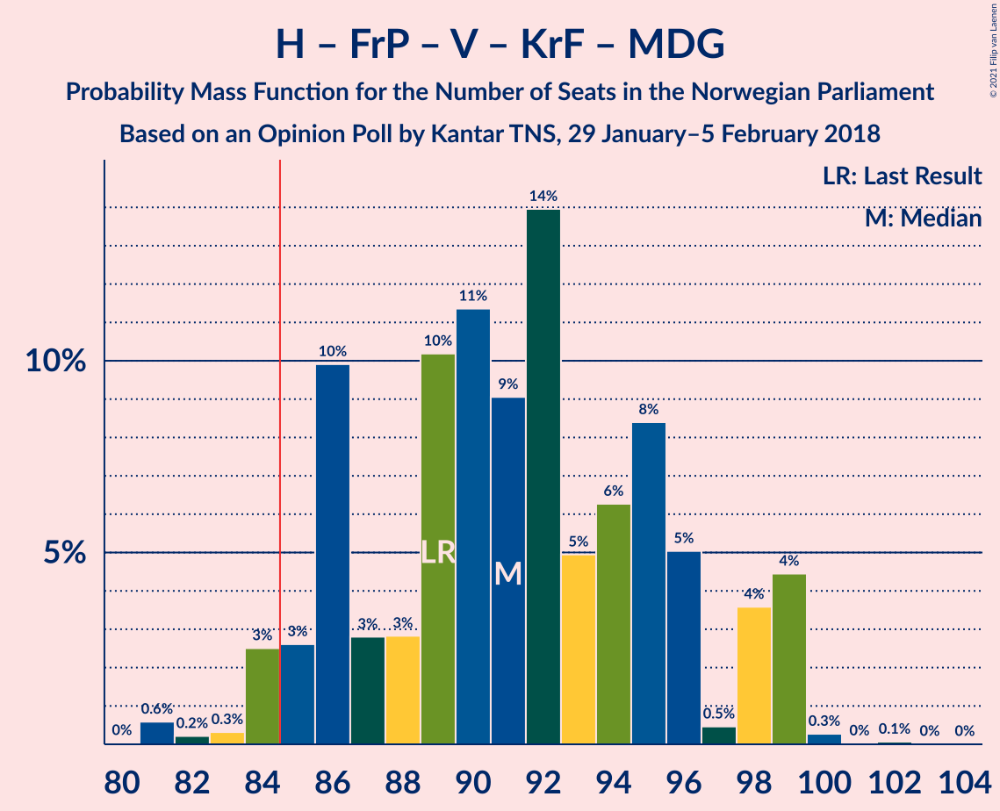

| Number of Seats | Probability | Accumulated | Special Marks |
|:---------------:|:-----------:|:-----------:|:-------------:|
| 80 | 0% | 100% |  |
| 81 | 0.6% | 99.9% |  |
| 82 | 0.2% | 99.3% |  |
| 83 | 0.3% | 99.1% |  |
| 84 | 3% | 98.8% |  |
| 85 | 3% | 96% | Majority |
| 86 | 10% | 94% |  |
| 87 | 3% | 84% |  |
| 88 | 3% | 81% |  |
| 89 | 10% | 78% | Last Result, Median |
| 90 | 11% | 68% |  |
| 91 | 9% | 57% |  |
| 92 | 14% | 48% |  |
| 93 | 5% | 34% |  |
| 94 | 6% | 29% |  |
| 95 | 8% | 22% |  |
| 96 | 5% | 14% |  |
| 97 | 0.5% | 9% |  |
| 98 | 4% | 8% |  |
| 99 | 4% | 5% |  |
| 100 | 0.3% | 0.4% |  |
| 101 | 0% | 0.1% |  |
| 102 | 0.1% | 0.1% |  |
| 103 | 0% | 0% |  |

### Høyre – Fremskrittspartiet – Venstre – Kristelig Folkeparti

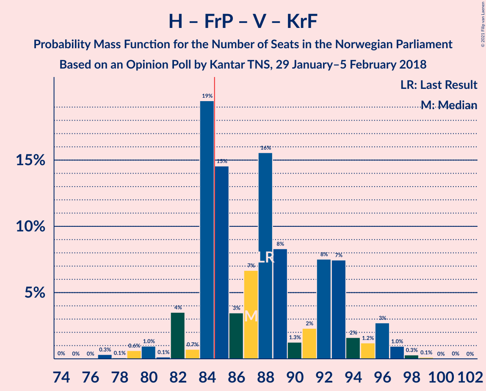

| Number of Seats | Probability | Accumulated | Special Marks |
|:---------------:|:-----------:|:-----------:|:-------------:|
| 75 | 0% | 100% |  |
| 76 | 0% | 99.9% |  |
| 77 | 0.3% | 99.9% |  |
| 78 | 0.1% | 99.6% |  |
| 79 | 0.6% | 99.5% |  |
| 80 | 1.0% | 98.9% |  |
| 81 | 0.1% | 98% |  |
| 82 | 4% | 98% |  |
| 83 | 0.7% | 94% |  |
| 84 | 19% | 94% |  |
| 85 | 15% | 74% | Majority |
| 86 | 3% | 60% |  |
| 87 | 7% | 56% | Median |
| 88 | 16% | 49% | Last Result |
| 89 | 8% | 34% |  |
| 90 | 1.3% | 25% |  |
| 91 | 2% | 24% |  |
| 92 | 8% | 22% |  |
| 93 | 7% | 14% |  |
| 94 | 2% | 7% |  |
| 95 | 1.2% | 5% |  |
| 96 | 3% | 4% |  |
| 97 | 1.0% | 1.4% |  |
| 98 | 0.3% | 0.5% |  |
| 99 | 0.1% | 0.2% |  |
| 100 | 0% | 0.1% |  |
| 101 | 0% | 0% |  |

### Høyre – Fremskrittspartiet – Venstre

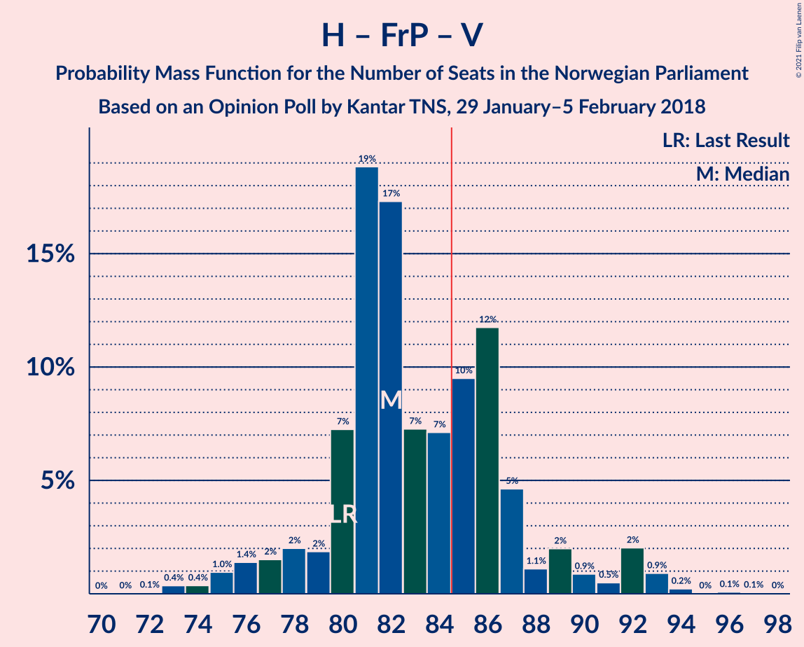

| Number of Seats | Probability | Accumulated | Special Marks |
|:---------------:|:-----------:|:-----------:|:-------------:|
| 72 | 0.1% | 100% |  |
| 73 | 0.4% | 99.9% |  |
| 74 | 0.4% | 99.6% |  |
| 75 | 1.0% | 99.2% |  |
| 76 | 1.4% | 98% |  |
| 77 | 2% | 97% |  |
| 78 | 2% | 95% |  |
| 79 | 2% | 93% |  |
| 80 | 7% | 91% | Last Result |
| 81 | 19% | 84% |  |
| 82 | 17% | 65% |  |
| 83 | 7% | 48% |  |
| 84 | 7% | 41% | Median |
| 85 | 10% | 34% | Majority |
| 86 | 12% | 24% |  |
| 87 | 5% | 12% |  |
| 88 | 1.1% | 8% |  |
| 89 | 2% | 7% |  |
| 90 | 0.9% | 5% |  |
| 91 | 0.5% | 4% |  |
| 92 | 2% | 3% |  |
| 93 | 0.9% | 1.3% |  |
| 94 | 0.2% | 0.4% |  |
| 95 | 0% | 0.2% |  |
| 96 | 0.1% | 0.2% |  |
| 97 | 0.1% | 0.1% |  |
| 98 | 0% | 0% |  |

### Arbeiderpartiet – Senterpartiet – Sosialistisk Venstreparti – Kristelig Folkeparti – Miljøpartiet De Grønne

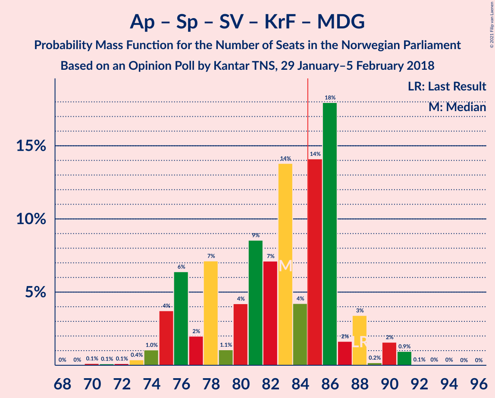

| Number of Seats | Probability | Accumulated | Special Marks |
|:---------------:|:-----------:|:-----------:|:-------------:|
| 69 | 0% | 100% |  |
| 70 | 0.1% | 99.9% |  |
| 71 | 0.1% | 99.8% |  |
| 72 | 0.1% | 99.7% |  |
| 73 | 0.4% | 99.6% |  |
| 74 | 1.0% | 99.2% |  |
| 75 | 4% | 98% |  |
| 76 | 6% | 94% |  |
| 77 | 2% | 88% |  |
| 78 | 7% | 86% |  |
| 79 | 1.1% | 79% | Median |
| 80 | 4% | 78% |  |
| 81 | 9% | 74% |  |
| 82 | 7% | 65% |  |
| 83 | 14% | 58% |  |
| 84 | 4% | 44% |  |
| 85 | 14% | 40% | Majority |
| 86 | 18% | 26% |  |
| 87 | 2% | 8% |  |
| 88 | 3% | 6% | Last Result |
| 89 | 0.2% | 3% |  |
| 90 | 2% | 3% |  |
| 91 | 0.9% | 1.1% |  |
| 92 | 0.1% | 0.2% |  |
| 93 | 0% | 0.1% |  |
| 94 | 0% | 0.1% |  |
| 95 | 0% | 0% |  |

### Arbeiderpartiet – Senterpartiet – Sosialistisk Venstreparti – Rødt – Miljøpartiet De Grønne

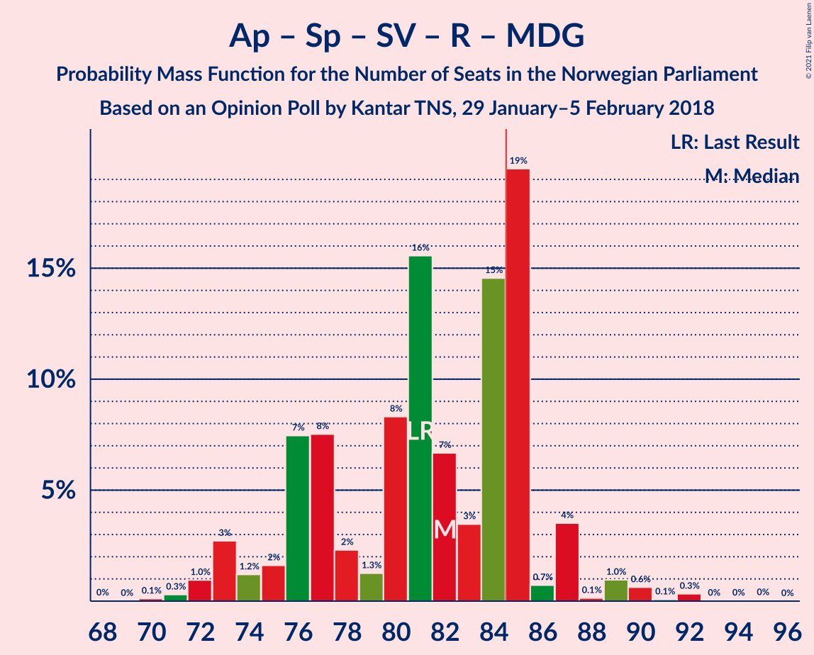

| Number of Seats | Probability | Accumulated | Special Marks |
|:---------------:|:-----------:|:-----------:|:-------------:|
| 69 | 0% | 100% |  |
| 70 | 0.1% | 99.9% |  |
| 71 | 0.3% | 99.8% |  |
| 72 | 1.0% | 99.5% |  |
| 73 | 3% | 98.6% |  |
| 74 | 1.2% | 96% |  |
| 75 | 2% | 95% |  |
| 76 | 7% | 93% |  |
| 77 | 8% | 86% |  |
| 78 | 2% | 78% | Median |
| 79 | 1.3% | 76% |  |
| 80 | 8% | 75% |  |
| 81 | 16% | 66% | Last Result |
| 82 | 7% | 51% |  |
| 83 | 3% | 44% |  |
| 84 | 15% | 40% |  |
| 85 | 19% | 26% | Majority |
| 86 | 0.7% | 6% |  |
| 87 | 4% | 6% |  |
| 88 | 0.1% | 2% |  |
| 89 | 1.0% | 2% |  |
| 90 | 0.6% | 1.1% |  |
| 91 | 0.1% | 0.5% |  |
| 92 | 0.3% | 0.4% |  |
| 93 | 0% | 0.1% |  |
| 94 | 0% | 0.1% |  |
| 95 | 0% | 0% |  |

### Arbeiderpartiet – Senterpartiet – Sosialistisk Venstreparti – Rødt

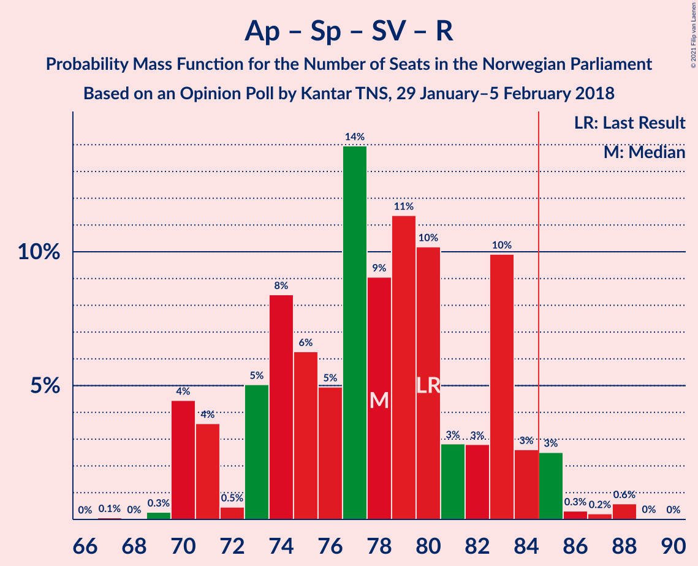

| Number of Seats | Probability | Accumulated | Special Marks |
|:---------------:|:-----------:|:-----------:|:-------------:|
| 67 | 0.1% | 100% |  |
| 68 | 0% | 99.9% |  |
| 69 | 0.3% | 99.9% |  |
| 70 | 4% | 99.6% |  |
| 71 | 4% | 95% |  |
| 72 | 0.5% | 92% |  |
| 73 | 5% | 91% |  |
| 74 | 8% | 86% |  |
| 75 | 6% | 78% |  |
| 76 | 5% | 71% | Median |
| 77 | 14% | 66% |  |
| 78 | 9% | 52% |  |
| 79 | 11% | 43% |  |
| 80 | 10% | 32% | Last Result |
| 81 | 3% | 22% |  |
| 82 | 3% | 19% |  |
| 83 | 10% | 16% |  |
| 84 | 3% | 6% |  |
| 85 | 3% | 4% | Majority |
| 86 | 0.3% | 1.2% |  |
| 87 | 0.2% | 0.9% |  |
| 88 | 0.6% | 0.7% |  |
| 89 | 0% | 0.1% |  |
| 90 | 0% | 0% |  |

### Arbeiderpartiet – Senterpartiet – Sosialistisk Venstreparti – Miljøpartiet De Grønne

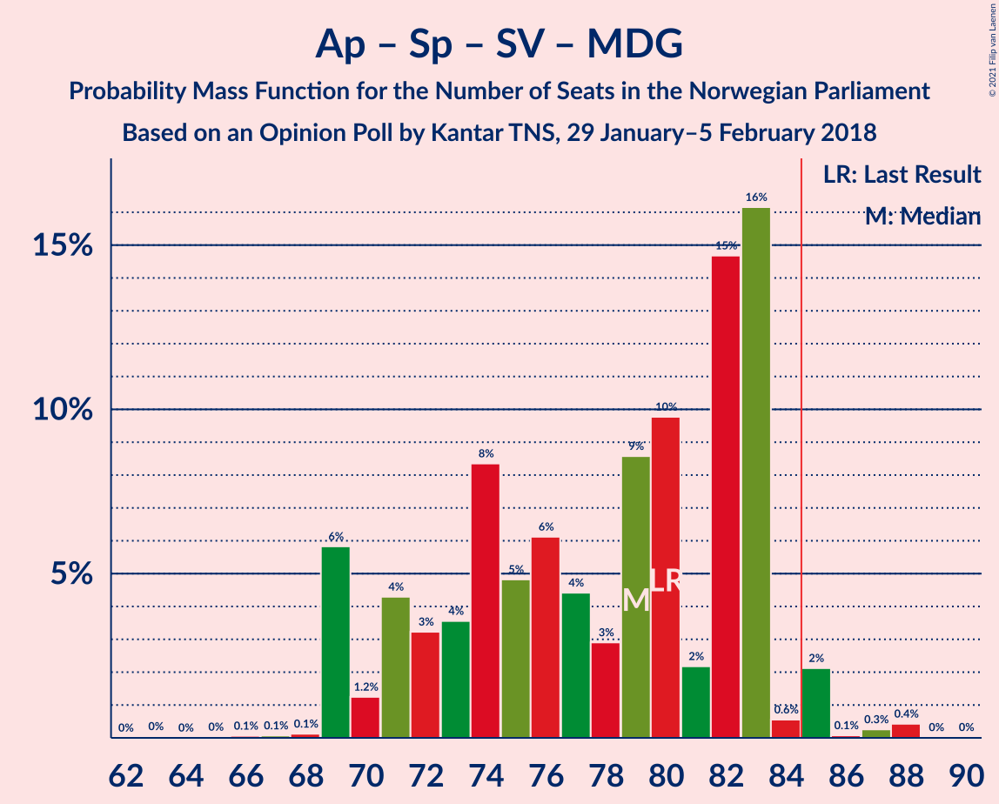

| Number of Seats | Probability | Accumulated | Special Marks |
|:---------------:|:-----------:|:-----------:|:-------------:|
| 63 | 0% | 100% |  |
| 64 | 0% | 99.9% |  |
| 65 | 0% | 99.9% |  |
| 66 | 0.1% | 99.9% |  |
| 67 | 0.1% | 99.9% |  |
| 68 | 0.1% | 99.8% |  |
| 69 | 6% | 99.7% |  |
| 70 | 1.2% | 94% |  |
| 71 | 4% | 93% |  |
| 72 | 3% | 88% |  |
| 73 | 4% | 85% |  |
| 74 | 8% | 81% |  |
| 75 | 5% | 73% |  |
| 76 | 6% | 68% | Median |
| 77 | 4% | 62% |  |
| 78 | 3% | 58% |  |
| 79 | 9% | 55% |  |
| 80 | 10% | 46% | Last Result |
| 81 | 2% | 37% |  |
| 82 | 15% | 34% |  |
| 83 | 16% | 20% |  |
| 84 | 0.6% | 3% |  |
| 85 | 2% | 3% | Majority |
| 86 | 0.1% | 0.8% |  |
| 87 | 0.3% | 0.7% |  |
| 88 | 0.4% | 0.5% |  |
| 89 | 0% | 0% |  |

### Høyre – Fremskrittspartiet

| Number of Seats | Probability | Accumulated | Special Marks |
|:---------------:|:-----------:|:-----------:|:-------------:|
| 62 | 0.2% | 100% |  |
| 63 | 0.2% | 99.8% |  |
| 64 | 0.3% | 99.7% |  |
| 65 | 0.2% | 99.4% |  |
| 66 | 0.7% | 99.1% |  |
| 67 | 2% | 98% |  |
| 68 | 2% | 97% |  |
| 69 | 7% | 94% |  |
| 70 | 3% | 87% |  |
| 71 | 7% | 85% |  |
| 72 | 20% | 78% | Last Result |
| 73 | 12% | 57% |  |
| 74 | 19% | 45% | Median |
| 75 | 10% | 26% |  |
| 76 | 5% | 16% |  |
| 77 | 4% | 11% |  |
| 78 | 2% | 7% |  |
| 79 | 0.6% | 5% |  |
| 80 | 0.4% | 4% |  |
| 81 | 1.3% | 4% |  |
| 82 | 0.9% | 3% |  |
| 83 | 1.4% | 2% |  |
| 84 | 0.1% | 0.2% |  |
| 85 | 0% | 0.1% | Majority |
| 86 | 0.1% | 0.1% |  |
| 87 | 0% | 0% |  |

### Arbeiderpartiet – Senterpartiet – Sosialistisk Venstreparti

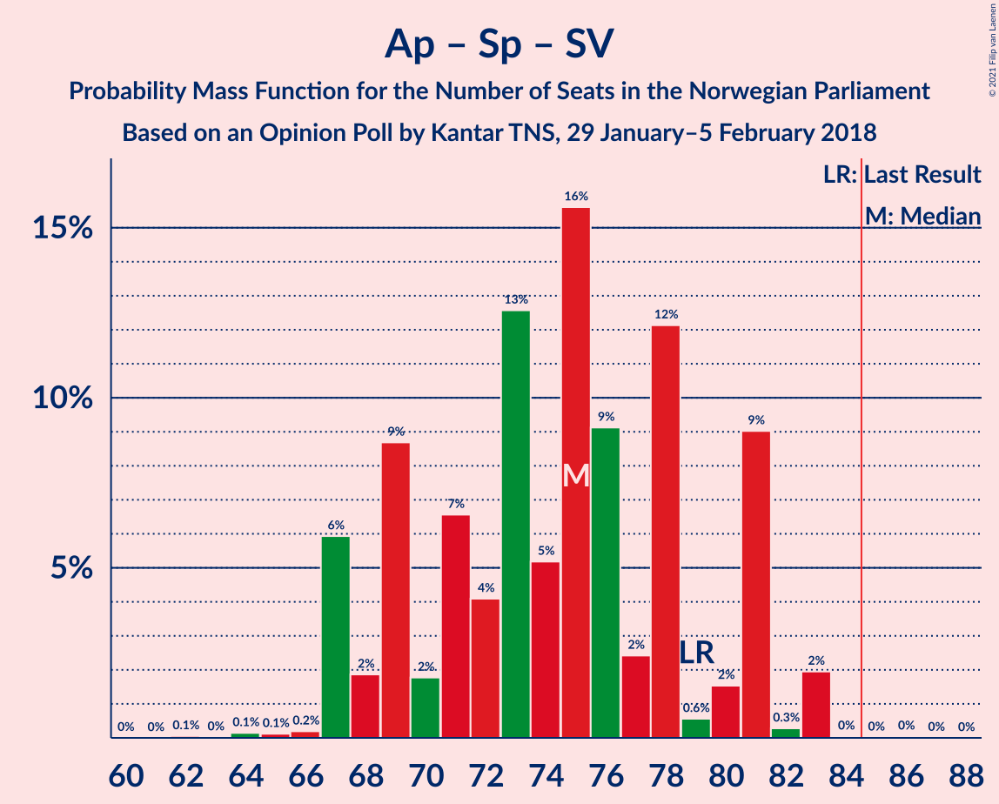

| Number of Seats | Probability | Accumulated | Special Marks |
|:---------------:|:-----------:|:-----------:|:-------------:|
| 62 | 0.1% | 100% |  |
| 63 | 0% | 99.9% |  |
| 64 | 0.1% | 99.9% |  |
| 65 | 0.1% | 99.8% |  |
| 66 | 0.2% | 99.6% |  |
| 67 | 6% | 99.4% |  |
| 68 | 2% | 94% |  |
| 69 | 9% | 92% |  |
| 70 | 2% | 83% |  |
| 71 | 7% | 81% |  |
| 72 | 4% | 75% |  |
| 73 | 13% | 71% |  |
| 74 | 5% | 58% | Median |
| 75 | 16% | 53% |  |
| 76 | 9% | 37% |  |
| 77 | 2% | 28% |  |
| 78 | 12% | 26% |  |
| 79 | 0.6% | 13% | Last Result |
| 80 | 2% | 13% |  |
| 81 | 9% | 11% |  |
| 82 | 0.3% | 2% |  |
| 83 | 2% | 2% |  |
| 84 | 0% | 0.1% |  |
| 85 | 0% | 0.1% | Majority |
| 86 | 0% | 0.1% |  |
| 87 | 0% | 0% |  |

### Arbeiderpartiet – Senterpartiet – Kristelig Folkeparti – Miljøpartiet De Grønne

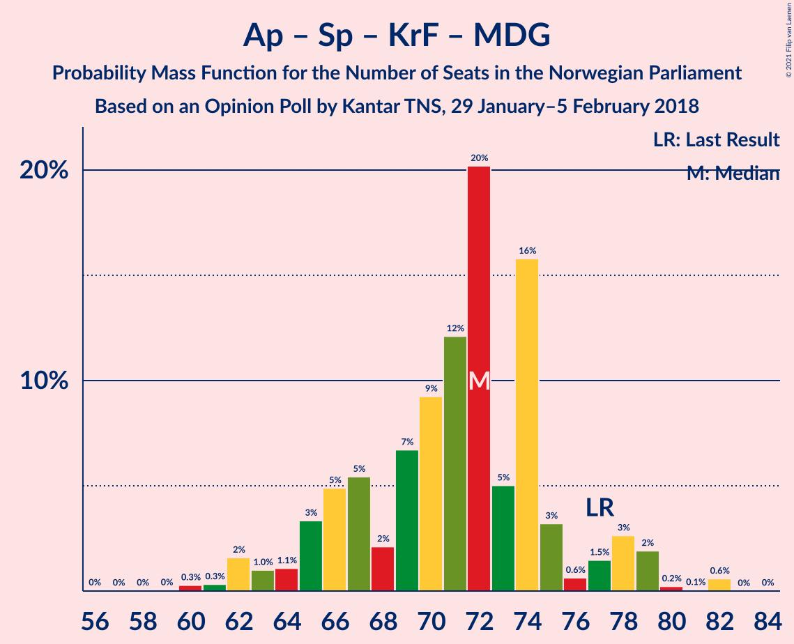

| Number of Seats | Probability | Accumulated | Special Marks |
|:---------------:|:-----------:|:-----------:|:-------------:|
| 57 | 0% | 100% |  |
| 58 | 0% | 99.9% |  |
| 59 | 0% | 99.9% |  |
| 60 | 0.3% | 99.9% |  |
| 61 | 0.3% | 99.6% |  |
| 62 | 2% | 99.3% |  |
| 63 | 1.0% | 98% |  |
| 64 | 1.1% | 97% |  |
| 65 | 3% | 96% |  |
| 66 | 5% | 92% |  |
| 67 | 5% | 87% |  |
| 68 | 2% | 82% | Median |
| 69 | 7% | 80% |  |
| 70 | 9% | 73% |  |
| 71 | 12% | 64% |  |
| 72 | 20% | 52% |  |
| 73 | 5% | 32% |  |
| 74 | 16% | 27% |  |
| 75 | 3% | 11% |  |
| 76 | 0.6% | 8% |  |
| 77 | 1.5% | 7% | Last Result |
| 78 | 3% | 5% |  |
| 79 | 2% | 3% |  |
| 80 | 0.2% | 0.9% |  |
| 81 | 0.1% | 0.7% |  |
| 82 | 0.6% | 0.6% |  |
| 83 | 0% | 0% |  |

### Arbeiderpartiet – Senterpartiet – Kristelig Folkeparti

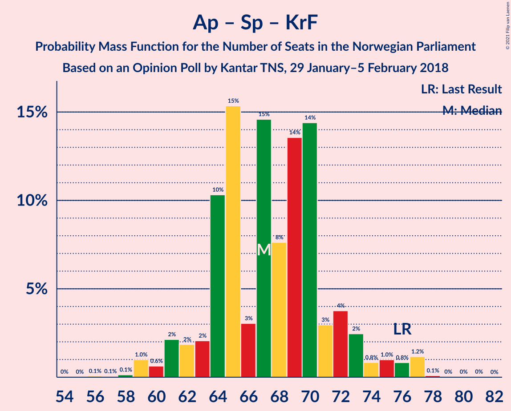

| Number of Seats | Probability | Accumulated | Special Marks |
|:---------------:|:-----------:|:-----------:|:-------------:|
| 56 | 0.1% | 100% |  |
| 57 | 0.1% | 99.9% |  |
| 58 | 0.1% | 99.8% |  |
| 59 | 1.0% | 99.7% |  |
| 60 | 0.6% | 98.7% |  |
| 61 | 2% | 98% |  |
| 62 | 2% | 96% |  |
| 63 | 2% | 94% |  |
| 64 | 10% | 92% |  |
| 65 | 15% | 82% |  |
| 66 | 3% | 66% | Median |
| 67 | 15% | 63% |  |
| 68 | 8% | 49% |  |
| 69 | 14% | 41% |  |
| 70 | 14% | 28% |  |
| 71 | 3% | 13% |  |
| 72 | 4% | 10% |  |
| 73 | 2% | 6% |  |
| 74 | 0.8% | 4% |  |
| 75 | 1.0% | 3% |  |
| 76 | 0.8% | 2% | Last Result |
| 77 | 1.2% | 1.3% |  |
| 78 | 0.1% | 0.2% |  |
| 79 | 0% | 0.1% |  |
| 80 | 0% | 0.1% |  |
| 81 | 0% | 0% |  |

### Høyre – Venstre – Kristelig Folkeparti

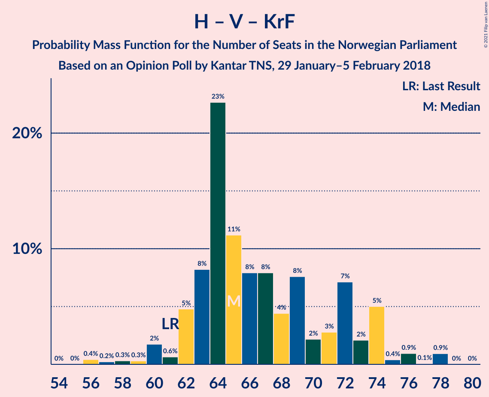

| Number of Seats | Probability | Accumulated | Special Marks |
|:---------------:|:-----------:|:-----------:|:-------------:|
| 56 | 0.4% | 100% |  |
| 57 | 0.2% | 99.5% |  |
| 58 | 0.3% | 99.3% |  |
| 59 | 0.3% | 99.0% |  |
| 60 | 2% | 98.7% |  |
| 61 | 0.6% | 97% | Last Result |
| 62 | 5% | 96% |  |
| 63 | 8% | 92% |  |
| 64 | 23% | 83% |  |
| 65 | 11% | 61% |  |
| 66 | 8% | 49% | Median |
| 67 | 8% | 42% |  |
| 68 | 4% | 34% |  |
| 69 | 8% | 29% |  |
| 70 | 2% | 22% |  |
| 71 | 3% | 19% |  |
| 72 | 7% | 17% |  |
| 73 | 2% | 9% |  |
| 74 | 5% | 7% |  |
| 75 | 0.4% | 2% |  |
| 76 | 0.9% | 2% |  |
| 77 | 0.1% | 1.0% |  |
| 78 | 0.9% | 1.0% |  |
| 79 | 0% | 0% |  |

### Arbeiderpartiet – Senterpartiet

| Number of Seats | Probability | Accumulated | Special Marks |
|:---------------:|:-----------:|:-----------:|:-------------:|
| 53 | 0% | 100% |  |
| 54 | 0.1% | 99.9% |  |
| 55 | 0.1% | 99.8% |  |
| 56 | 1.4% | 99.7% |  |
| 57 | 3% | 98% |  |
| 58 | 11% | 95% |  |
| 59 | 3% | 84% |  |
| 60 | 5% | 82% |  |
| 61 | 13% | 77% |  |
| 62 | 10% | 64% |  |
| 63 | 5% | 53% | Median |
| 64 | 16% | 48% |  |
| 65 | 4% | 32% |  |
| 66 | 9% | 28% |  |
| 67 | 12% | 20% |  |
| 68 | 3% | 8% | Last Result |
| 69 | 2% | 4% |  |
| 70 | 0.2% | 3% |  |
| 71 | 0.3% | 2% |  |
| 72 | 2% | 2% |  |
| 73 | 0% | 0.1% |  |
| 74 | 0.1% | 0.1% |  |
| 75 | 0% | 0% |  |

### Arbeiderpartiet – Sosialistisk Venstreparti

| Number of Seats | Probability | Accumulated | Special Marks |
|:---------------:|:-----------:|:-----------:|:-------------:|
| 44 | 0.1% | 100% |  |
| 45 | 0% | 99.9% |  |
| 46 | 0.4% | 99.8% |  |
| 47 | 0.5% | 99.5% |  |
| 48 | 2% | 98.9% |  |
| 49 | 5% | 97% |  |
| 50 | 0.9% | 92% |  |
| 51 | 11% | 91% |  |
| 52 | 9% | 80% |  |
| 53 | 14% | 71% |  |
| 54 | 22% | 57% | Median |
| 55 | 3% | 35% |  |
| 56 | 13% | 31% |  |
| 57 | 2% | 19% |  |
| 58 | 2% | 17% |  |
| 59 | 10% | 15% |  |
| 60 | 0.8% | 5% | Last Result |
| 61 | 4% | 5% |  |
| 62 | 0.3% | 0.4% |  |
| 63 | 0% | 0.2% |  |
| 64 | 0.1% | 0.1% |  |
| 65 | 0% | 0% |  |

### Senterpartiet – Venstre – Kristelig Folkeparti

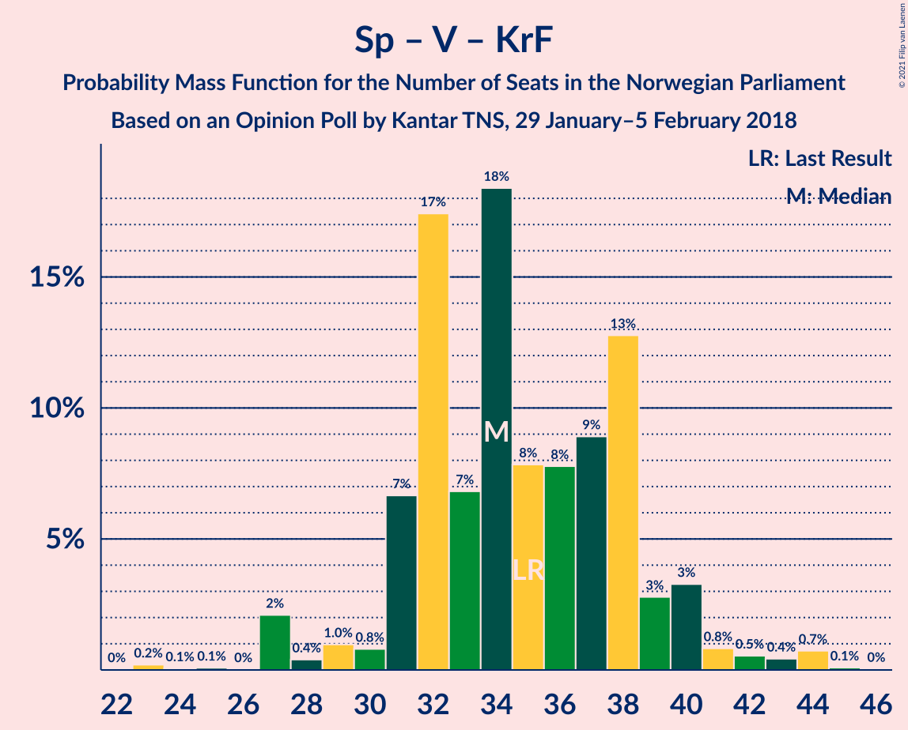

| Number of Seats | Probability | Accumulated | Special Marks |
|:---------------:|:-----------:|:-----------:|:-------------:|
| 23 | 0.2% | 100% |  |
| 24 | 0.1% | 99.8% |  |
| 25 | 0.1% | 99.7% |  |
| 26 | 0% | 99.6% |  |
| 27 | 2% | 99.6% |  |
| 28 | 0.4% | 98% |  |
| 29 | 1.0% | 97% |  |
| 30 | 0.8% | 96% |  |
| 31 | 7% | 95% |  |
| 32 | 17% | 89% |  |
| 33 | 7% | 71% | Median |
| 34 | 18% | 64% |  |
| 35 | 8% | 46% | Last Result |
| 36 | 8% | 38% |  |
| 37 | 9% | 30% |  |
| 38 | 13% | 22% |  |
| 39 | 3% | 9% |  |
| 40 | 3% | 6% |  |
| 41 | 0.8% | 3% |  |
| 42 | 0.5% | 2% |  |
| 43 | 0.4% | 1.3% |  |
| 44 | 0.7% | 0.9% |  |
| 45 | 0.1% | 0.1% |  |
| 46 | 0% | 0% |  |

## Technical Information

### Opinion Poll

+ **Polling firm:** Kantar TNS
+ **Commissioner(s):** —
+ **Fieldwork period:** 29 January–5 February 2018

### Calculations

+ **Sample size:** 795
+ **Simulations done:** 131,072
+ **Error estimate:** 1.08%

