# Opinion Poll by Kantar TNS, 26 February–3 March 2018

<a href="#voting-intentions">Voting Intentions</a> | <a href="#seats">Seats</a> | <a href="#coalitions">Coalitions</a> | <a href="#technical-information">Technical Information</a>

## Voting Intentions

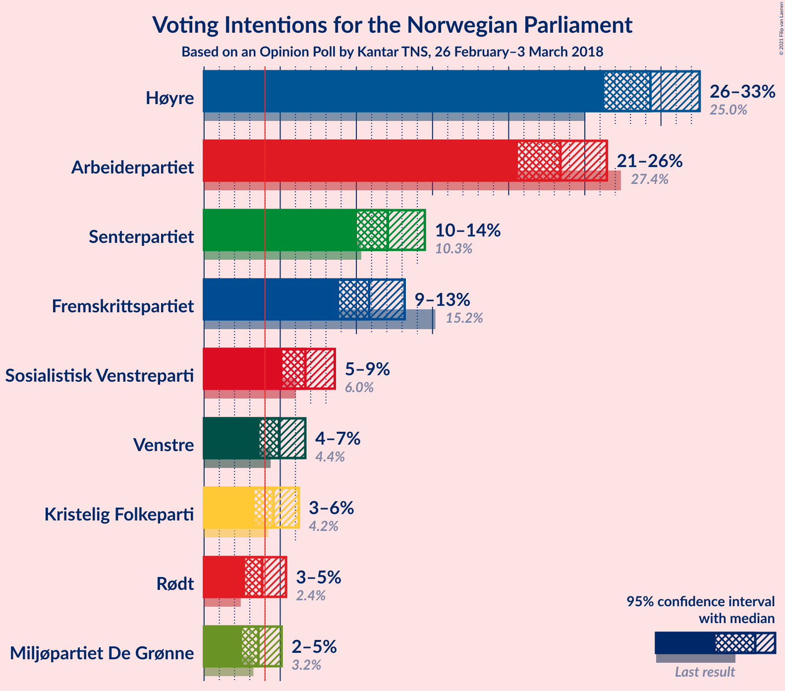

### Confidence Intervals

| Party | Last Result | Poll Result | 80% Confidence Interval | 90% Confidence Interval | 95% Confidence Interval | 99% Confidence Interval |
|:-----:|:-----------:|:-----------:|:-----------------------:|:-----------------------:|:-----------------------:|:-----------------------:|
| Høyre | 25.0% | 29.3% | 27.3–31.4% |26.8–32.0% |26.3–32.5% |25.3–33.6% |
| Arbeiderpartiet | 27.4% | 23.4% | 21.6–25.4% |21.0–26.0% |20.6–26.4% |19.8–27.4% |
| Senterpartiet | 10.3% | 12.1% | 10.7–13.7% |10.3–14.1% |10.0–14.5% |9.4–15.3% |
| Fremskrittspartiet | 15.2% | 10.8% | 9.5–12.4% |9.2–12.8% |8.9–13.2% |8.3–13.9% |
| Sosialistisk Venstreparti | 6.0% | 6.7% | 5.7–7.9% |5.4–8.3% |5.1–8.6% |4.7–9.2% |
| Venstre | 4.4% | 4.9% | 4.1–6.1% |3.8–6.4% |3.6–6.6% |3.3–7.2% |
| Kristelig Folkeparti | 4.2% | 4.6% | 3.7–5.6% |3.5–5.9% |3.3–6.2% |3.0–6.8% |
| Rødt | 2.4% | 3.8% | 3.1–4.8% |2.9–5.1% |2.7–5.4% |2.4–5.9% |
| Miljøpartiet De Grønne | 3.2% | 3.6% | 2.9–4.6% |2.7–4.8% |2.5–5.1% |2.2–5.6% |

*Note:* The poll result column reflects the actual value used in the calculations. Published results may vary slightly, and in addition be rounded to fewer digits.

## Seats

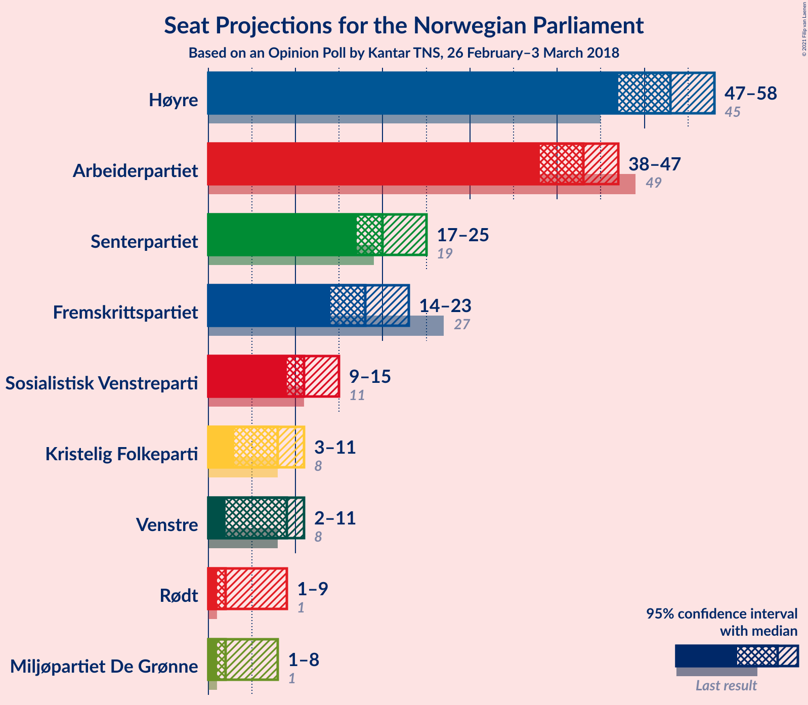

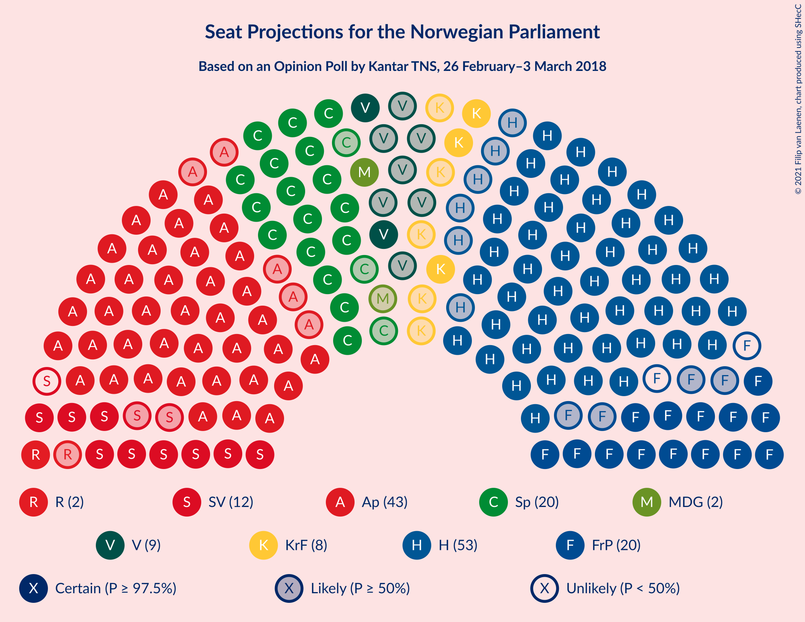

### Confidence Intervals

| Party | Last Result | Median | 80% Confidence Interval | 90% Confidence Interval | 95% Confidence Interval | 99% Confidence Interval |
|:-----:|:-----------:|:------:|:-----------------------:|:-----------------------:|:-----------------------:|:-----------------------:|
| <a href="#høyre">Høyre</a> | 45 | 53 | 48–57 |48–58 |47–58 |45–60 |
| <a href="#arbeiderpartiet">Arbeiderpartiet</a> | 49 | 43 | 40–45 |39–46 |38–47 |36–49 |
| <a href="#senterpartiet">Senterpartiet</a> | 19 | 20 | 18–23 |18–24 |17–25 |17–27 |
| <a href="#fremskrittspartiet">Fremskrittspartiet</a> | 27 | 18 | 16–22 |15–22 |14–23 |14–25 |
| <a href="#sosialistisk-venstreparti">Sosialistisk Venstreparti</a> | 11 | 11 | 10–14 |9–14 |9–15 |8–16 |
| <a href="#venstre">Venstre</a> | 8 | 9 | 7–10 |2–11 |2–11 |2–12 |
| <a href="#kristelig-folkeparti">Kristelig Folkeparti</a> | 8 | 8 | 3–9 |3–10 |3–11 |1–12 |
| <a href="#rødt">Rødt</a> | 1 | 2 | 2–8 |2–8 |1–9 |1–10 |
| <a href="#miljøpartiet-de-grønne">Miljøpartiet De Grønne</a> | 1 | 2 | 1–8 |1–8 |1–8 |1–9 |

### Høyre

*For a full overview of the results for this party, see the [Høyre](party-høyre.html) page.*

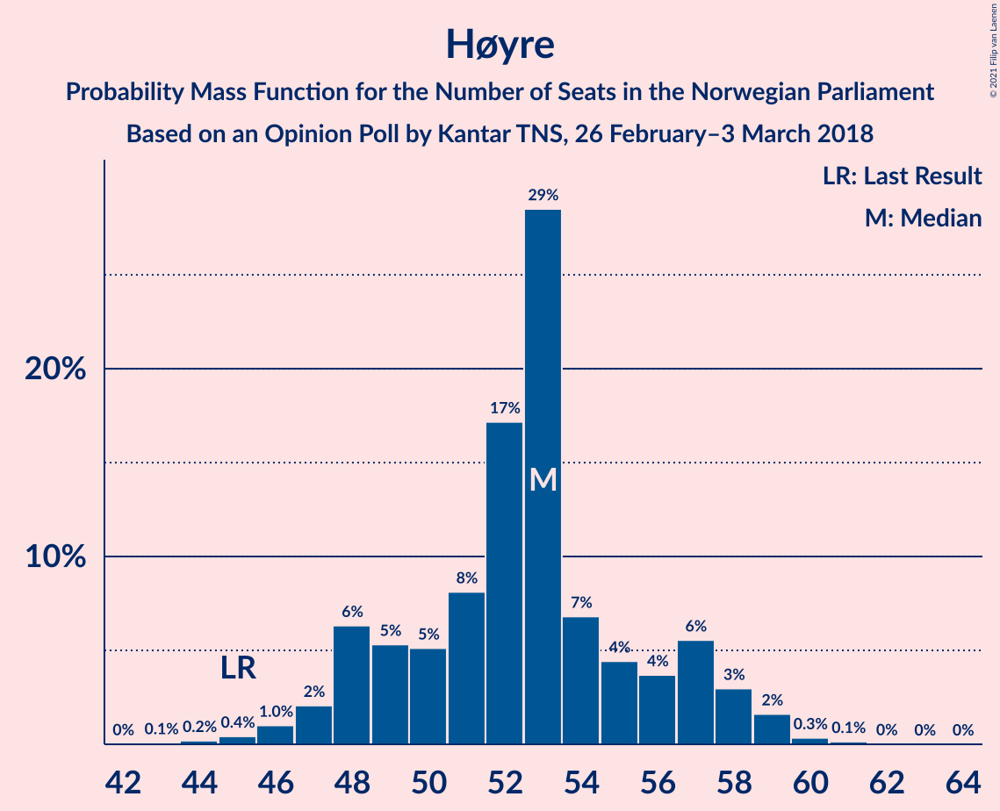

| Number of Seats | Probability | Accumulated | Special Marks |
|:---------------:|:-----------:|:-----------:|:-------------:|
| 42 | 0% | 100% |  |
| 43 | 0.1% | 99.9% |  |
| 44 | 0.2% | 99.9% |  |
| 45 | 0.4% | 99.7% | Last Result |
| 46 | 1.0% | 99.2% |  |
| 47 | 2% | 98% |  |
| 48 | 6% | 96% |  |
| 49 | 5% | 90% |  |
| 50 | 5% | 85% |  |
| 51 | 8% | 79% |  |
| 52 | 17% | 71% |  |
| 53 | 29% | 54% | Median |
| 54 | 7% | 26% |  |
| 55 | 4% | 19% |  |
| 56 | 4% | 14% |  |
| 57 | 6% | 11% |  |
| 58 | 3% | 5% |  |
| 59 | 2% | 2% |  |
| 60 | 0.3% | 0.5% |  |
| 61 | 0.1% | 0.2% |  |
| 62 | 0% | 0.1% |  |
| 63 | 0% | 0% |  |

### Arbeiderpartiet

*For a full overview of the results for this party, see the [Arbeiderpartiet](party-arbeiderpartiet.html) page.*

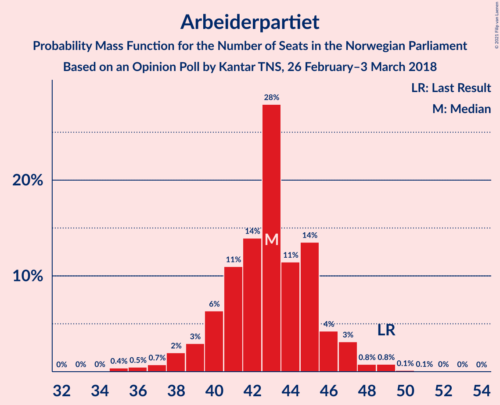

| Number of Seats | Probability | Accumulated | Special Marks |
|:---------------:|:-----------:|:-----------:|:-------------:|
| 33 | 0% | 100% |  |
| 34 | 0% | 99.9% |  |
| 35 | 0.4% | 99.9% |  |
| 36 | 0.5% | 99.5% |  |
| 37 | 0.7% | 99.0% |  |
| 38 | 2% | 98% |  |
| 39 | 3% | 96% |  |
| 40 | 6% | 93% |  |
| 41 | 11% | 87% |  |
| 42 | 14% | 76% |  |
| 43 | 28% | 62% | Median |
| 44 | 11% | 34% |  |
| 45 | 14% | 23% |  |
| 46 | 4% | 9% |  |
| 47 | 3% | 5% |  |
| 48 | 0.8% | 2% |  |
| 49 | 0.8% | 1.1% | Last Result |
| 50 | 0.1% | 0.3% |  |
| 51 | 0.1% | 0.2% |  |
| 52 | 0% | 0.1% |  |
| 53 | 0% | 0% |  |

### Senterpartiet

*For a full overview of the results for this party, see the [Senterpartiet](party-senterpartiet.html) page.*

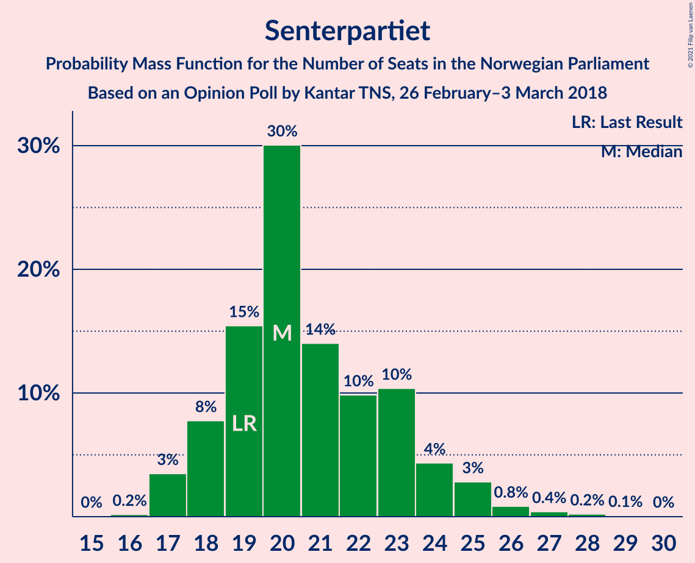

| Number of Seats | Probability | Accumulated | Special Marks |
|:---------------:|:-----------:|:-----------:|:-------------:|
| 15 | 0% | 100% |  |
| 16 | 0.2% | 99.9% |  |
| 17 | 3% | 99.8% |  |
| 18 | 8% | 96% |  |
| 19 | 15% | 89% | Last Result |
| 20 | 30% | 73% | Median |
| 21 | 14% | 43% |  |
| 22 | 10% | 29% |  |
| 23 | 10% | 19% |  |
| 24 | 4% | 9% |  |
| 25 | 3% | 4% |  |
| 26 | 0.8% | 2% |  |
| 27 | 0.4% | 0.8% |  |
| 28 | 0.2% | 0.4% |  |
| 29 | 0.1% | 0.1% |  |
| 30 | 0% | 0% |  |

### Fremskrittspartiet

*For a full overview of the results for this party, see the [Fremskrittspartiet](party-fremskrittspartiet.html) page.*

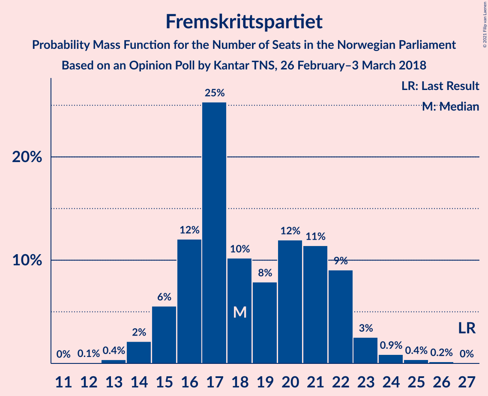

| Number of Seats | Probability | Accumulated | Special Marks |
|:---------------:|:-----------:|:-----------:|:-------------:|
| 12 | 0.1% | 100% |  |
| 13 | 0.4% | 99.9% |  |
| 14 | 2% | 99.5% |  |
| 15 | 6% | 97% |  |
| 16 | 12% | 92% |  |
| 17 | 25% | 80% |  |
| 18 | 10% | 55% | Median |
| 19 | 8% | 44% |  |
| 20 | 12% | 36% |  |
| 21 | 11% | 24% |  |
| 22 | 9% | 13% |  |
| 23 | 3% | 4% |  |
| 24 | 0.9% | 1.5% |  |
| 25 | 0.4% | 0.6% |  |
| 26 | 0.2% | 0.2% |  |
| 27 | 0% | 0% | Last Result |

### Sosialistisk Venstreparti

*For a full overview of the results for this party, see the [Sosialistisk Venstreparti](party-sosialistiskvenstreparti.html) page.*

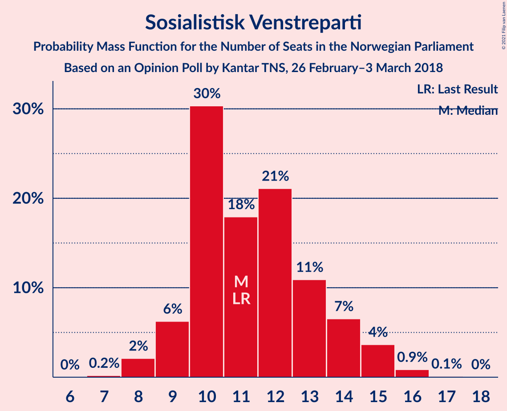

| Number of Seats | Probability | Accumulated | Special Marks |
|:---------------:|:-----------:|:-----------:|:-------------:|
| 7 | 0.2% | 100% |  |
| 8 | 2% | 99.8% |  |
| 9 | 6% | 98% |  |
| 10 | 30% | 91% |  |
| 11 | 18% | 61% | Last Result, Median |
| 12 | 21% | 43% |  |
| 13 | 11% | 22% |  |
| 14 | 7% | 11% |  |
| 15 | 4% | 5% |  |
| 16 | 0.9% | 1.0% |  |
| 17 | 0.1% | 0.2% |  |
| 18 | 0% | 0% |  |

### Venstre

*For a full overview of the results for this party, see the [Venstre](party-venstre.html) page.*

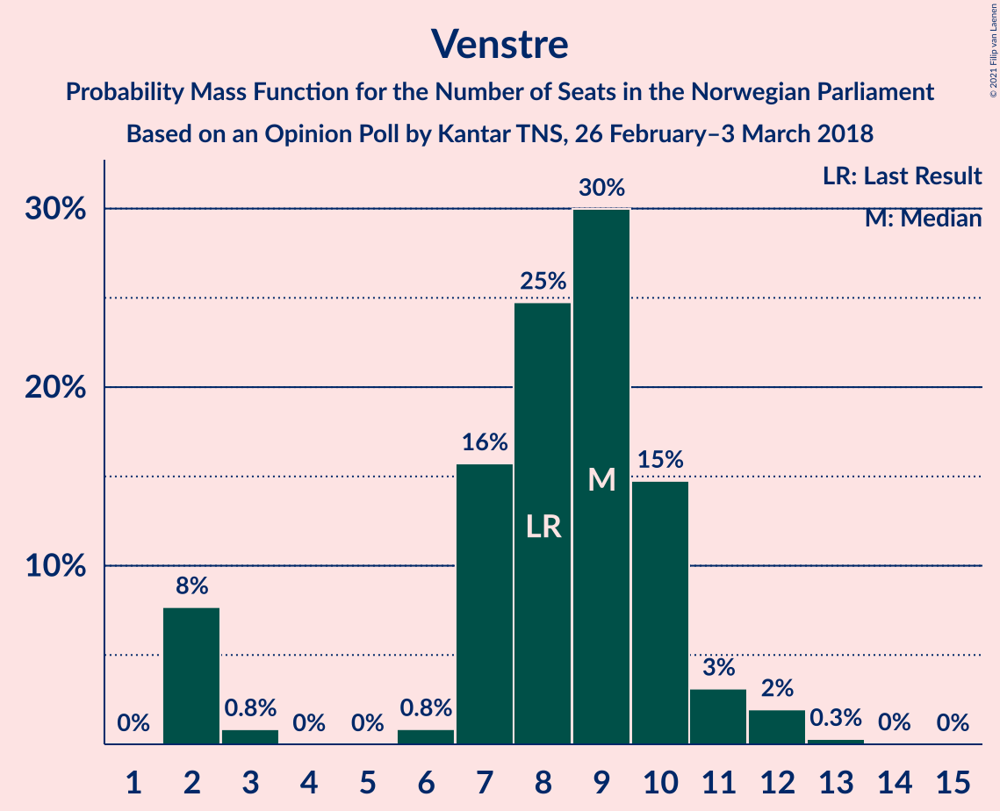

| Number of Seats | Probability | Accumulated | Special Marks |
|:---------------:|:-----------:|:-----------:|:-------------:|
| 2 | 8% | 100% |  |
| 3 | 0.8% | 92% |  |
| 4 | 0% | 91% |  |
| 5 | 0% | 91% |  |
| 6 | 0.8% | 91% |  |
| 7 | 16% | 91% |  |
| 8 | 25% | 75% | Last Result |
| 9 | 30% | 50% | Median |
| 10 | 15% | 20% |  |
| 11 | 3% | 5% |  |
| 12 | 2% | 2% |  |
| 13 | 0.3% | 0.4% |  |
| 14 | 0% | 0.1% |  |
| 15 | 0% | 0% |  |

### Kristelig Folkeparti

*For a full overview of the results for this party, see the [Kristelig Folkeparti](party-kristeligfolkeparti.html) page.*

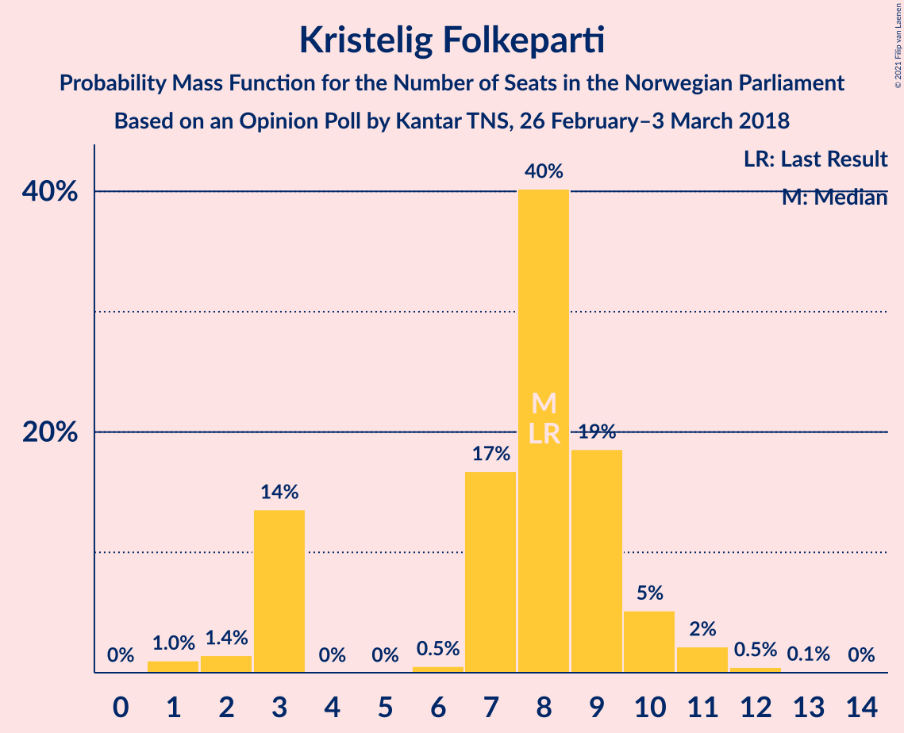

| Number of Seats | Probability | Accumulated | Special Marks |
|:---------------:|:-----------:|:-----------:|:-------------:|
| 1 | 1.0% | 100% |  |
| 2 | 1.4% | 99.0% |  |
| 3 | 14% | 98% |  |
| 4 | 0% | 84% |  |
| 5 | 0% | 84% |  |
| 6 | 0.5% | 84% |  |
| 7 | 17% | 83% |  |
| 8 | 40% | 67% | Last Result, Median |
| 9 | 19% | 26% |  |
| 10 | 5% | 8% |  |
| 11 | 2% | 3% |  |
| 12 | 0.5% | 0.6% |  |
| 13 | 0.1% | 0.1% |  |
| 14 | 0% | 0% |  |

### Rødt

*For a full overview of the results for this party, see the [Rødt](party-rødt.html) page.*

| Number of Seats | Probability | Accumulated | Special Marks |
|:---------------:|:-----------:|:-----------:|:-------------:|
| 1 | 4% | 100% | Last Result |
| 2 | 61% | 96% | Median |
| 3 | 0% | 35% |  |
| 4 | 0% | 35% |  |
| 5 | 0% | 35% |  |
| 6 | 1.5% | 35% |  |
| 7 | 20% | 34% |  |
| 8 | 9% | 14% |  |
| 9 | 3% | 4% |  |
| 10 | 1.3% | 1.5% |  |
| 11 | 0.1% | 0.2% |  |
| 12 | 0% | 0% |  |

### Miljøpartiet De Grønne

*For a full overview of the results for this party, see the [Miljøpartiet De Grønne](party-miljøpartietdegrønne.html) page.*

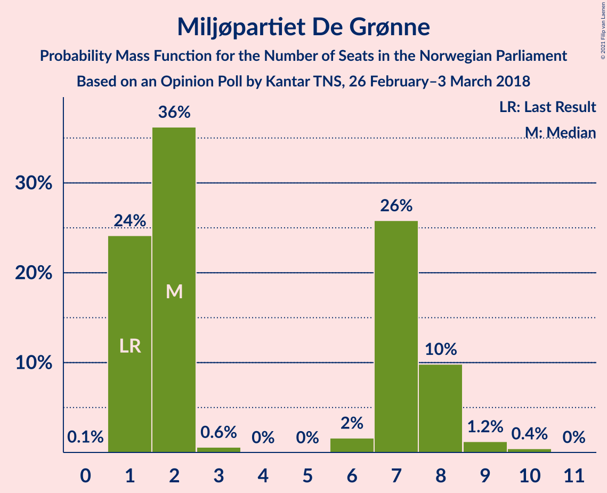

| Number of Seats | Probability | Accumulated | Special Marks |
|:---------------:|:-----------:|:-----------:|:-------------:|
| 0 | 0.1% | 100% |  |
| 1 | 24% | 99.9% | Last Result |
| 2 | 36% | 76% | Median |
| 3 | 0.6% | 40% |  |
| 4 | 0% | 39% |  |
| 5 | 0% | 39% |  |
| 6 | 2% | 39% |  |
| 7 | 26% | 37% |  |
| 8 | 10% | 12% |  |
| 9 | 1.2% | 2% |  |
| 10 | 0.4% | 0.5% |  |
| 11 | 0% | 0% |  |

## Coalitions

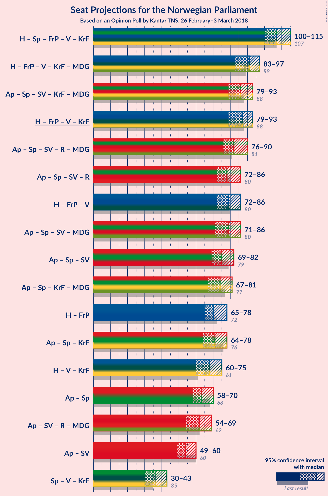

### Confidence Intervals

| Coalition | Last Result | Median | Majority? | 80% Confidence Interval | 90% Confidence Interval | 95% Confidence Interval | 99% Confidence Interval |
|:---------:|:-----------:|:------:|:---------:|:-----------------------:|:-----------------------:|:-----------------------:|:-----------------------:|
| Høyre – Senterpartiet – Fremskrittspartiet – Venstre – Kristelig Folkeparti | 107 | 107 | 100% | 103–112 | 101–114 | 100–115 | 97–117 |
| Høyre – Fremskrittspartiet – Venstre – Kristelig Folkeparti – Miljøpartiet De Grønne | 89 | 91 | 95% | 86–94 | 84–95 | 83–97 | 80–99 |
| Arbeiderpartiet – Senterpartiet – Sosialistisk Venstreparti – Kristelig Folkeparti – Miljøpartiet De Grønne | 88 | 86 | 68% | 81–91 | 79–92 | 79–93 | 76–96 |
| Høyre – Fremskrittspartiet – Venstre – Kristelig Folkeparti | 88 | 87 | 66% | 82–91 | 80–92 | 79–93 | 77–95 |
| Arbeiderpartiet – Senterpartiet – Sosialistisk Venstreparti – Rødt – Miljøpartiet De Grønne | 81 | 82 | 34% | 78–87 | 77–89 | 76–90 | 74–92 |
| Arbeiderpartiet – Senterpartiet – Sosialistisk Venstreparti – Rødt | 80 | 78 | 5% | 75–83 | 74–85 | 72–86 | 70–89 |
| Høyre – Fremskrittspartiet – Venstre | 80 | 79 | 6% | 75–83 | 73–85 | 72–86 | 70–88 |
| Arbeiderpartiet – Senterpartiet – Sosialistisk Venstreparti – Miljøpartiet De Grønne | 80 | 79 | 4% | 74–83 | 72–84 | 71–86 | 70–87 |
| Arbeiderpartiet – Senterpartiet – Sosialistisk Venstreparti | 79 | 75 | 0.6% | 70–79 | 69–81 | 69–82 | 67–85 |
| Arbeiderpartiet – Senterpartiet – Kristelig Folkeparti – Miljøpartiet De Grønne | 77 | 74 | 0.2% | 70–80 | 68–80 | 67–81 | 65–84 |
| Høyre – Fremskrittspartiet | 72 | 70 | 0% | 67–75 | 66–76 | 65–78 | 63–79 |
| Arbeiderpartiet – Senterpartiet – Kristelig Folkeparti | 76 | 71 | 0% | 66–74 | 65–76 | 64–78 | 62–80 |
| Høyre – Venstre – Kristelig Folkeparti | 61 | 68 | 0% | 63–72 | 62–74 | 60–75 | 58–76 |
| Arbeiderpartiet – Senterpartiet | 68 | 63 | 0% | 60–67 | 59–69 | 58–70 | 57–72 |
| Arbeiderpartiet – Sosialistisk Venstreparti – Rødt – Miljøpartiet De Grønne | 62 | 62 | 0% | 57–66 | 55–68 | 54–69 | 52–72 |
| Arbeiderpartiet – Sosialistisk Venstreparti | 60 | 54 | 0% | 51–58 | 50–59 | 49–60 | 46–61 |
| Senterpartiet – Venstre – Kristelig Folkeparti | 35 | 36 | 0% | 32–40 | 31–41 | 30–43 | 28–44 |

### Høyre – Senterpartiet – Fremskrittspartiet – Venstre – Kristelig Folkeparti

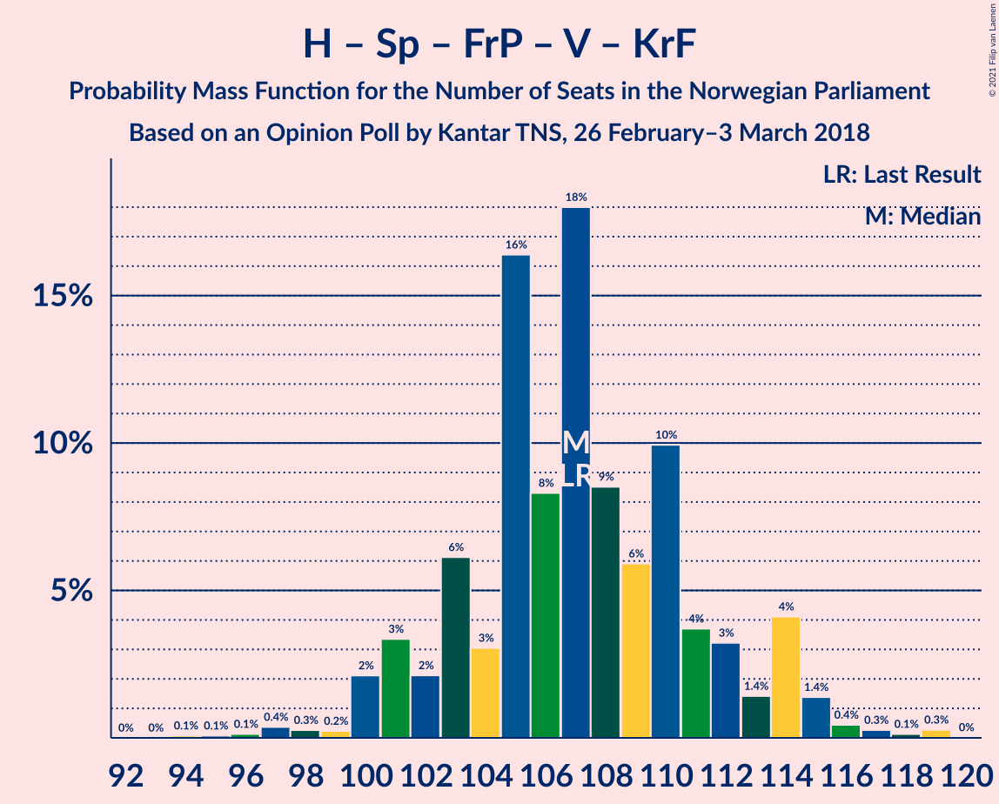

| Number of Seats | Probability | Accumulated | Special Marks |
|:---------------:|:-----------:|:-----------:|:-------------:|
| 94 | 0.1% | 100% |  |
| 95 | 0.1% | 99.9% |  |
| 96 | 0.1% | 99.8% |  |
| 97 | 0.4% | 99.7% |  |
| 98 | 0.3% | 99.3% |  |
| 99 | 0.2% | 99.1% |  |
| 100 | 2% | 98.8% |  |
| 101 | 3% | 97% |  |
| 102 | 2% | 93% |  |
| 103 | 6% | 91% |  |
| 104 | 3% | 85% |  |
| 105 | 16% | 82% |  |
| 106 | 8% | 66% |  |
| 107 | 18% | 57% | Last Result |
| 108 | 9% | 39% | Median |
| 109 | 6% | 31% |  |
| 110 | 10% | 25% |  |
| 111 | 4% | 15% |  |
| 112 | 3% | 11% |  |
| 113 | 1.4% | 8% |  |
| 114 | 4% | 7% |  |
| 115 | 1.4% | 3% |  |
| 116 | 0.4% | 1.1% |  |
| 117 | 0.3% | 0.7% |  |
| 118 | 0.1% | 0.4% |  |
| 119 | 0.3% | 0.3% |  |
| 120 | 0% | 0% |  |

### Høyre – Fremskrittspartiet – Venstre – Kristelig Folkeparti – Miljøpartiet De Grønne

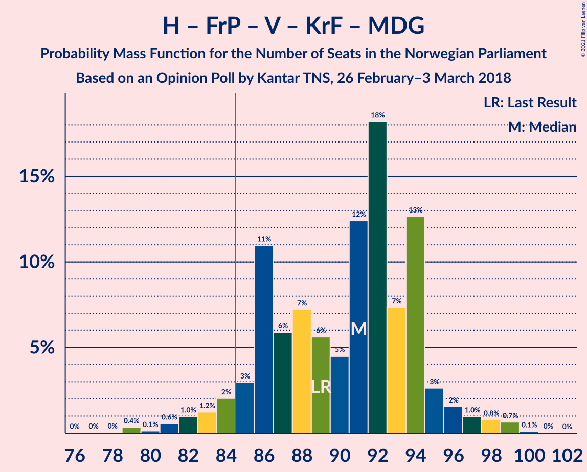

| Number of Seats | Probability | Accumulated | Special Marks |
|:---------------:|:-----------:|:-----------:|:-------------:|
| 77 | 0% | 100% |  |
| 78 | 0% | 99.9% |  |
| 79 | 0.4% | 99.9% |  |
| 80 | 0.1% | 99.5% |  |
| 81 | 0.6% | 99.4% |  |
| 82 | 1.0% | 98.8% |  |
| 83 | 1.2% | 98% |  |
| 84 | 2% | 97% |  |
| 85 | 3% | 95% | Majority |
| 86 | 11% | 92% |  |
| 87 | 6% | 81% |  |
| 88 | 7% | 75% |  |
| 89 | 6% | 68% | Last Result |
| 90 | 5% | 62% | Median |
| 91 | 12% | 57% |  |
| 92 | 18% | 45% |  |
| 93 | 7% | 27% |  |
| 94 | 13% | 19% |  |
| 95 | 3% | 7% |  |
| 96 | 2% | 4% |  |
| 97 | 1.0% | 3% |  |
| 98 | 0.8% | 2% |  |
| 99 | 0.7% | 0.8% |  |
| 100 | 0.1% | 0.2% |  |
| 101 | 0% | 0.1% |  |
| 102 | 0% | 0% |  |

### Arbeiderpartiet – Senterpartiet – Sosialistisk Venstreparti – Kristelig Folkeparti – Miljøpartiet De Grønne

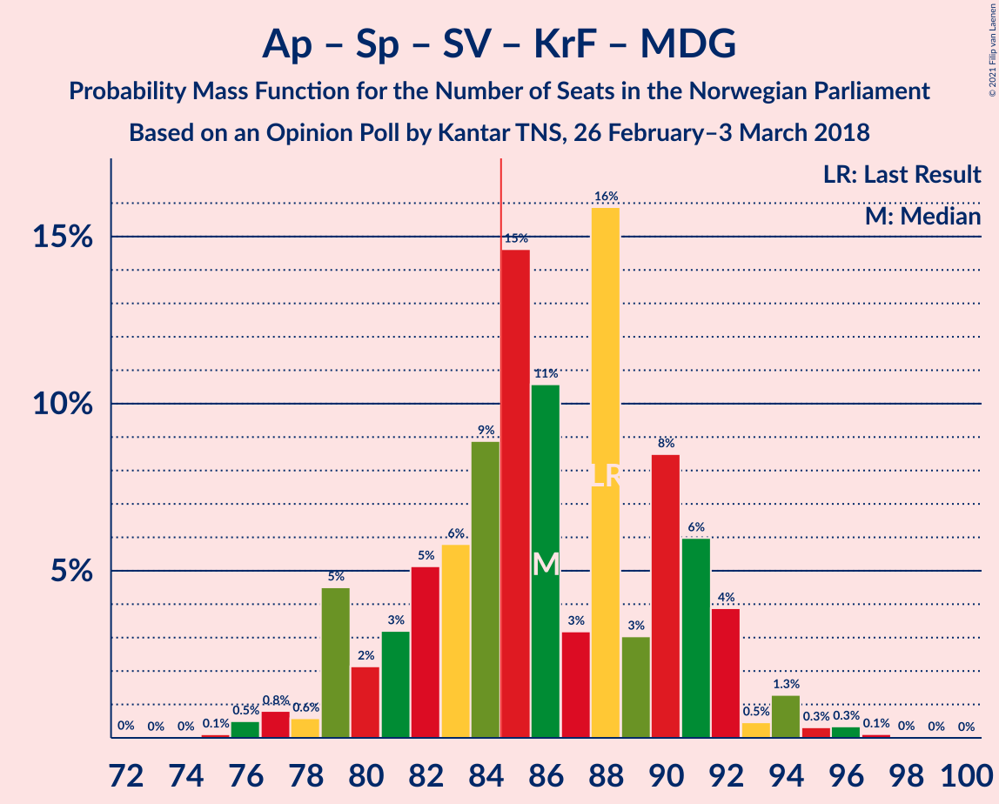

| Number of Seats | Probability | Accumulated | Special Marks |
|:---------------:|:-----------:|:-----------:|:-------------:|
| 72 | 0% | 100% |  |
| 73 | 0% | 99.9% |  |
| 74 | 0% | 99.9% |  |
| 75 | 0.1% | 99.9% |  |
| 76 | 0.5% | 99.8% |  |
| 77 | 0.8% | 99.3% |  |
| 78 | 0.6% | 98% |  |
| 79 | 5% | 98% |  |
| 80 | 2% | 93% |  |
| 81 | 3% | 91% |  |
| 82 | 5% | 88% |  |
| 83 | 6% | 83% |  |
| 84 | 9% | 77% | Median |
| 85 | 15% | 68% | Majority |
| 86 | 11% | 54% |  |
| 87 | 3% | 43% |  |
| 88 | 16% | 40% | Last Result |
| 89 | 3% | 24% |  |
| 90 | 8% | 21% |  |
| 91 | 6% | 12% |  |
| 92 | 4% | 6% |  |
| 93 | 0.5% | 3% |  |
| 94 | 1.3% | 2% |  |
| 95 | 0.3% | 0.8% |  |
| 96 | 0.3% | 0.5% |  |
| 97 | 0.1% | 0.2% |  |
| 98 | 0% | 0.1% |  |
| 99 | 0% | 0% |  |

### Høyre – Fremskrittspartiet – Venstre – Kristelig Folkeparti

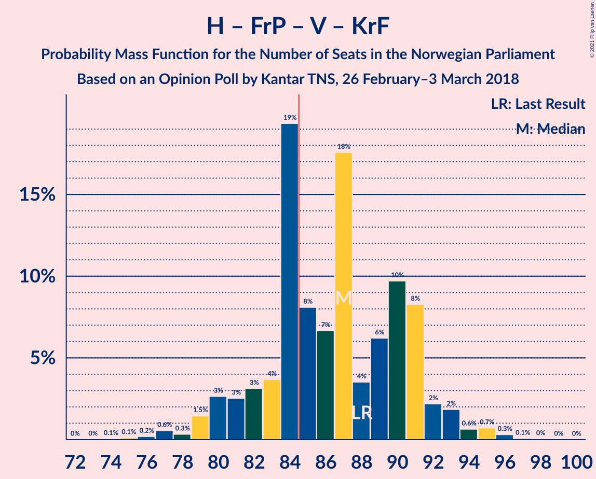

| Number of Seats | Probability | Accumulated | Special Marks |
|:---------------:|:-----------:|:-----------:|:-------------:|
| 73 | 0% | 100% |  |
| 74 | 0.1% | 99.9% |  |
| 75 | 0.1% | 99.9% |  |
| 76 | 0.2% | 99.8% |  |
| 77 | 0.6% | 99.6% |  |
| 78 | 0.3% | 99.0% |  |
| 79 | 1.5% | 98.7% |  |
| 80 | 3% | 97% |  |
| 81 | 3% | 95% |  |
| 82 | 3% | 92% |  |
| 83 | 4% | 89% |  |
| 84 | 19% | 85% |  |
| 85 | 8% | 66% | Majority |
| 86 | 7% | 58% |  |
| 87 | 18% | 51% |  |
| 88 | 4% | 34% | Last Result, Median |
| 89 | 6% | 30% |  |
| 90 | 10% | 24% |  |
| 91 | 8% | 14% |  |
| 92 | 2% | 6% |  |
| 93 | 2% | 4% |  |
| 94 | 0.6% | 2% |  |
| 95 | 0.7% | 1.2% |  |
| 96 | 0.3% | 0.5% |  |
| 97 | 0.1% | 0.1% |  |
| 98 | 0% | 0.1% |  |
| 99 | 0% | 0% |  |

### Arbeiderpartiet – Senterpartiet – Sosialistisk Venstreparti – Rødt – Miljøpartiet De Grønne

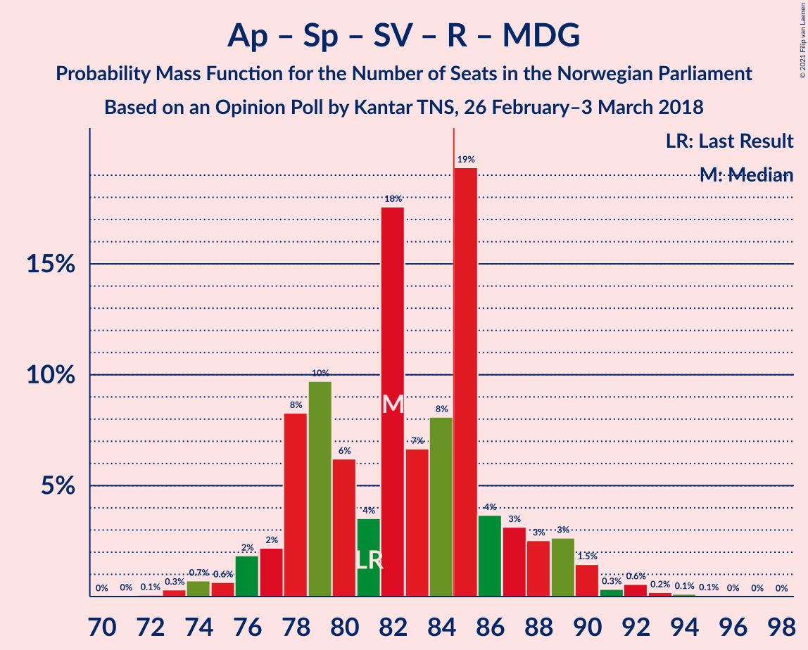

| Number of Seats | Probability | Accumulated | Special Marks |
|:---------------:|:-----------:|:-----------:|:-------------:|
| 71 | 0% | 100% |  |
| 72 | 0.1% | 99.9% |  |
| 73 | 0.3% | 99.9% |  |
| 74 | 0.7% | 99.5% |  |
| 75 | 0.6% | 98.8% |  |
| 76 | 2% | 98% |  |
| 77 | 2% | 96% |  |
| 78 | 8% | 94% | Median |
| 79 | 10% | 86% |  |
| 80 | 6% | 76% |  |
| 81 | 4% | 70% | Last Result |
| 82 | 18% | 66% |  |
| 83 | 7% | 49% |  |
| 84 | 8% | 42% |  |
| 85 | 19% | 34% | Majority |
| 86 | 4% | 15% |  |
| 87 | 3% | 11% |  |
| 88 | 3% | 8% |  |
| 89 | 3% | 5% |  |
| 90 | 1.5% | 3% |  |
| 91 | 0.3% | 1.3% |  |
| 92 | 0.6% | 1.0% |  |
| 93 | 0.2% | 0.4% |  |
| 94 | 0.1% | 0.2% |  |
| 95 | 0.1% | 0.1% |  |
| 96 | 0% | 0.1% |  |
| 97 | 0% | 0% |  |

### Arbeiderpartiet – Senterpartiet – Sosialistisk Venstreparti – Rødt

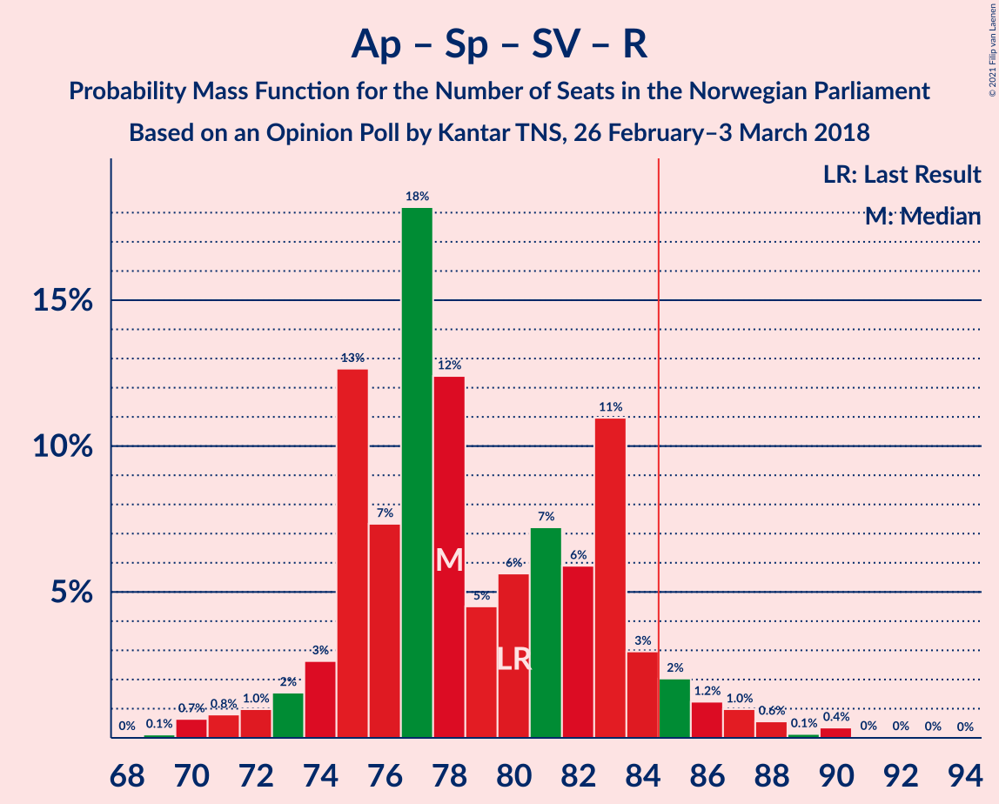

| Number of Seats | Probability | Accumulated | Special Marks |
|:---------------:|:-----------:|:-----------:|:-------------:|
| 68 | 0% | 100% |  |
| 69 | 0.1% | 99.9% |  |
| 70 | 0.7% | 99.8% |  |
| 71 | 0.8% | 99.2% |  |
| 72 | 1.0% | 98% |  |
| 73 | 2% | 97% |  |
| 74 | 3% | 96% |  |
| 75 | 13% | 93% |  |
| 76 | 7% | 81% | Median |
| 77 | 18% | 73% |  |
| 78 | 12% | 55% |  |
| 79 | 5% | 43% |  |
| 80 | 6% | 38% | Last Result |
| 81 | 7% | 32% |  |
| 82 | 6% | 25% |  |
| 83 | 11% | 19% |  |
| 84 | 3% | 8% |  |
| 85 | 2% | 5% | Majority |
| 86 | 1.2% | 3% |  |
| 87 | 1.0% | 2% |  |
| 88 | 0.6% | 1.2% |  |
| 89 | 0.1% | 0.6% |  |
| 90 | 0.4% | 0.5% |  |
| 91 | 0% | 0.1% |  |
| 92 | 0% | 0.1% |  |
| 93 | 0% | 0% |  |

### Høyre – Fremskrittspartiet – Venstre

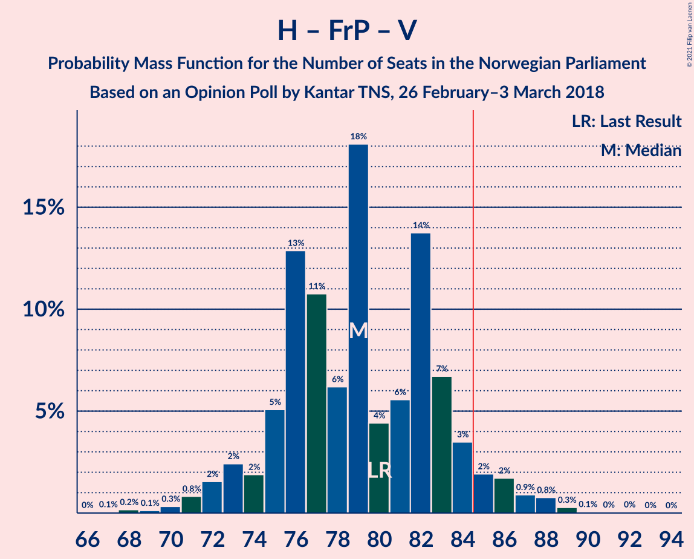

| Number of Seats | Probability | Accumulated | Special Marks |
|:---------------:|:-----------:|:-----------:|:-------------:|
| 67 | 0.1% | 100% |  |
| 68 | 0.2% | 99.9% |  |
| 69 | 0.1% | 99.7% |  |
| 70 | 0.3% | 99.6% |  |
| 71 | 0.8% | 99.3% |  |
| 72 | 2% | 98% |  |
| 73 | 2% | 97% |  |
| 74 | 2% | 95% |  |
| 75 | 5% | 93% |  |
| 76 | 13% | 88% |  |
| 77 | 11% | 75% |  |
| 78 | 6% | 64% |  |
| 79 | 18% | 58% |  |
| 80 | 4% | 40% | Last Result, Median |
| 81 | 6% | 35% |  |
| 82 | 14% | 30% |  |
| 83 | 7% | 16% |  |
| 84 | 3% | 9% |  |
| 85 | 2% | 6% | Majority |
| 86 | 2% | 4% |  |
| 87 | 0.9% | 2% |  |
| 88 | 0.8% | 1.2% |  |
| 89 | 0.3% | 0.4% |  |
| 90 | 0.1% | 0.2% |  |
| 91 | 0% | 0.1% |  |
| 92 | 0% | 0.1% |  |
| 93 | 0% | 0% |  |

### Arbeiderpartiet – Senterpartiet – Sosialistisk Venstreparti – Miljøpartiet De Grønne

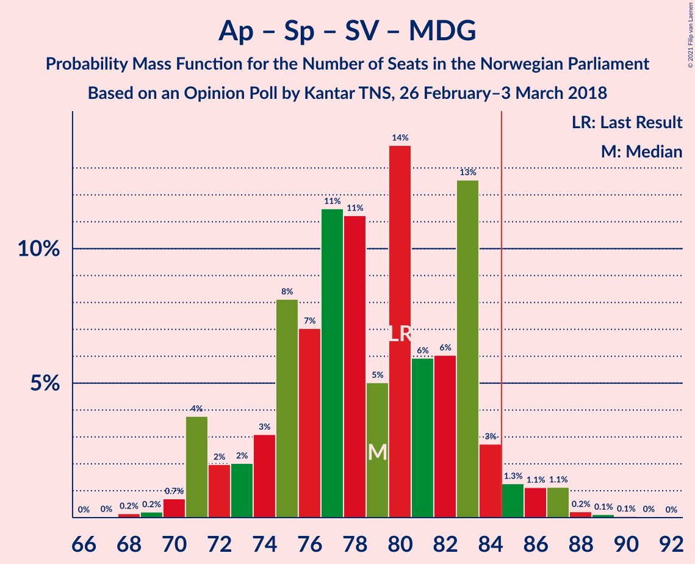

| Number of Seats | Probability | Accumulated | Special Marks |
|:---------------:|:-----------:|:-----------:|:-------------:|
| 67 | 0% | 100% |  |
| 68 | 0.2% | 99.9% |  |
| 69 | 0.2% | 99.8% |  |
| 70 | 0.7% | 99.6% |  |
| 71 | 4% | 98.9% |  |
| 72 | 2% | 95% |  |
| 73 | 2% | 93% |  |
| 74 | 3% | 91% |  |
| 75 | 8% | 88% |  |
| 76 | 7% | 80% | Median |
| 77 | 11% | 73% |  |
| 78 | 11% | 61% |  |
| 79 | 5% | 50% |  |
| 80 | 14% | 45% | Last Result |
| 81 | 6% | 31% |  |
| 82 | 6% | 25% |  |
| 83 | 13% | 19% |  |
| 84 | 3% | 7% |  |
| 85 | 1.3% | 4% | Majority |
| 86 | 1.1% | 3% |  |
| 87 | 1.1% | 2% |  |
| 88 | 0.2% | 0.5% |  |
| 89 | 0.1% | 0.2% |  |
| 90 | 0.1% | 0.1% |  |
| 91 | 0% | 0.1% |  |
| 92 | 0% | 0% |  |

### Arbeiderpartiet – Senterpartiet – Sosialistisk Venstreparti

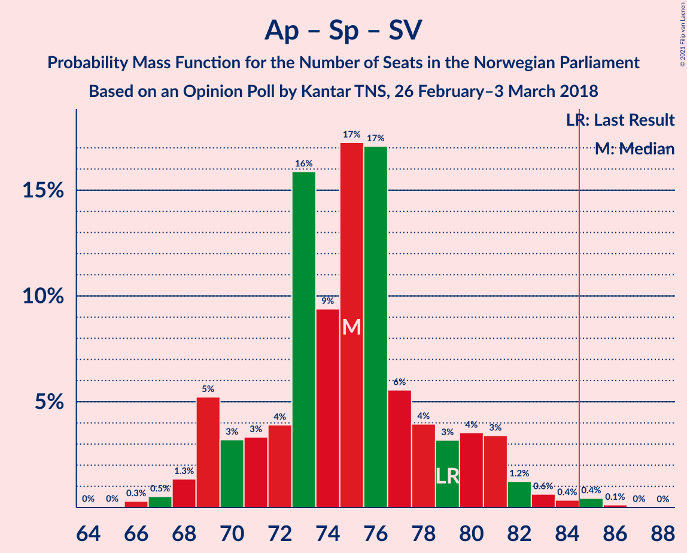

| Number of Seats | Probability | Accumulated | Special Marks |
|:---------------:|:-----------:|:-----------:|:-------------:|
| 64 | 0% | 100% |  |
| 65 | 0% | 99.9% |  |
| 66 | 0.3% | 99.9% |  |
| 67 | 0.5% | 99.6% |  |
| 68 | 1.3% | 99.1% |  |
| 69 | 5% | 98% |  |
| 70 | 3% | 93% |  |
| 71 | 3% | 89% |  |
| 72 | 4% | 86% |  |
| 73 | 16% | 82% |  |
| 74 | 9% | 66% | Median |
| 75 | 17% | 57% |  |
| 76 | 17% | 40% |  |
| 77 | 6% | 22% |  |
| 78 | 4% | 17% |  |
| 79 | 3% | 13% | Last Result |
| 80 | 4% | 10% |  |
| 81 | 3% | 6% |  |
| 82 | 1.2% | 3% |  |
| 83 | 0.6% | 2% |  |
| 84 | 0.4% | 1.0% |  |
| 85 | 0.4% | 0.6% | Majority |
| 86 | 0.1% | 0.2% |  |
| 87 | 0% | 0.1% |  |
| 88 | 0% | 0% |  |

### Arbeiderpartiet – Senterpartiet – Kristelig Folkeparti – Miljøpartiet De Grønne

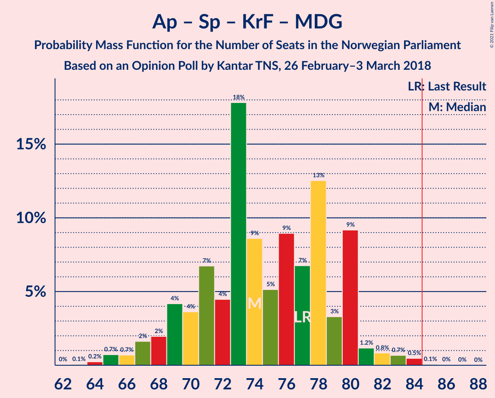

| Number of Seats | Probability | Accumulated | Special Marks |
|:---------------:|:-----------:|:-----------:|:-------------:|
| 62 | 0% | 100% |  |
| 63 | 0.1% | 99.9% |  |
| 64 | 0.2% | 99.8% |  |
| 65 | 0.7% | 99.6% |  |
| 66 | 0.7% | 98.9% |  |
| 67 | 2% | 98% |  |
| 68 | 2% | 97% |  |
| 69 | 4% | 95% |  |
| 70 | 4% | 90% |  |
| 71 | 7% | 87% |  |
| 72 | 4% | 80% |  |
| 73 | 18% | 76% | Median |
| 74 | 9% | 58% |  |
| 75 | 5% | 49% |  |
| 76 | 9% | 44% |  |
| 77 | 7% | 35% | Last Result |
| 78 | 13% | 28% |  |
| 79 | 3% | 16% |  |
| 80 | 9% | 12% |  |
| 81 | 1.2% | 3% |  |
| 82 | 0.8% | 2% |  |
| 83 | 0.7% | 1.3% |  |
| 84 | 0.5% | 0.6% |  |
| 85 | 0.1% | 0.2% | Majority |
| 86 | 0% | 0.1% |  |
| 87 | 0% | 0% |  |

### Høyre – Fremskrittspartiet

| Number of Seats | Probability | Accumulated | Special Marks |
|:---------------:|:-----------:|:-----------:|:-------------:|
| 60 | 0% | 100% |  |
| 61 | 0.1% | 99.9% |  |
| 62 | 0.2% | 99.8% |  |
| 63 | 0.5% | 99.6% |  |
| 64 | 1.1% | 99.2% |  |
| 65 | 2% | 98% |  |
| 66 | 4% | 96% |  |
| 67 | 3% | 92% |  |
| 68 | 12% | 89% |  |
| 69 | 14% | 77% |  |
| 70 | 14% | 63% |  |
| 71 | 7% | 50% | Median |
| 72 | 10% | 43% | Last Result |
| 73 | 6% | 33% |  |
| 74 | 14% | 27% |  |
| 75 | 6% | 13% |  |
| 76 | 2% | 7% |  |
| 77 | 2% | 5% |  |
| 78 | 2% | 3% |  |
| 79 | 1.0% | 2% |  |
| 80 | 0.2% | 0.5% |  |
| 81 | 0.1% | 0.3% |  |
| 82 | 0.1% | 0.2% |  |
| 83 | 0.1% | 0.1% |  |
| 84 | 0% | 0% |  |

### Arbeiderpartiet – Senterpartiet – Kristelig Folkeparti

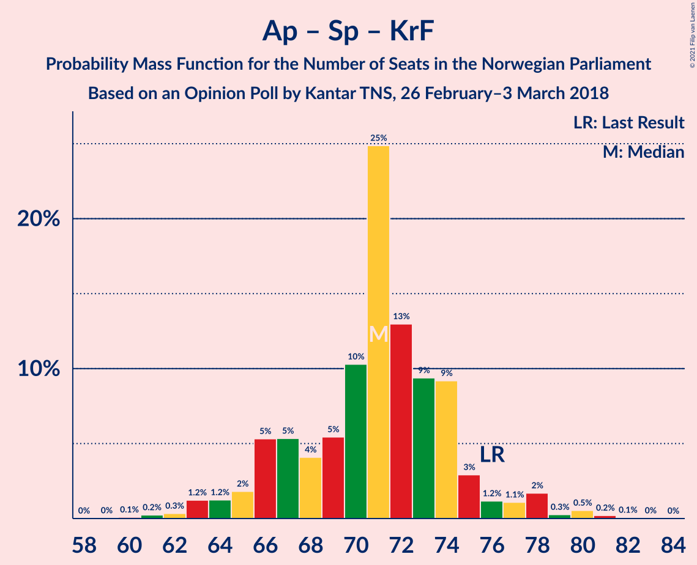

| Number of Seats | Probability | Accumulated | Special Marks |
|:---------------:|:-----------:|:-----------:|:-------------:|
| 59 | 0% | 100% |  |
| 60 | 0.1% | 99.9% |  |
| 61 | 0.2% | 99.8% |  |
| 62 | 0.3% | 99.6% |  |
| 63 | 1.2% | 99.3% |  |
| 64 | 1.2% | 98% |  |
| 65 | 2% | 97% |  |
| 66 | 5% | 95% |  |
| 67 | 5% | 90% |  |
| 68 | 4% | 84% |  |
| 69 | 5% | 80% |  |
| 70 | 10% | 75% |  |
| 71 | 25% | 64% | Median |
| 72 | 13% | 40% |  |
| 73 | 9% | 27% |  |
| 74 | 9% | 17% |  |
| 75 | 3% | 8% |  |
| 76 | 1.2% | 5% | Last Result |
| 77 | 1.1% | 4% |  |
| 78 | 2% | 3% |  |
| 79 | 0.3% | 1.1% |  |
| 80 | 0.5% | 0.9% |  |
| 81 | 0.2% | 0.3% |  |
| 82 | 0.1% | 0.1% |  |
| 83 | 0% | 0% |  |

### Høyre – Venstre – Kristelig Folkeparti

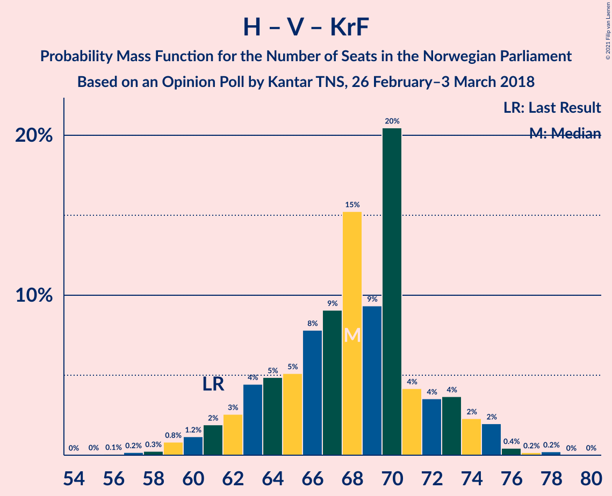

| Number of Seats | Probability | Accumulated | Special Marks |
|:---------------:|:-----------:|:-----------:|:-------------:|
| 54 | 0% | 100% |  |
| 55 | 0% | 99.9% |  |
| 56 | 0.1% | 99.9% |  |
| 57 | 0.2% | 99.8% |  |
| 58 | 0.3% | 99.7% |  |
| 59 | 0.8% | 99.4% |  |
| 60 | 1.2% | 98.6% |  |
| 61 | 2% | 97% | Last Result |
| 62 | 3% | 96% |  |
| 63 | 4% | 93% |  |
| 64 | 5% | 88% |  |
| 65 | 5% | 84% |  |
| 66 | 8% | 79% |  |
| 67 | 9% | 71% |  |
| 68 | 15% | 62% |  |
| 69 | 9% | 46% |  |
| 70 | 20% | 37% | Median |
| 71 | 4% | 17% |  |
| 72 | 4% | 12% |  |
| 73 | 4% | 9% |  |
| 74 | 2% | 5% |  |
| 75 | 2% | 3% |  |
| 76 | 0.4% | 0.9% |  |
| 77 | 0.2% | 0.5% |  |
| 78 | 0.2% | 0.3% |  |
| 79 | 0% | 0.1% |  |
| 80 | 0% | 0% |  |

### Arbeiderpartiet – Senterpartiet

| Number of Seats | Probability | Accumulated | Special Marks |
|:---------------:|:-----------:|:-----------:|:-------------:|
| 54 | 0% | 100% |  |
| 55 | 0.1% | 99.9% |  |
| 56 | 0.3% | 99.8% |  |
| 57 | 1.3% | 99.5% |  |
| 58 | 2% | 98% |  |
| 59 | 6% | 96% |  |
| 60 | 4% | 90% |  |
| 61 | 6% | 86% |  |
| 62 | 8% | 81% |  |
| 63 | 28% | 73% | Median |
| 64 | 14% | 45% |  |
| 65 | 11% | 31% |  |
| 66 | 9% | 21% |  |
| 67 | 4% | 11% |  |
| 68 | 2% | 7% | Last Result |
| 69 | 2% | 5% |  |
| 70 | 1.3% | 3% |  |
| 71 | 0.6% | 1.5% |  |
| 72 | 0.7% | 0.9% |  |
| 73 | 0.2% | 0.2% |  |
| 74 | 0% | 0.1% |  |
| 75 | 0% | 0% |  |

### Arbeiderpartiet – Sosialistisk Venstreparti – Rødt – Miljøpartiet De Grønne

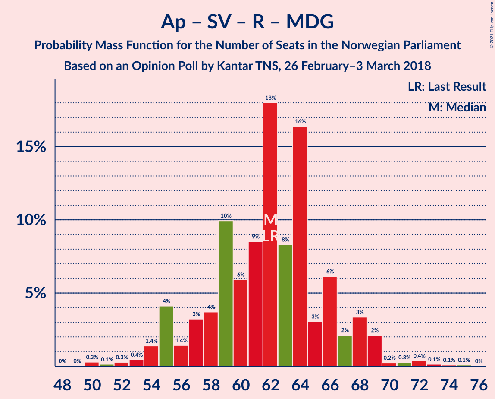

| Number of Seats | Probability | Accumulated | Special Marks |
|:---------------:|:-----------:|:-----------:|:-------------:|
| 50 | 0.3% | 100% |  |
| 51 | 0.1% | 99.7% |  |
| 52 | 0.3% | 99.6% |  |
| 53 | 0.4% | 99.3% |  |
| 54 | 1.4% | 98.9% |  |
| 55 | 4% | 97% |  |
| 56 | 1.4% | 93% |  |
| 57 | 3% | 92% |  |
| 58 | 4% | 89% | Median |
| 59 | 10% | 85% |  |
| 60 | 6% | 75% |  |
| 61 | 9% | 69% |  |
| 62 | 18% | 61% | Last Result |
| 63 | 8% | 43% |  |
| 64 | 16% | 34% |  |
| 65 | 3% | 18% |  |
| 66 | 6% | 15% |  |
| 67 | 2% | 9% |  |
| 68 | 3% | 7% |  |
| 69 | 2% | 3% |  |
| 70 | 0.2% | 1.2% |  |
| 71 | 0.3% | 0.9% |  |
| 72 | 0.4% | 0.7% |  |
| 73 | 0.1% | 0.3% |  |
| 74 | 0.1% | 0.2% |  |
| 75 | 0.1% | 0.1% |  |
| 76 | 0% | 0% |  |

### Arbeiderpartiet – Sosialistisk Venstreparti

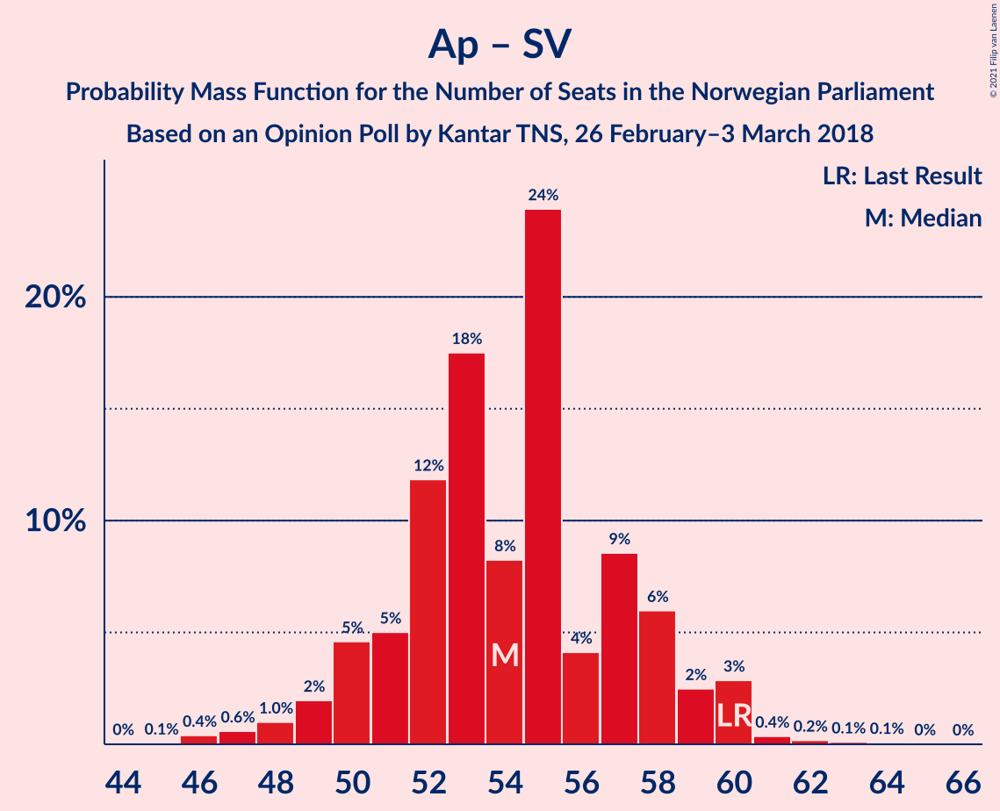

| Number of Seats | Probability | Accumulated | Special Marks |
|:---------------:|:-----------:|:-----------:|:-------------:|
| 44 | 0% | 100% |  |
| 45 | 0.1% | 99.9% |  |
| 46 | 0.4% | 99.9% |  |
| 47 | 0.6% | 99.5% |  |
| 48 | 1.0% | 98.9% |  |
| 49 | 2% | 98% |  |
| 50 | 5% | 96% |  |
| 51 | 5% | 91% |  |
| 52 | 12% | 86% |  |
| 53 | 18% | 74% |  |
| 54 | 8% | 57% | Median |
| 55 | 24% | 49% |  |
| 56 | 4% | 25% |  |
| 57 | 9% | 21% |  |
| 58 | 6% | 12% |  |
| 59 | 2% | 6% |  |
| 60 | 3% | 4% | Last Result |
| 61 | 0.4% | 0.8% |  |
| 62 | 0.2% | 0.4% |  |
| 63 | 0.1% | 0.2% |  |
| 64 | 0.1% | 0.1% |  |
| 65 | 0% | 0% |  |

### Senterpartiet – Venstre – Kristelig Folkeparti

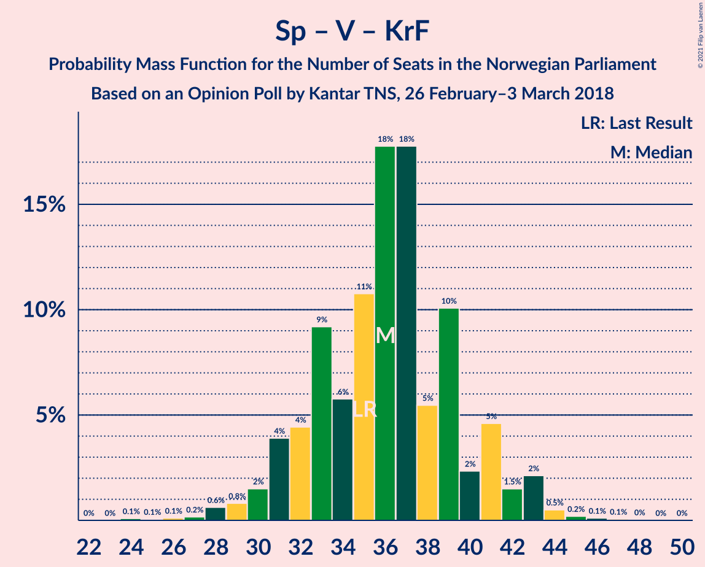

| Number of Seats | Probability | Accumulated | Special Marks |
|:---------------:|:-----------:|:-----------:|:-------------:|
| 24 | 0.1% | 100% |  |
| 25 | 0.1% | 99.9% |  |
| 26 | 0.1% | 99.8% |  |
| 27 | 0.2% | 99.7% |  |
| 28 | 0.6% | 99.6% |  |
| 29 | 0.8% | 98.9% |  |
| 30 | 2% | 98% |  |
| 31 | 4% | 97% |  |
| 32 | 4% | 93% |  |
| 33 | 9% | 88% |  |
| 34 | 6% | 79% |  |
| 35 | 11% | 73% | Last Result |
| 36 | 18% | 63% |  |
| 37 | 18% | 45% | Median |
| 38 | 5% | 27% |  |
| 39 | 10% | 22% |  |
| 40 | 2% | 11% |  |
| 41 | 5% | 9% |  |
| 42 | 1.5% | 5% |  |
| 43 | 2% | 3% |  |
| 44 | 0.5% | 0.9% |  |
| 45 | 0.2% | 0.4% |  |
| 46 | 0.1% | 0.2% |  |
| 47 | 0.1% | 0.1% |  |
| 48 | 0% | 0.1% |  |
| 49 | 0% | 0% |  |

## Technical Information

### Opinion Poll

+ **Polling firm:** Kantar TNS
+ **Commissioner(s):** —
+ **Fieldwork period:** 26 February–3 March 2018

### Calculations

+ **Sample size:** 812
+ **Simulations done:** 1,048,576
+ **Error estimate:** 2.15%

